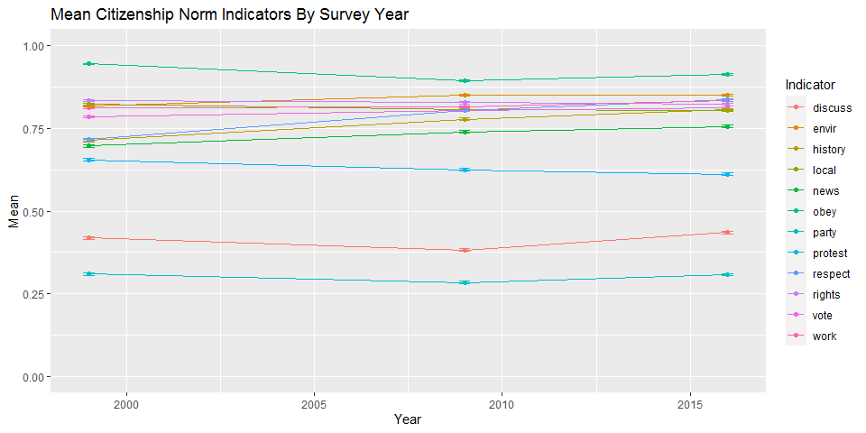
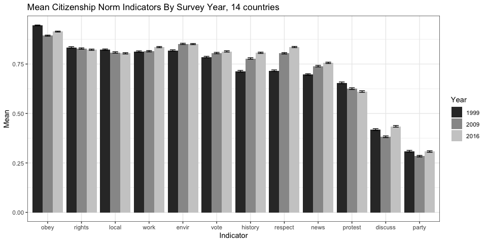
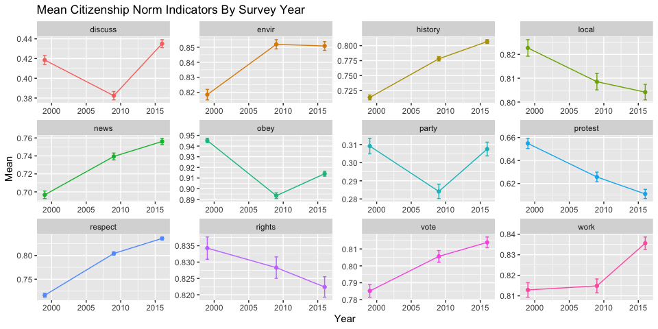
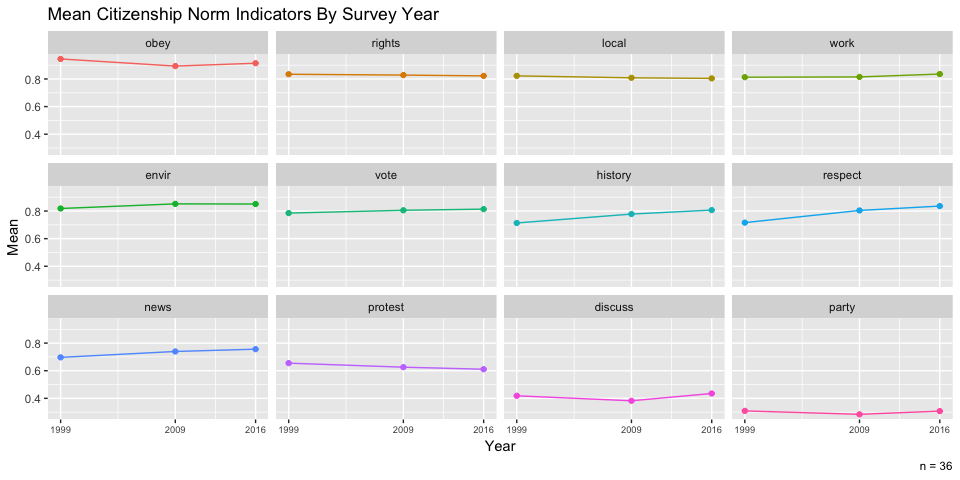
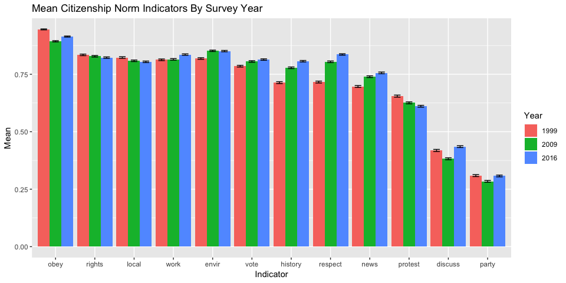
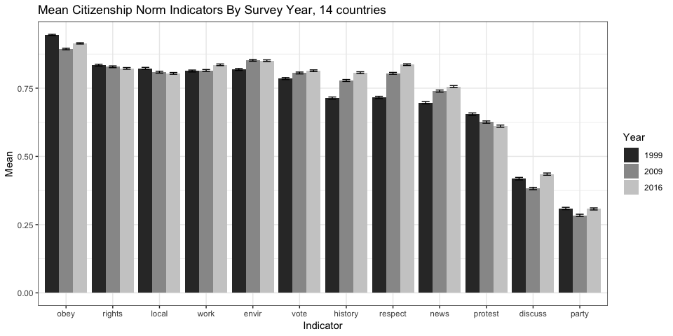

Citizenship Norms 1999-2009-2016
================
Jennifer Oser
April, 2020

``` r
library(tidyverse)
```

    ## -- Attaching packages ------------------------------------------------- tidyverse 1.3.0 --

    ## v ggplot2 3.3.0     v purrr   0.3.3
    ## v tibble  2.1.3     v dplyr   0.8.5
    ## v tidyr   1.0.2     v stringr 1.4.0
    ## v readr   1.3.1     v forcats 0.5.0

    ## -- Conflicts ---------------------------------------------------- tidyverse_conflicts() --
    ## x dplyr::filter() masks stats::filter()
    ## x dplyr::lag()    masks stats::lag()

``` r
library(readr)
library(purrr)
library(writexl)
```

## Introduction

This file documents the data cleaning for the IEA 1999-2009-2016 data

For citizenship norm recodes in all three survey waves, the norms are
coded in the descending mean order of the 1999 data:
obey,rights,local,work,envir,vote,history,respect,news,protest,discuss,party

## 1999 data loading and merging

1999 data: <https://doi.org/10.3886/ICPSR21661.v3> Downloaded Jan 17,
2019 Title: IEA Civic Education Study, 1999: Civic Knowledge and
Engagement Among 14-Year-Olds in 23 European Countries, 2 Latin American
Countries, Hong Kong, Australia, and the United States (ICPSR 21661)

Load 1999 country files, in chronological order of file names. Bind all
1999 files. Total observations of resulting tbl1 (93,882) concur with
xls documentation of expected total n.

``` r
# all files
files <- list.files("../data", full.names = TRUE)

# helper function to load files
load_files <- function(file) {
  e <- new.env()
  load(file, envir = e)
  
  stopifnot(length(e) == 1)  # safety first
  
  get(names(e)[1], envir = e)
}

tbl1 <- files %>%
  magrittr::extract(1:28) %>%      # filter to 1999 files only
  map(~ .x %>%
        load_files() %>%
        select(COUNTRY, IDCNTRY, IDSTUD, BS3B1, BS3B11, BS3B9, BS3B4, BS3B13,
               BS3B2, BS3B6, BS3B10, BS3B8, BS3B5, BS3B12, BS3B3, GENDER,BSGBOOK, EXPEDUC, BSGEDUM, BSGEDUF, TOTWGT)) %>% 
  reduce(rbind) %>% 
  as_tibble() %>% 
  mutate(`ICCS_year` = 1999) %>%     # add survey year variable
  select(`ICCS_year`, everything())

tbl1 <- tbl1 %>%
    mutate_if(is.factor, fct_explicit_na)
```

View variables

``` r
head(tbl1) %>% View
```

Cit norm, count all indicators to begin recode.

``` r
original_vars <- tbl1 %>% 
  select(BS3B1, BS3B11, BS3B9, BS3B4, BS3B13, BS3B2, BS3B6, BS3B10, BS3B8, BS3B5, BS3B12, BS3B3) %>% 
  colnames() 

original_vars %>% 
  map(~ tbl1 %>% count(!!sym(.x))) 
```

    ## [[1]]
    ## # A tibble: 5 x 2
    ##   BS3B1                        n
    ##   <fct>                    <int>
    ## 1 (1) not important         1995
    ## 2 (2) somewhat unimportant  2418
    ## 3 (3) somewhat important   20211
    ## 4 (4) very important       66431
    ## 5 (Missing)                 2827
    ## 
    ## [[2]]
    ## # A tibble: 5 x 2
    ##   BS3B11                       n
    ##   <fct>                    <int>
    ## 1 (1) not important         2975
    ## 2 (2) somewhat unimportant 10785
    ## 3 (3) somewhat important   35630
    ## 4 (4) very important       38503
    ## 5 (Missing)                 5989
    ## 
    ## [[3]]
    ## # A tibble: 5 x 2
    ##   BS3B9                        n
    ##   <fct>                    <int>
    ## 1 (1) not important         2986
    ## 2 (2) somewhat unimportant 11726
    ## 3 (3) somewhat important   42796
    ## 4 (4) very important       31396
    ## 5 (Missing)                 4978
    ## 
    ## [[4]]
    ## # A tibble: 5 x 2
    ##   BS3B4                        n
    ##   <fct>                    <int>
    ## 1 (1) not important         5447
    ## 2 (2) somewhat unimportant 11830
    ## 3 (3) somewhat important   35762
    ## 4 (4) very important       35769
    ## 5 (Missing)                 5074
    ## 
    ## [[5]]
    ## # A tibble: 5 x 2
    ##   BS3B13                       n
    ##   <fct>                    <int>
    ## 1 (1) not important         4064
    ## 2 (2) somewhat unimportant 12865
    ## 3 (3) somewhat important   36910
    ## 4 (4) very important       35383
    ## 5 (Missing)                 4660
    ## 
    ## [[6]]
    ## # A tibble: 5 x 2
    ##   BS3B2                        n
    ##   <fct>                    <int>
    ## 1 (1) not important         4566
    ## 2 (2) somewhat unimportant 13382
    ## 3 (3) somewhat important   37364
    ## 4 (4) very important       35023
    ## 5 (Missing)                 3547
    ## 
    ## [[7]]
    ## # A tibble: 5 x 2
    ##   BS3B6                        n
    ##   <fct>                    <int>
    ## 1 (1) not important         7861
    ## 2 (2) somewhat unimportant 17428
    ## 3 (3) somewhat important   32388
    ## 4 (4) very important       31589
    ## 5 (Missing)                 4616
    ## 
    ## [[8]]
    ## # A tibble: 5 x 2
    ##   BS3B10                       n
    ##   <fct>                    <int>
    ## 1 (1) not important         6109
    ## 2 (2) somewhat unimportant 18138
    ## 3 (3) somewhat important   40898
    ## 4 (4) very important       22579
    ## 5 (Missing)                 6158
    ## 
    ## [[9]]
    ## # A tibble: 5 x 2
    ##   BS3B8                        n
    ##   <fct>                    <int>
    ## 1 (1) not important         7319
    ## 2 (2) somewhat unimportant 18421
    ## 3 (3) somewhat important   42831
    ## 4 (4) very important       20869
    ## 5 (Missing)                 4442
    ## 
    ## [[10]]
    ## # A tibble: 5 x 2
    ##   BS3B5                        n
    ##   <fct>                    <int>
    ## 1 (1) not important         8941
    ## 2 (2) somewhat unimportant 18358
    ## 3 (3) somewhat important   34180
    ## 4 (4) very important       22693
    ## 5 (Missing)                 9710
    ## 
    ## [[11]]
    ## # A tibble: 5 x 2
    ##   BS3B12                       n
    ##   <fct>                    <int>
    ## 1 (1) not importnat        13954
    ## 2 (2) somewhat unimportant 34883
    ## 3 (3) somewhat important   28004
    ## 4 (4) very important        8959
    ## 5 (Missing)                 8082
    ## 
    ## [[12]]
    ## # A tibble: 5 x 2
    ##   BS3B3                        n
    ##   <fct>                    <int>
    ## 1 (1) not important        23205
    ## 2 (2) somewhat unimportant 36163
    ## 3 (3) somewhat important   19853
    ## 4 (4) very important        6741
    ## 5 (Missing)                 7920

Cit norm, count and recode 1st indicator as example.

``` r
# recode
tbl1 <- tbl1 %>% 
  mutate(BS3B1_binary = fct_collapse(BS3B1, 
  "not important" = c("(1) not important", "(2) somewhat unimportant"),
  "important"     = c("(3) somewhat important", "(4) very important")))

# confirm correct recode
tbl1 %>%
  count(BS3B1, BS3B1_binary) 
```

    ## # A tibble: 5 x 3
    ##   BS3B1                    BS3B1_binary      n
    ##   <fct>                    <fct>         <int>
    ## 1 (1) not important        not important  1995
    ## 2 (2) somewhat unimportant not important  2418
    ## 3 (3) somewhat important   important     20211
    ## 4 (4) very important       important     66431
    ## 5 (Missing)                (Missing)      2827

Repeat for all cit norm indicators. NOTE: BS3B12 recoded separately
below b/c of typo in string variable.

``` r
tbl1 <-tbl1 %>% 
  mutate_at(vars(BS3B1, BS3B11, BS3B9, BS3B4, BS3B13, BS3B2, BS3B6, BS3B10, BS3B8, BS3B5, BS3B3),
            funs(bin = fct_collapse(.,
                                    "not important"= c("(1) not important", "(2) somewhat unimportant"),
                                    "important"    = c("(3) somewhat important", "(4) very important")))
  )
```

    ## Warning: funs() is soft deprecated as of dplyr 0.8.0
    ## Please use a list of either functions or lambdas: 
    ## 
    ##   # Simple named list: 
    ##   list(mean = mean, median = median)
    ## 
    ##   # Auto named with `tibble::lst()`: 
    ##   tibble::lst(mean, median)
    ## 
    ##   # Using lambdas
    ##   list(~ mean(., trim = .2), ~ median(., na.rm = TRUE))
    ## This warning is displayed once per session.

BS3B12 error troubleshoot when included in prior chunk. Count table
output shows that string text of 1st category “importnat” spelled
incorrectly, i.e. “a” and “n” transposed. BS3B12 “mutate” command to
correctly recode with this typo:

``` r
# troubleshoot
tbl1 %>% count(BS3B12) 
```

    ## # A tibble: 5 x 2
    ##   BS3B12                       n
    ##   <fct>                    <int>
    ## 1 (1) not importnat        13954
    ## 2 (2) somewhat unimportant 34883
    ## 3 (3) somewhat important   28004
    ## 4 (4) very important        8959
    ## 5 (Missing)                 8082

``` r
# recode
tbl1 <- tbl1 %>% 
  mutate(BS3B12_bin = fct_collapse(BS3B12, 
                                   "not important" = c("(1) not importnat", "(2) somewhat unimportant"),
                                   "important"     = c("(3) somewhat important", "(4) very important"))
  )
```

Confirm successful mutates for all cit norms indicators.

``` r
bin_vars <- original_vars %>% 
  paste0("_bin")

map2(original_vars, bin_vars, ~ tbl1 %>% count(!!sym(.x), !!sym(.y)))
```

    ## [[1]]
    ## # A tibble: 5 x 3
    ##   BS3B1                    BS3B1_bin         n
    ##   <fct>                    <fct>         <int>
    ## 1 (1) not important        not important  1995
    ## 2 (2) somewhat unimportant not important  2418
    ## 3 (3) somewhat important   important     20211
    ## 4 (4) very important       important     66431
    ## 5 (Missing)                (Missing)      2827
    ## 
    ## [[2]]
    ## # A tibble: 5 x 3
    ##   BS3B11                   BS3B11_bin        n
    ##   <fct>                    <fct>         <int>
    ## 1 (1) not important        not important  2975
    ## 2 (2) somewhat unimportant not important 10785
    ## 3 (3) somewhat important   important     35630
    ## 4 (4) very important       important     38503
    ## 5 (Missing)                (Missing)      5989
    ## 
    ## [[3]]
    ## # A tibble: 5 x 3
    ##   BS3B9                    BS3B9_bin         n
    ##   <fct>                    <fct>         <int>
    ## 1 (1) not important        not important  2986
    ## 2 (2) somewhat unimportant not important 11726
    ## 3 (3) somewhat important   important     42796
    ## 4 (4) very important       important     31396
    ## 5 (Missing)                (Missing)      4978
    ## 
    ## [[4]]
    ## # A tibble: 5 x 3
    ##   BS3B4                    BS3B4_bin         n
    ##   <fct>                    <fct>         <int>
    ## 1 (1) not important        not important  5447
    ## 2 (2) somewhat unimportant not important 11830
    ## 3 (3) somewhat important   important     35762
    ## 4 (4) very important       important     35769
    ## 5 (Missing)                (Missing)      5074
    ## 
    ## [[5]]
    ## # A tibble: 5 x 3
    ##   BS3B13                   BS3B13_bin        n
    ##   <fct>                    <fct>         <int>
    ## 1 (1) not important        not important  4064
    ## 2 (2) somewhat unimportant not important 12865
    ## 3 (3) somewhat important   important     36910
    ## 4 (4) very important       important     35383
    ## 5 (Missing)                (Missing)      4660
    ## 
    ## [[6]]
    ## # A tibble: 5 x 3
    ##   BS3B2                    BS3B2_bin         n
    ##   <fct>                    <fct>         <int>
    ## 1 (1) not important        not important  4566
    ## 2 (2) somewhat unimportant not important 13382
    ## 3 (3) somewhat important   important     37364
    ## 4 (4) very important       important     35023
    ## 5 (Missing)                (Missing)      3547
    ## 
    ## [[7]]
    ## # A tibble: 5 x 3
    ##   BS3B6                    BS3B6_bin         n
    ##   <fct>                    <fct>         <int>
    ## 1 (1) not important        not important  7861
    ## 2 (2) somewhat unimportant not important 17428
    ## 3 (3) somewhat important   important     32388
    ## 4 (4) very important       important     31589
    ## 5 (Missing)                (Missing)      4616
    ## 
    ## [[8]]
    ## # A tibble: 5 x 3
    ##   BS3B10                   BS3B10_bin        n
    ##   <fct>                    <fct>         <int>
    ## 1 (1) not important        not important  6109
    ## 2 (2) somewhat unimportant not important 18138
    ## 3 (3) somewhat important   important     40898
    ## 4 (4) very important       important     22579
    ## 5 (Missing)                (Missing)      6158
    ## 
    ## [[9]]
    ## # A tibble: 5 x 3
    ##   BS3B8                    BS3B8_bin         n
    ##   <fct>                    <fct>         <int>
    ## 1 (1) not important        not important  7319
    ## 2 (2) somewhat unimportant not important 18421
    ## 3 (3) somewhat important   important     42831
    ## 4 (4) very important       important     20869
    ## 5 (Missing)                (Missing)      4442
    ## 
    ## [[10]]
    ## # A tibble: 5 x 3
    ##   BS3B5                    BS3B5_bin         n
    ##   <fct>                    <fct>         <int>
    ## 1 (1) not important        not important  8941
    ## 2 (2) somewhat unimportant not important 18358
    ## 3 (3) somewhat important   important     34180
    ## 4 (4) very important       important     22693
    ## 5 (Missing)                (Missing)      9710
    ## 
    ## [[11]]
    ## # A tibble: 5 x 3
    ##   BS3B12                   BS3B12_bin        n
    ##   <fct>                    <fct>         <int>
    ## 1 (1) not importnat        not important 13954
    ## 2 (2) somewhat unimportant not important 34883
    ## 3 (3) somewhat important   important     28004
    ## 4 (4) very important       important      8959
    ## 5 (Missing)                (Missing)      8082
    ## 
    ## [[12]]
    ## # A tibble: 5 x 3
    ##   BS3B3                    BS3B3_bin         n
    ##   <fct>                    <fct>         <int>
    ## 1 (1) not important        not important 23205
    ## 2 (2) somewhat unimportant not important 36163
    ## 3 (3) somewhat important   important     19853
    ## 4 (4) very important       important      6741
    ## 5 (Missing)                (Missing)      7920

Recode of individual-level control vars

``` r
tbl1 <- tbl1 %>% 
  mutate(female = ifelse(GENDER == "(0) Male", 0, 1),    # gender
         books = case_when(                              # books in respondent's home
           BSGBOOK == "(1) None"          ~ 0,
           BSGBOOK == "(2) 1 - 10"        ~ 0,
           BSGBOOK == "(3) 11 - 50"       ~ 1,
           BSGBOOK == "(4) 51 - 100"      ~ 1,
           BSGBOOK == "(5) 101 - 200"     ~ 2,
           BSGBOOK == "(6) More than 200" ~ 3
         ),
         edexp = case_when(                              # expected number of additional educ years
           EXPEDUC == "(0) 0"    ~ 0,
           EXPEDUC == "(1) 1-2"  ~ 0,
           EXPEDUC == "(2) 3-4"  ~ 0,
           EXPEDUC == "(3) 5-6"  ~ 1,
           EXPEDUC == "(4) 7-8"  ~ 1,
           EXPEDUC == "(5) 9-10" ~ 2,
           EXPEDUC == "(6) 10+"  ~ 2
         ),
         ed_mom = case_when(                             # mother education
           BSGEDUM == "(1) no.elem.school"          ~ 0,
           BSGEDUM == "(2) Fin. elem. sch."         ~ 0,
           BSGEDUM == "(3) Fin.s.high sch."         ~ 0,
           BSGEDUM == "(4) Fin.high sch."           ~ 1,
           BSGEDUM == "(5) Sme technic.educ. after" ~ 2,
           BSGEDUM == "(6) sme college,univ."       ~ 2,
           BSGEDUM == "(7) bach. degree"            ~ 2
         ),
         ed_dad = case_when(                             # father education
           BSGEDUF == "(1) No.elem.school"     ~ 0,
           BSGEDUF == "(2) Fin. elem. sch."    ~ 0,
           BSGEDUF == "(3) Fin.s.high sch."    ~ 0,
           BSGEDUF == "(4) Fin.high sch."      ~ 1,
           BSGEDUF == "(5) Sme techn.educ."    ~ 2,
           BSGEDUF == "(6) Sme college, univ." ~ 2,
           BSGEDUF == "(7) Bach. degree"       ~ 2
         )) 

# check recodes
sociodem_vars <- c("GENDER", "BSGBOOK", "EXPEDUC", "BSGEDUM", "BSGEDUF")
recoded_vars  <- c("female", "books", "edexp", "ed_mom", "ed_dad")

map2(recoded_vars, sociodem_vars, ~ tbl1 %>% count(!!sym(.x), !!sym(.y)))
```

    ## [[1]]
    ## # A tibble: 3 x 3
    ##   female GENDER         n
    ##    <dbl> <fct>      <int>
    ## 1      0 (0) Male   45214
    ## 2      1 (1) Female 47882
    ## 3      1 (Missing)    786
    ## 
    ## [[2]]
    ## # A tibble: 7 x 3
    ##   books BSGBOOK               n
    ##   <dbl> <fct>             <int>
    ## 1     0 (1) None           1394
    ## 2     0 (2) 1 - 10         8620
    ## 3     1 (3) 11 - 50       21027
    ## 4     1 (4) 51 - 100      21409
    ## 5     2 (5) 101 - 200     17490
    ## 6     3 (6) More than 200 22963
    ## 7    NA (Missing)           979
    ## 
    ## [[3]]
    ## # A tibble: 8 x 3
    ##   edexp EXPEDUC       n
    ##   <dbl> <fct>     <int>
    ## 1     0 (0) 0      1839
    ## 2     0 (1) 1-2    6705
    ## 3     0 (2) 3-4   23445
    ## 4     1 (3) 5-6   20336
    ## 5     1 (4) 7-8   19971
    ## 6     2 (5) 9-10  13236
    ## 7     2 (6) 10+    6931
    ## 8    NA (Missing)  1419
    ## 
    ## [[4]]
    ## # A tibble: 8 x 3
    ##   ed_mom BSGEDUM                         n
    ##    <dbl> <fct>                       <int>
    ## 1      0 (1) no.elem.school           4003
    ## 2      0 (2) Fin. elem. sch.         10590
    ## 3      0 (3) Fin.s.high sch.         13044
    ## 4      1 (4) Fin.high sch.           20991
    ## 5      2 (5) Sme technic.educ. after  8047
    ## 6      2 (6) sme college,univ.        6366
    ## 7      2 (7) bach. degree            14229
    ## 8     NA (Missing)                   16612
    ## 
    ## [[5]]
    ## # A tibble: 8 x 3
    ##   ed_dad BSGEDUF                    n
    ##    <dbl> <fct>                  <int>
    ## 1      0 (1) No.elem.school      3689
    ## 2      0 (2) Fin. elem. sch.     9783
    ## 3      0 (3) Fin.s.high sch.    12505
    ## 4      1 (4) Fin.high sch.      17891
    ## 5      2 (5) Sme techn.educ.     9309
    ## 6      2 (6) Sme college, univ.  5137
    ## 7      2 (7) Bach. degree       15120
    ## 8     NA (Missing)              20448

Select for LCA vars tibble, including rename all mutated variables and
display first five lines of dataframe.

``` r
tbl1 <- tbl1 %>%
  select(ICCS_year,
         COUNTRY,
         IDSTUD,
         TOTWGTS = TOTWGT,
         obey    = BS3B1_bin,
         rights  = BS3B11_bin,
         local   = BS3B9_bin,
         work    = BS3B4_bin,
         envir   = BS3B13_bin,
         vote    = BS3B2_bin,
         history = BS3B6_bin,
         respect = BS3B10_bin,
         news    = BS3B8_bin,
         protest = BS3B5_bin,
         discuss = BS3B12_bin,
         party   = BS3B3_bin,
         female,
         books,
         edexp,
         ed_mom,
         ed_dad)

tbl1 %>% head()
```

    ## # A tibble: 6 x 21
    ##   ICCS_year COUNTRY IDSTUD TOTWGTS obey  rights local work  envir vote  history
    ##       <dbl> <fct>    <dbl>   <dbl> <fct> <fct>  <fct> <fct> <fct> <fct> <fct>  
    ## 1      1999 AUS      10302    57.2 impo~ not i~ impo~ impo~ impo~ impo~ import~
    ## 2      1999 AUS      10305    57.2 impo~ not i~ impo~ impo~ impo~ impo~ not im~
    ## 3      1999 AUS      10311    57.2 impo~ (Miss~ (Mis~ impo~ impo~ not ~ not im~
    ## 4      1999 AUS      10313    57.2 impo~ not i~ not ~ not ~ not ~ impo~ not im~
    ## 5      1999 AUS      10317    57.2 impo~ impor~ impo~ not ~ impo~ not ~ import~
    ## 6      1999 AUS      10319    57.2 impo~ impor~ impo~ impo~ impo~ impo~ not im~
    ## # ... with 10 more variables: respect <fct>, news <fct>, protest <fct>,
    ## #   discuss <fct>, party <fct>, female <dbl>, books <dbl>, edexp <dbl>,
    ## #   ed_mom <dbl>, ed_dad <dbl>

## 2009 dataloading and merging

2009 data: <https://doi.org/10.3886/ICPSR36997.v2> Downloaded Jan 17,
2019 Title: International Civic and Citizenship Education Study, 2009
(ICPSR 36997)

Load 2009 country files, in chronological order of file names. Bind all
2009 files. Note, total observations of resulting tbl2 (140,650) concur
with xls documentation of expected total n.

``` r
tbl2 <- files %>%
  magrittr::extract(29:66) %>%      # filter to 2009 files only
  map(~ .x %>%
        load_files() %>%
        select(COUNTRY, IDCNTRY, IDSTUD, IS2P21L, IS2P21I, IS2P21H, IS2P21K, IS2P21J, IS2P21A,
               IS2P21C, IS2P21E, IS2P21D, IS2P21G, IS2P21F, IS2P21B, SGENDER, IS2G11, IS2G03, IS2G07, IS2G09, TOTWGTS)) %>% 
  reduce(rbind) %>% 
  as_tibble() %>% 
  mutate(`ICCS_year` = 2009) %>%     # survey year variable creation
  select(`ICCS_year`, everything())
```

Cit norm, count all indicators to begin recode.

``` r
original_vars <- tbl2 %>% 
  select(IS2P21L, IS2P21I, IS2P21H, IS2P21K, IS2P21J, IS2P21A, IS2P21C, IS2P21E, IS2P21D, IS2P21G, IS2P21F, IS2P21B) %>% 
  colnames() 

original_vars %>% 
  map(~ tbl2 %>% count(!!sym(.x)))
```

    ## Warning: Factor `IS2P21L` contains implicit NA, consider using
    ## `forcats::fct_explicit_na`

    ## Warning: Factor `IS2P21I` contains implicit NA, consider using
    ## `forcats::fct_explicit_na`

    ## Warning: Factor `IS2P21H` contains implicit NA, consider using
    ## `forcats::fct_explicit_na`

    ## Warning: Factor `IS2P21K` contains implicit NA, consider using
    ## `forcats::fct_explicit_na`

    ## Warning: Factor `IS2P21J` contains implicit NA, consider using
    ## `forcats::fct_explicit_na`

    ## Warning: Factor `IS2P21A` contains implicit NA, consider using
    ## `forcats::fct_explicit_na`

    ## Warning: Factor `IS2P21C` contains implicit NA, consider using
    ## `forcats::fct_explicit_na`

    ## Warning: Factor `IS2P21E` contains implicit NA, consider using
    ## `forcats::fct_explicit_na`

    ## Warning: Factor `IS2P21D` contains implicit NA, consider using
    ## `forcats::fct_explicit_na`

    ## Warning: Factor `IS2P21G` contains implicit NA, consider using
    ## `forcats::fct_explicit_na`

    ## Warning: Factor `IS2P21F` contains implicit NA, consider using
    ## `forcats::fct_explicit_na`

    ## Warning: Factor `IS2P21B` contains implicit NA, consider using
    ## `forcats::fct_explicit_na`

    ## [[1]]
    ## # A tibble: 5 x 2
    ##   IS2P21L                      n
    ##   <fct>                    <int>
    ## 1 (1) VERY IMPORTANT       76977
    ## 2 (2) QUITE IMPORTANT      45856
    ## 3 (3) NOT VERY IMPORTANT   10022
    ## 4 (4) NOT IMPORTANT AT ALL  3961
    ## 5 <NA>                      3834
    ## 
    ## [[2]]
    ## # A tibble: 5 x 2
    ##   IS2P21I                      n
    ##   <fct>                    <int>
    ## 1 (1) VERY IMPORTANT       53959
    ## 2 (2) QUITE IMPORTANT      59698
    ## 3 (3) NOT VERY IMPORTANT   18844
    ## 4 (4) NOT IMPORTANT AT ALL  3862
    ## 5 <NA>                      4287
    ## 
    ## [[3]]
    ## # A tibble: 5 x 2
    ##   IS2P21H                      n
    ##   <fct>                    <int>
    ## 1 (1) VERY IMPORTANT       47674
    ## 2 (2) QUITE IMPORTANT      63169
    ## 3 (3) NOT VERY IMPORTANT   21124
    ## 4 (4) NOT IMPORTANT AT ALL  4368
    ## 5 <NA>                      4315
    ## 
    ## [[4]]
    ## # A tibble: 5 x 2
    ##   IS2P21K                      n
    ##   <fct>                    <int>
    ## 1 (1) VERY IMPORTANT       53170
    ## 2 (2) QUITE IMPORTANT      58047
    ## 3 (3) NOT VERY IMPORTANT   20006
    ## 4 (4) NOT IMPORTANT AT ALL  5379
    ## 5 <NA>                      4048
    ## 
    ## [[5]]
    ## # A tibble: 5 x 2
    ##   IS2P21J                      n
    ##   <fct>                    <int>
    ## 1 (1) VERY IMPORTANT       61438
    ## 2 (2) QUITE IMPORTANT      54712
    ## 3 (3) NOT VERY IMPORTANT   16255
    ## 4 (4) NOT IMPORTANT AT ALL  4043
    ## 5 <NA>                      4202
    ## 
    ## [[6]]
    ## # A tibble: 5 x 2
    ##   IS2P21A                      n
    ##   <fct>                    <int>
    ## 1 (1) VERY IMPORTANT       58412
    ## 2 (2) QUITE IMPORTANT      54399
    ## 3 (3) NOT VERY IMPORTANT   20691
    ## 4 (4) NOT IMPORTANT AT ALL  4019
    ## 5 <NA>                      3129
    ## 
    ## [[7]]
    ## # A tibble: 5 x 2
    ##   IS2P21C                      n
    ##   <fct>                    <int>
    ## 1 (1) VERY IMPORTANT       50412
    ## 2 (2) QUITE IMPORTANT      55702
    ## 3 (3) NOT VERY IMPORTANT   24553
    ## 4 (4) NOT IMPORTANT AT ALL  5582
    ## 5 <NA>                      4401
    ## 
    ## [[8]]
    ## # A tibble: 5 x 2
    ##   IS2P21E                      n
    ##   <fct>                    <int>
    ## 1 (1) VERY IMPORTANT       40616
    ## 2 (2) QUITE IMPORTANT      65090
    ## 3 (3) NOT VERY IMPORTANT   24294
    ## 4 (4) NOT IMPORTANT AT ALL  6739
    ## 5 <NA>                      3911
    ## 
    ## [[9]]
    ## # A tibble: 5 x 2
    ##   IS2P21D                      n
    ##   <fct>                    <int>
    ## 1 (1) VERY IMPORTANT       37359
    ## 2 (2) QUITE IMPORTANT      63832
    ## 3 (3) NOT VERY IMPORTANT   29728
    ## 4 (4) NOT IMPORTANT AT ALL  5920
    ## 5 <NA>                      3811
    ## 
    ## [[10]]
    ## # A tibble: 5 x 2
    ##   IS2P21G                      n
    ##   <fct>                    <int>
    ## 1 (1) VERY IMPORTANT       35362
    ## 2 (2) QUITE IMPORTANT      51996
    ## 3 (3) NOT VERY IMPORTANT   37311
    ## 4 (4) NOT IMPORTANT AT ALL 11557
    ## 5 <NA>                      4424
    ## 
    ## [[11]]
    ## # A tibble: 5 x 2
    ##   IS2P21F                      n
    ##   <fct>                    <int>
    ## 1 (1) VERY IMPORTANT       15669
    ## 2 (2) QUITE IMPORTANT      43337
    ## 3 (3) NOT VERY IMPORTANT   61418
    ## 4 (4) NOT IMPORTANT AT ALL 15929
    ## 5 <NA>                      4297
    ## 
    ## [[12]]
    ## # A tibble: 5 x 2
    ##   IS2P21B                      n
    ##   <fct>                    <int>
    ## 1 (1) VERY IMPORTANT       12868
    ## 2 (2) QUITE IMPORTANT      33456
    ## 3 (3) NOT VERY IMPORTANT   71041
    ## 4 (4) NOT IMPORTANT AT ALL 19402
    ## 5 <NA>                      3883

Recode all cit norm indicators.

``` r
tbl2 <- tbl2 %>% 
  mutate_at(vars(IS2P21L, IS2P21I, IS2P21H, IS2P21K, IS2P21J, IS2P21A, IS2P21C, IS2P21E, IS2P21D, IS2P21G, IS2P21F, IS2P21B),
            funs(bin = fct_collapse(.,
                                    "not important" = c("(3) NOT VERY IMPORTANT", "(4) NOT IMPORTANT AT ALL"),
                                    "important"     = c("(1) VERY IMPORTANT", "(2) QUITE IMPORTANT")))
  )
```

Confirm successful recodes.

``` r
bin_vars <- original_vars %>% 
  paste0("_bin")

map2(original_vars, bin_vars, ~ tbl2 %>% count(!!sym(.x), !!sym(.y)))
```

    ## Warning: Factor `IS2P21L` contains implicit NA, consider using
    ## `forcats::fct_explicit_na`

    ## Warning: Factor `IS2P21L_bin` contains implicit NA, consider using
    ## `forcats::fct_explicit_na`

    ## Warning: Factor `IS2P21I` contains implicit NA, consider using
    ## `forcats::fct_explicit_na`

    ## Warning: Factor `IS2P21I_bin` contains implicit NA, consider using
    ## `forcats::fct_explicit_na`

    ## Warning: Factor `IS2P21H` contains implicit NA, consider using
    ## `forcats::fct_explicit_na`

    ## Warning: Factor `IS2P21H_bin` contains implicit NA, consider using
    ## `forcats::fct_explicit_na`

    ## Warning: Factor `IS2P21K` contains implicit NA, consider using
    ## `forcats::fct_explicit_na`

    ## Warning: Factor `IS2P21K_bin` contains implicit NA, consider using
    ## `forcats::fct_explicit_na`

    ## Warning: Factor `IS2P21J` contains implicit NA, consider using
    ## `forcats::fct_explicit_na`

    ## Warning: Factor `IS2P21J_bin` contains implicit NA, consider using
    ## `forcats::fct_explicit_na`

    ## Warning: Factor `IS2P21A` contains implicit NA, consider using
    ## `forcats::fct_explicit_na`

    ## Warning: Factor `IS2P21A_bin` contains implicit NA, consider using
    ## `forcats::fct_explicit_na`

    ## Warning: Factor `IS2P21C` contains implicit NA, consider using
    ## `forcats::fct_explicit_na`

    ## Warning: Factor `IS2P21C_bin` contains implicit NA, consider using
    ## `forcats::fct_explicit_na`

    ## Warning: Factor `IS2P21E` contains implicit NA, consider using
    ## `forcats::fct_explicit_na`

    ## Warning: Factor `IS2P21E_bin` contains implicit NA, consider using
    ## `forcats::fct_explicit_na`

    ## Warning: Factor `IS2P21D` contains implicit NA, consider using
    ## `forcats::fct_explicit_na`

    ## Warning: Factor `IS2P21D_bin` contains implicit NA, consider using
    ## `forcats::fct_explicit_na`

    ## Warning: Factor `IS2P21G` contains implicit NA, consider using
    ## `forcats::fct_explicit_na`

    ## Warning: Factor `IS2P21G_bin` contains implicit NA, consider using
    ## `forcats::fct_explicit_na`

    ## Warning: Factor `IS2P21F` contains implicit NA, consider using
    ## `forcats::fct_explicit_na`

    ## Warning: Factor `IS2P21F_bin` contains implicit NA, consider using
    ## `forcats::fct_explicit_na`

    ## Warning: Factor `IS2P21B` contains implicit NA, consider using
    ## `forcats::fct_explicit_na`

    ## Warning: Factor `IS2P21B_bin` contains implicit NA, consider using
    ## `forcats::fct_explicit_na`

    ## [[1]]
    ## # A tibble: 5 x 3
    ##   IS2P21L                  IS2P21L_bin       n
    ##   <fct>                    <fct>         <int>
    ## 1 (1) VERY IMPORTANT       important     76977
    ## 2 (2) QUITE IMPORTANT      important     45856
    ## 3 (3) NOT VERY IMPORTANT   not important 10022
    ## 4 (4) NOT IMPORTANT AT ALL not important  3961
    ## 5 <NA>                     <NA>           3834
    ## 
    ## [[2]]
    ## # A tibble: 5 x 3
    ##   IS2P21I                  IS2P21I_bin       n
    ##   <fct>                    <fct>         <int>
    ## 1 (1) VERY IMPORTANT       important     53959
    ## 2 (2) QUITE IMPORTANT      important     59698
    ## 3 (3) NOT VERY IMPORTANT   not important 18844
    ## 4 (4) NOT IMPORTANT AT ALL not important  3862
    ## 5 <NA>                     <NA>           4287
    ## 
    ## [[3]]
    ## # A tibble: 5 x 3
    ##   IS2P21H                  IS2P21H_bin       n
    ##   <fct>                    <fct>         <int>
    ## 1 (1) VERY IMPORTANT       important     47674
    ## 2 (2) QUITE IMPORTANT      important     63169
    ## 3 (3) NOT VERY IMPORTANT   not important 21124
    ## 4 (4) NOT IMPORTANT AT ALL not important  4368
    ## 5 <NA>                     <NA>           4315
    ## 
    ## [[4]]
    ## # A tibble: 5 x 3
    ##   IS2P21K                  IS2P21K_bin       n
    ##   <fct>                    <fct>         <int>
    ## 1 (1) VERY IMPORTANT       important     53170
    ## 2 (2) QUITE IMPORTANT      important     58047
    ## 3 (3) NOT VERY IMPORTANT   not important 20006
    ## 4 (4) NOT IMPORTANT AT ALL not important  5379
    ## 5 <NA>                     <NA>           4048
    ## 
    ## [[5]]
    ## # A tibble: 5 x 3
    ##   IS2P21J                  IS2P21J_bin       n
    ##   <fct>                    <fct>         <int>
    ## 1 (1) VERY IMPORTANT       important     61438
    ## 2 (2) QUITE IMPORTANT      important     54712
    ## 3 (3) NOT VERY IMPORTANT   not important 16255
    ## 4 (4) NOT IMPORTANT AT ALL not important  4043
    ## 5 <NA>                     <NA>           4202
    ## 
    ## [[6]]
    ## # A tibble: 5 x 3
    ##   IS2P21A                  IS2P21A_bin       n
    ##   <fct>                    <fct>         <int>
    ## 1 (1) VERY IMPORTANT       important     58412
    ## 2 (2) QUITE IMPORTANT      important     54399
    ## 3 (3) NOT VERY IMPORTANT   not important 20691
    ## 4 (4) NOT IMPORTANT AT ALL not important  4019
    ## 5 <NA>                     <NA>           3129
    ## 
    ## [[7]]
    ## # A tibble: 5 x 3
    ##   IS2P21C                  IS2P21C_bin       n
    ##   <fct>                    <fct>         <int>
    ## 1 (1) VERY IMPORTANT       important     50412
    ## 2 (2) QUITE IMPORTANT      important     55702
    ## 3 (3) NOT VERY IMPORTANT   not important 24553
    ## 4 (4) NOT IMPORTANT AT ALL not important  5582
    ## 5 <NA>                     <NA>           4401
    ## 
    ## [[8]]
    ## # A tibble: 5 x 3
    ##   IS2P21E                  IS2P21E_bin       n
    ##   <fct>                    <fct>         <int>
    ## 1 (1) VERY IMPORTANT       important     40616
    ## 2 (2) QUITE IMPORTANT      important     65090
    ## 3 (3) NOT VERY IMPORTANT   not important 24294
    ## 4 (4) NOT IMPORTANT AT ALL not important  6739
    ## 5 <NA>                     <NA>           3911
    ## 
    ## [[9]]
    ## # A tibble: 5 x 3
    ##   IS2P21D                  IS2P21D_bin       n
    ##   <fct>                    <fct>         <int>
    ## 1 (1) VERY IMPORTANT       important     37359
    ## 2 (2) QUITE IMPORTANT      important     63832
    ## 3 (3) NOT VERY IMPORTANT   not important 29728
    ## 4 (4) NOT IMPORTANT AT ALL not important  5920
    ## 5 <NA>                     <NA>           3811
    ## 
    ## [[10]]
    ## # A tibble: 5 x 3
    ##   IS2P21G                  IS2P21G_bin       n
    ##   <fct>                    <fct>         <int>
    ## 1 (1) VERY IMPORTANT       important     35362
    ## 2 (2) QUITE IMPORTANT      important     51996
    ## 3 (3) NOT VERY IMPORTANT   not important 37311
    ## 4 (4) NOT IMPORTANT AT ALL not important 11557
    ## 5 <NA>                     <NA>           4424
    ## 
    ## [[11]]
    ## # A tibble: 5 x 3
    ##   IS2P21F                  IS2P21F_bin       n
    ##   <fct>                    <fct>         <int>
    ## 1 (1) VERY IMPORTANT       important     15669
    ## 2 (2) QUITE IMPORTANT      important     43337
    ## 3 (3) NOT VERY IMPORTANT   not important 61418
    ## 4 (4) NOT IMPORTANT AT ALL not important 15929
    ## 5 <NA>                     <NA>           4297
    ## 
    ## [[12]]
    ## # A tibble: 5 x 3
    ##   IS2P21B                  IS2P21B_bin       n
    ##   <fct>                    <fct>         <int>
    ## 1 (1) VERY IMPORTANT       important     12868
    ## 2 (2) QUITE IMPORTANT      important     33456
    ## 3 (3) NOT VERY IMPORTANT   not important 71041
    ## 4 (4) NOT IMPORTANT AT ALL not important 19402
    ## 5 <NA>                     <NA>           3883

Recode of individual-level control vars

``` r
tbl2 <- tbl2 %>% 
  mutate(female = ifelse(SGENDER == "(0) BOY", 0, 1),    # gender
         books = case_when(                              # books in respondent's home
           IS2G11 == "(1) 0-10 BOOKS"          ~ 0,
           IS2G11 == "(2) 11-25 BOOKS"         ~ 1,
           IS2G11 == "(3) 26-100 BOOKS"        ~ 1,
           IS2G11 == "(4) 101-200 BOOKS"       ~ 2,
           IS2G11 == "(5) 201-500 BOOKS"       ~ 3,
           IS2G11 == "(6) MORE THAN 500 BOOKS" ~ 3
         ),
         edexp = case_when(                              # expected number of additional educ years
           IS2G03 == "(1) <ISCED 5A OR 6>"      ~ 2,
           IS2G03 == "(2) <ISCED 4 OR 5B>"      ~ 2,
           IS2G03 == "(3) <ISCED 3>"            ~ 1,
           IS2G03 == "(4) <ISCED 2>"            ~ 0,
           IS2G03 == "(5) NOT EXPECT <ISCED 2>" ~ 0
         ),
         ed_mom = case_when(                             # mother education
           IS2G07 == "(1) <ISCED 5A OR 6>"            ~ 2,
           IS2G07 == "(2) <ISCED 4 OR 5B>"            ~ 2,
           IS2G07 == "(3) <ISCED 3>"                  ~ 1,
           IS2G07 == "(4) <ISCED 2>"                  ~ 0,
           IS2G07 == "(5) <ISCED 1>"                  ~ 0,
           IS2G07 == "(6) DID NOT COMPLETE <ISCED 1>" ~ 0
         ),
         ed_dad = case_when(                             # father education
           IS2G09 == "(1) <ISCED 5A OR 6>"            ~ 2,
           IS2G09 == "(2) <ISCED 4 OR 5B>"            ~ 2,
           IS2G09 == "(3) <ISCED 3>"                  ~ 1,
           IS2G09 == "(4) <ISCED 2>"                  ~ 0,
           IS2G09 == "(5) <ISCED 1>"                  ~ 0,
           IS2G09 == "(6) DID NOT COMPLETE <ISCED 1>" ~ 0
         )) 

# check recodes
sociodem_vars <- c("SGENDER", "IS2G11", "IS2G03", "IS2G07", "IS2G09")
recoded_vars  <- c("female", "books", "edexp", "ed_mom", "ed_dad")

map2(recoded_vars, sociodem_vars, ~ tbl2 %>% count(!!sym(.x), !!sym(.y)))
```

    ## Warning: Factor `SGENDER` contains implicit NA, consider using
    ## `forcats::fct_explicit_na`

    ## Warning: Factor `IS2G11` contains implicit NA, consider using
    ## `forcats::fct_explicit_na`

    ## Warning: Factor `IS2G03` contains implicit NA, consider using
    ## `forcats::fct_explicit_na`

    ## Warning: Factor `IS2G07` contains implicit NA, consider using
    ## `forcats::fct_explicit_na`

    ## Warning: Factor `IS2G09` contains implicit NA, consider using
    ## `forcats::fct_explicit_na`

    ## [[1]]
    ## # A tibble: 3 x 3
    ##   female SGENDER      n
    ##    <dbl> <fct>    <int>
    ## 1      0 (0) BOY  68985
    ## 2      1 (1) GIRL 70381
    ## 3     NA <NA>      1284
    ## 
    ## [[2]]
    ## # A tibble: 7 x 3
    ##   books IS2G11                      n
    ##   <dbl> <fct>                   <int>
    ## 1     0 (1) 0-10 BOOKS          16694
    ## 2     1 (2) 11-25 BOOKS         27373
    ## 3     1 (3) 26-100 BOOKS        44544
    ## 4     2 (4) 101-200 BOOKS       24736
    ## 5     3 (5) 201-500 BOOKS       16316
    ## 6     3 (6) MORE THAN 500 BOOKS  9471
    ## 7    NA <NA>                     1516
    ## 
    ## [[3]]
    ## # A tibble: 6 x 3
    ##   edexp IS2G03                       n
    ##   <dbl> <fct>                    <int>
    ## 1     0 (4) <ISCED 2>             7846
    ## 2     0 (5) NOT EXPECT <ISCED 2>  1120
    ## 3     1 (3) <ISCED 3>            33166
    ## 4     2 (1) <ISCED 5A OR 6>      72791
    ## 5     2 (2) <ISCED 4 OR 5B>      23125
    ## 6    NA <NA>                      2602
    ## 
    ## [[4]]
    ## # A tibble: 7 x 3
    ##   ed_mom IS2G07                             n
    ##    <dbl> <fct>                          <int>
    ## 1      0 (4) <ISCED 2>                  20080
    ## 2      0 (5) <ISCED 1>                  11516
    ## 3      0 (6) DID NOT COMPLETE <ISCED 1>  6096
    ## 4      1 (3) <ISCED 3>                  48335
    ## 5      2 (1) <ISCED 5A OR 6>            28234
    ## 6      2 (2) <ISCED 4 OR 5B>            20989
    ## 7     NA <NA>                            5400
    ## 
    ## [[5]]
    ## # A tibble: 7 x 3
    ##   ed_dad IS2G09                             n
    ##    <dbl> <fct>                          <int>
    ## 1      0 (4) <ISCED 2>                  20351
    ## 2      0 (5) <ISCED 1>                  10892
    ## 3      0 (6) DID NOT COMPLETE <ISCED 1>  5120
    ## 4      1 (3) <ISCED 3>                  46879
    ## 5      2 (1) <ISCED 5A OR 6>            27928
    ## 6      2 (2) <ISCED 4 OR 5B>            21003
    ## 7     NA <NA>                            8477

View variables

``` r
head(tbl2) %>% View
```

Select for LCA vars tibble, including rename all mutated variables and
display first five lines of dataframe.

``` r
tbl2 <- tbl2 %>%
  select(ICCS_year,
         COUNTRY,
         IDSTUD,
         TOTWGTS,
         obey    = IS2P21L_bin,
         rights  = IS2P21I_bin,
         local   = IS2P21H_bin,
         work    = IS2P21K_bin,
         envir   = IS2P21J_bin,
         vote    = IS2P21A_bin,
         history = IS2P21C_bin,
         respect = IS2P21E_bin,
         news    = IS2P21D_bin,
         protest = IS2P21G_bin,
         discuss = IS2P21F_bin,
         party   = IS2P21B_bin,
         female,
         books,
         edexp,
         ed_mom,
         ed_dad) 

tbl2 %>% head()
```

    ## # A tibble: 6 x 21
    ##   ICCS_year COUNTRY IDSTUD TOTWGTS obey  rights local work  envir vote  history
    ##       <dbl> <fct>    <dbl>   <dbl> <fct> <fct>  <fct> <fct> <fct> <fct> <fct>  
    ## 1      2009 AUT     1.00e7    26.6 not ~ impor~ impo~ not ~ impo~ impo~ not im~
    ## 2      2009 AUT     1.00e7    26.6 impo~ impor~ impo~ not ~ impo~ not ~ import~
    ## 3      2009 AUT     1.00e7    26.6 impo~ impor~ impo~ impo~ impo~ impo~ import~
    ## 4      2009 AUT     1.00e7    26.6 impo~ impor~ impo~ not ~ impo~ impo~ import~
    ## 5      2009 AUT     1.00e7    26.6 impo~ impor~ impo~ impo~ impo~ impo~ import~
    ## 6      2009 AUT     1.00e7    26.6 impo~ impor~ not ~ impo~ impo~ impo~ import~
    ## # ... with 10 more variables: respect <fct>, news <fct>, protest <fct>,
    ## #   discuss <fct>, party <fct>, female <dbl>, books <dbl>, edexp <dbl>,
    ## #   ed_mom <dbl>, ed_dad <dbl>

## 2016 data loading and merging

2016 data: <https://doi.org/10.3886/ICPSR37147.v1>  
Downloaded Jan 21, 2019 Title: International Civic and Citizenship
Education Study, 2016 (ICPSR 37147)

2016 country files, in chronological order of file names. Bind all 2016
country files. Note, total observations of resulting tbl (94,603) concur
with xls documentation of expected total n.

``` r
tbl3 <- files %>%
  magrittr::extract(67:90) %>%      # filter to 2016 files only
  map(~ .x %>%
        load_files() %>%
        select(COUNTRY, IDCNTRY, IDSTUD, IS3G23L, IS3G23I, IS3G23H, IS3G23K, IS3G23J,
               IS3G23A, IS3G23C, IS3G23E, IS3G23D, IS3G23G, IS3G23F, IS3G23B, S_GENDER, IS3G11, IS3G03, IS3G07, IS3G09, TOTWGTS)) %>% 
  reduce(rbind) %>% 
  as_tibble()%>% 
  mutate(`ICCS_year` = 2016) %>%    # create survey year variable
  select(`ICCS_year`, everything())
```

Cit norm, count all indicators to begin recode.

``` r
original_vars <- tbl3 %>% 
  select(IS3G23L, IS3G23I, IS3G23H, IS3G23K, IS3G23J, IS3G23A, IS3G23C, IS3G23E, IS3G23D, IS3G23G, IS3G23F, IS3G23B) %>% 
  colnames() 

original_vars %>% 
  map(~ tbl3 %>% count(!!sym(.x)))
```

    ## Warning: Factor `IS3G23L` contains implicit NA, consider using
    ## `forcats::fct_explicit_na`

    ## Warning: Factor `IS3G23I` contains implicit NA, consider using
    ## `forcats::fct_explicit_na`

    ## Warning: Factor `IS3G23H` contains implicit NA, consider using
    ## `forcats::fct_explicit_na`

    ## Warning: Factor `IS3G23K` contains implicit NA, consider using
    ## `forcats::fct_explicit_na`

    ## Warning: Factor `IS3G23J` contains implicit NA, consider using
    ## `forcats::fct_explicit_na`

    ## Warning: Factor `IS3G23A` contains implicit NA, consider using
    ## `forcats::fct_explicit_na`

    ## Warning: Factor `IS3G23C` contains implicit NA, consider using
    ## `forcats::fct_explicit_na`

    ## Warning: Factor `IS3G23E` contains implicit NA, consider using
    ## `forcats::fct_explicit_na`

    ## Warning: Factor `IS3G23D` contains implicit NA, consider using
    ## `forcats::fct_explicit_na`

    ## Warning: Factor `IS3G23G` contains implicit NA, consider using
    ## `forcats::fct_explicit_na`

    ## Warning: Factor `IS3G23F` contains implicit NA, consider using
    ## `forcats::fct_explicit_na`

    ## Warning: Factor `IS3G23B` contains implicit NA, consider using
    ## `forcats::fct_explicit_na`

    ## [[1]]
    ## # A tibble: 5 x 2
    ##   IS3G23L                      n
    ##   <fct>                    <int>
    ## 1 (1) Very important       53951
    ## 2 (2) Quite important      30460
    ## 3 (3) Not very important    5857
    ## 4 (4) Not important at all  1711
    ## 5 <NA>                      2624
    ## 
    ## [[2]]
    ## # A tibble: 5 x 2
    ##   IS3G23I                      n
    ##   <fct>                    <int>
    ## 1 (1) Very important       37255
    ## 2 (2) Quite important      40011
    ## 3 (3) Not very important   12492
    ## 4 (4) Not important at all  2228
    ## 5 <NA>                      2617
    ## 
    ## [[3]]
    ## # A tibble: 5 x 2
    ##   IS3G23H                      n
    ##   <fct>                    <int>
    ## 1 (1) Very important       32569
    ## 2 (2) Quite important      42817
    ## 3 (3) Not very important   14079
    ## 4 (4) Not important at all  2471
    ## 5 <NA>                      2667
    ## 
    ## [[4]]
    ## # A tibble: 5 x 2
    ##   IS3G23K                      n
    ##   <fct>                    <int>
    ## 1 (1) Very important       38082
    ## 2 (2) Quite important      40137
    ## 3 (3) Not very important   11292
    ## 4 (4) Not important at all  2536
    ## 5 <NA>                      2556
    ## 
    ## [[5]]
    ## # A tibble: 5 x 2
    ##   IS3G23J                      n
    ##   <fct>                    <int>
    ## 1 (1) Very important       42126
    ## 2 (2) Quite important      37204
    ## 3 (3) Not very important   10437
    ## 4 (4) Not important at all  2188
    ## 5 <NA>                      2648
    ## 
    ## [[6]]
    ## # A tibble: 5 x 2
    ##   IS3G23A                      n
    ##   <fct>                    <int>
    ## 1 (1) Very important       38931
    ## 2 (2) Quite important      37262
    ## 3 (3) Not very important   13975
    ## 4 (4) Not important at all  2490
    ## 5 <NA>                      1945
    ## 
    ## [[7]]
    ## # A tibble: 5 x 2
    ##   IS3G23C                      n
    ##   <fct>                    <int>
    ## 1 (1) Very important       37043
    ## 2 (2) Quite important      36919
    ## 3 (3) Not very important   14836
    ## 4 (4) Not important at all  3023
    ## 5 <NA>                      2782
    ## 
    ## [[8]]
    ## # A tibble: 5 x 2
    ##   IS3G23E                      n
    ##   <fct>                    <int>
    ## 1 (1) Very important       33375
    ## 2 (2) Quite important      43140
    ## 3 (3) Not very important   12581
    ## 4 (4) Not important at all  3017
    ## 5 <NA>                      2490
    ## 
    ## [[9]]
    ## # A tibble: 5 x 2
    ##   IS3G23D                      n
    ##   <fct>                    <int>
    ## 1 (1) Very important       26980
    ## 2 (2) Quite important      43878
    ## 3 (3) Not very important   18199
    ## 4 (4) Not important at all  3297
    ## 5 <NA>                      2249
    ## 
    ## [[10]]
    ## # A tibble: 5 x 2
    ##   IS3G23G                      n
    ##   <fct>                    <int>
    ## 1 (1) Very important       22817
    ## 2 (2) Quite important      35020
    ## 3 (3) Not very important   26965
    ## 4 (4) Not important at all  7129
    ## 5 <NA>                      2672
    ## 
    ## [[11]]
    ## # A tibble: 5 x 2
    ##   IS3G23F                      n
    ##   <fct>                    <int>
    ## 1 (1) Very important       11348
    ## 2 (2) Quite important      30410
    ## 3 (3) Not very important   41390
    ## 4 (4) Not important at all  8739
    ## 5 <NA>                      2716
    ## 
    ## [[12]]
    ## # A tibble: 5 x 2
    ##   IS3G23B                      n
    ##   <fct>                    <int>
    ## 1 (1) Very important        9003
    ## 2 (2) Quite important      22157
    ## 3 (3) Not very important   48896
    ## 4 (4) Not important at all 12187
    ## 5 <NA>                      2360

Recode all cit norm indicators.

``` r
tbl3 <- tbl3 %>% 
  mutate_at(vars(IS3G23L, IS3G23I, IS3G23H, IS3G23K, IS3G23J, IS3G23A, IS3G23C, IS3G23E, IS3G23D, IS3G23G, IS3G23F, IS3G23B),
            funs(bin = fct_collapse(.,
                                    "not important" = c("(3) Not very important", "(4) Not important at all"),
                                    "important"     = c("(1) Very important", "(2) Quite important")))
  )
```

Confirm successful mutates.

``` r
bin_vars <- original_vars %>% 
  paste0("_bin")

map2(original_vars, bin_vars, ~ tbl3 %>% count(!!sym(.x), !!sym(.y)))
```

    ## Warning: Factor `IS3G23L` contains implicit NA, consider using
    ## `forcats::fct_explicit_na`

    ## Warning: Factor `IS3G23L_bin` contains implicit NA, consider using
    ## `forcats::fct_explicit_na`

    ## Warning: Factor `IS3G23I` contains implicit NA, consider using
    ## `forcats::fct_explicit_na`

    ## Warning: Factor `IS3G23I_bin` contains implicit NA, consider using
    ## `forcats::fct_explicit_na`

    ## Warning: Factor `IS3G23H` contains implicit NA, consider using
    ## `forcats::fct_explicit_na`

    ## Warning: Factor `IS3G23H_bin` contains implicit NA, consider using
    ## `forcats::fct_explicit_na`

    ## Warning: Factor `IS3G23K` contains implicit NA, consider using
    ## `forcats::fct_explicit_na`

    ## Warning: Factor `IS3G23K_bin` contains implicit NA, consider using
    ## `forcats::fct_explicit_na`

    ## Warning: Factor `IS3G23J` contains implicit NA, consider using
    ## `forcats::fct_explicit_na`

    ## Warning: Factor `IS3G23J_bin` contains implicit NA, consider using
    ## `forcats::fct_explicit_na`

    ## Warning: Factor `IS3G23A` contains implicit NA, consider using
    ## `forcats::fct_explicit_na`

    ## Warning: Factor `IS3G23A_bin` contains implicit NA, consider using
    ## `forcats::fct_explicit_na`

    ## Warning: Factor `IS3G23C` contains implicit NA, consider using
    ## `forcats::fct_explicit_na`

    ## Warning: Factor `IS3G23C_bin` contains implicit NA, consider using
    ## `forcats::fct_explicit_na`

    ## Warning: Factor `IS3G23E` contains implicit NA, consider using
    ## `forcats::fct_explicit_na`

    ## Warning: Factor `IS3G23E_bin` contains implicit NA, consider using
    ## `forcats::fct_explicit_na`

    ## Warning: Factor `IS3G23D` contains implicit NA, consider using
    ## `forcats::fct_explicit_na`

    ## Warning: Factor `IS3G23D_bin` contains implicit NA, consider using
    ## `forcats::fct_explicit_na`

    ## Warning: Factor `IS3G23G` contains implicit NA, consider using
    ## `forcats::fct_explicit_na`

    ## Warning: Factor `IS3G23G_bin` contains implicit NA, consider using
    ## `forcats::fct_explicit_na`

    ## Warning: Factor `IS3G23F` contains implicit NA, consider using
    ## `forcats::fct_explicit_na`

    ## Warning: Factor `IS3G23F_bin` contains implicit NA, consider using
    ## `forcats::fct_explicit_na`

    ## Warning: Factor `IS3G23B` contains implicit NA, consider using
    ## `forcats::fct_explicit_na`

    ## Warning: Factor `IS3G23B_bin` contains implicit NA, consider using
    ## `forcats::fct_explicit_na`

    ## [[1]]
    ## # A tibble: 5 x 3
    ##   IS3G23L                  IS3G23L_bin       n
    ##   <fct>                    <fct>         <int>
    ## 1 (1) Very important       important     53951
    ## 2 (2) Quite important      important     30460
    ## 3 (3) Not very important   not important  5857
    ## 4 (4) Not important at all not important  1711
    ## 5 <NA>                     <NA>           2624
    ## 
    ## [[2]]
    ## # A tibble: 5 x 3
    ##   IS3G23I                  IS3G23I_bin       n
    ##   <fct>                    <fct>         <int>
    ## 1 (1) Very important       important     37255
    ## 2 (2) Quite important      important     40011
    ## 3 (3) Not very important   not important 12492
    ## 4 (4) Not important at all not important  2228
    ## 5 <NA>                     <NA>           2617
    ## 
    ## [[3]]
    ## # A tibble: 5 x 3
    ##   IS3G23H                  IS3G23H_bin       n
    ##   <fct>                    <fct>         <int>
    ## 1 (1) Very important       important     32569
    ## 2 (2) Quite important      important     42817
    ## 3 (3) Not very important   not important 14079
    ## 4 (4) Not important at all not important  2471
    ## 5 <NA>                     <NA>           2667
    ## 
    ## [[4]]
    ## # A tibble: 5 x 3
    ##   IS3G23K                  IS3G23K_bin       n
    ##   <fct>                    <fct>         <int>
    ## 1 (1) Very important       important     38082
    ## 2 (2) Quite important      important     40137
    ## 3 (3) Not very important   not important 11292
    ## 4 (4) Not important at all not important  2536
    ## 5 <NA>                     <NA>           2556
    ## 
    ## [[5]]
    ## # A tibble: 5 x 3
    ##   IS3G23J                  IS3G23J_bin       n
    ##   <fct>                    <fct>         <int>
    ## 1 (1) Very important       important     42126
    ## 2 (2) Quite important      important     37204
    ## 3 (3) Not very important   not important 10437
    ## 4 (4) Not important at all not important  2188
    ## 5 <NA>                     <NA>           2648
    ## 
    ## [[6]]
    ## # A tibble: 5 x 3
    ##   IS3G23A                  IS3G23A_bin       n
    ##   <fct>                    <fct>         <int>
    ## 1 (1) Very important       important     38931
    ## 2 (2) Quite important      important     37262
    ## 3 (3) Not very important   not important 13975
    ## 4 (4) Not important at all not important  2490
    ## 5 <NA>                     <NA>           1945
    ## 
    ## [[7]]
    ## # A tibble: 5 x 3
    ##   IS3G23C                  IS3G23C_bin       n
    ##   <fct>                    <fct>         <int>
    ## 1 (1) Very important       important     37043
    ## 2 (2) Quite important      important     36919
    ## 3 (3) Not very important   not important 14836
    ## 4 (4) Not important at all not important  3023
    ## 5 <NA>                     <NA>           2782
    ## 
    ## [[8]]
    ## # A tibble: 5 x 3
    ##   IS3G23E                  IS3G23E_bin       n
    ##   <fct>                    <fct>         <int>
    ## 1 (1) Very important       important     33375
    ## 2 (2) Quite important      important     43140
    ## 3 (3) Not very important   not important 12581
    ## 4 (4) Not important at all not important  3017
    ## 5 <NA>                     <NA>           2490
    ## 
    ## [[9]]
    ## # A tibble: 5 x 3
    ##   IS3G23D                  IS3G23D_bin       n
    ##   <fct>                    <fct>         <int>
    ## 1 (1) Very important       important     26980
    ## 2 (2) Quite important      important     43878
    ## 3 (3) Not very important   not important 18199
    ## 4 (4) Not important at all not important  3297
    ## 5 <NA>                     <NA>           2249
    ## 
    ## [[10]]
    ## # A tibble: 5 x 3
    ##   IS3G23G                  IS3G23G_bin       n
    ##   <fct>                    <fct>         <int>
    ## 1 (1) Very important       important     22817
    ## 2 (2) Quite important      important     35020
    ## 3 (3) Not very important   not important 26965
    ## 4 (4) Not important at all not important  7129
    ## 5 <NA>                     <NA>           2672
    ## 
    ## [[11]]
    ## # A tibble: 5 x 3
    ##   IS3G23F                  IS3G23F_bin       n
    ##   <fct>                    <fct>         <int>
    ## 1 (1) Very important       important     11348
    ## 2 (2) Quite important      important     30410
    ## 3 (3) Not very important   not important 41390
    ## 4 (4) Not important at all not important  8739
    ## 5 <NA>                     <NA>           2716
    ## 
    ## [[12]]
    ## # A tibble: 5 x 3
    ##   IS3G23B                  IS3G23B_bin       n
    ##   <fct>                    <fct>         <int>
    ## 1 (1) Very important       important      9003
    ## 2 (2) Quite important      important     22157
    ## 3 (3) Not very important   not important 48896
    ## 4 (4) Not important at all not important 12187
    ## 5 <NA>                     <NA>           2360

Recode of individual-level control vars

``` r
tbl3 <- tbl3 %>% 
  mutate(female = ifelse(S_GENDER == "(0) BOY", 0, 1),   # gender
         books = case_when(                              # books in respondent's home
           IS3G11 == "(1) None or very few (0–10 books)"                                ~ 0,
           IS3G11 == "(2) Enough to fill one shelf (11–25 books)"                       ~ 1,
           IS3G11 == "(3) Enough to fill one bookcase (26–100 books)"                   ~ 1,
           IS3G11 == "(4) Enough to fill two bookcase (101–200 books)"                  ~ 2,
           IS3G11 == "(5) Enough to fill three or more bookcases (more than 200 books)" ~ 3
         ),
         edexp = case_when(                              # expected number of additional educ years
           IS3G03 == "(1) <ISCED level 6, 7 or 8>"   ~ 2,
           IS3G03 == "(2) <ISCED level 4 or 5>"      ~ 2,
           IS3G03 == "(3) <ISCED level 3>"           ~ 1,
           IS3G03 == "(4) <ISCED level 2> or below" ~ 0
         ),
         ed_mom = case_when(                             # mother education
           IS3G07 == "(1) <ISCED level 6, 7 or 8>"              ~ 2,
           IS3G07 == "(2) <ISCED level 4 or 5>"                 ~ 2,
           IS3G07 == "(3) <ISCED level 3>"                      ~ 1,
           IS3G07 == "(4) <ISCED level 2>"                      ~ 0,
           IS3G07 == "(5) She did not complete <ISCED level 2>" ~ 0
         ),
         ed_dad = case_when(                             # father education
           IS3G09 == "(1) <ISCED level 6, 7 or 8>"             ~ 2,
           IS3G09 == "(2) <ISCED level 4 or 5>"                ~ 2,
           IS3G09 == "(3) <ISCED level 3>"                     ~ 1,
           IS3G09 == "(4) <ISCED level 2>"                     ~ 0,
           IS3G09 == "(5) He did not complete <ISCED level 2>" ~ 0
         )) 

# check recodes
sociodem_vars <- c("S_GENDER", "IS3G11", "IS3G03", "IS3G07", "IS3G09")
recoded_vars  <- c("female", "books", "edexp", "ed_mom", "ed_dad")

map2(recoded_vars, sociodem_vars, ~ tbl3 %>% count(!!sym(.x), !!sym(.y)))
```

    ## Warning: Factor `S_GENDER` contains implicit NA, consider using
    ## `forcats::fct_explicit_na`

    ## Warning: Factor `IS3G11` contains implicit NA, consider using
    ## `forcats::fct_explicit_na`

    ## Warning: Factor `IS3G03` contains implicit NA, consider using
    ## `forcats::fct_explicit_na`

    ## Warning: Factor `IS3G07` contains implicit NA, consider using
    ## `forcats::fct_explicit_na`

    ## Warning: Factor `IS3G09` contains implicit NA, consider using
    ## `forcats::fct_explicit_na`

    ## [[1]]
    ## # A tibble: 3 x 3
    ##   female S_GENDER     n
    ##    <dbl> <fct>    <int>
    ## 1      1 (0) Boy  47674
    ## 2      1 (1) Girl 46903
    ## 3     NA <NA>        26
    ## 
    ## [[2]]
    ## # A tibble: 6 x 3
    ##   books IS3G11                                                               n
    ##   <dbl> <fct>                                                            <int>
    ## 1     0 (1) None or very few (0–10 books)                                14514
    ## 2     1 (2) Enough to fill one shelf (11–25 books)                       22778
    ## 3     1 (3) Enough to fill one bookcase (26–100 books)                   29001
    ## 4     2 (4) Enough to fill two bookcase (101–200 books)                  14512
    ## 5     3 (5) Enough to fill three or more bookcases (more than 200 books) 12648
    ## 6    NA <NA>                                                              1150
    ## 
    ## [[3]]
    ## # A tibble: 5 x 3
    ##   edexp IS3G03                           n
    ##   <dbl> <fct>                        <int>
    ## 1     0 (4) <ISCED level 2> or below  4116
    ## 2     1 (3) <ISCED level 3>          17506
    ## 3     2 (1) <ISCED level 6, 7 or 8>  52942
    ## 4     2 (2) <ISCED level 4 or 5>     18254
    ## 5    NA <NA>                          1785
    ## 
    ## [[4]]
    ## # A tibble: 6 x 3
    ##   ed_mom IS3G07                                       n
    ##    <dbl> <fct>                                    <int>
    ## 1      0 (4) <ISCED level 2>                      10256
    ## 2      0 (5) She did not complete <ISCED level 2>  6781
    ## 3      1 (3) <ISCED level 3>                      28161
    ## 4      2 (1) <ISCED level 6, 7 or 8>              26871
    ## 5      2 (2) <ISCED level 4 or 5>                 18886
    ## 6     NA <NA>                                      3648
    ## 
    ## [[5]]
    ## # A tibble: 6 x 3
    ##   ed_dad IS3G09                                      n
    ##    <dbl> <fct>                                   <int>
    ## 1      0 (4) <ISCED level 2>                     10685
    ## 2      0 (5) He did not complete <ISCED level 2>  6299
    ## 3      1 (3) <ISCED level 3>                     28911
    ## 4      2 (1) <ISCED level 6, 7 or 8>             23652
    ## 5      2 (2) <ISCED level 4 or 5>                18945
    ## 6     NA <NA>                                     6111

Select for LCA vars tibble, including rename all mutated variables and
display first five lines of dataframe.

``` r
tbl3 <- tbl3 %>% 
  select(ICCS_year,
         COUNTRY,
         IDSTUD,
         TOTWGTS,
         obey    = IS3G23L_bin,
         rights  = IS3G23I_bin,
         local   = IS3G23H_bin,
         work    = IS3G23K_bin,
         envir   = IS3G23J_bin,
         vote    = IS3G23A_bin,
         history = IS3G23C_bin,
         respect = IS3G23E_bin,
         news    = IS3G23D_bin,
         protest = IS3G23G_bin,
         discuss = IS3G23F_bin,
         party   = IS3G23B_bin,
         female,
         books,
         edexp,
         ed_mom,
         ed_dad)

tbl3 %>% head()
```

    ## # A tibble: 6 x 21
    ##   ICCS_year COUNTRY IDSTUD TOTWGTS obey  rights local work  envir vote  history
    ##       <dbl> <fct>    <dbl>   <dbl> <fct> <fct>  <fct> <fct> <fct> <fct> <fct>  
    ## 1      2016 BFL     1.00e7    22.5 impo~ impor~ impo~ impo~ impo~ impo~ not im~
    ## 2      2016 BFL     1.00e7    22.5 impo~ impor~ impo~ impo~ impo~ impo~ not im~
    ## 3      2016 BFL     1.00e7    22.5 impo~ impor~ impo~ impo~ impo~ impo~ not im~
    ## 4      2016 BFL     1.00e7    22.5 impo~ impor~ impo~ impo~ impo~ impo~ import~
    ## 5      2016 BFL     1.00e7    22.5 impo~ impor~ impo~ impo~ impo~ impo~ not im~
    ## 6      2016 BFL     1.00e7    22.5 impo~ impor~ impo~ impo~ impo~ not ~ not im~
    ## # ... with 10 more variables: respect <fct>, news <fct>, protest <fct>,
    ## #   discuss <fct>, party <fct>, female <dbl>, books <dbl>, edexp <dbl>,
    ## #   ed_mom <dbl>, ed_dad <dbl>

## Combining recoded 1999, 2009 and 2016 data frames

Combine the three data frames and create unique id per observation
across binded country files to be able to import Latent Gold class
assignment for each unique observation.

``` r
tbl <- rbind(tbl1, tbl2, tbl3) %>% 
  mutate(id  = row_number(),
         id2 = paste0(COUNTRY, IDSTUD))
```

Check number of observations by survey year of the combined data frame.

``` r
# number of observations by survey year
tbl %>% 
  count(ICCS_year) %>% 
  knitr::kable()
```

| ICCS\_year |      n |
| ---------: | -----: |
|       1999 |  93882 |
|       2009 | 140650 |
|       2016 |  94603 |

## Exporting final combined datafile

Before exporting, convert citizenship norm indicators to integer (0 =
“not important”, 1 = “important”).

``` r
cit_norm_indicators <- vars(obey, rights, local, work, envir, vote, history, respect, news, protest, discuss, party)

tbl <- tbl %>% 
  mutate_at(cit_norm_indicators,
            funs(case_when(
              . == "not important" ~ 0L,
              . == "important"     ~ 1L,
              TRUE~NA_integer_
            ))
  ) %>% 
  mutate_at(vars(ICCS_year), as.integer) %>% 
  mutate(COUNTRY = as.character(COUNTRY))

tbl %>% head()
```

    ## # A tibble: 6 x 23
    ##   ICCS_year COUNTRY IDSTUD TOTWGTS  obey rights local  work envir  vote history
    ##       <int> <chr>    <dbl>   <dbl> <int>  <int> <int> <int> <int> <int>   <int>
    ## 1      1999 AUS      10302    57.2     1      0     1     1     1     1       1
    ## 2      1999 AUS      10305    57.2     1      0     1     1     1     1       0
    ## 3      1999 AUS      10311    57.2     1     NA    NA     1     1     0       0
    ## 4      1999 AUS      10313    57.2     1      0     0     0     0     1       0
    ## 5      1999 AUS      10317    57.2     1      1     1     0     1     0       1
    ## 6      1999 AUS      10319    57.2     1      1     1     1     1     1       0
    ## # ... with 12 more variables: respect <int>, news <int>, protest <int>,
    ## #   discuss <int>, party <int>, female <dbl>, books <dbl>, edexp <dbl>,
    ## #   ed_mom <dbl>, ed_dad <dbl>, id <int>, id2 <chr>

Export recoded data files:

Export single dat file for all countries and all 3 time points:
`iea/clean-data` directory.

``` r
write_delim(tbl, "output/tbl_allcountries_3waves.dat", delim = ",")
```

Export single dat file for 14 countries that participate in all 3 time
points:

``` r
# Select for countries in all 3 waves only

all_wave_countries <- tbl %>%
  count(COUNTRY, ICCS_year) %>% 
  count(COUNTRY) %>%
  filter(n == 3) %>% 
  pull(COUNTRY)

all_wave_countries %>% head()
```

    ## [1] "BGR" "CHL" "COL" "DNK" "EST" "FIN"

``` r
#Filter by countries in all 3 waves

tbl14countries_3waves <- tbl %>% 
  filter(COUNTRY %in% all_wave_countries)
  
tbl14countries_3waves %>% head()
```

    ## # A tibble: 6 x 23
    ##   ICCS_year COUNTRY IDSTUD TOTWGTS  obey rights local  work envir  vote history
    ##       <int> <chr>    <dbl>   <dbl> <int>  <int> <int> <int> <int> <int>   <int>
    ## 1      1999 BGR      70612    19.7     1      1    NA    NA    NA    NA       1
    ## 2      1999 BGR     100301    18.0     1      1     0     1     1     0       0
    ## 3      1999 BGR     100303    18.0     0      0     0     1     0     0       1
    ## 4      1999 BGR     100311    18.0     1      1     0     1     1     1       1
    ## 5      1999 BGR     160619    11.8     0      0     0     0     0     0       0
    ## 6      1999 BGR     300320    41.4     0      1     1     1     1     1       1
    ## # ... with 12 more variables: respect <int>, news <int>, protest <int>,
    ## #   discuss <int>, party <int>, female <dbl>, books <dbl>, edexp <dbl>,
    ## #   ed_mom <dbl>, ed_dad <dbl>, id <int>, id2 <chr>

``` r
write_delim(tbl14countries_3waves, "output/tbl14countries_3waves.dat", delim = ",")
```

Export dat file for 14 countries in 1999 only:

``` r
#Filter by countries in all 3 waves

tbl14countries_1999 <- tbl14countries_3waves %>% 
  filter(ICCS_year == 1999)
  
tbl14countries_1999 %>% head()
```

    ## # A tibble: 6 x 23
    ##   ICCS_year COUNTRY IDSTUD TOTWGTS  obey rights local  work envir  vote history
    ##       <int> <chr>    <dbl>   <dbl> <int>  <int> <int> <int> <int> <int>   <int>
    ## 1      1999 BGR      70612    19.7     1      1    NA    NA    NA    NA       1
    ## 2      1999 BGR     100301    18.0     1      1     0     1     1     0       0
    ## 3      1999 BGR     100303    18.0     0      0     0     1     0     0       1
    ## 4      1999 BGR     100311    18.0     1      1     0     1     1     1       1
    ## 5      1999 BGR     160619    11.8     0      0     0     0     0     0       0
    ## 6      1999 BGR     300320    41.4     0      1     1     1     1     1       1
    ## # ... with 12 more variables: respect <int>, news <int>, protest <int>,
    ## #   discuss <int>, party <int>, female <dbl>, books <dbl>, edexp <dbl>,
    ## #   ed_mom <dbl>, ed_dad <dbl>, id <int>, id2 <chr>

``` r
write_delim(tbl14countries_1999, "output/tbl14countries_1999.dat", delim = ",")
```

Export dat file for 14 countries in 2009 only:

``` r
#Filter by countries in all 3 waves

tbl14countries_2009 <- tbl14countries_3waves %>% 
  filter(ICCS_year == 2009)
  
tbl14countries_2009 %>% head()
```

    ## # A tibble: 6 x 23
    ##   ICCS_year COUNTRY IDSTUD TOTWGTS  obey rights local  work envir  vote history
    ##       <int> <chr>    <dbl>   <dbl> <int>  <int> <int> <int> <int> <int>   <int>
    ## 1      2009 BGR     1.00e7    38.3     1      1     1     1     1     1       1
    ## 2      2009 BGR     1.00e7    38.3     1      1     0     1     1     0       1
    ## 3      2009 BGR     1.00e7    38.3    NA     NA    NA     1    NA    NA      NA
    ## 4      2009 BGR     1.00e7    38.3    NA     NA    NA    NA    NA    NA      NA
    ## 5      2009 BGR     1.00e7    38.3     0      1     1     1     1     1       1
    ## 6      2009 BGR     1.00e7    38.3    NA     NA    NA    NA    NA    NA      NA
    ## # ... with 12 more variables: respect <int>, news <int>, protest <int>,
    ## #   discuss <int>, party <int>, female <dbl>, books <dbl>, edexp <dbl>,
    ## #   ed_mom <dbl>, ed_dad <dbl>, id <int>, id2 <chr>

``` r
write_delim(tbl14countries_2009, "output/tbl14countries_2009.dat", delim = ",")
```

Export dat file for 14 countries in 2016 only:

``` r
#Filter by countries in all 3 waves

tbl14countries_2016 <- tbl14countries_3waves %>% 
  filter(ICCS_year == 2016)
  
tbl14countries_2016 %>% head()
```

    ## # A tibble: 6 x 23
    ##   ICCS_year COUNTRY IDSTUD TOTWGTS  obey rights local  work envir  vote history
    ##       <int> <chr>    <dbl>   <dbl> <int>  <int> <int> <int> <int> <int>   <int>
    ## 1      2016 BGR     1.00e7    15.4     1      1     1     1     1     1       1
    ## 2      2016 BGR     1.00e7    15.4     1      1     1     1     1     1       1
    ## 3      2016 BGR     1.00e7    15.4     1      1     1     1     1     1       1
    ## 4      2016 BGR     1.00e7    15.4     1      1     1     1     1     1       1
    ## 5      2016 BGR     1.00e7    15.4     1      1     1     1     1     1       1
    ## 6      2016 BGR     1.00e7    15.4     1      1     1     1     1     1       0
    ## # ... with 12 more variables: respect <int>, news <int>, protest <int>,
    ## #   discuss <int>, party <int>, female <dbl>, books <dbl>, edexp <dbl>,
    ## #   ed_mom <dbl>, ed_dad <dbl>, id <int>, id2 <chr>

``` r
write_delim(tbl14countries_2016, "output/tbl14countries_2016.dat", delim = ",")
```

Separate country-year .dat files for all countries, all 3 time points:

``` r
tbl %>% 
  mutate(country_year = paste0(COUNTRY, "-", ICCS_year)) %>% 
  group_by(country_year) %>% 
  group_walk(~ write_delim(.x, paste0("output/country-year/", .y$country_year, ".dat"), delim = ","))
```

    ## # A tibble: 329,135 x 24
    ## # Groups:   country_year [90]
    ##    ICCS_year COUNTRY IDSTUD TOTWGTS  obey rights local  work envir  vote history
    ##        <int> <chr>    <dbl>   <dbl> <int>  <int> <int> <int> <int> <int>   <int>
    ##  1      1999 AUS      10302    57.2     1      0     1     1     1     1       1
    ##  2      1999 AUS      10305    57.2     1      0     1     1     1     1       0
    ##  3      1999 AUS      10311    57.2     1     NA    NA     1     1     0       0
    ##  4      1999 AUS      10313    57.2     1      0     0     0     0     1       0
    ##  5      1999 AUS      10317    57.2     1      1     1     0     1     0       1
    ##  6      1999 AUS      10319    57.2     1      1     1     1     1     1       0
    ##  7      1999 AUS      10324    57.2     1      1     1     1     1     1       0
    ##  8      1999 AUS      10325    57.2     1     NA     1     1     1     1       1
    ##  9      1999 AUS      10326    57.2     1      1     1     1     1     0       0
    ## 10      1999 AUS      10327    57.2     1      1     1     1     1     1       1
    ## # ... with 329,125 more rows, and 13 more variables: respect <int>, news <int>,
    ## #   protest <int>, discuss <int>, party <int>, female <dbl>, books <dbl>,
    ## #   edexp <dbl>, ed_mom <dbl>, ed_dad <dbl>, id <int>, id2 <chr>,
    ## #   country_year <chr>

Attach factor labels to the citizenship norm indicators for internal use
in R (but without exporting the factor labels to the output “.dat”" file
for Latent Gold LCA analysis).

``` r
example <- tbl %>% 
  mutate_at(cit_norm_indicators,
            funs(haven::labelled(., labels = c("not important" = 0, "important" = 1))))

# cit norm indicator vars are now int+lbl type
example %>% 
  glimpse()
```

    ## Observations: 329,135
    ## Variables: 23
    ## $ ICCS_year <int> 1999, 1999, 1999, 1999, 1999, 1999, 1999, 1999, 1999, 199...
    ## $ COUNTRY   <chr> "AUS", "AUS", "AUS", "AUS", "AUS", "AUS", "AUS", "AUS", "...
    ## $ IDSTUD    <dbl> 10302, 10305, 10311, 10313, 10317, 10319, 10324, 10325, 1...
    ## $ TOTWGTS   <dbl> 57.18350, 57.18350, 57.18350, 57.18350, 57.18350, 57.1835...
    ## $ obey      <int+lbl> 1, 1, 1, 1, 1, 1, 1, 1, 1, 1, 1, 1, 1, 1, 1, 1, 1, 1,...
    ## $ rights    <int+lbl> 0, 0, NA, 0, 1, 1, 1, NA, 1, 1, 1, 1, 1, 1, 1, 1, 0, ...
    ## $ local     <int+lbl> 1, 1, NA, 0, 1, 1, 1, 1, 1, 1, 1, 1, 1, 1, 1, 1, 1, 1...
    ## $ work      <int+lbl> 1, 1, 1, 0, 0, 1, 1, 1, 1, 1, 1, 1, 1, 1, 1, 1, 0, 1,...
    ## $ envir     <int+lbl> 1, 1, 1, 0, 1, 1, 1, 1, 1, 1, 1, 1, 0, 1, 1, 1, 1, 1,...
    ## $ vote      <int+lbl> 1, 1, 0, 1, 0, 1, 1, 1, 0, 1, 1, 1, 1, 0, 1, 1, 1, 1,...
    ## $ history   <int+lbl> 1, 0, 0, 0, 1, 0, 0, 1, 0, 1, 1, 1, 1, 0, 1, 1, 1, 1,...
    ## $ respect   <int+lbl> 0, 1, 0, 1, 0, 1, 1, 1, 0, 1, 1, 1, 1, 0, 1, 1, 1, 0,...
    ## $ news      <int+lbl> 1, 0, 1, 0, 0, 1, 1, 1, 0, 1, 1, 0, 1, 0, 1, 1, 1, 1,...
    ## $ protest   <int+lbl> 0, 1, NA, 0, 1, 1, 0, NA, 1, 0, 1, 1, 1, 1, 1, 1, 0, ...
    ## $ discuss   <int+lbl> 0, 0, NA, 0, 1, 1, 0, 0, 0, 0, 1, 0, 0, 0, 0, 0, 0, 1...
    ## $ party     <int+lbl> 0, 0, 1, 0, 0, 1, 0, 0, 0, 0, 0, 0, 0, 0, 0, 0, 0, 0,...
    ## $ female    <dbl> 1, 1, 1, 1, 1, 1, 1, 1, 1, 1, 1, 1, 1, 1, 1, 1, 1, 1, 1, ...
    ## $ books     <dbl> 2, 2, 1, 1, 2, 2, 2, 1, 2, 2, 1, 2, 3, 3, 1, 0, 2, 2, 3, ...
    ## $ edexp     <dbl> 1, 1, 1, 0, 1, 1, 1, 1, 1, 1, 1, 0, 2, 1, 1, 0, 0, 1, 1, ...
    ## $ ed_mom    <dbl> 0, NA, 2, NA, 1, 2, 2, NA, 2, NA, 2, 2, 2, 2, 0, 2, 2, 2,...
    ## $ ed_dad    <dbl> 0, NA, 2, NA, 1, 2, 2, NA, 2, NA, NA, 2, 2, 2, 2, 2, 2, 2...
    ## $ id        <int> 1, 2, 3, 4, 5, 6, 7, 8, 9, 10, 11, 12, 13, 14, 15, 16, 17...
    ## $ id2       <chr> "AUS10302", "AUS10305", "AUS10311", "AUS10313", "AUS10317...

``` r
# access labels by converting those vars to factors
example %>% 
  mutate_at(cit_norm_indicators, funs(as_factor(.)))
```

    ## # A tibble: 329,135 x 23
    ##    ICCS_year COUNTRY IDSTUD TOTWGTS obey  rights local work  envir vote  history
    ##        <int> <chr>    <dbl>   <dbl> <fct> <fct>  <fct> <fct> <fct> <fct> <fct>  
    ##  1      1999 AUS      10302    57.2 impo~ not i~ impo~ impo~ impo~ impo~ import~
    ##  2      1999 AUS      10305    57.2 impo~ not i~ impo~ impo~ impo~ impo~ not im~
    ##  3      1999 AUS      10311    57.2 impo~ <NA>   <NA>  impo~ impo~ not ~ not im~
    ##  4      1999 AUS      10313    57.2 impo~ not i~ not ~ not ~ not ~ impo~ not im~
    ##  5      1999 AUS      10317    57.2 impo~ impor~ impo~ not ~ impo~ not ~ import~
    ##  6      1999 AUS      10319    57.2 impo~ impor~ impo~ impo~ impo~ impo~ not im~
    ##  7      1999 AUS      10324    57.2 impo~ impor~ impo~ impo~ impo~ impo~ not im~
    ##  8      1999 AUS      10325    57.2 impo~ <NA>   impo~ impo~ impo~ impo~ import~
    ##  9      1999 AUS      10326    57.2 impo~ impor~ impo~ impo~ impo~ not ~ not im~
    ## 10      1999 AUS      10327    57.2 impo~ impor~ impo~ impo~ impo~ impo~ import~
    ## # ... with 329,125 more rows, and 12 more variables: respect <fct>, news <fct>,
    ## #   protest <fct>, discuss <fct>, party <fct>, female <dbl>, books <dbl>,
    ## #   edexp <dbl>, ed_mom <dbl>, ed_dad <dbl>, id <int>, id2 <chr>

## Tables:

Means of citizenship norm indicators by country and year.

``` r
# count and percent of responses to "obey" grouped by year
means <- tbl %>%
  group_by(COUNTRY, ICCS_year) %>% 
  summarize_at(cit_norm_indicators, funs(round(mean(., na.rm = TRUE), 3)))

means %>% 
  knitr::kable()
```

| COUNTRY | ICCS\_year |  obey | rights | local |  work | envir |  vote | history | respect |  news | protest | discuss | party |
| :------ | ---------: | ----: | -----: | ----: | ----: | ----: | ----: | ------: | ------: | ----: | ------: | ------: | ----: |
| AUS     |       1999 | 0.929 |  0.687 | 0.799 | 0.881 | 0.747 | 0.886 |   0.547 |   0.667 | 0.504 |   0.577 |   0.339 | 0.174 |
| AUT     |       2009 | 0.840 |  0.759 | 0.755 | 0.630 | 0.672 | 0.734 |   0.772 |   0.679 | 0.687 |   0.614 |   0.362 | 0.277 |
| BFL     |       2009 | 0.871 |  0.770 | 0.765 | 0.776 | 0.791 | 0.820 |   0.465 |   0.824 | 0.657 |   0.458 |   0.313 | 0.157 |
| BFL     |       2016 | 0.934 |  0.814 | 0.804 | 0.863 | 0.865 | 0.846 |   0.568 |   0.879 | 0.711 |   0.496 |   0.378 | 0.160 |
| BFR     |       1999 | 0.906 |  0.776 | 0.562 | 0.540 | 0.720 | 0.815 |   0.419 |   0.555 | 0.579 |   0.564 |   0.387 | 0.224 |
| BGR     |       1999 | 0.867 |  0.823 | 0.677 | 0.816 | 0.815 | 0.707 |   0.799 |   0.676 | 0.676 |   0.709 |   0.482 | 0.393 |
| BGR     |       2009 | 0.848 |  0.903 | 0.869 | 0.889 | 0.897 | 0.688 |   0.853 |   0.675 | 0.649 |   0.730 |   0.346 | 0.205 |
| BGR     |       2016 | 0.837 |  0.902 | 0.874 | 0.894 | 0.904 | 0.759 |   0.888 |   0.723 | 0.639 |   0.760 |   0.368 | 0.231 |
| CHE     |       1999 | 0.954 |  0.877 | 0.763 | 0.667 | 0.699 | 0.686 |   0.623 |   0.731 | 0.753 |   0.627 |   0.424 | 0.235 |
| CHE     |       2009 | 0.885 |  0.733 | 0.646 | 0.674 | 0.713 | 0.716 |   0.741 |   0.797 | 0.746 |   0.508 |   0.364 | 0.296 |
| CHL     |       1999 | 0.954 |  0.826 | 0.884 | 0.867 | 0.891 | 0.910 |   0.876 |   0.857 | 0.796 |   0.616 |   0.345 | 0.439 |
| CHL     |       2009 | 0.889 |  0.884 | 0.903 | 0.804 | 0.903 | 0.828 |   0.851 |   0.849 | 0.677 |   0.661 |   0.298 | 0.300 |
| CHL     |       2016 | 0.876 |  0.839 | 0.839 | 0.779 | 0.862 | 0.781 |   0.831 |   0.767 | 0.650 |   0.665 |   0.420 | 0.349 |
| COL     |       1999 | 0.974 |  0.941 | 0.942 | 0.837 | 0.939 | 0.879 |   0.843 |   0.862 | 0.662 |   0.807 |   0.513 | 0.577 |
| COL     |       2009 | 0.875 |  0.941 | 0.898 | 0.811 | 0.960 | 0.871 |   0.890 |   0.855 | 0.644 |   0.705 |   0.292 | 0.320 |
| COL     |       2016 | 0.892 |  0.925 | 0.884 | 0.822 | 0.951 | 0.845 |   0.901 |   0.835 | 0.658 |   0.705 |   0.320 | 0.302 |
| CYP     |       1999 | 0.974 |  0.937 | 0.915 | 0.682 | 0.793 | 0.914 |   0.926 |   0.909 | 0.860 |   0.852 |   0.559 | 0.475 |
| CYP     |       2009 | 0.811 |  0.837 | 0.746 | 0.718 | 0.805 | 0.821 |   0.832 |   0.794 | 0.708 |   0.749 |   0.586 | 0.465 |
| CZE     |       1999 | 0.974 |  0.823 | 0.789 | 0.772 | 0.816 | 0.680 |   0.716 |   0.427 | 0.728 |   0.670 |   0.281 | 0.136 |
| CZE     |       2009 | 0.922 |  0.817 | 0.767 | 0.951 | 0.835 | 0.683 |   0.645 |   0.458 | 0.657 |   0.543 |   0.348 | 0.151 |
| DEU     |       1999 | 0.948 |  0.902 | 0.842 | 0.660 | 0.717 | 0.697 |   0.585 |   0.688 | 0.703 |   0.685 |   0.433 | 0.186 |
| DNK     |       1999 | 0.951 |  0.786 | 0.864 | 0.594 | 0.823 | 0.608 |   0.445 |   0.631 | 0.670 |   0.535 |   0.442 | 0.172 |
| DNK     |       2009 | 0.943 |  0.688 | 0.554 | 0.750 | 0.763 | 0.791 |   0.677 |   0.883 | 0.776 |   0.419 |   0.255 | 0.215 |
| DNK     |       2016 | 0.951 |  0.713 | 0.574 | 0.854 | 0.729 | 0.881 |   0.762 |   0.921 | 0.823 |   0.412 |   0.312 | 0.230 |
| DNW     |       2016 | 0.950 |  0.879 | 0.799 | 0.631 | 0.671 | 0.659 |   0.729 |   0.834 | 0.770 |   0.540 |   0.349 | 0.164 |
| DOM     |       2009 | 0.913 |  0.907 | 0.840 | 0.907 | 0.925 | 0.812 |   0.924 |   0.874 | 0.773 |   0.683 |   0.322 | 0.589 |
| DOM     |       2016 | 0.939 |  0.919 | 0.892 | 0.925 | 0.951 | 0.770 |   0.943 |   0.916 | 0.836 |   0.726 |   0.389 | 0.589 |
| ENG     |       1999 | 0.974 |  0.721 | 0.785 | 0.927 | 0.763 | 0.760 |   0.441 |   0.709 | 0.522 |   0.585 |   0.420 | 0.204 |
| ENG     |       2009 | 0.924 |  0.764 | 0.799 | 0.936 | 0.788 | 0.790 |   0.628 |   0.801 | 0.712 |   0.577 |   0.506 | 0.319 |
| ESP     |       2009 | 0.905 |  0.854 | 0.867 | 0.793 | 0.880 | 0.761 |   0.689 |   0.787 | 0.697 |   0.712 |   0.419 | 0.362 |
| EST     |       1999 | 0.932 |  0.781 | 0.813 | 0.827 | 0.681 | 0.701 |   0.710 |   0.587 | 0.685 |   0.588 |   0.283 | 0.168 |
| EST     |       2009 | 0.850 |  0.821 | 0.864 | 0.842 | 0.768 | 0.669 |   0.805 |   0.731 | 0.829 |   0.501 |   0.299 | 0.157 |
| EST     |       2016 | 0.866 |  0.833 | 0.869 | 0.789 | 0.780 | 0.670 |   0.792 |   0.809 | 0.799 |   0.516 |   0.353 | 0.143 |
| FIN     |       1999 | 0.973 |  0.830 | 0.610 | 0.932 | 0.742 | 0.592 |   0.686 |   0.593 | 0.671 |   0.356 |   0.237 | 0.138 |
| FIN     |       2009 | 0.914 |  0.734 | 0.762 | 0.920 | 0.798 | 0.733 |   0.630 |   0.652 | 0.706 |   0.424 |   0.251 | 0.171 |
| FIN     |       2016 | 0.945 |  0.793 | 0.788 | 0.948 | 0.821 | 0.773 |   0.725 |   0.747 | 0.796 |   0.471 |   0.353 | 0.242 |
| GRC     |       1999 | 0.956 |  0.918 | 0.900 | 0.810 | 0.888 | 0.943 |   0.881 |   0.821 | 0.767 |   0.862 |   0.593 | 0.490 |
| GRC     |       2009 | 0.844 |  0.848 | 0.831 | 0.651 | 0.869 | 0.747 |   0.818 |   0.718 | 0.657 |   0.778 |   0.568 | 0.267 |
| GTM     |       2009 | 0.932 |  0.936 | 0.950 | 0.872 | 0.966 | 0.922 |   0.926 |   0.900 | 0.720 |   0.687 |   0.355 | 0.429 |
| HKG     |       1999 | 0.944 |  0.801 | 0.852 | 0.904 | 0.825 | 0.840 |   0.698 |   0.807 | 0.726 |   0.601 |   0.540 | 0.277 |
| HKG     |       2009 | 0.964 |  0.785 | 0.843 | 0.909 | 0.884 | 0.859 |   0.787 |   0.893 | 0.896 |   0.646 |   0.569 | 0.204 |
| HKG     |       2016 | 0.930 |  0.773 | 0.810 | 0.883 | 0.852 | 0.837 |   0.740 |   0.796 | 0.860 |   0.656 |   0.614 | 0.260 |
| HRV     |       2016 | 0.942 |  0.907 | 0.866 | 0.953 | 0.927 | 0.900 |   0.898 |   0.864 | 0.795 |   0.729 |   0.478 | 0.368 |
| HUN     |       1999 | 0.976 |  0.893 | 0.895 | 0.895 | 0.765 | 0.815 |   0.858 |   0.738 | 0.783 |   0.641 |   0.209 | 0.285 |
| IDN     |       2009 | 0.963 |  0.857 | 0.931 | 0.939 | 0.936 | 0.971 |   0.961 |   0.947 | 0.743 |   0.806 |   0.482 | 0.551 |
| IRL     |       2009 | 0.915 |  0.834 | 0.842 | 0.935 | 0.853 | 0.890 |   0.736 |   0.793 | 0.723 |   0.648 |   0.529 | 0.302 |
| ITA     |       1999 | 0.969 |  0.868 | 0.829 | 0.835 | 0.793 | 0.837 |   0.663 |   0.761 | 0.768 |   0.758 |   0.491 | 0.317 |
| ITA     |       2009 | 0.970 |  0.906 | 0.779 | 0.845 | 0.890 | 0.906 |   0.910 |   0.857 | 0.910 |   0.730 |   0.604 | 0.354 |
| ITA     |       2016 | 0.969 |  0.916 | 0.837 | 0.875 | 0.902 | 0.910 |   0.928 |   0.828 | 0.908 |   0.749 |   0.640 | 0.417 |
| KOR     |       2009 | 0.932 |  0.838 | 0.838 | 0.924 | 0.879 | 0.968 |   0.752 |   0.426 | 0.920 |   0.902 |   0.759 | 0.610 |
| KOR     |       2016 | 0.939 |  0.836 | 0.864 | 0.924 | 0.898 | 0.926 |   0.821 |   0.442 | 0.880 |   0.850 |   0.640 | 0.488 |
| LIE     |       2009 | 0.885 |  0.714 | 0.681 | 0.626 | 0.652 | 0.690 |   0.754 |   0.781 | 0.644 |   0.457 |   0.299 | 0.329 |
| LTU     |       1999 | 0.928 |  0.903 | 0.854 | 0.782 | 0.795 | 0.839 |   0.806 |   0.760 | 0.741 |   0.721 |   0.565 | 0.387 |
| LTU     |       2009 | 0.900 |  0.765 | 0.815 | 0.745 | 0.771 | 0.806 |   0.891 |   0.822 | 0.765 |   0.701 |   0.428 | 0.275 |
| LTU     |       2016 | 0.931 |  0.754 | 0.800 | 0.764 | 0.809 | 0.789 |   0.885 |   0.908 | 0.751 |   0.663 |   0.468 | 0.298 |
| LUX     |       2009 | 0.882 |  0.750 | 0.665 | 0.679 | 0.748 | 0.772 |   0.726 |   0.807 | 0.670 |   0.615 |   0.376 | 0.311 |
| LVA     |       1999 | 0.909 |  0.793 | 0.726 | 0.801 | 0.761 | 0.765 |   0.722 |   0.666 | 0.670 |   0.643 |   0.436 | 0.302 |
| LVA     |       2009 | 0.812 |  0.842 | 0.799 | 0.722 | 0.794 | 0.825 |   0.701 |   0.660 | 0.820 |   0.659 |   0.549 | 0.372 |
| LVA     |       2016 | 0.884 |  0.824 | 0.784 | 0.733 | 0.840 | 0.791 |   0.805 |   0.817 | 0.785 |   0.521 |   0.470 | 0.330 |
| MEX     |       2009 | 0.871 |  0.863 | 0.841 | 0.880 | 0.903 | 0.870 |   0.816 |   0.784 | 0.738 |   0.669 |   0.516 | 0.414 |
| MEX     |       2016 | 0.875 |  0.885 | 0.874 | 0.860 | 0.917 | 0.849 |   0.836 |   0.796 | 0.778 |   0.705 |   0.588 | 0.467 |
| MLT     |       2009 | 0.917 |  0.825 | 0.795 | 0.861 | 0.827 | 0.831 |   0.738 |   0.828 | 0.664 |   0.621 |   0.374 | 0.358 |
| MLT     |       2016 | 0.923 |  0.849 | 0.803 | 0.834 | 0.834 | 0.789 |   0.724 |   0.837 | 0.687 |   0.633 |   0.428 | 0.330 |
| NLD     |       2009 | 0.732 |  0.723 | 0.705 | 0.776 | 0.719 | 0.755 |   0.460 |   0.805 | 0.668 |   0.382 |   0.391 | 0.318 |
| NLD     |       2016 | 0.855 |  0.720 | 0.712 | 0.853 | 0.704 | 0.736 |   0.539 |   0.855 | 0.706 |   0.356 |   0.400 | 0.281 |
| NOR     |       1999 | 0.948 |  0.903 | 0.827 | 0.780 | 0.906 | 0.714 |   0.497 |   0.647 | 0.671 |   0.676 |   0.362 | 0.210 |
| NOR     |       2009 | 0.884 |  0.867 | 0.875 | 0.856 | 0.897 | 0.880 |   0.730 |   0.860 | 0.801 |   0.697 |   0.502 | 0.403 |
| NOR     |       2016 | 0.928 |  0.811 | 0.855 | 0.852 | 0.856 | 0.869 |   0.747 |   0.871 | 0.737 |   0.609 |   0.479 | 0.294 |
| NZL     |       2009 | 0.898 |  0.735 | 0.782 | 0.924 | 0.781 | 0.836 |   0.702 |   0.788 | 0.692 |   0.529 |   0.443 | 0.261 |
| PER     |       2016 | 0.924 |  0.925 | 0.884 | 0.821 | 0.949 | 0.951 |   0.940 |   0.920 | 0.776 |   0.708 |   0.477 | 0.558 |
| POL     |       1999 | 0.961 |  0.817 | 0.907 | 0.750 | 0.783 | 0.914 |   0.898 |   0.816 | 0.861 |   0.766 |   0.553 | 0.387 |
| POL     |       2009 | 0.850 |  0.851 | 0.759 | 0.641 | 0.817 | 0.891 |   0.913 |   0.764 | 0.795 |   0.687 |   0.434 | 0.269 |
| PRT     |       1999 | 0.970 |  0.883 | 0.940 | 0.816 | 0.921 | 0.714 |   0.723 |   0.828 | 0.815 |   0.734 |   0.399 | 0.362 |
| PRY     |       2009 | 0.910 |  0.914 | 0.843 | 0.878 | 0.960 | 0.763 |   0.936 |   0.850 | 0.612 |   0.653 |   0.267 | 0.527 |
| ROM     |       1999 | 0.936 |  0.886 | 0.901 | 0.808 | 0.879 | 0.921 |   0.875 |   0.848 | 0.782 |   0.680 |   0.563 | 0.542 |
| RUS     |       1999 | 0.935 |  0.784 | 0.825 | 0.887 | 0.802 | 0.791 |   0.748 |   0.500 | 0.725 |   0.837 |   0.268 | 0.205 |
| RUS     |       2009 | 0.866 |  0.827 | 0.801 | 0.821 | 0.877 | 0.831 |   0.895 |   0.849 | 0.805 |   0.680 |   0.454 | 0.449 |
| RUS     |       2016 | 0.907 |  0.808 | 0.814 | 0.836 | 0.887 | 0.760 |   0.932 |   0.882 | 0.807 |   0.636 |   0.492 | 0.497 |
| SVK     |       1999 | 0.985 |  0.931 | 0.872 | 0.968 | 0.859 | 0.907 |   0.725 |   0.699 | 0.796 |   0.723 |   0.496 | 0.210 |
| SVK     |       2009 | 0.911 |  0.844 | 0.755 | 0.699 | 0.844 | 0.781 |   0.668 |   0.534 | 0.693 |   0.536 |   0.342 | 0.136 |
| SVN     |       1999 | 0.948 |  0.776 | 0.784 | 0.654 | 0.731 | 0.798 |   0.720 |   0.687 | 0.625 |   0.589 |   0.378 | 0.294 |
| SVN     |       2009 | 0.907 |  0.807 | 0.749 | 0.713 | 0.824 | 0.746 |   0.660 |   0.725 | 0.570 |   0.556 |   0.344 | 0.254 |
| SVN     |       2016 | 0.920 |  0.846 | 0.795 | 0.853 | 0.856 | 0.796 |   0.685 |   0.761 | 0.657 |   0.569 |   0.402 | 0.261 |
| SWE     |       1999 | 0.960 |  0.782 | 0.821 | 0.784 | 0.807 | 0.792 |   0.624 |   0.643 | 0.562 |   0.688 |   0.389 | 0.211 |
| SWE     |       2009 | 0.879 |  0.761 | 0.782 | 0.823 | 0.808 | 0.765 |   0.451 |   0.811 | 0.620 |   0.595 |   0.341 | 0.227 |
| SWE     |       2016 | 0.945 |  0.821 | 0.813 | 0.844 | 0.838 | 0.863 |   0.483 |   0.877 | 0.731 |   0.653 |   0.477 | 0.220 |
| THA     |       2009 | 0.949 |  0.926 | 0.933 | 0.564 | 0.949 | 0.973 |   0.930 |   0.825 | 0.911 |   0.648 |   0.711 | 0.675 |
| TWN     |       2009 | 0.963 |  0.905 | 0.890 | 0.945 | 0.887 | 0.748 |   0.790 |   0.719 | 0.874 |   0.642 |   0.511 | 0.166 |
| TWN     |       2016 | 0.980 |  0.873 | 0.869 | 0.944 | 0.893 | 0.779 |   0.818 |   0.772 | 0.899 |   0.681 |   0.595 | 0.211 |
| USA     |       1999 | 0.952 |  0.832 | 0.881 | 0.912 | 0.832 | 0.830 |   0.730 |   0.795 | 0.640 |   0.722 |   0.581 | 0.474 |

Count and percentage of missing values for each indicator by country and
year.

``` r
missing <- tbl %>% 
  group_by(COUNTRY, ICCS_year) %>% 
  summarize_at(cit_norm_indicators,
               funs(paste0(sum(is.na(.)), " (", (round(sum(is.na(.)) / length(.) * 100, 2)), "%)")))

missing %>% 
  knitr::kable()
```

| COUNTRY | ICCS\_year | obey         | rights       | local        | work         | envir        | vote        | history      | respect      | news         | protest      | discuss      | party        |
| :------ | ---------: | :----------- | :----------- | :----------- | :----------- | :----------- | :---------- | :----------- | :----------- | :----------- | :----------- | :----------- | :----------- |
| AUS     |       1999 | 257 (7.72%)  | 369 (11.08%) | 304 (9.13%)  | 282 (8.47%)  | 350 (10.51%) | 264 (7.93%) | 312 (9.37%)  | 331 (9.94%)  | 335 (10.06%) | 507 (15.22%) | 419 (12.58%) | 376 (11.29%) |
| AUT     |       2009 | 64 (1.89%)   | 71 (2.1%)    | 73 (2.16%)   | 73 (2.16%)   | 69 (2.04%)   | 57 (1.68%)  | 79 (2.33%)   | 74 (2.19%)   | 69 (2.04%)   | 74 (2.19%)   | 77 (2.27%)   | 73 (2.16%)   |
| BFL     |       2009 | 24 (0.81%)   | 29 (0.98%)   | 28 (0.94%)   | 22 (0.74%)   | 24 (0.81%)   | 17 (0.57%)  | 32 (1.08%)   | 20 (0.67%)   | 16 (0.54%)   | 23 (0.77%)   | 24 (0.81%)   | 17 (0.57%)   |
| BFL     |       2016 | 39 (1.33%)   | 31 (1.06%)   | 35 (1.19%)   | 31 (1.06%)   | 37 (1.26%)   | 20 (0.68%)  | 37 (1.26%)   | 25 (0.85%)   | 27 (0.92%)   | 42 (1.43%)   | 40 (1.36%)   | 18 (0.61%)   |
| BFR     |       1999 | 100 (4.82%)  | 130 (6.26%)  | 148 (7.13%)  | 131 (6.31%)  | 137 (6.6%)   | 88 (4.24%)  | 106 (5.11%)  | 197 (9.49%)  | 115 (5.54%)  | 227 (10.93%) | 146 (7.03%)  | 164 (7.9%)   |
| BGR     |       1999 | 189 (6.55%)  | 298 (10.33%) | 378 (13.11%) | 249 (8.63%)  | 321 (11.13%) | 283 (9.81%) | 307 (10.64%) | 332 (11.51%) | 287 (9.95%)  | 482 (16.71%) | 481 (16.68%) | 490 (16.99%) |
| BGR     |       2009 | 111 (3.41%)  | 126 (3.87%)  | 121 (3.72%)  | 116 (3.56%)  | 123 (3.78%)  | 87 (2.67%)  | 118 (3.62%)  | 118 (3.62%)  | 112 (3.44%)  | 134 (4.11%)  | 137 (4.21%)  | 109 (3.35%)  |
| BGR     |       2016 | 107 (3.61%)  | 81 (2.73%)   | 72 (2.43%)   | 84 (2.83%)   | 84 (2.83%)   | 60 (2.02%)  | 89 (3%)      | 81 (2.73%)   | 68 (2.29%)   | 79 (2.66%)   | 103 (3.47%)  | 74 (2.49%)   |
| CHE     |       1999 | 60 (1.93%)   | 130 (4.19%)  | 140 (4.51%)  | 161 (5.19%)  | 134 (4.32%)  | 90 (2.9%)   | 117 (3.77%)  | 242 (7.8%)   | 73 (2.35%)   | 269 (8.67%)  | 165 (5.32%)  | 189 (6.09%)  |
| CHE     |       2009 | 39 (1.33%)   | 49 (1.68%)   | 55 (1.88%)   | 36 (1.23%)   | 39 (1.33%)   | 25 (0.85%)  | 44 (1.5%)    | 37 (1.27%)   | 29 (0.99%)   | 48 (1.64%)   | 39 (1.33%)   | 36 (1.23%)   |
| CHL     |       1999 | 148 (2.6%)   | 506 (8.9%)   | 201 (3.53%)  | 248 (4.36%)  | 181 (3.18%)  | 154 (2.71%) | 296 (5.2%)   | 281 (4.94%)  | 162 (2.85%)  | 576 (10.13%) | 561 (9.86%)  | 505 (8.88%)  |
| CHL     |       2009 | 66 (1.27%)   | 78 (1.5%)    | 67 (1.29%)   | 102 (1.96%)  | 80 (1.54%)   | 47 (0.91%)  | 89 (1.71%)   | 62 (1.19%)   | 75 (1.44%)   | 73 (1.41%)   | 70 (1.35%)   | 69 (1.33%)   |
| CHL     |       2016 | 95 (1.87%)   | 103 (2.03%)  | 91 (1.79%)   | 119 (2.34%)  | 95 (1.87%)   | 78 (1.54%)  | 101 (1.99%)  | 82 (1.61%)   | 80 (1.57%)   | 95 (1.87%)   | 97 (1.91%)   | 86 (1.69%)   |
| COL     |       1999 | 131 (2.66%)  | 278 (5.64%)  | 182 (3.69%)  | 385 (7.82%)  | 151 (3.07%)  | 242 (4.91%) | 392 (7.96%)  | 265 (5.38%)  | 462 (9.38%)  | 369 (7.49%)  | 549 (11.14%) | 583 (11.84%) |
| COL     |       2009 | 307 (4.95%)  | 280 (4.51%)  | 290 (4.67%)  | 324 (5.22%)  | 308 (4.96%)  | 204 (3.29%) | 340 (5.48%)  | 270 (4.35%)  | 275 (4.43%)  | 328 (5.29%)  | 299 (4.82%)  | 281 (4.53%)  |
| COL     |       2016 | 241 (4.3%)   | 203 (3.62%)  | 218 (3.89%)  | 198 (3.53%)  | 207 (3.69%)  | 130 (2.32%) | 245 (4.37%)  | 206 (3.67%)  | 180 (3.21%)  | 203 (3.62%)  | 213 (3.8%)   | 184 (3.28%)  |
| CYP     |       1999 | 35 (1.13%)   | 60 (1.93%)   | 41 (1.32%)   | 90 (2.9%)    | 55 (1.77%)   | 65 (2.09%)  | 40 (1.29%)   | 77 (2.48%)   | 48 (1.55%)   | 131 (4.22%)  | 128 (4.12%)  | 120 (3.86%)  |
| CYP     |       2009 | 143 (4.48%)  | 173 (5.42%)  | 167 (5.23%)  | 155 (4.85%)  | 167 (5.23%)  | 129 (4.04%) | 163 (5.1%)   | 142 (4.45%)  | 142 (4.45%)  | 154 (4.82%)  | 164 (5.13%)  | 143 (4.48%)  |
| CZE     |       1999 | 36 (1%)      | 94 (2.61%)   | 86 (2.38%)   | 100 (2.77%)  | 56 (1.55%)   | 50 (1.39%)  | 64 (1.77%)   | 136 (3.77%)  | 35 (0.97%)   | 205 (5.68%)  | 119 (3.3%)   | 150 (4.16%)  |
| CZE     |       2009 | 30 (0.65%)   | 63 (1.36%)   | 71 (1.53%)   | 40 (0.86%)   | 59 (1.27%)   | 25 (0.54%)  | 50 (1.08%)   | 41 (0.89%)   | 41 (0.89%)   | 57 (1.23%)   | 42 (0.91%)   | 39 (0.84%)   |
| DEU     |       1999 | 93 (2.51%)   | 169 (4.57%)  | 153 (4.14%)  | 254 (6.86%)  | 195 (5.27%)  | 121 (3.27%) | 204 (5.51%)  | 238 (6.43%)  | 125 (3.38%)  | 360 (9.73%)  | 253 (6.84%)  | 292 (7.89%)  |
| DNK     |       1999 | 96 (2.99%)   | 319 (9.94%)  | 170 (5.3%)   | 215 (6.7%)   | 198 (6.17%)  | 127 (3.96%) | 161 (5.02%)  | 299 (9.32%)  | 156 (4.86%)  | 462 (14.4%)  | 372 (11.6%)  | 264 (8.23%)  |
| DNK     |       2009 | 192 (4.26%)  | 211 (4.68%)  | 224 (4.97%)  | 208 (4.61%)  | 200 (4.44%)  | 172 (3.82%) | 196 (4.35%)  | 197 (4.37%)  | 186 (4.13%)  | 209 (4.64%)  | 195 (4.33%)  | 184 (4.08%)  |
| DNK     |       2016 | 305 (4.88%)  | 328 (5.24%)  | 331 (5.29%)  | 308 (4.92%)  | 324 (5.18%)  | 284 (4.54%) | 299 (4.78%)  | 300 (4.8%)   | 294 (4.7%)   | 313 (5%)     | 311 (4.97%)  | 303 (4.84%)  |
| DNW     |       2016 | 26 (1.79%)   | 24 (1.65%)   | 35 (2.41%)   | 25 (1.72%)   | 36 (2.48%)   | 22 (1.52%)  | 37 (2.55%)   | 27 (1.86%)   | 20 (1.38%)   | 27 (1.86%)   | 23 (1.59%)   | 20 (1.38%)   |
| DOM     |       2009 | 850 (18.52%) | 907 (19.76%) | 899 (19.59%) | 897 (19.55%) | 912 (19.87%) | 638 (13.9%) | 879 (19.15%) | 823 (17.93%) | 826 (18%)    | 966 (21.05%) | 918 (20%)    | 812 (17.69%) |
| DOM     |       2016 | 469 (11.91%) | 473 (12.01%) | 461 (11.71%) | 457 (11.61%) | 474 (12.04%) | 346 (8.79%) | 524 (13.31%) | 438 (11.13%) | 385 (9.78%)  | 463 (11.76%) | 480 (12.19%) | 427 (10.85%) |
| ENG     |       1999 | 189 (6.21%)  | 330 (10.84%) | 361 (11.86%) | 234 (7.69%)  | 312 (10.25%) | 227 (7.46%) | 245 (8.05%)  | 363 (11.93%) | 369 (12.13%) | 662 (21.75%) | 471 (15.48%) | 322 (10.58%) |
| ENG     |       2009 | 70 (2.4%)    | 75 (2.57%)   | 67 (2.3%)    | 55 (1.89%)   | 70 (2.4%)    | 54 (1.85%)  | 61 (2.09%)   | 59 (2.02%)   | 58 (1.99%)   | 88 (3.02%)   | 62 (2.13%)   | 62 (2.13%)   |
| ESP     |       2009 | 43 (1.3%)    | 53 (1.6%)    | 57 (1.72%)   | 47 (1.42%)   | 51 (1.54%)   | 41 (1.24%)  | 57 (1.72%)   | 45 (1.36%)   | 48 (1.45%)   | 48 (1.45%)   | 51 (1.54%)   | 55 (1.66%)   |
| EST     |       1999 | 113 (3.29%)  | 229 (6.67%)  | 139 (4.05%)  | 152 (4.43%)  | 177 (5.15%)  | 99 (2.88%)  | 118 (3.44%)  | 204 (5.94%)  | 94 (2.74%)   | 376 (10.95%) | 568 (16.54%) | 274 (7.98%)  |
| EST     |       2009 | 34 (1.24%)   | 41 (1.49%)   | 32 (1.17%)   | 33 (1.2%)    | 35 (1.28%)   | 31 (1.13%)  | 42 (1.53%)   | 35 (1.28%)   | 35 (1.28%)   | 35 (1.28%)   | 41 (1.49%)   | 37 (1.35%)   |
| EST     |       2016 | 24 (0.84%)   | 27 (0.95%)   | 29 (1.02%)   | 19 (0.67%)   | 26 (0.91%)   | 21 (0.74%)  | 23 (0.81%)   | 26 (0.91%)   | 23 (0.81%)   | 25 (0.88%)   | 33 (1.16%)   | 22 (0.77%)   |
| FIN     |       1999 | 36 (1.29%)   | 153 (5.5%)   | 154 (5.54%)  | 75 (2.7%)    | 112 (4.03%)  | 79 (2.84%)  | 65 (2.34%)   | 198 (7.12%)  | 91 (3.27%)   | 296 (10.64%) | 184 (6.61%)  | 153 (5.5%)   |
| FIN     |       2009 | 38 (1.15%)   | 48 (1.45%)   | 44 (1.33%)   | 38 (1.15%)   | 39 (1.18%)   | 37 (1.12%)  | 45 (1.36%)   | 41 (1.24%)   | 39 (1.18%)   | 47 (1.42%)   | 42 (1.27%)   | 41 (1.24%)   |
| FIN     |       2016 | 52 (1.64%)   | 57 (1.8%)    | 57 (1.8%)    | 50 (1.58%)   | 50 (1.58%)   | 45 (1.42%)  | 53 (1.67%)   | 54 (1.7%)    | 45 (1.42%)   | 59 (1.86%)   | 51 (1.61%)   | 50 (1.58%)   |
| GRC     |       1999 | 82 (2.37%)   | 138 (3.99%)  | 146 (4.22%)  | 183 (5.29%)  | 123 (3.55%)  | 99 (2.86%)  | 110 (3.18%)  | 148 (4.28%)  | 154 (4.45%)  | 263 (7.6%)   | 197 (5.69%)  | 192 (5.55%)  |
| GRC     |       2009 | 82 (2.6%)    | 95 (3.01%)   | 94 (2.98%)   | 86 (2.73%)   | 92 (2.92%)   | 72 (2.28%)  | 110 (3.49%)  | 82 (2.6%)    | 87 (2.76%)   | 89 (2.82%)   | 92 (2.92%)   | 87 (2.76%)   |
| GTM     |       2009 | 163 (4.07%)  | 168 (4.2%)   | 161 (4.02%)  | 211 (5.27%)  | 185 (4.62%)  | 128 (3.2%)  | 211 (5.27%)  | 171 (4.27%)  | 174 (4.35%)  | 179 (4.47%)  | 184 (4.6%)   | 176 (4.4%)   |
| HKG     |       1999 | 333 (6.66%)  | 641 (12.83%) | 509 (10.19%) | 401 (8.02%)  | 518 (10.37%) | 415 (8.3%)  | 561 (11.23%) | 589 (11.79%) | 613 (12.27%) | 670 (13.41%) | 740 (14.81%) | 729 (14.59%) |
| HKG     |       2009 | 86 (2.96%)   | 84 (2.89%)   | 86 (2.96%)   | 85 (2.93%)   | 85 (2.93%)   | 86 (2.96%)  | 88 (3.03%)   | 85 (2.93%)   | 85 (2.93%)   | 89 (3.07%)   | 86 (2.96%)   | 87 (3%)      |
| HKG     |       2016 | 54 (2.04%)   | 56 (2.11%)   | 58 (2.19%)   | 63 (2.37%)   | 56 (2.11%)   | 51 (1.92%)  | 54 (2.04%)   | 54 (2.04%)   | 57 (2.15%)   | 58 (2.19%)   | 61 (2.3%)    | 53 (2%)      |
| HRV     |       2016 | 48 (1.23%)   | 60 (1.54%)   | 60 (1.54%)   | 42 (1.08%)   | 48 (1.23%)   | 32 (0.82%)  | 67 (1.72%)   | 50 (1.28%)   | 40 (1.03%)   | 55 (1.41%)   | 59 (1.51%)   | 49 (1.26%)   |
| HUN     |       1999 | 15 (0.47%)   | 32 (1.01%)   | 31 (0.98%)   | 41 (1.29%)   | 46 (1.45%)   | 16 (0.51%)  | 30 (0.95%)   | 75 (2.37%)   | 20 (0.63%)   | 72 (2.27%)   | 50 (1.58%)   | 60 (1.89%)   |
| IDN     |       2009 | 128 (2.53%)  | 136 (2.68%)  | 131 (2.58%)  | 125 (2.47%)  | 133 (2.62%)  | 104 (2.05%) | 137 (2.7%)   | 135 (2.66%)  | 133 (2.62%)  | 151 (2.98%)  | 145 (2.86%)  | 134 (2.64%)  |
| IRL     |       2009 | 88 (2.62%)   | 75 (2.24%)   | 86 (2.56%)   | 70 (2.09%)   | 78 (2.32%)   | 52 (1.55%)  | 77 (2.3%)    | 77 (2.3%)    | 68 (2.03%)   | 94 (2.8%)    | 86 (2.56%)   | 69 (2.06%)   |
| ITA     |       1999 | 50 (1.31%)   | 224 (5.88%)  | 249 (6.54%)  | 131 (3.44%)  | 106 (2.78%)  | 101 (2.65%) | 123 (3.23%)  | 226 (5.93%)  | 66 (1.73%)   | 212 (5.57%)  | 211 (5.54%)  | 245 (6.43%)  |
| ITA     |       2009 | 14 (0.42%)   | 28 (0.83%)   | 31 (0.92%)   | 17 (0.51%)   | 21 (0.62%)   | 22 (0.65%)  | 28 (0.83%)   | 19 (0.56%)   | 19 (0.56%)   | 31 (0.92%)   | 23 (0.68%)   | 22 (0.65%)   |
| ITA     |       2016 | 35 (1.01%)   | 42 (1.22%)   | 54 (1.57%)   | 35 (1.01%)   | 45 (1.3%)    | 26 (0.75%)  | 37 (1.07%)   | 35 (1.01%)   | 20 (0.58%)   | 38 (1.1%)    | 33 (0.96%)   | 37 (1.07%)   |
| KOR     |       2009 | 19 (0.36%)   | 24 (0.46%)   | 26 (0.49%)   | 18 (0.34%)   | 21 (0.4%)    | 16 (0.3%)   | 17 (0.32%)   | 21 (0.4%)    | 18 (0.34%)   | 20 (0.38%)   | 27 (0.51%)   | 20 (0.38%)   |
| KOR     |       2016 | 20 (0.77%)   | 20 (0.77%)   | 22 (0.85%)   | 20 (0.77%)   | 22 (0.85%)   | 20 (0.77%)  | 19 (0.73%)   | 21 (0.81%)   | 22 (0.85%)   | 22 (0.85%)   | 23 (0.88%)   | 21 (0.81%)   |
| LIE     |       2009 | 2 (0.56%)    | 4 (1.12%)    | 3 (0.84%)    | 7 (1.96%)    | 6 (1.68%)    | 2 (0.56%)   | 3 (0.84%)    | 6 (1.68%)    | 3 (0.84%)    | 5 (1.4%)     | 6 (1.68%)    | 4 (1.12%)    |
| LTU     |       1999 | 134 (3.84%)  | 202 (5.78%)  | 202 (5.78%)  | 254 (7.27%)  | 238 (6.81%)  | 120 (3.43%) | 165 (4.72%)  | 234 (6.7%)   | 153 (4.38%)  | 647 (18.52%) | 347 (9.93%)  | 432 (12.36%) |
| LTU     |       2009 | 24 (0.62%)   | 32 (0.82%)   | 42 (1.08%)   | 28 (0.72%)   | 31 (0.79%)   | 25 (0.64%)  | 36 (0.92%)   | 32 (0.82%)   | 22 (0.56%)   | 37 (0.95%)   | 34 (0.87%)   | 31 (0.79%)   |
| LTU     |       2016 | 58 (1.6%)    | 59 (1.62%)   | 49 (1.35%)   | 51 (1.4%)    | 54 (1.49%)   | 35 (0.96%)  | 61 (1.68%)   | 50 (1.38%)   | 46 (1.27%)   | 57 (1.57%)   | 56 (1.54%)   | 41 (1.13%)   |
| LUX     |       2009 | 83 (1.71%)   | 109 (2.25%)  | 113 (2.33%)  | 95 (1.96%)   | 105 (2.16%)  | 74 (1.53%)  | 99 (2.04%)   | 97 (2%)      | 80 (1.65%)   | 103 (2.12%)  | 95 (1.96%)   | 99 (2.04%)   |
| LVA     |       1999 | 103 (4%)     | 192 (7.47%)  | 154 (5.99%)  | 130 (5.05%)  | 159 (6.18%)  | 104 (4.04%) | 130 (5.05%)  | 174 (6.77%)  | 117 (4.55%)  | 250 (9.72%)  | 245 (9.53%)  | 271 (10.54%) |
| LVA     |       2009 | 38 (1.38%)   | 42 (1.52%)   | 45 (1.63%)   | 42 (1.52%)   | 46 (1.67%)   | 32 (1.16%)  | 43 (1.56%)   | 41 (1.48%)   | 35 (1.27%)   | 52 (1.88%)   | 40 (1.45%)   | 45 (1.63%)   |
| LVA     |       2016 | 75 (2.33%)   | 76 (2.36%)   | 90 (2.79%)   | 69 (2.14%)   | 77 (2.39%)   | 60 (1.86%)  | 70 (2.17%)   | 73 (2.26%)   | 68 (2.11%)   | 98 (3.04%)   | 80 (2.48%)   | 75 (2.33%)   |
| MEX     |       2009 | 161 (2.45%)  | 237 (3.6%)   | 240 (3.65%)  | 144 (2.19%)  | 220 (3.35%)  | 160 (2.43%) | 294 (4.47%)  | 217 (3.3%)   | 200 (3.04%)  | 234 (3.56%)  | 247 (3.76%)  | 216 (3.28%)  |
| MEX     |       2016 | 189 (3.42%)  | 176 (3.18%)  | 183 (3.31%)  | 195 (3.53%)  | 187 (3.38%)  | 136 (2.46%) | 220 (3.98%)  | 194 (3.51%)  | 173 (3.13%)  | 185 (3.35%)  | 201 (3.64%)  | 165 (2.99%)  |
| MLT     |       2009 | 41 (1.91%)   | 51 (2.38%)   | 54 (2.52%)   | 51 (2.38%)   | 52 (2.43%)   | 33 (1.54%)  | 57 (2.66%)   | 42 (1.96%)   | 50 (2.33%)   | 54 (2.52%)   | 58 (2.71%)   | 48 (2.24%)   |
| MLT     |       2016 | 144 (3.83%)  | 149 (3.96%)  | 152 (4.04%)  | 150 (3.99%)  | 152 (4.04%)  | 117 (3.11%) | 161 (4.28%)  | 137 (3.64%)  | 134 (3.56%)  | 152 (4.04%)  | 165 (4.38%)  | 137 (3.64%)  |
| NLD     |       2009 | 72 (3.67%)   | 71 (3.62%)   | 77 (3.92%)   | 70 (3.56%)   | 73 (3.72%)   | 64 (3.26%)  | 66 (3.36%)   | 73 (3.72%)   | 67 (3.41%)   | 79 (4.02%)   | 71 (3.62%)   | 64 (3.26%)   |
| NLD     |       2016 | 50 (1.78%)   | 50 (1.78%)   | 59 (2.1%)    | 51 (1.81%)   | 52 (1.85%)   | 43 (1.53%)  | 50 (1.78%)   | 44 (1.56%)   | 45 (1.6%)    | 54 (1.92%)   | 46 (1.64%)   | 48 (1.71%)   |
| NOR     |       1999 | 108 (3.25%)  | 179 (5.39%)  | 209 (6.29%)  | 170 (5.12%)  | 141 (4.25%)  | 118 (3.55%) | 165 (4.97%)  | 210 (6.32%)  | 122 (3.67%)  | 266 (8.01%)  | 193 (5.81%)  | 174 (5.24%)  |
| NOR     |       2009 | 152 (5.04%)  | 148 (4.91%)  | 150 (4.98%)  | 149 (4.95%)  | 140 (4.65%)  | 125 (4.15%) | 146 (4.85%)  | 144 (4.78%)  | 129 (4.28%)  | 148 (4.91%)  | 150 (4.98%)  | 139 (4.61%)  |
| NOR     |       2016 | 200 (3.19%)  | 219 (3.49%)  | 227 (3.62%)  | 216 (3.44%)  | 215 (3.43%)  | 175 (2.79%) | 216 (3.44%)  | 205 (3.27%)  | 186 (2.97%)  | 247 (3.94%)  | 215 (3.43%)  | 203 (3.24%)  |
| NZL     |       2009 | 120 (3.02%)  | 141 (3.54%)  | 146 (3.67%)  | 121 (3.04%)  | 137 (3.44%)  | 111 (2.79%) | 134 (3.37%)  | 128 (3.22%)  | 129 (3.24%)  | 151 (3.79%)  | 144 (3.62%)  | 135 (3.39%)  |
| PER     |       2016 | 169 (3.27%)  | 152 (2.94%)  | 151 (2.92%)  | 161 (3.12%)  | 158 (3.06%)  | 97 (1.88%)  | 156 (3.02%)  | 134 (2.59%)  | 136 (2.63%)  | 159 (3.08%)  | 154 (2.98%)  | 131 (2.54%)  |
| POL     |       1999 | 54 (1.6%)    | 154 (4.56%)  | 88 (2.61%)   | 150 (4.44%)  | 112 (3.32%)  | 68 (2.01%)  | 88 (2.61%)   | 140 (4.15%)  | 84 (2.49%)   | 324 (9.6%)   | 189 (5.6%)   | 211 (6.25%)  |
| POL     |       2009 | 12 (0.37%)   | 29 (0.89%)   | 24 (0.74%)   | 19 (0.58%)   | 18 (0.55%)   | 11 (0.34%)  | 31 (0.95%)   | 18 (0.55%)   | 10 (0.31%)   | 18 (0.55%)   | 16 (0.49%)   | 17 (0.52%)   |
| PRT     |       1999 | 82 (2.51%)   | 220 (6.75%)  | 99 (3.04%)   | 169 (5.18%)  | 108 (3.31%)  | 147 (4.51%) | 138 (4.23%)  | 158 (4.85%)  | 86 (2.64%)   | 303 (9.29%)  | 200 (6.13%)  | 492 (15.09%) |
| PRY     |       2009 | 324 (9.53%)  | 328 (9.65%)  | 343 (10.09%) | 337 (9.91%)  | 330 (9.71%)  | 273 (8.03%) | 301 (8.86%)  | 309 (9.09%)  | 310 (9.12%)  | 325 (9.56%)  | 347 (10.21%) | 303 (8.91%)  |
| ROM     |       1999 | 90 (3.01%)   | 171 (5.71%)  | 176 (5.88%)  | 345 (11.53%) | 149 (4.98%)  | 124 (4.14%) | 151 (5.05%)  | 219 (7.32%)  | 103 (3.44%)  | 483 (16.14%) | 330 (11.03%) | 385 (12.86%) |
| RUS     |       1999 | 37 (1.74%)   | 85 (3.99%)   | 55 (2.58%)   | 48 (2.25%)   | 38 (1.78%)   | 28 (1.32%)  | 45 (2.11%)   | 105 (4.93%)  | 40 (1.88%)   | 88 (4.13%)   | 162 (7.61%)  | 142 (6.67%)  |
| RUS     |       2009 | 39 (0.91%)   | 48 (1.12%)   | 51 (1.19%)   | 39 (0.91%)   | 51 (1.19%)   | 22 (0.51%)  | 94 (2.19%)   | 45 (1.05%)   | 45 (1.05%)   | 49 (1.14%)   | 62 (1.44%)   | 42 (0.98%)   |
| RUS     |       2016 | 46 (0.63%)   | 54 (0.74%)   | 47 (0.64%)   | 41 (0.56%)   | 53 (0.73%)   | 26 (0.36%)  | 54 (0.74%)   | 45 (0.62%)   | 31 (0.43%)   | 49 (0.67%)   | 64 (0.88%)   | 43 (0.59%)   |
| SVK     |       1999 | 29 (0.84%)   | 71 (2.05%)   | 93 (2.69%)   | 49 (1.41%)   | 42 (1.21%)   | 36 (1.04%)  | 58 (1.67%)   | 130 (3.75%)  | 55 (1.59%)   | 182 (5.26%)  | 75 (2.17%)   | 154 (4.45%)  |
| SVK     |       2009 | 11 (0.37%)   | 25 (0.84%)   | 21 (0.71%)   | 16 (0.54%)   | 21 (0.71%)   | 11 (0.37%)  | 28 (0.94%)   | 18 (0.61%)   | 25 (0.84%)   | 27 (0.91%)   | 24 (0.81%)   | 16 (0.54%)   |
| SVN     |       1999 | 55 (1.79%)   | 173 (5.64%)  | 178 (5.8%)   | 142 (4.63%)  | 128 (4.17%)  | 51 (1.66%)  | 118 (3.85%)  | 185 (6.03%)  | 106 (3.46%)  | 350 (11.41%) | 170 (5.54%)  | 109 (3.55%)  |
| SVN     |       2009 | 33 (1.07%)   | 49 (1.6%)    | 44 (1.43%)   | 37 (1.21%)   | 37 (1.21%)   | 28 (0.91%)  | 42 (1.37%)   | 38 (1.24%)   | 36 (1.17%)   | 43 (1.4%)    | 38 (1.24%)   | 31 (1.01%)   |
| SVN     |       2016 | 32 (1.13%)   | 33 (1.16%)   | 40 (1.41%)   | 35 (1.23%)   | 37 (1.3%)    | 15 (0.53%)  | 50 (1.76%)   | 34 (1.2%)    | 30 (1.05%)   | 39 (1.37%)   | 51 (1.79%)   | 24 (0.84%)   |
| SWE     |       1999 | 74 (2.41%)   | 233 (7.58%)  | 191 (6.22%)  | 154 (5.01%)  | 187 (6.09%)  | 108 (3.51%) | 149 (4.85%)  | 240 (7.81%)  | 178 (5.79%)  | 323 (10.51%) | 250 (8.14%)  | 183 (5.96%)  |
| SWE     |       2009 | 78 (2.25%)   | 86 (2.48%)   | 80 (2.31%)   | 75 (2.17%)   | 74 (2.14%)   | 64 (1.85%)  | 73 (2.11%)   | 85 (2.45%)   | 72 (2.08%)   | 90 (2.6%)    | 85 (2.45%)   | 72 (2.08%)   |
| SWE     |       2016 | 135 (4.14%)  | 133 (4.07%)  | 136 (4.17%)  | 125 (3.83%)  | 147 (4.5%)   | 96 (2.94%)  | 142 (4.35%)  | 163 (4.99%)  | 129 (3.95%)  | 137 (4.2%)   | 144 (4.41%)  | 136 (4.17%)  |
| THA     |       2009 | 25 (0.48%)   | 39 (0.74%)   | 37 (0.7%)    | 30 (0.57%)   | 36 (0.68%)   | 20 (0.38%)  | 54 (1.03%)   | 31 (0.59%)   | 31 (0.59%)   | 35 (0.67%)   | 39 (0.74%)   | 37 (0.7%)    |
| TWN     |       2009 | 28 (0.54%)   | 34 (0.66%)   | 35 (0.68%)   | 30 (0.58%)   | 34 (0.66%)   | 30 (0.58%)  | 37 (0.72%)   | 33 (0.64%)   | 32 (0.62%)   | 37 (0.72%)   | 37 (0.72%)   | 31 (0.6%)    |
| TWN     |       2016 | 11 (0.28%)   | 11 (0.28%)   | 10 (0.25%)   | 11 (0.28%)   | 12 (0.3%)    | 10 (0.25%)  | 17 (0.43%)   | 12 (0.3%)    | 10 (0.25%)   | 16 (0.4%)    | 13 (0.33%)   | 13 (0.33%)   |
| USA     |       1999 | 98 (3.49%)   | 209 (7.44%)  | 141 (5.02%)  | 131 (4.66%)  | 186 (6.62%)  | 123 (4.38%) | 158 (5.62%)  | 162 (5.76%)  | 193 (6.87%)  | 355 (12.63%) | 307 (10.92%) | 259 (9.21%)  |

Write to excel: cit noms means and missings tables.

``` r
write_xlsx(list(means = means, missing = missing), "output/citizenship-norm-indicator-tables.xlsx")
```

## Figures:

#### Means for twelve citizenship norm indicators for only the 14 countries that are included in all three waves of the survey.

First, create the table to be used for plotting.

``` r
all_wave_countries <- tbl %>%
  count(COUNTRY, ICCS_year) %>% 
  count(COUNTRY) %>%
  filter(n == 3) %>% 
  pull(COUNTRY)

# table with lower and upper limits for error bars
plot_tbl <- tbl %>% 
  filter(COUNTRY %in% all_wave_countries) %>% 
  group_by(ICCS_year) %>% 
  summarize_at(cit_norm_indicators, funs(t.test(.) %>%
                                           broom::tidy() %>%
                                           mutate(mean_ci = paste(estimate, conf.low, conf.high)) %>%
                                           pull(mean_ci))) %>% 
  gather(Indicator, value, -ICCS_year) %>% 
  mutate(value = str_split(value, " "),
         cols = map(value, ~ data.frame(t(.)))) %>% 
  unnest(cols) %>% 
  select(-value) %>% 
  mutate(mean  = as.numeric(as.character(X1)),
         lower = as.numeric(as.character(X2)),
         upper = as.numeric(as.character(X3))) %>% 
  select(-c(X1, X2, X3))

plot_tbl %>% 
  mutate_if(is.numeric, round, 3) %>% 
  knitr::kable()
```

| ICCS\_year | Indicator |  mean | lower | upper |
| ---------: | :-------- | ----: | ----: | ----: |
|       1999 | obey      | 0.945 | 0.943 | 0.947 |
|       2009 | obey      | 0.893 | 0.891 | 0.896 |
|       2016 | obey      | 0.914 | 0.912 | 0.916 |
|       1999 | rights    | 0.834 | 0.831 | 0.838 |
|       2009 | rights    | 0.828 | 0.825 | 0.832 |
|       2016 | rights    | 0.822 | 0.819 | 0.826 |
|       1999 | local     | 0.823 | 0.819 | 0.826 |
|       2009 | local     | 0.809 | 0.805 | 0.812 |
|       2016 | local     | 0.804 | 0.801 | 0.807 |
|       1999 | work      | 0.813 | 0.809 | 0.816 |
|       2009 | work      | 0.815 | 0.811 | 0.818 |
|       2016 | work      | 0.836 | 0.833 | 0.839 |
|       1999 | envir     | 0.818 | 0.815 | 0.822 |
|       2009 | envir     | 0.852 | 0.849 | 0.855 |
|       2016 | envir     | 0.851 | 0.848 | 0.854 |
|       1999 | vote      | 0.785 | 0.781 | 0.789 |
|       2009 | vote      | 0.806 | 0.802 | 0.809 |
|       2016 | vote      | 0.814 | 0.811 | 0.817 |
|       1999 | history   | 0.714 | 0.709 | 0.718 |
|       2009 | history   | 0.778 | 0.774 | 0.782 |
|       2016 | history   | 0.807 | 0.804 | 0.810 |
|       1999 | respect   | 0.716 | 0.712 | 0.720 |
|       2009 | respect   | 0.804 | 0.801 | 0.808 |
|       2016 | respect   | 0.836 | 0.833 | 0.839 |
|       1999 | news      | 0.697 | 0.693 | 0.701 |
|       2009 | news      | 0.739 | 0.736 | 0.743 |
|       2016 | news      | 0.756 | 0.753 | 0.760 |
|       1999 | protest   | 0.655 | 0.650 | 0.659 |
|       2009 | protest   | 0.626 | 0.621 | 0.630 |
|       2016 | protest   | 0.611 | 0.607 | 0.615 |
|       1999 | discuss   | 0.419 | 0.414 | 0.423 |
|       2009 | discuss   | 0.382 | 0.378 | 0.387 |
|       2016 | discuss   | 0.435 | 0.431 | 0.439 |
|       1999 | party     | 0.309 | 0.305 | 0.313 |
|       2009 | party     | 0.284 | 0.280 | 0.288 |
|       2016 | party     | 0.308 | 0.304 | 0.311 |

Line plots:

``` r
# line plot with year on x-axis, lines colored by indicator type
plot_tbl %>% 
  ggplot(aes(x = ICCS_year, y = mean, group = Indicator, colour = Indicator)) +
  geom_errorbar(aes(ymin = lower, ymax = upper), width = .3) +
  geom_line() +
  geom_point() +
  lims(y = c(0, 1)) +
  labs(x = "Year", y = "Mean", title = "Mean Citizenship Norm Indicators By Survey Year") 
```

<!-- -->

``` r
ggsave("output/mean-citizenship-norm-line-plot-by-year.png")
```

    ## Saving 10 x 5 in image

Black and white: add the `theme_bw()` option at the end, and change the
“color” aesthetic to `lty` to give a different line type for each
`Indicator`.

``` r
plot_tbl %>% 
  ggplot(aes(x = ICCS_year, y = mean, lty = Indicator)) +
  geom_errorbar(aes(ymin = lower, ymax = upper), width = .3) +
  geom_line() +
  geom_point() +
  lims(y = c(0, 1)) +
  labs(x = "Year", y = "Mean", title = "Mean Citizenship Norm Indicators By Survey Year") +
  theme_bw()
```

<!-- -->

Alternate representation of same data: plot indicators separately and
`facet_wrap()` the plots so they are all in one image. Advantage to this
representation is that allows readability of confidence intervals for
each individual indicator.

``` r
# line plot with year on x-axis, lines colored by indicator type
plot_tbl %>% 
  ggplot(aes(x = ICCS_year, y = mean, group = Indicator, colour = Indicator)) +
  geom_errorbar(aes(ymin = lower, ymax = upper), width = .5) +
  geom_line() +
  geom_point() +
  facet_wrap(~Indicator, scales = "free") +
  labs(x = "Year", y = "Mean", title = "Mean Citizenship Norm Indicators By Survey Year") +
  theme(legend.position = "none")
```

<!-- -->

``` r
ggsave("output/mean-citizenship-norm-line-plot-by-year-facet.png")
```

    ## Saving 10 x 5 in image

Facet wrap with improved interpretability, including consistent y-axis,
and re-ordering to highest mean top left

``` r
# line plot with year on x-axis, lines colored by indicator type
barplot_tbl<- plot_tbl %>% 
    mutate(Indicator=fct_relevel(Indicator,c("obey", "rights", "local", "work", "envir", "vote", "history", "respect", "news", "protest", "discuss", "party"))) 

barplot_tbl %>% 
  ggplot(aes(x = ICCS_year, y = mean, group = Indicator, colour = Indicator)) +
  geom_errorbar(aes(ymin = lower, ymax = upper), width = .5) +
  geom_line() +
  geom_point() +
  facet_wrap(~Indicator, scales = "fixed") +
  labs(x = "Year", y = "Mean", title = "Mean Citizenship Norm Indicators By Survey Year", caption = paste("n =",nrow(barplot_tbl))) +
  theme(legend.position = "none", axis.text.x = element_text(size=7)) +
  scale_x_continuous(breaks=c(1999, 2009, 2016))
```

<!-- -->

``` r
ggsave("output/mean-citizenship-norm-line-plot-by-year-facet.png")
```

    ## Saving 10 x 5 in image

Bar plots:

``` r
# bar plot with indicators on x-axis, lines colored by year
plot_tbl %>% 
  mutate(Year      = as.factor(ICCS_year),
         Indicator = factor(Indicator, ordered = TRUE, levels = c("obey", "rights", "local", "work", "envir", "vote", "history",
                                                                  "respect", "news", "protest", "discuss", "party"))) %>% 
  ggplot(aes(x = Indicator, y = mean, fill = Year)) +
  geom_bar(stat = "identity", position = position_dodge()) +
  geom_errorbar(aes(ymin = lower, ymax = upper), width = .5, position = position_dodge(.9)) +
  labs(x = "Indicator", y = "Mean", title = "Mean Citizenship Norm Indicators By Survey Year")
```

<!-- -->

``` r
ggsave("output/mean-citizenship-norm-bar-plot-by-indicator.png")
```

    ## Saving 10 x 5 in image

Bar plots of 14 countries in all 3 time periods, black and white:

``` r
# bar plot with indicators on x-axis, lines colored by year
plot_tbl %>% 
  mutate(Year      = as.factor(ICCS_year),
         Indicator = factor(Indicator, ordered = TRUE, levels = c("obey", "rights", "local", "work", "envir", "vote", "history",
                                                                  "respect", "news", "protest", "discuss", "party"))) %>% 
  ggplot(aes(x = Indicator, y = mean, fill = Year)) +
  geom_bar(stat = "identity", position = position_dodge()) +
  geom_errorbar(aes(ymin = lower, ymax = upper), width = .5, position = position_dodge(.9)) +
  labs(x = "Indicator", y = "Mean", title = "Mean Citizenship Norm Indicators By Survey Year, 14 countries") +
  theme_bw() + scale_fill_grey()
```

<!-- -->

``` r
ggsave("output/14cntry-mean-citizenship-norm-bar-plot-by-indicator-bw.png")
```

    ## Saving 10 x 5 in image

Export tbl to stata to add to replication files

``` r
# Select for countries in all 3 waves only

all_wave_countries <- tbl %>%
  count(COUNTRY, ICCS_year) %>% 
  count(COUNTRY) %>%
  filter(n == 3) %>% 
  pull(COUNTRY)

all_wave_countries %>% head()
```

    ## [1] "BGR" "CHL" "COL" "DNK" "EST" "FIN"

``` r
# Filter by countries in all 3 waves

stata_tbl <- tbl %>% 
  filter(COUNTRY %in% all_wave_countries)


stata_tbl %>% head()
```

    ## # A tibble: 6 x 23
    ##   ICCS_year COUNTRY IDSTUD TOTWGTS  obey rights local  work envir  vote history
    ##       <int> <chr>    <dbl>   <dbl> <int>  <int> <int> <int> <int> <int>   <int>
    ## 1      1999 BGR      70612    19.7     1      1    NA    NA    NA    NA       1
    ## 2      1999 BGR     100301    18.0     1      1     0     1     1     0       0
    ## 3      1999 BGR     100303    18.0     0      0     0     1     0     0       1
    ## 4      1999 BGR     100311    18.0     1      1     0     1     1     1       1
    ## 5      1999 BGR     160619    11.8     0      0     0     0     0     0       0
    ## 6      1999 BGR     300320    41.4     0      1     1     1     1     1       1
    ## # ... with 12 more variables: respect <int>, news <int>, protest <int>,
    ## #   discuss <int>, party <int>, female <dbl>, books <dbl>, edexp <dbl>,
    ## #   ed_mom <dbl>, ed_dad <dbl>, id <int>, id2 <chr>

``` r
stata_tbl14 <- stata_tbl %>%
  select(ICCS_year,
         COUNTRY,
         IDSTUD,
         id,
         id2,
         TOTWGTS,
         obey,
         rights,
         local,
         work,
         envir,
         vote,
         history,
         respect,
         news,
         protest,
         discuss,
         party,
         female,
         books,
         edexp,
         ed_mom,
         ed_dad)
         
stata_tbl14 %>% head()
```

    ## # A tibble: 6 x 23
    ##   ICCS_year COUNTRY IDSTUD    id id2   TOTWGTS  obey rights local  work envir
    ##       <int> <chr>    <dbl> <int> <chr>   <dbl> <int>  <int> <int> <int> <int>
    ## 1      1999 BGR      70612  5408 BGR7~    19.7     1      1    NA    NA    NA
    ## 2      1999 BGR     100301  5409 BGR1~    18.0     1      1     0     1     1
    ## 3      1999 BGR     100303  5410 BGR1~    18.0     0      0     0     1     0
    ## 4      1999 BGR     100311  5411 BGR1~    18.0     1      1     0     1     1
    ## 5      1999 BGR     160619  5412 BGR1~    11.8     0      0     0     0     0
    ## 6      1999 BGR     300320  5413 BGR3~    41.4     0      1     1     1     1
    ## # ... with 12 more variables: vote <int>, history <int>, respect <int>,
    ## #   news <int>, protest <int>, discuss <int>, party <int>, female <dbl>,
    ## #   books <dbl>, edexp <dbl>, ed_mom <dbl>, ed_dad <dbl>

``` r
haven::write_dta(stata_tbl14, "output/citnormscoded.dta")
```

Loading example file from 2016 data to experiment with recoding

``` r
load_files("../data/37147-0064-Data.rda")
```

    ##     COUNTRY IDCNTRY   IDSTUD IDSCHOOL IDCLASS      IDGRADE            IDPOP
    ## 1       BFL     956 10010301     1001  100103 (08) Grade 8 (2) Target grade
    ## 2       BFL     956 10010302     1001  100103 (08) Grade 8 (2) Target grade
    ## 3       BFL     956 10010303     1001  100103 (08) Grade 8 (2) Target grade
    ## 4       BFL     956 10010304     1001  100103 (08) Grade 8 (2) Target grade
    ## 5       BFL     956 10010305     1001  100103 (08) Grade 8 (2) Target grade
    ## 6       BFL     956 10010306     1001  100103 (08) Grade 8 (2) Target grade
    ## 7       BFL     956 10010307     1001  100103 (08) Grade 8 (2) Target grade
    ## 8       BFL     956 10010308     1001  100103 (08) Grade 8 (2) Target grade
    ## 9       BFL     956 10010309     1001  100103 (08) Grade 8 (2) Target grade
    ## 10      BFL     956 10010310     1001  100103 (08) Grade 8 (2) Target grade
    ## 11      BFL     956 10010311     1001  100103 (08) Grade 8 (2) Target grade
    ## 12      BFL     956 10010312     1001  100103 (08) Grade 8 (2) Target grade
    ## 13      BFL     956 10010313     1001  100103 (08) Grade 8 (2) Target grade
    ## 14      BFL     956 10010314     1001  100103 (08) Grade 8 (2) Target grade
    ## 15      BFL     956 10010315     1001  100103 (08) Grade 8 (2) Target grade
    ## 16      BFL     956 10010316     1001  100103 (08) Grade 8 (2) Target grade
    ## 17      BFL     956 10010317     1001  100103 (08) Grade 8 (2) Target grade
    ## 18      BFL     956 10010318     1001  100103 (08) Grade 8 (2) Target grade
    ## 19      BFL     956 10010319     1001  100103 (08) Grade 8 (2) Target grade
    ## 20      BFL     956 10010320     1001  100103 (08) Grade 8 (2) Target grade
    ## 21      BFL     956 10010321     1001  100103 (08) Grade 8 (2) Target grade
    ## 22      BFL     956 10010322     1001  100103 (08) Grade 8 (2) Target grade
    ## 23      BFL     956 10010323     1001  100103 (08) Grade 8 (2) Target grade
    ## 24      BFL     956 10010324     1001  100103 (08) Grade 8 (2) Target grade
    ## 25      BFL     956 10020601     1002  100206 (08) Grade 8 (2) Target grade
    ## 26      BFL     956 10020602     1002  100206 (08) Grade 8 (2) Target grade
    ## 27      BFL     956 10020603     1002  100206 (08) Grade 8 (2) Target grade
    ## 28      BFL     956 10020604     1002  100206 (08) Grade 8 (2) Target grade
    ## 29      BFL     956 10020605     1002  100206 (08) Grade 8 (2) Target grade
    ## 30      BFL     956 10020606     1002  100206 (08) Grade 8 (2) Target grade
    ## 31      BFL     956 10020607     1002  100206 (08) Grade 8 (2) Target grade
    ## 32      BFL     956 10020608     1002  100206 (08) Grade 8 (2) Target grade
    ## 33      BFL     956 10020609     1002  100206 (08) Grade 8 (2) Target grade
    ## 34      BFL     956 10020611     1002  100206 (08) Grade 8 (2) Target grade
    ## 35      BFL     956 10020612     1002  100206 (08) Grade 8 (2) Target grade
    ## 36      BFL     956 10020613     1002  100206 (08) Grade 8 (2) Target grade
    ## 37      BFL     956 10020614     1002  100206 (08) Grade 8 (2) Target grade
    ## 38      BFL     956 10020615     1002  100206 (08) Grade 8 (2) Target grade
    ## 39      BFL     956 10020616     1002  100206 (08) Grade 8 (2) Target grade
    ## 40      BFL     956 10020617     1002  100206 (08) Grade 8 (2) Target grade
    ## 41      BFL     956 10020618     1002  100206 (08) Grade 8 (2) Target grade
    ## 42      BFL     956 10030201     1003  100302 (08) Grade 8 (2) Target grade
    ## 43      BFL     956 10030202     1003  100302 (08) Grade 8 (2) Target grade
    ## 44      BFL     956 10030203     1003  100302 (08) Grade 8 (2) Target grade
    ## 45      BFL     956 10030204     1003  100302 (08) Grade 8 (2) Target grade
    ## 46      BFL     956 10030205     1003  100302 (08) Grade 8 (2) Target grade
    ## 47      BFL     956 10030207     1003  100302 (08) Grade 8 (2) Target grade
    ## 48      BFL     956 10030208     1003  100302 (08) Grade 8 (2) Target grade
    ## 49      BFL     956 10030209     1003  100302 (08) Grade 8 (2) Target grade
    ## 50      BFL     956 10030210     1003  100302 (08) Grade 8 (2) Target grade
    ## 51      BFL     956 10030211     1003  100302 (08) Grade 8 (2) Target grade
    ## 52      BFL     956 10030212     1003  100302 (08) Grade 8 (2) Target grade
    ## 53      BFL     956 10030213     1003  100302 (08) Grade 8 (2) Target grade
    ## 54      BFL     956 10030214     1003  100302 (08) Grade 8 (2) Target grade
    ## 55      BFL     956 10030216     1003  100302 (08) Grade 8 (2) Target grade
    ## 56      BFL     956 10030217     1003  100302 (08) Grade 8 (2) Target grade
    ## 57      BFL     956 10030218     1003  100302 (08) Grade 8 (2) Target grade
    ## 58      BFL     956 10030219     1003  100302 (08) Grade 8 (2) Target grade
    ## 59      BFL     956 10040201     1004  100402 (08) Grade 8 (2) Target grade
    ## 60      BFL     956 10040202     1004  100402 (08) Grade 8 (2) Target grade
    ## 61      BFL     956 10040203     1004  100402 (08) Grade 8 (2) Target grade
    ## 62      BFL     956 10040204     1004  100402 (08) Grade 8 (2) Target grade
    ## 63      BFL     956 10040205     1004  100402 (08) Grade 8 (2) Target grade
    ## 64      BFL     956 10040206     1004  100402 (08) Grade 8 (2) Target grade
    ## 65      BFL     956 10040207     1004  100402 (08) Grade 8 (2) Target grade
    ## 66      BFL     956 10040208     1004  100402 (08) Grade 8 (2) Target grade
    ## 67      BFL     956 10040210     1004  100402 (08) Grade 8 (2) Target grade
    ## 68      BFL     956 10040211     1004  100402 (08) Grade 8 (2) Target grade
    ## 69      BFL     956 10040214     1004  100402 (08) Grade 8 (2) Target grade
    ## 70      BFL     956 10040215     1004  100402 (08) Grade 8 (2) Target grade
    ## 71      BFL     956 10040216     1004  100402 (08) Grade 8 (2) Target grade
    ## 72      BFL     956 10040217     1004  100402 (08) Grade 8 (2) Target grade
    ## 73      BFL     956 10040218     1004  100402 (08) Grade 8 (2) Target grade
    ## 74      BFL     956 10040219     1004  100402 (08) Grade 8 (2) Target grade
    ## 75      BFL     956 10040220     1004  100402 (08) Grade 8 (2) Target grade
    ## 76      BFL     956 10040221     1004  100402 (08) Grade 8 (2) Target grade
    ## 77      BFL     956 10050401     1005  100504 (08) Grade 8 (2) Target grade
    ## 78      BFL     956 10050402     1005  100504 (08) Grade 8 (2) Target grade
    ## 79      BFL     956 10050403     1005  100504 (08) Grade 8 (2) Target grade
    ## 80      BFL     956 10050404     1005  100504 (08) Grade 8 (2) Target grade
    ## 81      BFL     956 10050405     1005  100504 (08) Grade 8 (2) Target grade
    ## 82      BFL     956 10050406     1005  100504 (08) Grade 8 (2) Target grade
    ## 83      BFL     956 10050407     1005  100504 (08) Grade 8 (2) Target grade
    ## 84      BFL     956 10050408     1005  100504 (08) Grade 8 (2) Target grade
    ## 85      BFL     956 10050409     1005  100504 (08) Grade 8 (2) Target grade
    ## 86      BFL     956 10050410     1005  100504 (08) Grade 8 (2) Target grade
    ## 87      BFL     956 10050411     1005  100504 (08) Grade 8 (2) Target grade
    ## 88      BFL     956 10050412     1005  100504 (08) Grade 8 (2) Target grade
    ## 89      BFL     956 10050413     1005  100504 (08) Grade 8 (2) Target grade
    ## 90      BFL     956 10050414     1005  100504 (08) Grade 8 (2) Target grade
    ## 91      BFL     956 10050415     1005  100504 (08) Grade 8 (2) Target grade
    ## 92      BFL     956 10050416     1005  100504 (08) Grade 8 (2) Target grade
    ## 93      BFL     956 10050417     1005  100504 (08) Grade 8 (2) Target grade
    ## 94      BFL     956 10060301     1006  100603 (08) Grade 8 (2) Target grade
    ## 95      BFL     956 10060302     1006  100603 (08) Grade 8 (2) Target grade
    ## 96      BFL     956 10060303     1006  100603 (08) Grade 8 (2) Target grade
    ## 97      BFL     956 10060304     1006  100603 (08) Grade 8 (2) Target grade
    ## 98      BFL     956 10060306     1006  100603 (08) Grade 8 (2) Target grade
    ## 99      BFL     956 10060307     1006  100603 (08) Grade 8 (2) Target grade
    ## 100     BFL     956 10060308     1006  100603 (08) Grade 8 (2) Target grade
    ## 101     BFL     956 10060309     1006  100603 (08) Grade 8 (2) Target grade
    ## 102     BFL     956 10060310     1006  100603 (08) Grade 8 (2) Target grade
    ## 103     BFL     956 10060311     1006  100603 (08) Grade 8 (2) Target grade
    ## 104     BFL     956 10060312     1006  100603 (08) Grade 8 (2) Target grade
    ## 105     BFL     956 10060314     1006  100603 (08) Grade 8 (2) Target grade
    ## 106     BFL     956 10060315     1006  100603 (08) Grade 8 (2) Target grade
    ## 107     BFL     956 10060316     1006  100603 (08) Grade 8 (2) Target grade
    ## 108     BFL     956 10060318     1006  100603 (08) Grade 8 (2) Target grade
    ## 109     BFL     956 10070101     1007  100701 (08) Grade 8 (2) Target grade
    ## 110     BFL     956 10070102     1007  100701 (08) Grade 8 (2) Target grade
    ## 111     BFL     956 10070103     1007  100701 (08) Grade 8 (2) Target grade
    ## 112     BFL     956 10070104     1007  100701 (08) Grade 8 (2) Target grade
    ## 113     BFL     956 10070105     1007  100701 (08) Grade 8 (2) Target grade
    ## 114     BFL     956 10070106     1007  100701 (08) Grade 8 (2) Target grade
    ## 115     BFL     956 10070201     1007  100702 (08) Grade 8 (2) Target grade
    ## 116     BFL     956 10070202     1007  100702 (08) Grade 8 (2) Target grade
    ## 117     BFL     956 10070203     1007  100702 (08) Grade 8 (2) Target grade
    ## 118     BFL     956 10070204     1007  100702 (08) Grade 8 (2) Target grade
    ## 119     BFL     956 10080301     1008  100803 (08) Grade 8 (2) Target grade
    ## 120     BFL     956 10080302     1008  100803 (08) Grade 8 (2) Target grade
    ## 121     BFL     956 10080303     1008  100803 (08) Grade 8 (2) Target grade
    ## 122     BFL     956 10080304     1008  100803 (08) Grade 8 (2) Target grade
    ## 123     BFL     956 10080305     1008  100803 (08) Grade 8 (2) Target grade
    ## 124     BFL     956 10080306     1008  100803 (08) Grade 8 (2) Target grade
    ## 125     BFL     956 10080307     1008  100803 (08) Grade 8 (2) Target grade
    ## 126     BFL     956 10080308     1008  100803 (08) Grade 8 (2) Target grade
    ## 127     BFL     956 10080309     1008  100803 (08) Grade 8 (2) Target grade
    ## 128     BFL     956 10080310     1008  100803 (08) Grade 8 (2) Target grade
    ## 129     BFL     956 10080311     1008  100803 (08) Grade 8 (2) Target grade
    ## 130     BFL     956 10080312     1008  100803 (08) Grade 8 (2) Target grade
    ## 131     BFL     956 10080313     1008  100803 (08) Grade 8 (2) Target grade
    ## 132     BFL     956 10080314     1008  100803 (08) Grade 8 (2) Target grade
    ## 133     BFL     956 10080315     1008  100803 (08) Grade 8 (2) Target grade
    ## 134     BFL     956 10080316     1008  100803 (08) Grade 8 (2) Target grade
    ## 135     BFL     956 10090301     1009  100903 (08) Grade 8 (2) Target grade
    ## 136     BFL     956 10090302     1009  100903 (08) Grade 8 (2) Target grade
    ## 137     BFL     956 10090303     1009  100903 (08) Grade 8 (2) Target grade
    ## 138     BFL     956 10090304     1009  100903 (08) Grade 8 (2) Target grade
    ## 139     BFL     956 10090305     1009  100903 (08) Grade 8 (2) Target grade
    ## 140     BFL     956 10090306     1009  100903 (08) Grade 8 (2) Target grade
    ## 141     BFL     956 10090307     1009  100903 (08) Grade 8 (2) Target grade
    ## 142     BFL     956 10090308     1009  100903 (08) Grade 8 (2) Target grade
    ## 143     BFL     956 10090309     1009  100903 (08) Grade 8 (2) Target grade
    ## 144     BFL     956 10090310     1009  100903 (08) Grade 8 (2) Target grade
    ## 145     BFL     956 10090312     1009  100903 (08) Grade 8 (2) Target grade
    ## 146     BFL     956 10090313     1009  100903 (08) Grade 8 (2) Target grade
    ## 147     BFL     956 10090314     1009  100903 (08) Grade 8 (2) Target grade
    ## 148     BFL     956 10090315     1009  100903 (08) Grade 8 (2) Target grade
    ## 149     BFL     956 10090317     1009  100903 (08) Grade 8 (2) Target grade
    ## 150     BFL     956 10090318     1009  100903 (08) Grade 8 (2) Target grade
    ## 151     BFL     956 10090319     1009  100903 (08) Grade 8 (2) Target grade
    ## 152     BFL     956 10100101     1010  101001 (08) Grade 8 (2) Target grade
    ## 153     BFL     956 10100102     1010  101001 (08) Grade 8 (2) Target grade
    ## 154     BFL     956 10100103     1010  101001 (08) Grade 8 (2) Target grade
    ## 155     BFL     956 10100104     1010  101001 (08) Grade 8 (2) Target grade
    ## 156     BFL     956 10100105     1010  101001 (08) Grade 8 (2) Target grade
    ## 157     BFL     956 10100106     1010  101001 (08) Grade 8 (2) Target grade
    ## 158     BFL     956 10100107     1010  101001 (08) Grade 8 (2) Target grade
    ## 159     BFL     956 10100108     1010  101001 (08) Grade 8 (2) Target grade
    ## 160     BFL     956 10100302     1010  101003 (08) Grade 8 (2) Target grade
    ## 161     BFL     956 10100303     1010  101003 (08) Grade 8 (2) Target grade
    ## 162     BFL     956 10110101     1011  101101 (08) Grade 8 (2) Target grade
    ## 163     BFL     956 10110102     1011  101101 (08) Grade 8 (2) Target grade
    ## 164     BFL     956 10110103     1011  101101 (08) Grade 8 (2) Target grade
    ## 165     BFL     956 10110104     1011  101101 (08) Grade 8 (2) Target grade
    ## 166     BFL     956 10110105     1011  101101 (08) Grade 8 (2) Target grade
    ## 167     BFL     956 10110106     1011  101101 (08) Grade 8 (2) Target grade
    ## 168     BFL     956 10110107     1011  101101 (08) Grade 8 (2) Target grade
    ## 169     BFL     956 10110108     1011  101101 (08) Grade 8 (2) Target grade
    ## 170     BFL     956 10110109     1011  101101 (08) Grade 8 (2) Target grade
    ## 171     BFL     956 10110110     1011  101101 (08) Grade 8 (2) Target grade
    ## 172     BFL     956 10110111     1011  101101 (08) Grade 8 (2) Target grade
    ## 173     BFL     956 10110112     1011  101101 (08) Grade 8 (2) Target grade
    ## 174     BFL     956 10110113     1011  101101 (08) Grade 8 (2) Target grade
    ## 175     BFL     956 10110114     1011  101101 (08) Grade 8 (2) Target grade
    ## 176     BFL     956 10110115     1011  101101 (08) Grade 8 (2) Target grade
    ## 177     BFL     956 10110116     1011  101101 (08) Grade 8 (2) Target grade
    ## 178     BFL     956 10110117     1011  101101 (08) Grade 8 (2) Target grade
    ## 179     BFL     956 10110118     1011  101101 (08) Grade 8 (2) Target grade
    ## 180     BFL     956 10110119     1011  101101 (08) Grade 8 (2) Target grade
    ## 181     BFL     956 10110120     1011  101101 (08) Grade 8 (2) Target grade
    ## 182     BFL     956 10110121     1011  101101 (08) Grade 8 (2) Target grade
    ## 183     BFL     956 10110122     1011  101101 (08) Grade 8 (2) Target grade
    ## 184     BFL     956 10110123     1011  101101 (08) Grade 8 (2) Target grade
    ## 185     BFL     956 10110124     1011  101101 (08) Grade 8 (2) Target grade
    ## 186     BFL     956 10110125     1011  101101 (08) Grade 8 (2) Target grade
    ## 187     BFL     956 10121001     1012  101210 (08) Grade 8 (2) Target grade
    ## 188     BFL     956 10121002     1012  101210 (08) Grade 8 (2) Target grade
    ## 189     BFL     956 10121003     1012  101210 (08) Grade 8 (2) Target grade
    ## 190     BFL     956 10121004     1012  101210 (08) Grade 8 (2) Target grade
    ## 191     BFL     956 10121005     1012  101210 (08) Grade 8 (2) Target grade
    ## 192     BFL     956 10121006     1012  101210 (08) Grade 8 (2) Target grade
    ## 193     BFL     956 10121007     1012  101210 (08) Grade 8 (2) Target grade
    ## 194     BFL     956 10121008     1012  101210 (08) Grade 8 (2) Target grade
    ## 195     BFL     956 10121009     1012  101210 (08) Grade 8 (2) Target grade
    ## 196     BFL     956 10121010     1012  101210 (08) Grade 8 (2) Target grade
    ## 197     BFL     956 10121011     1012  101210 (08) Grade 8 (2) Target grade
    ## 198     BFL     956 10121012     1012  101210 (08) Grade 8 (2) Target grade
    ## 199     BFL     956 10121013     1012  101210 (08) Grade 8 (2) Target grade
    ## 200     BFL     956 10121014     1012  101210 (08) Grade 8 (2) Target grade
    ## 201     BFL     956 10121015     1012  101210 (08) Grade 8 (2) Target grade
    ## 202     BFL     956 10121016     1012  101210 (08) Grade 8 (2) Target grade
    ## 203     BFL     956 10121017     1012  101210 (08) Grade 8 (2) Target grade
    ## 204     BFL     956 10130601     1013  101306 (08) Grade 8 (2) Target grade
    ## 205     BFL     956 10130602     1013  101306 (08) Grade 8 (2) Target grade
    ## 206     BFL     956 10130603     1013  101306 (08) Grade 8 (2) Target grade
    ## 207     BFL     956 10130604     1013  101306 (08) Grade 8 (2) Target grade
    ## 208     BFL     956 10130605     1013  101306 (08) Grade 8 (2) Target grade
    ## 209     BFL     956 10130606     1013  101306 (08) Grade 8 (2) Target grade
    ## 210     BFL     956 10130607     1013  101306 (08) Grade 8 (2) Target grade
    ## 211     BFL     956 10130608     1013  101306 (08) Grade 8 (2) Target grade
    ## 212     BFL     956 10130609     1013  101306 (08) Grade 8 (2) Target grade
    ## 213     BFL     956 10130610     1013  101306 (08) Grade 8 (2) Target grade
    ## 214     BFL     956 10130611     1013  101306 (08) Grade 8 (2) Target grade
    ## 215     BFL     956 10130612     1013  101306 (08) Grade 8 (2) Target grade
    ## 216     BFL     956 10130613     1013  101306 (08) Grade 8 (2) Target grade
    ## 217     BFL     956 10130614     1013  101306 (08) Grade 8 (2) Target grade
    ## 218     BFL     956 10130615     1013  101306 (08) Grade 8 (2) Target grade
    ## 219     BFL     956 10140701     1014  101407 (08) Grade 8 (2) Target grade
    ## 220     BFL     956 10140702     1014  101407 (08) Grade 8 (2) Target grade
    ## 221     BFL     956 10140703     1014  101407 (08) Grade 8 (2) Target grade
    ## 222     BFL     956 10140704     1014  101407 (08) Grade 8 (2) Target grade
    ## 223     BFL     956 10140705     1014  101407 (08) Grade 8 (2) Target grade
    ## 224     BFL     956 10140706     1014  101407 (08) Grade 8 (2) Target grade
    ## 225     BFL     956 10140707     1014  101407 (08) Grade 8 (2) Target grade
    ## 226     BFL     956 10140708     1014  101407 (08) Grade 8 (2) Target grade
    ## 227     BFL     956 10140709     1014  101407 (08) Grade 8 (2) Target grade
    ## 228     BFL     956 10140710     1014  101407 (08) Grade 8 (2) Target grade
    ## 229     BFL     956 10140711     1014  101407 (08) Grade 8 (2) Target grade
    ## 230     BFL     956 10140712     1014  101407 (08) Grade 8 (2) Target grade
    ## 231     BFL     956 10140713     1014  101407 (08) Grade 8 (2) Target grade
    ## 232     BFL     956 10140714     1014  101407 (08) Grade 8 (2) Target grade
    ## 233     BFL     956 10140715     1014  101407 (08) Grade 8 (2) Target grade
    ## 234     BFL     956 10140716     1014  101407 (08) Grade 8 (2) Target grade
    ## 235     BFL     956 10150601     1015  101506 (08) Grade 8 (2) Target grade
    ## 236     BFL     956 10150602     1015  101506 (08) Grade 8 (2) Target grade
    ## 237     BFL     956 10150607     1015  101506 (08) Grade 8 (2) Target grade
    ## 238     BFL     956 10150608     1015  101506 (08) Grade 8 (2) Target grade
    ## 239     BFL     956 10150609     1015  101506 (08) Grade 8 (2) Target grade
    ## 240     BFL     956 10150611     1015  101506 (08) Grade 8 (2) Target grade
    ## 241     BFL     956 10150612     1015  101506 (08) Grade 8 (2) Target grade
    ## 242     BFL     956 10160201     1016  101602 (08) Grade 8 (2) Target grade
    ## 243     BFL     956 10160202     1016  101602 (08) Grade 8 (2) Target grade
    ## 244     BFL     956 10160203     1016  101602 (08) Grade 8 (2) Target grade
    ## 245     BFL     956 10160204     1016  101602 (08) Grade 8 (2) Target grade
    ## 246     BFL     956 10160205     1016  101602 (08) Grade 8 (2) Target grade
    ## 247     BFL     956 10160206     1016  101602 (08) Grade 8 (2) Target grade
    ## 248     BFL     956 10160207     1016  101602 (08) Grade 8 (2) Target grade
    ## 249     BFL     956 10160208     1016  101602 (08) Grade 8 (2) Target grade
    ## 250     BFL     956 10160209     1016  101602 (08) Grade 8 (2) Target grade
    ## 251     BFL     956 10160210     1016  101602 (08) Grade 8 (2) Target grade
    ## 252     BFL     956 10160211     1016  101602 (08) Grade 8 (2) Target grade
    ## 253     BFL     956 10160212     1016  101602 (08) Grade 8 (2) Target grade
    ## 254     BFL     956 10170101     1017  101701 (08) Grade 8 (2) Target grade
    ## 255     BFL     956 10170102     1017  101701 (08) Grade 8 (2) Target grade
    ## 256     BFL     956 10170103     1017  101701 (08) Grade 8 (2) Target grade
    ## 257     BFL     956 10170104     1017  101701 (08) Grade 8 (2) Target grade
    ## 258     BFL     956 10170105     1017  101701 (08) Grade 8 (2) Target grade
    ## 259     BFL     956 10170106     1017  101701 (08) Grade 8 (2) Target grade
    ## 260     BFL     956 10170107     1017  101701 (08) Grade 8 (2) Target grade
    ## 261     BFL     956 10170108     1017  101701 (08) Grade 8 (2) Target grade
    ## 262     BFL     956 10170110     1017  101701 (08) Grade 8 (2) Target grade
    ## 263     BFL     956 10170112     1017  101701 (08) Grade 8 (2) Target grade
    ## 264     BFL     956 10170113     1017  101701 (08) Grade 8 (2) Target grade
    ## 265     BFL     956 10170115     1017  101701 (08) Grade 8 (2) Target grade
    ## 266     BFL     956 10170116     1017  101701 (08) Grade 8 (2) Target grade
    ## 267     BFL     956 10170117     1017  101701 (08) Grade 8 (2) Target grade
    ## 268     BFL     956 10170118     1017  101701 (08) Grade 8 (2) Target grade
    ## 269     BFL     956 10180401     1018  101804 (08) Grade 8 (2) Target grade
    ## 270     BFL     956 10180402     1018  101804 (08) Grade 8 (2) Target grade
    ## 271     BFL     956 10180403     1018  101804 (08) Grade 8 (2) Target grade
    ## 272     BFL     956 10180404     1018  101804 (08) Grade 8 (2) Target grade
    ## 273     BFL     956 10180405     1018  101804 (08) Grade 8 (2) Target grade
    ## 274     BFL     956 10180406     1018  101804 (08) Grade 8 (2) Target grade
    ## 275     BFL     956 10180407     1018  101804 (08) Grade 8 (2) Target grade
    ## 276     BFL     956 10180408     1018  101804 (08) Grade 8 (2) Target grade
    ## 277     BFL     956 10180409     1018  101804 (08) Grade 8 (2) Target grade
    ## 278     BFL     956 10180410     1018  101804 (08) Grade 8 (2) Target grade
    ## 279     BFL     956 10180411     1018  101804 (08) Grade 8 (2) Target grade
    ## 280     BFL     956 10180412     1018  101804 (08) Grade 8 (2) Target grade
    ## 281     BFL     956 10190801     1019  101908 (08) Grade 8 (2) Target grade
    ## 282     BFL     956 10190802     1019  101908 (08) Grade 8 (2) Target grade
    ## 283     BFL     956 10190803     1019  101908 (08) Grade 8 (2) Target grade
    ## 284     BFL     956 10190804     1019  101908 (08) Grade 8 (2) Target grade
    ##                           IS3G03 IS3G03BA IS3G03BB IS3G03BC IS3G03BD IS3G03BE
    ## 1    (1) <ISCED level 6, 7 or 8>  (1) Yes   (2) No  (1) Yes   (2) No  (1) Yes
    ## 2    (1) <ISCED level 6, 7 or 8>  (1) Yes   (2) No  (1) Yes   (2) No  (1) Yes
    ## 3    (1) <ISCED level 6, 7 or 8>  (1) Yes   (2) No  (1) Yes   (2) No  (1) Yes
    ## 4    (1) <ISCED level 6, 7 or 8>  (1) Yes   (2) No  (1) Yes   (2) No  (1) Yes
    ## 5    (1) <ISCED level 6, 7 or 8>  (1) Yes   (2) No  (1) Yes   (2) No  (1) Yes
    ## 6    (1) <ISCED level 6, 7 or 8>  (1) Yes   (2) No   (2) No  (1) Yes  (1) Yes
    ## 7    (1) <ISCED level 6, 7 or 8>  (1) Yes   (2) No   (2) No   (2) No   (2) No
    ## 8                           <NA>     <NA>     <NA>     <NA>     <NA>     <NA>
    ## 9    (1) <ISCED level 6, 7 or 8>  (1) Yes   (2) No  (1) Yes   (2) No  (1) Yes
    ## 10   (1) <ISCED level 6, 7 or 8>  (1) Yes   (2) No  (1) Yes   (2) No  (1) Yes
    ## 11   (1) <ISCED level 6, 7 or 8>  (1) Yes   (2) No  (1) Yes   (2) No  (1) Yes
    ## 12   (1) <ISCED level 6, 7 or 8>  (1) Yes   (2) No  (1) Yes   (2) No  (1) Yes
    ## 13   (1) <ISCED level 6, 7 or 8>  (1) Yes   (2) No  (1) Yes   (2) No  (1) Yes
    ## 14   (1) <ISCED level 6, 7 or 8>  (1) Yes   (2) No  (1) Yes   (2) No  (1) Yes
    ## 15  (4) <ISCED level 2> or below  (1) Yes   (2) No  (1) Yes   (2) No  (1) Yes
    ## 16   (1) <ISCED level 6, 7 or 8>  (1) Yes   (2) No  (1) Yes   (2) No  (1) Yes
    ## 17   (1) <ISCED level 6, 7 or 8>  (1) Yes   (2) No  (1) Yes   (2) No  (1) Yes
    ## 18   (1) <ISCED level 6, 7 or 8>  (1) Yes   (2) No  (1) Yes   (2) No  (1) Yes
    ## 19   (1) <ISCED level 6, 7 or 8>  (1) Yes   (2) No  (1) Yes   (2) No  (1) Yes
    ## 20   (1) <ISCED level 6, 7 or 8>  (1) Yes   (2) No  (1) Yes   (2) No  (1) Yes
    ## 21   (1) <ISCED level 6, 7 or 8>  (1) Yes   (2) No  (1) Yes   (2) No  (1) Yes
    ## 22      (2) <ISCED level 4 or 5>  (1) Yes   (2) No  (1) Yes   (2) No  (1) Yes
    ## 23   (1) <ISCED level 6, 7 or 8>  (1) Yes   (2) No  (1) Yes   (2) No   (2) No
    ## 24   (1) <ISCED level 6, 7 or 8>  (1) Yes   (2) No  (1) Yes   (2) No  (1) Yes
    ## 25           (3) <ISCED level 3>  (1) Yes   (2) No  (1) Yes   (2) No  (1) Yes
    ## 26   (1) <ISCED level 6, 7 or 8>  (1) Yes   (2) No  (1) Yes  (1) Yes  (1) Yes
    ## 27   (1) <ISCED level 6, 7 or 8>  (1) Yes   (2) No  (1) Yes   (2) No  (1) Yes
    ## 28           (3) <ISCED level 3>  (1) Yes   (2) No  (1) Yes   (2) No  (1) Yes
    ## 29           (3) <ISCED level 3>  (1) Yes   (2) No  (1) Yes   (2) No  (1) Yes
    ## 30           (3) <ISCED level 3>  (1) Yes  (1) Yes  (1) Yes  (1) Yes  (1) Yes
    ## 31           (3) <ISCED level 3>  (1) Yes   (2) No  (1) Yes   (2) No  (1) Yes
    ## 32   (1) <ISCED level 6, 7 or 8>  (1) Yes   (2) No  (1) Yes   (2) No  (1) Yes
    ## 33           (3) <ISCED level 3>  (1) Yes   (2) No   (2) No  (1) Yes   (2) No
    ## 34   (1) <ISCED level 6, 7 or 8>  (1) Yes   (2) No  (1) Yes   (2) No  (1) Yes
    ## 35   (1) <ISCED level 6, 7 or 8>  (1) Yes   (2) No  (1) Yes   (2) No  (1) Yes
    ## 36           (3) <ISCED level 3>  (1) Yes   (2) No  (1) Yes   (2) No  (1) Yes
    ## 37           (3) <ISCED level 3>  (1) Yes   (2) No   (2) No   (2) No  (1) Yes
    ## 38   (1) <ISCED level 6, 7 or 8>  (1) Yes   (2) No  (1) Yes     <NA>  (1) Yes
    ## 39           (3) <ISCED level 3>  (1) Yes  (1) Yes  (1) Yes   (2) No  (1) Yes
    ## 40           (3) <ISCED level 3>  (1) Yes   (2) No  (1) Yes   (2) No  (1) Yes
    ## 41   (1) <ISCED level 6, 7 or 8>  (1) Yes   (2) No  (1) Yes  (1) Yes  (1) Yes
    ## 42   (1) <ISCED level 6, 7 or 8>  (1) Yes   (2) No   (2) No  (1) Yes  (1) Yes
    ## 43   (1) <ISCED level 6, 7 or 8>  (1) Yes   (2) No  (1) Yes   (2) No  (1) Yes
    ## 44   (1) <ISCED level 6, 7 or 8>  (1) Yes   (2) No  (1) Yes   (2) No  (1) Yes
    ## 45   (1) <ISCED level 6, 7 or 8>  (1) Yes   (2) No  (1) Yes   (2) No  (1) Yes
    ## 46   (1) <ISCED level 6, 7 or 8>  (1) Yes   (2) No  (1) Yes   (2) No  (1) Yes
    ## 47   (1) <ISCED level 6, 7 or 8>  (1) Yes   (2) No  (1) Yes   (2) No  (1) Yes
    ## 48   (1) <ISCED level 6, 7 or 8>  (1) Yes   (2) No   (2) No  (1) Yes  (1) Yes
    ## 49   (1) <ISCED level 6, 7 or 8>  (1) Yes   (2) No  (1) Yes   (2) No  (1) Yes
    ## 50   (1) <ISCED level 6, 7 or 8>  (1) Yes   (2) No  (1) Yes   (2) No  (1) Yes
    ## 51   (1) <ISCED level 6, 7 or 8>  (1) Yes   (2) No  (1) Yes   (2) No  (1) Yes
    ## 52   (1) <ISCED level 6, 7 or 8>  (1) Yes   (2) No  (1) Yes   (2) No  (1) Yes
    ## 53      (2) <ISCED level 4 or 5>  (1) Yes   (2) No  (1) Yes   (2) No  (1) Yes
    ## 54   (1) <ISCED level 6, 7 or 8>  (1) Yes   (2) No  (1) Yes   (2) No  (1) Yes
    ## 55   (1) <ISCED level 6, 7 or 8>  (1) Yes   (2) No  (1) Yes   (2) No  (1) Yes
    ## 56   (1) <ISCED level 6, 7 or 8>  (1) Yes   (2) No  (1) Yes   (2) No  (1) Yes
    ## 57   (1) <ISCED level 6, 7 or 8>  (1) Yes   (2) No  (1) Yes   (2) No  (1) Yes
    ## 58           (3) <ISCED level 3>  (1) Yes   (2) No   (2) No  (1) Yes  (1) Yes
    ## 59           (3) <ISCED level 3>   (2) No   (2) No  (1) Yes   (2) No  (1) Yes
    ## 60      (2) <ISCED level 4 or 5>  (1) Yes  (1) Yes  (1) Yes  (1) Yes  (1) Yes
    ## 61           (3) <ISCED level 3>  (1) Yes   (2) No  (1) Yes   (2) No  (1) Yes
    ## 62   (1) <ISCED level 6, 7 or 8>  (1) Yes   (2) No  (1) Yes   (2) No  (1) Yes
    ## 63   (1) <ISCED level 6, 7 or 8>  (1) Yes   (2) No  (1) Yes   (2) No  (1) Yes
    ## 64   (1) <ISCED level 6, 7 or 8>  (1) Yes   (2) No   (2) No   (2) No   (2) No
    ## 65   (1) <ISCED level 6, 7 or 8>  (1) Yes   (2) No  (1) Yes   (2) No   (2) No
    ## 66      (2) <ISCED level 4 or 5>   (2) No   (2) No  (1) Yes   (2) No  (1) Yes
    ## 67   (1) <ISCED level 6, 7 or 8>   (2) No   (2) No   (2) No   (2) No  (1) Yes
    ## 68   (1) <ISCED level 6, 7 or 8>  (1) Yes   (2) No  (1) Yes   (2) No  (1) Yes
    ## 69   (1) <ISCED level 6, 7 or 8>  (1) Yes   (2) No   (2) No     <NA>  (1) Yes
    ## 70      (2) <ISCED level 4 or 5>  (1) Yes   (2) No   (2) No   (2) No  (1) Yes
    ## 71   (1) <ISCED level 6, 7 or 8>  (1) Yes   (2) No  (1) Yes   (2) No  (1) Yes
    ## 72   (1) <ISCED level 6, 7 or 8>  (1) Yes   (2) No  (1) Yes   (2) No  (1) Yes
    ## 73   (1) <ISCED level 6, 7 or 8>  (1) Yes   (2) No  (1) Yes   (2) No  (1) Yes
    ## 74           (3) <ISCED level 3>  (1) Yes   (2) No   (2) No  (1) Yes  (1) Yes
    ## 75   (1) <ISCED level 6, 7 or 8>  (1) Yes   (2) No  (1) Yes   (2) No  (1) Yes
    ## 76   (1) <ISCED level 6, 7 or 8>  (1) Yes   (2) No  (1) Yes   (2) No  (1) Yes
    ## 77   (1) <ISCED level 6, 7 or 8>   (2) No  (1) Yes  (1) Yes   (2) No  (1) Yes
    ## 78      (2) <ISCED level 4 or 5>  (1) Yes   (2) No   (2) No   (2) No  (1) Yes
    ## 79      (2) <ISCED level 4 or 5>  (1) Yes  (1) Yes  (1) Yes  (1) Yes  (1) Yes
    ## 80           (3) <ISCED level 3>  (1) Yes   (2) No  (1) Yes   (2) No  (1) Yes
    ## 81   (1) <ISCED level 6, 7 or 8>  (1) Yes   (2) No  (1) Yes   (2) No   (2) No
    ## 82           (3) <ISCED level 3>  (1) Yes   (2) No  (1) Yes   (2) No  (1) Yes
    ## 83           (3) <ISCED level 3>  (1) Yes   (2) No   (2) No  (1) Yes  (1) Yes
    ## 84   (1) <ISCED level 6, 7 or 8>  (1) Yes   (2) No  (1) Yes   (2) No  (1) Yes
    ## 85   (1) <ISCED level 6, 7 or 8>  (1) Yes   (2) No  (1) Yes   (2) No  (1) Yes
    ## 86                          <NA>  (1) Yes   (2) No  (1) Yes   (2) No  (1) Yes
    ## 87           (3) <ISCED level 3>   (2) No   (2) No  (1) Yes   (2) No  (1) Yes
    ## 88   (1) <ISCED level 6, 7 or 8>   (2) No   (2) No  (1) Yes   (2) No  (1) Yes
    ## 89           (3) <ISCED level 3>  (1) Yes   (2) No  (1) Yes   (2) No  (1) Yes
    ## 90   (1) <ISCED level 6, 7 or 8>  (1) Yes   (2) No  (1) Yes   (2) No  (1) Yes
    ## 91           (3) <ISCED level 3>  (1) Yes   (2) No  (1) Yes   (2) No   (2) No
    ## 92           (3) <ISCED level 3>  (1) Yes   (2) No  (1) Yes   (2) No  (1) Yes
    ## 93      (2) <ISCED level 4 or 5>  (1) Yes  (1) Yes  (1) Yes  (1) Yes  (1) Yes
    ## 94   (1) <ISCED level 6, 7 or 8>   (2) No  (1) Yes   (2) No  (1) Yes  (1) Yes
    ## 95   (1) <ISCED level 6, 7 or 8>  (1) Yes   (2) No  (1) Yes   (2) No  (1) Yes
    ## 96   (1) <ISCED level 6, 7 or 8>  (1) Yes   (2) No  (1) Yes   (2) No  (1) Yes
    ## 97           (3) <ISCED level 3>  (1) Yes   (2) No  (1) Yes   (2) No  (1) Yes
    ## 98   (1) <ISCED level 6, 7 or 8>  (1) Yes   (2) No   (2) No   (2) No  (1) Yes
    ## 99           (3) <ISCED level 3>  (1) Yes   (2) No   (2) No  (1) Yes  (1) Yes
    ## 100  (1) <ISCED level 6, 7 or 8>  (1) Yes   (2) No  (1) Yes   (2) No  (1) Yes
    ## 101  (1) <ISCED level 6, 7 or 8>  (1) Yes   (2) No  (1) Yes   (2) No  (1) Yes
    ## 102  (1) <ISCED level 6, 7 or 8>  (1) Yes   (2) No   (2) No   (2) No   (2) No
    ## 103  (1) <ISCED level 6, 7 or 8>  (1) Yes   (2) No  (1) Yes   (2) No  (1) Yes
    ## 104  (1) <ISCED level 6, 7 or 8>  (1) Yes   (2) No  (1) Yes   (2) No  (1) Yes
    ## 105  (1) <ISCED level 6, 7 or 8>  (1) Yes   (2) No   (2) No   (2) No  (1) Yes
    ## 106  (1) <ISCED level 6, 7 or 8>   (2) No  (1) Yes  (1) Yes   (2) No  (1) Yes
    ## 107     (2) <ISCED level 4 or 5>  (1) Yes   (2) No  (1) Yes   (2) No   (2) No
    ## 108  (1) <ISCED level 6, 7 or 8>  (1) Yes   (2) No  (1) Yes   (2) No  (1) Yes
    ## 109  (1) <ISCED level 6, 7 or 8>  (1) Yes   (2) No  (1) Yes   (2) No  (1) Yes
    ## 110          (3) <ISCED level 3>  (1) Yes   (2) No  (1) Yes   (2) No  (1) Yes
    ## 111  (1) <ISCED level 6, 7 or 8>  (1) Yes   (2) No  (1) Yes   (2) No   (2) No
    ## 112          (3) <ISCED level 3>  (1) Yes   (2) No  (1) Yes   (2) No   (2) No
    ## 113  (1) <ISCED level 6, 7 or 8>  (1) Yes   (2) No  (1) Yes   (2) No  (1) Yes
    ## 114     (2) <ISCED level 4 or 5>  (1) Yes   (2) No   (2) No  (1) Yes  (1) Yes
    ## 115          (3) <ISCED level 3>  (1) Yes   (2) No   (2) No  (1) Yes   (2) No
    ## 116  (1) <ISCED level 6, 7 or 8>  (1) Yes   (2) No  (1) Yes   (2) No  (1) Yes
    ## 117          (3) <ISCED level 3>  (1) Yes   (2) No  (1) Yes   (2) No  (1) Yes
    ## 118  (1) <ISCED level 6, 7 or 8>  (1) Yes   (2) No  (1) Yes   (2) No  (1) Yes
    ## 119  (1) <ISCED level 6, 7 or 8>  (1) Yes   (2) No  (1) Yes   (2) No  (1) Yes
    ## 120  (1) <ISCED level 6, 7 or 8>  (1) Yes   (2) No  (1) Yes   (2) No  (1) Yes
    ## 121  (1) <ISCED level 6, 7 or 8>  (1) Yes   (2) No  (1) Yes   (2) No   (2) No
    ## 122  (1) <ISCED level 6, 7 or 8>  (1) Yes   (2) No  (1) Yes   (2) No  (1) Yes
    ## 123  (1) <ISCED level 6, 7 or 8>  (1) Yes   (2) No  (1) Yes   (2) No  (1) Yes
    ## 124  (1) <ISCED level 6, 7 or 8>  (1) Yes   (2) No  (1) Yes   (2) No  (1) Yes
    ## 125  (1) <ISCED level 6, 7 or 8>  (1) Yes   (2) No  (1) Yes   (2) No  (1) Yes
    ## 126  (1) <ISCED level 6, 7 or 8>  (1) Yes   (2) No  (1) Yes   (2) No  (1) Yes
    ## 127  (1) <ISCED level 6, 7 or 8>  (1) Yes   (2) No   (2) No   (2) No   (2) No
    ## 128  (1) <ISCED level 6, 7 or 8>  (1) Yes   (2) No  (1) Yes   (2) No  (1) Yes
    ## 129  (1) <ISCED level 6, 7 or 8>  (1) Yes   (2) No  (1) Yes   (2) No  (1) Yes
    ## 130  (1) <ISCED level 6, 7 or 8>  (1) Yes   (2) No  (1) Yes   (2) No  (1) Yes
    ## 131  (1) <ISCED level 6, 7 or 8>  (1) Yes   (2) No  (1) Yes   (2) No  (1) Yes
    ## 132  (1) <ISCED level 6, 7 or 8>  (1) Yes   (2) No  (1) Yes   (2) No  (1) Yes
    ## 133  (1) <ISCED level 6, 7 or 8>  (1) Yes   (2) No  (1) Yes   (2) No   (2) No
    ## 134          (3) <ISCED level 3>  (1) Yes   (2) No  (1) Yes   (2) No  (1) Yes
    ## 135  (1) <ISCED level 6, 7 or 8>  (1) Yes   (2) No   (2) No   (2) No  (1) Yes
    ## 136          (3) <ISCED level 3>  (1) Yes   (2) No  (1) Yes   (2) No  (1) Yes
    ## 137                         <NA>  (1) Yes   (2) No   (2) No   (2) No  (1) Yes
    ## 138  (1) <ISCED level 6, 7 or 8>  (1) Yes   (2) No  (1) Yes   (2) No  (1) Yes
    ## 139  (1) <ISCED level 6, 7 or 8>  (1) Yes   (2) No  (1) Yes   (2) No  (1) Yes
    ## 140  (1) <ISCED level 6, 7 or 8>  (1) Yes   (2) No  (1) Yes   (2) No   (2) No
    ## 141  (1) <ISCED level 6, 7 or 8>  (1) Yes   (2) No  (1) Yes   (2) No  (1) Yes
    ## 142  (1) <ISCED level 6, 7 or 8>  (1) Yes   (2) No  (1) Yes   (2) No  (1) Yes
    ## 143  (1) <ISCED level 6, 7 or 8>  (1) Yes   (2) No   (2) No  (1) Yes   (2) No
    ## 144  (1) <ISCED level 6, 7 or 8>  (1) Yes   (2) No   (2) No  (1) Yes  (1) Yes
    ## 145  (1) <ISCED level 6, 7 or 8>  (1) Yes   (2) No   (2) No   (2) No  (1) Yes
    ## 146          (3) <ISCED level 3>  (1) Yes   (2) No  (1) Yes   (2) No   (2) No
    ## 147  (1) <ISCED level 6, 7 or 8>  (1) Yes   (2) No   (2) No   (2) No  (1) Yes
    ## 148     (2) <ISCED level 4 or 5>  (1) Yes   (2) No  (1) Yes   (2) No     <NA>
    ## 149 (4) <ISCED level 2> or below  (1) Yes   (2) No  (1) Yes   (2) No  (1) Yes
    ## 150  (1) <ISCED level 6, 7 or 8>  (1) Yes   (2) No   (2) No  (1) Yes  (1) Yes
    ## 151  (1) <ISCED level 6, 7 or 8>  (1) Yes  (1) Yes   (2) No   (2) No  (1) Yes
    ## 152  (1) <ISCED level 6, 7 or 8>  (1) Yes   (2) No  (1) Yes   (2) No  (1) Yes
    ## 153  (1) <ISCED level 6, 7 or 8>  (1) Yes   (2) No  (1) Yes   (2) No  (1) Yes
    ## 154  (1) <ISCED level 6, 7 or 8>  (1) Yes   (2) No  (1) Yes   (2) No  (1) Yes
    ## 155          (3) <ISCED level 3>  (1) Yes     <NA>  (1) Yes     <NA>   (2) No
    ## 156  (1) <ISCED level 6, 7 or 8>  (1) Yes   (2) No  (1) Yes   (2) No  (1) Yes
    ## 157  (1) <ISCED level 6, 7 or 8>  (1) Yes   (2) No  (1) Yes   (2) No  (1) Yes
    ## 158  (1) <ISCED level 6, 7 or 8>  (1) Yes   (2) No  (1) Yes   (2) No  (1) Yes
    ## 159  (1) <ISCED level 6, 7 or 8>  (1) Yes   (2) No  (1) Yes   (2) No  (1) Yes
    ## 160          (3) <ISCED level 3>  (1) Yes   (2) No  (1) Yes   (2) No  (1) Yes
    ## 161          (3) <ISCED level 3>  (1) Yes   (2) No   (2) No  (1) Yes  (1) Yes
    ## 162  (1) <ISCED level 6, 7 or 8>  (1) Yes   (2) No  (1) Yes   (2) No  (1) Yes
    ## 163          (3) <ISCED level 3>  (1) Yes   (2) No  (1) Yes   (2) No  (1) Yes
    ## 164  (1) <ISCED level 6, 7 or 8>  (1) Yes   (2) No  (1) Yes   (2) No  (1) Yes
    ## 165  (1) <ISCED level 6, 7 or 8>  (1) Yes   (2) No  (1) Yes   (2) No  (1) Yes
    ## 166          (3) <ISCED level 3>  (1) Yes   (2) No   (2) No   (2) No   (2) No
    ## 167  (1) <ISCED level 6, 7 or 8>   (2) No  (1) Yes  (1) Yes   (2) No  (1) Yes
    ## 168  (1) <ISCED level 6, 7 or 8>  (1) Yes   (2) No  (1) Yes   (2) No  (1) Yes
    ## 169  (1) <ISCED level 6, 7 or 8>  (1) Yes   (2) No  (1) Yes   (2) No  (1) Yes
    ## 170  (1) <ISCED level 6, 7 or 8>  (1) Yes   (2) No   (2) No  (1) Yes  (1) Yes
    ## 171          (3) <ISCED level 3>  (1) Yes   (2) No  (1) Yes   (2) No  (1) Yes
    ## 172  (1) <ISCED level 6, 7 or 8>  (1) Yes   (2) No  (1) Yes   (2) No  (1) Yes
    ## 173  (1) <ISCED level 6, 7 or 8>  (1) Yes   (2) No  (1) Yes   (2) No  (1) Yes
    ## 174  (1) <ISCED level 6, 7 or 8>  (1) Yes     <NA>  (1) Yes     <NA>  (1) Yes
    ## 175  (1) <ISCED level 6, 7 or 8>  (1) Yes   (2) No  (1) Yes   (2) No  (1) Yes
    ## 176  (1) <ISCED level 6, 7 or 8>  (1) Yes   (2) No  (1) Yes   (2) No  (1) Yes
    ## 177  (1) <ISCED level 6, 7 or 8>  (1) Yes   (2) No  (1) Yes   (2) No  (1) Yes
    ## 178          (3) <ISCED level 3>  (1) Yes   (2) No  (1) Yes   (2) No  (1) Yes
    ## 179  (1) <ISCED level 6, 7 or 8>  (1) Yes   (2) No   (2) No   (2) No  (1) Yes
    ## 180  (1) <ISCED level 6, 7 or 8>  (1) Yes   (2) No  (1) Yes   (2) No   (2) No
    ## 181          (3) <ISCED level 3>  (1) Yes   (2) No  (1) Yes   (2) No  (1) Yes
    ## 182  (1) <ISCED level 6, 7 or 8>  (1) Yes   (2) No  (1) Yes   (2) No  (1) Yes
    ## 183 (4) <ISCED level 2> or below  (1) Yes   (2) No  (1) Yes   (2) No  (1) Yes
    ## 184  (1) <ISCED level 6, 7 or 8>  (1) Yes   (2) No  (1) Yes   (2) No  (1) Yes
    ## 185  (1) <ISCED level 6, 7 or 8>  (1) Yes   (2) No  (1) Yes   (2) No   (2) No
    ## 186  (1) <ISCED level 6, 7 or 8>  (1) Yes   (2) No  (1) Yes   (2) No  (1) Yes
    ## 187  (1) <ISCED level 6, 7 or 8>  (1) Yes   (2) No  (1) Yes   (2) No  (1) Yes
    ## 188          (3) <ISCED level 3>  (1) Yes   (2) No  (1) Yes   (2) No  (1) Yes
    ## 189          (3) <ISCED level 3>  (1) Yes   (2) No  (1) Yes   (2) No  (1) Yes
    ## 190  (1) <ISCED level 6, 7 or 8>  (1) Yes   (2) No  (1) Yes   (2) No  (1) Yes
    ## 191          (3) <ISCED level 3>  (1) Yes   (2) No  (1) Yes   (2) No  (1) Yes
    ## 192          (3) <ISCED level 3>  (1) Yes   (2) No  (1) Yes   (2) No  (1) Yes
    ## 193  (1) <ISCED level 6, 7 or 8>  (1) Yes   (2) No  (1) Yes   (2) No  (1) Yes
    ## 194          (3) <ISCED level 3>  (1) Yes   (2) No  (1) Yes   (2) No  (1) Yes
    ## 195  (1) <ISCED level 6, 7 or 8>  (1) Yes   (2) No   (2) No   (2) No   (2) No
    ## 196          (3) <ISCED level 3>  (1) Yes   (2) No  (1) Yes   (2) No  (1) Yes
    ## 197  (1) <ISCED level 6, 7 or 8>  (1) Yes   (2) No  (1) Yes   (2) No  (1) Yes
    ## 198          (3) <ISCED level 3>  (1) Yes   (2) No  (1) Yes   (2) No  (1) Yes
    ## 199          (3) <ISCED level 3>  (1) Yes   (2) No   (2) No   (2) No  (1) Yes
    ## 200     (2) <ISCED level 4 or 5>  (1) Yes  (1) Yes  (1) Yes   (2) No  (1) Yes
    ## 201  (1) <ISCED level 6, 7 or 8>  (1) Yes   (2) No  (1) Yes   (2) No  (1) Yes
    ## 202  (1) <ISCED level 6, 7 or 8>  (1) Yes     <NA>   (2) No  (1) Yes   (2) No
    ## 203     (2) <ISCED level 4 or 5>  (1) Yes   (2) No  (1) Yes   (2) No   (2) No
    ## 204          (3) <ISCED level 3>  (1) Yes   (2) No   (2) No   (2) No   (2) No
    ## 205          (3) <ISCED level 3>  (1) Yes   (2) No   (2) No   (2) No  (1) Yes
    ## 206  (1) <ISCED level 6, 7 or 8>  (1) Yes   (2) No  (1) Yes   (2) No  (1) Yes
    ## 207          (3) <ISCED level 3>  (1) Yes   (2) No  (1) Yes   (2) No  (1) Yes
    ## 208          (3) <ISCED level 3>  (1) Yes   (2) No  (1) Yes   (2) No  (1) Yes
    ## 209     (2) <ISCED level 4 or 5>  (1) Yes   (2) No  (1) Yes   (2) No  (1) Yes
    ## 210 (4) <ISCED level 2> or below  (1) Yes   (2) No  (1) Yes   (2) No   (2) No
    ## 211  (1) <ISCED level 6, 7 or 8>  (1) Yes   (2) No  (1) Yes   (2) No  (1) Yes
    ## 212          (3) <ISCED level 3>  (1) Yes   (2) No  (1) Yes     <NA>  (1) Yes
    ## 213 (4) <ISCED level 2> or below  (1) Yes   (2) No  (1) Yes   (2) No  (1) Yes
    ## 214     (2) <ISCED level 4 or 5>  (1) Yes   (2) No  (1) Yes   (2) No   (2) No
    ## 215          (3) <ISCED level 3>  (1) Yes   (2) No  (1) Yes  (1) Yes  (1) Yes
    ## 216          (3) <ISCED level 3>  (1) Yes   (2) No   (2) No   (2) No  (1) Yes
    ## 217     (2) <ISCED level 4 or 5>   (2) No  (1) Yes   (2) No     <NA>   (2) No
    ## 218     (2) <ISCED level 4 or 5>  (1) Yes   (2) No   (2) No  (1) Yes  (1) Yes
    ## 219  (1) <ISCED level 6, 7 or 8>  (1) Yes   (2) No  (1) Yes   (2) No  (1) Yes
    ## 220          (3) <ISCED level 3>  (1) Yes   (2) No  (1) Yes   (2) No  (1) Yes
    ## 221  (1) <ISCED level 6, 7 or 8>  (1) Yes   (2) No  (1) Yes   (2) No  (1) Yes
    ## 222          (3) <ISCED level 3>  (1) Yes   (2) No  (1) Yes   (2) No  (1) Yes
    ## 223  (1) <ISCED level 6, 7 or 8>  (1) Yes   (2) No  (1) Yes   (2) No   (2) No
    ## 224  (1) <ISCED level 6, 7 or 8>  (1) Yes   (2) No  (1) Yes  (1) Yes  (1) Yes
    ## 225  (1) <ISCED level 6, 7 or 8>  (1) Yes   (2) No  (1) Yes   (2) No  (1) Yes
    ## 226          (3) <ISCED level 3>  (1) Yes   (2) No  (1) Yes   (2) No  (1) Yes
    ## 227  (1) <ISCED level 6, 7 or 8>  (1) Yes   (2) No  (1) Yes  (1) Yes  (1) Yes
    ## 228     (2) <ISCED level 4 or 5>   (2) No  (1) Yes  (1) Yes   (2) No   (2) No
    ## 229  (1) <ISCED level 6, 7 or 8>   (2) No   (2) No  (1) Yes   (2) No  (1) Yes
    ## 230  (1) <ISCED level 6, 7 or 8>  (1) Yes   (2) No  (1) Yes  (1) Yes  (1) Yes
    ## 231          (3) <ISCED level 3>  (1) Yes   (2) No  (1) Yes   (2) No  (1) Yes
    ## 232  (1) <ISCED level 6, 7 or 8>  (1) Yes   (2) No  (1) Yes   (2) No  (1) Yes
    ## 233  (1) <ISCED level 6, 7 or 8>   (2) No   (2) No  (1) Yes   (2) No  (1) Yes
    ## 234  (1) <ISCED level 6, 7 or 8>  (1) Yes  (1) Yes  (1) Yes   (2) No  (1) Yes
    ## 235 (4) <ISCED level 2> or below  (1) Yes   (2) No  (1) Yes   (2) No  (1) Yes
    ## 236     (2) <ISCED level 4 or 5>  (1) Yes   (2) No  (1) Yes   (2) No  (1) Yes
    ## 237 (4) <ISCED level 2> or below   (2) No  (1) Yes  (1) Yes   (2) No  (1) Yes
    ## 238          (3) <ISCED level 3>  (1) Yes   (2) No  (1) Yes   (2) No  (1) Yes
    ## 239                         <NA>  (1) Yes   (2) No  (1) Yes   (2) No  (1) Yes
    ## 240          (3) <ISCED level 3>  (1) Yes   (2) No  (1) Yes   (2) No  (1) Yes
    ## 241  (1) <ISCED level 6, 7 or 8>  (1) Yes   (2) No  (1) Yes   (2) No  (1) Yes
    ## 242          (3) <ISCED level 3>  (1) Yes   (2) No  (1) Yes   (2) No  (1) Yes
    ## 243          (3) <ISCED level 3>   (2) No  (1) Yes  (1) Yes   (2) No  (1) Yes
    ## 244          (3) <ISCED level 3>  (1) Yes   (2) No  (1) Yes   (2) No  (1) Yes
    ## 245  (1) <ISCED level 6, 7 or 8>   (2) No  (1) Yes  (1) Yes   (2) No  (1) Yes
    ## 246          (3) <ISCED level 3>  (1) Yes   (2) No  (1) Yes   (2) No  (1) Yes
    ## 247     (2) <ISCED level 4 or 5>  (1) Yes   (2) No  (1) Yes   (2) No   (2) No
    ## 248  (1) <ISCED level 6, 7 or 8>  (1) Yes   (2) No  (1) Yes   (2) No   (2) No
    ## 249  (1) <ISCED level 6, 7 or 8>  (1) Yes   (2) No  (1) Yes   (2) No  (1) Yes
    ## 250          (3) <ISCED level 3>   (2) No   (2) No  (1) Yes   (2) No   (2) No
    ## 251          (3) <ISCED level 3>  (1) Yes   (2) No  (1) Yes   (2) No  (1) Yes
    ## 252  (1) <ISCED level 6, 7 or 8>  (1) Yes   (2) No  (1) Yes   (2) No  (1) Yes
    ## 253  (1) <ISCED level 6, 7 or 8>  (1) Yes  (1) Yes  (1) Yes  (1) Yes   (2) No
    ## 254  (1) <ISCED level 6, 7 or 8>  (1) Yes   (2) No  (1) Yes   (2) No  (1) Yes
    ## 255     (2) <ISCED level 4 or 5>  (1) Yes   (2) No  (1) Yes   (2) No  (1) Yes
    ## 256  (1) <ISCED level 6, 7 or 8>  (1) Yes   (2) No  (1) Yes   (2) No  (1) Yes
    ## 257  (1) <ISCED level 6, 7 or 8>   (2) No  (1) Yes   (2) No  (1) Yes   (2) No
    ## 258  (1) <ISCED level 6, 7 or 8>  (1) Yes   (2) No  (1) Yes   (2) No  (1) Yes
    ## 259  (1) <ISCED level 6, 7 or 8>  (1) Yes  (1) Yes  (1) Yes  (1) Yes  (1) Yes
    ## 260     (2) <ISCED level 4 or 5>  (1) Yes   (2) No  (1) Yes   (2) No  (1) Yes
    ## 261  (1) <ISCED level 6, 7 or 8>  (1) Yes   (2) No  (1) Yes   (2) No  (1) Yes
    ## 262          (3) <ISCED level 3>  (1) Yes   (2) No  (1) Yes   (2) No  (1) Yes
    ## 263     (2) <ISCED level 4 or 5>  (1) Yes   (2) No  (1) Yes   (2) No  (1) Yes
    ## 264  (1) <ISCED level 6, 7 or 8>  (1) Yes   (2) No  (1) Yes   (2) No  (1) Yes
    ## 265     (2) <ISCED level 4 or 5>  (1) Yes   (2) No  (1) Yes   (2) No  (1) Yes
    ## 266  (1) <ISCED level 6, 7 or 8>  (1) Yes   (2) No  (1) Yes   (2) No  (1) Yes
    ## 267  (1) <ISCED level 6, 7 or 8>  (1) Yes   (2) No  (1) Yes   (2) No  (1) Yes
    ## 268          (3) <ISCED level 3>  (1) Yes   (2) No  (1) Yes   (2) No  (1) Yes
    ## 269  (1) <ISCED level 6, 7 or 8>  (1) Yes   (2) No  (1) Yes   (2) No  (1) Yes
    ## 270          (3) <ISCED level 3>  (1) Yes   (2) No  (1) Yes   (2) No  (1) Yes
    ## 271  (1) <ISCED level 6, 7 or 8>  (1) Yes   (2) No  (1) Yes   (2) No  (1) Yes
    ## 272     (2) <ISCED level 4 or 5>  (1) Yes   (2) No   (2) No   (2) No  (1) Yes
    ## 273          (3) <ISCED level 3>  (1) Yes   (2) No  (1) Yes   (2) No  (1) Yes
    ## 274     (2) <ISCED level 4 or 5>  (1) Yes   (2) No  (1) Yes   (2) No  (1) Yes
    ## 275          (3) <ISCED level 3>   (2) No   (2) No  (1) Yes   (2) No   (2) No
    ## 276  (1) <ISCED level 6, 7 or 8>  (1) Yes   (2) No   (2) No  (1) Yes  (1) Yes
    ## 277          (3) <ISCED level 3>  (1) Yes   (2) No  (1) Yes   (2) No  (1) Yes
    ## 278          (3) <ISCED level 3>  (1) Yes   (2) No  (1) Yes   (2) No  (1) Yes
    ## 279  (1) <ISCED level 6, 7 or 8>  (1) Yes   (2) No  (1) Yes   (2) No  (1) Yes
    ## 280          (3) <ISCED level 3>  (1) Yes   (2) No  (1) Yes   (2) No   (2) No
    ## 281 (4) <ISCED level 2> or below  (1) Yes   (2) No  (1) Yes   (2) No  (1) Yes
    ## 282  (1) <ISCED level 6, 7 or 8>  (1) Yes   (2) No  (1) Yes   (2) No  (1) Yes
    ## 283  (1) <ISCED level 6, 7 or 8>  (1) Yes   (2) No  (1) Yes   (2) No  (1) Yes
    ## 284  (1) <ISCED level 6, 7 or 8>  (1) Yes   (2) No   (2) No  (1) Yes  (1) Yes
    ##     IS3G03BF IS3G03BG                                 IS3G04A
    ## 1     (2) No   (2) No (1) Country of birth is country of test
    ## 2     (2) No   (2) No (1) Country of birth is country of test
    ## 3     (2) No   (2) No (1) Country of birth is country of test
    ## 4     (2) No   (2) No (1) Country of birth is country of test
    ## 5     (2) No   (2) No (1) Country of birth is country of test
    ## 6     (2) No   (2) No (1) Country of birth is country of test
    ## 7     (2) No   (2) No                               (0) Other
    ## 8       <NA>     <NA>                                    <NA>
    ## 9     (2) No   (2) No (1) Country of birth is country of test
    ## 10    (2) No   (2) No (1) Country of birth is country of test
    ## 11    (2) No   (2) No (1) Country of birth is country of test
    ## 12    (2) No   (2) No (1) Country of birth is country of test
    ## 13    (2) No   (2) No (1) Country of birth is country of test
    ## 14    (2) No   (2) No (1) Country of birth is country of test
    ## 15    (2) No   (2) No (1) Country of birth is country of test
    ## 16    (2) No   (2) No (1) Country of birth is country of test
    ## 17    (2) No   (2) No (1) Country of birth is country of test
    ## 18    (2) No   (2) No (1) Country of birth is country of test
    ## 19    (2) No   (2) No (1) Country of birth is country of test
    ## 20    (2) No   (2) No (1) Country of birth is country of test
    ## 21    (2) No   (2) No (1) Country of birth is country of test
    ## 22    (2) No   (2) No (1) Country of birth is country of test
    ## 23    (2) No     <NA> (1) Country of birth is country of test
    ## 24    (2) No   (2) No (1) Country of birth is country of test
    ## 25    (2) No   (2) No                                    <NA>
    ## 26    (2) No   (2) No (1) Country of birth is country of test
    ## 27    (2) No   (2) No (1) Country of birth is country of test
    ## 28    (2) No   (2) No (1) Country of birth is country of test
    ## 29    (2) No   (2) No                               (0) Other
    ## 30    (2) No   (2) No (1) Country of birth is country of test
    ## 31    (2) No   (2) No (1) Country of birth is country of test
    ## 32    (2) No   (2) No (1) Country of birth is country of test
    ## 33    (2) No   (2) No (1) Country of birth is country of test
    ## 34    (2) No   (2) No (1) Country of birth is country of test
    ## 35    (2) No     <NA> (1) Country of birth is country of test
    ## 36    (2) No   (2) No (1) Country of birth is country of test
    ## 37    (2) No   (2) No (1) Country of birth is country of test
    ## 38    (2) No     <NA> (1) Country of birth is country of test
    ## 39    (2) No   (2) No (1) Country of birth is country of test
    ## 40    (2) No   (2) No (1) Country of birth is country of test
    ## 41    (2) No   (2) No (1) Country of birth is country of test
    ## 42    (2) No   (2) No (1) Country of birth is country of test
    ## 43    (2) No   (2) No (1) Country of birth is country of test
    ## 44    (2) No   (2) No (1) Country of birth is country of test
    ## 45    (2) No  (1) Yes (1) Country of birth is country of test
    ## 46    (2) No   (2) No (1) Country of birth is country of test
    ## 47    (2) No   (2) No (1) Country of birth is country of test
    ## 48    (2) No   (2) No (1) Country of birth is country of test
    ## 49    (2) No   (2) No (1) Country of birth is country of test
    ## 50    (2) No   (2) No (1) Country of birth is country of test
    ## 51    (2) No   (2) No (1) Country of birth is country of test
    ## 52    (2) No   (2) No (1) Country of birth is country of test
    ## 53    (2) No   (2) No (1) Country of birth is country of test
    ## 54    (2) No   (2) No (1) Country of birth is country of test
    ## 55    (2) No   (2) No (1) Country of birth is country of test
    ## 56    (2) No   (2) No (1) Country of birth is country of test
    ## 57    (2) No   (2) No (1) Country of birth is country of test
    ## 58    (2) No   (2) No (1) Country of birth is country of test
    ## 59    (2) No     <NA> (1) Country of birth is country of test
    ## 60    (2) No  (1) Yes (1) Country of birth is country of test
    ## 61    (2) No   (2) No (1) Country of birth is country of test
    ## 62    (2) No   (2) No (1) Country of birth is country of test
    ## 63    (2) No   (2) No (1) Country of birth is country of test
    ## 64    (2) No   (2) No (1) Country of birth is country of test
    ## 65    (2) No   (2) No (1) Country of birth is country of test
    ## 66    (2) No   (2) No (1) Country of birth is country of test
    ## 67    (2) No   (2) No (1) Country of birth is country of test
    ## 68   (1) Yes   (2) No (1) Country of birth is country of test
    ## 69    (2) No   (2) No                               (0) Other
    ## 70    (2) No   (2) No (1) Country of birth is country of test
    ## 71    (2) No   (2) No (1) Country of birth is country of test
    ## 72    (2) No   (2) No (1) Country of birth is country of test
    ## 73    (2) No   (2) No                               (0) Other
    ## 74    (2) No   (2) No (1) Country of birth is country of test
    ## 75    (2) No   (2) No (1) Country of birth is country of test
    ## 76    (2) No   (2) No                               (0) Other
    ## 77    (2) No     <NA> (1) Country of birth is country of test
    ## 78    (2) No   (2) No (1) Country of birth is country of test
    ## 79    (2) No   (2) No (1) Country of birth is country of test
    ## 80   (1) Yes     <NA>                               (0) Other
    ## 81    (2) No   (2) No (1) Country of birth is country of test
    ## 82    (2) No   (2) No (1) Country of birth is country of test
    ## 83    (2) No   (2) No (1) Country of birth is country of test
    ## 84    (2) No   (2) No (1) Country of birth is country of test
    ## 85    (2) No   (2) No (1) Country of birth is country of test
    ## 86   (1) Yes   (2) No                                    <NA>
    ## 87    (2) No   (2) No (1) Country of birth is country of test
    ## 88    (2) No   (2) No                                    <NA>
    ## 89    (2) No   (2) No (1) Country of birth is country of test
    ## 90    (2) No   (2) No                               (0) Other
    ## 91    (2) No   (2) No (1) Country of birth is country of test
    ## 92   (1) Yes   (2) No (1) Country of birth is country of test
    ## 93    (2) No   (2) No (1) Country of birth is country of test
    ## 94    (2) No   (2) No                               (0) Other
    ## 95    (2) No   (2) No (1) Country of birth is country of test
    ## 96    (2) No   (2) No (1) Country of birth is country of test
    ## 97    (2) No   (2) No (1) Country of birth is country of test
    ## 98   (1) Yes   (2) No (1) Country of birth is country of test
    ## 99    (2) No     <NA> (1) Country of birth is country of test
    ## 100   (2) No  (1) Yes (1) Country of birth is country of test
    ## 101   (2) No   (2) No (1) Country of birth is country of test
    ## 102   (2) No   (2) No (1) Country of birth is country of test
    ## 103  (1) Yes   (2) No (1) Country of birth is country of test
    ## 104  (1) Yes   (2) No (1) Country of birth is country of test
    ## 105   (2) No   (2) No (1) Country of birth is country of test
    ## 106   (2) No   (2) No (1) Country of birth is country of test
    ## 107   (2) No   (2) No (1) Country of birth is country of test
    ## 108   (2) No   (2) No (1) Country of birth is country of test
    ## 109   (2) No   (2) No (1) Country of birth is country of test
    ## 110   (2) No   (2) No                               (0) Other
    ## 111   (2) No  (1) Yes (1) Country of birth is country of test
    ## 112   (2) No   (2) No (1) Country of birth is country of test
    ## 113   (2) No   (2) No                               (0) Other
    ## 114   (2) No   (2) No (1) Country of birth is country of test
    ## 115   (2) No   (2) No (1) Country of birth is country of test
    ## 116   (2) No     <NA>                               (0) Other
    ## 117   (2) No   (2) No (1) Country of birth is country of test
    ## 118   (2) No   (2) No (1) Country of birth is country of test
    ## 119   (2) No   (2) No (1) Country of birth is country of test
    ## 120   (2) No   (2) No (1) Country of birth is country of test
    ## 121   (2) No   (2) No                                    <NA>
    ## 122   (2) No   (2) No (1) Country of birth is country of test
    ## 123   (2) No   (2) No (1) Country of birth is country of test
    ## 124  (1) Yes     <NA> (1) Country of birth is country of test
    ## 125   (2) No   (2) No (1) Country of birth is country of test
    ## 126   (2) No   (2) No (1) Country of birth is country of test
    ## 127   (2) No   (2) No (1) Country of birth is country of test
    ## 128   (2) No   (2) No (1) Country of birth is country of test
    ## 129   (2) No   (2) No (1) Country of birth is country of test
    ## 130   (2) No   (2) No (1) Country of birth is country of test
    ## 131   (2) No   (2) No (1) Country of birth is country of test
    ## 132   (2) No   (2) No (1) Country of birth is country of test
    ## 133   (2) No   (2) No (1) Country of birth is country of test
    ## 134   (2) No   (2) No (1) Country of birth is country of test
    ## 135   (2) No   (2) No (1) Country of birth is country of test
    ## 136   (2) No   (2) No (1) Country of birth is country of test
    ## 137   (2) No   (2) No                               (0) Other
    ## 138   (2) No   (2) No (1) Country of birth is country of test
    ## 139     <NA>     <NA> (1) Country of birth is country of test
    ## 140   (2) No   (2) No (1) Country of birth is country of test
    ## 141   (2) No   (2) No                               (0) Other
    ## 142   (2) No   (2) No (1) Country of birth is country of test
    ## 143   (2) No   (2) No (1) Country of birth is country of test
    ## 144   (2) No   (2) No (1) Country of birth is country of test
    ## 145   (2) No   (2) No (1) Country of birth is country of test
    ## 146   (2) No   (2) No (1) Country of birth is country of test
    ## 147   (2) No   (2) No                               (0) Other
    ## 148   (2) No     <NA> (1) Country of birth is country of test
    ## 149   (2) No   (2) No (1) Country of birth is country of test
    ## 150   (2) No   (2) No (1) Country of birth is country of test
    ## 151   (2) No   (2) No (1) Country of birth is country of test
    ## 152   (2) No   (2) No (1) Country of birth is country of test
    ## 153   (2) No   (2) No (1) Country of birth is country of test
    ## 154   (2) No   (2) No (1) Country of birth is country of test
    ## 155   (2) No   (2) No (1) Country of birth is country of test
    ## 156  (1) Yes     <NA> (1) Country of birth is country of test
    ## 157   (2) No   (2) No (1) Country of birth is country of test
    ## 158   (2) No   (2) No (1) Country of birth is country of test
    ## 159   (2) No   (2) No (1) Country of birth is country of test
    ## 160   (2) No   (2) No (1) Country of birth is country of test
    ## 161   (2) No   (2) No (1) Country of birth is country of test
    ## 162   (2) No   (2) No (1) Country of birth is country of test
    ## 163   (2) No   (2) No (1) Country of birth is country of test
    ## 164   (2) No   (2) No (1) Country of birth is country of test
    ## 165   (2) No   (2) No (1) Country of birth is country of test
    ## 166   (2) No   (2) No (1) Country of birth is country of test
    ## 167   (2) No   (2) No (1) Country of birth is country of test
    ## 168   (2) No  (1) Yes (1) Country of birth is country of test
    ## 169   (2) No   (2) No (1) Country of birth is country of test
    ## 170   (2) No   (2) No (1) Country of birth is country of test
    ## 171   (2) No   (2) No (1) Country of birth is country of test
    ## 172   (2) No   (2) No (1) Country of birth is country of test
    ## 173   (2) No   (2) No (1) Country of birth is country of test
    ## 174   (2) No     <NA> (1) Country of birth is country of test
    ## 175   (2) No   (2) No (1) Country of birth is country of test
    ## 176   (2) No   (2) No (1) Country of birth is country of test
    ## 177   (2) No   (2) No (1) Country of birth is country of test
    ## 178   (2) No   (2) No (1) Country of birth is country of test
    ## 179   (2) No   (2) No (1) Country of birth is country of test
    ## 180   (2) No   (2) No (1) Country of birth is country of test
    ## 181  (1) Yes  (1) Yes (1) Country of birth is country of test
    ## 182   (2) No   (2) No (1) Country of birth is country of test
    ## 183   (2) No   (2) No (1) Country of birth is country of test
    ## 184   (2) No   (2) No (1) Country of birth is country of test
    ## 185   (2) No   (2) No (1) Country of birth is country of test
    ## 186   (2) No   (2) No (1) Country of birth is country of test
    ## 187   (2) No   (2) No (1) Country of birth is country of test
    ## 188   (2) No   (2) No (1) Country of birth is country of test
    ## 189  (1) Yes   (2) No (1) Country of birth is country of test
    ## 190   (2) No   (2) No (1) Country of birth is country of test
    ## 191   (2) No   (2) No (1) Country of birth is country of test
    ## 192   (2) No   (2) No (1) Country of birth is country of test
    ## 193   (2) No   (2) No (1) Country of birth is country of test
    ## 194   (2) No   (2) No (1) Country of birth is country of test
    ## 195   (2) No   (2) No                               (0) Other
    ## 196   (2) No   (2) No (1) Country of birth is country of test
    ## 197   (2) No   (2) No (1) Country of birth is country of test
    ## 198   (2) No   (2) No (1) Country of birth is country of test
    ## 199   (2) No   (2) No                               (0) Other
    ## 200   (2) No   (2) No (1) Country of birth is country of test
    ## 201   (2) No     <NA> (1) Country of birth is country of test
    ## 202   (2) No   (2) No (1) Country of birth is country of test
    ## 203   (2) No   (2) No (1) Country of birth is country of test
    ## 204   (2) No   (2) No (1) Country of birth is country of test
    ## 205   (2) No   (2) No (1) Country of birth is country of test
    ## 206   (2) No   (2) No (1) Country of birth is country of test
    ## 207   (2) No   (2) No (1) Country of birth is country of test
    ## 208  (1) Yes   (2) No (1) Country of birth is country of test
    ## 209   (2) No   (2) No (1) Country of birth is country of test
    ## 210   (2) No   (2) No (1) Country of birth is country of test
    ## 211   (2) No   (2) No (1) Country of birth is country of test
    ## 212   (2) No   (2) No (1) Country of birth is country of test
    ## 213   (2) No   (2) No (1) Country of birth is country of test
    ## 214   (2) No   (2) No (1) Country of birth is country of test
    ## 215   (2) No   (2) No (1) Country of birth is country of test
    ## 216   (2) No   (2) No (1) Country of birth is country of test
    ## 217   (2) No   (2) No (1) Country of birth is country of test
    ## 218   (2) No   (2) No (1) Country of birth is country of test
    ## 219   (2) No   (2) No (1) Country of birth is country of test
    ## 220   (2) No   (2) No (1) Country of birth is country of test
    ## 221   (2) No   (2) No (1) Country of birth is country of test
    ## 222   (2) No   (2) No (1) Country of birth is country of test
    ## 223   (2) No   (2) No (1) Country of birth is country of test
    ## 224   (2) No   (2) No (1) Country of birth is country of test
    ## 225   (2) No   (2) No (1) Country of birth is country of test
    ## 226   (2) No   (2) No (1) Country of birth is country of test
    ## 227   (2) No   (2) No (1) Country of birth is country of test
    ## 228   (2) No   (2) No (1) Country of birth is country of test
    ## 229  (1) Yes   (2) No (1) Country of birth is country of test
    ## 230   (2) No   (2) No (1) Country of birth is country of test
    ## 231   (2) No   (2) No (1) Country of birth is country of test
    ## 232   (2) No   (2) No (1) Country of birth is country of test
    ## 233   (2) No   (2) No (1) Country of birth is country of test
    ## 234   (2) No   (2) No (1) Country of birth is country of test
    ## 235   (2) No   (2) No                               (0) Other
    ## 236   (2) No   (2) No                               (0) Other
    ## 237   (2) No     <NA>                               (0) Other
    ## 238   (2) No   (2) No (1) Country of birth is country of test
    ## 239     <NA>     <NA>                               (0) Other
    ## 240   (2) No   (2) No                               (0) Other
    ## 241   (2) No   (2) No                               (0) Other
    ## 242   (2) No   (2) No (1) Country of birth is country of test
    ## 243  (1) Yes   (2) No (1) Country of birth is country of test
    ## 244   (2) No   (2) No (1) Country of birth is country of test
    ## 245   (2) No   (2) No (1) Country of birth is country of test
    ## 246   (2) No   (2) No (1) Country of birth is country of test
    ## 247   (2) No   (2) No (1) Country of birth is country of test
    ## 248   (2) No   (2) No (1) Country of birth is country of test
    ## 249     <NA>     <NA> (1) Country of birth is country of test
    ## 250   (2) No   (2) No                               (0) Other
    ## 251   (2) No   (2) No (1) Country of birth is country of test
    ## 252   (2) No   (2) No (1) Country of birth is country of test
    ## 253   (2) No   (2) No (1) Country of birth is country of test
    ## 254   (2) No   (2) No (1) Country of birth is country of test
    ## 255   (2) No   (2) No (1) Country of birth is country of test
    ## 256   (2) No   (2) No (1) Country of birth is country of test
    ## 257   (2) No   (2) No                               (0) Other
    ## 258   (2) No   (2) No (1) Country of birth is country of test
    ## 259   (2) No   (2) No (1) Country of birth is country of test
    ## 260   (2) No   (2) No (1) Country of birth is country of test
    ## 261   (2) No  (1) Yes (1) Country of birth is country of test
    ## 262   (2) No   (2) No (1) Country of birth is country of test
    ## 263   (2) No   (2) No (1) Country of birth is country of test
    ## 264   (2) No   (2) No (1) Country of birth is country of test
    ## 265   (2) No   (2) No (1) Country of birth is country of test
    ## 266   (2) No   (2) No (1) Country of birth is country of test
    ## 267  (1) Yes     <NA> (1) Country of birth is country of test
    ## 268   (2) No   (2) No (1) Country of birth is country of test
    ## 269   (2) No   (2) No (1) Country of birth is country of test
    ## 270   (2) No   (2) No (1) Country of birth is country of test
    ## 271   (2) No   (2) No (1) Country of birth is country of test
    ## 272   (2) No   (2) No (1) Country of birth is country of test
    ## 273   (2) No   (2) No (1) Country of birth is country of test
    ## 274   (2) No   (2) No (1) Country of birth is country of test
    ## 275  (1) Yes   (2) No (1) Country of birth is country of test
    ## 276   (2) No     <NA>                               (0) Other
    ## 277   (2) No   (2) No (1) Country of birth is country of test
    ## 278   (2) No   (2) No (1) Country of birth is country of test
    ## 279   (2) No   (2) No (1) Country of birth is country of test
    ## 280   (2) No   (2) No (1) Country of birth is country of test
    ## 281   (2) No   (2) No (1) Country of birth is country of test
    ## 282   (2) No   (2) No (1) Country of birth is country of test
    ## 283   (2) No   (2) No (1) Country of birth is country of test
    ## 284   (2) No   (2) No (1) Country of birth is country of test
    ##                                     IS3G04B
    ## 1   (1) Country of birth is country of test
    ## 2   (1) Country of birth is country of test
    ## 3   (1) Country of birth is country of test
    ## 4   (1) Country of birth is country of test
    ## 5   (1) Country of birth is country of test
    ## 6   (1) Country of birth is country of test
    ## 7                                 (0) Other
    ## 8                                      <NA>
    ## 9   (1) Country of birth is country of test
    ## 10  (1) Country of birth is country of test
    ## 11  (1) Country of birth is country of test
    ## 12  (1) Country of birth is country of test
    ## 13  (1) Country of birth is country of test
    ## 14  (1) Country of birth is country of test
    ## 15  (1) Country of birth is country of test
    ## 16  (1) Country of birth is country of test
    ## 17  (1) Country of birth is country of test
    ## 18  (1) Country of birth is country of test
    ## 19  (1) Country of birth is country of test
    ## 20  (1) Country of birth is country of test
    ## 21  (1) Country of birth is country of test
    ## 22  (1) Country of birth is country of test
    ## 23  (1) Country of birth is country of test
    ## 24                                (0) Other
    ## 25                                     <NA>
    ## 26  (1) Country of birth is country of test
    ## 27  (1) Country of birth is country of test
    ## 28  (1) Country of birth is country of test
    ## 29  (1) Country of birth is country of test
    ## 30  (1) Country of birth is country of test
    ## 31  (1) Country of birth is country of test
    ## 32  (1) Country of birth is country of test
    ## 33  (1) Country of birth is country of test
    ## 34  (1) Country of birth is country of test
    ## 35  (1) Country of birth is country of test
    ## 36  (1) Country of birth is country of test
    ## 37  (1) Country of birth is country of test
    ## 38  (1) Country of birth is country of test
    ## 39  (1) Country of birth is country of test
    ## 40  (1) Country of birth is country of test
    ## 41  (1) Country of birth is country of test
    ## 42  (1) Country of birth is country of test
    ## 43  (1) Country of birth is country of test
    ## 44  (1) Country of birth is country of test
    ## 45  (1) Country of birth is country of test
    ## 46  (1) Country of birth is country of test
    ## 47                                (0) Other
    ## 48  (1) Country of birth is country of test
    ## 49  (1) Country of birth is country of test
    ## 50  (1) Country of birth is country of test
    ## 51  (1) Country of birth is country of test
    ## 52  (1) Country of birth is country of test
    ## 53  (1) Country of birth is country of test
    ## 54  (1) Country of birth is country of test
    ## 55  (1) Country of birth is country of test
    ## 56  (1) Country of birth is country of test
    ## 57  (1) Country of birth is country of test
    ## 58  (1) Country of birth is country of test
    ## 59  (1) Country of birth is country of test
    ## 60  (1) Country of birth is country of test
    ## 61  (1) Country of birth is country of test
    ## 62                                (0) Other
    ## 63  (1) Country of birth is country of test
    ## 64  (1) Country of birth is country of test
    ## 65  (1) Country of birth is country of test
    ## 66  (1) Country of birth is country of test
    ## 67  (1) Country of birth is country of test
    ## 68  (1) Country of birth is country of test
    ## 69                                (0) Other
    ## 70  (1) Country of birth is country of test
    ## 71  (1) Country of birth is country of test
    ## 72                                (0) Other
    ## 73                                (0) Other
    ## 74  (1) Country of birth is country of test
    ## 75  (1) Country of birth is country of test
    ## 76                                (0) Other
    ## 77  (1) Country of birth is country of test
    ## 78  (1) Country of birth is country of test
    ## 79  (1) Country of birth is country of test
    ## 80                                (0) Other
    ## 81                                (0) Other
    ## 82  (1) Country of birth is country of test
    ## 83  (1) Country of birth is country of test
    ## 84  (1) Country of birth is country of test
    ## 85  (1) Country of birth is country of test
    ## 86                                     <NA>
    ## 87  (1) Country of birth is country of test
    ## 88                                (0) Other
    ## 89  (1) Country of birth is country of test
    ## 90                                (0) Other
    ## 91  (1) Country of birth is country of test
    ## 92  (1) Country of birth is country of test
    ## 93  (1) Country of birth is country of test
    ## 94                                (0) Other
    ## 95  (1) Country of birth is country of test
    ## 96  (1) Country of birth is country of test
    ## 97  (1) Country of birth is country of test
    ## 98  (1) Country of birth is country of test
    ## 99  (1) Country of birth is country of test
    ## 100 (1) Country of birth is country of test
    ## 101                               (0) Other
    ## 102 (1) Country of birth is country of test
    ## 103 (1) Country of birth is country of test
    ## 104 (1) Country of birth is country of test
    ## 105 (1) Country of birth is country of test
    ## 106 (1) Country of birth is country of test
    ## 107 (1) Country of birth is country of test
    ## 108 (1) Country of birth is country of test
    ## 109 (1) Country of birth is country of test
    ## 110                               (0) Other
    ## 111 (1) Country of birth is country of test
    ## 112 (1) Country of birth is country of test
    ## 113                               (0) Other
    ## 114 (1) Country of birth is country of test
    ## 115 (1) Country of birth is country of test
    ## 116                               (0) Other
    ## 117 (1) Country of birth is country of test
    ## 118                               (0) Other
    ## 119 (1) Country of birth is country of test
    ## 120 (1) Country of birth is country of test
    ## 121 (1) Country of birth is country of test
    ## 122 (1) Country of birth is country of test
    ## 123 (1) Country of birth is country of test
    ## 124 (1) Country of birth is country of test
    ## 125 (1) Country of birth is country of test
    ## 126 (1) Country of birth is country of test
    ## 127 (1) Country of birth is country of test
    ## 128 (1) Country of birth is country of test
    ## 129 (1) Country of birth is country of test
    ## 130 (1) Country of birth is country of test
    ## 131 (1) Country of birth is country of test
    ## 132 (1) Country of birth is country of test
    ## 133 (1) Country of birth is country of test
    ## 134 (1) Country of birth is country of test
    ## 135 (1) Country of birth is country of test
    ## 136 (1) Country of birth is country of test
    ## 137                               (0) Other
    ## 138 (1) Country of birth is country of test
    ## 139                               (0) Other
    ## 140                               (0) Other
    ## 141                               (0) Other
    ## 142 (1) Country of birth is country of test
    ## 143 (1) Country of birth is country of test
    ## 144 (1) Country of birth is country of test
    ## 145                               (0) Other
    ## 146 (1) Country of birth is country of test
    ## 147                               (0) Other
    ## 148                               (0) Other
    ## 149                               (0) Other
    ## 150                               (0) Other
    ## 151 (1) Country of birth is country of test
    ## 152 (1) Country of birth is country of test
    ## 153 (1) Country of birth is country of test
    ## 154 (1) Country of birth is country of test
    ## 155 (1) Country of birth is country of test
    ## 156 (1) Country of birth is country of test
    ## 157 (1) Country of birth is country of test
    ## 158 (1) Country of birth is country of test
    ## 159 (1) Country of birth is country of test
    ## 160 (1) Country of birth is country of test
    ## 161 (1) Country of birth is country of test
    ## 162 (1) Country of birth is country of test
    ## 163 (1) Country of birth is country of test
    ## 164 (1) Country of birth is country of test
    ## 165 (1) Country of birth is country of test
    ## 166 (1) Country of birth is country of test
    ## 167 (1) Country of birth is country of test
    ## 168 (1) Country of birth is country of test
    ## 169 (1) Country of birth is country of test
    ## 170 (1) Country of birth is country of test
    ## 171 (1) Country of birth is country of test
    ## 172 (1) Country of birth is country of test
    ## 173 (1) Country of birth is country of test
    ## 174 (1) Country of birth is country of test
    ## 175 (1) Country of birth is country of test
    ## 176 (1) Country of birth is country of test
    ## 177 (1) Country of birth is country of test
    ## 178 (1) Country of birth is country of test
    ## 179                               (0) Other
    ## 180                               (0) Other
    ## 181 (1) Country of birth is country of test
    ## 182 (1) Country of birth is country of test
    ## 183 (1) Country of birth is country of test
    ## 184 (1) Country of birth is country of test
    ## 185 (1) Country of birth is country of test
    ## 186 (1) Country of birth is country of test
    ## 187                               (0) Other
    ## 188                               (0) Other
    ## 189 (1) Country of birth is country of test
    ## 190 (1) Country of birth is country of test
    ## 191 (1) Country of birth is country of test
    ## 192                               (0) Other
    ## 193 (1) Country of birth is country of test
    ## 194 (1) Country of birth is country of test
    ## 195                               (0) Other
    ## 196 (1) Country of birth is country of test
    ## 197                               (0) Other
    ## 198 (1) Country of birth is country of test
    ## 199                               (0) Other
    ## 200 (1) Country of birth is country of test
    ## 201 (1) Country of birth is country of test
    ## 202 (1) Country of birth is country of test
    ## 203 (1) Country of birth is country of test
    ## 204                               (0) Other
    ## 205 (1) Country of birth is country of test
    ## 206 (1) Country of birth is country of test
    ## 207 (1) Country of birth is country of test
    ## 208 (1) Country of birth is country of test
    ## 209 (1) Country of birth is country of test
    ## 210 (1) Country of birth is country of test
    ## 211 (1) Country of birth is country of test
    ## 212                               (0) Other
    ## 213 (1) Country of birth is country of test
    ## 214 (1) Country of birth is country of test
    ## 215                                    <NA>
    ## 216 (1) Country of birth is country of test
    ## 217                               (0) Other
    ## 218 (1) Country of birth is country of test
    ## 219                               (0) Other
    ## 220                               (0) Other
    ## 221 (1) Country of birth is country of test
    ## 222 (1) Country of birth is country of test
    ## 223 (1) Country of birth is country of test
    ## 224 (1) Country of birth is country of test
    ## 225                               (0) Other
    ## 226                               (0) Other
    ## 227 (1) Country of birth is country of test
    ## 228 (1) Country of birth is country of test
    ## 229 (1) Country of birth is country of test
    ## 230 (1) Country of birth is country of test
    ## 231 (1) Country of birth is country of test
    ## 232                               (0) Other
    ## 233 (1) Country of birth is country of test
    ## 234 (1) Country of birth is country of test
    ## 235                               (0) Other
    ## 236 (1) Country of birth is country of test
    ## 237                               (0) Other
    ## 238                               (0) Other
    ## 239                               (0) Other
    ## 240                               (0) Other
    ## 241                               (0) Other
    ## 242                                    <NA>
    ## 243 (1) Country of birth is country of test
    ## 244 (1) Country of birth is country of test
    ## 245 (1) Country of birth is country of test
    ## 246 (1) Country of birth is country of test
    ## 247 (1) Country of birth is country of test
    ## 248 (1) Country of birth is country of test
    ## 249 (1) Country of birth is country of test
    ## 250                               (0) Other
    ## 251 (1) Country of birth is country of test
    ## 252 (1) Country of birth is country of test
    ## 253 (1) Country of birth is country of test
    ## 254 (1) Country of birth is country of test
    ## 255 (1) Country of birth is country of test
    ## 256 (1) Country of birth is country of test
    ## 257 (1) Country of birth is country of test
    ## 258 (1) Country of birth is country of test
    ## 259 (1) Country of birth is country of test
    ## 260 (1) Country of birth is country of test
    ## 261 (1) Country of birth is country of test
    ## 262 (1) Country of birth is country of test
    ## 263 (1) Country of birth is country of test
    ## 264 (1) Country of birth is country of test
    ## 265 (1) Country of birth is country of test
    ## 266 (1) Country of birth is country of test
    ## 267 (1) Country of birth is country of test
    ## 268                               (0) Other
    ## 269 (1) Country of birth is country of test
    ## 270                               (0) Other
    ## 271 (1) Country of birth is country of test
    ## 272 (1) Country of birth is country of test
    ## 273 (1) Country of birth is country of test
    ## 274 (1) Country of birth is country of test
    ## 275 (1) Country of birth is country of test
    ## 276                               (0) Other
    ## 277 (1) Country of birth is country of test
    ## 278 (1) Country of birth is country of test
    ## 279 (1) Country of birth is country of test
    ## 280 (1) Country of birth is country of test
    ## 281 (1) Country of birth is country of test
    ## 282 (1) Country of birth is country of test
    ## 283 (1) Country of birth is country of test
    ## 284 (1) Country of birth is country of test
    ##                                     IS3G04C
    ## 1   (1) Country of birth is country of test
    ## 2   (1) Country of birth is country of test
    ## 3   (1) Country of birth is country of test
    ## 4   (1) Country of birth is country of test
    ## 5   (1) Country of birth is country of test
    ## 6   (1) Country of birth is country of test
    ## 7   (1) Country of birth is country of test
    ## 8                                      <NA>
    ## 9   (1) Country of birth is country of test
    ## 10  (1) Country of birth is country of test
    ## 11  (1) Country of birth is country of test
    ## 12  (1) Country of birth is country of test
    ## 13  (1) Country of birth is country of test
    ## 14  (1) Country of birth is country of test
    ## 15  (1) Country of birth is country of test
    ## 16  (1) Country of birth is country of test
    ## 17  (1) Country of birth is country of test
    ## 18  (1) Country of birth is country of test
    ## 19  (1) Country of birth is country of test
    ## 20  (1) Country of birth is country of test
    ## 21  (1) Country of birth is country of test
    ## 22  (1) Country of birth is country of test
    ## 23  (1) Country of birth is country of test
    ## 24  (1) Country of birth is country of test
    ## 25                                     <NA>
    ## 26  (1) Country of birth is country of test
    ## 27  (1) Country of birth is country of test
    ## 28  (1) Country of birth is country of test
    ## 29                                (0) Other
    ## 30  (1) Country of birth is country of test
    ## 31  (1) Country of birth is country of test
    ## 32  (1) Country of birth is country of test
    ## 33  (1) Country of birth is country of test
    ## 34  (1) Country of birth is country of test
    ## 35  (1) Country of birth is country of test
    ## 36  (1) Country of birth is country of test
    ## 37  (1) Country of birth is country of test
    ## 38  (1) Country of birth is country of test
    ## 39  (1) Country of birth is country of test
    ## 40  (1) Country of birth is country of test
    ## 41  (1) Country of birth is country of test
    ## 42  (1) Country of birth is country of test
    ## 43  (1) Country of birth is country of test
    ## 44  (1) Country of birth is country of test
    ## 45  (1) Country of birth is country of test
    ## 46  (1) Country of birth is country of test
    ## 47                                (0) Other
    ## 48  (1) Country of birth is country of test
    ## 49  (1) Country of birth is country of test
    ## 50                                (0) Other
    ## 51                                (0) Other
    ## 52  (1) Country of birth is country of test
    ## 53                                (0) Other
    ## 54  (1) Country of birth is country of test
    ## 55  (1) Country of birth is country of test
    ## 56  (1) Country of birth is country of test
    ## 57  (1) Country of birth is country of test
    ## 58  (1) Country of birth is country of test
    ## 59  (1) Country of birth is country of test
    ## 60  (1) Country of birth is country of test
    ## 61  (1) Country of birth is country of test
    ## 62                                (0) Other
    ## 63  (1) Country of birth is country of test
    ## 64  (1) Country of birth is country of test
    ## 65  (1) Country of birth is country of test
    ## 66                                (0) Other
    ## 67  (1) Country of birth is country of test
    ## 68  (1) Country of birth is country of test
    ## 69                                     <NA>
    ## 70                                (0) Other
    ## 71  (1) Country of birth is country of test
    ## 72  (1) Country of birth is country of test
    ## 73                                (0) Other
    ## 74  (1) Country of birth is country of test
    ## 75  (1) Country of birth is country of test
    ## 76                                (0) Other
    ## 77  (1) Country of birth is country of test
    ## 78  (1) Country of birth is country of test
    ## 79  (1) Country of birth is country of test
    ## 80                                (0) Other
    ## 81  (1) Country of birth is country of test
    ## 82                                (0) Other
    ## 83  (1) Country of birth is country of test
    ## 84  (1) Country of birth is country of test
    ## 85                                (0) Other
    ## 86                                (0) Other
    ## 87  (1) Country of birth is country of test
    ## 88                                (0) Other
    ## 89  (1) Country of birth is country of test
    ## 90                                (0) Other
    ## 91  (1) Country of birth is country of test
    ## 92  (1) Country of birth is country of test
    ## 93  (1) Country of birth is country of test
    ## 94                                (0) Other
    ## 95  (1) Country of birth is country of test
    ## 96  (1) Country of birth is country of test
    ## 97  (1) Country of birth is country of test
    ## 98  (1) Country of birth is country of test
    ## 99  (1) Country of birth is country of test
    ## 100 (1) Country of birth is country of test
    ## 101 (1) Country of birth is country of test
    ## 102 (1) Country of birth is country of test
    ## 103 (1) Country of birth is country of test
    ## 104 (1) Country of birth is country of test
    ## 105 (1) Country of birth is country of test
    ## 106 (1) Country of birth is country of test
    ## 107 (1) Country of birth is country of test
    ## 108 (1) Country of birth is country of test
    ## 109 (1) Country of birth is country of test
    ## 110                               (0) Other
    ## 111 (1) Country of birth is country of test
    ## 112 (1) Country of birth is country of test
    ## 113                               (0) Other
    ## 114 (1) Country of birth is country of test
    ## 115                               (0) Other
    ## 116                               (0) Other
    ## 117 (1) Country of birth is country of test
    ## 118                               (0) Other
    ## 119 (1) Country of birth is country of test
    ## 120 (1) Country of birth is country of test
    ## 121 (1) Country of birth is country of test
    ## 122 (1) Country of birth is country of test
    ## 123 (1) Country of birth is country of test
    ## 124 (1) Country of birth is country of test
    ## 125 (1) Country of birth is country of test
    ## 126 (1) Country of birth is country of test
    ## 127 (1) Country of birth is country of test
    ## 128 (1) Country of birth is country of test
    ## 129 (1) Country of birth is country of test
    ## 130 (1) Country of birth is country of test
    ## 131 (1) Country of birth is country of test
    ## 132 (1) Country of birth is country of test
    ## 133 (1) Country of birth is country of test
    ## 134 (1) Country of birth is country of test
    ## 135 (1) Country of birth is country of test
    ## 136 (1) Country of birth is country of test
    ## 137                               (0) Other
    ## 138 (1) Country of birth is country of test
    ## 139                               (0) Other
    ## 140                               (0) Other
    ## 141                               (0) Other
    ## 142 (1) Country of birth is country of test
    ## 143 (1) Country of birth is country of test
    ## 144 (1) Country of birth is country of test
    ## 145                               (0) Other
    ## 146 (1) Country of birth is country of test
    ## 147                               (0) Other
    ## 148                               (0) Other
    ## 149 (1) Country of birth is country of test
    ## 150 (1) Country of birth is country of test
    ## 151 (1) Country of birth is country of test
    ## 152 (1) Country of birth is country of test
    ## 153 (1) Country of birth is country of test
    ## 154 (1) Country of birth is country of test
    ## 155 (1) Country of birth is country of test
    ## 156                               (0) Other
    ## 157 (1) Country of birth is country of test
    ## 158 (1) Country of birth is country of test
    ## 159 (1) Country of birth is country of test
    ## 160 (1) Country of birth is country of test
    ## 161 (1) Country of birth is country of test
    ## 162 (1) Country of birth is country of test
    ## 163 (1) Country of birth is country of test
    ## 164 (1) Country of birth is country of test
    ## 165 (1) Country of birth is country of test
    ## 166 (1) Country of birth is country of test
    ## 167 (1) Country of birth is country of test
    ## 168 (1) Country of birth is country of test
    ## 169 (1) Country of birth is country of test
    ## 170 (1) Country of birth is country of test
    ## 171 (1) Country of birth is country of test
    ## 172 (1) Country of birth is country of test
    ## 173 (1) Country of birth is country of test
    ## 174 (1) Country of birth is country of test
    ## 175 (1) Country of birth is country of test
    ## 176 (1) Country of birth is country of test
    ## 177 (1) Country of birth is country of test
    ## 178 (1) Country of birth is country of test
    ## 179                               (0) Other
    ## 180 (1) Country of birth is country of test
    ## 181 (1) Country of birth is country of test
    ## 182 (1) Country of birth is country of test
    ## 183 (1) Country of birth is country of test
    ## 184 (1) Country of birth is country of test
    ## 185 (1) Country of birth is country of test
    ## 186 (1) Country of birth is country of test
    ## 187 (1) Country of birth is country of test
    ## 188                               (0) Other
    ## 189 (1) Country of birth is country of test
    ## 190 (1) Country of birth is country of test
    ## 191                               (0) Other
    ## 192                               (0) Other
    ## 193                               (0) Other
    ## 194 (1) Country of birth is country of test
    ## 195                               (0) Other
    ## 196 (1) Country of birth is country of test
    ## 197                               (0) Other
    ## 198 (1) Country of birth is country of test
    ## 199                               (0) Other
    ## 200                               (0) Other
    ## 201 (1) Country of birth is country of test
    ## 202                               (0) Other
    ## 203 (1) Country of birth is country of test
    ## 204 (1) Country of birth is country of test
    ## 205 (1) Country of birth is country of test
    ## 206 (1) Country of birth is country of test
    ## 207 (1) Country of birth is country of test
    ## 208                               (0) Other
    ## 209 (1) Country of birth is country of test
    ## 210                                    <NA>
    ## 211 (1) Country of birth is country of test
    ## 212                               (0) Other
    ## 213 (1) Country of birth is country of test
    ## 214 (1) Country of birth is country of test
    ## 215                                    <NA>
    ## 216 (1) Country of birth is country of test
    ## 217                               (0) Other
    ## 218 (1) Country of birth is country of test
    ## 219                               (0) Other
    ## 220                               (0) Other
    ## 221 (1) Country of birth is country of test
    ## 222 (1) Country of birth is country of test
    ## 223 (1) Country of birth is country of test
    ## 224 (1) Country of birth is country of test
    ## 225                               (0) Other
    ## 226                               (0) Other
    ## 227 (1) Country of birth is country of test
    ## 228 (1) Country of birth is country of test
    ## 229 (1) Country of birth is country of test
    ## 230 (1) Country of birth is country of test
    ## 231 (1) Country of birth is country of test
    ## 232 (1) Country of birth is country of test
    ## 233 (1) Country of birth is country of test
    ## 234 (1) Country of birth is country of test
    ## 235                               (0) Other
    ## 236 (1) Country of birth is country of test
    ## 237                               (0) Other
    ## 238                               (0) Other
    ## 239                               (0) Other
    ## 240                               (0) Other
    ## 241                               (0) Other
    ## 242                                    <NA>
    ## 243 (1) Country of birth is country of test
    ## 244                               (0) Other
    ## 245 (1) Country of birth is country of test
    ## 246 (1) Country of birth is country of test
    ## 247 (1) Country of birth is country of test
    ## 248 (1) Country of birth is country of test
    ## 249 (1) Country of birth is country of test
    ## 250                               (0) Other
    ## 251 (1) Country of birth is country of test
    ## 252 (1) Country of birth is country of test
    ## 253 (1) Country of birth is country of test
    ## 254 (1) Country of birth is country of test
    ## 255 (1) Country of birth is country of test
    ## 256 (1) Country of birth is country of test
    ## 257 (1) Country of birth is country of test
    ## 258 (1) Country of birth is country of test
    ## 259 (1) Country of birth is country of test
    ## 260 (1) Country of birth is country of test
    ## 261 (1) Country of birth is country of test
    ## 262 (1) Country of birth is country of test
    ## 263 (1) Country of birth is country of test
    ## 264 (1) Country of birth is country of test
    ## 265 (1) Country of birth is country of test
    ## 266 (1) Country of birth is country of test
    ## 267 (1) Country of birth is country of test
    ## 268 (1) Country of birth is country of test
    ## 269 (1) Country of birth is country of test
    ## 270 (1) Country of birth is country of test
    ## 271 (1) Country of birth is country of test
    ## 272 (1) Country of birth is country of test
    ## 273 (1) Country of birth is country of test
    ## 274 (1) Country of birth is country of test
    ## 275 (1) Country of birth is country of test
    ## 276                               (0) Other
    ## 277 (1) Country of birth is country of test
    ## 278 (1) Country of birth is country of test
    ## 279 (1) Country of birth is country of test
    ## 280 (1) Country of birth is country of test
    ## 281 (1) Country of birth is country of test
    ## 282 (1) Country of birth is country of test
    ## 283 (1) Country of birth is country of test
    ## 284                               (0) Other
    ##                                       IS3G05
    ## 1   (1) Language at home is language of test
    ## 2   (1) Language at home is language of test
    ## 3   (1) Language at home is language of test
    ## 4   (1) Language at home is language of test
    ## 5   (1) Language at home is language of test
    ## 6   (1) Language at home is language of test
    ## 7                                  (0) Other
    ## 8                                       <NA>
    ## 9   (1) Language at home is language of test
    ## 10  (1) Language at home is language of test
    ## 11  (1) Language at home is language of test
    ## 12  (1) Language at home is language of test
    ## 13  (1) Language at home is language of test
    ## 14  (1) Language at home is language of test
    ## 15  (1) Language at home is language of test
    ## 16  (1) Language at home is language of test
    ## 17  (1) Language at home is language of test
    ## 18  (1) Language at home is language of test
    ## 19  (1) Language at home is language of test
    ## 20  (1) Language at home is language of test
    ## 21  (1) Language at home is language of test
    ## 22  (1) Language at home is language of test
    ## 23  (1) Language at home is language of test
    ## 24  (1) Language at home is language of test
    ## 25  (1) Language at home is language of test
    ## 26  (1) Language at home is language of test
    ## 27  (1) Language at home is language of test
    ## 28  (1) Language at home is language of test
    ## 29  (1) Language at home is language of test
    ## 30  (1) Language at home is language of test
    ## 31  (1) Language at home is language of test
    ## 32  (1) Language at home is language of test
    ## 33  (1) Language at home is language of test
    ## 34  (1) Language at home is language of test
    ## 35  (1) Language at home is language of test
    ## 36  (1) Language at home is language of test
    ## 37  (1) Language at home is language of test
    ## 38  (1) Language at home is language of test
    ## 39  (1) Language at home is language of test
    ## 40  (1) Language at home is language of test
    ## 41  (1) Language at home is language of test
    ## 42  (1) Language at home is language of test
    ## 43  (1) Language at home is language of test
    ## 44  (1) Language at home is language of test
    ## 45  (1) Language at home is language of test
    ## 46  (1) Language at home is language of test
    ## 47                                 (0) Other
    ## 48  (1) Language at home is language of test
    ## 49  (1) Language at home is language of test
    ## 50  (1) Language at home is language of test
    ## 51  (1) Language at home is language of test
    ## 52  (1) Language at home is language of test
    ## 53  (1) Language at home is language of test
    ## 54  (1) Language at home is language of test
    ## 55  (1) Language at home is language of test
    ## 56  (1) Language at home is language of test
    ## 57  (1) Language at home is language of test
    ## 58  (1) Language at home is language of test
    ## 59  (1) Language at home is language of test
    ## 60  (1) Language at home is language of test
    ## 61  (1) Language at home is language of test
    ## 62                                      <NA>
    ## 63  (1) Language at home is language of test
    ## 64  (1) Language at home is language of test
    ## 65  (1) Language at home is language of test
    ## 66                                 (0) Other
    ## 67  (1) Language at home is language of test
    ## 68  (1) Language at home is language of test
    ## 69  (1) Language at home is language of test
    ## 70  (1) Language at home is language of test
    ## 71  (1) Language at home is language of test
    ## 72  (1) Language at home is language of test
    ## 73                                 (0) Other
    ## 74  (1) Language at home is language of test
    ## 75  (1) Language at home is language of test
    ## 76                                 (0) Other
    ## 77  (1) Language at home is language of test
    ## 78  (1) Language at home is language of test
    ## 79  (1) Language at home is language of test
    ## 80  (1) Language at home is language of test
    ## 81  (1) Language at home is language of test
    ## 82  (1) Language at home is language of test
    ## 83  (1) Language at home is language of test
    ## 84                                 (0) Other
    ## 85  (1) Language at home is language of test
    ## 86                                      <NA>
    ## 87  (1) Language at home is language of test
    ## 88                                 (0) Other
    ## 89  (1) Language at home is language of test
    ## 90                                 (0) Other
    ## 91  (1) Language at home is language of test
    ## 92  (1) Language at home is language of test
    ## 93  (1) Language at home is language of test
    ## 94                                 (0) Other
    ## 95  (1) Language at home is language of test
    ## 96  (1) Language at home is language of test
    ## 97  (1) Language at home is language of test
    ## 98  (1) Language at home is language of test
    ## 99  (1) Language at home is language of test
    ## 100 (1) Language at home is language of test
    ## 101 (1) Language at home is language of test
    ## 102 (1) Language at home is language of test
    ## 103 (1) Language at home is language of test
    ## 104 (1) Language at home is language of test
    ## 105 (1) Language at home is language of test
    ## 106                                (0) Other
    ## 107 (1) Language at home is language of test
    ## 108 (1) Language at home is language of test
    ## 109 (1) Language at home is language of test
    ## 110 (1) Language at home is language of test
    ## 111 (1) Language at home is language of test
    ## 112 (1) Language at home is language of test
    ## 113 (1) Language at home is language of test
    ## 114 (1) Language at home is language of test
    ## 115 (1) Language at home is language of test
    ## 116 (1) Language at home is language of test
    ## 117 (1) Language at home is language of test
    ## 118 (1) Language at home is language of test
    ## 119 (1) Language at home is language of test
    ## 120 (1) Language at home is language of test
    ## 121 (1) Language at home is language of test
    ## 122 (1) Language at home is language of test
    ## 123 (1) Language at home is language of test
    ## 124 (1) Language at home is language of test
    ## 125 (1) Language at home is language of test
    ## 126 (1) Language at home is language of test
    ## 127 (1) Language at home is language of test
    ## 128                                (0) Other
    ## 129 (1) Language at home is language of test
    ## 130 (1) Language at home is language of test
    ## 131 (1) Language at home is language of test
    ## 132 (1) Language at home is language of test
    ## 133 (1) Language at home is language of test
    ## 134 (1) Language at home is language of test
    ## 135 (1) Language at home is language of test
    ## 136 (1) Language at home is language of test
    ## 137                                (0) Other
    ## 138 (1) Language at home is language of test
    ## 139 (1) Language at home is language of test
    ## 140                                (0) Other
    ## 141                                (0) Other
    ## 142 (1) Language at home is language of test
    ## 143 (1) Language at home is language of test
    ## 144 (1) Language at home is language of test
    ## 145 (1) Language at home is language of test
    ## 146 (1) Language at home is language of test
    ## 147                                (0) Other
    ## 148 (1) Language at home is language of test
    ## 149                                     <NA>
    ## 150                                (0) Other
    ## 151 (1) Language at home is language of test
    ## 152 (1) Language at home is language of test
    ## 153 (1) Language at home is language of test
    ## 154 (1) Language at home is language of test
    ## 155 (1) Language at home is language of test
    ## 156 (1) Language at home is language of test
    ## 157 (1) Language at home is language of test
    ## 158 (1) Language at home is language of test
    ## 159 (1) Language at home is language of test
    ## 160 (1) Language at home is language of test
    ## 161 (1) Language at home is language of test
    ## 162 (1) Language at home is language of test
    ## 163 (1) Language at home is language of test
    ## 164 (1) Language at home is language of test
    ## 165 (1) Language at home is language of test
    ## 166 (1) Language at home is language of test
    ## 167 (1) Language at home is language of test
    ## 168 (1) Language at home is language of test
    ## 169 (1) Language at home is language of test
    ## 170 (1) Language at home is language of test
    ## 171 (1) Language at home is language of test
    ## 172 (1) Language at home is language of test
    ## 173 (1) Language at home is language of test
    ## 174 (1) Language at home is language of test
    ## 175 (1) Language at home is language of test
    ## 176 (1) Language at home is language of test
    ## 177 (1) Language at home is language of test
    ## 178 (1) Language at home is language of test
    ## 179 (1) Language at home is language of test
    ## 180 (1) Language at home is language of test
    ## 181 (1) Language at home is language of test
    ## 182 (1) Language at home is language of test
    ## 183 (1) Language at home is language of test
    ## 184 (1) Language at home is language of test
    ## 185 (1) Language at home is language of test
    ## 186 (1) Language at home is language of test
    ## 187                                (0) Other
    ## 188                                     <NA>
    ## 189                                     <NA>
    ## 190                                (0) Other
    ## 191                                (0) Other
    ## 192                                     <NA>
    ## 193                                (0) Other
    ## 194 (1) Language at home is language of test
    ## 195                                     <NA>
    ## 196 (1) Language at home is language of test
    ## 197                                (0) Other
    ## 198                                (0) Other
    ## 199                                (0) Other
    ## 200                                (0) Other
    ## 201                                (0) Other
    ## 202                                (0) Other
    ## 203                                (0) Other
    ## 204                                (0) Other
    ## 205 (1) Language at home is language of test
    ## 206 (1) Language at home is language of test
    ## 207 (1) Language at home is language of test
    ## 208 (1) Language at home is language of test
    ## 209 (1) Language at home is language of test
    ## 210 (1) Language at home is language of test
    ## 211 (1) Language at home is language of test
    ## 212                                (0) Other
    ## 213 (1) Language at home is language of test
    ## 214 (1) Language at home is language of test
    ## 215 (1) Language at home is language of test
    ## 216 (1) Language at home is language of test
    ## 217                                     <NA>
    ## 218 (1) Language at home is language of test
    ## 219                                (0) Other
    ## 220 (1) Language at home is language of test
    ## 221 (1) Language at home is language of test
    ## 222 (1) Language at home is language of test
    ## 223 (1) Language at home is language of test
    ## 224 (1) Language at home is language of test
    ## 225                                (0) Other
    ## 226                                (0) Other
    ## 227 (1) Language at home is language of test
    ## 228 (1) Language at home is language of test
    ## 229 (1) Language at home is language of test
    ## 230 (1) Language at home is language of test
    ## 231 (1) Language at home is language of test
    ## 232 (1) Language at home is language of test
    ## 233 (1) Language at home is language of test
    ## 234 (1) Language at home is language of test
    ## 235                                (0) Other
    ## 236                                (0) Other
    ## 237                                (0) Other
    ## 238                                     <NA>
    ## 239                                (0) Other
    ## 240                                (0) Other
    ## 241                                     <NA>
    ## 242 (1) Language at home is language of test
    ## 243 (1) Language at home is language of test
    ## 244 (1) Language at home is language of test
    ## 245 (1) Language at home is language of test
    ## 246 (1) Language at home is language of test
    ## 247 (1) Language at home is language of test
    ## 248 (1) Language at home is language of test
    ## 249 (1) Language at home is language of test
    ## 250                                (0) Other
    ## 251 (1) Language at home is language of test
    ## 252 (1) Language at home is language of test
    ## 253 (1) Language at home is language of test
    ## 254 (1) Language at home is language of test
    ## 255 (1) Language at home is language of test
    ## 256 (1) Language at home is language of test
    ## 257 (1) Language at home is language of test
    ## 258 (1) Language at home is language of test
    ## 259 (1) Language at home is language of test
    ## 260 (1) Language at home is language of test
    ## 261 (1) Language at home is language of test
    ## 262 (1) Language at home is language of test
    ## 263 (1) Language at home is language of test
    ## 264 (1) Language at home is language of test
    ## 265 (1) Language at home is language of test
    ## 266 (1) Language at home is language of test
    ## 267 (1) Language at home is language of test
    ## 268 (1) Language at home is language of test
    ## 269 (1) Language at home is language of test
    ## 270 (1) Language at home is language of test
    ## 271 (1) Language at home is language of test
    ## 272 (1) Language at home is language of test
    ## 273 (1) Language at home is language of test
    ## 274 (1) Language at home is language of test
    ## 275 (1) Language at home is language of test
    ## 276 (1) Language at home is language of test
    ## 277 (1) Language at home is language of test
    ## 278 (1) Language at home is language of test
    ## 279 (1) Language at home is language of test
    ## 280 (1) Language at home is language of test
    ## 281 (1) Language at home is language of test
    ## 282 (1) Language at home is language of test
    ## 283 (1) Language at home is language of test
    ## 284 (1) Language at home is language of test
    ##                                       IS3G07
    ## 1                (1) <ISCED level 6, 7 or 8>
    ## 2                (1) <ISCED level 6, 7 or 8>
    ## 3                (1) <ISCED level 6, 7 or 8>
    ## 4                (1) <ISCED level 6, 7 or 8>
    ## 5                (1) <ISCED level 6, 7 or 8>
    ## 6                (1) <ISCED level 6, 7 or 8>
    ## 7                (1) <ISCED level 6, 7 or 8>
    ## 8                                       <NA>
    ## 9                (1) <ISCED level 6, 7 or 8>
    ## 10               (1) <ISCED level 6, 7 or 8>
    ## 11               (1) <ISCED level 6, 7 or 8>
    ## 12               (1) <ISCED level 6, 7 or 8>
    ## 13               (1) <ISCED level 6, 7 or 8>
    ## 14               (1) <ISCED level 6, 7 or 8>
    ## 15               (1) <ISCED level 6, 7 or 8>
    ## 16                       (3) <ISCED level 3>
    ## 17               (1) <ISCED level 6, 7 or 8>
    ## 18               (1) <ISCED level 6, 7 or 8>
    ## 19               (1) <ISCED level 6, 7 or 8>
    ## 20               (1) <ISCED level 6, 7 or 8>
    ## 21               (1) <ISCED level 6, 7 or 8>
    ## 22               (1) <ISCED level 6, 7 or 8>
    ## 23                  (2) <ISCED level 4 or 5>
    ## 24               (1) <ISCED level 6, 7 or 8>
    ## 25                       (3) <ISCED level 3>
    ## 26                       (3) <ISCED level 3>
    ## 27                       (3) <ISCED level 3>
    ## 28                       (3) <ISCED level 3>
    ## 29                       (3) <ISCED level 3>
    ## 30               (1) <ISCED level 6, 7 or 8>
    ## 31                       (3) <ISCED level 3>
    ## 32               (1) <ISCED level 6, 7 or 8>
    ## 33  (5) She did not complete <ISCED level 2>
    ## 34                       (3) <ISCED level 3>
    ## 35                  (2) <ISCED level 4 or 5>
    ## 36               (1) <ISCED level 6, 7 or 8>
    ## 37               (1) <ISCED level 6, 7 or 8>
    ## 38                       (3) <ISCED level 3>
    ## 39                       (3) <ISCED level 3>
    ## 40                       (3) <ISCED level 3>
    ## 41                       (3) <ISCED level 3>
    ## 42               (1) <ISCED level 6, 7 or 8>
    ## 43               (1) <ISCED level 6, 7 or 8>
    ## 44               (1) <ISCED level 6, 7 or 8>
    ## 45               (1) <ISCED level 6, 7 or 8>
    ## 46               (1) <ISCED level 6, 7 or 8>
    ## 47               (1) <ISCED level 6, 7 or 8>
    ## 48                  (2) <ISCED level 4 or 5>
    ## 49               (1) <ISCED level 6, 7 or 8>
    ## 50               (1) <ISCED level 6, 7 or 8>
    ## 51               (1) <ISCED level 6, 7 or 8>
    ## 52               (1) <ISCED level 6, 7 or 8>
    ## 53                  (2) <ISCED level 4 or 5>
    ## 54               (1) <ISCED level 6, 7 or 8>
    ## 55               (1) <ISCED level 6, 7 or 8>
    ## 56               (1) <ISCED level 6, 7 or 8>
    ## 57               (1) <ISCED level 6, 7 or 8>
    ## 58                       (3) <ISCED level 3>
    ## 59                       (3) <ISCED level 3>
    ## 60                  (2) <ISCED level 4 or 5>
    ## 61                  (2) <ISCED level 4 or 5>
    ## 62                       (4) <ISCED level 2>
    ## 63               (1) <ISCED level 6, 7 or 8>
    ## 64                       (3) <ISCED level 3>
    ## 65                       (3) <ISCED level 3>
    ## 66                       (4) <ISCED level 2>
    ## 67               (1) <ISCED level 6, 7 or 8>
    ## 68               (1) <ISCED level 6, 7 or 8>
    ## 69                       (3) <ISCED level 3>
    ## 70               (1) <ISCED level 6, 7 or 8>
    ## 71               (1) <ISCED level 6, 7 or 8>
    ## 72               (1) <ISCED level 6, 7 or 8>
    ## 73                       (4) <ISCED level 2>
    ## 74               (1) <ISCED level 6, 7 or 8>
    ## 75               (1) <ISCED level 6, 7 or 8>
    ## 76                                      <NA>
    ## 77               (1) <ISCED level 6, 7 or 8>
    ## 78                       (3) <ISCED level 3>
    ## 79               (1) <ISCED level 6, 7 or 8>
    ## 80                       (3) <ISCED level 3>
    ## 81                       (3) <ISCED level 3>
    ## 82               (1) <ISCED level 6, 7 or 8>
    ## 83               (1) <ISCED level 6, 7 or 8>
    ## 84                       (3) <ISCED level 3>
    ## 85                       (3) <ISCED level 3>
    ## 86                                      <NA>
    ## 87               (1) <ISCED level 6, 7 or 8>
    ## 88                       (3) <ISCED level 3>
    ## 89                       (3) <ISCED level 3>
    ## 90  (5) She did not complete <ISCED level 2>
    ## 91                       (3) <ISCED level 3>
    ## 92                       (3) <ISCED level 3>
    ## 93                       (3) <ISCED level 3>
    ## 94               (1) <ISCED level 6, 7 or 8>
    ## 95                  (2) <ISCED level 4 or 5>
    ## 96                  (2) <ISCED level 4 or 5>
    ## 97               (1) <ISCED level 6, 7 or 8>
    ## 98               (1) <ISCED level 6, 7 or 8>
    ## 99               (1) <ISCED level 6, 7 or 8>
    ## 100              (1) <ISCED level 6, 7 or 8>
    ## 101                 (2) <ISCED level 4 or 5>
    ## 102              (1) <ISCED level 6, 7 or 8>
    ## 103              (1) <ISCED level 6, 7 or 8>
    ## 104              (1) <ISCED level 6, 7 or 8>
    ## 105              (1) <ISCED level 6, 7 or 8>
    ## 106              (1) <ISCED level 6, 7 or 8>
    ## 107                                     <NA>
    ## 108              (1) <ISCED level 6, 7 or 8>
    ## 109              (1) <ISCED level 6, 7 or 8>
    ## 110                 (2) <ISCED level 4 or 5>
    ## 111                      (3) <ISCED level 3>
    ## 112                      (3) <ISCED level 3>
    ## 113              (1) <ISCED level 6, 7 or 8>
    ## 114                      (3) <ISCED level 3>
    ## 115                                     <NA>
    ## 116              (1) <ISCED level 6, 7 or 8>
    ## 117              (1) <ISCED level 6, 7 or 8>
    ## 118                                     <NA>
    ## 119              (1) <ISCED level 6, 7 or 8>
    ## 120                 (2) <ISCED level 4 or 5>
    ## 121                      (3) <ISCED level 3>
    ## 122              (1) <ISCED level 6, 7 or 8>
    ## 123              (1) <ISCED level 6, 7 or 8>
    ## 124              (1) <ISCED level 6, 7 or 8>
    ## 125              (1) <ISCED level 6, 7 or 8>
    ## 126              (1) <ISCED level 6, 7 or 8>
    ## 127                      (3) <ISCED level 3>
    ## 128                      (3) <ISCED level 3>
    ## 129                      (3) <ISCED level 3>
    ## 130                 (2) <ISCED level 4 or 5>
    ## 131              (1) <ISCED level 6, 7 or 8>
    ## 132                 (2) <ISCED level 4 or 5>
    ## 133                      (3) <ISCED level 3>
    ## 134                      (3) <ISCED level 3>
    ## 135              (1) <ISCED level 6, 7 or 8>
    ## 136                      (3) <ISCED level 3>
    ## 137                      (3) <ISCED level 3>
    ## 138              (1) <ISCED level 6, 7 or 8>
    ## 139                      (3) <ISCED level 3>
    ## 140                      (3) <ISCED level 3>
    ## 141              (1) <ISCED level 6, 7 or 8>
    ## 142              (1) <ISCED level 6, 7 or 8>
    ## 143                      (4) <ISCED level 2>
    ## 144              (1) <ISCED level 6, 7 or 8>
    ## 145                      (3) <ISCED level 3>
    ## 146              (1) <ISCED level 6, 7 or 8>
    ## 147                      (3) <ISCED level 3>
    ## 148                      (4) <ISCED level 2>
    ## 149                      (3) <ISCED level 3>
    ## 150              (1) <ISCED level 6, 7 or 8>
    ## 151                                     <NA>
    ## 152              (1) <ISCED level 6, 7 or 8>
    ## 153              (1) <ISCED level 6, 7 or 8>
    ## 154              (1) <ISCED level 6, 7 or 8>
    ## 155                                     <NA>
    ## 156              (1) <ISCED level 6, 7 or 8>
    ## 157              (1) <ISCED level 6, 7 or 8>
    ## 158              (1) <ISCED level 6, 7 or 8>
    ## 159              (1) <ISCED level 6, 7 or 8>
    ## 160                      (3) <ISCED level 3>
    ## 161              (1) <ISCED level 6, 7 or 8>
    ## 162              (1) <ISCED level 6, 7 or 8>
    ## 163                      (3) <ISCED level 3>
    ## 164                      (3) <ISCED level 3>
    ## 165                      (3) <ISCED level 3>
    ## 166              (1) <ISCED level 6, 7 or 8>
    ## 167                 (2) <ISCED level 4 or 5>
    ## 168                      (3) <ISCED level 3>
    ## 169              (1) <ISCED level 6, 7 or 8>
    ## 170              (1) <ISCED level 6, 7 or 8>
    ## 171                      (3) <ISCED level 3>
    ## 172                      (3) <ISCED level 3>
    ## 173              (1) <ISCED level 6, 7 or 8>
    ## 174              (1) <ISCED level 6, 7 or 8>
    ## 175              (1) <ISCED level 6, 7 or 8>
    ## 176              (1) <ISCED level 6, 7 or 8>
    ## 177                      (3) <ISCED level 3>
    ## 178              (1) <ISCED level 6, 7 or 8>
    ## 179              (1) <ISCED level 6, 7 or 8>
    ## 180                      (3) <ISCED level 3>
    ## 181                      (3) <ISCED level 3>
    ## 182                      (3) <ISCED level 3>
    ## 183              (1) <ISCED level 6, 7 or 8>
    ## 184              (1) <ISCED level 6, 7 or 8>
    ## 185              (1) <ISCED level 6, 7 or 8>
    ## 186                 (2) <ISCED level 4 or 5>
    ## 187                                     <NA>
    ## 188              (1) <ISCED level 6, 7 or 8>
    ## 189              (1) <ISCED level 6, 7 or 8>
    ## 190              (1) <ISCED level 6, 7 or 8>
    ## 191                      (3) <ISCED level 3>
    ## 192                      (3) <ISCED level 3>
    ## 193                      (3) <ISCED level 3>
    ## 194                      (3) <ISCED level 3>
    ## 195                      (4) <ISCED level 2>
    ## 196                      (3) <ISCED level 3>
    ## 197              (1) <ISCED level 6, 7 or 8>
    ## 198                      (3) <ISCED level 3>
    ## 199                      (3) <ISCED level 3>
    ## 200                 (2) <ISCED level 4 or 5>
    ## 201                      (3) <ISCED level 3>
    ## 202                 (2) <ISCED level 4 or 5>
    ## 203 (5) She did not complete <ISCED level 2>
    ## 204              (1) <ISCED level 6, 7 or 8>
    ## 205                      (3) <ISCED level 3>
    ## 206              (1) <ISCED level 6, 7 or 8>
    ## 207                      (3) <ISCED level 3>
    ## 208                      (3) <ISCED level 3>
    ## 209                      (3) <ISCED level 3>
    ## 210 (5) She did not complete <ISCED level 2>
    ## 211                      (3) <ISCED level 3>
    ## 212                                     <NA>
    ## 213                      (3) <ISCED level 3>
    ## 214              (1) <ISCED level 6, 7 or 8>
    ## 215                      (3) <ISCED level 3>
    ## 216              (1) <ISCED level 6, 7 or 8>
    ## 217              (1) <ISCED level 6, 7 or 8>
    ## 218                      (3) <ISCED level 3>
    ## 219 (5) She did not complete <ISCED level 2>
    ## 220                 (2) <ISCED level 4 or 5>
    ## 221              (1) <ISCED level 6, 7 or 8>
    ## 222                      (3) <ISCED level 3>
    ## 223                 (2) <ISCED level 4 or 5>
    ## 224                 (2) <ISCED level 4 or 5>
    ## 225                      (3) <ISCED level 3>
    ## 226                 (2) <ISCED level 4 or 5>
    ## 227              (1) <ISCED level 6, 7 or 8>
    ## 228              (1) <ISCED level 6, 7 or 8>
    ## 229                      (3) <ISCED level 3>
    ## 230 (5) She did not complete <ISCED level 2>
    ## 231                      (3) <ISCED level 3>
    ## 232                      (4) <ISCED level 2>
    ## 233                                     <NA>
    ## 234                      (3) <ISCED level 3>
    ## 235                      (3) <ISCED level 3>
    ## 236                      (3) <ISCED level 3>
    ## 237                                     <NA>
    ## 238                      (4) <ISCED level 2>
    ## 239                      (3) <ISCED level 3>
    ## 240                      (4) <ISCED level 2>
    ## 241              (1) <ISCED level 6, 7 or 8>
    ## 242              (1) <ISCED level 6, 7 or 8>
    ## 243                      (3) <ISCED level 3>
    ## 244                 (2) <ISCED level 4 or 5>
    ## 245                      (3) <ISCED level 3>
    ## 246                      (3) <ISCED level 3>
    ## 247                 (2) <ISCED level 4 or 5>
    ## 248              (1) <ISCED level 6, 7 or 8>
    ## 249              (1) <ISCED level 6, 7 or 8>
    ## 250                      (3) <ISCED level 3>
    ## 251                      (3) <ISCED level 3>
    ## 252              (1) <ISCED level 6, 7 or 8>
    ## 253                      (3) <ISCED level 3>
    ## 254              (1) <ISCED level 6, 7 or 8>
    ## 255                 (2) <ISCED level 4 or 5>
    ## 256              (1) <ISCED level 6, 7 or 8>
    ## 257                 (2) <ISCED level 4 or 5>
    ## 258              (1) <ISCED level 6, 7 or 8>
    ## 259              (1) <ISCED level 6, 7 or 8>
    ## 260                      (3) <ISCED level 3>
    ## 261              (1) <ISCED level 6, 7 or 8>
    ## 262                 (2) <ISCED level 4 or 5>
    ## 263              (1) <ISCED level 6, 7 or 8>
    ## 264              (1) <ISCED level 6, 7 or 8>
    ## 265                 (2) <ISCED level 4 or 5>
    ## 266              (1) <ISCED level 6, 7 or 8>
    ## 267              (1) <ISCED level 6, 7 or 8>
    ## 268                      (3) <ISCED level 3>
    ## 269              (1) <ISCED level 6, 7 or 8>
    ## 270              (1) <ISCED level 6, 7 or 8>
    ## 271                      (4) <ISCED level 2>
    ## 272              (1) <ISCED level 6, 7 or 8>
    ## 273                      (3) <ISCED level 3>
    ## 274              (1) <ISCED level 6, 7 or 8>
    ## 275                      (3) <ISCED level 3>
    ## 276 (5) She did not complete <ISCED level 2>
    ## 277                      (3) <ISCED level 3>
    ## 278                 (2) <ISCED level 4 or 5>
    ## 279              (1) <ISCED level 6, 7 or 8>
    ## 280                      (3) <ISCED level 3>
    ## 281              (1) <ISCED level 6, 7 or 8>
    ## 282              (1) <ISCED level 6, 7 or 8>
    ## 283              (1) <ISCED level 6, 7 or 8>
    ## 284              (1) <ISCED level 6, 7 or 8>
    ##                                      IS3G09                   IS3G10A
    ## 1               (1) <ISCED level 6, 7 or 8>   (3) Not very interested
    ## 2               (1) <ISCED level 6, 7 or 8>      (2) Quite interested
    ## 3               (1) <ISCED level 6, 7 or 8> (4) Not interested at all
    ## 4               (1) <ISCED level 6, 7 or 8>   (3) Not very interested
    ## 5                  (2) <ISCED level 4 or 5> (4) Not interested at all
    ## 6                       (3) <ISCED level 3> (4) Not interested at all
    ## 7               (1) <ISCED level 6, 7 or 8>   (3) Not very interested
    ## 8                                      <NA>                      <NA>
    ## 9               (1) <ISCED level 6, 7 or 8>      (2) Quite interested
    ## 10              (1) <ISCED level 6, 7 or 8>      (2) Quite interested
    ## 11              (1) <ISCED level 6, 7 or 8>   (3) Not very interested
    ## 12              (1) <ISCED level 6, 7 or 8>      (2) Quite interested
    ## 13              (1) <ISCED level 6, 7 or 8>   (3) Not very interested
    ## 14              (1) <ISCED level 6, 7 or 8>   (3) Not very interested
    ## 15              (1) <ISCED level 6, 7 or 8>   (3) Not very interested
    ## 16              (1) <ISCED level 6, 7 or 8>   (3) Not very interested
    ## 17              (1) <ISCED level 6, 7 or 8>   (3) Not very interested
    ## 18              (1) <ISCED level 6, 7 or 8>      (2) Quite interested
    ## 19              (1) <ISCED level 6, 7 or 8>      (2) Quite interested
    ## 20              (1) <ISCED level 6, 7 or 8>       (1) Very interested
    ## 21              (1) <ISCED level 6, 7 or 8>      (2) Quite interested
    ## 22              (1) <ISCED level 6, 7 or 8>      (2) Quite interested
    ## 23                      (3) <ISCED level 3>   (3) Not very interested
    ## 24              (1) <ISCED level 6, 7 or 8>      (2) Quite interested
    ## 25                      (3) <ISCED level 3>   (3) Not very interested
    ## 26                      (3) <ISCED level 3> (4) Not interested at all
    ## 27                      (3) <ISCED level 3>   (3) Not very interested
    ## 28                      (3) <ISCED level 3>   (3) Not very interested
    ## 29                      (3) <ISCED level 3>   (3) Not very interested
    ## 30              (1) <ISCED level 6, 7 or 8> (4) Not interested at all
    ## 31                      (3) <ISCED level 3>      (2) Quite interested
    ## 32                      (3) <ISCED level 3>   (3) Not very interested
    ## 33  (5) He did not complete <ISCED level 2>   (3) Not very interested
    ## 34                      (4) <ISCED level 2>   (3) Not very interested
    ## 35                 (2) <ISCED level 4 or 5>   (3) Not very interested
    ## 36                      (3) <ISCED level 3>   (3) Not very interested
    ## 37                      (3) <ISCED level 3>   (3) Not very interested
    ## 38                      (3) <ISCED level 3>      (2) Quite interested
    ## 39                      (3) <ISCED level 3> (4) Not interested at all
    ## 40                      (3) <ISCED level 3> (4) Not interested at all
    ## 41                 (2) <ISCED level 4 or 5>   (3) Not very interested
    ## 42              (1) <ISCED level 6, 7 or 8>      (2) Quite interested
    ## 43              (1) <ISCED level 6, 7 or 8>   (3) Not very interested
    ## 44                      (3) <ISCED level 3> (4) Not interested at all
    ## 45              (1) <ISCED level 6, 7 or 8>      (2) Quite interested
    ## 46              (1) <ISCED level 6, 7 or 8>      (2) Quite interested
    ## 47              (1) <ISCED level 6, 7 or 8>      (2) Quite interested
    ## 48                 (2) <ISCED level 4 or 5>   (3) Not very interested
    ## 49              (1) <ISCED level 6, 7 or 8>   (3) Not very interested
    ## 50              (1) <ISCED level 6, 7 or 8>   (3) Not very interested
    ## 51              (1) <ISCED level 6, 7 or 8> (4) Not interested at all
    ## 52              (1) <ISCED level 6, 7 or 8>      (2) Quite interested
    ## 53                      (4) <ISCED level 2> (4) Not interested at all
    ## 54              (1) <ISCED level 6, 7 or 8>   (3) Not very interested
    ## 55              (1) <ISCED level 6, 7 or 8> (4) Not interested at all
    ## 56              (1) <ISCED level 6, 7 or 8>   (3) Not very interested
    ## 57              (1) <ISCED level 6, 7 or 8>   (3) Not very interested
    ## 58                      (3) <ISCED level 3>   (3) Not very interested
    ## 59                      (3) <ISCED level 3>   (3) Not very interested
    ## 60  (5) He did not complete <ISCED level 2> (4) Not interested at all
    ## 61                 (2) <ISCED level 4 or 5> (4) Not interested at all
    ## 62                      (4) <ISCED level 2>   (3) Not very interested
    ## 63                 (2) <ISCED level 4 or 5>   (3) Not very interested
    ## 64                      (4) <ISCED level 2>   (3) Not very interested
    ## 65                      (3) <ISCED level 3>      (2) Quite interested
    ## 66                      (3) <ISCED level 3>   (3) Not very interested
    ## 67              (1) <ISCED level 6, 7 or 8>   (3) Not very interested
    ## 68                      (3) <ISCED level 3>   (3) Not very interested
    ## 69                      (3) <ISCED level 3>      (2) Quite interested
    ## 70  (5) He did not complete <ISCED level 2> (4) Not interested at all
    ## 71                      (3) <ISCED level 3>   (3) Not very interested
    ## 72                 (2) <ISCED level 4 or 5>      (2) Quite interested
    ## 73                      (3) <ISCED level 3>   (3) Not very interested
    ## 74              (1) <ISCED level 6, 7 or 8> (4) Not interested at all
    ## 75              (1) <ISCED level 6, 7 or 8>      (2) Quite interested
    ## 76                                     <NA> (4) Not interested at all
    ## 77              (1) <ISCED level 6, 7 or 8> (4) Not interested at all
    ## 78                                     <NA>   (3) Not very interested
    ## 79              (1) <ISCED level 6, 7 or 8>   (3) Not very interested
    ## 80                      (3) <ISCED level 3>      (2) Quite interested
    ## 81                      (3) <ISCED level 3> (4) Not interested at all
    ## 82              (1) <ISCED level 6, 7 or 8> (4) Not interested at all
    ## 83                      (3) <ISCED level 3> (4) Not interested at all
    ## 84              (1) <ISCED level 6, 7 or 8>   (3) Not very interested
    ## 85                      (3) <ISCED level 3> (4) Not interested at all
    ## 86                      (3) <ISCED level 3>   (3) Not very interested
    ## 87              (1) <ISCED level 6, 7 or 8>      (2) Quite interested
    ## 88                      (3) <ISCED level 3>      (2) Quite interested
    ## 89                      (3) <ISCED level 3> (4) Not interested at all
    ## 90              (1) <ISCED level 6, 7 or 8>      (2) Quite interested
    ## 91                      (3) <ISCED level 3>      (2) Quite interested
    ## 92                      (3) <ISCED level 3> (4) Not interested at all
    ## 93  (5) He did not complete <ISCED level 2>   (3) Not very interested
    ## 94              (1) <ISCED level 6, 7 or 8>   (3) Not very interested
    ## 95                                     <NA>      (2) Quite interested
    ## 96                 (2) <ISCED level 4 or 5>   (3) Not very interested
    ## 97                      (3) <ISCED level 3>   (3) Not very interested
    ## 98              (1) <ISCED level 6, 7 or 8>   (3) Not very interested
    ## 99                                     <NA>   (3) Not very interested
    ## 100                                    <NA>                      <NA>
    ## 101             (1) <ISCED level 6, 7 or 8>   (3) Not very interested
    ## 102             (1) <ISCED level 6, 7 or 8>      (2) Quite interested
    ## 103             (1) <ISCED level 6, 7 or 8>   (3) Not very interested
    ## 104                (2) <ISCED level 4 or 5> (4) Not interested at all
    ## 105                                    <NA>      (2) Quite interested
    ## 106                     (3) <ISCED level 3>   (3) Not very interested
    ## 107                                    <NA> (4) Not interested at all
    ## 108             (1) <ISCED level 6, 7 or 8> (4) Not interested at all
    ## 109                     (3) <ISCED level 3> (4) Not interested at all
    ## 110                (2) <ISCED level 4 or 5>      (2) Quite interested
    ## 111                     (3) <ISCED level 3> (4) Not interested at all
    ## 112                     (3) <ISCED level 3>   (3) Not very interested
    ## 113             (1) <ISCED level 6, 7 or 8>   (3) Not very interested
    ## 114                     (3) <ISCED level 3> (4) Not interested at all
    ## 115                                    <NA>                      <NA>
    ## 116             (1) <ISCED level 6, 7 or 8>      (2) Quite interested
    ## 117             (1) <ISCED level 6, 7 or 8>       (1) Very interested
    ## 118                                    <NA>   (3) Not very interested
    ## 119             (1) <ISCED level 6, 7 or 8>      (2) Quite interested
    ## 120 (5) He did not complete <ISCED level 2> (4) Not interested at all
    ## 121                     (4) <ISCED level 2>   (3) Not very interested
    ## 122                     (4) <ISCED level 2>   (3) Not very interested
    ## 123             (1) <ISCED level 6, 7 or 8>   (3) Not very interested
    ## 124             (1) <ISCED level 6, 7 or 8> (4) Not interested at all
    ## 125                (2) <ISCED level 4 or 5> (4) Not interested at all
    ## 126             (1) <ISCED level 6, 7 or 8>      (2) Quite interested
    ## 127                     (3) <ISCED level 3>   (3) Not very interested
    ## 128                     (3) <ISCED level 3> (4) Not interested at all
    ## 129                     (3) <ISCED level 3>   (3) Not very interested
    ## 130                (2) <ISCED level 4 or 5>   (3) Not very interested
    ## 131             (1) <ISCED level 6, 7 or 8> (4) Not interested at all
    ## 132                     (3) <ISCED level 3>      (2) Quite interested
    ## 133                     (3) <ISCED level 3>      (2) Quite interested
    ## 134             (1) <ISCED level 6, 7 or 8> (4) Not interested at all
    ## 135             (1) <ISCED level 6, 7 or 8>   (3) Not very interested
    ## 136                     (3) <ISCED level 3> (4) Not interested at all
    ## 137                (2) <ISCED level 4 or 5>   (3) Not very interested
    ## 138             (1) <ISCED level 6, 7 or 8>      (2) Quite interested
    ## 139                     (3) <ISCED level 3>   (3) Not very interested
    ## 140                     (3) <ISCED level 3>   (3) Not very interested
    ## 141                     (4) <ISCED level 2>   (3) Not very interested
    ## 142             (1) <ISCED level 6, 7 or 8>      (2) Quite interested
    ## 143             (1) <ISCED level 6, 7 or 8>      (2) Quite interested
    ## 144             (1) <ISCED level 6, 7 or 8>   (3) Not very interested
    ## 145             (1) <ISCED level 6, 7 or 8>   (3) Not very interested
    ## 146                     (3) <ISCED level 3> (4) Not interested at all
    ## 147                     (3) <ISCED level 3>       (1) Very interested
    ## 148                     (3) <ISCED level 3>      (2) Quite interested
    ## 149                     (3) <ISCED level 3>   (3) Not very interested
    ## 150             (1) <ISCED level 6, 7 or 8>   (3) Not very interested
    ## 151                                    <NA>      (2) Quite interested
    ## 152             (1) <ISCED level 6, 7 or 8>   (3) Not very interested
    ## 153             (1) <ISCED level 6, 7 or 8>      (2) Quite interested
    ## 154                     (3) <ISCED level 3>      (2) Quite interested
    ## 155                                    <NA> (4) Not interested at all
    ## 156             (1) <ISCED level 6, 7 or 8>      (2) Quite interested
    ## 157             (1) <ISCED level 6, 7 or 8>   (3) Not very interested
    ## 158                     (3) <ISCED level 3>      (2) Quite interested
    ## 159                (2) <ISCED level 4 or 5>   (3) Not very interested
    ## 160                     (3) <ISCED level 3>   (3) Not very interested
    ## 161                (2) <ISCED level 4 or 5>      (2) Quite interested
    ## 162             (1) <ISCED level 6, 7 or 8>   (3) Not very interested
    ## 163                     (3) <ISCED level 3> (4) Not interested at all
    ## 164                     (3) <ISCED level 3>   (3) Not very interested
    ## 165             (1) <ISCED level 6, 7 or 8> (4) Not interested at all
    ## 166             (1) <ISCED level 6, 7 or 8>   (3) Not very interested
    ## 167                     (3) <ISCED level 3>      (2) Quite interested
    ## 168                     (3) <ISCED level 3>   (3) Not very interested
    ## 169                     (3) <ISCED level 3>      (2) Quite interested
    ## 170                     (3) <ISCED level 3>       (1) Very interested
    ## 171             (1) <ISCED level 6, 7 or 8>   (3) Not very interested
    ## 172                     (3) <ISCED level 3>   (3) Not very interested
    ## 173                     (3) <ISCED level 3>   (3) Not very interested
    ## 174             (1) <ISCED level 6, 7 or 8>   (3) Not very interested
    ## 175             (1) <ISCED level 6, 7 or 8> (4) Not interested at all
    ## 176                     (3) <ISCED level 3>   (3) Not very interested
    ## 177                     (4) <ISCED level 2>   (3) Not very interested
    ## 178             (1) <ISCED level 6, 7 or 8>   (3) Not very interested
    ## 179             (1) <ISCED level 6, 7 or 8>      (2) Quite interested
    ## 180                     (3) <ISCED level 3> (4) Not interested at all
    ## 181                     (3) <ISCED level 3>      (2) Quite interested
    ## 182                (2) <ISCED level 4 or 5>      (2) Quite interested
    ## 183             (1) <ISCED level 6, 7 or 8>      (2) Quite interested
    ## 184                (2) <ISCED level 4 or 5>   (3) Not very interested
    ## 185                     (3) <ISCED level 3>   (3) Not very interested
    ## 186             (1) <ISCED level 6, 7 or 8>   (3) Not very interested
    ## 187                                    <NA>      (2) Quite interested
    ## 188             (1) <ISCED level 6, 7 or 8>   (3) Not very interested
    ## 189                     (4) <ISCED level 2> (4) Not interested at all
    ## 190 (5) He did not complete <ISCED level 2>   (3) Not very interested
    ## 191                     (3) <ISCED level 3>      (2) Quite interested
    ## 192                     (3) <ISCED level 3> (4) Not interested at all
    ## 193                (2) <ISCED level 4 or 5>   (3) Not very interested
    ## 194                     (3) <ISCED level 3>   (3) Not very interested
    ## 195                     (4) <ISCED level 2>      (2) Quite interested
    ## 196                     (3) <ISCED level 3>   (3) Not very interested
    ## 197                     (3) <ISCED level 3> (4) Not interested at all
    ## 198             (1) <ISCED level 6, 7 or 8> (4) Not interested at all
    ## 199                     (3) <ISCED level 3>   (3) Not very interested
    ## 200                (2) <ISCED level 4 or 5>   (3) Not very interested
    ## 201                     (4) <ISCED level 2>   (3) Not very interested
    ## 202             (1) <ISCED level 6, 7 or 8>      (2) Quite interested
    ## 203 (5) He did not complete <ISCED level 2>   (3) Not very interested
    ## 204             (1) <ISCED level 6, 7 or 8>   (3) Not very interested
    ## 205                     (3) <ISCED level 3>   (3) Not very interested
    ## 206 (5) He did not complete <ISCED level 2>      (2) Quite interested
    ## 207                     (3) <ISCED level 3>   (3) Not very interested
    ## 208                     (3) <ISCED level 3>      (2) Quite interested
    ## 209                     (3) <ISCED level 3>   (3) Not very interested
    ## 210 (5) He did not complete <ISCED level 2> (4) Not interested at all
    ## 211                     (3) <ISCED level 3>   (3) Not very interested
    ## 212             (1) <ISCED level 6, 7 or 8> (4) Not interested at all
    ## 213                     (3) <ISCED level 3> (4) Not interested at all
    ## 214             (1) <ISCED level 6, 7 or 8> (4) Not interested at all
    ## 215 (5) He did not complete <ISCED level 2> (4) Not interested at all
    ## 216                (2) <ISCED level 4 or 5>   (3) Not very interested
    ## 217                                    <NA>      (2) Quite interested
    ## 218                     (3) <ISCED level 3>   (3) Not very interested
    ## 219                     (4) <ISCED level 2>   (3) Not very interested
    ## 220             (1) <ISCED level 6, 7 or 8>   (3) Not very interested
    ## 221             (1) <ISCED level 6, 7 or 8>   (3) Not very interested
    ## 222                     (3) <ISCED level 3>   (3) Not very interested
    ## 223                (2) <ISCED level 4 or 5>   (3) Not very interested
    ## 224             (1) <ISCED level 6, 7 or 8>   (3) Not very interested
    ## 225             (1) <ISCED level 6, 7 or 8>   (3) Not very interested
    ## 226             (1) <ISCED level 6, 7 or 8> (4) Not interested at all
    ## 227             (1) <ISCED level 6, 7 or 8>   (3) Not very interested
    ## 228             (1) <ISCED level 6, 7 or 8> (4) Not interested at all
    ## 229                     (3) <ISCED level 3> (4) Not interested at all
    ## 230 (5) He did not complete <ISCED level 2>   (3) Not very interested
    ## 231                     (3) <ISCED level 3>   (3) Not very interested
    ## 232                (2) <ISCED level 4 or 5>      (2) Quite interested
    ## 233                     (3) <ISCED level 3>      (2) Quite interested
    ## 234                     (4) <ISCED level 2> (4) Not interested at all
    ## 235                (2) <ISCED level 4 or 5>      (2) Quite interested
    ## 236                     (3) <ISCED level 3>   (3) Not very interested
    ## 237             (1) <ISCED level 6, 7 or 8>      (2) Quite interested
    ## 238                     (3) <ISCED level 3> (4) Not interested at all
    ## 239                     (3) <ISCED level 3> (4) Not interested at all
    ## 240                     (4) <ISCED level 2>      (2) Quite interested
    ## 241             (1) <ISCED level 6, 7 or 8> (4) Not interested at all
    ## 242             (1) <ISCED level 6, 7 or 8>   (3) Not very interested
    ## 243                     (3) <ISCED level 3> (4) Not interested at all
    ## 244                (2) <ISCED level 4 or 5>   (3) Not very interested
    ## 245                     (3) <ISCED level 3>      (2) Quite interested
    ## 246                     (3) <ISCED level 3>      (2) Quite interested
    ## 247                (2) <ISCED level 4 or 5>      (2) Quite interested
    ## 248                (2) <ISCED level 4 or 5>   (3) Not very interested
    ## 249                     (3) <ISCED level 3> (4) Not interested at all
    ## 250                     (3) <ISCED level 3> (4) Not interested at all
    ## 251                (2) <ISCED level 4 or 5> (4) Not interested at all
    ## 252             (1) <ISCED level 6, 7 or 8> (4) Not interested at all
    ## 253                     (3) <ISCED level 3>   (3) Not very interested
    ## 254             (1) <ISCED level 6, 7 or 8>   (3) Not very interested
    ## 255                (2) <ISCED level 4 or 5>   (3) Not very interested
    ## 256                     (3) <ISCED level 3> (4) Not interested at all
    ## 257                (2) <ISCED level 4 or 5>   (3) Not very interested
    ## 258             (1) <ISCED level 6, 7 or 8> (4) Not interested at all
    ## 259                     (3) <ISCED level 3> (4) Not interested at all
    ## 260             (1) <ISCED level 6, 7 or 8>   (3) Not very interested
    ## 261                (2) <ISCED level 4 or 5>   (3) Not very interested
    ## 262                (2) <ISCED level 4 or 5>   (3) Not very interested
    ## 263                (2) <ISCED level 4 or 5> (4) Not interested at all
    ## 264                (2) <ISCED level 4 or 5>   (3) Not very interested
    ## 265             (1) <ISCED level 6, 7 or 8>   (3) Not very interested
    ## 266             (1) <ISCED level 6, 7 or 8> (4) Not interested at all
    ## 267             (1) <ISCED level 6, 7 or 8>   (3) Not very interested
    ## 268                     (4) <ISCED level 2>   (3) Not very interested
    ## 269             (1) <ISCED level 6, 7 or 8> (4) Not interested at all
    ## 270                     (3) <ISCED level 3> (4) Not interested at all
    ## 271             (1) <ISCED level 6, 7 or 8> (4) Not interested at all
    ## 272             (1) <ISCED level 6, 7 or 8>      (2) Quite interested
    ## 273                     (3) <ISCED level 3>   (3) Not very interested
    ## 274             (1) <ISCED level 6, 7 or 8> (4) Not interested at all
    ## 275                     (3) <ISCED level 3>   (3) Not very interested
    ## 276                     (3) <ISCED level 3>   (3) Not very interested
    ## 277                     (3) <ISCED level 3>   (3) Not very interested
    ## 278                     (3) <ISCED level 3>   (3) Not very interested
    ## 279             (1) <ISCED level 6, 7 or 8>   (3) Not very interested
    ## 280                     (3) <ISCED level 3>   (3) Not very interested
    ## 281                     (3) <ISCED level 3> (4) Not interested at all
    ## 282             (1) <ISCED level 6, 7 or 8>   (3) Not very interested
    ## 283                (2) <ISCED level 4 or 5>   (3) Not very interested
    ## 284                     (3) <ISCED level 3>       (1) Very interested
    ##                       IS3G10B                   IS3G10C
    ## 1     (3) Not very interested      (2) Quite interested
    ## 2        (2) Quite interested   (3) Not very interested
    ## 3        (2) Quite interested      (2) Quite interested
    ## 4        (2) Quite interested      (2) Quite interested
    ## 5        (2) Quite interested      (2) Quite interested
    ## 6     (3) Not very interested   (3) Not very interested
    ## 7        (2) Quite interested      (2) Quite interested
    ## 8                        <NA>                      <NA>
    ## 9        (2) Quite interested      (2) Quite interested
    ## 10    (3) Not very interested      (2) Quite interested
    ## 11    (3) Not very interested   (3) Not very interested
    ## 12    (3) Not very interested      (2) Quite interested
    ## 13       (2) Quite interested       (1) Very interested
    ## 14       (2) Quite interested      (2) Quite interested
    ## 15       (2) Quite interested      (2) Quite interested
    ## 16       (2) Quite interested      (2) Quite interested
    ## 17       (2) Quite interested      (2) Quite interested
    ## 18    (3) Not very interested      (2) Quite interested
    ## 19        (1) Very interested       (1) Very interested
    ## 20       (2) Quite interested       (1) Very interested
    ## 21    (3) Not very interested      (2) Quite interested
    ## 22       (2) Quite interested      (2) Quite interested
    ## 23    (3) Not very interested   (3) Not very interested
    ## 24    (3) Not very interested       (1) Very interested
    ## 25    (3) Not very interested   (3) Not very interested
    ## 26       (2) Quite interested   (3) Not very interested
    ## 27    (3) Not very interested      (2) Quite interested
    ## 28       (2) Quite interested      (2) Quite interested
    ## 29       (2) Quite interested       (1) Very interested
    ## 30    (3) Not very interested (4) Not interested at all
    ## 31       (2) Quite interested      (2) Quite interested
    ## 32    (3) Not very interested   (3) Not very interested
    ## 33       (2) Quite interested      (2) Quite interested
    ## 34       (2) Quite interested      (2) Quite interested
    ## 35       (2) Quite interested      (2) Quite interested
    ## 36       (2) Quite interested      (2) Quite interested
    ## 37    (3) Not very interested   (3) Not very interested
    ## 38       (2) Quite interested   (3) Not very interested
    ## 39    (3) Not very interested      (2) Quite interested
    ## 40    (3) Not very interested   (3) Not very interested
    ## 41    (3) Not very interested (4) Not interested at all
    ## 42       (2) Quite interested      (2) Quite interested
    ## 43    (3) Not very interested      (2) Quite interested
    ## 44       (2) Quite interested      (2) Quite interested
    ## 45       (2) Quite interested      (2) Quite interested
    ## 46        (1) Very interested       (1) Very interested
    ## 47    (3) Not very interested       (1) Very interested
    ## 48    (3) Not very interested   (3) Not very interested
    ## 49       (2) Quite interested       (1) Very interested
    ## 50        (1) Very interested       (1) Very interested
    ## 51       (2) Quite interested      (2) Quite interested
    ## 52        (1) Very interested       (1) Very interested
    ## 53    (3) Not very interested   (3) Not very interested
    ## 54        (1) Very interested       (1) Very interested
    ## 55       (2) Quite interested      (2) Quite interested
    ## 56       (2) Quite interested      (2) Quite interested
    ## 57       (2) Quite interested       (1) Very interested
    ## 58       (2) Quite interested      (2) Quite interested
    ## 59       (2) Quite interested      (2) Quite interested
    ## 60  (4) Not interested at all   (3) Not very interested
    ## 61       (2) Quite interested      (2) Quite interested
    ## 62       (2) Quite interested       (1) Very interested
    ## 63       (2) Quite interested      (2) Quite interested
    ## 64       (2) Quite interested      (2) Quite interested
    ## 65       (2) Quite interested   (3) Not very interested
    ## 66    (3) Not very interested   (3) Not very interested
    ## 67  (4) Not interested at all      (2) Quite interested
    ## 68       (2) Quite interested      (2) Quite interested
    ## 69    (3) Not very interested       (1) Very interested
    ## 70  (4) Not interested at all (4) Not interested at all
    ## 71    (3) Not very interested   (3) Not very interested
    ## 72        (1) Very interested       (1) Very interested
    ## 73       (2) Quite interested       (1) Very interested
    ## 74    (3) Not very interested      (2) Quite interested
    ## 75       (2) Quite interested       (1) Very interested
    ## 76       (2) Quite interested   (3) Not very interested
    ## 77    (3) Not very interested   (3) Not very interested
    ## 78       (2) Quite interested (4) Not interested at all
    ## 79    (3) Not very interested   (3) Not very interested
    ## 80       (2) Quite interested      (2) Quite interested
    ## 81    (3) Not very interested   (3) Not very interested
    ## 82       (2) Quite interested      (2) Quite interested
    ## 83    (3) Not very interested   (3) Not very interested
    ## 84       (2) Quite interested      (2) Quite interested
    ## 85        (1) Very interested   (3) Not very interested
    ## 86       (2) Quite interested       (1) Very interested
    ## 87        (1) Very interested       (1) Very interested
    ## 88       (2) Quite interested       (1) Very interested
    ## 89       (2) Quite interested   (3) Not very interested
    ## 90    (3) Not very interested       (1) Very interested
    ## 91       (2) Quite interested       (1) Very interested
    ## 92       (2) Quite interested       (1) Very interested
    ## 93    (3) Not very interested   (3) Not very interested
    ## 94       (2) Quite interested       (1) Very interested
    ## 95        (1) Very interested       (1) Very interested
    ## 96       (2) Quite interested      (2) Quite interested
    ## 97       (2) Quite interested      (2) Quite interested
    ## 98       (2) Quite interested      (2) Quite interested
    ## 99       (2) Quite interested      (2) Quite interested
    ## 100      (2) Quite interested      (2) Quite interested
    ## 101      (2) Quite interested      (2) Quite interested
    ## 102   (3) Not very interested   (3) Not very interested
    ## 103   (3) Not very interested      (2) Quite interested
    ## 104      (2) Quite interested   (3) Not very interested
    ## 105      (2) Quite interested      (2) Quite interested
    ## 106      (2) Quite interested   (3) Not very interested
    ## 107   (3) Not very interested   (3) Not very interested
    ## 108   (3) Not very interested      (2) Quite interested
    ## 109   (3) Not very interested   (3) Not very interested
    ## 110      (2) Quite interested       (1) Very interested
    ## 111      (2) Quite interested      (2) Quite interested
    ## 112   (3) Not very interested   (3) Not very interested
    ## 113   (3) Not very interested   (3) Not very interested
    ## 114      (2) Quite interested (4) Not interested at all
    ## 115                      <NA>                      <NA>
    ## 116                      <NA>                      <NA>
    ## 117      (2) Quite interested      (2) Quite interested
    ## 118       (1) Very interested   (3) Not very interested
    ## 119       (1) Very interested       (1) Very interested
    ## 120      (2) Quite interested       (1) Very interested
    ## 121   (3) Not very interested      (2) Quite interested
    ## 122   (3) Not very interested   (3) Not very interested
    ## 123       (1) Very interested       (1) Very interested
    ## 124      (2) Quite interested      (2) Quite interested
    ## 125   (3) Not very interested   (3) Not very interested
    ## 126      (2) Quite interested       (1) Very interested
    ## 127   (3) Not very interested   (3) Not very interested
    ## 128 (4) Not interested at all (4) Not interested at all
    ## 129   (3) Not very interested   (3) Not very interested
    ## 130   (3) Not very interested      (2) Quite interested
    ## 131   (3) Not very interested   (3) Not very interested
    ## 132      (2) Quite interested      (2) Quite interested
    ## 133   (3) Not very interested   (3) Not very interested
    ## 134      (2) Quite interested       (1) Very interested
    ## 135      (2) Quite interested      (2) Quite interested
    ## 136   (3) Not very interested      (2) Quite interested
    ## 137      (2) Quite interested                      <NA>
    ## 138      (2) Quite interested      (2) Quite interested
    ## 139      (2) Quite interested      (2) Quite interested
    ## 140   (3) Not very interested   (3) Not very interested
    ## 141      (2) Quite interested      (2) Quite interested
    ## 142      (2) Quite interested      (2) Quite interested
    ## 143      (2) Quite interested       (1) Very interested
    ## 144       (1) Very interested      (2) Quite interested
    ## 145      (2) Quite interested                      <NA>
    ## 146 (4) Not interested at all (4) Not interested at all
    ## 147       (1) Very interested       (1) Very interested
    ## 148      (2) Quite interested       (1) Very interested
    ## 149      (2) Quite interested       (1) Very interested
    ## 150      (2) Quite interested      (2) Quite interested
    ## 151      (2) Quite interested      (2) Quite interested
    ## 152   (3) Not very interested   (3) Not very interested
    ## 153      (2) Quite interested      (2) Quite interested
    ## 154   (3) Not very interested      (2) Quite interested
    ## 155   (3) Not very interested      (2) Quite interested
    ## 156      (2) Quite interested      (2) Quite interested
    ## 157 (4) Not interested at all (4) Not interested at all
    ## 158      (2) Quite interested      (2) Quite interested
    ## 159 (4) Not interested at all      (2) Quite interested
    ## 160                      <NA>                      <NA>
    ## 161      (2) Quite interested       (1) Very interested
    ## 162      (2) Quite interested      (2) Quite interested
    ## 163 (4) Not interested at all (4) Not interested at all
    ## 164      (2) Quite interested      (2) Quite interested
    ## 165   (3) Not very interested   (3) Not very interested
    ## 166   (3) Not very interested      (2) Quite interested
    ## 167   (3) Not very interested (4) Not interested at all
    ## 168   (3) Not very interested   (3) Not very interested
    ## 169   (3) Not very interested      (2) Quite interested
    ## 170      (2) Quite interested   (3) Not very interested
    ## 171   (3) Not very interested   (3) Not very interested
    ## 172   (3) Not very interested   (3) Not very interested
    ## 173      (2) Quite interested   (3) Not very interested
    ## 174      (2) Quite interested      (2) Quite interested
    ## 175   (3) Not very interested      (2) Quite interested
    ## 176   (3) Not very interested (4) Not interested at all
    ## 177   (3) Not very interested      (2) Quite interested
    ## 178   (3) Not very interested   (3) Not very interested
    ## 179      (2) Quite interested      (2) Quite interested
    ## 180      (2) Quite interested      (2) Quite interested
    ## 181      (2) Quite interested       (1) Very interested
    ## 182      (2) Quite interested      (2) Quite interested
    ## 183       (1) Very interested       (1) Very interested
    ## 184      (2) Quite interested      (2) Quite interested
    ## 185   (3) Not very interested   (3) Not very interested
    ## 186       (1) Very interested       (1) Very interested
    ## 187       (1) Very interested       (1) Very interested
    ## 188      (2) Quite interested      (2) Quite interested
    ## 189   (3) Not very interested   (3) Not very interested
    ## 190      (2) Quite interested       (1) Very interested
    ## 191      (2) Quite interested       (1) Very interested
    ## 192      (2) Quite interested      (2) Quite interested
    ## 193   (3) Not very interested   (3) Not very interested
    ## 194      (2) Quite interested      (2) Quite interested
    ## 195      (2) Quite interested      (2) Quite interested
    ## 196   (3) Not very interested      (2) Quite interested
    ## 197       (1) Very interested      (2) Quite interested
    ## 198      (2) Quite interested       (1) Very interested
    ## 199      (2) Quite interested       (1) Very interested
    ## 200   (3) Not very interested   (3) Not very interested
    ## 201       (1) Very interested      (2) Quite interested
    ## 202   (3) Not very interested       (1) Very interested
    ## 203      (2) Quite interested      (2) Quite interested
    ## 204      (2) Quite interested       (1) Very interested
    ## 205   (3) Not very interested   (3) Not very interested
    ## 206      (2) Quite interested      (2) Quite interested
    ## 207   (3) Not very interested      (2) Quite interested
    ## 208      (2) Quite interested (4) Not interested at all
    ## 209   (3) Not very interested   (3) Not very interested
    ## 210 (4) Not interested at all (4) Not interested at all
    ## 211       (1) Very interested   (3) Not very interested
    ## 212 (4) Not interested at all (4) Not interested at all
    ## 213      (2) Quite interested       (1) Very interested
    ## 214   (3) Not very interested      (2) Quite interested
    ## 215      (2) Quite interested      (2) Quite interested
    ## 216      (2) Quite interested   (3) Not very interested
    ## 217      (2) Quite interested      (2) Quite interested
    ## 218   (3) Not very interested      (2) Quite interested
    ## 219      (2) Quite interested      (2) Quite interested
    ## 220   (3) Not very interested       (1) Very interested
    ## 221      (2) Quite interested      (2) Quite interested
    ## 222   (3) Not very interested      (2) Quite interested
    ## 223   (3) Not very interested   (3) Not very interested
    ## 224 (4) Not interested at all      (2) Quite interested
    ## 225      (2) Quite interested      (2) Quite interested
    ## 226 (4) Not interested at all (4) Not interested at all
    ## 227   (3) Not very interested   (3) Not very interested
    ## 228   (3) Not very interested   (3) Not very interested
    ## 229      (2) Quite interested   (3) Not very interested
    ## 230      (2) Quite interested      (2) Quite interested
    ## 231      (2) Quite interested      (2) Quite interested
    ## 232      (2) Quite interested      (2) Quite interested
    ## 233                      <NA>      (2) Quite interested
    ## 234   (3) Not very interested      (2) Quite interested
    ## 235       (1) Very interested       (1) Very interested
    ## 236   (3) Not very interested   (3) Not very interested
    ## 237      (2) Quite interested      (2) Quite interested
    ## 238      (2) Quite interested      (2) Quite interested
    ## 239      (2) Quite interested      (2) Quite interested
    ## 240      (2) Quite interested      (2) Quite interested
    ## 241      (2) Quite interested      (2) Quite interested
    ## 242      (2) Quite interested   (3) Not very interested
    ## 243 (4) Not interested at all (4) Not interested at all
    ## 244   (3) Not very interested (4) Not interested at all
    ## 245      (2) Quite interested       (1) Very interested
    ## 246      (2) Quite interested      (2) Quite interested
    ## 247      (2) Quite interested      (2) Quite interested
    ## 248      (2) Quite interested   (3) Not very interested
    ## 249   (3) Not very interested   (3) Not very interested
    ## 250      (2) Quite interested      (2) Quite interested
    ## 251   (3) Not very interested   (3) Not very interested
    ## 252      (2) Quite interested      (2) Quite interested
    ## 253   (3) Not very interested   (3) Not very interested
    ## 254                      <NA>                      <NA>
    ## 255      (2) Quite interested   (3) Not very interested
    ## 256 (4) Not interested at all (4) Not interested at all
    ## 257   (3) Not very interested   (3) Not very interested
    ## 258   (3) Not very interested   (3) Not very interested
    ## 259      (2) Quite interested   (3) Not very interested
    ## 260      (2) Quite interested       (1) Very interested
    ## 261      (2) Quite interested       (1) Very interested
    ## 262   (3) Not very interested   (3) Not very interested
    ## 263   (3) Not very interested      (2) Quite interested
    ## 264       (1) Very interested      (2) Quite interested
    ## 265      (2) Quite interested      (2) Quite interested
    ## 266   (3) Not very interested   (3) Not very interested
    ## 267      (2) Quite interested      (2) Quite interested
    ## 268   (3) Not very interested      (2) Quite interested
    ## 269      (2) Quite interested      (2) Quite interested
    ## 270   (3) Not very interested (4) Not interested at all
    ## 271   (3) Not very interested   (3) Not very interested
    ## 272      (2) Quite interested      (2) Quite interested
    ## 273 (4) Not interested at all      (2) Quite interested
    ## 274   (3) Not very interested   (3) Not very interested
    ## 275   (3) Not very interested   (3) Not very interested
    ## 276      (2) Quite interested       (1) Very interested
    ## 277   (3) Not very interested   (3) Not very interested
    ## 278      (2) Quite interested      (2) Quite interested
    ## 279      (2) Quite interested      (2) Quite interested
    ## 280      (2) Quite interested      (2) Quite interested
    ## 281      (2) Quite interested   (3) Not very interested
    ## 282      (2) Quite interested      (2) Quite interested
    ## 283      (2) Quite interested      (2) Quite interested
    ## 284       (1) Very interested      (2) Quite interested
    ##                                                               IS3G11
    ## 1                     (3) Enough to fill one bookcase (26–100 books)
    ## 2   (5) Enough to fill three or more bookcases (more than 200 books)
    ## 3                     (3) Enough to fill one bookcase (26–100 books)
    ## 4                         (2) Enough to fill one shelf (11–25 books)
    ## 5   (5) Enough to fill three or more bookcases (more than 200 books)
    ## 6                     (3) Enough to fill one bookcase (26–100 books)
    ## 7                    (4) Enough to fill two bookcase (101–200 books)
    ## 8                                                               <NA>
    ## 9   (5) Enough to fill three or more bookcases (more than 200 books)
    ## 10                    (3) Enough to fill one bookcase (26–100 books)
    ## 11                   (4) Enough to fill two bookcase (101–200 books)
    ## 12                                 (1) None or very few (0–10 books)
    ## 13                    (3) Enough to fill one bookcase (26–100 books)
    ## 14                    (3) Enough to fill one bookcase (26–100 books)
    ## 15                    (3) Enough to fill one bookcase (26–100 books)
    ## 16                        (2) Enough to fill one shelf (11–25 books)
    ## 17                   (4) Enough to fill two bookcase (101–200 books)
    ## 18                   (4) Enough to fill two bookcase (101–200 books)
    ## 19                   (4) Enough to fill two bookcase (101–200 books)
    ## 20  (5) Enough to fill three or more bookcases (more than 200 books)
    ## 21                                 (1) None or very few (0–10 books)
    ## 22                        (2) Enough to fill one shelf (11–25 books)
    ## 23                    (3) Enough to fill one bookcase (26–100 books)
    ## 24                   (4) Enough to fill two bookcase (101–200 books)
    ## 25                                 (1) None or very few (0–10 books)
    ## 26                        (2) Enough to fill one shelf (11–25 books)
    ## 27                    (3) Enough to fill one bookcase (26–100 books)
    ## 28                   (4) Enough to fill two bookcase (101–200 books)
    ## 29  (5) Enough to fill three or more bookcases (more than 200 books)
    ## 30                   (4) Enough to fill two bookcase (101–200 books)
    ## 31                        (2) Enough to fill one shelf (11–25 books)
    ## 32                   (4) Enough to fill two bookcase (101–200 books)
    ## 33                        (2) Enough to fill one shelf (11–25 books)
    ## 34                        (2) Enough to fill one shelf (11–25 books)
    ## 35                                 (1) None or very few (0–10 books)
    ## 36                        (2) Enough to fill one shelf (11–25 books)
    ## 37                    (3) Enough to fill one bookcase (26–100 books)
    ## 38                    (3) Enough to fill one bookcase (26–100 books)
    ## 39                        (2) Enough to fill one shelf (11–25 books)
    ## 40                                 (1) None or very few (0–10 books)
    ## 41                    (3) Enough to fill one bookcase (26–100 books)
    ## 42                    (3) Enough to fill one bookcase (26–100 books)
    ## 43                    (3) Enough to fill one bookcase (26–100 books)
    ## 44                        (2) Enough to fill one shelf (11–25 books)
    ## 45                        (2) Enough to fill one shelf (11–25 books)
    ## 46  (5) Enough to fill three or more bookcases (more than 200 books)
    ## 47                    (3) Enough to fill one bookcase (26–100 books)
    ## 48                    (3) Enough to fill one bookcase (26–100 books)
    ## 49                    (3) Enough to fill one bookcase (26–100 books)
    ## 50  (5) Enough to fill three or more bookcases (more than 200 books)
    ## 51  (5) Enough to fill three or more bookcases (more than 200 books)
    ## 52                    (3) Enough to fill one bookcase (26–100 books)
    ## 53                    (3) Enough to fill one bookcase (26–100 books)
    ## 54                    (3) Enough to fill one bookcase (26–100 books)
    ## 55                   (4) Enough to fill two bookcase (101–200 books)
    ## 56                    (3) Enough to fill one bookcase (26–100 books)
    ## 57                    (3) Enough to fill one bookcase (26–100 books)
    ## 58                    (3) Enough to fill one bookcase (26–100 books)
    ## 59                                 (1) None or very few (0–10 books)
    ## 60                                 (1) None or very few (0–10 books)
    ## 61                    (3) Enough to fill one bookcase (26–100 books)
    ## 62                        (2) Enough to fill one shelf (11–25 books)
    ## 63                                 (1) None or very few (0–10 books)
    ## 64                    (3) Enough to fill one bookcase (26–100 books)
    ## 65                        (2) Enough to fill one shelf (11–25 books)
    ## 66                        (2) Enough to fill one shelf (11–25 books)
    ## 67                   (4) Enough to fill two bookcase (101–200 books)
    ## 68  (5) Enough to fill three or more bookcases (more than 200 books)
    ## 69  (5) Enough to fill three or more bookcases (more than 200 books)
    ## 70                                 (1) None or very few (0–10 books)
    ## 71                                 (1) None or very few (0–10 books)
    ## 72                        (2) Enough to fill one shelf (11–25 books)
    ## 73                                 (1) None or very few (0–10 books)
    ## 74  (5) Enough to fill three or more bookcases (more than 200 books)
    ## 75                    (3) Enough to fill one bookcase (26–100 books)
    ## 76                                 (1) None or very few (0–10 books)
    ## 77                        (2) Enough to fill one shelf (11–25 books)
    ## 78                   (4) Enough to fill two bookcase (101–200 books)
    ## 79                        (2) Enough to fill one shelf (11–25 books)
    ## 80                    (3) Enough to fill one bookcase (26–100 books)
    ## 81                        (2) Enough to fill one shelf (11–25 books)
    ## 82  (5) Enough to fill three or more bookcases (more than 200 books)
    ## 83                                 (1) None or very few (0–10 books)
    ## 84                    (3) Enough to fill one bookcase (26–100 books)
    ## 85                        (2) Enough to fill one shelf (11–25 books)
    ## 86                    (3) Enough to fill one bookcase (26–100 books)
    ## 87                        (2) Enough to fill one shelf (11–25 books)
    ## 88                        (2) Enough to fill one shelf (11–25 books)
    ## 89                                 (1) None or very few (0–10 books)
    ## 90                    (3) Enough to fill one bookcase (26–100 books)
    ## 91                    (3) Enough to fill one bookcase (26–100 books)
    ## 92                    (3) Enough to fill one bookcase (26–100 books)
    ## 93                    (3) Enough to fill one bookcase (26–100 books)
    ## 94  (5) Enough to fill three or more bookcases (more than 200 books)
    ## 95                                 (1) None or very few (0–10 books)
    ## 96                   (4) Enough to fill two bookcase (101–200 books)
    ## 97                   (4) Enough to fill two bookcase (101–200 books)
    ## 98  (5) Enough to fill three or more bookcases (more than 200 books)
    ## 99                        (2) Enough to fill one shelf (11–25 books)
    ## 100 (5) Enough to fill three or more bookcases (more than 200 books)
    ## 101                  (4) Enough to fill two bookcase (101–200 books)
    ## 102                   (3) Enough to fill one bookcase (26–100 books)
    ## 103                   (3) Enough to fill one bookcase (26–100 books)
    ## 104                  (4) Enough to fill two bookcase (101–200 books)
    ## 105                   (3) Enough to fill one bookcase (26–100 books)
    ## 106 (5) Enough to fill three or more bookcases (more than 200 books)
    ## 107                   (3) Enough to fill one bookcase (26–100 books)
    ## 108                  (4) Enough to fill two bookcase (101–200 books)
    ## 109 (5) Enough to fill three or more bookcases (more than 200 books)
    ## 110                  (4) Enough to fill two bookcase (101–200 books)
    ## 111                                (1) None or very few (0–10 books)
    ## 112                       (2) Enough to fill one shelf (11–25 books)
    ## 113                   (3) Enough to fill one bookcase (26–100 books)
    ## 114                   (3) Enough to fill one bookcase (26–100 books)
    ## 115                       (2) Enough to fill one shelf (11–25 books)
    ## 116                   (3) Enough to fill one bookcase (26–100 books)
    ## 117                       (2) Enough to fill one shelf (11–25 books)
    ## 118 (5) Enough to fill three or more bookcases (more than 200 books)
    ## 119                   (3) Enough to fill one bookcase (26–100 books)
    ## 120                  (4) Enough to fill two bookcase (101–200 books)
    ## 121                   (3) Enough to fill one bookcase (26–100 books)
    ## 122                       (2) Enough to fill one shelf (11–25 books)
    ## 123                       (2) Enough to fill one shelf (11–25 books)
    ## 124                   (3) Enough to fill one bookcase (26–100 books)
    ## 125                   (3) Enough to fill one bookcase (26–100 books)
    ## 126                       (2) Enough to fill one shelf (11–25 books)
    ## 127                  (4) Enough to fill two bookcase (101–200 books)
    ## 128                   (3) Enough to fill one bookcase (26–100 books)
    ## 129 (5) Enough to fill three or more bookcases (more than 200 books)
    ## 130                   (3) Enough to fill one bookcase (26–100 books)
    ## 131                   (3) Enough to fill one bookcase (26–100 books)
    ## 132                       (2) Enough to fill one shelf (11–25 books)
    ## 133                                (1) None or very few (0–10 books)
    ## 134                   (3) Enough to fill one bookcase (26–100 books)
    ## 135 (5) Enough to fill three or more bookcases (more than 200 books)
    ## 136                       (2) Enough to fill one shelf (11–25 books)
    ## 137                       (2) Enough to fill one shelf (11–25 books)
    ## 138                  (4) Enough to fill two bookcase (101–200 books)
    ## 139                       (2) Enough to fill one shelf (11–25 books)
    ## 140                       (2) Enough to fill one shelf (11–25 books)
    ## 141                   (3) Enough to fill one bookcase (26–100 books)
    ## 142 (5) Enough to fill three or more bookcases (more than 200 books)
    ## 143                       (2) Enough to fill one shelf (11–25 books)
    ## 144                  (4) Enough to fill two bookcase (101–200 books)
    ## 145                       (2) Enough to fill one shelf (11–25 books)
    ## 146                   (3) Enough to fill one bookcase (26–100 books)
    ## 147                   (3) Enough to fill one bookcase (26–100 books)
    ## 148                       (2) Enough to fill one shelf (11–25 books)
    ## 149                                (1) None or very few (0–10 books)
    ## 150                  (4) Enough to fill two bookcase (101–200 books)
    ## 151                   (3) Enough to fill one bookcase (26–100 books)
    ## 152                   (3) Enough to fill one bookcase (26–100 books)
    ## 153                   (3) Enough to fill one bookcase (26–100 books)
    ## 154                  (4) Enough to fill two bookcase (101–200 books)
    ## 155                       (2) Enough to fill one shelf (11–25 books)
    ## 156                  (4) Enough to fill two bookcase (101–200 books)
    ## 157                  (4) Enough to fill two bookcase (101–200 books)
    ## 158                  (4) Enough to fill two bookcase (101–200 books)
    ## 159                       (2) Enough to fill one shelf (11–25 books)
    ## 160                   (3) Enough to fill one bookcase (26–100 books)
    ## 161 (5) Enough to fill three or more bookcases (more than 200 books)
    ## 162                  (4) Enough to fill two bookcase (101–200 books)
    ## 163                                (1) None or very few (0–10 books)
    ## 164                       (2) Enough to fill one shelf (11–25 books)
    ## 165                   (3) Enough to fill one bookcase (26–100 books)
    ## 166                                (1) None or very few (0–10 books)
    ## 167                       (2) Enough to fill one shelf (11–25 books)
    ## 168                  (4) Enough to fill two bookcase (101–200 books)
    ## 169 (5) Enough to fill three or more bookcases (more than 200 books)
    ## 170                   (3) Enough to fill one bookcase (26–100 books)
    ## 171                   (3) Enough to fill one bookcase (26–100 books)
    ## 172                   (3) Enough to fill one bookcase (26–100 books)
    ## 173                       (2) Enough to fill one shelf (11–25 books)
    ## 174 (5) Enough to fill three or more bookcases (more than 200 books)
    ## 175                   (3) Enough to fill one bookcase (26–100 books)
    ## 176                                (1) None or very few (0–10 books)
    ## 177                  (4) Enough to fill two bookcase (101–200 books)
    ## 178                   (3) Enough to fill one bookcase (26–100 books)
    ## 179                       (2) Enough to fill one shelf (11–25 books)
    ## 180                  (4) Enough to fill two bookcase (101–200 books)
    ## 181                       (2) Enough to fill one shelf (11–25 books)
    ## 182                   (3) Enough to fill one bookcase (26–100 books)
    ## 183                  (4) Enough to fill two bookcase (101–200 books)
    ## 184                  (4) Enough to fill two bookcase (101–200 books)
    ## 185                   (3) Enough to fill one bookcase (26–100 books)
    ## 186                  (4) Enough to fill two bookcase (101–200 books)
    ## 187                   (3) Enough to fill one bookcase (26–100 books)
    ## 188                  (4) Enough to fill two bookcase (101–200 books)
    ## 189                       (2) Enough to fill one shelf (11–25 books)
    ## 190                   (3) Enough to fill one bookcase (26–100 books)
    ## 191                       (2) Enough to fill one shelf (11–25 books)
    ## 192                   (3) Enough to fill one bookcase (26–100 books)
    ## 193                       (2) Enough to fill one shelf (11–25 books)
    ## 194                  (4) Enough to fill two bookcase (101–200 books)
    ## 195                       (2) Enough to fill one shelf (11–25 books)
    ## 196                   (3) Enough to fill one bookcase (26–100 books)
    ## 197                   (3) Enough to fill one bookcase (26–100 books)
    ## 198                       (2) Enough to fill one shelf (11–25 books)
    ## 199                   (3) Enough to fill one bookcase (26–100 books)
    ## 200                   (3) Enough to fill one bookcase (26–100 books)
    ## 201                       (2) Enough to fill one shelf (11–25 books)
    ## 202                   (3) Enough to fill one bookcase (26–100 books)
    ## 203                                (1) None or very few (0–10 books)
    ## 204                   (3) Enough to fill one bookcase (26–100 books)
    ## 205                                (1) None or very few (0–10 books)
    ## 206 (5) Enough to fill three or more bookcases (more than 200 books)
    ## 207                       (2) Enough to fill one shelf (11–25 books)
    ## 208                  (4) Enough to fill two bookcase (101–200 books)
    ## 209                   (3) Enough to fill one bookcase (26–100 books)
    ## 210                       (2) Enough to fill one shelf (11–25 books)
    ## 211                                (1) None or very few (0–10 books)
    ## 212                   (3) Enough to fill one bookcase (26–100 books)
    ## 213                   (3) Enough to fill one bookcase (26–100 books)
    ## 214                       (2) Enough to fill one shelf (11–25 books)
    ## 215                                (1) None or very few (0–10 books)
    ## 216                   (3) Enough to fill one bookcase (26–100 books)
    ## 217 (5) Enough to fill three or more bookcases (more than 200 books)
    ## 218                       (2) Enough to fill one shelf (11–25 books)
    ## 219                   (3) Enough to fill one bookcase (26–100 books)
    ## 220                   (3) Enough to fill one bookcase (26–100 books)
    ## 221                   (3) Enough to fill one bookcase (26–100 books)
    ## 222                   (3) Enough to fill one bookcase (26–100 books)
    ## 223                  (4) Enough to fill two bookcase (101–200 books)
    ## 224                   (3) Enough to fill one bookcase (26–100 books)
    ## 225                                (1) None or very few (0–10 books)
    ## 226 (5) Enough to fill three or more bookcases (more than 200 books)
    ## 227                   (3) Enough to fill one bookcase (26–100 books)
    ## 228                   (3) Enough to fill one bookcase (26–100 books)
    ## 229                   (3) Enough to fill one bookcase (26–100 books)
    ## 230                       (2) Enough to fill one shelf (11–25 books)
    ## 231                   (3) Enough to fill one bookcase (26–100 books)
    ## 232                                (1) None or very few (0–10 books)
    ## 233                       (2) Enough to fill one shelf (11–25 books)
    ## 234                       (2) Enough to fill one shelf (11–25 books)
    ## 235                   (3) Enough to fill one bookcase (26–100 books)
    ## 236                                (1) None or very few (0–10 books)
    ## 237                       (2) Enough to fill one shelf (11–25 books)
    ## 238                       (2) Enough to fill one shelf (11–25 books)
    ## 239                                (1) None or very few (0–10 books)
    ## 240                   (3) Enough to fill one bookcase (26–100 books)
    ## 241                   (3) Enough to fill one bookcase (26–100 books)
    ## 242                   (3) Enough to fill one bookcase (26–100 books)
    ## 243                                (1) None or very few (0–10 books)
    ## 244                                (1) None or very few (0–10 books)
    ## 245                  (4) Enough to fill two bookcase (101–200 books)
    ## 246                                (1) None or very few (0–10 books)
    ## 247                   (3) Enough to fill one bookcase (26–100 books)
    ## 248                   (3) Enough to fill one bookcase (26–100 books)
    ## 249                   (3) Enough to fill one bookcase (26–100 books)
    ## 250                   (3) Enough to fill one bookcase (26–100 books)
    ## 251                                (1) None or very few (0–10 books)
    ## 252                       (2) Enough to fill one shelf (11–25 books)
    ## 253                                (1) None or very few (0–10 books)
    ## 254                       (2) Enough to fill one shelf (11–25 books)
    ## 255                       (2) Enough to fill one shelf (11–25 books)
    ## 256                                (1) None or very few (0–10 books)
    ## 257                   (3) Enough to fill one bookcase (26–100 books)
    ## 258                   (3) Enough to fill one bookcase (26–100 books)
    ## 259                       (2) Enough to fill one shelf (11–25 books)
    ## 260                  (4) Enough to fill two bookcase (101–200 books)
    ## 261                   (3) Enough to fill one bookcase (26–100 books)
    ## 262                                (1) None or very few (0–10 books)
    ## 263                       (2) Enough to fill one shelf (11–25 books)
    ## 264                  (4) Enough to fill two bookcase (101–200 books)
    ## 265                   (3) Enough to fill one bookcase (26–100 books)
    ## 266                       (2) Enough to fill one shelf (11–25 books)
    ## 267                   (3) Enough to fill one bookcase (26–100 books)
    ## 268                                (1) None or very few (0–10 books)
    ## 269 (5) Enough to fill three or more bookcases (more than 200 books)
    ## 270                                (1) None or very few (0–10 books)
    ## 271 (5) Enough to fill three or more bookcases (more than 200 books)
    ## 272 (5) Enough to fill three or more bookcases (more than 200 books)
    ## 273                   (3) Enough to fill one bookcase (26–100 books)
    ## 274                       (2) Enough to fill one shelf (11–25 books)
    ## 275                                (1) None or very few (0–10 books)
    ## 276                                (1) None or very few (0–10 books)
    ## 277                       (2) Enough to fill one shelf (11–25 books)
    ## 278                                (1) None or very few (0–10 books)
    ## 279                  (4) Enough to fill two bookcase (101–200 books)
    ## 280                   (3) Enough to fill one bookcase (26–100 books)
    ## 281                   (3) Enough to fill one bookcase (26–100 books)
    ## 282 (5) Enough to fill three or more bookcases (more than 200 books)
    ## 283                       (2) Enough to fill one shelf (11–25 books)
    ## 284 (5) Enough to fill three or more bookcases (more than 200 books)
    ##               IS3G12A           IS3G12B           IS3G12C  IS3G13
    ## 1             (3) Two (4) Three or more (4) Three or more (1) Yes
    ## 2             (3) Two (4) Three or more           (3) Two (1) Yes
    ## 3             (2) One           (2) One           (3) Two (1) Yes
    ## 4   (4) Three or more           (2) One (4) Three or more (1) Yes
    ## 5   (4) Three or more           (3) Two (4) Three or more (1) Yes
    ## 6             (3) Two           (3) Two (4) Three or more (1) Yes
    ## 7             (3) Two           (2) One           (3) Two (1) Yes
    ## 8                <NA>              <NA>              <NA>    <NA>
    ## 9             (2) One           (2) One (4) Three or more (1) Yes
    ## 10            (3) Two (4) Three or more           (3) Two (1) Yes
    ## 11  (4) Three or more           (3) Two (4) Three or more (1) Yes
    ## 12            (3) Two (4) Three or more           (3) Two (1) Yes
    ## 13            (3) Two           (3) Two (4) Three or more (1) Yes
    ## 14            (3) Two           (3) Two (4) Three or more (1) Yes
    ## 15  (4) Three or more           (2) One (4) Three or more (1) Yes
    ## 16  (4) Three or more (4) Three or more (4) Three or more (1) Yes
    ## 17  (4) Three or more (4) Three or more (4) Three or more (1) Yes
    ## 18            (3) Two           (3) Two (4) Three or more (1) Yes
    ## 19            (3) Two (4) Three or more (4) Three or more (1) Yes
    ## 20  (4) Three or more (4) Three or more (4) Three or more (1) Yes
    ## 21  (4) Three or more           (3) Two (4) Three or more (1) Yes
    ## 22            (3) Two           (3) Two (4) Three or more (1) Yes
    ## 23            (2) One           (2) One           (3) Two (1) Yes
    ## 24  (4) Three or more           (3) Two (4) Three or more (1) Yes
    ## 25  (4) Three or more (4) Three or more (4) Three or more (1) Yes
    ## 26  (4) Three or more (4) Three or more (4) Three or more (1) Yes
    ## 27            (2) One           (3) Two           (3) Two (1) Yes
    ## 28  (4) Three or more           (2) One (4) Three or more (1) Yes
    ## 29  (4) Three or more (4) Three or more (4) Three or more (1) Yes
    ## 30  (4) Three or more (4) Three or more (4) Three or more (1) Yes
    ## 31  (4) Three or more           (2) One           (3) Two (1) Yes
    ## 32  (4) Three or more           (2) One           (2) One (1) Yes
    ## 33            (3) Two           (3) Two (4) Three or more (1) Yes
    ## 34            (3) Two           (2) One           (3) Two (1) Yes
    ## 35            (2) One           (2) One (4) Three or more (1) Yes
    ## 36            (2) One           (3) Two (4) Three or more (1) Yes
    ## 37  (4) Three or more (4) Three or more (4) Three or more (1) Yes
    ## 38            (3) Two           (2) One (4) Three or more (1) Yes
    ## 39            (3) Two          (1) None (4) Three or more (1) Yes
    ## 40  (4) Three or more (4) Three or more (4) Three or more (1) Yes
    ## 41            (3) Two           (2) One (4) Three or more (1) Yes
    ## 42  (4) Three or more           (3) Two (4) Three or more (1) Yes
    ## 43            (3) Two           (3) Two (4) Three or more (1) Yes
    ## 44            (3) Two           (2) One (4) Three or more (1) Yes
    ## 45            (2) One           (2) One (4) Three or more (1) Yes
    ## 46  (4) Three or more           (3) Two (4) Three or more (1) Yes
    ## 47            (3) Two           (2) One           (3) Two (1) Yes
    ## 48            (3) Two          (1) None           (3) Two (1) Yes
    ## 49  (4) Three or more (4) Three or more (4) Three or more (1) Yes
    ## 50            (3) Two (4) Three or more (4) Three or more (1) Yes
    ## 51            (3) Two (4) Three or more (4) Three or more (1) Yes
    ## 52            (2) One           (2) One (4) Three or more (1) Yes
    ## 53            (3) Two           (2) One           (3) Two (1) Yes
    ## 54            (3) Two           (3) Two (4) Three or more (1) Yes
    ## 55            (3) Two           (2) One (4) Three or more (1) Yes
    ## 56            (3) Two          (1) None (4) Three or more (1) Yes
    ## 57  (4) Three or more           (2) One (4) Three or more (1) Yes
    ## 58            (3) Two           (3) Two (4) Three or more (1) Yes
    ## 59            (2) One           (2) One (4) Three or more (1) Yes
    ## 60  (4) Three or more (4) Three or more (4) Three or more (1) Yes
    ## 61  (4) Three or more (4) Three or more (4) Three or more (1) Yes
    ## 62  (4) Three or more          (1) None (4) Three or more (1) Yes
    ## 63            (3) Two           (2) One           (2) One (1) Yes
    ## 64            (3) Two          (1) None           (3) Two (1) Yes
    ## 65  (4) Three or more           (3) Two (4) Three or more (1) Yes
    ## 66  (4) Three or more           (3) Two (4) Three or more (1) Yes
    ## 67  (4) Three or more (4) Three or more (4) Three or more (1) Yes
    ## 68  (4) Three or more (4) Three or more (4) Three or more (1) Yes
    ## 69            (3) Two           (3) Two (4) Three or more (1) Yes
    ## 70            (3) Two           (2) One (4) Three or more (1) Yes
    ## 71            (3) Two          (1) None (4) Three or more (1) Yes
    ## 72  (4) Three or more           (3) Two (4) Three or more (1) Yes
    ## 73            (2) One              <NA> (4) Three or more (1) Yes
    ## 74  (4) Three or more           (3) Two (4) Three or more (1) Yes
    ## 75  (4) Three or more (4) Three or more (4) Three or more (1) Yes
    ## 76            (3) Two           (2) One (4) Three or more (1) Yes
    ## 77  (4) Three or more           (3) Two (4) Three or more (1) Yes
    ## 78            (2) One          (1) None           (2) One  (2) No
    ## 79  (4) Three or more (4) Three or more (4) Three or more (1) Yes
    ## 80  (4) Three or more (4) Three or more (4) Three or more (1) Yes
    ## 81           (1) None           (3) Two (4) Three or more (1) Yes
    ## 82  (4) Three or more (4) Three or more (4) Three or more (1) Yes
    ## 83  (4) Three or more (4) Three or more (4) Three or more (1) Yes
    ## 84  (4) Three or more (4) Three or more (4) Three or more (1) Yes
    ## 85            (2) One           (2) One (4) Three or more (1) Yes
    ## 86            (3) Two          (1) None (4) Three or more (1) Yes
    ## 87            (3) Two           (3) Two (4) Three or more (1) Yes
    ## 88            (3) Two           (3) Two (4) Three or more (1) Yes
    ## 89  (4) Three or more (4) Three or more (4) Three or more (1) Yes
    ## 90            (3) Two           (2) One (4) Three or more (1) Yes
    ## 91            (3) Two           (3) Two (4) Three or more (1) Yes
    ## 92  (4) Three or more (4) Three or more (4) Three or more (1) Yes
    ## 93            (2) One (4) Three or more (4) Three or more (1) Yes
    ## 94  (4) Three or more           (3) Two (4) Three or more (1) Yes
    ## 95            (3) Two           (3) Two (4) Three or more (1) Yes
    ## 96  (4) Three or more           (2) One (4) Three or more (1) Yes
    ## 97  (4) Three or more           (3) Two (4) Three or more (1) Yes
    ## 98  (4) Three or more (4) Three or more (4) Three or more (1) Yes
    ## 99            (3) Two (4) Three or more (4) Three or more (1) Yes
    ## 100 (4) Three or more (4) Three or more (4) Three or more (1) Yes
    ## 101           (3) Two           (3) Two (4) Three or more (1) Yes
    ## 102           (3) Two           (2) One (4) Three or more (1) Yes
    ## 103 (4) Three or more           (3) Two (4) Three or more (1) Yes
    ## 104 (4) Three or more (4) Three or more (4) Three or more (1) Yes
    ## 105 (4) Three or more           (2) One          (1) None (1) Yes
    ## 106           (2) One           (2) One (4) Three or more (1) Yes
    ## 107 (4) Three or more (4) Three or more (4) Three or more (1) Yes
    ## 108 (4) Three or more           (3) Two (4) Three or more (1) Yes
    ## 109           (3) Two          (1) None           (3) Two (1) Yes
    ## 110           (2) One (4) Three or more (4) Three or more (1) Yes
    ## 111 (4) Three or more (4) Three or more (4) Three or more (1) Yes
    ## 112 (4) Three or more (4) Three or more (4) Three or more (1) Yes
    ## 113 (4) Three or more (4) Three or more (4) Three or more (1) Yes
    ## 114 (4) Three or more (4) Three or more (4) Three or more (1) Yes
    ## 115           (2) One           (2) One           (3) Two (1) Yes
    ## 116          (1) None (4) Three or more (4) Three or more (1) Yes
    ## 117              <NA>              <NA> (4) Three or more (1) Yes
    ## 118           (3) Two (4) Three or more          (1) None (1) Yes
    ## 119 (4) Three or more           (2) One (4) Three or more (1) Yes
    ## 120 (4) Three or more           (2) One (4) Three or more (1) Yes
    ## 121           (2) One          (1) None           (3) Two (1) Yes
    ## 122           (2) One (4) Three or more (4) Three or more (1) Yes
    ## 123 (4) Three or more (4) Three or more (4) Three or more (1) Yes
    ## 124 (4) Three or more           (2) One (4) Three or more (1) Yes
    ## 125 (4) Three or more (4) Three or more (4) Three or more (1) Yes
    ## 126 (4) Three or more (4) Three or more (4) Three or more (1) Yes
    ## 127 (4) Three or more           (3) Two           (3) Two (1) Yes
    ## 128           (3) Two           (3) Two (4) Three or more (1) Yes
    ## 129 (4) Three or more (4) Three or more (4) Three or more (1) Yes
    ## 130           (3) Two           (3) Two (4) Three or more (1) Yes
    ## 131 (4) Three or more           (3) Two (4) Three or more (1) Yes
    ## 132 (4) Three or more (4) Three or more (4) Three or more (1) Yes
    ## 133           (3) Two           (2) One (4) Three or more (1) Yes
    ## 134           (2) One           (3) Two           (3) Two (1) Yes
    ## 135           (3) Two           (3) Two           (2) One (1) Yes
    ## 136           (2) One           (2) One (4) Three or more (1) Yes
    ## 137 (4) Three or more           (2) One (4) Three or more (1) Yes
    ## 138 (4) Three or more          (1) None           (3) Two (1) Yes
    ## 139           (3) Two           (2) One (4) Three or more (1) Yes
    ## 140              <NA>           (2) One              <NA> (1) Yes
    ## 141           (3) Two           (3) Two (4) Three or more (1) Yes
    ## 142 (4) Three or more (4) Three or more (4) Three or more (1) Yes
    ## 143 (4) Three or more           (3) Two (4) Three or more (1) Yes
    ## 144           (2) One           (2) One (4) Three or more (1) Yes
    ## 145           (3) Two (4) Three or more           (3) Two (1) Yes
    ## 146           (2) One           (2) One (4) Three or more (1) Yes
    ## 147           (2) One          (1) None (4) Three or more (1) Yes
    ## 148           (3) Two           (2) One (4) Three or more  (2) No
    ## 149 (4) Three or more           (2) One (4) Three or more (1) Yes
    ## 150           (3) Two (4) Three or more (4) Three or more (1) Yes
    ## 151           (2) One           (2) One (4) Three or more (1) Yes
    ## 152 (4) Three or more           (3) Two (4) Three or more (1) Yes
    ## 153 (4) Three or more           (3) Two (4) Three or more (1) Yes
    ## 154 (4) Three or more (4) Three or more (4) Three or more (1) Yes
    ## 155           (2) One           (2) One           (2) One (1) Yes
    ## 156 (4) Three or more (4) Three or more (4) Three or more (1) Yes
    ## 157 (4) Three or more              <NA>           (3) Two (1) Yes
    ## 158 (4) Three or more (4) Three or more (4) Three or more (1) Yes
    ## 159 (4) Three or more           (2) One (4) Three or more (1) Yes
    ## 160 (4) Three or more (4) Three or more (4) Three or more (1) Yes
    ## 161 (4) Three or more           (2) One (4) Three or more (1) Yes
    ## 162 (4) Three or more           (2) One (4) Three or more (1) Yes
    ## 163           (2) One          (1) None           (3) Two (1) Yes
    ## 164           (3) Two           (3) Two (4) Three or more (1) Yes
    ## 165           (3) Two           (3) Two (4) Three or more (1) Yes
    ## 166 (4) Three or more           (3) Two (4) Three or more (1) Yes
    ## 167           (3) Two           (3) Two (4) Three or more (1) Yes
    ## 168           (2) One (4) Three or more (4) Three or more (1) Yes
    ## 169           (2) One (4) Three or more (4) Three or more (1) Yes
    ## 170 (4) Three or more           (2) One (4) Three or more (1) Yes
    ## 171 (4) Three or more (4) Three or more (4) Three or more (1) Yes
    ## 172 (4) Three or more (4) Three or more (4) Three or more (1) Yes
    ## 173           (2) One           (2) One (4) Three or more (1) Yes
    ## 174 (4) Three or more (4) Three or more (4) Three or more (1) Yes
    ## 175           (2) One           (2) One (4) Three or more (1) Yes
    ## 176           (3) Two (4) Three or more (4) Three or more (1) Yes
    ## 177           (3) Two          (1) None (4) Three or more (1) Yes
    ## 178 (4) Three or more           (2) One (4) Three or more (1) Yes
    ## 179 (4) Three or more (4) Three or more (4) Three or more (1) Yes
    ## 180           (3) Two           (2) One (4) Three or more (1) Yes
    ## 181           (3) Two           (3) Two (4) Three or more (1) Yes
    ## 182          (1) None           (2) One (4) Three or more (1) Yes
    ## 183          (1) None           (2) One           (3) Two (1) Yes
    ## 184           (2) One (4) Three or more (4) Three or more (1) Yes
    ## 185           (3) Two           (2) One (4) Three or more (1) Yes
    ## 186 (4) Three or more           (2) One (4) Three or more (1) Yes
    ## 187           (2) One           (2) One (4) Three or more (1) Yes
    ## 188           (2) One           (3) Two (4) Three or more (1) Yes
    ## 189           (3) Two (4) Three or more (4) Three or more (1) Yes
    ## 190           (3) Two           (2) One (4) Three or more (1) Yes
    ## 191           (2) One           (2) One (4) Three or more (1) Yes
    ## 192           (2) One           (2) One (4) Three or more (1) Yes
    ## 193           (2) One           (3) Two (4) Three or more (1) Yes
    ## 194 (4) Three or more           (3) Two           (3) Two (1) Yes
    ## 195           (3) Two           (2) One (4) Three or more (1) Yes
    ## 196 (4) Three or more (4) Three or more (4) Three or more (1) Yes
    ## 197           (2) One           (3) Two (4) Three or more (1) Yes
    ## 198 (4) Three or more           (3) Two (4) Three or more (1) Yes
    ## 199 (4) Three or more (4) Three or more           (2) One (1) Yes
    ## 200           (3) Two (4) Three or more (4) Three or more (1) Yes
    ## 201           (2) One           (3) Two (4) Three or more (1) Yes
    ## 202           (3) Two (4) Three or more (4) Three or more (1) Yes
    ## 203           (3) Two           (3) Two (4) Three or more (1) Yes
    ## 204           (3) Two          (1) None (4) Three or more (1) Yes
    ## 205           (2) One           (2) One (4) Three or more (1) Yes
    ## 206           (2) One (4) Three or more (4) Three or more (1) Yes
    ## 207           (2) One           (2) One           (3) Two (1) Yes
    ## 208 (4) Three or more (4) Three or more (4) Three or more (1) Yes
    ## 209           (3) Two (4) Three or more           (2) One (1) Yes
    ## 210           (3) Two (4) Three or more (4) Three or more (1) Yes
    ## 211 (4) Three or more           (3) Two (4) Three or more (1) Yes
    ## 212           (3) Two           (2) One (4) Three or more (1) Yes
    ## 213           (2) One (4) Three or more (4) Three or more (1) Yes
    ## 214           (2) One          (1) None (4) Three or more (1) Yes
    ## 215 (4) Three or more           (3) Two (4) Three or more (1) Yes
    ## 216 (4) Three or more (4) Three or more (4) Three or more (1) Yes
    ## 217           (3) Two (4) Three or more (4) Three or more (1) Yes
    ## 218           (3) Two          (1) None           (3) Two (1) Yes
    ## 219           (2) One           (2) One (4) Three or more (1) Yes
    ## 220 (4) Three or more           (3) Two (4) Three or more (1) Yes
    ## 221 (4) Three or more           (2) One (4) Three or more (1) Yes
    ## 222           (3) Two           (2) One (4) Three or more (1) Yes
    ## 223           (3) Two           (2) One (4) Three or more (1) Yes
    ## 224           (3) Two (4) Three or more (4) Three or more (1) Yes
    ## 225 (4) Three or more           (3) Two (4) Three or more (1) Yes
    ## 226 (4) Three or more (4) Three or more (4) Three or more (1) Yes
    ## 227 (4) Three or more (4) Three or more (4) Three or more (1) Yes
    ## 228 (4) Three or more           (3) Two (4) Three or more (1) Yes
    ## 229 (4) Three or more           (2) One           (3) Two (1) Yes
    ## 230           (2) One           (2) One (4) Three or more (1) Yes
    ## 231           (3) Two           (2) One (4) Three or more (1) Yes
    ## 232           (3) Two           (2) One (4) Three or more (1) Yes
    ## 233           (3) Two (4) Three or more (4) Three or more (1) Yes
    ## 234           (2) One           (2) One (4) Three or more (1) Yes
    ## 235 (4) Three or more (4) Three or more (4) Three or more (1) Yes
    ## 236           (2) One           (2) One (4) Three or more (1) Yes
    ## 237           (2) One           (2) One           (3) Two (1) Yes
    ## 238 (4) Three or more           (3) Two (4) Three or more (1) Yes
    ## 239           (2) One           (3) Two (4) Three or more (1) Yes
    ## 240           (3) Two           (3) Two (4) Three or more (1) Yes
    ## 241 (4) Three or more           (2) One (4) Three or more (1) Yes
    ## 242           (3) Two           (2) One (4) Three or more (1) Yes
    ## 243 (4) Three or more (4) Three or more (4) Three or more (1) Yes
    ## 244           (2) One           (3) Two           (3) Two (1) Yes
    ## 245 (4) Three or more (4) Three or more (4) Three or more (1) Yes
    ## 246           (3) Two           (2) One (4) Three or more (1) Yes
    ## 247           (3) Two (4) Three or more (4) Three or more (1) Yes
    ## 248           (3) Two           (2) One (4) Three or more (1) Yes
    ## 249 (4) Three or more (4) Three or more (4) Three or more (1) Yes
    ## 250 (4) Three or more           (2) One (4) Three or more (1) Yes
    ## 251           (2) One (4) Three or more (4) Three or more (1) Yes
    ## 252 (4) Three or more (4) Three or more (4) Three or more (1) Yes
    ## 253           (3) Two           (2) One (4) Three or more (1) Yes
    ## 254 (4) Three or more           (3) Two (4) Three or more (1) Yes
    ## 255 (4) Three or more           (2) One (4) Three or more (1) Yes
    ## 256 (4) Three or more (4) Three or more (4) Three or more (1) Yes
    ## 257           (2) One           (2) One           (2) One (1) Yes
    ## 258           (3) Two (4) Three or more (4) Three or more (1) Yes
    ## 259 (4) Three or more           (3) Two (4) Three or more (1) Yes
    ## 260 (4) Three or more (4) Three or more (4) Three or more (1) Yes
    ## 261           (3) Two           (3) Two (4) Three or more (1) Yes
    ## 262           (3) Two           (2) One (4) Three or more (1) Yes
    ## 263           (3) Two (4) Three or more (4) Three or more (1) Yes
    ## 264 (4) Three or more           (2) One (4) Three or more (1) Yes
    ## 265           (2) One           (2) One (4) Three or more (1) Yes
    ## 266           (2) One           (3) Two (4) Three or more (1) Yes
    ## 267 (4) Three or more           (2) One (4) Three or more (1) Yes
    ## 268           (3) Two (4) Three or more (4) Three or more (1) Yes
    ## 269 (4) Three or more           (3) Two (4) Three or more (1) Yes
    ## 270 (4) Three or more           (3) Two (4) Three or more (1) Yes
    ## 271           (3) Two           (3) Two (4) Three or more (1) Yes
    ## 272 (4) Three or more (4) Three or more (4) Three or more (1) Yes
    ## 273 (4) Three or more           (3) Two (4) Three or more (1) Yes
    ## 274           (3) Two          (1) None (4) Three or more (1) Yes
    ## 275 (4) Three or more (4) Three or more (4) Three or more (1) Yes
    ## 276           (3) Two           (3) Two (4) Three or more (1) Yes
    ## 277           (3) Two (4) Three or more (4) Three or more (1) Yes
    ## 278 (4) Three or more           (2) One (4) Three or more (1) Yes
    ## 279           (3) Two (4) Three or more (4) Three or more (1) Yes
    ## 280           (3) Two           (3) Two (4) Three or more (1) Yes
    ## 281 (4) Three or more           (2) One (4) Three or more (1) Yes
    ## 282 (4) Three or more (4) Three or more (4) Three or more (1) Yes
    ## 283           (3) Two           (2) One (4) Three or more (1) Yes
    ## 284           (3) Two           (3) Two (4) Three or more (1) Yes
    ##                                 IS3G14A                             IS3G14B
    ## 1   (2) Monthly (at least once a month)   (3) Weekly (at least once a week)
    ## 2     (3) Weekly (at least once a week) (2) Monthly (at least once a month)
    ## 3              (1) Never or hardly ever            (1) Never or hardly ever
    ## 4              (1) Never or hardly ever           (4) Daily or almost daily
    ## 5              (1) Never or hardly ever            (1) Never or hardly ever
    ## 6              (1) Never or hardly ever   (3) Weekly (at least once a week)
    ## 7             (4) Daily or almost daily   (3) Weekly (at least once a week)
    ## 8                                  <NA>                                <NA>
    ## 9     (3) Weekly (at least once a week)           (4) Daily or almost daily
    ## 10  (2) Monthly (at least once a month)           (4) Daily or almost daily
    ## 11             (1) Never or hardly ever            (1) Never or hardly ever
    ## 12  (2) Monthly (at least once a month)   (3) Weekly (at least once a week)
    ## 13  (2) Monthly (at least once a month)           (4) Daily or almost daily
    ## 14             (1) Never or hardly ever (2) Monthly (at least once a month)
    ## 15             (1) Never or hardly ever           (4) Daily or almost daily
    ## 16  (2) Monthly (at least once a month)           (4) Daily or almost daily
    ## 17  (2) Monthly (at least once a month)           (4) Daily or almost daily
    ## 18    (3) Weekly (at least once a week)           (4) Daily or almost daily
    ## 19  (2) Monthly (at least once a month) (2) Monthly (at least once a month)
    ## 20    (3) Weekly (at least once a week)           (4) Daily or almost daily
    ## 21  (2) Monthly (at least once a month)           (4) Daily or almost daily
    ## 22  (2) Monthly (at least once a month)           (4) Daily or almost daily
    ## 23             (1) Never or hardly ever           (4) Daily or almost daily
    ## 24             (1) Never or hardly ever   (3) Weekly (at least once a week)
    ## 25             (1) Never or hardly ever   (3) Weekly (at least once a week)
    ## 26             (1) Never or hardly ever            (1) Never or hardly ever
    ## 27             (1) Never or hardly ever (2) Monthly (at least once a month)
    ## 28  (2) Monthly (at least once a month)   (3) Weekly (at least once a week)
    ## 29             (1) Never or hardly ever            (1) Never or hardly ever
    ## 30             (1) Never or hardly ever           (4) Daily or almost daily
    ## 31             (1) Never or hardly ever   (3) Weekly (at least once a week)
    ## 32  (2) Monthly (at least once a month)           (4) Daily or almost daily
    ## 33             (1) Never or hardly ever            (1) Never or hardly ever
    ## 34  (2) Monthly (at least once a month)           (4) Daily or almost daily
    ## 35             (1) Never or hardly ever           (4) Daily or almost daily
    ## 36             (1) Never or hardly ever           (4) Daily or almost daily
    ## 37             (1) Never or hardly ever   (3) Weekly (at least once a week)
    ## 38    (3) Weekly (at least once a week)           (4) Daily or almost daily
    ## 39             (1) Never or hardly ever (2) Monthly (at least once a month)
    ## 40             (1) Never or hardly ever (2) Monthly (at least once a month)
    ## 41             (1) Never or hardly ever   (3) Weekly (at least once a week)
    ## 42    (3) Weekly (at least once a week)   (3) Weekly (at least once a week)
    ## 43             (1) Never or hardly ever   (3) Weekly (at least once a week)
    ## 44             (1) Never or hardly ever           (4) Daily or almost daily
    ## 45  (2) Monthly (at least once a month) (2) Monthly (at least once a month)
    ## 46             (1) Never or hardly ever           (4) Daily or almost daily
    ## 47    (3) Weekly (at least once a week)   (3) Weekly (at least once a week)
    ## 48             (1) Never or hardly ever   (3) Weekly (at least once a week)
    ## 49  (2) Monthly (at least once a month)   (3) Weekly (at least once a week)
    ## 50             (1) Never or hardly ever   (3) Weekly (at least once a week)
    ## 51             (1) Never or hardly ever   (3) Weekly (at least once a week)
    ## 52    (3) Weekly (at least once a week)   (3) Weekly (at least once a week)
    ## 53             (1) Never or hardly ever (2) Monthly (at least once a month)
    ## 54             (1) Never or hardly ever (2) Monthly (at least once a month)
    ## 55             (1) Never or hardly ever           (4) Daily or almost daily
    ## 56             (1) Never or hardly ever   (3) Weekly (at least once a week)
    ## 57  (2) Monthly (at least once a month)   (3) Weekly (at least once a week)
    ## 58             (1) Never or hardly ever           (4) Daily or almost daily
    ## 59             (1) Never or hardly ever (2) Monthly (at least once a month)
    ## 60             (1) Never or hardly ever   (3) Weekly (at least once a week)
    ## 61             (1) Never or hardly ever            (1) Never or hardly ever
    ## 62             (1) Never or hardly ever   (3) Weekly (at least once a week)
    ## 63             (1) Never or hardly ever            (1) Never or hardly ever
    ## 64             (1) Never or hardly ever            (1) Never or hardly ever
    ## 65             (1) Never or hardly ever           (4) Daily or almost daily
    ## 66             (1) Never or hardly ever   (3) Weekly (at least once a week)
    ## 67    (3) Weekly (at least once a week)           (4) Daily or almost daily
    ## 68  (2) Monthly (at least once a month)           (4) Daily or almost daily
    ## 69  (2) Monthly (at least once a month) (2) Monthly (at least once a month)
    ## 70    (3) Weekly (at least once a week)           (4) Daily or almost daily
    ## 71  (2) Monthly (at least once a month)           (4) Daily or almost daily
    ## 72  (2) Monthly (at least once a month)           (4) Daily or almost daily
    ## 73             (1) Never or hardly ever (2) Monthly (at least once a month)
    ## 74             (1) Never or hardly ever            (1) Never or hardly ever
    ## 75    (3) Weekly (at least once a week)           (4) Daily or almost daily
    ## 76             (1) Never or hardly ever (2) Monthly (at least once a month)
    ## 77             (1) Never or hardly ever (2) Monthly (at least once a month)
    ## 78             (1) Never or hardly ever   (3) Weekly (at least once a week)
    ## 79             (1) Never or hardly ever   (3) Weekly (at least once a week)
    ## 80             (1) Never or hardly ever (2) Monthly (at least once a month)
    ## 81             (1) Never or hardly ever   (3) Weekly (at least once a week)
    ## 82             (1) Never or hardly ever            (1) Never or hardly ever
    ## 83             (1) Never or hardly ever (2) Monthly (at least once a month)
    ## 84  (2) Monthly (at least once a month)           (4) Daily or almost daily
    ## 85             (1) Never or hardly ever   (3) Weekly (at least once a week)
    ## 86    (3) Weekly (at least once a week)           (4) Daily or almost daily
    ## 87  (2) Monthly (at least once a month)           (4) Daily or almost daily
    ## 88    (3) Weekly (at least once a week) (2) Monthly (at least once a month)
    ## 89             (1) Never or hardly ever           (4) Daily or almost daily
    ## 90  (2) Monthly (at least once a month)           (4) Daily or almost daily
    ## 91    (3) Weekly (at least once a week)           (4) Daily or almost daily
    ## 92             (1) Never or hardly ever (2) Monthly (at least once a month)
    ## 93             (1) Never or hardly ever   (3) Weekly (at least once a week)
    ## 94             (1) Never or hardly ever            (1) Never or hardly ever
    ## 95             (1) Never or hardly ever   (3) Weekly (at least once a week)
    ## 96             (1) Never or hardly ever            (1) Never or hardly ever
    ## 97  (2) Monthly (at least once a month) (2) Monthly (at least once a month)
    ## 98    (3) Weekly (at least once a week)           (4) Daily or almost daily
    ## 99  (2) Monthly (at least once a month)   (3) Weekly (at least once a week)
    ## 100   (3) Weekly (at least once a week)   (3) Weekly (at least once a week)
    ## 101 (2) Monthly (at least once a month)           (4) Daily or almost daily
    ## 102           (4) Daily or almost daily           (4) Daily or almost daily
    ## 103            (1) Never or hardly ever   (3) Weekly (at least once a week)
    ## 104            (1) Never or hardly ever   (3) Weekly (at least once a week)
    ## 105            (1) Never or hardly ever           (4) Daily or almost daily
    ## 106            (1) Never or hardly ever            (1) Never or hardly ever
    ## 107            (1) Never or hardly ever   (3) Weekly (at least once a week)
    ## 108            (1) Never or hardly ever (2) Monthly (at least once a month)
    ## 109            (1) Never or hardly ever           (4) Daily or almost daily
    ## 110           (4) Daily or almost daily   (3) Weekly (at least once a week)
    ## 111            (1) Never or hardly ever            (1) Never or hardly ever
    ## 112            (1) Never or hardly ever            (1) Never or hardly ever
    ## 113            (1) Never or hardly ever   (3) Weekly (at least once a week)
    ## 114            (1) Never or hardly ever           (4) Daily or almost daily
    ## 115            (1) Never or hardly ever            (1) Never or hardly ever
    ## 116            (1) Never or hardly ever   (3) Weekly (at least once a week)
    ## 117            (1) Never or hardly ever   (3) Weekly (at least once a week)
    ## 118            (1) Never or hardly ever            (1) Never or hardly ever
    ## 119           (4) Daily or almost daily   (3) Weekly (at least once a week)
    ## 120            (1) Never or hardly ever           (4) Daily or almost daily
    ## 121           (4) Daily or almost daily   (3) Weekly (at least once a week)
    ## 122   (3) Weekly (at least once a week)           (4) Daily or almost daily
    ## 123   (3) Weekly (at least once a week)   (3) Weekly (at least once a week)
    ## 124            (1) Never or hardly ever            (1) Never or hardly ever
    ## 125   (3) Weekly (at least once a week)           (4) Daily or almost daily
    ## 126 (2) Monthly (at least once a month)           (4) Daily or almost daily
    ## 127            (1) Never or hardly ever   (3) Weekly (at least once a week)
    ## 128            (1) Never or hardly ever           (4) Daily or almost daily
    ## 129            (1) Never or hardly ever            (1) Never or hardly ever
    ## 130            (1) Never or hardly ever   (3) Weekly (at least once a week)
    ## 131            (1) Never or hardly ever   (3) Weekly (at least once a week)
    ## 132            (1) Never or hardly ever (2) Monthly (at least once a month)
    ## 133            (1) Never or hardly ever   (3) Weekly (at least once a week)
    ## 134 (2) Monthly (at least once a month)           (4) Daily or almost daily
    ## 135            (1) Never or hardly ever   (3) Weekly (at least once a week)
    ## 136            (1) Never or hardly ever (2) Monthly (at least once a month)
    ## 137   (3) Weekly (at least once a week)           (4) Daily or almost daily
    ## 138           (4) Daily or almost daily           (4) Daily or almost daily
    ## 139 (2) Monthly (at least once a month)           (4) Daily or almost daily
    ## 140   (3) Weekly (at least once a week)           (4) Daily or almost daily
    ## 141 (2) Monthly (at least once a month)           (4) Daily or almost daily
    ## 142 (2) Monthly (at least once a month)           (4) Daily or almost daily
    ## 143   (3) Weekly (at least once a week)           (4) Daily or almost daily
    ## 144   (3) Weekly (at least once a week)   (3) Weekly (at least once a week)
    ## 145            (1) Never or hardly ever           (4) Daily or almost daily
    ## 146            (1) Never or hardly ever   (3) Weekly (at least once a week)
    ## 147   (3) Weekly (at least once a week) (2) Monthly (at least once a month)
    ## 148            (1) Never or hardly ever   (3) Weekly (at least once a week)
    ## 149   (3) Weekly (at least once a week)   (3) Weekly (at least once a week)
    ## 150   (3) Weekly (at least once a week)   (3) Weekly (at least once a week)
    ## 151   (3) Weekly (at least once a week)   (3) Weekly (at least once a week)
    ## 152            (1) Never or hardly ever           (4) Daily or almost daily
    ## 153   (3) Weekly (at least once a week)           (4) Daily or almost daily
    ## 154           (4) Daily or almost daily           (4) Daily or almost daily
    ## 155            (1) Never or hardly ever            (1) Never or hardly ever
    ## 156   (3) Weekly (at least once a week)           (4) Daily or almost daily
    ## 157            (1) Never or hardly ever           (4) Daily or almost daily
    ## 158   (3) Weekly (at least once a week)   (3) Weekly (at least once a week)
    ## 159 (2) Monthly (at least once a month)            (1) Never or hardly ever
    ## 160            (1) Never or hardly ever           (4) Daily or almost daily
    ## 161            (1) Never or hardly ever   (3) Weekly (at least once a week)
    ## 162            (1) Never or hardly ever           (4) Daily or almost daily
    ## 163            (1) Never or hardly ever            (1) Never or hardly ever
    ## 164            (1) Never or hardly ever           (4) Daily or almost daily
    ## 165            (1) Never or hardly ever (2) Monthly (at least once a month)
    ## 166   (3) Weekly (at least once a week)           (4) Daily or almost daily
    ## 167   (3) Weekly (at least once a week)           (4) Daily or almost daily
    ## 168 (2) Monthly (at least once a month)   (3) Weekly (at least once a week)
    ## 169            (1) Never or hardly ever   (3) Weekly (at least once a week)
    ## 170 (2) Monthly (at least once a month)           (4) Daily or almost daily
    ## 171            (1) Never or hardly ever            (1) Never or hardly ever
    ## 172 (2) Monthly (at least once a month)   (3) Weekly (at least once a week)
    ## 173 (2) Monthly (at least once a month)   (3) Weekly (at least once a week)
    ## 174            (1) Never or hardly ever            (1) Never or hardly ever
    ## 175            (1) Never or hardly ever           (4) Daily or almost daily
    ## 176            (1) Never or hardly ever (2) Monthly (at least once a month)
    ## 177            (1) Never or hardly ever (2) Monthly (at least once a month)
    ## 178            (1) Never or hardly ever            (1) Never or hardly ever
    ## 179   (3) Weekly (at least once a week)           (4) Daily or almost daily
    ## 180 (2) Monthly (at least once a month)           (4) Daily or almost daily
    ## 181   (3) Weekly (at least once a week)   (3) Weekly (at least once a week)
    ## 182            (1) Never or hardly ever   (3) Weekly (at least once a week)
    ## 183 (2) Monthly (at least once a month)   (3) Weekly (at least once a week)
    ## 184 (2) Monthly (at least once a month)   (3) Weekly (at least once a week)
    ## 185 (2) Monthly (at least once a month)   (3) Weekly (at least once a week)
    ## 186 (2) Monthly (at least once a month)   (3) Weekly (at least once a week)
    ## 187 (2) Monthly (at least once a month)           (4) Daily or almost daily
    ## 188            (1) Never or hardly ever           (4) Daily or almost daily
    ## 189            (1) Never or hardly ever   (3) Weekly (at least once a week)
    ## 190 (2) Monthly (at least once a month)           (4) Daily or almost daily
    ## 191           (4) Daily or almost daily           (4) Daily or almost daily
    ## 192   (3) Weekly (at least once a week)           (4) Daily or almost daily
    ## 193            (1) Never or hardly ever   (3) Weekly (at least once a week)
    ## 194   (3) Weekly (at least once a week)   (3) Weekly (at least once a week)
    ## 195   (3) Weekly (at least once a week)           (4) Daily or almost daily
    ## 196            (1) Never or hardly ever   (3) Weekly (at least once a week)
    ## 197            (1) Never or hardly ever   (3) Weekly (at least once a week)
    ## 198            (1) Never or hardly ever (2) Monthly (at least once a month)
    ## 199           (4) Daily or almost daily (2) Monthly (at least once a month)
    ## 200 (2) Monthly (at least once a month)   (3) Weekly (at least once a week)
    ## 201            (1) Never or hardly ever   (3) Weekly (at least once a week)
    ## 202   (3) Weekly (at least once a week)            (1) Never or hardly ever
    ## 203 (2) Monthly (at least once a month)           (4) Daily or almost daily
    ## 204           (4) Daily or almost daily (2) Monthly (at least once a month)
    ## 205            (1) Never or hardly ever (2) Monthly (at least once a month)
    ## 206            (1) Never or hardly ever (2) Monthly (at least once a month)
    ## 207            (1) Never or hardly ever           (4) Daily or almost daily
    ## 208            (1) Never or hardly ever   (3) Weekly (at least once a week)
    ## 209            (1) Never or hardly ever   (3) Weekly (at least once a week)
    ## 210            (1) Never or hardly ever   (3) Weekly (at least once a week)
    ## 211 (2) Monthly (at least once a month)           (4) Daily or almost daily
    ## 212            (1) Never or hardly ever           (4) Daily or almost daily
    ## 213 (2) Monthly (at least once a month)           (4) Daily or almost daily
    ## 214            (1) Never or hardly ever   (3) Weekly (at least once a week)
    ## 215            (1) Never or hardly ever           (4) Daily or almost daily
    ## 216 (2) Monthly (at least once a month)   (3) Weekly (at least once a week)
    ## 217            (1) Never or hardly ever (2) Monthly (at least once a month)
    ## 218   (3) Weekly (at least once a week)           (4) Daily or almost daily
    ## 219            (1) Never or hardly ever (2) Monthly (at least once a month)
    ## 220            (1) Never or hardly ever (2) Monthly (at least once a month)
    ## 221            (1) Never or hardly ever (2) Monthly (at least once a month)
    ## 222            (1) Never or hardly ever (2) Monthly (at least once a month)
    ## 223            (1) Never or hardly ever (2) Monthly (at least once a month)
    ## 224 (2) Monthly (at least once a month)           (4) Daily or almost daily
    ## 225            (1) Never or hardly ever           (4) Daily or almost daily
    ## 226            (1) Never or hardly ever   (3) Weekly (at least once a week)
    ## 227            (1) Never or hardly ever   (3) Weekly (at least once a week)
    ## 228 (2) Monthly (at least once a month)           (4) Daily or almost daily
    ## 229            (1) Never or hardly ever            (1) Never or hardly ever
    ## 230            (1) Never or hardly ever   (3) Weekly (at least once a week)
    ## 231            (1) Never or hardly ever           (4) Daily or almost daily
    ## 232            (1) Never or hardly ever           (4) Daily or almost daily
    ## 233            (1) Never or hardly ever   (3) Weekly (at least once a week)
    ## 234            (1) Never or hardly ever           (4) Daily or almost daily
    ## 235            (1) Never or hardly ever           (4) Daily or almost daily
    ## 236            (1) Never or hardly ever            (1) Never or hardly ever
    ## 237            (1) Never or hardly ever           (4) Daily or almost daily
    ## 238            (1) Never or hardly ever           (4) Daily or almost daily
    ## 239            (1) Never or hardly ever            (1) Never or hardly ever
    ## 240 (2) Monthly (at least once a month)           (4) Daily or almost daily
    ## 241            (1) Never or hardly ever (2) Monthly (at least once a month)
    ## 242            (1) Never or hardly ever   (3) Weekly (at least once a week)
    ## 243           (4) Daily or almost daily           (4) Daily or almost daily
    ## 244            (1) Never or hardly ever           (4) Daily or almost daily
    ## 245           (4) Daily or almost daily   (3) Weekly (at least once a week)
    ## 246 (2) Monthly (at least once a month)           (4) Daily or almost daily
    ## 247 (2) Monthly (at least once a month)   (3) Weekly (at least once a week)
    ## 248   (3) Weekly (at least once a week)           (4) Daily or almost daily
    ## 249            (1) Never or hardly ever (2) Monthly (at least once a month)
    ## 250            (1) Never or hardly ever            (1) Never or hardly ever
    ## 251   (3) Weekly (at least once a week)           (4) Daily or almost daily
    ## 252            (1) Never or hardly ever            (1) Never or hardly ever
    ## 253            (1) Never or hardly ever   (3) Weekly (at least once a week)
    ## 254            (1) Never or hardly ever            (1) Never or hardly ever
    ## 255            (1) Never or hardly ever           (4) Daily or almost daily
    ## 256            (1) Never or hardly ever   (3) Weekly (at least once a week)
    ## 257   (3) Weekly (at least once a week)           (4) Daily or almost daily
    ## 258            (1) Never or hardly ever (2) Monthly (at least once a month)
    ## 259            (1) Never or hardly ever   (3) Weekly (at least once a week)
    ## 260            (1) Never or hardly ever           (4) Daily or almost daily
    ## 261            (1) Never or hardly ever   (3) Weekly (at least once a week)
    ## 262            (1) Never or hardly ever   (3) Weekly (at least once a week)
    ## 263            (1) Never or hardly ever   (3) Weekly (at least once a week)
    ## 264   (3) Weekly (at least once a week)           (4) Daily or almost daily
    ## 265            (1) Never or hardly ever           (4) Daily or almost daily
    ## 266            (1) Never or hardly ever (2) Monthly (at least once a month)
    ## 267            (1) Never or hardly ever   (3) Weekly (at least once a week)
    ## 268            (1) Never or hardly ever   (3) Weekly (at least once a week)
    ## 269            (1) Never or hardly ever            (1) Never or hardly ever
    ## 270            (1) Never or hardly ever           (4) Daily or almost daily
    ## 271            (1) Never or hardly ever           (4) Daily or almost daily
    ## 272            (1) Never or hardly ever (2) Monthly (at least once a month)
    ## 273   (3) Weekly (at least once a week)   (3) Weekly (at least once a week)
    ## 274            (1) Never or hardly ever            (1) Never or hardly ever
    ## 275            (1) Never or hardly ever   (3) Weekly (at least once a week)
    ## 276 (2) Monthly (at least once a month)           (4) Daily or almost daily
    ## 277            (1) Never or hardly ever   (3) Weekly (at least once a week)
    ## 278            (1) Never or hardly ever   (3) Weekly (at least once a week)
    ## 279            (1) Never or hardly ever   (3) Weekly (at least once a week)
    ## 280            (1) Never or hardly ever   (3) Weekly (at least once a week)
    ## 281            (1) Never or hardly ever (2) Monthly (at least once a month)
    ## 282            (1) Never or hardly ever           (4) Daily or almost daily
    ## 283            (1) Never or hardly ever            (1) Never or hardly ever
    ## 284   (3) Weekly (at least once a week)           (4) Daily or almost daily
    ##                                 IS3G14C                             IS3G14D
    ## 1              (1) Never or hardly ever            (1) Never or hardly ever
    ## 2   (2) Monthly (at least once a month) (2) Monthly (at least once a month)
    ## 3             (4) Daily or almost daily            (1) Never or hardly ever
    ## 4              (1) Never or hardly ever            (1) Never or hardly ever
    ## 5              (1) Never or hardly ever            (1) Never or hardly ever
    ## 6              (1) Never or hardly ever            (1) Never or hardly ever
    ## 7              (1) Never or hardly ever            (1) Never or hardly ever
    ## 8                                  <NA>                                <NA>
    ## 9     (3) Weekly (at least once a week) (2) Monthly (at least once a month)
    ## 10            (4) Daily or almost daily            (1) Never or hardly ever
    ## 11             (1) Never or hardly ever            (1) Never or hardly ever
    ## 12    (3) Weekly (at least once a week) (2) Monthly (at least once a month)
    ## 13  (2) Monthly (at least once a month)            (1) Never or hardly ever
    ## 14            (4) Daily or almost daily (2) Monthly (at least once a month)
    ## 15            (4) Daily or almost daily            (1) Never or hardly ever
    ## 16            (4) Daily or almost daily            (1) Never or hardly ever
    ## 17  (2) Monthly (at least once a month)            (1) Never or hardly ever
    ## 18  (2) Monthly (at least once a month)            (1) Never or hardly ever
    ## 19            (4) Daily or almost daily            (1) Never or hardly ever
    ## 20    (3) Weekly (at least once a week) (2) Monthly (at least once a month)
    ## 21            (4) Daily or almost daily (2) Monthly (at least once a month)
    ## 22                                 <NA> (2) Monthly (at least once a month)
    ## 23  (2) Monthly (at least once a month)            (1) Never or hardly ever
    ## 24             (1) Never or hardly ever            (1) Never or hardly ever
    ## 25  (2) Monthly (at least once a month)            (1) Never or hardly ever
    ## 26  (2) Monthly (at least once a month)            (1) Never or hardly ever
    ## 27            (4) Daily or almost daily            (1) Never or hardly ever
    ## 28    (3) Weekly (at least once a week)            (1) Never or hardly ever
    ## 29             (1) Never or hardly ever            (1) Never or hardly ever
    ## 30    (3) Weekly (at least once a week)            (1) Never or hardly ever
    ## 31            (4) Daily or almost daily            (1) Never or hardly ever
    ## 32    (3) Weekly (at least once a week)   (3) Weekly (at least once a week)
    ## 33    (3) Weekly (at least once a week)            (1) Never or hardly ever
    ## 34            (4) Daily or almost daily            (1) Never or hardly ever
    ## 35    (3) Weekly (at least once a week)            (1) Never or hardly ever
    ## 36            (4) Daily or almost daily            (1) Never or hardly ever
    ## 37             (1) Never or hardly ever            (1) Never or hardly ever
    ## 38  (2) Monthly (at least once a month)   (3) Weekly (at least once a week)
    ## 39             (1) Never or hardly ever            (1) Never or hardly ever
    ## 40  (2) Monthly (at least once a month)            (1) Never or hardly ever
    ## 41    (3) Weekly (at least once a week)            (1) Never or hardly ever
    ## 42  (2) Monthly (at least once a month)   (3) Weekly (at least once a week)
    ## 43             (1) Never or hardly ever            (1) Never or hardly ever
    ## 44            (4) Daily or almost daily            (1) Never or hardly ever
    ## 45             (1) Never or hardly ever            (1) Never or hardly ever
    ## 46    (3) Weekly (at least once a week)            (1) Never or hardly ever
    ## 47    (3) Weekly (at least once a week)            (1) Never or hardly ever
    ## 48    (3) Weekly (at least once a week)            (1) Never or hardly ever
    ## 49  (2) Monthly (at least once a month)            (1) Never or hardly ever
    ## 50             (1) Never or hardly ever            (1) Never or hardly ever
    ## 51             (1) Never or hardly ever   (3) Weekly (at least once a week)
    ## 52             (1) Never or hardly ever (2) Monthly (at least once a month)
    ## 53             (1) Never or hardly ever            (1) Never or hardly ever
    ## 54  (2) Monthly (at least once a month)   (3) Weekly (at least once a week)
    ## 55            (4) Daily or almost daily            (1) Never or hardly ever
    ## 56             (1) Never or hardly ever            (1) Never or hardly ever
    ## 57  (2) Monthly (at least once a month)            (1) Never or hardly ever
    ## 58  (2) Monthly (at least once a month)            (1) Never or hardly ever
    ## 59             (1) Never or hardly ever            (1) Never or hardly ever
    ## 60             (1) Never or hardly ever            (1) Never or hardly ever
    ## 61             (1) Never or hardly ever            (1) Never or hardly ever
    ## 62            (4) Daily or almost daily   (3) Weekly (at least once a week)
    ## 63             (1) Never or hardly ever            (1) Never or hardly ever
    ## 64             (1) Never or hardly ever            (1) Never or hardly ever
    ## 65             (1) Never or hardly ever            (1) Never or hardly ever
    ## 66    (3) Weekly (at least once a week) (2) Monthly (at least once a month)
    ## 67    (3) Weekly (at least once a week) (2) Monthly (at least once a month)
    ## 68    (3) Weekly (at least once a week)            (1) Never or hardly ever
    ## 69  (2) Monthly (at least once a month)   (3) Weekly (at least once a week)
    ## 70             (1) Never or hardly ever            (1) Never or hardly ever
    ## 71    (3) Weekly (at least once a week)            (1) Never or hardly ever
    ## 72             (1) Never or hardly ever (2) Monthly (at least once a month)
    ## 73             (1) Never or hardly ever (2) Monthly (at least once a month)
    ## 74             (1) Never or hardly ever            (1) Never or hardly ever
    ## 75            (4) Daily or almost daily           (4) Daily or almost daily
    ## 76             (1) Never or hardly ever            (1) Never or hardly ever
    ## 77             (1) Never or hardly ever            (1) Never or hardly ever
    ## 78            (4) Daily or almost daily            (1) Never or hardly ever
    ## 79             (1) Never or hardly ever            (1) Never or hardly ever
    ## 80    (3) Weekly (at least once a week)            (1) Never or hardly ever
    ## 81  (2) Monthly (at least once a month)            (1) Never or hardly ever
    ## 82             (1) Never or hardly ever            (1) Never or hardly ever
    ## 83             (1) Never or hardly ever            (1) Never or hardly ever
    ## 84             (1) Never or hardly ever            (1) Never or hardly ever
    ## 85             (1) Never or hardly ever            (1) Never or hardly ever
    ## 86    (3) Weekly (at least once a week) (2) Monthly (at least once a month)
    ## 87            (4) Daily or almost daily (2) Monthly (at least once a month)
    ## 88            (4) Daily or almost daily            (1) Never or hardly ever
    ## 89  (2) Monthly (at least once a month)            (1) Never or hardly ever
    ## 90  (2) Monthly (at least once a month) (2) Monthly (at least once a month)
    ## 91    (3) Weekly (at least once a week)            (1) Never or hardly ever
    ## 92             (1) Never or hardly ever            (1) Never or hardly ever
    ## 93            (4) Daily or almost daily (2) Monthly (at least once a month)
    ## 94             (1) Never or hardly ever (2) Monthly (at least once a month)
    ## 95            (4) Daily or almost daily            (1) Never or hardly ever
    ## 96             (1) Never or hardly ever (2) Monthly (at least once a month)
    ## 97  (2) Monthly (at least once a month) (2) Monthly (at least once a month)
    ## 98  (2) Monthly (at least once a month) (2) Monthly (at least once a month)
    ## 99  (2) Monthly (at least once a month) (2) Monthly (at least once a month)
    ## 100 (2) Monthly (at least once a month)            (1) Never or hardly ever
    ## 101   (3) Weekly (at least once a week)            (1) Never or hardly ever
    ## 102            (1) Never or hardly ever           (4) Daily or almost daily
    ## 103 (2) Monthly (at least once a month)            (1) Never or hardly ever
    ## 104            (1) Never or hardly ever            (1) Never or hardly ever
    ## 105 (2) Monthly (at least once a month)            (1) Never or hardly ever
    ## 106 (2) Monthly (at least once a month) (2) Monthly (at least once a month)
    ## 107            (1) Never or hardly ever            (1) Never or hardly ever
    ## 108            (1) Never or hardly ever            (1) Never or hardly ever
    ## 109 (2) Monthly (at least once a month) (2) Monthly (at least once a month)
    ## 110 (2) Monthly (at least once a month)            (1) Never or hardly ever
    ## 111            (1) Never or hardly ever            (1) Never or hardly ever
    ## 112            (1) Never or hardly ever            (1) Never or hardly ever
    ## 113            (1) Never or hardly ever            (1) Never or hardly ever
    ## 114 (2) Monthly (at least once a month)            (1) Never or hardly ever
    ## 115            (1) Never or hardly ever            (1) Never or hardly ever
    ## 116   (3) Weekly (at least once a week)            (1) Never or hardly ever
    ## 117            (1) Never or hardly ever           (4) Daily or almost daily
    ## 118            (1) Never or hardly ever            (1) Never or hardly ever
    ## 119   (3) Weekly (at least once a week)            (1) Never or hardly ever
    ## 120   (3) Weekly (at least once a week)            (1) Never or hardly ever
    ## 121 (2) Monthly (at least once a month)   (3) Weekly (at least once a week)
    ## 122   (3) Weekly (at least once a week) (2) Monthly (at least once a month)
    ## 123           (4) Daily or almost daily            (1) Never or hardly ever
    ## 124            (1) Never or hardly ever            (1) Never or hardly ever
    ## 125   (3) Weekly (at least once a week) (2) Monthly (at least once a month)
    ## 126            (1) Never or hardly ever (2) Monthly (at least once a month)
    ## 127   (3) Weekly (at least once a week)            (1) Never or hardly ever
    ## 128   (3) Weekly (at least once a week)            (1) Never or hardly ever
    ## 129           (4) Daily or almost daily            (1) Never or hardly ever
    ## 130 (2) Monthly (at least once a month) (2) Monthly (at least once a month)
    ## 131            (1) Never or hardly ever            (1) Never or hardly ever
    ## 132   (3) Weekly (at least once a week)            (1) Never or hardly ever
    ## 133            (1) Never or hardly ever            (1) Never or hardly ever
    ## 134            (1) Never or hardly ever (2) Monthly (at least once a month)
    ## 135 (2) Monthly (at least once a month)            (1) Never or hardly ever
    ## 136            (1) Never or hardly ever            (1) Never or hardly ever
    ## 137   (3) Weekly (at least once a week)            (1) Never or hardly ever
    ## 138 (2) Monthly (at least once a month) (2) Monthly (at least once a month)
    ## 139 (2) Monthly (at least once a month)            (1) Never or hardly ever
    ## 140 (2) Monthly (at least once a month)   (3) Weekly (at least once a week)
    ## 141            (1) Never or hardly ever (2) Monthly (at least once a month)
    ## 142 (2) Monthly (at least once a month)            (1) Never or hardly ever
    ## 143            (1) Never or hardly ever   (3) Weekly (at least once a week)
    ## 144 (2) Monthly (at least once a month) (2) Monthly (at least once a month)
    ## 145            (1) Never or hardly ever   (3) Weekly (at least once a week)
    ## 146   (3) Weekly (at least once a week)            (1) Never or hardly ever
    ## 147   (3) Weekly (at least once a week) (2) Monthly (at least once a month)
    ## 148            (1) Never or hardly ever (2) Monthly (at least once a month)
    ## 149            (1) Never or hardly ever (2) Monthly (at least once a month)
    ## 150 (2) Monthly (at least once a month) (2) Monthly (at least once a month)
    ## 151           (4) Daily or almost daily            (1) Never or hardly ever
    ## 152           (4) Daily or almost daily            (1) Never or hardly ever
    ## 153   (3) Weekly (at least once a week)            (1) Never or hardly ever
    ## 154 (2) Monthly (at least once a month)            (1) Never or hardly ever
    ## 155            (1) Never or hardly ever            (1) Never or hardly ever
    ## 156            (1) Never or hardly ever            (1) Never or hardly ever
    ## 157           (4) Daily or almost daily (2) Monthly (at least once a month)
    ## 158           (4) Daily or almost daily   (3) Weekly (at least once a week)
    ## 159            (1) Never or hardly ever   (3) Weekly (at least once a week)
    ## 160            (1) Never or hardly ever            (1) Never or hardly ever
    ## 161           (4) Daily or almost daily (2) Monthly (at least once a month)
    ## 162            (1) Never or hardly ever            (1) Never or hardly ever
    ## 163            (1) Never or hardly ever            (1) Never or hardly ever
    ## 164   (3) Weekly (at least once a week) (2) Monthly (at least once a month)
    ## 165            (1) Never or hardly ever            (1) Never or hardly ever
    ## 166 (2) Monthly (at least once a month)            (1) Never or hardly ever
    ## 167           (4) Daily or almost daily            (1) Never or hardly ever
    ## 168 (2) Monthly (at least once a month)   (3) Weekly (at least once a week)
    ## 169            (1) Never or hardly ever            (1) Never or hardly ever
    ## 170 (2) Monthly (at least once a month)            (1) Never or hardly ever
    ## 171            (1) Never or hardly ever            (1) Never or hardly ever
    ## 172   (3) Weekly (at least once a week)            (1) Never or hardly ever
    ## 173           (4) Daily or almost daily            (1) Never or hardly ever
    ## 174            (1) Never or hardly ever            (1) Never or hardly ever
    ## 175            (1) Never or hardly ever            (1) Never or hardly ever
    ## 176            (1) Never or hardly ever            (1) Never or hardly ever
    ## 177            (1) Never or hardly ever            (1) Never or hardly ever
    ## 178            (1) Never or hardly ever            (1) Never or hardly ever
    ## 179            (1) Never or hardly ever   (3) Weekly (at least once a week)
    ## 180            (1) Never or hardly ever            (1) Never or hardly ever
    ## 181 (2) Monthly (at least once a month)            (1) Never or hardly ever
    ## 182   (3) Weekly (at least once a week)   (3) Weekly (at least once a week)
    ## 183   (3) Weekly (at least once a week) (2) Monthly (at least once a month)
    ## 184            (1) Never or hardly ever (2) Monthly (at least once a month)
    ## 185   (3) Weekly (at least once a week)            (1) Never or hardly ever
    ## 186            (1) Never or hardly ever (2) Monthly (at least once a month)
    ## 187            (1) Never or hardly ever            (1) Never or hardly ever
    ## 188            (1) Never or hardly ever            (1) Never or hardly ever
    ## 189 (2) Monthly (at least once a month)            (1) Never or hardly ever
    ## 190            (1) Never or hardly ever            (1) Never or hardly ever
    ## 191 (2) Monthly (at least once a month)            (1) Never or hardly ever
    ## 192            (1) Never or hardly ever            (1) Never or hardly ever
    ## 193 (2) Monthly (at least once a month) (2) Monthly (at least once a month)
    ## 194   (3) Weekly (at least once a week)           (4) Daily or almost daily
    ## 195           (4) Daily or almost daily            (1) Never or hardly ever
    ## 196            (1) Never or hardly ever            (1) Never or hardly ever
    ## 197            (1) Never or hardly ever            (1) Never or hardly ever
    ## 198            (1) Never or hardly ever            (1) Never or hardly ever
    ## 199            (1) Never or hardly ever   (3) Weekly (at least once a week)
    ## 200 (2) Monthly (at least once a month)            (1) Never or hardly ever
    ## 201            (1) Never or hardly ever            (1) Never or hardly ever
    ## 202            (1) Never or hardly ever            (1) Never or hardly ever
    ## 203            (1) Never or hardly ever            (1) Never or hardly ever
    ## 204            (1) Never or hardly ever           (4) Daily or almost daily
    ## 205            (1) Never or hardly ever            (1) Never or hardly ever
    ## 206            (1) Never or hardly ever (2) Monthly (at least once a month)
    ## 207   (3) Weekly (at least once a week)            (1) Never or hardly ever
    ## 208            (1) Never or hardly ever            (1) Never or hardly ever
    ## 209            (1) Never or hardly ever            (1) Never or hardly ever
    ## 210            (1) Never or hardly ever            (1) Never or hardly ever
    ## 211            (1) Never or hardly ever            (1) Never or hardly ever
    ## 212            (1) Never or hardly ever            (1) Never or hardly ever
    ## 213   (3) Weekly (at least once a week)            (1) Never or hardly ever
    ## 214            (1) Never or hardly ever            (1) Never or hardly ever
    ## 215            (1) Never or hardly ever            (1) Never or hardly ever
    ## 216 (2) Monthly (at least once a month) (2) Monthly (at least once a month)
    ## 217 (2) Monthly (at least once a month)            (1) Never or hardly ever
    ## 218            (1) Never or hardly ever            (1) Never or hardly ever
    ## 219            (1) Never or hardly ever            (1) Never or hardly ever
    ## 220            (1) Never or hardly ever            (1) Never or hardly ever
    ## 221            (1) Never or hardly ever            (1) Never or hardly ever
    ## 222            (1) Never or hardly ever            (1) Never or hardly ever
    ## 223            (1) Never or hardly ever (2) Monthly (at least once a month)
    ## 224   (3) Weekly (at least once a week)            (1) Never or hardly ever
    ## 225            (1) Never or hardly ever            (1) Never or hardly ever
    ## 226 (2) Monthly (at least once a month)            (1) Never or hardly ever
    ## 227           (4) Daily or almost daily            (1) Never or hardly ever
    ## 228   (3) Weekly (at least once a week)            (1) Never or hardly ever
    ## 229            (1) Never or hardly ever            (1) Never or hardly ever
    ## 230   (3) Weekly (at least once a week)            (1) Never or hardly ever
    ## 231            (1) Never or hardly ever            (1) Never or hardly ever
    ## 232 (2) Monthly (at least once a month)            (1) Never or hardly ever
    ## 233 (2) Monthly (at least once a month)            (1) Never or hardly ever
    ## 234            (1) Never or hardly ever            (1) Never or hardly ever
    ## 235 (2) Monthly (at least once a month)            (1) Never or hardly ever
    ## 236            (1) Never or hardly ever            (1) Never or hardly ever
    ## 237            (1) Never or hardly ever   (3) Weekly (at least once a week)
    ## 238           (4) Daily or almost daily            (1) Never or hardly ever
    ## 239            (1) Never or hardly ever            (1) Never or hardly ever
    ## 240            (1) Never or hardly ever   (3) Weekly (at least once a week)
    ## 241 (2) Monthly (at least once a month)            (1) Never or hardly ever
    ## 242           (4) Daily or almost daily            (1) Never or hardly ever
    ## 243           (4) Daily or almost daily           (4) Daily or almost daily
    ## 244 (2) Monthly (at least once a month)            (1) Never or hardly ever
    ## 245   (3) Weekly (at least once a week)   (3) Weekly (at least once a week)
    ## 246 (2) Monthly (at least once a month) (2) Monthly (at least once a month)
    ## 247           (4) Daily or almost daily            (1) Never or hardly ever
    ## 248           (4) Daily or almost daily   (3) Weekly (at least once a week)
    ## 249            (1) Never or hardly ever            (1) Never or hardly ever
    ## 250            (1) Never or hardly ever (2) Monthly (at least once a month)
    ## 251 (2) Monthly (at least once a month)   (3) Weekly (at least once a week)
    ## 252 (2) Monthly (at least once a month)            (1) Never or hardly ever
    ## 253            (1) Never or hardly ever            (1) Never or hardly ever
    ## 254            (1) Never or hardly ever            (1) Never or hardly ever
    ## 255           (4) Daily or almost daily            (1) Never or hardly ever
    ## 256            (1) Never or hardly ever            (1) Never or hardly ever
    ## 257           (4) Daily or almost daily            (1) Never or hardly ever
    ## 258            (1) Never or hardly ever            (1) Never or hardly ever
    ## 259            (1) Never or hardly ever            (1) Never or hardly ever
    ## 260   (3) Weekly (at least once a week)            (1) Never or hardly ever
    ## 261 (2) Monthly (at least once a month)            (1) Never or hardly ever
    ## 262            (1) Never or hardly ever (2) Monthly (at least once a month)
    ## 263            (1) Never or hardly ever (2) Monthly (at least once a month)
    ## 264            (1) Never or hardly ever (2) Monthly (at least once a month)
    ## 265 (2) Monthly (at least once a month)            (1) Never or hardly ever
    ## 266            (1) Never or hardly ever            (1) Never or hardly ever
    ## 267            (1) Never or hardly ever            (1) Never or hardly ever
    ## 268   (3) Weekly (at least once a week)            (1) Never or hardly ever
    ## 269            (1) Never or hardly ever            (1) Never or hardly ever
    ## 270            (1) Never or hardly ever            (1) Never or hardly ever
    ## 271 (2) Monthly (at least once a month)            (1) Never or hardly ever
    ## 272 (2) Monthly (at least once a month)            (1) Never or hardly ever
    ## 273            (1) Never or hardly ever            (1) Never or hardly ever
    ## 274 (2) Monthly (at least once a month)            (1) Never or hardly ever
    ## 275            (1) Never or hardly ever            (1) Never or hardly ever
    ## 276            (1) Never or hardly ever (2) Monthly (at least once a month)
    ## 277   (3) Weekly (at least once a week)            (1) Never or hardly ever
    ## 278   (3) Weekly (at least once a week) (2) Monthly (at least once a month)
    ## 279 (2) Monthly (at least once a month) (2) Monthly (at least once a month)
    ## 280 (2) Monthly (at least once a month)            (1) Never or hardly ever
    ## 281            (1) Never or hardly ever            (1) Never or hardly ever
    ## 282           (4) Daily or almost daily            (1) Never or hardly ever
    ## 283            (1) Never or hardly ever            (1) Never or hardly ever
    ## 284           (4) Daily or almost daily   (3) Weekly (at least once a week)
    ##                                 IS3G14E                             IS3G14F
    ## 1   (2) Monthly (at least once a month)            (1) Never or hardly ever
    ## 2     (3) Weekly (at least once a week) (2) Monthly (at least once a month)
    ## 3              (1) Never or hardly ever            (1) Never or hardly ever
    ## 4     (3) Weekly (at least once a week) (2) Monthly (at least once a month)
    ## 5              (1) Never or hardly ever            (1) Never or hardly ever
    ## 6   (2) Monthly (at least once a month)            (1) Never or hardly ever
    ## 7             (4) Daily or almost daily (2) Monthly (at least once a month)
    ## 8                                  <NA>                                <NA>
    ## 9             (4) Daily or almost daily (2) Monthly (at least once a month)
    ## 10  (2) Monthly (at least once a month) (2) Monthly (at least once a month)
    ## 11             (1) Never or hardly ever            (1) Never or hardly ever
    ## 12    (3) Weekly (at least once a week)           (4) Daily or almost daily
    ## 13    (3) Weekly (at least once a week)            (1) Never or hardly ever
    ## 14  (2) Monthly (at least once a month) (2) Monthly (at least once a month)
    ## 15    (3) Weekly (at least once a week)            (1) Never or hardly ever
    ## 16  (2) Monthly (at least once a month)            (1) Never or hardly ever
    ## 17             (1) Never or hardly ever            (1) Never or hardly ever
    ## 18    (3) Weekly (at least once a week) (2) Monthly (at least once a month)
    ## 19  (2) Monthly (at least once a month) (2) Monthly (at least once a month)
    ## 20    (3) Weekly (at least once a week) (2) Monthly (at least once a month)
    ## 21    (3) Weekly (at least once a week) (2) Monthly (at least once a month)
    ## 22    (3) Weekly (at least once a week)   (3) Weekly (at least once a week)
    ## 23    (3) Weekly (at least once a week)   (3) Weekly (at least once a week)
    ## 24  (2) Monthly (at least once a month)            (1) Never or hardly ever
    ## 25  (2) Monthly (at least once a month) (2) Monthly (at least once a month)
    ## 26  (2) Monthly (at least once a month)            (1) Never or hardly ever
    ## 27             (1) Never or hardly ever            (1) Never or hardly ever
    ## 28  (2) Monthly (at least once a month)            (1) Never or hardly ever
    ## 29  (2) Monthly (at least once a month) (2) Monthly (at least once a month)
    ## 30  (2) Monthly (at least once a month)            (1) Never or hardly ever
    ## 31             (1) Never or hardly ever            (1) Never or hardly ever
    ## 32    (3) Weekly (at least once a week)            (1) Never or hardly ever
    ## 33             (1) Never or hardly ever            (1) Never or hardly ever
    ## 34  (2) Monthly (at least once a month)            (1) Never or hardly ever
    ## 35  (2) Monthly (at least once a month)            (1) Never or hardly ever
    ## 36    (3) Weekly (at least once a week) (2) Monthly (at least once a month)
    ## 37             (1) Never or hardly ever            (1) Never or hardly ever
    ## 38    (3) Weekly (at least once a week) (2) Monthly (at least once a month)
    ## 39             (1) Never or hardly ever            (1) Never or hardly ever
    ## 40  (2) Monthly (at least once a month)            (1) Never or hardly ever
    ## 41  (2) Monthly (at least once a month) (2) Monthly (at least once a month)
    ## 42    (3) Weekly (at least once a week)   (3) Weekly (at least once a week)
    ## 43             (1) Never or hardly ever            (1) Never or hardly ever
    ## 44             (1) Never or hardly ever            (1) Never or hardly ever
    ## 45  (2) Monthly (at least once a month)            (1) Never or hardly ever
    ## 46  (2) Monthly (at least once a month)            (1) Never or hardly ever
    ## 47            (4) Daily or almost daily            (1) Never or hardly ever
    ## 48             (1) Never or hardly ever            (1) Never or hardly ever
    ## 49  (2) Monthly (at least once a month) (2) Monthly (at least once a month)
    ## 50    (3) Weekly (at least once a week) (2) Monthly (at least once a month)
    ## 51  (2) Monthly (at least once a month)            (1) Never or hardly ever
    ## 52  (2) Monthly (at least once a month) (2) Monthly (at least once a month)
    ## 53             (1) Never or hardly ever            (1) Never or hardly ever
    ## 54  (2) Monthly (at least once a month)   (3) Weekly (at least once a week)
    ## 55  (2) Monthly (at least once a month)   (3) Weekly (at least once a week)
    ## 56    (3) Weekly (at least once a week)   (3) Weekly (at least once a week)
    ## 57    (3) Weekly (at least once a week) (2) Monthly (at least once a month)
    ## 58  (2) Monthly (at least once a month)            (1) Never or hardly ever
    ## 59    (3) Weekly (at least once a week)            (1) Never or hardly ever
    ## 60  (2) Monthly (at least once a month)   (3) Weekly (at least once a week)
    ## 61             (1) Never or hardly ever            (1) Never or hardly ever
    ## 62  (2) Monthly (at least once a month)   (3) Weekly (at least once a week)
    ## 63             (1) Never or hardly ever            (1) Never or hardly ever
    ## 64             (1) Never or hardly ever            (1) Never or hardly ever
    ## 65  (2) Monthly (at least once a month) (2) Monthly (at least once a month)
    ## 66  (2) Monthly (at least once a month) (2) Monthly (at least once a month)
    ## 67    (3) Weekly (at least once a week)   (3) Weekly (at least once a week)
    ## 68    (3) Weekly (at least once a week)            (1) Never or hardly ever
    ## 69    (3) Weekly (at least once a week)   (3) Weekly (at least once a week)
    ## 70    (3) Weekly (at least once a week)   (3) Weekly (at least once a week)
    ## 71    (3) Weekly (at least once a week)                                <NA>
    ## 72    (3) Weekly (at least once a week) (2) Monthly (at least once a month)
    ## 73  (2) Monthly (at least once a month)            (1) Never or hardly ever
    ## 74  (2) Monthly (at least once a month) (2) Monthly (at least once a month)
    ## 75    (3) Weekly (at least once a week)   (3) Weekly (at least once a week)
    ## 76             (1) Never or hardly ever            (1) Never or hardly ever
    ## 77             (1) Never or hardly ever            (1) Never or hardly ever
    ## 78             (1) Never or hardly ever            (1) Never or hardly ever
    ## 79    (3) Weekly (at least once a week)   (3) Weekly (at least once a week)
    ## 80  (2) Monthly (at least once a month) (2) Monthly (at least once a month)
    ## 81             (1) Never or hardly ever            (1) Never or hardly ever
    ## 82  (2) Monthly (at least once a month) (2) Monthly (at least once a month)
    ## 83             (1) Never or hardly ever (2) Monthly (at least once a month)
    ## 84  (2) Monthly (at least once a month) (2) Monthly (at least once a month)
    ## 85            (4) Daily or almost daily   (3) Weekly (at least once a week)
    ## 86            (4) Daily or almost daily   (3) Weekly (at least once a week)
    ## 87  (2) Monthly (at least once a month) (2) Monthly (at least once a month)
    ## 88  (2) Monthly (at least once a month)   (3) Weekly (at least once a week)
    ## 89  (2) Monthly (at least once a month)            (1) Never or hardly ever
    ## 90    (3) Weekly (at least once a week) (2) Monthly (at least once a month)
    ## 91    (3) Weekly (at least once a week)   (3) Weekly (at least once a week)
    ## 92  (2) Monthly (at least once a month)            (1) Never or hardly ever
    ## 93  (2) Monthly (at least once a month)            (1) Never or hardly ever
    ## 94    (3) Weekly (at least once a week) (2) Monthly (at least once a month)
    ## 95  (2) Monthly (at least once a month)            (1) Never or hardly ever
    ## 96  (2) Monthly (at least once a month) (2) Monthly (at least once a month)
    ## 97  (2) Monthly (at least once a month) (2) Monthly (at least once a month)
    ## 98            (4) Daily or almost daily   (3) Weekly (at least once a week)
    ## 99    (3) Weekly (at least once a week)            (1) Never or hardly ever
    ## 100   (3) Weekly (at least once a week) (2) Monthly (at least once a month)
    ## 101   (3) Weekly (at least once a week)   (3) Weekly (at least once a week)
    ## 102           (4) Daily or almost daily   (3) Weekly (at least once a week)
    ## 103 (2) Monthly (at least once a month) (2) Monthly (at least once a month)
    ## 104 (2) Monthly (at least once a month) (2) Monthly (at least once a month)
    ## 105   (3) Weekly (at least once a week)   (3) Weekly (at least once a week)
    ## 106 (2) Monthly (at least once a month) (2) Monthly (at least once a month)
    ## 107 (2) Monthly (at least once a month)            (1) Never or hardly ever
    ## 108 (2) Monthly (at least once a month)   (3) Weekly (at least once a week)
    ## 109 (2) Monthly (at least once a month) (2) Monthly (at least once a month)
    ## 110           (4) Daily or almost daily   (3) Weekly (at least once a week)
    ## 111            (1) Never or hardly ever            (1) Never or hardly ever
    ## 112            (1) Never or hardly ever            (1) Never or hardly ever
    ## 113           (4) Daily or almost daily            (1) Never or hardly ever
    ## 114 (2) Monthly (at least once a month) (2) Monthly (at least once a month)
    ## 115            (1) Never or hardly ever            (1) Never or hardly ever
    ## 116            (1) Never or hardly ever            (1) Never or hardly ever
    ## 117            (1) Never or hardly ever            (1) Never or hardly ever
    ## 118            (1) Never or hardly ever            (1) Never or hardly ever
    ## 119           (4) Daily or almost daily            (1) Never or hardly ever
    ## 120 (2) Monthly (at least once a month)            (1) Never or hardly ever
    ## 121   (3) Weekly (at least once a week) (2) Monthly (at least once a month)
    ## 122 (2) Monthly (at least once a month) (2) Monthly (at least once a month)
    ## 123 (2) Monthly (at least once a month)            (1) Never or hardly ever
    ## 124            (1) Never or hardly ever            (1) Never or hardly ever
    ## 125           (4) Daily or almost daily   (3) Weekly (at least once a week)
    ## 126 (2) Monthly (at least once a month) (2) Monthly (at least once a month)
    ## 127            (1) Never or hardly ever            (1) Never or hardly ever
    ## 128   (3) Weekly (at least once a week)   (3) Weekly (at least once a week)
    ## 129            (1) Never or hardly ever            (1) Never or hardly ever
    ## 130 (2) Monthly (at least once a month) (2) Monthly (at least once a month)
    ## 131   (3) Weekly (at least once a week)   (3) Weekly (at least once a week)
    ## 132 (2) Monthly (at least once a month) (2) Monthly (at least once a month)
    ## 133 (2) Monthly (at least once a month)            (1) Never or hardly ever
    ## 134           (4) Daily or almost daily   (3) Weekly (at least once a week)
    ## 135 (2) Monthly (at least once a month)   (3) Weekly (at least once a week)
    ## 136   (3) Weekly (at least once a week) (2) Monthly (at least once a month)
    ## 137   (3) Weekly (at least once a week)            (1) Never or hardly ever
    ## 138           (4) Daily or almost daily (2) Monthly (at least once a month)
    ## 139            (1) Never or hardly ever   (3) Weekly (at least once a week)
    ## 140   (3) Weekly (at least once a week)   (3) Weekly (at least once a week)
    ## 141   (3) Weekly (at least once a week)   (3) Weekly (at least once a week)
    ## 142 (2) Monthly (at least once a month) (2) Monthly (at least once a month)
    ## 143   (3) Weekly (at least once a week)   (3) Weekly (at least once a week)
    ## 144 (2) Monthly (at least once a month) (2) Monthly (at least once a month)
    ## 145   (3) Weekly (at least once a week) (2) Monthly (at least once a month)
    ## 146 (2) Monthly (at least once a month) (2) Monthly (at least once a month)
    ## 147                                <NA> (2) Monthly (at least once a month)
    ## 148   (3) Weekly (at least once a week)            (1) Never or hardly ever
    ## 149   (3) Weekly (at least once a week)   (3) Weekly (at least once a week)
    ## 150 (2) Monthly (at least once a month) (2) Monthly (at least once a month)
    ## 151   (3) Weekly (at least once a week) (2) Monthly (at least once a month)
    ## 152 (2) Monthly (at least once a month)   (3) Weekly (at least once a week)
    ## 153   (3) Weekly (at least once a week)   (3) Weekly (at least once a week)
    ## 154           (4) Daily or almost daily (2) Monthly (at least once a month)
    ## 155            (1) Never or hardly ever            (1) Never or hardly ever
    ## 156   (3) Weekly (at least once a week)            (1) Never or hardly ever
    ## 157 (2) Monthly (at least once a month)   (3) Weekly (at least once a week)
    ## 158   (3) Weekly (at least once a week)   (3) Weekly (at least once a week)
    ## 159   (3) Weekly (at least once a week)   (3) Weekly (at least once a week)
    ## 160            (1) Never or hardly ever            (1) Never or hardly ever
    ## 161 (2) Monthly (at least once a month) (2) Monthly (at least once a month)
    ## 162   (3) Weekly (at least once a week) (2) Monthly (at least once a month)
    ## 163            (1) Never or hardly ever            (1) Never or hardly ever
    ## 164   (3) Weekly (at least once a week)   (3) Weekly (at least once a week)
    ## 165 (2) Monthly (at least once a month) (2) Monthly (at least once a month)
    ## 166   (3) Weekly (at least once a week) (2) Monthly (at least once a month)
    ## 167 (2) Monthly (at least once a month) (2) Monthly (at least once a month)
    ## 168   (3) Weekly (at least once a week)   (3) Weekly (at least once a week)
    ## 169            (1) Never or hardly ever (2) Monthly (at least once a month)
    ## 170            (1) Never or hardly ever            (1) Never or hardly ever
    ## 171 (2) Monthly (at least once a month) (2) Monthly (at least once a month)
    ## 172           (4) Daily or almost daily   (3) Weekly (at least once a week)
    ## 173            (1) Never or hardly ever            (1) Never or hardly ever
    ## 174 (2) Monthly (at least once a month)            (1) Never or hardly ever
    ## 175            (1) Never or hardly ever            (1) Never or hardly ever
    ## 176            (1) Never or hardly ever            (1) Never or hardly ever
    ## 177 (2) Monthly (at least once a month) (2) Monthly (at least once a month)
    ## 178            (1) Never or hardly ever            (1) Never or hardly ever
    ## 179   (3) Weekly (at least once a week)   (3) Weekly (at least once a week)
    ## 180   (3) Weekly (at least once a week)            (1) Never or hardly ever
    ## 181 (2) Monthly (at least once a month)            (1) Never or hardly ever
    ## 182 (2) Monthly (at least once a month) (2) Monthly (at least once a month)
    ## 183 (2) Monthly (at least once a month) (2) Monthly (at least once a month)
    ## 184 (2) Monthly (at least once a month) (2) Monthly (at least once a month)
    ## 185   (3) Weekly (at least once a week) (2) Monthly (at least once a month)
    ## 186 (2) Monthly (at least once a month) (2) Monthly (at least once a month)
    ## 187 (2) Monthly (at least once a month)            (1) Never or hardly ever
    ## 188   (3) Weekly (at least once a week)            (1) Never or hardly ever
    ## 189   (3) Weekly (at least once a week)            (1) Never or hardly ever
    ## 190 (2) Monthly (at least once a month)            (1) Never or hardly ever
    ## 191   (3) Weekly (at least once a week)            (1) Never or hardly ever
    ## 192           (4) Daily or almost daily (2) Monthly (at least once a month)
    ## 193           (4) Daily or almost daily (2) Monthly (at least once a month)
    ## 194   (3) Weekly (at least once a week) (2) Monthly (at least once a month)
    ## 195   (3) Weekly (at least once a week)            (1) Never or hardly ever
    ## 196 (2) Monthly (at least once a month) (2) Monthly (at least once a month)
    ## 197 (2) Monthly (at least once a month) (2) Monthly (at least once a month)
    ## 198 (2) Monthly (at least once a month) (2) Monthly (at least once a month)
    ## 199           (4) Daily or almost daily   (3) Weekly (at least once a week)
    ## 200 (2) Monthly (at least once a month)            (1) Never or hardly ever
    ## 201   (3) Weekly (at least once a week)            (1) Never or hardly ever
    ## 202   (3) Weekly (at least once a week)   (3) Weekly (at least once a week)
    ## 203           (4) Daily or almost daily   (3) Weekly (at least once a week)
    ## 204            (1) Never or hardly ever            (1) Never or hardly ever
    ## 205            (1) Never or hardly ever            (1) Never or hardly ever
    ## 206            (1) Never or hardly ever            (1) Never or hardly ever
    ## 207            (1) Never or hardly ever (2) Monthly (at least once a month)
    ## 208            (1) Never or hardly ever            (1) Never or hardly ever
    ## 209   (3) Weekly (at least once a week)            (1) Never or hardly ever
    ## 210            (1) Never or hardly ever            (1) Never or hardly ever
    ## 211   (3) Weekly (at least once a week)   (3) Weekly (at least once a week)
    ## 212           (4) Daily or almost daily   (3) Weekly (at least once a week)
    ## 213            (1) Never or hardly ever            (1) Never or hardly ever
    ## 214            (1) Never or hardly ever            (1) Never or hardly ever
    ## 215            (1) Never or hardly ever (2) Monthly (at least once a month)
    ## 216 (2) Monthly (at least once a month) (2) Monthly (at least once a month)
    ## 217   (3) Weekly (at least once a week)            (1) Never or hardly ever
    ## 218            (1) Never or hardly ever            (1) Never or hardly ever
    ## 219 (2) Monthly (at least once a month) (2) Monthly (at least once a month)
    ## 220 (2) Monthly (at least once a month)            (1) Never or hardly ever
    ## 221   (3) Weekly (at least once a week)            (1) Never or hardly ever
    ## 222 (2) Monthly (at least once a month) (2) Monthly (at least once a month)
    ## 223   (3) Weekly (at least once a week) (2) Monthly (at least once a month)
    ## 224 (2) Monthly (at least once a month) (2) Monthly (at least once a month)
    ## 225            (1) Never or hardly ever            (1) Never or hardly ever
    ## 226   (3) Weekly (at least once a week)   (3) Weekly (at least once a week)
    ## 227            (1) Never or hardly ever            (1) Never or hardly ever
    ## 228   (3) Weekly (at least once a week)   (3) Weekly (at least once a week)
    ## 229 (2) Monthly (at least once a month) (2) Monthly (at least once a month)
    ## 230 (2) Monthly (at least once a month)            (1) Never or hardly ever
    ## 231 (2) Monthly (at least once a month)            (1) Never or hardly ever
    ## 232            (1) Never or hardly ever (2) Monthly (at least once a month)
    ## 233 (2) Monthly (at least once a month)            (1) Never or hardly ever
    ## 234   (3) Weekly (at least once a week)   (3) Weekly (at least once a week)
    ## 235   (3) Weekly (at least once a week)   (3) Weekly (at least once a week)
    ## 236            (1) Never or hardly ever            (1) Never or hardly ever
    ## 237 (2) Monthly (at least once a month) (2) Monthly (at least once a month)
    ## 238           (4) Daily or almost daily           (4) Daily or almost daily
    ## 239 (2) Monthly (at least once a month) (2) Monthly (at least once a month)
    ## 240           (4) Daily or almost daily   (3) Weekly (at least once a week)
    ## 241 (2) Monthly (at least once a month) (2) Monthly (at least once a month)
    ## 242 (2) Monthly (at least once a month) (2) Monthly (at least once a month)
    ## 243           (4) Daily or almost daily           (4) Daily or almost daily
    ## 244 (2) Monthly (at least once a month)            (1) Never or hardly ever
    ## 245 (2) Monthly (at least once a month) (2) Monthly (at least once a month)
    ## 246   (3) Weekly (at least once a week)   (3) Weekly (at least once a week)
    ## 247   (3) Weekly (at least once a week) (2) Monthly (at least once a month)
    ## 248   (3) Weekly (at least once a week) (2) Monthly (at least once a month)
    ## 249            (1) Never or hardly ever            (1) Never or hardly ever
    ## 250 (2) Monthly (at least once a month) (2) Monthly (at least once a month)
    ## 251   (3) Weekly (at least once a week) (2) Monthly (at least once a month)
    ## 252 (2) Monthly (at least once a month)            (1) Never or hardly ever
    ## 253            (1) Never or hardly ever            (1) Never or hardly ever
    ## 254 (2) Monthly (at least once a month)            (1) Never or hardly ever
    ## 255 (2) Monthly (at least once a month)            (1) Never or hardly ever
    ## 256            (1) Never or hardly ever            (1) Never or hardly ever
    ## 257   (3) Weekly (at least once a week)            (1) Never or hardly ever
    ## 258 (2) Monthly (at least once a month) (2) Monthly (at least once a month)
    ## 259 (2) Monthly (at least once a month) (2) Monthly (at least once a month)
    ## 260 (2) Monthly (at least once a month) (2) Monthly (at least once a month)
    ## 261            (1) Never or hardly ever            (1) Never or hardly ever
    ## 262            (1) Never or hardly ever (2) Monthly (at least once a month)
    ## 263   (3) Weekly (at least once a week)   (3) Weekly (at least once a week)
    ## 264   (3) Weekly (at least once a week) (2) Monthly (at least once a month)
    ## 265 (2) Monthly (at least once a month)            (1) Never or hardly ever
    ## 266            (1) Never or hardly ever            (1) Never or hardly ever
    ## 267 (2) Monthly (at least once a month)            (1) Never or hardly ever
    ## 268   (3) Weekly (at least once a week) (2) Monthly (at least once a month)
    ## 269            (1) Never or hardly ever            (1) Never or hardly ever
    ## 270            (1) Never or hardly ever            (1) Never or hardly ever
    ## 271 (2) Monthly (at least once a month) (2) Monthly (at least once a month)
    ## 272            (1) Never or hardly ever            (1) Never or hardly ever
    ## 273 (2) Monthly (at least once a month) (2) Monthly (at least once a month)
    ## 274            (1) Never or hardly ever            (1) Never or hardly ever
    ## 275            (1) Never or hardly ever            (1) Never or hardly ever
    ## 276   (3) Weekly (at least once a week)   (3) Weekly (at least once a week)
    ## 277            (1) Never or hardly ever (2) Monthly (at least once a month)
    ## 278   (3) Weekly (at least once a week)   (3) Weekly (at least once a week)
    ## 279 (2) Monthly (at least once a month)   (3) Weekly (at least once a week)
    ## 280 (2) Monthly (at least once a month)            (1) Never or hardly ever
    ## 281            (1) Never or hardly ever            (1) Never or hardly ever
    ## 282 (2) Monthly (at least once a month)            (1) Never or hardly ever
    ## 283 (2) Monthly (at least once a month) (2) Monthly (at least once a month)
    ## 284   (3) Weekly (at least once a week)   (3) Weekly (at least once a week)
    ##                                 IS3G14G                             IS3G14H
    ## 1   (2) Monthly (at least once a month)            (1) Never or hardly ever
    ## 2              (1) Never or hardly ever            (1) Never or hardly ever
    ## 3              (1) Never or hardly ever            (1) Never or hardly ever
    ## 4              (1) Never or hardly ever            (1) Never or hardly ever
    ## 5              (1) Never or hardly ever            (1) Never or hardly ever
    ## 6              (1) Never or hardly ever            (1) Never or hardly ever
    ## 7              (1) Never or hardly ever            (1) Never or hardly ever
    ## 8                                  <NA>                                <NA>
    ## 9   (2) Monthly (at least once a month)            (1) Never or hardly ever
    ## 10  (2) Monthly (at least once a month)            (1) Never or hardly ever
    ## 11             (1) Never or hardly ever            (1) Never or hardly ever
    ## 12            (4) Daily or almost daily   (3) Weekly (at least once a week)
    ## 13             (1) Never or hardly ever            (1) Never or hardly ever
    ## 14             (1) Never or hardly ever            (1) Never or hardly ever
    ## 15             (1) Never or hardly ever            (1) Never or hardly ever
    ## 16             (1) Never or hardly ever            (1) Never or hardly ever
    ## 17             (1) Never or hardly ever            (1) Never or hardly ever
    ## 18             (1) Never or hardly ever            (1) Never or hardly ever
    ## 19             (1) Never or hardly ever            (1) Never or hardly ever
    ## 20    (3) Weekly (at least once a week)            (1) Never or hardly ever
    ## 21  (2) Monthly (at least once a month)            (1) Never or hardly ever
    ## 22  (2) Monthly (at least once a month)            (1) Never or hardly ever
    ## 23             (1) Never or hardly ever            (1) Never or hardly ever
    ## 24             (1) Never or hardly ever            (1) Never or hardly ever
    ## 25             (1) Never or hardly ever            (1) Never or hardly ever
    ## 26             (1) Never or hardly ever (2) Monthly (at least once a month)
    ## 27             (1) Never or hardly ever            (1) Never or hardly ever
    ## 28  (2) Monthly (at least once a month) (2) Monthly (at least once a month)
    ## 29    (3) Weekly (at least once a week) (2) Monthly (at least once a month)
    ## 30             (1) Never or hardly ever            (1) Never or hardly ever
    ## 31             (1) Never or hardly ever            (1) Never or hardly ever
    ## 32  (2) Monthly (at least once a month) (2) Monthly (at least once a month)
    ## 33             (1) Never or hardly ever            (1) Never or hardly ever
    ## 34    (3) Weekly (at least once a week)            (1) Never or hardly ever
    ## 35             (1) Never or hardly ever            (1) Never or hardly ever
    ## 36             (1) Never or hardly ever            (1) Never or hardly ever
    ## 37    (3) Weekly (at least once a week)            (1) Never or hardly ever
    ## 38    (3) Weekly (at least once a week)   (3) Weekly (at least once a week)
    ## 39             (1) Never or hardly ever            (1) Never or hardly ever
    ## 40             (1) Never or hardly ever            (1) Never or hardly ever
    ## 41    (3) Weekly (at least once a week)            (1) Never or hardly ever
    ## 42  (2) Monthly (at least once a month)            (1) Never or hardly ever
    ## 43             (1) Never or hardly ever            (1) Never or hardly ever
    ## 44             (1) Never or hardly ever            (1) Never or hardly ever
    ## 45    (3) Weekly (at least once a week)            (1) Never or hardly ever
    ## 46             (1) Never or hardly ever            (1) Never or hardly ever
    ## 47    (3) Weekly (at least once a week)            (1) Never or hardly ever
    ## 48             (1) Never or hardly ever            (1) Never or hardly ever
    ## 49             (1) Never or hardly ever            (1) Never or hardly ever
    ## 50  (2) Monthly (at least once a month)            (1) Never or hardly ever
    ## 51             (1) Never or hardly ever            (1) Never or hardly ever
    ## 52             (1) Never or hardly ever            (1) Never or hardly ever
    ## 53             (1) Never or hardly ever            (1) Never or hardly ever
    ## 54  (2) Monthly (at least once a month)   (3) Weekly (at least once a week)
    ## 55             (1) Never or hardly ever            (1) Never or hardly ever
    ## 56    (3) Weekly (at least once a week)            (1) Never or hardly ever
    ## 57  (2) Monthly (at least once a month)            (1) Never or hardly ever
    ## 58  (2) Monthly (at least once a month)            (1) Never or hardly ever
    ## 59             (1) Never or hardly ever            (1) Never or hardly ever
    ## 60             (1) Never or hardly ever            (1) Never or hardly ever
    ## 61             (1) Never or hardly ever            (1) Never or hardly ever
    ## 62            (4) Daily or almost daily (2) Monthly (at least once a month)
    ## 63             (1) Never or hardly ever            (1) Never or hardly ever
    ## 64             (1) Never or hardly ever            (1) Never or hardly ever
    ## 65             (1) Never or hardly ever            (1) Never or hardly ever
    ## 66  (2) Monthly (at least once a month)            (1) Never or hardly ever
    ## 67  (2) Monthly (at least once a month)            (1) Never or hardly ever
    ## 68             (1) Never or hardly ever            (1) Never or hardly ever
    ## 69    (3) Weekly (at least once a week) (2) Monthly (at least once a month)
    ## 70             (1) Never or hardly ever            (1) Never or hardly ever
    ## 71  (2) Monthly (at least once a month)            (1) Never or hardly ever
    ## 72  (2) Monthly (at least once a month)            (1) Never or hardly ever
    ## 73             (1) Never or hardly ever            (1) Never or hardly ever
    ## 74             (1) Never or hardly ever            (1) Never or hardly ever
    ## 75    (3) Weekly (at least once a week)            (1) Never or hardly ever
    ## 76             (1) Never or hardly ever            (1) Never or hardly ever
    ## 77    (3) Weekly (at least once a week)            (1) Never or hardly ever
    ## 78             (1) Never or hardly ever            (1) Never or hardly ever
    ## 79             (1) Never or hardly ever            (1) Never or hardly ever
    ## 80  (2) Monthly (at least once a month) (2) Monthly (at least once a month)
    ## 81             (1) Never or hardly ever            (1) Never or hardly ever
    ## 82             (1) Never or hardly ever            (1) Never or hardly ever
    ## 83             (1) Never or hardly ever            (1) Never or hardly ever
    ## 84             (1) Never or hardly ever            (1) Never or hardly ever
    ## 85             (1) Never or hardly ever            (1) Never or hardly ever
    ## 86    (3) Weekly (at least once a week)            (1) Never or hardly ever
    ## 87            (4) Daily or almost daily            (1) Never or hardly ever
    ## 88  (2) Monthly (at least once a month)            (1) Never or hardly ever
    ## 89    (3) Weekly (at least once a week)            (1) Never or hardly ever
    ## 90    (3) Weekly (at least once a week)            (1) Never or hardly ever
    ## 91            (4) Daily or almost daily            (1) Never or hardly ever
    ## 92             (1) Never or hardly ever            (1) Never or hardly ever
    ## 93    (3) Weekly (at least once a week)            (1) Never or hardly ever
    ## 94             (1) Never or hardly ever            (1) Never or hardly ever
    ## 95            (4) Daily or almost daily            (1) Never or hardly ever
    ## 96             (1) Never or hardly ever            (1) Never or hardly ever
    ## 97             (1) Never or hardly ever            (1) Never or hardly ever
    ## 98    (3) Weekly (at least once a week)            (1) Never or hardly ever
    ## 99             (1) Never or hardly ever            (1) Never or hardly ever
    ## 100 (2) Monthly (at least once a month)            (1) Never or hardly ever
    ## 101 (2) Monthly (at least once a month)            (1) Never or hardly ever
    ## 102 (2) Monthly (at least once a month)            (1) Never or hardly ever
    ## 103           (4) Daily or almost daily (2) Monthly (at least once a month)
    ## 104            (1) Never or hardly ever            (1) Never or hardly ever
    ## 105            (1) Never or hardly ever            (1) Never or hardly ever
    ## 106            (1) Never or hardly ever            (1) Never or hardly ever
    ## 107            (1) Never or hardly ever            (1) Never or hardly ever
    ## 108 (2) Monthly (at least once a month)            (1) Never or hardly ever
    ## 109 (2) Monthly (at least once a month)            (1) Never or hardly ever
    ## 110   (3) Weekly (at least once a week)            (1) Never or hardly ever
    ## 111            (1) Never or hardly ever            (1) Never or hardly ever
    ## 112            (1) Never or hardly ever            (1) Never or hardly ever
    ## 113           (4) Daily or almost daily            (1) Never or hardly ever
    ## 114   (3) Weekly (at least once a week)            (1) Never or hardly ever
    ## 115            (1) Never or hardly ever            (1) Never or hardly ever
    ## 116 (2) Monthly (at least once a month)            (1) Never or hardly ever
    ## 117           (4) Daily or almost daily            (1) Never or hardly ever
    ## 118   (3) Weekly (at least once a week)            (1) Never or hardly ever
    ## 119   (3) Weekly (at least once a week)            (1) Never or hardly ever
    ## 120 (2) Monthly (at least once a month)   (3) Weekly (at least once a week)
    ## 121   (3) Weekly (at least once a week)            (1) Never or hardly ever
    ## 122 (2) Monthly (at least once a month) (2) Monthly (at least once a month)
    ## 123           (4) Daily or almost daily            (1) Never or hardly ever
    ## 124            (1) Never or hardly ever            (1) Never or hardly ever
    ## 125 (2) Monthly (at least once a month) (2) Monthly (at least once a month)
    ## 126 (2) Monthly (at least once a month) (2) Monthly (at least once a month)
    ## 127            (1) Never or hardly ever            (1) Never or hardly ever
    ## 128            (1) Never or hardly ever            (1) Never or hardly ever
    ## 129            (1) Never or hardly ever            (1) Never or hardly ever
    ## 130            (1) Never or hardly ever            (1) Never or hardly ever
    ## 131            (1) Never or hardly ever            (1) Never or hardly ever
    ## 132            (1) Never or hardly ever            (1) Never or hardly ever
    ## 133           (4) Daily or almost daily            (1) Never or hardly ever
    ## 134            (1) Never or hardly ever            (1) Never or hardly ever
    ## 135            (1) Never or hardly ever            (1) Never or hardly ever
    ## 136 (2) Monthly (at least once a month)            (1) Never or hardly ever
    ## 137 (2) Monthly (at least once a month)            (1) Never or hardly ever
    ## 138            (1) Never or hardly ever            (1) Never or hardly ever
    ## 139   (3) Weekly (at least once a week)            (1) Never or hardly ever
    ## 140   (3) Weekly (at least once a week)            (1) Never or hardly ever
    ## 141            (1) Never or hardly ever            (1) Never or hardly ever
    ## 142 (2) Monthly (at least once a month)            (1) Never or hardly ever
    ## 143 (2) Monthly (at least once a month) (2) Monthly (at least once a month)
    ## 144 (2) Monthly (at least once a month)            (1) Never or hardly ever
    ## 145            (1) Never or hardly ever            (1) Never or hardly ever
    ## 146   (3) Weekly (at least once a week)            (1) Never or hardly ever
    ## 147 (2) Monthly (at least once a month)            (1) Never or hardly ever
    ## 148 (2) Monthly (at least once a month)            (1) Never or hardly ever
    ## 149 (2) Monthly (at least once a month)            (1) Never or hardly ever
    ## 150 (2) Monthly (at least once a month) (2) Monthly (at least once a month)
    ## 151           (4) Daily or almost daily            (1) Never or hardly ever
    ## 152            (1) Never or hardly ever            (1) Never or hardly ever
    ## 153   (3) Weekly (at least once a week) (2) Monthly (at least once a month)
    ## 154 (2) Monthly (at least once a month)            (1) Never or hardly ever
    ## 155            (1) Never or hardly ever            (1) Never or hardly ever
    ## 156 (2) Monthly (at least once a month)            (1) Never or hardly ever
    ## 157            (1) Never or hardly ever            (1) Never or hardly ever
    ## 158           (4) Daily or almost daily   (3) Weekly (at least once a week)
    ## 159            (1) Never or hardly ever            (1) Never or hardly ever
    ## 160 (2) Monthly (at least once a month)            (1) Never or hardly ever
    ## 161 (2) Monthly (at least once a month)            (1) Never or hardly ever
    ## 162            (1) Never or hardly ever            (1) Never or hardly ever
    ## 163            (1) Never or hardly ever            (1) Never or hardly ever
    ## 164 (2) Monthly (at least once a month)            (1) Never or hardly ever
    ## 165            (1) Never or hardly ever            (1) Never or hardly ever
    ## 166   (3) Weekly (at least once a week) (2) Monthly (at least once a month)
    ## 167   (3) Weekly (at least once a week)            (1) Never or hardly ever
    ## 168 (2) Monthly (at least once a month)            (1) Never or hardly ever
    ## 169            (1) Never or hardly ever            (1) Never or hardly ever
    ## 170 (2) Monthly (at least once a month)            (1) Never or hardly ever
    ## 171            (1) Never or hardly ever            (1) Never or hardly ever
    ## 172 (2) Monthly (at least once a month)            (1) Never or hardly ever
    ## 173            (1) Never or hardly ever            (1) Never or hardly ever
    ## 174            (1) Never or hardly ever            (1) Never or hardly ever
    ## 175 (2) Monthly (at least once a month)            (1) Never or hardly ever
    ## 176            (1) Never or hardly ever            (1) Never or hardly ever
    ## 177            (1) Never or hardly ever            (1) Never or hardly ever
    ## 178            (1) Never or hardly ever            (1) Never or hardly ever
    ## 179            (1) Never or hardly ever            (1) Never or hardly ever
    ## 180 (2) Monthly (at least once a month)            (1) Never or hardly ever
    ## 181 (2) Monthly (at least once a month)            (1) Never or hardly ever
    ## 182                                <NA>                                <NA>
    ## 183 (2) Monthly (at least once a month)            (1) Never or hardly ever
    ## 184 (2) Monthly (at least once a month) (2) Monthly (at least once a month)
    ## 185 (2) Monthly (at least once a month) (2) Monthly (at least once a month)
    ## 186            (1) Never or hardly ever            (1) Never or hardly ever
    ## 187            (1) Never or hardly ever            (1) Never or hardly ever
    ## 188            (1) Never or hardly ever            (1) Never or hardly ever
    ## 189           (4) Daily or almost daily   (3) Weekly (at least once a week)
    ## 190            (1) Never or hardly ever            (1) Never or hardly ever
    ## 191           (4) Daily or almost daily   (3) Weekly (at least once a week)
    ## 192            (1) Never or hardly ever            (1) Never or hardly ever
    ## 193   (3) Weekly (at least once a week) (2) Monthly (at least once a month)
    ## 194           (4) Daily or almost daily (2) Monthly (at least once a month)
    ## 195 (2) Monthly (at least once a month)            (1) Never or hardly ever
    ## 196 (2) Monthly (at least once a month)            (1) Never or hardly ever
    ## 197            (1) Never or hardly ever            (1) Never or hardly ever
    ## 198            (1) Never or hardly ever (2) Monthly (at least once a month)
    ## 199 (2) Monthly (at least once a month)            (1) Never or hardly ever
    ## 200            (1) Never or hardly ever            (1) Never or hardly ever
    ## 201 (2) Monthly (at least once a month)            (1) Never or hardly ever
    ## 202           (4) Daily or almost daily            (1) Never or hardly ever
    ## 203 (2) Monthly (at least once a month)            (1) Never or hardly ever
    ## 204            (1) Never or hardly ever            (1) Never or hardly ever
    ## 205 (2) Monthly (at least once a month)            (1) Never or hardly ever
    ## 206 (2) Monthly (at least once a month)            (1) Never or hardly ever
    ## 207 (2) Monthly (at least once a month)            (1) Never or hardly ever
    ## 208           (4) Daily or almost daily            (1) Never or hardly ever
    ## 209            (1) Never or hardly ever            (1) Never or hardly ever
    ## 210           (4) Daily or almost daily (2) Monthly (at least once a month)
    ## 211 (2) Monthly (at least once a month) (2) Monthly (at least once a month)
    ## 212            (1) Never or hardly ever            (1) Never or hardly ever
    ## 213            (1) Never or hardly ever            (1) Never or hardly ever
    ## 214            (1) Never or hardly ever            (1) Never or hardly ever
    ## 215            (1) Never or hardly ever            (1) Never or hardly ever
    ## 216 (2) Monthly (at least once a month)            (1) Never or hardly ever
    ## 217 (2) Monthly (at least once a month)   (3) Weekly (at least once a week)
    ## 218            (1) Never or hardly ever            (1) Never or hardly ever
    ## 219            (1) Never or hardly ever            (1) Never or hardly ever
    ## 220            (1) Never or hardly ever            (1) Never or hardly ever
    ## 221            (1) Never or hardly ever            (1) Never or hardly ever
    ## 222 (2) Monthly (at least once a month)            (1) Never or hardly ever
    ## 223            (1) Never or hardly ever            (1) Never or hardly ever
    ## 224            (1) Never or hardly ever            (1) Never or hardly ever
    ## 225   (3) Weekly (at least once a week)            (1) Never or hardly ever
    ## 226 (2) Monthly (at least once a month)            (1) Never or hardly ever
    ## 227            (1) Never or hardly ever            (1) Never or hardly ever
    ## 228            (1) Never or hardly ever            (1) Never or hardly ever
    ## 229            (1) Never or hardly ever            (1) Never or hardly ever
    ## 230            (1) Never or hardly ever            (1) Never or hardly ever
    ## 231 (2) Monthly (at least once a month)            (1) Never or hardly ever
    ## 232 (2) Monthly (at least once a month)            (1) Never or hardly ever
    ## 233 (2) Monthly (at least once a month)            (1) Never or hardly ever
    ## 234           (4) Daily or almost daily            (1) Never or hardly ever
    ## 235            (1) Never or hardly ever            (1) Never or hardly ever
    ## 236            (1) Never or hardly ever            (1) Never or hardly ever
    ## 237           (4) Daily or almost daily            (1) Never or hardly ever
    ## 238            (1) Never or hardly ever            (1) Never or hardly ever
    ## 239 (2) Monthly (at least once a month) (2) Monthly (at least once a month)
    ## 240           (4) Daily or almost daily   (3) Weekly (at least once a week)
    ## 241            (1) Never or hardly ever            (1) Never or hardly ever
    ## 242            (1) Never or hardly ever            (1) Never or hardly ever
    ## 243           (4) Daily or almost daily           (4) Daily or almost daily
    ## 244            (1) Never or hardly ever            (1) Never or hardly ever
    ## 245           (4) Daily or almost daily (2) Monthly (at least once a month)
    ## 246            (1) Never or hardly ever            (1) Never or hardly ever
    ## 247 (2) Monthly (at least once a month)            (1) Never or hardly ever
    ## 248   (3) Weekly (at least once a week)            (1) Never or hardly ever
    ## 249 (2) Monthly (at least once a month)            (1) Never or hardly ever
    ## 250            (1) Never or hardly ever            (1) Never or hardly ever
    ## 251 (2) Monthly (at least once a month)            (1) Never or hardly ever
    ## 252            (1) Never or hardly ever            (1) Never or hardly ever
    ## 253            (1) Never or hardly ever            (1) Never or hardly ever
    ## 254            (1) Never or hardly ever            (1) Never or hardly ever
    ## 255 (2) Monthly (at least once a month)            (1) Never or hardly ever
    ## 256            (1) Never or hardly ever            (1) Never or hardly ever
    ## 257            (1) Never or hardly ever            (1) Never or hardly ever
    ## 258            (1) Never or hardly ever            (1) Never or hardly ever
    ## 259            (1) Never or hardly ever            (1) Never or hardly ever
    ## 260   (3) Weekly (at least once a week) (2) Monthly (at least once a month)
    ## 261            (1) Never or hardly ever            (1) Never or hardly ever
    ## 262 (2) Monthly (at least once a month)            (1) Never or hardly ever
    ## 263            (1) Never or hardly ever            (1) Never or hardly ever
    ## 264           (4) Daily or almost daily (2) Monthly (at least once a month)
    ## 265            (1) Never or hardly ever            (1) Never or hardly ever
    ## 266            (1) Never or hardly ever            (1) Never or hardly ever
    ## 267 (2) Monthly (at least once a month)            (1) Never or hardly ever
    ## 268 (2) Monthly (at least once a month)            (1) Never or hardly ever
    ## 269            (1) Never or hardly ever            (1) Never or hardly ever
    ## 270            (1) Never or hardly ever            (1) Never or hardly ever
    ## 271            (1) Never or hardly ever            (1) Never or hardly ever
    ## 272 (2) Monthly (at least once a month)            (1) Never or hardly ever
    ## 273            (1) Never or hardly ever            (1) Never or hardly ever
    ## 274 (2) Monthly (at least once a month)            (1) Never or hardly ever
    ## 275            (1) Never or hardly ever            (1) Never or hardly ever
    ## 276            (1) Never or hardly ever (2) Monthly (at least once a month)
    ## 277            (1) Never or hardly ever            (1) Never or hardly ever
    ## 278            (1) Never or hardly ever            (1) Never or hardly ever
    ## 279            (1) Never or hardly ever            (1) Never or hardly ever
    ## 280            (1) Never or hardly ever            (1) Never or hardly ever
    ## 281            (1) Never or hardly ever            (1) Never or hardly ever
    ## 282 (2) Monthly (at least once a month)            (1) Never or hardly ever
    ## 283   (3) Weekly (at least once a week)            (1) Never or hardly ever
    ## 284   (3) Weekly (at least once a week)            (1) Never or hardly ever
    ##                                 IS3G14I
    ## 1              (1) Never or hardly ever
    ## 2              (1) Never or hardly ever
    ## 3              (1) Never or hardly ever
    ## 4              (1) Never or hardly ever
    ## 5              (1) Never or hardly ever
    ## 6              (1) Never or hardly ever
    ## 7   (2) Monthly (at least once a month)
    ## 8                                  <NA>
    ## 9              (1) Never or hardly ever
    ## 10             (1) Never or hardly ever
    ## 11             (1) Never or hardly ever
    ## 12             (1) Never or hardly ever
    ## 13             (1) Never or hardly ever
    ## 14             (1) Never or hardly ever
    ## 15             (1) Never or hardly ever
    ## 16             (1) Never or hardly ever
    ## 17             (1) Never or hardly ever
    ## 18             (1) Never or hardly ever
    ## 19             (1) Never or hardly ever
    ## 20             (1) Never or hardly ever
    ## 21             (1) Never or hardly ever
    ## 22             (1) Never or hardly ever
    ## 23             (1) Never or hardly ever
    ## 24             (1) Never or hardly ever
    ## 25             (1) Never or hardly ever
    ## 26             (1) Never or hardly ever
    ## 27             (1) Never or hardly ever
    ## 28             (1) Never or hardly ever
    ## 29  (2) Monthly (at least once a month)
    ## 30             (1) Never or hardly ever
    ## 31             (1) Never or hardly ever
    ## 32    (3) Weekly (at least once a week)
    ## 33             (1) Never or hardly ever
    ## 34  (2) Monthly (at least once a month)
    ## 35             (1) Never or hardly ever
    ## 36             (1) Never or hardly ever
    ## 37             (1) Never or hardly ever
    ## 38    (3) Weekly (at least once a week)
    ## 39             (1) Never or hardly ever
    ## 40             (1) Never or hardly ever
    ## 41             (1) Never or hardly ever
    ## 42             (1) Never or hardly ever
    ## 43             (1) Never or hardly ever
    ## 44             (1) Never or hardly ever
    ## 45             (1) Never or hardly ever
    ## 46             (1) Never or hardly ever
    ## 47             (1) Never or hardly ever
    ## 48             (1) Never or hardly ever
    ## 49             (1) Never or hardly ever
    ## 50             (1) Never or hardly ever
    ## 51             (1) Never or hardly ever
    ## 52             (1) Never or hardly ever
    ## 53             (1) Never or hardly ever
    ## 54             (1) Never or hardly ever
    ## 55             (1) Never or hardly ever
    ## 56             (1) Never or hardly ever
    ## 57             (1) Never or hardly ever
    ## 58             (1) Never or hardly ever
    ## 59             (1) Never or hardly ever
    ## 60             (1) Never or hardly ever
    ## 61             (1) Never or hardly ever
    ## 62             (1) Never or hardly ever
    ## 63             (1) Never or hardly ever
    ## 64             (1) Never or hardly ever
    ## 65             (1) Never or hardly ever
    ## 66             (1) Never or hardly ever
    ## 67             (1) Never or hardly ever
    ## 68             (1) Never or hardly ever
    ## 69  (2) Monthly (at least once a month)
    ## 70             (1) Never or hardly ever
    ## 71             (1) Never or hardly ever
    ## 72             (1) Never or hardly ever
    ## 73  (2) Monthly (at least once a month)
    ## 74             (1) Never or hardly ever
    ## 75             (1) Never or hardly ever
    ## 76             (1) Never or hardly ever
    ## 77             (1) Never or hardly ever
    ## 78             (1) Never or hardly ever
    ## 79             (1) Never or hardly ever
    ## 80  (2) Monthly (at least once a month)
    ## 81             (1) Never or hardly ever
    ## 82             (1) Never or hardly ever
    ## 83             (1) Never or hardly ever
    ## 84  (2) Monthly (at least once a month)
    ## 85             (1) Never or hardly ever
    ## 86             (1) Never or hardly ever
    ## 87             (1) Never or hardly ever
    ## 88    (3) Weekly (at least once a week)
    ## 89             (1) Never or hardly ever
    ## 90             (1) Never or hardly ever
    ## 91             (1) Never or hardly ever
    ## 92             (1) Never or hardly ever
    ## 93             (1) Never or hardly ever
    ## 94             (1) Never or hardly ever
    ## 95             (1) Never or hardly ever
    ## 96             (1) Never or hardly ever
    ## 97             (1) Never or hardly ever
    ## 98    (3) Weekly (at least once a week)
    ## 99             (1) Never or hardly ever
    ## 100            (1) Never or hardly ever
    ## 101 (2) Monthly (at least once a month)
    ## 102 (2) Monthly (at least once a month)
    ## 103            (1) Never or hardly ever
    ## 104 (2) Monthly (at least once a month)
    ## 105            (1) Never or hardly ever
    ## 106            (1) Never or hardly ever
    ## 107            (1) Never or hardly ever
    ## 108 (2) Monthly (at least once a month)
    ## 109            (1) Never or hardly ever
    ## 110            (1) Never or hardly ever
    ## 111            (1) Never or hardly ever
    ## 112            (1) Never or hardly ever
    ## 113            (1) Never or hardly ever
    ## 114            (1) Never or hardly ever
    ## 115            (1) Never or hardly ever
    ## 116            (1) Never or hardly ever
    ## 117            (1) Never or hardly ever
    ## 118            (1) Never or hardly ever
    ## 119            (1) Never or hardly ever
    ## 120 (2) Monthly (at least once a month)
    ## 121            (1) Never or hardly ever
    ## 122 (2) Monthly (at least once a month)
    ## 123            (1) Never or hardly ever
    ## 124            (1) Never or hardly ever
    ## 125            (1) Never or hardly ever
    ## 126 (2) Monthly (at least once a month)
    ## 127            (1) Never or hardly ever
    ## 128            (1) Never or hardly ever
    ## 129            (1) Never or hardly ever
    ## 130            (1) Never or hardly ever
    ## 131            (1) Never or hardly ever
    ## 132 (2) Monthly (at least once a month)
    ## 133            (1) Never or hardly ever
    ## 134            (1) Never or hardly ever
    ## 135            (1) Never or hardly ever
    ## 136            (1) Never or hardly ever
    ## 137 (2) Monthly (at least once a month)
    ## 138            (1) Never or hardly ever
    ## 139   (3) Weekly (at least once a week)
    ## 140            (1) Never or hardly ever
    ## 141            (1) Never or hardly ever
    ## 142            (1) Never or hardly ever
    ## 143 (2) Monthly (at least once a month)
    ## 144            (1) Never or hardly ever
    ## 145 (2) Monthly (at least once a month)
    ## 146            (1) Never or hardly ever
    ## 147            (1) Never or hardly ever
    ## 148 (2) Monthly (at least once a month)
    ## 149            (1) Never or hardly ever
    ## 150   (3) Weekly (at least once a week)
    ## 151            (1) Never or hardly ever
    ## 152            (1) Never or hardly ever
    ## 153            (1) Never or hardly ever
    ## 154            (1) Never or hardly ever
    ## 155            (1) Never or hardly ever
    ## 156 (2) Monthly (at least once a month)
    ## 157            (1) Never or hardly ever
    ## 158   (3) Weekly (at least once a week)
    ## 159            (1) Never or hardly ever
    ## 160            (1) Never or hardly ever
    ## 161 (2) Monthly (at least once a month)
    ## 162            (1) Never or hardly ever
    ## 163            (1) Never or hardly ever
    ## 164            (1) Never or hardly ever
    ## 165            (1) Never or hardly ever
    ## 166 (2) Monthly (at least once a month)
    ## 167            (1) Never or hardly ever
    ## 168            (1) Never or hardly ever
    ## 169            (1) Never or hardly ever
    ## 170            (1) Never or hardly ever
    ## 171            (1) Never or hardly ever
    ## 172            (1) Never or hardly ever
    ## 173            (1) Never or hardly ever
    ## 174            (1) Never or hardly ever
    ## 175            (1) Never or hardly ever
    ## 176            (1) Never or hardly ever
    ## 177 (2) Monthly (at least once a month)
    ## 178            (1) Never or hardly ever
    ## 179            (1) Never or hardly ever
    ## 180            (1) Never or hardly ever
    ## 181            (1) Never or hardly ever
    ## 182            (1) Never or hardly ever
    ## 183 (2) Monthly (at least once a month)
    ## 184   (3) Weekly (at least once a week)
    ## 185            (1) Never or hardly ever
    ## 186            (1) Never or hardly ever
    ## 187            (1) Never or hardly ever
    ## 188            (1) Never or hardly ever
    ## 189 (2) Monthly (at least once a month)
    ## 190            (1) Never or hardly ever
    ## 191   (3) Weekly (at least once a week)
    ## 192            (1) Never or hardly ever
    ## 193 (2) Monthly (at least once a month)
    ## 194 (2) Monthly (at least once a month)
    ## 195            (1) Never or hardly ever
    ## 196            (1) Never or hardly ever
    ## 197            (1) Never or hardly ever
    ## 198 (2) Monthly (at least once a month)
    ## 199                                <NA>
    ## 200            (1) Never or hardly ever
    ## 201            (1) Never or hardly ever
    ## 202 (2) Monthly (at least once a month)
    ## 203            (1) Never or hardly ever
    ## 204            (1) Never or hardly ever
    ## 205            (1) Never or hardly ever
    ## 206            (1) Never or hardly ever
    ## 207            (1) Never or hardly ever
    ## 208            (1) Never or hardly ever
    ## 209            (1) Never or hardly ever
    ## 210            (1) Never or hardly ever
    ## 211            (1) Never or hardly ever
    ## 212            (1) Never or hardly ever
    ## 213            (1) Never or hardly ever
    ## 214            (1) Never or hardly ever
    ## 215            (1) Never or hardly ever
    ## 216 (2) Monthly (at least once a month)
    ## 217   (3) Weekly (at least once a week)
    ## 218            (1) Never or hardly ever
    ## 219            (1) Never or hardly ever
    ## 220            (1) Never or hardly ever
    ## 221            (1) Never or hardly ever
    ## 222            (1) Never or hardly ever
    ## 223 (2) Monthly (at least once a month)
    ## 224            (1) Never or hardly ever
    ## 225            (1) Never or hardly ever
    ## 226            (1) Never or hardly ever
    ## 227            (1) Never or hardly ever
    ## 228            (1) Never or hardly ever
    ## 229            (1) Never or hardly ever
    ## 230            (1) Never or hardly ever
    ## 231 (2) Monthly (at least once a month)
    ## 232            (1) Never or hardly ever
    ## 233 (2) Monthly (at least once a month)
    ## 234            (1) Never or hardly ever
    ## 235 (2) Monthly (at least once a month)
    ## 236            (1) Never or hardly ever
    ## 237            (1) Never or hardly ever
    ## 238            (1) Never or hardly ever
    ## 239 (2) Monthly (at least once a month)
    ## 240   (3) Weekly (at least once a week)
    ## 241            (1) Never or hardly ever
    ## 242            (1) Never or hardly ever
    ## 243           (4) Daily or almost daily
    ## 244            (1) Never or hardly ever
    ## 245 (2) Monthly (at least once a month)
    ## 246 (2) Monthly (at least once a month)
    ## 247            (1) Never or hardly ever
    ## 248 (2) Monthly (at least once a month)
    ## 249            (1) Never or hardly ever
    ## 250            (1) Never or hardly ever
    ## 251            (1) Never or hardly ever
    ## 252            (1) Never or hardly ever
    ## 253            (1) Never or hardly ever
    ## 254            (1) Never or hardly ever
    ## 255   (3) Weekly (at least once a week)
    ## 256            (1) Never or hardly ever
    ## 257            (1) Never or hardly ever
    ## 258            (1) Never or hardly ever
    ## 259            (1) Never or hardly ever
    ## 260   (3) Weekly (at least once a week)
    ## 261   (3) Weekly (at least once a week)
    ## 262            (1) Never or hardly ever
    ## 263 (2) Monthly (at least once a month)
    ## 264            (1) Never or hardly ever
    ## 265            (1) Never or hardly ever
    ## 266            (1) Never or hardly ever
    ## 267            (1) Never or hardly ever
    ## 268            (1) Never or hardly ever
    ## 269            (1) Never or hardly ever
    ## 270            (1) Never or hardly ever
    ## 271            (1) Never or hardly ever
    ## 272            (1) Never or hardly ever
    ## 273            (1) Never or hardly ever
    ## 274 (2) Monthly (at least once a month)
    ## 275            (1) Never or hardly ever
    ## 276   (3) Weekly (at least once a week)
    ## 277 (2) Monthly (at least once a month)
    ## 278            (1) Never or hardly ever
    ## 279 (2) Monthly (at least once a month)
    ## 280            (1) Never or hardly ever
    ## 281            (1) Never or hardly ever
    ## 282            (1) Never or hardly ever
    ## 283            (1) Never or hardly ever
    ## 284            (1) Never or hardly ever
    ##                                                     IS3G15A
    ## 1                            (3) No, I have never done this
    ## 2                            (3) No, I have never done this
    ## 3                            (3) No, I have never done this
    ## 4                            (3) No, I have never done this
    ## 5                            (3) No, I have never done this
    ## 6                            (3) No, I have never done this
    ## 7                            (3) No, I have never done this
    ## 8                                                      <NA>
    ## 9                            (3) No, I have never done this
    ## 10                           (3) No, I have never done this
    ## 11                           (3) No, I have never done this
    ## 12                           (3) No, I have never done this
    ## 13                           (3) No, I have never done this
    ## 14                           (3) No, I have never done this
    ## 15                           (3) No, I have never done this
    ## 16                           (3) No, I have never done this
    ## 17                           (3) No, I have never done this
    ## 18                           (3) No, I have never done this
    ## 19                           (3) No, I have never done this
    ## 20                           (3) No, I have never done this
    ## 21                           (3) No, I have never done this
    ## 22                           (3) No, I have never done this
    ## 23                           (3) No, I have never done this
    ## 24                           (3) No, I have never done this
    ## 25                           (3) No, I have never done this
    ## 26                           (3) No, I have never done this
    ## 27                           (3) No, I have never done this
    ## 28                           (3) No, I have never done this
    ## 29                           (3) No, I have never done this
    ## 30                           (3) No, I have never done this
    ## 31                           (3) No, I have never done this
    ## 32                           (3) No, I have never done this
    ## 33                           (3) No, I have never done this
    ## 34                           (3) No, I have never done this
    ## 35                           (3) No, I have never done this
    ## 36                           (3) No, I have never done this
    ## 37                           (3) No, I have never done this
    ## 38                           (3) No, I have never done this
    ## 39                           (3) No, I have never done this
    ## 40                           (3) No, I have never done this
    ## 41                           (3) No, I have never done this
    ## 42                           (3) No, I have never done this
    ## 43                           (3) No, I have never done this
    ## 44                           (3) No, I have never done this
    ## 45                           (3) No, I have never done this
    ## 46                           (3) No, I have never done this
    ## 47                           (3) No, I have never done this
    ## 48                           (3) No, I have never done this
    ## 49                           (3) No, I have never done this
    ## 50                           (3) No, I have never done this
    ## 51                           (3) No, I have never done this
    ## 52                           (3) No, I have never done this
    ## 53                           (3) No, I have never done this
    ## 54                           (3) No, I have never done this
    ## 55                           (3) No, I have never done this
    ## 56                           (3) No, I have never done this
    ## 57                           (3) No, I have never done this
    ## 58                           (3) No, I have never done this
    ## 59                           (3) No, I have never done this
    ## 60                           (3) No, I have never done this
    ## 61                           (3) No, I have never done this
    ## 62                           (3) No, I have never done this
    ## 63                           (3) No, I have never done this
    ## 64                           (3) No, I have never done this
    ## 65                           (3) No, I have never done this
    ## 66                           (3) No, I have never done this
    ## 67                           (3) No, I have never done this
    ## 68                           (3) No, I have never done this
    ## 69                           (3) No, I have never done this
    ## 70                           (3) No, I have never done this
    ## 71                           (3) No, I have never done this
    ## 72                           (3) No, I have never done this
    ## 73                           (3) No, I have never done this
    ## 74                           (3) No, I have never done this
    ## 75                           (3) No, I have never done this
    ## 76       (2) Yes, I have done this but more than a year ago
    ## 77                           (3) No, I have never done this
    ## 78                           (3) No, I have never done this
    ## 79       (2) Yes, I have done this but more than a year ago
    ## 80                           (3) No, I have never done this
    ## 81                           (3) No, I have never done this
    ## 82                           (3) No, I have never done this
    ## 83  (1) Yes, I have done this within the last twelve months
    ## 84                           (3) No, I have never done this
    ## 85                           (3) No, I have never done this
    ## 86                                                     <NA>
    ## 87                           (3) No, I have never done this
    ## 88                           (3) No, I have never done this
    ## 89                           (3) No, I have never done this
    ## 90  (1) Yes, I have done this within the last twelve months
    ## 91                           (3) No, I have never done this
    ## 92                           (3) No, I have never done this
    ## 93                           (3) No, I have never done this
    ## 94                           (3) No, I have never done this
    ## 95                           (3) No, I have never done this
    ## 96                           (3) No, I have never done this
    ## 97                           (3) No, I have never done this
    ## 98  (1) Yes, I have done this within the last twelve months
    ## 99                           (3) No, I have never done this
    ## 100                          (3) No, I have never done this
    ## 101                          (3) No, I have never done this
    ## 102                          (3) No, I have never done this
    ## 103                          (3) No, I have never done this
    ## 104                          (3) No, I have never done this
    ## 105                          (3) No, I have never done this
    ## 106                          (3) No, I have never done this
    ## 107                          (3) No, I have never done this
    ## 108                          (3) No, I have never done this
    ## 109                          (3) No, I have never done this
    ## 110                          (3) No, I have never done this
    ## 111                          (3) No, I have never done this
    ## 112                          (3) No, I have never done this
    ## 113                          (3) No, I have never done this
    ## 114                          (3) No, I have never done this
    ## 115                          (3) No, I have never done this
    ## 116                          (3) No, I have never done this
    ## 117 (1) Yes, I have done this within the last twelve months
    ## 118                          (3) No, I have never done this
    ## 119                          (3) No, I have never done this
    ## 120      (2) Yes, I have done this but more than a year ago
    ## 121                          (3) No, I have never done this
    ## 122                          (3) No, I have never done this
    ## 123                          (3) No, I have never done this
    ## 124                          (3) No, I have never done this
    ## 125                          (3) No, I have never done this
    ## 126                          (3) No, I have never done this
    ## 127      (2) Yes, I have done this but more than a year ago
    ## 128                          (3) No, I have never done this
    ## 129                          (3) No, I have never done this
    ## 130                          (3) No, I have never done this
    ## 131                          (3) No, I have never done this
    ## 132                          (3) No, I have never done this
    ## 133                          (3) No, I have never done this
    ## 134                          (3) No, I have never done this
    ## 135                          (3) No, I have never done this
    ## 136                          (3) No, I have never done this
    ## 137                          (3) No, I have never done this
    ## 138                          (3) No, I have never done this
    ## 139                          (3) No, I have never done this
    ## 140                          (3) No, I have never done this
    ## 141                          (3) No, I have never done this
    ## 142                          (3) No, I have never done this
    ## 143                          (3) No, I have never done this
    ## 144                          (3) No, I have never done this
    ## 145                          (3) No, I have never done this
    ## 146                          (3) No, I have never done this
    ## 147                          (3) No, I have never done this
    ## 148                          (3) No, I have never done this
    ## 149                          (3) No, I have never done this
    ## 150                          (3) No, I have never done this
    ## 151                          (3) No, I have never done this
    ## 152                          (3) No, I have never done this
    ## 153                          (3) No, I have never done this
    ## 154                          (3) No, I have never done this
    ## 155                          (3) No, I have never done this
    ## 156                          (3) No, I have never done this
    ## 157                          (3) No, I have never done this
    ## 158                          (3) No, I have never done this
    ## 159                          (3) No, I have never done this
    ## 160                          (3) No, I have never done this
    ## 161                          (3) No, I have never done this
    ## 162                          (3) No, I have never done this
    ## 163                          (3) No, I have never done this
    ## 164                          (3) No, I have never done this
    ## 165                          (3) No, I have never done this
    ## 166                          (3) No, I have never done this
    ## 167                          (3) No, I have never done this
    ## 168                          (3) No, I have never done this
    ## 169                          (3) No, I have never done this
    ## 170                          (3) No, I have never done this
    ## 171      (2) Yes, I have done this but more than a year ago
    ## 172      (2) Yes, I have done this but more than a year ago
    ## 173                          (3) No, I have never done this
    ## 174                          (3) No, I have never done this
    ## 175                          (3) No, I have never done this
    ## 176                          (3) No, I have never done this
    ## 177                          (3) No, I have never done this
    ## 178                          (3) No, I have never done this
    ## 179                          (3) No, I have never done this
    ## 180                          (3) No, I have never done this
    ## 181                          (3) No, I have never done this
    ## 182      (2) Yes, I have done this but more than a year ago
    ## 183                          (3) No, I have never done this
    ## 184 (1) Yes, I have done this within the last twelve months
    ## 185                          (3) No, I have never done this
    ## 186                          (3) No, I have never done this
    ## 187                          (3) No, I have never done this
    ## 188                          (3) No, I have never done this
    ## 189                          (3) No, I have never done this
    ## 190                          (3) No, I have never done this
    ## 191                          (3) No, I have never done this
    ## 192      (2) Yes, I have done this but more than a year ago
    ## 193                          (3) No, I have never done this
    ## 194      (2) Yes, I have done this but more than a year ago
    ## 195                          (3) No, I have never done this
    ## 196                          (3) No, I have never done this
    ## 197                          (3) No, I have never done this
    ## 198                          (3) No, I have never done this
    ## 199                          (3) No, I have never done this
    ## 200                          (3) No, I have never done this
    ## 201                          (3) No, I have never done this
    ## 202                          (3) No, I have never done this
    ## 203                          (3) No, I have never done this
    ## 204                          (3) No, I have never done this
    ## 205                          (3) No, I have never done this
    ## 206                          (3) No, I have never done this
    ## 207                          (3) No, I have never done this
    ## 208 (1) Yes, I have done this within the last twelve months
    ## 209                          (3) No, I have never done this
    ## 210                          (3) No, I have never done this
    ## 211                          (3) No, I have never done this
    ## 212                          (3) No, I have never done this
    ## 213                          (3) No, I have never done this
    ## 214                          (3) No, I have never done this
    ## 215                          (3) No, I have never done this
    ## 216      (2) Yes, I have done this but more than a year ago
    ## 217                          (3) No, I have never done this
    ## 218                          (3) No, I have never done this
    ## 219                          (3) No, I have never done this
    ## 220                          (3) No, I have never done this
    ## 221                          (3) No, I have never done this
    ## 222                          (3) No, I have never done this
    ## 223                          (3) No, I have never done this
    ## 224                          (3) No, I have never done this
    ## 225                          (3) No, I have never done this
    ## 226                          (3) No, I have never done this
    ## 227                          (3) No, I have never done this
    ## 228                          (3) No, I have never done this
    ## 229                          (3) No, I have never done this
    ## 230      (2) Yes, I have done this but more than a year ago
    ## 231                          (3) No, I have never done this
    ## 232                          (3) No, I have never done this
    ## 233                          (3) No, I have never done this
    ## 234      (2) Yes, I have done this but more than a year ago
    ## 235                          (3) No, I have never done this
    ## 236                          (3) No, I have never done this
    ## 237 (1) Yes, I have done this within the last twelve months
    ## 238                          (3) No, I have never done this
    ## 239                          (3) No, I have never done this
    ## 240                          (3) No, I have never done this
    ## 241                          (3) No, I have never done this
    ## 242                          (3) No, I have never done this
    ## 243                          (3) No, I have never done this
    ## 244                          (3) No, I have never done this
    ## 245                          (3) No, I have never done this
    ## 246                          (3) No, I have never done this
    ## 247                          (3) No, I have never done this
    ## 248                          (3) No, I have never done this
    ## 249                          (3) No, I have never done this
    ## 250                          (3) No, I have never done this
    ## 251                          (3) No, I have never done this
    ## 252                          (3) No, I have never done this
    ## 253                          (3) No, I have never done this
    ## 254                          (3) No, I have never done this
    ## 255                          (3) No, I have never done this
    ## 256                          (3) No, I have never done this
    ## 257                          (3) No, I have never done this
    ## 258                          (3) No, I have never done this
    ## 259                          (3) No, I have never done this
    ## 260                          (3) No, I have never done this
    ## 261                          (3) No, I have never done this
    ## 262                          (3) No, I have never done this
    ## 263                          (3) No, I have never done this
    ## 264 (1) Yes, I have done this within the last twelve months
    ## 265                          (3) No, I have never done this
    ## 266                          (3) No, I have never done this
    ## 267                          (3) No, I have never done this
    ## 268                          (3) No, I have never done this
    ## 269                          (3) No, I have never done this
    ## 270                          (3) No, I have never done this
    ## 271                          (3) No, I have never done this
    ## 272                          (3) No, I have never done this
    ## 273                          (3) No, I have never done this
    ## 274                          (3) No, I have never done this
    ## 275                          (3) No, I have never done this
    ## 276                          (3) No, I have never done this
    ## 277                          (3) No, I have never done this
    ## 278                          (3) No, I have never done this
    ## 279                          (3) No, I have never done this
    ## 280                          (3) No, I have never done this
    ## 281                          (3) No, I have never done this
    ## 282                          (3) No, I have never done this
    ## 283                          (3) No, I have never done this
    ## 284                          (3) No, I have never done this
    ##                                                     IS3G15B
    ## 1                            (3) No, I have never done this
    ## 2                            (3) No, I have never done this
    ## 3                            (3) No, I have never done this
    ## 4        (2) Yes, I have done this but more than a year ago
    ## 5                            (3) No, I have never done this
    ## 6                            (3) No, I have never done this
    ## 7        (2) Yes, I have done this but more than a year ago
    ## 8                                                      <NA>
    ## 9                            (3) No, I have never done this
    ## 10                           (3) No, I have never done this
    ## 11                           (3) No, I have never done this
    ## 12                           (3) No, I have never done this
    ## 13                           (3) No, I have never done this
    ## 14                           (3) No, I have never done this
    ## 15                           (3) No, I have never done this
    ## 16                           (3) No, I have never done this
    ## 17                           (3) No, I have never done this
    ## 18                           (3) No, I have never done this
    ## 19                           (3) No, I have never done this
    ## 20       (2) Yes, I have done this but more than a year ago
    ## 21                           (3) No, I have never done this
    ## 22       (2) Yes, I have done this but more than a year ago
    ## 23                           (3) No, I have never done this
    ## 24                           (3) No, I have never done this
    ## 25                           (3) No, I have never done this
    ## 26                           (3) No, I have never done this
    ## 27                           (3) No, I have never done this
    ## 28                           (3) No, I have never done this
    ## 29  (1) Yes, I have done this within the last twelve months
    ## 30                           (3) No, I have never done this
    ## 31  (1) Yes, I have done this within the last twelve months
    ## 32  (1) Yes, I have done this within the last twelve months
    ## 33                           (3) No, I have never done this
    ## 34                           (3) No, I have never done this
    ## 35                           (3) No, I have never done this
    ## 36                           (3) No, I have never done this
    ## 37  (1) Yes, I have done this within the last twelve months
    ## 38                           (3) No, I have never done this
    ## 39       (2) Yes, I have done this but more than a year ago
    ## 40       (2) Yes, I have done this but more than a year ago
    ## 41       (2) Yes, I have done this but more than a year ago
    ## 42                           (3) No, I have never done this
    ## 43                           (3) No, I have never done this
    ## 44                           (3) No, I have never done this
    ## 45                           (3) No, I have never done this
    ## 46       (2) Yes, I have done this but more than a year ago
    ## 47                           (3) No, I have never done this
    ## 48                           (3) No, I have never done this
    ## 49                           (3) No, I have never done this
    ## 50                           (3) No, I have never done this
    ## 51                           (3) No, I have never done this
    ## 52                           (3) No, I have never done this
    ## 53                           (3) No, I have never done this
    ## 54       (2) Yes, I have done this but more than a year ago
    ## 55                           (3) No, I have never done this
    ## 56                           (3) No, I have never done this
    ## 57                           (3) No, I have never done this
    ## 58                           (3) No, I have never done this
    ## 59                           (3) No, I have never done this
    ## 60                           (3) No, I have never done this
    ## 61                           (3) No, I have never done this
    ## 62                           (3) No, I have never done this
    ## 63                           (3) No, I have never done this
    ## 64                           (3) No, I have never done this
    ## 65                           (3) No, I have never done this
    ## 66                           (3) No, I have never done this
    ## 67       (2) Yes, I have done this but more than a year ago
    ## 68                           (3) No, I have never done this
    ## 69                           (3) No, I have never done this
    ## 70                           (3) No, I have never done this
    ## 71       (2) Yes, I have done this but more than a year ago
    ## 72                           (3) No, I have never done this
    ## 73                           (3) No, I have never done this
    ## 74                           (3) No, I have never done this
    ## 75                           (3) No, I have never done this
    ## 76       (2) Yes, I have done this but more than a year ago
    ## 77                           (3) No, I have never done this
    ## 78                           (3) No, I have never done this
    ## 79  (1) Yes, I have done this within the last twelve months
    ## 80       (2) Yes, I have done this but more than a year ago
    ## 81                           (3) No, I have never done this
    ## 82       (2) Yes, I have done this but more than a year ago
    ## 83                           (3) No, I have never done this
    ## 84                           (3) No, I have never done this
    ## 85                           (3) No, I have never done this
    ## 86       (2) Yes, I have done this but more than a year ago
    ## 87                           (3) No, I have never done this
    ## 88                           (3) No, I have never done this
    ## 89                           (3) No, I have never done this
    ## 90                           (3) No, I have never done this
    ## 91                           (3) No, I have never done this
    ## 92                           (3) No, I have never done this
    ## 93                           (3) No, I have never done this
    ## 94                           (3) No, I have never done this
    ## 95                           (3) No, I have never done this
    ## 96                           (3) No, I have never done this
    ## 97                           (3) No, I have never done this
    ## 98       (2) Yes, I have done this but more than a year ago
    ## 99                           (3) No, I have never done this
    ## 100                          (3) No, I have never done this
    ## 101                          (3) No, I have never done this
    ## 102                          (3) No, I have never done this
    ## 103                          (3) No, I have never done this
    ## 104                          (3) No, I have never done this
    ## 105                          (3) No, I have never done this
    ## 106                          (3) No, I have never done this
    ## 107      (2) Yes, I have done this but more than a year ago
    ## 108      (2) Yes, I have done this but more than a year ago
    ## 109      (2) Yes, I have done this but more than a year ago
    ## 110                          (3) No, I have never done this
    ## 111                          (3) No, I have never done this
    ## 112                          (3) No, I have never done this
    ## 113 (1) Yes, I have done this within the last twelve months
    ## 114                          (3) No, I have never done this
    ## 115                          (3) No, I have never done this
    ## 116                          (3) No, I have never done this
    ## 117                          (3) No, I have never done this
    ## 118                          (3) No, I have never done this
    ## 119      (2) Yes, I have done this but more than a year ago
    ## 120      (2) Yes, I have done this but more than a year ago
    ## 121                          (3) No, I have never done this
    ## 122                          (3) No, I have never done this
    ## 123                          (3) No, I have never done this
    ## 124                          (3) No, I have never done this
    ## 125                          (3) No, I have never done this
    ## 126                          (3) No, I have never done this
    ## 127      (2) Yes, I have done this but more than a year ago
    ## 128 (1) Yes, I have done this within the last twelve months
    ## 129                          (3) No, I have never done this
    ## 130      (2) Yes, I have done this but more than a year ago
    ## 131                          (3) No, I have never done this
    ## 132      (2) Yes, I have done this but more than a year ago
    ## 133                          (3) No, I have never done this
    ## 134                          (3) No, I have never done this
    ## 135                          (3) No, I have never done this
    ## 136                          (3) No, I have never done this
    ## 137                          (3) No, I have never done this
    ## 138                          (3) No, I have never done this
    ## 139                          (3) No, I have never done this
    ## 140                          (3) No, I have never done this
    ## 141      (2) Yes, I have done this but more than a year ago
    ## 142                          (3) No, I have never done this
    ## 143                          (3) No, I have never done this
    ## 144                          (3) No, I have never done this
    ## 145                          (3) No, I have never done this
    ## 146                          (3) No, I have never done this
    ## 147      (2) Yes, I have done this but more than a year ago
    ## 148      (2) Yes, I have done this but more than a year ago
    ## 149                          (3) No, I have never done this
    ## 150                          (3) No, I have never done this
    ## 151                          (3) No, I have never done this
    ## 152 (1) Yes, I have done this within the last twelve months
    ## 153                          (3) No, I have never done this
    ## 154                          (3) No, I have never done this
    ## 155                          (3) No, I have never done this
    ## 156                          (3) No, I have never done this
    ## 157                          (3) No, I have never done this
    ## 158                          (3) No, I have never done this
    ## 159                          (3) No, I have never done this
    ## 160                          (3) No, I have never done this
    ## 161                          (3) No, I have never done this
    ## 162                          (3) No, I have never done this
    ## 163                          (3) No, I have never done this
    ## 164                          (3) No, I have never done this
    ## 165                          (3) No, I have never done this
    ## 166                          (3) No, I have never done this
    ## 167                          (3) No, I have never done this
    ## 168                          (3) No, I have never done this
    ## 169                          (3) No, I have never done this
    ## 170                          (3) No, I have never done this
    ## 171                          (3) No, I have never done this
    ## 172                          (3) No, I have never done this
    ## 173                          (3) No, I have never done this
    ## 174                          (3) No, I have never done this
    ## 175                          (3) No, I have never done this
    ## 176                          (3) No, I have never done this
    ## 177                          (3) No, I have never done this
    ## 178                          (3) No, I have never done this
    ## 179                          (3) No, I have never done this
    ## 180                          (3) No, I have never done this
    ## 181                          (3) No, I have never done this
    ## 182                          (3) No, I have never done this
    ## 183                          (3) No, I have never done this
    ## 184                          (3) No, I have never done this
    ## 185                          (3) No, I have never done this
    ## 186                          (3) No, I have never done this
    ## 187                          (3) No, I have never done this
    ## 188                          (3) No, I have never done this
    ## 189      (2) Yes, I have done this but more than a year ago
    ## 190                          (3) No, I have never done this
    ## 191                          (3) No, I have never done this
    ## 192      (2) Yes, I have done this but more than a year ago
    ## 193      (2) Yes, I have done this but more than a year ago
    ## 194                          (3) No, I have never done this
    ## 195                          (3) No, I have never done this
    ## 196                          (3) No, I have never done this
    ## 197                          (3) No, I have never done this
    ## 198                          (3) No, I have never done this
    ## 199                          (3) No, I have never done this
    ## 200                          (3) No, I have never done this
    ## 201                          (3) No, I have never done this
    ## 202                          (3) No, I have never done this
    ## 203                          (3) No, I have never done this
    ## 204                          (3) No, I have never done this
    ## 205                          (3) No, I have never done this
    ## 206                          (3) No, I have never done this
    ## 207                          (3) No, I have never done this
    ## 208 (1) Yes, I have done this within the last twelve months
    ## 209                          (3) No, I have never done this
    ## 210                          (3) No, I have never done this
    ## 211      (2) Yes, I have done this but more than a year ago
    ## 212                          (3) No, I have never done this
    ## 213                          (3) No, I have never done this
    ## 214 (1) Yes, I have done this within the last twelve months
    ## 215                          (3) No, I have never done this
    ## 216      (2) Yes, I have done this but more than a year ago
    ## 217                          (3) No, I have never done this
    ## 218                          (3) No, I have never done this
    ## 219                          (3) No, I have never done this
    ## 220                          (3) No, I have never done this
    ## 221      (2) Yes, I have done this but more than a year ago
    ## 222                          (3) No, I have never done this
    ## 223                          (3) No, I have never done this
    ## 224                          (3) No, I have never done this
    ## 225                          (3) No, I have never done this
    ## 226      (2) Yes, I have done this but more than a year ago
    ## 227                          (3) No, I have never done this
    ## 228                          (3) No, I have never done this
    ## 229                          (3) No, I have never done this
    ## 230                          (3) No, I have never done this
    ## 231                          (3) No, I have never done this
    ## 232                          (3) No, I have never done this
    ## 233                          (3) No, I have never done this
    ## 234      (2) Yes, I have done this but more than a year ago
    ## 235                          (3) No, I have never done this
    ## 236                          (3) No, I have never done this
    ## 237 (1) Yes, I have done this within the last twelve months
    ## 238                          (3) No, I have never done this
    ## 239                          (3) No, I have never done this
    ## 240                          (3) No, I have never done this
    ## 241                          (3) No, I have never done this
    ## 242      (2) Yes, I have done this but more than a year ago
    ## 243                          (3) No, I have never done this
    ## 244                          (3) No, I have never done this
    ## 245                          (3) No, I have never done this
    ## 246                          (3) No, I have never done this
    ## 247                          (3) No, I have never done this
    ## 248                          (3) No, I have never done this
    ## 249      (2) Yes, I have done this but more than a year ago
    ## 250                          (3) No, I have never done this
    ## 251                          (3) No, I have never done this
    ## 252                          (3) No, I have never done this
    ## 253                          (3) No, I have never done this
    ## 254 (1) Yes, I have done this within the last twelve months
    ## 255 (1) Yes, I have done this within the last twelve months
    ## 256                          (3) No, I have never done this
    ## 257                          (3) No, I have never done this
    ## 258                          (3) No, I have never done this
    ## 259                          (3) No, I have never done this
    ## 260      (2) Yes, I have done this but more than a year ago
    ## 261                          (3) No, I have never done this
    ## 262 (1) Yes, I have done this within the last twelve months
    ## 263 (1) Yes, I have done this within the last twelve months
    ## 264                          (3) No, I have never done this
    ## 265                          (3) No, I have never done this
    ## 266                          (3) No, I have never done this
    ## 267                          (3) No, I have never done this
    ## 268      (2) Yes, I have done this but more than a year ago
    ## 269                          (3) No, I have never done this
    ## 270                          (3) No, I have never done this
    ## 271                          (3) No, I have never done this
    ## 272                          (3) No, I have never done this
    ## 273                          (3) No, I have never done this
    ## 274                          (3) No, I have never done this
    ## 275                          (3) No, I have never done this
    ## 276                          (3) No, I have never done this
    ## 277                          (3) No, I have never done this
    ## 278                          (3) No, I have never done this
    ## 279      (2) Yes, I have done this but more than a year ago
    ## 280                          (3) No, I have never done this
    ## 281                          (3) No, I have never done this
    ## 282                          (3) No, I have never done this
    ## 283                          (3) No, I have never done this
    ## 284      (2) Yes, I have done this but more than a year ago
    ##                                                     IS3G15C
    ## 1                            (3) No, I have never done this
    ## 2                            (3) No, I have never done this
    ## 3                            (3) No, I have never done this
    ## 4                            (3) No, I have never done this
    ## 5                            (3) No, I have never done this
    ## 6                            (3) No, I have never done this
    ## 7                            (3) No, I have never done this
    ## 8                                                      <NA>
    ## 9                            (3) No, I have never done this
    ## 10                           (3) No, I have never done this
    ## 11                           (3) No, I have never done this
    ## 12                           (3) No, I have never done this
    ## 13                           (3) No, I have never done this
    ## 14                           (3) No, I have never done this
    ## 15                           (3) No, I have never done this
    ## 16                           (3) No, I have never done this
    ## 17                           (3) No, I have never done this
    ## 18                           (3) No, I have never done this
    ## 19                           (3) No, I have never done this
    ## 20                           (3) No, I have never done this
    ## 21                           (3) No, I have never done this
    ## 22                           (3) No, I have never done this
    ## 23                           (3) No, I have never done this
    ## 24                           (3) No, I have never done this
    ## 25                           (3) No, I have never done this
    ## 26                           (3) No, I have never done this
    ## 27                           (3) No, I have never done this
    ## 28                           (3) No, I have never done this
    ## 29                           (3) No, I have never done this
    ## 30                           (3) No, I have never done this
    ## 31                           (3) No, I have never done this
    ## 32  (1) Yes, I have done this within the last twelve months
    ## 33                           (3) No, I have never done this
    ## 34                           (3) No, I have never done this
    ## 35                           (3) No, I have never done this
    ## 36                           (3) No, I have never done this
    ## 37                           (3) No, I have never done this
    ## 38                           (3) No, I have never done this
    ## 39                           (3) No, I have never done this
    ## 40                           (3) No, I have never done this
    ## 41                           (3) No, I have never done this
    ## 42                           (3) No, I have never done this
    ## 43                           (3) No, I have never done this
    ## 44                           (3) No, I have never done this
    ## 45                           (3) No, I have never done this
    ## 46                           (3) No, I have never done this
    ## 47                           (3) No, I have never done this
    ## 48                           (3) No, I have never done this
    ## 49                           (3) No, I have never done this
    ## 50       (2) Yes, I have done this but more than a year ago
    ## 51                           (3) No, I have never done this
    ## 52                           (3) No, I have never done this
    ## 53                           (3) No, I have never done this
    ## 54                           (3) No, I have never done this
    ## 55                           (3) No, I have never done this
    ## 56                           (3) No, I have never done this
    ## 57                           (3) No, I have never done this
    ## 58                           (3) No, I have never done this
    ## 59                           (3) No, I have never done this
    ## 60                           (3) No, I have never done this
    ## 61                           (3) No, I have never done this
    ## 62       (2) Yes, I have done this but more than a year ago
    ## 63                           (3) No, I have never done this
    ## 64                           (3) No, I have never done this
    ## 65                           (3) No, I have never done this
    ## 66                           (3) No, I have never done this
    ## 67                           (3) No, I have never done this
    ## 68                           (3) No, I have never done this
    ## 69                           (3) No, I have never done this
    ## 70                           (3) No, I have never done this
    ## 71       (2) Yes, I have done this but more than a year ago
    ## 72                           (3) No, I have never done this
    ## 73                           (3) No, I have never done this
    ## 74                           (3) No, I have never done this
    ## 75                           (3) No, I have never done this
    ## 76       (2) Yes, I have done this but more than a year ago
    ## 77                           (3) No, I have never done this
    ## 78                           (3) No, I have never done this
    ## 79                           (3) No, I have never done this
    ## 80                           (3) No, I have never done this
    ## 81                           (3) No, I have never done this
    ## 82                           (3) No, I have never done this
    ## 83                           (3) No, I have never done this
    ## 84                           (3) No, I have never done this
    ## 85                           (3) No, I have never done this
    ## 86                           (3) No, I have never done this
    ## 87                           (3) No, I have never done this
    ## 88       (2) Yes, I have done this but more than a year ago
    ## 89                           (3) No, I have never done this
    ## 90       (2) Yes, I have done this but more than a year ago
    ## 91                           (3) No, I have never done this
    ## 92                           (3) No, I have never done this
    ## 93                           (3) No, I have never done this
    ## 94                           (3) No, I have never done this
    ## 95                           (3) No, I have never done this
    ## 96                           (3) No, I have never done this
    ## 97                           (3) No, I have never done this
    ## 98       (2) Yes, I have done this but more than a year ago
    ## 99                           (3) No, I have never done this
    ## 100                          (3) No, I have never done this
    ## 101                          (3) No, I have never done this
    ## 102                          (3) No, I have never done this
    ## 103                          (3) No, I have never done this
    ## 104                          (3) No, I have never done this
    ## 105                          (3) No, I have never done this
    ## 106                          (3) No, I have never done this
    ## 107                          (3) No, I have never done this
    ## 108      (2) Yes, I have done this but more than a year ago
    ## 109                          (3) No, I have never done this
    ## 110                          (3) No, I have never done this
    ## 111                          (3) No, I have never done this
    ## 112                          (3) No, I have never done this
    ## 113                          (3) No, I have never done this
    ## 114                          (3) No, I have never done this
    ## 115                          (3) No, I have never done this
    ## 116                          (3) No, I have never done this
    ## 117                          (3) No, I have never done this
    ## 118                          (3) No, I have never done this
    ## 119                          (3) No, I have never done this
    ## 120      (2) Yes, I have done this but more than a year ago
    ## 121                          (3) No, I have never done this
    ## 122                          (3) No, I have never done this
    ## 123                          (3) No, I have never done this
    ## 124                          (3) No, I have never done this
    ## 125                          (3) No, I have never done this
    ## 126                          (3) No, I have never done this
    ## 127                          (3) No, I have never done this
    ## 128                          (3) No, I have never done this
    ## 129                          (3) No, I have never done this
    ## 130      (2) Yes, I have done this but more than a year ago
    ## 131                          (3) No, I have never done this
    ## 132                          (3) No, I have never done this
    ## 133                          (3) No, I have never done this
    ## 134                          (3) No, I have never done this
    ## 135                          (3) No, I have never done this
    ## 136                          (3) No, I have never done this
    ## 137                          (3) No, I have never done this
    ## 138                          (3) No, I have never done this
    ## 139                          (3) No, I have never done this
    ## 140                          (3) No, I have never done this
    ## 141                          (3) No, I have never done this
    ## 142                          (3) No, I have never done this
    ## 143                          (3) No, I have never done this
    ## 144                          (3) No, I have never done this
    ## 145                          (3) No, I have never done this
    ## 146                          (3) No, I have never done this
    ## 147      (2) Yes, I have done this but more than a year ago
    ## 148                          (3) No, I have never done this
    ## 149                          (3) No, I have never done this
    ## 150                          (3) No, I have never done this
    ## 151                          (3) No, I have never done this
    ## 152                          (3) No, I have never done this
    ## 153                          (3) No, I have never done this
    ## 154                          (3) No, I have never done this
    ## 155                          (3) No, I have never done this
    ## 156                          (3) No, I have never done this
    ## 157                          (3) No, I have never done this
    ## 158                          (3) No, I have never done this
    ## 159                          (3) No, I have never done this
    ## 160                          (3) No, I have never done this
    ## 161                          (3) No, I have never done this
    ## 162                          (3) No, I have never done this
    ## 163                          (3) No, I have never done this
    ## 164                          (3) No, I have never done this
    ## 165                          (3) No, I have never done this
    ## 166                          (3) No, I have never done this
    ## 167                          (3) No, I have never done this
    ## 168                          (3) No, I have never done this
    ## 169                          (3) No, I have never done this
    ## 170                          (3) No, I have never done this
    ## 171                          (3) No, I have never done this
    ## 172 (1) Yes, I have done this within the last twelve months
    ## 173                          (3) No, I have never done this
    ## 174                          (3) No, I have never done this
    ## 175                          (3) No, I have never done this
    ## 176                          (3) No, I have never done this
    ## 177                          (3) No, I have never done this
    ## 178                          (3) No, I have never done this
    ## 179                          (3) No, I have never done this
    ## 180      (2) Yes, I have done this but more than a year ago
    ## 181                          (3) No, I have never done this
    ## 182                          (3) No, I have never done this
    ## 183                          (3) No, I have never done this
    ## 184      (2) Yes, I have done this but more than a year ago
    ## 185                          (3) No, I have never done this
    ## 186                          (3) No, I have never done this
    ## 187                          (3) No, I have never done this
    ## 188      (2) Yes, I have done this but more than a year ago
    ## 189                          (3) No, I have never done this
    ## 190                          (3) No, I have never done this
    ## 191                          (3) No, I have never done this
    ## 192                          (3) No, I have never done this
    ## 193 (1) Yes, I have done this within the last twelve months
    ## 194                          (3) No, I have never done this
    ## 195                          (3) No, I have never done this
    ## 196                          (3) No, I have never done this
    ## 197                          (3) No, I have never done this
    ## 198                          (3) No, I have never done this
    ## 199                          (3) No, I have never done this
    ## 200                          (3) No, I have never done this
    ## 201                          (3) No, I have never done this
    ## 202                          (3) No, I have never done this
    ## 203                          (3) No, I have never done this
    ## 204                          (3) No, I have never done this
    ## 205                          (3) No, I have never done this
    ## 206                          (3) No, I have never done this
    ## 207                          (3) No, I have never done this
    ## 208      (2) Yes, I have done this but more than a year ago
    ## 209                          (3) No, I have never done this
    ## 210                          (3) No, I have never done this
    ## 211      (2) Yes, I have done this but more than a year ago
    ## 212                          (3) No, I have never done this
    ## 213                          (3) No, I have never done this
    ## 214                          (3) No, I have never done this
    ## 215                          (3) No, I have never done this
    ## 216      (2) Yes, I have done this but more than a year ago
    ## 217                          (3) No, I have never done this
    ## 218      (2) Yes, I have done this but more than a year ago
    ## 219                          (3) No, I have never done this
    ## 220                          (3) No, I have never done this
    ## 221                          (3) No, I have never done this
    ## 222                          (3) No, I have never done this
    ## 223                          (3) No, I have never done this
    ## 224                          (3) No, I have never done this
    ## 225                          (3) No, I have never done this
    ## 226      (2) Yes, I have done this but more than a year ago
    ## 227                          (3) No, I have never done this
    ## 228                          (3) No, I have never done this
    ## 229                          (3) No, I have never done this
    ## 230                          (3) No, I have never done this
    ## 231                          (3) No, I have never done this
    ## 232                          (3) No, I have never done this
    ## 233                          (3) No, I have never done this
    ## 234      (2) Yes, I have done this but more than a year ago
    ## 235                          (3) No, I have never done this
    ## 236                          (3) No, I have never done this
    ## 237 (1) Yes, I have done this within the last twelve months
    ## 238                          (3) No, I have never done this
    ## 239                          (3) No, I have never done this
    ## 240                          (3) No, I have never done this
    ## 241                          (3) No, I have never done this
    ## 242                          (3) No, I have never done this
    ## 243                          (3) No, I have never done this
    ## 244                          (3) No, I have never done this
    ## 245                          (3) No, I have never done this
    ## 246                          (3) No, I have never done this
    ## 247                          (3) No, I have never done this
    ## 248                          (3) No, I have never done this
    ## 249                          (3) No, I have never done this
    ## 250                          (3) No, I have never done this
    ## 251                          (3) No, I have never done this
    ## 252                          (3) No, I have never done this
    ## 253                          (3) No, I have never done this
    ## 254                          (3) No, I have never done this
    ## 255                          (3) No, I have never done this
    ## 256                          (3) No, I have never done this
    ## 257                          (3) No, I have never done this
    ## 258                          (3) No, I have never done this
    ## 259                          (3) No, I have never done this
    ## 260                          (3) No, I have never done this
    ## 261                          (3) No, I have never done this
    ## 262                          (3) No, I have never done this
    ## 263                          (3) No, I have never done this
    ## 264                          (3) No, I have never done this
    ## 265                          (3) No, I have never done this
    ## 266                          (3) No, I have never done this
    ## 267                          (3) No, I have never done this
    ## 268                          (3) No, I have never done this
    ## 269                          (3) No, I have never done this
    ## 270                          (3) No, I have never done this
    ## 271                          (3) No, I have never done this
    ## 272                          (3) No, I have never done this
    ## 273                          (3) No, I have never done this
    ## 274                          (3) No, I have never done this
    ## 275                          (3) No, I have never done this
    ## 276                          (3) No, I have never done this
    ## 277                          (3) No, I have never done this
    ## 278                          (3) No, I have never done this
    ## 279                          (3) No, I have never done this
    ## 280                          (3) No, I have never done this
    ## 281                          (3) No, I have never done this
    ## 282                          (3) No, I have never done this
    ## 283                          (3) No, I have never done this
    ## 284                          (3) No, I have never done this
    ##                                                     IS3G15D
    ## 1                            (3) No, I have never done this
    ## 2                            (3) No, I have never done this
    ## 3                            (3) No, I have never done this
    ## 4                            (3) No, I have never done this
    ## 5   (1) Yes, I have done this within the last twelve months
    ## 6                            (3) No, I have never done this
    ## 7        (2) Yes, I have done this but more than a year ago
    ## 8                                                      <NA>
    ## 9        (2) Yes, I have done this but more than a year ago
    ## 10  (1) Yes, I have done this within the last twelve months
    ## 11                           (3) No, I have never done this
    ## 12                           (3) No, I have never done this
    ## 13                           (3) No, I have never done this
    ## 14                           (3) No, I have never done this
    ## 15                           (3) No, I have never done this
    ## 16       (2) Yes, I have done this but more than a year ago
    ## 17                           (3) No, I have never done this
    ## 18                           (3) No, I have never done this
    ## 19                           (3) No, I have never done this
    ## 20       (2) Yes, I have done this but more than a year ago
    ## 21                           (3) No, I have never done this
    ## 22       (2) Yes, I have done this but more than a year ago
    ## 23                           (3) No, I have never done this
    ## 24                           (3) No, I have never done this
    ## 25                           (3) No, I have never done this
    ## 26                           (3) No, I have never done this
    ## 27                           (3) No, I have never done this
    ## 28                           (3) No, I have never done this
    ## 29                           (3) No, I have never done this
    ## 30       (2) Yes, I have done this but more than a year ago
    ## 31       (2) Yes, I have done this but more than a year ago
    ## 32  (1) Yes, I have done this within the last twelve months
    ## 33                           (3) No, I have never done this
    ## 34  (1) Yes, I have done this within the last twelve months
    ## 35                           (3) No, I have never done this
    ## 36                           (3) No, I have never done this
    ## 37                           (3) No, I have never done this
    ## 38                           (3) No, I have never done this
    ## 39       (2) Yes, I have done this but more than a year ago
    ## 40                           (3) No, I have never done this
    ## 41  (1) Yes, I have done this within the last twelve months
    ## 42                           (3) No, I have never done this
    ## 43                           (3) No, I have never done this
    ## 44                           (3) No, I have never done this
    ## 45       (2) Yes, I have done this but more than a year ago
    ## 46                           (3) No, I have never done this
    ## 47  (1) Yes, I have done this within the last twelve months
    ## 48                           (3) No, I have never done this
    ## 49                           (3) No, I have never done this
    ## 50       (2) Yes, I have done this but more than a year ago
    ## 51                           (3) No, I have never done this
    ## 52                           (3) No, I have never done this
    ## 53                           (3) No, I have never done this
    ## 54                           (3) No, I have never done this
    ## 55                           (3) No, I have never done this
    ## 56                           (3) No, I have never done this
    ## 57                           (3) No, I have never done this
    ## 58                           (3) No, I have never done this
    ## 59                           (3) No, I have never done this
    ## 60                           (3) No, I have never done this
    ## 61                           (3) No, I have never done this
    ## 62                           (3) No, I have never done this
    ## 63                           (3) No, I have never done this
    ## 64                           (3) No, I have never done this
    ## 65                           (3) No, I have never done this
    ## 66                           (3) No, I have never done this
    ## 67       (2) Yes, I have done this but more than a year ago
    ## 68                           (3) No, I have never done this
    ## 69       (2) Yes, I have done this but more than a year ago
    ## 70       (2) Yes, I have done this but more than a year ago
    ## 71                           (3) No, I have never done this
    ## 72                           (3) No, I have never done this
    ## 73                           (3) No, I have never done this
    ## 74                           (3) No, I have never done this
    ## 75                           (3) No, I have never done this
    ## 76  (1) Yes, I have done this within the last twelve months
    ## 77                           (3) No, I have never done this
    ## 78                           (3) No, I have never done this
    ## 79  (1) Yes, I have done this within the last twelve months
    ## 80       (2) Yes, I have done this but more than a year ago
    ## 81                           (3) No, I have never done this
    ## 82                           (3) No, I have never done this
    ## 83                           (3) No, I have never done this
    ## 84                           (3) No, I have never done this
    ## 85                           (3) No, I have never done this
    ## 86       (2) Yes, I have done this but more than a year ago
    ## 87                           (3) No, I have never done this
    ## 88                           (3) No, I have never done this
    ## 89                           (3) No, I have never done this
    ## 90  (1) Yes, I have done this within the last twelve months
    ## 91       (2) Yes, I have done this but more than a year ago
    ## 92                           (3) No, I have never done this
    ## 93                           (3) No, I have never done this
    ## 94                           (3) No, I have never done this
    ## 95                           (3) No, I have never done this
    ## 96                           (3) No, I have never done this
    ## 97                           (3) No, I have never done this
    ## 98                           (3) No, I have never done this
    ## 99                           (3) No, I have never done this
    ## 100                          (3) No, I have never done this
    ## 101                          (3) No, I have never done this
    ## 102                          (3) No, I have never done this
    ## 103      (2) Yes, I have done this but more than a year ago
    ## 104                          (3) No, I have never done this
    ## 105                          (3) No, I have never done this
    ## 106                          (3) No, I have never done this
    ## 107                          (3) No, I have never done this
    ## 108                          (3) No, I have never done this
    ## 109                          (3) No, I have never done this
    ## 110                          (3) No, I have never done this
    ## 111                          (3) No, I have never done this
    ## 112                          (3) No, I have never done this
    ## 113 (1) Yes, I have done this within the last twelve months
    ## 114                          (3) No, I have never done this
    ## 115                          (3) No, I have never done this
    ## 116                          (3) No, I have never done this
    ## 117                          (3) No, I have never done this
    ## 118                          (3) No, I have never done this
    ## 119      (2) Yes, I have done this but more than a year ago
    ## 120                          (3) No, I have never done this
    ## 121                          (3) No, I have never done this
    ## 122                          (3) No, I have never done this
    ## 123                          (3) No, I have never done this
    ## 124                          (3) No, I have never done this
    ## 125                          (3) No, I have never done this
    ## 126                          (3) No, I have never done this
    ## 127      (2) Yes, I have done this but more than a year ago
    ## 128                          (3) No, I have never done this
    ## 129                          (3) No, I have never done this
    ## 130                          (3) No, I have never done this
    ## 131                          (3) No, I have never done this
    ## 132                          (3) No, I have never done this
    ## 133                          (3) No, I have never done this
    ## 134                          (3) No, I have never done this
    ## 135                          (3) No, I have never done this
    ## 136                          (3) No, I have never done this
    ## 137                          (3) No, I have never done this
    ## 138                          (3) No, I have never done this
    ## 139      (2) Yes, I have done this but more than a year ago
    ## 140                          (3) No, I have never done this
    ## 141                          (3) No, I have never done this
    ## 142                          (3) No, I have never done this
    ## 143      (2) Yes, I have done this but more than a year ago
    ## 144                          (3) No, I have never done this
    ## 145                          (3) No, I have never done this
    ## 146                          (3) No, I have never done this
    ## 147      (2) Yes, I have done this but more than a year ago
    ## 148      (2) Yes, I have done this but more than a year ago
    ## 149                          (3) No, I have never done this
    ## 150                          (3) No, I have never done this
    ## 151                          (3) No, I have never done this
    ## 152      (2) Yes, I have done this but more than a year ago
    ## 153 (1) Yes, I have done this within the last twelve months
    ## 154                          (3) No, I have never done this
    ## 155                          (3) No, I have never done this
    ## 156                          (3) No, I have never done this
    ## 157                          (3) No, I have never done this
    ## 158                          (3) No, I have never done this
    ## 159                          (3) No, I have never done this
    ## 160                          (3) No, I have never done this
    ## 161                          (3) No, I have never done this
    ## 162                          (3) No, I have never done this
    ## 163                          (3) No, I have never done this
    ## 164                          (3) No, I have never done this
    ## 165                          (3) No, I have never done this
    ## 166      (2) Yes, I have done this but more than a year ago
    ## 167      (2) Yes, I have done this but more than a year ago
    ## 168      (2) Yes, I have done this but more than a year ago
    ## 169                          (3) No, I have never done this
    ## 170                          (3) No, I have never done this
    ## 171                          (3) No, I have never done this
    ## 172      (2) Yes, I have done this but more than a year ago
    ## 173                          (3) No, I have never done this
    ## 174                          (3) No, I have never done this
    ## 175                          (3) No, I have never done this
    ## 176      (2) Yes, I have done this but more than a year ago
    ## 177                          (3) No, I have never done this
    ## 178                          (3) No, I have never done this
    ## 179                          (3) No, I have never done this
    ## 180                          (3) No, I have never done this
    ## 181      (2) Yes, I have done this but more than a year ago
    ## 182      (2) Yes, I have done this but more than a year ago
    ## 183                          (3) No, I have never done this
    ## 184      (2) Yes, I have done this but more than a year ago
    ## 185                          (3) No, I have never done this
    ## 186                          (3) No, I have never done this
    ## 187                          (3) No, I have never done this
    ## 188      (2) Yes, I have done this but more than a year ago
    ## 189                          (3) No, I have never done this
    ## 190                          (3) No, I have never done this
    ## 191                          (3) No, I have never done this
    ## 192                          (3) No, I have never done this
    ## 193 (1) Yes, I have done this within the last twelve months
    ## 194      (2) Yes, I have done this but more than a year ago
    ## 195      (2) Yes, I have done this but more than a year ago
    ## 196 (1) Yes, I have done this within the last twelve months
    ## 197                          (3) No, I have never done this
    ## 198                          (3) No, I have never done this
    ## 199 (1) Yes, I have done this within the last twelve months
    ## 200                          (3) No, I have never done this
    ## 201                          (3) No, I have never done this
    ## 202                          (3) No, I have never done this
    ## 203                          (3) No, I have never done this
    ## 204                          (3) No, I have never done this
    ## 205                          (3) No, I have never done this
    ## 206                          (3) No, I have never done this
    ## 207                          (3) No, I have never done this
    ## 208 (1) Yes, I have done this within the last twelve months
    ## 209                          (3) No, I have never done this
    ## 210                          (3) No, I have never done this
    ## 211                          (3) No, I have never done this
    ## 212                          (3) No, I have never done this
    ## 213                          (3) No, I have never done this
    ## 214                          (3) No, I have never done this
    ## 215                          (3) No, I have never done this
    ## 216 (1) Yes, I have done this within the last twelve months
    ## 217                          (3) No, I have never done this
    ## 218                          (3) No, I have never done this
    ## 219 (1) Yes, I have done this within the last twelve months
    ## 220                          (3) No, I have never done this
    ## 221                          (3) No, I have never done this
    ## 222      (2) Yes, I have done this but more than a year ago
    ## 223                          (3) No, I have never done this
    ## 224                          (3) No, I have never done this
    ## 225                          (3) No, I have never done this
    ## 226 (1) Yes, I have done this within the last twelve months
    ## 227                          (3) No, I have never done this
    ## 228                          (3) No, I have never done this
    ## 229                          (3) No, I have never done this
    ## 230      (2) Yes, I have done this but more than a year ago
    ## 231 (1) Yes, I have done this within the last twelve months
    ## 232                          (3) No, I have never done this
    ## 233                          (3) No, I have never done this
    ## 234      (2) Yes, I have done this but more than a year ago
    ## 235      (2) Yes, I have done this but more than a year ago
    ## 236      (2) Yes, I have done this but more than a year ago
    ## 237 (1) Yes, I have done this within the last twelve months
    ## 238                          (3) No, I have never done this
    ## 239      (2) Yes, I have done this but more than a year ago
    ## 240      (2) Yes, I have done this but more than a year ago
    ## 241                          (3) No, I have never done this
    ## 242                          (3) No, I have never done this
    ## 243                          (3) No, I have never done this
    ## 244                          (3) No, I have never done this
    ## 245                          (3) No, I have never done this
    ## 246                          (3) No, I have never done this
    ## 247                          (3) No, I have never done this
    ## 248      (2) Yes, I have done this but more than a year ago
    ## 249                          (3) No, I have never done this
    ## 250                          (3) No, I have never done this
    ## 251                          (3) No, I have never done this
    ## 252      (2) Yes, I have done this but more than a year ago
    ## 253                          (3) No, I have never done this
    ## 254                          (3) No, I have never done this
    ## 255                          (3) No, I have never done this
    ## 256                          (3) No, I have never done this
    ## 257                          (3) No, I have never done this
    ## 258                          (3) No, I have never done this
    ## 259                          (3) No, I have never done this
    ## 260      (2) Yes, I have done this but more than a year ago
    ## 261                          (3) No, I have never done this
    ## 262                          (3) No, I have never done this
    ## 263                          (3) No, I have never done this
    ## 264 (1) Yes, I have done this within the last twelve months
    ## 265      (2) Yes, I have done this but more than a year ago
    ## 266                          (3) No, I have never done this
    ## 267      (2) Yes, I have done this but more than a year ago
    ## 268 (1) Yes, I have done this within the last twelve months
    ## 269                          (3) No, I have never done this
    ## 270                          (3) No, I have never done this
    ## 271                          (3) No, I have never done this
    ## 272                          (3) No, I have never done this
    ## 273                          (3) No, I have never done this
    ## 274                          (3) No, I have never done this
    ## 275                          (3) No, I have never done this
    ## 276                          (3) No, I have never done this
    ## 277                          (3) No, I have never done this
    ## 278                          (3) No, I have never done this
    ## 279                          (3) No, I have never done this
    ## 280                          (3) No, I have never done this
    ## 281                          (3) No, I have never done this
    ## 282                          (3) No, I have never done this
    ## 283                          (3) No, I have never done this
    ## 284                          (3) No, I have never done this
    ##                                                     IS3G15E
    ## 1   (1) Yes, I have done this within the last twelve months
    ## 2   (1) Yes, I have done this within the last twelve months
    ## 3        (2) Yes, I have done this but more than a year ago
    ## 4                            (3) No, I have never done this
    ## 5        (2) Yes, I have done this but more than a year ago
    ## 6   (1) Yes, I have done this within the last twelve months
    ## 7   (1) Yes, I have done this within the last twelve months
    ## 8                                                      <NA>
    ## 9                            (3) No, I have never done this
    ## 10  (1) Yes, I have done this within the last twelve months
    ## 11  (1) Yes, I have done this within the last twelve months
    ## 12  (1) Yes, I have done this within the last twelve months
    ## 13       (2) Yes, I have done this but more than a year ago
    ## 14  (1) Yes, I have done this within the last twelve months
    ## 15       (2) Yes, I have done this but more than a year ago
    ## 16  (1) Yes, I have done this within the last twelve months
    ## 17       (2) Yes, I have done this but more than a year ago
    ## 18  (1) Yes, I have done this within the last twelve months
    ## 19                           (3) No, I have never done this
    ## 20  (1) Yes, I have done this within the last twelve months
    ## 21  (1) Yes, I have done this within the last twelve months
    ## 22       (2) Yes, I have done this but more than a year ago
    ## 23  (1) Yes, I have done this within the last twelve months
    ## 24  (1) Yes, I have done this within the last twelve months
    ## 25                           (3) No, I have never done this
    ## 26                           (3) No, I have never done this
    ## 27       (2) Yes, I have done this but more than a year ago
    ## 28                           (3) No, I have never done this
    ## 29                           (3) No, I have never done this
    ## 30  (1) Yes, I have done this within the last twelve months
    ## 31       (2) Yes, I have done this but more than a year ago
    ## 32       (2) Yes, I have done this but more than a year ago
    ## 33                           (3) No, I have never done this
    ## 34  (1) Yes, I have done this within the last twelve months
    ## 35  (1) Yes, I have done this within the last twelve months
    ## 36                           (3) No, I have never done this
    ## 37  (1) Yes, I have done this within the last twelve months
    ## 38                           (3) No, I have never done this
    ## 39       (2) Yes, I have done this but more than a year ago
    ## 40                                                     <NA>
    ## 41  (1) Yes, I have done this within the last twelve months
    ## 42       (2) Yes, I have done this but more than a year ago
    ## 43                           (3) No, I have never done this
    ## 44                           (3) No, I have never done this
    ## 45       (2) Yes, I have done this but more than a year ago
    ## 46       (2) Yes, I have done this but more than a year ago
    ## 47       (2) Yes, I have done this but more than a year ago
    ## 48                           (3) No, I have never done this
    ## 49                                                     <NA>
    ## 50       (2) Yes, I have done this but more than a year ago
    ## 51  (1) Yes, I have done this within the last twelve months
    ## 52                           (3) No, I have never done this
    ## 53                           (3) No, I have never done this
    ## 54                           (3) No, I have never done this
    ## 55       (2) Yes, I have done this but more than a year ago
    ## 56       (2) Yes, I have done this but more than a year ago
    ## 57                           (3) No, I have never done this
    ## 58                           (3) No, I have never done this
    ## 59       (2) Yes, I have done this but more than a year ago
    ## 60  (1) Yes, I have done this within the last twelve months
    ## 61                           (3) No, I have never done this
    ## 62                           (3) No, I have never done this
    ## 63                           (3) No, I have never done this
    ## 64                           (3) No, I have never done this
    ## 65                           (3) No, I have never done this
    ## 66                           (3) No, I have never done this
    ## 67       (2) Yes, I have done this but more than a year ago
    ## 68                           (3) No, I have never done this
    ## 69  (1) Yes, I have done this within the last twelve months
    ## 70  (1) Yes, I have done this within the last twelve months
    ## 71  (1) Yes, I have done this within the last twelve months
    ## 72  (1) Yes, I have done this within the last twelve months
    ## 73       (2) Yes, I have done this but more than a year ago
    ## 74       (2) Yes, I have done this but more than a year ago
    ## 75                           (3) No, I have never done this
    ## 76  (1) Yes, I have done this within the last twelve months
    ## 77                           (3) No, I have never done this
    ## 78                           (3) No, I have never done this
    ## 79  (1) Yes, I have done this within the last twelve months
    ## 80       (2) Yes, I have done this but more than a year ago
    ## 81                           (3) No, I have never done this
    ## 82  (1) Yes, I have done this within the last twelve months
    ## 83       (2) Yes, I have done this but more than a year ago
    ## 84  (1) Yes, I have done this within the last twelve months
    ## 85       (2) Yes, I have done this but more than a year ago
    ## 86       (2) Yes, I have done this but more than a year ago
    ## 87                           (3) No, I have never done this
    ## 88       (2) Yes, I have done this but more than a year ago
    ## 89                           (3) No, I have never done this
    ## 90  (1) Yes, I have done this within the last twelve months
    ## 91       (2) Yes, I have done this but more than a year ago
    ## 92                           (3) No, I have never done this
    ## 93  (1) Yes, I have done this within the last twelve months
    ## 94                           (3) No, I have never done this
    ## 95                           (3) No, I have never done this
    ## 96       (2) Yes, I have done this but more than a year ago
    ## 97       (2) Yes, I have done this but more than a year ago
    ## 98       (2) Yes, I have done this but more than a year ago
    ## 99       (2) Yes, I have done this but more than a year ago
    ## 100      (2) Yes, I have done this but more than a year ago
    ## 101                          (3) No, I have never done this
    ## 102                          (3) No, I have never done this
    ## 103      (2) Yes, I have done this but more than a year ago
    ## 104      (2) Yes, I have done this but more than a year ago
    ## 105                          (3) No, I have never done this
    ## 106      (2) Yes, I have done this but more than a year ago
    ## 107                          (3) No, I have never done this
    ## 108 (1) Yes, I have done this within the last twelve months
    ## 109      (2) Yes, I have done this but more than a year ago
    ## 110      (2) Yes, I have done this but more than a year ago
    ## 111                          (3) No, I have never done this
    ## 112                          (3) No, I have never done this
    ## 113      (2) Yes, I have done this but more than a year ago
    ## 114      (2) Yes, I have done this but more than a year ago
    ## 115                          (3) No, I have never done this
    ## 116                          (3) No, I have never done this
    ## 117      (2) Yes, I have done this but more than a year ago
    ## 118      (2) Yes, I have done this but more than a year ago
    ## 119 (1) Yes, I have done this within the last twelve months
    ## 120      (2) Yes, I have done this but more than a year ago
    ## 121      (2) Yes, I have done this but more than a year ago
    ## 122 (1) Yes, I have done this within the last twelve months
    ## 123      (2) Yes, I have done this but more than a year ago
    ## 124 (1) Yes, I have done this within the last twelve months
    ## 125 (1) Yes, I have done this within the last twelve months
    ## 126                          (3) No, I have never done this
    ## 127      (2) Yes, I have done this but more than a year ago
    ## 128                          (3) No, I have never done this
    ## 129                          (3) No, I have never done this
    ## 130      (2) Yes, I have done this but more than a year ago
    ## 131                          (3) No, I have never done this
    ## 132                          (3) No, I have never done this
    ## 133                          (3) No, I have never done this
    ## 134 (1) Yes, I have done this within the last twelve months
    ## 135                          (3) No, I have never done this
    ## 136      (2) Yes, I have done this but more than a year ago
    ## 137 (1) Yes, I have done this within the last twelve months
    ## 138                          (3) No, I have never done this
    ## 139      (2) Yes, I have done this but more than a year ago
    ## 140                          (3) No, I have never done this
    ## 141                          (3) No, I have never done this
    ## 142                          (3) No, I have never done this
    ## 143      (2) Yes, I have done this but more than a year ago
    ## 144                          (3) No, I have never done this
    ## 145      (2) Yes, I have done this but more than a year ago
    ## 146                          (3) No, I have never done this
    ## 147 (1) Yes, I have done this within the last twelve months
    ## 148      (2) Yes, I have done this but more than a year ago
    ## 149      (2) Yes, I have done this but more than a year ago
    ## 150      (2) Yes, I have done this but more than a year ago
    ## 151                          (3) No, I have never done this
    ## 152      (2) Yes, I have done this but more than a year ago
    ## 153      (2) Yes, I have done this but more than a year ago
    ## 154                          (3) No, I have never done this
    ## 155                          (3) No, I have never done this
    ## 156                          (3) No, I have never done this
    ## 157                          (3) No, I have never done this
    ## 158      (2) Yes, I have done this but more than a year ago
    ## 159 (1) Yes, I have done this within the last twelve months
    ## 160      (2) Yes, I have done this but more than a year ago
    ## 161      (2) Yes, I have done this but more than a year ago
    ## 162                          (3) No, I have never done this
    ## 163                          (3) No, I have never done this
    ## 164 (1) Yes, I have done this within the last twelve months
    ## 165      (2) Yes, I have done this but more than a year ago
    ## 166      (2) Yes, I have done this but more than a year ago
    ## 167      (2) Yes, I have done this but more than a year ago
    ## 168                          (3) No, I have never done this
    ## 169                          (3) No, I have never done this
    ## 170                          (3) No, I have never done this
    ## 171                          (3) No, I have never done this
    ## 172 (1) Yes, I have done this within the last twelve months
    ## 173                          (3) No, I have never done this
    ## 174                          (3) No, I have never done this
    ## 175      (2) Yes, I have done this but more than a year ago
    ## 176      (2) Yes, I have done this but more than a year ago
    ## 177 (1) Yes, I have done this within the last twelve months
    ## 178      (2) Yes, I have done this but more than a year ago
    ## 179 (1) Yes, I have done this within the last twelve months
    ## 180 (1) Yes, I have done this within the last twelve months
    ## 181 (1) Yes, I have done this within the last twelve months
    ## 182      (2) Yes, I have done this but more than a year ago
    ## 183 (1) Yes, I have done this within the last twelve months
    ## 184 (1) Yes, I have done this within the last twelve months
    ## 185                          (3) No, I have never done this
    ## 186      (2) Yes, I have done this but more than a year ago
    ## 187      (2) Yes, I have done this but more than a year ago
    ## 188 (1) Yes, I have done this within the last twelve months
    ## 189 (1) Yes, I have done this within the last twelve months
    ## 190      (2) Yes, I have done this but more than a year ago
    ## 191      (2) Yes, I have done this but more than a year ago
    ## 192      (2) Yes, I have done this but more than a year ago
    ## 193      (2) Yes, I have done this but more than a year ago
    ## 194      (2) Yes, I have done this but more than a year ago
    ## 195      (2) Yes, I have done this but more than a year ago
    ## 196 (1) Yes, I have done this within the last twelve months
    ## 197                          (3) No, I have never done this
    ## 198      (2) Yes, I have done this but more than a year ago
    ## 199                                                    <NA>
    ## 200                          (3) No, I have never done this
    ## 201                          (3) No, I have never done this
    ## 202      (2) Yes, I have done this but more than a year ago
    ## 203      (2) Yes, I have done this but more than a year ago
    ## 204      (2) Yes, I have done this but more than a year ago
    ## 205                          (3) No, I have never done this
    ## 206      (2) Yes, I have done this but more than a year ago
    ## 207      (2) Yes, I have done this but more than a year ago
    ## 208 (1) Yes, I have done this within the last twelve months
    ## 209      (2) Yes, I have done this but more than a year ago
    ## 210                          (3) No, I have never done this
    ## 211                          (3) No, I have never done this
    ## 212 (1) Yes, I have done this within the last twelve months
    ## 213                          (3) No, I have never done this
    ## 214                          (3) No, I have never done this
    ## 215                          (3) No, I have never done this
    ## 216 (1) Yes, I have done this within the last twelve months
    ## 217 (1) Yes, I have done this within the last twelve months
    ## 218      (2) Yes, I have done this but more than a year ago
    ## 219      (2) Yes, I have done this but more than a year ago
    ## 220      (2) Yes, I have done this but more than a year ago
    ## 221      (2) Yes, I have done this but more than a year ago
    ## 222 (1) Yes, I have done this within the last twelve months
    ## 223      (2) Yes, I have done this but more than a year ago
    ## 224      (2) Yes, I have done this but more than a year ago
    ## 225 (1) Yes, I have done this within the last twelve months
    ## 226 (1) Yes, I have done this within the last twelve months
    ## 227 (1) Yes, I have done this within the last twelve months
    ## 228 (1) Yes, I have done this within the last twelve months
    ## 229      (2) Yes, I have done this but more than a year ago
    ## 230 (1) Yes, I have done this within the last twelve months
    ## 231      (2) Yes, I have done this but more than a year ago
    ## 232 (1) Yes, I have done this within the last twelve months
    ## 233      (2) Yes, I have done this but more than a year ago
    ## 234      (2) Yes, I have done this but more than a year ago
    ## 235                          (3) No, I have never done this
    ## 236                          (3) No, I have never done this
    ## 237 (1) Yes, I have done this within the last twelve months
    ## 238                          (3) No, I have never done this
    ## 239      (2) Yes, I have done this but more than a year ago
    ## 240      (2) Yes, I have done this but more than a year ago
    ## 241      (2) Yes, I have done this but more than a year ago
    ## 242 (1) Yes, I have done this within the last twelve months
    ## 243                          (3) No, I have never done this
    ## 244                          (3) No, I have never done this
    ## 245      (2) Yes, I have done this but more than a year ago
    ## 246                          (3) No, I have never done this
    ## 247                          (3) No, I have never done this
    ## 248                          (3) No, I have never done this
    ## 249 (1) Yes, I have done this within the last twelve months
    ## 250                          (3) No, I have never done this
    ## 251                          (3) No, I have never done this
    ## 252      (2) Yes, I have done this but more than a year ago
    ## 253      (2) Yes, I have done this but more than a year ago
    ## 254      (2) Yes, I have done this but more than a year ago
    ## 255 (1) Yes, I have done this within the last twelve months
    ## 256                          (3) No, I have never done this
    ## 257 (1) Yes, I have done this within the last twelve months
    ## 258                          (3) No, I have never done this
    ## 259      (2) Yes, I have done this but more than a year ago
    ## 260      (2) Yes, I have done this but more than a year ago
    ## 261      (2) Yes, I have done this but more than a year ago
    ## 262      (2) Yes, I have done this but more than a year ago
    ## 263                          (3) No, I have never done this
    ## 264 (1) Yes, I have done this within the last twelve months
    ## 265      (2) Yes, I have done this but more than a year ago
    ## 266      (2) Yes, I have done this but more than a year ago
    ## 267 (1) Yes, I have done this within the last twelve months
    ## 268      (2) Yes, I have done this but more than a year ago
    ## 269                          (3) No, I have never done this
    ## 270                          (3) No, I have never done this
    ## 271 (1) Yes, I have done this within the last twelve months
    ## 272                          (3) No, I have never done this
    ## 273      (2) Yes, I have done this but more than a year ago
    ## 274      (2) Yes, I have done this but more than a year ago
    ## 275                          (3) No, I have never done this
    ## 276                          (3) No, I have never done this
    ## 277                          (3) No, I have never done this
    ## 278                          (3) No, I have never done this
    ## 279 (1) Yes, I have done this within the last twelve months
    ## 280                          (3) No, I have never done this
    ## 281      (2) Yes, I have done this but more than a year ago
    ## 282 (1) Yes, I have done this within the last twelve months
    ## 283 (1) Yes, I have done this within the last twelve months
    ## 284 (1) Yes, I have done this within the last twelve months
    ##                                                     IS3G15F
    ## 1                            (3) No, I have never done this
    ## 2                            (3) No, I have never done this
    ## 3                            (3) No, I have never done this
    ## 4                            (3) No, I have never done this
    ## 5                            (3) No, I have never done this
    ## 6                            (3) No, I have never done this
    ## 7                            (3) No, I have never done this
    ## 8                                                      <NA>
    ## 9                            (3) No, I have never done this
    ## 10                           (3) No, I have never done this
    ## 11                           (3) No, I have never done this
    ## 12                           (3) No, I have never done this
    ## 13                           (3) No, I have never done this
    ## 14                           (3) No, I have never done this
    ## 15                           (3) No, I have never done this
    ## 16                           (3) No, I have never done this
    ## 17                           (3) No, I have never done this
    ## 18                           (3) No, I have never done this
    ## 19                           (3) No, I have never done this
    ## 20       (2) Yes, I have done this but more than a year ago
    ## 21                           (3) No, I have never done this
    ## 22                           (3) No, I have never done this
    ## 23                           (3) No, I have never done this
    ## 24                           (3) No, I have never done this
    ## 25                           (3) No, I have never done this
    ## 26                           (3) No, I have never done this
    ## 27                           (3) No, I have never done this
    ## 28                           (3) No, I have never done this
    ## 29                           (3) No, I have never done this
    ## 30                           (3) No, I have never done this
    ## 31                           (3) No, I have never done this
    ## 32                           (3) No, I have never done this
    ## 33                           (3) No, I have never done this
    ## 34                           (3) No, I have never done this
    ## 35                           (3) No, I have never done this
    ## 36                           (3) No, I have never done this
    ## 37                           (3) No, I have never done this
    ## 38                           (3) No, I have never done this
    ## 39                           (3) No, I have never done this
    ## 40                           (3) No, I have never done this
    ## 41       (2) Yes, I have done this but more than a year ago
    ## 42                           (3) No, I have never done this
    ## 43                           (3) No, I have never done this
    ## 44                           (3) No, I have never done this
    ## 45                           (3) No, I have never done this
    ## 46                           (3) No, I have never done this
    ## 47                           (3) No, I have never done this
    ## 48                           (3) No, I have never done this
    ## 49                                                     <NA>
    ## 50                           (3) No, I have never done this
    ## 51                           (3) No, I have never done this
    ## 52                           (3) No, I have never done this
    ## 53                           (3) No, I have never done this
    ## 54                           (3) No, I have never done this
    ## 55                           (3) No, I have never done this
    ## 56                           (3) No, I have never done this
    ## 57                           (3) No, I have never done this
    ## 58                           (3) No, I have never done this
    ## 59                           (3) No, I have never done this
    ## 60                           (3) No, I have never done this
    ## 61                           (3) No, I have never done this
    ## 62       (2) Yes, I have done this but more than a year ago
    ## 63                           (3) No, I have never done this
    ## 64                           (3) No, I have never done this
    ## 65                           (3) No, I have never done this
    ## 66                           (3) No, I have never done this
    ## 67                           (3) No, I have never done this
    ## 68                           (3) No, I have never done this
    ## 69                           (3) No, I have never done this
    ## 70                           (3) No, I have never done this
    ## 71                           (3) No, I have never done this
    ## 72                           (3) No, I have never done this
    ## 73                           (3) No, I have never done this
    ## 74                           (3) No, I have never done this
    ## 75                           (3) No, I have never done this
    ## 76                           (3) No, I have never done this
    ## 77                           (3) No, I have never done this
    ## 78                           (3) No, I have never done this
    ## 79  (1) Yes, I have done this within the last twelve months
    ## 80       (2) Yes, I have done this but more than a year ago
    ## 81                           (3) No, I have never done this
    ## 82       (2) Yes, I have done this but more than a year ago
    ## 83                           (3) No, I have never done this
    ## 84                           (3) No, I have never done this
    ## 85                           (3) No, I have never done this
    ## 86                           (3) No, I have never done this
    ## 87                           (3) No, I have never done this
    ## 88                           (3) No, I have never done this
    ## 89                           (3) No, I have never done this
    ## 90       (2) Yes, I have done this but more than a year ago
    ## 91                           (3) No, I have never done this
    ## 92                           (3) No, I have never done this
    ## 93                           (3) No, I have never done this
    ## 94                           (3) No, I have never done this
    ## 95                           (3) No, I have never done this
    ## 96                           (3) No, I have never done this
    ## 97                           (3) No, I have never done this
    ## 98                           (3) No, I have never done this
    ## 99                           (3) No, I have never done this
    ## 100                          (3) No, I have never done this
    ## 101                          (3) No, I have never done this
    ## 102                          (3) No, I have never done this
    ## 103      (2) Yes, I have done this but more than a year ago
    ## 104                          (3) No, I have never done this
    ## 105                          (3) No, I have never done this
    ## 106                          (3) No, I have never done this
    ## 107 (1) Yes, I have done this within the last twelve months
    ## 108      (2) Yes, I have done this but more than a year ago
    ## 109                          (3) No, I have never done this
    ## 110                          (3) No, I have never done this
    ## 111                          (3) No, I have never done this
    ## 112                          (3) No, I have never done this
    ## 113                          (3) No, I have never done this
    ## 114                          (3) No, I have never done this
    ## 115                          (3) No, I have never done this
    ## 116                          (3) No, I have never done this
    ## 117                          (3) No, I have never done this
    ## 118                          (3) No, I have never done this
    ## 119                          (3) No, I have never done this
    ## 120                          (3) No, I have never done this
    ## 121      (2) Yes, I have done this but more than a year ago
    ## 122      (2) Yes, I have done this but more than a year ago
    ## 123                          (3) No, I have never done this
    ## 124                          (3) No, I have never done this
    ## 125                          (3) No, I have never done this
    ## 126                          (3) No, I have never done this
    ## 127                          (3) No, I have never done this
    ## 128                          (3) No, I have never done this
    ## 129                          (3) No, I have never done this
    ## 130      (2) Yes, I have done this but more than a year ago
    ## 131                          (3) No, I have never done this
    ## 132                          (3) No, I have never done this
    ## 133                          (3) No, I have never done this
    ## 134      (2) Yes, I have done this but more than a year ago
    ## 135                          (3) No, I have never done this
    ## 136                          (3) No, I have never done this
    ## 137                          (3) No, I have never done this
    ## 138                          (3) No, I have never done this
    ## 139                          (3) No, I have never done this
    ## 140                          (3) No, I have never done this
    ## 141                          (3) No, I have never done this
    ## 142                          (3) No, I have never done this
    ## 143                          (3) No, I have never done this
    ## 144                          (3) No, I have never done this
    ## 145                          (3) No, I have never done this
    ## 146                          (3) No, I have never done this
    ## 147 (1) Yes, I have done this within the last twelve months
    ## 148                          (3) No, I have never done this
    ## 149                          (3) No, I have never done this
    ## 150      (2) Yes, I have done this but more than a year ago
    ## 151                          (3) No, I have never done this
    ## 152      (2) Yes, I have done this but more than a year ago
    ## 153      (2) Yes, I have done this but more than a year ago
    ## 154                          (3) No, I have never done this
    ## 155                          (3) No, I have never done this
    ## 156                          (3) No, I have never done this
    ## 157                          (3) No, I have never done this
    ## 158                          (3) No, I have never done this
    ## 159                          (3) No, I have never done this
    ## 160                          (3) No, I have never done this
    ## 161                          (3) No, I have never done this
    ## 162                          (3) No, I have never done this
    ## 163                          (3) No, I have never done this
    ## 164      (2) Yes, I have done this but more than a year ago
    ## 165                          (3) No, I have never done this
    ## 166      (2) Yes, I have done this but more than a year ago
    ## 167                          (3) No, I have never done this
    ## 168                          (3) No, I have never done this
    ## 169                          (3) No, I have never done this
    ## 170                          (3) No, I have never done this
    ## 171                          (3) No, I have never done this
    ## 172                          (3) No, I have never done this
    ## 173                          (3) No, I have never done this
    ## 174                          (3) No, I have never done this
    ## 175                          (3) No, I have never done this
    ## 176      (2) Yes, I have done this but more than a year ago
    ## 177                          (3) No, I have never done this
    ## 178                          (3) No, I have never done this
    ## 179                          (3) No, I have never done this
    ## 180      (2) Yes, I have done this but more than a year ago
    ## 181      (2) Yes, I have done this but more than a year ago
    ## 182                          (3) No, I have never done this
    ## 183                          (3) No, I have never done this
    ## 184                          (3) No, I have never done this
    ## 185                          (3) No, I have never done this
    ## 186      (2) Yes, I have done this but more than a year ago
    ## 187                          (3) No, I have never done this
    ## 188                          (3) No, I have never done this
    ## 189 (1) Yes, I have done this within the last twelve months
    ## 190      (2) Yes, I have done this but more than a year ago
    ## 191      (2) Yes, I have done this but more than a year ago
    ## 192                          (3) No, I have never done this
    ## 193                          (3) No, I have never done this
    ## 194      (2) Yes, I have done this but more than a year ago
    ## 195                          (3) No, I have never done this
    ## 196                          (3) No, I have never done this
    ## 197                          (3) No, I have never done this
    ## 198                          (3) No, I have never done this
    ## 199 (1) Yes, I have done this within the last twelve months
    ## 200                          (3) No, I have never done this
    ## 201                          (3) No, I have never done this
    ## 202                          (3) No, I have never done this
    ## 203                          (3) No, I have never done this
    ## 204                          (3) No, I have never done this
    ## 205                          (3) No, I have never done this
    ## 206                          (3) No, I have never done this
    ## 207                          (3) No, I have never done this
    ## 208 (1) Yes, I have done this within the last twelve months
    ## 209                          (3) No, I have never done this
    ## 210                          (3) No, I have never done this
    ## 211                          (3) No, I have never done this
    ## 212      (2) Yes, I have done this but more than a year ago
    ## 213                          (3) No, I have never done this
    ## 214                          (3) No, I have never done this
    ## 215                          (3) No, I have never done this
    ## 216      (2) Yes, I have done this but more than a year ago
    ## 217                          (3) No, I have never done this
    ## 218                          (3) No, I have never done this
    ## 219                          (3) No, I have never done this
    ## 220                          (3) No, I have never done this
    ## 221                          (3) No, I have never done this
    ## 222                          (3) No, I have never done this
    ## 223                          (3) No, I have never done this
    ## 224 (1) Yes, I have done this within the last twelve months
    ## 225                          (3) No, I have never done this
    ## 226 (1) Yes, I have done this within the last twelve months
    ## 227 (1) Yes, I have done this within the last twelve months
    ## 228                          (3) No, I have never done this
    ## 229      (2) Yes, I have done this but more than a year ago
    ## 230                          (3) No, I have never done this
    ## 231      (2) Yes, I have done this but more than a year ago
    ## 232                          (3) No, I have never done this
    ## 233      (2) Yes, I have done this but more than a year ago
    ## 234                          (3) No, I have never done this
    ## 235                          (3) No, I have never done this
    ## 236                          (3) No, I have never done this
    ## 237 (1) Yes, I have done this within the last twelve months
    ## 238                          (3) No, I have never done this
    ## 239                          (3) No, I have never done this
    ## 240                          (3) No, I have never done this
    ## 241      (2) Yes, I have done this but more than a year ago
    ## 242                          (3) No, I have never done this
    ## 243                          (3) No, I have never done this
    ## 244                          (3) No, I have never done this
    ## 245                          (3) No, I have never done this
    ## 246                          (3) No, I have never done this
    ## 247                          (3) No, I have never done this
    ## 248                          (3) No, I have never done this
    ## 249      (2) Yes, I have done this but more than a year ago
    ## 250                          (3) No, I have never done this
    ## 251                          (3) No, I have never done this
    ## 252                          (3) No, I have never done this
    ## 253                          (3) No, I have never done this
    ## 254                          (3) No, I have never done this
    ## 255                          (3) No, I have never done this
    ## 256                          (3) No, I have never done this
    ## 257                          (3) No, I have never done this
    ## 258                          (3) No, I have never done this
    ## 259                          (3) No, I have never done this
    ## 260                          (3) No, I have never done this
    ## 261                          (3) No, I have never done this
    ## 262                          (3) No, I have never done this
    ## 263 (1) Yes, I have done this within the last twelve months
    ## 264                          (3) No, I have never done this
    ## 265                          (3) No, I have never done this
    ## 266                          (3) No, I have never done this
    ## 267      (2) Yes, I have done this but more than a year ago
    ## 268                          (3) No, I have never done this
    ## 269                          (3) No, I have never done this
    ## 270                          (3) No, I have never done this
    ## 271                          (3) No, I have never done this
    ## 272                          (3) No, I have never done this
    ## 273                          (3) No, I have never done this
    ## 274                          (3) No, I have never done this
    ## 275                          (3) No, I have never done this
    ## 276                          (3) No, I have never done this
    ## 277                          (3) No, I have never done this
    ## 278                          (3) No, I have never done this
    ## 279      (2) Yes, I have done this but more than a year ago
    ## 280      (2) Yes, I have done this but more than a year ago
    ## 281                          (3) No, I have never done this
    ## 282                          (3) No, I have never done this
    ## 283                          (3) No, I have never done this
    ## 284                          (3) No, I have never done this
    ##                                                     IS3G15G
    ## 1                            (3) No, I have never done this
    ## 2                            (3) No, I have never done this
    ## 3                            (3) No, I have never done this
    ## 4        (2) Yes, I have done this but more than a year ago
    ## 5                            (3) No, I have never done this
    ## 6                            (3) No, I have never done this
    ## 7                            (3) No, I have never done this
    ## 8                                                      <NA>
    ## 9                            (3) No, I have never done this
    ## 10                           (3) No, I have never done this
    ## 11                           (3) No, I have never done this
    ## 12                           (3) No, I have never done this
    ## 13                           (3) No, I have never done this
    ## 14                           (3) No, I have never done this
    ## 15                           (3) No, I have never done this
    ## 16                           (3) No, I have never done this
    ## 17                           (3) No, I have never done this
    ## 18                           (3) No, I have never done this
    ## 19                           (3) No, I have never done this
    ## 20                           (3) No, I have never done this
    ## 21  (1) Yes, I have done this within the last twelve months
    ## 22                           (3) No, I have never done this
    ## 23                           (3) No, I have never done this
    ## 24                           (3) No, I have never done this
    ## 25                           (3) No, I have never done this
    ## 26                           (3) No, I have never done this
    ## 27                           (3) No, I have never done this
    ## 28                           (3) No, I have never done this
    ## 29       (2) Yes, I have done this but more than a year ago
    ## 30                           (3) No, I have never done this
    ## 31                           (3) No, I have never done this
    ## 32  (1) Yes, I have done this within the last twelve months
    ## 33                           (3) No, I have never done this
    ## 34       (2) Yes, I have done this but more than a year ago
    ## 35       (2) Yes, I have done this but more than a year ago
    ## 36                           (3) No, I have never done this
    ## 37                           (3) No, I have never done this
    ## 38                           (3) No, I have never done this
    ## 39       (2) Yes, I have done this but more than a year ago
    ## 40  (1) Yes, I have done this within the last twelve months
    ## 41                           (3) No, I have never done this
    ## 42                           (3) No, I have never done this
    ## 43                           (3) No, I have never done this
    ## 44                           (3) No, I have never done this
    ## 45                           (3) No, I have never done this
    ## 46  (1) Yes, I have done this within the last twelve months
    ## 47                           (3) No, I have never done this
    ## 48                           (3) No, I have never done this
    ## 49                           (3) No, I have never done this
    ## 50                           (3) No, I have never done this
    ## 51                           (3) No, I have never done this
    ## 52                           (3) No, I have never done this
    ## 53                           (3) No, I have never done this
    ## 54       (2) Yes, I have done this but more than a year ago
    ## 55                           (3) No, I have never done this
    ## 56                           (3) No, I have never done this
    ## 57                           (3) No, I have never done this
    ## 58                           (3) No, I have never done this
    ## 59                           (3) No, I have never done this
    ## 60                           (3) No, I have never done this
    ## 61                           (3) No, I have never done this
    ## 62                           (3) No, I have never done this
    ## 63                           (3) No, I have never done this
    ## 64                           (3) No, I have never done this
    ## 65                           (3) No, I have never done this
    ## 66                           (3) No, I have never done this
    ## 67       (2) Yes, I have done this but more than a year ago
    ## 68                           (3) No, I have never done this
    ## 69                           (3) No, I have never done this
    ## 70                           (3) No, I have never done this
    ## 71  (1) Yes, I have done this within the last twelve months
    ## 72  (1) Yes, I have done this within the last twelve months
    ## 73                           (3) No, I have never done this
    ## 74                           (3) No, I have never done this
    ## 75                           (3) No, I have never done this
    ## 76                           (3) No, I have never done this
    ## 77                           (3) No, I have never done this
    ## 78                           (3) No, I have never done this
    ## 79       (2) Yes, I have done this but more than a year ago
    ## 80       (2) Yes, I have done this but more than a year ago
    ## 81                           (3) No, I have never done this
    ## 82                           (3) No, I have never done this
    ## 83                           (3) No, I have never done this
    ## 84                           (3) No, I have never done this
    ## 85       (2) Yes, I have done this but more than a year ago
    ## 86       (2) Yes, I have done this but more than a year ago
    ## 87                           (3) No, I have never done this
    ## 88                           (3) No, I have never done this
    ## 89                           (3) No, I have never done this
    ## 90                           (3) No, I have never done this
    ## 91                           (3) No, I have never done this
    ## 92                           (3) No, I have never done this
    ## 93                           (3) No, I have never done this
    ## 94                           (3) No, I have never done this
    ## 95                           (3) No, I have never done this
    ## 96                           (3) No, I have never done this
    ## 97       (2) Yes, I have done this but more than a year ago
    ## 98       (2) Yes, I have done this but more than a year ago
    ## 99                           (3) No, I have never done this
    ## 100                          (3) No, I have never done this
    ## 101                          (3) No, I have never done this
    ## 102                          (3) No, I have never done this
    ## 103                          (3) No, I have never done this
    ## 104                          (3) No, I have never done this
    ## 105                          (3) No, I have never done this
    ## 106                          (3) No, I have never done this
    ## 107 (1) Yes, I have done this within the last twelve months
    ## 108 (1) Yes, I have done this within the last twelve months
    ## 109                          (3) No, I have never done this
    ## 110                          (3) No, I have never done this
    ## 111                          (3) No, I have never done this
    ## 112                          (3) No, I have never done this
    ## 113      (2) Yes, I have done this but more than a year ago
    ## 114                          (3) No, I have never done this
    ## 115                          (3) No, I have never done this
    ## 116                          (3) No, I have never done this
    ## 117                          (3) No, I have never done this
    ## 118                          (3) No, I have never done this
    ## 119                          (3) No, I have never done this
    ## 120 (1) Yes, I have done this within the last twelve months
    ## 121                          (3) No, I have never done this
    ## 122                          (3) No, I have never done this
    ## 123                          (3) No, I have never done this
    ## 124 (1) Yes, I have done this within the last twelve months
    ## 125                          (3) No, I have never done this
    ## 126                          (3) No, I have never done this
    ## 127                          (3) No, I have never done this
    ## 128                          (3) No, I have never done this
    ## 129                          (3) No, I have never done this
    ## 130      (2) Yes, I have done this but more than a year ago
    ## 131                          (3) No, I have never done this
    ## 132      (2) Yes, I have done this but more than a year ago
    ## 133                          (3) No, I have never done this
    ## 134                          (3) No, I have never done this
    ## 135                          (3) No, I have never done this
    ## 136                          (3) No, I have never done this
    ## 137                          (3) No, I have never done this
    ## 138                          (3) No, I have never done this
    ## 139                          (3) No, I have never done this
    ## 140                          (3) No, I have never done this
    ## 141      (2) Yes, I have done this but more than a year ago
    ## 142                          (3) No, I have never done this
    ## 143                          (3) No, I have never done this
    ## 144                          (3) No, I have never done this
    ## 145                          (3) No, I have never done this
    ## 146                          (3) No, I have never done this
    ## 147 (1) Yes, I have done this within the last twelve months
    ## 148                          (3) No, I have never done this
    ## 149                          (3) No, I have never done this
    ## 150                          (3) No, I have never done this
    ## 151                          (3) No, I have never done this
    ## 152      (2) Yes, I have done this but more than a year ago
    ## 153                          (3) No, I have never done this
    ## 154                          (3) No, I have never done this
    ## 155                          (3) No, I have never done this
    ## 156                          (3) No, I have never done this
    ## 157                          (3) No, I have never done this
    ## 158      (2) Yes, I have done this but more than a year ago
    ## 159                          (3) No, I have never done this
    ## 160                          (3) No, I have never done this
    ## 161                          (3) No, I have never done this
    ## 162                          (3) No, I have never done this
    ## 163      (2) Yes, I have done this but more than a year ago
    ## 164                          (3) No, I have never done this
    ## 165                          (3) No, I have never done this
    ## 166                          (3) No, I have never done this
    ## 167                          (3) No, I have never done this
    ## 168                          (3) No, I have never done this
    ## 169      (2) Yes, I have done this but more than a year ago
    ## 170                          (3) No, I have never done this
    ## 171                          (3) No, I have never done this
    ## 172                          (3) No, I have never done this
    ## 173                          (3) No, I have never done this
    ## 174                          (3) No, I have never done this
    ## 175                          (3) No, I have never done this
    ## 176                          (3) No, I have never done this
    ## 177      (2) Yes, I have done this but more than a year ago
    ## 178                          (3) No, I have never done this
    ## 179                          (3) No, I have never done this
    ## 180      (2) Yes, I have done this but more than a year ago
    ## 181                          (3) No, I have never done this
    ## 182      (2) Yes, I have done this but more than a year ago
    ## 183      (2) Yes, I have done this but more than a year ago
    ## 184      (2) Yes, I have done this but more than a year ago
    ## 185                          (3) No, I have never done this
    ## 186                          (3) No, I have never done this
    ## 187                          (3) No, I have never done this
    ## 188                          (3) No, I have never done this
    ## 189 (1) Yes, I have done this within the last twelve months
    ## 190                          (3) No, I have never done this
    ## 191                          (3) No, I have never done this
    ## 192                          (3) No, I have never done this
    ## 193                          (3) No, I have never done this
    ## 194 (1) Yes, I have done this within the last twelve months
    ## 195                          (3) No, I have never done this
    ## 196      (2) Yes, I have done this but more than a year ago
    ## 197                          (3) No, I have never done this
    ## 198                          (3) No, I have never done this
    ## 199                          (3) No, I have never done this
    ## 200                          (3) No, I have never done this
    ## 201                          (3) No, I have never done this
    ## 202                          (3) No, I have never done this
    ## 203                          (3) No, I have never done this
    ## 204                          (3) No, I have never done this
    ## 205                          (3) No, I have never done this
    ## 206                          (3) No, I have never done this
    ## 207                          (3) No, I have never done this
    ## 208 (1) Yes, I have done this within the last twelve months
    ## 209                          (3) No, I have never done this
    ## 210                          (3) No, I have never done this
    ## 211      (2) Yes, I have done this but more than a year ago
    ## 212      (2) Yes, I have done this but more than a year ago
    ## 213                          (3) No, I have never done this
    ## 214                          (3) No, I have never done this
    ## 215                          (3) No, I have never done this
    ## 216      (2) Yes, I have done this but more than a year ago
    ## 217      (2) Yes, I have done this but more than a year ago
    ## 218                          (3) No, I have never done this
    ## 219                          (3) No, I have never done this
    ## 220                          (3) No, I have never done this
    ## 221 (1) Yes, I have done this within the last twelve months
    ## 222                          (3) No, I have never done this
    ## 223                          (3) No, I have never done this
    ## 224                          (3) No, I have never done this
    ## 225                          (3) No, I have never done this
    ## 226                          (3) No, I have never done this
    ## 227      (2) Yes, I have done this but more than a year ago
    ## 228      (2) Yes, I have done this but more than a year ago
    ## 229                          (3) No, I have never done this
    ## 230                          (3) No, I have never done this
    ## 231                          (3) No, I have never done this
    ## 232                          (3) No, I have never done this
    ## 233      (2) Yes, I have done this but more than a year ago
    ## 234      (2) Yes, I have done this but more than a year ago
    ## 235                          (3) No, I have never done this
    ## 236                          (3) No, I have never done this
    ## 237 (1) Yes, I have done this within the last twelve months
    ## 238                          (3) No, I have never done this
    ## 239                          (3) No, I have never done this
    ## 240                          (3) No, I have never done this
    ## 241                          (3) No, I have never done this
    ## 242                          (3) No, I have never done this
    ## 243                          (3) No, I have never done this
    ## 244                          (3) No, I have never done this
    ## 245                          (3) No, I have never done this
    ## 246                          (3) No, I have never done this
    ## 247                          (3) No, I have never done this
    ## 248                          (3) No, I have never done this
    ## 249                          (3) No, I have never done this
    ## 250                          (3) No, I have never done this
    ## 251                          (3) No, I have never done this
    ## 252                          (3) No, I have never done this
    ## 253                          (3) No, I have never done this
    ## 254                          (3) No, I have never done this
    ## 255                          (3) No, I have never done this
    ## 256                          (3) No, I have never done this
    ## 257                          (3) No, I have never done this
    ## 258                          (3) No, I have never done this
    ## 259                          (3) No, I have never done this
    ## 260      (2) Yes, I have done this but more than a year ago
    ## 261                          (3) No, I have never done this
    ## 262                          (3) No, I have never done this
    ## 263 (1) Yes, I have done this within the last twelve months
    ## 264      (2) Yes, I have done this but more than a year ago
    ## 265                          (3) No, I have never done this
    ## 266 (1) Yes, I have done this within the last twelve months
    ## 267                          (3) No, I have never done this
    ## 268                          (3) No, I have never done this
    ## 269                          (3) No, I have never done this
    ## 270                          (3) No, I have never done this
    ## 271                          (3) No, I have never done this
    ## 272                          (3) No, I have never done this
    ## 273                          (3) No, I have never done this
    ## 274                          (3) No, I have never done this
    ## 275                          (3) No, I have never done this
    ## 276                          (3) No, I have never done this
    ## 277                          (3) No, I have never done this
    ## 278                          (3) No, I have never done this
    ## 279 (1) Yes, I have done this within the last twelve months
    ## 280                          (3) No, I have never done this
    ## 281                          (3) No, I have never done this
    ## 282                          (3) No, I have never done this
    ## 283                          (3) No, I have never done this
    ## 284      (2) Yes, I have done this but more than a year ago
    ##                                                     IS3G15H
    ## 1                            (3) No, I have never done this
    ## 2                            (3) No, I have never done this
    ## 3                            (3) No, I have never done this
    ## 4                            (3) No, I have never done this
    ## 5                            (3) No, I have never done this
    ## 6                            (3) No, I have never done this
    ## 7        (2) Yes, I have done this but more than a year ago
    ## 8                                                      <NA>
    ## 9                            (3) No, I have never done this
    ## 10  (1) Yes, I have done this within the last twelve months
    ## 11                           (3) No, I have never done this
    ## 12                           (3) No, I have never done this
    ## 13                           (3) No, I have never done this
    ## 14                           (3) No, I have never done this
    ## 15                           (3) No, I have never done this
    ## 16                           (3) No, I have never done this
    ## 17                           (3) No, I have never done this
    ## 18  (1) Yes, I have done this within the last twelve months
    ## 19                           (3) No, I have never done this
    ## 20  (1) Yes, I have done this within the last twelve months
    ## 21                           (3) No, I have never done this
    ## 22                           (3) No, I have never done this
    ## 23                           (3) No, I have never done this
    ## 24  (1) Yes, I have done this within the last twelve months
    ## 25                           (3) No, I have never done this
    ## 26                           (3) No, I have never done this
    ## 27                           (3) No, I have never done this
    ## 28                           (3) No, I have never done this
    ## 29                           (3) No, I have never done this
    ## 30                           (3) No, I have never done this
    ## 31                           (3) No, I have never done this
    ## 32                           (3) No, I have never done this
    ## 33                           (3) No, I have never done this
    ## 34       (2) Yes, I have done this but more than a year ago
    ## 35                           (3) No, I have never done this
    ## 36                           (3) No, I have never done this
    ## 37                           (3) No, I have never done this
    ## 38                           (3) No, I have never done this
    ## 39                           (3) No, I have never done this
    ## 40                           (3) No, I have never done this
    ## 41                           (3) No, I have never done this
    ## 42                           (3) No, I have never done this
    ## 43                           (3) No, I have never done this
    ## 44                           (3) No, I have never done this
    ## 45                           (3) No, I have never done this
    ## 46                           (3) No, I have never done this
    ## 47                           (3) No, I have never done this
    ## 48                           (3) No, I have never done this
    ## 49                           (3) No, I have never done this
    ## 50       (2) Yes, I have done this but more than a year ago
    ## 51                           (3) No, I have never done this
    ## 52                           (3) No, I have never done this
    ## 53                           (3) No, I have never done this
    ## 54                           (3) No, I have never done this
    ## 55                           (3) No, I have never done this
    ## 56                           (3) No, I have never done this
    ## 57                           (3) No, I have never done this
    ## 58                           (3) No, I have never done this
    ## 59                           (3) No, I have never done this
    ## 60                           (3) No, I have never done this
    ## 61       (2) Yes, I have done this but more than a year ago
    ## 62  (1) Yes, I have done this within the last twelve months
    ## 63                           (3) No, I have never done this
    ## 64                           (3) No, I have never done this
    ## 65                           (3) No, I have never done this
    ## 66                           (3) No, I have never done this
    ## 67                           (3) No, I have never done this
    ## 68                           (3) No, I have never done this
    ## 69                           (3) No, I have never done this
    ## 70                           (3) No, I have never done this
    ## 71                           (3) No, I have never done this
    ## 72                           (3) No, I have never done this
    ## 73                           (3) No, I have never done this
    ## 74       (2) Yes, I have done this but more than a year ago
    ## 75                           (3) No, I have never done this
    ## 76                           (3) No, I have never done this
    ## 77                           (3) No, I have never done this
    ## 78                           (3) No, I have never done this
    ## 79                           (3) No, I have never done this
    ## 80                           (3) No, I have never done this
    ## 81                           (3) No, I have never done this
    ## 82                           (3) No, I have never done this
    ## 83                           (3) No, I have never done this
    ## 84                           (3) No, I have never done this
    ## 85       (2) Yes, I have done this but more than a year ago
    ## 86                           (3) No, I have never done this
    ## 87                           (3) No, I have never done this
    ## 88                           (3) No, I have never done this
    ## 89                           (3) No, I have never done this
    ## 90       (2) Yes, I have done this but more than a year ago
    ## 91  (1) Yes, I have done this within the last twelve months
    ## 92                           (3) No, I have never done this
    ## 93                           (3) No, I have never done this
    ## 94                           (3) No, I have never done this
    ## 95                           (3) No, I have never done this
    ## 96                           (3) No, I have never done this
    ## 97       (2) Yes, I have done this but more than a year ago
    ## 98                           (3) No, I have never done this
    ## 99                           (3) No, I have never done this
    ## 100                          (3) No, I have never done this
    ## 101                          (3) No, I have never done this
    ## 102                          (3) No, I have never done this
    ## 103                          (3) No, I have never done this
    ## 104      (2) Yes, I have done this but more than a year ago
    ## 105                          (3) No, I have never done this
    ## 106                          (3) No, I have never done this
    ## 107                          (3) No, I have never done this
    ## 108                          (3) No, I have never done this
    ## 109                          (3) No, I have never done this
    ## 110                          (3) No, I have never done this
    ## 111                          (3) No, I have never done this
    ## 112                          (3) No, I have never done this
    ## 113                          (3) No, I have never done this
    ## 114                          (3) No, I have never done this
    ## 115                          (3) No, I have never done this
    ## 116                                                    <NA>
    ## 117                          (3) No, I have never done this
    ## 118                          (3) No, I have never done this
    ## 119                          (3) No, I have never done this
    ## 120                          (3) No, I have never done this
    ## 121                          (3) No, I have never done this
    ## 122                          (3) No, I have never done this
    ## 123                          (3) No, I have never done this
    ## 124      (2) Yes, I have done this but more than a year ago
    ## 125                          (3) No, I have never done this
    ## 126                          (3) No, I have never done this
    ## 127                          (3) No, I have never done this
    ## 128                          (3) No, I have never done this
    ## 129                          (3) No, I have never done this
    ## 130                          (3) No, I have never done this
    ## 131                          (3) No, I have never done this
    ## 132                          (3) No, I have never done this
    ## 133                          (3) No, I have never done this
    ## 134                                                    <NA>
    ## 135                          (3) No, I have never done this
    ## 136                          (3) No, I have never done this
    ## 137                          (3) No, I have never done this
    ## 138                          (3) No, I have never done this
    ## 139 (1) Yes, I have done this within the last twelve months
    ## 140                          (3) No, I have never done this
    ## 141                                                    <NA>
    ## 142                          (3) No, I have never done this
    ## 143                          (3) No, I have never done this
    ## 144                          (3) No, I have never done this
    ## 145                          (3) No, I have never done this
    ## 146                          (3) No, I have never done this
    ## 147 (1) Yes, I have done this within the last twelve months
    ## 148                          (3) No, I have never done this
    ## 149 (1) Yes, I have done this within the last twelve months
    ## 150                          (3) No, I have never done this
    ## 151                          (3) No, I have never done this
    ## 152                          (3) No, I have never done this
    ## 153                          (3) No, I have never done this
    ## 154                          (3) No, I have never done this
    ## 155                          (3) No, I have never done this
    ## 156                          (3) No, I have never done this
    ## 157                          (3) No, I have never done this
    ## 158                          (3) No, I have never done this
    ## 159                          (3) No, I have never done this
    ## 160                          (3) No, I have never done this
    ## 161      (2) Yes, I have done this but more than a year ago
    ## 162                          (3) No, I have never done this
    ## 163                          (3) No, I have never done this
    ## 164                          (3) No, I have never done this
    ## 165                          (3) No, I have never done this
    ## 166                          (3) No, I have never done this
    ## 167                          (3) No, I have never done this
    ## 168                          (3) No, I have never done this
    ## 169                          (3) No, I have never done this
    ## 170                          (3) No, I have never done this
    ## 171                          (3) No, I have never done this
    ## 172      (2) Yes, I have done this but more than a year ago
    ## 173                          (3) No, I have never done this
    ## 174                          (3) No, I have never done this
    ## 175                          (3) No, I have never done this
    ## 176                          (3) No, I have never done this
    ## 177                          (3) No, I have never done this
    ## 178                          (3) No, I have never done this
    ## 179                          (3) No, I have never done this
    ## 180                          (3) No, I have never done this
    ## 181                          (3) No, I have never done this
    ## 182                          (3) No, I have never done this
    ## 183                          (3) No, I have never done this
    ## 184                          (3) No, I have never done this
    ## 185                          (3) No, I have never done this
    ## 186                          (3) No, I have never done this
    ## 187      (2) Yes, I have done this but more than a year ago
    ## 188                          (3) No, I have never done this
    ## 189 (1) Yes, I have done this within the last twelve months
    ## 190                          (3) No, I have never done this
    ## 191                          (3) No, I have never done this
    ## 192 (1) Yes, I have done this within the last twelve months
    ## 193                          (3) No, I have never done this
    ## 194      (2) Yes, I have done this but more than a year ago
    ## 195                          (3) No, I have never done this
    ## 196                          (3) No, I have never done this
    ## 197                          (3) No, I have never done this
    ## 198 (1) Yes, I have done this within the last twelve months
    ## 199      (2) Yes, I have done this but more than a year ago
    ## 200                          (3) No, I have never done this
    ## 201                          (3) No, I have never done this
    ## 202                          (3) No, I have never done this
    ## 203                          (3) No, I have never done this
    ## 204                          (3) No, I have never done this
    ## 205                          (3) No, I have never done this
    ## 206                          (3) No, I have never done this
    ## 207                          (3) No, I have never done this
    ## 208                                                    <NA>
    ## 209                          (3) No, I have never done this
    ## 210                          (3) No, I have never done this
    ## 211                          (3) No, I have never done this
    ## 212 (1) Yes, I have done this within the last twelve months
    ## 213                          (3) No, I have never done this
    ## 214                          (3) No, I have never done this
    ## 215                          (3) No, I have never done this
    ## 216      (2) Yes, I have done this but more than a year ago
    ## 217      (2) Yes, I have done this but more than a year ago
    ## 218                          (3) No, I have never done this
    ## 219                          (3) No, I have never done this
    ## 220                          (3) No, I have never done this
    ## 221                          (3) No, I have never done this
    ## 222                          (3) No, I have never done this
    ## 223                          (3) No, I have never done this
    ## 224                          (3) No, I have never done this
    ## 225      (2) Yes, I have done this but more than a year ago
    ## 226 (1) Yes, I have done this within the last twelve months
    ## 227                          (3) No, I have never done this
    ## 228                          (3) No, I have never done this
    ## 229                          (3) No, I have never done this
    ## 230                          (3) No, I have never done this
    ## 231                          (3) No, I have never done this
    ## 232                          (3) No, I have never done this
    ## 233                          (3) No, I have never done this
    ## 234      (2) Yes, I have done this but more than a year ago
    ## 235      (2) Yes, I have done this but more than a year ago
    ## 236                          (3) No, I have never done this
    ## 237 (1) Yes, I have done this within the last twelve months
    ## 238                          (3) No, I have never done this
    ## 239      (2) Yes, I have done this but more than a year ago
    ## 240      (2) Yes, I have done this but more than a year ago
    ## 241                          (3) No, I have never done this
    ## 242                          (3) No, I have never done this
    ## 243                          (3) No, I have never done this
    ## 244                          (3) No, I have never done this
    ## 245                          (3) No, I have never done this
    ## 246                          (3) No, I have never done this
    ## 247                          (3) No, I have never done this
    ## 248                          (3) No, I have never done this
    ## 249                          (3) No, I have never done this
    ## 250                          (3) No, I have never done this
    ## 251                          (3) No, I have never done this
    ## 252                          (3) No, I have never done this
    ## 253                          (3) No, I have never done this
    ## 254                          (3) No, I have never done this
    ## 255                          (3) No, I have never done this
    ## 256                          (3) No, I have never done this
    ## 257                          (3) No, I have never done this
    ## 258                          (3) No, I have never done this
    ## 259                          (3) No, I have never done this
    ## 260      (2) Yes, I have done this but more than a year ago
    ## 261                          (3) No, I have never done this
    ## 262 (1) Yes, I have done this within the last twelve months
    ## 263                          (3) No, I have never done this
    ## 264                          (3) No, I have never done this
    ## 265                          (3) No, I have never done this
    ## 266      (2) Yes, I have done this but more than a year ago
    ## 267                          (3) No, I have never done this
    ## 268 (1) Yes, I have done this within the last twelve months
    ## 269                          (3) No, I have never done this
    ## 270                          (3) No, I have never done this
    ## 271                          (3) No, I have never done this
    ## 272                          (3) No, I have never done this
    ## 273                          (3) No, I have never done this
    ## 274                          (3) No, I have never done this
    ## 275                          (3) No, I have never done this
    ## 276                                                    <NA>
    ## 277                          (3) No, I have never done this
    ## 278                          (3) No, I have never done this
    ## 279                          (3) No, I have never done this
    ## 280                          (3) No, I have never done this
    ## 281                          (3) No, I have never done this
    ## 282                          (3) No, I have never done this
    ## 283                          (3) No, I have never done this
    ## 284                          (3) No, I have never done this
    ##                                                     IS3G15I
    ## 1        (2) Yes, I have done this but more than a year ago
    ## 2        (2) Yes, I have done this but more than a year ago
    ## 3   (1) Yes, I have done this within the last twelve months
    ## 4        (2) Yes, I have done this but more than a year ago
    ## 5   (1) Yes, I have done this within the last twelve months
    ## 6   (1) Yes, I have done this within the last twelve months
    ## 7        (2) Yes, I have done this but more than a year ago
    ## 8                                                      <NA>
    ## 9                            (3) No, I have never done this
    ## 10       (2) Yes, I have done this but more than a year ago
    ## 11                           (3) No, I have never done this
    ## 12       (2) Yes, I have done this but more than a year ago
    ## 13  (1) Yes, I have done this within the last twelve months
    ## 14                           (3) No, I have never done this
    ## 15  (1) Yes, I have done this within the last twelve months
    ## 16       (2) Yes, I have done this but more than a year ago
    ## 17                           (3) No, I have never done this
    ## 18       (2) Yes, I have done this but more than a year ago
    ## 19  (1) Yes, I have done this within the last twelve months
    ## 20       (2) Yes, I have done this but more than a year ago
    ## 21       (2) Yes, I have done this but more than a year ago
    ## 22  (1) Yes, I have done this within the last twelve months
    ## 23  (1) Yes, I have done this within the last twelve months
    ## 24                           (3) No, I have never done this
    ## 25                           (3) No, I have never done this
    ## 26  (1) Yes, I have done this within the last twelve months
    ## 27                           (3) No, I have never done this
    ## 28                           (3) No, I have never done this
    ## 29  (1) Yes, I have done this within the last twelve months
    ## 30       (2) Yes, I have done this but more than a year ago
    ## 31                           (3) No, I have never done this
    ## 32  (1) Yes, I have done this within the last twelve months
    ## 33                           (3) No, I have never done this
    ## 34  (1) Yes, I have done this within the last twelve months
    ## 35                           (3) No, I have never done this
    ## 36       (2) Yes, I have done this but more than a year ago
    ## 37                           (3) No, I have never done this
    ## 38                           (3) No, I have never done this
    ## 39       (2) Yes, I have done this but more than a year ago
    ## 40  (1) Yes, I have done this within the last twelve months
    ## 41  (1) Yes, I have done this within the last twelve months
    ## 42  (1) Yes, I have done this within the last twelve months
    ## 43  (1) Yes, I have done this within the last twelve months
    ## 44  (1) Yes, I have done this within the last twelve months
    ## 45  (1) Yes, I have done this within the last twelve months
    ## 46  (1) Yes, I have done this within the last twelve months
    ## 47       (2) Yes, I have done this but more than a year ago
    ## 48       (2) Yes, I have done this but more than a year ago
    ## 49  (1) Yes, I have done this within the last twelve months
    ## 50                           (3) No, I have never done this
    ## 51                           (3) No, I have never done this
    ## 52  (1) Yes, I have done this within the last twelve months
    ## 53  (1) Yes, I have done this within the last twelve months
    ## 54  (1) Yes, I have done this within the last twelve months
    ## 55                           (3) No, I have never done this
    ## 56  (1) Yes, I have done this within the last twelve months
    ## 57  (1) Yes, I have done this within the last twelve months
    ## 58                           (3) No, I have never done this
    ## 59                           (3) No, I have never done this
    ## 60       (2) Yes, I have done this but more than a year ago
    ## 61  (1) Yes, I have done this within the last twelve months
    ## 62                           (3) No, I have never done this
    ## 63  (1) Yes, I have done this within the last twelve months
    ## 64                           (3) No, I have never done this
    ## 65       (2) Yes, I have done this but more than a year ago
    ## 66                           (3) No, I have never done this
    ## 67                           (3) No, I have never done this
    ## 68                           (3) No, I have never done this
    ## 69                           (3) No, I have never done this
    ## 70                           (3) No, I have never done this
    ## 71       (2) Yes, I have done this but more than a year ago
    ## 72                           (3) No, I have never done this
    ## 73  (1) Yes, I have done this within the last twelve months
    ## 74       (2) Yes, I have done this but more than a year ago
    ## 75  (1) Yes, I have done this within the last twelve months
    ## 76                           (3) No, I have never done this
    ## 77                           (3) No, I have never done this
    ## 78                           (3) No, I have never done this
    ## 79  (1) Yes, I have done this within the last twelve months
    ## 80       (2) Yes, I have done this but more than a year ago
    ## 81  (1) Yes, I have done this within the last twelve months
    ## 82  (1) Yes, I have done this within the last twelve months
    ## 83  (1) Yes, I have done this within the last twelve months
    ## 84  (1) Yes, I have done this within the last twelve months
    ## 85       (2) Yes, I have done this but more than a year ago
    ## 86  (1) Yes, I have done this within the last twelve months
    ## 87       (2) Yes, I have done this but more than a year ago
    ## 88                           (3) No, I have never done this
    ## 89                           (3) No, I have never done this
    ## 90       (2) Yes, I have done this but more than a year ago
    ## 91                           (3) No, I have never done this
    ## 92  (1) Yes, I have done this within the last twelve months
    ## 93                           (3) No, I have never done this
    ## 94       (2) Yes, I have done this but more than a year ago
    ## 95       (2) Yes, I have done this but more than a year ago
    ## 96  (1) Yes, I have done this within the last twelve months
    ## 97  (1) Yes, I have done this within the last twelve months
    ## 98  (1) Yes, I have done this within the last twelve months
    ## 99       (2) Yes, I have done this but more than a year ago
    ## 100                          (3) No, I have never done this
    ## 101                          (3) No, I have never done this
    ## 102      (2) Yes, I have done this but more than a year ago
    ## 103 (1) Yes, I have done this within the last twelve months
    ## 104 (1) Yes, I have done this within the last twelve months
    ## 105                          (3) No, I have never done this
    ## 106 (1) Yes, I have done this within the last twelve months
    ## 107      (2) Yes, I have done this but more than a year ago
    ## 108                          (3) No, I have never done this
    ## 109                          (3) No, I have never done this
    ## 110                          (3) No, I have never done this
    ## 111                          (3) No, I have never done this
    ## 112                          (3) No, I have never done this
    ## 113                          (3) No, I have never done this
    ## 114                          (3) No, I have never done this
    ## 115      (2) Yes, I have done this but more than a year ago
    ## 116      (2) Yes, I have done this but more than a year ago
    ## 117 (1) Yes, I have done this within the last twelve months
    ## 118 (1) Yes, I have done this within the last twelve months
    ## 119      (2) Yes, I have done this but more than a year ago
    ## 120      (2) Yes, I have done this but more than a year ago
    ## 121      (2) Yes, I have done this but more than a year ago
    ## 122      (2) Yes, I have done this but more than a year ago
    ## 123 (1) Yes, I have done this within the last twelve months
    ## 124                          (3) No, I have never done this
    ## 125 (1) Yes, I have done this within the last twelve months
    ## 126                          (3) No, I have never done this
    ## 127      (2) Yes, I have done this but more than a year ago
    ## 128 (1) Yes, I have done this within the last twelve months
    ## 129                          (3) No, I have never done this
    ## 130                          (3) No, I have never done this
    ## 131 (1) Yes, I have done this within the last twelve months
    ## 132      (2) Yes, I have done this but more than a year ago
    ## 133                          (3) No, I have never done this
    ## 134      (2) Yes, I have done this but more than a year ago
    ## 135 (1) Yes, I have done this within the last twelve months
    ## 136                          (3) No, I have never done this
    ## 137      (2) Yes, I have done this but more than a year ago
    ## 138 (1) Yes, I have done this within the last twelve months
    ## 139      (2) Yes, I have done this but more than a year ago
    ## 140 (1) Yes, I have done this within the last twelve months
    ## 141      (2) Yes, I have done this but more than a year ago
    ## 142 (1) Yes, I have done this within the last twelve months
    ## 143      (2) Yes, I have done this but more than a year ago
    ## 144      (2) Yes, I have done this but more than a year ago
    ## 145                          (3) No, I have never done this
    ## 146                          (3) No, I have never done this
    ## 147      (2) Yes, I have done this but more than a year ago
    ## 148      (2) Yes, I have done this but more than a year ago
    ## 149                          (3) No, I have never done this
    ## 150      (2) Yes, I have done this but more than a year ago
    ## 151      (2) Yes, I have done this but more than a year ago
    ## 152      (2) Yes, I have done this but more than a year ago
    ## 153 (1) Yes, I have done this within the last twelve months
    ## 154                          (3) No, I have never done this
    ## 155                          (3) No, I have never done this
    ## 156 (1) Yes, I have done this within the last twelve months
    ## 157      (2) Yes, I have done this but more than a year ago
    ## 158 (1) Yes, I have done this within the last twelve months
    ## 159                          (3) No, I have never done this
    ## 160      (2) Yes, I have done this but more than a year ago
    ## 161                          (3) No, I have never done this
    ## 162      (2) Yes, I have done this but more than a year ago
    ## 163                          (3) No, I have never done this
    ## 164      (2) Yes, I have done this but more than a year ago
    ## 165      (2) Yes, I have done this but more than a year ago
    ## 166                          (3) No, I have never done this
    ## 167 (1) Yes, I have done this within the last twelve months
    ## 168 (1) Yes, I have done this within the last twelve months
    ## 169 (1) Yes, I have done this within the last twelve months
    ## 170 (1) Yes, I have done this within the last twelve months
    ## 171      (2) Yes, I have done this but more than a year ago
    ## 172 (1) Yes, I have done this within the last twelve months
    ## 173      (2) Yes, I have done this but more than a year ago
    ## 174                          (3) No, I have never done this
    ## 175 (1) Yes, I have done this within the last twelve months
    ## 176      (2) Yes, I have done this but more than a year ago
    ## 177                          (3) No, I have never done this
    ## 178                          (3) No, I have never done this
    ## 179                          (3) No, I have never done this
    ## 180                          (3) No, I have never done this
    ## 181 (1) Yes, I have done this within the last twelve months
    ## 182                          (3) No, I have never done this
    ## 183 (1) Yes, I have done this within the last twelve months
    ## 184      (2) Yes, I have done this but more than a year ago
    ## 185 (1) Yes, I have done this within the last twelve months
    ## 186 (1) Yes, I have done this within the last twelve months
    ## 187      (2) Yes, I have done this but more than a year ago
    ## 188                          (3) No, I have never done this
    ## 189                          (3) No, I have never done this
    ## 190      (2) Yes, I have done this but more than a year ago
    ## 191                          (3) No, I have never done this
    ## 192                          (3) No, I have never done this
    ## 193                          (3) No, I have never done this
    ## 194 (1) Yes, I have done this within the last twelve months
    ## 195                          (3) No, I have never done this
    ## 196      (2) Yes, I have done this but more than a year ago
    ## 197                          (3) No, I have never done this
    ## 198      (2) Yes, I have done this but more than a year ago
    ## 199                          (3) No, I have never done this
    ## 200      (2) Yes, I have done this but more than a year ago
    ## 201                          (3) No, I have never done this
    ## 202                          (3) No, I have never done this
    ## 203 (1) Yes, I have done this within the last twelve months
    ## 204                          (3) No, I have never done this
    ## 205                          (3) No, I have never done this
    ## 206      (2) Yes, I have done this but more than a year ago
    ## 207                          (3) No, I have never done this
    ## 208                          (3) No, I have never done this
    ## 209                          (3) No, I have never done this
    ## 210                          (3) No, I have never done this
    ## 211                          (3) No, I have never done this
    ## 212                          (3) No, I have never done this
    ## 213                          (3) No, I have never done this
    ## 214      (2) Yes, I have done this but more than a year ago
    ## 215 (1) Yes, I have done this within the last twelve months
    ## 216 (1) Yes, I have done this within the last twelve months
    ## 217                          (3) No, I have never done this
    ## 218                          (3) No, I have never done this
    ## 219                          (3) No, I have never done this
    ## 220                          (3) No, I have never done this
    ## 221                          (3) No, I have never done this
    ## 222 (1) Yes, I have done this within the last twelve months
    ## 223      (2) Yes, I have done this but more than a year ago
    ## 224      (2) Yes, I have done this but more than a year ago
    ## 225                          (3) No, I have never done this
    ## 226      (2) Yes, I have done this but more than a year ago
    ## 227      (2) Yes, I have done this but more than a year ago
    ## 228                          (3) No, I have never done this
    ## 229 (1) Yes, I have done this within the last twelve months
    ## 230                          (3) No, I have never done this
    ## 231 (1) Yes, I have done this within the last twelve months
    ## 232                          (3) No, I have never done this
    ## 233      (2) Yes, I have done this but more than a year ago
    ## 234 (1) Yes, I have done this within the last twelve months
    ## 235                          (3) No, I have never done this
    ## 236                          (3) No, I have never done this
    ## 237 (1) Yes, I have done this within the last twelve months
    ## 238                          (3) No, I have never done this
    ## 239                          (3) No, I have never done this
    ## 240                          (3) No, I have never done this
    ## 241                          (3) No, I have never done this
    ## 242 (1) Yes, I have done this within the last twelve months
    ## 243                          (3) No, I have never done this
    ## 244      (2) Yes, I have done this but more than a year ago
    ## 245                          (3) No, I have never done this
    ## 246                          (3) No, I have never done this
    ## 247 (1) Yes, I have done this within the last twelve months
    ## 248                          (3) No, I have never done this
    ## 249                          (3) No, I have never done this
    ## 250                          (3) No, I have never done this
    ## 251 (1) Yes, I have done this within the last twelve months
    ## 252 (1) Yes, I have done this within the last twelve months
    ## 253      (2) Yes, I have done this but more than a year ago
    ## 254                          (3) No, I have never done this
    ## 255 (1) Yes, I have done this within the last twelve months
    ## 256      (2) Yes, I have done this but more than a year ago
    ## 257 (1) Yes, I have done this within the last twelve months
    ## 258      (2) Yes, I have done this but more than a year ago
    ## 259      (2) Yes, I have done this but more than a year ago
    ## 260      (2) Yes, I have done this but more than a year ago
    ## 261                          (3) No, I have never done this
    ## 262      (2) Yes, I have done this but more than a year ago
    ## 263      (2) Yes, I have done this but more than a year ago
    ## 264 (1) Yes, I have done this within the last twelve months
    ## 265 (1) Yes, I have done this within the last twelve months
    ## 266 (1) Yes, I have done this within the last twelve months
    ## 267                          (3) No, I have never done this
    ## 268 (1) Yes, I have done this within the last twelve months
    ## 269 (1) Yes, I have done this within the last twelve months
    ## 270                          (3) No, I have never done this
    ## 271 (1) Yes, I have done this within the last twelve months
    ## 272                          (3) No, I have never done this
    ## 273                          (3) No, I have never done this
    ## 274                          (3) No, I have never done this
    ## 275 (1) Yes, I have done this within the last twelve months
    ## 276      (2) Yes, I have done this but more than a year ago
    ## 277                          (3) No, I have never done this
    ## 278 (1) Yes, I have done this within the last twelve months
    ## 279                          (3) No, I have never done this
    ## 280                                                    <NA>
    ## 281 (1) Yes, I have done this within the last twelve months
    ## 282 (1) Yes, I have done this within the last twelve months
    ## 283 (1) Yes, I have done this within the last twelve months
    ## 284 (1) Yes, I have done this within the last twelve months
    ##                                                     IS3G15J
    ## 1   (1) Yes, I have done this within the last twelve months
    ## 2   (1) Yes, I have done this within the last twelve months
    ## 3   (1) Yes, I have done this within the last twelve months
    ## 4   (1) Yes, I have done this within the last twelve months
    ## 5   (1) Yes, I have done this within the last twelve months
    ## 6   (1) Yes, I have done this within the last twelve months
    ## 7   (1) Yes, I have done this within the last twelve months
    ## 8                                                      <NA>
    ## 9   (1) Yes, I have done this within the last twelve months
    ## 10  (1) Yes, I have done this within the last twelve months
    ## 11  (1) Yes, I have done this within the last twelve months
    ## 12  (1) Yes, I have done this within the last twelve months
    ## 13  (1) Yes, I have done this within the last twelve months
    ## 14  (1) Yes, I have done this within the last twelve months
    ## 15  (1) Yes, I have done this within the last twelve months
    ## 16  (1) Yes, I have done this within the last twelve months
    ## 17  (1) Yes, I have done this within the last twelve months
    ## 18  (1) Yes, I have done this within the last twelve months
    ## 19  (1) Yes, I have done this within the last twelve months
    ## 20       (2) Yes, I have done this but more than a year ago
    ## 21  (1) Yes, I have done this within the last twelve months
    ## 22  (1) Yes, I have done this within the last twelve months
    ## 23       (2) Yes, I have done this but more than a year ago
    ## 24  (1) Yes, I have done this within the last twelve months
    ## 25                           (3) No, I have never done this
    ## 26  (1) Yes, I have done this within the last twelve months
    ## 27                           (3) No, I have never done this
    ## 28       (2) Yes, I have done this but more than a year ago
    ## 29  (1) Yes, I have done this within the last twelve months
    ## 30       (2) Yes, I have done this but more than a year ago
    ## 31  (1) Yes, I have done this within the last twelve months
    ## 32       (2) Yes, I have done this but more than a year ago
    ## 33                           (3) No, I have never done this
    ## 34  (1) Yes, I have done this within the last twelve months
    ## 35  (1) Yes, I have done this within the last twelve months
    ## 36       (2) Yes, I have done this but more than a year ago
    ## 37  (1) Yes, I have done this within the last twelve months
    ## 38                           (3) No, I have never done this
    ## 39  (1) Yes, I have done this within the last twelve months
    ## 40  (1) Yes, I have done this within the last twelve months
    ## 41  (1) Yes, I have done this within the last twelve months
    ## 42  (1) Yes, I have done this within the last twelve months
    ## 43  (1) Yes, I have done this within the last twelve months
    ## 44  (1) Yes, I have done this within the last twelve months
    ## 45       (2) Yes, I have done this but more than a year ago
    ## 46  (1) Yes, I have done this within the last twelve months
    ## 47  (1) Yes, I have done this within the last twelve months
    ## 48  (1) Yes, I have done this within the last twelve months
    ## 49  (1) Yes, I have done this within the last twelve months
    ## 50  (1) Yes, I have done this within the last twelve months
    ## 51  (1) Yes, I have done this within the last twelve months
    ## 52  (1) Yes, I have done this within the last twelve months
    ## 53       (2) Yes, I have done this but more than a year ago
    ## 54  (1) Yes, I have done this within the last twelve months
    ## 55  (1) Yes, I have done this within the last twelve months
    ## 56       (2) Yes, I have done this but more than a year ago
    ## 57  (1) Yes, I have done this within the last twelve months
    ## 58                           (3) No, I have never done this
    ## 59       (2) Yes, I have done this but more than a year ago
    ## 60  (1) Yes, I have done this within the last twelve months
    ## 61       (2) Yes, I have done this but more than a year ago
    ## 62       (2) Yes, I have done this but more than a year ago
    ## 63  (1) Yes, I have done this within the last twelve months
    ## 64  (1) Yes, I have done this within the last twelve months
    ## 65  (1) Yes, I have done this within the last twelve months
    ## 66                           (3) No, I have never done this
    ## 67  (1) Yes, I have done this within the last twelve months
    ## 68                           (3) No, I have never done this
    ## 69  (1) Yes, I have done this within the last twelve months
    ## 70  (1) Yes, I have done this within the last twelve months
    ## 71  (1) Yes, I have done this within the last twelve months
    ## 72                           (3) No, I have never done this
    ## 73  (1) Yes, I have done this within the last twelve months
    ## 74       (2) Yes, I have done this but more than a year ago
    ## 75  (1) Yes, I have done this within the last twelve months
    ## 76  (1) Yes, I have done this within the last twelve months
    ## 77  (1) Yes, I have done this within the last twelve months
    ## 78  (1) Yes, I have done this within the last twelve months
    ## 79  (1) Yes, I have done this within the last twelve months
    ## 80  (1) Yes, I have done this within the last twelve months
    ## 81  (1) Yes, I have done this within the last twelve months
    ## 82  (1) Yes, I have done this within the last twelve months
    ## 83       (2) Yes, I have done this but more than a year ago
    ## 84  (1) Yes, I have done this within the last twelve months
    ## 85  (1) Yes, I have done this within the last twelve months
    ## 86       (2) Yes, I have done this but more than a year ago
    ## 87       (2) Yes, I have done this but more than a year ago
    ## 88                           (3) No, I have never done this
    ## 89  (1) Yes, I have done this within the last twelve months
    ## 90  (1) Yes, I have done this within the last twelve months
    ## 91                           (3) No, I have never done this
    ## 92  (1) Yes, I have done this within the last twelve months
    ## 93  (1) Yes, I have done this within the last twelve months
    ## 94  (1) Yes, I have done this within the last twelve months
    ## 95  (1) Yes, I have done this within the last twelve months
    ## 96  (1) Yes, I have done this within the last twelve months
    ## 97  (1) Yes, I have done this within the last twelve months
    ## 98  (1) Yes, I have done this within the last twelve months
    ## 99  (1) Yes, I have done this within the last twelve months
    ## 100      (2) Yes, I have done this but more than a year ago
    ## 101 (1) Yes, I have done this within the last twelve months
    ## 102 (1) Yes, I have done this within the last twelve months
    ## 103 (1) Yes, I have done this within the last twelve months
    ## 104 (1) Yes, I have done this within the last twelve months
    ## 105 (1) Yes, I have done this within the last twelve months
    ## 106 (1) Yes, I have done this within the last twelve months
    ## 107                          (3) No, I have never done this
    ## 108      (2) Yes, I have done this but more than a year ago
    ## 109      (2) Yes, I have done this but more than a year ago
    ## 110 (1) Yes, I have done this within the last twelve months
    ## 111                          (3) No, I have never done this
    ## 112      (2) Yes, I have done this but more than a year ago
    ## 113 (1) Yes, I have done this within the last twelve months
    ## 114 (1) Yes, I have done this within the last twelve months
    ## 115      (2) Yes, I have done this but more than a year ago
    ## 116 (1) Yes, I have done this within the last twelve months
    ## 117      (2) Yes, I have done this but more than a year ago
    ## 118 (1) Yes, I have done this within the last twelve months
    ## 119      (2) Yes, I have done this but more than a year ago
    ## 120 (1) Yes, I have done this within the last twelve months
    ## 121 (1) Yes, I have done this within the last twelve months
    ## 122 (1) Yes, I have done this within the last twelve months
    ## 123 (1) Yes, I have done this within the last twelve months
    ## 124      (2) Yes, I have done this but more than a year ago
    ## 125 (1) Yes, I have done this within the last twelve months
    ## 126      (2) Yes, I have done this but more than a year ago
    ## 127      (2) Yes, I have done this but more than a year ago
    ## 128      (2) Yes, I have done this but more than a year ago
    ## 129 (1) Yes, I have done this within the last twelve months
    ## 130 (1) Yes, I have done this within the last twelve months
    ## 131      (2) Yes, I have done this but more than a year ago
    ## 132 (1) Yes, I have done this within the last twelve months
    ## 133      (2) Yes, I have done this but more than a year ago
    ## 134                          (3) No, I have never done this
    ## 135 (1) Yes, I have done this within the last twelve months
    ## 136 (1) Yes, I have done this within the last twelve months
    ## 137      (2) Yes, I have done this but more than a year ago
    ## 138                          (3) No, I have never done this
    ## 139 (1) Yes, I have done this within the last twelve months
    ## 140                          (3) No, I have never done this
    ## 141 (1) Yes, I have done this within the last twelve months
    ## 142 (1) Yes, I have done this within the last twelve months
    ## 143 (1) Yes, I have done this within the last twelve months
    ## 144 (1) Yes, I have done this within the last twelve months
    ## 145      (2) Yes, I have done this but more than a year ago
    ## 146 (1) Yes, I have done this within the last twelve months
    ## 147      (2) Yes, I have done this but more than a year ago
    ## 148 (1) Yes, I have done this within the last twelve months
    ## 149 (1) Yes, I have done this within the last twelve months
    ## 150 (1) Yes, I have done this within the last twelve months
    ## 151 (1) Yes, I have done this within the last twelve months
    ## 152 (1) Yes, I have done this within the last twelve months
    ## 153 (1) Yes, I have done this within the last twelve months
    ## 154                          (3) No, I have never done this
    ## 155                          (3) No, I have never done this
    ## 156      (2) Yes, I have done this but more than a year ago
    ## 157                          (3) No, I have never done this
    ## 158 (1) Yes, I have done this within the last twelve months
    ## 159                          (3) No, I have never done this
    ## 160 (1) Yes, I have done this within the last twelve months
    ## 161 (1) Yes, I have done this within the last twelve months
    ## 162      (2) Yes, I have done this but more than a year ago
    ## 163                          (3) No, I have never done this
    ## 164 (1) Yes, I have done this within the last twelve months
    ## 165                          (3) No, I have never done this
    ## 166 (1) Yes, I have done this within the last twelve months
    ## 167 (1) Yes, I have done this within the last twelve months
    ## 168 (1) Yes, I have done this within the last twelve months
    ## 169      (2) Yes, I have done this but more than a year ago
    ## 170 (1) Yes, I have done this within the last twelve months
    ## 171 (1) Yes, I have done this within the last twelve months
    ## 172 (1) Yes, I have done this within the last twelve months
    ## 173 (1) Yes, I have done this within the last twelve months
    ## 174                          (3) No, I have never done this
    ## 175 (1) Yes, I have done this within the last twelve months
    ## 176 (1) Yes, I have done this within the last twelve months
    ## 177 (1) Yes, I have done this within the last twelve months
    ## 178 (1) Yes, I have done this within the last twelve months
    ## 179 (1) Yes, I have done this within the last twelve months
    ## 180                          (3) No, I have never done this
    ## 181 (1) Yes, I have done this within the last twelve months
    ## 182 (1) Yes, I have done this within the last twelve months
    ## 183 (1) Yes, I have done this within the last twelve months
    ## 184 (1) Yes, I have done this within the last twelve months
    ## 185 (1) Yes, I have done this within the last twelve months
    ## 186 (1) Yes, I have done this within the last twelve months
    ## 187      (2) Yes, I have done this but more than a year ago
    ## 188                          (3) No, I have never done this
    ## 189      (2) Yes, I have done this but more than a year ago
    ## 190 (1) Yes, I have done this within the last twelve months
    ## 191      (2) Yes, I have done this but more than a year ago
    ## 192      (2) Yes, I have done this but more than a year ago
    ## 193 (1) Yes, I have done this within the last twelve months
    ## 194 (1) Yes, I have done this within the last twelve months
    ## 195      (2) Yes, I have done this but more than a year ago
    ## 196 (1) Yes, I have done this within the last twelve months
    ## 197 (1) Yes, I have done this within the last twelve months
    ## 198      (2) Yes, I have done this but more than a year ago
    ## 199 (1) Yes, I have done this within the last twelve months
    ## 200 (1) Yes, I have done this within the last twelve months
    ## 201 (1) Yes, I have done this within the last twelve months
    ## 202 (1) Yes, I have done this within the last twelve months
    ## 203 (1) Yes, I have done this within the last twelve months
    ## 204 (1) Yes, I have done this within the last twelve months
    ## 205 (1) Yes, I have done this within the last twelve months
    ## 206      (2) Yes, I have done this but more than a year ago
    ## 207 (1) Yes, I have done this within the last twelve months
    ## 208                          (3) No, I have never done this
    ## 209      (2) Yes, I have done this but more than a year ago
    ## 210 (1) Yes, I have done this within the last twelve months
    ## 211 (1) Yes, I have done this within the last twelve months
    ## 212 (1) Yes, I have done this within the last twelve months
    ## 213                          (3) No, I have never done this
    ## 214                          (3) No, I have never done this
    ## 215 (1) Yes, I have done this within the last twelve months
    ## 216 (1) Yes, I have done this within the last twelve months
    ## 217 (1) Yes, I have done this within the last twelve months
    ## 218                          (3) No, I have never done this
    ## 219                          (3) No, I have never done this
    ## 220      (2) Yes, I have done this but more than a year ago
    ## 221      (2) Yes, I have done this but more than a year ago
    ## 222 (1) Yes, I have done this within the last twelve months
    ## 223 (1) Yes, I have done this within the last twelve months
    ## 224      (2) Yes, I have done this but more than a year ago
    ## 225                          (3) No, I have never done this
    ## 226      (2) Yes, I have done this but more than a year ago
    ## 227 (1) Yes, I have done this within the last twelve months
    ## 228 (1) Yes, I have done this within the last twelve months
    ## 229 (1) Yes, I have done this within the last twelve months
    ## 230 (1) Yes, I have done this within the last twelve months
    ## 231 (1) Yes, I have done this within the last twelve months
    ## 232                          (3) No, I have never done this
    ## 233      (2) Yes, I have done this but more than a year ago
    ## 234 (1) Yes, I have done this within the last twelve months
    ## 235      (2) Yes, I have done this but more than a year ago
    ## 236                          (3) No, I have never done this
    ## 237                          (3) No, I have never done this
    ## 238                          (3) No, I have never done this
    ## 239      (2) Yes, I have done this but more than a year ago
    ## 240                          (3) No, I have never done this
    ## 241                          (3) No, I have never done this
    ## 242      (2) Yes, I have done this but more than a year ago
    ## 243 (1) Yes, I have done this within the last twelve months
    ## 244      (2) Yes, I have done this but more than a year ago
    ## 245                          (3) No, I have never done this
    ## 246 (1) Yes, I have done this within the last twelve months
    ## 247                          (3) No, I have never done this
    ## 248 (1) Yes, I have done this within the last twelve months
    ## 249 (1) Yes, I have done this within the last twelve months
    ## 250                          (3) No, I have never done this
    ## 251      (2) Yes, I have done this but more than a year ago
    ## 252 (1) Yes, I have done this within the last twelve months
    ## 253      (2) Yes, I have done this but more than a year ago
    ## 254 (1) Yes, I have done this within the last twelve months
    ## 255 (1) Yes, I have done this within the last twelve months
    ## 256      (2) Yes, I have done this but more than a year ago
    ## 257 (1) Yes, I have done this within the last twelve months
    ## 258      (2) Yes, I have done this but more than a year ago
    ## 259 (1) Yes, I have done this within the last twelve months
    ## 260 (1) Yes, I have done this within the last twelve months
    ## 261 (1) Yes, I have done this within the last twelve months
    ## 262      (2) Yes, I have done this but more than a year ago
    ## 263 (1) Yes, I have done this within the last twelve months
    ## 264 (1) Yes, I have done this within the last twelve months
    ## 265      (2) Yes, I have done this but more than a year ago
    ## 266 (1) Yes, I have done this within the last twelve months
    ## 267 (1) Yes, I have done this within the last twelve months
    ## 268      (2) Yes, I have done this but more than a year ago
    ## 269 (1) Yes, I have done this within the last twelve months
    ## 270 (1) Yes, I have done this within the last twelve months
    ## 271 (1) Yes, I have done this within the last twelve months
    ## 272      (2) Yes, I have done this but more than a year ago
    ## 273                          (3) No, I have never done this
    ## 274 (1) Yes, I have done this within the last twelve months
    ## 275 (1) Yes, I have done this within the last twelve months
    ## 276      (2) Yes, I have done this but more than a year ago
    ## 277                          (3) No, I have never done this
    ## 278 (1) Yes, I have done this within the last twelve months
    ## 279 (1) Yes, I have done this within the last twelve months
    ## 280      (2) Yes, I have done this but more than a year ago
    ## 281 (1) Yes, I have done this within the last twelve months
    ## 282 (1) Yes, I have done this within the last twelve months
    ## 283 (1) Yes, I have done this within the last twelve months
    ## 284 (1) Yes, I have done this within the last twelve months
    ##                                                     IS3G16A
    ## 1        (2) Yes, I have done this but more than a year ago
    ## 2        (2) Yes, I have done this but more than a year ago
    ## 3                            (3) No, I have never done this
    ## 4                            (3) No, I have never done this
    ## 5                            (3) No, I have never done this
    ## 6                            (3) No, I have never done this
    ## 7        (2) Yes, I have done this but more than a year ago
    ## 8                                                      <NA>
    ## 9        (2) Yes, I have done this but more than a year ago
    ## 10  (1) Yes, I have done this within the last twelve months
    ## 11                           (3) No, I have never done this
    ## 12       (2) Yes, I have done this but more than a year ago
    ## 13                           (3) No, I have never done this
    ## 14                           (3) No, I have never done this
    ## 15  (1) Yes, I have done this within the last twelve months
    ## 16                           (3) No, I have never done this
    ## 17       (2) Yes, I have done this but more than a year ago
    ## 18  (1) Yes, I have done this within the last twelve months
    ## 19                           (3) No, I have never done this
    ## 20  (1) Yes, I have done this within the last twelve months
    ## 21  (1) Yes, I have done this within the last twelve months
    ## 22       (2) Yes, I have done this but more than a year ago
    ## 23                           (3) No, I have never done this
    ## 24  (1) Yes, I have done this within the last twelve months
    ## 25                           (3) No, I have never done this
    ## 26                           (3) No, I have never done this
    ## 27                           (3) No, I have never done this
    ## 28       (2) Yes, I have done this but more than a year ago
    ## 29       (2) Yes, I have done this but more than a year ago
    ## 30  (1) Yes, I have done this within the last twelve months
    ## 31                           (3) No, I have never done this
    ## 32       (2) Yes, I have done this but more than a year ago
    ## 33                           (3) No, I have never done this
    ## 34                           (3) No, I have never done this
    ## 35                           (3) No, I have never done this
    ## 36  (1) Yes, I have done this within the last twelve months
    ## 37                           (3) No, I have never done this
    ## 38                           (3) No, I have never done this
    ## 39                           (3) No, I have never done this
    ## 40  (1) Yes, I have done this within the last twelve months
    ## 41                           (3) No, I have never done this
    ## 42  (1) Yes, I have done this within the last twelve months
    ## 43                           (3) No, I have never done this
    ## 44                           (3) No, I have never done this
    ## 45                           (3) No, I have never done this
    ## 46       (2) Yes, I have done this but more than a year ago
    ## 47                           (3) No, I have never done this
    ## 48                           (3) No, I have never done this
    ## 49                           (3) No, I have never done this
    ## 50                           (3) No, I have never done this
    ## 51                           (3) No, I have never done this
    ## 52  (1) Yes, I have done this within the last twelve months
    ## 53       (2) Yes, I have done this but more than a year ago
    ## 54       (2) Yes, I have done this but more than a year ago
    ## 55                           (3) No, I have never done this
    ## 56                           (3) No, I have never done this
    ## 57  (1) Yes, I have done this within the last twelve months
    ## 58                           (3) No, I have never done this
    ## 59                           (3) No, I have never done this
    ## 60                           (3) No, I have never done this
    ## 61                           (3) No, I have never done this
    ## 62  (1) Yes, I have done this within the last twelve months
    ## 63  (1) Yes, I have done this within the last twelve months
    ## 64                           (3) No, I have never done this
    ## 65                           (3) No, I have never done this
    ## 66  (1) Yes, I have done this within the last twelve months
    ## 67  (1) Yes, I have done this within the last twelve months
    ## 68       (2) Yes, I have done this but more than a year ago
    ## 69                           (3) No, I have never done this
    ## 70                           (3) No, I have never done this
    ## 71  (1) Yes, I have done this within the last twelve months
    ## 72                           (3) No, I have never done this
    ## 73                           (3) No, I have never done this
    ## 74                           (3) No, I have never done this
    ## 75  (1) Yes, I have done this within the last twelve months
    ## 76                           (3) No, I have never done this
    ## 77                           (3) No, I have never done this
    ## 78                           (3) No, I have never done this
    ## 79                           (3) No, I have never done this
    ## 80                           (3) No, I have never done this
    ## 81                           (3) No, I have never done this
    ## 82       (2) Yes, I have done this but more than a year ago
    ## 83                           (3) No, I have never done this
    ## 84  (1) Yes, I have done this within the last twelve months
    ## 85                           (3) No, I have never done this
    ## 86  (1) Yes, I have done this within the last twelve months
    ## 87                           (3) No, I have never done this
    ## 88       (2) Yes, I have done this but more than a year ago
    ## 89                           (3) No, I have never done this
    ## 90       (2) Yes, I have done this but more than a year ago
    ## 91  (1) Yes, I have done this within the last twelve months
    ## 92       (2) Yes, I have done this but more than a year ago
    ## 93       (2) Yes, I have done this but more than a year ago
    ## 94                           (3) No, I have never done this
    ## 95                           (3) No, I have never done this
    ## 96  (1) Yes, I have done this within the last twelve months
    ## 97       (2) Yes, I have done this but more than a year ago
    ## 98  (1) Yes, I have done this within the last twelve months
    ## 99                           (3) No, I have never done this
    ## 100      (2) Yes, I have done this but more than a year ago
    ## 101 (1) Yes, I have done this within the last twelve months
    ## 102                          (3) No, I have never done this
    ## 103                          (3) No, I have never done this
    ## 104 (1) Yes, I have done this within the last twelve months
    ## 105                          (3) No, I have never done this
    ## 106      (2) Yes, I have done this but more than a year ago
    ## 107      (2) Yes, I have done this but more than a year ago
    ## 108      (2) Yes, I have done this but more than a year ago
    ## 109                          (3) No, I have never done this
    ## 110 (1) Yes, I have done this within the last twelve months
    ## 111                          (3) No, I have never done this
    ## 112 (1) Yes, I have done this within the last twelve months
    ## 113 (1) Yes, I have done this within the last twelve months
    ## 114      (2) Yes, I have done this but more than a year ago
    ## 115                          (3) No, I have never done this
    ## 116      (2) Yes, I have done this but more than a year ago
    ## 117      (2) Yes, I have done this but more than a year ago
    ## 118 (1) Yes, I have done this within the last twelve months
    ## 119 (1) Yes, I have done this within the last twelve months
    ## 120 (1) Yes, I have done this within the last twelve months
    ## 121                          (3) No, I have never done this
    ## 122      (2) Yes, I have done this but more than a year ago
    ## 123 (1) Yes, I have done this within the last twelve months
    ## 124 (1) Yes, I have done this within the last twelve months
    ## 125                          (3) No, I have never done this
    ## 126                          (3) No, I have never done this
    ## 127                          (3) No, I have never done this
    ## 128 (1) Yes, I have done this within the last twelve months
    ## 129                          (3) No, I have never done this
    ## 130      (2) Yes, I have done this but more than a year ago
    ## 131                          (3) No, I have never done this
    ## 132      (2) Yes, I have done this but more than a year ago
    ## 133                          (3) No, I have never done this
    ## 134      (2) Yes, I have done this but more than a year ago
    ## 135 (1) Yes, I have done this within the last twelve months
    ## 136                          (3) No, I have never done this
    ## 137                          (3) No, I have never done this
    ## 138 (1) Yes, I have done this within the last twelve months
    ## 139      (2) Yes, I have done this but more than a year ago
    ## 140                          (3) No, I have never done this
    ## 141      (2) Yes, I have done this but more than a year ago
    ## 142 (1) Yes, I have done this within the last twelve months
    ## 143 (1) Yes, I have done this within the last twelve months
    ## 144      (2) Yes, I have done this but more than a year ago
    ## 145      (2) Yes, I have done this but more than a year ago
    ## 146      (2) Yes, I have done this but more than a year ago
    ## 147      (2) Yes, I have done this but more than a year ago
    ## 148                          (3) No, I have never done this
    ## 149      (2) Yes, I have done this but more than a year ago
    ## 150      (2) Yes, I have done this but more than a year ago
    ## 151 (1) Yes, I have done this within the last twelve months
    ## 152 (1) Yes, I have done this within the last twelve months
    ## 153                          (3) No, I have never done this
    ## 154 (1) Yes, I have done this within the last twelve months
    ## 155                          (3) No, I have never done this
    ## 156 (1) Yes, I have done this within the last twelve months
    ## 157 (1) Yes, I have done this within the last twelve months
    ## 158      (2) Yes, I have done this but more than a year ago
    ## 159 (1) Yes, I have done this within the last twelve months
    ## 160                          (3) No, I have never done this
    ## 161 (1) Yes, I have done this within the last twelve months
    ## 162 (1) Yes, I have done this within the last twelve months
    ## 163                          (3) No, I have never done this
    ## 164                          (3) No, I have never done this
    ## 165                          (3) No, I have never done this
    ## 166 (1) Yes, I have done this within the last twelve months
    ## 167 (1) Yes, I have done this within the last twelve months
    ## 168                          (3) No, I have never done this
    ## 169                          (3) No, I have never done this
    ## 170 (1) Yes, I have done this within the last twelve months
    ## 171                          (3) No, I have never done this
    ## 172 (1) Yes, I have done this within the last twelve months
    ## 173                          (3) No, I have never done this
    ## 174 (1) Yes, I have done this within the last twelve months
    ## 175                          (3) No, I have never done this
    ## 176      (2) Yes, I have done this but more than a year ago
    ## 177                          (3) No, I have never done this
    ## 178                          (3) No, I have never done this
    ## 179                          (3) No, I have never done this
    ## 180      (2) Yes, I have done this but more than a year ago
    ## 181      (2) Yes, I have done this but more than a year ago
    ## 182                          (3) No, I have never done this
    ## 183 (1) Yes, I have done this within the last twelve months
    ## 184      (2) Yes, I have done this but more than a year ago
    ## 185                          (3) No, I have never done this
    ## 186 (1) Yes, I have done this within the last twelve months
    ## 187 (1) Yes, I have done this within the last twelve months
    ## 188      (2) Yes, I have done this but more than a year ago
    ## 189      (2) Yes, I have done this but more than a year ago
    ## 190 (1) Yes, I have done this within the last twelve months
    ## 191      (2) Yes, I have done this but more than a year ago
    ## 192      (2) Yes, I have done this but more than a year ago
    ## 193 (1) Yes, I have done this within the last twelve months
    ## 194                          (3) No, I have never done this
    ## 195 (1) Yes, I have done this within the last twelve months
    ## 196                          (3) No, I have never done this
    ## 197      (2) Yes, I have done this but more than a year ago
    ## 198                          (3) No, I have never done this
    ## 199      (2) Yes, I have done this but more than a year ago
    ## 200                          (3) No, I have never done this
    ## 201                          (3) No, I have never done this
    ## 202      (2) Yes, I have done this but more than a year ago
    ## 203      (2) Yes, I have done this but more than a year ago
    ## 204 (1) Yes, I have done this within the last twelve months
    ## 205 (1) Yes, I have done this within the last twelve months
    ## 206      (2) Yes, I have done this but more than a year ago
    ## 207 (1) Yes, I have done this within the last twelve months
    ## 208                          (3) No, I have never done this
    ## 209      (2) Yes, I have done this but more than a year ago
    ## 210                          (3) No, I have never done this
    ## 211      (2) Yes, I have done this but more than a year ago
    ## 212                          (3) No, I have never done this
    ## 213      (2) Yes, I have done this but more than a year ago
    ## 214      (2) Yes, I have done this but more than a year ago
    ## 215                          (3) No, I have never done this
    ## 216                          (3) No, I have never done this
    ## 217 (1) Yes, I have done this within the last twelve months
    ## 218                          (3) No, I have never done this
    ## 219                          (3) No, I have never done this
    ## 220                          (3) No, I have never done this
    ## 221                          (3) No, I have never done this
    ## 222 (1) Yes, I have done this within the last twelve months
    ## 223                          (3) No, I have never done this
    ## 224                          (3) No, I have never done this
    ## 225                          (3) No, I have never done this
    ## 226 (1) Yes, I have done this within the last twelve months
    ## 227                          (3) No, I have never done this
    ## 228      (2) Yes, I have done this but more than a year ago
    ## 229 (1) Yes, I have done this within the last twelve months
    ## 230                          (3) No, I have never done this
    ## 231                          (3) No, I have never done this
    ## 232                          (3) No, I have never done this
    ## 233      (2) Yes, I have done this but more than a year ago
    ## 234 (1) Yes, I have done this within the last twelve months
    ## 235                          (3) No, I have never done this
    ## 236 (1) Yes, I have done this within the last twelve months
    ## 237                          (3) No, I have never done this
    ## 238                          (3) No, I have never done this
    ## 239                          (3) No, I have never done this
    ## 240                          (3) No, I have never done this
    ## 241 (1) Yes, I have done this within the last twelve months
    ## 242 (1) Yes, I have done this within the last twelve months
    ## 243 (1) Yes, I have done this within the last twelve months
    ## 244                          (3) No, I have never done this
    ## 245 (1) Yes, I have done this within the last twelve months
    ## 246      (2) Yes, I have done this but more than a year ago
    ## 247 (1) Yes, I have done this within the last twelve months
    ## 248      (2) Yes, I have done this but more than a year ago
    ## 249 (1) Yes, I have done this within the last twelve months
    ## 250      (2) Yes, I have done this but more than a year ago
    ## 251      (2) Yes, I have done this but more than a year ago
    ## 252      (2) Yes, I have done this but more than a year ago
    ## 253                          (3) No, I have never done this
    ## 254 (1) Yes, I have done this within the last twelve months
    ## 255                          (3) No, I have never done this
    ## 256                          (3) No, I have never done this
    ## 257 (1) Yes, I have done this within the last twelve months
    ## 258 (1) Yes, I have done this within the last twelve months
    ## 259      (2) Yes, I have done this but more than a year ago
    ## 260 (1) Yes, I have done this within the last twelve months
    ## 261      (2) Yes, I have done this but more than a year ago
    ## 262                          (3) No, I have never done this
    ## 263 (1) Yes, I have done this within the last twelve months
    ## 264 (1) Yes, I have done this within the last twelve months
    ## 265                          (3) No, I have never done this
    ## 266                          (3) No, I have never done this
    ## 267      (2) Yes, I have done this but more than a year ago
    ## 268                          (3) No, I have never done this
    ## 269 (1) Yes, I have done this within the last twelve months
    ## 270 (1) Yes, I have done this within the last twelve months
    ## 271                          (3) No, I have never done this
    ## 272                          (3) No, I have never done this
    ## 273      (2) Yes, I have done this but more than a year ago
    ## 274                          (3) No, I have never done this
    ## 275                          (3) No, I have never done this
    ## 276                          (3) No, I have never done this
    ## 277                          (3) No, I have never done this
    ## 278                          (3) No, I have never done this
    ## 279                          (3) No, I have never done this
    ## 280                          (3) No, I have never done this
    ## 281                          (3) No, I have never done this
    ## 282                          (3) No, I have never done this
    ## 283      (2) Yes, I have done this but more than a year ago
    ## 284 (1) Yes, I have done this within the last twelve months
    ##                                                     IS3G16B
    ## 1        (2) Yes, I have done this but more than a year ago
    ## 2        (2) Yes, I have done this but more than a year ago
    ## 3                            (3) No, I have never done this
    ## 4        (2) Yes, I have done this but more than a year ago
    ## 5        (2) Yes, I have done this but more than a year ago
    ## 6   (1) Yes, I have done this within the last twelve months
    ## 7                            (3) No, I have never done this
    ## 8                                                      <NA>
    ## 9   (1) Yes, I have done this within the last twelve months
    ## 10  (1) Yes, I have done this within the last twelve months
    ## 11                           (3) No, I have never done this
    ## 12  (1) Yes, I have done this within the last twelve months
    ## 13  (1) Yes, I have done this within the last twelve months
    ## 14  (1) Yes, I have done this within the last twelve months
    ## 15  (1) Yes, I have done this within the last twelve months
    ## 16       (2) Yes, I have done this but more than a year ago
    ## 17       (2) Yes, I have done this but more than a year ago
    ## 18                           (3) No, I have never done this
    ## 19       (2) Yes, I have done this but more than a year ago
    ## 20  (1) Yes, I have done this within the last twelve months
    ## 21  (1) Yes, I have done this within the last twelve months
    ## 22       (2) Yes, I have done this but more than a year ago
    ## 23       (2) Yes, I have done this but more than a year ago
    ## 24       (2) Yes, I have done this but more than a year ago
    ## 25       (2) Yes, I have done this but more than a year ago
    ## 26       (2) Yes, I have done this but more than a year ago
    ## 27       (2) Yes, I have done this but more than a year ago
    ## 28                           (3) No, I have never done this
    ## 29       (2) Yes, I have done this but more than a year ago
    ## 30                           (3) No, I have never done this
    ## 31  (1) Yes, I have done this within the last twelve months
    ## 32       (2) Yes, I have done this but more than a year ago
    ## 33       (2) Yes, I have done this but more than a year ago
    ## 34  (1) Yes, I have done this within the last twelve months
    ## 35                           (3) No, I have never done this
    ## 36                           (3) No, I have never done this
    ## 37                           (3) No, I have never done this
    ## 38       (2) Yes, I have done this but more than a year ago
    ## 39  (1) Yes, I have done this within the last twelve months
    ## 40       (2) Yes, I have done this but more than a year ago
    ## 41  (1) Yes, I have done this within the last twelve months
    ## 42       (2) Yes, I have done this but more than a year ago
    ## 43                           (3) No, I have never done this
    ## 44       (2) Yes, I have done this but more than a year ago
    ## 45                           (3) No, I have never done this
    ## 46       (2) Yes, I have done this but more than a year ago
    ## 47                           (3) No, I have never done this
    ## 48                           (3) No, I have never done this
    ## 49       (2) Yes, I have done this but more than a year ago
    ## 50       (2) Yes, I have done this but more than a year ago
    ## 51       (2) Yes, I have done this but more than a year ago
    ## 52       (2) Yes, I have done this but more than a year ago
    ## 53       (2) Yes, I have done this but more than a year ago
    ## 54                           (3) No, I have never done this
    ## 55       (2) Yes, I have done this but more than a year ago
    ## 56       (2) Yes, I have done this but more than a year ago
    ## 57                           (3) No, I have never done this
    ## 58       (2) Yes, I have done this but more than a year ago
    ## 59                           (3) No, I have never done this
    ## 60       (2) Yes, I have done this but more than a year ago
    ## 61                           (3) No, I have never done this
    ## 62                           (3) No, I have never done this
    ## 63                           (3) No, I have never done this
    ## 64                           (3) No, I have never done this
    ## 65                           (3) No, I have never done this
    ## 66                           (3) No, I have never done this
    ## 67       (2) Yes, I have done this but more than a year ago
    ## 68       (2) Yes, I have done this but more than a year ago
    ## 69                           (3) No, I have never done this
    ## 70       (2) Yes, I have done this but more than a year ago
    ## 71       (2) Yes, I have done this but more than a year ago
    ## 72       (2) Yes, I have done this but more than a year ago
    ## 73                           (3) No, I have never done this
    ## 74                           (3) No, I have never done this
    ## 75       (2) Yes, I have done this but more than a year ago
    ## 76                           (3) No, I have never done this
    ## 77                           (3) No, I have never done this
    ## 78                           (3) No, I have never done this
    ## 79                           (3) No, I have never done this
    ## 80       (2) Yes, I have done this but more than a year ago
    ## 81                           (3) No, I have never done this
    ## 82       (2) Yes, I have done this but more than a year ago
    ## 83  (1) Yes, I have done this within the last twelve months
    ## 84                           (3) No, I have never done this
    ## 85                           (3) No, I have never done this
    ## 86                                                     <NA>
    ## 87                           (3) No, I have never done this
    ## 88                           (3) No, I have never done this
    ## 89                           (3) No, I have never done this
    ## 90                           (3) No, I have never done this
    ## 91                           (3) No, I have never done this
    ## 92       (2) Yes, I have done this but more than a year ago
    ## 93       (2) Yes, I have done this but more than a year ago
    ## 94                           (3) No, I have never done this
    ## 95       (2) Yes, I have done this but more than a year ago
    ## 96                           (3) No, I have never done this
    ## 97       (2) Yes, I have done this but more than a year ago
    ## 98       (2) Yes, I have done this but more than a year ago
    ## 99       (2) Yes, I have done this but more than a year ago
    ## 100      (2) Yes, I have done this but more than a year ago
    ## 101 (1) Yes, I have done this within the last twelve months
    ## 102                          (3) No, I have never done this
    ## 103 (1) Yes, I have done this within the last twelve months
    ## 104 (1) Yes, I have done this within the last twelve months
    ## 105      (2) Yes, I have done this but more than a year ago
    ## 106      (2) Yes, I have done this but more than a year ago
    ## 107                          (3) No, I have never done this
    ## 108 (1) Yes, I have done this within the last twelve months
    ## 109                          (3) No, I have never done this
    ## 110                          (3) No, I have never done this
    ## 111                          (3) No, I have never done this
    ## 112                          (3) No, I have never done this
    ## 113 (1) Yes, I have done this within the last twelve months
    ## 114                          (3) No, I have never done this
    ## 115                          (3) No, I have never done this
    ## 116                          (3) No, I have never done this
    ## 117                          (3) No, I have never done this
    ## 118                          (3) No, I have never done this
    ## 119 (1) Yes, I have done this within the last twelve months
    ## 120 (1) Yes, I have done this within the last twelve months
    ## 121 (1) Yes, I have done this within the last twelve months
    ## 122 (1) Yes, I have done this within the last twelve months
    ## 123 (1) Yes, I have done this within the last twelve months
    ## 124 (1) Yes, I have done this within the last twelve months
    ## 125 (1) Yes, I have done this within the last twelve months
    ## 126                          (3) No, I have never done this
    ## 127 (1) Yes, I have done this within the last twelve months
    ## 128                          (3) No, I have never done this
    ## 129 (1) Yes, I have done this within the last twelve months
    ## 130                          (3) No, I have never done this
    ## 131                          (3) No, I have never done this
    ## 132 (1) Yes, I have done this within the last twelve months
    ## 133 (1) Yes, I have done this within the last twelve months
    ## 134                          (3) No, I have never done this
    ## 135      (2) Yes, I have done this but more than a year ago
    ## 136                          (3) No, I have never done this
    ## 137                          (3) No, I have never done this
    ## 138                          (3) No, I have never done this
    ## 139      (2) Yes, I have done this but more than a year ago
    ## 140                          (3) No, I have never done this
    ## 141                          (3) No, I have never done this
    ## 142      (2) Yes, I have done this but more than a year ago
    ## 143                          (3) No, I have never done this
    ## 144      (2) Yes, I have done this but more than a year ago
    ## 145                          (3) No, I have never done this
    ## 146 (1) Yes, I have done this within the last twelve months
    ## 147                          (3) No, I have never done this
    ## 148                          (3) No, I have never done this
    ## 149      (2) Yes, I have done this but more than a year ago
    ## 150      (2) Yes, I have done this but more than a year ago
    ## 151      (2) Yes, I have done this but more than a year ago
    ## 152      (2) Yes, I have done this but more than a year ago
    ## 153                          (3) No, I have never done this
    ## 154      (2) Yes, I have done this but more than a year ago
    ## 155                          (3) No, I have never done this
    ## 156      (2) Yes, I have done this but more than a year ago
    ## 157      (2) Yes, I have done this but more than a year ago
    ## 158      (2) Yes, I have done this but more than a year ago
    ## 159                          (3) No, I have never done this
    ## 160                          (3) No, I have never done this
    ## 161                          (3) No, I have never done this
    ## 162 (1) Yes, I have done this within the last twelve months
    ## 163                          (3) No, I have never done this
    ## 164      (2) Yes, I have done this but more than a year ago
    ## 165                          (3) No, I have never done this
    ## 166 (1) Yes, I have done this within the last twelve months
    ## 167      (2) Yes, I have done this but more than a year ago
    ## 168      (2) Yes, I have done this but more than a year ago
    ## 169 (1) Yes, I have done this within the last twelve months
    ## 170      (2) Yes, I have done this but more than a year ago
    ## 171      (2) Yes, I have done this but more than a year ago
    ## 172                          (3) No, I have never done this
    ## 173      (2) Yes, I have done this but more than a year ago
    ## 174      (2) Yes, I have done this but more than a year ago
    ## 175      (2) Yes, I have done this but more than a year ago
    ## 176                          (3) No, I have never done this
    ## 177                          (3) No, I have never done this
    ## 178      (2) Yes, I have done this but more than a year ago
    ## 179                          (3) No, I have never done this
    ## 180      (2) Yes, I have done this but more than a year ago
    ## 181 (1) Yes, I have done this within the last twelve months
    ## 182      (2) Yes, I have done this but more than a year ago
    ## 183      (2) Yes, I have done this but more than a year ago
    ## 184 (1) Yes, I have done this within the last twelve months
    ## 185      (2) Yes, I have done this but more than a year ago
    ## 186                          (3) No, I have never done this
    ## 187                          (3) No, I have never done this
    ## 188      (2) Yes, I have done this but more than a year ago
    ## 189 (1) Yes, I have done this within the last twelve months
    ## 190      (2) Yes, I have done this but more than a year ago
    ## 191 (1) Yes, I have done this within the last twelve months
    ## 192      (2) Yes, I have done this but more than a year ago
    ## 193      (2) Yes, I have done this but more than a year ago
    ## 194 (1) Yes, I have done this within the last twelve months
    ## 195 (1) Yes, I have done this within the last twelve months
    ## 196                          (3) No, I have never done this
    ## 197      (2) Yes, I have done this but more than a year ago
    ## 198                          (3) No, I have never done this
    ## 199      (2) Yes, I have done this but more than a year ago
    ## 200                          (3) No, I have never done this
    ## 201 (1) Yes, I have done this within the last twelve months
    ## 202      (2) Yes, I have done this but more than a year ago
    ## 203 (1) Yes, I have done this within the last twelve months
    ## 204 (1) Yes, I have done this within the last twelve months
    ## 205                          (3) No, I have never done this
    ## 206      (2) Yes, I have done this but more than a year ago
    ## 207                          (3) No, I have never done this
    ## 208                          (3) No, I have never done this
    ## 209                          (3) No, I have never done this
    ## 210      (2) Yes, I have done this but more than a year ago
    ## 211                          (3) No, I have never done this
    ## 212                          (3) No, I have never done this
    ## 213      (2) Yes, I have done this but more than a year ago
    ## 214                          (3) No, I have never done this
    ## 215                          (3) No, I have never done this
    ## 216                          (3) No, I have never done this
    ## 217                          (3) No, I have never done this
    ## 218      (2) Yes, I have done this but more than a year ago
    ## 219      (2) Yes, I have done this but more than a year ago
    ## 220 (1) Yes, I have done this within the last twelve months
    ## 221 (1) Yes, I have done this within the last twelve months
    ## 222                          (3) No, I have never done this
    ## 223                          (3) No, I have never done this
    ## 224      (2) Yes, I have done this but more than a year ago
    ## 225      (2) Yes, I have done this but more than a year ago
    ## 226      (2) Yes, I have done this but more than a year ago
    ## 227                          (3) No, I have never done this
    ## 228      (2) Yes, I have done this but more than a year ago
    ## 229      (2) Yes, I have done this but more than a year ago
    ## 230                          (3) No, I have never done this
    ## 231      (2) Yes, I have done this but more than a year ago
    ## 232      (2) Yes, I have done this but more than a year ago
    ## 233      (2) Yes, I have done this but more than a year ago
    ## 234                          (3) No, I have never done this
    ## 235                          (3) No, I have never done this
    ## 236                          (3) No, I have never done this
    ## 237      (2) Yes, I have done this but more than a year ago
    ## 238                          (3) No, I have never done this
    ## 239      (2) Yes, I have done this but more than a year ago
    ## 240 (1) Yes, I have done this within the last twelve months
    ## 241                          (3) No, I have never done this
    ## 242                          (3) No, I have never done this
    ## 243 (1) Yes, I have done this within the last twelve months
    ## 244 (1) Yes, I have done this within the last twelve months
    ## 245 (1) Yes, I have done this within the last twelve months
    ## 246      (2) Yes, I have done this but more than a year ago
    ## 247                          (3) No, I have never done this
    ## 248 (1) Yes, I have done this within the last twelve months
    ## 249 (1) Yes, I have done this within the last twelve months
    ## 250                          (3) No, I have never done this
    ## 251                          (3) No, I have never done this
    ## 252 (1) Yes, I have done this within the last twelve months
    ## 253                          (3) No, I have never done this
    ## 254                          (3) No, I have never done this
    ## 255      (2) Yes, I have done this but more than a year ago
    ## 256                          (3) No, I have never done this
    ## 257      (2) Yes, I have done this but more than a year ago
    ## 258 (1) Yes, I have done this within the last twelve months
    ## 259      (2) Yes, I have done this but more than a year ago
    ## 260                          (3) No, I have never done this
    ## 261                          (3) No, I have never done this
    ## 262 (1) Yes, I have done this within the last twelve months
    ## 263                          (3) No, I have never done this
    ## 264      (2) Yes, I have done this but more than a year ago
    ## 265      (2) Yes, I have done this but more than a year ago
    ## 266                          (3) No, I have never done this
    ## 267      (2) Yes, I have done this but more than a year ago
    ## 268                          (3) No, I have never done this
    ## 269 (1) Yes, I have done this within the last twelve months
    ## 270                          (3) No, I have never done this
    ## 271                          (3) No, I have never done this
    ## 272                          (3) No, I have never done this
    ## 273                          (3) No, I have never done this
    ## 274                          (3) No, I have never done this
    ## 275                          (3) No, I have never done this
    ## 276 (1) Yes, I have done this within the last twelve months
    ## 277                          (3) No, I have never done this
    ## 278                          (3) No, I have never done this
    ## 279                          (3) No, I have never done this
    ## 280                          (3) No, I have never done this
    ## 281      (2) Yes, I have done this but more than a year ago
    ## 282                          (3) No, I have never done this
    ## 283      (2) Yes, I have done this but more than a year ago
    ## 284 (1) Yes, I have done this within the last twelve months
    ##                                                     IS3G16C
    ## 1                            (3) No, I have never done this
    ## 2                            (3) No, I have never done this
    ## 3                            (3) No, I have never done this
    ## 4        (2) Yes, I have done this but more than a year ago
    ## 5                            (3) No, I have never done this
    ## 6        (2) Yes, I have done this but more than a year ago
    ## 7                            (3) No, I have never done this
    ## 8                                                      <NA>
    ## 9        (2) Yes, I have done this but more than a year ago
    ## 10  (1) Yes, I have done this within the last twelve months
    ## 11       (2) Yes, I have done this but more than a year ago
    ## 12       (2) Yes, I have done this but more than a year ago
    ## 13                           (3) No, I have never done this
    ## 14       (2) Yes, I have done this but more than a year ago
    ## 15  (1) Yes, I have done this within the last twelve months
    ## 16  (1) Yes, I have done this within the last twelve months
    ## 17       (2) Yes, I have done this but more than a year ago
    ## 18                           (3) No, I have never done this
    ## 19       (2) Yes, I have done this but more than a year ago
    ## 20       (2) Yes, I have done this but more than a year ago
    ## 21                           (3) No, I have never done this
    ## 22                           (3) No, I have never done this
    ## 23       (2) Yes, I have done this but more than a year ago
    ## 24                           (3) No, I have never done this
    ## 25                           (3) No, I have never done this
    ## 26                           (3) No, I have never done this
    ## 27                           (3) No, I have never done this
    ## 28                           (3) No, I have never done this
    ## 29                           (3) No, I have never done this
    ## 30                           (3) No, I have never done this
    ## 31                           (3) No, I have never done this
    ## 32                           (3) No, I have never done this
    ## 33                           (3) No, I have never done this
    ## 34                           (3) No, I have never done this
    ## 35                           (3) No, I have never done this
    ## 36       (2) Yes, I have done this but more than a year ago
    ## 37                           (3) No, I have never done this
    ## 38       (2) Yes, I have done this but more than a year ago
    ## 39                           (3) No, I have never done this
    ## 40       (2) Yes, I have done this but more than a year ago
    ## 41                           (3) No, I have never done this
    ## 42                           (3) No, I have never done this
    ## 43                           (3) No, I have never done this
    ## 44                           (3) No, I have never done this
    ## 45                           (3) No, I have never done this
    ## 46                           (3) No, I have never done this
    ## 47                           (3) No, I have never done this
    ## 48  (1) Yes, I have done this within the last twelve months
    ## 49       (2) Yes, I have done this but more than a year ago
    ## 50       (2) Yes, I have done this but more than a year ago
    ## 51  (1) Yes, I have done this within the last twelve months
    ## 52       (2) Yes, I have done this but more than a year ago
    ## 53       (2) Yes, I have done this but more than a year ago
    ## 54                           (3) No, I have never done this
    ## 55       (2) Yes, I have done this but more than a year ago
    ## 56       (2) Yes, I have done this but more than a year ago
    ## 57                           (3) No, I have never done this
    ## 58       (2) Yes, I have done this but more than a year ago
    ## 59                           (3) No, I have never done this
    ## 60       (2) Yes, I have done this but more than a year ago
    ## 61                           (3) No, I have never done this
    ## 62                           (3) No, I have never done this
    ## 63                           (3) No, I have never done this
    ## 64                           (3) No, I have never done this
    ## 65                           (3) No, I have never done this
    ## 66                           (3) No, I have never done this
    ## 67       (2) Yes, I have done this but more than a year ago
    ## 68                           (3) No, I have never done this
    ## 69                           (3) No, I have never done this
    ## 70                           (3) No, I have never done this
    ## 71                           (3) No, I have never done this
    ## 72                           (3) No, I have never done this
    ## 73                           (3) No, I have never done this
    ## 74                           (3) No, I have never done this
    ## 75       (2) Yes, I have done this but more than a year ago
    ## 76                           (3) No, I have never done this
    ## 77                           (3) No, I have never done this
    ## 78                           (3) No, I have never done this
    ## 79                           (3) No, I have never done this
    ## 80       (2) Yes, I have done this but more than a year ago
    ## 81                           (3) No, I have never done this
    ## 82                           (3) No, I have never done this
    ## 83                           (3) No, I have never done this
    ## 84                           (3) No, I have never done this
    ## 85                           (3) No, I have never done this
    ## 86                                                     <NA>
    ## 87                           (3) No, I have never done this
    ## 88                           (3) No, I have never done this
    ## 89                           (3) No, I have never done this
    ## 90  (1) Yes, I have done this within the last twelve months
    ## 91                           (3) No, I have never done this
    ## 92       (2) Yes, I have done this but more than a year ago
    ## 93       (2) Yes, I have done this but more than a year ago
    ## 94  (1) Yes, I have done this within the last twelve months
    ## 95                           (3) No, I have never done this
    ## 96       (2) Yes, I have done this but more than a year ago
    ## 97       (2) Yes, I have done this but more than a year ago
    ## 98       (2) Yes, I have done this but more than a year ago
    ## 99  (1) Yes, I have done this within the last twelve months
    ## 100                          (3) No, I have never done this
    ## 101      (2) Yes, I have done this but more than a year ago
    ## 102 (1) Yes, I have done this within the last twelve months
    ## 103 (1) Yes, I have done this within the last twelve months
    ## 104 (1) Yes, I have done this within the last twelve months
    ## 105 (1) Yes, I have done this within the last twelve months
    ## 106      (2) Yes, I have done this but more than a year ago
    ## 107      (2) Yes, I have done this but more than a year ago
    ## 108      (2) Yes, I have done this but more than a year ago
    ## 109                          (3) No, I have never done this
    ## 110                          (3) No, I have never done this
    ## 111                          (3) No, I have never done this
    ## 112                          (3) No, I have never done this
    ## 113 (1) Yes, I have done this within the last twelve months
    ## 114                          (3) No, I have never done this
    ## 115                          (3) No, I have never done this
    ## 116                          (3) No, I have never done this
    ## 117      (2) Yes, I have done this but more than a year ago
    ## 118                          (3) No, I have never done this
    ## 119 (1) Yes, I have done this within the last twelve months
    ## 120      (2) Yes, I have done this but more than a year ago
    ## 121 (1) Yes, I have done this within the last twelve months
    ## 122 (1) Yes, I have done this within the last twelve months
    ## 123 (1) Yes, I have done this within the last twelve months
    ## 124      (2) Yes, I have done this but more than a year ago
    ## 125                          (3) No, I have never done this
    ## 126      (2) Yes, I have done this but more than a year ago
    ## 127      (2) Yes, I have done this but more than a year ago
    ## 128                          (3) No, I have never done this
    ## 129                          (3) No, I have never done this
    ## 130      (2) Yes, I have done this but more than a year ago
    ## 131                          (3) No, I have never done this
    ## 132                          (3) No, I have never done this
    ## 133                          (3) No, I have never done this
    ## 134                          (3) No, I have never done this
    ## 135      (2) Yes, I have done this but more than a year ago
    ## 136                          (3) No, I have never done this
    ## 137                          (3) No, I have never done this
    ## 138                          (3) No, I have never done this
    ## 139 (1) Yes, I have done this within the last twelve months
    ## 140                          (3) No, I have never done this
    ## 141                          (3) No, I have never done this
    ## 142      (2) Yes, I have done this but more than a year ago
    ## 143      (2) Yes, I have done this but more than a year ago
    ## 144      (2) Yes, I have done this but more than a year ago
    ## 145      (2) Yes, I have done this but more than a year ago
    ## 146                          (3) No, I have never done this
    ## 147                          (3) No, I have never done this
    ## 148                          (3) No, I have never done this
    ## 149      (2) Yes, I have done this but more than a year ago
    ## 150      (2) Yes, I have done this but more than a year ago
    ## 151      (2) Yes, I have done this but more than a year ago
    ## 152                          (3) No, I have never done this
    ## 153                          (3) No, I have never done this
    ## 154                          (3) No, I have never done this
    ## 155                          (3) No, I have never done this
    ## 156 (1) Yes, I have done this within the last twelve months
    ## 157      (2) Yes, I have done this but more than a year ago
    ## 158      (2) Yes, I have done this but more than a year ago
    ## 159      (2) Yes, I have done this but more than a year ago
    ## 160                          (3) No, I have never done this
    ## 161                          (3) No, I have never done this
    ## 162 (1) Yes, I have done this within the last twelve months
    ## 163                          (3) No, I have never done this
    ## 164                          (3) No, I have never done this
    ## 165                          (3) No, I have never done this
    ## 166      (2) Yes, I have done this but more than a year ago
    ## 167                          (3) No, I have never done this
    ## 168                          (3) No, I have never done this
    ## 169 (1) Yes, I have done this within the last twelve months
    ## 170                          (3) No, I have never done this
    ## 171                          (3) No, I have never done this
    ## 172                          (3) No, I have never done this
    ## 173      (2) Yes, I have done this but more than a year ago
    ## 174                          (3) No, I have never done this
    ## 175                          (3) No, I have never done this
    ## 176                          (3) No, I have never done this
    ## 177                          (3) No, I have never done this
    ## 178                          (3) No, I have never done this
    ## 179                          (3) No, I have never done this
    ## 180      (2) Yes, I have done this but more than a year ago
    ## 181                          (3) No, I have never done this
    ## 182                          (3) No, I have never done this
    ## 183                          (3) No, I have never done this
    ## 184      (2) Yes, I have done this but more than a year ago
    ## 185                          (3) No, I have never done this
    ## 186                          (3) No, I have never done this
    ## 187      (2) Yes, I have done this but more than a year ago
    ## 188      (2) Yes, I have done this but more than a year ago
    ## 189                          (3) No, I have never done this
    ## 190                          (3) No, I have never done this
    ## 191      (2) Yes, I have done this but more than a year ago
    ## 192                          (3) No, I have never done this
    ## 193                          (3) No, I have never done this
    ## 194                          (3) No, I have never done this
    ## 195      (2) Yes, I have done this but more than a year ago
    ## 196                          (3) No, I have never done this
    ## 197                          (3) No, I have never done this
    ## 198                          (3) No, I have never done this
    ## 199                          (3) No, I have never done this
    ## 200                          (3) No, I have never done this
    ## 201                          (3) No, I have never done this
    ## 202      (2) Yes, I have done this but more than a year ago
    ## 203      (2) Yes, I have done this but more than a year ago
    ## 204                          (3) No, I have never done this
    ## 205                          (3) No, I have never done this
    ## 206                          (3) No, I have never done this
    ## 207                          (3) No, I have never done this
    ## 208                          (3) No, I have never done this
    ## 209                          (3) No, I have never done this
    ## 210      (2) Yes, I have done this but more than a year ago
    ## 211      (2) Yes, I have done this but more than a year ago
    ## 212      (2) Yes, I have done this but more than a year ago
    ## 213 (1) Yes, I have done this within the last twelve months
    ## 214                          (3) No, I have never done this
    ## 215                          (3) No, I have never done this
    ## 216                          (3) No, I have never done this
    ## 217                          (3) No, I have never done this
    ## 218                          (3) No, I have never done this
    ## 219                          (3) No, I have never done this
    ## 220                          (3) No, I have never done this
    ## 221      (2) Yes, I have done this but more than a year ago
    ## 222                          (3) No, I have never done this
    ## 223                          (3) No, I have never done this
    ## 224                          (3) No, I have never done this
    ## 225                          (3) No, I have never done this
    ## 226                          (3) No, I have never done this
    ## 227                          (3) No, I have never done this
    ## 228                          (3) No, I have never done this
    ## 229                          (3) No, I have never done this
    ## 230                          (3) No, I have never done this
    ## 231                          (3) No, I have never done this
    ## 232                          (3) No, I have never done this
    ## 233                          (3) No, I have never done this
    ## 234                          (3) No, I have never done this
    ## 235                          (3) No, I have never done this
    ## 236                          (3) No, I have never done this
    ## 237 (1) Yes, I have done this within the last twelve months
    ## 238                          (3) No, I have never done this
    ## 239      (2) Yes, I have done this but more than a year ago
    ## 240      (2) Yes, I have done this but more than a year ago
    ## 241                          (3) No, I have never done this
    ## 242                          (3) No, I have never done this
    ## 243                          (3) No, I have never done this
    ## 244                          (3) No, I have never done this
    ## 245 (1) Yes, I have done this within the last twelve months
    ## 246      (2) Yes, I have done this but more than a year ago
    ## 247                          (3) No, I have never done this
    ## 248                          (3) No, I have never done this
    ## 249 (1) Yes, I have done this within the last twelve months
    ## 250                          (3) No, I have never done this
    ## 251                          (3) No, I have never done this
    ## 252      (2) Yes, I have done this but more than a year ago
    ## 253                          (3) No, I have never done this
    ## 254                          (3) No, I have never done this
    ## 255      (2) Yes, I have done this but more than a year ago
    ## 256      (2) Yes, I have done this but more than a year ago
    ## 257      (2) Yes, I have done this but more than a year ago
    ## 258 (1) Yes, I have done this within the last twelve months
    ## 259      (2) Yes, I have done this but more than a year ago
    ## 260                          (3) No, I have never done this
    ## 261      (2) Yes, I have done this but more than a year ago
    ## 262      (2) Yes, I have done this but more than a year ago
    ## 263 (1) Yes, I have done this within the last twelve months
    ## 264      (2) Yes, I have done this but more than a year ago
    ## 265      (2) Yes, I have done this but more than a year ago
    ## 266                          (3) No, I have never done this
    ## 267                          (3) No, I have never done this
    ## 268                          (3) No, I have never done this
    ## 269 (1) Yes, I have done this within the last twelve months
    ## 270                          (3) No, I have never done this
    ## 271                          (3) No, I have never done this
    ## 272                          (3) No, I have never done this
    ## 273                          (3) No, I have never done this
    ## 274                          (3) No, I have never done this
    ## 275                          (3) No, I have never done this
    ## 276                          (3) No, I have never done this
    ## 277                          (3) No, I have never done this
    ## 278                          (3) No, I have never done this
    ## 279                          (3) No, I have never done this
    ## 280      (2) Yes, I have done this but more than a year ago
    ## 281                          (3) No, I have never done this
    ## 282                          (3) No, I have never done this
    ## 283      (2) Yes, I have done this but more than a year ago
    ## 284      (2) Yes, I have done this but more than a year ago
    ##                                                     IS3G16D
    ## 1                            (3) No, I have never done this
    ## 2   (1) Yes, I have done this within the last twelve months
    ## 3                            (3) No, I have never done this
    ## 4                            (3) No, I have never done this
    ## 5        (2) Yes, I have done this but more than a year ago
    ## 6                            (3) No, I have never done this
    ## 7                            (3) No, I have never done this
    ## 8                                                      <NA>
    ## 9                            (3) No, I have never done this
    ## 10  (1) Yes, I have done this within the last twelve months
    ## 11                           (3) No, I have never done this
    ## 12  (1) Yes, I have done this within the last twelve months
    ## 13                           (3) No, I have never done this
    ## 14                           (3) No, I have never done this
    ## 15  (1) Yes, I have done this within the last twelve months
    ## 16                           (3) No, I have never done this
    ## 17       (2) Yes, I have done this but more than a year ago
    ## 18                           (3) No, I have never done this
    ## 19       (2) Yes, I have done this but more than a year ago
    ## 20       (2) Yes, I have done this but more than a year ago
    ## 21                           (3) No, I have never done this
    ## 22       (2) Yes, I have done this but more than a year ago
    ## 23                           (3) No, I have never done this
    ## 24                           (3) No, I have never done this
    ## 25                           (3) No, I have never done this
    ## 26                           (3) No, I have never done this
    ## 27                           (3) No, I have never done this
    ## 28                           (3) No, I have never done this
    ## 29  (1) Yes, I have done this within the last twelve months
    ## 30                           (3) No, I have never done this
    ## 31                           (3) No, I have never done this
    ## 32                           (3) No, I have never done this
    ## 33                           (3) No, I have never done this
    ## 34                           (3) No, I have never done this
    ## 35                           (3) No, I have never done this
    ## 36                           (3) No, I have never done this
    ## 37                           (3) No, I have never done this
    ## 38                           (3) No, I have never done this
    ## 39                           (3) No, I have never done this
    ## 40  (1) Yes, I have done this within the last twelve months
    ## 41                           (3) No, I have never done this
    ## 42       (2) Yes, I have done this but more than a year ago
    ## 43                           (3) No, I have never done this
    ## 44                           (3) No, I have never done this
    ## 45                           (3) No, I have never done this
    ## 46       (2) Yes, I have done this but more than a year ago
    ## 47                           (3) No, I have never done this
    ## 48  (1) Yes, I have done this within the last twelve months
    ## 49                           (3) No, I have never done this
    ## 50       (2) Yes, I have done this but more than a year ago
    ## 51  (1) Yes, I have done this within the last twelve months
    ## 52                           (3) No, I have never done this
    ## 53       (2) Yes, I have done this but more than a year ago
    ## 54                           (3) No, I have never done this
    ## 55                           (3) No, I have never done this
    ## 56                           (3) No, I have never done this
    ## 57                           (3) No, I have never done this
    ## 58       (2) Yes, I have done this but more than a year ago
    ## 59                           (3) No, I have never done this
    ## 60       (2) Yes, I have done this but more than a year ago
    ## 61                           (3) No, I have never done this
    ## 62                           (3) No, I have never done this
    ## 63                           (3) No, I have never done this
    ## 64                           (3) No, I have never done this
    ## 65                           (3) No, I have never done this
    ## 66                           (3) No, I have never done this
    ## 67                           (3) No, I have never done this
    ## 68                           (3) No, I have never done this
    ## 69                           (3) No, I have never done this
    ## 70                           (3) No, I have never done this
    ## 71                           (3) No, I have never done this
    ## 72                           (3) No, I have never done this
    ## 73                           (3) No, I have never done this
    ## 74                           (3) No, I have never done this
    ## 75       (2) Yes, I have done this but more than a year ago
    ## 76                           (3) No, I have never done this
    ## 77                           (3) No, I have never done this
    ## 78                           (3) No, I have never done this
    ## 79                           (3) No, I have never done this
    ## 80                           (3) No, I have never done this
    ## 81                           (3) No, I have never done this
    ## 82                           (3) No, I have never done this
    ## 83                           (3) No, I have never done this
    ## 84                           (3) No, I have never done this
    ## 85                           (3) No, I have never done this
    ## 86                                                     <NA>
    ## 87                           (3) No, I have never done this
    ## 88       (2) Yes, I have done this but more than a year ago
    ## 89                           (3) No, I have never done this
    ## 90                           (3) No, I have never done this
    ## 91       (2) Yes, I have done this but more than a year ago
    ## 92       (2) Yes, I have done this but more than a year ago
    ## 93                           (3) No, I have never done this
    ## 94  (1) Yes, I have done this within the last twelve months
    ## 95                           (3) No, I have never done this
    ## 96  (1) Yes, I have done this within the last twelve months
    ## 97       (2) Yes, I have done this but more than a year ago
    ## 98                           (3) No, I have never done this
    ## 99  (1) Yes, I have done this within the last twelve months
    ## 100                          (3) No, I have never done this
    ## 101 (1) Yes, I have done this within the last twelve months
    ## 102                          (3) No, I have never done this
    ## 103 (1) Yes, I have done this within the last twelve months
    ## 104 (1) Yes, I have done this within the last twelve months
    ## 105 (1) Yes, I have done this within the last twelve months
    ## 106      (2) Yes, I have done this but more than a year ago
    ## 107      (2) Yes, I have done this but more than a year ago
    ## 108 (1) Yes, I have done this within the last twelve months
    ## 109                          (3) No, I have never done this
    ## 110                          (3) No, I have never done this
    ## 111                          (3) No, I have never done this
    ## 112                          (3) No, I have never done this
    ## 113 (1) Yes, I have done this within the last twelve months
    ## 114                          (3) No, I have never done this
    ## 115                          (3) No, I have never done this
    ## 116      (2) Yes, I have done this but more than a year ago
    ## 117                          (3) No, I have never done this
    ## 118                          (3) No, I have never done this
    ## 119      (2) Yes, I have done this but more than a year ago
    ## 120      (2) Yes, I have done this but more than a year ago
    ## 121      (2) Yes, I have done this but more than a year ago
    ## 122      (2) Yes, I have done this but more than a year ago
    ## 123 (1) Yes, I have done this within the last twelve months
    ## 124 (1) Yes, I have done this within the last twelve months
    ## 125                          (3) No, I have never done this
    ## 126                          (3) No, I have never done this
    ## 127 (1) Yes, I have done this within the last twelve months
    ## 128                          (3) No, I have never done this
    ## 129                          (3) No, I have never done this
    ## 130      (2) Yes, I have done this but more than a year ago
    ## 131                          (3) No, I have never done this
    ## 132                          (3) No, I have never done this
    ## 133                          (3) No, I have never done this
    ## 134                          (3) No, I have never done this
    ## 135      (2) Yes, I have done this but more than a year ago
    ## 136                          (3) No, I have never done this
    ## 137      (2) Yes, I have done this but more than a year ago
    ## 138                          (3) No, I have never done this
    ## 139      (2) Yes, I have done this but more than a year ago
    ## 140                          (3) No, I have never done this
    ## 141                          (3) No, I have never done this
    ## 142                          (3) No, I have never done this
    ## 143      (2) Yes, I have done this but more than a year ago
    ## 144      (2) Yes, I have done this but more than a year ago
    ## 145      (2) Yes, I have done this but more than a year ago
    ## 146                          (3) No, I have never done this
    ## 147                          (3) No, I have never done this
    ## 148                          (3) No, I have never done this
    ## 149      (2) Yes, I have done this but more than a year ago
    ## 150      (2) Yes, I have done this but more than a year ago
    ## 151      (2) Yes, I have done this but more than a year ago
    ## 152      (2) Yes, I have done this but more than a year ago
    ## 153                          (3) No, I have never done this
    ## 154                          (3) No, I have never done this
    ## 155                          (3) No, I have never done this
    ## 156 (1) Yes, I have done this within the last twelve months
    ## 157      (2) Yes, I have done this but more than a year ago
    ## 158      (2) Yes, I have done this but more than a year ago
    ## 159      (2) Yes, I have done this but more than a year ago
    ## 160                          (3) No, I have never done this
    ## 161                          (3) No, I have never done this
    ## 162 (1) Yes, I have done this within the last twelve months
    ## 163                          (3) No, I have never done this
    ## 164                          (3) No, I have never done this
    ## 165                          (3) No, I have never done this
    ## 166 (1) Yes, I have done this within the last twelve months
    ## 167 (1) Yes, I have done this within the last twelve months
    ## 168                          (3) No, I have never done this
    ## 169 (1) Yes, I have done this within the last twelve months
    ## 170                          (3) No, I have never done this
    ## 171                          (3) No, I have never done this
    ## 172                          (3) No, I have never done this
    ## 173      (2) Yes, I have done this but more than a year ago
    ## 174                          (3) No, I have never done this
    ## 175                          (3) No, I have never done this
    ## 176                          (3) No, I have never done this
    ## 177                          (3) No, I have never done this
    ## 178                          (3) No, I have never done this
    ## 179                          (3) No, I have never done this
    ## 180      (2) Yes, I have done this but more than a year ago
    ## 181                          (3) No, I have never done this
    ## 182                          (3) No, I have never done this
    ## 183 (1) Yes, I have done this within the last twelve months
    ## 184      (2) Yes, I have done this but more than a year ago
    ## 185                          (3) No, I have never done this
    ## 186                          (3) No, I have never done this
    ## 187                          (3) No, I have never done this
    ## 188                          (3) No, I have never done this
    ## 189      (2) Yes, I have done this but more than a year ago
    ## 190                          (3) No, I have never done this
    ## 191                          (3) No, I have never done this
    ## 192      (2) Yes, I have done this but more than a year ago
    ## 193      (2) Yes, I have done this but more than a year ago
    ## 194      (2) Yes, I have done this but more than a year ago
    ## 195                          (3) No, I have never done this
    ## 196                          (3) No, I have never done this
    ## 197                          (3) No, I have never done this
    ## 198                          (3) No, I have never done this
    ## 199      (2) Yes, I have done this but more than a year ago
    ## 200      (2) Yes, I have done this but more than a year ago
    ## 201                          (3) No, I have never done this
    ## 202      (2) Yes, I have done this but more than a year ago
    ## 203      (2) Yes, I have done this but more than a year ago
    ## 204 (1) Yes, I have done this within the last twelve months
    ## 205                          (3) No, I have never done this
    ## 206                          (3) No, I have never done this
    ## 207 (1) Yes, I have done this within the last twelve months
    ## 208                          (3) No, I have never done this
    ## 209                          (3) No, I have never done this
    ## 210                          (3) No, I have never done this
    ## 211                          (3) No, I have never done this
    ## 212                          (3) No, I have never done this
    ## 213      (2) Yes, I have done this but more than a year ago
    ## 214                          (3) No, I have never done this
    ## 215                          (3) No, I have never done this
    ## 216                          (3) No, I have never done this
    ## 217      (2) Yes, I have done this but more than a year ago
    ## 218                          (3) No, I have never done this
    ## 219      (2) Yes, I have done this but more than a year ago
    ## 220                          (3) No, I have never done this
    ## 221      (2) Yes, I have done this but more than a year ago
    ## 222                          (3) No, I have never done this
    ## 223                          (3) No, I have never done this
    ## 224                          (3) No, I have never done this
    ## 225      (2) Yes, I have done this but more than a year ago
    ## 226      (2) Yes, I have done this but more than a year ago
    ## 227                          (3) No, I have never done this
    ## 228                          (3) No, I have never done this
    ## 229                          (3) No, I have never done this
    ## 230                          (3) No, I have never done this
    ## 231                          (3) No, I have never done this
    ## 232                          (3) No, I have never done this
    ## 233      (2) Yes, I have done this but more than a year ago
    ## 234                          (3) No, I have never done this
    ## 235                          (3) No, I have never done this
    ## 236                          (3) No, I have never done this
    ## 237 (1) Yes, I have done this within the last twelve months
    ## 238                          (3) No, I have never done this
    ## 239      (2) Yes, I have done this but more than a year ago
    ## 240      (2) Yes, I have done this but more than a year ago
    ## 241 (1) Yes, I have done this within the last twelve months
    ## 242                          (3) No, I have never done this
    ## 243                          (3) No, I have never done this
    ## 244                          (3) No, I have never done this
    ## 245                          (3) No, I have never done this
    ## 246                          (3) No, I have never done this
    ## 247      (2) Yes, I have done this but more than a year ago
    ## 248                          (3) No, I have never done this
    ## 249 (1) Yes, I have done this within the last twelve months
    ## 250                          (3) No, I have never done this
    ## 251                          (3) No, I have never done this
    ## 252      (2) Yes, I have done this but more than a year ago
    ## 253                          (3) No, I have never done this
    ## 254                          (3) No, I have never done this
    ## 255                          (3) No, I have never done this
    ## 256                          (3) No, I have never done this
    ## 257      (2) Yes, I have done this but more than a year ago
    ## 258                          (3) No, I have never done this
    ## 259                          (3) No, I have never done this
    ## 260      (2) Yes, I have done this but more than a year ago
    ## 261                          (3) No, I have never done this
    ## 262      (2) Yes, I have done this but more than a year ago
    ## 263 (1) Yes, I have done this within the last twelve months
    ## 264                          (3) No, I have never done this
    ## 265                          (3) No, I have never done this
    ## 266                          (3) No, I have never done this
    ## 267                          (3) No, I have never done this
    ## 268                          (3) No, I have never done this
    ## 269 (1) Yes, I have done this within the last twelve months
    ## 270                          (3) No, I have never done this
    ## 271                          (3) No, I have never done this
    ## 272                          (3) No, I have never done this
    ## 273                          (3) No, I have never done this
    ## 274                          (3) No, I have never done this
    ## 275                          (3) No, I have never done this
    ## 276                          (3) No, I have never done this
    ## 277                          (3) No, I have never done this
    ## 278                          (3) No, I have never done this
    ## 279      (2) Yes, I have done this but more than a year ago
    ## 280                          (3) No, I have never done this
    ## 281                          (3) No, I have never done this
    ## 282                          (3) No, I have never done this
    ## 283      (2) Yes, I have done this but more than a year ago
    ## 284                          (3) No, I have never done this
    ##                                                     IS3G16E
    ## 1                            (3) No, I have never done this
    ## 2        (2) Yes, I have done this but more than a year ago
    ## 3                            (3) No, I have never done this
    ## 4                            (3) No, I have never done this
    ## 5        (2) Yes, I have done this but more than a year ago
    ## 6        (2) Yes, I have done this but more than a year ago
    ## 7                            (3) No, I have never done this
    ## 8                                                      <NA>
    ## 9        (2) Yes, I have done this but more than a year ago
    ## 10  (1) Yes, I have done this within the last twelve months
    ## 11                           (3) No, I have never done this
    ## 12       (2) Yes, I have done this but more than a year ago
    ## 13       (2) Yes, I have done this but more than a year ago
    ## 14       (2) Yes, I have done this but more than a year ago
    ## 15  (1) Yes, I have done this within the last twelve months
    ## 16       (2) Yes, I have done this but more than a year ago
    ## 17       (2) Yes, I have done this but more than a year ago
    ## 18                           (3) No, I have never done this
    ## 19       (2) Yes, I have done this but more than a year ago
    ## 20       (2) Yes, I have done this but more than a year ago
    ## 21                           (3) No, I have never done this
    ## 22       (2) Yes, I have done this but more than a year ago
    ## 23       (2) Yes, I have done this but more than a year ago
    ## 24                           (3) No, I have never done this
    ## 25                           (3) No, I have never done this
    ## 26                           (3) No, I have never done this
    ## 27                           (3) No, I have never done this
    ## 28                           (3) No, I have never done this
    ## 29                           (3) No, I have never done this
    ## 30       (2) Yes, I have done this but more than a year ago
    ## 31                           (3) No, I have never done this
    ## 32       (2) Yes, I have done this but more than a year ago
    ## 33       (2) Yes, I have done this but more than a year ago
    ## 34       (2) Yes, I have done this but more than a year ago
    ## 35                           (3) No, I have never done this
    ## 36                           (3) No, I have never done this
    ## 37                           (3) No, I have never done this
    ## 38       (2) Yes, I have done this but more than a year ago
    ## 39                           (3) No, I have never done this
    ## 40                           (3) No, I have never done this
    ## 41                           (3) No, I have never done this
    ## 42                           (3) No, I have never done this
    ## 43                           (3) No, I have never done this
    ## 44                           (3) No, I have never done this
    ## 45                           (3) No, I have never done this
    ## 46       (2) Yes, I have done this but more than a year ago
    ## 47                           (3) No, I have never done this
    ## 48  (1) Yes, I have done this within the last twelve months
    ## 49       (2) Yes, I have done this but more than a year ago
    ## 50       (2) Yes, I have done this but more than a year ago
    ## 51  (1) Yes, I have done this within the last twelve months
    ## 52                           (3) No, I have never done this
    ## 53       (2) Yes, I have done this but more than a year ago
    ## 54                           (3) No, I have never done this
    ## 55  (1) Yes, I have done this within the last twelve months
    ## 56       (2) Yes, I have done this but more than a year ago
    ## 57                           (3) No, I have never done this
    ## 58       (2) Yes, I have done this but more than a year ago
    ## 59                           (3) No, I have never done this
    ## 60                           (3) No, I have never done this
    ## 61                           (3) No, I have never done this
    ## 62       (2) Yes, I have done this but more than a year ago
    ## 63                           (3) No, I have never done this
    ## 64                           (3) No, I have never done this
    ## 65                           (3) No, I have never done this
    ## 66                           (3) No, I have never done this
    ## 67                           (3) No, I have never done this
    ## 68       (2) Yes, I have done this but more than a year ago
    ## 69                           (3) No, I have never done this
    ## 70                           (3) No, I have never done this
    ## 71                           (3) No, I have never done this
    ## 72       (2) Yes, I have done this but more than a year ago
    ## 73                           (3) No, I have never done this
    ## 74                           (3) No, I have never done this
    ## 75       (2) Yes, I have done this but more than a year ago
    ## 76                           (3) No, I have never done this
    ## 77                           (3) No, I have never done this
    ## 78                           (3) No, I have never done this
    ## 79                           (3) No, I have never done this
    ## 80       (2) Yes, I have done this but more than a year ago
    ## 81                           (3) No, I have never done this
    ## 82                           (3) No, I have never done this
    ## 83                           (3) No, I have never done this
    ## 84                           (3) No, I have never done this
    ## 85                           (3) No, I have never done this
    ## 86                                                     <NA>
    ## 87                           (3) No, I have never done this
    ## 88                           (3) No, I have never done this
    ## 89                           (3) No, I have never done this
    ## 90                           (3) No, I have never done this
    ## 91                           (3) No, I have never done this
    ## 92       (2) Yes, I have done this but more than a year ago
    ## 93                           (3) No, I have never done this
    ## 94                           (3) No, I have never done this
    ## 95  (1) Yes, I have done this within the last twelve months
    ## 96  (1) Yes, I have done this within the last twelve months
    ## 97       (2) Yes, I have done this but more than a year ago
    ## 98       (2) Yes, I have done this but more than a year ago
    ## 99  (1) Yes, I have done this within the last twelve months
    ## 100                          (3) No, I have never done this
    ## 101 (1) Yes, I have done this within the last twelve months
    ## 102                          (3) No, I have never done this
    ## 103 (1) Yes, I have done this within the last twelve months
    ## 104 (1) Yes, I have done this within the last twelve months
    ## 105 (1) Yes, I have done this within the last twelve months
    ## 106      (2) Yes, I have done this but more than a year ago
    ## 107      (2) Yes, I have done this but more than a year ago
    ## 108 (1) Yes, I have done this within the last twelve months
    ## 109      (2) Yes, I have done this but more than a year ago
    ## 110                          (3) No, I have never done this
    ## 111                          (3) No, I have never done this
    ## 112                          (3) No, I have never done this
    ## 113 (1) Yes, I have done this within the last twelve months
    ## 114                          (3) No, I have never done this
    ## 115                          (3) No, I have never done this
    ## 116                          (3) No, I have never done this
    ## 117                          (3) No, I have never done this
    ## 118                          (3) No, I have never done this
    ## 119      (2) Yes, I have done this but more than a year ago
    ## 120                          (3) No, I have never done this
    ## 121 (1) Yes, I have done this within the last twelve months
    ## 122                          (3) No, I have never done this
    ## 123                          (3) No, I have never done this
    ## 124 (1) Yes, I have done this within the last twelve months
    ## 125 (1) Yes, I have done this within the last twelve months
    ## 126                          (3) No, I have never done this
    ## 127 (1) Yes, I have done this within the last twelve months
    ## 128 (1) Yes, I have done this within the last twelve months
    ## 129                          (3) No, I have never done this
    ## 130                          (3) No, I have never done this
    ## 131                          (3) No, I have never done this
    ## 132                          (3) No, I have never done this
    ## 133 (1) Yes, I have done this within the last twelve months
    ## 134                          (3) No, I have never done this
    ## 135      (2) Yes, I have done this but more than a year ago
    ## 136                          (3) No, I have never done this
    ## 137                          (3) No, I have never done this
    ## 138                          (3) No, I have never done this
    ## 139                          (3) No, I have never done this
    ## 140                          (3) No, I have never done this
    ## 141                          (3) No, I have never done this
    ## 142                                                    <NA>
    ## 143                          (3) No, I have never done this
    ## 144      (2) Yes, I have done this but more than a year ago
    ## 145      (2) Yes, I have done this but more than a year ago
    ## 146                          (3) No, I have never done this
    ## 147                          (3) No, I have never done this
    ## 148                          (3) No, I have never done this
    ## 149      (2) Yes, I have done this but more than a year ago
    ## 150                          (3) No, I have never done this
    ## 151      (2) Yes, I have done this but more than a year ago
    ## 152                          (3) No, I have never done this
    ## 153                          (3) No, I have never done this
    ## 154                          (3) No, I have never done this
    ## 155                          (3) No, I have never done this
    ## 156      (2) Yes, I have done this but more than a year ago
    ## 157      (2) Yes, I have done this but more than a year ago
    ## 158                          (3) No, I have never done this
    ## 159      (2) Yes, I have done this but more than a year ago
    ## 160                          (3) No, I have never done this
    ## 161                          (3) No, I have never done this
    ## 162 (1) Yes, I have done this within the last twelve months
    ## 163      (2) Yes, I have done this but more than a year ago
    ## 164                          (3) No, I have never done this
    ## 165      (2) Yes, I have done this but more than a year ago
    ## 166 (1) Yes, I have done this within the last twelve months
    ## 167                          (3) No, I have never done this
    ## 168                          (3) No, I have never done this
    ## 169 (1) Yes, I have done this within the last twelve months
    ## 170      (2) Yes, I have done this but more than a year ago
    ## 171                          (3) No, I have never done this
    ## 172 (1) Yes, I have done this within the last twelve months
    ## 173      (2) Yes, I have done this but more than a year ago
    ## 174                          (3) No, I have never done this
    ## 175                          (3) No, I have never done this
    ## 176      (2) Yes, I have done this but more than a year ago
    ## 177                          (3) No, I have never done this
    ## 178                          (3) No, I have never done this
    ## 179                          (3) No, I have never done this
    ## 180      (2) Yes, I have done this but more than a year ago
    ## 181      (2) Yes, I have done this but more than a year ago
    ## 182      (2) Yes, I have done this but more than a year ago
    ## 183                          (3) No, I have never done this
    ## 184      (2) Yes, I have done this but more than a year ago
    ## 185                          (3) No, I have never done this
    ## 186      (2) Yes, I have done this but more than a year ago
    ## 187 (1) Yes, I have done this within the last twelve months
    ## 188                          (3) No, I have never done this
    ## 189                          (3) No, I have never done this
    ## 190 (1) Yes, I have done this within the last twelve months
    ## 191 (1) Yes, I have done this within the last twelve months
    ## 192                          (3) No, I have never done this
    ## 193                          (3) No, I have never done this
    ## 194      (2) Yes, I have done this but more than a year ago
    ## 195                          (3) No, I have never done this
    ## 196                          (3) No, I have never done this
    ## 197      (2) Yes, I have done this but more than a year ago
    ## 198                          (3) No, I have never done this
    ## 199 (1) Yes, I have done this within the last twelve months
    ## 200                          (3) No, I have never done this
    ## 201                          (3) No, I have never done this
    ## 202      (2) Yes, I have done this but more than a year ago
    ## 203      (2) Yes, I have done this but more than a year ago
    ## 204                          (3) No, I have never done this
    ## 205                          (3) No, I have never done this
    ## 206                          (3) No, I have never done this
    ## 207                          (3) No, I have never done this
    ## 208                          (3) No, I have never done this
    ## 209                          (3) No, I have never done this
    ## 210                          (3) No, I have never done this
    ## 211                          (3) No, I have never done this
    ## 212                          (3) No, I have never done this
    ## 213                          (3) No, I have never done this
    ## 214                          (3) No, I have never done this
    ## 215                          (3) No, I have never done this
    ## 216                          (3) No, I have never done this
    ## 217 (1) Yes, I have done this within the last twelve months
    ## 218                          (3) No, I have never done this
    ## 219                          (3) No, I have never done this
    ## 220                          (3) No, I have never done this
    ## 221      (2) Yes, I have done this but more than a year ago
    ## 222                          (3) No, I have never done this
    ## 223                          (3) No, I have never done this
    ## 224                          (3) No, I have never done this
    ## 225                          (3) No, I have never done this
    ## 226 (1) Yes, I have done this within the last twelve months
    ## 227                          (3) No, I have never done this
    ## 228                          (3) No, I have never done this
    ## 229      (2) Yes, I have done this but more than a year ago
    ## 230                          (3) No, I have never done this
    ## 231                          (3) No, I have never done this
    ## 232                          (3) No, I have never done this
    ## 233                          (3) No, I have never done this
    ## 234                          (3) No, I have never done this
    ## 235                          (3) No, I have never done this
    ## 236                          (3) No, I have never done this
    ## 237 (1) Yes, I have done this within the last twelve months
    ## 238                          (3) No, I have never done this
    ## 239      (2) Yes, I have done this but more than a year ago
    ## 240      (2) Yes, I have done this but more than a year ago
    ## 241                          (3) No, I have never done this
    ## 242                          (3) No, I have never done this
    ## 243                          (3) No, I have never done this
    ## 244                          (3) No, I have never done this
    ## 245                          (3) No, I have never done this
    ## 246      (2) Yes, I have done this but more than a year ago
    ## 247                          (3) No, I have never done this
    ## 248                          (3) No, I have never done this
    ## 249 (1) Yes, I have done this within the last twelve months
    ## 250                          (3) No, I have never done this
    ## 251                          (3) No, I have never done this
    ## 252                          (3) No, I have never done this
    ## 253                          (3) No, I have never done this
    ## 254                          (3) No, I have never done this
    ## 255      (2) Yes, I have done this but more than a year ago
    ## 256                          (3) No, I have never done this
    ## 257      (2) Yes, I have done this but more than a year ago
    ## 258                          (3) No, I have never done this
    ## 259      (2) Yes, I have done this but more than a year ago
    ## 260                          (3) No, I have never done this
    ## 261                          (3) No, I have never done this
    ## 262 (1) Yes, I have done this within the last twelve months
    ## 263                          (3) No, I have never done this
    ## 264 (1) Yes, I have done this within the last twelve months
    ## 265      (2) Yes, I have done this but more than a year ago
    ## 266                          (3) No, I have never done this
    ## 267      (2) Yes, I have done this but more than a year ago
    ## 268                          (3) No, I have never done this
    ## 269                          (3) No, I have never done this
    ## 270                          (3) No, I have never done this
    ## 271                          (3) No, I have never done this
    ## 272                          (3) No, I have never done this
    ## 273                          (3) No, I have never done this
    ## 274                          (3) No, I have never done this
    ## 275      (2) Yes, I have done this but more than a year ago
    ## 276      (2) Yes, I have done this but more than a year ago
    ## 277      (2) Yes, I have done this but more than a year ago
    ## 278                          (3) No, I have never done this
    ## 279      (2) Yes, I have done this but more than a year ago
    ## 280      (2) Yes, I have done this but more than a year ago
    ## 281      (2) Yes, I have done this but more than a year ago
    ## 282      (2) Yes, I have done this but more than a year ago
    ## 283      (2) Yes, I have done this but more than a year ago
    ## 284      (2) Yes, I have done this but more than a year ago
    ##                                                     IS3G16F
    ## 1                            (3) No, I have never done this
    ## 2   (1) Yes, I have done this within the last twelve months
    ## 3                            (3) No, I have never done this
    ## 4        (2) Yes, I have done this but more than a year ago
    ## 5   (1) Yes, I have done this within the last twelve months
    ## 6        (2) Yes, I have done this but more than a year ago
    ## 7        (2) Yes, I have done this but more than a year ago
    ## 8                                                      <NA>
    ## 9        (2) Yes, I have done this but more than a year ago
    ## 10  (1) Yes, I have done this within the last twelve months
    ## 11       (2) Yes, I have done this but more than a year ago
    ## 12       (2) Yes, I have done this but more than a year ago
    ## 13                           (3) No, I have never done this
    ## 14                           (3) No, I have never done this
    ## 15                           (3) No, I have never done this
    ## 16       (2) Yes, I have done this but more than a year ago
    ## 17       (2) Yes, I have done this but more than a year ago
    ## 18  (1) Yes, I have done this within the last twelve months
    ## 19       (2) Yes, I have done this but more than a year ago
    ## 20                           (3) No, I have never done this
    ## 21                           (3) No, I have never done this
    ## 22       (2) Yes, I have done this but more than a year ago
    ## 23       (2) Yes, I have done this but more than a year ago
    ## 24  (1) Yes, I have done this within the last twelve months
    ## 25                           (3) No, I have never done this
    ## 26       (2) Yes, I have done this but more than a year ago
    ## 27       (2) Yes, I have done this but more than a year ago
    ## 28       (2) Yes, I have done this but more than a year ago
    ## 29  (1) Yes, I have done this within the last twelve months
    ## 30       (2) Yes, I have done this but more than a year ago
    ## 31  (1) Yes, I have done this within the last twelve months
    ## 32                           (3) No, I have never done this
    ## 33                           (3) No, I have never done this
    ## 34                           (3) No, I have never done this
    ## 35                           (3) No, I have never done this
    ## 36       (2) Yes, I have done this but more than a year ago
    ## 37                           (3) No, I have never done this
    ## 38                           (3) No, I have never done this
    ## 39                           (3) No, I have never done this
    ## 40       (2) Yes, I have done this but more than a year ago
    ## 41                           (3) No, I have never done this
    ## 42       (2) Yes, I have done this but more than a year ago
    ## 43                           (3) No, I have never done this
    ## 44       (2) Yes, I have done this but more than a year ago
    ## 45                           (3) No, I have never done this
    ## 46                           (3) No, I have never done this
    ## 47                           (3) No, I have never done this
    ## 48                           (3) No, I have never done this
    ## 49       (2) Yes, I have done this but more than a year ago
    ## 50                           (3) No, I have never done this
    ## 51                           (3) No, I have never done this
    ## 52       (2) Yes, I have done this but more than a year ago
    ## 53       (2) Yes, I have done this but more than a year ago
    ## 54                           (3) No, I have never done this
    ## 55                           (3) No, I have never done this
    ## 56                           (3) No, I have never done this
    ## 57                           (3) No, I have never done this
    ## 58                           (3) No, I have never done this
    ## 59                           (3) No, I have never done this
    ## 60                           (3) No, I have never done this
    ## 61                           (3) No, I have never done this
    ## 62       (2) Yes, I have done this but more than a year ago
    ## 63                           (3) No, I have never done this
    ## 64                           (3) No, I have never done this
    ## 65                           (3) No, I have never done this
    ## 66                           (3) No, I have never done this
    ## 67       (2) Yes, I have done this but more than a year ago
    ## 68                           (3) No, I have never done this
    ## 69                           (3) No, I have never done this
    ## 70                           (3) No, I have never done this
    ## 71                           (3) No, I have never done this
    ## 72                           (3) No, I have never done this
    ## 73                           (3) No, I have never done this
    ## 74                           (3) No, I have never done this
    ## 75       (2) Yes, I have done this but more than a year ago
    ## 76  (1) Yes, I have done this within the last twelve months
    ## 77                           (3) No, I have never done this
    ## 78                           (3) No, I have never done this
    ## 79       (2) Yes, I have done this but more than a year ago
    ## 80       (2) Yes, I have done this but more than a year ago
    ## 81                           (3) No, I have never done this
    ## 82                           (3) No, I have never done this
    ## 83                           (3) No, I have never done this
    ## 84                           (3) No, I have never done this
    ## 85       (2) Yes, I have done this but more than a year ago
    ## 86                                                     <NA>
    ## 87                           (3) No, I have never done this
    ## 88  (1) Yes, I have done this within the last twelve months
    ## 89                           (3) No, I have never done this
    ## 90       (2) Yes, I have done this but more than a year ago
    ## 91                           (3) No, I have never done this
    ## 92                           (3) No, I have never done this
    ## 93       (2) Yes, I have done this but more than a year ago
    ## 94                           (3) No, I have never done this
    ## 95                           (3) No, I have never done this
    ## 96                           (3) No, I have never done this
    ## 97       (2) Yes, I have done this but more than a year ago
    ## 98       (2) Yes, I have done this but more than a year ago
    ## 99                           (3) No, I have never done this
    ## 100                          (3) No, I have never done this
    ## 101                          (3) No, I have never done this
    ## 102      (2) Yes, I have done this but more than a year ago
    ## 103 (1) Yes, I have done this within the last twelve months
    ## 104      (2) Yes, I have done this but more than a year ago
    ## 105                          (3) No, I have never done this
    ## 106      (2) Yes, I have done this but more than a year ago
    ## 107                          (3) No, I have never done this
    ## 108      (2) Yes, I have done this but more than a year ago
    ## 109      (2) Yes, I have done this but more than a year ago
    ## 110                          (3) No, I have never done this
    ## 111                          (3) No, I have never done this
    ## 112 (1) Yes, I have done this within the last twelve months
    ## 113 (1) Yes, I have done this within the last twelve months
    ## 114      (2) Yes, I have done this but more than a year ago
    ## 115                          (3) No, I have never done this
    ## 116      (2) Yes, I have done this but more than a year ago
    ## 117 (1) Yes, I have done this within the last twelve months
    ## 118 (1) Yes, I have done this within the last twelve months
    ## 119                          (3) No, I have never done this
    ## 120      (2) Yes, I have done this but more than a year ago
    ## 121 (1) Yes, I have done this within the last twelve months
    ## 122 (1) Yes, I have done this within the last twelve months
    ## 123                          (3) No, I have never done this
    ## 124                          (3) No, I have never done this
    ## 125                          (3) No, I have never done this
    ## 126                          (3) No, I have never done this
    ## 127      (2) Yes, I have done this but more than a year ago
    ## 128      (2) Yes, I have done this but more than a year ago
    ## 129                          (3) No, I have never done this
    ## 130 (1) Yes, I have done this within the last twelve months
    ## 131                          (3) No, I have never done this
    ## 132                          (3) No, I have never done this
    ## 133                          (3) No, I have never done this
    ## 134      (2) Yes, I have done this but more than a year ago
    ## 135      (2) Yes, I have done this but more than a year ago
    ## 136                          (3) No, I have never done this
    ## 137      (2) Yes, I have done this but more than a year ago
    ## 138                          (3) No, I have never done this
    ## 139 (1) Yes, I have done this within the last twelve months
    ## 140                          (3) No, I have never done this
    ## 141                          (3) No, I have never done this
    ## 142      (2) Yes, I have done this but more than a year ago
    ## 143 (1) Yes, I have done this within the last twelve months
    ## 144      (2) Yes, I have done this but more than a year ago
    ## 145                          (3) No, I have never done this
    ## 146                          (3) No, I have never done this
    ## 147                          (3) No, I have never done this
    ## 148                          (3) No, I have never done this
    ## 149                          (3) No, I have never done this
    ## 150                          (3) No, I have never done this
    ## 151                          (3) No, I have never done this
    ## 152 (1) Yes, I have done this within the last twelve months
    ## 153 (1) Yes, I have done this within the last twelve months
    ## 154      (2) Yes, I have done this but more than a year ago
    ## 155                          (3) No, I have never done this
    ## 156                          (3) No, I have never done this
    ## 157      (2) Yes, I have done this but more than a year ago
    ## 158      (2) Yes, I have done this but more than a year ago
    ## 159                          (3) No, I have never done this
    ## 160      (2) Yes, I have done this but more than a year ago
    ## 161 (1) Yes, I have done this within the last twelve months
    ## 162 (1) Yes, I have done this within the last twelve months
    ## 163                          (3) No, I have never done this
    ## 164                          (3) No, I have never done this
    ## 165                          (3) No, I have never done this
    ## 166      (2) Yes, I have done this but more than a year ago
    ## 167                          (3) No, I have never done this
    ## 168      (2) Yes, I have done this but more than a year ago
    ## 169                          (3) No, I have never done this
    ## 170                          (3) No, I have never done this
    ## 171                          (3) No, I have never done this
    ## 172                          (3) No, I have never done this
    ## 173                          (3) No, I have never done this
    ## 174                          (3) No, I have never done this
    ## 175                          (3) No, I have never done this
    ## 176      (2) Yes, I have done this but more than a year ago
    ## 177                          (3) No, I have never done this
    ## 178                          (3) No, I have never done this
    ## 179                          (3) No, I have never done this
    ## 180                          (3) No, I have never done this
    ## 181      (2) Yes, I have done this but more than a year ago
    ## 182      (2) Yes, I have done this but more than a year ago
    ## 183                          (3) No, I have never done this
    ## 184 (1) Yes, I have done this within the last twelve months
    ## 185                          (3) No, I have never done this
    ## 186 (1) Yes, I have done this within the last twelve months
    ## 187 (1) Yes, I have done this within the last twelve months
    ## 188      (2) Yes, I have done this but more than a year ago
    ## 189      (2) Yes, I have done this but more than a year ago
    ## 190                          (3) No, I have never done this
    ## 191 (1) Yes, I have done this within the last twelve months
    ## 192      (2) Yes, I have done this but more than a year ago
    ## 193                          (3) No, I have never done this
    ## 194 (1) Yes, I have done this within the last twelve months
    ## 195 (1) Yes, I have done this within the last twelve months
    ## 196                          (3) No, I have never done this
    ## 197                          (3) No, I have never done this
    ## 198                          (3) No, I have never done this
    ## 199                          (3) No, I have never done this
    ## 200 (1) Yes, I have done this within the last twelve months
    ## 201 (1) Yes, I have done this within the last twelve months
    ## 202      (2) Yes, I have done this but more than a year ago
    ## 203 (1) Yes, I have done this within the last twelve months
    ## 204 (1) Yes, I have done this within the last twelve months
    ## 205                          (3) No, I have never done this
    ## 206                          (3) No, I have never done this
    ## 207                          (3) No, I have never done this
    ## 208                          (3) No, I have never done this
    ## 209                          (3) No, I have never done this
    ## 210                          (3) No, I have never done this
    ## 211      (2) Yes, I have done this but more than a year ago
    ## 212 (1) Yes, I have done this within the last twelve months
    ## 213                          (3) No, I have never done this
    ## 214                          (3) No, I have never done this
    ## 215                          (3) No, I have never done this
    ## 216      (2) Yes, I have done this but more than a year ago
    ## 217                          (3) No, I have never done this
    ## 218                          (3) No, I have never done this
    ## 219      (2) Yes, I have done this but more than a year ago
    ## 220                          (3) No, I have never done this
    ## 221                          (3) No, I have never done this
    ## 222                                                    <NA>
    ## 223                          (3) No, I have never done this
    ## 224 (1) Yes, I have done this within the last twelve months
    ## 225      (2) Yes, I have done this but more than a year ago
    ## 226 (1) Yes, I have done this within the last twelve months
    ## 227                          (3) No, I have never done this
    ## 228 (1) Yes, I have done this within the last twelve months
    ## 229                          (3) No, I have never done this
    ## 230                          (3) No, I have never done this
    ## 231                          (3) No, I have never done this
    ## 232                          (3) No, I have never done this
    ## 233                          (3) No, I have never done this
    ## 234      (2) Yes, I have done this but more than a year ago
    ## 235                          (3) No, I have never done this
    ## 236                          (3) No, I have never done this
    ## 237 (1) Yes, I have done this within the last twelve months
    ## 238                          (3) No, I have never done this
    ## 239      (2) Yes, I have done this but more than a year ago
    ## 240      (2) Yes, I have done this but more than a year ago
    ## 241                          (3) No, I have never done this
    ## 242                          (3) No, I have never done this
    ## 243                          (3) No, I have never done this
    ## 244                          (3) No, I have never done this
    ## 245                          (3) No, I have never done this
    ## 246                          (3) No, I have never done this
    ## 247 (1) Yes, I have done this within the last twelve months
    ## 248                          (3) No, I have never done this
    ## 249      (2) Yes, I have done this but more than a year ago
    ## 250                          (3) No, I have never done this
    ## 251                          (3) No, I have never done this
    ## 252                          (3) No, I have never done this
    ## 253                          (3) No, I have never done this
    ## 254      (2) Yes, I have done this but more than a year ago
    ## 255 (1) Yes, I have done this within the last twelve months
    ## 256                          (3) No, I have never done this
    ## 257                          (3) No, I have never done this
    ## 258                          (3) No, I have never done this
    ## 259                          (3) No, I have never done this
    ## 260      (2) Yes, I have done this but more than a year ago
    ## 261 (1) Yes, I have done this within the last twelve months
    ## 262 (1) Yes, I have done this within the last twelve months
    ## 263 (1) Yes, I have done this within the last twelve months
    ## 264      (2) Yes, I have done this but more than a year ago
    ## 265 (1) Yes, I have done this within the last twelve months
    ## 266                          (3) No, I have never done this
    ## 267 (1) Yes, I have done this within the last twelve months
    ## 268 (1) Yes, I have done this within the last twelve months
    ## 269                          (3) No, I have never done this
    ## 270 (1) Yes, I have done this within the last twelve months
    ## 271 (1) Yes, I have done this within the last twelve months
    ## 272                          (3) No, I have never done this
    ## 273                          (3) No, I have never done this
    ## 274                          (3) No, I have never done this
    ## 275                          (3) No, I have never done this
    ## 276                          (3) No, I have never done this
    ## 277                          (3) No, I have never done this
    ## 278                          (3) No, I have never done this
    ## 279                          (3) No, I have never done this
    ## 280                          (3) No, I have never done this
    ## 281                          (3) No, I have never done this
    ## 282 (1) Yes, I have done this within the last twelve months
    ## 283      (2) Yes, I have done this but more than a year ago
    ## 284                          (3) No, I have never done this
    ##                                                     IS3G16G       IS3G17A
    ## 1        (2) Yes, I have done this but more than a year ago (3) Sometimes
    ## 2   (1) Yes, I have done this within the last twelve months    (2) Rarely
    ## 3                            (3) No, I have never done this     (1) Never
    ## 4        (2) Yes, I have done this but more than a year ago (3) Sometimes
    ## 5   (1) Yes, I have done this within the last twelve months     (4) Often
    ## 6        (2) Yes, I have done this but more than a year ago    (2) Rarely
    ## 7   (1) Yes, I have done this within the last twelve months     (4) Often
    ## 8                                                      <NA>          <NA>
    ## 9                            (3) No, I have never done this     (1) Never
    ## 10       (2) Yes, I have done this but more than a year ago    (2) Rarely
    ## 11                           (3) No, I have never done this     (4) Often
    ## 12       (2) Yes, I have done this but more than a year ago    (2) Rarely
    ## 13       (2) Yes, I have done this but more than a year ago    (2) Rarely
    ## 14                           (3) No, I have never done this     (4) Often
    ## 15                           (3) No, I have never done this (3) Sometimes
    ## 16                           (3) No, I have never done this    (2) Rarely
    ## 17                           (3) No, I have never done this (3) Sometimes
    ## 18                           (3) No, I have never done this    (2) Rarely
    ## 19       (2) Yes, I have done this but more than a year ago (3) Sometimes
    ## 20                           (3) No, I have never done this     (4) Often
    ## 21                           (3) No, I have never done this    (2) Rarely
    ## 22  (1) Yes, I have done this within the last twelve months (3) Sometimes
    ## 23                           (3) No, I have never done this (3) Sometimes
    ## 24                           (3) No, I have never done this     (4) Often
    ## 25                           (3) No, I have never done this    (2) Rarely
    ## 26                           (3) No, I have never done this (3) Sometimes
    ## 27                           (3) No, I have never done this    (2) Rarely
    ## 28                           (3) No, I have never done this (3) Sometimes
    ## 29                           (3) No, I have never done this (3) Sometimes
    ## 30                           (3) No, I have never done this     (4) Often
    ## 31  (1) Yes, I have done this within the last twelve months (3) Sometimes
    ## 32                           (3) No, I have never done this     (4) Often
    ## 33                           (3) No, I have never done this     (1) Never
    ## 34  (1) Yes, I have done this within the last twelve months     (4) Often
    ## 35  (1) Yes, I have done this within the last twelve months    (2) Rarely
    ## 36                           (3) No, I have never done this    (2) Rarely
    ## 37                           (3) No, I have never done this    (2) Rarely
    ## 38                           (3) No, I have never done this     (4) Often
    ## 39                           (3) No, I have never done this     (4) Often
    ## 40                           (3) No, I have never done this (3) Sometimes
    ## 41                           (3) No, I have never done this     (4) Often
    ## 42       (2) Yes, I have done this but more than a year ago     (4) Often
    ## 43  (1) Yes, I have done this within the last twelve months (3) Sometimes
    ## 44       (2) Yes, I have done this but more than a year ago     (4) Often
    ## 45                           (3) No, I have never done this     (4) Often
    ## 46  (1) Yes, I have done this within the last twelve months (3) Sometimes
    ## 47                           (3) No, I have never done this    (2) Rarely
    ## 48                           (3) No, I have never done this     (1) Never
    ## 49       (2) Yes, I have done this but more than a year ago     (4) Often
    ## 50                           (3) No, I have never done this     (4) Often
    ## 51       (2) Yes, I have done this but more than a year ago (3) Sometimes
    ## 52  (1) Yes, I have done this within the last twelve months     (4) Often
    ## 53  (1) Yes, I have done this within the last twelve months     (4) Often
    ## 54                           (3) No, I have never done this     (1) Never
    ## 55  (1) Yes, I have done this within the last twelve months (3) Sometimes
    ## 56                           (3) No, I have never done this     (4) Often
    ## 57                           (3) No, I have never done this     (4) Often
    ## 58       (2) Yes, I have done this but more than a year ago (3) Sometimes
    ## 59       (2) Yes, I have done this but more than a year ago     (4) Often
    ## 60       (2) Yes, I have done this but more than a year ago (3) Sometimes
    ## 61                           (3) No, I have never done this    (2) Rarely
    ## 62       (2) Yes, I have done this but more than a year ago     (4) Often
    ## 63                           (3) No, I have never done this (3) Sometimes
    ## 64                           (3) No, I have never done this     (4) Often
    ## 65                           (3) No, I have never done this     (4) Often
    ## 66                           (3) No, I have never done this (3) Sometimes
    ## 67                           (3) No, I have never done this (3) Sometimes
    ## 68       (2) Yes, I have done this but more than a year ago     (4) Often
    ## 69                           (3) No, I have never done this (3) Sometimes
    ## 70       (2) Yes, I have done this but more than a year ago (3) Sometimes
    ## 71                           (3) No, I have never done this     (4) Often
    ## 72       (2) Yes, I have done this but more than a year ago (3) Sometimes
    ## 73                           (3) No, I have never done this     (4) Often
    ## 74                           (3) No, I have never done this     (4) Often
    ## 75  (1) Yes, I have done this within the last twelve months     (4) Often
    ## 76                           (3) No, I have never done this (3) Sometimes
    ## 77                           (3) No, I have never done this (3) Sometimes
    ## 78       (2) Yes, I have done this but more than a year ago (3) Sometimes
    ## 79       (2) Yes, I have done this but more than a year ago     (4) Often
    ## 80       (2) Yes, I have done this but more than a year ago (3) Sometimes
    ## 81                           (3) No, I have never done this    (2) Rarely
    ## 82       (2) Yes, I have done this but more than a year ago (3) Sometimes
    ## 83                           (3) No, I have never done this (3) Sometimes
    ## 84       (2) Yes, I have done this but more than a year ago (3) Sometimes
    ## 85  (1) Yes, I have done this within the last twelve months     (4) Often
    ## 86                                                     <NA>     (4) Often
    ## 87                           (3) No, I have never done this (3) Sometimes
    ## 88  (1) Yes, I have done this within the last twelve months (3) Sometimes
    ## 89       (2) Yes, I have done this but more than a year ago    (2) Rarely
    ## 90                           (3) No, I have never done this (3) Sometimes
    ## 91                           (3) No, I have never done this     (4) Often
    ## 92  (1) Yes, I have done this within the last twelve months    (2) Rarely
    ## 93                           (3) No, I have never done this     (4) Often
    ## 94                           (3) No, I have never done this     (4) Often
    ## 95                           (3) No, I have never done this     (1) Never
    ## 96                           (3) No, I have never done this     (4) Often
    ## 97                           (3) No, I have never done this     (4) Often
    ## 98       (2) Yes, I have done this but more than a year ago     (4) Often
    ## 99       (2) Yes, I have done this but more than a year ago     (4) Often
    ## 100      (2) Yes, I have done this but more than a year ago (3) Sometimes
    ## 101                          (3) No, I have never done this (3) Sometimes
    ## 102      (2) Yes, I have done this but more than a year ago     (4) Often
    ## 103      (2) Yes, I have done this but more than a year ago (3) Sometimes
    ## 104                          (3) No, I have never done this     (4) Often
    ## 105                          (3) No, I have never done this     (4) Often
    ## 106      (2) Yes, I have done this but more than a year ago (3) Sometimes
    ## 107                          (3) No, I have never done this     (4) Often
    ## 108      (2) Yes, I have done this but more than a year ago (3) Sometimes
    ## 109                          (3) No, I have never done this (3) Sometimes
    ## 110                          (3) No, I have never done this     (4) Often
    ## 111                          (3) No, I have never done this    (2) Rarely
    ## 112                          (3) No, I have never done this     (4) Often
    ## 113      (2) Yes, I have done this but more than a year ago     (4) Often
    ## 114                          (3) No, I have never done this (3) Sometimes
    ## 115                          (3) No, I have never done this     (4) Often
    ## 116 (1) Yes, I have done this within the last twelve months     (4) Often
    ## 117                          (3) No, I have never done this (3) Sometimes
    ## 118                          (3) No, I have never done this (3) Sometimes
    ## 119      (2) Yes, I have done this but more than a year ago (3) Sometimes
    ## 120 (1) Yes, I have done this within the last twelve months     (4) Often
    ## 121                          (3) No, I have never done this     (4) Often
    ## 122      (2) Yes, I have done this but more than a year ago     (4) Often
    ## 123 (1) Yes, I have done this within the last twelve months     (4) Often
    ## 124                          (3) No, I have never done this    (2) Rarely
    ## 125                          (3) No, I have never done this (3) Sometimes
    ## 126                          (3) No, I have never done this     (1) Never
    ## 127      (2) Yes, I have done this but more than a year ago (3) Sometimes
    ## 128      (2) Yes, I have done this but more than a year ago (3) Sometimes
    ## 129                          (3) No, I have never done this (3) Sometimes
    ## 130      (2) Yes, I have done this but more than a year ago (3) Sometimes
    ## 131                          (3) No, I have never done this     (1) Never
    ## 132                          (3) No, I have never done this (3) Sometimes
    ## 133                          (3) No, I have never done this     (4) Often
    ## 134                          (3) No, I have never done this (3) Sometimes
    ## 135      (2) Yes, I have done this but more than a year ago (3) Sometimes
    ## 136                          (3) No, I have never done this     (4) Often
    ## 137                          (3) No, I have never done this     (4) Often
    ## 138 (1) Yes, I have done this within the last twelve months     (4) Often
    ## 139                          (3) No, I have never done this     (4) Often
    ## 140 (1) Yes, I have done this within the last twelve months     (4) Often
    ## 141      (2) Yes, I have done this but more than a year ago          <NA>
    ## 142                          (3) No, I have never done this     (4) Often
    ## 143 (1) Yes, I have done this within the last twelve months     (4) Often
    ## 144                          (3) No, I have never done this     (4) Often
    ## 145                          (3) No, I have never done this     (4) Often
    ## 146                          (3) No, I have never done this     (4) Often
    ## 147 (1) Yes, I have done this within the last twelve months     (1) Never
    ## 148                          (3) No, I have never done this (3) Sometimes
    ## 149                          (3) No, I have never done this     (4) Often
    ## 150 (1) Yes, I have done this within the last twelve months (3) Sometimes
    ## 151                          (3) No, I have never done this     (4) Often
    ## 152      (2) Yes, I have done this but more than a year ago     (4) Often
    ## 153 (1) Yes, I have done this within the last twelve months (3) Sometimes
    ## 154      (2) Yes, I have done this but more than a year ago     (4) Often
    ## 155                          (3) No, I have never done this     (1) Never
    ## 156 (1) Yes, I have done this within the last twelve months     (4) Often
    ## 157                          (3) No, I have never done this     (1) Never
    ## 158      (2) Yes, I have done this but more than a year ago (3) Sometimes
    ## 159                          (3) No, I have never done this     (4) Often
    ## 160                          (3) No, I have never done this     (4) Often
    ## 161                          (3) No, I have never done this (3) Sometimes
    ## 162      (2) Yes, I have done this but more than a year ago (3) Sometimes
    ## 163                          (3) No, I have never done this     (4) Often
    ## 164 (1) Yes, I have done this within the last twelve months     (4) Often
    ## 165                          (3) No, I have never done this     (4) Often
    ## 166                          (3) No, I have never done this (3) Sometimes
    ## 167                          (3) No, I have never done this (3) Sometimes
    ## 168                          (3) No, I have never done this     (4) Often
    ## 169                          (3) No, I have never done this     (4) Often
    ## 170                          (3) No, I have never done this (3) Sometimes
    ## 171 (1) Yes, I have done this within the last twelve months     (4) Often
    ## 172                          (3) No, I have never done this     (4) Often
    ## 173                          (3) No, I have never done this    (2) Rarely
    ## 174 (1) Yes, I have done this within the last twelve months     (4) Often
    ## 175                          (3) No, I have never done this (3) Sometimes
    ## 176                          (3) No, I have never done this (3) Sometimes
    ## 177                          (3) No, I have never done this (3) Sometimes
    ## 178      (2) Yes, I have done this but more than a year ago (3) Sometimes
    ## 179                          (3) No, I have never done this (3) Sometimes
    ## 180                          (3) No, I have never done this (3) Sometimes
    ## 181      (2) Yes, I have done this but more than a year ago (3) Sometimes
    ## 182      (2) Yes, I have done this but more than a year ago (3) Sometimes
    ## 183 (1) Yes, I have done this within the last twelve months (3) Sometimes
    ## 184      (2) Yes, I have done this but more than a year ago     (4) Often
    ## 185                          (3) No, I have never done this     (4) Often
    ## 186      (2) Yes, I have done this but more than a year ago (3) Sometimes
    ## 187                          (3) No, I have never done this (3) Sometimes
    ## 188 (1) Yes, I have done this within the last twelve months (3) Sometimes
    ## 189                          (3) No, I have never done this     (4) Often
    ## 190 (1) Yes, I have done this within the last twelve months (3) Sometimes
    ## 191      (2) Yes, I have done this but more than a year ago (3) Sometimes
    ## 192 (1) Yes, I have done this within the last twelve months (3) Sometimes
    ## 193 (1) Yes, I have done this within the last twelve months (3) Sometimes
    ## 194 (1) Yes, I have done this within the last twelve months (3) Sometimes
    ## 195      (2) Yes, I have done this but more than a year ago     (4) Often
    ## 196                          (3) No, I have never done this (3) Sometimes
    ## 197                          (3) No, I have never done this     (1) Never
    ## 198      (2) Yes, I have done this but more than a year ago     (4) Often
    ## 199 (1) Yes, I have done this within the last twelve months     (1) Never
    ## 200                          (3) No, I have never done this (3) Sometimes
    ## 201                          (3) No, I have never done this (3) Sometimes
    ## 202      (2) Yes, I have done this but more than a year ago     (4) Often
    ## 203      (2) Yes, I have done this but more than a year ago (3) Sometimes
    ## 204                          (3) No, I have never done this (3) Sometimes
    ## 205                          (3) No, I have never done this (3) Sometimes
    ## 206      (2) Yes, I have done this but more than a year ago    (2) Rarely
    ## 207                          (3) No, I have never done this     (1) Never
    ## 208                          (3) No, I have never done this    (2) Rarely
    ## 209                          (3) No, I have never done this    (2) Rarely
    ## 210                          (3) No, I have never done this (3) Sometimes
    ## 211                          (3) No, I have never done this     (4) Often
    ## 212 (1) Yes, I have done this within the last twelve months (3) Sometimes
    ## 213      (2) Yes, I have done this but more than a year ago     (1) Never
    ## 214                          (3) No, I have never done this     (4) Often
    ## 215                          (3) No, I have never done this     (1) Never
    ## 216      (2) Yes, I have done this but more than a year ago (3) Sometimes
    ## 217 (1) Yes, I have done this within the last twelve months     (1) Never
    ## 218                          (3) No, I have never done this (3) Sometimes
    ## 219      (2) Yes, I have done this but more than a year ago (3) Sometimes
    ## 220                          (3) No, I have never done this    (2) Rarely
    ## 221                          (3) No, I have never done this     (4) Often
    ## 222      (2) Yes, I have done this but more than a year ago (3) Sometimes
    ## 223      (2) Yes, I have done this but more than a year ago (3) Sometimes
    ## 224                          (3) No, I have never done this     (4) Often
    ## 225                          (3) No, I have never done this    (2) Rarely
    ## 226      (2) Yes, I have done this but more than a year ago    (2) Rarely
    ## 227                          (3) No, I have never done this          <NA>
    ## 228 (1) Yes, I have done this within the last twelve months (3) Sometimes
    ## 229                          (3) No, I have never done this (3) Sometimes
    ## 230 (1) Yes, I have done this within the last twelve months (3) Sometimes
    ## 231      (2) Yes, I have done this but more than a year ago     (4) Often
    ## 232                          (3) No, I have never done this (3) Sometimes
    ## 233                          (3) No, I have never done this    (2) Rarely
    ## 234 (1) Yes, I have done this within the last twelve months     (4) Often
    ## 235                          (3) No, I have never done this (3) Sometimes
    ## 236                          (3) No, I have never done this (3) Sometimes
    ## 237 (1) Yes, I have done this within the last twelve months (3) Sometimes
    ## 238      (2) Yes, I have done this but more than a year ago     (4) Often
    ## 239      (2) Yes, I have done this but more than a year ago    (2) Rarely
    ## 240 (1) Yes, I have done this within the last twelve months (3) Sometimes
    ## 241                          (3) No, I have never done this    (2) Rarely
    ## 242                          (3) No, I have never done this     (4) Often
    ## 243                          (3) No, I have never done this     (4) Often
    ## 244                          (3) No, I have never done this (3) Sometimes
    ## 245      (2) Yes, I have done this but more than a year ago (3) Sometimes
    ## 246                          (3) No, I have never done this (3) Sometimes
    ## 247                          (3) No, I have never done this (3) Sometimes
    ## 248                          (3) No, I have never done this (3) Sometimes
    ## 249                          (3) No, I have never done this (3) Sometimes
    ## 250                          (3) No, I have never done this (3) Sometimes
    ## 251                          (3) No, I have never done this (3) Sometimes
    ## 252      (2) Yes, I have done this but more than a year ago     (4) Often
    ## 253                          (3) No, I have never done this (3) Sometimes
    ## 254 (1) Yes, I have done this within the last twelve months     (4) Often
    ## 255                          (3) No, I have never done this (3) Sometimes
    ## 256                          (3) No, I have never done this (3) Sometimes
    ## 257                          (3) No, I have never done this     (4) Often
    ## 258                          (3) No, I have never done this    (2) Rarely
    ## 259                          (3) No, I have never done this    (2) Rarely
    ## 260                          (3) No, I have never done this (3) Sometimes
    ## 261      (2) Yes, I have done this but more than a year ago (3) Sometimes
    ## 262                          (3) No, I have never done this     (4) Often
    ## 263                          (3) No, I have never done this (3) Sometimes
    ## 264 (1) Yes, I have done this within the last twelve months     (4) Often
    ## 265      (2) Yes, I have done this but more than a year ago     (4) Often
    ## 266                          (3) No, I have never done this (3) Sometimes
    ## 267                          (3) No, I have never done this (3) Sometimes
    ## 268                          (3) No, I have never done this     (4) Often
    ## 269                          (3) No, I have never done this    (2) Rarely
    ## 270                          (3) No, I have never done this (3) Sometimes
    ## 271      (2) Yes, I have done this but more than a year ago     (1) Never
    ## 272                          (3) No, I have never done this (3) Sometimes
    ## 273                          (3) No, I have never done this (3) Sometimes
    ## 274                          (3) No, I have never done this (3) Sometimes
    ## 275      (2) Yes, I have done this but more than a year ago     (4) Often
    ## 276                          (3) No, I have never done this     (4) Often
    ## 277                          (3) No, I have never done this    (2) Rarely
    ## 278                          (3) No, I have never done this (3) Sometimes
    ## 279 (1) Yes, I have done this within the last twelve months    (2) Rarely
    ## 280      (2) Yes, I have done this but more than a year ago (3) Sometimes
    ## 281      (2) Yes, I have done this but more than a year ago     (4) Often
    ## 282 (1) Yes, I have done this within the last twelve months     (4) Often
    ## 283                          (3) No, I have never done this     (4) Often
    ## 284                          (3) No, I have never done this    (2) Rarely
    ##           IS3G17B       IS3G17C       IS3G17D       IS3G17E       IS3G17F
    ## 1   (3) Sometimes    (2) Rarely     (4) Often    (2) Rarely (3) Sometimes
    ## 2      (2) Rarely    (2) Rarely (3) Sometimes (3) Sometimes     (4) Often
    ## 3      (2) Rarely     (1) Never     (4) Often     (1) Never (3) Sometimes
    ## 4       (1) Never    (2) Rarely     (4) Often    (2) Rarely     (4) Often
    ## 5   (3) Sometimes    (2) Rarely     (4) Often     (1) Never (3) Sometimes
    ## 6       (1) Never    (2) Rarely (3) Sometimes     (1) Never    (2) Rarely
    ## 7       (4) Often     (1) Never (3) Sometimes     (4) Often (3) Sometimes
    ## 8            <NA>          <NA>          <NA>          <NA>          <NA>
    ## 9       (1) Never     (1) Never (3) Sometimes    (2) Rarely     (1) Never
    ## 10     (2) Rarely     (1) Never     (1) Never    (2) Rarely     (1) Never
    ## 11      (4) Often     (1) Never     (4) Often (3) Sometimes (3) Sometimes
    ## 12      (4) Often (3) Sometimes     (4) Often     (4) Often     (4) Often
    ## 13      (4) Often     (1) Never (3) Sometimes    (2) Rarely    (2) Rarely
    ## 14      (4) Often    (2) Rarely     (4) Often     (1) Never    (2) Rarely
    ## 15  (3) Sometimes    (2) Rarely     (4) Often     (4) Often    (2) Rarely
    ## 16  (3) Sometimes     (1) Never (3) Sometimes     (1) Never     (1) Never
    ## 17      (4) Often    (2) Rarely (3) Sometimes (3) Sometimes (3) Sometimes
    ## 18  (3) Sometimes     (1) Never     (4) Often    (2) Rarely    (2) Rarely
    ## 19      (4) Often    (2) Rarely (3) Sometimes     (1) Never (3) Sometimes
    ## 20      (4) Often     (1) Never (3) Sometimes    (2) Rarely (3) Sometimes
    ## 21      (4) Often    (2) Rarely     (4) Often (3) Sometimes (3) Sometimes
    ## 22  (3) Sometimes    (2) Rarely (3) Sometimes (3) Sometimes (3) Sometimes
    ## 23     (2) Rarely    (2) Rarely     (4) Often    (2) Rarely (3) Sometimes
    ## 24      (4) Often    (2) Rarely    (2) Rarely    (2) Rarely (3) Sometimes
    ## 25     (2) Rarely     (1) Never (3) Sometimes     (1) Never    (2) Rarely
    ## 26  (3) Sometimes    (2) Rarely    (2) Rarely    (2) Rarely    (2) Rarely
    ## 27  (3) Sometimes     (1) Never (3) Sometimes     (1) Never    (2) Rarely
    ## 28  (3) Sometimes (3) Sometimes    (2) Rarely    (2) Rarely (3) Sometimes
    ## 29     (2) Rarely (3) Sometimes    (2) Rarely     (1) Never (3) Sometimes
    ## 30  (3) Sometimes (3) Sometimes     (4) Often (3) Sometimes     (4) Often
    ## 31  (3) Sometimes    (2) Rarely (3) Sometimes    (2) Rarely    (2) Rarely
    ## 32  (3) Sometimes    (2) Rarely (3) Sometimes (3) Sometimes (3) Sometimes
    ## 33      (4) Often    (2) Rarely    (2) Rarely (3) Sometimes (3) Sometimes
    ## 34  (3) Sometimes (3) Sometimes     (4) Often    (2) Rarely     (4) Often
    ## 35     (2) Rarely     (1) Never     (4) Often     (1) Never     (4) Often
    ## 36     (2) Rarely     (1) Never     (4) Often (3) Sometimes     (1) Never
    ## 37     (2) Rarely     (1) Never     (1) Never    (2) Rarely    (2) Rarely
    ## 38      (4) Often (3) Sometimes     (4) Often (3) Sometimes (3) Sometimes
    ## 39  (3) Sometimes (3) Sometimes    (2) Rarely    (2) Rarely    (2) Rarely
    ## 40     (2) Rarely     (1) Never     (1) Never    (2) Rarely     (1) Never
    ## 41  (3) Sometimes     (1) Never (3) Sometimes    (2) Rarely     (1) Never
    ## 42      (4) Often    (2) Rarely     (4) Often (3) Sometimes     (4) Often
    ## 43  (3) Sometimes    (2) Rarely    (2) Rarely    (2) Rarely    (2) Rarely
    ## 44     (2) Rarely     (1) Never     (4) Often     (4) Often (3) Sometimes
    ## 45      (4) Often (3) Sometimes     (4) Often     (4) Often (3) Sometimes
    ## 46  (3) Sometimes (3) Sometimes (3) Sometimes     (4) Often    (2) Rarely
    ## 47      (4) Often    (2) Rarely (3) Sometimes (3) Sometimes (3) Sometimes
    ## 48      (1) Never     (1) Never     (1) Never     (1) Never     (1) Never
    ## 49      (4) Often    (2) Rarely (3) Sometimes (3) Sometimes     (4) Often
    ## 50  (3) Sometimes    (2) Rarely     (4) Often    (2) Rarely (3) Sometimes
    ## 51  (3) Sometimes    (2) Rarely    (2) Rarely     (1) Never    (2) Rarely
    ## 52      (4) Often          <NA>     (4) Often (3) Sometimes (3) Sometimes
    ## 53      (4) Often (3) Sometimes     (4) Often     (1) Never     (4) Often
    ## 54  (3) Sometimes (3) Sometimes     (4) Often     (4) Often     (4) Often
    ## 55  (3) Sometimes (3) Sometimes (3) Sometimes    (2) Rarely (3) Sometimes
    ## 56  (3) Sometimes    (2) Rarely (3) Sometimes    (2) Rarely (3) Sometimes
    ## 57      (4) Often    (2) Rarely     (4) Often (3) Sometimes (3) Sometimes
    ## 58  (3) Sometimes     (1) Never (3) Sometimes     (1) Never (3) Sometimes
    ## 59      (4) Often (3) Sometimes     (4) Often (3) Sometimes (3) Sometimes
    ## 60     (2) Rarely     (1) Never    (2) Rarely     (1) Never     (1) Never
    ## 61     (2) Rarely (3) Sometimes (3) Sometimes    (2) Rarely    (2) Rarely
    ## 62  (3) Sometimes    (2) Rarely (3) Sometimes     (4) Often (3) Sometimes
    ## 63  (3) Sometimes     (1) Never (3) Sometimes (3) Sometimes (3) Sometimes
    ## 64      (4) Often (3) Sometimes     (4) Often     (4) Often     (4) Often
    ## 65  (3) Sometimes (3) Sometimes (3) Sometimes    (2) Rarely     (1) Never
    ## 66      (4) Often    (2) Rarely     (4) Often     (4) Often (3) Sometimes
    ## 67     (2) Rarely (3) Sometimes     (4) Often    (2) Rarely (3) Sometimes
    ## 68      (4) Often (3) Sometimes     (4) Often (3) Sometimes (3) Sometimes
    ## 69  (3) Sometimes    (2) Rarely    (2) Rarely (3) Sometimes     (4) Often
    ## 70     (2) Rarely     (1) Never (3) Sometimes    (2) Rarely     (1) Never
    ## 71  (3) Sometimes    (2) Rarely (3) Sometimes    (2) Rarely     (1) Never
    ## 72  (3) Sometimes     (1) Never (3) Sometimes     (1) Never (3) Sometimes
    ## 73  (3) Sometimes    (2) Rarely (3) Sometimes (3) Sometimes     (4) Often
    ## 74  (3) Sometimes (3) Sometimes (3) Sometimes (3) Sometimes (3) Sometimes
    ## 75      (4) Often (3) Sometimes     (4) Often     (4) Often     (4) Often
    ## 76     (2) Rarely     (1) Never (3) Sometimes    (2) Rarely     (1) Never
    ## 77      (4) Often    (2) Rarely (3) Sometimes (3) Sometimes (3) Sometimes
    ## 78      (4) Often     (1) Never    (2) Rarely (3) Sometimes (3) Sometimes
    ## 79      (4) Often (3) Sometimes     (4) Often     (4) Often     (4) Often
    ## 80  (3) Sometimes     (4) Often    (2) Rarely (3) Sometimes (3) Sometimes
    ## 81      (1) Never    (2) Rarely    (2) Rarely     (1) Never     (4) Often
    ## 82     (2) Rarely     (1) Never     (1) Never     (1) Never     (1) Never
    ## 83  (3) Sometimes    (2) Rarely     (4) Often     (1) Never (3) Sometimes
    ## 84  (3) Sometimes (3) Sometimes (3) Sometimes (3) Sometimes (3) Sometimes
    ## 85  (3) Sometimes     (1) Never     (4) Often     (4) Often     (4) Often
    ## 86      (4) Often (3) Sometimes (3) Sometimes (3) Sometimes     (4) Often
    ## 87  (3) Sometimes (3) Sometimes (3) Sometimes (3) Sometimes (3) Sometimes
    ## 88     (2) Rarely (3) Sometimes     (4) Often     (4) Often (3) Sometimes
    ## 89  (3) Sometimes (3) Sometimes    (2) Rarely     (4) Often    (2) Rarely
    ## 90      (4) Often    (2) Rarely     (4) Often    (2) Rarely (3) Sometimes
    ## 91      (4) Often (3) Sometimes     (4) Often     (4) Often     (4) Often
    ## 92     (2) Rarely    (2) Rarely (3) Sometimes    (2) Rarely    (2) Rarely
    ## 93     (2) Rarely    (2) Rarely (3) Sometimes (3) Sometimes (3) Sometimes
    ## 94  (3) Sometimes    (2) Rarely     (4) Often    (2) Rarely    (2) Rarely
    ## 95     (2) Rarely     (1) Never    (2) Rarely (3) Sometimes    (2) Rarely
    ## 96      (4) Often (3) Sometimes     (4) Often (3) Sometimes     (4) Often
    ## 97      (4) Often (3) Sometimes (3) Sometimes (3) Sometimes (3) Sometimes
    ## 98  (3) Sometimes     (4) Often     (4) Often     (4) Often (3) Sometimes
    ## 99  (3) Sometimes (3) Sometimes     (4) Often (3) Sometimes     (4) Often
    ## 100 (3) Sometimes (3) Sometimes     (4) Often    (2) Rarely (3) Sometimes
    ## 101 (3) Sometimes    (2) Rarely     (4) Often (3) Sometimes (3) Sometimes
    ## 102     (4) Often     (4) Often     (4) Often     (4) Often     (4) Often
    ## 103 (3) Sometimes     (1) Never (3) Sometimes    (2) Rarely     (4) Often
    ## 104     (4) Often (3) Sometimes     (4) Often (3) Sometimes (3) Sometimes
    ## 105     (4) Often (3) Sometimes     (4) Often     (4) Often (3) Sometimes
    ## 106 (3) Sometimes    (2) Rarely (3) Sometimes (3) Sometimes     (4) Often
    ## 107     (4) Often (3) Sometimes    (2) Rarely (3) Sometimes     (4) Often
    ## 108 (3) Sometimes    (2) Rarely (3) Sometimes    (2) Rarely (3) Sometimes
    ## 109    (2) Rarely (3) Sometimes     (4) Often (3) Sometimes     (4) Often
    ## 110     (4) Often (3) Sometimes     (4) Often     (4) Often (3) Sometimes
    ## 111    (2) Rarely (3) Sometimes     (4) Often    (2) Rarely    (2) Rarely
    ## 112     (4) Often    (2) Rarely     (4) Often     (4) Often     (4) Often
    ## 113     (4) Often    (2) Rarely     (4) Often     (4) Often     (4) Often
    ## 114 (3) Sometimes (3) Sometimes     (4) Often (3) Sometimes     (4) Often
    ## 115     (4) Often          <NA>     (4) Often          <NA>          <NA>
    ## 116     (4) Often (3) Sometimes     (4) Often     (4) Often     (4) Often
    ## 117     (4) Often     (1) Never     (4) Often    (2) Rarely    (2) Rarely
    ## 118 (3) Sometimes     (1) Never (3) Sometimes     (1) Never (3) Sometimes
    ## 119    (2) Rarely     (1) Never     (4) Often     (1) Never     (4) Often
    ## 120     (4) Often (3) Sometimes (3) Sometimes    (2) Rarely     (4) Often
    ## 121 (3) Sometimes     (1) Never     (4) Often    (2) Rarely (3) Sometimes
    ## 122     (4) Often (3) Sometimes (3) Sometimes     (4) Often     (4) Often
    ## 123     (4) Often (3) Sometimes     (4) Often     (1) Never     (4) Often
    ## 124    (2) Rarely     (4) Often (3) Sometimes    (2) Rarely (3) Sometimes
    ## 125 (3) Sometimes    (2) Rarely     (4) Often (3) Sometimes (3) Sometimes
    ## 126     (1) Never     (1) Never    (2) Rarely     (1) Never (3) Sometimes
    ## 127 (3) Sometimes    (2) Rarely (3) Sometimes    (2) Rarely (3) Sometimes
    ## 128 (3) Sometimes (3) Sometimes     (4) Often (3) Sometimes     (4) Often
    ## 129 (3) Sometimes    (2) Rarely     (4) Often    (2) Rarely (3) Sometimes
    ## 130 (3) Sometimes    (2) Rarely (3) Sometimes (3) Sometimes (3) Sometimes
    ## 131 (3) Sometimes (3) Sometimes    (2) Rarely (3) Sometimes    (2) Rarely
    ## 132 (3) Sometimes    (2) Rarely (3) Sometimes (3) Sometimes    (2) Rarely
    ## 133     (4) Often     (1) Never    (2) Rarely (3) Sometimes (3) Sometimes
    ## 134    (2) Rarely (3) Sometimes     (4) Often    (2) Rarely (3) Sometimes
    ## 135 (3) Sometimes    (2) Rarely (3) Sometimes (3) Sometimes (3) Sometimes
    ## 136     (4) Often (3) Sometimes     (4) Often (3) Sometimes     (4) Often
    ## 137     (4) Often (3) Sometimes     (4) Often     (4) Often     (4) Often
    ## 138     (4) Often (3) Sometimes (3) Sometimes    (2) Rarely    (2) Rarely
    ## 139 (3) Sometimes    (2) Rarely (3) Sometimes    (2) Rarely     (1) Never
    ## 140     (4) Often    (2) Rarely (3) Sometimes (3) Sometimes     (4) Often
    ## 141     (1) Never     (4) Often     (4) Often     (4) Often (3) Sometimes
    ## 142 (3) Sometimes     (4) Often     (4) Often (3) Sometimes (3) Sometimes
    ## 143 (3) Sometimes (3) Sometimes (3) Sometimes (3) Sometimes (3) Sometimes
    ## 144     (4) Often     (1) Never     (4) Often (3) Sometimes     (4) Often
    ## 145     (4) Often    (2) Rarely (3) Sometimes (3) Sometimes (3) Sometimes
    ## 146     (4) Often    (2) Rarely (3) Sometimes (3) Sometimes     (4) Often
    ## 147     (1) Never (3) Sometimes     (4) Often    (2) Rarely    (2) Rarely
    ## 148    (2) Rarely     (1) Never (3) Sometimes    (2) Rarely     (1) Never
    ## 149     (4) Often     (1) Never (3) Sometimes (3) Sometimes     (4) Often
    ## 150 (3) Sometimes    (2) Rarely     (4) Often     (4) Often (3) Sometimes
    ## 151 (3) Sometimes    (2) Rarely (3) Sometimes    (2) Rarely     (4) Often
    ## 152     (4) Often (3) Sometimes     (4) Often     (4) Often (3) Sometimes
    ## 153 (3) Sometimes     (4) Often (3) Sometimes (3) Sometimes     (4) Often
    ## 154     (4) Often (3) Sometimes     (4) Often (3) Sometimes (3) Sometimes
    ## 155     (1) Never     (1) Never     (1) Never     (1) Never     (1) Never
    ## 156     (4) Often (3) Sometimes     (4) Often     (4) Often    (2) Rarely
    ## 157     (1) Never     (1) Never (3) Sometimes     (1) Never (3) Sometimes
    ## 158 (3) Sometimes (3) Sometimes    (2) Rarely (3) Sometimes (3) Sometimes
    ## 159     (4) Often     (4) Often     (4) Often     (4) Often     (4) Often
    ## 160     (4) Often     (1) Never     (4) Often    (2) Rarely     (4) Often
    ## 161 (3) Sometimes (3) Sometimes     (4) Often (3) Sometimes (3) Sometimes
    ## 162     (4) Often    (2) Rarely (3) Sometimes (3) Sometimes (3) Sometimes
    ## 163     (4) Often    (2) Rarely (3) Sometimes     (4) Often     (4) Often
    ## 164 (3) Sometimes (3) Sometimes (3) Sometimes (3) Sometimes     (4) Often
    ## 165 (3) Sometimes (3) Sometimes (3) Sometimes (3) Sometimes     (4) Often
    ## 166 (3) Sometimes    (2) Rarely     (4) Often (3) Sometimes (3) Sometimes
    ## 167 (3) Sometimes     (1) Never     (4) Often     (4) Often     (4) Often
    ## 168     (4) Often (3) Sometimes     (4) Often (3) Sometimes     (4) Often
    ## 169     (4) Often (3) Sometimes     (4) Often (3) Sometimes (3) Sometimes
    ## 170 (3) Sometimes     (4) Often     (4) Often (3) Sometimes (3) Sometimes
    ## 171     (4) Often (3) Sometimes     (4) Often     (4) Often     (4) Often
    ## 172     (4) Often (3) Sometimes     (4) Often     (4) Often (3) Sometimes
    ## 173    (2) Rarely    (2) Rarely (3) Sometimes (3) Sometimes (3) Sometimes
    ## 174     (4) Often    (2) Rarely    (2) Rarely     (4) Often (3) Sometimes
    ## 175    (2) Rarely     (1) Never    (2) Rarely     (1) Never    (2) Rarely
    ## 176 (3) Sometimes     (1) Never    (2) Rarely    (2) Rarely (3) Sometimes
    ## 177     (1) Never    (2) Rarely    (2) Rarely     (1) Never    (2) Rarely
    ## 178 (3) Sometimes (3) Sometimes     (4) Often    (2) Rarely     (4) Often
    ## 179    (2) Rarely     (1) Never (3) Sometimes    (2) Rarely    (2) Rarely
    ## 180     (4) Often    (2) Rarely (3) Sometimes     (4) Often    (2) Rarely
    ## 181 (3) Sometimes    (2) Rarely (3) Sometimes    (2) Rarely    (2) Rarely
    ## 182 (3) Sometimes     (4) Often (3) Sometimes     (4) Often     (4) Often
    ## 183 (3) Sometimes (3) Sometimes (3) Sometimes (3) Sometimes    (2) Rarely
    ## 184     (4) Often    (2) Rarely (3) Sometimes     (4) Often     (4) Often
    ## 185 (3) Sometimes    (2) Rarely (3) Sometimes    (2) Rarely    (2) Rarely
    ## 186 (3) Sometimes (3) Sometimes (3) Sometimes (3) Sometimes (3) Sometimes
    ## 187 (3) Sometimes    (2) Rarely (3) Sometimes    (2) Rarely    (2) Rarely
    ## 188    (2) Rarely     (1) Never     (4) Often (3) Sometimes    (2) Rarely
    ## 189 (3) Sometimes    (2) Rarely     (4) Often     (4) Often     (4) Often
    ## 190 (3) Sometimes     (1) Never    (2) Rarely (3) Sometimes     (4) Often
    ## 191     (4) Often     (4) Often     (4) Often (3) Sometimes (3) Sometimes
    ## 192    (2) Rarely    (2) Rarely (3) Sometimes     (4) Often     (4) Often
    ## 193    (2) Rarely (3) Sometimes     (4) Often (3) Sometimes (3) Sometimes
    ## 194 (3) Sometimes     (4) Often     (4) Often     (4) Often (3) Sometimes
    ## 195     (4) Often    (2) Rarely     (4) Often (3) Sometimes     (4) Often
    ## 196 (3) Sometimes    (2) Rarely (3) Sometimes     (4) Often     (4) Often
    ## 197    (2) Rarely    (2) Rarely    (2) Rarely (3) Sometimes (3) Sometimes
    ## 198 (3) Sometimes    (2) Rarely     (4) Often    (2) Rarely     (4) Often
    ## 199     (4) Often (3) Sometimes    (2) Rarely (3) Sometimes     (4) Often
    ## 200 (3) Sometimes    (2) Rarely (3) Sometimes (3) Sometimes    (2) Rarely
    ## 201 (3) Sometimes    (2) Rarely     (4) Often     (1) Never (3) Sometimes
    ## 202     (4) Often     (1) Never     (4) Often (3) Sometimes (3) Sometimes
    ## 203 (3) Sometimes     (4) Often     (4) Often     (4) Often     (4) Often
    ## 204 (3) Sometimes    (2) Rarely (3) Sometimes (3) Sometimes     (4) Often
    ## 205 (3) Sometimes    (2) Rarely    (2) Rarely (3) Sometimes (3) Sometimes
    ## 206    (2) Rarely    (2) Rarely (3) Sometimes    (2) Rarely    (2) Rarely
    ## 207    (2) Rarely (3) Sometimes     (4) Often     (1) Never (3) Sometimes
    ## 208    (2) Rarely    (2) Rarely    (2) Rarely    (2) Rarely    (2) Rarely
    ## 209     (1) Never     (1) Never     (4) Often     (1) Never (3) Sometimes
    ## 210 (3) Sometimes    (2) Rarely     (4) Often (3) Sometimes     (4) Often
    ## 211     (4) Often (3) Sometimes (3) Sometimes (3) Sometimes (3) Sometimes
    ## 212 (3) Sometimes     (1) Never     (1) Never     (4) Often     (4) Often
    ## 213    (2) Rarely (3) Sometimes     (4) Often    (2) Rarely     (1) Never
    ## 214     (4) Often (3) Sometimes     (4) Often (3) Sometimes     (4) Often
    ## 215 (3) Sometimes     (1) Never (3) Sometimes (3) Sometimes (3) Sometimes
    ## 216 (3) Sometimes (3) Sometimes     (4) Often     (4) Often     (4) Often
    ## 217     (4) Often    (2) Rarely (3) Sometimes     (4) Often     (4) Often
    ## 218 (3) Sometimes    (2) Rarely    (2) Rarely     (1) Never (3) Sometimes
    ## 219     (1) Never     (1) Never (3) Sometimes    (2) Rarely    (2) Rarely
    ## 220 (3) Sometimes (3) Sometimes    (2) Rarely    (2) Rarely (3) Sometimes
    ## 221     (4) Often     (1) Never     (4) Often (3) Sometimes (3) Sometimes
    ## 222    (2) Rarely (3) Sometimes     (4) Often (3) Sometimes (3) Sometimes
    ## 223    (2) Rarely    (2) Rarely (3) Sometimes    (2) Rarely    (2) Rarely
    ## 224     (4) Often (3) Sometimes     (4) Often     (4) Often     (4) Often
    ## 225    (2) Rarely (3) Sometimes     (4) Often     (1) Never     (1) Never
    ## 226 (3) Sometimes (3) Sometimes (3) Sometimes (3) Sometimes (3) Sometimes
    ## 227          <NA>          <NA>          <NA>          <NA>          <NA>
    ## 228 (3) Sometimes (3) Sometimes     (4) Often    (2) Rarely    (2) Rarely
    ## 229     (4) Often     (4) Often     (4) Often (3) Sometimes (3) Sometimes
    ## 230 (3) Sometimes     (1) Never     (1) Never     (1) Never (3) Sometimes
    ## 231 (3) Sometimes    (2) Rarely (3) Sometimes (3) Sometimes     (4) Often
    ## 232    (2) Rarely     (1) Never     (4) Often     (1) Never    (2) Rarely
    ## 233    (2) Rarely     (1) Never (3) Sometimes    (2) Rarely    (2) Rarely
    ## 234 (3) Sometimes    (2) Rarely    (2) Rarely (3) Sometimes (3) Sometimes
    ## 235 (3) Sometimes (3) Sometimes (3) Sometimes    (2) Rarely    (2) Rarely
    ## 236 (3) Sometimes     (4) Often    (2) Rarely    (2) Rarely (3) Sometimes
    ## 237     (4) Often (3) Sometimes (3) Sometimes (3) Sometimes    (2) Rarely
    ## 238     (4) Often (3) Sometimes (3) Sometimes (3) Sometimes (3) Sometimes
    ## 239     (4) Often (3) Sometimes (3) Sometimes (3) Sometimes     (4) Often
    ## 240 (3) Sometimes    (2) Rarely (3) Sometimes (3) Sometimes (3) Sometimes
    ## 241    (2) Rarely (3) Sometimes (3) Sometimes (3) Sometimes     (4) Often
    ## 242 (3) Sometimes     (1) Never    (2) Rarely     (1) Never    (2) Rarely
    ## 243    (2) Rarely     (1) Never (3) Sometimes (3) Sometimes (3) Sometimes
    ## 244     (4) Often     (1) Never    (2) Rarely    (2) Rarely (3) Sometimes
    ## 245     (4) Often (3) Sometimes     (4) Often    (2) Rarely (3) Sometimes
    ## 246     (4) Often    (2) Rarely     (4) Often     (1) Never     (4) Often
    ## 247     (4) Often    (2) Rarely (3) Sometimes (3) Sometimes (3) Sometimes
    ## 248 (3) Sometimes    (2) Rarely     (4) Often (3) Sometimes    (2) Rarely
    ## 249 (3) Sometimes    (2) Rarely    (2) Rarely    (2) Rarely    (2) Rarely
    ## 250     (4) Often     (4) Often     (4) Often (3) Sometimes    (2) Rarely
    ## 251 (3) Sometimes (3) Sometimes (3) Sometimes (3) Sometimes (3) Sometimes
    ## 252     (4) Often    (2) Rarely     (4) Often (3) Sometimes (3) Sometimes
    ## 253 (3) Sometimes     (1) Never    (2) Rarely    (2) Rarely    (2) Rarely
    ## 254 (3) Sometimes (3) Sometimes (3) Sometimes    (2) Rarely (3) Sometimes
    ## 255 (3) Sometimes     (1) Never (3) Sometimes    (2) Rarely (3) Sometimes
    ## 256 (3) Sometimes     (1) Never    (2) Rarely    (2) Rarely    (2) Rarely
    ## 257     (4) Often    (2) Rarely (3) Sometimes (3) Sometimes (3) Sometimes
    ## 258    (2) Rarely     (4) Often    (2) Rarely    (2) Rarely    (2) Rarely
    ## 259     (1) Never (3) Sometimes    (2) Rarely     (1) Never     (1) Never
    ## 260    (2) Rarely    (2) Rarely (3) Sometimes    (2) Rarely     (4) Often
    ## 261 (3) Sometimes    (2) Rarely (3) Sometimes    (2) Rarely (3) Sometimes
    ## 262 (3) Sometimes    (2) Rarely     (4) Often (3) Sometimes     (4) Often
    ## 263     (4) Often    (2) Rarely    (2) Rarely    (2) Rarely (3) Sometimes
    ## 264 (3) Sometimes     (4) Often     (4) Often (3) Sometimes (3) Sometimes
    ## 265 (3) Sometimes     (1) Never (3) Sometimes    (2) Rarely    (2) Rarely
    ## 266    (2) Rarely (3) Sometimes (3) Sometimes (3) Sometimes     (4) Often
    ## 267 (3) Sometimes    (2) Rarely (3) Sometimes (3) Sometimes     (4) Often
    ## 268     (4) Often     (1) Never (3) Sometimes    (2) Rarely    (2) Rarely
    ## 269 (3) Sometimes (3) Sometimes (3) Sometimes (3) Sometimes (3) Sometimes
    ## 270 (3) Sometimes    (2) Rarely     (4) Often    (2) Rarely    (2) Rarely
    ## 271     (1) Never (3) Sometimes (3) Sometimes    (2) Rarely (3) Sometimes
    ## 272 (3) Sometimes (3) Sometimes    (2) Rarely (3) Sometimes (3) Sometimes
    ## 273     (4) Often (3) Sometimes (3) Sometimes    (2) Rarely     (1) Never
    ## 274    (2) Rarely     (1) Never (3) Sometimes (3) Sometimes    (2) Rarely
    ## 275 (3) Sometimes (3) Sometimes     (4) Often    (2) Rarely     (4) Often
    ## 276     (4) Often (3) Sometimes     (4) Often (3) Sometimes (3) Sometimes
    ## 277    (2) Rarely     (1) Never    (2) Rarely     (1) Never     (1) Never
    ## 278    (2) Rarely     (4) Often     (4) Often    (2) Rarely (3) Sometimes
    ## 279    (2) Rarely     (1) Never     (1) Never     (1) Never (3) Sometimes
    ## 280 (3) Sometimes (3) Sometimes (3) Sometimes (3) Sometimes (3) Sometimes
    ## 281 (3) Sometimes    (2) Rarely     (4) Often    (2) Rarely (3) Sometimes
    ## 282     (4) Often    (2) Rarely     (4) Often (3) Sometimes (3) Sometimes
    ## 283     (4) Often (3) Sometimes     (4) Often (3) Sometimes (3) Sometimes
    ## 284    (2) Rarely    (2) Rarely     (4) Often    (2) Rarely     (1) Never
    ##                      IS3G18A                  IS3G18B                  IS3G18C
    ## 1      (3) To a small extent    (3) To a small extent (2) To a moderate extent
    ## 2   (2) To a moderate extent           (4) Not at all    (1) To a large extent
    ## 3      (1) To a large extent           (4) Not at all    (1) To a large extent
    ## 4   (2) To a moderate extent    (3) To a small extent (2) To a moderate extent
    ## 5             (4) Not at all           (4) Not at all    (1) To a large extent
    ## 6   (2) To a moderate extent (2) To a moderate extent    (1) To a large extent
    ## 7             (4) Not at all           (4) Not at all    (1) To a large extent
    ## 8                       <NA>                     <NA>                     <NA>
    ## 9             (4) Not at all    (3) To a small extent (2) To a moderate extent
    ## 10  (2) To a moderate extent (2) To a moderate extent    (1) To a large extent
    ## 11  (2) To a moderate extent           (4) Not at all    (1) To a large extent
    ## 12  (2) To a moderate extent    (1) To a large extent    (1) To a large extent
    ## 13            (4) Not at all           (4) Not at all           (4) Not at all
    ## 14  (2) To a moderate extent           (4) Not at all    (1) To a large extent
    ## 15     (3) To a small extent    (3) To a small extent (2) To a moderate extent
    ## 16            (4) Not at all (2) To a moderate extent (2) To a moderate extent
    ## 17     (3) To a small extent    (3) To a small extent (2) To a moderate extent
    ## 18     (3) To a small extent    (3) To a small extent (2) To a moderate extent
    ## 19  (2) To a moderate extent           (4) Not at all    (1) To a large extent
    ## 20     (1) To a large extent (2) To a moderate extent    (1) To a large extent
    ## 21            (4) Not at all           (4) Not at all    (1) To a large extent
    ## 22  (2) To a moderate extent    (3) To a small extent    (1) To a large extent
    ## 23  (2) To a moderate extent (2) To a moderate extent    (1) To a large extent
    ## 24            (4) Not at all           (4) Not at all    (1) To a large extent
    ## 25            (4) Not at all    (3) To a small extent    (3) To a small extent
    ## 26            (4) Not at all           (4) Not at all (2) To a moderate extent
    ## 27            (4) Not at all    (3) To a small extent           (4) Not at all
    ## 28     (3) To a small extent    (3) To a small extent (2) To a moderate extent
    ## 29     (3) To a small extent    (3) To a small extent    (1) To a large extent
    ## 30  (2) To a moderate extent (2) To a moderate extent (2) To a moderate extent
    ## 31     (3) To a small extent    (3) To a small extent (2) To a moderate extent
    ## 32  (2) To a moderate extent    (3) To a small extent    (1) To a large extent
    ## 33            (4) Not at all           (4) Not at all (2) To a moderate extent
    ## 34     (1) To a large extent (2) To a moderate extent (2) To a moderate extent
    ## 35     (1) To a large extent    (1) To a large extent (2) To a moderate extent
    ## 36            (4) Not at all           (4) Not at all    (1) To a large extent
    ## 37            (4) Not at all    (3) To a small extent (2) To a moderate extent
    ## 38     (3) To a small extent (2) To a moderate extent    (1) To a large extent
    ## 39            (4) Not at all           (4) Not at all (2) To a moderate extent
    ## 40            (4) Not at all    (3) To a small extent (2) To a moderate extent
    ## 41     (3) To a small extent    (3) To a small extent (2) To a moderate extent
    ## 42     (1) To a large extent    (1) To a large extent    (1) To a large extent
    ## 43  (2) To a moderate extent (2) To a moderate extent (2) To a moderate extent
    ## 44  (2) To a moderate extent    (3) To a small extent    (1) To a large extent
    ## 45  (2) To a moderate extent (2) To a moderate extent (2) To a moderate extent
    ## 46  (2) To a moderate extent           (4) Not at all    (3) To a small extent
    ## 47  (2) To a moderate extent    (1) To a large extent    (1) To a large extent
    ## 48            (4) Not at all           (4) Not at all (2) To a moderate extent
    ## 49  (2) To a moderate extent (2) To a moderate extent    (1) To a large extent
    ## 50     (1) To a large extent    (1) To a large extent    (1) To a large extent
    ## 51  (2) To a moderate extent           (4) Not at all    (3) To a small extent
    ## 52     (1) To a large extent    (1) To a large extent (2) To a moderate extent
    ## 53  (2) To a moderate extent (2) To a moderate extent (2) To a moderate extent
    ## 54  (2) To a moderate extent    (3) To a small extent    (1) To a large extent
    ## 55            (4) Not at all           (4) Not at all    (3) To a small extent
    ## 56  (2) To a moderate extent    (3) To a small extent (2) To a moderate extent
    ## 57  (2) To a moderate extent    (3) To a small extent    (1) To a large extent
    ## 58            (4) Not at all (2) To a moderate extent (2) To a moderate extent
    ## 59  (2) To a moderate extent (2) To a moderate extent    (1) To a large extent
    ## 60            (4) Not at all           (4) Not at all           (4) Not at all
    ## 61  (2) To a moderate extent    (3) To a small extent (2) To a moderate extent
    ## 62  (2) To a moderate extent           (4) Not at all    (1) To a large extent
    ## 63     (1) To a large extent    (1) To a large extent    (1) To a large extent
    ## 64  (2) To a moderate extent (2) To a moderate extent    (1) To a large extent
    ## 65            (4) Not at all           (4) Not at all    (3) To a small extent
    ## 66  (2) To a moderate extent (2) To a moderate extent    (1) To a large extent
    ## 67     (1) To a large extent    (1) To a large extent    (1) To a large extent
    ## 68     (3) To a small extent (2) To a moderate extent    (1) To a large extent
    ## 69     (3) To a small extent    (3) To a small extent (2) To a moderate extent
    ## 70            (4) Not at all           (4) Not at all           (4) Not at all
    ## 71     (3) To a small extent (2) To a moderate extent    (1) To a large extent
    ## 72     (3) To a small extent (2) To a moderate extent    (1) To a large extent
    ## 73            (4) Not at all           (4) Not at all    (1) To a large extent
    ## 74     (3) To a small extent           (4) Not at all    (1) To a large extent
    ## 75  (2) To a moderate extent    (3) To a small extent    (1) To a large extent
    ## 76     (3) To a small extent           (4) Not at all (2) To a moderate extent
    ## 77            (4) Not at all           (4) Not at all (2) To a moderate extent
    ## 78  (2) To a moderate extent    (3) To a small extent (2) To a moderate extent
    ## 79     (3) To a small extent    (3) To a small extent    (1) To a large extent
    ## 80  (2) To a moderate extent    (3) To a small extent    (1) To a large extent
    ## 81            (4) Not at all           (4) Not at all    (1) To a large extent
    ## 82            (4) Not at all           (4) Not at all           (4) Not at all
    ## 83     (3) To a small extent    (3) To a small extent (2) To a moderate extent
    ## 84  (2) To a moderate extent (2) To a moderate extent    (1) To a large extent
    ## 85     (1) To a large extent    (1) To a large extent    (1) To a large extent
    ## 86  (2) To a moderate extent    (1) To a large extent    (1) To a large extent
    ## 87     (3) To a small extent    (3) To a small extent    (3) To a small extent
    ## 88  (2) To a moderate extent    (3) To a small extent    (1) To a large extent
    ## 89            (4) Not at all    (3) To a small extent (2) To a moderate extent
    ## 90  (2) To a moderate extent (2) To a moderate extent (2) To a moderate extent
    ## 91     (1) To a large extent    (1) To a large extent    (1) To a large extent
    ## 92            (4) Not at all           (4) Not at all (2) To a moderate extent
    ## 93     (3) To a small extent           (4) Not at all (2) To a moderate extent
    ## 94            (4) Not at all           (4) Not at all (2) To a moderate extent
    ## 95            (4) Not at all           (4) Not at all    (3) To a small extent
    ## 96  (2) To a moderate extent    (3) To a small extent    (1) To a large extent
    ## 97  (2) To a moderate extent    (3) To a small extent    (1) To a large extent
    ## 98  (2) To a moderate extent    (3) To a small extent    (1) To a large extent
    ## 99     (3) To a small extent    (3) To a small extent    (1) To a large extent
    ## 100    (3) To a small extent (2) To a moderate extent    (1) To a large extent
    ## 101 (2) To a moderate extent (2) To a moderate extent    (1) To a large extent
    ## 102    (3) To a small extent (2) To a moderate extent    (1) To a large extent
    ## 103 (2) To a moderate extent (2) To a moderate extent    (3) To a small extent
    ## 104    (3) To a small extent    (3) To a small extent (2) To a moderate extent
    ## 105 (2) To a moderate extent (2) To a moderate extent    (1) To a large extent
    ## 106 (2) To a moderate extent (2) To a moderate extent    (1) To a large extent
    ## 107 (2) To a moderate extent    (3) To a small extent    (1) To a large extent
    ## 108    (3) To a small extent           (4) Not at all    (1) To a large extent
    ## 109    (1) To a large extent           (4) Not at all    (1) To a large extent
    ## 110    (3) To a small extent    (3) To a small extent    (1) To a large extent
    ## 111    (3) To a small extent    (3) To a small extent (2) To a moderate extent
    ## 112           (4) Not at all    (3) To a small extent    (1) To a large extent
    ## 113    (3) To a small extent (2) To a moderate extent    (1) To a large extent
    ## 114 (2) To a moderate extent (2) To a moderate extent (2) To a moderate extent
    ## 115                     <NA>                     <NA> (2) To a moderate extent
    ## 116 (2) To a moderate extent (2) To a moderate extent    (1) To a large extent
    ## 117 (2) To a moderate extent (2) To a moderate extent    (1) To a large extent
    ## 118    (3) To a small extent (2) To a moderate extent    (1) To a large extent
    ## 119 (2) To a moderate extent           (4) Not at all    (1) To a large extent
    ## 120    (3) To a small extent    (3) To a small extent           (4) Not at all
    ## 121    (3) To a small extent           (4) Not at all    (1) To a large extent
    ## 122 (2) To a moderate extent (2) To a moderate extent    (1) To a large extent
    ## 123           (4) Not at all           (4) Not at all (2) To a moderate extent
    ## 124    (3) To a small extent    (3) To a small extent (2) To a moderate extent
    ## 125           (4) Not at all           (4) Not at all    (1) To a large extent
    ## 126    (3) To a small extent    (3) To a small extent (2) To a moderate extent
    ## 127 (2) To a moderate extent    (3) To a small extent (2) To a moderate extent
    ## 128    (3) To a small extent    (3) To a small extent (2) To a moderate extent
    ## 129    (3) To a small extent    (3) To a small extent           (4) Not at all
    ## 130    (1) To a large extent (2) To a moderate extent    (1) To a large extent
    ## 131           (4) Not at all           (4) Not at all (2) To a moderate extent
    ## 132    (3) To a small extent    (3) To a small extent    (3) To a small extent
    ## 133 (2) To a moderate extent           (4) Not at all    (1) To a large extent
    ## 134    (3) To a small extent    (3) To a small extent (2) To a moderate extent
    ## 135 (2) To a moderate extent (2) To a moderate extent    (1) To a large extent
    ## 136    (3) To a small extent    (3) To a small extent                     <NA>
    ## 137    (3) To a small extent    (3) To a small extent    (1) To a large extent
    ## 138           (4) Not at all           (4) Not at all (2) To a moderate extent
    ## 139 (2) To a moderate extent           (4) Not at all    (1) To a large extent
    ## 140           (4) Not at all           (4) Not at all    (1) To a large extent
    ## 141    (1) To a large extent (2) To a moderate extent    (1) To a large extent
    ## 142 (2) To a moderate extent    (3) To a small extent (2) To a moderate extent
    ## 143 (2) To a moderate extent           (4) Not at all    (1) To a large extent
    ## 144 (2) To a moderate extent    (3) To a small extent    (1) To a large extent
    ## 145    (3) To a small extent    (3) To a small extent    (1) To a large extent
    ## 146    (3) To a small extent           (4) Not at all    (1) To a large extent
    ## 147 (2) To a moderate extent           (4) Not at all    (1) To a large extent
    ## 148    (3) To a small extent           (4) Not at all (2) To a moderate extent
    ## 149           (4) Not at all           (4) Not at all    (3) To a small extent
    ## 150 (2) To a moderate extent    (1) To a large extent    (1) To a large extent
    ## 151           (4) Not at all           (4) Not at all    (1) To a large extent
    ## 152 (2) To a moderate extent (2) To a moderate extent    (1) To a large extent
    ## 153 (2) To a moderate extent    (3) To a small extent    (1) To a large extent
    ## 154 (2) To a moderate extent    (3) To a small extent (2) To a moderate extent
    ## 155           (4) Not at all           (4) Not at all           (4) Not at all
    ## 156 (2) To a moderate extent           (4) Not at all (2) To a moderate extent
    ## 157    (1) To a large extent    (1) To a large extent (2) To a moderate extent
    ## 158    (3) To a small extent    (3) To a small extent (2) To a moderate extent
    ## 159    (1) To a large extent (2) To a moderate extent    (1) To a large extent
    ## 160    (1) To a large extent    (1) To a large extent    (1) To a large extent
    ## 161           (4) Not at all           (4) Not at all           (4) Not at all
    ## 162 (2) To a moderate extent (2) To a moderate extent    (1) To a large extent
    ## 163 (2) To a moderate extent (2) To a moderate extent (2) To a moderate extent
    ## 164    (1) To a large extent    (1) To a large extent (2) To a moderate extent
    ## 165 (2) To a moderate extent (2) To a moderate extent (2) To a moderate extent
    ## 166    (3) To a small extent (2) To a moderate extent    (3) To a small extent
    ## 167 (2) To a moderate extent    (1) To a large extent    (1) To a large extent
    ## 168    (1) To a large extent    (3) To a small extent    (1) To a large extent
    ## 169 (2) To a moderate extent (2) To a moderate extent (2) To a moderate extent
    ## 170 (2) To a moderate extent    (1) To a large extent    (1) To a large extent
    ## 171    (1) To a large extent (2) To a moderate extent (2) To a moderate extent
    ## 172    (1) To a large extent    (1) To a large extent (2) To a moderate extent
    ## 173 (2) To a moderate extent (2) To a moderate extent           (4) Not at all
    ## 174 (2) To a moderate extent (2) To a moderate extent    (1) To a large extent
    ## 175 (2) To a moderate extent (2) To a moderate extent           (4) Not at all
    ## 176    (3) To a small extent (2) To a moderate extent (2) To a moderate extent
    ## 177    (3) To a small extent (2) To a moderate extent    (3) To a small extent
    ## 178 (2) To a moderate extent    (1) To a large extent (2) To a moderate extent
    ## 179    (1) To a large extent    (1) To a large extent    (1) To a large extent
    ## 180    (3) To a small extent (2) To a moderate extent    (3) To a small extent
    ## 181    (1) To a large extent (2) To a moderate extent (2) To a moderate extent
    ## 182 (2) To a moderate extent (2) To a moderate extent (2) To a moderate extent
    ## 183    (3) To a small extent    (3) To a small extent    (3) To a small extent
    ## 184 (2) To a moderate extent (2) To a moderate extent    (1) To a large extent
    ## 185 (2) To a moderate extent    (1) To a large extent (2) To a moderate extent
    ## 186 (2) To a moderate extent (2) To a moderate extent    (3) To a small extent
    ## 187    (1) To a large extent    (1) To a large extent    (1) To a large extent
    ## 188 (2) To a moderate extent    (3) To a small extent           (4) Not at all
    ## 189    (3) To a small extent (2) To a moderate extent           (4) Not at all
    ## 190           (4) Not at all (2) To a moderate extent    (1) To a large extent
    ## 191    (1) To a large extent    (1) To a large extent    (1) To a large extent
    ## 192    (1) To a large extent (2) To a moderate extent    (3) To a small extent
    ## 193    (3) To a small extent (2) To a moderate extent    (1) To a large extent
    ## 194    (3) To a small extent    (3) To a small extent    (1) To a large extent
    ## 195 (2) To a moderate extent (2) To a moderate extent    (1) To a large extent
    ## 196 (2) To a moderate extent    (3) To a small extent    (1) To a large extent
    ## 197 (2) To a moderate extent (2) To a moderate extent    (1) To a large extent
    ## 198           (4) Not at all           (4) Not at all (2) To a moderate extent
    ## 199    (3) To a small extent (2) To a moderate extent    (1) To a large extent
    ## 200    (3) To a small extent (2) To a moderate extent    (1) To a large extent
    ## 201    (3) To a small extent (2) To a moderate extent           (4) Not at all
    ## 202 (2) To a moderate extent    (3) To a small extent (2) To a moderate extent
    ## 203 (2) To a moderate extent (2) To a moderate extent    (1) To a large extent
    ## 204 (2) To a moderate extent    (3) To a small extent (2) To a moderate extent
    ## 205    (3) To a small extent    (3) To a small extent           (4) Not at all
    ## 206    (3) To a small extent (2) To a moderate extent (2) To a moderate extent
    ## 207    (3) To a small extent    (1) To a large extent    (1) To a large extent
    ## 208 (2) To a moderate extent    (3) To a small extent           (4) Not at all
    ## 209    (3) To a small extent           (4) Not at all (2) To a moderate extent
    ## 210    (3) To a small extent           (4) Not at all (2) To a moderate extent
    ## 211 (2) To a moderate extent (2) To a moderate extent    (1) To a large extent
    ## 212 (2) To a moderate extent    (1) To a large extent                     <NA>
    ## 213    (1) To a large extent (2) To a moderate extent    (3) To a small extent
    ## 214           (4) Not at all           (4) Not at all    (3) To a small extent
    ## 215           (4) Not at all (2) To a moderate extent (2) To a moderate extent
    ## 216    (1) To a large extent    (1) To a large extent    (1) To a large extent
    ## 217           (4) Not at all           (4) Not at all    (1) To a large extent
    ## 218           (4) Not at all (2) To a moderate extent (2) To a moderate extent
    ## 219           (4) Not at all    (3) To a small extent    (1) To a large extent
    ## 220           (4) Not at all           (4) Not at all    (1) To a large extent
    ## 221           (4) Not at all    (3) To a small extent (2) To a moderate extent
    ## 222                     <NA>                     <NA>                     <NA>
    ## 223    (3) To a small extent    (3) To a small extent    (1) To a large extent
    ## 224 (2) To a moderate extent (2) To a moderate extent    (1) To a large extent
    ## 225    (3) To a small extent    (3) To a small extent    (1) To a large extent
    ## 226 (2) To a moderate extent (2) To a moderate extent (2) To a moderate extent
    ## 227 (2) To a moderate extent           (4) Not at all (2) To a moderate extent
    ## 228    (3) To a small extent (2) To a moderate extent    (1) To a large extent
    ## 229 (2) To a moderate extent    (3) To a small extent    (1) To a large extent
    ## 230    (3) To a small extent    (3) To a small extent    (3) To a small extent
    ## 231 (2) To a moderate extent    (1) To a large extent (2) To a moderate extent
    ## 232 (2) To a moderate extent    (3) To a small extent (2) To a moderate extent
    ## 233 (2) To a moderate extent (2) To a moderate extent    (3) To a small extent
    ## 234 (2) To a moderate extent    (3) To a small extent    (1) To a large extent
    ## 235           (4) Not at all           (4) Not at all           (4) Not at all
    ## 236           (4) Not at all           (4) Not at all    (3) To a small extent
    ## 237 (2) To a moderate extent           (4) Not at all (2) To a moderate extent
    ## 238           (4) Not at all           (4) Not at all           (4) Not at all
    ## 239    (3) To a small extent (2) To a moderate extent    (1) To a large extent
    ## 240    (1) To a large extent    (1) To a large extent    (1) To a large extent
    ## 241           (4) Not at all    (3) To a small extent (2) To a moderate extent
    ## 242 (2) To a moderate extent (2) To a moderate extent    (1) To a large extent
    ## 243 (2) To a moderate extent (2) To a moderate extent (2) To a moderate extent
    ## 244    (3) To a small extent           (4) Not at all (2) To a moderate extent
    ## 245 (2) To a moderate extent (2) To a moderate extent    (1) To a large extent
    ## 246 (2) To a moderate extent (2) To a moderate extent    (1) To a large extent
    ## 247 (2) To a moderate extent (2) To a moderate extent (2) To a moderate extent
    ## 248 (2) To a moderate extent (2) To a moderate extent    (1) To a large extent
    ## 249           (4) Not at all           (4) Not at all    (3) To a small extent
    ## 250 (2) To a moderate extent    (3) To a small extent    (1) To a large extent
    ## 251    (1) To a large extent    (3) To a small extent (2) To a moderate extent
    ## 252           (4) Not at all           (4) Not at all           (4) Not at all
    ## 253           (4) Not at all           (4) Not at all           (4) Not at all
    ## 254 (2) To a moderate extent    (3) To a small extent (2) To a moderate extent
    ## 255    (3) To a small extent           (4) Not at all (2) To a moderate extent
    ## 256 (2) To a moderate extent    (3) To a small extent    (3) To a small extent
    ## 257    (1) To a large extent    (3) To a small extent    (1) To a large extent
    ## 258 (2) To a moderate extent    (3) To a small extent    (1) To a large extent
    ## 259 (2) To a moderate extent           (4) Not at all    (1) To a large extent
    ## 260 (2) To a moderate extent    (3) To a small extent    (1) To a large extent
    ## 261    (3) To a small extent    (3) To a small extent    (1) To a large extent
    ## 262    (1) To a large extent (2) To a moderate extent    (1) To a large extent
    ## 263 (2) To a moderate extent (2) To a moderate extent    (1) To a large extent
    ## 264    (1) To a large extent (2) To a moderate extent    (1) To a large extent
    ## 265    (3) To a small extent (2) To a moderate extent (2) To a moderate extent
    ## 266    (3) To a small extent           (4) Not at all    (1) To a large extent
    ## 267 (2) To a moderate extent    (3) To a small extent (2) To a moderate extent
    ## 268    (1) To a large extent (2) To a moderate extent    (1) To a large extent
    ## 269 (2) To a moderate extent (2) To a moderate extent (2) To a moderate extent
    ## 270           (4) Not at all           (4) Not at all (2) To a moderate extent
    ## 271 (2) To a moderate extent    (3) To a small extent (2) To a moderate extent
    ## 272    (3) To a small extent           (4) Not at all (2) To a moderate extent
    ## 273           (4) Not at all           (4) Not at all (2) To a moderate extent
    ## 274           (4) Not at all           (4) Not at all (2) To a moderate extent
    ## 275 (2) To a moderate extent (2) To a moderate extent    (1) To a large extent
    ## 276           (4) Not at all           (4) Not at all    (1) To a large extent
    ## 277           (4) Not at all           (4) Not at all    (1) To a large extent
    ## 278    (3) To a small extent    (3) To a small extent    (1) To a large extent
    ## 279    (3) To a small extent    (3) To a small extent (2) To a moderate extent
    ## 280           (4) Not at all (2) To a moderate extent    (1) To a large extent
    ## 281           (4) Not at all           (4) Not at all    (3) To a small extent
    ## 282    (3) To a small extent    (3) To a small extent (2) To a moderate extent
    ## 283 (2) To a moderate extent    (3) To a small extent (2) To a moderate extent
    ## 284    (3) To a small extent           (4) Not at all    (3) To a small extent
    ##                      IS3G18D                  IS3G18E                  IS3G18F
    ## 1      (3) To a small extent    (3) To a small extent    (3) To a small extent
    ## 2             (4) Not at all           (4) Not at all    (3) To a small extent
    ## 3             (4) Not at all           (4) Not at all           (4) Not at all
    ## 4      (3) To a small extent           (4) Not at all (2) To a moderate extent
    ## 5             (4) Not at all           (4) Not at all (2) To a moderate extent
    ## 6      (3) To a small extent           (4) Not at all    (3) To a small extent
    ## 7      (3) To a small extent           (4) Not at all           (4) Not at all
    ## 8                       <NA>                     <NA>                     <NA>
    ## 9      (3) To a small extent    (3) To a small extent           (4) Not at all
    ## 10  (2) To a moderate extent    (3) To a small extent (2) To a moderate extent
    ## 11  (2) To a moderate extent           (4) Not at all (2) To a moderate extent
    ## 12  (2) To a moderate extent    (1) To a large extent (2) To a moderate extent
    ## 13            (4) Not at all           (4) Not at all           (4) Not at all
    ## 14            (4) Not at all           (4) Not at all           (4) Not at all
    ## 15     (3) To a small extent    (3) To a small extent (2) To a moderate extent
    ## 16            (4) Not at all           (4) Not at all (2) To a moderate extent
    ## 17     (3) To a small extent    (3) To a small extent    (3) To a small extent
    ## 18  (2) To a moderate extent    (3) To a small extent (2) To a moderate extent
    ## 19            (4) Not at all           (4) Not at all (2) To a moderate extent
    ## 20  (2) To a moderate extent (2) To a moderate extent (2) To a moderate extent
    ## 21     (3) To a small extent    (3) To a small extent (2) To a moderate extent
    ## 22     (3) To a small extent    (3) To a small extent (2) To a moderate extent
    ## 23     (3) To a small extent    (3) To a small extent    (3) To a small extent
    ## 24     (3) To a small extent           (4) Not at all    (1) To a large extent
    ## 25            (4) Not at all           (4) Not at all    (3) To a small extent
    ## 26  (2) To a moderate extent           (4) Not at all           (4) Not at all
    ## 27     (3) To a small extent           (4) Not at all    (3) To a small extent
    ## 28  (2) To a moderate extent    (3) To a small extent    (3) To a small extent
    ## 29     (3) To a small extent (2) To a moderate extent    (1) To a large extent
    ## 30  (2) To a moderate extent (2) To a moderate extent (2) To a moderate extent
    ## 31            (4) Not at all    (3) To a small extent    (3) To a small extent
    ## 32     (3) To a small extent    (3) To a small extent (2) To a moderate extent
    ## 33            (4) Not at all           (4) Not at all    (3) To a small extent
    ## 34  (2) To a moderate extent    (1) To a large extent    (1) To a large extent
    ## 35  (2) To a moderate extent    (1) To a large extent    (3) To a small extent
    ## 36  (2) To a moderate extent           (4) Not at all    (3) To a small extent
    ## 37            (4) Not at all           (4) Not at all    (3) To a small extent
    ## 38  (2) To a moderate extent (2) To a moderate extent    (1) To a large extent
    ## 39            (4) Not at all    (3) To a small extent (2) To a moderate extent
    ## 40  (2) To a moderate extent           (4) Not at all    (3) To a small extent
    ## 41  (2) To a moderate extent    (3) To a small extent           (4) Not at all
    ## 42  (2) To a moderate extent    (1) To a large extent (2) To a moderate extent
    ## 43  (2) To a moderate extent (2) To a moderate extent (2) To a moderate extent
    ## 44  (2) To a moderate extent    (3) To a small extent    (3) To a small extent
    ## 45  (2) To a moderate extent                     <NA> (2) To a moderate extent
    ## 46     (1) To a large extent           (4) Not at all    (3) To a small extent
    ## 47     (1) To a large extent (2) To a moderate extent (2) To a moderate extent
    ## 48            (4) Not at all           (4) Not at all           (4) Not at all
    ## 49     (3) To a small extent    (3) To a small extent    (3) To a small extent
    ## 50     (3) To a small extent    (1) To a large extent (2) To a moderate extent
    ## 51  (2) To a moderate extent           (4) Not at all    (3) To a small extent
    ## 52            (4) Not at all (2) To a moderate extent (2) To a moderate extent
    ## 53  (2) To a moderate extent (2) To a moderate extent           (4) Not at all
    ## 54  (2) To a moderate extent (2) To a moderate extent    (1) To a large extent
    ## 55            (4) Not at all           (4) Not at all    (3) To a small extent
    ## 56            (4) Not at all           (4) Not at all (2) To a moderate extent
    ## 57     (3) To a small extent    (3) To a small extent    (1) To a large extent
    ## 58            (4) Not at all    (3) To a small extent (2) To a moderate extent
    ## 59     (3) To a small extent    (3) To a small extent    (3) To a small extent
    ## 60            (4) Not at all           (4) Not at all           (4) Not at all
    ## 61            (4) Not at all    (3) To a small extent           (4) Not at all
    ## 62  (2) To a moderate extent           (4) Not at all (2) To a moderate extent
    ## 63  (2) To a moderate extent    (1) To a large extent (2) To a moderate extent
    ## 64  (2) To a moderate extent (2) To a moderate extent    (3) To a small extent
    ## 65            (4) Not at all           (4) Not at all           (4) Not at all
    ## 66     (1) To a large extent    (1) To a large extent (2) To a moderate extent
    ## 67  (2) To a moderate extent (2) To a moderate extent    (1) To a large extent
    ## 68     (3) To a small extent    (3) To a small extent    (3) To a small extent
    ## 69     (1) To a large extent           (4) Not at all           (4) Not at all
    ## 70            (4) Not at all           (4) Not at all           (4) Not at all
    ## 71  (2) To a moderate extent    (3) To a small extent (2) To a moderate extent
    ## 72     (3) To a small extent    (1) To a large extent    (3) To a small extent
    ## 73     (1) To a large extent           (4) Not at all    (3) To a small extent
    ## 74            (4) Not at all           (4) Not at all    (3) To a small extent
    ## 75  (2) To a moderate extent (2) To a moderate extent    (1) To a large extent
    ## 76            (4) Not at all           (4) Not at all           (4) Not at all
    ## 77            (4) Not at all           (4) Not at all    (3) To a small extent
    ## 78     (3) To a small extent    (3) To a small extent    (3) To a small extent
    ## 79     (1) To a large extent    (3) To a small extent    (1) To a large extent
    ## 80  (2) To a moderate extent    (3) To a small extent    (3) To a small extent
    ## 81            (4) Not at all           (4) Not at all           (4) Not at all
    ## 82            (4) Not at all    (3) To a small extent    (3) To a small extent
    ## 83     (3) To a small extent    (3) To a small extent (2) To a moderate extent
    ## 84     (1) To a large extent (2) To a moderate extent (2) To a moderate extent
    ## 85  (2) To a moderate extent    (3) To a small extent (2) To a moderate extent
    ## 86  (2) To a moderate extent (2) To a moderate extent    (1) To a large extent
    ## 87     (3) To a small extent    (3) To a small extent    (3) To a small extent
    ## 88  (2) To a moderate extent    (1) To a large extent    (3) To a small extent
    ## 89     (3) To a small extent    (3) To a small extent    (3) To a small extent
    ## 90     (1) To a large extent    (1) To a large extent (2) To a moderate extent
    ## 91     (3) To a small extent    (3) To a small extent           (4) Not at all
    ## 92            (4) Not at all           (4) Not at all           (4) Not at all
    ## 93     (3) To a small extent    (3) To a small extent           (4) Not at all
    ## 94            (4) Not at all           (4) Not at all    (1) To a large extent
    ## 95     (3) To a small extent (2) To a moderate extent (2) To a moderate extent
    ## 96     (3) To a small extent (2) To a moderate extent    (3) To a small extent
    ## 97  (2) To a moderate extent    (3) To a small extent (2) To a moderate extent
    ## 98     (3) To a small extent (2) To a moderate extent    (1) To a large extent
    ## 99     (3) To a small extent    (3) To a small extent (2) To a moderate extent
    ## 100    (3) To a small extent (2) To a moderate extent    (1) To a large extent
    ## 101 (2) To a moderate extent (2) To a moderate extent (2) To a moderate extent
    ## 102    (3) To a small extent (2) To a moderate extent    (1) To a large extent
    ## 103 (2) To a moderate extent (2) To a moderate extent (2) To a moderate extent
    ## 104    (3) To a small extent (2) To a moderate extent    (3) To a small extent
    ## 105 (2) To a moderate extent    (1) To a large extent (2) To a moderate extent
    ## 106 (2) To a moderate extent    (1) To a large extent    (1) To a large extent
    ## 107    (3) To a small extent    (1) To a large extent    (3) To a small extent
    ## 108           (4) Not at all    (3) To a small extent    (3) To a small extent
    ## 109           (4) Not at all           (4) Not at all    (1) To a large extent
    ## 110           (4) Not at all    (1) To a large extent (2) To a moderate extent
    ## 111           (4) Not at all    (3) To a small extent    (3) To a small extent
    ## 112    (1) To a large extent    (1) To a large extent    (1) To a large extent
    ## 113           (4) Not at all    (1) To a large extent           (4) Not at all
    ## 114 (2) To a moderate extent (2) To a moderate extent (2) To a moderate extent
    ## 115                     <NA>                     <NA>                     <NA>
    ## 116    (1) To a large extent    (3) To a small extent (2) To a moderate extent
    ## 117    (3) To a small extent    (3) To a small extent    (1) To a large extent
    ## 118    (3) To a small extent           (4) Not at all           (4) Not at all
    ## 119    (3) To a small extent           (4) Not at all (2) To a moderate extent
    ## 120    (3) To a small extent (2) To a moderate extent    (3) To a small extent
    ## 121 (2) To a moderate extent           (4) Not at all (2) To a moderate extent
    ## 122 (2) To a moderate extent (2) To a moderate extent (2) To a moderate extent
    ## 123    (1) To a large extent           (4) Not at all           (4) Not at all
    ## 124    (3) To a small extent    (3) To a small extent           (4) Not at all
    ## 125           (4) Not at all           (4) Not at all           (4) Not at all
    ## 126 (2) To a moderate extent    (3) To a small extent    (3) To a small extent
    ## 127    (3) To a small extent    (3) To a small extent    (3) To a small extent
    ## 128 (2) To a moderate extent    (3) To a small extent (2) To a moderate extent
    ## 129    (3) To a small extent    (3) To a small extent    (3) To a small extent
    ## 130 (2) To a moderate extent (2) To a moderate extent (2) To a moderate extent
    ## 131           (4) Not at all           (4) Not at all           (4) Not at all
    ## 132 (2) To a moderate extent    (3) To a small extent    (3) To a small extent
    ## 133    (3) To a small extent           (4) Not at all    (3) To a small extent
    ## 134    (3) To a small extent    (3) To a small extent           (4) Not at all
    ## 135    (1) To a large extent (2) To a moderate extent (2) To a moderate extent
    ## 136           (4) Not at all           (4) Not at all           (4) Not at all
    ## 137 (2) To a moderate extent (2) To a moderate extent (2) To a moderate extent
    ## 138    (3) To a small extent           (4) Not at all           (4) Not at all
    ## 139 (2) To a moderate extent           (4) Not at all    (3) To a small extent
    ## 140           (4) Not at all    (3) To a small extent    (1) To a large extent
    ## 141 (2) To a moderate extent (2) To a moderate extent    (1) To a large extent
    ## 142           (4) Not at all    (3) To a small extent    (1) To a large extent
    ## 143    (3) To a small extent    (3) To a small extent (2) To a moderate extent
    ## 144    (3) To a small extent    (3) To a small extent (2) To a moderate extent
    ## 145 (2) To a moderate extent (2) To a moderate extent (2) To a moderate extent
    ## 146 (2) To a moderate extent    (3) To a small extent    (3) To a small extent
    ## 147 (2) To a moderate extent (2) To a moderate extent    (1) To a large extent
    ## 148           (4) Not at all    (3) To a small extent    (3) To a small extent
    ## 149           (4) Not at all           (4) Not at all (2) To a moderate extent
    ## 150 (2) To a moderate extent    (1) To a large extent (2) To a moderate extent
    ## 151    (3) To a small extent (2) To a moderate extent (2) To a moderate extent
    ## 152    (3) To a small extent           (4) Not at all    (1) To a large extent
    ## 153    (3) To a small extent    (1) To a large extent    (3) To a small extent
    ## 154    (3) To a small extent (2) To a moderate extent (2) To a moderate extent
    ## 155           (4) Not at all           (4) Not at all           (4) Not at all
    ## 156    (3) To a small extent    (3) To a small extent (2) To a moderate extent
    ## 157    (1) To a large extent    (1) To a large extent    (1) To a large extent
    ## 158    (3) To a small extent    (3) To a small extent    (3) To a small extent
    ## 159    (3) To a small extent    (1) To a large extent    (1) To a large extent
    ## 160    (1) To a large extent (2) To a moderate extent    (1) To a large extent
    ## 161           (4) Not at all           (4) Not at all    (3) To a small extent
    ## 162 (2) To a moderate extent (2) To a moderate extent (2) To a moderate extent
    ## 163           (4) Not at all (2) To a moderate extent (2) To a moderate extent
    ## 164    (1) To a large extent    (1) To a large extent (2) To a moderate extent
    ## 165           (4) Not at all (2) To a moderate extent (2) To a moderate extent
    ## 166    (3) To a small extent    (3) To a small extent    (3) To a small extent
    ## 167    (1) To a large extent (2) To a moderate extent (2) To a moderate extent
    ## 168    (3) To a small extent    (3) To a small extent (2) To a moderate extent
    ## 169    (3) To a small extent           (4) Not at all    (3) To a small extent
    ## 170 (2) To a moderate extent (2) To a moderate extent    (1) To a large extent
    ## 171 (2) To a moderate extent (2) To a moderate extent    (1) To a large extent
    ## 172    (1) To a large extent (2) To a moderate extent    (1) To a large extent
    ## 173           (4) Not at all    (3) To a small extent (2) To a moderate extent
    ## 174    (3) To a small extent    (3) To a small extent (2) To a moderate extent
    ## 175           (4) Not at all    (3) To a small extent (2) To a moderate extent
    ## 176    (1) To a large extent (2) To a moderate extent (2) To a moderate extent
    ## 177           (4) Not at all           (4) Not at all           (4) Not at all
    ## 178    (3) To a small extent    (3) To a small extent    (1) To a large extent
    ## 179 (2) To a moderate extent (2) To a moderate extent (2) To a moderate extent
    ## 180 (2) To a moderate extent (2) To a moderate extent (2) To a moderate extent
    ## 181    (3) To a small extent    (3) To a small extent (2) To a moderate extent
    ## 182    (3) To a small extent (2) To a moderate extent    (1) To a large extent
    ## 183           (4) Not at all           (4) Not at all    (3) To a small extent
    ## 184 (2) To a moderate extent    (3) To a small extent (2) To a moderate extent
    ## 185    (1) To a large extent    (1) To a large extent (2) To a moderate extent
    ## 186    (3) To a small extent (2) To a moderate extent (2) To a moderate extent
    ## 187 (2) To a moderate extent    (3) To a small extent (2) To a moderate extent
    ## 188 (2) To a moderate extent    (3) To a small extent    (3) To a small extent
    ## 189 (2) To a moderate extent    (3) To a small extent    (3) To a small extent
    ## 190 (2) To a moderate extent (2) To a moderate extent    (1) To a large extent
    ## 191 (2) To a moderate extent (2) To a moderate extent    (1) To a large extent
    ## 192           (4) Not at all    (3) To a small extent (2) To a moderate extent
    ## 193    (3) To a small extent           (4) Not at all    (1) To a large extent
    ## 194 (2) To a moderate extent    (3) To a small extent           (4) Not at all
    ## 195 (2) To a moderate extent (2) To a moderate extent (2) To a moderate extent
    ## 196 (2) To a moderate extent (2) To a moderate extent (2) To a moderate extent
    ## 197 (2) To a moderate extent (2) To a moderate extent (2) To a moderate extent
    ## 198           (4) Not at all           (4) Not at all    (3) To a small extent
    ## 199           (4) Not at all (2) To a moderate extent    (3) To a small extent
    ## 200    (3) To a small extent    (3) To a small extent    (3) To a small extent
    ## 201           (4) Not at all           (4) Not at all    (3) To a small extent
    ## 202    (3) To a small extent (2) To a moderate extent    (3) To a small extent
    ## 203    (3) To a small extent           (4) Not at all           (4) Not at all
    ## 204 (2) To a moderate extent (2) To a moderate extent (2) To a moderate extent
    ## 205    (3) To a small extent    (3) To a small extent    (3) To a small extent
    ## 206    (3) To a small extent    (3) To a small extent (2) To a moderate extent
    ## 207    (3) To a small extent    (1) To a large extent    (3) To a small extent
    ## 208           (4) Not at all           (4) Not at all           (4) Not at all
    ## 209           (4) Not at all           (4) Not at all           (4) Not at all
    ## 210           (4) Not at all           (4) Not at all           (4) Not at all
    ## 211 (2) To a moderate extent (2) To a moderate extent (2) To a moderate extent
    ## 212           (4) Not at all           (4) Not at all           (4) Not at all
    ## 213           (4) Not at all    (3) To a small extent (2) To a moderate extent
    ## 214           (4) Not at all    (3) To a small extent           (4) Not at all
    ## 215 (2) To a moderate extent (2) To a moderate extent (2) To a moderate extent
    ## 216    (1) To a large extent    (1) To a large extent    (1) To a large extent
    ## 217 (2) To a moderate extent    (3) To a small extent           (4) Not at all
    ## 218           (4) Not at all           (4) Not at all           (4) Not at all
    ## 219 (2) To a moderate extent    (3) To a small extent (2) To a moderate extent
    ## 220    (3) To a small extent           (4) Not at all           (4) Not at all
    ## 221    (3) To a small extent (2) To a moderate extent (2) To a moderate extent
    ## 222                     <NA>                     <NA>                     <NA>
    ## 223    (3) To a small extent (2) To a moderate extent (2) To a moderate extent
    ## 224 (2) To a moderate extent (2) To a moderate extent (2) To a moderate extent
    ## 225 (2) To a moderate extent    (3) To a small extent    (3) To a small extent
    ## 226 (2) To a moderate extent (2) To a moderate extent (2) To a moderate extent
    ## 227 (2) To a moderate extent           (4) Not at all           (4) Not at all
    ## 228    (3) To a small extent (2) To a moderate extent (2) To a moderate extent
    ## 229    (3) To a small extent           (4) Not at all    (3) To a small extent
    ## 230    (3) To a small extent    (3) To a small extent    (1) To a large extent
    ## 231           (4) Not at all    (3) To a small extent (2) To a moderate extent
    ## 232    (3) To a small extent    (3) To a small extent    (3) To a small extent
    ## 233 (2) To a moderate extent (2) To a moderate extent (2) To a moderate extent
    ## 234 (2) To a moderate extent (2) To a moderate extent (2) To a moderate extent
    ## 235           (4) Not at all           (4) Not at all           (4) Not at all
    ## 236           (4) Not at all           (4) Not at all           (4) Not at all
    ## 237 (2) To a moderate extent (2) To a moderate extent    (3) To a small extent
    ## 238           (4) Not at all           (4) Not at all           (4) Not at all
    ## 239 (2) To a moderate extent    (3) To a small extent (2) To a moderate extent
    ## 240    (1) To a large extent    (1) To a large extent    (1) To a large extent
    ## 241 (2) To a moderate extent (2) To a moderate extent (2) To a moderate extent
    ## 242    (3) To a small extent           (4) Not at all (2) To a moderate extent
    ## 243 (2) To a moderate extent (2) To a moderate extent (2) To a moderate extent
    ## 244           (4) Not at all           (4) Not at all    (3) To a small extent
    ## 245    (3) To a small extent    (3) To a small extent    (3) To a small extent
    ## 246 (2) To a moderate extent    (3) To a small extent (2) To a moderate extent
    ## 247    (3) To a small extent (2) To a moderate extent    (3) To a small extent
    ## 248    (3) To a small extent    (3) To a small extent    (3) To a small extent
    ## 249           (4) Not at all           (4) Not at all    (3) To a small extent
    ## 250    (3) To a small extent    (3) To a small extent           (4) Not at all
    ## 251 (2) To a moderate extent (2) To a moderate extent    (3) To a small extent
    ## 252           (4) Not at all           (4) Not at all           (4) Not at all
    ## 253           (4) Not at all           (4) Not at all           (4) Not at all
    ## 254    (3) To a small extent           (4) Not at all (2) To a moderate extent
    ## 255           (4) Not at all           (4) Not at all           (4) Not at all
    ## 256    (3) To a small extent    (3) To a small extent           (4) Not at all
    ## 257    (3) To a small extent    (3) To a small extent (2) To a moderate extent
    ## 258 (2) To a moderate extent    (3) To a small extent (2) To a moderate extent
    ## 259           (4) Not at all           (4) Not at all           (4) Not at all
    ## 260    (3) To a small extent    (3) To a small extent (2) To a moderate extent
    ## 261 (2) To a moderate extent    (3) To a small extent    (3) To a small extent
    ## 262    (1) To a large extent (2) To a moderate extent    (1) To a large extent
    ## 263    (3) To a small extent    (3) To a small extent (2) To a moderate extent
    ## 264    (3) To a small extent (2) To a moderate extent    (1) To a large extent
    ## 265    (3) To a small extent           (4) Not at all    (3) To a small extent
    ## 266           (4) Not at all           (4) Not at all (2) To a moderate extent
    ## 267    (3) To a small extent (2) To a moderate extent    (3) To a small extent
    ## 268    (3) To a small extent    (3) To a small extent (2) To a moderate extent
    ## 269 (2) To a moderate extent (2) To a moderate extent (2) To a moderate extent
    ## 270           (4) Not at all           (4) Not at all           (4) Not at all
    ## 271    (3) To a small extent    (3) To a small extent (2) To a moderate extent
    ## 272    (3) To a small extent           (4) Not at all    (3) To a small extent
    ## 273    (3) To a small extent           (4) Not at all           (4) Not at all
    ## 274    (3) To a small extent           (4) Not at all (2) To a moderate extent
    ## 275    (1) To a large extent (2) To a moderate extent    (1) To a large extent
    ## 276    (3) To a small extent    (3) To a small extent           (4) Not at all
    ## 277                     <NA>    (3) To a small extent           (4) Not at all
    ## 278 (2) To a moderate extent    (3) To a small extent    (1) To a large extent
    ## 279    (3) To a small extent    (3) To a small extent           (4) Not at all
    ## 280    (3) To a small extent    (3) To a small extent (2) To a moderate extent
    ## 281           (4) Not at all           (4) Not at all    (3) To a small extent
    ## 282           (4) Not at all           (4) Not at all           (4) Not at all
    ## 283 (2) To a moderate extent    (3) To a small extent (2) To a moderate extent
    ## 284           (4) Not at all           (4) Not at all    (3) To a small extent
    ##                      IS3G18G               IS3G19A               IS3G19B
    ## 1      (3) To a small extent    (1) Strongly agree             (2) Agree
    ## 2             (4) Not at all          (3) Disagree             (2) Agree
    ## 3             (4) Not at all             (2) Agree          (3) Disagree
    ## 4      (3) To a small extent             (2) Agree          (3) Disagree
    ## 5      (3) To a small extent             (2) Agree          (3) Disagree
    ## 6      (3) To a small extent             (2) Agree (4) Strongly disagree
    ## 7             (4) Not at all             (2) Agree             (2) Agree
    ## 8                       <NA>                  <NA>                  <NA>
    ## 9             (4) Not at all    (1) Strongly agree             (2) Agree
    ## 10  (2) To a moderate extent             (2) Agree          (3) Disagree
    ## 11  (2) To a moderate extent             (2) Agree          (3) Disagree
    ## 12     (3) To a small extent             (2) Agree          (3) Disagree
    ## 13            (4) Not at all          (3) Disagree             (2) Agree
    ## 14            (4) Not at all             (2) Agree             (2) Agree
    ## 15            (4) Not at all             (2) Agree          (3) Disagree
    ## 16     (3) To a small extent    (1) Strongly agree             (2) Agree
    ## 17     (3) To a small extent    (1) Strongly agree             (2) Agree
    ## 18  (2) To a moderate extent             (2) Agree             (2) Agree
    ## 19     (3) To a small extent             (2) Agree          (3) Disagree
    ## 20  (2) To a moderate extent             (2) Agree          (3) Disagree
    ## 21            (4) Not at all             (2) Agree          (3) Disagree
    ## 22  (2) To a moderate extent             (2) Agree          (3) Disagree
    ## 23            (4) Not at all             (2) Agree          (3) Disagree
    ## 24            (4) Not at all             (2) Agree             (2) Agree
    ## 25     (3) To a small extent    (1) Strongly agree    (1) Strongly agree
    ## 26     (3) To a small extent             (2) Agree             (2) Agree
    ## 27            (4) Not at all             (2) Agree             (2) Agree
    ## 28  (2) To a moderate extent    (1) Strongly agree             (2) Agree
    ## 29     (1) To a large extent             (2) Agree             (2) Agree
    ## 30     (3) To a small extent             (2) Agree             (2) Agree
    ## 31     (3) To a small extent             (2) Agree             (2) Agree
    ## 32  (2) To a moderate extent             (2) Agree             (2) Agree
    ## 33  (2) To a moderate extent    (1) Strongly agree             (2) Agree
    ## 34  (2) To a moderate extent    (1) Strongly agree    (1) Strongly agree
    ## 35     (1) To a large extent    (1) Strongly agree             (2) Agree
    ## 36     (3) To a small extent             (2) Agree          (3) Disagree
    ## 37     (3) To a small extent             (2) Agree             (2) Agree
    ## 38  (2) To a moderate extent    (1) Strongly agree             (2) Agree
    ## 39     (1) To a large extent             (2) Agree             (2) Agree
    ## 40  (2) To a moderate extent    (1) Strongly agree             (2) Agree
    ## 41            (4) Not at all    (1) Strongly agree          (3) Disagree
    ## 42     (1) To a large extent             (2) Agree          (3) Disagree
    ## 43     (1) To a large extent             (2) Agree             (2) Agree
    ## 44     (1) To a large extent             (2) Agree          (3) Disagree
    ## 45     (1) To a large extent    (1) Strongly agree             (2) Agree
    ## 46     (1) To a large extent             (2) Agree             (2) Agree
    ## 47     (1) To a large extent             (2) Agree             (2) Agree
    ## 48  (2) To a moderate extent    (1) Strongly agree             (2) Agree
    ## 49     (1) To a large extent             (2) Agree             (2) Agree
    ## 50     (1) To a large extent    (1) Strongly agree          (3) Disagree
    ## 51     (1) To a large extent          (3) Disagree             (2) Agree
    ## 52     (1) To a large extent    (1) Strongly agree             (2) Agree
    ## 53     (1) To a large extent          (3) Disagree             (2) Agree
    ## 54  (2) To a moderate extent             (2) Agree             (2) Agree
    ## 55     (1) To a large extent    (1) Strongly agree    (1) Strongly agree
    ## 56     (1) To a large extent    (1) Strongly agree             (2) Agree
    ## 57     (1) To a large extent             (2) Agree             (2) Agree
    ## 58     (1) To a large extent    (1) Strongly agree             (2) Agree
    ## 59     (1) To a large extent             (2) Agree          (3) Disagree
    ## 60            (4) Not at all (4) Strongly disagree          (3) Disagree
    ## 61  (2) To a moderate extent             (2) Agree          (3) Disagree
    ## 62     (1) To a large extent             (2) Agree          (3) Disagree
    ## 63     (1) To a large extent             (2) Agree (4) Strongly disagree
    ## 64     (1) To a large extent    (1) Strongly agree             (2) Agree
    ## 65  (2) To a moderate extent             (2) Agree             (2) Agree
    ## 66     (1) To a large extent    (1) Strongly agree             (2) Agree
    ## 67  (2) To a moderate extent             (2) Agree          (3) Disagree
    ## 68  (2) To a moderate extent             (2) Agree             (2) Agree
    ## 69     (3) To a small extent             (2) Agree             (2) Agree
    ## 70            (4) Not at all (4) Strongly disagree          (3) Disagree
    ## 71     (1) To a large extent             (2) Agree          (3) Disagree
    ## 72     (1) To a large extent    (1) Strongly agree             (2) Agree
    ## 73     (1) To a large extent          (3) Disagree          (3) Disagree
    ## 74  (2) To a moderate extent          (3) Disagree          (3) Disagree
    ## 75     (1) To a large extent    (1) Strongly agree             (2) Agree
    ## 76  (2) To a moderate extent          (3) Disagree          (3) Disagree
    ## 77  (2) To a moderate extent    (1) Strongly agree    (1) Strongly agree
    ## 78     (3) To a small extent    (1) Strongly agree             (2) Agree
    ## 79  (2) To a moderate extent    (1) Strongly agree             (2) Agree
    ## 80  (2) To a moderate extent             (2) Agree (4) Strongly disagree
    ## 81            (4) Not at all    (1) Strongly agree          (3) Disagree
    ## 82     (3) To a small extent (4) Strongly disagree          (3) Disagree
    ## 83     (3) To a small extent             (2) Agree          (3) Disagree
    ## 84     (1) To a large extent             (2) Agree          (3) Disagree
    ## 85     (1) To a large extent             (2) Agree             (2) Agree
    ## 86     (1) To a large extent             (2) Agree             (2) Agree
    ## 87     (3) To a small extent (4) Strongly disagree (4) Strongly disagree
    ## 88  (2) To a moderate extent             (2) Agree             (2) Agree
    ## 89     (3) To a small extent    (1) Strongly agree    (1) Strongly agree
    ## 90     (1) To a large extent             (2) Agree             (2) Agree
    ## 91     (3) To a small extent    (1) Strongly agree    (1) Strongly agree
    ## 92            (4) Not at all             (2) Agree             (2) Agree
    ## 93            (4) Not at all    (1) Strongly agree             (2) Agree
    ## 94     (1) To a large extent             (2) Agree (4) Strongly disagree
    ## 95     (1) To a large extent             (2) Agree             (2) Agree
    ## 96  (2) To a moderate extent             (2) Agree          (3) Disagree
    ## 97  (2) To a moderate extent    (1) Strongly agree             (2) Agree
    ## 98     (1) To a large extent    (1) Strongly agree             (2) Agree
    ## 99  (2) To a moderate extent    (1) Strongly agree             (2) Agree
    ## 100 (2) To a moderate extent             (2) Agree             (2) Agree
    ## 101    (1) To a large extent          (3) Disagree             (2) Agree
    ## 102    (1) To a large extent    (1) Strongly agree             (2) Agree
    ## 103    (1) To a large extent    (1) Strongly agree          (3) Disagree
    ## 104    (3) To a small extent             (2) Agree          (3) Disagree
    ## 105    (1) To a large extent    (1) Strongly agree             (2) Agree
    ## 106    (1) To a large extent    (1) Strongly agree             (2) Agree
    ## 107 (2) To a moderate extent    (1) Strongly agree             (2) Agree
    ## 108 (2) To a moderate extent             (2) Agree          (3) Disagree
    ## 109 (2) To a moderate extent    (1) Strongly agree    (1) Strongly agree
    ## 110    (1) To a large extent             (2) Agree             (2) Agree
    ## 111    (3) To a small extent (4) Strongly disagree             (2) Agree
    ## 112    (1) To a large extent    (1) Strongly agree             (2) Agree
    ## 113    (3) To a small extent    (1) Strongly agree    (1) Strongly agree
    ## 114 (2) To a moderate extent             (2) Agree             (2) Agree
    ## 115    (1) To a large extent             (2) Agree             (2) Agree
    ## 116    (1) To a large extent    (1) Strongly agree    (1) Strongly agree
    ## 117 (2) To a moderate extent    (1) Strongly agree             (2) Agree
    ## 118    (1) To a large extent    (1) Strongly agree             (2) Agree
    ## 119 (2) To a moderate extent             (2) Agree (4) Strongly disagree
    ## 120    (3) To a small extent             (2) Agree          (3) Disagree
    ## 121 (2) To a moderate extent             (2) Agree             (2) Agree
    ## 122 (2) To a moderate extent             (2) Agree          (3) Disagree
    ## 123           (4) Not at all    (1) Strongly agree             (2) Agree
    ## 124           (4) Not at all             (2) Agree          (3) Disagree
    ## 125 (2) To a moderate extent             (2) Agree             (2) Agree
    ## 126    (3) To a small extent             (2) Agree          (3) Disagree
    ## 127    (3) To a small extent    (1) Strongly agree    (1) Strongly agree
    ## 128    (3) To a small extent    (1) Strongly agree             (2) Agree
    ## 129    (1) To a large extent             (2) Agree             (2) Agree
    ## 130 (2) To a moderate extent    (1) Strongly agree             (2) Agree
    ## 131 (2) To a moderate extent             (2) Agree          (3) Disagree
    ## 132 (2) To a moderate extent             (2) Agree          (3) Disagree
    ## 133           (4) Not at all             (2) Agree             (2) Agree
    ## 134    (3) To a small extent             (2) Agree          (3) Disagree
    ## 135 (2) To a moderate extent    (1) Strongly agree          (3) Disagree
    ## 136    (1) To a large extent             (2) Agree          (3) Disagree
    ## 137    (3) To a small extent    (1) Strongly agree             (2) Agree
    ## 138 (2) To a moderate extent             (2) Agree          (3) Disagree
    ## 139    (1) To a large extent             (2) Agree             (2) Agree
    ## 140    (3) To a small extent    (1) Strongly agree    (1) Strongly agree
    ## 141    (1) To a large extent             (2) Agree             (2) Agree
    ## 142    (3) To a small extent             (2) Agree             (2) Agree
    ## 143    (3) To a small extent             (2) Agree             (2) Agree
    ## 144           (4) Not at all    (1) Strongly agree             (2) Agree
    ## 145 (2) To a moderate extent             (2) Agree    (1) Strongly agree
    ## 146 (2) To a moderate extent          (3) Disagree          (3) Disagree
    ## 147    (1) To a large extent             (2) Agree          (3) Disagree
    ## 148    (1) To a large extent             (2) Agree             (2) Agree
    ## 149    (1) To a large extent             (2) Agree          (3) Disagree
    ## 150    (1) To a large extent             (2) Agree             (2) Agree
    ## 151 (2) To a moderate extent    (1) Strongly agree             (2) Agree
    ## 152    (1) To a large extent    (1) Strongly agree             (2) Agree
    ## 153    (1) To a large extent             (2) Agree             (2) Agree
    ## 154    (1) To a large extent    (1) Strongly agree             (2) Agree
    ## 155           (4) Not at all (4) Strongly disagree (4) Strongly disagree
    ## 156    (1) To a large extent             (2) Agree             (2) Agree
    ## 157 (2) To a moderate extent             (2) Agree          (3) Disagree
    ## 158    (1) To a large extent             (2) Agree             (2) Agree
    ## 159    (1) To a large extent    (1) Strongly agree    (1) Strongly agree
    ## 160    (1) To a large extent    (1) Strongly agree    (1) Strongly agree
    ## 161    (1) To a large extent          (3) Disagree             (2) Agree
    ## 162 (2) To a moderate extent    (1) Strongly agree             (2) Agree
    ## 163 (2) To a moderate extent             (2) Agree          (3) Disagree
    ## 164    (1) To a large extent    (1) Strongly agree             (2) Agree
    ## 165 (2) To a moderate extent    (1) Strongly agree             (2) Agree
    ## 166    (3) To a small extent             (2) Agree    (1) Strongly agree
    ## 167    (1) To a large extent    (1) Strongly agree    (1) Strongly agree
    ## 168 (2) To a moderate extent    (1) Strongly agree             (2) Agree
    ## 169    (1) To a large extent    (1) Strongly agree    (1) Strongly agree
    ## 170    (1) To a large extent    (1) Strongly agree             (2) Agree
    ## 171    (1) To a large extent             (2) Agree    (1) Strongly agree
    ## 172    (1) To a large extent    (1) Strongly agree             (2) Agree
    ## 173    (1) To a large extent    (1) Strongly agree    (1) Strongly agree
    ## 174    (1) To a large extent             (2) Agree             (2) Agree
    ## 175    (1) To a large extent    (1) Strongly agree             (2) Agree
    ## 176    (1) To a large extent             (2) Agree             (2) Agree
    ## 177 (2) To a moderate extent    (1) Strongly agree    (1) Strongly agree
    ## 178    (1) To a large extent             (2) Agree             (2) Agree
    ## 179    (1) To a large extent             (2) Agree             (2) Agree
    ## 180 (2) To a moderate extent             (2) Agree          (3) Disagree
    ## 181    (1) To a large extent    (1) Strongly agree             (2) Agree
    ## 182    (1) To a large extent    (1) Strongly agree    (1) Strongly agree
    ## 183 (2) To a moderate extent    (1) Strongly agree             (2) Agree
    ## 184 (2) To a moderate extent             (2) Agree             (2) Agree
    ## 185    (1) To a large extent    (1) Strongly agree    (1) Strongly agree
    ## 186 (2) To a moderate extent             (2) Agree             (2) Agree
    ## 187    (1) To a large extent             (2) Agree             (2) Agree
    ## 188 (2) To a moderate extent    (1) Strongly agree             (2) Agree
    ## 189 (2) To a moderate extent             (2) Agree             (2) Agree
    ## 190    (1) To a large extent             (2) Agree          (3) Disagree
    ## 191 (2) To a moderate extent             (2) Agree             (2) Agree
    ## 192 (2) To a moderate extent             (2) Agree          (3) Disagree
    ## 193    (1) To a large extent    (1) Strongly agree          (3) Disagree
    ## 194    (1) To a large extent             (2) Agree          (3) Disagree
    ## 195    (1) To a large extent    (1) Strongly agree    (1) Strongly agree
    ## 196 (2) To a moderate extent    (1) Strongly agree             (2) Agree
    ## 197 (2) To a moderate extent          (3) Disagree          (3) Disagree
    ## 198    (3) To a small extent          (3) Disagree          (3) Disagree
    ## 199    (1) To a large extent             (2) Agree    (1) Strongly agree
    ## 200    (3) To a small extent             (2) Agree             (2) Agree
    ## 201    (3) To a small extent             (2) Agree          (3) Disagree
    ## 202    (1) To a large extent          (3) Disagree             (2) Agree
    ## 203           (4) Not at all          (3) Disagree          (3) Disagree
    ## 204 (2) To a moderate extent             (2) Agree             (2) Agree
    ## 205           (4) Not at all    (1) Strongly agree    (1) Strongly agree
    ## 206    (3) To a small extent             (2) Agree             (2) Agree
    ## 207    (3) To a small extent          (3) Disagree             (2) Agree
    ## 208    (3) To a small extent             (2) Agree             (2) Agree
    ## 209           (4) Not at all             (2) Agree             (2) Agree
    ## 210 (2) To a moderate extent             (2) Agree             (2) Agree
    ## 211    (1) To a large extent             (2) Agree          (3) Disagree
    ## 212           (4) Not at all    (1) Strongly agree             (2) Agree
    ## 213    (1) To a large extent    (1) Strongly agree             (2) Agree
    ## 214           (4) Not at all    (1) Strongly agree    (1) Strongly agree
    ## 215           (4) Not at all          (3) Disagree          (3) Disagree
    ## 216    (1) To a large extent             (2) Agree             (2) Agree
    ## 217    (3) To a small extent             (2) Agree (4) Strongly disagree
    ## 218           (4) Not at all             (2) Agree             (2) Agree
    ## 219           (4) Not at all          (3) Disagree             (2) Agree
    ## 220 (2) To a moderate extent          (3) Disagree          (3) Disagree
    ## 221    (3) To a small extent             (2) Agree          (3) Disagree
    ## 222                     <NA>          (3) Disagree             (2) Agree
    ## 223    (1) To a large extent             (2) Agree          (3) Disagree
    ## 224    (3) To a small extent             (2) Agree             (2) Agree
    ## 225           (4) Not at all          (3) Disagree (4) Strongly disagree
    ## 226    (3) To a small extent (4) Strongly disagree          (3) Disagree
    ## 227           (4) Not at all          (3) Disagree    (1) Strongly agree
    ## 228 (2) To a moderate extent             (2) Agree          (3) Disagree
    ## 229           (4) Not at all             (2) Agree          (3) Disagree
    ## 230    (3) To a small extent          (3) Disagree             (2) Agree
    ## 231    (1) To a large extent             (2) Agree             (2) Agree
    ## 232 (2) To a moderate extent          (3) Disagree          (3) Disagree
    ## 233    (3) To a small extent             (2) Agree             (2) Agree
    ## 234    (3) To a small extent             (2) Agree             (2) Agree
    ## 235           (4) Not at all             (2) Agree             (2) Agree
    ## 236           (4) Not at all             (2) Agree          (3) Disagree
    ## 237    (3) To a small extent             (2) Agree          (3) Disagree
    ## 238           (4) Not at all             (2) Agree             (2) Agree
    ## 239    (1) To a large extent    (1) Strongly agree    (1) Strongly agree
    ## 240    (1) To a large extent    (1) Strongly agree             (2) Agree
    ## 241           (4) Not at all             (2) Agree             (2) Agree
    ## 242    (3) To a small extent             (2) Agree          (3) Disagree
    ## 243 (2) To a moderate extent    (1) Strongly agree          (3) Disagree
    ## 244    (3) To a small extent             (2) Agree (4) Strongly disagree
    ## 245 (2) To a moderate extent             (2) Agree    (1) Strongly agree
    ## 246 (2) To a moderate extent    (1) Strongly agree             (2) Agree
    ## 247 (2) To a moderate extent             (2) Agree             (2) Agree
    ## 248 (2) To a moderate extent    (1) Strongly agree             (2) Agree
    ## 249 (2) To a moderate extent    (1) Strongly agree    (1) Strongly agree
    ## 250    (3) To a small extent             (2) Agree             (2) Agree
    ## 251    (3) To a small extent             (2) Agree             (2) Agree
    ## 252 (2) To a moderate extent             (2) Agree             (2) Agree
    ## 253           (4) Not at all             (2) Agree          (3) Disagree
    ## 254    (3) To a small extent          (3) Disagree          (3) Disagree
    ## 255    (1) To a large extent             (2) Agree          (3) Disagree
    ## 256           (4) Not at all             (2) Agree             (2) Agree
    ## 257    (3) To a small extent    (1) Strongly agree    (1) Strongly agree
    ## 258 (2) To a moderate extent             (2) Agree             (2) Agree
    ## 259    (3) To a small extent    (1) Strongly agree             (2) Agree
    ## 260    (1) To a large extent             (2) Agree             (2) Agree
    ## 261 (2) To a moderate extent    (1) Strongly agree             (2) Agree
    ## 262 (2) To a moderate extent             (2) Agree    (1) Strongly agree
    ## 263 (2) To a moderate extent    (1) Strongly agree             (2) Agree
    ## 264 (2) To a moderate extent    (1) Strongly agree             (2) Agree
    ## 265 (2) To a moderate extent    (1) Strongly agree             (2) Agree
    ## 266    (1) To a large extent             (2) Agree          (3) Disagree
    ## 267    (3) To a small extent    (1) Strongly agree             (2) Agree
    ## 268    (3) To a small extent    (1) Strongly agree             (2) Agree
    ## 269 (2) To a moderate extent          (3) Disagree          (3) Disagree
    ## 270 (2) To a moderate extent             (2) Agree             (2) Agree
    ## 271    (1) To a large extent             (2) Agree          (3) Disagree
    ## 272           (4) Not at all             (2) Agree          (3) Disagree
    ## 273           (4) Not at all    (1) Strongly agree             (2) Agree
    ## 274           (4) Not at all             (2) Agree          (3) Disagree
    ## 275    (1) To a large extent          (3) Disagree             (2) Agree
    ## 276    (3) To a small extent             (2) Agree             (2) Agree
    ## 277    (3) To a small extent    (1) Strongly agree             (2) Agree
    ## 278    (3) To a small extent             (2) Agree          (3) Disagree
    ## 279    (3) To a small extent             (2) Agree             (2) Agree
    ## 280    (1) To a large extent             (2) Agree          (3) Disagree
    ## 281 (2) To a moderate extent             (2) Agree             (2) Agree
    ## 282           (4) Not at all             (2) Agree             (2) Agree
    ## 283    (1) To a large extent             (2) Agree             (2) Agree
    ## 284           (4) Not at all          (3) Disagree          (3) Disagree
    ##                   IS3G19C               IS3G19D               IS3G19E
    ## 1               (2) Agree    (1) Strongly agree    (1) Strongly agree
    ## 2               (2) Agree             (2) Agree             (2) Agree
    ## 3               (2) Agree             (2) Agree             (2) Agree
    ## 4               (2) Agree             (2) Agree             (2) Agree
    ## 5               (2) Agree             (2) Agree             (2) Agree
    ## 6            (3) Disagree (4) Strongly disagree             (2) Agree
    ## 7               (2) Agree             (2) Agree             (2) Agree
    ## 8                    <NA>                  <NA>                  <NA>
    ## 9               (2) Agree    (1) Strongly agree             (2) Agree
    ## 10           (3) Disagree             (2) Agree          (3) Disagree
    ## 11              (2) Agree             (2) Agree             (2) Agree
    ## 12              (2) Agree             (2) Agree             (2) Agree
    ## 13           (3) Disagree             (2) Agree             (2) Agree
    ## 14     (1) Strongly agree             (2) Agree             (2) Agree
    ## 15              (2) Agree          (3) Disagree          (3) Disagree
    ## 16     (1) Strongly agree    (1) Strongly agree    (1) Strongly agree
    ## 17              (2) Agree             (2) Agree             (2) Agree
    ## 18              (2) Agree    (1) Strongly agree             (2) Agree
    ## 19              (2) Agree          (3) Disagree             (2) Agree
    ## 20     (1) Strongly agree    (1) Strongly agree             (2) Agree
    ## 21              (2) Agree             (2) Agree             (2) Agree
    ## 22              (2) Agree             (2) Agree          (3) Disagree
    ## 23              (2) Agree          (3) Disagree             (2) Agree
    ## 24              (2) Agree             (2) Agree             (2) Agree
    ## 25     (1) Strongly agree    (1) Strongly agree             (2) Agree
    ## 26              (2) Agree             (2) Agree    (1) Strongly agree
    ## 27              (2) Agree    (1) Strongly agree    (1) Strongly agree
    ## 28              (2) Agree    (1) Strongly agree    (1) Strongly agree
    ## 29              (2) Agree          (3) Disagree    (1) Strongly agree
    ## 30              (2) Agree    (1) Strongly agree    (1) Strongly agree
    ## 31              (2) Agree             (2) Agree             (2) Agree
    ## 32              (2) Agree             (2) Agree             (2) Agree
    ## 33              (2) Agree             (2) Agree             (2) Agree
    ## 34              (2) Agree    (1) Strongly agree    (1) Strongly agree
    ## 35     (1) Strongly agree    (1) Strongly agree    (1) Strongly agree
    ## 36              (2) Agree (4) Strongly disagree             (2) Agree
    ## 37              (2) Agree             (2) Agree             (2) Agree
    ## 38              (2) Agree    (1) Strongly agree    (1) Strongly agree
    ## 39     (1) Strongly agree             (2) Agree             (2) Agree
    ## 40              (2) Agree             (2) Agree             (2) Agree
    ## 41              (2) Agree             (2) Agree             (2) Agree
    ## 42              (2) Agree          (3) Disagree    (1) Strongly agree
    ## 43              (2) Agree             (2) Agree             (2) Agree
    ## 44              (2) Agree             (2) Agree             (2) Agree
    ## 45              (2) Agree             (2) Agree    (1) Strongly agree
    ## 46              (2) Agree    (1) Strongly agree    (1) Strongly agree
    ## 47           (3) Disagree             (2) Agree             (2) Agree
    ## 48              (2) Agree    (1) Strongly agree    (1) Strongly agree
    ## 49              (2) Agree    (1) Strongly agree    (1) Strongly agree
    ## 50              (2) Agree    (1) Strongly agree             (2) Agree
    ## 51  (4) Strongly disagree          (3) Disagree             (2) Agree
    ## 52              (2) Agree             (2) Agree             (2) Agree
    ## 53              (2) Agree             (2) Agree    (1) Strongly agree
    ## 54              (2) Agree             (2) Agree    (1) Strongly agree
    ## 55     (1) Strongly agree             (2) Agree    (1) Strongly agree
    ## 56              (2) Agree             (2) Agree    (1) Strongly agree
    ## 57     (1) Strongly agree             (2) Agree    (1) Strongly agree
    ## 58     (1) Strongly agree    (1) Strongly agree    (1) Strongly agree
    ## 59              (2) Agree             (2) Agree    (1) Strongly agree
    ## 60  (4) Strongly disagree (4) Strongly disagree (4) Strongly disagree
    ## 61           (3) Disagree             (2) Agree             (2) Agree
    ## 62  (4) Strongly disagree             (2) Agree    (1) Strongly agree
    ## 63           (3) Disagree             (2) Agree             (2) Agree
    ## 64     (1) Strongly agree    (1) Strongly agree    (1) Strongly agree
    ## 65              (2) Agree             (2) Agree             (2) Agree
    ## 66              (2) Agree    (1) Strongly agree    (1) Strongly agree
    ## 67           (3) Disagree             (2) Agree             (2) Agree
    ## 68           (3) Disagree             (2) Agree    (1) Strongly agree
    ## 69              (2) Agree             (2) Agree             (2) Agree
    ## 70  (4) Strongly disagree (4) Strongly disagree             (2) Agree
    ## 71                   <NA>    (1) Strongly agree             (2) Agree
    ## 72              (2) Agree             (2) Agree    (1) Strongly agree
    ## 73              (2) Agree             (2) Agree                  <NA>
    ## 74              (2) Agree          (3) Disagree             (2) Agree
    ## 75     (1) Strongly agree    (1) Strongly agree    (1) Strongly agree
    ## 76  (4) Strongly disagree          (3) Disagree (4) Strongly disagree
    ## 77              (2) Agree             (2) Agree             (2) Agree
    ## 78              (2) Agree             (2) Agree             (2) Agree
    ## 79           (3) Disagree             (2) Agree             (2) Agree
    ## 80  (4) Strongly disagree          (3) Disagree             (2) Agree
    ## 81              (2) Agree             (2) Agree             (2) Agree
    ## 82  (4) Strongly disagree (4) Strongly disagree (4) Strongly disagree
    ## 83              (2) Agree          (3) Disagree             (2) Agree
    ## 84           (3) Disagree          (3) Disagree             (2) Agree
    ## 85     (1) Strongly agree             (2) Agree    (1) Strongly agree
    ## 86              (2) Agree    (1) Strongly agree    (1) Strongly agree
    ## 87  (4) Strongly disagree (4) Strongly disagree          (3) Disagree
    ## 88     (1) Strongly agree    (1) Strongly agree    (1) Strongly agree
    ## 89     (1) Strongly agree    (1) Strongly agree    (1) Strongly agree
    ## 90     (1) Strongly agree    (1) Strongly agree    (1) Strongly agree
    ## 91     (1) Strongly agree    (1) Strongly agree    (1) Strongly agree
    ## 92           (3) Disagree          (3) Disagree             (2) Agree
    ## 93              (2) Agree             (2) Agree             (2) Agree
    ## 94           (3) Disagree (4) Strongly disagree             (2) Agree
    ## 95              (2) Agree             (2) Agree    (1) Strongly agree
    ## 96              (2) Agree             (2) Agree             (2) Agree
    ## 97              (2) Agree             (2) Agree    (1) Strongly agree
    ## 98              (2) Agree             (2) Agree    (1) Strongly agree
    ## 99              (2) Agree             (2) Agree             (2) Agree
    ## 100             (2) Agree             (2) Agree    (1) Strongly agree
    ## 101             (2) Agree             (2) Agree             (2) Agree
    ## 102    (1) Strongly agree             (2) Agree    (1) Strongly agree
    ## 103             (2) Agree             (2) Agree    (1) Strongly agree
    ## 104             (2) Agree             (2) Agree             (2) Agree
    ## 105             (2) Agree             (2) Agree             (2) Agree
    ## 106             (2) Agree             (2) Agree    (1) Strongly agree
    ## 107             (2) Agree          (3) Disagree    (1) Strongly agree
    ## 108          (3) Disagree          (3) Disagree             (2) Agree
    ## 109    (1) Strongly agree    (1) Strongly agree    (1) Strongly agree
    ## 110             (2) Agree             (2) Agree             (2) Agree
    ## 111             (2) Agree (4) Strongly disagree             (2) Agree
    ## 112    (1) Strongly agree             (2) Agree    (1) Strongly agree
    ## 113    (1) Strongly agree    (1) Strongly agree    (1) Strongly agree
    ## 114             (2) Agree             (2) Agree             (2) Agree
    ## 115          (3) Disagree             (2) Agree             (2) Agree
    ## 116    (1) Strongly agree    (1) Strongly agree    (1) Strongly agree
    ## 117             (2) Agree             (2) Agree    (1) Strongly agree
    ## 118    (1) Strongly agree             (2) Agree    (1) Strongly agree
    ## 119 (4) Strongly disagree          (3) Disagree             (2) Agree
    ## 120             (2) Agree             (2) Agree          (3) Disagree
    ## 121             (2) Agree             (2) Agree             (2) Agree
    ## 122             (2) Agree             (2) Agree             (2) Agree
    ## 123    (1) Strongly agree    (1) Strongly agree    (1) Strongly agree
    ## 124             (2) Agree          (3) Disagree             (2) Agree
    ## 125             (2) Agree             (2) Agree             (2) Agree
    ## 126          (3) Disagree          (3) Disagree             (2) Agree
    ## 127             (2) Agree             (2) Agree    (1) Strongly agree
    ## 128             (2) Agree    (1) Strongly agree    (1) Strongly agree
    ## 129             (2) Agree          (3) Disagree    (1) Strongly agree
    ## 130             (2) Agree             (2) Agree    (1) Strongly agree
    ## 131          (3) Disagree          (3) Disagree             (2) Agree
    ## 132             (2) Agree             (2) Agree             (2) Agree
    ## 133          (3) Disagree          (3) Disagree    (1) Strongly agree
    ## 134             (2) Agree             (2) Agree             (2) Agree
    ## 135             (2) Agree             (2) Agree             (2) Agree
    ## 136             (2) Agree             (2) Agree    (1) Strongly agree
    ## 137             (2) Agree    (1) Strongly agree    (1) Strongly agree
    ## 138             (2) Agree             (2) Agree    (1) Strongly agree
    ## 139             (2) Agree             (2) Agree             (2) Agree
    ## 140    (1) Strongly agree             (2) Agree    (1) Strongly agree
    ## 141    (1) Strongly agree             (2) Agree    (1) Strongly agree
    ## 142             (2) Agree             (2) Agree             (2) Agree
    ## 143    (1) Strongly agree             (2) Agree    (1) Strongly agree
    ## 144    (1) Strongly agree    (1) Strongly agree    (1) Strongly agree
    ## 145             (2) Agree    (1) Strongly agree    (1) Strongly agree
    ## 146             (2) Agree             (2) Agree             (2) Agree
    ## 147             (2) Agree             (2) Agree    (1) Strongly agree
    ## 148             (2) Agree             (2) Agree             (2) Agree
    ## 149          (3) Disagree          (3) Disagree             (2) Agree
    ## 150             (2) Agree             (2) Agree    (1) Strongly agree
    ## 151             (2) Agree             (2) Agree    (1) Strongly agree
    ## 152             (2) Agree             (2) Agree             (2) Agree
    ## 153             (2) Agree          (3) Disagree             (2) Agree
    ## 154    (1) Strongly agree             (2) Agree    (1) Strongly agree
    ## 155 (4) Strongly disagree (4) Strongly disagree (4) Strongly disagree
    ## 156             (2) Agree             (2) Agree             (2) Agree
    ## 157             (2) Agree             (2) Agree             (2) Agree
    ## 158             (2) Agree             (2) Agree             (2) Agree
    ## 159    (1) Strongly agree    (1) Strongly agree             (2) Agree
    ## 160    (1) Strongly agree    (1) Strongly agree    (1) Strongly agree
    ## 161          (3) Disagree          (3) Disagree             (2) Agree
    ## 162             (2) Agree             (2) Agree             (2) Agree
    ## 163             (2) Agree             (2) Agree             (2) Agree
    ## 164             (2) Agree             (2) Agree    (1) Strongly agree
    ## 165             (2) Agree          (3) Disagree             (2) Agree
    ## 166    (1) Strongly agree             (2) Agree          (3) Disagree
    ## 167    (1) Strongly agree    (1) Strongly agree    (1) Strongly agree
    ## 168             (2) Agree    (1) Strongly agree    (1) Strongly agree
    ## 169             (2) Agree             (2) Agree             (2) Agree
    ## 170    (1) Strongly agree             (2) Agree    (1) Strongly agree
    ## 171             (2) Agree    (1) Strongly agree    (1) Strongly agree
    ## 172             (2) Agree    (1) Strongly agree             (2) Agree
    ## 173             (2) Agree             (2) Agree             (2) Agree
    ## 174             (2) Agree             (2) Agree             (2) Agree
    ## 175    (1) Strongly agree             (2) Agree    (1) Strongly agree
    ## 176             (2) Agree             (2) Agree             (2) Agree
    ## 177             (2) Agree    (1) Strongly agree    (1) Strongly agree
    ## 178             (2) Agree             (2) Agree             (2) Agree
    ## 179             (2) Agree             (2) Agree    (1) Strongly agree
    ## 180             (2) Agree             (2) Agree             (2) Agree
    ## 181             (2) Agree    (1) Strongly agree    (1) Strongly agree
    ## 182    (1) Strongly agree    (1) Strongly agree    (1) Strongly agree
    ## 183    (1) Strongly agree             (2) Agree             (2) Agree
    ## 184             (2) Agree             (2) Agree             (2) Agree
    ## 185    (1) Strongly agree    (1) Strongly agree    (1) Strongly agree
    ## 186             (2) Agree    (1) Strongly agree    (1) Strongly agree
    ## 187             (2) Agree    (1) Strongly agree             (2) Agree
    ## 188             (2) Agree             (2) Agree    (1) Strongly agree
    ## 189    (1) Strongly agree    (1) Strongly agree    (1) Strongly agree
    ## 190             (2) Agree             (2) Agree             (2) Agree
    ## 191             (2) Agree             (2) Agree    (1) Strongly agree
    ## 192             (2) Agree          (3) Disagree             (2) Agree
    ## 193             (2) Agree             (2) Agree    (1) Strongly agree
    ## 194             (2) Agree    (1) Strongly agree    (1) Strongly agree
    ## 195    (1) Strongly agree             (2) Agree    (1) Strongly agree
    ## 196             (2) Agree             (2) Agree    (1) Strongly agree
    ## 197          (3) Disagree          (3) Disagree             (2) Agree
    ## 198 (4) Strongly disagree (4) Strongly disagree             (2) Agree
    ## 199             (2) Agree             (2) Agree                  <NA>
    ## 200             (2) Agree          (3) Disagree          (3) Disagree
    ## 201             (2) Agree             (2) Agree             (2) Agree
    ## 202 (4) Strongly disagree          (3) Disagree             (2) Agree
    ## 203          (3) Disagree          (3) Disagree             (2) Agree
    ## 204             (2) Agree             (2) Agree          (3) Disagree
    ## 205    (1) Strongly agree    (1) Strongly agree             (2) Agree
    ## 206             (2) Agree             (2) Agree             (2) Agree
    ## 207          (3) Disagree             (2) Agree             (2) Agree
    ## 208             (2) Agree             (2) Agree          (3) Disagree
    ## 209             (2) Agree             (2) Agree             (2) Agree
    ## 210          (3) Disagree             (2) Agree             (2) Agree
    ## 211             (2) Agree    (1) Strongly agree    (1) Strongly agree
    ## 212    (1) Strongly agree    (1) Strongly agree    (1) Strongly agree
    ## 213             (2) Agree    (1) Strongly agree          (3) Disagree
    ## 214             (2) Agree             (2) Agree             (2) Agree
    ## 215             (2) Agree          (3) Disagree             (2) Agree
    ## 216             (2) Agree    (1) Strongly agree    (1) Strongly agree
    ## 217          (3) Disagree (4) Strongly disagree             (2) Agree
    ## 218             (2) Agree             (2) Agree             (2) Agree
    ## 219             (2) Agree             (2) Agree             (2) Agree
    ## 220          (3) Disagree             (2) Agree    (1) Strongly agree
    ## 221             (2) Agree             (2) Agree    (1) Strongly agree
    ## 222             (2) Agree          (3) Disagree          (3) Disagree
    ## 223             (2) Agree             (2) Agree    (1) Strongly agree
    ## 224             (2) Agree          (3) Disagree    (1) Strongly agree
    ## 225             (2) Agree             (2) Agree             (2) Agree
    ## 226          (3) Disagree             (2) Agree          (3) Disagree
    ## 227             (2) Agree             (2) Agree             (2) Agree
    ## 228             (2) Agree             (2) Agree    (1) Strongly agree
    ## 229             (2) Agree          (3) Disagree             (2) Agree
    ## 230             (2) Agree             (2) Agree          (3) Disagree
    ## 231             (2) Agree             (2) Agree             (2) Agree
    ## 232          (3) Disagree          (3) Disagree          (3) Disagree
    ## 233             (2) Agree          (3) Disagree          (3) Disagree
    ## 234    (1) Strongly agree    (1) Strongly agree    (1) Strongly agree
    ## 235             (2) Agree                  <NA>             (2) Agree
    ## 236             (2) Agree             (2) Agree             (2) Agree
    ## 237             (2) Agree             (2) Agree             (2) Agree
    ## 238             (2) Agree             (2) Agree             (2) Agree
    ## 239             (2) Agree    (1) Strongly agree    (1) Strongly agree
    ## 240             (2) Agree    (1) Strongly agree    (1) Strongly agree
    ## 241             (2) Agree             (2) Agree             (2) Agree
    ## 242          (3) Disagree             (2) Agree    (1) Strongly agree
    ## 243             (2) Agree             (2) Agree    (1) Strongly agree
    ## 244          (3) Disagree          (3) Disagree             (2) Agree
    ## 245             (2) Agree             (2) Agree    (1) Strongly agree
    ## 246             (2) Agree             (2) Agree    (1) Strongly agree
    ## 247    (1) Strongly agree          (3) Disagree             (2) Agree
    ## 248             (2) Agree             (2) Agree    (1) Strongly agree
    ## 249    (1) Strongly agree    (1) Strongly agree    (1) Strongly agree
    ## 250          (3) Disagree             (2) Agree             (2) Agree
    ## 251             (2) Agree    (1) Strongly agree             (2) Agree
    ## 252             (2) Agree          (3) Disagree          (3) Disagree
    ## 253             (2) Agree          (3) Disagree             (2) Agree
    ## 254             (2) Agree          (3) Disagree             (2) Agree
    ## 255 (4) Strongly disagree    (1) Strongly agree             (2) Agree
    ## 256             (2) Agree             (2) Agree             (2) Agree
    ## 257    (1) Strongly agree    (1) Strongly agree    (1) Strongly agree
    ## 258             (2) Agree             (2) Agree             (2) Agree
    ## 259             (2) Agree             (2) Agree    (1) Strongly agree
    ## 260             (2) Agree             (2) Agree    (1) Strongly agree
    ## 261             (2) Agree          (3) Disagree             (2) Agree
    ## 262             (2) Agree    (1) Strongly agree    (1) Strongly agree
    ## 263             (2) Agree             (2) Agree    (1) Strongly agree
    ## 264             (2) Agree          (3) Disagree    (1) Strongly agree
    ## 265             (2) Agree             (2) Agree    (1) Strongly agree
    ## 266          (3) Disagree             (2) Agree    (1) Strongly agree
    ## 267             (2) Agree             (2) Agree             (2) Agree
    ## 268             (2) Agree    (1) Strongly agree    (1) Strongly agree
    ## 269          (3) Disagree             (2) Agree             (2) Agree
    ## 270             (2) Agree             (2) Agree             (2) Agree
    ## 271             (2) Agree             (2) Agree             (2) Agree
    ## 272             (2) Agree          (3) Disagree             (2) Agree
    ## 273             (2) Agree             (2) Agree    (1) Strongly agree
    ## 274             (2) Agree             (2) Agree             (2) Agree
    ## 275             (2) Agree (4) Strongly disagree    (1) Strongly agree
    ## 276             (2) Agree    (1) Strongly agree    (1) Strongly agree
    ## 277             (2) Agree    (1) Strongly agree             (2) Agree
    ## 278             (2) Agree    (1) Strongly agree    (1) Strongly agree
    ## 279             (2) Agree          (3) Disagree    (1) Strongly agree
    ## 280             (2) Agree             (2) Agree             (2) Agree
    ## 281          (3) Disagree          (3) Disagree    (1) Strongly agree
    ## 282             (2) Agree    (1) Strongly agree             (2) Agree
    ## 283             (2) Agree             (2) Agree             (2) Agree
    ## 284             (2) Agree             (2) Agree             (2) Agree
    ##                   IS3G19F               IS3G19G               IS3G19H
    ## 1               (2) Agree    (1) Strongly agree    (1) Strongly agree
    ## 2      (1) Strongly agree (4) Strongly disagree             (2) Agree
    ## 3               (2) Agree             (2) Agree             (2) Agree
    ## 4      (1) Strongly agree             (2) Agree             (2) Agree
    ## 5      (1) Strongly agree          (3) Disagree             (2) Agree
    ## 6               (2) Agree (4) Strongly disagree (4) Strongly disagree
    ## 7               (2) Agree          (3) Disagree             (2) Agree
    ## 8                    <NA>                  <NA>                  <NA>
    ## 9      (1) Strongly agree             (2) Agree             (2) Agree
    ## 10     (1) Strongly agree             (2) Agree             (2) Agree
    ## 11              (2) Agree             (2) Agree             (2) Agree
    ## 12     (1) Strongly agree          (3) Disagree          (3) Disagree
    ## 13           (3) Disagree             (2) Agree             (2) Agree
    ## 14  (4) Strongly disagree          (3) Disagree             (2) Agree
    ## 15     (1) Strongly agree             (2) Agree    (1) Strongly agree
    ## 16     (1) Strongly agree    (1) Strongly agree             (2) Agree
    ## 17              (2) Agree             (2) Agree             (2) Agree
    ## 18              (2) Agree             (2) Agree             (2) Agree
    ## 19              (2) Agree             (2) Agree             (2) Agree
    ## 20     (1) Strongly agree    (1) Strongly agree             (2) Agree
    ## 21              (2) Agree             (2) Agree             (2) Agree
    ## 22              (2) Agree             (2) Agree             (2) Agree
    ## 23              (2) Agree             (2) Agree             (2) Agree
    ## 24              (2) Agree          (3) Disagree             (2) Agree
    ## 25              (2) Agree    (1) Strongly agree    (1) Strongly agree
    ## 26     (1) Strongly agree             (2) Agree          (3) Disagree
    ## 27              (2) Agree             (2) Agree             (2) Agree
    ## 28     (1) Strongly agree             (2) Agree             (2) Agree
    ## 29           (3) Disagree          (3) Disagree             (2) Agree
    ## 30     (1) Strongly agree    (1) Strongly agree             (2) Agree
    ## 31     (1) Strongly agree             (2) Agree          (3) Disagree
    ## 32           (3) Disagree             (2) Agree             (2) Agree
    ## 33     (1) Strongly agree             (2) Agree             (2) Agree
    ## 34     (1) Strongly agree             (2) Agree             (2) Agree
    ## 35     (1) Strongly agree             (2) Agree             (2) Agree
    ## 36           (3) Disagree             (2) Agree             (2) Agree
    ## 37     (1) Strongly agree          (3) Disagree             (2) Agree
    ## 38     (1) Strongly agree    (1) Strongly agree    (1) Strongly agree
    ## 39     (1) Strongly agree             (2) Agree             (2) Agree
    ## 40     (1) Strongly agree    (1) Strongly agree             (2) Agree
    ## 41              (2) Agree    (1) Strongly agree          (3) Disagree
    ## 42     (1) Strongly agree             (2) Agree             (2) Agree
    ## 43              (2) Agree    (1) Strongly agree    (1) Strongly agree
    ## 44              (2) Agree    (1) Strongly agree    (1) Strongly agree
    ## 45     (1) Strongly agree             (2) Agree             (2) Agree
    ## 46     (1) Strongly agree    (1) Strongly agree    (1) Strongly agree
    ## 47     (1) Strongly agree             (2) Agree             (2) Agree
    ## 48     (1) Strongly agree    (1) Strongly agree    (1) Strongly agree
    ## 49     (1) Strongly agree             (2) Agree             (2) Agree
    ## 50              (2) Agree    (1) Strongly agree          (3) Disagree
    ## 51           (3) Disagree             (2) Agree             (2) Agree
    ## 52     (1) Strongly agree             (2) Agree             (2) Agree
    ## 53     (1) Strongly agree             (2) Agree             (2) Agree
    ## 54              (2) Agree             (2) Agree             (2) Agree
    ## 55     (1) Strongly agree             (2) Agree    (1) Strongly agree
    ## 56     (1) Strongly agree    (1) Strongly agree    (1) Strongly agree
    ## 57     (1) Strongly agree    (1) Strongly agree             (2) Agree
    ## 58     (1) Strongly agree    (1) Strongly agree    (1) Strongly agree
    ## 59              (2) Agree          (3) Disagree             (2) Agree
    ## 60              (2) Agree          (3) Disagree          (3) Disagree
    ## 61              (2) Agree          (3) Disagree             (2) Agree
    ## 62     (1) Strongly agree          (3) Disagree          (3) Disagree
    ## 63           (3) Disagree                  <NA>             (2) Agree
    ## 64     (1) Strongly agree             (2) Agree             (2) Agree
    ## 65              (2) Agree             (2) Agree             (2) Agree
    ## 66     (1) Strongly agree             (2) Agree             (2) Agree
    ## 67              (2) Agree             (2) Agree             (2) Agree
    ## 68              (2) Agree          (3) Disagree             (2) Agree
    ## 69              (2) Agree             (2) Agree             (2) Agree
    ## 70     (1) Strongly agree    (1) Strongly agree    (1) Strongly agree
    ## 71              (2) Agree             (2) Agree             (2) Agree
    ## 72              (2) Agree             (2) Agree             (2) Agree
    ## 73     (1) Strongly agree             (2) Agree          (3) Disagree
    ## 74     (1) Strongly agree    (1) Strongly agree    (1) Strongly agree
    ## 75     (1) Strongly agree             (2) Agree    (1) Strongly agree
    ## 76           (3) Disagree             (2) Agree          (3) Disagree
    ## 77     (1) Strongly agree    (1) Strongly agree    (1) Strongly agree
    ## 78              (2) Agree             (2) Agree             (2) Agree
    ## 79              (2) Agree          (3) Disagree             (2) Agree
    ## 80     (1) Strongly agree          (3) Disagree          (3) Disagree
    ## 81     (1) Strongly agree             (2) Agree             (2) Agree
    ## 82           (3) Disagree             (2) Agree             (2) Agree
    ## 83              (2) Agree             (2) Agree          (3) Disagree
    ## 84           (3) Disagree          (3) Disagree             (2) Agree
    ## 85           (3) Disagree             (2) Agree             (2) Agree
    ## 86     (1) Strongly agree             (2) Agree             (2) Agree
    ## 87           (3) Disagree (4) Strongly disagree (4) Strongly disagree
    ## 88              (2) Agree    (1) Strongly agree             (2) Agree
    ## 89     (1) Strongly agree    (1) Strongly agree    (1) Strongly agree
    ## 90     (1) Strongly agree    (1) Strongly agree          (3) Disagree
    ## 91     (1) Strongly agree          (3) Disagree             (2) Agree
    ## 92              (2) Agree             (2) Agree             (2) Agree
    ## 93     (1) Strongly agree             (2) Agree             (2) Agree
    ## 94           (3) Disagree          (3) Disagree             (2) Agree
    ## 95           (3) Disagree    (1) Strongly agree             (2) Agree
    ## 96           (3) Disagree             (2) Agree             (2) Agree
    ## 97              (2) Agree             (2) Agree             (2) Agree
    ## 98     (1) Strongly agree             (2) Agree             (2) Agree
    ## 99              (2) Agree             (2) Agree    (1) Strongly agree
    ## 100             (2) Agree    (1) Strongly agree             (2) Agree
    ## 101    (1) Strongly agree          (3) Disagree             (2) Agree
    ## 102             (2) Agree             (2) Agree             (2) Agree
    ## 103    (1) Strongly agree          (3) Disagree             (2) Agree
    ## 104 (4) Strongly disagree             (2) Agree             (2) Agree
    ## 105             (2) Agree             (2) Agree    (1) Strongly agree
    ## 106    (1) Strongly agree             (2) Agree             (2) Agree
    ## 107 (4) Strongly disagree    (1) Strongly agree    (1) Strongly agree
    ## 108             (2) Agree             (2) Agree             (2) Agree
    ## 109    (1) Strongly agree             (2) Agree             (2) Agree
    ## 110    (1) Strongly agree          (3) Disagree          (3) Disagree
    ## 111             (2) Agree          (3) Disagree             (2) Agree
    ## 112    (1) Strongly agree             (2) Agree             (2) Agree
    ## 113    (1) Strongly agree    (1) Strongly agree    (1) Strongly agree
    ## 114             (2) Agree             (2) Agree             (2) Agree
    ## 115    (1) Strongly agree             (2) Agree             (2) Agree
    ## 116    (1) Strongly agree    (1) Strongly agree             (2) Agree
    ## 117    (1) Strongly agree             (2) Agree             (2) Agree
    ## 118    (1) Strongly agree    (1) Strongly agree             (2) Agree
    ## 119             (2) Agree    (1) Strongly agree             (2) Agree
    ## 120    (1) Strongly agree             (2) Agree          (3) Disagree
    ## 121    (1) Strongly agree             (2) Agree    (1) Strongly agree
    ## 122             (2) Agree             (2) Agree             (2) Agree
    ## 123    (1) Strongly agree    (1) Strongly agree    (1) Strongly agree
    ## 124             (2) Agree    (1) Strongly agree    (1) Strongly agree
    ## 125             (2) Agree             (2) Agree          (3) Disagree
    ## 126    (1) Strongly agree             (2) Agree             (2) Agree
    ## 127    (1) Strongly agree    (1) Strongly agree    (1) Strongly agree
    ## 128    (1) Strongly agree    (1) Strongly agree    (1) Strongly agree
    ## 129             (2) Agree             (2) Agree             (2) Agree
    ## 130             (2) Agree             (2) Agree             (2) Agree
    ## 131             (2) Agree             (2) Agree             (2) Agree
    ## 132    (1) Strongly agree             (2) Agree             (2) Agree
    ## 133             (2) Agree             (2) Agree          (3) Disagree
    ## 134    (1) Strongly agree             (2) Agree    (1) Strongly agree
    ## 135             (2) Agree             (2) Agree             (2) Agree
    ## 136    (1) Strongly agree    (1) Strongly agree             (2) Agree
    ## 137             (2) Agree             (2) Agree             (2) Agree
    ## 138             (2) Agree             (2) Agree          (3) Disagree
    ## 139    (1) Strongly agree             (2) Agree    (1) Strongly agree
    ## 140    (1) Strongly agree             (2) Agree             (2) Agree
    ## 141    (1) Strongly agree             (2) Agree             (2) Agree
    ## 142             (2) Agree          (3) Disagree             (2) Agree
    ## 143    (1) Strongly agree             (2) Agree             (2) Agree
    ## 144    (1) Strongly agree             (2) Agree          (3) Disagree
    ## 145    (1) Strongly agree             (2) Agree             (2) Agree
    ## 146    (1) Strongly agree             (2) Agree             (2) Agree
    ## 147             (2) Agree          (3) Disagree             (2) Agree
    ## 148             (2) Agree             (2) Agree             (2) Agree
    ## 149             (2) Agree             (2) Agree             (2) Agree
    ## 150    (1) Strongly agree             (2) Agree             (2) Agree
    ## 151    (1) Strongly agree             (2) Agree             (2) Agree
    ## 152             (2) Agree             (2) Agree             (2) Agree
    ## 153             (2) Agree             (2) Agree          (3) Disagree
    ## 154    (1) Strongly agree             (2) Agree             (2) Agree
    ## 155 (4) Strongly disagree (4) Strongly disagree (4) Strongly disagree
    ## 156             (2) Agree             (2) Agree             (2) Agree
    ## 157    (1) Strongly agree          (3) Disagree          (3) Disagree
    ## 158             (2) Agree             (2) Agree             (2) Agree
    ## 159    (1) Strongly agree          (3) Disagree          (3) Disagree
    ## 160    (1) Strongly agree    (1) Strongly agree    (1) Strongly agree
    ## 161             (2) Agree (4) Strongly disagree          (3) Disagree
    ## 162    (1) Strongly agree             (2) Agree             (2) Agree
    ## 163             (2) Agree             (2) Agree             (2) Agree
    ## 164    (1) Strongly agree             (2) Agree             (2) Agree
    ## 165          (3) Disagree          (3) Disagree          (3) Disagree
    ## 166             (2) Agree             (2) Agree          (3) Disagree
    ## 167    (1) Strongly agree    (1) Strongly agree             (2) Agree
    ## 168    (1) Strongly agree             (2) Agree          (3) Disagree
    ## 169             (2) Agree             (2) Agree             (2) Agree
    ## 170             (2) Agree             (2) Agree             (2) Agree
    ## 171             (2) Agree    (1) Strongly agree             (2) Agree
    ## 172    (1) Strongly agree             (2) Agree             (2) Agree
    ## 173             (2) Agree             (2) Agree             (2) Agree
    ## 174             (2) Agree             (2) Agree             (2) Agree
    ## 175             (2) Agree             (2) Agree             (2) Agree
    ## 176          (3) Disagree             (2) Agree    (1) Strongly agree
    ## 177    (1) Strongly agree             (2) Agree    (1) Strongly agree
    ## 178    (1) Strongly agree    (1) Strongly agree    (1) Strongly agree
    ## 179    (1) Strongly agree    (1) Strongly agree    (1) Strongly agree
    ## 180             (2) Agree             (2) Agree             (2) Agree
    ## 181    (1) Strongly agree             (2) Agree             (2) Agree
    ## 182             (2) Agree    (1) Strongly agree    (1) Strongly agree
    ## 183             (2) Agree             (2) Agree             (2) Agree
    ## 184             (2) Agree             (2) Agree             (2) Agree
    ## 185    (1) Strongly agree    (1) Strongly agree             (2) Agree
    ## 186    (1) Strongly agree    (1) Strongly agree             (2) Agree
    ## 187    (1) Strongly agree             (2) Agree             (2) Agree
    ## 188    (1) Strongly agree    (1) Strongly agree    (1) Strongly agree
    ## 189             (2) Agree          (3) Disagree             (2) Agree
    ## 190             (2) Agree             (2) Agree             (2) Agree
    ## 191    (1) Strongly agree             (2) Agree             (2) Agree
    ## 192 (4) Strongly disagree             (2) Agree             (2) Agree
    ## 193    (1) Strongly agree             (2) Agree          (3) Disagree
    ## 194    (1) Strongly agree          (3) Disagree             (2) Agree
    ## 195             (2) Agree             (2) Agree             (2) Agree
    ## 196    (1) Strongly agree          (3) Disagree          (3) Disagree
    ## 197             (2) Agree          (3) Disagree          (3) Disagree
    ## 198             (2) Agree          (3) Disagree             (2) Agree
    ## 199    (1) Strongly agree             (2) Agree          (3) Disagree
    ## 200          (3) Disagree             (2) Agree    (1) Strongly agree
    ## 201    (1) Strongly agree             (2) Agree             (2) Agree
    ## 202    (1) Strongly agree             (2) Agree    (1) Strongly agree
    ## 203          (3) Disagree (4) Strongly disagree          (3) Disagree
    ## 204    (1) Strongly agree             (2) Agree             (2) Agree
    ## 205    (1) Strongly agree             (2) Agree             (2) Agree
    ## 206             (2) Agree             (2) Agree             (2) Agree
    ## 207             (2) Agree          (3) Disagree             (2) Agree
    ## 208             (2) Agree             (2) Agree             (2) Agree
    ## 209             (2) Agree             (2) Agree             (2) Agree
    ## 210    (1) Strongly agree          (3) Disagree    (1) Strongly agree
    ## 211    (1) Strongly agree          (3) Disagree          (3) Disagree
    ## 212    (1) Strongly agree          (3) Disagree    (1) Strongly agree
    ## 213 (4) Strongly disagree             (2) Agree          (3) Disagree
    ## 214             (2) Agree          (3) Disagree             (2) Agree
    ## 215             (2) Agree             (2) Agree             (2) Agree
    ## 216    (1) Strongly agree    (1) Strongly agree    (1) Strongly agree
    ## 217    (1) Strongly agree             (2) Agree          (3) Disagree
    ## 218             (2) Agree          (3) Disagree             (2) Agree
    ## 219             (2) Agree             (2) Agree             (2) Agree
    ## 220    (1) Strongly agree             (2) Agree    (1) Strongly agree
    ## 221    (1) Strongly agree             (2) Agree             (2) Agree
    ## 222             (2) Agree             (2) Agree             (2) Agree
    ## 223    (1) Strongly agree             (2) Agree             (2) Agree
    ## 224             (2) Agree          (3) Disagree             (2) Agree
    ## 225 (4) Strongly disagree (4) Strongly disagree (4) Strongly disagree
    ## 226    (1) Strongly agree             (2) Agree    (1) Strongly agree
    ## 227          (3) Disagree          (3) Disagree             (2) Agree
    ## 228             (2) Agree          (3) Disagree             (2) Agree
    ## 229             (2) Agree             (2) Agree             (2) Agree
    ## 230             (2) Agree             (2) Agree    (1) Strongly agree
    ## 231             (2) Agree             (2) Agree          (3) Disagree
    ## 232             (2) Agree             (2) Agree             (2) Agree
    ## 233 (4) Strongly disagree             (2) Agree             (2) Agree
    ## 234    (1) Strongly agree             (2) Agree             (2) Agree
    ## 235             (2) Agree          (3) Disagree          (3) Disagree
    ## 236             (2) Agree          (3) Disagree             (2) Agree
    ## 237          (3) Disagree          (3) Disagree             (2) Agree
    ## 238             (2) Agree             (2) Agree             (2) Agree
    ## 239             (2) Agree             (2) Agree             (2) Agree
    ## 240             (2) Agree             (2) Agree             (2) Agree
    ## 241          (3) Disagree          (3) Disagree             (2) Agree
    ## 242    (1) Strongly agree          (3) Disagree          (3) Disagree
    ## 243             (2) Agree             (2) Agree             (2) Agree
    ## 244             (2) Agree          (3) Disagree             (2) Agree
    ## 245             (2) Agree          (3) Disagree             (2) Agree
    ## 246    (1) Strongly agree          (3) Disagree          (3) Disagree
    ## 247    (1) Strongly agree             (2) Agree             (2) Agree
    ## 248             (2) Agree             (2) Agree             (2) Agree
    ## 249    (1) Strongly agree    (1) Strongly agree    (1) Strongly agree
    ## 250    (1) Strongly agree          (3) Disagree             (2) Agree
    ## 251    (1) Strongly agree             (2) Agree             (2) Agree
    ## 252             (2) Agree          (3) Disagree             (2) Agree
    ## 253             (2) Agree          (3) Disagree          (3) Disagree
    ## 254             (2) Agree             (2) Agree             (2) Agree
    ## 255             (2) Agree             (2) Agree             (2) Agree
    ## 256             (2) Agree             (2) Agree    (1) Strongly agree
    ## 257    (1) Strongly agree    (1) Strongly agree    (1) Strongly agree
    ## 258             (2) Agree          (3) Disagree             (2) Agree
    ## 259    (1) Strongly agree             (2) Agree             (2) Agree
    ## 260             (2) Agree          (3) Disagree          (3) Disagree
    ## 261             (2) Agree             (2) Agree             (2) Agree
    ## 262             (2) Agree             (2) Agree             (2) Agree
    ## 263             (2) Agree          (3) Disagree             (2) Agree
    ## 264          (3) Disagree             (2) Agree             (2) Agree
    ## 265             (2) Agree          (3) Disagree          (3) Disagree
    ## 266             (2) Agree          (3) Disagree             (2) Agree
    ## 267             (2) Agree             (2) Agree             (2) Agree
    ## 268    (1) Strongly agree             (2) Agree             (2) Agree
    ## 269             (2) Agree          (3) Disagree             (2) Agree
    ## 270             (2) Agree    (1) Strongly agree    (1) Strongly agree
    ## 271          (3) Disagree (4) Strongly disagree             (2) Agree
    ## 272             (2) Agree             (2) Agree             (2) Agree
    ## 273             (2) Agree             (2) Agree             (2) Agree
    ## 274             (2) Agree          (3) Disagree             (2) Agree
    ## 275    (1) Strongly agree             (2) Agree             (2) Agree
    ## 276    (1) Strongly agree             (2) Agree             (2) Agree
    ## 277    (1) Strongly agree             (2) Agree             (2) Agree
    ## 278             (2) Agree    (1) Strongly agree    (1) Strongly agree
    ## 279             (2) Agree          (3) Disagree             (2) Agree
    ## 280    (1) Strongly agree             (2) Agree             (2) Agree
    ## 281             (2) Agree             (2) Agree             (2) Agree
    ## 282    (1) Strongly agree             (2) Agree             (2) Agree
    ## 283             (2) Agree          (3) Disagree             (2) Agree
    ## 284             (2) Agree (4) Strongly disagree (4) Strongly disagree
    ##                   IS3G19I               IS3G19J             IS3G20A
    ## 1      (1) Strongly agree          (3) Disagree      (1) Not at all
    ## 2               (2) Agree          (3) Disagree            (2) Once
    ## 3               (2) Agree (4) Strongly disagree      (1) Not at all
    ## 4               (2) Agree          (3) Disagree    (3) 2 to 4 times
    ## 5               (2) Agree (4) Strongly disagree      (1) Not at all
    ## 6            (3) Disagree (4) Strongly disagree      (1) Not at all
    ## 7               (2) Agree          (3) Disagree    (3) 2 to 4 times
    ## 8                    <NA>                  <NA>                <NA>
    ## 9               (2) Agree          (3) Disagree      (1) Not at all
    ## 10              (2) Agree          (3) Disagree    (3) 2 to 4 times
    ## 11              (2) Agree          (3) Disagree            (2) Once
    ## 12              (2) Agree             (2) Agree    (3) 2 to 4 times
    ## 13              (2) Agree (4) Strongly disagree      (1) Not at all
    ## 14              (2) Agree          (3) Disagree            (2) Once
    ## 15              (2) Agree (4) Strongly disagree      (1) Not at all
    ## 16     (1) Strongly agree          (3) Disagree      (1) Not at all
    ## 17              (2) Agree             (2) Agree            (2) Once
    ## 18              (2) Agree (4) Strongly disagree      (1) Not at all
    ## 19              (2) Agree (4) Strongly disagree      (1) Not at all
    ## 20              (2) Agree (4) Strongly disagree      (1) Not at all
    ## 21              (2) Agree (4) Strongly disagree            (2) Once
    ## 22              (2) Agree          (3) Disagree      (1) Not at all
    ## 23              (2) Agree             (2) Agree            (2) Once
    ## 24              (2) Agree (4) Strongly disagree (4) 5 times or more
    ## 25     (1) Strongly agree (4) Strongly disagree      (1) Not at all
    ## 26              (2) Agree          (3) Disagree (4) 5 times or more
    ## 27              (2) Agree          (3) Disagree            (2) Once
    ## 28              (2) Agree (4) Strongly disagree      (1) Not at all
    ## 29           (3) Disagree             (2) Agree (4) 5 times or more
    ## 30              (2) Agree          (3) Disagree            (2) Once
    ## 31              (2) Agree          (3) Disagree            (2) Once
    ## 32              (2) Agree (4) Strongly disagree            (2) Once
    ## 33              (2) Agree (4) Strongly disagree      (1) Not at all
    ## 34              (2) Agree             (2) Agree    (3) 2 to 4 times
    ## 35     (1) Strongly agree          (3) Disagree      (1) Not at all
    ## 36              (2) Agree          (3) Disagree            (2) Once
    ## 37              (2) Agree          (3) Disagree      (1) Not at all
    ## 38     (1) Strongly agree (4) Strongly disagree      (1) Not at all
    ## 39              (2) Agree          (3) Disagree    (3) 2 to 4 times
    ## 40              (2) Agree (4) Strongly disagree            (2) Once
    ## 41              (2) Agree             (2) Agree (4) 5 times or more
    ## 42              (2) Agree (4) Strongly disagree      (1) Not at all
    ## 43     (1) Strongly agree          (3) Disagree      (1) Not at all
    ## 44              (2) Agree (4) Strongly disagree      (1) Not at all
    ## 45     (1) Strongly agree (4) Strongly disagree            (2) Once
    ## 46     (1) Strongly agree (4) Strongly disagree            (2) Once
    ## 47              (2) Agree (4) Strongly disagree    (3) 2 to 4 times
    ## 48     (1) Strongly agree (4) Strongly disagree            (2) Once
    ## 49              (2) Agree (4) Strongly disagree      (1) Not at all
    ## 50              (2) Agree (4) Strongly disagree      (1) Not at all
    ## 51     (1) Strongly agree             (2) Agree    (3) 2 to 4 times
    ## 52              (2) Agree (4) Strongly disagree            (2) Once
    ## 53     (1) Strongly agree (4) Strongly disagree            (2) Once
    ## 54              (2) Agree          (3) Disagree      (1) Not at all
    ## 55     (1) Strongly agree    (1) Strongly agree (4) 5 times or more
    ## 56     (1) Strongly agree          (3) Disagree      (1) Not at all
    ## 57     (1) Strongly agree (4) Strongly disagree            (2) Once
    ## 58     (1) Strongly agree (4) Strongly disagree      (1) Not at all
    ## 59              (2) Agree    (1) Strongly agree            (2) Once
    ## 60           (3) Disagree (4) Strongly disagree      (1) Not at all
    ## 61              (2) Agree          (3) Disagree    (3) 2 to 4 times
    ## 62              (2) Agree             (2) Agree            (2) Once
    ## 63              (2) Agree          (3) Disagree            (2) Once
    ## 64     (1) Strongly agree    (1) Strongly agree            (2) Once
    ## 65              (2) Agree          (3) Disagree      (1) Not at all
    ## 66     (1) Strongly agree (4) Strongly disagree            (2) Once
    ## 67              (2) Agree (4) Strongly disagree      (1) Not at all
    ## 68              (2) Agree          (3) Disagree            (2) Once
    ## 69              (2) Agree (4) Strongly disagree            (2) Once
    ## 70           (3) Disagree (4) Strongly disagree      (1) Not at all
    ## 71              (2) Agree          (3) Disagree            (2) Once
    ## 72              (2) Agree             (2) Agree            (2) Once
    ## 73              (2) Agree (4) Strongly disagree    (3) 2 to 4 times
    ## 74     (1) Strongly agree (4) Strongly disagree (4) 5 times or more
    ## 75              (2) Agree          (3) Disagree (4) 5 times or more
    ## 76              (2) Agree (4) Strongly disagree (4) 5 times or more
    ## 77              (2) Agree (4) Strongly disagree      (1) Not at all
    ## 78     (1) Strongly agree          (3) Disagree            (2) Once
    ## 79              (2) Agree (4) Strongly disagree    (3) 2 to 4 times
    ## 80  (4) Strongly disagree    (1) Strongly agree (4) 5 times or more
    ## 81              (2) Agree (4) Strongly disagree      (1) Not at all
    ## 82  (4) Strongly disagree (4) Strongly disagree (4) 5 times or more
    ## 83              (2) Agree (4) Strongly disagree    (3) 2 to 4 times
    ## 84           (3) Disagree (4) Strongly disagree            (2) Once
    ## 85              (2) Agree (4) Strongly disagree      (1) Not at all
    ## 86     (1) Strongly agree                  <NA>      (1) Not at all
    ## 87  (4) Strongly disagree (4) Strongly disagree      (1) Not at all
    ## 88              (2) Agree          (3) Disagree            (2) Once
    ## 89     (1) Strongly agree (4) Strongly disagree      (1) Not at all
    ## 90     (1) Strongly agree (4) Strongly disagree            (2) Once
    ## 91              (2) Agree (4) Strongly disagree            (2) Once
    ## 92              (2) Agree             (2) Agree            (2) Once
    ## 93              (2) Agree (4) Strongly disagree            (2) Once
    ## 94              (2) Agree (4) Strongly disagree      (1) Not at all
    ## 95              (2) Agree          (3) Disagree      (1) Not at all
    ## 96              (2) Agree          (3) Disagree    (3) 2 to 4 times
    ## 97              (2) Agree (4) Strongly disagree      (1) Not at all
    ## 98              (2) Agree             (2) Agree      (1) Not at all
    ## 99              (2) Agree          (3) Disagree    (3) 2 to 4 times
    ## 100             (2) Agree (4) Strongly disagree            (2) Once
    ## 101             (2) Agree          (3) Disagree            (2) Once
    ## 102    (1) Strongly agree             (2) Agree (4) 5 times or more
    ## 103             (2) Agree (4) Strongly disagree (4) 5 times or more
    ## 104          (3) Disagree          (3) Disagree    (3) 2 to 4 times
    ## 105    (1) Strongly agree          (3) Disagree      (1) Not at all
    ## 106    (1) Strongly agree (4) Strongly disagree      (1) Not at all
    ## 107    (1) Strongly agree (4) Strongly disagree      (1) Not at all
    ## 108          (3) Disagree (4) Strongly disagree            (2) Once
    ## 109    (1) Strongly agree (4) Strongly disagree            (2) Once
    ## 110          (3) Disagree (4) Strongly disagree      (1) Not at all
    ## 111          (3) Disagree             (2) Agree      (1) Not at all
    ## 112             (2) Agree (4) Strongly disagree                <NA>
    ## 113             (2) Agree             (2) Agree    (3) 2 to 4 times
    ## 114             (2) Agree          (3) Disagree (4) 5 times or more
    ## 115             (2) Agree          (3) Disagree      (1) Not at all
    ## 116    (1) Strongly agree          (3) Disagree      (1) Not at all
    ## 117             (2) Agree             (2) Agree      (1) Not at all
    ## 118             (2) Agree (4) Strongly disagree (4) 5 times or more
    ## 119             (2) Agree (4) Strongly disagree      (1) Not at all
    ## 120             (2) Agree    (1) Strongly agree            (2) Once
    ## 121             (2) Agree          (3) Disagree      (1) Not at all
    ## 122             (2) Agree          (3) Disagree            (2) Once
    ## 123    (1) Strongly agree (4) Strongly disagree      (1) Not at all
    ## 124          (3) Disagree (4) Strongly disagree    (3) 2 to 4 times
    ## 125             (2) Agree             (2) Agree      (1) Not at all
    ## 126             (2) Agree (4) Strongly disagree      (1) Not at all
    ## 127    (1) Strongly agree (4) Strongly disagree      (1) Not at all
    ## 128             (2) Agree (4) Strongly disagree (4) 5 times or more
    ## 129             (2) Agree    (1) Strongly agree      (1) Not at all
    ## 130             (2) Agree          (3) Disagree            (2) Once
    ## 131             (2) Agree             (2) Agree      (1) Not at all
    ## 132             (2) Agree          (3) Disagree    (3) 2 to 4 times
    ## 133             (2) Agree    (1) Strongly agree            (2) Once
    ## 134    (1) Strongly agree             (2) Agree      (1) Not at all
    ## 135             (2) Agree (4) Strongly disagree      (1) Not at all
    ## 136             (2) Agree          (3) Disagree            (2) Once
    ## 137             (2) Agree          (3) Disagree      (1) Not at all
    ## 138             (2) Agree (4) Strongly disagree      (1) Not at all
    ## 139             (2) Agree (4) Strongly disagree            (2) Once
    ## 140             (2) Agree    (1) Strongly agree      (1) Not at all
    ## 141             (2) Agree (4) Strongly disagree      (1) Not at all
    ## 142          (3) Disagree (4) Strongly disagree            (2) Once
    ## 143             (2) Agree (4) Strongly disagree            (2) Once
    ## 144             (2) Agree          (3) Disagree            (2) Once
    ## 145             (2) Agree          (3) Disagree            (2) Once
    ## 146             (2) Agree          (3) Disagree            (2) Once
    ## 147             (2) Agree    (1) Strongly agree    (3) 2 to 4 times
    ## 148             (2) Agree (4) Strongly disagree      (1) Not at all
    ## 149             (2) Agree (4) Strongly disagree      (1) Not at all
    ## 150             (2) Agree (4) Strongly disagree            (2) Once
    ## 151             (2) Agree             (2) Agree      (1) Not at all
    ## 152             (2) Agree (4) Strongly disagree (4) 5 times or more
    ## 153             (2) Agree (4) Strongly disagree      (1) Not at all
    ## 154    (1) Strongly agree          (3) Disagree            (2) Once
    ## 155 (4) Strongly disagree (4) Strongly disagree      (1) Not at all
    ## 156             (2) Agree          (3) Disagree            (2) Once
    ## 157          (3) Disagree          (3) Disagree    (3) 2 to 4 times
    ## 158             (2) Agree          (3) Disagree    (3) 2 to 4 times
    ## 159             (2) Agree    (1) Strongly agree (4) 5 times or more
    ## 160    (1) Strongly agree (4) Strongly disagree      (1) Not at all
    ## 161          (3) Disagree (4) Strongly disagree      (1) Not at all
    ## 162             (2) Agree          (3) Disagree      (1) Not at all
    ## 163             (2) Agree (4) Strongly disagree      (1) Not at all
    ## 164             (2) Agree          (3) Disagree    (3) 2 to 4 times
    ## 165          (3) Disagree             (2) Agree    (3) 2 to 4 times
    ## 166          (3) Disagree          (3) Disagree    (3) 2 to 4 times
    ## 167             (2) Agree          (3) Disagree      (1) Not at all
    ## 168             (2) Agree          (3) Disagree    (3) 2 to 4 times
    ## 169             (2) Agree          (3) Disagree      (1) Not at all
    ## 170             (2) Agree          (3) Disagree            (2) Once
    ## 171    (1) Strongly agree (4) Strongly disagree      (1) Not at all
    ## 172             (2) Agree (4) Strongly disagree (4) 5 times or more
    ## 173             (2) Agree          (3) Disagree            (2) Once
    ## 174             (2) Agree          (3) Disagree    (3) 2 to 4 times
    ## 175             (2) Agree (4) Strongly disagree      (1) Not at all
    ## 176             (2) Agree (4) Strongly disagree      (1) Not at all
    ## 177    (1) Strongly agree             (2) Agree      (1) Not at all
    ## 178    (1) Strongly agree          (3) Disagree      (1) Not at all
    ## 179             (2) Agree (4) Strongly disagree      (1) Not at all
    ## 180             (2) Agree (4) Strongly disagree      (1) Not at all
    ## 181             (2) Agree             (2) Agree      (1) Not at all
    ## 182    (1) Strongly agree (4) Strongly disagree      (1) Not at all
    ## 183             (2) Agree          (3) Disagree    (3) 2 to 4 times
    ## 184             (2) Agree          (3) Disagree            (2) Once
    ## 185    (1) Strongly agree (4) Strongly disagree      (1) Not at all
    ## 186             (2) Agree          (3) Disagree            (2) Once
    ## 187             (2) Agree          (3) Disagree      (1) Not at all
    ## 188    (1) Strongly agree (4) Strongly disagree (4) 5 times or more
    ## 189          (3) Disagree    (1) Strongly agree            (2) Once
    ## 190          (3) Disagree             (2) Agree            (2) Once
    ## 191             (2) Agree    (1) Strongly agree (4) 5 times or more
    ## 192          (3) Disagree          (3) Disagree            (2) Once
    ## 193             (2) Agree             (2) Agree      (1) Not at all
    ## 194          (3) Disagree          (3) Disagree            (2) Once
    ## 195    (1) Strongly agree (4) Strongly disagree      (1) Not at all
    ## 196             (2) Agree (4) Strongly disagree      (1) Not at all
    ## 197             (2) Agree (4) Strongly disagree            (2) Once
    ## 198          (3) Disagree (4) Strongly disagree    (3) 2 to 4 times
    ## 199             (2) Agree          (3) Disagree    (3) 2 to 4 times
    ## 200             (2) Agree (4) Strongly disagree      (1) Not at all
    ## 201             (2) Agree             (2) Agree      (1) Not at all
    ## 202    (1) Strongly agree    (1) Strongly agree (4) 5 times or more
    ## 203 (4) Strongly disagree             (2) Agree            (2) Once
    ## 204             (2) Agree             (2) Agree    (3) 2 to 4 times
    ## 205    (1) Strongly agree          (3) Disagree      (1) Not at all
    ## 206             (2) Agree          (3) Disagree            (2) Once
    ## 207             (2) Agree (4) Strongly disagree      (1) Not at all
    ## 208             (2) Agree             (2) Agree (4) 5 times or more
    ## 209             (2) Agree (4) Strongly disagree    (3) 2 to 4 times
    ## 210          (3) Disagree          (3) Disagree            (2) Once
    ## 211             (2) Agree (4) Strongly disagree      (1) Not at all
    ## 212 (4) Strongly disagree (4) Strongly disagree (4) 5 times or more
    ## 213             (2) Agree    (1) Strongly agree      (1) Not at all
    ## 214             (2) Agree (4) Strongly disagree    (3) 2 to 4 times
    ## 215             (2) Agree (4) Strongly disagree    (3) 2 to 4 times
    ## 216             (2) Agree             (2) Agree            (2) Once
    ## 217          (3) Disagree (4) Strongly disagree      (1) Not at all
    ## 218             (2) Agree             (2) Agree      (1) Not at all
    ## 219    (1) Strongly agree (4) Strongly disagree      (1) Not at all
    ## 220             (2) Agree (4) Strongly disagree      (1) Not at all
    ## 221             (2) Agree             (2) Agree (4) 5 times or more
    ## 222             (2) Agree (4) Strongly disagree            (2) Once
    ## 223             (2) Agree          (3) Disagree      (1) Not at all
    ## 224    (1) Strongly agree (4) Strongly disagree      (1) Not at all
    ## 225 (4) Strongly disagree (4) Strongly disagree      (1) Not at all
    ## 226    (1) Strongly agree (4) Strongly disagree      (1) Not at all
    ## 227 (4) Strongly disagree (4) Strongly disagree      (1) Not at all
    ## 228             (2) Agree    (1) Strongly agree (4) 5 times or more
    ## 229    (1) Strongly agree (4) Strongly disagree            (2) Once
    ## 230             (2) Agree (4) Strongly disagree    (3) 2 to 4 times
    ## 231             (2) Agree (4) Strongly disagree      (1) Not at all
    ## 232             (2) Agree (4) Strongly disagree      (1) Not at all
    ## 233             (2) Agree             (2) Agree            (2) Once
    ## 234             (2) Agree    (1) Strongly agree (4) 5 times or more
    ## 235          (3) Disagree (4) Strongly disagree (4) 5 times or more
    ## 236             (2) Agree (4) Strongly disagree            (2) Once
    ## 237          (3) Disagree          (3) Disagree (4) 5 times or more
    ## 238             (2) Agree             (2) Agree    (3) 2 to 4 times
    ## 239          (3) Disagree             (2) Agree    (3) 2 to 4 times
    ## 240             (2) Agree          (3) Disagree      (1) Not at all
    ## 241          (3) Disagree (4) Strongly disagree                <NA>
    ## 242 (4) Strongly disagree             (2) Agree                <NA>
    ## 243             (2) Agree (4) Strongly disagree      (1) Not at all
    ## 244          (3) Disagree             (2) Agree    (3) 2 to 4 times
    ## 245             (2) Agree             (2) Agree      (1) Not at all
    ## 246             (2) Agree (4) Strongly disagree            (2) Once
    ## 247             (2) Agree          (3) Disagree      (1) Not at all
    ## 248             (2) Agree (4) Strongly disagree      (1) Not at all
    ## 249             (2) Agree (4) Strongly disagree      (1) Not at all
    ## 250          (3) Disagree (4) Strongly disagree            (2) Once
    ## 251             (2) Agree             (2) Agree            (2) Once
    ## 252             (2) Agree             (2) Agree (4) 5 times or more
    ## 253          (3) Disagree             (2) Agree    (3) 2 to 4 times
    ## 254    (1) Strongly agree          (3) Disagree            (2) Once
    ## 255 (4) Strongly disagree (4) Strongly disagree (4) 5 times or more
    ## 256             (2) Agree (4) Strongly disagree      (1) Not at all
    ## 257    (1) Strongly agree (4) Strongly disagree            (2) Once
    ## 258             (2) Agree          (3) Disagree (4) 5 times or more
    ## 259             (2) Agree (4) Strongly disagree      (1) Not at all
    ## 260             (2) Agree          (3) Disagree (4) 5 times or more
    ## 261             (2) Agree          (3) Disagree      (1) Not at all
    ## 262             (2) Agree (4) Strongly disagree            (2) Once
    ## 263    (1) Strongly agree (4) Strongly disagree      (1) Not at all
    ## 264    (1) Strongly agree (4) Strongly disagree            (2) Once
    ## 265             (2) Agree          (3) Disagree    (3) 2 to 4 times
    ## 266             (2) Agree             (2) Agree (4) 5 times or more
    ## 267             (2) Agree          (3) Disagree      (1) Not at all
    ## 268             (2) Agree (4) Strongly disagree      (1) Not at all
    ## 269             (2) Agree             (2) Agree (4) 5 times or more
    ## 270             (2) Agree          (3) Disagree      (1) Not at all
    ## 271          (3) Disagree          (3) Disagree (4) 5 times or more
    ## 272             (2) Agree          (3) Disagree      (1) Not at all
    ## 273             (2) Agree (4) Strongly disagree      (1) Not at all
    ## 274          (3) Disagree             (2) Agree (4) 5 times or more
    ## 275    (1) Strongly agree (4) Strongly disagree      (1) Not at all
    ## 276             (2) Agree (4) Strongly disagree (4) 5 times or more
    ## 277          (3) Disagree (4) Strongly disagree      (1) Not at all
    ## 278             (2) Agree (4) Strongly disagree      (1) Not at all
    ## 279             (2) Agree (4) Strongly disagree      (1) Not at all
    ## 280             (2) Agree          (3) Disagree            (2) Once
    ## 281             (2) Agree (4) Strongly disagree      (1) Not at all
    ## 282             (2) Agree          (3) Disagree (4) 5 times or more
    ## 283             (2) Agree          (3) Disagree (4) 5 times or more
    ## 284          (3) Disagree          (3) Disagree (4) 5 times or more
    ##                 IS3G20B             IS3G20C             IS3G20D
    ## 1        (1) Not at all      (1) Not at all      (1) Not at all
    ## 2              (2) Once            (2) Once            (2) Once
    ## 3        (1) Not at all      (1) Not at all      (1) Not at all
    ## 4      (3) 2 to 4 times      (1) Not at all      (1) Not at all
    ## 5        (1) Not at all      (1) Not at all      (1) Not at all
    ## 6        (1) Not at all      (1) Not at all      (1) Not at all
    ## 7      (3) 2 to 4 times      (1) Not at all      (1) Not at all
    ## 8                  <NA>                <NA>                <NA>
    ## 9        (1) Not at all      (1) Not at all      (1) Not at all
    ## 10             (2) Once      (1) Not at all      (1) Not at all
    ## 11     (3) 2 to 4 times (4) 5 times or more      (1) Not at all
    ## 12     (3) 2 to 4 times      (1) Not at all      (1) Not at all
    ## 13       (1) Not at all      (1) Not at all      (1) Not at all
    ## 14     (3) 2 to 4 times      (1) Not at all      (1) Not at all
    ## 15       (1) Not at all      (1) Not at all            (2) Once
    ## 16       (1) Not at all      (1) Not at all      (1) Not at all
    ## 17       (1) Not at all      (1) Not at all      (1) Not at all
    ## 18       (1) Not at all      (1) Not at all      (1) Not at all
    ## 19       (1) Not at all      (1) Not at all      (1) Not at all
    ## 20       (1) Not at all      (1) Not at all      (1) Not at all
    ## 21       (1) Not at all (4) 5 times or more      (1) Not at all
    ## 22             (2) Once            (2) Once      (1) Not at all
    ## 23             (2) Once      (1) Not at all      (1) Not at all
    ## 24             (2) Once      (1) Not at all (4) 5 times or more
    ## 25       (1) Not at all      (1) Not at all      (1) Not at all
    ## 26             (2) Once      (1) Not at all      (1) Not at all
    ## 27     (3) 2 to 4 times            (2) Once      (1) Not at all
    ## 28       (1) Not at all            (2) Once            (2) Once
    ## 29  (4) 5 times or more            (2) Once    (3) 2 to 4 times
    ## 30             (2) Once      (1) Not at all      (1) Not at all
    ## 31       (1) Not at all      (1) Not at all            (2) Once
    ## 32             (2) Once      (1) Not at all      (1) Not at all
    ## 33       (1) Not at all      (1) Not at all      (1) Not at all
    ## 34     (3) 2 to 4 times            (2) Once      (1) Not at all
    ## 35       (1) Not at all      (1) Not at all            (2) Once
    ## 36     (3) 2 to 4 times      (1) Not at all      (1) Not at all
    ## 37             (2) Once      (1) Not at all      (1) Not at all
    ## 38       (1) Not at all      (1) Not at all      (1) Not at all
    ## 39  (4) 5 times or more    (3) 2 to 4 times (4) 5 times or more
    ## 40             (2) Once    (3) 2 to 4 times    (3) 2 to 4 times
    ## 41       (1) Not at all      (1) Not at all      (1) Not at all
    ## 42       (1) Not at all      (1) Not at all    (3) 2 to 4 times
    ## 43       (1) Not at all      (1) Not at all      (1) Not at all
    ## 44             (2) Once      (1) Not at all      (1) Not at all
    ## 45       (1) Not at all      (1) Not at all      (1) Not at all
    ## 46             (2) Once      (1) Not at all      (1) Not at all
    ## 47       (1) Not at all      (1) Not at all      (1) Not at all
    ## 48       (1) Not at all      (1) Not at all      (1) Not at all
    ## 49     (3) 2 to 4 times      (1) Not at all      (1) Not at all
    ## 50       (1) Not at all      (1) Not at all            (2) Once
    ## 51             (2) Once            (2) Once      (1) Not at all
    ## 52             (2) Once      (1) Not at all      (1) Not at all
    ## 53             (2) Once      (1) Not at all            (2) Once
    ## 54       (1) Not at all      (1) Not at all      (1) Not at all
    ## 55  (4) 5 times or more      (1) Not at all      (1) Not at all
    ## 56       (1) Not at all      (1) Not at all      (1) Not at all
    ## 57       (1) Not at all      (1) Not at all      (1) Not at all
    ## 58       (1) Not at all      (1) Not at all      (1) Not at all
    ## 59     (3) 2 to 4 times      (1) Not at all      (1) Not at all
    ## 60             (2) Once      (1) Not at all      (1) Not at all
    ## 61     (3) 2 to 4 times    (3) 2 to 4 times      (1) Not at all
    ## 62             (2) Once      (1) Not at all      (1) Not at all
    ## 63             (2) Once      (1) Not at all      (1) Not at all
    ## 64                 <NA>      (1) Not at all      (1) Not at all
    ## 65       (1) Not at all      (1) Not at all      (1) Not at all
    ## 66       (1) Not at all      (1) Not at all      (1) Not at all
    ## 67             (2) Once    (3) 2 to 4 times            (2) Once
    ## 68             (2) Once      (1) Not at all      (1) Not at all
    ## 69  (4) 5 times or more      (1) Not at all (4) 5 times or more
    ## 70             (2) Once      (1) Not at all      (1) Not at all
    ## 71       (1) Not at all            (2) Once      (1) Not at all
    ## 72             (2) Once      (1) Not at all      (1) Not at all
    ## 73       (1) Not at all    (3) 2 to 4 times    (3) 2 to 4 times
    ## 74  (4) 5 times or more (4) 5 times or more            (2) Once
    ## 75             (2) Once      (1) Not at all      (1) Not at all
    ## 76             (2) Once (4) 5 times or more (4) 5 times or more
    ## 77       (1) Not at all      (1) Not at all      (1) Not at all
    ## 78     (3) 2 to 4 times    (3) 2 to 4 times            (2) Once
    ## 79     (3) 2 to 4 times            (2) Once      (1) Not at all
    ## 80  (4) 5 times or more (4) 5 times or more (4) 5 times or more
    ## 81             (2) Once      (1) Not at all      (1) Not at all
    ## 82  (4) 5 times or more      (1) Not at all            (2) Once
    ## 83       (1) Not at all      (1) Not at all      (1) Not at all
    ## 84             (2) Once      (1) Not at all      (1) Not at all
    ## 85       (1) Not at all      (1) Not at all      (1) Not at all
    ## 86       (1) Not at all      (1) Not at all      (1) Not at all
    ## 87       (1) Not at all      (1) Not at all      (1) Not at all
    ## 88     (3) 2 to 4 times      (1) Not at all      (1) Not at all
    ## 89       (1) Not at all      (1) Not at all      (1) Not at all
    ## 90       (1) Not at all      (1) Not at all            (2) Once
    ## 91             (2) Once      (1) Not at all      (1) Not at all
    ## 92  (4) 5 times or more (4) 5 times or more (4) 5 times or more
    ## 93       (1) Not at all      (1) Not at all      (1) Not at all
    ## 94       (1) Not at all      (1) Not at all      (1) Not at all
    ## 95       (1) Not at all      (1) Not at all      (1) Not at all
    ## 96             (2) Once      (1) Not at all      (1) Not at all
    ## 97       (1) Not at all      (1) Not at all      (1) Not at all
    ## 98             (2) Once      (1) Not at all      (1) Not at all
    ## 99       (1) Not at all      (1) Not at all      (1) Not at all
    ## 100      (1) Not at all      (1) Not at all      (1) Not at all
    ## 101      (1) Not at all      (1) Not at all      (1) Not at all
    ## 102 (4) 5 times or more      (1) Not at all      (1) Not at all
    ## 103 (4) 5 times or more (4) 5 times or more      (1) Not at all
    ## 104      (1) Not at all      (1) Not at all      (1) Not at all
    ## 105      (1) Not at all      (1) Not at all      (1) Not at all
    ## 106      (1) Not at all      (1) Not at all      (1) Not at all
    ## 107      (1) Not at all      (1) Not at all      (1) Not at all
    ## 108      (1) Not at all      (1) Not at all      (1) Not at all
    ## 109      (1) Not at all      (1) Not at all      (1) Not at all
    ## 110      (1) Not at all      (1) Not at all      (1) Not at all
    ## 111            (2) Once      (1) Not at all      (1) Not at all
    ## 112                <NA>                <NA>                <NA>
    ## 113            (2) Once      (1) Not at all      (1) Not at all
    ## 114    (3) 2 to 4 times            (2) Once            (2) Once
    ## 115      (1) Not at all      (1) Not at all      (1) Not at all
    ## 116      (1) Not at all      (1) Not at all      (1) Not at all
    ## 117      (1) Not at all      (1) Not at all      (1) Not at all
    ## 118      (1) Not at all      (1) Not at all      (1) Not at all
    ## 119      (1) Not at all      (1) Not at all      (1) Not at all
    ## 120      (1) Not at all            (2) Once      (1) Not at all
    ## 121            (2) Once      (1) Not at all      (1) Not at all
    ## 122      (1) Not at all      (1) Not at all      (1) Not at all
    ## 123      (1) Not at all      (1) Not at all      (1) Not at all
    ## 124      (1) Not at all      (1) Not at all      (1) Not at all
    ## 125      (1) Not at all      (1) Not at all      (1) Not at all
    ## 126            (2) Once      (1) Not at all      (1) Not at all
    ## 127            (2) Once      (1) Not at all      (1) Not at all
    ## 128    (3) 2 to 4 times      (1) Not at all      (1) Not at all
    ## 129    (3) 2 to 4 times            (2) Once      (1) Not at all
    ## 130            (2) Once      (1) Not at all      (1) Not at all
    ## 131      (1) Not at all      (1) Not at all      (1) Not at all
    ## 132            (2) Once            (2) Once      (1) Not at all
    ## 133    (3) 2 to 4 times      (1) Not at all      (1) Not at all
    ## 134            (2) Once      (1) Not at all      (1) Not at all
    ## 135      (1) Not at all      (1) Not at all      (1) Not at all
    ## 136      (1) Not at all      (1) Not at all      (1) Not at all
    ## 137      (1) Not at all      (1) Not at all      (1) Not at all
    ## 138      (1) Not at all      (1) Not at all      (1) Not at all
    ## 139            (2) Once      (1) Not at all      (1) Not at all
    ## 140      (1) Not at all      (1) Not at all      (1) Not at all
    ## 141            (2) Once      (1) Not at all      (1) Not at all
    ## 142    (3) 2 to 4 times    (3) 2 to 4 times    (3) 2 to 4 times
    ## 143      (1) Not at all      (1) Not at all      (1) Not at all
    ## 144            (2) Once (4) 5 times or more      (1) Not at all
    ## 145      (1) Not at all      (1) Not at all      (1) Not at all
    ## 146    (3) 2 to 4 times      (1) Not at all      (1) Not at all
    ## 147            (2) Once    (3) 2 to 4 times    (3) 2 to 4 times
    ## 148      (1) Not at all      (1) Not at all      (1) Not at all
    ## 149      (1) Not at all      (1) Not at all      (1) Not at all
    ## 150      (1) Not at all      (1) Not at all            (2) Once
    ## 151 (4) 5 times or more      (1) Not at all      (1) Not at all
    ## 152 (4) 5 times or more            (2) Once      (1) Not at all
    ## 153            (2) Once      (1) Not at all      (1) Not at all
    ## 154      (1) Not at all      (1) Not at all            (2) Once
    ## 155      (1) Not at all      (1) Not at all      (1) Not at all
    ## 156    (3) 2 to 4 times    (3) 2 to 4 times      (1) Not at all
    ## 157      (1) Not at all            (2) Once      (1) Not at all
    ## 158    (3) 2 to 4 times      (1) Not at all      (1) Not at all
    ## 159 (4) 5 times or more (4) 5 times or more            (2) Once
    ## 160      (1) Not at all      (1) Not at all      (1) Not at all
    ## 161      (1) Not at all      (1) Not at all      (1) Not at all
    ## 162            (2) Once      (1) Not at all      (1) Not at all
    ## 163      (1) Not at all      (1) Not at all      (1) Not at all
    ## 164            (2) Once      (1) Not at all      (1) Not at all
    ## 165            (2) Once      (1) Not at all      (1) Not at all
    ## 166    (3) 2 to 4 times            (2) Once            (2) Once
    ## 167      (1) Not at all      (1) Not at all      (1) Not at all
    ## 168 (4) 5 times or more      (1) Not at all      (1) Not at all
    ## 169    (3) 2 to 4 times      (1) Not at all      (1) Not at all
    ## 170      (1) Not at all            (2) Once      (1) Not at all
    ## 171      (1) Not at all      (1) Not at all      (1) Not at all
    ## 172 (4) 5 times or more    (3) 2 to 4 times      (1) Not at all
    ## 173            (2) Once      (1) Not at all      (1) Not at all
    ## 174    (3) 2 to 4 times      (1) Not at all      (1) Not at all
    ## 175      (1) Not at all      (1) Not at all      (1) Not at all
    ## 176      (1) Not at all      (1) Not at all      (1) Not at all
    ## 177      (1) Not at all      (1) Not at all      (1) Not at all
    ## 178      (1) Not at all      (1) Not at all      (1) Not at all
    ## 179      (1) Not at all      (1) Not at all      (1) Not at all
    ## 180      (1) Not at all      (1) Not at all      (1) Not at all
    ## 181    (3) 2 to 4 times      (1) Not at all      (1) Not at all
    ## 182      (1) Not at all      (1) Not at all      (1) Not at all
    ## 183 (4) 5 times or more      (1) Not at all      (1) Not at all
    ## 184    (3) 2 to 4 times      (1) Not at all      (1) Not at all
    ## 185      (1) Not at all      (1) Not at all      (1) Not at all
    ## 186            (2) Once      (1) Not at all      (1) Not at all
    ## 187            (2) Once            (2) Once      (1) Not at all
    ## 188      (1) Not at all      (1) Not at all      (1) Not at all
    ## 189      (1) Not at all      (1) Not at all      (1) Not at all
    ## 190      (1) Not at all      (1) Not at all      (1) Not at all
    ## 191            (2) Once    (3) 2 to 4 times            (2) Once
    ## 192            (2) Once      (1) Not at all      (1) Not at all
    ## 193      (1) Not at all      (1) Not at all      (1) Not at all
    ## 194            (2) Once      (1) Not at all      (1) Not at all
    ## 195      (1) Not at all      (1) Not at all      (1) Not at all
    ## 196      (1) Not at all      (1) Not at all      (1) Not at all
    ## 197            (2) Once      (1) Not at all      (1) Not at all
    ## 198    (3) 2 to 4 times      (1) Not at all    (3) 2 to 4 times
    ## 199 (4) 5 times or more            (2) Once      (1) Not at all
    ## 200      (1) Not at all      (1) Not at all      (1) Not at all
    ## 201            (2) Once      (1) Not at all      (1) Not at all
    ## 202    (3) 2 to 4 times      (1) Not at all      (1) Not at all
    ## 203            (2) Once      (1) Not at all      (1) Not at all
    ## 204    (3) 2 to 4 times            (2) Once      (1) Not at all
    ## 205      (1) Not at all      (1) Not at all      (1) Not at all
    ## 206      (1) Not at all      (1) Not at all      (1) Not at all
    ## 207      (1) Not at all            (2) Once      (1) Not at all
    ## 208      (1) Not at all (4) 5 times or more    (3) 2 to 4 times
    ## 209      (1) Not at all      (1) Not at all      (1) Not at all
    ## 210      (1) Not at all      (1) Not at all      (1) Not at all
    ## 211      (1) Not at all      (1) Not at all      (1) Not at all
    ## 212 (4) 5 times or more (4) 5 times or more (4) 5 times or more
    ## 213            (2) Once    (3) 2 to 4 times      (1) Not at all
    ## 214      (1) Not at all      (1) Not at all      (1) Not at all
    ## 215            (2) Once      (1) Not at all      (1) Not at all
    ## 216      (1) Not at all            (2) Once            (2) Once
    ## 217    (3) 2 to 4 times    (3) 2 to 4 times            (2) Once
    ## 218    (3) 2 to 4 times    (3) 2 to 4 times      (1) Not at all
    ## 219      (1) Not at all      (1) Not at all      (1) Not at all
    ## 220      (1) Not at all      (1) Not at all      (1) Not at all
    ## 221 (4) 5 times or more      (1) Not at all      (1) Not at all
    ## 222            (2) Once            (2) Once    (3) 2 to 4 times
    ## 223      (1) Not at all      (1) Not at all      (1) Not at all
    ## 224      (1) Not at all      (1) Not at all      (1) Not at all
    ## 225      (1) Not at all (4) 5 times or more (4) 5 times or more
    ## 226      (1) Not at all      (1) Not at all      (1) Not at all
    ## 227            (2) Once                <NA>            (2) Once
    ## 228    (3) 2 to 4 times            (2) Once      (1) Not at all
    ## 229    (3) 2 to 4 times      (1) Not at all      (1) Not at all
    ## 230            (2) Once      (1) Not at all      (1) Not at all
    ## 231            (2) Once      (1) Not at all      (1) Not at all
    ## 232            (2) Once      (1) Not at all            (2) Once
    ## 233            (2) Once      (1) Not at all      (1) Not at all
    ## 234    (3) 2 to 4 times    (3) 2 to 4 times            (2) Once
    ## 235      (1) Not at all      (1) Not at all      (1) Not at all
    ## 236    (3) 2 to 4 times            (2) Once      (1) Not at all
    ## 237    (3) 2 to 4 times            (2) Once (4) 5 times or more
    ## 238 (4) 5 times or more    (3) 2 to 4 times            (2) Once
    ## 239      (1) Not at all      (1) Not at all      (1) Not at all
    ## 240      (1) Not at all      (1) Not at all      (1) Not at all
    ## 241            (2) Once    (3) 2 to 4 times      (1) Not at all
    ## 242    (3) 2 to 4 times      (1) Not at all      (1) Not at all
    ## 243      (1) Not at all      (1) Not at all            (2) Once
    ## 244    (3) 2 to 4 times            (2) Once      (1) Not at all
    ## 245            (2) Once      (1) Not at all            (2) Once
    ## 246            (2) Once            (2) Once      (1) Not at all
    ## 247      (1) Not at all      (1) Not at all      (1) Not at all
    ## 248            (2) Once      (1) Not at all      (1) Not at all
    ## 249      (1) Not at all      (1) Not at all      (1) Not at all
    ## 250    (3) 2 to 4 times (4) 5 times or more            (2) Once
    ## 251            (2) Once      (1) Not at all      (1) Not at all
    ## 252            (2) Once      (1) Not at all      (1) Not at all
    ## 253      (1) Not at all            (2) Once      (1) Not at all
    ## 254      (1) Not at all      (1) Not at all      (1) Not at all
    ## 255      (1) Not at all      (1) Not at all      (1) Not at all
    ## 256            (2) Once      (1) Not at all      (1) Not at all
    ## 257      (1) Not at all      (1) Not at all      (1) Not at all
    ## 258            (2) Once      (1) Not at all            (2) Once
    ## 259      (1) Not at all      (1) Not at all      (1) Not at all
    ## 260 (4) 5 times or more            (2) Once      (1) Not at all
    ## 261      (1) Not at all      (1) Not at all      (1) Not at all
    ## 262      (1) Not at all      (1) Not at all      (1) Not at all
    ## 263            (2) Once      (1) Not at all      (1) Not at all
    ## 264    (3) 2 to 4 times      (1) Not at all      (1) Not at all
    ## 265    (3) 2 to 4 times      (1) Not at all      (1) Not at all
    ## 266    (3) 2 to 4 times      (1) Not at all      (1) Not at all
    ## 267            (2) Once      (1) Not at all      (1) Not at all
    ## 268      (1) Not at all      (1) Not at all      (1) Not at all
    ## 269            (2) Once (4) 5 times or more (4) 5 times or more
    ## 270            (2) Once      (1) Not at all      (1) Not at all
    ## 271 (4) 5 times or more            (2) Once            (2) Once
    ## 272      (1) Not at all      (1) Not at all      (1) Not at all
    ## 273      (1) Not at all      (1) Not at all      (1) Not at all
    ## 274            (2) Once      (1) Not at all      (1) Not at all
    ## 275            (2) Once    (3) 2 to 4 times      (1) Not at all
    ## 276    (3) 2 to 4 times      (1) Not at all            (2) Once
    ## 277      (1) Not at all      (1) Not at all      (1) Not at all
    ## 278            (2) Once      (1) Not at all      (1) Not at all
    ## 279      (1) Not at all      (1) Not at all      (1) Not at all
    ## 280      (1) Not at all      (1) Not at all      (1) Not at all
    ## 281      (1) Not at all      (1) Not at all      (1) Not at all
    ## 282 (4) 5 times or more      (1) Not at all      (1) Not at all
    ## 283 (4) 5 times or more    (3) 2 to 4 times            (2) Once
    ## 284 (4) 5 times or more      (1) Not at all      (1) Not at all
    ##                 IS3G20E             IS3G20F               IS3G21A
    ## 1        (1) Not at all      (1) Not at all             (2) Agree
    ## 2              (2) Once      (1) Not at all    (1) Strongly agree
    ## 3        (1) Not at all      (1) Not at all             (2) Agree
    ## 4        (1) Not at all      (1) Not at all             (2) Agree
    ## 5        (1) Not at all      (1) Not at all             (2) Agree
    ## 6        (1) Not at all      (1) Not at all             (2) Agree
    ## 7        (1) Not at all      (1) Not at all             (2) Agree
    ## 8                  <NA>                <NA>                  <NA>
    ## 9        (1) Not at all      (1) Not at all             (2) Agree
    ## 10             (2) Once      (1) Not at all    (1) Strongly agree
    ## 11             (2) Once      (1) Not at all             (2) Agree
    ## 12       (1) Not at all      (1) Not at all             (2) Agree
    ## 13       (1) Not at all      (1) Not at all             (2) Agree
    ## 14       (1) Not at all      (1) Not at all    (1) Strongly agree
    ## 15       (1) Not at all      (1) Not at all             (2) Agree
    ## 16       (1) Not at all      (1) Not at all    (1) Strongly agree
    ## 17       (1) Not at all      (1) Not at all    (1) Strongly agree
    ## 18       (1) Not at all      (1) Not at all    (1) Strongly agree
    ## 19             (2) Once      (1) Not at all             (2) Agree
    ## 20       (1) Not at all      (1) Not at all             (2) Agree
    ## 21       (1) Not at all      (1) Not at all    (1) Strongly agree
    ## 22       (1) Not at all      (1) Not at all             (2) Agree
    ## 23       (1) Not at all      (1) Not at all    (1) Strongly agree
    ## 24             (2) Once    (3) 2 to 4 times             (2) Agree
    ## 25       (1) Not at all      (1) Not at all             (2) Agree
    ## 26       (1) Not at all      (1) Not at all             (2) Agree
    ## 27       (1) Not at all      (1) Not at all             (2) Agree
    ## 28       (1) Not at all      (1) Not at all             (2) Agree
    ## 29             (2) Once      (1) Not at all             (2) Agree
    ## 30       (1) Not at all      (1) Not at all    (1) Strongly agree
    ## 31       (1) Not at all      (1) Not at all             (2) Agree
    ## 32       (1) Not at all      (1) Not at all    (1) Strongly agree
    ## 33       (1) Not at all      (1) Not at all             (2) Agree
    ## 34       (1) Not at all      (1) Not at all             (2) Agree
    ## 35       (1) Not at all      (1) Not at all          (3) Disagree
    ## 36       (1) Not at all      (1) Not at all    (1) Strongly agree
    ## 37       (1) Not at all      (1) Not at all    (1) Strongly agree
    ## 38       (1) Not at all      (1) Not at all             (2) Agree
    ## 39             (2) Once            (2) Once             (2) Agree
    ## 40  (4) 5 times or more      (1) Not at all          (3) Disagree
    ## 41       (1) Not at all      (1) Not at all    (1) Strongly agree
    ## 42             (2) Once      (1) Not at all    (1) Strongly agree
    ## 43       (1) Not at all      (1) Not at all    (1) Strongly agree
    ## 44       (1) Not at all      (1) Not at all             (2) Agree
    ## 45       (1) Not at all      (1) Not at all    (1) Strongly agree
    ## 46       (1) Not at all      (1) Not at all             (2) Agree
    ## 47       (1) Not at all      (1) Not at all             (2) Agree
    ## 48       (1) Not at all      (1) Not at all          (3) Disagree
    ## 49       (1) Not at all      (1) Not at all    (1) Strongly agree
    ## 50       (1) Not at all      (1) Not at all             (2) Agree
    ## 51       (1) Not at all      (1) Not at all             (2) Agree
    ## 52       (1) Not at all      (1) Not at all             (2) Agree
    ## 53       (1) Not at all      (1) Not at all             (2) Agree
    ## 54       (1) Not at all      (1) Not at all             (2) Agree
    ## 55       (1) Not at all      (1) Not at all    (1) Strongly agree
    ## 56       (1) Not at all      (1) Not at all             (2) Agree
    ## 57       (1) Not at all      (1) Not at all    (1) Strongly agree
    ## 58       (1) Not at all      (1) Not at all          (3) Disagree
    ## 59       (1) Not at all      (1) Not at all             (2) Agree
    ## 60       (1) Not at all      (1) Not at all    (1) Strongly agree
    ## 61       (1) Not at all      (1) Not at all          (3) Disagree
    ## 62       (1) Not at all      (1) Not at all             (2) Agree
    ## 63       (1) Not at all      (1) Not at all    (1) Strongly agree
    ## 64       (1) Not at all      (1) Not at all             (2) Agree
    ## 65       (1) Not at all      (1) Not at all             (2) Agree
    ## 66       (1) Not at all      (1) Not at all          (3) Disagree
    ## 67       (1) Not at all      (1) Not at all             (2) Agree
    ## 68       (1) Not at all      (1) Not at all             (2) Agree
    ## 69       (1) Not at all (4) 5 times or more    (1) Strongly agree
    ## 70       (1) Not at all      (1) Not at all    (1) Strongly agree
    ## 71       (1) Not at all      (1) Not at all             (2) Agree
    ## 72       (1) Not at all      (1) Not at all             (2) Agree
    ## 73       (1) Not at all      (1) Not at all    (1) Strongly agree
    ## 74       (1) Not at all            (2) Once             (2) Agree
    ## 75       (1) Not at all      (1) Not at all             (2) Agree
    ## 76             (2) Once      (1) Not at all             (2) Agree
    ## 77       (1) Not at all      (1) Not at all             (2) Agree
    ## 78       (1) Not at all            (2) Once (4) Strongly disagree
    ## 79       (1) Not at all      (1) Not at all             (2) Agree
    ## 80  (4) 5 times or more (4) 5 times or more    (1) Strongly agree
    ## 81       (1) Not at all      (1) Not at all             (2) Agree
    ## 82             (2) Once      (1) Not at all (4) Strongly disagree
    ## 83       (1) Not at all      (1) Not at all             (2) Agree
    ## 84             (2) Once      (1) Not at all          (3) Disagree
    ## 85       (1) Not at all      (1) Not at all    (1) Strongly agree
    ## 86       (1) Not at all      (1) Not at all             (2) Agree
    ## 87       (1) Not at all      (1) Not at all    (1) Strongly agree
    ## 88     (3) 2 to 4 times      (1) Not at all    (1) Strongly agree
    ## 89       (1) Not at all      (1) Not at all             (2) Agree
    ## 90       (1) Not at all      (1) Not at all             (2) Agree
    ## 91             (2) Once      (1) Not at all             (2) Agree
    ## 92     (3) 2 to 4 times      (1) Not at all    (1) Strongly agree
    ## 93       (1) Not at all      (1) Not at all             (2) Agree
    ## 94       (1) Not at all      (1) Not at all    (1) Strongly agree
    ## 95       (1) Not at all      (1) Not at all             (2) Agree
    ## 96       (1) Not at all      (1) Not at all             (2) Agree
    ## 97       (1) Not at all      (1) Not at all             (2) Agree
    ## 98       (1) Not at all      (1) Not at all             (2) Agree
    ## 99       (1) Not at all      (1) Not at all                  <NA>
    ## 100      (1) Not at all      (1) Not at all    (1) Strongly agree
    ## 101      (1) Not at all      (1) Not at all          (3) Disagree
    ## 102      (1) Not at all      (1) Not at all             (2) Agree
    ## 103      (1) Not at all            (2) Once          (3) Disagree
    ## 104      (1) Not at all      (1) Not at all    (1) Strongly agree
    ## 105      (1) Not at all      (1) Not at all             (2) Agree
    ## 106      (1) Not at all      (1) Not at all             (2) Agree
    ## 107      (1) Not at all      (1) Not at all             (2) Agree
    ## 108      (1) Not at all      (1) Not at all             (2) Agree
    ## 109      (1) Not at all      (1) Not at all             (2) Agree
    ## 110      (1) Not at all      (1) Not at all    (1) Strongly agree
    ## 111      (1) Not at all      (1) Not at all    (1) Strongly agree
    ## 112                <NA>                <NA>                  <NA>
    ## 113      (1) Not at all      (1) Not at all             (2) Agree
    ## 114      (1) Not at all      (1) Not at all             (2) Agree
    ## 115      (1) Not at all      (1) Not at all                  <NA>
    ## 116      (1) Not at all      (1) Not at all             (2) Agree
    ## 117      (1) Not at all      (1) Not at all             (2) Agree
    ## 118      (1) Not at all      (1) Not at all    (1) Strongly agree
    ## 119            (2) Once      (1) Not at all    (1) Strongly agree
    ## 120      (1) Not at all            (2) Once    (1) Strongly agree
    ## 121      (1) Not at all      (1) Not at all             (2) Agree
    ## 122      (1) Not at all      (1) Not at all          (3) Disagree
    ## 123      (1) Not at all      (1) Not at all             (2) Agree
    ## 124      (1) Not at all      (1) Not at all             (2) Agree
    ## 125      (1) Not at all      (1) Not at all             (2) Agree
    ## 126      (1) Not at all      (1) Not at all             (2) Agree
    ## 127      (1) Not at all      (1) Not at all             (2) Agree
    ## 128      (1) Not at all      (1) Not at all    (1) Strongly agree
    ## 129      (1) Not at all      (1) Not at all          (3) Disagree
    ## 130      (1) Not at all      (1) Not at all             (2) Agree
    ## 131      (1) Not at all      (1) Not at all             (2) Agree
    ## 132      (1) Not at all      (1) Not at all             (2) Agree
    ## 133            (2) Once      (1) Not at all          (3) Disagree
    ## 134      (1) Not at all      (1) Not at all    (1) Strongly agree
    ## 135      (1) Not at all      (1) Not at all             (2) Agree
    ## 136      (1) Not at all            (2) Once             (2) Agree
    ## 137      (1) Not at all      (1) Not at all          (3) Disagree
    ## 138      (1) Not at all      (1) Not at all    (1) Strongly agree
    ## 139            (2) Once      (1) Not at all             (2) Agree
    ## 140      (1) Not at all      (1) Not at all             (2) Agree
    ## 141            (2) Once      (1) Not at all    (1) Strongly agree
    ## 142            (2) Once      (1) Not at all             (2) Agree
    ## 143      (1) Not at all      (1) Not at all    (1) Strongly agree
    ## 144            (2) Once      (1) Not at all    (1) Strongly agree
    ## 145      (1) Not at all      (1) Not at all    (1) Strongly agree
    ## 146            (2) Once      (1) Not at all             (2) Agree
    ## 147    (3) 2 to 4 times            (2) Once             (2) Agree
    ## 148            (2) Once      (1) Not at all             (2) Agree
    ## 149      (1) Not at all      (1) Not at all             (2) Agree
    ## 150      (1) Not at all      (1) Not at all    (1) Strongly agree
    ## 151      (1) Not at all      (1) Not at all    (1) Strongly agree
    ## 152      (1) Not at all      (1) Not at all    (1) Strongly agree
    ## 153      (1) Not at all      (1) Not at all             (2) Agree
    ## 154      (1) Not at all      (1) Not at all             (2) Agree
    ## 155      (1) Not at all      (1) Not at all (4) Strongly disagree
    ## 156      (1) Not at all      (1) Not at all    (1) Strongly agree
    ## 157      (1) Not at all      (1) Not at all             (2) Agree
    ## 158      (1) Not at all      (1) Not at all             (2) Agree
    ## 159      (1) Not at all      (1) Not at all    (1) Strongly agree
    ## 160      (1) Not at all      (1) Not at all             (2) Agree
    ## 161      (1) Not at all      (1) Not at all    (1) Strongly agree
    ## 162      (1) Not at all      (1) Not at all             (2) Agree
    ## 163      (1) Not at all      (1) Not at all             (2) Agree
    ## 164      (1) Not at all      (1) Not at all    (1) Strongly agree
    ## 165      (1) Not at all      (1) Not at all             (2) Agree
    ## 166 (4) 5 times or more            (2) Once          (3) Disagree
    ## 167      (1) Not at all      (1) Not at all    (1) Strongly agree
    ## 168      (1) Not at all      (1) Not at all             (2) Agree
    ## 169      (1) Not at all      (1) Not at all    (1) Strongly agree
    ## 170      (1) Not at all      (1) Not at all    (1) Strongly agree
    ## 171      (1) Not at all      (1) Not at all    (1) Strongly agree
    ## 172      (1) Not at all      (1) Not at all    (1) Strongly agree
    ## 173      (1) Not at all      (1) Not at all             (2) Agree
    ## 174            (2) Once      (1) Not at all             (2) Agree
    ## 175      (1) Not at all      (1) Not at all             (2) Agree
    ## 176      (1) Not at all      (1) Not at all             (2) Agree
    ## 177      (1) Not at all      (1) Not at all             (2) Agree
    ## 178      (1) Not at all      (1) Not at all             (2) Agree
    ## 179      (1) Not at all      (1) Not at all          (3) Disagree
    ## 180      (1) Not at all      (1) Not at all    (1) Strongly agree
    ## 181      (1) Not at all            (2) Once             (2) Agree
    ## 182      (1) Not at all      (1) Not at all             (2) Agree
    ## 183      (1) Not at all      (1) Not at all          (3) Disagree
    ## 184            (2) Once      (1) Not at all             (2) Agree
    ## 185      (1) Not at all      (1) Not at all             (2) Agree
    ## 186      (1) Not at all      (1) Not at all             (2) Agree
    ## 187    (3) 2 to 4 times      (1) Not at all    (1) Strongly agree
    ## 188      (1) Not at all      (1) Not at all    (1) Strongly agree
    ## 189      (1) Not at all      (1) Not at all             (2) Agree
    ## 190      (1) Not at all      (1) Not at all             (2) Agree
    ## 191    (3) 2 to 4 times      (1) Not at all             (2) Agree
    ## 192    (3) 2 to 4 times      (1) Not at all (4) Strongly disagree
    ## 193      (1) Not at all      (1) Not at all    (1) Strongly agree
    ## 194      (1) Not at all      (1) Not at all             (2) Agree
    ## 195      (1) Not at all      (1) Not at all             (2) Agree
    ## 196      (1) Not at all      (1) Not at all          (3) Disagree
    ## 197      (1) Not at all      (1) Not at all             (2) Agree
    ## 198      (1) Not at all      (1) Not at all    (1) Strongly agree
    ## 199      (1) Not at all      (1) Not at all          (3) Disagree
    ## 200      (1) Not at all      (1) Not at all             (2) Agree
    ## 201      (1) Not at all      (1) Not at all    (1) Strongly agree
    ## 202      (1) Not at all      (1) Not at all    (1) Strongly agree
    ## 203      (1) Not at all      (1) Not at all             (2) Agree
    ## 204    (3) 2 to 4 times      (1) Not at all             (2) Agree
    ## 205      (1) Not at all      (1) Not at all          (3) Disagree
    ## 206      (1) Not at all      (1) Not at all          (3) Disagree
    ## 207      (1) Not at all      (1) Not at all    (1) Strongly agree
    ## 208      (1) Not at all      (1) Not at all    (1) Strongly agree
    ## 209      (1) Not at all      (1) Not at all             (2) Agree
    ## 210            (2) Once      (1) Not at all          (3) Disagree
    ## 211      (1) Not at all      (1) Not at all          (3) Disagree
    ## 212 (4) 5 times or more (4) 5 times or more    (1) Strongly agree
    ## 213    (3) 2 to 4 times      (1) Not at all    (1) Strongly agree
    ## 214      (1) Not at all      (1) Not at all    (1) Strongly agree
    ## 215      (1) Not at all      (1) Not at all    (1) Strongly agree
    ## 216      (1) Not at all      (1) Not at all    (1) Strongly agree
    ## 217      (1) Not at all      (1) Not at all          (3) Disagree
    ## 218      (1) Not at all      (1) Not at all          (3) Disagree
    ## 219      (1) Not at all      (1) Not at all    (1) Strongly agree
    ## 220      (1) Not at all      (1) Not at all             (2) Agree
    ## 221      (1) Not at all      (1) Not at all    (1) Strongly agree
    ## 222            (2) Once            (2) Once             (2) Agree
    ## 223      (1) Not at all      (1) Not at all             (2) Agree
    ## 224      (1) Not at all      (1) Not at all             (2) Agree
    ## 225      (1) Not at all      (1) Not at all             (2) Agree
    ## 226      (1) Not at all      (1) Not at all          (3) Disagree
    ## 227      (1) Not at all      (1) Not at all    (1) Strongly agree
    ## 228      (1) Not at all            (2) Once          (3) Disagree
    ## 229      (1) Not at all      (1) Not at all             (2) Agree
    ## 230      (1) Not at all      (1) Not at all          (3) Disagree
    ## 231      (1) Not at all      (1) Not at all             (2) Agree
    ## 232      (1) Not at all      (1) Not at all    (1) Strongly agree
    ## 233      (1) Not at all      (1) Not at all             (2) Agree
    ## 234            (2) Once    (3) 2 to 4 times             (2) Agree
    ## 235    (3) 2 to 4 times      (1) Not at all    (1) Strongly agree
    ## 236    (3) 2 to 4 times      (1) Not at all             (2) Agree
    ## 237    (3) 2 to 4 times            (2) Once          (3) Disagree
    ## 238            (2) Once      (1) Not at all             (2) Agree
    ## 239      (1) Not at all      (1) Not at all             (2) Agree
    ## 240      (1) Not at all      (1) Not at all             (2) Agree
    ## 241      (1) Not at all      (1) Not at all             (2) Agree
    ## 242      (1) Not at all      (1) Not at all             (2) Agree
    ## 243      (1) Not at all      (1) Not at all    (1) Strongly agree
    ## 244      (1) Not at all      (1) Not at all          (3) Disagree
    ## 245      (1) Not at all      (1) Not at all             (2) Agree
    ## 246      (1) Not at all      (1) Not at all    (1) Strongly agree
    ## 247      (1) Not at all      (1) Not at all          (3) Disagree
    ## 248      (1) Not at all      (1) Not at all    (1) Strongly agree
    ## 249      (1) Not at all      (1) Not at all             (2) Agree
    ## 250      (1) Not at all      (1) Not at all    (1) Strongly agree
    ## 251      (1) Not at all      (1) Not at all             (2) Agree
    ## 252      (1) Not at all            (2) Once             (2) Agree
    ## 253      (1) Not at all      (1) Not at all             (2) Agree
    ## 254      (1) Not at all      (1) Not at all    (1) Strongly agree
    ## 255      (1) Not at all      (1) Not at all    (1) Strongly agree
    ## 256      (1) Not at all      (1) Not at all             (2) Agree
    ## 257      (1) Not at all      (1) Not at all    (1) Strongly agree
    ## 258      (1) Not at all      (1) Not at all          (3) Disagree
    ## 259      (1) Not at all      (1) Not at all             (2) Agree
    ## 260      (1) Not at all      (1) Not at all             (2) Agree
    ## 261      (1) Not at all      (1) Not at all             (2) Agree
    ## 262      (1) Not at all      (1) Not at all    (1) Strongly agree
    ## 263      (1) Not at all      (1) Not at all    (1) Strongly agree
    ## 264      (1) Not at all      (1) Not at all    (1) Strongly agree
    ## 265      (1) Not at all      (1) Not at all    (1) Strongly agree
    ## 266      (1) Not at all      (1) Not at all          (3) Disagree
    ## 267      (1) Not at all      (1) Not at all             (2) Agree
    ## 268      (1) Not at all      (1) Not at all          (3) Disagree
    ## 269      (1) Not at all      (1) Not at all    (1) Strongly agree
    ## 270      (1) Not at all      (1) Not at all             (2) Agree
    ## 271      (1) Not at all      (1) Not at all    (1) Strongly agree
    ## 272      (1) Not at all      (1) Not at all             (2) Agree
    ## 273      (1) Not at all      (1) Not at all             (2) Agree
    ## 274      (1) Not at all      (1) Not at all    (1) Strongly agree
    ## 275      (1) Not at all      (1) Not at all             (2) Agree
    ## 276            (2) Once      (1) Not at all    (1) Strongly agree
    ## 277      (1) Not at all      (1) Not at all             (2) Agree
    ## 278      (1) Not at all      (1) Not at all    (1) Strongly agree
    ## 279      (1) Not at all      (1) Not at all    (1) Strongly agree
    ## 280      (1) Not at all      (1) Not at all    (1) Strongly agree
    ## 281      (1) Not at all      (1) Not at all    (1) Strongly agree
    ## 282      (1) Not at all      (1) Not at all    (1) Strongly agree
    ## 283      (1) Not at all      (1) Not at all             (2) Agree
    ## 284      (1) Not at all      (1) Not at all          (3) Disagree
    ##                   IS3G21B               IS3G21C               IS3G21D
    ## 1               (2) Agree             (2) Agree             (2) Agree
    ## 2      (1) Strongly agree    (1) Strongly agree    (1) Strongly agree
    ## 3      (1) Strongly agree    (1) Strongly agree    (1) Strongly agree
    ## 4               (2) Agree             (2) Agree             (2) Agree
    ## 5      (1) Strongly agree             (2) Agree    (1) Strongly agree
    ## 6               (2) Agree             (2) Agree             (2) Agree
    ## 7               (2) Agree             (2) Agree             (2) Agree
    ## 8                    <NA>                  <NA>                  <NA>
    ## 9               (2) Agree    (1) Strongly agree             (2) Agree
    ## 10     (1) Strongly agree    (1) Strongly agree    (1) Strongly agree
    ## 11              (2) Agree             (2) Agree             (2) Agree
    ## 12     (1) Strongly agree    (1) Strongly agree    (1) Strongly agree
    ## 13              (2) Agree             (2) Agree    (1) Strongly agree
    ## 14     (1) Strongly agree             (2) Agree          (3) Disagree
    ## 15              (2) Agree             (2) Agree             (2) Agree
    ## 16     (1) Strongly agree    (1) Strongly agree    (1) Strongly agree
    ## 17              (2) Agree             (2) Agree             (2) Agree
    ## 18     (1) Strongly agree    (1) Strongly agree    (1) Strongly agree
    ## 19              (2) Agree    (1) Strongly agree             (2) Agree
    ## 20     (1) Strongly agree             (2) Agree             (2) Agree
    ## 21     (1) Strongly agree             (2) Agree             (2) Agree
    ## 22              (2) Agree             (2) Agree             (2) Agree
    ## 23              (2) Agree             (2) Agree             (2) Agree
    ## 24              (2) Agree             (2) Agree    (1) Strongly agree
    ## 25              (2) Agree             (2) Agree    (1) Strongly agree
    ## 26              (2) Agree             (2) Agree             (2) Agree
    ## 27              (2) Agree             (2) Agree             (2) Agree
    ## 28              (2) Agree             (2) Agree             (2) Agree
    ## 29              (2) Agree             (2) Agree             (2) Agree
    ## 30     (1) Strongly agree             (2) Agree          (3) Disagree
    ## 31              (2) Agree             (2) Agree             (2) Agree
    ## 32     (1) Strongly agree    (1) Strongly agree             (2) Agree
    ## 33              (2) Agree             (2) Agree             (2) Agree
    ## 34     (1) Strongly agree    (1) Strongly agree             (2) Agree
    ## 35     (1) Strongly agree    (1) Strongly agree             (2) Agree
    ## 36     (1) Strongly agree             (2) Agree             (2) Agree
    ## 37     (1) Strongly agree    (1) Strongly agree    (1) Strongly agree
    ## 38     (1) Strongly agree    (1) Strongly agree    (1) Strongly agree
    ## 39     (1) Strongly agree    (1) Strongly agree             (2) Agree
    ## 40              (2) Agree          (3) Disagree             (2) Agree
    ## 41     (1) Strongly agree             (2) Agree             (2) Agree
    ## 42              (2) Agree             (2) Agree    (1) Strongly agree
    ## 43              (2) Agree             (2) Agree    (1) Strongly agree
    ## 44              (2) Agree             (2) Agree             (2) Agree
    ## 45              (2) Agree          (3) Disagree             (2) Agree
    ## 46     (1) Strongly agree    (1) Strongly agree    (1) Strongly agree
    ## 47              (2) Agree             (2) Agree    (1) Strongly agree
    ## 48     (1) Strongly agree             (2) Agree    (1) Strongly agree
    ## 49     (1) Strongly agree    (1) Strongly agree             (2) Agree
    ## 50           (3) Disagree             (2) Agree    (1) Strongly agree
    ## 51              (2) Agree             (2) Agree          (3) Disagree
    ## 52              (2) Agree             (2) Agree             (2) Agree
    ## 53              (2) Agree             (2) Agree             (2) Agree
    ## 54              (2) Agree             (2) Agree             (2) Agree
    ## 55     (1) Strongly agree    (1) Strongly agree    (1) Strongly agree
    ## 56              (2) Agree    (1) Strongly agree    (1) Strongly agree
    ## 57              (2) Agree    (1) Strongly agree    (1) Strongly agree
    ## 58     (1) Strongly agree    (1) Strongly agree    (1) Strongly agree
    ## 59              (2) Agree             (2) Agree             (2) Agree
    ## 60              (2) Agree             (2) Agree          (3) Disagree
    ## 61           (3) Disagree             (2) Agree             (2) Agree
    ## 62     (1) Strongly agree             (2) Agree             (2) Agree
    ## 63              (2) Agree          (3) Disagree             (2) Agree
    ## 64     (1) Strongly agree    (1) Strongly agree    (1) Strongly agree
    ## 65              (2) Agree             (2) Agree             (2) Agree
    ## 66              (2) Agree             (2) Agree    (1) Strongly agree
    ## 67              (2) Agree             (2) Agree             (2) Agree
    ## 68              (2) Agree    (1) Strongly agree          (3) Disagree
    ## 69              (2) Agree    (1) Strongly agree    (1) Strongly agree
    ## 70  (4) Strongly disagree             (2) Agree    (1) Strongly agree
    ## 71     (1) Strongly agree             (2) Agree             (2) Agree
    ## 72              (2) Agree             (2) Agree             (2) Agree
    ## 73     (1) Strongly agree    (1) Strongly agree             (2) Agree
    ## 74           (3) Disagree          (3) Disagree             (2) Agree
    ## 75              (2) Agree             (2) Agree             (2) Agree
    ## 76              (2) Agree          (3) Disagree             (2) Agree
    ## 77              (2) Agree    (1) Strongly agree          (3) Disagree
    ## 78              (2) Agree             (2) Agree             (2) Agree
    ## 79              (2) Agree          (3) Disagree    (1) Strongly agree
    ## 80     (1) Strongly agree    (1) Strongly agree    (1) Strongly agree
    ## 81     (1) Strongly agree             (2) Agree             (2) Agree
    ## 82  (4) Strongly disagree (4) Strongly disagree (4) Strongly disagree
    ## 83              (2) Agree             (2) Agree          (3) Disagree
    ## 84           (3) Disagree             (2) Agree             (2) Agree
    ## 85     (1) Strongly agree    (1) Strongly agree    (1) Strongly agree
    ## 86              (2) Agree             (2) Agree             (2) Agree
    ## 87     (1) Strongly agree    (1) Strongly agree    (1) Strongly agree
    ## 88     (1) Strongly agree    (1) Strongly agree             (2) Agree
    ## 89           (3) Disagree             (2) Agree          (3) Disagree
    ## 90              (2) Agree          (3) Disagree             (2) Agree
    ## 91              (2) Agree    (1) Strongly agree    (1) Strongly agree
    ## 92     (1) Strongly agree    (1) Strongly agree             (2) Agree
    ## 93              (2) Agree             (2) Agree             (2) Agree
    ## 94              (2) Agree          (3) Disagree    (1) Strongly agree
    ## 95              (2) Agree             (2) Agree          (3) Disagree
    ## 96              (2) Agree             (2) Agree             (2) Agree
    ## 97              (2) Agree    (1) Strongly agree             (2) Agree
    ## 98              (2) Agree             (2) Agree             (2) Agree
    ## 99              (2) Agree             (2) Agree             (2) Agree
    ## 100    (1) Strongly agree             (2) Agree    (1) Strongly agree
    ## 101             (2) Agree             (2) Agree             (2) Agree
    ## 102             (2) Agree             (2) Agree    (1) Strongly agree
    ## 103             (2) Agree             (2) Agree          (3) Disagree
    ## 104          (3) Disagree             (2) Agree          (3) Disagree
    ## 105             (2) Agree             (2) Agree    (1) Strongly agree
    ## 106             (2) Agree             (2) Agree    (1) Strongly agree
    ## 107    (1) Strongly agree    (1) Strongly agree    (1) Strongly agree
    ## 108             (2) Agree             (2) Agree             (2) Agree
    ## 109    (1) Strongly agree    (1) Strongly agree    (1) Strongly agree
    ## 110    (1) Strongly agree             (2) Agree             (2) Agree
    ## 111          (3) Disagree          (3) Disagree          (3) Disagree
    ## 112                  <NA>                  <NA>                  <NA>
    ## 113    (1) Strongly agree    (1) Strongly agree    (1) Strongly agree
    ## 114             (2) Agree             (2) Agree             (2) Agree
    ## 115    (1) Strongly agree    (1) Strongly agree    (1) Strongly agree
    ## 116    (1) Strongly agree             (2) Agree             (2) Agree
    ## 117    (1) Strongly agree    (1) Strongly agree             (2) Agree
    ## 118    (1) Strongly agree    (1) Strongly agree    (1) Strongly agree
    ## 119    (1) Strongly agree    (1) Strongly agree    (1) Strongly agree
    ## 120    (1) Strongly agree    (1) Strongly agree    (1) Strongly agree
    ## 121    (1) Strongly agree          (3) Disagree    (1) Strongly agree
    ## 122             (2) Agree             (2) Agree             (2) Agree
    ## 123    (1) Strongly agree             (2) Agree    (1) Strongly agree
    ## 124             (2) Agree             (2) Agree             (2) Agree
    ## 125             (2) Agree             (2) Agree             (2) Agree
    ## 126             (2) Agree             (2) Agree             (2) Agree
    ## 127             (2) Agree             (2) Agree             (2) Agree
    ## 128    (1) Strongly agree    (1) Strongly agree    (1) Strongly agree
    ## 129    (1) Strongly agree          (3) Disagree    (1) Strongly agree
    ## 130             (2) Agree             (2) Agree             (2) Agree
    ## 131             (2) Agree             (2) Agree             (2) Agree
    ## 132             (2) Agree             (2) Agree             (2) Agree
    ## 133             (2) Agree             (2) Agree             (2) Agree
    ## 134    (1) Strongly agree    (1) Strongly agree    (1) Strongly agree
    ## 135    (1) Strongly agree             (2) Agree             (2) Agree
    ## 136             (2) Agree             (2) Agree             (2) Agree
    ## 137    (1) Strongly agree             (2) Agree             (2) Agree
    ## 138             (2) Agree             (2) Agree             (2) Agree
    ## 139             (2) Agree             (2) Agree             (2) Agree
    ## 140             (2) Agree             (2) Agree             (2) Agree
    ## 141    (1) Strongly agree    (1) Strongly agree             (2) Agree
    ## 142             (2) Agree             (2) Agree             (2) Agree
    ## 143    (1) Strongly agree    (1) Strongly agree    (1) Strongly agree
    ## 144             (2) Agree    (1) Strongly agree             (2) Agree
    ## 145    (1) Strongly agree    (1) Strongly agree    (1) Strongly agree
    ## 146             (2) Agree             (2) Agree             (2) Agree
    ## 147    (1) Strongly agree    (1) Strongly agree             (2) Agree
    ## 148             (2) Agree             (2) Agree             (2) Agree
    ## 149             (2) Agree             (2) Agree             (2) Agree
    ## 150             (2) Agree             (2) Agree             (2) Agree
    ## 151    (1) Strongly agree    (1) Strongly agree    (1) Strongly agree
    ## 152    (1) Strongly agree    (1) Strongly agree    (1) Strongly agree
    ## 153    (1) Strongly agree    (1) Strongly agree             (2) Agree
    ## 154             (2) Agree             (2) Agree    (1) Strongly agree
    ## 155 (4) Strongly disagree (4) Strongly disagree (4) Strongly disagree
    ## 156    (1) Strongly agree    (1) Strongly agree    (1) Strongly agree
    ## 157             (2) Agree             (2) Agree             (2) Agree
    ## 158             (2) Agree             (2) Agree             (2) Agree
    ## 159    (1) Strongly agree    (1) Strongly agree    (1) Strongly agree
    ## 160          (3) Disagree             (2) Agree          (3) Disagree
    ## 161             (2) Agree             (2) Agree             (2) Agree
    ## 162             (2) Agree    (1) Strongly agree             (2) Agree
    ## 163             (2) Agree             (2) Agree             (2) Agree
    ## 164    (1) Strongly agree    (1) Strongly agree    (1) Strongly agree
    ## 165             (2) Agree             (2) Agree             (2) Agree
    ## 166          (3) Disagree             (2) Agree             (2) Agree
    ## 167    (1) Strongly agree             (2) Agree             (2) Agree
    ## 168             (2) Agree             (2) Agree             (2) Agree
    ## 169    (1) Strongly agree    (1) Strongly agree             (2) Agree
    ## 170             (2) Agree    (1) Strongly agree    (1) Strongly agree
    ## 171    (1) Strongly agree    (1) Strongly agree    (1) Strongly agree
    ## 172    (1) Strongly agree    (1) Strongly agree    (1) Strongly agree
    ## 173             (2) Agree             (2) Agree             (2) Agree
    ## 174             (2) Agree             (2) Agree             (2) Agree
    ## 175             (2) Agree    (1) Strongly agree    (1) Strongly agree
    ## 176    (1) Strongly agree    (1) Strongly agree             (2) Agree
    ## 177    (1) Strongly agree    (1) Strongly agree    (1) Strongly agree
    ## 178             (2) Agree             (2) Agree             (2) Agree
    ## 179             (2) Agree             (2) Agree          (3) Disagree
    ## 180    (1) Strongly agree    (1) Strongly agree    (1) Strongly agree
    ## 181             (2) Agree             (2) Agree             (2) Agree
    ## 182             (2) Agree             (2) Agree             (2) Agree
    ## 183    (1) Strongly agree             (2) Agree             (2) Agree
    ## 184             (2) Agree             (2) Agree             (2) Agree
    ## 185             (2) Agree    (1) Strongly agree             (2) Agree
    ## 186             (2) Agree             (2) Agree             (2) Agree
    ## 187    (1) Strongly agree    (1) Strongly agree             (2) Agree
    ## 188    (1) Strongly agree             (2) Agree             (2) Agree
    ## 189             (2) Agree             (2) Agree             (2) Agree
    ## 190             (2) Agree             (2) Agree             (2) Agree
    ## 191             (2) Agree             (2) Agree             (2) Agree
    ## 192          (3) Disagree          (3) Disagree          (3) Disagree
    ## 193    (1) Strongly agree             (2) Agree    (1) Strongly agree
    ## 194             (2) Agree             (2) Agree             (2) Agree
    ## 195             (2) Agree             (2) Agree             (2) Agree
    ## 196             (2) Agree             (2) Agree          (3) Disagree
    ## 197             (2) Agree             (2) Agree             (2) Agree
    ## 198             (2) Agree             (2) Agree             (2) Agree
    ## 199    (1) Strongly agree             (2) Agree    (1) Strongly agree
    ## 200    (1) Strongly agree    (1) Strongly agree             (2) Agree
    ## 201    (1) Strongly agree             (2) Agree    (1) Strongly agree
    ## 202    (1) Strongly agree    (1) Strongly agree    (1) Strongly agree
    ## 203    (1) Strongly agree             (2) Agree             (2) Agree
    ## 204             (2) Agree             (2) Agree             (2) Agree
    ## 205             (2) Agree             (2) Agree             (2) Agree
    ## 206             (2) Agree             (2) Agree             (2) Agree
    ## 207    (1) Strongly agree             (2) Agree             (2) Agree
    ## 208    (1) Strongly agree    (1) Strongly agree          (3) Disagree
    ## 209             (2) Agree             (2) Agree             (2) Agree
    ## 210             (2) Agree          (3) Disagree          (3) Disagree
    ## 211             (2) Agree             (2) Agree             (2) Agree
    ## 212    (1) Strongly agree    (1) Strongly agree             (2) Agree
    ## 213             (2) Agree          (3) Disagree             (2) Agree
    ## 214    (1) Strongly agree    (1) Strongly agree             (2) Agree
    ## 215             (2) Agree          (3) Disagree (4) Strongly disagree
    ## 216    (1) Strongly agree    (1) Strongly agree    (1) Strongly agree
    ## 217             (2) Agree             (2) Agree             (2) Agree
    ## 218             (2) Agree             (2) Agree             (2) Agree
    ## 219             (2) Agree    (1) Strongly agree             (2) Agree
    ## 220             (2) Agree             (2) Agree    (1) Strongly agree
    ## 221    (1) Strongly agree             (2) Agree          (3) Disagree
    ## 222             (2) Agree             (2) Agree             (2) Agree
    ## 223             (2) Agree             (2) Agree             (2) Agree
    ## 224    (1) Strongly agree    (1) Strongly agree    (1) Strongly agree
    ## 225    (1) Strongly agree             (2) Agree             (2) Agree
    ## 226             (2) Agree             (2) Agree             (2) Agree
    ## 227    (1) Strongly agree    (1) Strongly agree             (2) Agree
    ## 228             (2) Agree             (2) Agree    (1) Strongly agree
    ## 229    (1) Strongly agree             (2) Agree          (3) Disagree
    ## 230             (2) Agree          (3) Disagree             (2) Agree
    ## 231             (2) Agree             (2) Agree          (3) Disagree
    ## 232             (2) Agree          (3) Disagree             (2) Agree
    ## 233             (2) Agree             (2) Agree          (3) Disagree
    ## 234    (1) Strongly agree    (1) Strongly agree    (1) Strongly agree
    ## 235    (1) Strongly agree    (1) Strongly agree    (1) Strongly agree
    ## 236             (2) Agree             (2) Agree             (2) Agree
    ## 237             (2) Agree             (2) Agree             (2) Agree
    ## 238             (2) Agree             (2) Agree             (2) Agree
    ## 239             (2) Agree             (2) Agree             (2) Agree
    ## 240             (2) Agree             (2) Agree             (2) Agree
    ## 241             (2) Agree             (2) Agree             (2) Agree
    ## 242          (3) Disagree          (3) Disagree          (3) Disagree
    ## 243             (2) Agree          (3) Disagree             (2) Agree
    ## 244          (3) Disagree             (2) Agree          (3) Disagree
    ## 245    (1) Strongly agree    (1) Strongly agree             (2) Agree
    ## 246             (2) Agree    (1) Strongly agree    (1) Strongly agree
    ## 247             (2) Agree             (2) Agree             (2) Agree
    ## 248             (2) Agree             (2) Agree             (2) Agree
    ## 249    (1) Strongly agree          (3) Disagree             (2) Agree
    ## 250             (2) Agree             (2) Agree          (3) Disagree
    ## 251             (2) Agree             (2) Agree             (2) Agree
    ## 252             (2) Agree             (2) Agree             (2) Agree
    ## 253             (2) Agree             (2) Agree             (2) Agree
    ## 254             (2) Agree (4) Strongly disagree             (2) Agree
    ## 255    (1) Strongly agree    (1) Strongly agree    (1) Strongly agree
    ## 256             (2) Agree             (2) Agree             (2) Agree
    ## 257    (1) Strongly agree    (1) Strongly agree    (1) Strongly agree
    ## 258             (2) Agree             (2) Agree             (2) Agree
    ## 259             (2) Agree             (2) Agree             (2) Agree
    ## 260             (2) Agree             (2) Agree    (1) Strongly agree
    ## 261             (2) Agree             (2) Agree             (2) Agree
    ## 262    (1) Strongly agree    (1) Strongly agree    (1) Strongly agree
    ## 263    (1) Strongly agree    (1) Strongly agree    (1) Strongly agree
    ## 264    (1) Strongly agree             (2) Agree             (2) Agree
    ## 265    (1) Strongly agree             (2) Agree    (1) Strongly agree
    ## 266             (2) Agree          (3) Disagree             (2) Agree
    ## 267             (2) Agree             (2) Agree             (2) Agree
    ## 268             (2) Agree             (2) Agree             (2) Agree
    ## 269          (3) Disagree          (3) Disagree          (3) Disagree
    ## 270             (2) Agree             (2) Agree             (2) Agree
    ## 271             (2) Agree             (2) Agree             (2) Agree
    ## 272             (2) Agree             (2) Agree             (2) Agree
    ## 273             (2) Agree             (2) Agree             (2) Agree
    ## 274             (2) Agree    (1) Strongly agree    (1) Strongly agree
    ## 275             (2) Agree          (3) Disagree    (1) Strongly agree
    ## 276    (1) Strongly agree             (2) Agree             (2) Agree
    ## 277             (2) Agree             (2) Agree             (2) Agree
    ## 278    (1) Strongly agree             (2) Agree             (2) Agree
    ## 279             (2) Agree             (2) Agree             (2) Agree
    ## 280             (2) Agree             (2) Agree             (2) Agree
    ## 281             (2) Agree    (1) Strongly agree    (1) Strongly agree
    ## 282    (1) Strongly agree    (1) Strongly agree             (2) Agree
    ## 283             (2) Agree             (2) Agree             (2) Agree
    ## 284          (3) Disagree             (2) Agree          (3) Disagree
    ##                   IS3G21E                                IS3G22A
    ## 1               (2) Agree                  (3) Bad for democracy
    ## 2            (3) Disagree                  (3) Bad for democracy
    ## 3               (2) Agree                  (3) Bad for democracy
    ## 4               (2) Agree (2) Neither good nor bad for democracy
    ## 5            (3) Disagree                 (1) Good for democracy
    ## 6            (3) Disagree                  (3) Bad for democracy
    ## 7            (3) Disagree (2) Neither good nor bad for democracy
    ## 8                    <NA>                                   <NA>
    ## 9               (2) Agree (2) Neither good nor bad for democracy
    ## 10              (2) Agree                  (3) Bad for democracy
    ## 11              (2) Agree                  (3) Bad for democracy
    ## 12           (3) Disagree                  (3) Bad for democracy
    ## 13           (3) Disagree                  (3) Bad for democracy
    ## 14     (1) Strongly agree                  (3) Bad for democracy
    ## 15              (2) Agree                  (3) Bad for democracy
    ## 16     (1) Strongly agree                  (3) Bad for democracy
    ## 17           (3) Disagree (2) Neither good nor bad for democracy
    ## 18     (1) Strongly agree (2) Neither good nor bad for democracy
    ## 19              (2) Agree                  (3) Bad for democracy
    ## 20           (3) Disagree                  (3) Bad for democracy
    ## 21              (2) Agree (2) Neither good nor bad for democracy
    ## 22              (2) Agree (2) Neither good nor bad for democracy
    ## 23           (3) Disagree                  (3) Bad for democracy
    ## 24           (3) Disagree (2) Neither good nor bad for democracy
    ## 25              (2) Agree                 (1) Good for democracy
    ## 26              (2) Agree                 (1) Good for democracy
    ## 27     (1) Strongly agree                 (1) Good for democracy
    ## 28              (2) Agree (2) Neither good nor bad for democracy
    ## 29           (3) Disagree                                   <NA>
    ## 30  (4) Strongly disagree                 (1) Good for democracy
    ## 31              (2) Agree (2) Neither good nor bad for democracy
    ## 32           (3) Disagree                  (3) Bad for democracy
    ## 33              (2) Agree (2) Neither good nor bad for democracy
    ## 34     (1) Strongly agree (2) Neither good nor bad for democracy
    ## 35           (3) Disagree                  (3) Bad for democracy
    ## 36  (4) Strongly disagree (2) Neither good nor bad for democracy
    ## 37           (3) Disagree                 (1) Good for democracy
    ## 38     (1) Strongly agree (2) Neither good nor bad for democracy
    ## 39     (1) Strongly agree (2) Neither good nor bad for democracy
    ## 40           (3) Disagree (2) Neither good nor bad for democracy
    ## 41              (2) Agree (2) Neither good nor bad for democracy
    ## 42              (2) Agree                  (3) Bad for democracy
    ## 43     (1) Strongly agree (2) Neither good nor bad for democracy
    ## 44              (2) Agree                 (1) Good for democracy
    ## 45              (2) Agree                  (3) Bad for democracy
    ## 46     (1) Strongly agree (2) Neither good nor bad for democracy
    ## 47              (2) Agree                  (3) Bad for democracy
    ## 48           (3) Disagree (2) Neither good nor bad for democracy
    ## 49              (2) Agree                  (3) Bad for democracy
    ## 50              (2) Agree                  (3) Bad for democracy
    ## 51              (2) Agree                 (1) Good for democracy
    ## 52              (2) Agree                  (3) Bad for democracy
    ## 53              (2) Agree                  (3) Bad for democracy
    ## 54              (2) Agree                  (3) Bad for democracy
    ## 55     (1) Strongly agree                  (3) Bad for democracy
    ## 56              (2) Agree (2) Neither good nor bad for democracy
    ## 57              (2) Agree                  (3) Bad for democracy
    ## 58     (1) Strongly agree                  (3) Bad for democracy
    ## 59              (2) Agree (2) Neither good nor bad for democracy
    ## 60  (4) Strongly disagree                  (3) Bad for democracy
    ## 61           (3) Disagree (2) Neither good nor bad for democracy
    ## 62              (2) Agree                  (3) Bad for democracy
    ## 63  (4) Strongly disagree                 (1) Good for democracy
    ## 64              (2) Agree (2) Neither good nor bad for democracy
    ## 65              (2) Agree (2) Neither good nor bad for democracy
    ## 66              (2) Agree                  (3) Bad for democracy
    ## 67              (2) Agree (2) Neither good nor bad for democracy
    ## 68              (2) Agree (2) Neither good nor bad for democracy
    ## 69     (1) Strongly agree (2) Neither good nor bad for democracy
    ## 70     (1) Strongly agree                  (3) Bad for democracy
    ## 71              (2) Agree (2) Neither good nor bad for democracy
    ## 72              (2) Agree (2) Neither good nor bad for democracy
    ## 73              (2) Agree                 (1) Good for democracy
    ## 74  (4) Strongly disagree (2) Neither good nor bad for democracy
    ## 75              (2) Agree                  (3) Bad for democracy
    ## 76              (2) Agree                 (1) Good for democracy
    ## 77              (2) Agree                  (3) Bad for democracy
    ## 78              (2) Agree (2) Neither good nor bad for democracy
    ## 79           (3) Disagree                  (3) Bad for democracy
    ## 80     (1) Strongly agree                  (3) Bad for democracy
    ## 81           (3) Disagree                  (3) Bad for democracy
    ## 82  (4) Strongly disagree (2) Neither good nor bad for democracy
    ## 83              (2) Agree                  (3) Bad for democracy
    ## 84              (2) Agree                 (1) Good for democracy
    ## 85              (2) Agree                  (3) Bad for democracy
    ## 86              (2) Agree (2) Neither good nor bad for democracy
    ## 87     (1) Strongly agree (2) Neither good nor bad for democracy
    ## 88              (2) Agree                 (1) Good for democracy
    ## 89              (2) Agree (2) Neither good nor bad for democracy
    ## 90     (1) Strongly agree (2) Neither good nor bad for democracy
    ## 91           (3) Disagree                  (3) Bad for democracy
    ## 92     (1) Strongly agree                 (1) Good for democracy
    ## 93              (2) Agree (2) Neither good nor bad for democracy
    ## 94     (1) Strongly agree (2) Neither good nor bad for democracy
    ## 95              (2) Agree                 (1) Good for democracy
    ## 96              (2) Agree (2) Neither good nor bad for democracy
    ## 97     (1) Strongly agree (2) Neither good nor bad for democracy
    ## 98     (1) Strongly agree                  (3) Bad for democracy
    ## 99              (2) Agree                                   <NA>
    ## 100    (1) Strongly agree                  (3) Bad for democracy
    ## 101          (3) Disagree                  (3) Bad for democracy
    ## 102             (2) Agree (2) Neither good nor bad for democracy
    ## 103    (1) Strongly agree (2) Neither good nor bad for democracy
    ## 104    (1) Strongly agree (2) Neither good nor bad for democracy
    ## 105             (2) Agree (2) Neither good nor bad for democracy
    ## 106    (1) Strongly agree                  (3) Bad for democracy
    ## 107             (2) Agree                  (3) Bad for democracy
    ## 108             (2) Agree (2) Neither good nor bad for democracy
    ## 109    (1) Strongly agree                  (3) Bad for democracy
    ## 110             (2) Agree                  (3) Bad for democracy
    ## 111 (4) Strongly disagree                  (3) Bad for democracy
    ## 112                  <NA>                                   <NA>
    ## 113    (1) Strongly agree                  (3) Bad for democracy
    ## 114             (2) Agree (2) Neither good nor bad for democracy
    ## 115                  <NA>                                   <NA>
    ## 116             (2) Agree                  (3) Bad for democracy
    ## 117             (2) Agree                  (3) Bad for democracy
    ## 118    (1) Strongly agree (2) Neither good nor bad for democracy
    ## 119             (2) Agree (2) Neither good nor bad for democracy
    ## 120    (1) Strongly agree (2) Neither good nor bad for democracy
    ## 121    (1) Strongly agree                  (3) Bad for democracy
    ## 122             (2) Agree (2) Neither good nor bad for democracy
    ## 123    (1) Strongly agree                  (3) Bad for democracy
    ## 124             (2) Agree (2) Neither good nor bad for democracy
    ## 125             (2) Agree (2) Neither good nor bad for democracy
    ## 126             (2) Agree                  (3) Bad for democracy
    ## 127             (2) Agree (2) Neither good nor bad for democracy
    ## 128    (1) Strongly agree (2) Neither good nor bad for democracy
    ## 129             (2) Agree (2) Neither good nor bad for democracy
    ## 130             (2) Agree (2) Neither good nor bad for democracy
    ## 131             (2) Agree                  (3) Bad for democracy
    ## 132             (2) Agree (2) Neither good nor bad for democracy
    ## 133          (3) Disagree                  (3) Bad for democracy
    ## 134    (1) Strongly agree                  (3) Bad for democracy
    ## 135             (2) Agree                  (3) Bad for democracy
    ## 136             (2) Agree (2) Neither good nor bad for democracy
    ## 137             (2) Agree                  (3) Bad for democracy
    ## 138             (2) Agree                  (3) Bad for democracy
    ## 139             (2) Agree                 (1) Good for democracy
    ## 140             (2) Agree (2) Neither good nor bad for democracy
    ## 141             (2) Agree                  (3) Bad for democracy
    ## 142          (3) Disagree                  (3) Bad for democracy
    ## 143    (1) Strongly agree                  (3) Bad for democracy
    ## 144             (2) Agree (2) Neither good nor bad for democracy
    ## 145             (2) Agree                 (1) Good for democracy
    ## 146             (2) Agree (2) Neither good nor bad for democracy
    ## 147          (3) Disagree (2) Neither good nor bad for democracy
    ## 148             (2) Agree                 (1) Good for democracy
    ## 149             (2) Agree                  (3) Bad for democracy
    ## 150    (1) Strongly agree (2) Neither good nor bad for democracy
    ## 151             (2) Agree                  (3) Bad for democracy
    ## 152    (1) Strongly agree                  (3) Bad for democracy
    ## 153 (4) Strongly disagree                  (3) Bad for democracy
    ## 154    (1) Strongly agree                  (3) Bad for democracy
    ## 155 (4) Strongly disagree (2) Neither good nor bad for democracy
    ## 156             (2) Agree                  (3) Bad for democracy
    ## 157    (1) Strongly agree                  (3) Bad for democracy
    ## 158             (2) Agree (2) Neither good nor bad for democracy
    ## 159    (1) Strongly agree                  (3) Bad for democracy
    ## 160    (1) Strongly agree                  (3) Bad for democracy
    ## 161             (2) Agree                  (3) Bad for democracy
    ## 162             (2) Agree                  (3) Bad for democracy
    ## 163             (2) Agree (2) Neither good nor bad for democracy
    ## 164    (1) Strongly agree (2) Neither good nor bad for democracy
    ## 165             (2) Agree (2) Neither good nor bad for democracy
    ## 166             (2) Agree (2) Neither good nor bad for democracy
    ## 167             (2) Agree                  (3) Bad for democracy
    ## 168             (2) Agree                  (3) Bad for democracy
    ## 169             (2) Agree (2) Neither good nor bad for democracy
    ## 170             (2) Agree                  (3) Bad for democracy
    ## 171    (1) Strongly agree (2) Neither good nor bad for democracy
    ## 172    (1) Strongly agree                  (3) Bad for democracy
    ## 173             (2) Agree                  (3) Bad for democracy
    ## 174             (2) Agree (2) Neither good nor bad for democracy
    ## 175             (2) Agree (2) Neither good nor bad for democracy
    ## 176          (3) Disagree                  (3) Bad for democracy
    ## 177          (3) Disagree                  (3) Bad for democracy
    ## 178    (1) Strongly agree                  (3) Bad for democracy
    ## 179          (3) Disagree                 (1) Good for democracy
    ## 180    (1) Strongly agree                  (3) Bad for democracy
    ## 181             (2) Agree (2) Neither good nor bad for democracy
    ## 182             (2) Agree                  (3) Bad for democracy
    ## 183    (1) Strongly agree (2) Neither good nor bad for democracy
    ## 184    (1) Strongly agree                  (3) Bad for democracy
    ## 185             (2) Agree                  (3) Bad for democracy
    ## 186             (2) Agree (2) Neither good nor bad for democracy
    ## 187             (2) Agree                 (1) Good for democracy
    ## 188             (2) Agree                 (1) Good for democracy
    ## 189             (2) Agree (2) Neither good nor bad for democracy
    ## 190          (3) Disagree (2) Neither good nor bad for democracy
    ## 191             (2) Agree (2) Neither good nor bad for democracy
    ## 192          (3) Disagree                 (1) Good for democracy
    ## 193             (2) Agree                  (3) Bad for democracy
    ## 194             (2) Agree (2) Neither good nor bad for democracy
    ## 195             (2) Agree                  (3) Bad for democracy
    ## 196          (3) Disagree (2) Neither good nor bad for democracy
    ## 197          (3) Disagree                 (1) Good for democracy
    ## 198          (3) Disagree (2) Neither good nor bad for democracy
    ## 199          (3) Disagree                 (1) Good for democracy
    ## 200             (2) Agree (2) Neither good nor bad for democracy
    ## 201    (1) Strongly agree (2) Neither good nor bad for democracy
    ## 202    (1) Strongly agree                  (3) Bad for democracy
    ## 203          (3) Disagree                 (1) Good for democracy
    ## 204             (2) Agree (2) Neither good nor bad for democracy
    ## 205             (2) Agree                  (3) Bad for democracy
    ## 206             (2) Agree                 (1) Good for democracy
    ## 207             (2) Agree                  (3) Bad for democracy
    ## 208          (3) Disagree                  (3) Bad for democracy
    ## 209             (2) Agree                  (3) Bad for democracy
    ## 210             (2) Agree (2) Neither good nor bad for democracy
    ## 211             (2) Agree (2) Neither good nor bad for democracy
    ## 212    (1) Strongly agree                                   <NA>
    ## 213    (1) Strongly agree                 (1) Good for democracy
    ## 214    (1) Strongly agree                  (3) Bad for democracy
    ## 215    (1) Strongly agree                 (1) Good for democracy
    ## 216             (2) Agree                 (1) Good for democracy
    ## 217             (2) Agree (2) Neither good nor bad for democracy
    ## 218             (2) Agree (2) Neither good nor bad for democracy
    ## 219             (2) Agree                 (1) Good for democracy
    ## 220             (2) Agree (2) Neither good nor bad for democracy
    ## 221          (3) Disagree (2) Neither good nor bad for democracy
    ## 222             (2) Agree (2) Neither good nor bad for democracy
    ## 223             (2) Agree (2) Neither good nor bad for democracy
    ## 224    (1) Strongly agree (2) Neither good nor bad for democracy
    ## 225             (2) Agree (2) Neither good nor bad for democracy
    ## 226             (2) Agree (2) Neither good nor bad for democracy
    ## 227    (1) Strongly agree                 (1) Good for democracy
    ## 228             (2) Agree                  (3) Bad for democracy
    ## 229             (2) Agree (2) Neither good nor bad for democracy
    ## 230          (3) Disagree                  (3) Bad for democracy
    ## 231             (2) Agree (2) Neither good nor bad for democracy
    ## 232             (2) Agree (2) Neither good nor bad for democracy
    ## 233 (4) Strongly disagree (2) Neither good nor bad for democracy
    ## 234    (1) Strongly agree (2) Neither good nor bad for democracy
    ## 235    (1) Strongly agree                 (1) Good for democracy
    ## 236             (2) Agree (2) Neither good nor bad for democracy
    ## 237             (2) Agree (2) Neither good nor bad for democracy
    ## 238             (2) Agree                  (3) Bad for democracy
    ## 239             (2) Agree (2) Neither good nor bad for democracy
    ## 240             (2) Agree (2) Neither good nor bad for democracy
    ## 241             (2) Agree (2) Neither good nor bad for democracy
    ## 242          (3) Disagree                 (1) Good for democracy
    ## 243             (2) Agree (2) Neither good nor bad for democracy
    ## 244             (2) Agree                  (3) Bad for democracy
    ## 245             (2) Agree (2) Neither good nor bad for democracy
    ## 246    (1) Strongly agree                  (3) Bad for democracy
    ## 247             (2) Agree                  (3) Bad for democracy
    ## 248             (2) Agree                  (3) Bad for democracy
    ## 249             (2) Agree (2) Neither good nor bad for democracy
    ## 250             (2) Agree                  (3) Bad for democracy
    ## 251             (2) Agree (2) Neither good nor bad for democracy
    ## 252             (2) Agree (2) Neither good nor bad for democracy
    ## 253             (2) Agree (2) Neither good nor bad for democracy
    ## 254             (2) Agree                  (3) Bad for democracy
    ## 255    (1) Strongly agree                  (3) Bad for democracy
    ## 256          (3) Disagree                  (3) Bad for democracy
    ## 257    (1) Strongly agree                  (3) Bad for democracy
    ## 258             (2) Agree (2) Neither good nor bad for democracy
    ## 259    (1) Strongly agree                  (3) Bad for democracy
    ## 260             (2) Agree                  (3) Bad for democracy
    ## 261          (3) Disagree (2) Neither good nor bad for democracy
    ## 262    (1) Strongly agree                  (3) Bad for democracy
    ## 263    (1) Strongly agree                 (1) Good for democracy
    ## 264          (3) Disagree (2) Neither good nor bad for democracy
    ## 265          (3) Disagree (2) Neither good nor bad for democracy
    ## 266          (3) Disagree                  (3) Bad for democracy
    ## 267          (3) Disagree                  (3) Bad for democracy
    ## 268          (3) Disagree                  (3) Bad for democracy
    ## 269          (3) Disagree                  (3) Bad for democracy
    ## 270             (2) Agree (2) Neither good nor bad for democracy
    ## 271             (2) Agree                  (3) Bad for democracy
    ## 272             (2) Agree (2) Neither good nor bad for democracy
    ## 273          (3) Disagree                  (3) Bad for democracy
    ## 274    (1) Strongly agree (2) Neither good nor bad for democracy
    ## 275             (2) Agree                  (3) Bad for democracy
    ## 276             (2) Agree (2) Neither good nor bad for democracy
    ## 277             (2) Agree                 (1) Good for democracy
    ## 278             (2) Agree (2) Neither good nor bad for democracy
    ## 279             (2) Agree (2) Neither good nor bad for democracy
    ## 280             (2) Agree                 (1) Good for democracy
    ## 281             (2) Agree                  (3) Bad for democracy
    ## 282             (2) Agree                  (3) Bad for democracy
    ## 283             (2) Agree (2) Neither good nor bad for democracy
    ## 284             (2) Agree                  (3) Bad for democracy
    ##                                    IS3G22B
    ## 1                    (3) Bad for democracy
    ## 2                    (3) Bad for democracy
    ## 3                    (3) Bad for democracy
    ## 4   (2) Neither good nor bad for democracy
    ## 5                    (3) Bad for democracy
    ## 6   (2) Neither good nor bad for democracy
    ## 7                    (3) Bad for democracy
    ## 8                                     <NA>
    ## 9                    (3) Bad for democracy
    ## 10                   (3) Bad for democracy
    ## 11                   (3) Bad for democracy
    ## 12                   (3) Bad for democracy
    ## 13                   (3) Bad for democracy
    ## 14                   (3) Bad for democracy
    ## 15  (2) Neither good nor bad for democracy
    ## 16  (2) Neither good nor bad for democracy
    ## 17                   (3) Bad for democracy
    ## 18                   (3) Bad for democracy
    ## 19                  (1) Good for democracy
    ## 20                   (3) Bad for democracy
    ## 21                   (3) Bad for democracy
    ## 22  (2) Neither good nor bad for democracy
    ## 23                   (3) Bad for democracy
    ## 24                   (3) Bad for democracy
    ## 25                   (3) Bad for democracy
    ## 26                   (3) Bad for democracy
    ## 27  (2) Neither good nor bad for democracy
    ## 28  (2) Neither good nor bad for democracy
    ## 29  (2) Neither good nor bad for democracy
    ## 30  (2) Neither good nor bad for democracy
    ## 31  (2) Neither good nor bad for democracy
    ## 32  (2) Neither good nor bad for democracy
    ## 33                   (3) Bad for democracy
    ## 34  (2) Neither good nor bad for democracy
    ## 35                   (3) Bad for democracy
    ## 36  (2) Neither good nor bad for democracy
    ## 37                   (3) Bad for democracy
    ## 38                   (3) Bad for democracy
    ## 39                  (1) Good for democracy
    ## 40  (2) Neither good nor bad for democracy
    ## 41  (2) Neither good nor bad for democracy
    ## 42                   (3) Bad for democracy
    ## 43  (2) Neither good nor bad for democracy
    ## 44                   (3) Bad for democracy
    ## 45                   (3) Bad for democracy
    ## 46                   (3) Bad for democracy
    ## 47  (2) Neither good nor bad for democracy
    ## 48                   (3) Bad for democracy
    ## 49                   (3) Bad for democracy
    ## 50                   (3) Bad for democracy
    ## 51                   (3) Bad for democracy
    ## 52                   (3) Bad for democracy
    ## 53  (2) Neither good nor bad for democracy
    ## 54  (2) Neither good nor bad for democracy
    ## 55  (2) Neither good nor bad for democracy
    ## 56                   (3) Bad for democracy
    ## 57                   (3) Bad for democracy
    ## 58                   (3) Bad for democracy
    ## 59  (2) Neither good nor bad for democracy
    ## 60  (2) Neither good nor bad for democracy
    ## 61                   (3) Bad for democracy
    ## 62  (2) Neither good nor bad for democracy
    ## 63  (2) Neither good nor bad for democracy
    ## 64                   (3) Bad for democracy
    ## 65                  (1) Good for democracy
    ## 66                   (3) Bad for democracy
    ## 67                   (3) Bad for democracy
    ## 68                   (3) Bad for democracy
    ## 69                   (3) Bad for democracy
    ## 70  (2) Neither good nor bad for democracy
    ## 71                   (3) Bad for democracy
    ## 72                   (3) Bad for democracy
    ## 73  (2) Neither good nor bad for democracy
    ## 74                   (3) Bad for democracy
    ## 75                   (3) Bad for democracy
    ## 76                  (1) Good for democracy
    ## 77                   (3) Bad for democracy
    ## 78  (2) Neither good nor bad for democracy
    ## 79                   (3) Bad for democracy
    ## 80                   (3) Bad for democracy
    ## 81                   (3) Bad for democracy
    ## 82                   (3) Bad for democracy
    ## 83                   (3) Bad for democracy
    ## 84                  (1) Good for democracy
    ## 85                   (3) Bad for democracy
    ## 86  (2) Neither good nor bad for democracy
    ## 87  (2) Neither good nor bad for democracy
    ## 88                   (3) Bad for democracy
    ## 89  (2) Neither good nor bad for democracy
    ## 90  (2) Neither good nor bad for democracy
    ## 91                   (3) Bad for democracy
    ## 92  (2) Neither good nor bad for democracy
    ## 93                   (3) Bad for democracy
    ## 94                   (3) Bad for democracy
    ## 95  (2) Neither good nor bad for democracy
    ## 96                   (3) Bad for democracy
    ## 97  (2) Neither good nor bad for democracy
    ## 98                   (3) Bad for democracy
    ## 99  (2) Neither good nor bad for democracy
    ## 100                  (3) Bad for democracy
    ## 101                  (3) Bad for democracy
    ## 102                  (3) Bad for democracy
    ## 103                  (3) Bad for democracy
    ## 104 (2) Neither good nor bad for democracy
    ## 105                  (3) Bad for democracy
    ## 106                  (3) Bad for democracy
    ## 107                  (3) Bad for democracy
    ## 108                  (3) Bad for democracy
    ## 109                  (3) Bad for democracy
    ## 110                  (3) Bad for democracy
    ## 111 (2) Neither good nor bad for democracy
    ## 112                                   <NA>
    ## 113                  (3) Bad for democracy
    ## 114                  (3) Bad for democracy
    ## 115                                   <NA>
    ## 116 (2) Neither good nor bad for democracy
    ## 117                  (3) Bad for democracy
    ## 118 (2) Neither good nor bad for democracy
    ## 119                  (3) Bad for democracy
    ## 120                  (3) Bad for democracy
    ## 121                  (3) Bad for democracy
    ## 122 (2) Neither good nor bad for democracy
    ## 123                 (1) Good for democracy
    ## 124 (2) Neither good nor bad for democracy
    ## 125 (2) Neither good nor bad for democracy
    ## 126 (2) Neither good nor bad for democracy
    ## 127                  (3) Bad for democracy
    ## 128 (2) Neither good nor bad for democracy
    ## 129                  (3) Bad for democracy
    ## 130                  (3) Bad for democracy
    ## 131                  (3) Bad for democracy
    ## 132 (2) Neither good nor bad for democracy
    ## 133 (2) Neither good nor bad for democracy
    ## 134                  (3) Bad for democracy
    ## 135                  (3) Bad for democracy
    ## 136 (2) Neither good nor bad for democracy
    ## 137                                   <NA>
    ## 138                  (3) Bad for democracy
    ## 139 (2) Neither good nor bad for democracy
    ## 140                  (3) Bad for democracy
    ## 141 (2) Neither good nor bad for democracy
    ## 142                  (3) Bad for democracy
    ## 143                  (3) Bad for democracy
    ## 144                  (3) Bad for democracy
    ## 145 (2) Neither good nor bad for democracy
    ## 146 (2) Neither good nor bad for democracy
    ## 147 (2) Neither good nor bad for democracy
    ## 148                  (3) Bad for democracy
    ## 149 (2) Neither good nor bad for democracy
    ## 150 (2) Neither good nor bad for democracy
    ## 151                  (3) Bad for democracy
    ## 152 (2) Neither good nor bad for democracy
    ## 153                  (3) Bad for democracy
    ## 154                  (3) Bad for democracy
    ## 155                  (3) Bad for democracy
    ## 156                  (3) Bad for democracy
    ## 157                  (3) Bad for democracy
    ## 158 (2) Neither good nor bad for democracy
    ## 159                  (3) Bad for democracy
    ## 160                  (3) Bad for democracy
    ## 161                  (3) Bad for democracy
    ## 162                  (3) Bad for democracy
    ## 163 (2) Neither good nor bad for democracy
    ## 164                 (1) Good for democracy
    ## 165                  (3) Bad for democracy
    ## 166                 (1) Good for democracy
    ## 167 (2) Neither good nor bad for democracy
    ## 168 (2) Neither good nor bad for democracy
    ## 169                  (3) Bad for democracy
    ## 170                  (3) Bad for democracy
    ## 171                  (3) Bad for democracy
    ## 172 (2) Neither good nor bad for democracy
    ## 173 (2) Neither good nor bad for democracy
    ## 174                  (3) Bad for democracy
    ## 175 (2) Neither good nor bad for democracy
    ## 176                  (3) Bad for democracy
    ## 177                  (3) Bad for democracy
    ## 178                  (3) Bad for democracy
    ## 179 (2) Neither good nor bad for democracy
    ## 180                 (1) Good for democracy
    ## 181                  (3) Bad for democracy
    ## 182                  (3) Bad for democracy
    ## 183                  (3) Bad for democracy
    ## 184                  (3) Bad for democracy
    ## 185                  (3) Bad for democracy
    ## 186 (2) Neither good nor bad for democracy
    ## 187                                   <NA>
    ## 188                  (3) Bad for democracy
    ## 189 (2) Neither good nor bad for democracy
    ## 190 (2) Neither good nor bad for democracy
    ## 191                 (1) Good for democracy
    ## 192 (2) Neither good nor bad for democracy
    ## 193 (2) Neither good nor bad for democracy
    ## 194 (2) Neither good nor bad for democracy
    ## 195                  (3) Bad for democracy
    ## 196                  (3) Bad for democracy
    ## 197 (2) Neither good nor bad for democracy
    ## 198 (2) Neither good nor bad for democracy
    ## 199 (2) Neither good nor bad for democracy
    ## 200                  (3) Bad for democracy
    ## 201                  (3) Bad for democracy
    ## 202 (2) Neither good nor bad for democracy
    ## 203                 (1) Good for democracy
    ## 204                 (1) Good for democracy
    ## 205                 (1) Good for democracy
    ## 206                  (3) Bad for democracy
    ## 207                  (3) Bad for democracy
    ## 208 (2) Neither good nor bad for democracy
    ## 209                 (1) Good for democracy
    ## 210                 (1) Good for democracy
    ## 211 (2) Neither good nor bad for democracy
    ## 212                                   <NA>
    ## 213 (2) Neither good nor bad for democracy
    ## 214                  (3) Bad for democracy
    ## 215 (2) Neither good nor bad for democracy
    ## 216                 (1) Good for democracy
    ## 217 (2) Neither good nor bad for democracy
    ## 218 (2) Neither good nor bad for democracy
    ## 219                  (3) Bad for democracy
    ## 220                  (3) Bad for democracy
    ## 221                  (3) Bad for democracy
    ## 222 (2) Neither good nor bad for democracy
    ## 223 (2) Neither good nor bad for democracy
    ## 224                  (3) Bad for democracy
    ## 225 (2) Neither good nor bad for democracy
    ## 226 (2) Neither good nor bad for democracy
    ## 227                 (1) Good for democracy
    ## 228 (2) Neither good nor bad for democracy
    ## 229 (2) Neither good nor bad for democracy
    ## 230 (2) Neither good nor bad for democracy
    ## 231                  (3) Bad for democracy
    ## 232                  (3) Bad for democracy
    ## 233                 (1) Good for democracy
    ## 234                  (3) Bad for democracy
    ## 235                 (1) Good for democracy
    ## 236                 (1) Good for democracy
    ## 237 (2) Neither good nor bad for democracy
    ## 238                 (1) Good for democracy
    ## 239 (2) Neither good nor bad for democracy
    ## 240 (2) Neither good nor bad for democracy
    ## 241 (2) Neither good nor bad for democracy
    ## 242                                   <NA>
    ## 243 (2) Neither good nor bad for democracy
    ## 244                  (3) Bad for democracy
    ## 245 (2) Neither good nor bad for democracy
    ## 246 (2) Neither good nor bad for democracy
    ## 247 (2) Neither good nor bad for democracy
    ## 248                  (3) Bad for democracy
    ## 249 (2) Neither good nor bad for democracy
    ## 250                  (3) Bad for democracy
    ## 251 (2) Neither good nor bad for democracy
    ## 252 (2) Neither good nor bad for democracy
    ## 253                 (1) Good for democracy
    ## 254 (2) Neither good nor bad for democracy
    ## 255 (2) Neither good nor bad for democracy
    ## 256                  (3) Bad for democracy
    ## 257                  (3) Bad for democracy
    ## 258                  (3) Bad for democracy
    ## 259                  (3) Bad for democracy
    ## 260                  (3) Bad for democracy
    ## 261                  (3) Bad for democracy
    ## 262                  (3) Bad for democracy
    ## 263                  (3) Bad for democracy
    ## 264                  (3) Bad for democracy
    ## 265                  (3) Bad for democracy
    ## 266 (2) Neither good nor bad for democracy
    ## 267 (2) Neither good nor bad for democracy
    ## 268                  (3) Bad for democracy
    ## 269                  (3) Bad for democracy
    ## 270                  (3) Bad for democracy
    ## 271                  (3) Bad for democracy
    ## 272 (2) Neither good nor bad for democracy
    ## 273                  (3) Bad for democracy
    ## 274                  (3) Bad for democracy
    ## 275 (2) Neither good nor bad for democracy
    ## 276 (2) Neither good nor bad for democracy
    ## 277 (2) Neither good nor bad for democracy
    ## 278                 (1) Good for democracy
    ## 279                  (3) Bad for democracy
    ## 280                 (1) Good for democracy
    ## 281                  (3) Bad for democracy
    ## 282                  (3) Bad for democracy
    ## 283 (2) Neither good nor bad for democracy
    ## 284                  (3) Bad for democracy
    ##                                    IS3G22C
    ## 1   (2) Neither good nor bad for democracy
    ## 2                   (1) Good for democracy
    ## 3   (2) Neither good nor bad for democracy
    ## 4                   (1) Good for democracy
    ## 5   (2) Neither good nor bad for democracy
    ## 6                   (1) Good for democracy
    ## 7                   (1) Good for democracy
    ## 8                                     <NA>
    ## 9   (2) Neither good nor bad for democracy
    ## 10                  (1) Good for democracy
    ## 11                  (1) Good for democracy
    ## 12                  (1) Good for democracy
    ## 13                  (1) Good for democracy
    ## 14  (2) Neither good nor bad for democracy
    ## 15  (2) Neither good nor bad for democracy
    ## 16                  (1) Good for democracy
    ## 17  (2) Neither good nor bad for democracy
    ## 18                  (1) Good for democracy
    ## 19  (2) Neither good nor bad for democracy
    ## 20  (2) Neither good nor bad for democracy
    ## 21                  (1) Good for democracy
    ## 22  (2) Neither good nor bad for democracy
    ## 23  (2) Neither good nor bad for democracy
    ## 24                  (1) Good for democracy
    ## 25                  (1) Good for democracy
    ## 26  (2) Neither good nor bad for democracy
    ## 27  (2) Neither good nor bad for democracy
    ## 28                  (1) Good for democracy
    ## 29                  (1) Good for democracy
    ## 30                  (1) Good for democracy
    ## 31                  (1) Good for democracy
    ## 32                  (1) Good for democracy
    ## 33  (2) Neither good nor bad for democracy
    ## 34                   (3) Bad for democracy
    ## 35                  (1) Good for democracy
    ## 36                  (1) Good for democracy
    ## 37                  (1) Good for democracy
    ## 38                  (1) Good for democracy
    ## 39  (2) Neither good nor bad for democracy
    ## 40  (2) Neither good nor bad for democracy
    ## 41                  (1) Good for democracy
    ## 42  (2) Neither good nor bad for democracy
    ## 43  (2) Neither good nor bad for democracy
    ## 44                  (1) Good for democracy
    ## 45                  (1) Good for democracy
    ## 46                  (1) Good for democracy
    ## 47                  (1) Good for democracy
    ## 48                  (1) Good for democracy
    ## 49                  (1) Good for democracy
    ## 50                  (1) Good for democracy
    ## 51                  (1) Good for democracy
    ## 52                  (1) Good for democracy
    ## 53                  (1) Good for democracy
    ## 54                  (1) Good for democracy
    ## 55                  (1) Good for democracy
    ## 56                   (3) Bad for democracy
    ## 57                  (1) Good for democracy
    ## 58                  (1) Good for democracy
    ## 59  (2) Neither good nor bad for democracy
    ## 60                  (1) Good for democracy
    ## 61                  (1) Good for democracy
    ## 62  (2) Neither good nor bad for democracy
    ## 63                  (1) Good for democracy
    ## 64  (2) Neither good nor bad for democracy
    ## 65                  (1) Good for democracy
    ## 66                  (1) Good for democracy
    ## 67                  (1) Good for democracy
    ## 68                  (1) Good for democracy
    ## 69                   (3) Bad for democracy
    ## 70                  (1) Good for democracy
    ## 71                  (1) Good for democracy
    ## 72                  (1) Good for democracy
    ## 73  (2) Neither good nor bad for democracy
    ## 74                  (1) Good for democracy
    ## 75  (2) Neither good nor bad for democracy
    ## 76                  (1) Good for democracy
    ## 77  (2) Neither good nor bad for democracy
    ## 78  (2) Neither good nor bad for democracy
    ## 79                  (1) Good for democracy
    ## 80  (2) Neither good nor bad for democracy
    ## 81  (2) Neither good nor bad for democracy
    ## 82  (2) Neither good nor bad for democracy
    ## 83  (2) Neither good nor bad for democracy
    ## 84                  (1) Good for democracy
    ## 85                  (1) Good for democracy
    ## 86                  (1) Good for democracy
    ## 87                  (1) Good for democracy
    ## 88                  (1) Good for democracy
    ## 89  (2) Neither good nor bad for democracy
    ## 90  (2) Neither good nor bad for democracy
    ## 91                  (1) Good for democracy
    ## 92  (2) Neither good nor bad for democracy
    ## 93                  (1) Good for democracy
    ## 94                  (1) Good for democracy
    ## 95                  (1) Good for democracy
    ## 96  (2) Neither good nor bad for democracy
    ## 97  (2) Neither good nor bad for democracy
    ## 98  (2) Neither good nor bad for democracy
    ## 99                  (1) Good for democracy
    ## 100 (2) Neither good nor bad for democracy
    ## 101                 (1) Good for democracy
    ## 102                 (1) Good for democracy
    ## 103                 (1) Good for democracy
    ## 104 (2) Neither good nor bad for democracy
    ## 105                 (1) Good for democracy
    ## 106                 (1) Good for democracy
    ## 107                 (1) Good for democracy
    ## 108 (2) Neither good nor bad for democracy
    ## 109 (2) Neither good nor bad for democracy
    ## 110                 (1) Good for democracy
    ## 111 (2) Neither good nor bad for democracy
    ## 112                                   <NA>
    ## 113                 (1) Good for democracy
    ## 114                 (1) Good for democracy
    ## 115                  (3) Bad for democracy
    ## 116                 (1) Good for democracy
    ## 117                 (1) Good for democracy
    ## 118                 (1) Good for democracy
    ## 119                 (1) Good for democracy
    ## 120                 (1) Good for democracy
    ## 121 (2) Neither good nor bad for democracy
    ## 122 (2) Neither good nor bad for democracy
    ## 123 (2) Neither good nor bad for democracy
    ## 124                 (1) Good for democracy
    ## 125 (2) Neither good nor bad for democracy
    ## 126                 (1) Good for democracy
    ## 127                  (3) Bad for democracy
    ## 128 (2) Neither good nor bad for democracy
    ## 129 (2) Neither good nor bad for democracy
    ## 130                 (1) Good for democracy
    ## 131                 (1) Good for democracy
    ## 132                 (1) Good for democracy
    ## 133                 (1) Good for democracy
    ## 134                 (1) Good for democracy
    ## 135 (2) Neither good nor bad for democracy
    ## 136                 (1) Good for democracy
    ## 137 (2) Neither good nor bad for democracy
    ## 138 (2) Neither good nor bad for democracy
    ## 139 (2) Neither good nor bad for democracy
    ## 140                 (1) Good for democracy
    ## 141 (2) Neither good nor bad for democracy
    ## 142 (2) Neither good nor bad for democracy
    ## 143                 (1) Good for democracy
    ## 144                 (1) Good for democracy
    ## 145 (2) Neither good nor bad for democracy
    ## 146                 (1) Good for democracy
    ## 147                 (1) Good for democracy
    ## 148 (2) Neither good nor bad for democracy
    ## 149 (2) Neither good nor bad for democracy
    ## 150                 (1) Good for democracy
    ## 151                 (1) Good for democracy
    ## 152 (2) Neither good nor bad for democracy
    ## 153                 (1) Good for democracy
    ## 154                 (1) Good for democracy
    ## 155                  (3) Bad for democracy
    ## 156                 (1) Good for democracy
    ## 157 (2) Neither good nor bad for democracy
    ## 158 (2) Neither good nor bad for democracy
    ## 159                 (1) Good for democracy
    ## 160 (2) Neither good nor bad for democracy
    ## 161                 (1) Good for democracy
    ## 162                 (1) Good for democracy
    ## 163                 (1) Good for democracy
    ## 164 (2) Neither good nor bad for democracy
    ## 165                  (3) Bad for democracy
    ## 166 (2) Neither good nor bad for democracy
    ## 167                 (1) Good for democracy
    ## 168                 (1) Good for democracy
    ## 169                 (1) Good for democracy
    ## 170 (2) Neither good nor bad for democracy
    ## 171 (2) Neither good nor bad for democracy
    ## 172                 (1) Good for democracy
    ## 173 (2) Neither good nor bad for democracy
    ## 174                 (1) Good for democracy
    ## 175                 (1) Good for democracy
    ## 176                 (1) Good for democracy
    ## 177                 (1) Good for democracy
    ## 178                 (1) Good for democracy
    ## 179 (2) Neither good nor bad for democracy
    ## 180 (2) Neither good nor bad for democracy
    ## 181 (2) Neither good nor bad for democracy
    ## 182 (2) Neither good nor bad for democracy
    ## 183 (2) Neither good nor bad for democracy
    ## 184                 (1) Good for democracy
    ## 185 (2) Neither good nor bad for democracy
    ## 186 (2) Neither good nor bad for democracy
    ## 187 (2) Neither good nor bad for democracy
    ## 188 (2) Neither good nor bad for democracy
    ## 189                 (1) Good for democracy
    ## 190                 (1) Good for democracy
    ## 191                 (1) Good for democracy
    ## 192 (2) Neither good nor bad for democracy
    ## 193 (2) Neither good nor bad for democracy
    ## 194 (2) Neither good nor bad for democracy
    ## 195                 (1) Good for democracy
    ## 196 (2) Neither good nor bad for democracy
    ## 197                 (1) Good for democracy
    ## 198 (2) Neither good nor bad for democracy
    ## 199 (2) Neither good nor bad for democracy
    ## 200                 (1) Good for democracy
    ## 201 (2) Neither good nor bad for democracy
    ## 202                 (1) Good for democracy
    ## 203                  (3) Bad for democracy
    ## 204 (2) Neither good nor bad for democracy
    ## 205 (2) Neither good nor bad for democracy
    ## 206                 (1) Good for democracy
    ## 207                 (1) Good for democracy
    ## 208 (2) Neither good nor bad for democracy
    ## 209                  (3) Bad for democracy
    ## 210                  (3) Bad for democracy
    ## 211 (2) Neither good nor bad for democracy
    ## 212                                   <NA>
    ## 213                  (3) Bad for democracy
    ## 214                  (3) Bad for democracy
    ## 215                  (3) Bad for democracy
    ## 216                 (1) Good for democracy
    ## 217 (2) Neither good nor bad for democracy
    ## 218                 (1) Good for democracy
    ## 219                 (1) Good for democracy
    ## 220 (2) Neither good nor bad for democracy
    ## 221                  (3) Bad for democracy
    ## 222                 (1) Good for democracy
    ## 223                  (3) Bad for democracy
    ## 224                 (1) Good for democracy
    ## 225 (2) Neither good nor bad for democracy
    ## 226                 (1) Good for democracy
    ## 227                 (1) Good for democracy
    ## 228 (2) Neither good nor bad for democracy
    ## 229                 (1) Good for democracy
    ## 230                  (3) Bad for democracy
    ## 231 (2) Neither good nor bad for democracy
    ## 232                 (1) Good for democracy
    ## 233                 (1) Good for democracy
    ## 234 (2) Neither good nor bad for democracy
    ## 235                 (1) Good for democracy
    ## 236 (2) Neither good nor bad for democracy
    ## 237 (2) Neither good nor bad for democracy
    ## 238                 (1) Good for democracy
    ## 239 (2) Neither good nor bad for democracy
    ## 240 (2) Neither good nor bad for democracy
    ## 241 (2) Neither good nor bad for democracy
    ## 242                 (1) Good for democracy
    ## 243                 (1) Good for democracy
    ## 244                 (1) Good for democracy
    ## 245                  (3) Bad for democracy
    ## 246                 (1) Good for democracy
    ## 247                 (1) Good for democracy
    ## 248 (2) Neither good nor bad for democracy
    ## 249 (2) Neither good nor bad for democracy
    ## 250                 (1) Good for democracy
    ## 251                 (1) Good for democracy
    ## 252 (2) Neither good nor bad for democracy
    ## 253 (2) Neither good nor bad for democracy
    ## 254                 (1) Good for democracy
    ## 255                 (1) Good for democracy
    ## 256 (2) Neither good nor bad for democracy
    ## 257                 (1) Good for democracy
    ## 258                 (1) Good for democracy
    ## 259                 (1) Good for democracy
    ## 260 (2) Neither good nor bad for democracy
    ## 261 (2) Neither good nor bad for democracy
    ## 262                 (1) Good for democracy
    ## 263 (2) Neither good nor bad for democracy
    ## 264                 (1) Good for democracy
    ## 265                 (1) Good for democracy
    ## 266                 (1) Good for democracy
    ## 267                 (1) Good for democracy
    ## 268 (2) Neither good nor bad for democracy
    ## 269                 (1) Good for democracy
    ## 270                 (1) Good for democracy
    ## 271 (2) Neither good nor bad for democracy
    ## 272                 (1) Good for democracy
    ## 273 (2) Neither good nor bad for democracy
    ## 274 (2) Neither good nor bad for democracy
    ## 275                 (1) Good for democracy
    ## 276                 (1) Good for democracy
    ## 277                  (3) Bad for democracy
    ## 278                 (1) Good for democracy
    ## 279                 (1) Good for democracy
    ## 280                 (1) Good for democracy
    ## 281                 (1) Good for democracy
    ## 282                 (1) Good for democracy
    ## 283                 (1) Good for democracy
    ## 284                 (1) Good for democracy
    ##                                    IS3G22D
    ## 1                   (1) Good for democracy
    ## 2                   (1) Good for democracy
    ## 3                   (1) Good for democracy
    ## 4                   (1) Good for democracy
    ## 5                   (1) Good for democracy
    ## 6                   (1) Good for democracy
    ## 7                   (1) Good for democracy
    ## 8                                     <NA>
    ## 9                   (1) Good for democracy
    ## 10                  (1) Good for democracy
    ## 11                  (1) Good for democracy
    ## 12                  (1) Good for democracy
    ## 13                  (1) Good for democracy
    ## 14                  (1) Good for democracy
    ## 15                  (1) Good for democracy
    ## 16                  (1) Good for democracy
    ## 17                  (1) Good for democracy
    ## 18                  (1) Good for democracy
    ## 19                  (1) Good for democracy
    ## 20                  (1) Good for democracy
    ## 21                  (1) Good for democracy
    ## 22                  (1) Good for democracy
    ## 23                  (1) Good for democracy
    ## 24                  (1) Good for democracy
    ## 25                  (1) Good for democracy
    ## 26  (2) Neither good nor bad for democracy
    ## 27                  (1) Good for democracy
    ## 28                  (1) Good for democracy
    ## 29                  (1) Good for democracy
    ## 30                  (1) Good for democracy
    ## 31                  (1) Good for democracy
    ## 32                  (1) Good for democracy
    ## 33                  (1) Good for democracy
    ## 34                  (1) Good for democracy
    ## 35                  (1) Good for democracy
    ## 36                  (1) Good for democracy
    ## 37                  (1) Good for democracy
    ## 38                  (1) Good for democracy
    ## 39                  (1) Good for democracy
    ## 40  (2) Neither good nor bad for democracy
    ## 41  (2) Neither good nor bad for democracy
    ## 42                  (1) Good for democracy
    ## 43  (2) Neither good nor bad for democracy
    ## 44                  (1) Good for democracy
    ## 45                  (1) Good for democracy
    ## 46                  (1) Good for democracy
    ## 47                  (1) Good for democracy
    ## 48                  (1) Good for democracy
    ## 49                  (1) Good for democracy
    ## 50                  (1) Good for democracy
    ## 51                  (1) Good for democracy
    ## 52                  (1) Good for democracy
    ## 53                  (1) Good for democracy
    ## 54                  (1) Good for democracy
    ## 55                  (1) Good for democracy
    ## 56                  (1) Good for democracy
    ## 57                  (1) Good for democracy
    ## 58                  (1) Good for democracy
    ## 59                  (1) Good for democracy
    ## 60                  (1) Good for democracy
    ## 61                  (1) Good for democracy
    ## 62                  (1) Good for democracy
    ## 63                  (1) Good for democracy
    ## 64                  (1) Good for democracy
    ## 65                  (1) Good for democracy
    ## 66                  (1) Good for democracy
    ## 67                  (1) Good for democracy
    ## 68                  (1) Good for democracy
    ## 69                   (3) Bad for democracy
    ## 70                  (1) Good for democracy
    ## 71                  (1) Good for democracy
    ## 72                  (1) Good for democracy
    ## 73                  (1) Good for democracy
    ## 74                  (1) Good for democracy
    ## 75                  (1) Good for democracy
    ## 76                  (1) Good for democracy
    ## 77                  (1) Good for democracy
    ## 78  (2) Neither good nor bad for democracy
    ## 79                  (1) Good for democracy
    ## 80  (2) Neither good nor bad for democracy
    ## 81                  (1) Good for democracy
    ## 82                  (1) Good for democracy
    ## 83  (2) Neither good nor bad for democracy
    ## 84                  (1) Good for democracy
    ## 85                  (1) Good for democracy
    ## 86                  (1) Good for democracy
    ## 87                  (1) Good for democracy
    ## 88                  (1) Good for democracy
    ## 89                  (1) Good for democracy
    ## 90  (2) Neither good nor bad for democracy
    ## 91                  (1) Good for democracy
    ## 92                   (3) Bad for democracy
    ## 93                  (1) Good for democracy
    ## 94  (2) Neither good nor bad for democracy
    ## 95                  (1) Good for democracy
    ## 96                  (1) Good for democracy
    ## 97                  (1) Good for democracy
    ## 98                  (1) Good for democracy
    ## 99                  (1) Good for democracy
    ## 100                 (1) Good for democracy
    ## 101                 (1) Good for democracy
    ## 102                 (1) Good for democracy
    ## 103                 (1) Good for democracy
    ## 104                  (3) Bad for democracy
    ## 105                 (1) Good for democracy
    ## 106                 (1) Good for democracy
    ## 107                 (1) Good for democracy
    ## 108                 (1) Good for democracy
    ## 109                 (1) Good for democracy
    ## 110                 (1) Good for democracy
    ## 111 (2) Neither good nor bad for democracy
    ## 112                                   <NA>
    ## 113                 (1) Good for democracy
    ## 114                 (1) Good for democracy
    ## 115                 (1) Good for democracy
    ## 116                 (1) Good for democracy
    ## 117                 (1) Good for democracy
    ## 118                 (1) Good for democracy
    ## 119                 (1) Good for democracy
    ## 120                 (1) Good for democracy
    ## 121                 (1) Good for democracy
    ## 122 (2) Neither good nor bad for democracy
    ## 123                 (1) Good for democracy
    ## 124                 (1) Good for democracy
    ## 125                 (1) Good for democracy
    ## 126                 (1) Good for democracy
    ## 127                 (1) Good for democracy
    ## 128 (2) Neither good nor bad for democracy
    ## 129                 (1) Good for democracy
    ## 130                 (1) Good for democracy
    ## 131                 (1) Good for democracy
    ## 132                 (1) Good for democracy
    ## 133                 (1) Good for democracy
    ## 134                 (1) Good for democracy
    ## 135                 (1) Good for democracy
    ## 136                 (1) Good for democracy
    ## 137                 (1) Good for democracy
    ## 138                 (1) Good for democracy
    ## 139                 (1) Good for democracy
    ## 140                 (1) Good for democracy
    ## 141                 (1) Good for democracy
    ## 142                 (1) Good for democracy
    ## 143                 (1) Good for democracy
    ## 144                 (1) Good for democracy
    ## 145                 (1) Good for democracy
    ## 146                 (1) Good for democracy
    ## 147 (2) Neither good nor bad for democracy
    ## 148                 (1) Good for democracy
    ## 149                 (1) Good for democracy
    ## 150                 (1) Good for democracy
    ## 151                 (1) Good for democracy
    ## 152                 (1) Good for democracy
    ## 153                 (1) Good for democracy
    ## 154                 (1) Good for democracy
    ## 155 (2) Neither good nor bad for democracy
    ## 156                 (1) Good for democracy
    ## 157 (2) Neither good nor bad for democracy
    ## 158                 (1) Good for democracy
    ## 159                 (1) Good for democracy
    ## 160                 (1) Good for democracy
    ## 161                 (1) Good for democracy
    ## 162                 (1) Good for democracy
    ## 163                 (1) Good for democracy
    ## 164                 (1) Good for democracy
    ## 165                 (1) Good for democracy
    ## 166                  (3) Bad for democracy
    ## 167                 (1) Good for democracy
    ## 168                 (1) Good for democracy
    ## 169                 (1) Good for democracy
    ## 170                 (1) Good for democracy
    ## 171                 (1) Good for democracy
    ## 172                 (1) Good for democracy
    ## 173                 (1) Good for democracy
    ## 174                 (1) Good for democracy
    ## 175                 (1) Good for democracy
    ## 176                 (1) Good for democracy
    ## 177                 (1) Good for democracy
    ## 178                 (1) Good for democracy
    ## 179                 (1) Good for democracy
    ## 180                 (1) Good for democracy
    ## 181                 (1) Good for democracy
    ## 182                 (1) Good for democracy
    ## 183                 (1) Good for democracy
    ## 184                 (1) Good for democracy
    ## 185                 (1) Good for democracy
    ## 186                 (1) Good for democracy
    ## 187                 (1) Good for democracy
    ## 188                 (1) Good for democracy
    ## 189                 (1) Good for democracy
    ## 190 (2) Neither good nor bad for democracy
    ## 191                 (1) Good for democracy
    ## 192 (2) Neither good nor bad for democracy
    ## 193 (2) Neither good nor bad for democracy
    ## 194                 (1) Good for democracy
    ## 195                 (1) Good for democracy
    ## 196                 (1) Good for democracy
    ## 197                 (1) Good for democracy
    ## 198                 (1) Good for democracy
    ## 199                 (1) Good for democracy
    ## 200                 (1) Good for democracy
    ## 201                 (1) Good for democracy
    ## 202                 (1) Good for democracy
    ## 203                 (1) Good for democracy
    ## 204                 (1) Good for democracy
    ## 205                 (1) Good for democracy
    ## 206                 (1) Good for democracy
    ## 207                 (1) Good for democracy
    ## 208                 (1) Good for democracy
    ## 209                 (1) Good for democracy
    ## 210 (2) Neither good nor bad for democracy
    ## 211                 (1) Good for democracy
    ## 212                                   <NA>
    ## 213 (2) Neither good nor bad for democracy
    ## 214                 (1) Good for democracy
    ## 215 (2) Neither good nor bad for democracy
    ## 216 (2) Neither good nor bad for democracy
    ## 217 (2) Neither good nor bad for democracy
    ## 218                 (1) Good for democracy
    ## 219                 (1) Good for democracy
    ## 220                 (1) Good for democracy
    ## 221                 (1) Good for democracy
    ## 222                 (1) Good for democracy
    ## 223                 (1) Good for democracy
    ## 224                 (1) Good for democracy
    ## 225 (2) Neither good nor bad for democracy
    ## 226                  (3) Bad for democracy
    ## 227                 (1) Good for democracy
    ## 228                  (3) Bad for democracy
    ## 229                 (1) Good for democracy
    ## 230                 (1) Good for democracy
    ## 231                 (1) Good for democracy
    ## 232                 (1) Good for democracy
    ## 233 (2) Neither good nor bad for democracy
    ## 234                 (1) Good for democracy
    ## 235                 (1) Good for democracy
    ## 236 (2) Neither good nor bad for democracy
    ## 237 (2) Neither good nor bad for democracy
    ## 238                  (3) Bad for democracy
    ## 239                 (1) Good for democracy
    ## 240                 (1) Good for democracy
    ## 241                 (1) Good for democracy
    ## 242                 (1) Good for democracy
    ## 243                 (1) Good for democracy
    ## 244 (2) Neither good nor bad for democracy
    ## 245                 (1) Good for democracy
    ## 246                 (1) Good for democracy
    ## 247                 (1) Good for democracy
    ## 248                 (1) Good for democracy
    ## 249 (2) Neither good nor bad for democracy
    ## 250                 (1) Good for democracy
    ## 251                 (1) Good for democracy
    ## 252                 (1) Good for democracy
    ## 253 (2) Neither good nor bad for democracy
    ## 254                 (1) Good for democracy
    ## 255                 (1) Good for democracy
    ## 256                 (1) Good for democracy
    ## 257                 (1) Good for democracy
    ## 258                 (1) Good for democracy
    ## 259                 (1) Good for democracy
    ## 260                 (1) Good for democracy
    ## 261                 (1) Good for democracy
    ## 262                 (1) Good for democracy
    ## 263 (2) Neither good nor bad for democracy
    ## 264                 (1) Good for democracy
    ## 265                 (1) Good for democracy
    ## 266                 (1) Good for democracy
    ## 267                 (1) Good for democracy
    ## 268                 (1) Good for democracy
    ## 269                 (1) Good for democracy
    ## 270                 (1) Good for democracy
    ## 271                 (1) Good for democracy
    ## 272                 (1) Good for democracy
    ## 273                 (1) Good for democracy
    ## 274 (2) Neither good nor bad for democracy
    ## 275                 (1) Good for democracy
    ## 276                 (1) Good for democracy
    ## 277 (2) Neither good nor bad for democracy
    ## 278                 (1) Good for democracy
    ## 279                 (1) Good for democracy
    ## 280                 (1) Good for democracy
    ## 281                 (1) Good for democracy
    ## 282                 (1) Good for democracy
    ## 283                 (1) Good for democracy
    ## 284                 (1) Good for democracy
    ##                                    IS3G22E
    ## 1   (2) Neither good nor bad for democracy
    ## 2                   (1) Good for democracy
    ## 3                   (1) Good for democracy
    ## 4   (2) Neither good nor bad for democracy
    ## 5                   (1) Good for democracy
    ## 6   (2) Neither good nor bad for democracy
    ## 7   (2) Neither good nor bad for democracy
    ## 8                                     <NA>
    ## 9   (2) Neither good nor bad for democracy
    ## 10  (2) Neither good nor bad for democracy
    ## 11                  (1) Good for democracy
    ## 12                  (1) Good for democracy
    ## 13  (2) Neither good nor bad for democracy
    ## 14                   (3) Bad for democracy
    ## 15                   (3) Bad for democracy
    ## 16                  (1) Good for democracy
    ## 17                   (3) Bad for democracy
    ## 18                  (1) Good for democracy
    ## 19  (2) Neither good nor bad for democracy
    ## 20  (2) Neither good nor bad for democracy
    ## 21  (2) Neither good nor bad for democracy
    ## 22                   (3) Bad for democracy
    ## 23  (2) Neither good nor bad for democracy
    ## 24                  (1) Good for democracy
    ## 25                  (1) Good for democracy
    ## 26                   (3) Bad for democracy
    ## 27  (2) Neither good nor bad for democracy
    ## 28  (2) Neither good nor bad for democracy
    ## 29  (2) Neither good nor bad for democracy
    ## 30                  (1) Good for democracy
    ## 31  (2) Neither good nor bad for democracy
    ## 32                  (1) Good for democracy
    ## 33  (2) Neither good nor bad for democracy
    ## 34                   (3) Bad for democracy
    ## 35                  (1) Good for democracy
    ## 36                  (1) Good for democracy
    ## 37                  (1) Good for democracy
    ## 38  (2) Neither good nor bad for democracy
    ## 39  (2) Neither good nor bad for democracy
    ## 40                  (1) Good for democracy
    ## 41                  (1) Good for democracy
    ## 42                  (1) Good for democracy
    ## 43  (2) Neither good nor bad for democracy
    ## 44  (2) Neither good nor bad for democracy
    ## 45                  (1) Good for democracy
    ## 46                  (1) Good for democracy
    ## 47                  (1) Good for democracy
    ## 48                  (1) Good for democracy
    ## 49                  (1) Good for democracy
    ## 50                  (1) Good for democracy
    ## 51                   (3) Bad for democracy
    ## 52  (2) Neither good nor bad for democracy
    ## 53                  (1) Good for democracy
    ## 54  (2) Neither good nor bad for democracy
    ## 55                  (1) Good for democracy
    ## 56                   (3) Bad for democracy
    ## 57                  (1) Good for democracy
    ## 58  (2) Neither good nor bad for democracy
    ## 59  (2) Neither good nor bad for democracy
    ## 60                  (1) Good for democracy
    ## 61                  (1) Good for democracy
    ## 62                  (1) Good for democracy
    ## 63                  (1) Good for democracy
    ## 64  (2) Neither good nor bad for democracy
    ## 65                  (1) Good for democracy
    ## 66  (2) Neither good nor bad for democracy
    ## 67                  (1) Good for democracy
    ## 68                  (1) Good for democracy
    ## 69                  (1) Good for democracy
    ## 70                  (1) Good for democracy
    ## 71  (2) Neither good nor bad for democracy
    ## 72                  (1) Good for democracy
    ## 73                  (1) Good for democracy
    ## 74                  (1) Good for democracy
    ## 75                   (3) Bad for democracy
    ## 76                  (1) Good for democracy
    ## 77                   (3) Bad for democracy
    ## 78  (2) Neither good nor bad for democracy
    ## 79  (2) Neither good nor bad for democracy
    ## 80                   (3) Bad for democracy
    ## 81  (2) Neither good nor bad for democracy
    ## 82                  (1) Good for democracy
    ## 83  (2) Neither good nor bad for democracy
    ## 84                  (1) Good for democracy
    ## 85  (2) Neither good nor bad for democracy
    ## 86                   (3) Bad for democracy
    ## 87                  (1) Good for democracy
    ## 88                  (1) Good for democracy
    ## 89  (2) Neither good nor bad for democracy
    ## 90  (2) Neither good nor bad for democracy
    ## 91  (2) Neither good nor bad for democracy
    ## 92  (2) Neither good nor bad for democracy
    ## 93                  (1) Good for democracy
    ## 94                  (1) Good for democracy
    ## 95                  (1) Good for democracy
    ## 96  (2) Neither good nor bad for democracy
    ## 97                  (1) Good for democracy
    ## 98                  (1) Good for democracy
    ## 99                  (1) Good for democracy
    ## 100                 (1) Good for democracy
    ## 101 (2) Neither good nor bad for democracy
    ## 102 (2) Neither good nor bad for democracy
    ## 103 (2) Neither good nor bad for democracy
    ## 104                 (1) Good for democracy
    ## 105                 (1) Good for democracy
    ## 106 (2) Neither good nor bad for democracy
    ## 107                 (1) Good for democracy
    ## 108 (2) Neither good nor bad for democracy
    ## 109 (2) Neither good nor bad for democracy
    ## 110                 (1) Good for democracy
    ## 111                 (1) Good for democracy
    ## 112                                   <NA>
    ## 113 (2) Neither good nor bad for democracy
    ## 114                 (1) Good for democracy
    ## 115                 (1) Good for democracy
    ## 116                 (1) Good for democracy
    ## 117                 (1) Good for democracy
    ## 118                 (1) Good for democracy
    ## 119                 (1) Good for democracy
    ## 120                 (1) Good for democracy
    ## 121                 (1) Good for democracy
    ## 122 (2) Neither good nor bad for democracy
    ## 123 (2) Neither good nor bad for democracy
    ## 124                 (1) Good for democracy
    ## 125 (2) Neither good nor bad for democracy
    ## 126 (2) Neither good nor bad for democracy
    ## 127                  (3) Bad for democracy
    ## 128 (2) Neither good nor bad for democracy
    ## 129 (2) Neither good nor bad for democracy
    ## 130                 (1) Good for democracy
    ## 131                  (3) Bad for democracy
    ## 132                  (3) Bad for democracy
    ## 133 (2) Neither good nor bad for democracy
    ## 134                 (1) Good for democracy
    ## 135 (2) Neither good nor bad for democracy
    ## 136                  (3) Bad for democracy
    ## 137                 (1) Good for democracy
    ## 138                 (1) Good for democracy
    ## 139 (2) Neither good nor bad for democracy
    ## 140 (2) Neither good nor bad for democracy
    ## 141                 (1) Good for democracy
    ## 142                 (1) Good for democracy
    ## 143 (2) Neither good nor bad for democracy
    ## 144                 (1) Good for democracy
    ## 145 (2) Neither good nor bad for democracy
    ## 146                  (3) Bad for democracy
    ## 147                 (1) Good for democracy
    ## 148 (2) Neither good nor bad for democracy
    ## 149 (2) Neither good nor bad for democracy
    ## 150                 (1) Good for democracy
    ## 151                 (1) Good for democracy
    ## 152                 (1) Good for democracy
    ## 153                 (1) Good for democracy
    ## 154                 (1) Good for democracy
    ## 155 (2) Neither good nor bad for democracy
    ## 156                 (1) Good for democracy
    ## 157                 (1) Good for democracy
    ## 158 (2) Neither good nor bad for democracy
    ## 159                  (3) Bad for democracy
    ## 160 (2) Neither good nor bad for democracy
    ## 161                 (1) Good for democracy
    ## 162 (2) Neither good nor bad for democracy
    ## 163                 (1) Good for democracy
    ## 164 (2) Neither good nor bad for democracy
    ## 165                 (1) Good for democracy
    ## 166 (2) Neither good nor bad for democracy
    ## 167                 (1) Good for democracy
    ## 168 (2) Neither good nor bad for democracy
    ## 169 (2) Neither good nor bad for democracy
    ## 170                 (1) Good for democracy
    ## 171 (2) Neither good nor bad for democracy
    ## 172                 (1) Good for democracy
    ## 173                 (1) Good for democracy
    ## 174                 (1) Good for democracy
    ## 175                 (1) Good for democracy
    ## 176 (2) Neither good nor bad for democracy
    ## 177 (2) Neither good nor bad for democracy
    ## 178                 (1) Good for democracy
    ## 179 (2) Neither good nor bad for democracy
    ## 180                 (1) Good for democracy
    ## 181 (2) Neither good nor bad for democracy
    ## 182                 (1) Good for democracy
    ## 183                 (1) Good for democracy
    ## 184 (2) Neither good nor bad for democracy
    ## 185                 (1) Good for democracy
    ## 186                 (1) Good for democracy
    ## 187                  (3) Bad for democracy
    ## 188                 (1) Good for democracy
    ## 189                 (1) Good for democracy
    ## 190                 (1) Good for democracy
    ## 191                 (1) Good for democracy
    ## 192                  (3) Bad for democracy
    ## 193                 (1) Good for democracy
    ## 194 (2) Neither good nor bad for democracy
    ## 195                 (1) Good for democracy
    ## 196                  (3) Bad for democracy
    ## 197                 (1) Good for democracy
    ## 198                  (3) Bad for democracy
    ## 199                 (1) Good for democracy
    ## 200 (2) Neither good nor bad for democracy
    ## 201                 (1) Good for democracy
    ## 202 (2) Neither good nor bad for democracy
    ## 203                  (3) Bad for democracy
    ## 204                 (1) Good for democracy
    ## 205 (2) Neither good nor bad for democracy
    ## 206                  (3) Bad for democracy
    ## 207                  (3) Bad for democracy
    ## 208                 (1) Good for democracy
    ## 209                  (3) Bad for democracy
    ## 210                  (3) Bad for democracy
    ## 211                 (1) Good for democracy
    ## 212                                   <NA>
    ## 213                 (1) Good for democracy
    ## 214 (2) Neither good nor bad for democracy
    ## 215                 (1) Good for democracy
    ## 216 (2) Neither good nor bad for democracy
    ## 217 (2) Neither good nor bad for democracy
    ## 218                 (1) Good for democracy
    ## 219 (2) Neither good nor bad for democracy
    ## 220                  (3) Bad for democracy
    ## 221                  (3) Bad for democracy
    ## 222                  (3) Bad for democracy
    ## 223 (2) Neither good nor bad for democracy
    ## 224 (2) Neither good nor bad for democracy
    ## 225 (2) Neither good nor bad for democracy
    ## 226                  (3) Bad for democracy
    ## 227                 (1) Good for democracy
    ## 228 (2) Neither good nor bad for democracy
    ## 229 (2) Neither good nor bad for democracy
    ## 230 (2) Neither good nor bad for democracy
    ## 231                 (1) Good for democracy
    ## 232 (2) Neither good nor bad for democracy
    ## 233 (2) Neither good nor bad for democracy
    ## 234 (2) Neither good nor bad for democracy
    ## 235                 (1) Good for democracy
    ## 236                 (1) Good for democracy
    ## 237 (2) Neither good nor bad for democracy
    ## 238                 (1) Good for democracy
    ## 239                 (1) Good for democracy
    ## 240                 (1) Good for democracy
    ## 241                 (1) Good for democracy
    ## 242                 (1) Good for democracy
    ## 243 (2) Neither good nor bad for democracy
    ## 244                 (1) Good for democracy
    ## 245                 (1) Good for democracy
    ## 246                 (1) Good for democracy
    ## 247 (2) Neither good nor bad for democracy
    ## 248 (2) Neither good nor bad for democracy
    ## 249                 (1) Good for democracy
    ## 250 (2) Neither good nor bad for democracy
    ## 251                 (1) Good for democracy
    ## 252 (2) Neither good nor bad for democracy
    ## 253 (2) Neither good nor bad for democracy
    ## 254                 (1) Good for democracy
    ## 255 (2) Neither good nor bad for democracy
    ## 256                 (1) Good for democracy
    ## 257                 (1) Good for democracy
    ## 258 (2) Neither good nor bad for democracy
    ## 259 (2) Neither good nor bad for democracy
    ## 260                 (1) Good for democracy
    ## 261 (2) Neither good nor bad for democracy
    ## 262                 (1) Good for democracy
    ## 263                  (3) Bad for democracy
    ## 264 (2) Neither good nor bad for democracy
    ## 265                 (1) Good for democracy
    ## 266 (2) Neither good nor bad for democracy
    ## 267                 (1) Good for democracy
    ## 268 (2) Neither good nor bad for democracy
    ## 269                 (1) Good for democracy
    ## 270                 (1) Good for democracy
    ## 271 (2) Neither good nor bad for democracy
    ## 272                  (3) Bad for democracy
    ## 273 (2) Neither good nor bad for democracy
    ## 274                 (1) Good for democracy
    ## 275 (2) Neither good nor bad for democracy
    ## 276                 (1) Good for democracy
    ## 277 (2) Neither good nor bad for democracy
    ## 278 (2) Neither good nor bad for democracy
    ## 279 (2) Neither good nor bad for democracy
    ## 280                 (1) Good for democracy
    ## 281                 (1) Good for democracy
    ## 282                 (1) Good for democracy
    ## 283                 (1) Good for democracy
    ## 284 (2) Neither good nor bad for democracy
    ##                                    IS3G22F
    ## 1                    (3) Bad for democracy
    ## 2   (2) Neither good nor bad for democracy
    ## 3                    (3) Bad for democracy
    ## 4   (2) Neither good nor bad for democracy
    ## 5   (2) Neither good nor bad for democracy
    ## 6                    (3) Bad for democracy
    ## 7                   (1) Good for democracy
    ## 8                                     <NA>
    ## 9                    (3) Bad for democracy
    ## 10  (2) Neither good nor bad for democracy
    ## 11                   (3) Bad for democracy
    ## 12  (2) Neither good nor bad for democracy
    ## 13  (2) Neither good nor bad for democracy
    ## 14                   (3) Bad for democracy
    ## 15                   (3) Bad for democracy
    ## 16                   (3) Bad for democracy
    ## 17                   (3) Bad for democracy
    ## 18                   (3) Bad for democracy
    ## 19  (2) Neither good nor bad for democracy
    ## 20                  (1) Good for democracy
    ## 21                  (1) Good for democracy
    ## 22  (2) Neither good nor bad for democracy
    ## 23                   (3) Bad for democracy
    ## 24  (2) Neither good nor bad for democracy
    ## 25  (2) Neither good nor bad for democracy
    ## 26                   (3) Bad for democracy
    ## 27  (2) Neither good nor bad for democracy
    ## 28                  (1) Good for democracy
    ## 29                   (3) Bad for democracy
    ## 30                  (1) Good for democracy
    ## 31  (2) Neither good nor bad for democracy
    ## 32  (2) Neither good nor bad for democracy
    ## 33                   (3) Bad for democracy
    ## 34                   (3) Bad for democracy
    ## 35                  (1) Good for democracy
    ## 36                   (3) Bad for democracy
    ## 37                  (1) Good for democracy
    ## 38                   (3) Bad for democracy
    ## 39  (2) Neither good nor bad for democracy
    ## 40                  (1) Good for democracy
    ## 41  (2) Neither good nor bad for democracy
    ## 42                   (3) Bad for democracy
    ## 43  (2) Neither good nor bad for democracy
    ## 44  (2) Neither good nor bad for democracy
    ## 45  (2) Neither good nor bad for democracy
    ## 46                   (3) Bad for democracy
    ## 47  (2) Neither good nor bad for democracy
    ## 48  (2) Neither good nor bad for democracy
    ## 49                   (3) Bad for democracy
    ## 50                  (1) Good for democracy
    ## 51                  (1) Good for democracy
    ## 52                   (3) Bad for democracy
    ## 53  (2) Neither good nor bad for democracy
    ## 54  (2) Neither good nor bad for democracy
    ## 55  (2) Neither good nor bad for democracy
    ## 56  (2) Neither good nor bad for democracy
    ## 57                   (3) Bad for democracy
    ## 58                  (1) Good for democracy
    ## 59  (2) Neither good nor bad for democracy
    ## 60  (2) Neither good nor bad for democracy
    ## 61                   (3) Bad for democracy
    ## 62                   (3) Bad for democracy
    ## 63                   (3) Bad for democracy
    ## 64  (2) Neither good nor bad for democracy
    ## 65  (2) Neither good nor bad for democracy
    ## 66  (2) Neither good nor bad for democracy
    ## 67  (2) Neither good nor bad for democracy
    ## 68  (2) Neither good nor bad for democracy
    ## 69                  (1) Good for democracy
    ## 70                  (1) Good for democracy
    ## 71                  (1) Good for democracy
    ## 72  (2) Neither good nor bad for democracy
    ## 73                  (1) Good for democracy
    ## 74                   (3) Bad for democracy
    ## 75                   (3) Bad for democracy
    ## 76                  (1) Good for democracy
    ## 77                   (3) Bad for democracy
    ## 78                  (1) Good for democracy
    ## 79                   (3) Bad for democracy
    ## 80  (2) Neither good nor bad for democracy
    ## 81  (2) Neither good nor bad for democracy
    ## 82                   (3) Bad for democracy
    ## 83  (2) Neither good nor bad for democracy
    ## 84                  (1) Good for democracy
    ## 85  (2) Neither good nor bad for democracy
    ## 86  (2) Neither good nor bad for democracy
    ## 87                  (1) Good for democracy
    ## 88                   (3) Bad for democracy
    ## 89                  (1) Good for democracy
    ## 90  (2) Neither good nor bad for democracy
    ## 91                  (1) Good for democracy
    ## 92                  (1) Good for democracy
    ## 93  (2) Neither good nor bad for democracy
    ## 94                   (3) Bad for democracy
    ## 95  (2) Neither good nor bad for democracy
    ## 96                   (3) Bad for democracy
    ## 97  (2) Neither good nor bad for democracy
    ## 98                   (3) Bad for democracy
    ## 99  (2) Neither good nor bad for democracy
    ## 100 (2) Neither good nor bad for democracy
    ## 101 (2) Neither good nor bad for democracy
    ## 102 (2) Neither good nor bad for democracy
    ## 103 (2) Neither good nor bad for democracy
    ## 104 (2) Neither good nor bad for democracy
    ## 105 (2) Neither good nor bad for democracy
    ## 106                 (1) Good for democracy
    ## 107                  (3) Bad for democracy
    ## 108                  (3) Bad for democracy
    ## 109 (2) Neither good nor bad for democracy
    ## 110 (2) Neither good nor bad for democracy
    ## 111                 (1) Good for democracy
    ## 112                                   <NA>
    ## 113                  (3) Bad for democracy
    ## 114                  (3) Bad for democracy
    ## 115                  (3) Bad for democracy
    ## 116                  (3) Bad for democracy
    ## 117                  (3) Bad for democracy
    ## 118                  (3) Bad for democracy
    ## 119                  (3) Bad for democracy
    ## 120                  (3) Bad for democracy
    ## 121                  (3) Bad for democracy
    ## 122 (2) Neither good nor bad for democracy
    ## 123                 (1) Good for democracy
    ## 124                 (1) Good for democracy
    ## 125                  (3) Bad for democracy
    ## 126 (2) Neither good nor bad for democracy
    ## 127 (2) Neither good nor bad for democracy
    ## 128 (2) Neither good nor bad for democracy
    ## 129                  (3) Bad for democracy
    ## 130 (2) Neither good nor bad for democracy
    ## 131                  (3) Bad for democracy
    ## 132                  (3) Bad for democracy
    ## 133 (2) Neither good nor bad for democracy
    ## 134 (2) Neither good nor bad for democracy
    ## 135                  (3) Bad for democracy
    ## 136 (2) Neither good nor bad for democracy
    ## 137                 (1) Good for democracy
    ## 138                  (3) Bad for democracy
    ## 139                  (3) Bad for democracy
    ## 140 (2) Neither good nor bad for democracy
    ## 141 (2) Neither good nor bad for democracy
    ## 142 (2) Neither good nor bad for democracy
    ## 143 (2) Neither good nor bad for democracy
    ## 144 (2) Neither good nor bad for democracy
    ## 145 (2) Neither good nor bad for democracy
    ## 146                  (3) Bad for democracy
    ## 147                  (3) Bad for democracy
    ## 148 (2) Neither good nor bad for democracy
    ## 149                  (3) Bad for democracy
    ## 150                  (3) Bad for democracy
    ## 151 (2) Neither good nor bad for democracy
    ## 152                  (3) Bad for democracy
    ## 153                  (3) Bad for democracy
    ## 154 (2) Neither good nor bad for democracy
    ## 155 (2) Neither good nor bad for democracy
    ## 156                  (3) Bad for democracy
    ## 157                  (3) Bad for democracy
    ## 158                 (1) Good for democracy
    ## 159                  (3) Bad for democracy
    ## 160                  (3) Bad for democracy
    ## 161                 (1) Good for democracy
    ## 162                 (1) Good for democracy
    ## 163                  (3) Bad for democracy
    ## 164 (2) Neither good nor bad for democracy
    ## 165 (2) Neither good nor bad for democracy
    ## 166 (2) Neither good nor bad for democracy
    ## 167                 (1) Good for democracy
    ## 168                 (1) Good for democracy
    ## 169                  (3) Bad for democracy
    ## 170                 (1) Good for democracy
    ## 171                  (3) Bad for democracy
    ## 172 (2) Neither good nor bad for democracy
    ## 173                 (1) Good for democracy
    ## 174                  (3) Bad for democracy
    ## 175 (2) Neither good nor bad for democracy
    ## 176                  (3) Bad for democracy
    ## 177 (2) Neither good nor bad for democracy
    ## 178 (2) Neither good nor bad for democracy
    ## 179 (2) Neither good nor bad for democracy
    ## 180                 (1) Good for democracy
    ## 181                  (3) Bad for democracy
    ## 182 (2) Neither good nor bad for democracy
    ## 183                  (3) Bad for democracy
    ## 184 (2) Neither good nor bad for democracy
    ## 185 (2) Neither good nor bad for democracy
    ## 186 (2) Neither good nor bad for democracy
    ## 187                  (3) Bad for democracy
    ## 188                 (1) Good for democracy
    ## 189                  (3) Bad for democracy
    ## 190                  (3) Bad for democracy
    ## 191 (2) Neither good nor bad for democracy
    ## 192 (2) Neither good nor bad for democracy
    ## 193                  (3) Bad for democracy
    ## 194                 (1) Good for democracy
    ## 195                  (3) Bad for democracy
    ## 196                  (3) Bad for democracy
    ## 197                  (3) Bad for democracy
    ## 198 (2) Neither good nor bad for democracy
    ## 199                 (1) Good for democracy
    ## 200 (2) Neither good nor bad for democracy
    ## 201                  (3) Bad for democracy
    ## 202                  (3) Bad for democracy
    ## 203                  (3) Bad for democracy
    ## 204 (2) Neither good nor bad for democracy
    ## 205                  (3) Bad for democracy
    ## 206                  (3) Bad for democracy
    ## 207                  (3) Bad for democracy
    ## 208 (2) Neither good nor bad for democracy
    ## 209 (2) Neither good nor bad for democracy
    ## 210 (2) Neither good nor bad for democracy
    ## 211 (2) Neither good nor bad for democracy
    ## 212                                   <NA>
    ## 213                 (1) Good for democracy
    ## 214                 (1) Good for democracy
    ## 215                 (1) Good for democracy
    ## 216 (2) Neither good nor bad for democracy
    ## 217 (2) Neither good nor bad for democracy
    ## 218                  (3) Bad for democracy
    ## 219 (2) Neither good nor bad for democracy
    ## 220                  (3) Bad for democracy
    ## 221                  (3) Bad for democracy
    ## 222                  (3) Bad for democracy
    ## 223                 (1) Good for democracy
    ## 224 (2) Neither good nor bad for democracy
    ## 225 (2) Neither good nor bad for democracy
    ## 226                  (3) Bad for democracy
    ## 227                 (1) Good for democracy
    ## 228                 (1) Good for democracy
    ## 229 (2) Neither good nor bad for democracy
    ## 230                  (3) Bad for democracy
    ## 231                  (3) Bad for democracy
    ## 232                 (1) Good for democracy
    ## 233 (2) Neither good nor bad for democracy
    ## 234 (2) Neither good nor bad for democracy
    ## 235 (2) Neither good nor bad for democracy
    ## 236                 (1) Good for democracy
    ## 237 (2) Neither good nor bad for democracy
    ## 238                 (1) Good for democracy
    ## 239                 (1) Good for democracy
    ## 240 (2) Neither good nor bad for democracy
    ## 241 (2) Neither good nor bad for democracy
    ## 242 (2) Neither good nor bad for democracy
    ## 243                 (1) Good for democracy
    ## 244                  (3) Bad for democracy
    ## 245                  (3) Bad for democracy
    ## 246                  (3) Bad for democracy
    ## 247 (2) Neither good nor bad for democracy
    ## 248 (2) Neither good nor bad for democracy
    ## 249 (2) Neither good nor bad for democracy
    ## 250 (2) Neither good nor bad for democracy
    ## 251                 (1) Good for democracy
    ## 252                 (1) Good for democracy
    ## 253                 (1) Good for democracy
    ## 254 (2) Neither good nor bad for democracy
    ## 255                 (1) Good for democracy
    ## 256 (2) Neither good nor bad for democracy
    ## 257                 (1) Good for democracy
    ## 258 (2) Neither good nor bad for democracy
    ## 259 (2) Neither good nor bad for democracy
    ## 260 (2) Neither good nor bad for democracy
    ## 261                  (3) Bad for democracy
    ## 262                 (1) Good for democracy
    ## 263                  (3) Bad for democracy
    ## 264 (2) Neither good nor bad for democracy
    ## 265                  (3) Bad for democracy
    ## 266 (2) Neither good nor bad for democracy
    ## 267 (2) Neither good nor bad for democracy
    ## 268                  (3) Bad for democracy
    ## 269                  (3) Bad for democracy
    ## 270                  (3) Bad for democracy
    ## 271                  (3) Bad for democracy
    ## 272                 (1) Good for democracy
    ## 273                 (1) Good for democracy
    ## 274 (2) Neither good nor bad for democracy
    ## 275 (2) Neither good nor bad for democracy
    ## 276                 (1) Good for democracy
    ## 277                 (1) Good for democracy
    ## 278                 (1) Good for democracy
    ## 279                  (3) Bad for democracy
    ## 280                 (1) Good for democracy
    ## 281 (2) Neither good nor bad for democracy
    ## 282                  (3) Bad for democracy
    ## 283                 (1) Good for democracy
    ## 284 (2) Neither good nor bad for democracy
    ##                                    IS3G22G
    ## 1   (2) Neither good nor bad for democracy
    ## 2   (2) Neither good nor bad for democracy
    ## 3                   (1) Good for democracy
    ## 4   (2) Neither good nor bad for democracy
    ## 5                   (1) Good for democracy
    ## 6                   (1) Good for democracy
    ## 7                   (1) Good for democracy
    ## 8                                     <NA>
    ## 9                   (1) Good for democracy
    ## 10                  (1) Good for democracy
    ## 11                  (1) Good for democracy
    ## 12                  (1) Good for democracy
    ## 13  (2) Neither good nor bad for democracy
    ## 14                  (1) Good for democracy
    ## 15                   (3) Bad for democracy
    ## 16                  (1) Good for democracy
    ## 17  (2) Neither good nor bad for democracy
    ## 18  (2) Neither good nor bad for democracy
    ## 19                   (3) Bad for democracy
    ## 20                   (3) Bad for democracy
    ## 21                  (1) Good for democracy
    ## 22  (2) Neither good nor bad for democracy
    ## 23                  (1) Good for democracy
    ## 24                  (1) Good for democracy
    ## 25  (2) Neither good nor bad for democracy
    ## 26                  (1) Good for democracy
    ## 27                  (1) Good for democracy
    ## 28                   (3) Bad for democracy
    ## 29                   (3) Bad for democracy
    ## 30                   (3) Bad for democracy
    ## 31                  (1) Good for democracy
    ## 32  (2) Neither good nor bad for democracy
    ## 33                  (1) Good for democracy
    ## 34  (2) Neither good nor bad for democracy
    ## 35                  (1) Good for democracy
    ## 36                                    <NA>
    ## 37                   (3) Bad for democracy
    ## 38                  (1) Good for democracy
    ## 39  (2) Neither good nor bad for democracy
    ## 40  (2) Neither good nor bad for democracy
    ## 41                   (3) Bad for democracy
    ## 42  (2) Neither good nor bad for democracy
    ## 43  (2) Neither good nor bad for democracy
    ## 44                  (1) Good for democracy
    ## 45  (2) Neither good nor bad for democracy
    ## 46                  (1) Good for democracy
    ## 47                  (1) Good for democracy
    ## 48                   (3) Bad for democracy
    ## 49                  (1) Good for democracy
    ## 50  (2) Neither good nor bad for democracy
    ## 51                   (3) Bad for democracy
    ## 52                                    <NA>
    ## 53                  (1) Good for democracy
    ## 54                   (3) Bad for democracy
    ## 55                  (1) Good for democracy
    ## 56  (2) Neither good nor bad for democracy
    ## 57                  (1) Good for democracy
    ## 58  (2) Neither good nor bad for democracy
    ## 59                   (3) Bad for democracy
    ## 60                   (3) Bad for democracy
    ## 61  (2) Neither good nor bad for democracy
    ## 62                  (1) Good for democracy
    ## 63                   (3) Bad for democracy
    ## 64                  (1) Good for democracy
    ## 65  (2) Neither good nor bad for democracy
    ## 66  (2) Neither good nor bad for democracy
    ## 67                  (1) Good for democracy
    ## 68  (2) Neither good nor bad for democracy
    ## 69  (2) Neither good nor bad for democracy
    ## 70                   (3) Bad for democracy
    ## 71                   (3) Bad for democracy
    ## 72  (2) Neither good nor bad for democracy
    ## 73  (2) Neither good nor bad for democracy
    ## 74                  (1) Good for democracy
    ## 75                  (1) Good for democracy
    ## 76                  (1) Good for democracy
    ## 77  (2) Neither good nor bad for democracy
    ## 78                  (1) Good for democracy
    ## 79                  (1) Good for democracy
    ## 80                   (3) Bad for democracy
    ## 81                   (3) Bad for democracy
    ## 82                   (3) Bad for democracy
    ## 83  (2) Neither good nor bad for democracy
    ## 84                  (1) Good for democracy
    ## 85                  (1) Good for democracy
    ## 86                   (3) Bad for democracy
    ## 87  (2) Neither good nor bad for democracy
    ## 88                   (3) Bad for democracy
    ## 89  (2) Neither good nor bad for democracy
    ## 90  (2) Neither good nor bad for democracy
    ## 91                  (1) Good for democracy
    ## 92  (2) Neither good nor bad for democracy
    ## 93                   (3) Bad for democracy
    ## 94                  (1) Good for democracy
    ## 95                   (3) Bad for democracy
    ## 96                  (1) Good for democracy
    ## 97  (2) Neither good nor bad for democracy
    ## 98  (2) Neither good nor bad for democracy
    ## 99                  (1) Good for democracy
    ## 100                 (1) Good for democracy
    ## 101                 (1) Good for democracy
    ## 102 (2) Neither good nor bad for democracy
    ## 103                  (3) Bad for democracy
    ## 104                  (3) Bad for democracy
    ## 105                 (1) Good for democracy
    ## 106                 (1) Good for democracy
    ## 107                 (1) Good for democracy
    ## 108                  (3) Bad for democracy
    ## 109                 (1) Good for democracy
    ## 110                 (1) Good for democracy
    ## 111                  (3) Bad for democracy
    ## 112                                   <NA>
    ## 113                 (1) Good for democracy
    ## 114 (2) Neither good nor bad for democracy
    ## 115                 (1) Good for democracy
    ## 116                 (1) Good for democracy
    ## 117                 (1) Good for democracy
    ## 118 (2) Neither good nor bad for democracy
    ## 119 (2) Neither good nor bad for democracy
    ## 120                 (1) Good for democracy
    ## 121 (2) Neither good nor bad for democracy
    ## 122 (2) Neither good nor bad for democracy
    ## 123                  (3) Bad for democracy
    ## 124                 (1) Good for democracy
    ## 125                 (1) Good for democracy
    ## 126                  (3) Bad for democracy
    ## 127 (2) Neither good nor bad for democracy
    ## 128                  (3) Bad for democracy
    ## 129                 (1) Good for democracy
    ## 130 (2) Neither good nor bad for democracy
    ## 131                 (1) Good for democracy
    ## 132 (2) Neither good nor bad for democracy
    ## 133                  (3) Bad for democracy
    ## 134 (2) Neither good nor bad for democracy
    ## 135                 (1) Good for democracy
    ## 136 (2) Neither good nor bad for democracy
    ## 137                 (1) Good for democracy
    ## 138                 (1) Good for democracy
    ## 139                 (1) Good for democracy
    ## 140                  (3) Bad for democracy
    ## 141 (2) Neither good nor bad for democracy
    ## 142 (2) Neither good nor bad for democracy
    ## 143                  (3) Bad for democracy
    ## 144                 (1) Good for democracy
    ## 145                 (1) Good for democracy
    ## 146 (2) Neither good nor bad for democracy
    ## 147                 (1) Good for democracy
    ## 148                  (3) Bad for democracy
    ## 149                  (3) Bad for democracy
    ## 150                  (3) Bad for democracy
    ## 151                 (1) Good for democracy
    ## 152                 (1) Good for democracy
    ## 153                 (1) Good for democracy
    ## 154                 (1) Good for democracy
    ## 155 (2) Neither good nor bad for democracy
    ## 156                 (1) Good for democracy
    ## 157                 (1) Good for democracy
    ## 158 (2) Neither good nor bad for democracy
    ## 159 (2) Neither good nor bad for democracy
    ## 160                 (1) Good for democracy
    ## 161                 (1) Good for democracy
    ## 162 (2) Neither good nor bad for democracy
    ## 163                  (3) Bad for democracy
    ## 164                 (1) Good for democracy
    ## 165 (2) Neither good nor bad for democracy
    ## 166                  (3) Bad for democracy
    ## 167 (2) Neither good nor bad for democracy
    ## 168 (2) Neither good nor bad for democracy
    ## 169                 (1) Good for democracy
    ## 170                  (3) Bad for democracy
    ## 171 (2) Neither good nor bad for democracy
    ## 172                 (1) Good for democracy
    ## 173 (2) Neither good nor bad for democracy
    ## 174                 (1) Good for democracy
    ## 175                  (3) Bad for democracy
    ## 176 (2) Neither good nor bad for democracy
    ## 177                  (3) Bad for democracy
    ## 178                 (1) Good for democracy
    ## 179 (2) Neither good nor bad for democracy
    ## 180                 (1) Good for democracy
    ## 181                 (1) Good for democracy
    ## 182                 (1) Good for democracy
    ## 183 (2) Neither good nor bad for democracy
    ## 184                 (1) Good for democracy
    ## 185                 (1) Good for democracy
    ## 186                 (1) Good for democracy
    ## 187                  (3) Bad for democracy
    ## 188                  (3) Bad for democracy
    ## 189                  (3) Bad for democracy
    ## 190                  (3) Bad for democracy
    ## 191 (2) Neither good nor bad for democracy
    ## 192                  (3) Bad for democracy
    ## 193                  (3) Bad for democracy
    ## 194 (2) Neither good nor bad for democracy
    ## 195 (2) Neither good nor bad for democracy
    ## 196 (2) Neither good nor bad for democracy
    ## 197 (2) Neither good nor bad for democracy
    ## 198                  (3) Bad for democracy
    ## 199 (2) Neither good nor bad for democracy
    ## 200 (2) Neither good nor bad for democracy
    ## 201                 (1) Good for democracy
    ## 202                 (1) Good for democracy
    ## 203                  (3) Bad for democracy
    ## 204 (2) Neither good nor bad for democracy
    ## 205                 (1) Good for democracy
    ## 206                 (1) Good for democracy
    ## 207                 (1) Good for democracy
    ## 208                  (3) Bad for democracy
    ## 209                  (3) Bad for democracy
    ## 210                  (3) Bad for democracy
    ## 211 (2) Neither good nor bad for democracy
    ## 212                                   <NA>
    ## 213                 (1) Good for democracy
    ## 214 (2) Neither good nor bad for democracy
    ## 215 (2) Neither good nor bad for democracy
    ## 216 (2) Neither good nor bad for democracy
    ## 217 (2) Neither good nor bad for democracy
    ## 218                  (3) Bad for democracy
    ## 219 (2) Neither good nor bad for democracy
    ## 220 (2) Neither good nor bad for democracy
    ## 221                 (1) Good for democracy
    ## 222                  (3) Bad for democracy
    ## 223                 (1) Good for democracy
    ## 224                 (1) Good for democracy
    ## 225 (2) Neither good nor bad for democracy
    ## 226                 (1) Good for democracy
    ## 227                 (1) Good for democracy
    ## 228 (2) Neither good nor bad for democracy
    ## 229                  (3) Bad for democracy
    ## 230 (2) Neither good nor bad for democracy
    ## 231                  (3) Bad for democracy
    ## 232 (2) Neither good nor bad for democracy
    ## 233                  (3) Bad for democracy
    ## 234 (2) Neither good nor bad for democracy
    ## 235 (2) Neither good nor bad for democracy
    ## 236 (2) Neither good nor bad for democracy
    ## 237 (2) Neither good nor bad for democracy
    ## 238                  (3) Bad for democracy
    ## 239                  (3) Bad for democracy
    ## 240 (2) Neither good nor bad for democracy
    ## 241                  (3) Bad for democracy
    ## 242 (2) Neither good nor bad for democracy
    ## 243                  (3) Bad for democracy
    ## 244                 (1) Good for democracy
    ## 245                  (3) Bad for democracy
    ## 246                 (1) Good for democracy
    ## 247 (2) Neither good nor bad for democracy
    ## 248 (2) Neither good nor bad for democracy
    ## 249 (2) Neither good nor bad for democracy
    ## 250                 (1) Good for democracy
    ## 251 (2) Neither good nor bad for democracy
    ## 252 (2) Neither good nor bad for democracy
    ## 253                 (1) Good for democracy
    ## 254 (2) Neither good nor bad for democracy
    ## 255                 (1) Good for democracy
    ## 256                 (1) Good for democracy
    ## 257                 (1) Good for democracy
    ## 258 (2) Neither good nor bad for democracy
    ## 259                 (1) Good for democracy
    ## 260                 (1) Good for democracy
    ## 261                 (1) Good for democracy
    ## 262 (2) Neither good nor bad for democracy
    ## 263                 (1) Good for democracy
    ## 264 (2) Neither good nor bad for democracy
    ## 265                 (1) Good for democracy
    ## 266 (2) Neither good nor bad for democracy
    ## 267                 (1) Good for democracy
    ## 268                 (1) Good for democracy
    ## 269                 (1) Good for democracy
    ## 270                 (1) Good for democracy
    ## 271 (2) Neither good nor bad for democracy
    ## 272 (2) Neither good nor bad for democracy
    ## 273 (2) Neither good nor bad for democracy
    ## 274                 (1) Good for democracy
    ## 275                  (3) Bad for democracy
    ## 276                 (1) Good for democracy
    ## 277                 (1) Good for democracy
    ## 278                  (3) Bad for democracy
    ## 279 (2) Neither good nor bad for democracy
    ## 280                 (1) Good for democracy
    ## 281 (2) Neither good nor bad for democracy
    ## 282 (2) Neither good nor bad for democracy
    ## 283 (2) Neither good nor bad for democracy
    ## 284                 (1) Good for democracy
    ##                                    IS3G22H
    ## 1   (2) Neither good nor bad for democracy
    ## 2                    (3) Bad for democracy
    ## 3                    (3) Bad for democracy
    ## 4   (2) Neither good nor bad for democracy
    ## 5                    (3) Bad for democracy
    ## 6   (2) Neither good nor bad for democracy
    ## 7                   (1) Good for democracy
    ## 8                                     <NA>
    ## 9   (2) Neither good nor bad for democracy
    ## 10                   (3) Bad for democracy
    ## 11  (2) Neither good nor bad for democracy
    ## 12  (2) Neither good nor bad for democracy
    ## 13  (2) Neither good nor bad for democracy
    ## 14                   (3) Bad for democracy
    ## 15  (2) Neither good nor bad for democracy
    ## 16                   (3) Bad for democracy
    ## 17  (2) Neither good nor bad for democracy
    ## 18                   (3) Bad for democracy
    ## 19                   (3) Bad for democracy
    ## 20                   (3) Bad for democracy
    ## 21  (2) Neither good nor bad for democracy
    ## 22  (2) Neither good nor bad for democracy
    ## 23                   (3) Bad for democracy
    ## 24                  (1) Good for democracy
    ## 25                  (1) Good for democracy
    ## 26  (2) Neither good nor bad for democracy
    ## 27  (2) Neither good nor bad for democracy
    ## 28                  (1) Good for democracy
    ## 29                  (1) Good for democracy
    ## 30  (2) Neither good nor bad for democracy
    ## 31  (2) Neither good nor bad for democracy
    ## 32                   (3) Bad for democracy
    ## 33  (2) Neither good nor bad for democracy
    ## 34  (2) Neither good nor bad for democracy
    ## 35                   (3) Bad for democracy
    ## 36                  (1) Good for democracy
    ## 37                  (1) Good for democracy
    ## 38                  (1) Good for democracy
    ## 39  (2) Neither good nor bad for democracy
    ## 40  (2) Neither good nor bad for democracy
    ## 41                   (3) Bad for democracy
    ## 42                   (3) Bad for democracy
    ## 43  (2) Neither good nor bad for democracy
    ## 44  (2) Neither good nor bad for democracy
    ## 45  (2) Neither good nor bad for democracy
    ## 46  (2) Neither good nor bad for democracy
    ## 47                   (3) Bad for democracy
    ## 48  (2) Neither good nor bad for democracy
    ## 49                   (3) Bad for democracy
    ## 50  (2) Neither good nor bad for democracy
    ## 51  (2) Neither good nor bad for democracy
    ## 52  (2) Neither good nor bad for democracy
    ## 53                   (3) Bad for democracy
    ## 54  (2) Neither good nor bad for democracy
    ## 55                  (1) Good for democracy
    ## 56                  (1) Good for democracy
    ## 57                   (3) Bad for democracy
    ## 58  (2) Neither good nor bad for democracy
    ## 59                   (3) Bad for democracy
    ## 60  (2) Neither good nor bad for democracy
    ## 61  (2) Neither good nor bad for democracy
    ## 62  (2) Neither good nor bad for democracy
    ## 63                   (3) Bad for democracy
    ## 64  (2) Neither good nor bad for democracy
    ## 65  (2) Neither good nor bad for democracy
    ## 66  (2) Neither good nor bad for democracy
    ## 67                   (3) Bad for democracy
    ## 68                   (3) Bad for democracy
    ## 69                   (3) Bad for democracy
    ## 70  (2) Neither good nor bad for democracy
    ## 71                  (1) Good for democracy
    ## 72                   (3) Bad for democracy
    ## 73                  (1) Good for democracy
    ## 74                   (3) Bad for democracy
    ## 75  (2) Neither good nor bad for democracy
    ## 76                  (1) Good for democracy
    ## 77                  (1) Good for democracy
    ## 78  (2) Neither good nor bad for democracy
    ## 79                   (3) Bad for democracy
    ## 80  (2) Neither good nor bad for democracy
    ## 81  (2) Neither good nor bad for democracy
    ## 82                   (3) Bad for democracy
    ## 83  (2) Neither good nor bad for democracy
    ## 84                  (1) Good for democracy
    ## 85  (2) Neither good nor bad for democracy
    ## 86                  (1) Good for democracy
    ## 87  (2) Neither good nor bad for democracy
    ## 88                  (1) Good for democracy
    ## 89                  (1) Good for democracy
    ## 90  (2) Neither good nor bad for democracy
    ## 91                   (3) Bad for democracy
    ## 92  (2) Neither good nor bad for democracy
    ## 93  (2) Neither good nor bad for democracy
    ## 94                  (1) Good for democracy
    ## 95  (2) Neither good nor bad for democracy
    ## 96                   (3) Bad for democracy
    ## 97  (2) Neither good nor bad for democracy
    ## 98  (2) Neither good nor bad for democracy
    ## 99  (2) Neither good nor bad for democracy
    ## 100                  (3) Bad for democracy
    ## 101 (2) Neither good nor bad for democracy
    ## 102 (2) Neither good nor bad for democracy
    ## 103 (2) Neither good nor bad for democracy
    ## 104                 (1) Good for democracy
    ## 105                  (3) Bad for democracy
    ## 106 (2) Neither good nor bad for democracy
    ## 107 (2) Neither good nor bad for democracy
    ## 108                  (3) Bad for democracy
    ## 109                  (3) Bad for democracy
    ## 110                 (1) Good for democracy
    ## 111 (2) Neither good nor bad for democracy
    ## 112                                   <NA>
    ## 113 (2) Neither good nor bad for democracy
    ## 114                  (3) Bad for democracy
    ## 115                                   <NA>
    ## 116 (2) Neither good nor bad for democracy
    ## 117 (2) Neither good nor bad for democracy
    ## 118 (2) Neither good nor bad for democracy
    ## 119                  (3) Bad for democracy
    ## 120 (2) Neither good nor bad for democracy
    ## 121 (2) Neither good nor bad for democracy
    ## 122 (2) Neither good nor bad for democracy
    ## 123 (2) Neither good nor bad for democracy
    ## 124 (2) Neither good nor bad for democracy
    ## 125                  (3) Bad for democracy
    ## 126 (2) Neither good nor bad for democracy
    ## 127 (2) Neither good nor bad for democracy
    ## 128 (2) Neither good nor bad for democracy
    ## 129                  (3) Bad for democracy
    ## 130 (2) Neither good nor bad for democracy
    ## 131                  (3) Bad for democracy
    ## 132 (2) Neither good nor bad for democracy
    ## 133 (2) Neither good nor bad for democracy
    ## 134 (2) Neither good nor bad for democracy
    ## 135 (2) Neither good nor bad for democracy
    ## 136 (2) Neither good nor bad for democracy
    ## 137                  (3) Bad for democracy
    ## 138 (2) Neither good nor bad for democracy
    ## 139                 (1) Good for democracy
    ## 140                 (1) Good for democracy
    ## 141                  (3) Bad for democracy
    ## 142 (2) Neither good nor bad for democracy
    ## 143                  (3) Bad for democracy
    ## 144 (2) Neither good nor bad for democracy
    ## 145 (2) Neither good nor bad for democracy
    ## 146 (2) Neither good nor bad for democracy
    ## 147                  (3) Bad for democracy
    ## 148 (2) Neither good nor bad for democracy
    ## 149                 (1) Good for democracy
    ## 150                 (1) Good for democracy
    ## 151                  (3) Bad for democracy
    ## 152                  (3) Bad for democracy
    ## 153 (2) Neither good nor bad for democracy
    ## 154                  (3) Bad for democracy
    ## 155 (2) Neither good nor bad for democracy
    ## 156                  (3) Bad for democracy
    ## 157                  (3) Bad for democracy
    ## 158 (2) Neither good nor bad for democracy
    ## 159                  (3) Bad for democracy
    ## 160                  (3) Bad for democracy
    ## 161 (2) Neither good nor bad for democracy
    ## 162 (2) Neither good nor bad for democracy
    ## 163 (2) Neither good nor bad for democracy
    ## 164 (2) Neither good nor bad for democracy
    ## 165                 (1) Good for democracy
    ## 166                 (1) Good for democracy
    ## 167 (2) Neither good nor bad for democracy
    ## 168                  (3) Bad for democracy
    ## 169 (2) Neither good nor bad for democracy
    ## 170                 (1) Good for democracy
    ## 171 (2) Neither good nor bad for democracy
    ## 172 (2) Neither good nor bad for democracy
    ## 173 (2) Neither good nor bad for democracy
    ## 174                  (3) Bad for democracy
    ## 175                 (1) Good for democracy
    ## 176                  (3) Bad for democracy
    ## 177 (2) Neither good nor bad for democracy
    ## 178                  (3) Bad for democracy
    ## 179 (2) Neither good nor bad for democracy
    ## 180                  (3) Bad for democracy
    ## 181 (2) Neither good nor bad for democracy
    ## 182                  (3) Bad for democracy
    ## 183 (2) Neither good nor bad for democracy
    ## 184 (2) Neither good nor bad for democracy
    ## 185 (2) Neither good nor bad for democracy
    ## 186 (2) Neither good nor bad for democracy
    ## 187                  (3) Bad for democracy
    ## 188 (2) Neither good nor bad for democracy
    ## 189 (2) Neither good nor bad for democracy
    ## 190 (2) Neither good nor bad for democracy
    ## 191 (2) Neither good nor bad for democracy
    ## 192                 (1) Good for democracy
    ## 193 (2) Neither good nor bad for democracy
    ## 194 (2) Neither good nor bad for democracy
    ## 195 (2) Neither good nor bad for democracy
    ## 196                  (3) Bad for democracy
    ## 197 (2) Neither good nor bad for democracy
    ## 198 (2) Neither good nor bad for democracy
    ## 199                 (1) Good for democracy
    ## 200 (2) Neither good nor bad for democracy
    ## 201                  (3) Bad for democracy
    ## 202                 (1) Good for democracy
    ## 203 (2) Neither good nor bad for democracy
    ## 204 (2) Neither good nor bad for democracy
    ## 205 (2) Neither good nor bad for democracy
    ## 206 (2) Neither good nor bad for democracy
    ## 207                 (1) Good for democracy
    ## 208                                   <NA>
    ## 209                 (1) Good for democracy
    ## 210                 (1) Good for democracy
    ## 211 (2) Neither good nor bad for democracy
    ## 212                                   <NA>
    ## 213                 (1) Good for democracy
    ## 214                 (1) Good for democracy
    ## 215                  (3) Bad for democracy
    ## 216 (2) Neither good nor bad for democracy
    ## 217 (2) Neither good nor bad for democracy
    ## 218 (2) Neither good nor bad for democracy
    ## 219                 (1) Good for democracy
    ## 220 (2) Neither good nor bad for democracy
    ## 221                  (3) Bad for democracy
    ## 222 (2) Neither good nor bad for democracy
    ## 223 (2) Neither good nor bad for democracy
    ## 224                 (1) Good for democracy
    ## 225                 (1) Good for democracy
    ## 226                 (1) Good for democracy
    ## 227                 (1) Good for democracy
    ## 228 (2) Neither good nor bad for democracy
    ## 229                  (3) Bad for democracy
    ## 230                  (3) Bad for democracy
    ## 231 (2) Neither good nor bad for democracy
    ## 232 (2) Neither good nor bad for democracy
    ## 233                  (3) Bad for democracy
    ## 234                  (3) Bad for democracy
    ## 235                  (3) Bad for democracy
    ## 236                 (1) Good for democracy
    ## 237 (2) Neither good nor bad for democracy
    ## 238                  (3) Bad for democracy
    ## 239 (2) Neither good nor bad for democracy
    ## 240 (2) Neither good nor bad for democracy
    ## 241 (2) Neither good nor bad for democracy
    ## 242                  (3) Bad for democracy
    ## 243                 (1) Good for democracy
    ## 244                  (3) Bad for democracy
    ## 245 (2) Neither good nor bad for democracy
    ## 246                  (3) Bad for democracy
    ## 247 (2) Neither good nor bad for democracy
    ## 248                  (3) Bad for democracy
    ## 249 (2) Neither good nor bad for democracy
    ## 250                  (3) Bad for democracy
    ## 251                 (1) Good for democracy
    ## 252 (2) Neither good nor bad for democracy
    ## 253 (2) Neither good nor bad for democracy
    ## 254 (2) Neither good nor bad for democracy
    ## 255 (2) Neither good nor bad for democracy
    ## 256                  (3) Bad for democracy
    ## 257                  (3) Bad for democracy
    ## 258 (2) Neither good nor bad for democracy
    ## 259                  (3) Bad for democracy
    ## 260                  (3) Bad for democracy
    ## 261                  (3) Bad for democracy
    ## 262                  (3) Bad for democracy
    ## 263 (2) Neither good nor bad for democracy
    ## 264 (2) Neither good nor bad for democracy
    ## 265                  (3) Bad for democracy
    ## 266                  (3) Bad for democracy
    ## 267                  (3) Bad for democracy
    ## 268 (2) Neither good nor bad for democracy
    ## 269 (2) Neither good nor bad for democracy
    ## 270 (2) Neither good nor bad for democracy
    ## 271 (2) Neither good nor bad for democracy
    ## 272 (2) Neither good nor bad for democracy
    ## 273 (2) Neither good nor bad for democracy
    ## 274 (2) Neither good nor bad for democracy
    ## 275 (2) Neither good nor bad for democracy
    ## 276                 (1) Good for democracy
    ## 277 (2) Neither good nor bad for democracy
    ## 278 (2) Neither good nor bad for democracy
    ## 279 (2) Neither good nor bad for democracy
    ## 280                 (1) Good for democracy
    ## 281 (2) Neither good nor bad for democracy
    ## 282 (2) Neither good nor bad for democracy
    ## 283 (2) Neither good nor bad for democracy
    ## 284                  (3) Bad for democracy
    ##                                    IS3G22I                  IS3G23A
    ## 1                   (1) Good for democracy      (2) Quite important
    ## 2                   (1) Good for democracy       (1) Very important
    ## 3   (2) Neither good nor bad for democracy      (2) Quite important
    ## 4                   (1) Good for democracy      (2) Quite important
    ## 5                   (1) Good for democracy       (1) Very important
    ## 6                   (1) Good for democracy   (3) Not very important
    ## 7                   (1) Good for democracy       (1) Very important
    ## 8                                     <NA>                     <NA>
    ## 9                   (1) Good for democracy      (2) Quite important
    ## 10  (2) Neither good nor bad for democracy       (1) Very important
    ## 11                  (1) Good for democracy      (2) Quite important
    ## 12                  (1) Good for democracy      (2) Quite important
    ## 13  (2) Neither good nor bad for democracy      (2) Quite important
    ## 14  (2) Neither good nor bad for democracy   (3) Not very important
    ## 15                   (3) Bad for democracy   (3) Not very important
    ## 16                  (1) Good for democracy       (1) Very important
    ## 17  (2) Neither good nor bad for democracy      (2) Quite important
    ## 18                  (1) Good for democracy       (1) Very important
    ## 19                  (1) Good for democracy      (2) Quite important
    ## 20                  (1) Good for democracy      (2) Quite important
    ## 21                  (1) Good for democracy      (2) Quite important
    ## 22                  (1) Good for democracy      (2) Quite important
    ## 23                  (1) Good for democracy      (2) Quite important
    ## 24                  (1) Good for democracy   (3) Not very important
    ## 25                  (1) Good for democracy      (2) Quite important
    ## 26                   (3) Bad for democracy      (2) Quite important
    ## 27                  (1) Good for democracy      (2) Quite important
    ## 28                  (1) Good for democracy      (2) Quite important
    ## 29  (2) Neither good nor bad for democracy      (2) Quite important
    ## 30                  (1) Good for democracy       (1) Very important
    ## 31                  (1) Good for democracy       (1) Very important
    ## 32                   (3) Bad for democracy       (1) Very important
    ## 33  (2) Neither good nor bad for democracy      (2) Quite important
    ## 34                  (1) Good for democracy       (1) Very important
    ## 35  (2) Neither good nor bad for democracy       (1) Very important
    ## 36                  (1) Good for democracy       (1) Very important
    ## 37  (2) Neither good nor bad for democracy       (1) Very important
    ## 38                  (1) Good for democracy      (2) Quite important
    ## 39                  (1) Good for democracy   (3) Not very important
    ## 40  (2) Neither good nor bad for democracy      (2) Quite important
    ## 41                  (1) Good for democracy   (3) Not very important
    ## 42  (2) Neither good nor bad for democracy       (1) Very important
    ## 43  (2) Neither good nor bad for democracy       (1) Very important
    ## 44                  (1) Good for democracy       (1) Very important
    ## 45                  (1) Good for democracy      (2) Quite important
    ## 46                  (1) Good for democracy       (1) Very important
    ## 47  (2) Neither good nor bad for democracy      (2) Quite important
    ## 48                  (1) Good for democracy      (2) Quite important
    ## 49  (2) Neither good nor bad for democracy       (1) Very important
    ## 50                  (1) Good for democracy       (1) Very important
    ## 51                  (1) Good for democracy      (2) Quite important
    ## 52                  (1) Good for democracy       (1) Very important
    ## 53                  (1) Good for democracy       (1) Very important
    ## 54                  (1) Good for democracy      (2) Quite important
    ## 55                  (1) Good for democracy       (1) Very important
    ## 56  (2) Neither good nor bad for democracy      (2) Quite important
    ## 57                  (1) Good for democracy       (1) Very important
    ## 58  (2) Neither good nor bad for democracy       (1) Very important
    ## 59  (2) Neither good nor bad for democracy      (2) Quite important
    ## 60  (2) Neither good nor bad for democracy (4) Not important at all
    ## 61  (2) Neither good nor bad for democracy      (2) Quite important
    ## 62                  (1) Good for democracy      (2) Quite important
    ## 63                  (1) Good for democracy      (2) Quite important
    ## 64  (2) Neither good nor bad for democracy   (3) Not very important
    ## 65                  (1) Good for democracy   (3) Not very important
    ## 66                  (1) Good for democracy   (3) Not very important
    ## 67  (2) Neither good nor bad for democracy      (2) Quite important
    ## 68  (2) Neither good nor bad for democracy      (2) Quite important
    ## 69                   (3) Bad for democracy       (1) Very important
    ## 70  (2) Neither good nor bad for democracy (4) Not important at all
    ## 71                  (1) Good for democracy       (1) Very important
    ## 72                  (1) Good for democracy      (2) Quite important
    ## 73  (2) Neither good nor bad for democracy      (2) Quite important
    ## 74                  (1) Good for democracy      (2) Quite important
    ## 75  (2) Neither good nor bad for democracy      (2) Quite important
    ## 76                  (1) Good for democracy      (2) Quite important
    ## 77                  (1) Good for democracy   (3) Not very important
    ## 78  (2) Neither good nor bad for democracy      (2) Quite important
    ## 79                   (3) Bad for democracy      (2) Quite important
    ## 80  (2) Neither good nor bad for democracy      (2) Quite important
    ## 81                  (1) Good for democracy      (2) Quite important
    ## 82                   (3) Bad for democracy (4) Not important at all
    ## 83  (2) Neither good nor bad for democracy   (3) Not very important
    ## 84                  (1) Good for democracy      (2) Quite important
    ## 85  (2) Neither good nor bad for democracy       (1) Very important
    ## 86                  (1) Good for democracy   (3) Not very important
    ## 87                  (1) Good for democracy       (1) Very important
    ## 88                  (1) Good for democracy      (2) Quite important
    ## 89                  (1) Good for democracy       (1) Very important
    ## 90                   (3) Bad for democracy       (1) Very important
    ## 91  (2) Neither good nor bad for democracy       (1) Very important
    ## 92                   (3) Bad for democracy       (1) Very important
    ## 93  (2) Neither good nor bad for democracy   (3) Not very important
    ## 94  (2) Neither good nor bad for democracy      (2) Quite important
    ## 95                  (1) Good for democracy      (2) Quite important
    ## 96                  (1) Good for democracy      (2) Quite important
    ## 97                  (1) Good for democracy       (1) Very important
    ## 98  (2) Neither good nor bad for democracy      (2) Quite important
    ## 99                  (1) Good for democracy       (1) Very important
    ## 100                 (1) Good for democracy   (3) Not very important
    ## 101                 (1) Good for democracy      (2) Quite important
    ## 102                 (1) Good for democracy       (1) Very important
    ## 103 (2) Neither good nor bad for democracy      (2) Quite important
    ## 104 (2) Neither good nor bad for democracy       (1) Very important
    ## 105                 (1) Good for democracy      (2) Quite important
    ## 106 (2) Neither good nor bad for democracy       (1) Very important
    ## 107 (2) Neither good nor bad for democracy       (1) Very important
    ## 108 (2) Neither good nor bad for democracy       (1) Very important
    ## 109                 (1) Good for democracy   (3) Not very important
    ## 110 (2) Neither good nor bad for democracy      (2) Quite important
    ## 111                  (3) Bad for democracy   (3) Not very important
    ## 112                                   <NA>       (1) Very important
    ## 113 (2) Neither good nor bad for democracy      (2) Quite important
    ## 114                 (1) Good for democracy      (2) Quite important
    ## 115                 (1) Good for democracy   (3) Not very important
    ## 116                 (1) Good for democracy       (1) Very important
    ## 117                  (3) Bad for democracy       (1) Very important
    ## 118                 (1) Good for democracy   (3) Not very important
    ## 119 (2) Neither good nor bad for democracy       (1) Very important
    ## 120                  (3) Bad for democracy      (2) Quite important
    ## 121                 (1) Good for democracy      (2) Quite important
    ## 122 (2) Neither good nor bad for democracy      (2) Quite important
    ## 123                 (1) Good for democracy       (1) Very important
    ## 124                 (1) Good for democracy      (2) Quite important
    ## 125                 (1) Good for democracy   (3) Not very important
    ## 126 (2) Neither good nor bad for democracy       (1) Very important
    ## 127                 (1) Good for democracy      (2) Quite important
    ## 128                 (1) Good for democracy      (2) Quite important
    ## 129                 (1) Good for democracy      (2) Quite important
    ## 130 (2) Neither good nor bad for democracy      (2) Quite important
    ## 131                  (3) Bad for democracy   (3) Not very important
    ## 132                 (1) Good for democracy      (2) Quite important
    ## 133 (2) Neither good nor bad for democracy   (3) Not very important
    ## 134                 (1) Good for democracy       (1) Very important
    ## 135                 (1) Good for democracy      (2) Quite important
    ## 136 (2) Neither good nor bad for democracy      (2) Quite important
    ## 137                 (1) Good for democracy      (2) Quite important
    ## 138 (2) Neither good nor bad for democracy      (2) Quite important
    ## 139 (2) Neither good nor bad for democracy   (3) Not very important
    ## 140                 (1) Good for democracy       (1) Very important
    ## 141                 (1) Good for democracy       (1) Very important
    ## 142 (2) Neither good nor bad for democracy       (1) Very important
    ## 143                 (1) Good for democracy      (2) Quite important
    ## 144 (2) Neither good nor bad for democracy      (2) Quite important
    ## 145                 (1) Good for democracy   (3) Not very important
    ## 146                 (1) Good for democracy       (1) Very important
    ## 147                 (1) Good for democracy      (2) Quite important
    ## 148                 (1) Good for democracy      (2) Quite important
    ## 149 (2) Neither good nor bad for democracy      (2) Quite important
    ## 150                 (1) Good for democracy       (1) Very important
    ## 151                 (1) Good for democracy      (2) Quite important
    ## 152                 (1) Good for democracy (4) Not important at all
    ## 153 (2) Neither good nor bad for democracy      (2) Quite important
    ## 154                 (1) Good for democracy   (3) Not very important
    ## 155 (2) Neither good nor bad for democracy   (3) Not very important
    ## 156                 (1) Good for democracy       (1) Very important
    ## 157                 (1) Good for democracy      (2) Quite important
    ## 158 (2) Neither good nor bad for democracy      (2) Quite important
    ## 159                 (1) Good for democracy       (1) Very important
    ## 160                 (1) Good for democracy      (2) Quite important
    ## 161                 (1) Good for democracy       (1) Very important
    ## 162                 (1) Good for democracy       (1) Very important
    ## 163 (2) Neither good nor bad for democracy      (2) Quite important
    ## 164 (2) Neither good nor bad for democracy      (2) Quite important
    ## 165                 (1) Good for democracy      (2) Quite important
    ## 166                 (1) Good for democracy   (3) Not very important
    ## 167 (2) Neither good nor bad for democracy   (3) Not very important
    ## 168                 (1) Good for democracy      (2) Quite important
    ## 169                 (1) Good for democracy      (2) Quite important
    ## 170                 (1) Good for democracy       (1) Very important
    ## 171                 (1) Good for democracy       (1) Very important
    ## 172                 (1) Good for democracy      (2) Quite important
    ## 173                 (1) Good for democracy      (2) Quite important
    ## 174                 (1) Good for democracy       (1) Very important
    ## 175                 (1) Good for democracy      (2) Quite important
    ## 176 (2) Neither good nor bad for democracy   (3) Not very important
    ## 177 (2) Neither good nor bad for democracy       (1) Very important
    ## 178 (2) Neither good nor bad for democracy      (2) Quite important
    ## 179                  (3) Bad for democracy      (2) Quite important
    ## 180                 (1) Good for democracy       (1) Very important
    ## 181                 (1) Good for democracy      (2) Quite important
    ## 182                 (1) Good for democracy      (2) Quite important
    ## 183 (2) Neither good nor bad for democracy      (2) Quite important
    ## 184                 (1) Good for democracy   (3) Not very important
    ## 185                 (1) Good for democracy       (1) Very important
    ## 186                 (1) Good for democracy      (2) Quite important
    ## 187 (2) Neither good nor bad for democracy      (2) Quite important
    ## 188 (2) Neither good nor bad for democracy       (1) Very important
    ## 189                 (1) Good for democracy      (2) Quite important
    ## 190 (2) Neither good nor bad for democracy      (2) Quite important
    ## 191                 (1) Good for democracy      (2) Quite important
    ## 192 (2) Neither good nor bad for democracy       (1) Very important
    ## 193                 (1) Good for democracy      (2) Quite important
    ## 194 (2) Neither good nor bad for democracy      (2) Quite important
    ## 195                 (1) Good for democracy      (2) Quite important
    ## 196                 (1) Good for democracy      (2) Quite important
    ## 197                 (1) Good for democracy      (2) Quite important
    ## 198                  (3) Bad for democracy      (2) Quite important
    ## 199 (2) Neither good nor bad for democracy      (2) Quite important
    ## 200 (2) Neither good nor bad for democracy      (2) Quite important
    ## 201                 (1) Good for democracy      (2) Quite important
    ## 202 (2) Neither good nor bad for democracy      (2) Quite important
    ## 203 (2) Neither good nor bad for democracy      (2) Quite important
    ## 204 (2) Neither good nor bad for democracy      (2) Quite important
    ## 205 (2) Neither good nor bad for democracy      (2) Quite important
    ## 206                 (1) Good for democracy   (3) Not very important
    ## 207 (2) Neither good nor bad for democracy   (3) Not very important
    ## 208                 (1) Good for democracy      (2) Quite important
    ## 209                 (1) Good for democracy   (3) Not very important
    ## 210 (2) Neither good nor bad for democracy       (1) Very important
    ## 211 (2) Neither good nor bad for democracy      (2) Quite important
    ## 212                                   <NA> (4) Not important at all
    ## 213                 (1) Good for democracy   (3) Not very important
    ## 214                 (1) Good for democracy       (1) Very important
    ## 215 (2) Neither good nor bad for democracy       (1) Very important
    ## 216 (2) Neither good nor bad for democracy      (2) Quite important
    ## 217 (2) Neither good nor bad for democracy   (3) Not very important
    ## 218                 (1) Good for democracy      (2) Quite important
    ## 219                 (1) Good for democracy       (1) Very important
    ## 220 (2) Neither good nor bad for democracy      (2) Quite important
    ## 221                 (1) Good for democracy      (2) Quite important
    ## 222 (2) Neither good nor bad for democracy       (1) Very important
    ## 223                 (1) Good for democracy       (1) Very important
    ## 224 (2) Neither good nor bad for democracy       (1) Very important
    ## 225                 (1) Good for democracy       (1) Very important
    ## 226 (2) Neither good nor bad for democracy   (3) Not very important
    ## 227                 (1) Good for democracy       (1) Very important
    ## 228                 (1) Good for democracy       (1) Very important
    ## 229                 (1) Good for democracy      (2) Quite important
    ## 230                 (1) Good for democracy      (2) Quite important
    ## 231 (2) Neither good nor bad for democracy       (1) Very important
    ## 232 (2) Neither good nor bad for democracy      (2) Quite important
    ## 233 (2) Neither good nor bad for democracy      (2) Quite important
    ## 234 (2) Neither good nor bad for democracy       (1) Very important
    ## 235                  (3) Bad for democracy       (1) Very important
    ## 236 (2) Neither good nor bad for democracy       (1) Very important
    ## 237 (2) Neither good nor bad for democracy   (3) Not very important
    ## 238                 (1) Good for democracy   (3) Not very important
    ## 239 (2) Neither good nor bad for democracy      (2) Quite important
    ## 240 (2) Neither good nor bad for democracy      (2) Quite important
    ## 241                 (1) Good for democracy       (1) Very important
    ## 242 (2) Neither good nor bad for democracy       (1) Very important
    ## 243 (2) Neither good nor bad for democracy (4) Not important at all
    ## 244 (2) Neither good nor bad for democracy (4) Not important at all
    ## 245                  (3) Bad for democracy      (2) Quite important
    ## 246                  (3) Bad for democracy      (2) Quite important
    ## 247 (2) Neither good nor bad for democracy      (2) Quite important
    ## 248 (2) Neither good nor bad for democracy      (2) Quite important
    ## 249 (2) Neither good nor bad for democracy       (1) Very important
    ## 250                 (1) Good for democracy      (2) Quite important
    ## 251                 (1) Good for democracy   (3) Not very important
    ## 252                 (1) Good for democracy   (3) Not very important
    ## 253                  (3) Bad for democracy                     <NA>
    ## 254                  (3) Bad for democracy      (2) Quite important
    ## 255 (2) Neither good nor bad for democracy   (3) Not very important
    ## 256                 (1) Good for democracy      (2) Quite important
    ## 257                 (1) Good for democracy       (1) Very important
    ## 258                 (1) Good for democracy       (1) Very important
    ## 259                 (1) Good for democracy   (3) Not very important
    ## 260 (2) Neither good nor bad for democracy       (1) Very important
    ## 261                 (1) Good for democracy       (1) Very important
    ## 262 (2) Neither good nor bad for democracy      (2) Quite important
    ## 263 (2) Neither good nor bad for democracy      (2) Quite important
    ## 264                 (1) Good for democracy       (1) Very important
    ## 265                 (1) Good for democracy      (2) Quite important
    ## 266                  (3) Bad for democracy      (2) Quite important
    ## 267 (2) Neither good nor bad for democracy      (2) Quite important
    ## 268 (2) Neither good nor bad for democracy       (1) Very important
    ## 269 (2) Neither good nor bad for democracy   (3) Not very important
    ## 270 (2) Neither good nor bad for democracy   (3) Not very important
    ## 271                 (1) Good for democracy      (2) Quite important
    ## 272 (2) Neither good nor bad for democracy      (2) Quite important
    ## 273                 (1) Good for democracy       (1) Very important
    ## 274                 (1) Good for democracy      (2) Quite important
    ## 275                 (1) Good for democracy      (2) Quite important
    ## 276                 (1) Good for democracy       (1) Very important
    ## 277                  (3) Bad for democracy       (1) Very important
    ## 278                 (1) Good for democracy       (1) Very important
    ## 279 (2) Neither good nor bad for democracy       (1) Very important
    ## 280                 (1) Good for democracy      (2) Quite important
    ## 281                 (1) Good for democracy      (2) Quite important
    ## 282 (2) Neither good nor bad for democracy      (2) Quite important
    ## 283                 (1) Good for democracy      (2) Quite important
    ## 284                 (1) Good for democracy      (2) Quite important
    ##                      IS3G23B                  IS3G23C                  IS3G23D
    ## 1   (4) Not important at all   (3) Not very important      (2) Quite important
    ## 2     (3) Not very important   (3) Not very important      (2) Quite important
    ## 3   (4) Not important at all (4) Not important at all   (3) Not very important
    ## 4     (3) Not very important      (2) Quite important      (2) Quite important
    ## 5   (4) Not important at all   (3) Not very important      (2) Quite important
    ## 6   (4) Not important at all   (3) Not very important      (2) Quite important
    ## 7     (3) Not very important       (1) Very important      (2) Quite important
    ## 8                       <NA>                     <NA>                     <NA>
    ## 9     (3) Not very important      (2) Quite important      (2) Quite important
    ## 10    (3) Not very important      (2) Quite important      (2) Quite important
    ## 11    (3) Not very important      (2) Quite important      (2) Quite important
    ## 12  (4) Not important at all      (2) Quite important       (1) Very important
    ## 13  (4) Not important at all   (3) Not very important      (2) Quite important
    ## 14  (4) Not important at all      (2) Quite important   (3) Not very important
    ## 15  (4) Not important at all      (2) Quite important      (2) Quite important
    ## 16    (3) Not very important      (2) Quite important       (1) Very important
    ## 17    (3) Not very important   (3) Not very important      (2) Quite important
    ## 18    (3) Not very important   (3) Not very important      (2) Quite important
    ## 19  (4) Not important at all      (2) Quite important      (2) Quite important
    ## 20  (4) Not important at all   (3) Not very important      (2) Quite important
    ## 21    (3) Not very important   (3) Not very important   (3) Not very important
    ## 22       (2) Quite important      (2) Quite important      (2) Quite important
    ## 23    (3) Not very important      (2) Quite important      (2) Quite important
    ## 24  (4) Not important at all      (2) Quite important      (2) Quite important
    ## 25    (3) Not very important      (2) Quite important      (2) Quite important
    ## 26    (3) Not very important      (2) Quite important   (3) Not very important
    ## 27    (3) Not very important      (2) Quite important   (3) Not very important
    ## 28    (3) Not very important      (2) Quite important      (2) Quite important
    ## 29    (3) Not very important      (2) Quite important      (2) Quite important
    ## 30        (1) Very important       (1) Very important       (1) Very important
    ## 31    (3) Not very important      (2) Quite important      (2) Quite important
    ## 32    (3) Not very important      (2) Quite important      (2) Quite important
    ## 33    (3) Not very important      (2) Quite important      (2) Quite important
    ## 34       (2) Quite important   (3) Not very important       (1) Very important
    ## 35       (2) Quite important       (1) Very important      (2) Quite important
    ## 36    (3) Not very important   (3) Not very important   (3) Not very important
    ## 37        (1) Very important       (1) Very important       (1) Very important
    ## 38    (3) Not very important      (2) Quite important       (1) Very important
    ## 39    (3) Not very important      (2) Quite important   (3) Not very important
    ## 40       (2) Quite important (4) Not important at all   (3) Not very important
    ## 41    (3) Not very important      (2) Quite important      (2) Quite important
    ## 42       (2) Quite important       (1) Very important       (1) Very important
    ## 43       (2) Quite important   (3) Not very important   (3) Not very important
    ## 44  (4) Not important at all   (3) Not very important      (2) Quite important
    ## 45    (3) Not very important      (2) Quite important      (2) Quite important
    ## 46       (2) Quite important       (1) Very important       (1) Very important
    ## 47    (3) Not very important      (2) Quite important       (1) Very important
    ## 48  (4) Not important at all (4) Not important at all   (3) Not very important
    ## 49       (2) Quite important      (2) Quite important      (2) Quite important
    ## 50    (3) Not very important (4) Not important at all      (2) Quite important
    ## 51  (4) Not important at all (4) Not important at all   (3) Not very important
    ## 52  (4) Not important at all      (2) Quite important       (1) Very important
    ## 53        (1) Very important   (3) Not very important      (2) Quite important
    ## 54  (4) Not important at all   (3) Not very important      (2) Quite important
    ## 55  (4) Not important at all      (2) Quite important   (3) Not very important
    ## 56    (3) Not very important      (2) Quite important       (1) Very important
    ## 57  (4) Not important at all      (2) Quite important       (1) Very important
    ## 58       (2) Quite important      (2) Quite important       (1) Very important
    ## 59    (3) Not very important      (2) Quite important      (2) Quite important
    ## 60  (4) Not important at all       (1) Very important       (1) Very important
    ## 61  (4) Not important at all (4) Not important at all   (3) Not very important
    ## 62    (3) Not very important   (3) Not very important      (2) Quite important
    ## 63    (3) Not very important       (1) Very important      (2) Quite important
    ## 64    (3) Not very important      (2) Quite important   (3) Not very important
    ## 65  (4) Not important at all   (3) Not very important (4) Not important at all
    ## 66  (4) Not important at all   (3) Not very important   (3) Not very important
    ## 67  (4) Not important at all       (1) Very important       (1) Very important
    ## 68    (3) Not very important (4) Not important at all      (2) Quite important
    ## 69    (3) Not very important       (1) Very important (4) Not important at all
    ## 70  (4) Not important at all       (1) Very important       (1) Very important
    ## 71       (2) Quite important       (1) Very important      (2) Quite important
    ## 72  (4) Not important at all (4) Not important at all      (2) Quite important
    ## 73       (2) Quite important       (1) Very important      (2) Quite important
    ## 74  (4) Not important at all   (3) Not very important   (3) Not very important
    ## 75    (3) Not very important       (1) Very important      (2) Quite important
    ## 76       (2) Quite important       (1) Very important      (2) Quite important
    ## 77  (4) Not important at all   (3) Not very important (4) Not important at all
    ## 78    (3) Not very important   (3) Not very important      (2) Quite important
    ## 79  (4) Not important at all (4) Not important at all (4) Not important at all
    ## 80       (2) Quite important      (2) Quite important      (2) Quite important
    ## 81    (3) Not very important      (2) Quite important      (2) Quite important
    ## 82  (4) Not important at all (4) Not important at all (4) Not important at all
    ## 83  (4) Not important at all (4) Not important at all (4) Not important at all
    ## 84        (1) Very important   (3) Not very important      (2) Quite important
    ## 85    (3) Not very important      (2) Quite important       (1) Very important
    ## 86    (3) Not very important   (3) Not very important      (2) Quite important
    ## 87       (2) Quite important   (3) Not very important (4) Not important at all
    ## 88        (1) Very important      (2) Quite important       (1) Very important
    ## 89  (4) Not important at all (4) Not important at all       (1) Very important
    ## 90       (2) Quite important       (1) Very important       (1) Very important
    ## 91  (4) Not important at all (4) Not important at all      (2) Quite important
    ## 92    (3) Not very important (4) Not important at all   (3) Not very important
    ## 93    (3) Not very important   (3) Not very important   (3) Not very important
    ## 94  (4) Not important at all (4) Not important at all      (2) Quite important
    ## 95    (3) Not very important   (3) Not very important       (1) Very important
    ## 96    (3) Not very important       (1) Very important   (3) Not very important
    ## 97    (3) Not very important      (2) Quite important      (2) Quite important
    ## 98  (4) Not important at all      (2) Quite important   (3) Not very important
    ## 99    (3) Not very important   (3) Not very important       (1) Very important
    ## 100 (4) Not important at all      (2) Quite important       (1) Very important
    ## 101   (3) Not very important      (2) Quite important   (3) Not very important
    ## 102   (3) Not very important      (2) Quite important      (2) Quite important
    ## 103      (2) Quite important       (1) Very important   (3) Not very important
    ## 104      (2) Quite important   (3) Not very important       (1) Very important
    ## 105   (3) Not very important      (2) Quite important      (2) Quite important
    ## 106   (3) Not very important      (2) Quite important   (3) Not very important
    ## 107   (3) Not very important      (2) Quite important      (2) Quite important
    ## 108   (3) Not very important       (1) Very important      (2) Quite important
    ## 109 (4) Not important at all      (2) Quite important      (2) Quite important
    ## 110 (4) Not important at all      (2) Quite important      (2) Quite important
    ## 111   (3) Not very important (4) Not important at all   (3) Not very important
    ## 112   (3) Not very important   (3) Not very important   (3) Not very important
    ## 113   (3) Not very important      (2) Quite important      (2) Quite important
    ## 114   (3) Not very important      (2) Quite important      (2) Quite important
    ## 115                     <NA>                     <NA>                     <NA>
    ## 116      (2) Quite important       (1) Very important      (2) Quite important
    ## 117   (3) Not very important       (1) Very important      (2) Quite important
    ## 118   (3) Not very important       (1) Very important   (3) Not very important
    ## 119   (3) Not very important      (2) Quite important      (2) Quite important
    ## 120   (3) Not very important       (1) Very important      (2) Quite important
    ## 121   (3) Not very important      (2) Quite important       (1) Very important
    ## 122   (3) Not very important   (3) Not very important      (2) Quite important
    ## 123 (4) Not important at all (4) Not important at all      (2) Quite important
    ## 124 (4) Not important at all   (3) Not very important   (3) Not very important
    ## 125 (4) Not important at all      (2) Quite important      (2) Quite important
    ## 126 (4) Not important at all      (2) Quite important       (1) Very important
    ## 127   (3) Not very important   (3) Not very important   (3) Not very important
    ## 128   (3) Not very important (4) Not important at all       (1) Very important
    ## 129 (4) Not important at all   (3) Not very important      (2) Quite important
    ## 130   (3) Not very important      (2) Quite important      (2) Quite important
    ## 131   (3) Not very important      (2) Quite important      (2) Quite important
    ## 132 (4) Not important at all      (2) Quite important      (2) Quite important
    ## 133 (4) Not important at all      (2) Quite important       (1) Very important
    ## 134   (3) Not very important      (2) Quite important      (2) Quite important
    ## 135   (3) Not very important      (2) Quite important      (2) Quite important
    ## 136      (2) Quite important   (3) Not very important   (3) Not very important
    ## 137 (4) Not important at all       (1) Very important       (1) Very important
    ## 138 (4) Not important at all      (2) Quite important      (2) Quite important
    ## 139   (3) Not very important   (3) Not very important   (3) Not very important
    ## 140   (3) Not very important   (3) Not very important      (2) Quite important
    ## 141      (2) Quite important      (2) Quite important      (2) Quite important
    ## 142   (3) Not very important      (2) Quite important   (3) Not very important
    ## 143   (3) Not very important      (2) Quite important      (2) Quite important
    ## 144   (3) Not very important      (2) Quite important      (2) Quite important
    ## 145 (4) Not important at all   (3) Not very important      (2) Quite important
    ## 146   (3) Not very important      (2) Quite important   (3) Not very important
    ## 147   (3) Not very important       (1) Very important       (1) Very important
    ## 148   (3) Not very important      (2) Quite important   (3) Not very important
    ## 149   (3) Not very important   (3) Not very important   (3) Not very important
    ## 150   (3) Not very important       (1) Very important       (1) Very important
    ## 151 (4) Not important at all      (2) Quite important   (3) Not very important
    ## 152 (4) Not important at all   (3) Not very important      (2) Quite important
    ## 153      (2) Quite important       (1) Very important       (1) Very important
    ## 154 (4) Not important at all      (2) Quite important (4) Not important at all
    ## 155 (4) Not important at all (4) Not important at all (4) Not important at all
    ## 156 (4) Not important at all      (2) Quite important      (2) Quite important
    ## 157   (3) Not very important   (3) Not very important   (3) Not very important
    ## 158   (3) Not very important   (3) Not very important      (2) Quite important
    ## 159   (3) Not very important      (2) Quite important      (2) Quite important
    ## 160   (3) Not very important      (2) Quite important       (1) Very important
    ## 161   (3) Not very important      (2) Quite important      (2) Quite important
    ## 162 (4) Not important at all (4) Not important at all      (2) Quite important
    ## 163      (2) Quite important   (3) Not very important   (3) Not very important
    ## 164   (3) Not very important      (2) Quite important      (2) Quite important
    ## 165      (2) Quite important      (2) Quite important   (3) Not very important
    ## 166 (4) Not important at all   (3) Not very important      (2) Quite important
    ## 167      (2) Quite important      (2) Quite important   (3) Not very important
    ## 168   (3) Not very important      (2) Quite important      (2) Quite important
    ## 169 (4) Not important at all      (2) Quite important   (3) Not very important
    ## 170 (4) Not important at all   (3) Not very important      (2) Quite important
    ## 171   (3) Not very important      (2) Quite important      (2) Quite important
    ## 172      (2) Quite important      (2) Quite important   (3) Not very important
    ## 173 (4) Not important at all   (3) Not very important   (3) Not very important
    ## 174 (4) Not important at all      (2) Quite important   (3) Not very important
    ## 175      (2) Quite important      (2) Quite important   (3) Not very important
    ## 176 (4) Not important at all   (3) Not very important   (3) Not very important
    ## 177   (3) Not very important   (3) Not very important      (2) Quite important
    ## 178       (1) Very important       (1) Very important       (1) Very important
    ## 179       (1) Very important       (1) Very important       (1) Very important
    ## 180 (4) Not important at all       (1) Very important   (3) Not very important
    ## 181   (3) Not very important      (2) Quite important      (2) Quite important
    ## 182 (4) Not important at all   (3) Not very important      (2) Quite important
    ## 183      (2) Quite important   (3) Not very important       (1) Very important
    ## 184 (4) Not important at all      (2) Quite important      (2) Quite important
    ## 185   (3) Not very important      (2) Quite important       (1) Very important
    ## 186   (3) Not very important      (2) Quite important      (2) Quite important
    ## 187       (1) Very important       (1) Very important       (1) Very important
    ## 188      (2) Quite important   (3) Not very important      (2) Quite important
    ## 189      (2) Quite important   (3) Not very important      (2) Quite important
    ## 190   (3) Not very important      (2) Quite important      (2) Quite important
    ## 191   (3) Not very important       (1) Very important      (2) Quite important
    ## 192      (2) Quite important   (3) Not very important (4) Not important at all
    ## 193       (1) Very important       (1) Very important       (1) Very important
    ## 194   (3) Not very important      (2) Quite important       (1) Very important
    ## 195   (3) Not very important      (2) Quite important      (2) Quite important
    ## 196       (1) Very important      (2) Quite important      (2) Quite important
    ## 197   (3) Not very important (4) Not important at all   (3) Not very important
    ## 198   (3) Not very important      (2) Quite important      (2) Quite important
    ## 199   (3) Not very important   (3) Not very important      (2) Quite important
    ## 200   (3) Not very important      (2) Quite important      (2) Quite important
    ## 201 (4) Not important at all (4) Not important at all      (2) Quite important
    ## 202      (2) Quite important      (2) Quite important       (1) Very important
    ## 203   (3) Not very important   (3) Not very important      (2) Quite important
    ## 204      (2) Quite important      (2) Quite important      (2) Quite important
    ## 205   (3) Not very important   (3) Not very important   (3) Not very important
    ## 206   (3) Not very important      (2) Quite important   (3) Not very important
    ## 207 (4) Not important at all   (3) Not very important      (2) Quite important
    ## 208      (2) Quite important   (3) Not very important      (2) Quite important
    ## 209   (3) Not very important      (2) Quite important   (3) Not very important
    ## 210   (3) Not very important (4) Not important at all   (3) Not very important
    ## 211 (4) Not important at all   (3) Not very important      (2) Quite important
    ## 212 (4) Not important at all (4) Not important at all (4) Not important at all
    ## 213   (3) Not very important      (2) Quite important       (1) Very important
    ## 214 (4) Not important at all   (3) Not very important                     <NA>
    ## 215      (2) Quite important   (3) Not very important       (1) Very important
    ## 216   (3) Not very important       (1) Very important      (2) Quite important
    ## 217   (3) Not very important   (3) Not very important   (3) Not very important
    ## 218   (3) Not very important (4) Not important at all   (3) Not very important
    ## 219   (3) Not very important      (2) Quite important      (2) Quite important
    ## 220   (3) Not very important       (1) Very important   (3) Not very important
    ## 221   (3) Not very important (4) Not important at all   (3) Not very important
    ## 222      (2) Quite important      (2) Quite important       (1) Very important
    ## 223 (4) Not important at all       (1) Very important   (3) Not very important
    ## 224      (2) Quite important       (1) Very important       (1) Very important
    ## 225      (2) Quite important       (1) Very important   (3) Not very important
    ## 226   (3) Not very important      (2) Quite important      (2) Quite important
    ## 227 (4) Not important at all       (1) Very important       (1) Very important
    ## 228   (3) Not very important      (2) Quite important      (2) Quite important
    ## 229   (3) Not very important       (1) Very important   (3) Not very important
    ## 230      (2) Quite important      (2) Quite important      (2) Quite important
    ## 231      (2) Quite important      (2) Quite important      (2) Quite important
    ## 232   (3) Not very important   (3) Not very important   (3) Not very important
    ## 233 (4) Not important at all (4) Not important at all (4) Not important at all
    ## 234   (3) Not very important       (1) Very important   (3) Not very important
    ## 235       (1) Very important       (1) Very important       (1) Very important
    ## 236      (2) Quite important       (1) Very important       (1) Very important
    ## 237   (3) Not very important      (2) Quite important      (2) Quite important
    ## 238 (4) Not important at all (4) Not important at all       (1) Very important
    ## 239      (2) Quite important      (2) Quite important      (2) Quite important
    ## 240      (2) Quite important      (2) Quite important      (2) Quite important
    ## 241      (2) Quite important   (3) Not very important (4) Not important at all
    ## 242 (4) Not important at all   (3) Not very important   (3) Not very important
    ## 243 (4) Not important at all (4) Not important at all (4) Not important at all
    ## 244 (4) Not important at all   (3) Not very important      (2) Quite important
    ## 245   (3) Not very important       (1) Very important      (2) Quite important
    ## 246 (4) Not important at all      (2) Quite important      (2) Quite important
    ## 247   (3) Not very important      (2) Quite important   (3) Not very important
    ## 248   (3) Not very important      (2) Quite important   (3) Not very important
    ## 249   (3) Not very important   (3) Not very important   (3) Not very important
    ## 250   (3) Not very important   (3) Not very important      (2) Quite important
    ## 251   (3) Not very important      (2) Quite important      (2) Quite important
    ## 252 (4) Not important at all   (3) Not very important   (3) Not very important
    ## 253                     <NA>                     <NA>                     <NA>
    ## 254      (2) Quite important   (3) Not very important      (2) Quite important
    ## 255 (4) Not important at all       (1) Very important      (2) Quite important
    ## 256   (3) Not very important   (3) Not very important   (3) Not very important
    ## 257   (3) Not very important       (1) Very important      (2) Quite important
    ## 258 (4) Not important at all      (2) Quite important       (1) Very important
    ## 259 (4) Not important at all      (2) Quite important      (2) Quite important
    ## 260   (3) Not very important      (2) Quite important      (2) Quite important
    ## 261   (3) Not very important      (2) Quite important      (2) Quite important
    ## 262   (3) Not very important      (2) Quite important      (2) Quite important
    ## 263   (3) Not very important      (2) Quite important      (2) Quite important
    ## 264   (3) Not very important   (3) Not very important      (2) Quite important
    ## 265   (3) Not very important   (3) Not very important      (2) Quite important
    ## 266 (4) Not important at all   (3) Not very important      (2) Quite important
    ## 267   (3) Not very important      (2) Quite important   (3) Not very important
    ## 268   (3) Not very important      (2) Quite important      (2) Quite important
    ## 269   (3) Not very important (4) Not important at all (4) Not important at all
    ## 270 (4) Not important at all   (3) Not very important (4) Not important at all
    ## 271   (3) Not very important      (2) Quite important      (2) Quite important
    ## 272   (3) Not very important   (3) Not very important      (2) Quite important
    ## 273   (3) Not very important      (2) Quite important      (2) Quite important
    ## 274   (3) Not very important      (2) Quite important      (2) Quite important
    ## 275   (3) Not very important      (2) Quite important      (2) Quite important
    ## 276 (4) Not important at all      (2) Quite important      (2) Quite important
    ## 277   (3) Not very important      (2) Quite important      (2) Quite important
    ## 278   (3) Not very important      (2) Quite important      (2) Quite important
    ## 279   (3) Not very important   (3) Not very important      (2) Quite important
    ## 280   (3) Not very important   (3) Not very important   (3) Not very important
    ## 281   (3) Not very important   (3) Not very important   (3) Not very important
    ## 282 (4) Not important at all      (2) Quite important      (2) Quite important
    ## 283   (3) Not very important   (3) Not very important   (3) Not very important
    ## 284   (3) Not very important      (2) Quite important      (2) Quite important
    ##                      IS3G23E                  IS3G23F                  IS3G23G
    ## 1         (1) Very important   (3) Not very important      (2) Quite important
    ## 2        (2) Quite important      (2) Quite important   (3) Not very important
    ## 3        (2) Quite important (4) Not important at all      (2) Quite important
    ## 4        (2) Quite important      (2) Quite important   (3) Not very important
    ## 5        (2) Quite important   (3) Not very important   (3) Not very important
    ## 6        (2) Quite important   (3) Not very important   (3) Not very important
    ## 7        (2) Quite important   (3) Not very important   (3) Not very important
    ## 8                       <NA>                     <NA>                     <NA>
    ## 9        (2) Quite important   (3) Not very important      (2) Quite important
    ## 10        (1) Very important   (3) Not very important (4) Not important at all
    ## 11       (2) Quite important (4) Not important at all      (2) Quite important
    ## 12       (2) Quite important   (3) Not very important      (2) Quite important
    ## 13       (2) Quite important      (2) Quite important   (3) Not very important
    ## 14        (1) Very important   (3) Not very important (4) Not important at all
    ## 15       (2) Quite important   (3) Not very important   (3) Not very important
    ## 16        (1) Very important   (3) Not very important   (3) Not very important
    ## 17       (2) Quite important   (3) Not very important   (3) Not very important
    ## 18        (1) Very important   (3) Not very important       (1) Very important
    ## 19       (2) Quite important (4) Not important at all   (3) Not very important
    ## 20       (2) Quite important   (3) Not very important   (3) Not very important
    ## 21       (2) Quite important   (3) Not very important   (3) Not very important
    ## 22       (2) Quite important      (2) Quite important   (3) Not very important
    ## 23       (2) Quite important   (3) Not very important (4) Not important at all
    ## 24        (1) Very important   (3) Not very important   (3) Not very important
    ## 25       (2) Quite important   (3) Not very important   (3) Not very important
    ## 26    (3) Not very important      (2) Quite important      (2) Quite important
    ## 27       (2) Quite important   (3) Not very important      (2) Quite important
    ## 28       (2) Quite important   (3) Not very important      (2) Quite important
    ## 29       (2) Quite important   (3) Not very important      (2) Quite important
    ## 30        (1) Very important      (2) Quite important       (1) Very important
    ## 31        (1) Very important   (3) Not very important   (3) Not very important
    ## 32       (2) Quite important   (3) Not very important   (3) Not very important
    ## 33        (1) Very important      (2) Quite important      (2) Quite important
    ## 34        (1) Very important      (2) Quite important       (1) Very important
    ## 35       (2) Quite important       (1) Very important       (1) Very important
    ## 36    (3) Not very important   (3) Not very important   (3) Not very important
    ## 37        (1) Very important       (1) Very important       (1) Very important
    ## 38        (1) Very important   (3) Not very important      (2) Quite important
    ## 39        (1) Very important (4) Not important at all (4) Not important at all
    ## 40       (2) Quite important   (3) Not very important      (2) Quite important
    ## 41       (2) Quite important   (3) Not very important      (2) Quite important
    ## 42        (1) Very important      (2) Quite important      (2) Quite important
    ## 43       (2) Quite important   (3) Not very important      (2) Quite important
    ## 44       (2) Quite important   (3) Not very important   (3) Not very important
    ## 45       (2) Quite important   (3) Not very important      (2) Quite important
    ## 46        (1) Very important   (3) Not very important   (3) Not very important
    ## 47       (2) Quite important      (2) Quite important   (3) Not very important
    ## 48       (2) Quite important (4) Not important at all      (2) Quite important
    ## 49    (3) Not very important   (3) Not very important   (3) Not very important
    ## 50        (1) Very important   (3) Not very important      (2) Quite important
    ## 51       (2) Quite important   (3) Not very important (4) Not important at all
    ## 52        (1) Very important   (3) Not very important      (2) Quite important
    ## 53       (2) Quite important      (2) Quite important   (3) Not very important
    ## 54       (2) Quite important   (3) Not very important   (3) Not very important
    ## 55        (1) Very important   (3) Not very important      (2) Quite important
    ## 56       (2) Quite important   (3) Not very important (4) Not important at all
    ## 57       (2) Quite important   (3) Not very important (4) Not important at all
    ## 58        (1) Very important       (1) Very important       (1) Very important
    ## 59       (2) Quite important   (3) Not very important   (3) Not very important
    ## 60        (1) Very important      (2) Quite important       (1) Very important
    ## 61       (2) Quite important   (3) Not very important   (3) Not very important
    ## 62        (1) Very important   (3) Not very important (4) Not important at all
    ## 63       (2) Quite important (4) Not important at all   (3) Not very important
    ## 64        (1) Very important      (2) Quite important       (1) Very important
    ## 65       (2) Quite important   (3) Not very important      (2) Quite important
    ## 66        (1) Very important (4) Not important at all   (3) Not very important
    ## 67    (3) Not very important      (2) Quite important       (1) Very important
    ## 68       (2) Quite important      (2) Quite important      (2) Quite important
    ## 69    (3) Not very important      (2) Quite important   (3) Not very important
    ## 70        (1) Very important (4) Not important at all       (1) Very important
    ## 71       (2) Quite important   (3) Not very important       (1) Very important
    ## 72       (2) Quite important   (3) Not very important (4) Not important at all
    ## 73        (1) Very important      (2) Quite important      (2) Quite important
    ## 74       (2) Quite important      (2) Quite important   (3) Not very important
    ## 75       (2) Quite important      (2) Quite important   (3) Not very important
    ## 76        (1) Very important      (2) Quite important      (2) Quite important
    ## 77       (2) Quite important (4) Not important at all (4) Not important at all
    ## 78       (2) Quite important      (2) Quite important      (2) Quite important
    ## 79    (3) Not very important (4) Not important at all (4) Not important at all
    ## 80       (2) Quite important      (2) Quite important      (2) Quite important
    ## 81        (1) Very important   (3) Not very important (4) Not important at all
    ## 82  (4) Not important at all (4) Not important at all (4) Not important at all
    ## 83       (2) Quite important (4) Not important at all (4) Not important at all
    ## 84       (2) Quite important      (2) Quite important      (2) Quite important
    ## 85       (2) Quite important       (1) Very important   (3) Not very important
    ## 86       (2) Quite important   (3) Not very important   (3) Not very important
    ## 87    (3) Not very important (4) Not important at all      (2) Quite important
    ## 88       (2) Quite important      (2) Quite important      (2) Quite important
    ## 89       (2) Quite important       (1) Very important   (3) Not very important
    ## 90        (1) Very important      (2) Quite important      (2) Quite important
    ## 91       (2) Quite important   (3) Not very important      (2) Quite important
    ## 92    (3) Not very important   (3) Not very important   (3) Not very important
    ## 93       (2) Quite important      (2) Quite important      (2) Quite important
    ## 94  (4) Not important at all   (3) Not very important      (2) Quite important
    ## 95        (1) Very important   (3) Not very important      (2) Quite important
    ## 96       (2) Quite important   (3) Not very important   (3) Not very important
    ## 97       (2) Quite important      (2) Quite important       (1) Very important
    ## 98       (2) Quite important   (3) Not very important (4) Not important at all
    ## 99        (1) Very important      (2) Quite important      (2) Quite important
    ## 100       (1) Very important      (2) Quite important (4) Not important at all
    ## 101       (1) Very important      (2) Quite important   (3) Not very important
    ## 102      (2) Quite important      (2) Quite important   (3) Not very important
    ## 103       (1) Very important   (3) Not very important      (2) Quite important
    ## 104      (2) Quite important   (3) Not very important      (2) Quite important
    ## 105       (1) Very important      (2) Quite important      (2) Quite important
    ## 106      (2) Quite important   (3) Not very important (4) Not important at all
    ## 107       (1) Very important   (3) Not very important       (1) Very important
    ## 108   (3) Not very important (4) Not important at all      (2) Quite important
    ## 109   (3) Not very important   (3) Not very important      (2) Quite important
    ## 110      (2) Quite important      (2) Quite important       (1) Very important
    ## 111   (3) Not very important   (3) Not very important   (3) Not very important
    ## 112       (1) Very important   (3) Not very important      (2) Quite important
    ## 113       (1) Very important   (3) Not very important       (1) Very important
    ## 114      (2) Quite important   (3) Not very important      (2) Quite important
    ## 115       (1) Very important                     <NA>                     <NA>
    ## 116       (1) Very important      (2) Quite important       (1) Very important
    ## 117      (2) Quite important       (1) Very important       (1) Very important
    ## 118       (1) Very important   (3) Not very important   (3) Not very important
    ## 119      (2) Quite important      (2) Quite important      (2) Quite important
    ## 120      (2) Quite important      (2) Quite important      (2) Quite important
    ## 121       (1) Very important   (3) Not very important      (2) Quite important
    ## 122      (2) Quite important   (3) Not very important   (3) Not very important
    ## 123       (1) Very important       (1) Very important (4) Not important at all
    ## 124      (2) Quite important   (3) Not very important   (3) Not very important
    ## 125      (2) Quite important   (3) Not very important   (3) Not very important
    ## 126      (2) Quite important      (2) Quite important   (3) Not very important
    ## 127      (2) Quite important   (3) Not very important   (3) Not very important
    ## 128      (2) Quite important   (3) Not very important (4) Not important at all
    ## 129      (2) Quite important (4) Not important at all (4) Not important at all
    ## 130      (2) Quite important   (3) Not very important      (2) Quite important
    ## 131       (1) Very important   (3) Not very important      (2) Quite important
    ## 132      (2) Quite important   (3) Not very important   (3) Not very important
    ## 133   (3) Not very important      (2) Quite important (4) Not important at all
    ## 134       (1) Very important   (3) Not very important       (1) Very important
    ## 135      (2) Quite important      (2) Quite important      (2) Quite important
    ## 136       (1) Very important   (3) Not very important      (2) Quite important
    ## 137      (2) Quite important      (2) Quite important   (3) Not very important
    ## 138       (1) Very important   (3) Not very important   (3) Not very important
    ## 139       (1) Very important   (3) Not very important (4) Not important at all
    ## 140       (1) Very important   (3) Not very important   (3) Not very important
    ## 141      (2) Quite important       (1) Very important       (1) Very important
    ## 142      (2) Quite important   (3) Not very important       (1) Very important
    ## 143      (2) Quite important   (3) Not very important      (2) Quite important
    ## 144      (2) Quite important      (2) Quite important       (1) Very important
    ## 145       (1) Very important   (3) Not very important      (2) Quite important
    ## 146      (2) Quite important   (3) Not very important   (3) Not very important
    ## 147       (1) Very important (4) Not important at all      (2) Quite important
    ## 148      (2) Quite important (4) Not important at all       (1) Very important
    ## 149       (1) Very important      (2) Quite important      (2) Quite important
    ## 150       (1) Very important      (2) Quite important      (2) Quite important
    ## 151       (1) Very important      (2) Quite important      (2) Quite important
    ## 152       (1) Very important   (3) Not very important       (1) Very important
    ## 153      (2) Quite important       (1) Very important      (2) Quite important
    ## 154      (2) Quite important (4) Not important at all (4) Not important at all
    ## 155 (4) Not important at all (4) Not important at all (4) Not important at all
    ## 156       (1) Very important      (2) Quite important      (2) Quite important
    ## 157      (2) Quite important   (3) Not very important      (2) Quite important
    ## 158      (2) Quite important   (3) Not very important   (3) Not very important
    ## 159      (2) Quite important   (3) Not very important   (3) Not very important
    ## 160       (1) Very important   (3) Not very important      (2) Quite important
    ## 161       (1) Very important   (3) Not very important      (2) Quite important
    ## 162      (2) Quite important   (3) Not very important (4) Not important at all
    ## 163   (3) Not very important   (3) Not very important      (2) Quite important
    ## 164      (2) Quite important      (2) Quite important      (2) Quite important
    ## 165      (2) Quite important      (2) Quite important      (2) Quite important
    ## 166      (2) Quite important   (3) Not very important      (2) Quite important
    ## 167       (1) Very important      (2) Quite important       (1) Very important
    ## 168      (2) Quite important   (3) Not very important   (3) Not very important
    ## 169      (2) Quite important   (3) Not very important (4) Not important at all
    ## 170   (3) Not very important      (2) Quite important      (2) Quite important
    ## 171      (2) Quite important      (2) Quite important      (2) Quite important
    ## 172       (1) Very important       (1) Very important      (2) Quite important
    ## 173      (2) Quite important   (3) Not very important (4) Not important at all
    ## 174       (1) Very important      (2) Quite important      (2) Quite important
    ## 175       (1) Very important   (3) Not very important   (3) Not very important
    ## 176      (2) Quite important (4) Not important at all      (2) Quite important
    ## 177       (1) Very important   (3) Not very important      (2) Quite important
    ## 178      (2) Quite important      (2) Quite important   (3) Not very important
    ## 179      (2) Quite important      (2) Quite important      (2) Quite important
    ## 180       (1) Very important       (1) Very important       (1) Very important
    ## 181      (2) Quite important   (3) Not very important   (3) Not very important
    ## 182      (2) Quite important   (3) Not very important      (2) Quite important
    ## 183      (2) Quite important   (3) Not very important   (3) Not very important
    ## 184       (1) Very important   (3) Not very important      (2) Quite important
    ## 185      (2) Quite important   (3) Not very important (4) Not important at all
    ## 186       (1) Very important   (3) Not very important   (3) Not very important
    ## 187       (1) Very important       (1) Very important       (1) Very important
    ## 188       (1) Very important       (1) Very important       (1) Very important
    ## 189       (1) Very important       (1) Very important (4) Not important at all
    ## 190      (2) Quite important   (3) Not very important      (2) Quite important
    ## 191       (1) Very important      (2) Quite important   (3) Not very important
    ## 192      (2) Quite important      (2) Quite important       (1) Very important
    ## 193       (1) Very important      (2) Quite important      (2) Quite important
    ## 194       (1) Very important   (3) Not very important      (2) Quite important
    ## 195      (2) Quite important      (2) Quite important       (1) Very important
    ## 196       (1) Very important      (2) Quite important   (3) Not very important
    ## 197      (2) Quite important      (2) Quite important   (3) Not very important
    ## 198      (2) Quite important       (1) Very important       (1) Very important
    ## 199       (1) Very important   (3) Not very important      (2) Quite important
    ## 200      (2) Quite important   (3) Not very important   (3) Not very important
    ## 201      (2) Quite important   (3) Not very important (4) Not important at all
    ## 202       (1) Very important   (3) Not very important       (1) Very important
    ## 203      (2) Quite important   (3) Not very important   (3) Not very important
    ## 204      (2) Quite important      (2) Quite important      (2) Quite important
    ## 205      (2) Quite important      (2) Quite important      (2) Quite important
    ## 206       (1) Very important   (3) Not very important      (2) Quite important
    ## 207       (1) Very important       (1) Very important      (2) Quite important
    ## 208   (3) Not very important                     <NA>      (2) Quite important
    ## 209      (2) Quite important   (3) Not very important      (2) Quite important
    ## 210       (1) Very important   (3) Not very important   (3) Not very important
    ## 211      (2) Quite important      (2) Quite important      (2) Quite important
    ## 212 (4) Not important at all (4) Not important at all (4) Not important at all
    ## 213                     <NA>      (2) Quite important   (3) Not very important
    ## 214      (2) Quite important   (3) Not very important   (3) Not very important
    ## 215   (3) Not very important (4) Not important at all       (1) Very important
    ## 216      (2) Quite important      (2) Quite important       (1) Very important
    ## 217   (3) Not very important      (2) Quite important      (2) Quite important
    ## 218      (2) Quite important (4) Not important at all       (1) Very important
    ## 219       (1) Very important       (1) Very important      (2) Quite important
    ## 220       (1) Very important      (2) Quite important      (2) Quite important
    ## 221      (2) Quite important       (1) Very important      (2) Quite important
    ## 222       (1) Very important   (3) Not very important      (2) Quite important
    ## 223       (1) Very important      (2) Quite important   (3) Not very important
    ## 224      (2) Quite important   (3) Not very important       (1) Very important
    ## 225   (3) Not very important   (3) Not very important   (3) Not very important
    ## 226       (1) Very important   (3) Not very important       (1) Very important
    ## 227       (1) Very important (4) Not important at all (4) Not important at all
    ## 228      (2) Quite important   (3) Not very important      (2) Quite important
    ## 229      (2) Quite important   (3) Not very important (4) Not important at all
    ## 230       (1) Very important      (2) Quite important      (2) Quite important
    ## 231      (2) Quite important   (3) Not very important      (2) Quite important
    ## 232       (1) Very important   (3) Not very important   (3) Not very important
    ## 233   (3) Not very important       (1) Very important   (3) Not very important
    ## 234      (2) Quite important   (3) Not very important   (3) Not very important
    ## 235       (1) Very important       (1) Very important       (1) Very important
    ## 236      (2) Quite important      (2) Quite important       (1) Very important
    ## 237   (3) Not very important   (3) Not very important   (3) Not very important
    ## 238       (1) Very important      (2) Quite important      (2) Quite important
    ## 239      (2) Quite important      (2) Quite important      (2) Quite important
    ## 240      (2) Quite important      (2) Quite important   (3) Not very important
    ## 241                     <NA>      (2) Quite important (4) Not important at all
    ## 242 (4) Not important at all (4) Not important at all (4) Not important at all
    ## 243 (4) Not important at all (4) Not important at all (4) Not important at all
    ## 244 (4) Not important at all (4) Not important at all   (3) Not very important
    ## 245       (1) Very important      (2) Quite important   (3) Not very important
    ## 246       (1) Very important      (2) Quite important   (3) Not very important
    ## 247      (2) Quite important      (2) Quite important      (2) Quite important
    ## 248      (2) Quite important      (2) Quite important   (3) Not very important
    ## 249   (3) Not very important   (3) Not very important   (3) Not very important
    ## 250   (3) Not very important       (1) Very important      (2) Quite important
    ## 251      (2) Quite important      (2) Quite important      (2) Quite important
    ## 252   (3) Not very important   (3) Not very important (4) Not important at all
    ## 253                     <NA>                     <NA>                     <NA>
    ## 254      (2) Quite important      (2) Quite important      (2) Quite important
    ## 255      (2) Quite important   (3) Not very important   (3) Not very important
    ## 256      (2) Quite important (4) Not important at all   (3) Not very important
    ## 257       (1) Very important       (1) Very important      (2) Quite important
    ## 258       (1) Very important   (3) Not very important   (3) Not very important
    ## 259      (2) Quite important (4) Not important at all (4) Not important at all
    ## 260       (1) Very important      (2) Quite important   (3) Not very important
    ## 261      (2) Quite important   (3) Not very important   (3) Not very important
    ## 262       (1) Very important      (2) Quite important       (1) Very important
    ## 263       (1) Very important       (1) Very important   (3) Not very important
    ## 264       (1) Very important      (2) Quite important   (3) Not very important
    ## 265      (2) Quite important   (3) Not very important      (2) Quite important
    ## 266       (1) Very important   (3) Not very important      (2) Quite important
    ## 267      (2) Quite important   (3) Not very important   (3) Not very important
    ## 268   (3) Not very important   (3) Not very important (4) Not important at all
    ## 269   (3) Not very important (4) Not important at all       (1) Very important
    ## 270      (2) Quite important (4) Not important at all      (2) Quite important
    ## 271       (1) Very important   (3) Not very important (4) Not important at all
    ## 272      (2) Quite important      (2) Quite important (4) Not important at all
    ## 273      (2) Quite important   (3) Not very important   (3) Not very important
    ## 274      (2) Quite important      (2) Quite important   (3) Not very important
    ## 275       (1) Very important   (3) Not very important      (2) Quite important
    ## 276       (1) Very important   (3) Not very important   (3) Not very important
    ## 277                     <NA>   (3) Not very important   (3) Not very important
    ## 278      (2) Quite important      (2) Quite important (4) Not important at all
    ## 279      (2) Quite important      (2) Quite important       (1) Very important
    ## 280       (1) Very important   (3) Not very important      (2) Quite important
    ## 281      (2) Quite important   (3) Not very important (4) Not important at all
    ## 282      (2) Quite important (4) Not important at all      (2) Quite important
    ## 283      (2) Quite important   (3) Not very important   (3) Not very important
    ## 284      (2) Quite important      (2) Quite important   (3) Not very important
    ##                      IS3G23H                  IS3G23I                  IS3G23J
    ## 1        (2) Quite important       (1) Very important       (1) Very important
    ## 2        (2) Quite important      (2) Quite important      (2) Quite important
    ## 3         (1) Very important       (1) Very important       (1) Very important
    ## 4        (2) Quite important      (2) Quite important      (2) Quite important
    ## 5        (2) Quite important      (2) Quite important      (2) Quite important
    ## 6         (1) Very important       (1) Very important       (1) Very important
    ## 7         (1) Very important       (1) Very important       (1) Very important
    ## 8                       <NA>                     <NA>                     <NA>
    ## 9        (2) Quite important      (2) Quite important      (2) Quite important
    ## 10    (3) Not very important (4) Not important at all      (2) Quite important
    ## 11       (2) Quite important      (2) Quite important      (2) Quite important
    ## 12       (2) Quite important      (2) Quite important   (3) Not very important
    ## 13    (3) Not very important      (2) Quite important      (2) Quite important
    ## 14    (3) Not very important (4) Not important at all (4) Not important at all
    ## 15       (2) Quite important      (2) Quite important   (3) Not very important
    ## 16       (2) Quite important      (2) Quite important      (2) Quite important
    ## 17       (2) Quite important      (2) Quite important      (2) Quite important
    ## 18        (1) Very important       (1) Very important       (1) Very important
    ## 19       (2) Quite important      (2) Quite important      (2) Quite important
    ## 20    (3) Not very important      (2) Quite important   (3) Not very important
    ## 21       (2) Quite important      (2) Quite important      (2) Quite important
    ## 22       (2) Quite important      (2) Quite important      (2) Quite important
    ## 23       (2) Quite important   (3) Not very important      (2) Quite important
    ## 24    (3) Not very important      (2) Quite important      (2) Quite important
    ## 25       (2) Quite important       (1) Very important       (1) Very important
    ## 26       (2) Quite important       (1) Very important       (1) Very important
    ## 27       (2) Quite important      (2) Quite important      (2) Quite important
    ## 28       (2) Quite important      (2) Quite important      (2) Quite important
    ## 29       (2) Quite important   (3) Not very important       (1) Very important
    ## 30        (1) Very important       (1) Very important      (2) Quite important
    ## 31    (3) Not very important      (2) Quite important      (2) Quite important
    ## 32       (2) Quite important      (2) Quite important       (1) Very important
    ## 33        (1) Very important      (2) Quite important      (2) Quite important
    ## 34        (1) Very important      (2) Quite important      (2) Quite important
    ## 35       (2) Quite important   (3) Not very important   (3) Not very important
    ## 36    (3) Not very important   (3) Not very important      (2) Quite important
    ## 37        (1) Very important       (1) Very important       (1) Very important
    ## 38       (2) Quite important      (2) Quite important      (2) Quite important
    ## 39       (2) Quite important      (2) Quite important       (1) Very important
    ## 40        (1) Very important       (1) Very important       (1) Very important
    ## 41        (1) Very important       (1) Very important       (1) Very important
    ## 42       (2) Quite important      (2) Quite important       (1) Very important
    ## 43       (2) Quite important      (2) Quite important   (3) Not very important
    ## 44       (2) Quite important      (2) Quite important      (2) Quite important
    ## 45       (2) Quite important      (2) Quite important      (2) Quite important
    ## 46       (2) Quite important       (1) Very important      (2) Quite important
    ## 47       (2) Quite important      (2) Quite important      (2) Quite important
    ## 48        (1) Very important       (1) Very important       (1) Very important
    ## 49       (2) Quite important      (2) Quite important      (2) Quite important
    ## 50    (3) Not very important      (2) Quite important       (1) Very important
    ## 51    (3) Not very important   (3) Not very important   (3) Not very important
    ## 52        (1) Very important       (1) Very important       (1) Very important
    ## 53    (3) Not very important   (3) Not very important      (2) Quite important
    ## 54       (2) Quite important      (2) Quite important       (1) Very important
    ## 55    (3) Not very important      (2) Quite important       (1) Very important
    ## 56       (2) Quite important      (2) Quite important       (1) Very important
    ## 57        (1) Very important      (2) Quite important       (1) Very important
    ## 58       (2) Quite important       (1) Very important       (1) Very important
    ## 59    (3) Not very important   (3) Not very important   (3) Not very important
    ## 60       (2) Quite important       (1) Very important      (2) Quite important
    ## 61    (3) Not very important      (2) Quite important      (2) Quite important
    ## 62       (2) Quite important      (2) Quite important      (2) Quite important
    ## 63    (3) Not very important      (2) Quite important      (2) Quite important
    ## 64        (1) Very important       (1) Very important       (1) Very important
    ## 65       (2) Quite important      (2) Quite important      (2) Quite important
    ## 66    (3) Not very important   (3) Not very important   (3) Not very important
    ## 67       (2) Quite important      (2) Quite important      (2) Quite important
    ## 68       (2) Quite important   (3) Not very important   (3) Not very important
    ## 69       (2) Quite important      (2) Quite important      (2) Quite important
    ## 70        (1) Very important       (1) Very important       (1) Very important
    ## 71        (1) Very important       (1) Very important       (1) Very important
    ## 72       (2) Quite important   (3) Not very important      (2) Quite important
    ## 73        (1) Very important      (2) Quite important       (1) Very important
    ## 74       (2) Quite important                     <NA>       (1) Very important
    ## 75    (3) Not very important   (3) Not very important      (2) Quite important
    ## 76       (2) Quite important       (1) Very important       (1) Very important
    ## 77       (2) Quite important      (2) Quite important      (2) Quite important
    ## 78       (2) Quite important      (2) Quite important      (2) Quite important
    ## 79       (2) Quite important       (1) Very important       (1) Very important
    ## 80       (2) Quite important      (2) Quite important      (2) Quite important
    ## 81        (1) Very important      (2) Quite important       (1) Very important
    ## 82  (4) Not important at all (4) Not important at all (4) Not important at all
    ## 83  (4) Not important at all (4) Not important at all      (2) Quite important
    ## 84       (2) Quite important      (2) Quite important      (2) Quite important
    ## 85       (2) Quite important (4) Not important at all       (1) Very important
    ## 86    (3) Not very important   (3) Not very important      (2) Quite important
    ## 87    (3) Not very important       (1) Very important   (3) Not very important
    ## 88        (1) Very important      (2) Quite important       (1) Very important
    ## 89       (2) Quite important (4) Not important at all      (2) Quite important
    ## 90        (1) Very important       (1) Very important      (2) Quite important
    ## 91       (2) Quite important   (3) Not very important   (3) Not very important
    ## 92       (2) Quite important   (3) Not very important      (2) Quite important
    ## 93       (2) Quite important      (2) Quite important      (2) Quite important
    ## 94    (3) Not very important   (3) Not very important   (3) Not very important
    ## 95    (3) Not very important      (2) Quite important   (3) Not very important
    ## 96       (2) Quite important      (2) Quite important      (2) Quite important
    ## 97        (1) Very important       (1) Very important       (1) Very important
    ## 98       (2) Quite important      (2) Quite important      (2) Quite important
    ## 99       (2) Quite important      (2) Quite important      (2) Quite important
    ## 100      (2) Quite important       (1) Very important       (1) Very important
    ## 101      (2) Quite important      (2) Quite important      (2) Quite important
    ## 102      (2) Quite important      (2) Quite important      (2) Quite important
    ## 103   (3) Not very important       (1) Very important       (1) Very important
    ## 104                     <NA>      (2) Quite important      (2) Quite important
    ## 105      (2) Quite important       (1) Very important       (1) Very important
    ## 106      (2) Quite important       (1) Very important       (1) Very important
    ## 107       (1) Very important      (2) Quite important       (1) Very important
    ## 108      (2) Quite important      (2) Quite important   (3) Not very important
    ## 109      (2) Quite important      (2) Quite important      (2) Quite important
    ## 110       (1) Very important      (2) Quite important       (1) Very important
    ## 111   (3) Not very important   (3) Not very important       (1) Very important
    ## 112      (2) Quite important      (2) Quite important      (2) Quite important
    ## 113       (1) Very important       (1) Very important       (1) Very important
    ## 114      (2) Quite important      (2) Quite important      (2) Quite important
    ## 115                     <NA>                     <NA>       (1) Very important
    ## 116      (2) Quite important       (1) Very important       (1) Very important
    ## 117      (2) Quite important       (1) Very important       (1) Very important
    ## 118   (3) Not very important   (3) Not very important      (2) Quite important
    ## 119      (2) Quite important      (2) Quite important      (2) Quite important
    ## 120      (2) Quite important      (2) Quite important       (1) Very important
    ## 121      (2) Quite important      (2) Quite important       (1) Very important
    ## 122      (2) Quite important   (3) Not very important      (2) Quite important
    ## 123       (1) Very important       (1) Very important       (1) Very important
    ## 124   (3) Not very important   (3) Not very important   (3) Not very important
    ## 125      (2) Quite important       (1) Very important       (1) Very important
    ## 126   (3) Not very important   (3) Not very important      (2) Quite important
    ## 127      (2) Quite important      (2) Quite important      (2) Quite important
    ## 128   (3) Not very important   (3) Not very important      (2) Quite important
    ## 129   (3) Not very important   (3) Not very important   (3) Not very important
    ## 130      (2) Quite important      (2) Quite important      (2) Quite important
    ## 131       (1) Very important       (1) Very important       (1) Very important
    ## 132   (3) Not very important      (2) Quite important   (3) Not very important
    ## 133   (3) Not very important      (2) Quite important      (2) Quite important
    ## 134       (1) Very important       (1) Very important       (1) Very important
    ## 135       (1) Very important      (2) Quite important      (2) Quite important
    ## 136      (2) Quite important      (2) Quite important      (2) Quite important
    ## 137       (1) Very important       (1) Very important      (2) Quite important
    ## 138   (3) Not very important      (2) Quite important      (2) Quite important
    ## 139       (1) Very important       (1) Very important       (1) Very important
    ## 140      (2) Quite important      (2) Quite important      (2) Quite important
    ## 141       (1) Very important       (1) Very important       (1) Very important
    ## 142      (2) Quite important      (2) Quite important       (1) Very important
    ## 143      (2) Quite important       (1) Very important       (1) Very important
    ## 144       (1) Very important       (1) Very important       (1) Very important
    ## 145      (2) Quite important   (3) Not very important      (2) Quite important
    ## 146      (2) Quite important      (2) Quite important       (1) Very important
    ## 147       (1) Very important       (1) Very important       (1) Very important
    ## 148      (2) Quite important       (1) Very important       (1) Very important
    ## 149      (2) Quite important      (2) Quite important      (2) Quite important
    ## 150      (2) Quite important      (2) Quite important      (2) Quite important
    ## 151      (2) Quite important      (2) Quite important       (1) Very important
    ## 152      (2) Quite important      (2) Quite important       (1) Very important
    ## 153       (1) Very important       (1) Very important       (1) Very important
    ## 154 (4) Not important at all (4) Not important at all (4) Not important at all
    ## 155 (4) Not important at all (4) Not important at all (4) Not important at all
    ## 156       (1) Very important       (1) Very important       (1) Very important
    ## 157      (2) Quite important      (2) Quite important      (2) Quite important
    ## 158   (3) Not very important      (2) Quite important       (1) Very important
    ## 159      (2) Quite important      (2) Quite important      (2) Quite important
    ## 160       (1) Very important       (1) Very important       (1) Very important
    ## 161      (2) Quite important       (1) Very important       (1) Very important
    ## 162      (2) Quite important       (1) Very important       (1) Very important
    ## 163   (3) Not very important   (3) Not very important   (3) Not very important
    ## 164       (1) Very important       (1) Very important       (1) Very important
    ## 165   (3) Not very important      (2) Quite important      (2) Quite important
    ## 166      (2) Quite important      (2) Quite important      (2) Quite important
    ## 167      (2) Quite important       (1) Very important       (1) Very important
    ## 168      (2) Quite important      (2) Quite important       (1) Very important
    ## 169      (2) Quite important      (2) Quite important      (2) Quite important
    ## 170      (2) Quite important      (2) Quite important      (2) Quite important
    ## 171       (1) Very important       (1) Very important       (1) Very important
    ## 172       (1) Very important       (1) Very important       (1) Very important
    ## 173   (3) Not very important   (3) Not very important   (3) Not very important
    ## 174      (2) Quite important      (2) Quite important      (2) Quite important
    ## 175   (3) Not very important      (2) Quite important      (2) Quite important
    ## 176      (2) Quite important      (2) Quite important       (1) Very important
    ## 177      (2) Quite important      (2) Quite important   (3) Not very important
    ## 178      (2) Quite important       (1) Very important       (1) Very important
    ## 179      (2) Quite important      (2) Quite important      (2) Quite important
    ## 180       (1) Very important       (1) Very important       (1) Very important
    ## 181      (2) Quite important      (2) Quite important       (1) Very important
    ## 182      (2) Quite important      (2) Quite important      (2) Quite important
    ## 183      (2) Quite important      (2) Quite important   (3) Not very important
    ## 184       (1) Very important       (1) Very important       (1) Very important
    ## 185      (2) Quite important      (2) Quite important       (1) Very important
    ## 186      (2) Quite important      (2) Quite important       (1) Very important
    ## 187      (2) Quite important      (2) Quite important       (1) Very important
    ## 188      (2) Quite important      (2) Quite important      (2) Quite important
    ## 189       (1) Very important      (2) Quite important       (1) Very important
    ## 190       (1) Very important       (1) Very important       (1) Very important
    ## 191   (3) Not very important      (2) Quite important      (2) Quite important
    ## 192       (1) Very important      (2) Quite important       (1) Very important
    ## 193       (1) Very important      (2) Quite important       (1) Very important
    ## 194       (1) Very important       (1) Very important       (1) Very important
    ## 195       (1) Very important       (1) Very important       (1) Very important
    ## 196      (2) Quite important      (2) Quite important       (1) Very important
    ## 197   (3) Not very important      (2) Quite important      (2) Quite important
    ## 198   (3) Not very important       (1) Very important      (2) Quite important
    ## 199       (1) Very important       (1) Very important       (1) Very important
    ## 200      (2) Quite important      (2) Quite important      (2) Quite important
    ## 201       (1) Very important       (1) Very important       (1) Very important
    ## 202      (2) Quite important (4) Not important at all       (1) Very important
    ## 203      (2) Quite important      (2) Quite important      (2) Quite important
    ## 204      (2) Quite important      (2) Quite important      (2) Quite important
    ## 205      (2) Quite important      (2) Quite important       (1) Very important
    ## 206   (3) Not very important   (3) Not very important      (2) Quite important
    ## 207   (3) Not very important   (3) Not very important (4) Not important at all
    ## 208   (3) Not very important                     <NA>      (2) Quite important
    ## 209      (2) Quite important   (3) Not very important      (2) Quite important
    ## 210       (1) Very important      (2) Quite important      (2) Quite important
    ## 211      (2) Quite important      (2) Quite important      (2) Quite important
    ## 212 (4) Not important at all (4) Not important at all (4) Not important at all
    ## 213 (4) Not important at all   (3) Not very important      (2) Quite important
    ## 214      (2) Quite important      (2) Quite important       (1) Very important
    ## 215      (2) Quite important   (3) Not very important (4) Not important at all
    ## 216      (2) Quite important      (2) Quite important       (1) Very important
    ## 217   (3) Not very important      (2) Quite important                     <NA>
    ## 218      (2) Quite important   (3) Not very important       (1) Very important
    ## 219   (3) Not very important       (1) Very important       (1) Very important
    ## 220   (3) Not very important      (2) Quite important      (2) Quite important
    ## 221       (1) Very important       (1) Very important       (1) Very important
    ## 222      (2) Quite important       (1) Very important      (2) Quite important
    ## 223 (4) Not important at all   (3) Not very important      (2) Quite important
    ## 224       (1) Very important       (1) Very important       (1) Very important
    ## 225      (2) Quite important       (1) Very important      (2) Quite important
    ## 226      (2) Quite important       (1) Very important       (1) Very important
    ## 227       (1) Very important       (1) Very important       (1) Very important
    ## 228       (1) Very important   (3) Not very important      (2) Quite important
    ## 229   (3) Not very important   (3) Not very important      (2) Quite important
    ## 230      (2) Quite important       (1) Very important      (2) Quite important
    ## 231   (3) Not very important   (3) Not very important      (2) Quite important
    ## 232   (3) Not very important   (3) Not very important      (2) Quite important
    ## 233 (4) Not important at all (4) Not important at all      (2) Quite important
    ## 234      (2) Quite important      (2) Quite important      (2) Quite important
    ## 235       (1) Very important      (2) Quite important      (2) Quite important
    ## 236      (2) Quite important       (1) Very important      (2) Quite important
    ## 237   (3) Not very important   (3) Not very important   (3) Not very important
    ## 238       (1) Very important      (2) Quite important       (1) Very important
    ## 239      (2) Quite important      (2) Quite important      (2) Quite important
    ## 240      (2) Quite important      (2) Quite important      (2) Quite important
    ## 241      (2) Quite important      (2) Quite important      (2) Quite important
    ## 242       (1) Very important       (1) Very important       (1) Very important
    ## 243 (4) Not important at all (4) Not important at all (4) Not important at all
    ## 244      (2) Quite important   (3) Not very important   (3) Not very important
    ## 245      (2) Quite important      (2) Quite important      (2) Quite important
    ## 246      (2) Quite important   (3) Not very important      (2) Quite important
    ## 247      (2) Quite important      (2) Quite important      (2) Quite important
    ## 248      (2) Quite important      (2) Quite important      (2) Quite important
    ## 249      (2) Quite important      (2) Quite important      (2) Quite important
    ## 250       (1) Very important       (1) Very important       (1) Very important
    ## 251      (2) Quite important      (2) Quite important      (2) Quite important
    ## 252      (2) Quite important      (2) Quite important      (2) Quite important
    ## 253                     <NA>                     <NA>                     <NA>
    ## 254      (2) Quite important      (2) Quite important      (2) Quite important
    ## 255      (2) Quite important      (2) Quite important      (2) Quite important
    ## 256   (3) Not very important   (3) Not very important      (2) Quite important
    ## 257       (1) Very important       (1) Very important       (1) Very important
    ## 258      (2) Quite important      (2) Quite important      (2) Quite important
    ## 259      (2) Quite important      (2) Quite important       (1) Very important
    ## 260       (1) Very important       (1) Very important       (1) Very important
    ## 261      (2) Quite important      (2) Quite important       (1) Very important
    ## 262       (1) Very important       (1) Very important       (1) Very important
    ## 263      (2) Quite important       (1) Very important       (1) Very important
    ## 264   (3) Not very important       (1) Very important       (1) Very important
    ## 265      (2) Quite important      (2) Quite important      (2) Quite important
    ## 266   (3) Not very important      (2) Quite important      (2) Quite important
    ## 267      (2) Quite important      (2) Quite important      (2) Quite important
    ## 268   (3) Not very important      (2) Quite important      (2) Quite important
    ## 269       (1) Very important       (1) Very important       (1) Very important
    ## 270      (2) Quite important      (2) Quite important      (2) Quite important
    ## 271      (2) Quite important      (2) Quite important       (1) Very important
    ## 272      (2) Quite important      (2) Quite important      (2) Quite important
    ## 273      (2) Quite important      (2) Quite important      (2) Quite important
    ## 274      (2) Quite important   (3) Not very important      (2) Quite important
    ## 275       (1) Very important       (1) Very important       (1) Very important
    ## 276      (2) Quite important   (3) Not very important   (3) Not very important
    ## 277      (2) Quite important   (3) Not very important      (2) Quite important
    ## 278   (3) Not very important      (2) Quite important      (2) Quite important
    ## 279       (1) Very important       (1) Very important       (1) Very important
    ## 280      (2) Quite important      (2) Quite important      (2) Quite important
    ## 281      (2) Quite important      (2) Quite important      (2) Quite important
    ## 282       (1) Very important      (2) Quite important       (1) Very important
    ## 283      (2) Quite important      (2) Quite important      (2) Quite important
    ## 284      (2) Quite important      (2) Quite important      (2) Quite important
    ##                      IS3G23K                  IS3G23L                  IS3G23M
    ## 1        (2) Quite important      (2) Quite important       (1) Very important
    ## 2         (1) Very important       (1) Very important      (2) Quite important
    ## 3        (2) Quite important      (2) Quite important      (2) Quite important
    ## 4         (1) Very important       (1) Very important      (2) Quite important
    ## 5         (1) Very important       (1) Very important       (1) Very important
    ## 6         (1) Very important       (1) Very important       (1) Very important
    ## 7        (2) Quite important      (2) Quite important       (1) Very important
    ## 8                       <NA>                     <NA>                     <NA>
    ## 9         (1) Very important       (1) Very important       (1) Very important
    ## 10        (1) Very important       (1) Very important       (1) Very important
    ## 11       (2) Quite important      (2) Quite important      (2) Quite important
    ## 12        (1) Very important       (1) Very important       (1) Very important
    ## 13       (2) Quite important      (2) Quite important      (2) Quite important
    ## 14        (1) Very important      (2) Quite important       (1) Very important
    ## 15       (2) Quite important      (2) Quite important       (1) Very important
    ## 16        (1) Very important       (1) Very important       (1) Very important
    ## 17       (2) Quite important      (2) Quite important       (1) Very important
    ## 18        (1) Very important       (1) Very important       (1) Very important
    ## 19       (2) Quite important       (1) Very important       (1) Very important
    ## 20        (1) Very important       (1) Very important       (1) Very important
    ## 21       (2) Quite important      (2) Quite important       (1) Very important
    ## 22       (2) Quite important      (2) Quite important      (2) Quite important
    ## 23       (2) Quite important       (1) Very important       (1) Very important
    ## 24       (2) Quite important      (2) Quite important      (2) Quite important
    ## 25       (2) Quite important       (1) Very important       (1) Very important
    ## 26       (2) Quite important       (1) Very important      (2) Quite important
    ## 27       (2) Quite important       (1) Very important      (2) Quite important
    ## 28    (3) Not very important       (1) Very important      (2) Quite important
    ## 29       (2) Quite important      (2) Quite important       (1) Very important
    ## 30        (1) Very important                     <NA>       (1) Very important
    ## 31        (1) Very important       (1) Very important      (2) Quite important
    ## 32        (1) Very important       (1) Very important       (1) Very important
    ## 33       (2) Quite important      (2) Quite important       (1) Very important
    ## 34        (1) Very important       (1) Very important      (2) Quite important
    ## 35       (2) Quite important       (1) Very important       (1) Very important
    ## 36       (2) Quite important       (1) Very important      (2) Quite important
    ## 37        (1) Very important       (1) Very important       (1) Very important
    ## 38        (1) Very important       (1) Very important       (1) Very important
    ## 39        (1) Very important       (1) Very important      (2) Quite important
    ## 40        (1) Very important      (2) Quite important       (1) Very important
    ## 41       (2) Quite important       (1) Very important       (1) Very important
    ## 42    (3) Not very important      (2) Quite important      (2) Quite important
    ## 43       (2) Quite important       (1) Very important      (2) Quite important
    ## 44       (2) Quite important      (2) Quite important       (1) Very important
    ## 45        (1) Very important      (2) Quite important       (1) Very important
    ## 46       (2) Quite important       (1) Very important      (2) Quite important
    ## 47       (2) Quite important      (2) Quite important       (1) Very important
    ## 48       (2) Quite important       (1) Very important       (1) Very important
    ## 49    (3) Not very important      (2) Quite important      (2) Quite important
    ## 50        (1) Very important       (1) Very important       (1) Very important
    ## 51       (2) Quite important      (2) Quite important       (1) Very important
    ## 52    (3) Not very important                     <NA>       (1) Very important
    ## 53       (2) Quite important       (1) Very important       (1) Very important
    ## 54       (2) Quite important      (2) Quite important       (1) Very important
    ## 55    (3) Not very important       (1) Very important      (2) Quite important
    ## 56        (1) Very important       (1) Very important       (1) Very important
    ## 57        (1) Very important   (3) Not very important       (1) Very important
    ## 58        (1) Very important       (1) Very important      (2) Quite important
    ## 59        (1) Very important       (1) Very important       (1) Very important
    ## 60    (3) Not very important (4) Not important at all   (3) Not very important
    ## 61       (2) Quite important      (2) Quite important      (2) Quite important
    ## 62        (1) Very important       (1) Very important       (1) Very important
    ## 63    (3) Not very important   (3) Not very important      (2) Quite important
    ## 64        (1) Very important       (1) Very important       (1) Very important
    ## 65    (3) Not very important      (2) Quite important      (2) Quite important
    ## 66       (2) Quite important      (2) Quite important       (1) Very important
    ## 67       (2) Quite important      (2) Quite important       (1) Very important
    ## 68       (2) Quite important   (3) Not very important   (3) Not very important
    ## 69       (2) Quite important (4) Not important at all      (2) Quite important
    ## 70        (1) Very important       (1) Very important       (1) Very important
    ## 71       (2) Quite important      (2) Quite important      (2) Quite important
    ## 72       (2) Quite important       (1) Very important       (1) Very important
    ## 73        (1) Very important       (1) Very important      (2) Quite important
    ## 74    (3) Not very important       (1) Very important       (1) Very important
    ## 75        (1) Very important       (1) Very important       (1) Very important
    ## 76    (3) Not very important       (1) Very important      (2) Quite important
    ## 77       (2) Quite important      (2) Quite important      (2) Quite important
    ## 78        (1) Very important      (2) Quite important       (1) Very important
    ## 79        (1) Very important      (2) Quite important       (1) Very important
    ## 80       (2) Quite important      (2) Quite important      (2) Quite important
    ## 81        (1) Very important       (1) Very important      (2) Quite important
    ## 82  (4) Not important at all (4) Not important at all       (1) Very important
    ## 83        (1) Very important   (3) Not very important (4) Not important at all
    ## 84    (3) Not very important   (3) Not very important      (2) Quite important
    ## 85        (1) Very important       (1) Very important       (1) Very important
    ## 86       (2) Quite important      (2) Quite important      (2) Quite important
    ## 87  (4) Not important at all      (2) Quite important   (3) Not very important
    ## 88        (1) Very important   (3) Not very important   (3) Not very important
    ## 89    (3) Not very important   (3) Not very important      (2) Quite important
    ## 90        (1) Very important      (2) Quite important       (1) Very important
    ## 91        (1) Very important       (1) Very important       (1) Very important
    ## 92    (3) Not very important      (2) Quite important       (1) Very important
    ## 93       (2) Quite important       (1) Very important      (2) Quite important
    ## 94       (2) Quite important       (1) Very important      (2) Quite important
    ## 95        (1) Very important       (1) Very important       (1) Very important
    ## 96       (2) Quite important       (1) Very important       (1) Very important
    ## 97        (1) Very important      (2) Quite important       (1) Very important
    ## 98        (1) Very important       (1) Very important       (1) Very important
    ## 99                      <NA>      (2) Quite important      (2) Quite important
    ## 100      (2) Quite important       (1) Very important       (1) Very important
    ## 101       (1) Very important       (1) Very important       (1) Very important
    ## 102       (1) Very important       (1) Very important       (1) Very important
    ## 103      (2) Quite important       (1) Very important      (2) Quite important
    ## 104      (2) Quite important       (1) Very important                     <NA>
    ## 105      (2) Quite important       (1) Very important       (1) Very important
    ## 106   (3) Not very important       (1) Very important      (2) Quite important
    ## 107       (1) Very important       (1) Very important       (1) Very important
    ## 108 (4) Not important at all   (3) Not very important      (2) Quite important
    ## 109      (2) Quite important       (1) Very important       (1) Very important
    ## 110       (1) Very important      (2) Quite important       (1) Very important
    ## 111       (1) Very important   (3) Not very important      (2) Quite important
    ## 112       (1) Very important       (1) Very important       (1) Very important
    ## 113       (1) Very important       (1) Very important       (1) Very important
    ## 114      (2) Quite important      (2) Quite important      (2) Quite important
    ## 115      (2) Quite important       (1) Very important                     <NA>
    ## 116       (1) Very important       (1) Very important       (1) Very important
    ## 117      (2) Quite important      (2) Quite important       (1) Very important
    ## 118      (2) Quite important       (1) Very important       (1) Very important
    ## 119   (3) Not very important       (1) Very important       (1) Very important
    ## 120      (2) Quite important      (2) Quite important       (1) Very important
    ## 121      (2) Quite important       (1) Very important       (1) Very important
    ## 122      (2) Quite important      (2) Quite important      (2) Quite important
    ## 123       (1) Very important      (2) Quite important       (1) Very important
    ## 124   (3) Not very important       (1) Very important      (2) Quite important
    ## 125      (2) Quite important       (1) Very important       (1) Very important
    ## 126       (1) Very important       (1) Very important       (1) Very important
    ## 127   (3) Not very important       (1) Very important      (2) Quite important
    ## 128      (2) Quite important       (1) Very important      (2) Quite important
    ## 129       (1) Very important       (1) Very important       (1) Very important
    ## 130      (2) Quite important      (2) Quite important      (2) Quite important
    ## 131      (2) Quite important   (3) Not very important       (1) Very important
    ## 132      (2) Quite important       (1) Very important      (2) Quite important
    ## 133       (1) Very important       (1) Very important       (1) Very important
    ## 134      (2) Quite important       (1) Very important       (1) Very important
    ## 135      (2) Quite important       (1) Very important       (1) Very important
    ## 136       (1) Very important      (2) Quite important      (2) Quite important
    ## 137      (2) Quite important       (1) Very important      (2) Quite important
    ## 138      (2) Quite important      (2) Quite important      (2) Quite important
    ## 139       (1) Very important       (1) Very important       (1) Very important
    ## 140       (1) Very important       (1) Very important       (1) Very important
    ## 141      (2) Quite important      (2) Quite important       (1) Very important
    ## 142      (2) Quite important   (3) Not very important      (2) Quite important
    ## 143      (2) Quite important      (2) Quite important       (1) Very important
    ## 144      (2) Quite important       (1) Very important       (1) Very important
    ## 145       (1) Very important      (2) Quite important       (1) Very important
    ## 146       (1) Very important       (1) Very important       (1) Very important
    ## 147      (2) Quite important   (3) Not very important   (3) Not very important
    ## 148       (1) Very important       (1) Very important      (2) Quite important
    ## 149       (1) Very important      (2) Quite important       (1) Very important
    ## 150       (1) Very important       (1) Very important       (1) Very important
    ## 151   (3) Not very important   (3) Not very important      (2) Quite important
    ## 152      (2) Quite important      (2) Quite important      (2) Quite important
    ## 153       (1) Very important      (2) Quite important       (1) Very important
    ## 154 (4) Not important at all       (1) Very important      (2) Quite important
    ## 155 (4) Not important at all      (2) Quite important      (2) Quite important
    ## 156   (3) Not very important       (1) Very important       (1) Very important
    ## 157   (3) Not very important      (2) Quite important      (2) Quite important
    ## 158      (2) Quite important      (2) Quite important      (2) Quite important
    ## 159   (3) Not very important       (1) Very important       (1) Very important
    ## 160       (1) Very important       (1) Very important       (1) Very important
    ## 161      (2) Quite important       (1) Very important       (1) Very important
    ## 162      (2) Quite important       (1) Very important       (1) Very important
    ## 163      (2) Quite important      (2) Quite important      (2) Quite important
    ## 164       (1) Very important       (1) Very important       (1) Very important
    ## 165      (2) Quite important       (1) Very important       (1) Very important
    ## 166      (2) Quite important       (1) Very important       (1) Very important
    ## 167      (2) Quite important      (2) Quite important      (2) Quite important
    ## 168      (2) Quite important       (1) Very important      (2) Quite important
    ## 169       (1) Very important       (1) Very important       (1) Very important
    ## 170      (2) Quite important       (1) Very important       (1) Very important
    ## 171       (1) Very important       (1) Very important       (1) Very important
    ## 172      (2) Quite important       (1) Very important       (1) Very important
    ## 173      (2) Quite important       (1) Very important      (2) Quite important
    ## 174   (3) Not very important       (1) Very important       (1) Very important
    ## 175      (2) Quite important       (1) Very important       (1) Very important
    ## 176      (2) Quite important       (1) Very important       (1) Very important
    ## 177       (1) Very important       (1) Very important      (2) Quite important
    ## 178       (1) Very important       (1) Very important       (1) Very important
    ## 179      (2) Quite important      (2) Quite important      (2) Quite important
    ## 180       (1) Very important      (2) Quite important      (2) Quite important
    ## 181       (1) Very important       (1) Very important      (2) Quite important
    ## 182       (1) Very important      (2) Quite important       (1) Very important
    ## 183       (1) Very important       (1) Very important      (2) Quite important
    ## 184      (2) Quite important       (1) Very important       (1) Very important
    ## 185   (3) Not very important       (1) Very important       (1) Very important
    ## 186       (1) Very important       (1) Very important      (2) Quite important
    ## 187      (2) Quite important      (2) Quite important       (1) Very important
    ## 188       (1) Very important       (1) Very important      (2) Quite important
    ## 189       (1) Very important       (1) Very important      (2) Quite important
    ## 190       (1) Very important      (2) Quite important       (1) Very important
    ## 191       (1) Very important       (1) Very important       (1) Very important
    ## 192       (1) Very important       (1) Very important       (1) Very important
    ## 193   (3) Not very important       (1) Very important      (2) Quite important
    ## 194       (1) Very important       (1) Very important       (1) Very important
    ## 195      (2) Quite important       (1) Very important       (1) Very important
    ## 196       (1) Very important       (1) Very important       (1) Very important
    ## 197   (3) Not very important      (2) Quite important      (2) Quite important
    ## 198      (2) Quite important      (2) Quite important      (2) Quite important
    ## 199       (1) Very important      (2) Quite important       (1) Very important
    ## 200                     <NA>   (3) Not very important   (3) Not very important
    ## 201       (1) Very important       (1) Very important       (1) Very important
    ## 202      (2) Quite important   (3) Not very important      (2) Quite important
    ## 203       (1) Very important       (1) Very important       (1) Very important
    ## 204      (2) Quite important      (2) Quite important      (2) Quite important
    ## 205       (1) Very important       (1) Very important      (2) Quite important
    ## 206      (2) Quite important       (1) Very important      (2) Quite important
    ## 207      (2) Quite important       (1) Very important       (1) Very important
    ## 208   (3) Not very important                     <NA>                     <NA>
    ## 209   (3) Not very important      (2) Quite important      (2) Quite important
    ## 210      (2) Quite important   (3) Not very important      (2) Quite important
    ## 211       (1) Very important       (1) Very important      (2) Quite important
    ## 212 (4) Not important at all (4) Not important at all (4) Not important at all
    ## 213       (1) Very important      (2) Quite important      (2) Quite important
    ## 214      (2) Quite important      (2) Quite important      (2) Quite important
    ## 215       (1) Very important                     <NA>   (3) Not very important
    ## 216       (1) Very important      (2) Quite important       (1) Very important
    ## 217       (1) Very important      (2) Quite important   (3) Not very important
    ## 218       (1) Very important       (1) Very important       (1) Very important
    ## 219   (3) Not very important       (1) Very important       (1) Very important
    ## 220      (2) Quite important      (2) Quite important                     <NA>
    ## 221 (4) Not important at all      (2) Quite important      (2) Quite important
    ## 222   (3) Not very important       (1) Very important       (1) Very important
    ## 223       (1) Very important       (1) Very important   (3) Not very important
    ## 224      (2) Quite important      (2) Quite important       (1) Very important
    ## 225 (4) Not important at all       (1) Very important       (1) Very important
    ## 226       (1) Very important   (3) Not very important       (1) Very important
    ## 227       (1) Very important       (1) Very important       (1) Very important
    ## 228       (1) Very important       (1) Very important      (2) Quite important
    ## 229       (1) Very important       (1) Very important      (2) Quite important
    ## 230      (2) Quite important      (2) Quite important      (2) Quite important
    ## 231       (1) Very important       (1) Very important      (2) Quite important
    ## 232      (2) Quite important       (1) Very important       (1) Very important
    ## 233      (2) Quite important      (2) Quite important       (1) Very important
    ## 234       (1) Very important       (1) Very important       (1) Very important
    ## 235      (2) Quite important      (2) Quite important       (1) Very important
    ## 236       (1) Very important       (1) Very important      (2) Quite important
    ## 237      (2) Quite important   (3) Not very important   (3) Not very important
    ## 238       (1) Very important       (1) Very important       (1) Very important
    ## 239      (2) Quite important      (2) Quite important      (2) Quite important
    ## 240      (2) Quite important      (2) Quite important      (2) Quite important
    ## 241      (2) Quite important      (2) Quite important      (2) Quite important
    ## 242 (4) Not important at all      (2) Quite important   (3) Not very important
    ## 243 (4) Not important at all (4) Not important at all (4) Not important at all
    ## 244      (2) Quite important       (1) Very important      (2) Quite important
    ## 245   (3) Not very important      (2) Quite important      (2) Quite important
    ## 246       (1) Very important      (2) Quite important       (1) Very important
    ## 247      (2) Quite important      (2) Quite important      (2) Quite important
    ## 248   (3) Not very important       (1) Very important      (2) Quite important
    ## 249      (2) Quite important      (2) Quite important      (2) Quite important
    ## 250      (2) Quite important       (1) Very important      (2) Quite important
    ## 251      (2) Quite important      (2) Quite important      (2) Quite important
    ## 252      (2) Quite important      (2) Quite important       (1) Very important
    ## 253                     <NA>                     <NA>                     <NA>
    ## 254       (1) Very important      (2) Quite important      (2) Quite important
    ## 255   (3) Not very important       (1) Very important      (2) Quite important
    ## 256      (2) Quite important      (2) Quite important       (1) Very important
    ## 257       (1) Very important      (2) Quite important      (2) Quite important
    ## 258      (2) Quite important       (1) Very important       (1) Very important
    ## 259      (2) Quite important       (1) Very important       (1) Very important
    ## 260      (2) Quite important      (2) Quite important       (1) Very important
    ## 261      (2) Quite important      (2) Quite important       (1) Very important
    ## 262       (1) Very important       (1) Very important       (1) Very important
    ## 263      (2) Quite important      (2) Quite important       (1) Very important
    ## 264       (1) Very important       (1) Very important      (2) Quite important
    ## 265      (2) Quite important      (2) Quite important      (2) Quite important
    ## 266   (3) Not very important       (1) Very important      (2) Quite important
    ## 267      (2) Quite important       (1) Very important   (3) Not very important
    ## 268      (2) Quite important      (2) Quite important      (2) Quite important
    ## 269       (1) Very important       (1) Very important       (1) Very important
    ## 270   (3) Not very important      (2) Quite important       (1) Very important
    ## 271      (2) Quite important      (2) Quite important      (2) Quite important
    ## 272      (2) Quite important      (2) Quite important      (2) Quite important
    ## 273       (1) Very important      (2) Quite important      (2) Quite important
    ## 274   (3) Not very important   (3) Not very important   (3) Not very important
    ## 275       (1) Very important      (2) Quite important      (2) Quite important
    ## 276       (1) Very important       (1) Very important       (1) Very important
    ## 277       (1) Very important       (1) Very important       (1) Very important
    ## 278       (1) Very important       (1) Very important       (1) Very important
    ## 279   (3) Not very important       (1) Very important       (1) Very important
    ## 280      (2) Quite important      (2) Quite important      (2) Quite important
    ## 281      (2) Quite important      (2) Quite important       (1) Very important
    ## 282      (2) Quite important       (1) Very important       (1) Very important
    ## 283      (2) Quite important      (2) Quite important      (2) Quite important
    ## 284      (2) Quite important      (2) Quite important       (1) Very important
    ##                      IS3G23N                  IS3G23O                  IS3G23P
    ## 1        (2) Quite important       (1) Very important       (1) Very important
    ## 2        (2) Quite important       (1) Very important      (2) Quite important
    ## 3         (1) Very important       (1) Very important       (1) Very important
    ## 4         (1) Very important       (1) Very important      (2) Quite important
    ## 5         (1) Very important       (1) Very important       (1) Very important
    ## 6         (1) Very important       (1) Very important       (1) Very important
    ## 7         (1) Very important      (2) Quite important      (2) Quite important
    ## 8                       <NA>                     <NA>                     <NA>
    ## 9        (2) Quite important       (1) Very important      (2) Quite important
    ## 10        (1) Very important       (1) Very important       (1) Very important
    ## 11       (2) Quite important      (2) Quite important      (2) Quite important
    ## 12       (2) Quite important      (2) Quite important       (1) Very important
    ## 13       (2) Quite important       (1) Very important       (1) Very important
    ## 14       (2) Quite important       (1) Very important      (2) Quite important
    ## 15       (2) Quite important      (2) Quite important   (3) Not very important
    ## 16        (1) Very important       (1) Very important       (1) Very important
    ## 17        (1) Very important       (1) Very important      (2) Quite important
    ## 18        (1) Very important       (1) Very important       (1) Very important
    ## 19        (1) Very important       (1) Very important      (2) Quite important
    ## 20    (3) Not very important       (1) Very important      (2) Quite important
    ## 21        (1) Very important       (1) Very important       (1) Very important
    ## 22    (3) Not very important      (2) Quite important      (2) Quite important
    ## 23    (3) Not very important      (2) Quite important   (3) Not very important
    ## 24       (2) Quite important      (2) Quite important       (1) Very important
    ## 25       (2) Quite important       (1) Very important      (2) Quite important
    ## 26        (1) Very important      (2) Quite important      (2) Quite important
    ## 27       (2) Quite important      (2) Quite important      (2) Quite important
    ## 28       (2) Quite important      (2) Quite important      (2) Quite important
    ## 29    (3) Not very important       (1) Very important      (2) Quite important
    ## 30       (2) Quite important      (2) Quite important       (1) Very important
    ## 31        (1) Very important      (2) Quite important       (1) Very important
    ## 32        (1) Very important      (2) Quite important      (2) Quite important
    ## 33       (2) Quite important       (1) Very important       (1) Very important
    ## 34        (1) Very important      (2) Quite important       (1) Very important
    ## 35    (3) Not very important       (1) Very important       (1) Very important
    ## 36        (1) Very important       (1) Very important   (3) Not very important
    ## 37        (1) Very important       (1) Very important       (1) Very important
    ## 38       (2) Quite important       (1) Very important       (1) Very important
    ## 39        (1) Very important       (1) Very important       (1) Very important
    ## 40        (1) Very important       (1) Very important       (1) Very important
    ## 41        (1) Very important       (1) Very important      (2) Quite important
    ## 42        (1) Very important       (1) Very important       (1) Very important
    ## 43       (2) Quite important       (1) Very important      (2) Quite important
    ## 44       (2) Quite important      (2) Quite important      (2) Quite important
    ## 45       (2) Quite important       (1) Very important      (2) Quite important
    ## 46       (2) Quite important       (1) Very important       (1) Very important
    ## 47        (1) Very important       (1) Very important       (1) Very important
    ## 48        (1) Very important      (2) Quite important       (1) Very important
    ## 49    (3) Not very important      (2) Quite important      (2) Quite important
    ## 50    (3) Not very important       (1) Very important      (2) Quite important
    ## 51       (2) Quite important      (2) Quite important      (2) Quite important
    ## 52        (1) Very important       (1) Very important       (1) Very important
    ## 53       (2) Quite important       (1) Very important      (2) Quite important
    ## 54        (1) Very important       (1) Very important       (1) Very important
    ## 55       (2) Quite important       (1) Very important       (1) Very important
    ## 56        (1) Very important       (1) Very important       (1) Very important
    ## 57        (1) Very important       (1) Very important       (1) Very important
    ## 58       (2) Quite important       (1) Very important      (2) Quite important
    ## 59       (2) Quite important      (2) Quite important      (2) Quite important
    ## 60       (2) Quite important   (3) Not very important (4) Not important at all
    ## 61    (3) Not very important      (2) Quite important   (3) Not very important
    ## 62       (2) Quite important       (1) Very important       (1) Very important
    ## 63       (2) Quite important       (1) Very important       (1) Very important
    ## 64        (1) Very important       (1) Very important       (1) Very important
    ## 65    (3) Not very important      (2) Quite important      (2) Quite important
    ## 66    (3) Not very important       (1) Very important      (2) Quite important
    ## 67       (2) Quite important      (2) Quite important      (2) Quite important
    ## 68        (1) Very important      (2) Quite important   (3) Not very important
    ## 69       (2) Quite important      (2) Quite important      (2) Quite important
    ## 70        (1) Very important       (1) Very important       (1) Very important
    ## 71        (1) Very important       (1) Very important       (1) Very important
    ## 72    (3) Not very important      (2) Quite important      (2) Quite important
    ## 73       (2) Quite important       (1) Very important       (1) Very important
    ## 74        (1) Very important       (1) Very important      (2) Quite important
    ## 75       (2) Quite important       (1) Very important      (2) Quite important
    ## 76       (2) Quite important       (1) Very important      (2) Quite important
    ## 77       (2) Quite important      (2) Quite important      (2) Quite important
    ## 78       (2) Quite important       (1) Very important       (1) Very important
    ## 79       (2) Quite important       (1) Very important      (2) Quite important
    ## 80       (2) Quite important      (2) Quite important      (2) Quite important
    ## 81        (1) Very important       (1) Very important       (1) Very important
    ## 82  (4) Not important at all      (2) Quite important       (1) Very important
    ## 83  (4) Not important at all      (2) Quite important   (3) Not very important
    ## 84       (2) Quite important      (2) Quite important      (2) Quite important
    ## 85        (1) Very important       (1) Very important      (2) Quite important
    ## 86    (3) Not very important      (2) Quite important       (1) Very important
    ## 87    (3) Not very important      (2) Quite important (4) Not important at all
    ## 88       (2) Quite important       (1) Very important       (1) Very important
    ## 89    (3) Not very important (4) Not important at all       (1) Very important
    ## 90       (2) Quite important      (2) Quite important      (2) Quite important
    ## 91    (3) Not very important       (1) Very important      (2) Quite important
    ## 92       (2) Quite important   (3) Not very important      (2) Quite important
    ## 93       (2) Quite important      (2) Quite important      (2) Quite important
    ## 94       (2) Quite important       (1) Very important       (1) Very important
    ## 95       (2) Quite important       (1) Very important   (3) Not very important
    ## 96       (2) Quite important       (1) Very important      (2) Quite important
    ## 97        (1) Very important       (1) Very important       (1) Very important
    ## 98       (2) Quite important      (2) Quite important      (2) Quite important
    ## 99        (1) Very important       (1) Very important       (1) Very important
    ## 100       (1) Very important       (1) Very important       (1) Very important
    ## 101       (1) Very important       (1) Very important      (2) Quite important
    ## 102      (2) Quite important       (1) Very important      (2) Quite important
    ## 103       (1) Very important       (1) Very important      (2) Quite important
    ## 104   (3) Not very important      (2) Quite important       (1) Very important
    ## 105       (1) Very important       (1) Very important       (1) Very important
    ## 106      (2) Quite important       (1) Very important       (1) Very important
    ## 107       (1) Very important       (1) Very important       (1) Very important
    ## 108      (2) Quite important      (2) Quite important      (2) Quite important
    ## 109       (1) Very important       (1) Very important      (2) Quite important
    ## 110      (2) Quite important       (1) Very important       (1) Very important
    ## 111      (2) Quite important   (3) Not very important (4) Not important at all
    ## 112      (2) Quite important       (1) Very important      (2) Quite important
    ## 113       (1) Very important       (1) Very important       (1) Very important
    ## 114      (2) Quite important      (2) Quite important      (2) Quite important
    ## 115       (1) Very important       (1) Very important       (1) Very important
    ## 116       (1) Very important       (1) Very important       (1) Very important
    ## 117       (1) Very important       (1) Very important       (1) Very important
    ## 118       (1) Very important       (1) Very important      (2) Quite important
    ## 119       (1) Very important       (1) Very important       (1) Very important
    ## 120       (1) Very important       (1) Very important       (1) Very important
    ## 121      (2) Quite important       (1) Very important       (1) Very important
    ## 122      (2) Quite important      (2) Quite important      (2) Quite important
    ## 123       (1) Very important       (1) Very important       (1) Very important
    ## 124      (2) Quite important       (1) Very important      (2) Quite important
    ## 125       (1) Very important      (2) Quite important       (1) Very important
    ## 126      (2) Quite important      (2) Quite important      (2) Quite important
    ## 127      (2) Quite important       (1) Very important       (1) Very important
    ## 128      (2) Quite important       (1) Very important      (2) Quite important
    ## 129   (3) Not very important       (1) Very important   (3) Not very important
    ## 130      (2) Quite important      (2) Quite important       (1) Very important
    ## 131   (3) Not very important      (2) Quite important       (1) Very important
    ## 132      (2) Quite important      (2) Quite important      (2) Quite important
    ## 133      (2) Quite important      (2) Quite important      (2) Quite important
    ## 134       (1) Very important       (1) Very important       (1) Very important
    ## 135       (1) Very important      (2) Quite important      (2) Quite important
    ## 136   (3) Not very important      (2) Quite important   (3) Not very important
    ## 137      (2) Quite important       (1) Very important       (1) Very important
    ## 138       (1) Very important       (1) Very important      (2) Quite important
    ## 139       (1) Very important                     <NA>       (1) Very important
    ## 140       (1) Very important       (1) Very important       (1) Very important
    ## 141       (1) Very important       (1) Very important       (1) Very important
    ## 142      (2) Quite important      (2) Quite important      (2) Quite important
    ## 143      (2) Quite important       (1) Very important       (1) Very important
    ## 144       (1) Very important       (1) Very important       (1) Very important
    ## 145       (1) Very important      (2) Quite important       (1) Very important
    ## 146      (2) Quite important       (1) Very important       (1) Very important
    ## 147       (1) Very important       (1) Very important   (3) Not very important
    ## 148       (1) Very important       (1) Very important       (1) Very important
    ## 149      (2) Quite important       (1) Very important       (1) Very important
    ## 150   (3) Not very important       (1) Very important       (1) Very important
    ## 151       (1) Very important       (1) Very important      (2) Quite important
    ## 152      (2) Quite important       (1) Very important      (2) Quite important
    ## 153       (1) Very important       (1) Very important       (1) Very important
    ## 154 (4) Not important at all       (1) Very important      (2) Quite important
    ## 155      (2) Quite important (4) Not important at all (4) Not important at all
    ## 156      (2) Quite important       (1) Very important       (1) Very important
    ## 157      (2) Quite important      (2) Quite important      (2) Quite important
    ## 158      (2) Quite important       (1) Very important      (2) Quite important
    ## 159   (3) Not very important       (1) Very important      (2) Quite important
    ## 160       (1) Very important       (1) Very important       (1) Very important
    ## 161      (2) Quite important       (1) Very important      (2) Quite important
    ## 162      (2) Quite important       (1) Very important       (1) Very important
    ## 163      (2) Quite important      (2) Quite important      (2) Quite important
    ## 164       (1) Very important       (1) Very important       (1) Very important
    ## 165      (2) Quite important       (1) Very important       (1) Very important
    ## 166      (2) Quite important       (1) Very important       (1) Very important
    ## 167       (1) Very important       (1) Very important       (1) Very important
    ## 168       (1) Very important      (2) Quite important      (2) Quite important
    ## 169      (2) Quite important       (1) Very important       (1) Very important
    ## 170       (1) Very important       (1) Very important      (2) Quite important
    ## 171       (1) Very important       (1) Very important       (1) Very important
    ## 172       (1) Very important       (1) Very important       (1) Very important
    ## 173   (3) Not very important       (1) Very important      (2) Quite important
    ## 174      (2) Quite important       (1) Very important      (2) Quite important
    ## 175      (2) Quite important       (1) Very important       (1) Very important
    ## 176      (2) Quite important       (1) Very important      (2) Quite important
    ## 177   (3) Not very important       (1) Very important       (1) Very important
    ## 178      (2) Quite important      (2) Quite important      (2) Quite important
    ## 179   (3) Not very important      (2) Quite important      (2) Quite important
    ## 180       (1) Very important       (1) Very important       (1) Very important
    ## 181      (2) Quite important       (1) Very important       (1) Very important
    ## 182       (1) Very important       (1) Very important      (2) Quite important
    ## 183      (2) Quite important      (2) Quite important       (1) Very important
    ## 184      (2) Quite important       (1) Very important       (1) Very important
    ## 185       (1) Very important      (2) Quite important       (1) Very important
    ## 186      (2) Quite important      (2) Quite important       (1) Very important
    ## 187       (1) Very important      (2) Quite important      (2) Quite important
    ## 188      (2) Quite important       (1) Very important       (1) Very important
    ## 189       (1) Very important       (1) Very important       (1) Very important
    ## 190      (2) Quite important       (1) Very important       (1) Very important
    ## 191       (1) Very important       (1) Very important       (1) Very important
    ## 192       (1) Very important       (1) Very important      (2) Quite important
    ## 193   (3) Not very important      (2) Quite important       (1) Very important
    ## 194      (2) Quite important      (2) Quite important       (1) Very important
    ## 195       (1) Very important       (1) Very important       (1) Very important
    ## 196       (1) Very important       (1) Very important       (1) Very important
    ## 197      (2) Quite important      (2) Quite important   (3) Not very important
    ## 198      (2) Quite important       (1) Very important      (2) Quite important
    ## 199      (2) Quite important       (1) Very important      (2) Quite important
    ## 200       (1) Very important       (1) Very important      (2) Quite important
    ## 201      (2) Quite important      (2) Quite important      (2) Quite important
    ## 202 (4) Not important at all      (2) Quite important       (1) Very important
    ## 203       (1) Very important       (1) Very important       (1) Very important
    ## 204      (2) Quite important      (2) Quite important      (2) Quite important
    ## 205       (1) Very important       (1) Very important       (1) Very important
    ## 206      (2) Quite important      (2) Quite important      (2) Quite important
    ## 207      (2) Quite important      (2) Quite important      (2) Quite important
    ## 208   (3) Not very important      (2) Quite important   (3) Not very important
    ## 209      (2) Quite important      (2) Quite important      (2) Quite important
    ## 210   (3) Not very important      (2) Quite important       (1) Very important
    ## 211       (1) Very important      (2) Quite important      (2) Quite important
    ## 212 (4) Not important at all (4) Not important at all (4) Not important at all
    ## 213       (1) Very important      (2) Quite important   (3) Not very important
    ## 214       (1) Very important       (1) Very important       (1) Very important
    ## 215 (4) Not important at all       (1) Very important      (2) Quite important
    ## 216       (1) Very important       (1) Very important       (1) Very important
    ## 217      (2) Quite important      (2) Quite important   (3) Not very important
    ## 218       (1) Very important      (2) Quite important      (2) Quite important
    ## 219      (2) Quite important      (2) Quite important      (2) Quite important
    ## 220      (2) Quite important       (1) Very important       (1) Very important
    ## 221       (1) Very important      (2) Quite important       (1) Very important
    ## 222      (2) Quite important      (2) Quite important       (1) Very important
    ## 223      (2) Quite important       (1) Very important      (2) Quite important
    ## 224      (2) Quite important       (1) Very important       (1) Very important
    ## 225      (2) Quite important       (1) Very important      (2) Quite important
    ## 226       (1) Very important       (1) Very important       (1) Very important
    ## 227       (1) Very important                     <NA>       (1) Very important
    ## 228       (1) Very important      (2) Quite important       (1) Very important
    ## 229   (3) Not very important       (1) Very important      (2) Quite important
    ## 230       (1) Very important       (1) Very important       (1) Very important
    ## 231      (2) Quite important      (2) Quite important       (1) Very important
    ## 232      (2) Quite important       (1) Very important       (1) Very important
    ## 233       (1) Very important       (1) Very important       (1) Very important
    ## 234      (2) Quite important       (1) Very important       (1) Very important
    ## 235       (1) Very important       (1) Very important      (2) Quite important
    ## 236      (2) Quite important       (1) Very important       (1) Very important
    ## 237   (3) Not very important   (3) Not very important   (3) Not very important
    ## 238   (3) Not very important       (1) Very important       (1) Very important
    ## 239      (2) Quite important      (2) Quite important      (2) Quite important
    ## 240      (2) Quite important      (2) Quite important      (2) Quite important
    ## 241      (2) Quite important      (2) Quite important      (2) Quite important
    ## 242   (3) Not very important   (3) Not very important   (3) Not very important
    ## 243 (4) Not important at all (4) Not important at all (4) Not important at all
    ## 244      (2) Quite important      (2) Quite important      (2) Quite important
    ## 245       (1) Very important       (1) Very important      (2) Quite important
    ## 246      (2) Quite important       (1) Very important       (1) Very important
    ## 247      (2) Quite important      (2) Quite important      (2) Quite important
    ## 248      (2) Quite important      (2) Quite important      (2) Quite important
    ## 249       (1) Very important       (1) Very important       (1) Very important
    ## 250      (2) Quite important       (1) Very important      (2) Quite important
    ## 251       (1) Very important       (1) Very important       (1) Very important
    ## 252      (2) Quite important       (1) Very important      (2) Quite important
    ## 253                     <NA>                     <NA>                     <NA>
    ## 254      (2) Quite important       (1) Very important       (1) Very important
    ## 255      (2) Quite important       (1) Very important   (3) Not very important
    ## 256      (2) Quite important   (3) Not very important   (3) Not very important
    ## 257       (1) Very important       (1) Very important       (1) Very important
    ## 258      (2) Quite important      (2) Quite important      (2) Quite important
    ## 259   (3) Not very important       (1) Very important      (2) Quite important
    ## 260       (1) Very important       (1) Very important      (2) Quite important
    ## 261       (1) Very important       (1) Very important      (2) Quite important
    ## 262      (2) Quite important       (1) Very important       (1) Very important
    ## 263       (1) Very important       (1) Very important       (1) Very important
    ## 264       (1) Very important       (1) Very important      (2) Quite important
    ## 265   (3) Not very important       (1) Very important       (1) Very important
    ## 266       (1) Very important       (1) Very important      (2) Quite important
    ## 267      (2) Quite important       (1) Very important      (2) Quite important
    ## 268       (1) Very important       (1) Very important      (2) Quite important
    ## 269       (1) Very important       (1) Very important       (1) Very important
    ## 270      (2) Quite important (4) Not important at all      (2) Quite important
    ## 271       (1) Very important       (1) Very important       (1) Very important
    ## 272       (1) Very important      (2) Quite important      (2) Quite important
    ## 273      (2) Quite important       (1) Very important      (2) Quite important
    ## 274      (2) Quite important      (2) Quite important      (2) Quite important
    ## 275       (1) Very important       (1) Very important       (1) Very important
    ## 276      (2) Quite important      (2) Quite important      (2) Quite important
    ## 277       (1) Very important   (3) Not very important      (2) Quite important
    ## 278      (2) Quite important       (1) Very important      (2) Quite important
    ## 279      (2) Quite important      (2) Quite important      (2) Quite important
    ## 280      (2) Quite important      (2) Quite important      (2) Quite important
    ## 281       (1) Very important       (1) Very important       (1) Very important
    ## 282       (1) Very important       (1) Very important       (1) Very important
    ## 283      (2) Quite important      (2) Quite important      (2) Quite important
    ## 284      (2) Quite important       (1) Very important      (2) Quite important
    ##                      IS3G23Q               IS3G24A            IS3G24B
    ## 1         (1) Very important    (1) Strongly agree (1) Strongly agree
    ## 2     (3) Not very important    (1) Strongly agree (1) Strongly agree
    ## 3         (1) Very important    (1) Strongly agree (1) Strongly agree
    ## 4        (2) Quite important    (1) Strongly agree (1) Strongly agree
    ## 5        (2) Quite important    (1) Strongly agree (1) Strongly agree
    ## 6        (2) Quite important    (1) Strongly agree (1) Strongly agree
    ## 7        (2) Quite important    (1) Strongly agree (1) Strongly agree
    ## 8                       <NA>                  <NA>               <NA>
    ## 9        (2) Quite important    (1) Strongly agree (1) Strongly agree
    ## 10       (2) Quite important    (1) Strongly agree          (2) Agree
    ## 11       (2) Quite important    (1) Strongly agree (1) Strongly agree
    ## 12       (2) Quite important    (1) Strongly agree (1) Strongly agree
    ## 13        (1) Very important    (1) Strongly agree (1) Strongly agree
    ## 14    (3) Not very important    (1) Strongly agree (1) Strongly agree
    ## 15    (3) Not very important             (2) Agree (1) Strongly agree
    ## 16        (1) Very important    (1) Strongly agree (1) Strongly agree
    ## 17       (2) Quite important    (1) Strongly agree (1) Strongly agree
    ## 18        (1) Very important    (1) Strongly agree (1) Strongly agree
    ## 19       (2) Quite important    (1) Strongly agree (1) Strongly agree
    ## 20    (3) Not very important    (1) Strongly agree (1) Strongly agree
    ## 21       (2) Quite important    (1) Strongly agree (1) Strongly agree
    ## 22       (2) Quite important             (2) Agree          (2) Agree
    ## 23    (3) Not very important    (1) Strongly agree (1) Strongly agree
    ## 24       (2) Quite important    (1) Strongly agree (1) Strongly agree
    ## 25       (2) Quite important    (1) Strongly agree          (2) Agree
    ## 26       (2) Quite important             (2) Agree       (3) Disagree
    ## 27       (2) Quite important    (1) Strongly agree (1) Strongly agree
    ## 28       (2) Quite important    (1) Strongly agree (1) Strongly agree
    ## 29       (2) Quite important             (2) Agree          (2) Agree
    ## 30        (1) Very important    (1) Strongly agree (1) Strongly agree
    ## 31        (1) Very important    (1) Strongly agree (1) Strongly agree
    ## 32       (2) Quite important    (1) Strongly agree (1) Strongly agree
    ## 33        (1) Very important    (1) Strongly agree (1) Strongly agree
    ## 34        (1) Very important             (2) Agree (1) Strongly agree
    ## 35        (1) Very important    (1) Strongly agree (1) Strongly agree
    ## 36    (3) Not very important    (1) Strongly agree (1) Strongly agree
    ## 37        (1) Very important    (1) Strongly agree (1) Strongly agree
    ## 38        (1) Very important    (1) Strongly agree (1) Strongly agree
    ## 39        (1) Very important    (1) Strongly agree          (2) Agree
    ## 40        (1) Very important             (2) Agree          (2) Agree
    ## 41        (1) Very important    (1) Strongly agree (1) Strongly agree
    ## 42       (2) Quite important    (1) Strongly agree (1) Strongly agree
    ## 43       (2) Quite important    (1) Strongly agree (1) Strongly agree
    ## 44       (2) Quite important    (1) Strongly agree (1) Strongly agree
    ## 45        (1) Very important    (1) Strongly agree (1) Strongly agree
    ## 46        (1) Very important    (1) Strongly agree (1) Strongly agree
    ## 47       (2) Quite important    (1) Strongly agree (1) Strongly agree
    ## 48        (1) Very important    (1) Strongly agree (1) Strongly agree
    ## 49       (2) Quite important    (1) Strongly agree (1) Strongly agree
    ## 50       (2) Quite important    (1) Strongly agree (1) Strongly agree
    ## 51    (3) Not very important             (2) Agree (1) Strongly agree
    ## 52       (2) Quite important    (1) Strongly agree (1) Strongly agree
    ## 53    (3) Not very important    (1) Strongly agree (1) Strongly agree
    ## 54       (2) Quite important    (1) Strongly agree (1) Strongly agree
    ## 55       (2) Quite important    (1) Strongly agree (1) Strongly agree
    ## 56       (2) Quite important    (1) Strongly agree (1) Strongly agree
    ## 57        (1) Very important    (1) Strongly agree (1) Strongly agree
    ## 58       (2) Quite important    (1) Strongly agree (1) Strongly agree
    ## 59    (3) Not very important    (1) Strongly agree (1) Strongly agree
    ## 60  (4) Not important at all             (2) Agree       (3) Disagree
    ## 61    (3) Not very important             (2) Agree          (2) Agree
    ## 62    (3) Not very important    (1) Strongly agree          (2) Agree
    ## 63       (2) Quite important    (1) Strongly agree (1) Strongly agree
    ## 64        (1) Very important    (1) Strongly agree (1) Strongly agree
    ## 65    (3) Not very important    (1) Strongly agree (1) Strongly agree
    ## 66       (2) Quite important    (1) Strongly agree (1) Strongly agree
    ## 67       (2) Quite important    (1) Strongly agree (1) Strongly agree
    ## 68       (2) Quite important    (1) Strongly agree (1) Strongly agree
    ## 69       (2) Quite important    (1) Strongly agree (1) Strongly agree
    ## 70        (1) Very important    (1) Strongly agree (1) Strongly agree
    ## 71        (1) Very important    (1) Strongly agree (1) Strongly agree
    ## 72       (2) Quite important    (1) Strongly agree (1) Strongly agree
    ## 73        (1) Very important    (1) Strongly agree (1) Strongly agree
    ## 74       (2) Quite important    (1) Strongly agree (1) Strongly agree
    ## 75    (3) Not very important             (2) Agree          (2) Agree
    ## 76        (1) Very important    (1) Strongly agree (1) Strongly agree
    ## 77    (3) Not very important    (1) Strongly agree (1) Strongly agree
    ## 78       (2) Quite important    (1) Strongly agree (1) Strongly agree
    ## 79       (2) Quite important    (1) Strongly agree (1) Strongly agree
    ## 80       (2) Quite important             (2) Agree          (2) Agree
    ## 81        (1) Very important    (1) Strongly agree (1) Strongly agree
    ## 82       (2) Quite important             (2) Agree       (3) Disagree
    ## 83  (4) Not important at all             (2) Agree          (2) Agree
    ## 84       (2) Quite important             (2) Agree          (2) Agree
    ## 85    (3) Not very important    (1) Strongly agree (1) Strongly agree
    ## 86       (2) Quite important    (1) Strongly agree (1) Strongly agree
    ## 87       (2) Quite important             (2) Agree       (3) Disagree
    ## 88        (1) Very important             (2) Agree (1) Strongly agree
    ## 89    (3) Not very important          (3) Disagree       (3) Disagree
    ## 90        (1) Very important    (1) Strongly agree (1) Strongly agree
    ## 91       (2) Quite important    (1) Strongly agree (1) Strongly agree
    ## 92    (3) Not very important    (1) Strongly agree (1) Strongly agree
    ## 93       (2) Quite important    (1) Strongly agree (1) Strongly agree
    ## 94       (2) Quite important    (1) Strongly agree (1) Strongly agree
    ## 95       (2) Quite important    (1) Strongly agree (1) Strongly agree
    ## 96    (3) Not very important    (1) Strongly agree (1) Strongly agree
    ## 97        (1) Very important    (1) Strongly agree (1) Strongly agree
    ## 98       (2) Quite important    (1) Strongly agree (1) Strongly agree
    ## 99                      <NA>    (1) Strongly agree          (2) Agree
    ## 100       (1) Very important    (1) Strongly agree (1) Strongly agree
    ## 101      (2) Quite important    (1) Strongly agree (1) Strongly agree
    ## 102   (3) Not very important    (1) Strongly agree (1) Strongly agree
    ## 103      (2) Quite important    (1) Strongly agree (1) Strongly agree
    ## 104   (3) Not very important    (1) Strongly agree (1) Strongly agree
    ## 105      (2) Quite important    (1) Strongly agree (1) Strongly agree
    ## 106      (2) Quite important    (1) Strongly agree (1) Strongly agree
    ## 107       (1) Very important    (1) Strongly agree (1) Strongly agree
    ## 108      (2) Quite important    (1) Strongly agree (1) Strongly agree
    ## 109      (2) Quite important    (1) Strongly agree (1) Strongly agree
    ## 110      (2) Quite important    (1) Strongly agree (1) Strongly agree
    ## 111 (4) Not important at all             (2) Agree          (2) Agree
    ## 112   (3) Not very important    (1) Strongly agree (1) Strongly agree
    ## 113       (1) Very important    (1) Strongly agree (1) Strongly agree
    ## 114      (2) Quite important             (2) Agree          (2) Agree
    ## 115                     <NA>    (1) Strongly agree (1) Strongly agree
    ## 116      (2) Quite important    (1) Strongly agree (1) Strongly agree
    ## 117      (2) Quite important    (1) Strongly agree          (2) Agree
    ## 118   (3) Not very important    (1) Strongly agree (1) Strongly agree
    ## 119       (1) Very important    (1) Strongly agree (1) Strongly agree
    ## 120      (2) Quite important    (1) Strongly agree (1) Strongly agree
    ## 121       (1) Very important    (1) Strongly agree (1) Strongly agree
    ## 122      (2) Quite important             (2) Agree          (2) Agree
    ## 123       (1) Very important    (1) Strongly agree (1) Strongly agree
    ## 124   (3) Not very important    (1) Strongly agree (1) Strongly agree
    ## 125       (1) Very important    (1) Strongly agree (1) Strongly agree
    ## 126      (2) Quite important             (2) Agree          (2) Agree
    ## 127      (2) Quite important    (1) Strongly agree (1) Strongly agree
    ## 128      (2) Quite important    (1) Strongly agree (1) Strongly agree
    ## 129   (3) Not very important    (1) Strongly agree (1) Strongly agree
    ## 130      (2) Quite important    (1) Strongly agree          (2) Agree
    ## 131      (2) Quite important    (1) Strongly agree (1) Strongly agree
    ## 132   (3) Not very important    (1) Strongly agree (1) Strongly agree
    ## 133   (3) Not very important    (1) Strongly agree (1) Strongly agree
    ## 134       (1) Very important    (1) Strongly agree (1) Strongly agree
    ## 135      (2) Quite important    (1) Strongly agree (1) Strongly agree
    ## 136       (1) Very important    (1) Strongly agree (1) Strongly agree
    ## 137      (2) Quite important    (1) Strongly agree (1) Strongly agree
    ## 138      (2) Quite important    (1) Strongly agree          (2) Agree
    ## 139       (1) Very important    (1) Strongly agree (1) Strongly agree
    ## 140      (2) Quite important    (1) Strongly agree (1) Strongly agree
    ## 141       (1) Very important    (1) Strongly agree (1) Strongly agree
    ## 142      (2) Quite important             (2) Agree          (2) Agree
    ## 143      (2) Quite important    (1) Strongly agree (1) Strongly agree
    ## 144       (1) Very important    (1) Strongly agree (1) Strongly agree
    ## 145       (1) Very important    (1) Strongly agree (1) Strongly agree
    ## 146      (2) Quite important    (1) Strongly agree (1) Strongly agree
    ## 147       (1) Very important    (1) Strongly agree (1) Strongly agree
    ## 148       (1) Very important    (1) Strongly agree (1) Strongly agree
    ## 149       (1) Very important             (2) Agree          (2) Agree
    ## 150      (2) Quite important    (1) Strongly agree (1) Strongly agree
    ## 151      (2) Quite important    (1) Strongly agree (1) Strongly agree
    ## 152      (2) Quite important    (1) Strongly agree (1) Strongly agree
    ## 153       (1) Very important    (1) Strongly agree (1) Strongly agree
    ## 154   (3) Not very important    (1) Strongly agree (1) Strongly agree
    ## 155 (4) Not important at all          (3) Disagree       (3) Disagree
    ## 156      (2) Quite important    (1) Strongly agree (1) Strongly agree
    ## 157      (2) Quite important    (1) Strongly agree (1) Strongly agree
    ## 158      (2) Quite important    (1) Strongly agree          (2) Agree
    ## 159      (2) Quite important    (1) Strongly agree (1) Strongly agree
    ## 160       (1) Very important    (1) Strongly agree (1) Strongly agree
    ## 161      (2) Quite important    (1) Strongly agree (1) Strongly agree
    ## 162      (2) Quite important    (1) Strongly agree (1) Strongly agree
    ## 163      (2) Quite important    (1) Strongly agree (1) Strongly agree
    ## 164      (2) Quite important    (1) Strongly agree (1) Strongly agree
    ## 165      (2) Quite important    (1) Strongly agree (1) Strongly agree
    ## 166       (1) Very important    (1) Strongly agree (1) Strongly agree
    ## 167       (1) Very important    (1) Strongly agree (1) Strongly agree
    ## 168      (2) Quite important             (2) Agree (1) Strongly agree
    ## 169      (2) Quite important    (1) Strongly agree (1) Strongly agree
    ## 170      (2) Quite important    (1) Strongly agree          (2) Agree
    ## 171       (1) Very important    (1) Strongly agree (1) Strongly agree
    ## 172       (1) Very important    (1) Strongly agree (1) Strongly agree
    ## 173   (3) Not very important    (1) Strongly agree (1) Strongly agree
    ## 174      (2) Quite important    (1) Strongly agree (1) Strongly agree
    ## 175      (2) Quite important    (1) Strongly agree (1) Strongly agree
    ## 176      (2) Quite important    (1) Strongly agree (1) Strongly agree
    ## 177      (2) Quite important    (1) Strongly agree (1) Strongly agree
    ## 178      (2) Quite important    (1) Strongly agree (1) Strongly agree
    ## 179      (2) Quite important             (2) Agree       (3) Disagree
    ## 180      (2) Quite important    (1) Strongly agree (1) Strongly agree
    ## 181       (1) Very important    (1) Strongly agree (1) Strongly agree
    ## 182      (2) Quite important    (1) Strongly agree (1) Strongly agree
    ## 183   (3) Not very important    (1) Strongly agree (1) Strongly agree
    ## 184      (2) Quite important    (1) Strongly agree (1) Strongly agree
    ## 185      (2) Quite important    (1) Strongly agree (1) Strongly agree
    ## 186       (1) Very important    (1) Strongly agree          (2) Agree
    ## 187       (1) Very important    (1) Strongly agree (1) Strongly agree
    ## 188       (1) Very important    (1) Strongly agree (1) Strongly agree
    ## 189       (1) Very important    (1) Strongly agree (1) Strongly agree
    ## 190      (2) Quite important    (1) Strongly agree (1) Strongly agree
    ## 191      (2) Quite important    (1) Strongly agree (1) Strongly agree
    ## 192       (1) Very important    (1) Strongly agree          (2) Agree
    ## 193       (1) Very important    (1) Strongly agree (1) Strongly agree
    ## 194      (2) Quite important             (2) Agree          (2) Agree
    ## 195       (1) Very important    (1) Strongly agree (1) Strongly agree
    ## 196   (3) Not very important             (2) Agree          (2) Agree
    ## 197   (3) Not very important    (1) Strongly agree (1) Strongly agree
    ## 198      (2) Quite important    (1) Strongly agree (1) Strongly agree
    ## 199       (1) Very important    (1) Strongly agree          (2) Agree
    ## 200      (2) Quite important    (1) Strongly agree (1) Strongly agree
    ## 201      (2) Quite important    (1) Strongly agree (1) Strongly agree
    ## 202   (3) Not very important          (3) Disagree          (2) Agree
    ## 203       (1) Very important    (1) Strongly agree (1) Strongly agree
    ## 204      (2) Quite important    (1) Strongly agree (1) Strongly agree
    ## 205       (1) Very important             (2) Agree          (2) Agree
    ## 206      (2) Quite important             (2) Agree          (2) Agree
    ## 207 (4) Not important at all (4) Strongly disagree       (3) Disagree
    ## 208 (4) Not important at all    (1) Strongly agree (1) Strongly agree
    ## 209   (3) Not very important    (1) Strongly agree (1) Strongly agree
    ## 210      (2) Quite important             (2) Agree          (2) Agree
    ## 211      (2) Quite important    (1) Strongly agree (1) Strongly agree
    ## 212 (4) Not important at all    (1) Strongly agree (1) Strongly agree
    ## 213      (2) Quite important    (1) Strongly agree          (2) Agree
    ## 214      (2) Quite important    (1) Strongly agree (1) Strongly agree
    ## 215   (3) Not very important    (1) Strongly agree (1) Strongly agree
    ## 216       (1) Very important    (1) Strongly agree (1) Strongly agree
    ## 217      (2) Quite important             (2) Agree          (2) Agree
    ## 218   (3) Not very important             (2) Agree          (2) Agree
    ## 219       (1) Very important    (1) Strongly agree (1) Strongly agree
    ## 220      (2) Quite important    (1) Strongly agree (1) Strongly agree
    ## 221      (2) Quite important    (1) Strongly agree (1) Strongly agree
    ## 222       (1) Very important    (1) Strongly agree (1) Strongly agree
    ## 223   (3) Not very important    (1) Strongly agree (1) Strongly agree
    ## 224       (1) Very important    (1) Strongly agree (1) Strongly agree
    ## 225      (2) Quite important    (1) Strongly agree (1) Strongly agree
    ## 226       (1) Very important          (3) Disagree          (2) Agree
    ## 227       (1) Very important    (1) Strongly agree (1) Strongly agree
    ## 228      (2) Quite important    (1) Strongly agree (1) Strongly agree
    ## 229      (2) Quite important    (1) Strongly agree (1) Strongly agree
    ## 230       (1) Very important    (1) Strongly agree (1) Strongly agree
    ## 231       (1) Very important    (1) Strongly agree (1) Strongly agree
    ## 232      (2) Quite important    (1) Strongly agree (1) Strongly agree
    ## 233 (4) Not important at all    (1) Strongly agree (1) Strongly agree
    ## 234      (2) Quite important    (1) Strongly agree (1) Strongly agree
    ## 235       (1) Very important    (1) Strongly agree (1) Strongly agree
    ## 236      (2) Quite important    (1) Strongly agree (1) Strongly agree
    ## 237      (2) Quite important             (2) Agree          (2) Agree
    ## 238       (1) Very important             (2) Agree       (3) Disagree
    ## 239      (2) Quite important    (1) Strongly agree          (2) Agree
    ## 240      (2) Quite important             (2) Agree          (2) Agree
    ## 241      (2) Quite important    (1) Strongly agree (1) Strongly agree
    ## 242   (3) Not very important    (1) Strongly agree (1) Strongly agree
    ## 243 (4) Not important at all             (2) Agree          (2) Agree
    ## 244      (2) Quite important    (1) Strongly agree (1) Strongly agree
    ## 245      (2) Quite important    (1) Strongly agree (1) Strongly agree
    ## 246       (1) Very important             (2) Agree          (2) Agree
    ## 247   (3) Not very important             (2) Agree          (2) Agree
    ## 248      (2) Quite important    (1) Strongly agree (1) Strongly agree
    ## 249      (2) Quite important             (2) Agree          (2) Agree
    ## 250      (2) Quite important    (1) Strongly agree (1) Strongly agree
    ## 251      (2) Quite important    (1) Strongly agree (1) Strongly agree
    ## 252   (3) Not very important    (1) Strongly agree (1) Strongly agree
    ## 253                     <NA>                  <NA>               <NA>
    ## 254      (2) Quite important    (1) Strongly agree (1) Strongly agree
    ## 255   (3) Not very important             (2) Agree          (2) Agree
    ## 256   (3) Not very important             (2) Agree (1) Strongly agree
    ## 257       (1) Very important    (1) Strongly agree (1) Strongly agree
    ## 258      (2) Quite important    (1) Strongly agree (1) Strongly agree
    ## 259      (2) Quite important    (1) Strongly agree (1) Strongly agree
    ## 260      (2) Quite important    (1) Strongly agree (1) Strongly agree
    ## 261       (1) Very important    (1) Strongly agree (1) Strongly agree
    ## 262      (2) Quite important             (2) Agree (1) Strongly agree
    ## 263       (1) Very important    (1) Strongly agree (1) Strongly agree
    ## 264      (2) Quite important    (1) Strongly agree (1) Strongly agree
    ## 265   (3) Not very important    (1) Strongly agree (1) Strongly agree
    ## 266   (3) Not very important    (1) Strongly agree (1) Strongly agree
    ## 267      (2) Quite important    (1) Strongly agree (1) Strongly agree
    ## 268      (2) Quite important             (2) Agree (1) Strongly agree
    ## 269       (1) Very important    (1) Strongly agree (1) Strongly agree
    ## 270   (3) Not very important    (1) Strongly agree (1) Strongly agree
    ## 271      (2) Quite important    (1) Strongly agree (1) Strongly agree
    ## 272      (2) Quite important    (1) Strongly agree (1) Strongly agree
    ## 273      (2) Quite important    (1) Strongly agree (1) Strongly agree
    ## 274      (2) Quite important             (2) Agree          (2) Agree
    ## 275      (2) Quite important    (1) Strongly agree (1) Strongly agree
    ## 276      (2) Quite important    (1) Strongly agree (1) Strongly agree
    ## 277      (2) Quite important    (1) Strongly agree (1) Strongly agree
    ## 278      (2) Quite important    (1) Strongly agree (1) Strongly agree
    ## 279      (2) Quite important             (2) Agree       (3) Disagree
    ## 280      (2) Quite important             (2) Agree          (2) Agree
    ## 281       (1) Very important    (1) Strongly agree (1) Strongly agree
    ## 282       (1) Very important    (1) Strongly agree (1) Strongly agree
    ## 283      (2) Quite important    (1) Strongly agree (1) Strongly agree
    ## 284      (2) Quite important    (1) Strongly agree (1) Strongly agree
    ##                   IS3G24C               IS3G24D               IS3G24E
    ## 1   (4) Strongly disagree (4) Strongly disagree    (1) Strongly agree
    ## 2   (4) Strongly disagree (4) Strongly disagree    (1) Strongly agree
    ## 3   (4) Strongly disagree (4) Strongly disagree    (1) Strongly agree
    ## 4   (4) Strongly disagree (4) Strongly disagree    (1) Strongly agree
    ## 5   (4) Strongly disagree (4) Strongly disagree    (1) Strongly agree
    ## 6   (4) Strongly disagree (4) Strongly disagree    (1) Strongly agree
    ## 7   (4) Strongly disagree (4) Strongly disagree    (1) Strongly agree
    ## 8                    <NA>                  <NA>                  <NA>
    ## 9   (4) Strongly disagree (4) Strongly disagree    (1) Strongly agree
    ## 10  (4) Strongly disagree             (2) Agree             (2) Agree
    ## 11  (4) Strongly disagree (4) Strongly disagree    (1) Strongly agree
    ## 12     (1) Strongly agree          (3) Disagree             (2) Agree
    ## 13  (4) Strongly disagree (4) Strongly disagree    (1) Strongly agree
    ## 14  (4) Strongly disagree (4) Strongly disagree    (1) Strongly agree
    ## 15           (3) Disagree          (3) Disagree    (1) Strongly agree
    ## 16  (4) Strongly disagree (4) Strongly disagree    (1) Strongly agree
    ## 17  (4) Strongly disagree (4) Strongly disagree    (1) Strongly agree
    ## 18  (4) Strongly disagree (4) Strongly disagree    (1) Strongly agree
    ## 19  (4) Strongly disagree (4) Strongly disagree    (1) Strongly agree
    ## 20           (3) Disagree          (3) Disagree    (1) Strongly agree
    ## 21  (4) Strongly disagree (4) Strongly disagree    (1) Strongly agree
    ## 22           (3) Disagree          (3) Disagree    (1) Strongly agree
    ## 23  (4) Strongly disagree (4) Strongly disagree    (1) Strongly agree
    ## 24  (4) Strongly disagree (4) Strongly disagree    (1) Strongly agree
    ## 25  (4) Strongly disagree             (2) Agree             (2) Agree
    ## 26  (4) Strongly disagree          (3) Disagree             (2) Agree
    ## 27           (3) Disagree          (3) Disagree             (2) Agree
    ## 28  (4) Strongly disagree          (3) Disagree    (1) Strongly agree
    ## 29     (1) Strongly agree          (3) Disagree             (2) Agree
    ## 30  (4) Strongly disagree    (1) Strongly agree    (1) Strongly agree
    ## 31  (4) Strongly disagree          (3) Disagree             (2) Agree
    ## 32           (3) Disagree             (2) Agree             (2) Agree
    ## 33  (4) Strongly disagree (4) Strongly disagree    (1) Strongly agree
    ## 34  (4) Strongly disagree (4) Strongly disagree    (1) Strongly agree
    ## 35           (3) Disagree          (3) Disagree    (1) Strongly agree
    ## 36  (4) Strongly disagree (4) Strongly disagree    (1) Strongly agree
    ## 37                   <NA> (4) Strongly disagree    (1) Strongly agree
    ## 38  (4) Strongly disagree (4) Strongly disagree    (1) Strongly agree
    ## 39  (4) Strongly disagree (4) Strongly disagree    (1) Strongly agree
    ## 40           (3) Disagree (4) Strongly disagree    (1) Strongly agree
    ## 41           (3) Disagree          (3) Disagree    (1) Strongly agree
    ## 42  (4) Strongly disagree          (3) Disagree    (1) Strongly agree
    ## 43  (4) Strongly disagree (4) Strongly disagree    (1) Strongly agree
    ## 44  (4) Strongly disagree (4) Strongly disagree    (1) Strongly agree
    ## 45  (4) Strongly disagree (4) Strongly disagree    (1) Strongly agree
    ## 46  (4) Strongly disagree (4) Strongly disagree    (1) Strongly agree
    ## 47           (3) Disagree          (3) Disagree    (1) Strongly agree
    ## 48  (4) Strongly disagree (4) Strongly disagree    (1) Strongly agree
    ## 49  (4) Strongly disagree (4) Strongly disagree    (1) Strongly agree
    ## 50  (4) Strongly disagree (4) Strongly disagree    (1) Strongly agree
    ## 51              (2) Agree          (3) Disagree             (2) Agree
    ## 52  (4) Strongly disagree (4) Strongly disagree    (1) Strongly agree
    ## 53  (4) Strongly disagree (4) Strongly disagree    (1) Strongly agree
    ## 54  (4) Strongly disagree (4) Strongly disagree    (1) Strongly agree
    ## 55  (4) Strongly disagree (4) Strongly disagree    (1) Strongly agree
    ## 56           (3) Disagree (4) Strongly disagree    (1) Strongly agree
    ## 57  (4) Strongly disagree (4) Strongly disagree    (1) Strongly agree
    ## 58  (4) Strongly disagree (4) Strongly disagree    (1) Strongly agree
    ## 59  (4) Strongly disagree (4) Strongly disagree    (1) Strongly agree
    ## 60  (4) Strongly disagree                  <NA>             (2) Agree
    ## 61  (4) Strongly disagree          (3) Disagree             (2) Agree
    ## 62           (3) Disagree          (3) Disagree    (1) Strongly agree
    ## 63  (4) Strongly disagree (4) Strongly disagree    (1) Strongly agree
    ## 64  (4) Strongly disagree (4) Strongly disagree    (1) Strongly agree
    ## 65              (2) Agree             (2) Agree    (1) Strongly agree
    ## 66           (3) Disagree (4) Strongly disagree    (1) Strongly agree
    ## 67  (4) Strongly disagree (4) Strongly disagree    (1) Strongly agree
    ## 68  (4) Strongly disagree (4) Strongly disagree    (1) Strongly agree
    ## 69              (2) Agree    (1) Strongly agree    (1) Strongly agree
    ## 70     (1) Strongly agree    (1) Strongly agree    (1) Strongly agree
    ## 71  (4) Strongly disagree (4) Strongly disagree    (1) Strongly agree
    ## 72  (4) Strongly disagree (4) Strongly disagree    (1) Strongly agree
    ## 73  (4) Strongly disagree             (2) Agree             (2) Agree
    ## 74  (4) Strongly disagree (4) Strongly disagree    (1) Strongly agree
    ## 75  (4) Strongly disagree          (3) Disagree    (1) Strongly agree
    ## 76  (4) Strongly disagree (4) Strongly disagree    (1) Strongly agree
    ## 77  (4) Strongly disagree (4) Strongly disagree    (1) Strongly agree
    ## 78  (4) Strongly disagree (4) Strongly disagree    (1) Strongly agree
    ## 79  (4) Strongly disagree (4) Strongly disagree          (3) Disagree
    ## 80              (2) Agree             (2) Agree             (2) Agree
    ## 81  (4) Strongly disagree (4) Strongly disagree    (1) Strongly agree
    ## 82  (4) Strongly disagree (4) Strongly disagree    (1) Strongly agree
    ## 83           (3) Disagree             (2) Agree    (1) Strongly agree
    ## 84           (3) Disagree          (3) Disagree             (2) Agree
    ## 85  (4) Strongly disagree (4) Strongly disagree    (1) Strongly agree
    ## 86  (4) Strongly disagree (4) Strongly disagree    (1) Strongly agree
    ## 87  (4) Strongly disagree             (2) Agree             (2) Agree
    ## 88           (3) Disagree             (2) Agree          (3) Disagree
    ## 89           (3) Disagree             (2) Agree          (3) Disagree
    ## 90           (3) Disagree          (3) Disagree    (1) Strongly agree
    ## 91  (4) Strongly disagree (4) Strongly disagree             (2) Agree
    ## 92  (4) Strongly disagree (4) Strongly disagree    (1) Strongly agree
    ## 93  (4) Strongly disagree          (3) Disagree    (1) Strongly agree
    ## 94  (4) Strongly disagree (4) Strongly disagree    (1) Strongly agree
    ## 95  (4) Strongly disagree (4) Strongly disagree    (1) Strongly agree
    ## 96  (4) Strongly disagree (4) Strongly disagree    (1) Strongly agree
    ## 97  (4) Strongly disagree (4) Strongly disagree    (1) Strongly agree
    ## 98  (4) Strongly disagree (4) Strongly disagree (4) Strongly disagree
    ## 99  (4) Strongly disagree (4) Strongly disagree    (1) Strongly agree
    ## 100 (4) Strongly disagree (4) Strongly disagree    (1) Strongly agree
    ## 101 (4) Strongly disagree (4) Strongly disagree    (1) Strongly agree
    ## 102 (4) Strongly disagree (4) Strongly disagree             (2) Agree
    ## 103 (4) Strongly disagree (4) Strongly disagree    (1) Strongly agree
    ## 104 (4) Strongly disagree (4) Strongly disagree    (1) Strongly agree
    ## 105          (3) Disagree (4) Strongly disagree    (1) Strongly agree
    ## 106 (4) Strongly disagree (4) Strongly disagree    (1) Strongly agree
    ## 107 (4) Strongly disagree (4) Strongly disagree    (1) Strongly agree
    ## 108 (4) Strongly disagree (4) Strongly disagree    (1) Strongly agree
    ## 109 (4) Strongly disagree (4) Strongly disagree    (1) Strongly agree
    ## 110 (4) Strongly disagree (4) Strongly disagree    (1) Strongly agree
    ## 111          (3) Disagree          (3) Disagree    (1) Strongly agree
    ## 112 (4) Strongly disagree          (3) Disagree    (1) Strongly agree
    ## 113 (4) Strongly disagree (4) Strongly disagree    (1) Strongly agree
    ## 114 (4) Strongly disagree (4) Strongly disagree    (1) Strongly agree
    ## 115 (4) Strongly disagree (4) Strongly disagree    (1) Strongly agree
    ## 116          (3) Disagree          (3) Disagree             (2) Agree
    ## 117 (4) Strongly disagree          (3) Disagree    (1) Strongly agree
    ## 118 (4) Strongly disagree (4) Strongly disagree    (1) Strongly agree
    ## 119 (4) Strongly disagree (4) Strongly disagree          (3) Disagree
    ## 120 (4) Strongly disagree (4) Strongly disagree    (1) Strongly agree
    ## 121 (4) Strongly disagree (4) Strongly disagree    (1) Strongly agree
    ## 122          (3) Disagree          (3) Disagree             (2) Agree
    ## 123 (4) Strongly disagree (4) Strongly disagree    (1) Strongly agree
    ## 124 (4) Strongly disagree (4) Strongly disagree    (1) Strongly agree
    ## 125 (4) Strongly disagree (4) Strongly disagree    (1) Strongly agree
    ## 126          (3) Disagree          (3) Disagree          (3) Disagree
    ## 127          (3) Disagree          (3) Disagree             (2) Agree
    ## 128 (4) Strongly disagree (4) Strongly disagree    (1) Strongly agree
    ## 129 (4) Strongly disagree (4) Strongly disagree    (1) Strongly agree
    ## 130 (4) Strongly disagree          (3) Disagree    (1) Strongly agree
    ## 131 (4) Strongly disagree (4) Strongly disagree    (1) Strongly agree
    ## 132          (3) Disagree (4) Strongly disagree    (1) Strongly agree
    ## 133 (4) Strongly disagree (4) Strongly disagree    (1) Strongly agree
    ## 134 (4) Strongly disagree (4) Strongly disagree    (1) Strongly agree
    ## 135 (4) Strongly disagree (4) Strongly disagree    (1) Strongly agree
    ## 136 (4) Strongly disagree          (3) Disagree    (1) Strongly agree
    ## 137 (4) Strongly disagree          (3) Disagree    (1) Strongly agree
    ## 138 (4) Strongly disagree (4) Strongly disagree    (1) Strongly agree
    ## 139 (4) Strongly disagree (4) Strongly disagree    (1) Strongly agree
    ## 140 (4) Strongly disagree (4) Strongly disagree    (1) Strongly agree
    ## 141 (4) Strongly disagree (4) Strongly disagree    (1) Strongly agree
    ## 142                  <NA> (4) Strongly disagree    (1) Strongly agree
    ## 143 (4) Strongly disagree (4) Strongly disagree    (1) Strongly agree
    ## 144 (4) Strongly disagree (4) Strongly disagree    (1) Strongly agree
    ## 145 (4) Strongly disagree          (3) Disagree    (1) Strongly agree
    ## 146          (3) Disagree (4) Strongly disagree    (1) Strongly agree
    ## 147          (3) Disagree          (3) Disagree    (1) Strongly agree
    ## 148 (4) Strongly disagree                  <NA>    (1) Strongly agree
    ## 149          (3) Disagree             (2) Agree             (2) Agree
    ## 150 (4) Strongly disagree (4) Strongly disagree    (1) Strongly agree
    ## 151 (4) Strongly disagree (4) Strongly disagree    (1) Strongly agree
    ## 152 (4) Strongly disagree (4) Strongly disagree    (1) Strongly agree
    ## 153 (4) Strongly disagree    (1) Strongly agree             (2) Agree
    ## 154 (4) Strongly disagree (4) Strongly disagree    (1) Strongly agree
    ## 155          (3) Disagree          (3) Disagree          (3) Disagree
    ## 156 (4) Strongly disagree (4) Strongly disagree    (1) Strongly agree
    ## 157 (4) Strongly disagree (4) Strongly disagree    (1) Strongly agree
    ## 158             (2) Agree          (3) Disagree             (2) Agree
    ## 159 (4) Strongly disagree (4) Strongly disagree    (1) Strongly agree
    ## 160 (4) Strongly disagree (4) Strongly disagree    (1) Strongly agree
    ## 161    (1) Strongly agree          (3) Disagree             (2) Agree
    ## 162 (4) Strongly disagree (4) Strongly disagree    (1) Strongly agree
    ## 163 (4) Strongly disagree          (3) Disagree    (1) Strongly agree
    ## 164 (4) Strongly disagree (4) Strongly disagree    (1) Strongly agree
    ## 165 (4) Strongly disagree (4) Strongly disagree    (1) Strongly agree
    ## 166 (4) Strongly disagree (4) Strongly disagree    (1) Strongly agree
    ## 167 (4) Strongly disagree          (3) Disagree    (1) Strongly agree
    ## 168          (3) Disagree          (3) Disagree    (1) Strongly agree
    ## 169 (4) Strongly disagree (4) Strongly disagree    (1) Strongly agree
    ## 170 (4) Strongly disagree (4) Strongly disagree    (1) Strongly agree
    ## 171 (4) Strongly disagree (4) Strongly disagree    (1) Strongly agree
    ## 172 (4) Strongly disagree (4) Strongly disagree    (1) Strongly agree
    ## 173 (4) Strongly disagree          (3) Disagree             (2) Agree
    ## 174 (4) Strongly disagree (4) Strongly disagree    (1) Strongly agree
    ## 175 (4) Strongly disagree (4) Strongly disagree    (1) Strongly agree
    ## 176 (4) Strongly disagree (4) Strongly disagree             (2) Agree
    ## 177 (4) Strongly disagree (4) Strongly disagree    (1) Strongly agree
    ## 178          (3) Disagree          (3) Disagree             (2) Agree
    ## 179          (3) Disagree          (3) Disagree             (2) Agree
    ## 180 (4) Strongly disagree (4) Strongly disagree    (1) Strongly agree
    ## 181 (4) Strongly disagree (4) Strongly disagree    (1) Strongly agree
    ## 182 (4) Strongly disagree (4) Strongly disagree    (1) Strongly agree
    ## 183 (4) Strongly disagree          (3) Disagree    (1) Strongly agree
    ## 184 (4) Strongly disagree (4) Strongly disagree    (1) Strongly agree
    ## 185 (4) Strongly disagree (4) Strongly disagree    (1) Strongly agree
    ## 186          (3) Disagree          (3) Disagree             (2) Agree
    ## 187 (4) Strongly disagree (4) Strongly disagree    (1) Strongly agree
    ## 188 (4) Strongly disagree          (3) Disagree    (1) Strongly agree
    ## 189    (1) Strongly agree (4) Strongly disagree    (1) Strongly agree
    ## 190    (1) Strongly agree          (3) Disagree             (2) Agree
    ## 191 (4) Strongly disagree (4) Strongly disagree    (1) Strongly agree
    ## 192 (4) Strongly disagree (4) Strongly disagree    (1) Strongly agree
    ## 193 (4) Strongly disagree (4) Strongly disagree    (1) Strongly agree
    ## 194          (3) Disagree          (3) Disagree             (2) Agree
    ## 195 (4) Strongly disagree (4) Strongly disagree    (1) Strongly agree
    ## 196          (3) Disagree          (3) Disagree    (1) Strongly agree
    ## 197 (4) Strongly disagree (4) Strongly disagree    (1) Strongly agree
    ## 198 (4) Strongly disagree          (3) Disagree    (1) Strongly agree
    ## 199 (4) Strongly disagree          (3) Disagree    (1) Strongly agree
    ## 200 (4) Strongly disagree (4) Strongly disagree    (1) Strongly agree
    ## 201 (4) Strongly disagree (4) Strongly disagree    (1) Strongly agree
    ## 202 (4) Strongly disagree    (1) Strongly agree             (2) Agree
    ## 203 (4) Strongly disagree (4) Strongly disagree    (1) Strongly agree
    ## 204    (1) Strongly agree             (2) Agree             (2) Agree
    ## 205             (2) Agree             (2) Agree    (1) Strongly agree
    ## 206          (3) Disagree          (3) Disagree             (2) Agree
    ## 207          (3) Disagree    (1) Strongly agree    (1) Strongly agree
    ## 208          (3) Disagree          (3) Disagree    (1) Strongly agree
    ## 209          (3) Disagree          (3) Disagree    (1) Strongly agree
    ## 210          (3) Disagree          (3) Disagree          (3) Disagree
    ## 211 (4) Strongly disagree          (3) Disagree    (1) Strongly agree
    ## 212 (4) Strongly disagree (4) Strongly disagree             (2) Agree
    ## 213          (3) Disagree (4) Strongly disagree (4) Strongly disagree
    ## 214 (4) Strongly disagree (4) Strongly disagree    (1) Strongly agree
    ## 215    (1) Strongly agree    (1) Strongly agree    (1) Strongly agree
    ## 216 (4) Strongly disagree          (3) Disagree    (1) Strongly agree
    ## 217             (2) Agree             (2) Agree             (2) Agree
    ## 218          (3) Disagree          (3) Disagree    (1) Strongly agree
    ## 219 (4) Strongly disagree (4) Strongly disagree    (1) Strongly agree
    ## 220 (4) Strongly disagree (4) Strongly disagree    (1) Strongly agree
    ## 221 (4) Strongly disagree (4) Strongly disagree    (1) Strongly agree
    ## 222 (4) Strongly disagree (4) Strongly disagree    (1) Strongly agree
    ## 223          (3) Disagree (4) Strongly disagree    (1) Strongly agree
    ## 224 (4) Strongly disagree (4) Strongly disagree    (1) Strongly agree
    ## 225 (4) Strongly disagree (4) Strongly disagree    (1) Strongly agree
    ## 226          (3) Disagree             (2) Agree    (1) Strongly agree
    ## 227    (1) Strongly agree    (1) Strongly agree             (2) Agree
    ## 228          (3) Disagree          (3) Disagree    (1) Strongly agree
    ## 229 (4) Strongly disagree (4) Strongly disagree    (1) Strongly agree
    ## 230 (4) Strongly disagree (4) Strongly disagree    (1) Strongly agree
    ## 231 (4) Strongly disagree (4) Strongly disagree    (1) Strongly agree
    ## 232 (4) Strongly disagree (4) Strongly disagree    (1) Strongly agree
    ## 233    (1) Strongly agree          (3) Disagree    (1) Strongly agree
    ## 234 (4) Strongly disagree (4) Strongly disagree    (1) Strongly agree
    ## 235    (1) Strongly agree    (1) Strongly agree          (3) Disagree
    ## 236    (1) Strongly agree          (3) Disagree    (1) Strongly agree
    ## 237             (2) Agree             (2) Agree             (2) Agree
    ## 238             (2) Agree             (2) Agree             (2) Agree
    ## 239             (2) Agree          (3) Disagree    (1) Strongly agree
    ## 240          (3) Disagree             (2) Agree             (2) Agree
    ## 241 (4) Strongly disagree          (3) Disagree    (1) Strongly agree
    ## 242             (2) Agree          (3) Disagree             (2) Agree
    ## 243             (2) Agree             (2) Agree             (2) Agree
    ## 244          (3) Disagree          (3) Disagree    (1) Strongly agree
    ## 245          (3) Disagree (4) Strongly disagree    (1) Strongly agree
    ## 246          (3) Disagree          (3) Disagree             (2) Agree
    ## 247          (3) Disagree          (3) Disagree          (3) Disagree
    ## 248          (3) Disagree          (3) Disagree             (2) Agree
    ## 249 (4) Strongly disagree (4) Strongly disagree    (1) Strongly agree
    ## 250 (4) Strongly disagree (4) Strongly disagree    (1) Strongly agree
    ## 251 (4) Strongly disagree (4) Strongly disagree    (1) Strongly agree
    ## 252 (4) Strongly disagree (4) Strongly disagree    (1) Strongly agree
    ## 253                  <NA>                  <NA>                  <NA>
    ## 254 (4) Strongly disagree (4) Strongly disagree    (1) Strongly agree
    ## 255          (3) Disagree (4) Strongly disagree    (1) Strongly agree
    ## 256 (4) Strongly disagree (4) Strongly disagree    (1) Strongly agree
    ## 257 (4) Strongly disagree          (3) Disagree    (1) Strongly agree
    ## 258 (4) Strongly disagree (4) Strongly disagree    (1) Strongly agree
    ## 259 (4) Strongly disagree (4) Strongly disagree    (1) Strongly agree
    ## 260 (4) Strongly disagree          (3) Disagree    (1) Strongly agree
    ## 261          (3) Disagree          (3) Disagree    (1) Strongly agree
    ## 262 (4) Strongly disagree (4) Strongly disagree    (1) Strongly agree
    ## 263 (4) Strongly disagree (4) Strongly disagree    (1) Strongly agree
    ## 264 (4) Strongly disagree (4) Strongly disagree             (2) Agree
    ## 265 (4) Strongly disagree (4) Strongly disagree    (1) Strongly agree
    ## 266 (4) Strongly disagree          (3) Disagree             (2) Agree
    ## 267 (4) Strongly disagree (4) Strongly disagree    (1) Strongly agree
    ## 268 (4) Strongly disagree (4) Strongly disagree             (2) Agree
    ## 269 (4) Strongly disagree (4) Strongly disagree    (1) Strongly agree
    ## 270 (4) Strongly disagree (4) Strongly disagree    (1) Strongly agree
    ## 271          (3) Disagree             (2) Agree    (1) Strongly agree
    ## 272          (3) Disagree (4) Strongly disagree    (1) Strongly agree
    ## 273 (4) Strongly disagree (4) Strongly disagree             (2) Agree
    ## 274          (3) Disagree          (3) Disagree             (2) Agree
    ## 275 (4) Strongly disagree (4) Strongly disagree    (1) Strongly agree
    ## 276 (4) Strongly disagree          (3) Disagree             (2) Agree
    ## 277 (4) Strongly disagree          (3) Disagree    (1) Strongly agree
    ## 278 (4) Strongly disagree             (2) Agree    (1) Strongly agree
    ## 279          (3) Disagree          (3) Disagree             (2) Agree
    ## 280             (2) Agree          (3) Disagree             (2) Agree
    ## 281 (4) Strongly disagree (4) Strongly disagree    (1) Strongly agree
    ## 282 (4) Strongly disagree    (1) Strongly agree    (1) Strongly agree
    ## 283          (3) Disagree          (3) Disagree             (2) Agree
    ## 284 (4) Strongly disagree (4) Strongly disagree             (2) Agree
    ##                   IS3G24F               IS3G24G               IS3G25A
    ## 1   (4) Strongly disagree (4) Strongly disagree    (1) Strongly agree
    ## 2   (4) Strongly disagree          (3) Disagree    (1) Strongly agree
    ## 3   (4) Strongly disagree          (3) Disagree    (1) Strongly agree
    ## 4   (4) Strongly disagree (4) Strongly disagree             (2) Agree
    ## 5   (4) Strongly disagree (4) Strongly disagree    (1) Strongly agree
    ## 6   (4) Strongly disagree (4) Strongly disagree    (1) Strongly agree
    ## 7   (4) Strongly disagree (4) Strongly disagree    (1) Strongly agree
    ## 8                    <NA>                  <NA>                  <NA>
    ## 9            (3) Disagree          (3) Disagree    (1) Strongly agree
    ## 10           (3) Disagree             (2) Agree          (3) Disagree
    ## 11  (4) Strongly disagree (4) Strongly disagree    (1) Strongly agree
    ## 12           (3) Disagree             (2) Agree             (2) Agree
    ## 13  (4) Strongly disagree (4) Strongly disagree    (1) Strongly agree
    ## 14  (4) Strongly disagree          (3) Disagree    (1) Strongly agree
    ## 15              (2) Agree          (3) Disagree (4) Strongly disagree
    ## 16  (4) Strongly disagree (4) Strongly disagree    (1) Strongly agree
    ## 17           (3) Disagree          (3) Disagree    (1) Strongly agree
    ## 18  (4) Strongly disagree (4) Strongly disagree    (1) Strongly agree
    ## 19  (4) Strongly disagree (4) Strongly disagree             (2) Agree
    ## 20           (3) Disagree          (3) Disagree    (1) Strongly agree
    ## 21              (2) Agree (4) Strongly disagree    (1) Strongly agree
    ## 22           (3) Disagree (4) Strongly disagree    (1) Strongly agree
    ## 23  (4) Strongly disagree (4) Strongly disagree             (2) Agree
    ## 24  (4) Strongly disagree (4) Strongly disagree    (1) Strongly agree
    ## 25           (3) Disagree (4) Strongly disagree             (2) Agree
    ## 26           (3) Disagree          (3) Disagree          (3) Disagree
    ## 27           (3) Disagree             (2) Agree             (2) Agree
    ## 28              (2) Agree             (2) Agree             (2) Agree
    ## 29           (3) Disagree    (1) Strongly agree             (2) Agree
    ## 30     (1) Strongly agree    (1) Strongly agree    (1) Strongly agree
    ## 31           (3) Disagree             (2) Agree    (1) Strongly agree
    ## 32           (3) Disagree             (2) Agree          (3) Disagree
    ## 33  (4) Strongly disagree (4) Strongly disagree    (1) Strongly agree
    ## 34  (4) Strongly disagree             (2) Agree    (1) Strongly agree
    ## 35              (2) Agree    (1) Strongly agree    (1) Strongly agree
    ## 36  (4) Strongly disagree (4) Strongly disagree             (2) Agree
    ## 37  (4) Strongly disagree (4) Strongly disagree          (3) Disagree
    ## 38  (4) Strongly disagree          (3) Disagree    (1) Strongly agree
    ## 39  (4) Strongly disagree             (2) Agree    (1) Strongly agree
    ## 40              (2) Agree    (1) Strongly agree    (1) Strongly agree
    ## 41           (3) Disagree          (3) Disagree    (1) Strongly agree
    ## 42  (4) Strongly disagree (4) Strongly disagree             (2) Agree
    ## 43  (4) Strongly disagree (4) Strongly disagree             (2) Agree
    ## 44  (4) Strongly disagree          (3) Disagree    (1) Strongly agree
    ## 45  (4) Strongly disagree (4) Strongly disagree             (2) Agree
    ## 46  (4) Strongly disagree          (3) Disagree    (1) Strongly agree
    ## 47           (3) Disagree (4) Strongly disagree             (2) Agree
    ## 48  (4) Strongly disagree (4) Strongly disagree    (1) Strongly agree
    ## 49  (4) Strongly disagree (4) Strongly disagree             (2) Agree
    ## 50              (2) Agree          (3) Disagree             (2) Agree
    ## 51              (2) Agree          (3) Disagree             (2) Agree
    ## 52  (4) Strongly disagree (4) Strongly disagree    (1) Strongly agree
    ## 53  (4) Strongly disagree          (3) Disagree    (1) Strongly agree
    ## 54           (3) Disagree (4) Strongly disagree             (2) Agree
    ## 55  (4) Strongly disagree (4) Strongly disagree    (1) Strongly agree
    ## 56  (4) Strongly disagree (4) Strongly disagree    (1) Strongly agree
    ## 57  (4) Strongly disagree (4) Strongly disagree    (1) Strongly agree
    ## 58           (3) Disagree          (3) Disagree    (1) Strongly agree
    ## 59  (4) Strongly disagree             (2) Agree    (1) Strongly agree
    ## 60           (3) Disagree    (1) Strongly agree    (1) Strongly agree
    ## 61           (3) Disagree             (2) Agree             (2) Agree
    ## 62              (2) Agree          (3) Disagree             (2) Agree
    ## 63              (2) Agree             (2) Agree    (1) Strongly agree
    ## 64  (4) Strongly disagree          (3) Disagree    (1) Strongly agree
    ## 65           (3) Disagree          (3) Disagree             (2) Agree
    ## 66           (3) Disagree (4) Strongly disagree    (1) Strongly agree
    ## 67           (3) Disagree (4) Strongly disagree             (2) Agree
    ## 68           (3) Disagree (4) Strongly disagree             (2) Agree
    ## 69     (1) Strongly agree             (2) Agree    (1) Strongly agree
    ## 70     (1) Strongly agree    (1) Strongly agree          (3) Disagree
    ## 71  (4) Strongly disagree          (3) Disagree    (1) Strongly agree
    ## 72  (4) Strongly disagree          (3) Disagree             (2) Agree
    ## 73              (2) Agree    (1) Strongly agree    (1) Strongly agree
    ## 74  (4) Strongly disagree (4) Strongly disagree    (1) Strongly agree
    ## 75           (3) Disagree          (3) Disagree             (2) Agree
    ## 76  (4) Strongly disagree          (3) Disagree             (2) Agree
    ## 77  (4) Strongly disagree (4) Strongly disagree    (1) Strongly agree
    ## 78  (4) Strongly disagree          (3) Disagree             (2) Agree
    ## 79  (4) Strongly disagree          (3) Disagree             (2) Agree
    ## 80              (2) Agree             (2) Agree             (2) Agree
    ## 81              (2) Agree             (2) Agree    (1) Strongly agree
    ## 82              (2) Agree    (1) Strongly agree (4) Strongly disagree
    ## 83  (4) Strongly disagree             (2) Agree             (2) Agree
    ## 84           (3) Disagree             (2) Agree             (2) Agree
    ## 85  (4) Strongly disagree (4) Strongly disagree    (1) Strongly agree
    ## 86              (2) Agree             (2) Agree             (2) Agree
    ## 87  (4) Strongly disagree             (2) Agree             (2) Agree
    ## 88  (4) Strongly disagree             (2) Agree             (2) Agree
    ## 89              (2) Agree    (1) Strongly agree    (1) Strongly agree
    ## 90           (3) Disagree (4) Strongly disagree    (1) Strongly agree
    ## 91           (3) Disagree             (2) Agree    (1) Strongly agree
    ## 92  (4) Strongly disagree (4) Strongly disagree    (1) Strongly agree
    ## 93           (3) Disagree          (3) Disagree             (2) Agree
    ## 94  (4) Strongly disagree (4) Strongly disagree    (1) Strongly agree
    ## 95  (4) Strongly disagree          (3) Disagree             (2) Agree
    ## 96  (4) Strongly disagree (4) Strongly disagree             (2) Agree
    ## 97  (4) Strongly disagree             (2) Agree    (1) Strongly agree
    ## 98  (4) Strongly disagree          (3) Disagree    (1) Strongly agree
    ## 99  (4) Strongly disagree                  <NA>             (2) Agree
    ## 100 (4) Strongly disagree (4) Strongly disagree    (1) Strongly agree
    ## 101 (4) Strongly disagree          (3) Disagree             (2) Agree
    ## 102 (4) Strongly disagree          (3) Disagree    (1) Strongly agree
    ## 103 (4) Strongly disagree          (3) Disagree    (1) Strongly agree
    ## 104 (4) Strongly disagree (4) Strongly disagree    (1) Strongly agree
    ## 105 (4) Strongly disagree (4) Strongly disagree    (1) Strongly agree
    ## 106 (4) Strongly disagree (4) Strongly disagree             (2) Agree
    ## 107 (4) Strongly disagree (4) Strongly disagree    (1) Strongly agree
    ## 108 (4) Strongly disagree (4) Strongly disagree             (2) Agree
    ## 109 (4) Strongly disagree (4) Strongly disagree    (1) Strongly agree
    ## 110 (4) Strongly disagree             (2) Agree             (2) Agree
    ## 111 (4) Strongly disagree          (3) Disagree             (2) Agree
    ## 112 (4) Strongly disagree          (3) Disagree    (1) Strongly agree
    ## 113 (4) Strongly disagree (4) Strongly disagree    (1) Strongly agree
    ## 114 (4) Strongly disagree          (3) Disagree             (2) Agree
    ## 115 (4) Strongly disagree (4) Strongly disagree    (1) Strongly agree
    ## 116          (3) Disagree          (3) Disagree             (2) Agree
    ## 117             (2) Agree             (2) Agree    (1) Strongly agree
    ## 118          (3) Disagree (4) Strongly disagree    (1) Strongly agree
    ## 119          (3) Disagree          (3) Disagree    (1) Strongly agree
    ## 120 (4) Strongly disagree          (3) Disagree          (3) Disagree
    ## 121 (4) Strongly disagree (4) Strongly disagree    (1) Strongly agree
    ## 122          (3) Disagree             (2) Agree             (2) Agree
    ## 123          (3) Disagree             (2) Agree    (1) Strongly agree
    ## 124 (4) Strongly disagree (4) Strongly disagree             (2) Agree
    ## 125 (4) Strongly disagree (4) Strongly disagree    (1) Strongly agree
    ## 126             (2) Agree             (2) Agree             (2) Agree
    ## 127          (3) Disagree             (2) Agree             (2) Agree
    ## 128          (3) Disagree (4) Strongly disagree    (1) Strongly agree
    ## 129             (2) Agree          (3) Disagree             (2) Agree
    ## 130          (3) Disagree             (2) Agree             (2) Agree
    ## 131             (2) Agree (4) Strongly disagree    (1) Strongly agree
    ## 132 (4) Strongly disagree          (3) Disagree    (1) Strongly agree
    ## 133 (4) Strongly disagree (4) Strongly disagree             (2) Agree
    ## 134 (4) Strongly disagree (4) Strongly disagree    (1) Strongly agree
    ## 135 (4) Strongly disagree          (3) Disagree             (2) Agree
    ## 136                  <NA>          (3) Disagree    (1) Strongly agree
    ## 137 (4) Strongly disagree (4) Strongly disagree             (2) Agree
    ## 138 (4) Strongly disagree (4) Strongly disagree    (1) Strongly agree
    ## 139             (2) Agree             (2) Agree    (1) Strongly agree
    ## 140 (4) Strongly disagree             (2) Agree    (1) Strongly agree
    ## 141 (4) Strongly disagree (4) Strongly disagree    (1) Strongly agree
    ## 142             (2) Agree (4) Strongly disagree             (2) Agree
    ## 143 (4) Strongly disagree          (3) Disagree    (1) Strongly agree
    ## 144 (4) Strongly disagree (4) Strongly disagree    (1) Strongly agree
    ## 145          (3) Disagree (4) Strongly disagree             (2) Agree
    ## 146          (3) Disagree          (3) Disagree             (2) Agree
    ## 147    (1) Strongly agree    (1) Strongly agree    (1) Strongly agree
    ## 148 (4) Strongly disagree (4) Strongly disagree    (1) Strongly agree
    ## 149          (3) Disagree    (1) Strongly agree    (1) Strongly agree
    ## 150 (4) Strongly disagree          (3) Disagree    (1) Strongly agree
    ## 151 (4) Strongly disagree (4) Strongly disagree    (1) Strongly agree
    ## 152          (3) Disagree (4) Strongly disagree    (1) Strongly agree
    ## 153          (3) Disagree             (2) Agree    (1) Strongly agree
    ## 154 (4) Strongly disagree (4) Strongly disagree    (1) Strongly agree
    ## 155          (3) Disagree             (2) Agree          (3) Disagree
    ## 156 (4) Strongly disagree (4) Strongly disagree    (1) Strongly agree
    ## 157 (4) Strongly disagree          (3) Disagree    (1) Strongly agree
    ## 158          (3) Disagree          (3) Disagree             (2) Agree
    ## 159 (4) Strongly disagree             (2) Agree    (1) Strongly agree
    ## 160 (4) Strongly disagree    (1) Strongly agree    (1) Strongly agree
    ## 161          (3) Disagree          (3) Disagree    (1) Strongly agree
    ## 162 (4) Strongly disagree (4) Strongly disagree    (1) Strongly agree
    ## 163 (4) Strongly disagree          (3) Disagree             (2) Agree
    ## 164 (4) Strongly disagree          (3) Disagree    (1) Strongly agree
    ## 165 (4) Strongly disagree          (3) Disagree             (2) Agree
    ## 166 (4) Strongly disagree             (2) Agree             (2) Agree
    ## 167 (4) Strongly disagree (4) Strongly disagree    (1) Strongly agree
    ## 168          (3) Disagree             (2) Agree             (2) Agree
    ## 169          (3) Disagree          (3) Disagree    (1) Strongly agree
    ## 170 (4) Strongly disagree             (2) Agree    (1) Strongly agree
    ## 171 (4) Strongly disagree (4) Strongly disagree    (1) Strongly agree
    ## 172          (3) Disagree             (2) Agree    (1) Strongly agree
    ## 173          (3) Disagree          (3) Disagree             (2) Agree
    ## 174 (4) Strongly disagree (4) Strongly disagree    (1) Strongly agree
    ## 175          (3) Disagree          (3) Disagree    (1) Strongly agree
    ## 176 (4) Strongly disagree (4) Strongly disagree             (2) Agree
    ## 177 (4) Strongly disagree          (3) Disagree    (1) Strongly agree
    ## 178          (3) Disagree          (3) Disagree             (2) Agree
    ## 179          (3) Disagree             (2) Agree             (2) Agree
    ## 180 (4) Strongly disagree (4) Strongly disagree    (1) Strongly agree
    ## 181 (4) Strongly disagree (4) Strongly disagree    (1) Strongly agree
    ## 182 (4) Strongly disagree          (3) Disagree    (1) Strongly agree
    ## 183          (3) Disagree             (2) Agree    (1) Strongly agree
    ## 184 (4) Strongly disagree          (3) Disagree    (1) Strongly agree
    ## 185 (4) Strongly disagree             (2) Agree             (2) Agree
    ## 186          (3) Disagree             (2) Agree             (2) Agree
    ## 187 (4) Strongly disagree             (2) Agree             (2) Agree
    ## 188             (2) Agree    (1) Strongly agree    (1) Strongly agree
    ## 189 (4) Strongly disagree          (3) Disagree             (2) Agree
    ## 190             (2) Agree             (2) Agree             (2) Agree
    ## 191 (4) Strongly disagree                  <NA>    (1) Strongly agree
    ## 192             (2) Agree             (2) Agree    (1) Strongly agree
    ## 193          (3) Disagree (4) Strongly disagree             (2) Agree
    ## 194             (2) Agree             (2) Agree             (2) Agree
    ## 195 (4) Strongly disagree          (3) Disagree    (1) Strongly agree
    ## 196          (3) Disagree          (3) Disagree    (1) Strongly agree
    ## 197 (4) Strongly disagree (4) Strongly disagree             (2) Agree
    ## 198          (3) Disagree             (2) Agree          (3) Disagree
    ## 199 (4) Strongly disagree (4) Strongly disagree             (2) Agree
    ## 200 (4) Strongly disagree (4) Strongly disagree    (1) Strongly agree
    ## 201 (4) Strongly disagree          (3) Disagree    (1) Strongly agree
    ## 202 (4) Strongly disagree             (2) Agree             (2) Agree
    ## 203 (4) Strongly disagree (4) Strongly disagree    (1) Strongly agree
    ## 204             (2) Agree    (1) Strongly agree             (2) Agree
    ## 205             (2) Agree             (2) Agree             (2) Agree
    ## 206          (3) Disagree             (2) Agree             (2) Agree
    ## 207    (1) Strongly agree    (1) Strongly agree    (1) Strongly agree
    ## 208             (2) Agree          (3) Disagree    (1) Strongly agree
    ## 209 (4) Strongly disagree             (2) Agree    (1) Strongly agree
    ## 210 (4) Strongly disagree          (3) Disagree          (3) Disagree
    ## 211          (3) Disagree          (3) Disagree    (1) Strongly agree
    ## 212 (4) Strongly disagree    (1) Strongly agree (4) Strongly disagree
    ## 213 (4) Strongly disagree (4) Strongly disagree                  <NA>
    ## 214 (4) Strongly disagree             (2) Agree    (1) Strongly agree
    ## 215    (1) Strongly agree    (1) Strongly agree    (1) Strongly agree
    ## 216 (4) Strongly disagree (4) Strongly disagree    (1) Strongly agree
    ## 217             (2) Agree             (2) Agree             (2) Agree
    ## 218 (4) Strongly disagree          (3) Disagree             (2) Agree
    ## 219 (4) Strongly disagree          (3) Disagree             (2) Agree
    ## 220          (3) Disagree             (2) Agree             (2) Agree
    ## 221 (4) Strongly disagree (4) Strongly disagree             (2) Agree
    ## 222 (4) Strongly disagree          (3) Disagree             (2) Agree
    ## 223 (4) Strongly disagree          (3) Disagree             (2) Agree
    ## 224          (3) Disagree          (3) Disagree    (1) Strongly agree
    ## 225 (4) Strongly disagree          (3) Disagree             (2) Agree
    ## 226    (1) Strongly agree          (3) Disagree             (2) Agree
    ## 227 (4) Strongly disagree    (1) Strongly agree             (2) Agree
    ## 228          (3) Disagree             (2) Agree             (2) Agree
    ## 229 (4) Strongly disagree (4) Strongly disagree    (1) Strongly agree
    ## 230 (4) Strongly disagree          (3) Disagree    (1) Strongly agree
    ## 231 (4) Strongly disagree          (3) Disagree             (2) Agree
    ## 232 (4) Strongly disagree          (3) Disagree             (2) Agree
    ## 233 (4) Strongly disagree             (2) Agree             (2) Agree
    ## 234 (4) Strongly disagree          (3) Disagree    (1) Strongly agree
    ## 235    (1) Strongly agree             (2) Agree    (1) Strongly agree
    ## 236             (2) Agree             (2) Agree             (2) Agree
    ## 237             (2) Agree             (2) Agree             (2) Agree
    ## 238             (2) Agree             (2) Agree             (2) Agree
    ## 239 (4) Strongly disagree             (2) Agree             (2) Agree
    ## 240          (3) Disagree          (3) Disagree             (2) Agree
    ## 241 (4) Strongly disagree          (3) Disagree             (2) Agree
    ## 242             (2) Agree    (1) Strongly agree          (3) Disagree
    ## 243             (2) Agree             (2) Agree             (2) Agree
    ## 244          (3) Disagree             (2) Agree             (2) Agree
    ## 245          (3) Disagree          (3) Disagree             (2) Agree
    ## 246             (2) Agree    (1) Strongly agree             (2) Agree
    ## 247          (3) Disagree          (3) Disagree             (2) Agree
    ## 248          (3) Disagree          (3) Disagree             (2) Agree
    ## 249 (4) Strongly disagree (4) Strongly disagree             (2) Agree
    ## 250 (4) Strongly disagree             (2) Agree             (2) Agree
    ## 251 (4) Strongly disagree          (3) Disagree             (2) Agree
    ## 252          (3) Disagree          (3) Disagree             (2) Agree
    ## 253                  <NA>                  <NA>                  <NA>
    ## 254 (4) Strongly disagree          (3) Disagree             (2) Agree
    ## 255          (3) Disagree             (2) Agree    (1) Strongly agree
    ## 256 (4) Strongly disagree          (3) Disagree             (2) Agree
    ## 257 (4) Strongly disagree             (2) Agree    (1) Strongly agree
    ## 258 (4) Strongly disagree    (1) Strongly agree    (1) Strongly agree
    ## 259 (4) Strongly disagree          (3) Disagree    (1) Strongly agree
    ## 260          (3) Disagree             (2) Agree             (2) Agree
    ## 261          (3) Disagree             (2) Agree    (1) Strongly agree
    ## 262          (3) Disagree          (3) Disagree             (2) Agree
    ## 263 (4) Strongly disagree          (3) Disagree    (1) Strongly agree
    ## 264 (4) Strongly disagree          (3) Disagree             (2) Agree
    ## 265 (4) Strongly disagree (4) Strongly disagree    (1) Strongly agree
    ## 266          (3) Disagree          (3) Disagree             (2) Agree
    ## 267 (4) Strongly disagree (4) Strongly disagree             (2) Agree
    ## 268          (3) Disagree          (3) Disagree             (2) Agree
    ## 269 (4) Strongly disagree    (1) Strongly agree    (1) Strongly agree
    ## 270 (4) Strongly disagree (4) Strongly disagree             (2) Agree
    ## 271    (1) Strongly agree             (2) Agree             (2) Agree
    ## 272             (2) Agree    (1) Strongly agree    (1) Strongly agree
    ## 273          (3) Disagree (4) Strongly disagree    (1) Strongly agree
    ## 274          (3) Disagree          (3) Disagree             (2) Agree
    ## 275 (4) Strongly disagree             (2) Agree             (2) Agree
    ## 276 (4) Strongly disagree          (3) Disagree             (2) Agree
    ## 277          (3) Disagree             (2) Agree             (2) Agree
    ## 278          (3) Disagree             (2) Agree    (1) Strongly agree
    ## 279          (3) Disagree    (1) Strongly agree             (2) Agree
    ## 280             (2) Agree    (1) Strongly agree          (3) Disagree
    ## 281          (3) Disagree          (3) Disagree             (2) Agree
    ## 282 (4) Strongly disagree             (2) Agree    (1) Strongly agree
    ## 283          (3) Disagree          (3) Disagree             (2) Agree
    ## 284          (3) Disagree          (3) Disagree             (2) Agree
    ##                   IS3G25B               IS3G25C               IS3G25D
    ## 1      (1) Strongly agree    (1) Strongly agree             (2) Agree
    ## 2      (1) Strongly agree    (1) Strongly agree    (1) Strongly agree
    ## 3      (1) Strongly agree    (1) Strongly agree          (3) Disagree
    ## 4               (2) Agree             (2) Agree          (3) Disagree
    ## 5      (1) Strongly agree    (1) Strongly agree          (3) Disagree
    ## 6      (1) Strongly agree    (1) Strongly agree          (3) Disagree
    ## 7      (1) Strongly agree    (1) Strongly agree          (3) Disagree
    ## 8                    <NA>                  <NA>                  <NA>
    ## 9               (2) Agree             (2) Agree             (2) Agree
    ## 10           (3) Disagree             (2) Agree (4) Strongly disagree
    ## 11     (1) Strongly agree    (1) Strongly agree             (2) Agree
    ## 12              (2) Agree             (2) Agree          (3) Disagree
    ## 13              (2) Agree    (1) Strongly agree          (3) Disagree
    ## 14     (1) Strongly agree    (1) Strongly agree          (3) Disagree
    ## 15           (3) Disagree          (3) Disagree          (3) Disagree
    ## 16     (1) Strongly agree    (1) Strongly agree          (3) Disagree
    ## 17     (1) Strongly agree             (2) Agree          (3) Disagree
    ## 18     (1) Strongly agree    (1) Strongly agree    (1) Strongly agree
    ## 19              (2) Agree             (2) Agree             (2) Agree
    ## 20     (1) Strongly agree    (1) Strongly agree             (2) Agree
    ## 21     (1) Strongly agree    (1) Strongly agree          (3) Disagree
    ## 22     (1) Strongly agree             (2) Agree          (3) Disagree
    ## 23              (2) Agree    (1) Strongly agree          (3) Disagree
    ## 24     (1) Strongly agree    (1) Strongly agree             (2) Agree
    ## 25              (2) Agree             (2) Agree             (2) Agree
    ## 26              (2) Agree             (2) Agree (4) Strongly disagree
    ## 27              (2) Agree             (2) Agree             (2) Agree
    ## 28              (2) Agree             (2) Agree             (2) Agree
    ## 29     (1) Strongly agree    (1) Strongly agree          (3) Disagree
    ## 30     (1) Strongly agree    (1) Strongly agree             (2) Agree
    ## 31     (1) Strongly agree    (1) Strongly agree             (2) Agree
    ## 32           (3) Disagree             (2) Agree          (3) Disagree
    ## 33     (1) Strongly agree             (2) Agree             (2) Agree
    ## 34     (1) Strongly agree    (1) Strongly agree             (2) Agree
    ## 35     (1) Strongly agree             (2) Agree    (1) Strongly agree
    ## 36              (2) Agree             (2) Agree          (3) Disagree
    ## 37           (3) Disagree          (3) Disagree          (3) Disagree
    ## 38     (1) Strongly agree    (1) Strongly agree    (1) Strongly agree
    ## 39     (1) Strongly agree    (1) Strongly agree             (2) Agree
    ## 40     (1) Strongly agree    (1) Strongly agree    (1) Strongly agree
    ## 41     (1) Strongly agree             (2) Agree          (3) Disagree
    ## 42     (1) Strongly agree    (1) Strongly agree             (2) Agree
    ## 43           (3) Disagree             (2) Agree             (2) Agree
    ## 44     (1) Strongly agree             (2) Agree             (2) Agree
    ## 45              (2) Agree    (1) Strongly agree             (2) Agree
    ## 46     (1) Strongly agree    (1) Strongly agree          (3) Disagree
    ## 47              (2) Agree             (2) Agree          (3) Disagree
    ## 48     (1) Strongly agree    (1) Strongly agree             (2) Agree
    ## 49              (2) Agree    (1) Strongly agree          (3) Disagree
    ## 50              (2) Agree    (1) Strongly agree    (1) Strongly agree
    ## 51           (3) Disagree             (2) Agree             (2) Agree
    ## 52     (1) Strongly agree    (1) Strongly agree    (1) Strongly agree
    ## 53     (1) Strongly agree             (2) Agree          (3) Disagree
    ## 54              (2) Agree    (1) Strongly agree          (3) Disagree
    ## 55     (1) Strongly agree    (1) Strongly agree    (1) Strongly agree
    ## 56     (1) Strongly agree    (1) Strongly agree             (2) Agree
    ## 57     (1) Strongly agree    (1) Strongly agree             (2) Agree
    ## 58     (1) Strongly agree             (2) Agree          (3) Disagree
    ## 59     (1) Strongly agree             (2) Agree             (2) Agree
    ## 60              (2) Agree    (1) Strongly agree          (3) Disagree
    ## 61              (2) Agree          (3) Disagree          (3) Disagree
    ## 62              (2) Agree    (1) Strongly agree             (2) Agree
    ## 63     (1) Strongly agree             (2) Agree          (3) Disagree
    ## 64     (1) Strongly agree    (1) Strongly agree    (1) Strongly agree
    ## 65              (2) Agree             (2) Agree          (3) Disagree
    ## 66     (1) Strongly agree    (1) Strongly agree (4) Strongly disagree
    ## 67           (3) Disagree    (1) Strongly agree          (3) Disagree
    ## 68              (2) Agree             (2) Agree          (3) Disagree
    ## 69     (1) Strongly agree    (1) Strongly agree    (1) Strongly agree
    ## 70              (2) Agree    (1) Strongly agree          (3) Disagree
    ## 71     (1) Strongly agree    (1) Strongly agree    (1) Strongly agree
    ## 72              (2) Agree             (2) Agree          (3) Disagree
    ## 73              (2) Agree          (3) Disagree             (2) Agree
    ## 74     (1) Strongly agree    (1) Strongly agree             (2) Agree
    ## 75              (2) Agree             (2) Agree             (2) Agree
    ## 76              (2) Agree    (1) Strongly agree             (2) Agree
    ## 77     (1) Strongly agree    (1) Strongly agree          (3) Disagree
    ## 78              (2) Agree    (1) Strongly agree             (2) Agree
    ## 79              (2) Agree    (1) Strongly agree             (2) Agree
    ## 80              (2) Agree             (2) Agree             (2) Agree
    ## 81     (1) Strongly agree    (1) Strongly agree             (2) Agree
    ## 82  (4) Strongly disagree (4) Strongly disagree (4) Strongly disagree
    ## 83              (2) Agree             (2) Agree             (2) Agree
    ## 84              (2) Agree             (2) Agree             (2) Agree
    ## 85     (1) Strongly agree             (2) Agree          (3) Disagree
    ## 86              (2) Agree             (2) Agree             (2) Agree
    ## 87           (3) Disagree    (1) Strongly agree             (2) Agree
    ## 88              (2) Agree             (2) Agree          (3) Disagree
    ## 89              (2) Agree          (3) Disagree (4) Strongly disagree
    ## 90              (2) Agree             (2) Agree             (2) Agree
    ## 91     (1) Strongly agree    (1) Strongly agree          (3) Disagree
    ## 92     (1) Strongly agree    (1) Strongly agree    (1) Strongly agree
    ## 93              (2) Agree             (2) Agree          (3) Disagree
    ## 94     (1) Strongly agree    (1) Strongly agree    (1) Strongly agree
    ## 95              (2) Agree             (2) Agree             (2) Agree
    ## 96              (2) Agree    (1) Strongly agree             (2) Agree
    ## 97     (1) Strongly agree    (1) Strongly agree             (2) Agree
    ## 98     (1) Strongly agree    (1) Strongly agree             (2) Agree
    ## 99     (1) Strongly agree             (2) Agree                  <NA>
    ## 100    (1) Strongly agree    (1) Strongly agree    (1) Strongly agree
    ## 101             (2) Agree             (2) Agree             (2) Agree
    ## 102             (2) Agree    (1) Strongly agree          (3) Disagree
    ## 103    (1) Strongly agree             (2) Agree             (2) Agree
    ## 104    (1) Strongly agree             (2) Agree             (2) Agree
    ## 105    (1) Strongly agree    (1) Strongly agree             (2) Agree
    ## 106             (2) Agree             (2) Agree             (2) Agree
    ## 107    (1) Strongly agree    (1) Strongly agree    (1) Strongly agree
    ## 108             (2) Agree          (3) Disagree          (3) Disagree
    ## 109    (1) Strongly agree    (1) Strongly agree          (3) Disagree
    ## 110             (2) Agree    (1) Strongly agree          (3) Disagree
    ## 111             (2) Agree          (3) Disagree          (3) Disagree
    ## 112    (1) Strongly agree    (1) Strongly agree    (1) Strongly agree
    ## 113    (1) Strongly agree    (1) Strongly agree    (1) Strongly agree
    ## 114             (2) Agree             (2) Agree          (3) Disagree
    ## 115    (1) Strongly agree    (1) Strongly agree    (1) Strongly agree
    ## 116             (2) Agree    (1) Strongly agree             (2) Agree
    ## 117    (1) Strongly agree             (2) Agree          (3) Disagree
    ## 118    (1) Strongly agree    (1) Strongly agree          (3) Disagree
    ## 119    (1) Strongly agree    (1) Strongly agree    (1) Strongly agree
    ## 120          (3) Disagree          (3) Disagree (4) Strongly disagree
    ## 121    (1) Strongly agree    (1) Strongly agree             (2) Agree
    ## 122             (2) Agree             (2) Agree             (2) Agree
    ## 123    (1) Strongly agree    (1) Strongly agree             (2) Agree
    ## 124             (2) Agree             (2) Agree             (2) Agree
    ## 125             (2) Agree    (1) Strongly agree (4) Strongly disagree
    ## 126             (2) Agree             (2) Agree (4) Strongly disagree
    ## 127             (2) Agree    (1) Strongly agree             (2) Agree
    ## 128    (1) Strongly agree    (1) Strongly agree             (2) Agree
    ## 129             (2) Agree          (3) Disagree          (3) Disagree
    ## 130             (2) Agree             (2) Agree          (3) Disagree
    ## 131    (1) Strongly agree    (1) Strongly agree    (1) Strongly agree
    ## 132             (2) Agree             (2) Agree          (3) Disagree
    ## 133             (2) Agree             (2) Agree (4) Strongly disagree
    ## 134             (2) Agree    (1) Strongly agree             (2) Agree
    ## 135             (2) Agree    (1) Strongly agree             (2) Agree
    ## 136             (2) Agree             (2) Agree             (2) Agree
    ## 137             (2) Agree             (2) Agree             (2) Agree
    ## 138    (1) Strongly agree             (2) Agree             (2) Agree
    ## 139    (1) Strongly agree    (1) Strongly agree          (3) Disagree
    ## 140    (1) Strongly agree    (1) Strongly agree    (1) Strongly agree
    ## 141    (1) Strongly agree    (1) Strongly agree    (1) Strongly agree
    ## 142             (2) Agree    (1) Strongly agree          (3) Disagree
    ## 143    (1) Strongly agree    (1) Strongly agree    (1) Strongly agree
    ## 144    (1) Strongly agree    (1) Strongly agree             (2) Agree
    ## 145    (1) Strongly agree    (1) Strongly agree          (3) Disagree
    ## 146             (2) Agree             (2) Agree          (3) Disagree
    ## 147    (1) Strongly agree    (1) Strongly agree          (3) Disagree
    ## 148    (1) Strongly agree             (2) Agree          (3) Disagree
    ## 149    (1) Strongly agree    (1) Strongly agree             (2) Agree
    ## 150    (1) Strongly agree    (1) Strongly agree    (1) Strongly agree
    ## 151    (1) Strongly agree    (1) Strongly agree             (2) Agree
    ## 152    (1) Strongly agree             (2) Agree    (1) Strongly agree
    ## 153    (1) Strongly agree    (1) Strongly agree             (2) Agree
    ## 154    (1) Strongly agree    (1) Strongly agree    (1) Strongly agree
    ## 155          (3) Disagree          (3) Disagree          (3) Disagree
    ## 156    (1) Strongly agree    (1) Strongly agree             (2) Agree
    ## 157    (1) Strongly agree    (1) Strongly agree             (2) Agree
    ## 158             (2) Agree             (2) Agree             (2) Agree
    ## 159    (1) Strongly agree    (1) Strongly agree          (3) Disagree
    ## 160    (1) Strongly agree    (1) Strongly agree    (1) Strongly agree
    ## 161    (1) Strongly agree    (1) Strongly agree    (1) Strongly agree
    ## 162    (1) Strongly agree    (1) Strongly agree             (2) Agree
    ## 163             (2) Agree             (2) Agree             (2) Agree
    ## 164    (1) Strongly agree    (1) Strongly agree             (2) Agree
    ## 165             (2) Agree             (2) Agree          (3) Disagree
    ## 166             (2) Agree    (1) Strongly agree    (1) Strongly agree
    ## 167    (1) Strongly agree    (1) Strongly agree    (1) Strongly agree
    ## 168             (2) Agree             (2) Agree             (2) Agree
    ## 169    (1) Strongly agree             (2) Agree          (3) Disagree
    ## 170    (1) Strongly agree    (1) Strongly agree          (3) Disagree
    ## 171    (1) Strongly agree    (1) Strongly agree    (1) Strongly agree
    ## 172    (1) Strongly agree    (1) Strongly agree    (1) Strongly agree
    ## 173             (2) Agree          (3) Disagree          (3) Disagree
    ## 174    (1) Strongly agree    (1) Strongly agree          (3) Disagree
    ## 175    (1) Strongly agree    (1) Strongly agree             (2) Agree
    ## 176    (1) Strongly agree          (3) Disagree          (3) Disagree
    ## 177    (1) Strongly agree             (2) Agree          (3) Disagree
    ## 178             (2) Agree             (2) Agree             (2) Agree
    ## 179             (2) Agree             (2) Agree             (2) Agree
    ## 180    (1) Strongly agree    (1) Strongly agree             (2) Agree
    ## 181    (1) Strongly agree    (1) Strongly agree             (2) Agree
    ## 182    (1) Strongly agree    (1) Strongly agree    (1) Strongly agree
    ## 183    (1) Strongly agree             (2) Agree             (2) Agree
    ## 184    (1) Strongly agree             (2) Agree             (2) Agree
    ## 185             (2) Agree             (2) Agree          (3) Disagree
    ## 186             (2) Agree             (2) Agree             (2) Agree
    ## 187    (1) Strongly agree             (2) Agree             (2) Agree
    ## 188    (1) Strongly agree             (2) Agree          (3) Disagree
    ## 189             (2) Agree    (1) Strongly agree          (3) Disagree
    ## 190             (2) Agree             (2) Agree             (2) Agree
    ## 191    (1) Strongly agree             (2) Agree             (2) Agree
    ## 192    (1) Strongly agree    (1) Strongly agree    (1) Strongly agree
    ## 193             (2) Agree    (1) Strongly agree             (2) Agree
    ## 194             (2) Agree             (2) Agree             (2) Agree
    ## 195    (1) Strongly agree    (1) Strongly agree    (1) Strongly agree
    ## 196             (2) Agree    (1) Strongly agree          (3) Disagree
    ## 197             (2) Agree          (3) Disagree             (2) Agree
    ## 198             (2) Agree             (2) Agree          (3) Disagree
    ## 199    (1) Strongly agree    (1) Strongly agree          (3) Disagree
    ## 200    (1) Strongly agree    (1) Strongly agree    (1) Strongly agree
    ## 201    (1) Strongly agree    (1) Strongly agree          (3) Disagree
    ## 202          (3) Disagree          (3) Disagree    (1) Strongly agree
    ## 203    (1) Strongly agree    (1) Strongly agree             (2) Agree
    ## 204             (2) Agree             (2) Agree             (2) Agree
    ## 205    (1) Strongly agree    (1) Strongly agree    (1) Strongly agree
    ## 206             (2) Agree             (2) Agree             (2) Agree
    ## 207    (1) Strongly agree             (2) Agree             (2) Agree
    ## 208    (1) Strongly agree    (1) Strongly agree    (1) Strongly agree
    ## 209    (1) Strongly agree          (3) Disagree             (2) Agree
    ## 210             (2) Agree          (3) Disagree          (3) Disagree
    ## 211    (1) Strongly agree    (1) Strongly agree             (2) Agree
    ## 212 (4) Strongly disagree             (2) Agree (4) Strongly disagree
    ## 213 (4) Strongly disagree (4) Strongly disagree (4) Strongly disagree
    ## 214    (1) Strongly agree    (1) Strongly agree    (1) Strongly agree
    ## 215    (1) Strongly agree    (1) Strongly agree    (1) Strongly agree
    ## 216    (1) Strongly agree    (1) Strongly agree    (1) Strongly agree
    ## 217             (2) Agree             (2) Agree             (2) Agree
    ## 218             (2) Agree             (2) Agree          (3) Disagree
    ## 219             (2) Agree          (3) Disagree             (2) Agree
    ## 220             (2) Agree    (1) Strongly agree             (2) Agree
    ## 221             (2) Agree             (2) Agree             (2) Agree
    ## 222    (1) Strongly agree    (1) Strongly agree             (2) Agree
    ## 223             (2) Agree             (2) Agree          (3) Disagree
    ## 224    (1) Strongly agree             (2) Agree          (3) Disagree
    ## 225             (2) Agree             (2) Agree             (2) Agree
    ## 226             (2) Agree    (1) Strongly agree    (1) Strongly agree
    ## 227    (1) Strongly agree    (1) Strongly agree    (1) Strongly agree
    ## 228             (2) Agree    (1) Strongly agree          (3) Disagree
    ## 229    (1) Strongly agree             (2) Agree          (3) Disagree
    ## 230    (1) Strongly agree    (1) Strongly agree    (1) Strongly agree
    ## 231             (2) Agree             (2) Agree             (2) Agree
    ## 232             (2) Agree             (2) Agree             (2) Agree
    ## 233    (1) Strongly agree    (1) Strongly agree             (2) Agree
    ## 234    (1) Strongly agree    (1) Strongly agree             (2) Agree
    ## 235    (1) Strongly agree    (1) Strongly agree          (3) Disagree
    ## 236             (2) Agree             (2) Agree             (2) Agree
    ## 237             (2) Agree             (2) Agree             (2) Agree
    ## 238             (2) Agree             (2) Agree             (2) Agree
    ## 239             (2) Agree             (2) Agree             (2) Agree
    ## 240             (2) Agree             (2) Agree             (2) Agree
    ## 241    (1) Strongly agree             (2) Agree             (2) Agree
    ## 242          (3) Disagree          (3) Disagree          (3) Disagree
    ## 243             (2) Agree             (2) Agree             (2) Agree
    ## 244             (2) Agree             (2) Agree          (3) Disagree
    ## 245             (2) Agree             (2) Agree             (2) Agree
    ## 246             (2) Agree             (2) Agree (4) Strongly disagree
    ## 247             (2) Agree             (2) Agree             (2) Agree
    ## 248             (2) Agree             (2) Agree          (3) Disagree
    ## 249             (2) Agree             (2) Agree (4) Strongly disagree
    ## 250             (2) Agree             (2) Agree (4) Strongly disagree
    ## 251    (1) Strongly agree    (1) Strongly agree    (1) Strongly agree
    ## 252             (2) Agree             (2) Agree             (2) Agree
    ## 253                  <NA>                  <NA>                  <NA>
    ## 254             (2) Agree             (2) Agree             (2) Agree
    ## 255    (1) Strongly agree             (2) Agree          (3) Disagree
    ## 256             (2) Agree             (2) Agree          (3) Disagree
    ## 257             (2) Agree    (1) Strongly agree             (2) Agree
    ## 258    (1) Strongly agree             (2) Agree    (1) Strongly agree
    ## 259    (1) Strongly agree    (1) Strongly agree          (3) Disagree
    ## 260    (1) Strongly agree             (2) Agree          (3) Disagree
    ## 261    (1) Strongly agree    (1) Strongly agree    (1) Strongly agree
    ## 262             (2) Agree             (2) Agree (4) Strongly disagree
    ## 263    (1) Strongly agree                  <NA>                  <NA>
    ## 264             (2) Agree          (3) Disagree (4) Strongly disagree
    ## 265    (1) Strongly agree    (1) Strongly agree (4) Strongly disagree
    ## 266             (2) Agree             (2) Agree          (3) Disagree
    ## 267             (2) Agree             (2) Agree             (2) Agree
    ## 268             (2) Agree             (2) Agree             (2) Agree
    ## 269    (1) Strongly agree    (1) Strongly agree    (1) Strongly agree
    ## 270             (2) Agree             (2) Agree          (3) Disagree
    ## 271             (2) Agree             (2) Agree          (3) Disagree
    ## 272             (2) Agree             (2) Agree             (2) Agree
    ## 273             (2) Agree             (2) Agree             (2) Agree
    ## 274             (2) Agree             (2) Agree             (2) Agree
    ## 275    (1) Strongly agree             (2) Agree             (2) Agree
    ## 276             (2) Agree    (1) Strongly agree          (3) Disagree
    ## 277             (2) Agree             (2) Agree          (3) Disagree
    ## 278    (1) Strongly agree             (2) Agree             (2) Agree
    ## 279             (2) Agree             (2) Agree             (2) Agree
    ## 280          (3) Disagree             (2) Agree             (2) Agree
    ## 281             (2) Agree    (1) Strongly agree             (2) Agree
    ## 282    (1) Strongly agree    (1) Strongly agree    (1) Strongly agree
    ## 283             (2) Agree             (2) Agree             (2) Agree
    ## 284             (2) Agree    (1) Strongly agree          (3) Disagree
    ##                   IS3G25E         IS3G26A         IS3G26B         IS3G26C
    ## 1      (1) Strongly agree (2) Quite a lot (2) Quite a lot (2) Quite a lot
    ## 2      (1) Strongly agree (2) Quite a lot (2) Quite a lot (2) Quite a lot
    ## 3      (1) Strongly agree    (3) A little    (3) A little    (3) A little
    ## 4               (2) Agree (2) Quite a lot (2) Quite a lot (2) Quite a lot
    ## 5      (1) Strongly agree (2) Quite a lot (2) Quite a lot  (1) Completely
    ## 6      (1) Strongly agree (2) Quite a lot (2) Quite a lot (2) Quite a lot
    ## 7      (1) Strongly agree (2) Quite a lot (2) Quite a lot  (1) Completely
    ## 8                    <NA>            <NA>            <NA>            <NA>
    ## 9               (2) Agree (2) Quite a lot (2) Quite a lot  (1) Completely
    ## 10              (2) Agree  (1) Completely (2) Quite a lot  (1) Completely
    ## 11     (1) Strongly agree    (3) A little    (3) A little (2) Quite a lot
    ## 12              (2) Agree (2) Quite a lot (2) Quite a lot (2) Quite a lot
    ## 13     (1) Strongly agree (2) Quite a lot (2) Quite a lot (2) Quite a lot
    ## 14     (1) Strongly agree    (3) A little (2) Quite a lot    (3) A little
    ## 15           (3) Disagree (2) Quite a lot (2) Quite a lot (2) Quite a lot
    ## 16     (1) Strongly agree (2) Quite a lot (2) Quite a lot (2) Quite a lot
    ## 17              (2) Agree (2) Quite a lot (2) Quite a lot (2) Quite a lot
    ## 18     (1) Strongly agree (2) Quite a lot    (3) A little (2) Quite a lot
    ## 19              (2) Agree (2) Quite a lot (2) Quite a lot  (1) Completely
    ## 20     (1) Strongly agree (2) Quite a lot (2) Quite a lot  (1) Completely
    ## 21              (2) Agree (2) Quite a lot (2) Quite a lot (2) Quite a lot
    ## 22     (1) Strongly agree (2) Quite a lot (2) Quite a lot (2) Quite a lot
    ## 23              (2) Agree (2) Quite a lot (2) Quite a lot    (3) A little
    ## 24     (1) Strongly agree (2) Quite a lot (2) Quite a lot (2) Quite a lot
    ## 25     (1) Strongly agree (2) Quite a lot (2) Quite a lot (2) Quite a lot
    ## 26           (3) Disagree (2) Quite a lot (2) Quite a lot    (3) A little
    ## 27              (2) Agree    (3) A little (2) Quite a lot    (3) A little
    ## 28     (1) Strongly agree (2) Quite a lot (2) Quite a lot (2) Quite a lot
    ## 29              (2) Agree (2) Quite a lot (2) Quite a lot (2) Quite a lot
    ## 30     (1) Strongly agree  (1) Completely  (1) Completely  (1) Completely
    ## 31     (1) Strongly agree (2) Quite a lot (2) Quite a lot (2) Quite a lot
    ## 32              (2) Agree (2) Quite a lot (2) Quite a lot (2) Quite a lot
    ## 33              (2) Agree (2) Quite a lot (2) Quite a lot (2) Quite a lot
    ## 34     (1) Strongly agree  (1) Completely (2) Quite a lot (2) Quite a lot
    ## 35           (3) Disagree    (3) A little (2) Quite a lot  (1) Completely
    ## 36              (2) Agree (2) Quite a lot (2) Quite a lot    (3) A little
    ## 37     (1) Strongly agree (2) Quite a lot (2) Quite a lot (2) Quite a lot
    ## 38     (1) Strongly agree (2) Quite a lot  (1) Completely  (1) Completely
    ## 39     (1) Strongly agree    (3) A little (2) Quite a lot (2) Quite a lot
    ## 40     (1) Strongly agree (2) Quite a lot (2) Quite a lot (2) Quite a lot
    ## 41     (1) Strongly agree    (3) A little (2) Quite a lot (2) Quite a lot
    ## 42              (2) Agree (2) Quite a lot    (3) A little    (3) A little
    ## 43              (2) Agree (2) Quite a lot  (1) Completely (2) Quite a lot
    ## 44     (1) Strongly agree (2) Quite a lot (2) Quite a lot (2) Quite a lot
    ## 45     (1) Strongly agree    (3) A little    (3) A little (2) Quite a lot
    ## 46     (1) Strongly agree  (1) Completely  (1) Completely (2) Quite a lot
    ## 47     (1) Strongly agree (2) Quite a lot    (3) A little (2) Quite a lot
    ## 48     (1) Strongly agree  (1) Completely  (1) Completely  (1) Completely
    ## 49              (2) Agree (2) Quite a lot (2) Quite a lot (2) Quite a lot
    ## 50              (2) Agree (2) Quite a lot  (1) Completely  (1) Completely
    ## 51           (3) Disagree  (4) Not at all (2) Quite a lot (2) Quite a lot
    ## 52     (1) Strongly agree  (1) Completely  (1) Completely (2) Quite a lot
    ## 53           (3) Disagree (2) Quite a lot (2) Quite a lot (2) Quite a lot
    ## 54              (2) Agree (2) Quite a lot (2) Quite a lot (2) Quite a lot
    ## 55     (1) Strongly agree (2) Quite a lot (2) Quite a lot (2) Quite a lot
    ## 56     (1) Strongly agree (2) Quite a lot  (1) Completely (2) Quite a lot
    ## 57     (1) Strongly agree (2) Quite a lot  (1) Completely  (1) Completely
    ## 58     (1) Strongly agree  (1) Completely (2) Quite a lot (2) Quite a lot
    ## 59     (1) Strongly agree (2) Quite a lot    (3) A little (2) Quite a lot
    ## 60  (4) Strongly disagree  (1) Completely (2) Quite a lot  (1) Completely
    ## 61              (2) Agree (2) Quite a lot    (3) A little (2) Quite a lot
    ## 62     (1) Strongly agree    (3) A little (2) Quite a lot  (1) Completely
    ## 63              (2) Agree            <NA>            <NA>            <NA>
    ## 64     (1) Strongly agree    (3) A little  (1) Completely    (3) A little
    ## 65              (2) Agree    (3) A little (2) Quite a lot    (3) A little
    ## 66     (1) Strongly agree (2) Quite a lot (2) Quite a lot    (3) A little
    ## 67     (1) Strongly agree    (3) A little    (3) A little    (3) A little
    ## 68     (1) Strongly agree (2) Quite a lot  (1) Completely (2) Quite a lot
    ## 69     (1) Strongly agree  (4) Not at all  (4) Not at all  (4) Not at all
    ## 70     (1) Strongly agree  (4) Not at all  (1) Completely  (1) Completely
    ## 71     (1) Strongly agree (2) Quite a lot (2) Quite a lot  (1) Completely
    ## 72              (2) Agree (2) Quite a lot (2) Quite a lot  (1) Completely
    ## 73     (1) Strongly agree    (3) A little (2) Quite a lot  (1) Completely
    ## 74     (1) Strongly agree (2) Quite a lot (2) Quite a lot (2) Quite a lot
    ## 75              (2) Agree (2) Quite a lot  (1) Completely  (1) Completely
    ## 76              (2) Agree    (3) A little (2) Quite a lot  (1) Completely
    ## 77     (1) Strongly agree  (1) Completely (2) Quite a lot    (3) A little
    ## 78              (2) Agree (2) Quite a lot    (3) A little (2) Quite a lot
    ## 79           (3) Disagree    (3) A little  (1) Completely (2) Quite a lot
    ## 80              (2) Agree    (3) A little    (3) A little    (3) A little
    ## 81     (1) Strongly agree    (3) A little (2) Quite a lot (2) Quite a lot
    ## 82  (4) Strongly disagree  (4) Not at all  (4) Not at all  (4) Not at all
    ## 83              (2) Agree    (3) A little    (3) A little (2) Quite a lot
    ## 84              (2) Agree (2) Quite a lot (2) Quite a lot    (3) A little
    ## 85     (1) Strongly agree  (1) Completely  (1) Completely  (1) Completely
    ## 86              (2) Agree            <NA>            <NA>  (1) Completely
    ## 87           (3) Disagree  (1) Completely (2) Quite a lot  (4) Not at all
    ## 88     (1) Strongly agree    (3) A little    (3) A little  (1) Completely
    ## 89              (2) Agree (2) Quite a lot    (3) A little (2) Quite a lot
    ## 90     (1) Strongly agree (2) Quite a lot  (1) Completely  (1) Completely
    ## 91     (1) Strongly agree (2) Quite a lot (2) Quite a lot  (1) Completely
    ## 92     (1) Strongly agree  (1) Completely  (1) Completely  (1) Completely
    ## 93              (2) Agree (2) Quite a lot    (3) A little (2) Quite a lot
    ## 94     (1) Strongly agree (2) Quite a lot (2) Quite a lot (2) Quite a lot
    ## 95     (1) Strongly agree (2) Quite a lot  (1) Completely  (1) Completely
    ## 96              (2) Agree (2) Quite a lot (2) Quite a lot (2) Quite a lot
    ## 97     (1) Strongly agree (2) Quite a lot (2) Quite a lot (2) Quite a lot
    ## 98     (1) Strongly agree  (1) Completely  (1) Completely  (1) Completely
    ## 99              (2) Agree (2) Quite a lot (2) Quite a lot            <NA>
    ## 100    (1) Strongly agree    (3) A little (2) Quite a lot    (3) A little
    ## 101    (1) Strongly agree  (1) Completely (2) Quite a lot  (1) Completely
    ## 102             (2) Agree (2) Quite a lot (2) Quite a lot (2) Quite a lot
    ## 103    (1) Strongly agree (2) Quite a lot  (1) Completely  (1) Completely
    ## 104    (1) Strongly agree  (1) Completely  (1) Completely  (1) Completely
    ## 105    (1) Strongly agree (2) Quite a lot (2) Quite a lot    (3) A little
    ## 106    (1) Strongly agree (2) Quite a lot (2) Quite a lot (2) Quite a lot
    ## 107    (1) Strongly agree (2) Quite a lot  (1) Completely  (1) Completely
    ## 108             (2) Agree    (3) A little    (3) A little    (3) A little
    ## 109    (1) Strongly agree (2) Quite a lot (2) Quite a lot (2) Quite a lot
    ## 110             (2) Agree    (3) A little (2) Quite a lot (2) Quite a lot
    ## 111          (3) Disagree    (3) A little    (3) A little    (3) A little
    ## 112    (1) Strongly agree (2) Quite a lot (2) Quite a lot (2) Quite a lot
    ## 113    (1) Strongly agree    (3) A little  (1) Completely    (3) A little
    ## 114             (2) Agree    (3) A little (2) Quite a lot (2) Quite a lot
    ## 115    (1) Strongly agree            <NA>            <NA>  (1) Completely
    ## 116             (2) Agree (2) Quite a lot  (1) Completely    (3) A little
    ## 117          (3) Disagree    (3) A little    (3) A little (2) Quite a lot
    ## 118    (1) Strongly agree    (3) A little (2) Quite a lot (2) Quite a lot
    ## 119    (1) Strongly agree    (3) A little (2) Quite a lot (2) Quite a lot
    ## 120          (3) Disagree (2) Quite a lot (2) Quite a lot  (1) Completely
    ## 121    (1) Strongly agree    (3) A little (2) Quite a lot  (1) Completely
    ## 122             (2) Agree (2) Quite a lot (2) Quite a lot (2) Quite a lot
    ## 123    (1) Strongly agree  (1) Completely  (1) Completely  (1) Completely
    ## 124             (2) Agree    (3) A little    (3) A little  (1) Completely
    ## 125    (1) Strongly agree (2) Quite a lot  (1) Completely (2) Quite a lot
    ## 126             (2) Agree (2) Quite a lot (2) Quite a lot  (1) Completely
    ## 127             (2) Agree (2) Quite a lot (2) Quite a lot (2) Quite a lot
    ## 128             (2) Agree    (3) A little    (3) A little    (3) A little
    ## 129             (2) Agree    (3) A little  (4) Not at all  (4) Not at all
    ## 130             (2) Agree    (3) A little (2) Quite a lot (2) Quite a lot
    ## 131    (1) Strongly agree    (3) A little    (3) A little    (3) A little
    ## 132    (1) Strongly agree (2) Quite a lot (2) Quite a lot    (3) A little
    ## 133             (2) Agree    (3) A little    (3) A little (2) Quite a lot
    ## 134    (1) Strongly agree (2) Quite a lot (2) Quite a lot (2) Quite a lot
    ## 135    (1) Strongly agree    (3) A little (2) Quite a lot (2) Quite a lot
    ## 136             (2) Agree    (3) A little    (3) A little    (3) A little
    ## 137             (2) Agree  (1) Completely  (1) Completely  (1) Completely
    ## 138    (1) Strongly agree    (3) A little    (3) A little    (3) A little
    ## 139    (1) Strongly agree    (3) A little (2) Quite a lot (2) Quite a lot
    ## 140    (1) Strongly agree  (1) Completely  (1) Completely  (1) Completely
    ## 141    (1) Strongly agree  (1) Completely  (1) Completely  (1) Completely
    ## 142    (1) Strongly agree (2) Quite a lot (2) Quite a lot (2) Quite a lot
    ## 143    (1) Strongly agree (2) Quite a lot (2) Quite a lot    (3) A little
    ## 144    (1) Strongly agree (2) Quite a lot (2) Quite a lot  (1) Completely
    ## 145             (2) Agree (2) Quite a lot  (1) Completely  (1) Completely
    ## 146    (1) Strongly agree (2) Quite a lot (2) Quite a lot (2) Quite a lot
    ## 147    (1) Strongly agree  (1) Completely (2) Quite a lot    (3) A little
    ## 148    (1) Strongly agree (2) Quite a lot  (1) Completely    (3) A little
    ## 149    (1) Strongly agree    (3) A little    (3) A little  (4) Not at all
    ## 150    (1) Strongly agree (2) Quite a lot (2) Quite a lot (2) Quite a lot
    ## 151    (1) Strongly agree (2) Quite a lot (2) Quite a lot (2) Quite a lot
    ## 152    (1) Strongly agree    (3) A little (2) Quite a lot (2) Quite a lot
    ## 153             (2) Agree    (3) A little (2) Quite a lot  (4) Not at all
    ## 154    (1) Strongly agree (2) Quite a lot    (3) A little (2) Quite a lot
    ## 155          (3) Disagree  (4) Not at all  (4) Not at all  (4) Not at all
    ## 156    (1) Strongly agree (2) Quite a lot (2) Quite a lot  (1) Completely
    ## 157    (1) Strongly agree (2) Quite a lot (2) Quite a lot (2) Quite a lot
    ## 158             (2) Agree (2) Quite a lot (2) Quite a lot (2) Quite a lot
    ## 159    (1) Strongly agree (2) Quite a lot  (1) Completely  (1) Completely
    ## 160    (1) Strongly agree  (1) Completely  (1) Completely  (1) Completely
    ## 161    (1) Strongly agree  (1) Completely  (1) Completely  (1) Completely
    ## 162    (1) Strongly agree    (3) A little (2) Quite a lot  (1) Completely
    ## 163             (2) Agree  (4) Not at all  (4) Not at all  (4) Not at all
    ## 164    (1) Strongly agree (2) Quite a lot (2) Quite a lot (2) Quite a lot
    ## 165             (2) Agree    (3) A little    (3) A little (2) Quite a lot
    ## 166             (2) Agree (2) Quite a lot (2) Quite a lot (2) Quite a lot
    ## 167    (1) Strongly agree (2) Quite a lot (2) Quite a lot (2) Quite a lot
    ## 168    (1) Strongly agree (2) Quite a lot (2) Quite a lot    (3) A little
    ## 169    (1) Strongly agree (2) Quite a lot (2) Quite a lot  (1) Completely
    ## 170    (1) Strongly agree    (3) A little (2) Quite a lot (2) Quite a lot
    ## 171    (1) Strongly agree (2) Quite a lot  (1) Completely (2) Quite a lot
    ## 172    (1) Strongly agree (2) Quite a lot (2) Quite a lot    (3) A little
    ## 173             (2) Agree (2) Quite a lot (2) Quite a lot (2) Quite a lot
    ## 174    (1) Strongly agree (2) Quite a lot (2) Quite a lot (2) Quite a lot
    ## 175    (1) Strongly agree (2) Quite a lot (2) Quite a lot (2) Quite a lot
    ## 176             (2) Agree    (3) A little (2) Quite a lot    (3) A little
    ## 177             (2) Agree  (1) Completely  (1) Completely  (1) Completely
    ## 178             (2) Agree    (3) A little    (3) A little    (3) A little
    ## 179          (3) Disagree (2) Quite a lot (2) Quite a lot (2) Quite a lot
    ## 180    (1) Strongly agree (2) Quite a lot (2) Quite a lot    (3) A little
    ## 181             (2) Agree (2) Quite a lot (2) Quite a lot  (1) Completely
    ## 182             (2) Agree (2) Quite a lot    (3) A little (2) Quite a lot
    ## 183    (1) Strongly agree (2) Quite a lot (2) Quite a lot  (1) Completely
    ## 184    (1) Strongly agree  (1) Completely  (1) Completely  (1) Completely
    ## 185    (1) Strongly agree  (1) Completely  (1) Completely  (1) Completely
    ## 186             (2) Agree (2) Quite a lot (2) Quite a lot (2) Quite a lot
    ## 187    (1) Strongly agree (2) Quite a lot (2) Quite a lot (2) Quite a lot
    ## 188    (1) Strongly agree  (1) Completely  (1) Completely  (1) Completely
    ## 189             (2) Agree    (3) A little    (3) A little (2) Quite a lot
    ## 190             (2) Agree    (3) A little    (3) A little    (3) A little
    ## 191             (2) Agree  (1) Completely  (1) Completely  (1) Completely
    ## 192    (1) Strongly agree  (4) Not at all (2) Quite a lot  (4) Not at all
    ## 193    (1) Strongly agree    (3) A little (2) Quite a lot  (1) Completely
    ## 194          (3) Disagree (2) Quite a lot (2) Quite a lot    (3) A little
    ## 195    (1) Strongly agree (2) Quite a lot (2) Quite a lot (2) Quite a lot
    ## 196             (2) Agree    (3) A little (2) Quite a lot  (1) Completely
    ## 197    (1) Strongly agree (2) Quite a lot (2) Quite a lot (2) Quite a lot
    ## 198 (4) Strongly disagree (2) Quite a lot (2) Quite a lot  (1) Completely
    ## 199          (3) Disagree    (3) A little    (3) A little (2) Quite a lot
    ## 200    (1) Strongly agree (2) Quite a lot (2) Quite a lot (2) Quite a lot
    ## 201             (2) Agree  (1) Completely  (1) Completely (2) Quite a lot
    ## 202 (4) Strongly disagree  (1) Completely    (3) A little (2) Quite a lot
    ## 203             (2) Agree    (3) A little    (3) A little    (3) A little
    ## 204             (2) Agree (2) Quite a lot    (3) A little    (3) A little
    ## 205    (1) Strongly agree  (1) Completely  (1) Completely    (3) A little
    ## 206             (2) Agree    (3) A little (2) Quite a lot (2) Quite a lot
    ## 207          (3) Disagree    (3) A little    (3) A little    (3) A little
    ## 208    (1) Strongly agree    (3) A little    (3) A little    (3) A little
    ## 209             (2) Agree  (1) Completely  (1) Completely  (1) Completely
    ## 210             (2) Agree    (3) A little    (3) A little (2) Quite a lot
    ## 211             (2) Agree (2) Quite a lot  (1) Completely  (1) Completely
    ## 212 (4) Strongly disagree  (4) Not at all  (4) Not at all  (4) Not at all
    ## 213 (4) Strongly disagree  (1) Completely  (1) Completely  (1) Completely
    ## 214    (1) Strongly agree            <NA> (2) Quite a lot  (1) Completely
    ## 215    (1) Strongly agree  (1) Completely  (1) Completely  (1) Completely
    ## 216    (1) Strongly agree (2) Quite a lot  (1) Completely (2) Quite a lot
    ## 217             (2) Agree    (3) A little    (3) A little    (3) A little
    ## 218             (2) Agree    (3) A little (2) Quite a lot (2) Quite a lot
    ## 219             (2) Agree    (3) A little (2) Quite a lot (2) Quite a lot
    ## 220             (2) Agree (2) Quite a lot (2) Quite a lot (2) Quite a lot
    ## 221             (2) Agree (2) Quite a lot (2) Quite a lot (2) Quite a lot
    ## 222             (2) Agree (2) Quite a lot  (1) Completely    (3) A little
    ## 223    (1) Strongly agree (2) Quite a lot (2) Quite a lot (2) Quite a lot
    ## 224    (1) Strongly agree (2) Quite a lot (2) Quite a lot (2) Quite a lot
    ## 225             (2) Agree    (3) A little            <NA> (2) Quite a lot
    ## 226    (1) Strongly agree (2) Quite a lot (2) Quite a lot (2) Quite a lot
    ## 227          (3) Disagree  (1) Completely    (3) A little  (1) Completely
    ## 228          (3) Disagree (2) Quite a lot    (3) A little  (1) Completely
    ## 229    (1) Strongly agree (2) Quite a lot (2) Quite a lot (2) Quite a lot
    ## 230    (1) Strongly agree (2) Quite a lot (2) Quite a lot (2) Quite a lot
    ## 231    (1) Strongly agree (2) Quite a lot (2) Quite a lot (2) Quite a lot
    ## 232             (2) Agree (2) Quite a lot (2) Quite a lot    (3) A little
    ## 233    (1) Strongly agree    (3) A little  (1) Completely    (3) A little
    ## 234    (1) Strongly agree (2) Quite a lot (2) Quite a lot  (1) Completely
    ## 235          (3) Disagree    (3) A little    (3) A little  (1) Completely
    ## 236             (2) Agree (2) Quite a lot (2) Quite a lot            <NA>
    ## 237             (2) Agree    (3) A little (2) Quite a lot    (3) A little
    ## 238             (2) Agree  (1) Completely  (4) Not at all  (4) Not at all
    ## 239             (2) Agree  (1) Completely  (1) Completely  (1) Completely
    ## 240             (2) Agree  (1) Completely  (1) Completely  (1) Completely
    ## 241    (1) Strongly agree (2) Quite a lot (2) Quite a lot (2) Quite a lot
    ## 242             (2) Agree    (3) A little    (3) A little (2) Quite a lot
    ## 243             (2) Agree    (3) A little    (3) A little    (3) A little
    ## 244             (2) Agree    (3) A little (2) Quite a lot  (1) Completely
    ## 245             (2) Agree  (1) Completely  (1) Completely (2) Quite a lot
    ## 246             (2) Agree (2) Quite a lot (2) Quite a lot (2) Quite a lot
    ## 247             (2) Agree (2) Quite a lot (2) Quite a lot    (3) A little
    ## 248             (2) Agree (2) Quite a lot (2) Quite a lot    (3) A little
    ## 249          (3) Disagree    (3) A little (2) Quite a lot (2) Quite a lot
    ## 250    (1) Strongly agree (2) Quite a lot (2) Quite a lot (2) Quite a lot
    ## 251    (1) Strongly agree (2) Quite a lot (2) Quite a lot (2) Quite a lot
    ## 252             (2) Agree (2) Quite a lot (2) Quite a lot (2) Quite a lot
    ## 253                  <NA> (2) Quite a lot  (1) Completely (2) Quite a lot
    ## 254             (2) Agree (2) Quite a lot (2) Quite a lot  (1) Completely
    ## 255    (1) Strongly agree    (3) A little (2) Quite a lot (2) Quite a lot
    ## 256             (2) Agree (2) Quite a lot (2) Quite a lot (2) Quite a lot
    ## 257    (1) Strongly agree (2) Quite a lot (2) Quite a lot  (1) Completely
    ## 258             (2) Agree (2) Quite a lot (2) Quite a lot (2) Quite a lot
    ## 259    (1) Strongly agree (2) Quite a lot  (1) Completely (2) Quite a lot
    ## 260    (1) Strongly agree (2) Quite a lot (2) Quite a lot (2) Quite a lot
    ## 261    (1) Strongly agree (2) Quite a lot (2) Quite a lot    (3) A little
    ## 262          (3) Disagree (2) Quite a lot  (1) Completely (2) Quite a lot
    ## 263             (2) Agree (2) Quite a lot (2) Quite a lot (2) Quite a lot
    ## 264    (1) Strongly agree    (3) A little (2) Quite a lot (2) Quite a lot
    ## 265    (1) Strongly agree  (1) Completely  (1) Completely (2) Quite a lot
    ## 266          (3) Disagree    (3) A little (2) Quite a lot (2) Quite a lot
    ## 267             (2) Agree (2) Quite a lot (2) Quite a lot  (1) Completely
    ## 268             (2) Agree (2) Quite a lot (2) Quite a lot (2) Quite a lot
    ## 269    (1) Strongly agree (2) Quite a lot  (1) Completely  (1) Completely
    ## 270             (2) Agree    (3) A little (2) Quite a lot    (3) A little
    ## 271             (2) Agree (2) Quite a lot (2) Quite a lot  (1) Completely
    ## 272             (2) Agree (2) Quite a lot (2) Quite a lot (2) Quite a lot
    ## 273    (1) Strongly agree (2) Quite a lot (2) Quite a lot (2) Quite a lot
    ## 274             (2) Agree    (3) A little (2) Quite a lot (2) Quite a lot
    ## 275             (2) Agree (2) Quite a lot  (1) Completely (2) Quite a lot
    ## 276    (1) Strongly agree  (1) Completely  (1) Completely (2) Quite a lot
    ## 277             (2) Agree (2) Quite a lot (2) Quite a lot  (1) Completely
    ## 278    (1) Strongly agree (2) Quite a lot (2) Quite a lot (2) Quite a lot
    ## 279          (3) Disagree (2) Quite a lot (2) Quite a lot (2) Quite a lot
    ## 280             (2) Agree (2) Quite a lot (2) Quite a lot (2) Quite a lot
    ## 281          (3) Disagree (2) Quite a lot (2) Quite a lot    (3) A little
    ## 282    (1) Strongly agree (2) Quite a lot (2) Quite a lot (2) Quite a lot
    ## 283             (2) Agree  (1) Completely  (1) Completely  (1) Completely
    ## 284    (1) Strongly agree    (3) A little (2) Quite a lot    (3) A little
    ##             IS3G26D         IS3G26E         IS3G26F         IS3G26G
    ## 1   (2) Quite a lot (2) Quite a lot (2) Quite a lot (2) Quite a lot
    ## 2   (2) Quite a lot (2) Quite a lot (2) Quite a lot    (3) A little
    ## 3   (2) Quite a lot    (3) A little    (3) A little    (3) A little
    ## 4   (2) Quite a lot (2) Quite a lot (2) Quite a lot (2) Quite a lot
    ## 5   (2) Quite a lot (2) Quite a lot (2) Quite a lot    (3) A little
    ## 6   (2) Quite a lot    (3) A little (2) Quite a lot    (3) A little
    ## 7   (2) Quite a lot    (3) A little (2) Quite a lot    (3) A little
    ## 8              <NA>            <NA>            <NA>            <NA>
    ## 9    (1) Completely (2) Quite a lot (2) Quite a lot    (3) A little
    ## 10   (1) Completely    (3) A little  (1) Completely (2) Quite a lot
    ## 11     (3) A little    (3) A little    (3) A little    (3) A little
    ## 12     (3) A little (2) Quite a lot (2) Quite a lot    (3) A little
    ## 13  (2) Quite a lot (2) Quite a lot (2) Quite a lot    (3) A little
    ## 14     (3) A little  (4) Not at all    (3) A little  (4) Not at all
    ## 15  (2) Quite a lot (2) Quite a lot (2) Quite a lot    (3) A little
    ## 16   (1) Completely  (1) Completely  (1) Completely  (4) Not at all
    ## 17  (2) Quite a lot    (3) A little (2) Quite a lot    (3) A little
    ## 18  (2) Quite a lot    (3) A little    (3) A little  (4) Not at all
    ## 19   (1) Completely (2) Quite a lot (2) Quite a lot    (3) A little
    ## 20  (2) Quite a lot    (3) A little (2) Quite a lot    (3) A little
    ## 21  (2) Quite a lot (2) Quite a lot (2) Quite a lot (2) Quite a lot
    ## 22  (2) Quite a lot (2) Quite a lot (2) Quite a lot (2) Quite a lot
    ## 23  (2) Quite a lot    (3) A little (2) Quite a lot (2) Quite a lot
    ## 24  (2) Quite a lot    (3) A little (2) Quite a lot  (4) Not at all
    ## 25   (1) Completely (2) Quite a lot (2) Quite a lot (2) Quite a lot
    ## 26  (2) Quite a lot    (3) A little    (3) A little    (3) A little
    ## 27     (3) A little    (3) A little (2) Quite a lot (2) Quite a lot
    ## 28  (2) Quite a lot (2) Quite a lot (2) Quite a lot    (3) A little
    ## 29     (3) A little  (1) Completely (2) Quite a lot  (1) Completely
    ## 30  (2) Quite a lot (2) Quite a lot (2) Quite a lot    (3) A little
    ## 31   (1) Completely (2) Quite a lot (2) Quite a lot  (1) Completely
    ## 32  (2) Quite a lot    (3) A little (2) Quite a lot    (3) A little
    ## 33  (2) Quite a lot (2) Quite a lot (2) Quite a lot    (3) A little
    ## 34   (1) Completely  (1) Completely  (1) Completely (2) Quite a lot
    ## 35   (1) Completely    (3) A little  (1) Completely  (1) Completely
    ## 36   (1) Completely    (3) A little            <NA> (2) Quite a lot
    ## 37  (2) Quite a lot    (3) A little (2) Quite a lot (2) Quite a lot
    ## 38   (1) Completely (2) Quite a lot  (1) Completely    (3) A little
    ## 39   (1) Completely (2) Quite a lot    (3) A little  (4) Not at all
    ## 40   (1) Completely (2) Quite a lot (2) Quite a lot (2) Quite a lot
    ## 41  (2) Quite a lot    (3) A little    (3) A little    (3) A little
    ## 42     (3) A little    (3) A little    (3) A little    (3) A little
    ## 43   (1) Completely (2) Quite a lot  (1) Completely (2) Quite a lot
    ## 44  (2) Quite a lot    (3) A little (2) Quite a lot    (3) A little
    ## 45  (2) Quite a lot (2) Quite a lot (2) Quite a lot (2) Quite a lot
    ## 46   (1) Completely    (3) A little (2) Quite a lot    (3) A little
    ## 47     (3) A little    (3) A little  (1) Completely    (3) A little
    ## 48   (1) Completely (2) Quite a lot  (1) Completely (2) Quite a lot
    ## 49   (1) Completely (2) Quite a lot (2) Quite a lot (2) Quite a lot
    ## 50   (1) Completely  (1) Completely (2) Quite a lot  (1) Completely
    ## 51  (2) Quite a lot    (3) A little    (3) A little  (1) Completely
    ## 52  (2) Quite a lot (2) Quite a lot (2) Quite a lot  (4) Not at all
    ## 53   (1) Completely (2) Quite a lot (2) Quite a lot    (3) A little
    ## 54  (2) Quite a lot (2) Quite a lot (2) Quite a lot (2) Quite a lot
    ## 55   (1) Completely (2) Quite a lot (2) Quite a lot    (3) A little
    ## 56   (1) Completely    (3) A little (2) Quite a lot    (3) A little
    ## 57   (1) Completely (2) Quite a lot (2) Quite a lot    (3) A little
    ## 58   (1) Completely  (1) Completely (2) Quite a lot (2) Quite a lot
    ## 59   (1) Completely    (3) A little    (3) A little (2) Quite a lot
    ## 60   (1) Completely    (3) A little  (4) Not at all  (4) Not at all
    ## 61   (1) Completely    (3) A little    (3) A little  (4) Not at all
    ## 62   (1) Completely    (3) A little (2) Quite a lot    (3) A little
    ## 63             <NA>            <NA>            <NA>            <NA>
    ## 64   (1) Completely    (3) A little    (3) A little  (1) Completely
    ## 65     (3) A little    (3) A little    (3) A little  (1) Completely
    ## 66  (2) Quite a lot    (3) A little    (3) A little (2) Quite a lot
    ## 67     (3) A little    (3) A little    (3) A little (2) Quite a lot
    ## 68  (2) Quite a lot (2) Quite a lot    (3) A little    (3) A little
    ## 69   (4) Not at all  (4) Not at all  (4) Not at all  (4) Not at all
    ## 70   (1) Completely  (1) Completely  (1) Completely  (1) Completely
    ## 71  (2) Quite a lot (2) Quite a lot (2) Quite a lot (2) Quite a lot
    ## 72  (2) Quite a lot (2) Quite a lot (2) Quite a lot (2) Quite a lot
    ## 73     (3) A little  (4) Not at all    (3) A little  (4) Not at all
    ## 74     (3) A little    (3) A little (2) Quite a lot  (4) Not at all
    ## 75  (2) Quite a lot    (3) A little (2) Quite a lot    (3) A little
    ## 76   (4) Not at all    (3) A little (2) Quite a lot  (4) Not at all
    ## 77     (3) A little    (3) A little (2) Quite a lot (2) Quite a lot
    ## 78  (2) Quite a lot (2) Quite a lot (2) Quite a lot    (3) A little
    ## 79     (3) A little (2) Quite a lot    (3) A little (2) Quite a lot
    ## 80     (3) A little    (3) A little    (3) A little    (3) A little
    ## 81     (3) A little    (3) A little    (3) A little    (3) A little
    ## 82   (4) Not at all  (4) Not at all  (4) Not at all  (4) Not at all
    ## 83     (3) A little    (3) A little    (3) A little (2) Quite a lot
    ## 84  (2) Quite a lot (2) Quite a lot (2) Quite a lot (2) Quite a lot
    ## 85   (1) Completely    (3) A little (2) Quite a lot    (3) A little
    ## 86   (1) Completely (2) Quite a lot (2) Quite a lot    (3) A little
    ## 87  (2) Quite a lot    (3) A little (2) Quite a lot (2) Quite a lot
    ## 88  (2) Quite a lot (2) Quite a lot    (3) A little (2) Quite a lot
    ## 89   (4) Not at all    (3) A little (2) Quite a lot    (3) A little
    ## 90   (1) Completely  (1) Completely (2) Quite a lot  (1) Completely
    ## 91   (1) Completely    (3) A little  (1) Completely    (3) A little
    ## 92   (1) Completely  (1) Completely  (1) Completely (2) Quite a lot
    ## 93  (2) Quite a lot    (3) A little (2) Quite a lot    (3) A little
    ## 94  (2) Quite a lot    (3) A little    (3) A little    (3) A little
    ## 95  (2) Quite a lot (2) Quite a lot    (3) A little  (1) Completely
    ## 96   (1) Completely (2) Quite a lot (2) Quite a lot    (3) A little
    ## 97   (1) Completely (2) Quite a lot (2) Quite a lot  (1) Completely
    ## 98     (3) A little    (3) A little (2) Quite a lot (2) Quite a lot
    ## 99  (2) Quite a lot    (3) A little    (3) A little            <NA>
    ## 100  (1) Completely    (3) A little (2) Quite a lot (2) Quite a lot
    ## 101  (1) Completely (2) Quite a lot (2) Quite a lot    (3) A little
    ## 102 (2) Quite a lot (2) Quite a lot (2) Quite a lot    (3) A little
    ## 103  (1) Completely  (1) Completely  (1) Completely    (3) A little
    ## 104  (1) Completely  (1) Completely  (1) Completely  (1) Completely
    ## 105 (2) Quite a lot (2) Quite a lot (2) Quite a lot  (1) Completely
    ## 106  (1) Completely    (3) A little    (3) A little    (3) A little
    ## 107  (1) Completely (2) Quite a lot  (1) Completely    (3) A little
    ## 108    (3) A little    (3) A little    (3) A little    (3) A little
    ## 109 (2) Quite a lot (2) Quite a lot (2) Quite a lot (2) Quite a lot
    ## 110    (3) A little    (3) A little    (3) A little    (3) A little
    ## 111  (4) Not at all    (3) A little    (3) A little (2) Quite a lot
    ## 112 (2) Quite a lot    (3) A little (2) Quite a lot (2) Quite a lot
    ## 113    (3) A little    (3) A little    (3) A little (2) Quite a lot
    ## 114 (2) Quite a lot    (3) A little    (3) A little (2) Quite a lot
    ## 115  (1) Completely            <NA>            <NA>            <NA>
    ## 116 (2) Quite a lot    (3) A little (2) Quite a lot    (3) A little
    ## 117 (2) Quite a lot    (3) A little (2) Quite a lot  (1) Completely
    ## 118  (1) Completely    (3) A little    (3) A little  (4) Not at all
    ## 119 (2) Quite a lot    (3) A little    (3) A little    (3) A little
    ## 120 (2) Quite a lot (2) Quite a lot (2) Quite a lot    (3) A little
    ## 121  (1) Completely  (1) Completely (2) Quite a lot (2) Quite a lot
    ## 122 (2) Quite a lot    (3) A little (2) Quite a lot    (3) A little
    ## 123  (1) Completely  (1) Completely  (1) Completely (2) Quite a lot
    ## 124    (3) A little    (3) A little    (3) A little    (3) A little
    ## 125  (1) Completely    (3) A little (2) Quite a lot (2) Quite a lot
    ## 126  (1) Completely    (3) A little (2) Quite a lot (2) Quite a lot
    ## 127 (2) Quite a lot (2) Quite a lot (2) Quite a lot (2) Quite a lot
    ## 128  (1) Completely    (3) A little    (3) A little (2) Quite a lot
    ## 129    (3) A little  (4) Not at all  (4) Not at all (2) Quite a lot
    ## 130  (1) Completely (2) Quite a lot (2) Quite a lot    (3) A little
    ## 131  (4) Not at all    (3) A little (2) Quite a lot (2) Quite a lot
    ## 132 (2) Quite a lot (2) Quite a lot    (3) A little (2) Quite a lot
    ## 133 (2) Quite a lot  (4) Not at all  (4) Not at all  (1) Completely
    ## 134 (2) Quite a lot (2) Quite a lot (2) Quite a lot    (3) A little
    ## 135 (2) Quite a lot    (3) A little    (3) A little (2) Quite a lot
    ## 136    (3) A little    (3) A little    (3) A little  (4) Not at all
    ## 137  (1) Completely    (3) A little (2) Quite a lot    (3) A little
    ## 138 (2) Quite a lot    (3) A little    (3) A little    (3) A little
    ## 139    (3) A little    (3) A little    (3) A little  (4) Not at all
    ## 140  (1) Completely  (1) Completely  (1) Completely (2) Quite a lot
    ## 141  (1) Completely (2) Quite a lot  (1) Completely    (3) A little
    ## 142  (1) Completely    (3) A little (2) Quite a lot    (3) A little
    ## 143 (2) Quite a lot (2) Quite a lot (2) Quite a lot    (3) A little
    ## 144  (1) Completely (2) Quite a lot (2) Quite a lot (2) Quite a lot
    ## 145  (1) Completely (2) Quite a lot (2) Quite a lot (2) Quite a lot
    ## 146 (2) Quite a lot    (3) A little (2) Quite a lot    (3) A little
    ## 147 (2) Quite a lot    (3) A little (2) Quite a lot (2) Quite a lot
    ## 148 (2) Quite a lot  (4) Not at all    (3) A little    (3) A little
    ## 149  (4) Not at all    (3) A little    (3) A little    (3) A little
    ## 150  (1) Completely (2) Quite a lot (2) Quite a lot  (1) Completely
    ## 151 (2) Quite a lot    (3) A little    (3) A little (2) Quite a lot
    ## 152 (2) Quite a lot (2) Quite a lot (2) Quite a lot (2) Quite a lot
    ## 153  (1) Completely    (3) A little    (3) A little (2) Quite a lot
    ## 154 (2) Quite a lot  (4) Not at all (2) Quite a lot (2) Quite a lot
    ## 155  (4) Not at all  (4) Not at all  (4) Not at all  (4) Not at all
    ## 156 (2) Quite a lot    (3) A little (2) Quite a lot (2) Quite a lot
    ## 157 (2) Quite a lot (2) Quite a lot (2) Quite a lot    (3) A little
    ## 158 (2) Quite a lot (2) Quite a lot (2) Quite a lot (2) Quite a lot
    ## 159  (1) Completely    (3) A little (2) Quite a lot  (1) Completely
    ## 160 (2) Quite a lot  (1) Completely  (1) Completely    (3) A little
    ## 161  (1) Completely  (1) Completely  (1) Completely    (3) A little
    ## 162  (1) Completely    (3) A little    (3) A little  (1) Completely
    ## 163  (4) Not at all  (4) Not at all  (4) Not at all  (4) Not at all
    ## 164 (2) Quite a lot (2) Quite a lot (2) Quite a lot (2) Quite a lot
    ## 165    (3) A little  (4) Not at all  (4) Not at all  (4) Not at all
    ## 166 (2) Quite a lot (2) Quite a lot (2) Quite a lot    (3) A little
    ## 167  (1) Completely (2) Quite a lot (2) Quite a lot  (4) Not at all
    ## 168 (2) Quite a lot (2) Quite a lot    (3) A little    (3) A little
    ## 169  (1) Completely    (3) A little (2) Quite a lot    (3) A little
    ## 170 (2) Quite a lot    (3) A little    (3) A little (2) Quite a lot
    ## 171  (1) Completely (2) Quite a lot (2) Quite a lot    (3) A little
    ## 172  (1) Completely (2) Quite a lot (2) Quite a lot    (3) A little
    ## 173 (2) Quite a lot (2) Quite a lot (2) Quite a lot    (3) A little
    ## 174 (2) Quite a lot (2) Quite a lot (2) Quite a lot    (3) A little
    ## 175 (2) Quite a lot (2) Quite a lot (2) Quite a lot    (3) A little
    ## 176 (2) Quite a lot    (3) A little    (3) A little    (3) A little
    ## 177  (1) Completely (2) Quite a lot  (1) Completely (2) Quite a lot
    ## 178 (2) Quite a lot    (3) A little    (3) A little    (3) A little
    ## 179 (2) Quite a lot (2) Quite a lot (2) Quite a lot    (3) A little
    ## 180    (3) A little (2) Quite a lot (2) Quite a lot    (3) A little
    ## 181  (1) Completely (2) Quite a lot (2) Quite a lot (2) Quite a lot
    ## 182 (2) Quite a lot (2) Quite a lot (2) Quite a lot (2) Quite a lot
    ## 183  (1) Completely (2) Quite a lot (2) Quite a lot (2) Quite a lot
    ## 184 (2) Quite a lot (2) Quite a lot  (1) Completely (2) Quite a lot
    ## 185  (1) Completely (2) Quite a lot  (1) Completely    (3) A little
    ## 186  (1) Completely (2) Quite a lot (2) Quite a lot (2) Quite a lot
    ## 187  (1) Completely (2) Quite a lot (2) Quite a lot    (3) A little
    ## 188  (1) Completely  (1) Completely  (1) Completely (2) Quite a lot
    ## 189 (2) Quite a lot    (3) A little    (3) A little    (3) A little
    ## 190  (1) Completely    (3) A little    (3) A little  (4) Not at all
    ## 191  (1) Completely  (1) Completely  (1) Completely    (3) A little
    ## 192  (4) Not at all    (3) A little    (3) A little (2) Quite a lot
    ## 193 (2) Quite a lot  (4) Not at all (2) Quite a lot (2) Quite a lot
    ## 194  (1) Completely    (3) A little (2) Quite a lot    (3) A little
    ## 195 (2) Quite a lot    (3) A little (2) Quite a lot (2) Quite a lot
    ## 196 (2) Quite a lot  (1) Completely (2) Quite a lot (2) Quite a lot
    ## 197    (3) A little    (3) A little (2) Quite a lot    (3) A little
    ## 198  (1) Completely  (1) Completely (2) Quite a lot  (4) Not at all
    ## 199 (2) Quite a lot    (3) A little  (1) Completely    (3) A little
    ## 200 (2) Quite a lot (2) Quite a lot (2) Quite a lot (2) Quite a lot
    ## 201 (2) Quite a lot    (3) A little    (3) A little  (1) Completely
    ## 202  (4) Not at all  (4) Not at all    (3) A little  (4) Not at all
    ## 203    (3) A little  (4) Not at all  (4) Not at all    (3) A little
    ## 204    (3) A little    (3) A little    (3) A little (2) Quite a lot
    ## 205 (2) Quite a lot (2) Quite a lot (2) Quite a lot    (3) A little
    ## 206 (2) Quite a lot    (3) A little (2) Quite a lot    (3) A little
    ## 207    (3) A little    (3) A little    (3) A little    (3) A little
    ## 208  (1) Completely    (3) A little    (3) A little (2) Quite a lot
    ## 209  (1) Completely    (3) A little (2) Quite a lot (2) Quite a lot
    ## 210  (4) Not at all    (3) A little    (3) A little (2) Quite a lot
    ## 211 (2) Quite a lot (2) Quite a lot (2) Quite a lot    (3) A little
    ## 212  (1) Completely  (4) Not at all  (4) Not at all  (4) Not at all
    ## 213  (1) Completely  (1) Completely  (1) Completely  (1) Completely
    ## 214  (1) Completely    (3) A little  (1) Completely (2) Quite a lot
    ## 215  (1) Completely  (1) Completely  (1) Completely  (1) Completely
    ## 216 (2) Quite a lot (2) Quite a lot    (3) A little    (3) A little
    ## 217    (3) A little    (3) A little    (3) A little    (3) A little
    ## 218 (2) Quite a lot    (3) A little (2) Quite a lot (2) Quite a lot
    ## 219 (2) Quite a lot    (3) A little    (3) A little    (3) A little
    ## 220    (3) A little  (1) Completely  (1) Completely    (3) A little
    ## 221 (2) Quite a lot (2) Quite a lot (2) Quite a lot    (3) A little
    ## 222    (3) A little (2) Quite a lot  (1) Completely    (3) A little
    ## 223 (2) Quite a lot (2) Quite a lot    (3) A little    (3) A little
    ## 224    (3) A little (2) Quite a lot (2) Quite a lot    (3) A little
    ## 225    (3) A little    (3) A little (2) Quite a lot    (3) A little
    ## 226  (4) Not at all (2) Quite a lot (2) Quite a lot (2) Quite a lot
    ## 227  (1) Completely  (4) Not at all  (1) Completely    (3) A little
    ## 228  (1) Completely    (3) A little (2) Quite a lot    (3) A little
    ## 229 (2) Quite a lot    (3) A little (2) Quite a lot  (1) Completely
    ## 230 (2) Quite a lot (2) Quite a lot (2) Quite a lot (2) Quite a lot
    ## 231  (1) Completely (2) Quite a lot (2) Quite a lot  (1) Completely
    ## 232 (2) Quite a lot (2) Quite a lot (2) Quite a lot    (3) A little
    ## 233 (2) Quite a lot    (3) A little    (3) A little    (3) A little
    ## 234 (2) Quite a lot (2) Quite a lot  (1) Completely    (3) A little
    ## 235  (1) Completely  (1) Completely  (1) Completely  (1) Completely
    ## 236 (2) Quite a lot (2) Quite a lot (2) Quite a lot (2) Quite a lot
    ## 237    (3) A little    (3) A little    (3) A little (2) Quite a lot
    ## 238  (4) Not at all  (4) Not at all            <NA>    (3) A little
    ## 239  (1) Completely  (1) Completely  (1) Completely  (1) Completely
    ## 240  (1) Completely  (1) Completely  (1) Completely  (1) Completely
    ## 241    (3) A little    (3) A little    (3) A little (2) Quite a lot
    ## 242 (2) Quite a lot  (4) Not at all    (3) A little (2) Quite a lot
    ## 243    (3) A little    (3) A little    (3) A little    (3) A little
    ## 244 (2) Quite a lot    (3) A little (2) Quite a lot    (3) A little
    ## 245 (2) Quite a lot (2) Quite a lot (2) Quite a lot    (3) A little
    ## 246 (2) Quite a lot    (3) A little    (3) A little    (3) A little
    ## 247    (3) A little (2) Quite a lot (2) Quite a lot    (3) A little
    ## 248  (1) Completely (2) Quite a lot (2) Quite a lot  (4) Not at all
    ## 249 (2) Quite a lot (2) Quite a lot (2) Quite a lot (2) Quite a lot
    ## 250  (1) Completely    (3) A little (2) Quite a lot (2) Quite a lot
    ## 251  (1) Completely (2) Quite a lot (2) Quite a lot    (3) A little
    ## 252 (2) Quite a lot (2) Quite a lot (2) Quite a lot (2) Quite a lot
    ## 253    (3) A little    (3) A little (2) Quite a lot  (4) Not at all
    ## 254  (1) Completely (2) Quite a lot (2) Quite a lot    (3) A little
    ## 255  (1) Completely    (3) A little (2) Quite a lot  (1) Completely
    ## 256  (1) Completely    (3) A little    (3) A little (2) Quite a lot
    ## 257 (2) Quite a lot (2) Quite a lot (2) Quite a lot (2) Quite a lot
    ## 258 (2) Quite a lot (2) Quite a lot (2) Quite a lot (2) Quite a lot
    ## 259  (1) Completely (2) Quite a lot (2) Quite a lot    (3) A little
    ## 260  (1) Completely (2) Quite a lot (2) Quite a lot    (3) A little
    ## 261 (2) Quite a lot    (3) A little    (3) A little (2) Quite a lot
    ## 262 (2) Quite a lot (2) Quite a lot (2) Quite a lot    (3) A little
    ## 263 (2) Quite a lot (2) Quite a lot (2) Quite a lot (2) Quite a lot
    ## 264  (1) Completely (2) Quite a lot    (3) A little (2) Quite a lot
    ## 265 (2) Quite a lot (2) Quite a lot (2) Quite a lot    (3) A little
    ## 266 (2) Quite a lot    (3) A little    (3) A little (2) Quite a lot
    ## 267  (1) Completely    (3) A little (2) Quite a lot    (3) A little
    ## 268 (2) Quite a lot    (3) A little (2) Quite a lot (2) Quite a lot
    ## 269  (4) Not at all  (1) Completely  (1) Completely  (4) Not at all
    ## 270 (2) Quite a lot    (3) A little    (3) A little (2) Quite a lot
    ## 271  (1) Completely  (1) Completely (2) Quite a lot (2) Quite a lot
    ## 272 (2) Quite a lot (2) Quite a lot (2) Quite a lot (2) Quite a lot
    ## 273  (1) Completely    (3) A little (2) Quite a lot    (3) A little
    ## 274 (2) Quite a lot (2) Quite a lot    (3) A little    (3) A little
    ## 275 (2) Quite a lot (2) Quite a lot (2) Quite a lot    (3) A little
    ## 276    (3) A little (2) Quite a lot  (1) Completely (2) Quite a lot
    ## 277 (2) Quite a lot (2) Quite a lot (2) Quite a lot  (1) Completely
    ## 278 (2) Quite a lot    (3) A little (2) Quite a lot  (1) Completely
    ## 279 (2) Quite a lot    (3) A little (2) Quite a lot  (4) Not at all
    ## 280 (2) Quite a lot (2) Quite a lot (2) Quite a lot    (3) A little
    ## 281 (2) Quite a lot    (3) A little (2) Quite a lot    (3) A little
    ## 282 (2) Quite a lot (2) Quite a lot (2) Quite a lot (2) Quite a lot
    ## 283 (2) Quite a lot (2) Quite a lot  (1) Completely    (3) A little
    ## 284 (2) Quite a lot    (3) A little    (3) A little    (3) A little
    ##             IS3G26H         IS3G26I         IS3G26J         IS3G26K
    ## 1   (2) Quite a lot (2) Quite a lot (2) Quite a lot (2) Quite a lot
    ## 2    (4) Not at all (2) Quite a lot (2) Quite a lot  (1) Completely
    ## 3      (3) A little (2) Quite a lot (2) Quite a lot    (3) A little
    ## 4      (3) A little (2) Quite a lot (2) Quite a lot (2) Quite a lot
    ## 5      (3) A little (2) Quite a lot  (1) Completely (2) Quite a lot
    ## 6    (4) Not at all (2) Quite a lot (2) Quite a lot (2) Quite a lot
    ## 7      (3) A little  (1) Completely (2) Quite a lot (2) Quite a lot
    ## 8              <NA>            <NA>            <NA>            <NA>
    ## 9      (3) A little (2) Quite a lot  (1) Completely  (1) Completely
    ## 10   (4) Not at all  (1) Completely (2) Quite a lot  (1) Completely
    ## 11     (3) A little    (3) A little (2) Quite a lot    (3) A little
    ## 12     (3) A little    (3) A little (2) Quite a lot (2) Quite a lot
    ## 13     (3) A little    (3) A little (2) Quite a lot (2) Quite a lot
    ## 14   (4) Not at all    (3) A little  (1) Completely    (3) A little
    ## 15     (3) A little  (1) Completely    (3) A little (2) Quite a lot
    ## 16   (4) Not at all  (1) Completely  (1) Completely  (1) Completely
    ## 17     (3) A little (2) Quite a lot (2) Quite a lot (2) Quite a lot
    ## 18   (4) Not at all    (3) A little (2) Quite a lot (2) Quite a lot
    ## 19     (3) A little (2) Quite a lot (2) Quite a lot (2) Quite a lot
    ## 20     (3) A little (2) Quite a lot (2) Quite a lot  (1) Completely
    ## 21  (2) Quite a lot  (1) Completely (2) Quite a lot  (1) Completely
    ## 22  (2) Quite a lot (2) Quite a lot (2) Quite a lot (2) Quite a lot
    ## 23  (2) Quite a lot (2) Quite a lot (2) Quite a lot (2) Quite a lot
    ## 24     (3) A little (2) Quite a lot (2) Quite a lot (2) Quite a lot
    ## 25  (2) Quite a lot  (1) Completely  (1) Completely  (1) Completely
    ## 26     (3) A little (2) Quite a lot (2) Quite a lot (2) Quite a lot
    ## 27     (3) A little (2) Quite a lot (2) Quite a lot    (3) A little
    ## 28     (3) A little  (1) Completely  (1) Completely  (1) Completely
    ## 29  (2) Quite a lot  (1) Completely (2) Quite a lot    (3) A little
    ## 30     (3) A little  (1) Completely  (1) Completely  (1) Completely
    ## 31  (2) Quite a lot  (1) Completely  (1) Completely  (1) Completely
    ## 32     (3) A little (2) Quite a lot (2) Quite a lot (2) Quite a lot
    ## 33     (3) A little (2) Quite a lot (2) Quite a lot (2) Quite a lot
    ## 34  (2) Quite a lot  (1) Completely  (1) Completely  (1) Completely
    ## 35   (4) Not at all (2) Quite a lot  (1) Completely (2) Quite a lot
    ## 36     (3) A little (2) Quite a lot (2) Quite a lot (2) Quite a lot
    ## 37  (2) Quite a lot (2) Quite a lot    (3) A little (2) Quite a lot
    ## 38     (3) A little (2) Quite a lot (2) Quite a lot  (1) Completely
    ## 39     (3) A little    (3) A little  (1) Completely    (3) A little
    ## 40  (2) Quite a lot  (1) Completely (2) Quite a lot  (1) Completely
    ## 41  (2) Quite a lot (2) Quite a lot (2) Quite a lot (2) Quite a lot
    ## 42     (3) A little (2) Quite a lot (2) Quite a lot (2) Quite a lot
    ## 43   (4) Not at all  (1) Completely (2) Quite a lot (2) Quite a lot
    ## 44     (3) A little (2) Quite a lot (2) Quite a lot (2) Quite a lot
    ## 45  (2) Quite a lot    (3) A little  (1) Completely  (1) Completely
    ## 46     (3) A little  (1) Completely  (1) Completely  (1) Completely
    ## 47     (3) A little (2) Quite a lot    (3) A little  (1) Completely
    ## 48  (2) Quite a lot    (3) A little (2) Quite a lot (2) Quite a lot
    ## 49     (3) A little  (1) Completely  (1) Completely (2) Quite a lot
    ## 50     (3) A little (2) Quite a lot  (1) Completely  (1) Completely
    ## 51  (2) Quite a lot    (3) A little    (3) A little  (4) Not at all
    ## 52   (4) Not at all    (3) A little  (1) Completely    (3) A little
    ## 53     (3) A little  (1) Completely  (1) Completely    (3) A little
    ## 54     (3) A little (2) Quite a lot (2) Quite a lot (2) Quite a lot
    ## 55     (3) A little (2) Quite a lot (2) Quite a lot  (1) Completely
    ## 56     (3) A little (2) Quite a lot  (1) Completely (2) Quite a lot
    ## 57     (3) A little  (1) Completely  (1) Completely  (1) Completely
    ## 58     (3) A little  (1) Completely  (1) Completely            <NA>
    ## 59  (2) Quite a lot  (1) Completely  (1) Completely    (3) A little
    ## 60   (4) Not at all (2) Quite a lot  (1) Completely  (4) Not at all
    ## 61   (4) Not at all  (1) Completely    (3) A little    (3) A little
    ## 62     (3) A little  (1) Completely (2) Quite a lot  (4) Not at all
    ## 63             <NA>            <NA>            <NA>            <NA>
    ## 64   (1) Completely  (1) Completely  (1) Completely  (1) Completely
    ## 65   (1) Completely    (3) A little    (3) A little    (3) A little
    ## 66  (2) Quite a lot  (1) Completely  (1) Completely  (1) Completely
    ## 67  (2) Quite a lot (2) Quite a lot (2) Quite a lot  (1) Completely
    ## 68     (3) A little (2) Quite a lot (2) Quite a lot (2) Quite a lot
    ## 69   (4) Not at all  (4) Not at all  (4) Not at all  (4) Not at all
    ## 70   (1) Completely  (1) Completely  (1) Completely  (1) Completely
    ## 71   (1) Completely  (1) Completely (2) Quite a lot  (1) Completely
    ## 72     (3) A little    (3) A little (2) Quite a lot  (1) Completely
    ## 73   (4) Not at all (2) Quite a lot (2) Quite a lot    (3) A little
    ## 74     (3) A little  (1) Completely  (4) Not at all (2) Quite a lot
    ## 75     (3) A little (2) Quite a lot  (1) Completely  (1) Completely
    ## 76   (4) Not at all (2) Quite a lot    (3) A little  (4) Not at all
    ## 77     (3) A little  (1) Completely    (3) A little  (1) Completely
    ## 78     (3) A little    (3) A little    (3) A little (2) Quite a lot
    ## 79  (2) Quite a lot  (1) Completely (2) Quite a lot (2) Quite a lot
    ## 80     (3) A little    (3) A little    (3) A little    (3) A little
    ## 81     (3) A little    (3) A little  (1) Completely (2) Quite a lot
    ## 82   (4) Not at all  (4) Not at all  (4) Not at all  (4) Not at all
    ## 83  (2) Quite a lot (2) Quite a lot    (3) A little    (3) A little
    ## 84  (2) Quite a lot  (1) Completely (2) Quite a lot    (3) A little
    ## 85     (3) A little  (1) Completely  (1) Completely (2) Quite a lot
    ## 86     (3) A little  (1) Completely  (1) Completely    (3) A little
    ## 87   (4) Not at all  (1) Completely  (1) Completely  (1) Completely
    ## 88     (3) A little (2) Quite a lot (2) Quite a lot (2) Quite a lot
    ## 89  (2) Quite a lot  (1) Completely (2) Quite a lot    (3) A little
    ## 90     (3) A little  (1) Completely  (1) Completely (2) Quite a lot
    ## 91     (3) A little  (1) Completely  (1) Completely  (1) Completely
    ## 92  (2) Quite a lot  (1) Completely  (1) Completely  (1) Completely
    ## 93     (3) A little (2) Quite a lot (2) Quite a lot (2) Quite a lot
    ## 94     (3) A little (2) Quite a lot    (3) A little (2) Quite a lot
    ## 95     (3) A little  (1) Completely  (1) Completely  (1) Completely
    ## 96   (4) Not at all  (1) Completely    (3) A little (2) Quite a lot
    ## 97     (3) A little (2) Quite a lot  (1) Completely (2) Quite a lot
    ## 98     (3) A little (2) Quite a lot  (1) Completely    (3) A little
    ## 99             <NA> (2) Quite a lot (2) Quite a lot    (3) A little
    ## 100    (3) A little  (1) Completely  (1) Completely (2) Quite a lot
    ## 101  (4) Not at all  (1) Completely  (1) Completely  (1) Completely
    ## 102    (3) A little (2) Quite a lot    (3) A little (2) Quite a lot
    ## 103    (3) A little    (3) A little  (1) Completely (2) Quite a lot
    ## 104  (1) Completely  (1) Completely  (1) Completely  (1) Completely
    ## 105  (1) Completely (2) Quite a lot (2) Quite a lot  (1) Completely
    ## 106    (3) A little  (1) Completely  (1) Completely  (1) Completely
    ## 107    (3) A little  (1) Completely  (1) Completely  (1) Completely
    ## 108    (3) A little    (3) A little    (3) A little    (3) A little
    ## 109 (2) Quite a lot  (1) Completely  (1) Completely (2) Quite a lot
    ## 110 (2) Quite a lot  (1) Completely  (1) Completely (2) Quite a lot
    ## 111 (2) Quite a lot    (3) A little    (3) A little (2) Quite a lot
    ## 112    (3) A little (2) Quite a lot (2) Quite a lot (2) Quite a lot
    ## 113    (3) A little    (3) A little  (1) Completely (2) Quite a lot
    ## 114 (2) Quite a lot (2) Quite a lot (2) Quite a lot (2) Quite a lot
    ## 115            <NA>            <NA>            <NA>            <NA>
    ## 116  (4) Not at all    (3) A little  (1) Completely (2) Quite a lot
    ## 117  (1) Completely  (1) Completely (2) Quite a lot (2) Quite a lot
    ## 118    (3) A little (2) Quite a lot (2) Quite a lot (2) Quite a lot
    ## 119 (2) Quite a lot  (1) Completely    (3) A little (2) Quite a lot
    ## 120    (3) A little (2) Quite a lot  (1) Completely (2) Quite a lot
    ## 121    (3) A little    (3) A little (2) Quite a lot (2) Quite a lot
    ## 122    (3) A little (2) Quite a lot (2) Quite a lot (2) Quite a lot
    ## 123    (3) A little  (1) Completely  (1) Completely  (1) Completely
    ## 124    (3) A little    (3) A little    (3) A little    (3) A little
    ## 125 (2) Quite a lot (2) Quite a lot  (1) Completely (2) Quite a lot
    ## 126 (2) Quite a lot    (3) A little (2) Quite a lot (2) Quite a lot
    ## 127    (3) A little (2) Quite a lot (2) Quite a lot (2) Quite a lot
    ## 128 (2) Quite a lot  (1) Completely  (1) Completely    (3) A little
    ## 129  (4) Not at all    (3) A little (2) Quite a lot  (4) Not at all
    ## 130 (2) Quite a lot (2) Quite a lot (2) Quite a lot (2) Quite a lot
    ## 131 (2) Quite a lot  (1) Completely    (3) A little    (3) A little
    ## 132    (3) A little (2) Quite a lot  (1) Completely    (3) A little
    ## 133  (4) Not at all (2) Quite a lot    (3) A little (2) Quite a lot
    ## 134    (3) A little    (3) A little (2) Quite a lot    (3) A little
    ## 135    (3) A little (2) Quite a lot (2) Quite a lot    (3) A little
    ## 136    (3) A little (2) Quite a lot (2) Quite a lot    (3) A little
    ## 137    (3) A little (2) Quite a lot (2) Quite a lot  (1) Completely
    ## 138    (3) A little    (3) A little  (1) Completely    (3) A little
    ## 139  (4) Not at all    (3) A little (2) Quite a lot  (4) Not at all
    ## 140 (2) Quite a lot  (1) Completely  (1) Completely  (1) Completely
    ## 141    (3) A little  (1) Completely  (1) Completely  (1) Completely
    ## 142  (4) Not at all  (1) Completely (2) Quite a lot  (1) Completely
    ## 143    (3) A little (2) Quite a lot (2) Quite a lot (2) Quite a lot
    ## 144    (3) A little  (1) Completely (2) Quite a lot (2) Quite a lot
    ## 145    (3) A little (2) Quite a lot  (1) Completely (2) Quite a lot
    ## 146    (3) A little (2) Quite a lot (2) Quite a lot (2) Quite a lot
    ## 147 (2) Quite a lot    (3) A little  (1) Completely  (4) Not at all
    ## 148    (3) A little (2) Quite a lot  (1) Completely    (3) A little
    ## 149    (3) A little    (3) A little    (3) A little    (3) A little
    ## 150    (3) A little  (1) Completely (2) Quite a lot  (4) Not at all
    ## 151  (4) Not at all (2) Quite a lot (2) Quite a lot  (1) Completely
    ## 152 (2) Quite a lot (2) Quite a lot (2) Quite a lot (2) Quite a lot
    ## 153    (3) A little (2) Quite a lot (2) Quite a lot    (3) A little
    ## 154 (2) Quite a lot    (3) A little  (1) Completely    (3) A little
    ## 155  (4) Not at all  (4) Not at all  (4) Not at all  (4) Not at all
    ## 156    (3) A little  (1) Completely  (1) Completely (2) Quite a lot
    ## 157    (3) A little    (3) A little (2) Quite a lot (2) Quite a lot
    ## 158 (2) Quite a lot (2) Quite a lot (2) Quite a lot    (3) A little
    ## 159  (4) Not at all (2) Quite a lot  (1) Completely  (1) Completely
    ## 160    (3) A little  (1) Completely  (1) Completely  (4) Not at all
    ## 161    (3) A little (2) Quite a lot (2) Quite a lot (2) Quite a lot
    ## 162 (2) Quite a lot  (1) Completely  (1) Completely  (1) Completely
    ## 163  (4) Not at all  (4) Not at all  (4) Not at all  (4) Not at all
    ## 164 (2) Quite a lot (2) Quite a lot (2) Quite a lot (2) Quite a lot
    ## 165    (3) A little    (3) A little    (3) A little  (4) Not at all
    ## 166    (3) A little (2) Quite a lot  (4) Not at all  (4) Not at all
    ## 167  (4) Not at all  (1) Completely (2) Quite a lot    (3) A little
    ## 168    (3) A little (2) Quite a lot (2) Quite a lot    (3) A little
    ## 169    (3) A little  (1) Completely  (1) Completely  (1) Completely
    ## 170  (4) Not at all    (3) A little (2) Quite a lot    (3) A little
    ## 171    (3) A little (2) Quite a lot (2) Quite a lot (2) Quite a lot
    ## 172    (3) A little  (1) Completely (2) Quite a lot    (3) A little
    ## 173    (3) A little (2) Quite a lot (2) Quite a lot (2) Quite a lot
    ## 174  (4) Not at all (2) Quite a lot (2) Quite a lot    (3) A little
    ## 175    (3) A little (2) Quite a lot (2) Quite a lot (2) Quite a lot
    ## 176    (3) A little (2) Quite a lot    (3) A little (2) Quite a lot
    ## 177 (2) Quite a lot  (1) Completely (2) Quite a lot  (1) Completely
    ## 178 (2) Quite a lot (2) Quite a lot (2) Quite a lot    (3) A little
    ## 179  (4) Not at all (2) Quite a lot    (3) A little (2) Quite a lot
    ## 180    (3) A little (2) Quite a lot    (3) A little (2) Quite a lot
    ## 181 (2) Quite a lot  (1) Completely  (1) Completely (2) Quite a lot
    ## 182 (2) Quite a lot (2) Quite a lot (2) Quite a lot    (3) A little
    ## 183    (3) A little (2) Quite a lot  (1) Completely (2) Quite a lot
    ## 184    (3) A little  (1) Completely  (1) Completely (2) Quite a lot
    ## 185    (3) A little (2) Quite a lot  (1) Completely  (1) Completely
    ## 186    (3) A little (2) Quite a lot (2) Quite a lot (2) Quite a lot
    ## 187    (3) A little    (3) A little (2) Quite a lot (2) Quite a lot
    ## 188 (2) Quite a lot  (1) Completely  (1) Completely    (3) A little
    ## 189  (1) Completely  (1) Completely (2) Quite a lot (2) Quite a lot
    ## 190    (3) A little (2) Quite a lot (2) Quite a lot (2) Quite a lot
    ## 191    (3) A little  (1) Completely (2) Quite a lot  (1) Completely
    ## 192 (2) Quite a lot    (3) A little  (4) Not at all  (1) Completely
    ## 193  (4) Not at all  (1) Completely (2) Quite a lot    (3) A little
    ## 194    (3) A little (2) Quite a lot (2) Quite a lot    (3) A little
    ## 195    (3) A little (2) Quite a lot (2) Quite a lot (2) Quite a lot
    ## 196 (2) Quite a lot (2) Quite a lot  (1) Completely (2) Quite a lot
    ## 197  (4) Not at all  (1) Completely    (3) A little (2) Quite a lot
    ## 198    (3) A little  (1) Completely    (3) A little    (3) A little
    ## 199    (3) A little  (4) Not at all (2) Quite a lot (2) Quite a lot
    ## 200 (2) Quite a lot (2) Quite a lot (2) Quite a lot (2) Quite a lot
    ## 201 (2) Quite a lot (2) Quite a lot  (1) Completely  (4) Not at all
    ## 202    (3) A little  (4) Not at all  (4) Not at all  (4) Not at all
    ## 203 (2) Quite a lot (2) Quite a lot (2) Quite a lot    (3) A little
    ## 204 (2) Quite a lot    (3) A little    (3) A little    (3) A little
    ## 205    (3) A little  (1) Completely (2) Quite a lot (2) Quite a lot
    ## 206    (3) A little    (3) A little (2) Quite a lot (2) Quite a lot
    ## 207    (3) A little (2) Quite a lot (2) Quite a lot  (1) Completely
    ## 208 (2) Quite a lot (2) Quite a lot    (3) A little (2) Quite a lot
    ## 209 (2) Quite a lot  (1) Completely  (1) Completely  (1) Completely
    ## 210  (1) Completely  (1) Completely  (4) Not at all    (3) A little
    ## 211 (2) Quite a lot  (1) Completely  (1) Completely  (1) Completely
    ## 212  (4) Not at all  (1) Completely  (4) Not at all  (4) Not at all
    ## 213  (1) Completely  (1) Completely  (1) Completely  (1) Completely
    ## 214    (3) A little  (1) Completely  (1) Completely  (1) Completely
    ## 215  (1) Completely  (1) Completely  (1) Completely  (1) Completely
    ## 216    (3) A little (2) Quite a lot (2) Quite a lot (2) Quite a lot
    ## 217    (3) A little    (3) A little    (3) A little    (3) A little
    ## 218 (2) Quite a lot (2) Quite a lot (2) Quite a lot    (3) A little
    ## 219 (2) Quite a lot    (3) A little  (4) Not at all  (1) Completely
    ## 220    (3) A little (2) Quite a lot (2) Quite a lot  (1) Completely
    ## 221    (3) A little (2) Quite a lot (2) Quite a lot (2) Quite a lot
    ## 222 (2) Quite a lot (2) Quite a lot (2) Quite a lot (2) Quite a lot
    ## 223  (4) Not at all  (4) Not at all (2) Quite a lot    (3) A little
    ## 224  (4) Not at all  (1) Completely (2) Quite a lot    (3) A little
    ## 225    (3) A little  (1) Completely    (3) A little    (3) A little
    ## 226  (1) Completely  (1) Completely  (1) Completely  (1) Completely
    ## 227    (3) A little  (1) Completely (2) Quite a lot  (1) Completely
    ## 228    (3) A little  (1) Completely (2) Quite a lot    (3) A little
    ## 229 (2) Quite a lot  (1) Completely  (1) Completely (2) Quite a lot
    ## 230    (3) A little  (1) Completely (2) Quite a lot (2) Quite a lot
    ## 231 (2) Quite a lot  (1) Completely    (3) A little (2) Quite a lot
    ## 232    (3) A little  (1) Completely  (4) Not at all    (3) A little
    ## 233  (1) Completely (2) Quite a lot  (4) Not at all (2) Quite a lot
    ## 234    (3) A little  (1) Completely (2) Quite a lot    (3) A little
    ## 235  (1) Completely  (1) Completely  (1) Completely  (1) Completely
    ## 236 (2) Quite a lot (2) Quite a lot  (1) Completely    (3) A little
    ## 237 (2) Quite a lot    (3) A little (2) Quite a lot (2) Quite a lot
    ## 238  (1) Completely            <NA>  (1) Completely    (3) A little
    ## 239  (1) Completely  (1) Completely  (1) Completely  (1) Completely
    ## 240  (1) Completely  (1) Completely  (1) Completely  (1) Completely
    ## 241 (2) Quite a lot  (1) Completely    (3) A little    (3) A little
    ## 242 (2) Quite a lot  (1) Completely    (3) A little    (3) A little
    ## 243    (3) A little    (3) A little    (3) A little (2) Quite a lot
    ## 244  (4) Not at all (2) Quite a lot    (3) A little (2) Quite a lot
    ## 245 (2) Quite a lot (2) Quite a lot    (3) A little    (3) A little
    ## 246 (2) Quite a lot  (1) Completely    (3) A little (2) Quite a lot
    ## 247    (3) A little (2) Quite a lot    (3) A little    (3) A little
    ## 248    (3) A little (2) Quite a lot    (3) A little (2) Quite a lot
    ## 249 (2) Quite a lot (2) Quite a lot (2) Quite a lot (2) Quite a lot
    ## 250    (3) A little  (1) Completely (2) Quite a lot    (3) A little
    ## 251    (3) A little (2) Quite a lot (2) Quite a lot  (1) Completely
    ## 252    (3) A little (2) Quite a lot (2) Quite a lot (2) Quite a lot
    ## 253 (2) Quite a lot    (3) A little    (3) A little    (3) A little
    ## 254    (3) A little (2) Quite a lot (2) Quite a lot (2) Quite a lot
    ## 255 (2) Quite a lot    (3) A little  (4) Not at all (2) Quite a lot
    ## 256    (3) A little  (1) Completely (2) Quite a lot  (1) Completely
    ## 257    (3) A little (2) Quite a lot (2) Quite a lot  (1) Completely
    ## 258 (2) Quite a lot (2) Quite a lot (2) Quite a lot (2) Quite a lot
    ## 259    (3) A little    (3) A little (2) Quite a lot (2) Quite a lot
    ## 260    (3) A little  (1) Completely (2) Quite a lot  (1) Completely
    ## 261    (3) A little    (3) A little (2) Quite a lot (2) Quite a lot
    ## 262    (3) A little (2) Quite a lot (2) Quite a lot (2) Quite a lot
    ## 263    (3) A little  (1) Completely (2) Quite a lot  (1) Completely
    ## 264  (4) Not at all (2) Quite a lot  (1) Completely  (1) Completely
    ## 265    (3) A little  (1) Completely (2) Quite a lot (2) Quite a lot
    ## 266    (3) A little (2) Quite a lot  (1) Completely    (3) A little
    ## 267  (4) Not at all (2) Quite a lot (2) Quite a lot (2) Quite a lot
    ## 268    (3) A little (2) Quite a lot (2) Quite a lot (2) Quite a lot
    ## 269 (2) Quite a lot  (1) Completely    (3) A little  (1) Completely
    ## 270 (2) Quite a lot  (1) Completely    (3) A little (2) Quite a lot
    ## 271    (3) A little (2) Quite a lot  (1) Completely  (1) Completely
    ## 272 (2) Quite a lot (2) Quite a lot (2) Quite a lot (2) Quite a lot
    ## 273    (3) A little  (1) Completely (2) Quite a lot (2) Quite a lot
    ## 274    (3) A little (2) Quite a lot (2) Quite a lot    (3) A little
    ## 275  (4) Not at all (2) Quite a lot (2) Quite a lot    (3) A little
    ## 276 (2) Quite a lot  (1) Completely (2) Quite a lot  (1) Completely
    ## 277    (3) A little  (1) Completely (2) Quite a lot (2) Quite a lot
    ## 278 (2) Quite a lot  (1) Completely (2) Quite a lot  (1) Completely
    ## 279  (4) Not at all    (3) A little (2) Quite a lot (2) Quite a lot
    ## 280    (3) A little (2) Quite a lot (2) Quite a lot (2) Quite a lot
    ## 281    (3) A little (2) Quite a lot (2) Quite a lot (2) Quite a lot
    ## 282 (2) Quite a lot (2) Quite a lot (2) Quite a lot (2) Quite a lot
    ## 283    (3) A little  (1) Completely    (3) A little  (1) Completely
    ## 284 (2) Quite a lot (2) Quite a lot (2) Quite a lot (2) Quite a lot
    ##             IS3G26L         IS3G26M         IS3G26N         IS3G26O
    ## 1      (3) A little (2) Quite a lot (2) Quite a lot (2) Quite a lot
    ## 2   (2) Quite a lot (2) Quite a lot (2) Quite a lot (2) Quite a lot
    ## 3   (2) Quite a lot    (3) A little    (3) A little    (3) A little
    ## 4   (2) Quite a lot (2) Quite a lot (2) Quite a lot (2) Quite a lot
    ## 5   (2) Quite a lot (2) Quite a lot (2) Quite a lot (2) Quite a lot
    ## 6      (3) A little (2) Quite a lot (2) Quite a lot (2) Quite a lot
    ## 7   (2) Quite a lot (2) Quite a lot (2) Quite a lot (2) Quite a lot
    ## 8              <NA>            <NA>            <NA>            <NA>
    ## 9   (2) Quite a lot (2) Quite a lot (2) Quite a lot (2) Quite a lot
    ## 10  (2) Quite a lot (2) Quite a lot (2) Quite a lot (2) Quite a lot
    ## 11     (3) A little    (3) A little    (3) A little    (3) A little
    ## 12     (3) A little (2) Quite a lot (2) Quite a lot (2) Quite a lot
    ## 13     (3) A little (2) Quite a lot (2) Quite a lot (2) Quite a lot
    ## 14  (2) Quite a lot    (3) A little    (3) A little    (3) A little
    ## 15  (2) Quite a lot (2) Quite a lot (2) Quite a lot (2) Quite a lot
    ## 16   (4) Not at all (2) Quite a lot  (1) Completely  (1) Completely
    ## 17  (2) Quite a lot (2) Quite a lot (2) Quite a lot (2) Quite a lot
    ## 18     (3) A little    (3) A little    (3) A little    (3) A little
    ## 19  (2) Quite a lot (2) Quite a lot (2) Quite a lot (2) Quite a lot
    ## 20     (3) A little (2) Quite a lot    (3) A little (2) Quite a lot
    ## 21  (2) Quite a lot (2) Quite a lot (2) Quite a lot (2) Quite a lot
    ## 22  (2) Quite a lot (2) Quite a lot (2) Quite a lot (2) Quite a lot
    ## 23     (3) A little (2) Quite a lot (2) Quite a lot (2) Quite a lot
    ## 24     (3) A little (2) Quite a lot (2) Quite a lot (2) Quite a lot
    ## 25  (2) Quite a lot (2) Quite a lot (2) Quite a lot (2) Quite a lot
    ## 26     (3) A little    (3) A little (2) Quite a lot (2) Quite a lot
    ## 27  (2) Quite a lot (2) Quite a lot    (3) A little    (3) A little
    ## 28  (2) Quite a lot (2) Quite a lot (2) Quite a lot  (1) Completely
    ## 29   (4) Not at all    (3) A little (2) Quite a lot  (1) Completely
    ## 30   (1) Completely (2) Quite a lot  (1) Completely  (1) Completely
    ## 31  (2) Quite a lot (2) Quite a lot (2) Quite a lot (2) Quite a lot
    ## 32  (2) Quite a lot (2) Quite a lot (2) Quite a lot (2) Quite a lot
    ## 33  (2) Quite a lot (2) Quite a lot (2) Quite a lot (2) Quite a lot
    ## 34  (2) Quite a lot  (1) Completely  (1) Completely  (1) Completely
    ## 35   (1) Completely  (1) Completely  (1) Completely  (1) Completely
    ## 36             <NA>    (3) A little    (3) A little    (3) A little
    ## 37     (3) A little (2) Quite a lot    (3) A little (2) Quite a lot
    ## 38     (3) A little (2) Quite a lot  (1) Completely  (1) Completely
    ## 39   (4) Not at all    (3) A little  (4) Not at all  (4) Not at all
    ## 40  (2) Quite a lot (2) Quite a lot (2) Quite a lot (2) Quite a lot
    ## 41     (3) A little (2) Quite a lot (2) Quite a lot (2) Quite a lot
    ## 42     (3) A little (2) Quite a lot (2) Quite a lot    (3) A little
    ## 43     (3) A little (2) Quite a lot  (1) Completely  (1) Completely
    ## 44  (2) Quite a lot (2) Quite a lot (2) Quite a lot (2) Quite a lot
    ## 45   (1) Completely (2) Quite a lot (2) Quite a lot (2) Quite a lot
    ## 46  (2) Quite a lot  (1) Completely  (1) Completely  (1) Completely
    ## 47     (3) A little (2) Quite a lot (2) Quite a lot (2) Quite a lot
    ## 48     (3) A little  (1) Completely  (1) Completely  (1) Completely
    ## 49   (4) Not at all (2) Quite a lot (2) Quite a lot (2) Quite a lot
    ## 50  (2) Quite a lot (2) Quite a lot  (1) Completely  (1) Completely
    ## 51  (2) Quite a lot (2) Quite a lot  (1) Completely (2) Quite a lot
    ## 52  (2) Quite a lot (2) Quite a lot (2) Quite a lot (2) Quite a lot
    ## 53     (3) A little (2) Quite a lot (2) Quite a lot (2) Quite a lot
    ## 54     (3) A little (2) Quite a lot (2) Quite a lot (2) Quite a lot
    ## 55  (2) Quite a lot (2) Quite a lot (2) Quite a lot (2) Quite a lot
    ## 56     (3) A little (2) Quite a lot (2) Quite a lot (2) Quite a lot
    ## 57     (3) A little  (1) Completely (2) Quite a lot (2) Quite a lot
    ## 58  (2) Quite a lot (2) Quite a lot (2) Quite a lot (2) Quite a lot
    ## 59     (3) A little    (3) A little    (3) A little    (3) A little
    ## 60  (2) Quite a lot    (3) A little  (4) Not at all (2) Quite a lot
    ## 61   (4) Not at all    (3) A little    (3) A little    (3) A little
    ## 62  (2) Quite a lot (2) Quite a lot    (3) A little (2) Quite a lot
    ## 63             <NA>            <NA>            <NA>            <NA>
    ## 64     (3) A little    (3) A little    (3) A little    (3) A little
    ## 65  (2) Quite a lot    (3) A little    (3) A little    (3) A little
    ## 66  (2) Quite a lot  (1) Completely (2) Quite a lot (2) Quite a lot
    ## 67  (2) Quite a lot    (3) A little    (3) A little    (3) A little
    ## 68     (3) A little    (3) A little    (3) A little    (3) A little
    ## 69     (3) A little  (4) Not at all  (4) Not at all  (4) Not at all
    ## 70   (1) Completely  (1) Completely  (1) Completely  (1) Completely
    ## 71   (1) Completely (2) Quite a lot (2) Quite a lot (2) Quite a lot
    ## 72  (2) Quite a lot (2) Quite a lot (2) Quite a lot (2) Quite a lot
    ## 73  (2) Quite a lot    (3) A little    (3) A little (2) Quite a lot
    ## 74  (2) Quite a lot (2) Quite a lot (2) Quite a lot (2) Quite a lot
    ## 75  (2) Quite a lot (2) Quite a lot (2) Quite a lot (2) Quite a lot
    ## 76   (4) Not at all  (4) Not at all (2) Quite a lot  (1) Completely
    ## 77  (2) Quite a lot (2) Quite a lot  (1) Completely (2) Quite a lot
    ## 78  (2) Quite a lot (2) Quite a lot (2) Quite a lot (2) Quite a lot
    ## 79     (3) A little    (3) A little    (3) A little    (3) A little
    ## 80     (3) A little    (3) A little    (3) A little    (3) A little
    ## 81  (2) Quite a lot    (3) A little    (3) A little    (3) A little
    ## 82   (4) Not at all  (4) Not at all  (4) Not at all  (4) Not at all
    ## 83     (3) A little    (3) A little    (3) A little    (3) A little
    ## 84     (3) A little    (3) A little    (3) A little    (3) A little
    ## 85  (2) Quite a lot  (1) Completely  (1) Completely  (1) Completely
    ## 86     (3) A little    (3) A little    (3) A little    (3) A little
    ## 87   (1) Completely  (1) Completely  (1) Completely  (1) Completely
    ## 88  (2) Quite a lot    (3) A little    (3) A little    (3) A little
    ## 89  (2) Quite a lot  (1) Completely    (3) A little  (4) Not at all
    ## 90  (2) Quite a lot  (1) Completely  (1) Completely  (1) Completely
    ## 91  (2) Quite a lot  (1) Completely  (1) Completely (2) Quite a lot
    ## 92   (1) Completely  (1) Completely  (1) Completely  (1) Completely
    ## 93     (3) A little (2) Quite a lot  (1) Completely  (1) Completely
    ## 94  (2) Quite a lot (2) Quite a lot (2) Quite a lot (2) Quite a lot
    ## 95  (2) Quite a lot  (1) Completely (2) Quite a lot    (3) A little
    ## 96     (3) A little (2) Quite a lot (2) Quite a lot (2) Quite a lot
    ## 97  (2) Quite a lot (2) Quite a lot (2) Quite a lot (2) Quite a lot
    ## 98     (3) A little (2) Quite a lot (2) Quite a lot (2) Quite a lot
    ## 99     (3) A little (2) Quite a lot (2) Quite a lot (2) Quite a lot
    ## 100  (1) Completely (2) Quite a lot (2) Quite a lot (2) Quite a lot
    ## 101    (3) A little  (1) Completely  (1) Completely  (1) Completely
    ## 102    (3) A little (2) Quite a lot (2) Quite a lot (2) Quite a lot
    ## 103  (1) Completely  (1) Completely  (1) Completely  (1) Completely
    ## 104  (1) Completely  (1) Completely  (1) Completely  (1) Completely
    ## 105  (1) Completely (2) Quite a lot (2) Quite a lot (2) Quite a lot
    ## 106    (3) A little (2) Quite a lot    (3) A little    (3) A little
    ## 107    (3) A little  (1) Completely  (1) Completely  (1) Completely
    ## 108    (3) A little    (3) A little    (3) A little    (3) A little
    ## 109 (2) Quite a lot (2) Quite a lot (2) Quite a lot (2) Quite a lot
    ## 110  (4) Not at all    (3) A little    (3) A little    (3) A little
    ## 111    (3) A little    (3) A little    (3) A little    (3) A little
    ## 112 (2) Quite a lot (2) Quite a lot (2) Quite a lot (2) Quite a lot
    ## 113    (3) A little    (3) A little    (3) A little    (3) A little
    ## 114    (3) A little    (3) A little    (3) A little    (3) A little
    ## 115            <NA>            <NA>            <NA>            <NA>
    ## 116 (2) Quite a lot (2) Quite a lot    (3) A little (2) Quite a lot
    ## 117  (1) Completely (2) Quite a lot (2) Quite a lot (2) Quite a lot
    ## 118    (3) A little    (3) A little    (3) A little    (3) A little
    ## 119 (2) Quite a lot    (3) A little (2) Quite a lot  (1) Completely
    ## 120 (2) Quite a lot (2) Quite a lot (2) Quite a lot (2) Quite a lot
    ## 121 (2) Quite a lot    (3) A little    (3) A little    (3) A little
    ## 122    (3) A little (2) Quite a lot (2) Quite a lot (2) Quite a lot
    ## 123  (1) Completely  (1) Completely  (1) Completely  (1) Completely
    ## 124    (3) A little    (3) A little    (3) A little    (3) A little
    ## 125    (3) A little (2) Quite a lot (2) Quite a lot (2) Quite a lot
    ## 126 (2) Quite a lot (2) Quite a lot  (1) Completely (2) Quite a lot
    ## 127    (3) A little (2) Quite a lot (2) Quite a lot (2) Quite a lot
    ## 128  (1) Completely  (4) Not at all    (3) A little (2) Quite a lot
    ## 129  (4) Not at all  (4) Not at all  (4) Not at all  (4) Not at all
    ## 130    (3) A little (2) Quite a lot (2) Quite a lot (2) Quite a lot
    ## 131    (3) A little (2) Quite a lot (2) Quite a lot  (1) Completely
    ## 132 (2) Quite a lot (2) Quite a lot    (3) A little    (3) A little
    ## 133    (3) A little  (4) Not at all  (4) Not at all  (4) Not at all
    ## 134    (3) A little    (3) A little    (3) A little    (3) A little
    ## 135    (3) A little    (3) A little    (3) A little    (3) A little
    ## 136    (3) A little    (3) A little    (3) A little    (3) A little
    ## 137    (3) A little (2) Quite a lot (2) Quite a lot (2) Quite a lot
    ## 138  (1) Completely    (3) A little    (3) A little    (3) A little
    ## 139    (3) A little    (3) A little    (3) A little    (3) A little
    ## 140    (3) A little  (1) Completely  (1) Completely  (1) Completely
    ## 141    (3) A little (2) Quite a lot (2) Quite a lot (2) Quite a lot
    ## 142    (3) A little (2) Quite a lot (2) Quite a lot (2) Quite a lot
    ## 143 (2) Quite a lot (2) Quite a lot (2) Quite a lot (2) Quite a lot
    ## 144 (2) Quite a lot (2) Quite a lot  (1) Completely  (1) Completely
    ## 145  (4) Not at all (2) Quite a lot (2) Quite a lot (2) Quite a lot
    ## 146    (3) A little (2) Quite a lot (2) Quite a lot (2) Quite a lot
    ## 147    (3) A little (2) Quite a lot    (3) A little  (4) Not at all
    ## 148    (3) A little (2) Quite a lot (2) Quite a lot (2) Quite a lot
    ## 149 (2) Quite a lot    (3) A little    (3) A little    (3) A little
    ## 150    (3) A little (2) Quite a lot (2) Quite a lot (2) Quite a lot
    ## 151 (2) Quite a lot (2) Quite a lot (2) Quite a lot (2) Quite a lot
    ## 152 (2) Quite a lot (2) Quite a lot (2) Quite a lot (2) Quite a lot
    ## 153    (3) A little    (3) A little (2) Quite a lot (2) Quite a lot
    ## 154    (3) A little    (3) A little    (3) A little    (3) A little
    ## 155  (4) Not at all  (4) Not at all  (4) Not at all  (4) Not at all
    ## 156    (3) A little (2) Quite a lot (2) Quite a lot (2) Quite a lot
    ## 157    (3) A little            <NA> (2) Quite a lot (2) Quite a lot
    ## 158 (2) Quite a lot (2) Quite a lot (2) Quite a lot (2) Quite a lot
    ## 159    (3) A little (2) Quite a lot  (1) Completely  (1) Completely
    ## 160    (3) A little  (1) Completely  (1) Completely  (1) Completely
    ## 161    (3) A little  (1) Completely  (1) Completely  (1) Completely
    ## 162 (2) Quite a lot    (3) A little (2) Quite a lot (2) Quite a lot
    ## 163  (4) Not at all  (4) Not at all  (4) Not at all  (4) Not at all
    ## 164 (2) Quite a lot (2) Quite a lot (2) Quite a lot (2) Quite a lot
    ## 165  (4) Not at all    (3) A little    (3) A little    (3) A little
    ## 166  (4) Not at all    (3) A little    (3) A little    (3) A little
    ## 167 (2) Quite a lot (2) Quite a lot (2) Quite a lot (2) Quite a lot
    ## 168 (2) Quite a lot (2) Quite a lot    (3) A little    (3) A little
    ## 169 (2) Quite a lot (2) Quite a lot (2) Quite a lot (2) Quite a lot
    ## 170 (2) Quite a lot    (3) A little    (3) A little    (3) A little
    ## 171 (2) Quite a lot (2) Quite a lot (2) Quite a lot (2) Quite a lot
    ## 172    (3) A little (2) Quite a lot (2) Quite a lot (2) Quite a lot
    ## 173    (3) A little (2) Quite a lot (2) Quite a lot (2) Quite a lot
    ## 174    (3) A little (2) Quite a lot (2) Quite a lot (2) Quite a lot
    ## 175 (2) Quite a lot (2) Quite a lot (2) Quite a lot (2) Quite a lot
    ## 176 (2) Quite a lot    (3) A little    (3) A little    (3) A little
    ## 177 (2) Quite a lot  (1) Completely  (1) Completely  (1) Completely
    ## 178    (3) A little    (3) A little    (3) A little    (3) A little
    ## 179    (3) A little  (1) Completely (2) Quite a lot  (1) Completely
    ## 180    (3) A little (2) Quite a lot (2) Quite a lot (2) Quite a lot
    ## 181 (2) Quite a lot  (1) Completely  (1) Completely  (1) Completely
    ## 182 (2) Quite a lot (2) Quite a lot (2) Quite a lot (2) Quite a lot
    ## 183 (2) Quite a lot (2) Quite a lot (2) Quite a lot (2) Quite a lot
    ## 184 (2) Quite a lot  (1) Completely  (1) Completely  (1) Completely
    ## 185 (2) Quite a lot  (1) Completely  (1) Completely  (1) Completely
    ## 186    (3) A little (2) Quite a lot (2) Quite a lot (2) Quite a lot
    ## 187 (2) Quite a lot    (3) A little    (3) A little    (3) A little
    ## 188    (3) A little (2) Quite a lot  (1) Completely  (1) Completely
    ## 189  (1) Completely    (3) A little (2) Quite a lot (2) Quite a lot
    ## 190  (1) Completely    (3) A little (2) Quite a lot    (3) A little
    ## 191 (2) Quite a lot (2) Quite a lot  (1) Completely  (1) Completely
    ## 192    (3) A little    (3) A little    (3) A little    (3) A little
    ## 193    (3) A little    (3) A little    (3) A little    (3) A little
    ## 194    (3) A little  (1) Completely  (1) Completely  (1) Completely
    ## 195 (2) Quite a lot (2) Quite a lot (2) Quite a lot (2) Quite a lot
    ## 196 (2) Quite a lot  (1) Completely  (1) Completely  (1) Completely
    ## 197    (3) A little    (3) A little    (3) A little    (3) A little
    ## 198  (4) Not at all (2) Quite a lot (2) Quite a lot    (3) A little
    ## 199  (1) Completely (2) Quite a lot  (1) Completely  (1) Completely
    ## 200 (2) Quite a lot (2) Quite a lot (2) Quite a lot (2) Quite a lot
    ## 201    (3) A little (2) Quite a lot (2) Quite a lot  (1) Completely
    ## 202  (4) Not at all  (4) Not at all  (4) Not at all  (4) Not at all
    ## 203    (3) A little (2) Quite a lot (2) Quite a lot (2) Quite a lot
    ## 204    (3) A little    (3) A little    (3) A little    (3) A little
    ## 205    (3) A little    (3) A little (2) Quite a lot (2) Quite a lot
    ## 206 (2) Quite a lot (2) Quite a lot    (3) A little (2) Quite a lot
    ## 207 (2) Quite a lot    (3) A little    (3) A little    (3) A little
    ## 208 (2) Quite a lot    (3) A little (2) Quite a lot    (3) A little
    ## 209    (3) A little (2) Quite a lot  (1) Completely  (1) Completely
    ## 210    (3) A little  (4) Not at all  (4) Not at all  (4) Not at all
    ## 211    (3) A little (2) Quite a lot (2) Quite a lot (2) Quite a lot
    ## 212  (4) Not at all  (4) Not at all  (4) Not at all  (4) Not at all
    ## 213  (1) Completely  (1) Completely (2) Quite a lot (2) Quite a lot
    ## 214  (1) Completely  (1) Completely  (1) Completely  (1) Completely
    ## 215  (1) Completely  (1) Completely  (1) Completely            <NA>
    ## 216 (2) Quite a lot (2) Quite a lot (2) Quite a lot (2) Quite a lot
    ## 217    (3) A little    (3) A little    (3) A little    (3) A little
    ## 218    (3) A little (2) Quite a lot    (3) A little    (3) A little
    ## 219    (3) A little (2) Quite a lot    (3) A little (2) Quite a lot
    ## 220    (3) A little (2) Quite a lot (2) Quite a lot (2) Quite a lot
    ## 221 (2) Quite a lot (2) Quite a lot (2) Quite a lot (2) Quite a lot
    ## 222    (3) A little (2) Quite a lot (2) Quite a lot (2) Quite a lot
    ## 223 (2) Quite a lot    (3) A little    (3) A little    (3) A little
    ## 224    (3) A little (2) Quite a lot    (3) A little  (1) Completely
    ## 225  (4) Not at all    (3) A little    (3) A little    (3) A little
    ## 226    (3) A little (2) Quite a lot (2) Quite a lot (2) Quite a lot
    ## 227    (3) A little (2) Quite a lot (2) Quite a lot  (1) Completely
    ## 228  (4) Not at all (2) Quite a lot (2) Quite a lot (2) Quite a lot
    ## 229    (3) A little (2) Quite a lot  (1) Completely  (1) Completely
    ## 230  (4) Not at all    (3) A little    (3) A little    (3) A little
    ## 231 (2) Quite a lot    (3) A little    (3) A little    (3) A little
    ## 232    (3) A little (2) Quite a lot (2) Quite a lot (2) Quite a lot
    ## 233 (2) Quite a lot    (3) A little    (3) A little    (3) A little
    ## 234  (4) Not at all    (3) A little  (1) Completely  (1) Completely
    ## 235  (1) Completely  (1) Completely  (1) Completely  (1) Completely
    ## 236 (2) Quite a lot (2) Quite a lot (2) Quite a lot (2) Quite a lot
    ## 237 (2) Quite a lot    (3) A little    (3) A little (2) Quite a lot
    ## 238    (3) A little    (3) A little    (3) A little    (3) A little
    ## 239  (1) Completely  (1) Completely  (1) Completely  (1) Completely
    ## 240  (1) Completely  (1) Completely  (1) Completely  (1) Completely
    ## 241  (4) Not at all    (3) A little    (3) A little    (3) A little
    ## 242    (3) A little (2) Quite a lot (2) Quite a lot (2) Quite a lot
    ## 243    (3) A little    (3) A little    (3) A little    (3) A little
    ## 244 (2) Quite a lot    (3) A little    (3) A little    (3) A little
    ## 245 (2) Quite a lot (2) Quite a lot (2) Quite a lot (2) Quite a lot
    ## 246    (3) A little    (3) A little    (3) A little    (3) A little
    ## 247    (3) A little (2) Quite a lot (2) Quite a lot (2) Quite a lot
    ## 248    (3) A little (2) Quite a lot (2) Quite a lot (2) Quite a lot
    ## 249 (2) Quite a lot (2) Quite a lot (2) Quite a lot (2) Quite a lot
    ## 250    (3) A little (2) Quite a lot (2) Quite a lot (2) Quite a lot
    ## 251    (3) A little (2) Quite a lot (2) Quite a lot (2) Quite a lot
    ## 252    (3) A little (2) Quite a lot (2) Quite a lot (2) Quite a lot
    ## 253 (2) Quite a lot    (3) A little (2) Quite a lot (2) Quite a lot
    ## 254    (3) A little (2) Quite a lot (2) Quite a lot (2) Quite a lot
    ## 255 (2) Quite a lot (2) Quite a lot    (3) A little    (3) A little
    ## 256 (2) Quite a lot    (3) A little    (3) A little    (3) A little
    ## 257 (2) Quite a lot    (3) A little (2) Quite a lot (2) Quite a lot
    ## 258 (2) Quite a lot    (3) A little    (3) A little    (3) A little
    ## 259    (3) A little (2) Quite a lot (2) Quite a lot (2) Quite a lot
    ## 260 (2) Quite a lot (2) Quite a lot (2) Quite a lot (2) Quite a lot
    ## 261 (2) Quite a lot (2) Quite a lot (2) Quite a lot (2) Quite a lot
    ## 262    (3) A little (2) Quite a lot (2) Quite a lot (2) Quite a lot
    ## 263 (2) Quite a lot (2) Quite a lot    (3) A little    (3) A little
    ## 264 (2) Quite a lot    (3) A little  (1) Completely  (1) Completely
    ## 265 (2) Quite a lot (2) Quite a lot (2) Quite a lot (2) Quite a lot
    ## 266 (2) Quite a lot (2) Quite a lot    (3) A little    (3) A little
    ## 267 (2) Quite a lot (2) Quite a lot (2) Quite a lot (2) Quite a lot
    ## 268 (2) Quite a lot (2) Quite a lot (2) Quite a lot (2) Quite a lot
    ## 269  (1) Completely  (1) Completely  (1) Completely  (1) Completely
    ## 270    (3) A little (2) Quite a lot  (4) Not at all    (3) A little
    ## 271    (3) A little (2) Quite a lot (2) Quite a lot (2) Quite a lot
    ## 272 (2) Quite a lot (2) Quite a lot (2) Quite a lot (2) Quite a lot
    ## 273 (2) Quite a lot (2) Quite a lot (2) Quite a lot (2) Quite a lot
    ## 274    (3) A little (2) Quite a lot (2) Quite a lot (2) Quite a lot
    ## 275  (4) Not at all (2) Quite a lot (2) Quite a lot (2) Quite a lot
    ## 276 (2) Quite a lot  (1) Completely  (1) Completely  (1) Completely
    ## 277    (3) A little (2) Quite a lot (2) Quite a lot (2) Quite a lot
    ## 278    (3) A little    (3) A little (2) Quite a lot (2) Quite a lot
    ## 279    (3) A little  (1) Completely  (1) Completely  (1) Completely
    ## 280 (2) Quite a lot (2) Quite a lot (2) Quite a lot (2) Quite a lot
    ## 281 (2) Quite a lot    (3) A little (2) Quite a lot    (3) A little
    ## 282 (2) Quite a lot (2) Quite a lot (2) Quite a lot (2) Quite a lot
    ## 283    (3) A little (2) Quite a lot  (1) Completely  (1) Completely
    ## 284 (2) Quite a lot    (3) A little (2) Quite a lot (2) Quite a lot
    ##                   IS3G27A               IS3G27B               IS3G27C
    ## 1               (2) Agree    (1) Strongly agree    (1) Strongly agree
    ## 2      (1) Strongly agree    (1) Strongly agree          (3) Disagree
    ## 3            (3) Disagree             (2) Agree             (2) Agree
    ## 4      (1) Strongly agree    (1) Strongly agree    (1) Strongly agree
    ## 5            (3) Disagree             (2) Agree             (2) Agree
    ## 6            (3) Disagree             (2) Agree          (3) Disagree
    ## 7            (3) Disagree             (2) Agree             (2) Agree
    ## 8                    <NA>                  <NA>                  <NA>
    ## 9               (2) Agree             (2) Agree             (2) Agree
    ## 10              (2) Agree             (2) Agree    (1) Strongly agree
    ## 11              (2) Agree             (2) Agree             (2) Agree
    ## 12              (2) Agree             (2) Agree    (1) Strongly agree
    ## 13  (4) Strongly disagree             (2) Agree (4) Strongly disagree
    ## 14           (3) Disagree             (2) Agree    (1) Strongly agree
    ## 15           (3) Disagree             (2) Agree    (1) Strongly agree
    ## 16              (2) Agree    (1) Strongly agree    (1) Strongly agree
    ## 17     (1) Strongly agree    (1) Strongly agree             (2) Agree
    ## 18              (2) Agree             (2) Agree    (1) Strongly agree
    ## 19              (2) Agree             (2) Agree             (2) Agree
    ## 20              (2) Agree             (2) Agree    (1) Strongly agree
    ## 21     (1) Strongly agree             (2) Agree    (1) Strongly agree
    ## 22              (2) Agree             (2) Agree             (2) Agree
    ## 23           (3) Disagree             (2) Agree          (3) Disagree
    ## 24           (3) Disagree             (2) Agree             (2) Agree
    ## 25              (2) Agree             (2) Agree    (1) Strongly agree
    ## 26              (2) Agree             (2) Agree             (2) Agree
    ## 27              (2) Agree             (2) Agree             (2) Agree
    ## 28              (2) Agree             (2) Agree    (1) Strongly agree
    ## 29           (3) Disagree             (2) Agree    (1) Strongly agree
    ## 30              (2) Agree    (1) Strongly agree    (1) Strongly agree
    ## 31              (2) Agree             (2) Agree    (1) Strongly agree
    ## 32           (3) Disagree             (2) Agree             (2) Agree
    ## 33              (2) Agree             (2) Agree             (2) Agree
    ## 34              (2) Agree    (1) Strongly agree    (1) Strongly agree
    ## 35     (1) Strongly agree    (1) Strongly agree    (1) Strongly agree
    ## 36              (2) Agree             (2) Agree             (2) Agree
    ## 37     (1) Strongly agree    (1) Strongly agree    (1) Strongly agree
    ## 38              (2) Agree    (1) Strongly agree    (1) Strongly agree
    ## 39           (3) Disagree             (2) Agree    (1) Strongly agree
    ## 40           (3) Disagree             (2) Agree             (2) Agree
    ## 41              (2) Agree             (2) Agree    (1) Strongly agree
    ## 42           (3) Disagree             (2) Agree             (2) Agree
    ## 43              (2) Agree             (2) Agree             (2) Agree
    ## 44              (2) Agree    (1) Strongly agree    (1) Strongly agree
    ## 45              (2) Agree             (2) Agree             (2) Agree
    ## 46              (2) Agree    (1) Strongly agree             (2) Agree
    ## 47           (3) Disagree             (2) Agree    (1) Strongly agree
    ## 48              (2) Agree    (1) Strongly agree    (1) Strongly agree
    ## 49  (4) Strongly disagree             (2) Agree             (2) Agree
    ## 50     (1) Strongly agree    (1) Strongly agree          (3) Disagree
    ## 51              (2) Agree             (2) Agree          (3) Disagree
    ## 52           (3) Disagree             (2) Agree    (1) Strongly agree
    ## 53                   <NA>                  <NA>                  <NA>
    ## 54           (3) Disagree             (2) Agree             (2) Agree
    ## 55              (2) Agree    (1) Strongly agree    (1) Strongly agree
    ## 56           (3) Disagree    (1) Strongly agree             (2) Agree
    ## 57           (3) Disagree             (2) Agree    (1) Strongly agree
    ## 58              (2) Agree    (1) Strongly agree    (1) Strongly agree
    ## 59           (3) Disagree             (2) Agree             (2) Agree
    ## 60  (4) Strongly disagree             (2) Agree (4) Strongly disagree
    ## 61           (3) Disagree          (3) Disagree             (2) Agree
    ## 62           (3) Disagree             (2) Agree             (2) Agree
    ## 63                   <NA>                  <NA>                  <NA>
    ## 64           (3) Disagree    (1) Strongly agree    (1) Strongly agree
    ## 65              (2) Agree             (2) Agree             (2) Agree
    ## 66  (4) Strongly disagree             (2) Agree          (3) Disagree
    ## 67              (2) Agree    (1) Strongly agree    (1) Strongly agree
    ## 68           (3) Disagree             (2) Agree             (2) Agree
    ## 69              (2) Agree             (2) Agree          (3) Disagree
    ## 70  (4) Strongly disagree    (1) Strongly agree    (1) Strongly agree
    ## 71     (1) Strongly agree    (1) Strongly agree    (1) Strongly agree
    ## 72           (3) Disagree             (2) Agree             (2) Agree
    ## 73           (3) Disagree          (3) Disagree             (2) Agree
    ## 74  (4) Strongly disagree          (3) Disagree             (2) Agree
    ## 75              (2) Agree    (1) Strongly agree    (1) Strongly agree
    ## 76  (4) Strongly disagree (4) Strongly disagree          (3) Disagree
    ## 77           (3) Disagree    (1) Strongly agree    (1) Strongly agree
    ## 78           (3) Disagree             (2) Agree             (2) Agree
    ## 79           (3) Disagree             (2) Agree    (1) Strongly agree
    ## 80           (3) Disagree          (3) Disagree    (1) Strongly agree
    ## 81           (3) Disagree             (2) Agree    (1) Strongly agree
    ## 82  (4) Strongly disagree (4) Strongly disagree (4) Strongly disagree
    ## 83           (3) Disagree             (2) Agree             (2) Agree
    ## 84           (3) Disagree             (2) Agree             (2) Agree
    ## 85           (3) Disagree    (1) Strongly agree    (1) Strongly agree
    ## 86              (2) Agree    (1) Strongly agree    (1) Strongly agree
    ## 87     (1) Strongly agree    (1) Strongly agree    (1) Strongly agree
    ## 88              (2) Agree          (3) Disagree             (2) Agree
    ## 89           (3) Disagree          (3) Disagree          (3) Disagree
    ## 90     (1) Strongly agree    (1) Strongly agree    (1) Strongly agree
    ## 91              (2) Agree             (2) Agree             (2) Agree
    ## 92              (2) Agree    (1) Strongly agree    (1) Strongly agree
    ## 93              (2) Agree    (1) Strongly agree             (2) Agree
    ## 94           (3) Disagree             (2) Agree             (2) Agree
    ## 95              (2) Agree    (1) Strongly agree    (1) Strongly agree
    ## 96              (2) Agree             (2) Agree          (3) Disagree
    ## 97           (3) Disagree    (1) Strongly agree             (2) Agree
    ## 98           (3) Disagree             (2) Agree             (2) Agree
    ## 99              (2) Agree             (2) Agree             (2) Agree
    ## 100             (2) Agree    (1) Strongly agree    (1) Strongly agree
    ## 101          (3) Disagree    (1) Strongly agree             (2) Agree
    ## 102          (3) Disagree             (2) Agree             (2) Agree
    ## 103          (3) Disagree             (2) Agree    (1) Strongly agree
    ## 104    (1) Strongly agree    (1) Strongly agree    (1) Strongly agree
    ## 105             (2) Agree    (1) Strongly agree    (1) Strongly agree
    ## 106             (2) Agree             (2) Agree    (1) Strongly agree
    ## 107             (2) Agree    (1) Strongly agree    (1) Strongly agree
    ## 108 (4) Strongly disagree          (3) Disagree          (3) Disagree
    ## 109          (3) Disagree    (1) Strongly agree    (1) Strongly agree
    ## 110          (3) Disagree             (2) Agree             (2) Agree
    ## 111          (3) Disagree          (3) Disagree             (2) Agree
    ## 112             (2) Agree             (2) Agree             (2) Agree
    ## 113             (2) Agree             (2) Agree             (2) Agree
    ## 114             (2) Agree             (2) Agree          (3) Disagree
    ## 115 (4) Strongly disagree    (1) Strongly agree    (1) Strongly agree
    ## 116             (2) Agree    (1) Strongly agree    (1) Strongly agree
    ## 117             (2) Agree             (2) Agree          (3) Disagree
    ## 118          (3) Disagree    (1) Strongly agree             (2) Agree
    ## 119    (1) Strongly agree    (1) Strongly agree    (1) Strongly agree
    ## 120          (3) Disagree             (2) Agree             (2) Agree
    ## 121             (2) Agree    (1) Strongly agree    (1) Strongly agree
    ## 122             (2) Agree             (2) Agree             (2) Agree
    ## 123             (2) Agree             (2) Agree    (1) Strongly agree
    ## 124             (2) Agree             (2) Agree             (2) Agree
    ## 125    (1) Strongly agree    (1) Strongly agree    (1) Strongly agree
    ## 126             (2) Agree             (2) Agree             (2) Agree
    ## 127             (2) Agree             (2) Agree             (2) Agree
    ## 128             (2) Agree    (1) Strongly agree    (1) Strongly agree
    ## 129 (4) Strongly disagree             (2) Agree    (1) Strongly agree
    ## 130             (2) Agree             (2) Agree             (2) Agree
    ## 131             (2) Agree             (2) Agree             (2) Agree
    ## 132             (2) Agree             (2) Agree    (1) Strongly agree
    ## 133 (4) Strongly disagree             (2) Agree             (2) Agree
    ## 134          (3) Disagree             (2) Agree    (1) Strongly agree
    ## 135          (3) Disagree             (2) Agree             (2) Agree
    ## 136          (3) Disagree    (1) Strongly agree    (1) Strongly agree
    ## 137             (2) Agree    (1) Strongly agree    (1) Strongly agree
    ## 138             (2) Agree             (2) Agree          (3) Disagree
    ## 139 (4) Strongly disagree          (3) Disagree             (2) Agree
    ## 140             (2) Agree             (2) Agree             (2) Agree
    ## 141    (1) Strongly agree    (1) Strongly agree    (1) Strongly agree
    ## 142    (1) Strongly agree    (1) Strongly agree    (1) Strongly agree
    ## 143             (2) Agree    (1) Strongly agree    (1) Strongly agree
    ## 144 (4) Strongly disagree             (2) Agree             (2) Agree
    ## 145             (2) Agree    (1) Strongly agree    (1) Strongly agree
    ## 146          (3) Disagree             (2) Agree             (2) Agree
    ## 147    (1) Strongly agree    (1) Strongly agree (4) Strongly disagree
    ## 148          (3) Disagree    (1) Strongly agree             (2) Agree
    ## 149             (2) Agree    (1) Strongly agree             (2) Agree
    ## 150             (2) Agree    (1) Strongly agree    (1) Strongly agree
    ## 151             (2) Agree    (1) Strongly agree             (2) Agree
    ## 152 (4) Strongly disagree          (3) Disagree             (2) Agree
    ## 153             (2) Agree             (2) Agree             (2) Agree
    ## 154 (4) Strongly disagree             (2) Agree             (2) Agree
    ## 155          (3) Disagree          (3) Disagree             (2) Agree
    ## 156          (3) Disagree    (1) Strongly agree    (1) Strongly agree
    ## 157             (2) Agree             (2) Agree             (2) Agree
    ## 158             (2) Agree             (2) Agree             (2) Agree
    ## 159 (4) Strongly disagree (4) Strongly disagree (4) Strongly disagree
    ## 160 (4) Strongly disagree    (1) Strongly agree    (1) Strongly agree
    ## 161          (3) Disagree             (2) Agree             (2) Agree
    ## 162 (4) Strongly disagree    (1) Strongly agree             (2) Agree
    ## 163 (4) Strongly disagree (4) Strongly disagree (4) Strongly disagree
    ## 164             (2) Agree             (2) Agree             (2) Agree
    ## 165             (2) Agree             (2) Agree             (2) Agree
    ## 166          (3) Disagree             (2) Agree    (1) Strongly agree
    ## 167    (1) Strongly agree    (1) Strongly agree    (1) Strongly agree
    ## 168          (3) Disagree             (2) Agree             (2) Agree
    ## 169          (3) Disagree             (2) Agree             (2) Agree
    ## 170          (3) Disagree             (2) Agree             (2) Agree
    ## 171             (2) Agree             (2) Agree    (1) Strongly agree
    ## 172             (2) Agree             (2) Agree             (2) Agree
    ## 173          (3) Disagree             (2) Agree             (2) Agree
    ## 174          (3) Disagree             (2) Agree    (1) Strongly agree
    ## 175             (2) Agree    (1) Strongly agree    (1) Strongly agree
    ## 176          (3) Disagree             (2) Agree          (3) Disagree
    ## 177             (2) Agree             (2) Agree    (1) Strongly agree
    ## 178          (3) Disagree             (2) Agree             (2) Agree
    ## 179             (2) Agree             (2) Agree             (2) Agree
    ## 180             (2) Agree             (2) Agree             (2) Agree
    ## 181             (2) Agree             (2) Agree    (1) Strongly agree
    ## 182             (2) Agree             (2) Agree             (2) Agree
    ## 183             (2) Agree    (1) Strongly agree             (2) Agree
    ## 184             (2) Agree             (2) Agree             (2) Agree
    ## 185             (2) Agree    (1) Strongly agree    (1) Strongly agree
    ## 186             (2) Agree    (1) Strongly agree             (2) Agree
    ## 187          (3) Disagree    (1) Strongly agree             (2) Agree
    ## 188    (1) Strongly agree    (1) Strongly agree    (1) Strongly agree
    ## 189          (3) Disagree    (1) Strongly agree    (1) Strongly agree
    ## 190          (3) Disagree    (1) Strongly agree    (1) Strongly agree
    ## 191             (2) Agree    (1) Strongly agree    (1) Strongly agree
    ## 192 (4) Strongly disagree             (2) Agree    (1) Strongly agree
    ## 193 (4) Strongly disagree             (2) Agree          (3) Disagree
    ## 194             (2) Agree    (1) Strongly agree    (1) Strongly agree
    ## 195          (3) Disagree    (1) Strongly agree    (1) Strongly agree
    ## 196             (2) Agree    (1) Strongly agree    (1) Strongly agree
    ## 197             (2) Agree             (2) Agree             (2) Agree
    ## 198          (3) Disagree          (3) Disagree             (2) Agree
    ## 199    (1) Strongly agree    (1) Strongly agree             (2) Agree
    ## 200          (3) Disagree             (2) Agree             (2) Agree
    ## 201             (2) Agree    (1) Strongly agree    (1) Strongly agree
    ## 202 (4) Strongly disagree             (2) Agree          (3) Disagree
    ## 203             (2) Agree             (2) Agree (4) Strongly disagree
    ## 204             (2) Agree             (2) Agree             (2) Agree
    ## 205             (2) Agree             (2) Agree    (1) Strongly agree
    ## 206          (3) Disagree             (2) Agree             (2) Agree
    ## 207             (2) Agree             (2) Agree    (1) Strongly agree
    ## 208          (3) Disagree          (3) Disagree             (2) Agree
    ## 209             (2) Agree             (2) Agree    (1) Strongly agree
    ## 210    (1) Strongly agree    (1) Strongly agree    (1) Strongly agree
    ## 211    (1) Strongly agree    (1) Strongly agree    (1) Strongly agree
    ## 212    (1) Strongly agree    (1) Strongly agree    (1) Strongly agree
    ## 213    (1) Strongly agree             (2) Agree             (2) Agree
    ## 214 (4) Strongly disagree             (2) Agree    (1) Strongly agree
    ## 215    (1) Strongly agree    (1) Strongly agree    (1) Strongly agree
    ## 216          (3) Disagree             (2) Agree             (2) Agree
    ## 217          (3) Disagree             (2) Agree             (2) Agree
    ## 218 (4) Strongly disagree             (2) Agree          (3) Disagree
    ## 219          (3) Disagree             (2) Agree             (2) Agree
    ## 220          (3) Disagree             (2) Agree             (2) Agree
    ## 221             (2) Agree             (2) Agree             (2) Agree
    ## 222             (2) Agree    (1) Strongly agree    (1) Strongly agree
    ## 223             (2) Agree             (2) Agree             (2) Agree
    ## 224             (2) Agree             (2) Agree             (2) Agree
    ## 225          (3) Disagree             (2) Agree    (1) Strongly agree
    ## 226             (2) Agree    (1) Strongly agree             (2) Agree
    ## 227                  <NA>                  <NA>                  <NA>
    ## 228             (2) Agree    (1) Strongly agree    (1) Strongly agree
    ## 229          (3) Disagree             (2) Agree             (2) Agree
    ## 230             (2) Agree    (1) Strongly agree    (1) Strongly agree
    ## 231             (2) Agree    (1) Strongly agree    (1) Strongly agree
    ## 232             (2) Agree    (1) Strongly agree    (1) Strongly agree
    ## 233    (1) Strongly agree    (1) Strongly agree    (1) Strongly agree
    ## 234             (2) Agree             (2) Agree             (2) Agree
    ## 235    (1) Strongly agree    (1) Strongly agree    (1) Strongly agree
    ## 236 (4) Strongly disagree             (2) Agree             (2) Agree
    ## 237             (2) Agree          (3) Disagree          (3) Disagree
    ## 238    (1) Strongly agree    (1) Strongly agree    (1) Strongly agree
    ## 239             (2) Agree             (2) Agree             (2) Agree
    ## 240             (2) Agree             (2) Agree             (2) Agree
    ## 241             (2) Agree             (2) Agree             (2) Agree
    ## 242          (3) Disagree    (1) Strongly agree    (1) Strongly agree
    ## 243          (3) Disagree          (3) Disagree          (3) Disagree
    ## 244 (4) Strongly disagree          (3) Disagree          (3) Disagree
    ## 245             (2) Agree    (1) Strongly agree    (1) Strongly agree
    ## 246             (2) Agree    (1) Strongly agree    (1) Strongly agree
    ## 247             (2) Agree             (2) Agree             (2) Agree
    ## 248             (2) Agree             (2) Agree    (1) Strongly agree
    ## 249             (2) Agree          (3) Disagree             (2) Agree
    ## 250          (3) Disagree             (2) Agree             (2) Agree
    ## 251             (2) Agree             (2) Agree             (2) Agree
    ## 252          (3) Disagree             (2) Agree             (2) Agree
    ## 253             (2) Agree             (2) Agree             (2) Agree
    ## 254          (3) Disagree             (2) Agree             (2) Agree
    ## 255    (1) Strongly agree    (1) Strongly agree    (1) Strongly agree
    ## 256             (2) Agree             (2) Agree          (3) Disagree
    ## 257             (2) Agree    (1) Strongly agree    (1) Strongly agree
    ## 258             (2) Agree             (2) Agree    (1) Strongly agree
    ## 259          (3) Disagree             (2) Agree             (2) Agree
    ## 260             (2) Agree             (2) Agree    (1) Strongly agree
    ## 261             (2) Agree             (2) Agree    (1) Strongly agree
    ## 262             (2) Agree             (2) Agree    (1) Strongly agree
    ## 263 (4) Strongly disagree             (2) Agree             (2) Agree
    ## 264    (1) Strongly agree    (1) Strongly agree    (1) Strongly agree
    ## 265             (2) Agree    (1) Strongly agree    (1) Strongly agree
    ## 266 (4) Strongly disagree             (2) Agree             (2) Agree
    ## 267             (2) Agree             (2) Agree             (2) Agree
    ## 268             (2) Agree             (2) Agree             (2) Agree
    ## 269          (3) Disagree             (2) Agree          (3) Disagree
    ## 270             (2) Agree             (2) Agree    (1) Strongly agree
    ## 271             (2) Agree             (2) Agree             (2) Agree
    ## 272             (2) Agree             (2) Agree    (1) Strongly agree
    ## 273             (2) Agree    (1) Strongly agree    (1) Strongly agree
    ## 274             (2) Agree             (2) Agree             (2) Agree
    ## 275    (1) Strongly agree    (1) Strongly agree    (1) Strongly agree
    ## 276          (3) Disagree             (2) Agree    (1) Strongly agree
    ## 277             (2) Agree             (2) Agree    (1) Strongly agree
    ## 278    (1) Strongly agree    (1) Strongly agree    (1) Strongly agree
    ## 279             (2) Agree    (1) Strongly agree    (1) Strongly agree
    ## 280             (2) Agree             (2) Agree             (2) Agree
    ## 281             (2) Agree             (2) Agree             (2) Agree
    ## 282          (3) Disagree             (2) Agree    (1) Strongly agree
    ## 283             (2) Agree    (1) Strongly agree    (1) Strongly agree
    ## 284          (3) Disagree          (3) Disagree             (2) Agree
    ##                   IS3G27D               IS3G27E                  IS3G28A
    ## 1      (1) Strongly agree             (2) Agree    (1) To a large extent
    ## 2               (2) Agree             (2) Agree    (1) To a large extent
    ## 3      (1) Strongly agree          (3) Disagree    (1) To a large extent
    ## 4      (1) Strongly agree    (1) Strongly agree    (1) To a large extent
    ## 5               (2) Agree          (3) Disagree    (1) To a large extent
    ## 6               (2) Agree             (2) Agree    (1) To a large extent
    ## 7            (3) Disagree          (3) Disagree    (1) To a large extent
    ## 8                    <NA>                  <NA>                     <NA>
    ## 9               (2) Agree             (2) Agree    (1) To a large extent
    ## 10     (1) Strongly agree    (1) Strongly agree    (1) To a large extent
    ## 11              (2) Agree          (3) Disagree    (1) To a large extent
    ## 12     (1) Strongly agree    (1) Strongly agree    (1) To a large extent
    ## 13  (4) Strongly disagree          (3) Disagree    (1) To a large extent
    ## 14     (1) Strongly agree          (3) Disagree    (1) To a large extent
    ## 15              (2) Agree    (1) Strongly agree    (1) To a large extent
    ## 16     (1) Strongly agree             (2) Agree    (1) To a large extent
    ## 17              (2) Agree             (2) Agree    (1) To a large extent
    ## 18     (1) Strongly agree             (2) Agree    (1) To a large extent
    ## 19     (1) Strongly agree          (3) Disagree    (1) To a large extent
    ## 20              (2) Agree    (1) Strongly agree (2) To a moderate extent
    ## 21     (1) Strongly agree             (2) Agree    (1) To a large extent
    ## 22              (2) Agree             (2) Agree    (1) To a large extent
    ## 23              (2) Agree          (3) Disagree (2) To a moderate extent
    ## 24           (3) Disagree             (2) Agree    (1) To a large extent
    ## 25     (1) Strongly agree    (1) Strongly agree    (1) To a large extent
    ## 26              (2) Agree          (3) Disagree    (1) To a large extent
    ## 27              (2) Agree             (2) Agree    (1) To a large extent
    ## 28     (1) Strongly agree             (2) Agree    (1) To a large extent
    ## 29           (3) Disagree (4) Strongly disagree (2) To a moderate extent
    ## 30     (1) Strongly agree    (1) Strongly agree (2) To a moderate extent
    ## 31     (1) Strongly agree             (2) Agree    (1) To a large extent
    ## 32              (2) Agree    (1) Strongly agree    (1) To a large extent
    ## 33     (1) Strongly agree    (1) Strongly agree    (1) To a large extent
    ## 34     (1) Strongly agree             (2) Agree    (1) To a large extent
    ## 35     (1) Strongly agree    (1) Strongly agree (2) To a moderate extent
    ## 36     (1) Strongly agree    (1) Strongly agree    (1) To a large extent
    ## 37     (1) Strongly agree    (1) Strongly agree    (1) To a large extent
    ## 38     (1) Strongly agree             (2) Agree    (1) To a large extent
    ## 39     (1) Strongly agree          (3) Disagree    (1) To a large extent
    ## 40              (2) Agree    (1) Strongly agree    (1) To a large extent
    ## 41     (1) Strongly agree             (2) Agree    (1) To a large extent
    ## 42              (2) Agree (4) Strongly disagree    (1) To a large extent
    ## 43              (2) Agree          (3) Disagree    (1) To a large extent
    ## 44     (1) Strongly agree             (2) Agree    (1) To a large extent
    ## 45              (2) Agree          (3) Disagree    (1) To a large extent
    ## 46              (2) Agree    (1) Strongly agree    (1) To a large extent
    ## 47              (2) Agree          (3) Disagree    (1) To a large extent
    ## 48     (1) Strongly agree             (2) Agree    (1) To a large extent
    ## 49              (2) Agree    (1) Strongly agree    (1) To a large extent
    ## 50     (1) Strongly agree    (1) Strongly agree    (1) To a large extent
    ## 51              (2) Agree             (2) Agree    (1) To a large extent
    ## 52              (2) Agree                  <NA> (2) To a moderate extent
    ## 53                   <NA>                  <NA>                     <NA>
    ## 54              (2) Agree             (2) Agree    (1) To a large extent
    ## 55     (1) Strongly agree          (3) Disagree    (1) To a large extent
    ## 56     (1) Strongly agree             (2) Agree    (1) To a large extent
    ## 57              (2) Agree    (1) Strongly agree    (1) To a large extent
    ## 58     (1) Strongly agree             (2) Agree    (1) To a large extent
    ## 59              (2) Agree             (2) Agree    (1) To a large extent
    ## 60              (2) Agree          (3) Disagree    (1) To a large extent
    ## 61           (3) Disagree             (2) Agree (2) To a moderate extent
    ## 62              (2) Agree    (1) Strongly agree    (1) To a large extent
    ## 63                   <NA>                  <NA>                     <NA>
    ## 64     (1) Strongly agree          (3) Disagree    (1) To a large extent
    ## 65              (2) Agree          (3) Disagree (2) To a moderate extent
    ## 66  (4) Strongly disagree             (2) Agree    (1) To a large extent
    ## 67     (1) Strongly agree             (2) Agree    (1) To a large extent
    ## 68              (2) Agree          (3) Disagree    (1) To a large extent
    ## 69           (3) Disagree             (2) Agree    (1) To a large extent
    ## 70              (2) Agree          (3) Disagree    (1) To a large extent
    ## 71     (1) Strongly agree    (1) Strongly agree    (1) To a large extent
    ## 72              (2) Agree             (2) Agree    (1) To a large extent
    ## 73           (3) Disagree             (2) Agree (2) To a moderate extent
    ## 74              (2) Agree             (2) Agree    (1) To a large extent
    ## 75     (1) Strongly agree    (1) Strongly agree    (1) To a large extent
    ## 76           (3) Disagree          (3) Disagree    (1) To a large extent
    ## 77     (1) Strongly agree          (3) Disagree    (1) To a large extent
    ## 78              (2) Agree             (2) Agree    (1) To a large extent
    ## 79     (1) Strongly agree          (3) Disagree    (1) To a large extent
    ## 80              (2) Agree          (3) Disagree    (1) To a large extent
    ## 81              (2) Agree          (3) Disagree (2) To a moderate extent
    ## 82           (3) Disagree (4) Strongly disagree    (1) To a large extent
    ## 83     (1) Strongly agree             (2) Agree    (1) To a large extent
    ## 84              (2) Agree             (2) Agree (2) To a moderate extent
    ## 85     (1) Strongly agree             (2) Agree    (1) To a large extent
    ## 86     (1) Strongly agree    (1) Strongly agree           (4) Not at all
    ## 87     (1) Strongly agree    (1) Strongly agree (2) To a moderate extent
    ## 88     (1) Strongly agree             (2) Agree (2) To a moderate extent
    ## 89     (1) Strongly agree             (2) Agree    (1) To a large extent
    ## 90     (1) Strongly agree          (3) Disagree    (1) To a large extent
    ## 91     (1) Strongly agree             (2) Agree    (1) To a large extent
    ## 92     (1) Strongly agree    (1) Strongly agree (2) To a moderate extent
    ## 93     (1) Strongly agree          (3) Disagree (2) To a moderate extent
    ## 94              (2) Agree             (2) Agree    (1) To a large extent
    ## 95     (1) Strongly agree          (3) Disagree    (1) To a large extent
    ## 96           (3) Disagree (4) Strongly disagree    (1) To a large extent
    ## 97              (2) Agree             (2) Agree    (1) To a large extent
    ## 98              (2) Agree             (2) Agree    (1) To a large extent
    ## 99              (2) Agree                  <NA>    (1) To a large extent
    ## 100    (1) Strongly agree          (3) Disagree    (1) To a large extent
    ## 101             (2) Agree             (2) Agree    (1) To a large extent
    ## 102             (2) Agree    (1) Strongly agree    (1) To a large extent
    ## 103    (1) Strongly agree (4) Strongly disagree    (1) To a large extent
    ## 104    (1) Strongly agree          (3) Disagree    (1) To a large extent
    ## 105    (1) Strongly agree          (3) Disagree    (1) To a large extent
    ## 106    (1) Strongly agree          (3) Disagree    (1) To a large extent
    ## 107    (1) Strongly agree             (2) Agree    (1) To a large extent
    ## 108             (2) Agree          (3) Disagree    (1) To a large extent
    ## 109    (1) Strongly agree          (3) Disagree    (1) To a large extent
    ## 110          (3) Disagree          (3) Disagree    (1) To a large extent
    ## 111 (4) Strongly disagree (4) Strongly disagree    (1) To a large extent
    ## 112             (2) Agree          (3) Disagree    (1) To a large extent
    ## 113             (2) Agree          (3) Disagree    (1) To a large extent
    ## 114          (3) Disagree             (2) Agree    (1) To a large extent
    ## 115                  <NA> (4) Strongly disagree    (1) To a large extent
    ## 116    (1) Strongly agree             (2) Agree    (1) To a large extent
    ## 117          (3) Disagree          (3) Disagree    (1) To a large extent
    ## 118             (2) Agree          (3) Disagree    (1) To a large extent
    ## 119    (1) Strongly agree             (2) Agree    (1) To a large extent
    ## 120             (2) Agree          (3) Disagree    (1) To a large extent
    ## 121    (1) Strongly agree    (1) Strongly agree    (1) To a large extent
    ## 122             (2) Agree             (2) Agree (2) To a moderate extent
    ## 123    (1) Strongly agree    (1) Strongly agree    (1) To a large extent
    ## 124             (2) Agree          (3) Disagree    (1) To a large extent
    ## 125    (1) Strongly agree (4) Strongly disagree    (1) To a large extent
    ## 126          (3) Disagree             (2) Agree    (1) To a large extent
    ## 127             (2) Agree          (3) Disagree (2) To a moderate extent
    ## 128    (1) Strongly agree             (2) Agree    (1) To a large extent
    ## 129             (2) Agree             (2) Agree (2) To a moderate extent
    ## 130             (2) Agree          (3) Disagree (2) To a moderate extent
    ## 131             (2) Agree             (2) Agree    (1) To a large extent
    ## 132             (2) Agree          (3) Disagree    (3) To a small extent
    ## 133          (3) Disagree             (2) Agree    (1) To a large extent
    ## 134    (1) Strongly agree             (2) Agree    (1) To a large extent
    ## 135          (3) Disagree          (3) Disagree    (1) To a large extent
    ## 136    (1) Strongly agree             (2) Agree    (3) To a small extent
    ## 137    (1) Strongly agree    (1) Strongly agree    (1) To a large extent
    ## 138             (2) Agree (4) Strongly disagree    (1) To a large extent
    ## 139             (2) Agree          (3) Disagree (2) To a moderate extent
    ## 140             (2) Agree             (2) Agree    (1) To a large extent
    ## 141    (1) Strongly agree    (1) Strongly agree    (1) To a large extent
    ## 142    (1) Strongly agree    (1) Strongly agree    (1) To a large extent
    ## 143    (1) Strongly agree             (2) Agree    (1) To a large extent
    ## 144          (3) Disagree             (2) Agree    (1) To a large extent
    ## 145    (1) Strongly agree             (2) Agree    (1) To a large extent
    ## 146             (2) Agree          (3) Disagree (2) To a moderate extent
    ## 147          (3) Disagree          (3) Disagree           (4) Not at all
    ## 148    (1) Strongly agree (4) Strongly disagree    (1) To a large extent
    ## 149             (2) Agree (4) Strongly disagree (2) To a moderate extent
    ## 150             (2) Agree          (3) Disagree    (1) To a large extent
    ## 151          (3) Disagree             (2) Agree    (1) To a large extent
    ## 152 (4) Strongly disagree          (3) Disagree    (1) To a large extent
    ## 153 (4) Strongly disagree             (2) Agree    (1) To a large extent
    ## 154    (1) Strongly agree (4) Strongly disagree    (1) To a large extent
    ## 155             (2) Agree                  <NA>    (1) To a large extent
    ## 156    (1) Strongly agree    (1) Strongly agree    (1) To a large extent
    ## 157             (2) Agree             (2) Agree    (1) To a large extent
    ## 158    (1) Strongly agree             (2) Agree (2) To a moderate extent
    ## 159 (4) Strongly disagree    (1) Strongly agree    (1) To a large extent
    ## 160    (1) Strongly agree          (3) Disagree    (1) To a large extent
    ## 161             (2) Agree    (1) Strongly agree    (1) To a large extent
    ## 162             (2) Agree             (2) Agree    (1) To a large extent
    ## 163 (4) Strongly disagree (4) Strongly disagree    (1) To a large extent
    ## 164             (2) Agree             (2) Agree (2) To a moderate extent
    ## 165             (2) Agree          (3) Disagree    (1) To a large extent
    ## 166    (1) Strongly agree    (1) Strongly agree    (1) To a large extent
    ## 167    (1) Strongly agree    (1) Strongly agree    (1) To a large extent
    ## 168             (2) Agree             (2) Agree    (1) To a large extent
    ## 169          (3) Disagree (4) Strongly disagree    (1) To a large extent
    ## 170             (2) Agree             (2) Agree    (1) To a large extent
    ## 171    (1) Strongly agree             (2) Agree    (1) To a large extent
    ## 172             (2) Agree          (3) Disagree    (1) To a large extent
    ## 173             (2) Agree          (3) Disagree    (1) To a large extent
    ## 174             (2) Agree             (2) Agree    (1) To a large extent
    ## 175    (1) Strongly agree             (2) Agree    (1) To a large extent
    ## 176          (3) Disagree             (2) Agree    (1) To a large extent
    ## 177             (2) Agree          (3) Disagree    (1) To a large extent
    ## 178             (2) Agree             (2) Agree    (1) To a large extent
    ## 179             (2) Agree          (3) Disagree (2) To a moderate extent
    ## 180             (2) Agree             (2) Agree    (1) To a large extent
    ## 181    (1) Strongly agree (4) Strongly disagree    (1) To a large extent
    ## 182             (2) Agree          (3) Disagree    (1) To a large extent
    ## 183    (1) Strongly agree          (3) Disagree    (1) To a large extent
    ## 184             (2) Agree          (3) Disagree    (1) To a large extent
    ## 185    (1) Strongly agree             (2) Agree    (1) To a large extent
    ## 186          (3) Disagree             (2) Agree (2) To a moderate extent
    ## 187             (2) Agree          (3) Disagree    (1) To a large extent
    ## 188    (1) Strongly agree    (1) Strongly agree    (1) To a large extent
    ## 189             (2) Agree          (3) Disagree    (1) To a large extent
    ## 190    (1) Strongly agree          (3) Disagree    (1) To a large extent
    ## 191    (1) Strongly agree          (3) Disagree    (1) To a large extent
    ## 192    (1) Strongly agree (4) Strongly disagree (2) To a moderate extent
    ## 193          (3) Disagree (4) Strongly disagree    (1) To a large extent
    ## 194    (1) Strongly agree             (2) Agree (2) To a moderate extent
    ## 195    (1) Strongly agree             (2) Agree    (1) To a large extent
    ## 196    (1) Strongly agree             (2) Agree    (1) To a large extent
    ## 197             (2) Agree (4) Strongly disagree    (1) To a large extent
    ## 198             (2) Agree             (2) Agree    (1) To a large extent
    ## 199             (2) Agree             (2) Agree    (3) To a small extent
    ## 200             (2) Agree             (2) Agree    (1) To a large extent
    ## 201    (1) Strongly agree          (3) Disagree (2) To a moderate extent
    ## 202             (2) Agree          (3) Disagree           (4) Not at all
    ## 203                  <NA>             (2) Agree    (1) To a large extent
    ## 204          (3) Disagree             (2) Agree (2) To a moderate extent
    ## 205    (1) Strongly agree             (2) Agree    (1) To a large extent
    ## 206             (2) Agree          (3) Disagree (2) To a moderate extent
    ## 207          (3) Disagree          (3) Disagree    (1) To a large extent
    ## 208          (3) Disagree             (2) Agree    (1) To a large extent
    ## 209    (1) Strongly agree    (1) Strongly agree    (1) To a large extent
    ## 210    (1) Strongly agree             (2) Agree    (1) To a large extent
    ## 211    (1) Strongly agree          (3) Disagree    (1) To a large extent
    ## 212          (3) Disagree          (3) Disagree    (1) To a large extent
    ## 213          (3) Disagree (4) Strongly disagree (2) To a moderate extent
    ## 214    (1) Strongly agree    (1) Strongly agree    (1) To a large extent
    ## 215    (1) Strongly agree    (1) Strongly agree    (1) To a large extent
    ## 216    (1) Strongly agree    (1) Strongly agree (2) To a moderate extent
    ## 217          (3) Disagree          (3) Disagree    (1) To a large extent
    ## 218             (2) Agree (4) Strongly disagree    (1) To a large extent
    ## 219             (2) Agree          (3) Disagree (2) To a moderate extent
    ## 220    (1) Strongly agree    (1) Strongly agree    (1) To a large extent
    ## 221             (2) Agree             (2) Agree (2) To a moderate extent
    ## 222    (1) Strongly agree             (2) Agree    (1) To a large extent
    ## 223             (2) Agree             (2) Agree (2) To a moderate extent
    ## 224             (2) Agree             (2) Agree (2) To a moderate extent
    ## 225             (2) Agree    (1) Strongly agree    (3) To a small extent
    ## 226          (3) Disagree             (2) Agree    (1) To a large extent
    ## 227                  <NA>                  <NA>    (1) To a large extent
    ## 228    (1) Strongly agree          (3) Disagree    (1) To a large extent
    ## 229    (1) Strongly agree             (2) Agree    (1) To a large extent
    ## 230    (1) Strongly agree    (1) Strongly agree    (1) To a large extent
    ## 231             (2) Agree          (3) Disagree    (1) To a large extent
    ## 232    (1) Strongly agree             (2) Agree    (1) To a large extent
    ## 233    (1) Strongly agree    (1) Strongly agree (2) To a moderate extent
    ## 234    (1) Strongly agree             (2) Agree    (1) To a large extent
    ## 235    (1) Strongly agree    (1) Strongly agree           (4) Not at all
    ## 236             (2) Agree             (2) Agree    (3) To a small extent
    ## 237             (2) Agree             (2) Agree           (4) Not at all
    ## 238    (1) Strongly agree    (1) Strongly agree           (4) Not at all
    ## 239             (2) Agree             (2) Agree (2) To a moderate extent
    ## 240             (2) Agree             (2) Agree (2) To a moderate extent
    ## 241             (2) Agree             (2) Agree    (1) To a large extent
    ## 242    (1) Strongly agree    (1) Strongly agree    (1) To a large extent
    ## 243             (2) Agree             (2) Agree           (4) Not at all
    ## 244             (2) Agree          (3) Disagree    (1) To a large extent
    ## 245    (1) Strongly agree             (2) Agree    (1) To a large extent
    ## 246    (1) Strongly agree    (1) Strongly agree    (1) To a large extent
    ## 247             (2) Agree             (2) Agree (2) To a moderate extent
    ## 248             (2) Agree          (3) Disagree    (1) To a large extent
    ## 249          (3) Disagree             (2) Agree    (1) To a large extent
    ## 250          (3) Disagree             (2) Agree    (1) To a large extent
    ## 251             (2) Agree             (2) Agree (2) To a moderate extent
    ## 252             (2) Agree    (1) Strongly agree    (1) To a large extent
    ## 253             (2) Agree             (2) Agree    (1) To a large extent
    ## 254             (2) Agree             (2) Agree    (1) To a large extent
    ## 255    (1) Strongly agree    (1) Strongly agree (2) To a moderate extent
    ## 256             (2) Agree          (3) Disagree    (1) To a large extent
    ## 257    (1) Strongly agree    (1) Strongly agree    (1) To a large extent
    ## 258    (1) Strongly agree    (1) Strongly agree    (1) To a large extent
    ## 259    (1) Strongly agree             (2) Agree    (1) To a large extent
    ## 260    (1) Strongly agree             (2) Agree    (1) To a large extent
    ## 261    (1) Strongly agree          (3) Disagree    (1) To a large extent
    ## 262    (1) Strongly agree             (2) Agree    (1) To a large extent
    ## 263    (1) Strongly agree             (2) Agree    (1) To a large extent
    ## 264    (1) Strongly agree             (2) Agree    (1) To a large extent
    ## 265    (1) Strongly agree             (2) Agree    (1) To a large extent
    ## 266          (3) Disagree             (2) Agree    (1) To a large extent
    ## 267    (1) Strongly agree             (2) Agree    (1) To a large extent
    ## 268             (2) Agree          (3) Disagree    (1) To a large extent
    ## 269             (2) Agree          (3) Disagree    (1) To a large extent
    ## 270    (1) Strongly agree          (3) Disagree    (1) To a large extent
    ## 271             (2) Agree          (3) Disagree    (1) To a large extent
    ## 272             (2) Agree    (1) Strongly agree    (1) To a large extent
    ## 273             (2) Agree             (2) Agree    (1) To a large extent
    ## 274             (2) Agree             (2) Agree (2) To a moderate extent
    ## 275    (1) Strongly agree          (3) Disagree    (1) To a large extent
    ## 276             (2) Agree             (2) Agree    (1) To a large extent
    ## 277             (2) Agree          (3) Disagree    (1) To a large extent
    ## 278    (1) Strongly agree             (2) Agree    (1) To a large extent
    ## 279             (2) Agree    (1) Strongly agree    (1) To a large extent
    ## 280             (2) Agree          (3) Disagree    (1) To a large extent
    ## 281             (2) Agree          (3) Disagree    (1) To a large extent
    ## 282             (2) Agree             (2) Agree    (1) To a large extent
    ## 283             (2) Agree          (3) Disagree    (1) To a large extent
    ## 284          (3) Disagree                  <NA>    (1) To a large extent
    ##                      IS3G28B                  IS3G28C                  IS3G28D
    ## 1   (2) To a moderate extent (2) To a moderate extent    (1) To a large extent
    ## 2             (4) Not at all    (3) To a small extent    (1) To a large extent
    ## 3      (3) To a small extent    (3) To a small extent (2) To a moderate extent
    ## 4   (2) To a moderate extent (2) To a moderate extent (2) To a moderate extent
    ## 5      (3) To a small extent (2) To a moderate extent (2) To a moderate extent
    ## 6      (1) To a large extent    (1) To a large extent    (1) To a large extent
    ## 7      (1) To a large extent (2) To a moderate extent (2) To a moderate extent
    ## 8                       <NA>                     <NA>                     <NA>
    ## 9   (2) To a moderate extent    (3) To a small extent    (3) To a small extent
    ## 10  (2) To a moderate extent (2) To a moderate extent (2) To a moderate extent
    ## 11  (2) To a moderate extent (2) To a moderate extent (2) To a moderate extent
    ## 12     (1) To a large extent    (1) To a large extent    (1) To a large extent
    ## 13  (2) To a moderate extent (2) To a moderate extent    (3) To a small extent
    ## 14     (3) To a small extent           (4) Not at all    (1) To a large extent
    ## 15  (2) To a moderate extent    (1) To a large extent    (1) To a large extent
    ## 16  (2) To a moderate extent    (1) To a large extent    (1) To a large extent
    ## 17     (1) To a large extent (2) To a moderate extent    (3) To a small extent
    ## 18  (2) To a moderate extent    (1) To a large extent    (1) To a large extent
    ## 19     (1) To a large extent    (1) To a large extent (2) To a moderate extent
    ## 20     (1) To a large extent    (3) To a small extent    (3) To a small extent
    ## 21     (1) To a large extent    (1) To a large extent (2) To a moderate extent
    ## 22     (1) To a large extent    (1) To a large extent (2) To a moderate extent
    ## 23     (1) To a large extent    (3) To a small extent    (3) To a small extent
    ## 24     (3) To a small extent    (1) To a large extent (2) To a moderate extent
    ## 25     (1) To a large extent (2) To a moderate extent (2) To a moderate extent
    ## 26     (1) To a large extent    (1) To a large extent    (1) To a large extent
    ## 27     (1) To a large extent (2) To a moderate extent (2) To a moderate extent
    ## 28  (2) To a moderate extent (2) To a moderate extent (2) To a moderate extent
    ## 29  (2) To a moderate extent    (3) To a small extent    (1) To a large extent
    ## 30     (1) To a large extent    (1) To a large extent    (1) To a large extent
    ## 31  (2) To a moderate extent (2) To a moderate extent (2) To a moderate extent
    ## 32  (2) To a moderate extent    (1) To a large extent (2) To a moderate extent
    ## 33     (1) To a large extent    (1) To a large extent    (1) To a large extent
    ## 34  (2) To a moderate extent (2) To a moderate extent    (1) To a large extent
    ## 35  (2) To a moderate extent    (1) To a large extent    (1) To a large extent
    ## 36  (2) To a moderate extent    (3) To a small extent (2) To a moderate extent
    ## 37  (2) To a moderate extent (2) To a moderate extent    (3) To a small extent
    ## 38     (1) To a large extent    (1) To a large extent (2) To a moderate extent
    ## 39  (2) To a moderate extent    (1) To a large extent (2) To a moderate extent
    ## 40  (2) To a moderate extent (2) To a moderate extent    (3) To a small extent
    ## 41  (2) To a moderate extent    (1) To a large extent (2) To a moderate extent
    ## 42  (2) To a moderate extent    (1) To a large extent    (3) To a small extent
    ## 43  (2) To a moderate extent    (1) To a large extent (2) To a moderate extent
    ## 44     (1) To a large extent    (1) To a large extent (2) To a moderate extent
    ## 45     (1) To a large extent (2) To a moderate extent    (1) To a large extent
    ## 46     (3) To a small extent (2) To a moderate extent (2) To a moderate extent
    ## 47  (2) To a moderate extent    (3) To a small extent (2) To a moderate extent
    ## 48  (2) To a moderate extent    (1) To a large extent (2) To a moderate extent
    ## 49  (2) To a moderate extent (2) To a moderate extent    (3) To a small extent
    ## 50     (1) To a large extent    (3) To a small extent (2) To a moderate extent
    ## 51     (3) To a small extent    (3) To a small extent    (3) To a small extent
    ## 52  (2) To a moderate extent (2) To a moderate extent    (1) To a large extent
    ## 53                      <NA>                     <NA>                     <NA>
    ## 54  (2) To a moderate extent (2) To a moderate extent (2) To a moderate extent
    ## 55  (2) To a moderate extent    (1) To a large extent (2) To a moderate extent
    ## 56  (2) To a moderate extent    (3) To a small extent    (3) To a small extent
    ## 57     (1) To a large extent    (1) To a large extent (2) To a moderate extent
    ## 58  (2) To a moderate extent (2) To a moderate extent    (1) To a large extent
    ## 59     (1) To a large extent (2) To a moderate extent    (1) To a large extent
    ## 60     (1) To a large extent    (1) To a large extent    (1) To a large extent
    ## 61            (4) Not at all    (3) To a small extent (2) To a moderate extent
    ## 62     (1) To a large extent (2) To a moderate extent    (3) To a small extent
    ## 63                      <NA>                     <NA>                     <NA>
    ## 64     (1) To a large extent    (1) To a large extent    (1) To a large extent
    ## 65  (2) To a moderate extent    (3) To a small extent    (3) To a small extent
    ## 66  (2) To a moderate extent    (1) To a large extent (2) To a moderate extent
    ## 67     (1) To a large extent (2) To a moderate extent (2) To a moderate extent
    ## 68  (2) To a moderate extent    (1) To a large extent (2) To a moderate extent
    ## 69  (2) To a moderate extent (2) To a moderate extent (2) To a moderate extent
    ## 70     (1) To a large extent    (1) To a large extent    (1) To a large extent
    ## 71  (2) To a moderate extent    (1) To a large extent    (1) To a large extent
    ## 72     (3) To a small extent (2) To a moderate extent (2) To a moderate extent
    ## 73     (1) To a large extent    (1) To a large extent (2) To a moderate extent
    ## 74  (2) To a moderate extent (2) To a moderate extent           (4) Not at all
    ## 75     (1) To a large extent (2) To a moderate extent    (1) To a large extent
    ## 76     (1) To a large extent    (1) To a large extent (2) To a moderate extent
    ## 77     (3) To a small extent (2) To a moderate extent    (1) To a large extent
    ## 78     (1) To a large extent    (1) To a large extent (2) To a moderate extent
    ## 79  (2) To a moderate extent    (1) To a large extent           (4) Not at all
    ## 80            (4) Not at all    (1) To a large extent (2) To a moderate extent
    ## 81     (1) To a large extent    (3) To a small extent (2) To a moderate extent
    ## 82     (1) To a large extent    (1) To a large extent           (4) Not at all
    ## 83     (3) To a small extent (2) To a moderate extent    (1) To a large extent
    ## 84  (2) To a moderate extent (2) To a moderate extent (2) To a moderate extent
    ## 85     (1) To a large extent    (3) To a small extent    (3) To a small extent
    ## 86  (2) To a moderate extent (2) To a moderate extent    (3) To a small extent
    ## 87     (3) To a small extent           (4) Not at all    (3) To a small extent
    ## 88     (3) To a small extent    (1) To a large extent    (3) To a small extent
    ## 89     (1) To a large extent    (1) To a large extent    (1) To a large extent
    ## 90     (1) To a large extent (2) To a moderate extent    (3) To a small extent
    ## 91     (3) To a small extent    (3) To a small extent    (3) To a small extent
    ## 92  (2) To a moderate extent (2) To a moderate extent (2) To a moderate extent
    ## 93     (1) To a large extent    (1) To a large extent    (3) To a small extent
    ## 94  (2) To a moderate extent (2) To a moderate extent    (1) To a large extent
    ## 95  (2) To a moderate extent    (1) To a large extent (2) To a moderate extent
    ## 96     (1) To a large extent    (1) To a large extent (2) To a moderate extent
    ## 97     (1) To a large extent    (3) To a small extent (2) To a moderate extent
    ## 98  (2) To a moderate extent (2) To a moderate extent    (3) To a small extent
    ## 99  (2) To a moderate extent    (1) To a large extent    (3) To a small extent
    ## 100 (2) To a moderate extent (2) To a moderate extent    (1) To a large extent
    ## 101 (2) To a moderate extent    (1) To a large extent    (1) To a large extent
    ## 102    (1) To a large extent    (1) To a large extent    (1) To a large extent
    ## 103 (2) To a moderate extent    (1) To a large extent    (3) To a small extent
    ## 104    (1) To a large extent    (1) To a large extent    (1) To a large extent
    ## 105    (1) To a large extent    (1) To a large extent (2) To a moderate extent
    ## 106 (2) To a moderate extent    (3) To a small extent (2) To a moderate extent
    ## 107    (1) To a large extent    (1) To a large extent    (3) To a small extent
    ## 108 (2) To a moderate extent (2) To a moderate extent (2) To a moderate extent
    ## 109    (3) To a small extent (2) To a moderate extent (2) To a moderate extent
    ## 110    (3) To a small extent    (1) To a large extent (2) To a moderate extent
    ## 111 (2) To a moderate extent (2) To a moderate extent    (1) To a large extent
    ## 112    (1) To a large extent    (1) To a large extent (2) To a moderate extent
    ## 113           (4) Not at all    (3) To a small extent (2) To a moderate extent
    ## 114    (1) To a large extent    (1) To a large extent    (1) To a large extent
    ## 115           (4) Not at all    (1) To a large extent    (1) To a large extent
    ## 116    (1) To a large extent (2) To a moderate extent    (1) To a large extent
    ## 117    (3) To a small extent    (3) To a small extent    (3) To a small extent
    ## 118    (3) To a small extent    (3) To a small extent (2) To a moderate extent
    ## 119 (2) To a moderate extent    (3) To a small extent (2) To a moderate extent
    ## 120 (2) To a moderate extent (2) To a moderate extent    (1) To a large extent
    ## 121 (2) To a moderate extent    (1) To a large extent    (1) To a large extent
    ## 122    (1) To a large extent    (1) To a large extent (2) To a moderate extent
    ## 123 (2) To a moderate extent (2) To a moderate extent (2) To a moderate extent
    ## 124 (2) To a moderate extent (2) To a moderate extent (2) To a moderate extent
    ## 125 (2) To a moderate extent    (1) To a large extent (2) To a moderate extent
    ## 126 (2) To a moderate extent    (1) To a large extent    (3) To a small extent
    ## 127 (2) To a moderate extent (2) To a moderate extent (2) To a moderate extent
    ## 128    (1) To a large extent (2) To a moderate extent    (3) To a small extent
    ## 129    (3) To a small extent           (4) Not at all    (1) To a large extent
    ## 130    (3) To a small extent    (3) To a small extent           (4) Not at all
    ## 131    (3) To a small extent    (3) To a small extent           (4) Not at all
    ## 132 (2) To a moderate extent (2) To a moderate extent    (1) To a large extent
    ## 133 (2) To a moderate extent    (1) To a large extent    (1) To a large extent
    ## 134 (2) To a moderate extent    (1) To a large extent (2) To a moderate extent
    ## 135 (2) To a moderate extent    (1) To a large extent (2) To a moderate extent
    ## 136 (2) To a moderate extent (2) To a moderate extent (2) To a moderate extent
    ## 137    (1) To a large extent (2) To a moderate extent (2) To a moderate extent
    ## 138    (3) To a small extent (2) To a moderate extent (2) To a moderate extent
    ## 139 (2) To a moderate extent    (3) To a small extent    (3) To a small extent
    ## 140    (1) To a large extent    (1) To a large extent (2) To a moderate extent
    ## 141    (1) To a large extent    (1) To a large extent    (1) To a large extent
    ## 142    (1) To a large extent    (1) To a large extent    (3) To a small extent
    ## 143 (2) To a moderate extent (2) To a moderate extent    (3) To a small extent
    ## 144    (1) To a large extent    (1) To a large extent    (3) To a small extent
    ## 145 (2) To a moderate extent    (1) To a large extent    (1) To a large extent
    ## 146 (2) To a moderate extent    (1) To a large extent (2) To a moderate extent
    ## 147    (1) To a large extent (2) To a moderate extent           (4) Not at all
    ## 148 (2) To a moderate extent    (1) To a large extent    (1) To a large extent
    ## 149    (3) To a small extent (2) To a moderate extent (2) To a moderate extent
    ## 150 (2) To a moderate extent    (1) To a large extent (2) To a moderate extent
    ## 151 (2) To a moderate extent    (3) To a small extent    (3) To a small extent
    ## 152    (1) To a large extent (2) To a moderate extent (2) To a moderate extent
    ## 153 (2) To a moderate extent (2) To a moderate extent (2) To a moderate extent
    ## 154    (1) To a large extent    (1) To a large extent (2) To a moderate extent
    ## 155    (1) To a large extent    (1) To a large extent (2) To a moderate extent
    ## 156    (3) To a small extent (2) To a moderate extent (2) To a moderate extent
    ## 157    (1) To a large extent (2) To a moderate extent    (1) To a large extent
    ## 158 (2) To a moderate extent (2) To a moderate extent    (1) To a large extent
    ## 159    (1) To a large extent (2) To a moderate extent    (3) To a small extent
    ## 160    (1) To a large extent    (1) To a large extent    (1) To a large extent
    ## 161    (3) To a small extent (2) To a moderate extent    (1) To a large extent
    ## 162    (1) To a large extent    (1) To a large extent (2) To a moderate extent
    ## 163    (1) To a large extent    (1) To a large extent (2) To a moderate extent
    ## 164    (1) To a large extent    (1) To a large extent (2) To a moderate extent
    ## 165           (4) Not at all (2) To a moderate extent           (4) Not at all
    ## 166 (2) To a moderate extent    (1) To a large extent (2) To a moderate extent
    ## 167 (2) To a moderate extent (2) To a moderate extent    (3) To a small extent
    ## 168 (2) To a moderate extent    (1) To a large extent    (1) To a large extent
    ## 169 (2) To a moderate extent (2) To a moderate extent (2) To a moderate extent
    ## 170    (1) To a large extent    (1) To a large extent    (1) To a large extent
    ## 171    (1) To a large extent    (1) To a large extent (2) To a moderate extent
    ## 172 (2) To a moderate extent    (1) To a large extent    (1) To a large extent
    ## 173 (2) To a moderate extent    (3) To a small extent    (3) To a small extent
    ## 174    (1) To a large extent (2) To a moderate extent (2) To a moderate extent
    ## 175 (2) To a moderate extent (2) To a moderate extent    (3) To a small extent
    ## 176    (3) To a small extent    (3) To a small extent    (1) To a large extent
    ## 177 (2) To a moderate extent (2) To a moderate extent    (3) To a small extent
    ## 178 (2) To a moderate extent (2) To a moderate extent (2) To a moderate extent
    ## 179 (2) To a moderate extent (2) To a moderate extent    (3) To a small extent
    ## 180    (1) To a large extent (2) To a moderate extent    (3) To a small extent
    ## 181    (1) To a large extent    (1) To a large extent (2) To a moderate extent
    ## 182 (2) To a moderate extent    (3) To a small extent    (3) To a small extent
    ## 183 (2) To a moderate extent (2) To a moderate extent (2) To a moderate extent
    ## 184 (2) To a moderate extent    (1) To a large extent (2) To a moderate extent
    ## 185 (2) To a moderate extent (2) To a moderate extent (2) To a moderate extent
    ## 186 (2) To a moderate extent (2) To a moderate extent (2) To a moderate extent
    ## 187    (1) To a large extent    (1) To a large extent (2) To a moderate extent
    ## 188    (1) To a large extent    (1) To a large extent    (1) To a large extent
    ## 189    (1) To a large extent    (1) To a large extent (2) To a moderate extent
    ## 190    (1) To a large extent (2) To a moderate extent (2) To a moderate extent
    ## 191    (1) To a large extent    (1) To a large extent (2) To a moderate extent
    ## 192    (3) To a small extent (2) To a moderate extent    (3) To a small extent
    ## 193    (1) To a large extent    (1) To a large extent (2) To a moderate extent
    ## 194 (2) To a moderate extent    (1) To a large extent    (1) To a large extent
    ## 195    (1) To a large extent    (1) To a large extent    (1) To a large extent
    ## 196    (1) To a large extent (2) To a moderate extent (2) To a moderate extent
    ## 197    (1) To a large extent (2) To a moderate extent (2) To a moderate extent
    ## 198    (1) To a large extent    (1) To a large extent    (1) To a large extent
    ## 199    (1) To a large extent (2) To a moderate extent (2) To a moderate extent
    ## 200    (1) To a large extent    (1) To a large extent    (1) To a large extent
    ## 201 (2) To a moderate extent    (3) To a small extent    (1) To a large extent
    ## 202    (1) To a large extent    (1) To a large extent (2) To a moderate extent
    ## 203 (2) To a moderate extent    (1) To a large extent    (3) To a small extent
    ## 204 (2) To a moderate extent (2) To a moderate extent (2) To a moderate extent
    ## 205 (2) To a moderate extent (2) To a moderate extent (2) To a moderate extent
    ## 206 (2) To a moderate extent (2) To a moderate extent (2) To a moderate extent
    ## 207 (2) To a moderate extent           (4) Not at all           (4) Not at all
    ## 208 (2) To a moderate extent (2) To a moderate extent    (1) To a large extent
    ## 209 (2) To a moderate extent (2) To a moderate extent    (3) To a small extent
    ## 210    (3) To a small extent    (3) To a small extent    (1) To a large extent
    ## 211 (2) To a moderate extent (2) To a moderate extent    (1) To a large extent
    ## 212                     <NA>                     <NA>    (1) To a large extent
    ## 213 (2) To a moderate extent    (3) To a small extent (2) To a moderate extent
    ## 214 (2) To a moderate extent    (1) To a large extent    (1) To a large extent
    ## 215    (1) To a large extent    (1) To a large extent    (1) To a large extent
    ## 216    (1) To a large extent (2) To a moderate extent    (3) To a small extent
    ## 217 (2) To a moderate extent (2) To a moderate extent    (1) To a large extent
    ## 218 (2) To a moderate extent    (1) To a large extent (2) To a moderate extent
    ## 219    (1) To a large extent (2) To a moderate extent    (3) To a small extent
    ## 220 (2) To a moderate extent    (3) To a small extent    (1) To a large extent
    ## 221 (2) To a moderate extent (2) To a moderate extent (2) To a moderate extent
    ## 222    (3) To a small extent (2) To a moderate extent (2) To a moderate extent
    ## 223 (2) To a moderate extent    (3) To a small extent    (3) To a small extent
    ## 224 (2) To a moderate extent (2) To a moderate extent (2) To a moderate extent
    ## 225    (3) To a small extent (2) To a moderate extent    (1) To a large extent
    ## 226    (1) To a large extent (2) To a moderate extent    (3) To a small extent
    ## 227    (1) To a large extent (2) To a moderate extent           (4) Not at all
    ## 228    (1) To a large extent (2) To a moderate extent (2) To a moderate extent
    ## 229 (2) To a moderate extent (2) To a moderate extent (2) To a moderate extent
    ## 230 (2) To a moderate extent    (3) To a small extent    (3) To a small extent
    ## 231    (3) To a small extent (2) To a moderate extent    (1) To a large extent
    ## 232    (1) To a large extent    (1) To a large extent (2) To a moderate extent
    ## 233 (2) To a moderate extent    (3) To a small extent (2) To a moderate extent
    ## 234 (2) To a moderate extent    (1) To a large extent    (1) To a large extent
    ## 235           (4) Not at all           (4) Not at all    (3) To a small extent
    ## 236 (2) To a moderate extent    (1) To a large extent                     <NA>
    ## 237           (4) Not at all           (4) Not at all    (1) To a large extent
    ## 238           (4) Not at all           (4) Not at all           (4) Not at all
    ## 239 (2) To a moderate extent (2) To a moderate extent (2) To a moderate extent
    ## 240 (2) To a moderate extent (2) To a moderate extent    (3) To a small extent
    ## 241 (2) To a moderate extent (2) To a moderate extent    (1) To a large extent
    ## 242 (2) To a moderate extent (2) To a moderate extent (2) To a moderate extent
    ## 243           (4) Not at all           (4) Not at all           (4) Not at all
    ## 244           (4) Not at all (2) To a moderate extent    (3) To a small extent
    ## 245 (2) To a moderate extent (2) To a moderate extent (2) To a moderate extent
    ## 246    (1) To a large extent    (1) To a large extent (2) To a moderate extent
    ## 247 (2) To a moderate extent (2) To a moderate extent    (1) To a large extent
    ## 248    (3) To a small extent (2) To a moderate extent (2) To a moderate extent
    ## 249    (3) To a small extent    (3) To a small extent    (3) To a small extent
    ## 250 (2) To a moderate extent (2) To a moderate extent    (3) To a small extent
    ## 251 (2) To a moderate extent    (1) To a large extent (2) To a moderate extent
    ## 252 (2) To a moderate extent (2) To a moderate extent (2) To a moderate extent
    ## 253 (2) To a moderate extent (2) To a moderate extent    (3) To a small extent
    ## 254 (2) To a moderate extent (2) To a moderate extent (2) To a moderate extent
    ## 255 (2) To a moderate extent    (3) To a small extent    (3) To a small extent
    ## 256 (2) To a moderate extent    (3) To a small extent    (3) To a small extent
    ## 257    (3) To a small extent    (3) To a small extent (2) To a moderate extent
    ## 258 (2) To a moderate extent    (3) To a small extent    (3) To a small extent
    ## 259 (2) To a moderate extent    (1) To a large extent    (3) To a small extent
    ## 260 (2) To a moderate extent (2) To a moderate extent    (1) To a large extent
    ## 261    (3) To a small extent (2) To a moderate extent    (3) To a small extent
    ## 262    (1) To a large extent    (1) To a large extent (2) To a moderate extent
    ## 263    (1) To a large extent           (4) Not at all    (3) To a small extent
    ## 264    (1) To a large extent    (1) To a large extent    (3) To a small extent
    ## 265 (2) To a moderate extent (2) To a moderate extent    (1) To a large extent
    ## 266 (2) To a moderate extent    (3) To a small extent (2) To a moderate extent
    ## 267    (3) To a small extent    (1) To a large extent (2) To a moderate extent
    ## 268    (1) To a large extent    (3) To a small extent (2) To a moderate extent
    ## 269    (1) To a large extent    (1) To a large extent    (1) To a large extent
    ## 270 (2) To a moderate extent    (1) To a large extent (2) To a moderate extent
    ## 271 (2) To a moderate extent (2) To a moderate extent    (3) To a small extent
    ## 272 (2) To a moderate extent (2) To a moderate extent    (1) To a large extent
    ## 273 (2) To a moderate extent    (1) To a large extent    (1) To a large extent
    ## 274 (2) To a moderate extent (2) To a moderate extent (2) To a moderate extent
    ## 275    (1) To a large extent (2) To a moderate extent    (3) To a small extent
    ## 276 (2) To a moderate extent (2) To a moderate extent (2) To a moderate extent
    ## 277    (1) To a large extent    (1) To a large extent (2) To a moderate extent
    ## 278 (2) To a moderate extent    (3) To a small extent    (3) To a small extent
    ## 279    (1) To a large extent (2) To a moderate extent    (1) To a large extent
    ## 280    (1) To a large extent (2) To a moderate extent (2) To a moderate extent
    ## 281 (2) To a moderate extent (2) To a moderate extent    (1) To a large extent
    ## 282 (2) To a moderate extent (2) To a moderate extent    (3) To a small extent
    ## 283    (1) To a large extent (2) To a moderate extent    (3) To a small extent
    ## 284 (2) To a moderate extent    (1) To a large extent (2) To a moderate extent
    ##                      IS3G28E                  IS3G28F                  IS3G28G
    ## 1      (1) To a large extent    (1) To a large extent    (1) To a large extent
    ## 2   (2) To a moderate extent    (1) To a large extent    (1) To a large extent
    ## 3      (1) To a large extent (2) To a moderate extent    (1) To a large extent
    ## 4   (2) To a moderate extent    (1) To a large extent    (3) To a small extent
    ## 5             (4) Not at all (2) To a moderate extent    (3) To a small extent
    ## 6      (1) To a large extent (2) To a moderate extent    (1) To a large extent
    ## 7      (1) To a large extent (2) To a moderate extent (2) To a moderate extent
    ## 8                       <NA>                     <NA>                     <NA>
    ## 9   (2) To a moderate extent (2) To a moderate extent    (3) To a small extent
    ## 10     (1) To a large extent    (1) To a large extent (2) To a moderate extent
    ## 11     (1) To a large extent (2) To a moderate extent    (1) To a large extent
    ## 12     (1) To a large extent (2) To a moderate extent (2) To a moderate extent
    ## 13     (1) To a large extent (2) To a moderate extent (2) To a moderate extent
    ## 14  (2) To a moderate extent    (1) To a large extent    (1) To a large extent
    ## 15     (1) To a large extent    (1) To a large extent    (1) To a large extent
    ## 16     (1) To a large extent    (1) To a large extent    (1) To a large extent
    ## 17  (2) To a moderate extent (2) To a moderate extent (2) To a moderate extent
    ## 18     (1) To a large extent    (1) To a large extent    (1) To a large extent
    ## 19     (1) To a large extent (2) To a moderate extent    (1) To a large extent
    ## 20  (2) To a moderate extent (2) To a moderate extent    (3) To a small extent
    ## 21     (1) To a large extent (2) To a moderate extent (2) To a moderate extent
    ## 22     (3) To a small extent    (3) To a small extent (2) To a moderate extent
    ## 23     (1) To a large extent    (3) To a small extent (2) To a moderate extent
    ## 24     (1) To a large extent (2) To a moderate extent (2) To a moderate extent
    ## 25  (2) To a moderate extent (2) To a moderate extent    (1) To a large extent
    ## 26     (1) To a large extent    (1) To a large extent    (1) To a large extent
    ## 27     (1) To a large extent (2) To a moderate extent (2) To a moderate extent
    ## 28     (3) To a small extent    (3) To a small extent (2) To a moderate extent
    ## 29  (2) To a moderate extent    (1) To a large extent    (3) To a small extent
    ## 30     (1) To a large extent (2) To a moderate extent (2) To a moderate extent
    ## 31  (2) To a moderate extent    (1) To a large extent    (1) To a large extent
    ## 32  (2) To a moderate extent (2) To a moderate extent (2) To a moderate extent
    ## 33     (1) To a large extent (2) To a moderate extent    (1) To a large extent
    ## 34     (1) To a large extent    (1) To a large extent    (1) To a large extent
    ## 35            (4) Not at all    (1) To a large extent    (1) To a large extent
    ## 36  (2) To a moderate extent (2) To a moderate extent (2) To a moderate extent
    ## 37  (2) To a moderate extent (2) To a moderate extent    (1) To a large extent
    ## 38     (1) To a large extent (2) To a moderate extent    (1) To a large extent
    ## 39     (1) To a large extent    (1) To a large extent    (1) To a large extent
    ## 40     (1) To a large extent    (3) To a small extent (2) To a moderate extent
    ## 41     (1) To a large extent    (1) To a large extent (2) To a moderate extent
    ## 42     (1) To a large extent    (3) To a small extent (2) To a moderate extent
    ## 43     (3) To a small extent (2) To a moderate extent    (1) To a large extent
    ## 44            (4) Not at all (2) To a moderate extent (2) To a moderate extent
    ## 45     (1) To a large extent    (1) To a large extent    (1) To a large extent
    ## 46     (3) To a small extent    (1) To a large extent    (1) To a large extent
    ## 47     (3) To a small extent    (3) To a small extent (2) To a moderate extent
    ## 48     (1) To a large extent (2) To a moderate extent (2) To a moderate extent
    ## 49     (1) To a large extent (2) To a moderate extent    (3) To a small extent
    ## 50     (1) To a large extent (2) To a moderate extent    (1) To a large extent
    ## 51     (1) To a large extent (2) To a moderate extent (2) To a moderate extent
    ## 52     (1) To a large extent    (1) To a large extent (2) To a moderate extent
    ## 53                      <NA>                     <NA>                     <NA>
    ## 54     (1) To a large extent (2) To a moderate extent    (1) To a large extent
    ## 55     (1) To a large extent    (1) To a large extent    (1) To a large extent
    ## 56  (2) To a moderate extent    (3) To a small extent (2) To a moderate extent
    ## 57     (1) To a large extent (2) To a moderate extent (2) To a moderate extent
    ## 58     (3) To a small extent    (3) To a small extent    (3) To a small extent
    ## 59     (1) To a large extent    (1) To a large extent    (1) To a large extent
    ## 60     (1) To a large extent (2) To a moderate extent (2) To a moderate extent
    ## 61     (3) To a small extent (2) To a moderate extent (2) To a moderate extent
    ## 62     (1) To a large extent    (3) To a small extent    (1) To a large extent
    ## 63                      <NA>                     <NA>                     <NA>
    ## 64     (1) To a large extent    (1) To a large extent    (1) To a large extent
    ## 65     (3) To a small extent    (3) To a small extent (2) To a moderate extent
    ## 66     (1) To a large extent (2) To a moderate extent    (1) To a large extent
    ## 67  (2) To a moderate extent (2) To a moderate extent    (3) To a small extent
    ## 68  (2) To a moderate extent (2) To a moderate extent    (1) To a large extent
    ## 69  (2) To a moderate extent    (1) To a large extent (2) To a moderate extent
    ## 70     (1) To a large extent    (1) To a large extent    (1) To a large extent
    ## 71            (4) Not at all (2) To a moderate extent    (1) To a large extent
    ## 72  (2) To a moderate extent    (3) To a small extent (2) To a moderate extent
    ## 73     (1) To a large extent    (1) To a large extent    (1) To a large extent
    ## 74     (1) To a large extent    (3) To a small extent    (3) To a small extent
    ## 75     (1) To a large extent    (1) To a large extent (2) To a moderate extent
    ## 76     (1) To a large extent    (3) To a small extent (2) To a moderate extent
    ## 77     (1) To a large extent    (3) To a small extent    (1) To a large extent
    ## 78     (1) To a large extent (2) To a moderate extent    (1) To a large extent
    ## 79  (2) To a moderate extent    (3) To a small extent (2) To a moderate extent
    ## 80            (4) Not at all    (3) To a small extent           (4) Not at all
    ## 81     (1) To a large extent (2) To a moderate extent    (1) To a large extent
    ## 82            (4) Not at all           (4) Not at all           (4) Not at all
    ## 83     (3) To a small extent    (1) To a large extent    (1) To a large extent
    ## 84  (2) To a moderate extent (2) To a moderate extent    (3) To a small extent
    ## 85  (2) To a moderate extent    (1) To a large extent    (3) To a small extent
    ## 86     (3) To a small extent    (3) To a small extent (2) To a moderate extent
    ## 87  (2) To a moderate extent (2) To a moderate extent    (3) To a small extent
    ## 88  (2) To a moderate extent    (1) To a large extent (2) To a moderate extent
    ## 89     (3) To a small extent    (1) To a large extent    (3) To a small extent
    ## 90            (4) Not at all (2) To a moderate extent (2) To a moderate extent
    ## 91     (1) To a large extent    (3) To a small extent    (1) To a large extent
    ## 92            (4) Not at all (2) To a moderate extent (2) To a moderate extent
    ## 93            (4) Not at all    (3) To a small extent    (1) To a large extent
    ## 94     (1) To a large extent (2) To a moderate extent    (1) To a large extent
    ## 95     (1) To a large extent    (1) To a large extent    (1) To a large extent
    ## 96     (1) To a large extent    (1) To a large extent    (1) To a large extent
    ## 97     (1) To a large extent (2) To a moderate extent (2) To a moderate extent
    ## 98     (1) To a large extent    (3) To a small extent    (3) To a small extent
    ## 99  (2) To a moderate extent    (3) To a small extent (2) To a moderate extent
    ## 100 (2) To a moderate extent    (1) To a large extent    (1) To a large extent
    ## 101    (1) To a large extent (2) To a moderate extent    (1) To a large extent
    ## 102    (1) To a large extent    (1) To a large extent    (1) To a large extent
    ## 103    (1) To a large extent    (1) To a large extent    (1) To a large extent
    ## 104    (1) To a large extent    (1) To a large extent    (1) To a large extent
    ## 105    (1) To a large extent (2) To a moderate extent    (1) To a large extent
    ## 106 (2) To a moderate extent (2) To a moderate extent    (1) To a large extent
    ## 107    (1) To a large extent    (1) To a large extent    (1) To a large extent
    ## 108 (2) To a moderate extent (2) To a moderate extent (2) To a moderate extent
    ## 109           (4) Not at all    (3) To a small extent    (3) To a small extent
    ## 110           (4) Not at all    (1) To a large extent    (3) To a small extent
    ## 111 (2) To a moderate extent    (1) To a large extent    (3) To a small extent
    ## 112    (1) To a large extent (2) To a moderate extent    (1) To a large extent
    ## 113 (2) To a moderate extent (2) To a moderate extent    (1) To a large extent
    ## 114    (1) To a large extent (2) To a moderate extent    (1) To a large extent
    ## 115    (1) To a large extent    (1) To a large extent    (1) To a large extent
    ## 116 (2) To a moderate extent    (1) To a large extent    (1) To a large extent
    ## 117    (1) To a large extent    (3) To a small extent (2) To a moderate extent
    ## 118    (1) To a large extent    (1) To a large extent (2) To a moderate extent
    ## 119    (3) To a small extent (2) To a moderate extent    (3) To a small extent
    ## 120    (1) To a large extent (2) To a moderate extent    (1) To a large extent
    ## 121 (2) To a moderate extent    (1) To a large extent    (1) To a large extent
    ## 122    (1) To a large extent (2) To a moderate extent (2) To a moderate extent
    ## 123 (2) To a moderate extent (2) To a moderate extent    (1) To a large extent
    ## 124    (1) To a large extent    (1) To a large extent    (1) To a large extent
    ## 125           (4) Not at all    (1) To a large extent (2) To a moderate extent
    ## 126 (2) To a moderate extent    (3) To a small extent    (1) To a large extent
    ## 127 (2) To a moderate extent (2) To a moderate extent (2) To a moderate extent
    ## 128           (4) Not at all    (1) To a large extent    (1) To a large extent
    ## 129           (4) Not at all    (1) To a large extent           (4) Not at all
    ## 130    (3) To a small extent    (3) To a small extent (2) To a moderate extent
    ## 131    (1) To a large extent    (3) To a small extent (2) To a moderate extent
    ## 132           (4) Not at all    (1) To a large extent (2) To a moderate extent
    ## 133 (2) To a moderate extent    (1) To a large extent    (1) To a large extent
    ## 134    (1) To a large extent (2) To a moderate extent    (1) To a large extent
    ## 135    (1) To a large extent (2) To a moderate extent    (1) To a large extent
    ## 136 (2) To a moderate extent (2) To a moderate extent (2) To a moderate extent
    ## 137           (4) Not at all (2) To a moderate extent    (1) To a large extent
    ## 138    (1) To a large extent (2) To a moderate extent    (1) To a large extent
    ## 139 (2) To a moderate extent (2) To a moderate extent    (1) To a large extent
    ## 140    (1) To a large extent (2) To a moderate extent    (1) To a large extent
    ## 141    (1) To a large extent    (1) To a large extent    (1) To a large extent
    ## 142    (1) To a large extent    (3) To a small extent (2) To a moderate extent
    ## 143    (1) To a large extent    (3) To a small extent (2) To a moderate extent
    ## 144    (1) To a large extent (2) To a moderate extent    (1) To a large extent
    ## 145    (3) To a small extent    (1) To a large extent (2) To a moderate extent
    ## 146 (2) To a moderate extent    (3) To a small extent (2) To a moderate extent
    ## 147    (1) To a large extent           (4) Not at all           (4) Not at all
    ## 148    (1) To a large extent    (1) To a large extent    (1) To a large extent
    ## 149 (2) To a moderate extent (2) To a moderate extent    (1) To a large extent
    ## 150    (1) To a large extent    (3) To a small extent (2) To a moderate extent
    ## 151    (1) To a large extent    (1) To a large extent    (1) To a large extent
    ## 152    (1) To a large extent    (3) To a small extent (2) To a moderate extent
    ## 153    (1) To a large extent (2) To a moderate extent    (1) To a large extent
    ## 154    (1) To a large extent    (1) To a large extent    (1) To a large extent
    ## 155 (2) To a moderate extent (2) To a moderate extent (2) To a moderate extent
    ## 156    (1) To a large extent    (1) To a large extent    (1) To a large extent
    ## 157    (1) To a large extent    (1) To a large extent    (1) To a large extent
    ## 158    (1) To a large extent (2) To a moderate extent    (1) To a large extent
    ## 159    (1) To a large extent (2) To a moderate extent    (1) To a large extent
    ## 160    (1) To a large extent    (1) To a large extent    (1) To a large extent
    ## 161    (1) To a large extent    (1) To a large extent (2) To a moderate extent
    ## 162    (1) To a large extent    (1) To a large extent    (1) To a large extent
    ## 163    (1) To a large extent (2) To a moderate extent    (1) To a large extent
    ## 164 (2) To a moderate extent    (1) To a large extent (2) To a moderate extent
    ## 165    (1) To a large extent    (3) To a small extent    (1) To a large extent
    ## 166 (2) To a moderate extent    (1) To a large extent    (1) To a large extent
    ## 167    (1) To a large extent    (3) To a small extent    (1) To a large extent
    ## 168    (1) To a large extent    (1) To a large extent    (1) To a large extent
    ## 169    (1) To a large extent (2) To a moderate extent    (1) To a large extent
    ## 170 (2) To a moderate extent    (1) To a large extent    (1) To a large extent
    ## 171    (1) To a large extent (2) To a moderate extent    (1) To a large extent
    ## 172    (3) To a small extent    (1) To a large extent    (1) To a large extent
    ## 173    (3) To a small extent    (3) To a small extent    (3) To a small extent
    ## 174    (1) To a large extent (2) To a moderate extent (2) To a moderate extent
    ## 175 (2) To a moderate extent (2) To a moderate extent    (1) To a large extent
    ## 176    (1) To a large extent    (1) To a large extent (2) To a moderate extent
    ## 177 (2) To a moderate extent    (3) To a small extent (2) To a moderate extent
    ## 178    (1) To a large extent (2) To a moderate extent (2) To a moderate extent
    ## 179 (2) To a moderate extent    (3) To a small extent (2) To a moderate extent
    ## 180    (1) To a large extent    (3) To a small extent    (1) To a large extent
    ## 181    (1) To a large extent (2) To a moderate extent (2) To a moderate extent
    ## 182    (1) To a large extent    (3) To a small extent    (3) To a small extent
    ## 183    (3) To a small extent    (1) To a large extent    (1) To a large extent
    ## 184    (1) To a large extent (2) To a moderate extent (2) To a moderate extent
    ## 185    (1) To a large extent (2) To a moderate extent (2) To a moderate extent
    ## 186 (2) To a moderate extent (2) To a moderate extent (2) To a moderate extent
    ## 187    (1) To a large extent (2) To a moderate extent    (1) To a large extent
    ## 188    (1) To a large extent    (1) To a large extent    (1) To a large extent
    ## 189 (2) To a moderate extent    (1) To a large extent    (1) To a large extent
    ## 190    (1) To a large extent    (3) To a small extent    (1) To a large extent
    ## 191 (2) To a moderate extent (2) To a moderate extent    (1) To a large extent
    ## 192 (2) To a moderate extent           (4) Not at all    (3) To a small extent
    ## 193 (2) To a moderate extent (2) To a moderate extent    (1) To a large extent
    ## 194    (3) To a small extent (2) To a moderate extent (2) To a moderate extent
    ## 195    (1) To a large extent    (1) To a large extent    (1) To a large extent
    ## 196 (2) To a moderate extent (2) To a moderate extent    (1) To a large extent
    ## 197    (1) To a large extent (2) To a moderate extent    (1) To a large extent
    ## 198    (1) To a large extent (2) To a moderate extent (2) To a moderate extent
    ## 199    (1) To a large extent (2) To a moderate extent (2) To a moderate extent
    ## 200    (1) To a large extent (2) To a moderate extent    (1) To a large extent
    ## 201    (1) To a large extent    (1) To a large extent (2) To a moderate extent
    ## 202    (1) To a large extent                     <NA>    (1) To a large extent
    ## 203 (2) To a moderate extent    (1) To a large extent    (1) To a large extent
    ## 204 (2) To a moderate extent (2) To a moderate extent (2) To a moderate extent
    ## 205    (3) To a small extent    (3) To a small extent           (4) Not at all
    ## 206 (2) To a moderate extent    (3) To a small extent (2) To a moderate extent
    ## 207    (1) To a large extent           (4) Not at all                     <NA>
    ## 208    (1) To a large extent    (1) To a large extent    (1) To a large extent
    ## 209    (3) To a small extent    (3) To a small extent    (3) To a small extent
    ## 210    (1) To a large extent (2) To a moderate extent    (1) To a large extent
    ## 211 (2) To a moderate extent    (1) To a large extent    (1) To a large extent
    ## 212                     <NA>                     <NA>    (1) To a large extent
    ## 213 (2) To a moderate extent    (3) To a small extent           (4) Not at all
    ## 214    (1) To a large extent    (1) To a large extent (2) To a moderate extent
    ## 215    (1) To a large extent    (1) To a large extent    (1) To a large extent
    ## 216 (2) To a moderate extent    (3) To a small extent    (3) To a small extent
    ## 217    (3) To a small extent           (4) Not at all (2) To a moderate extent
    ## 218 (2) To a moderate extent    (3) To a small extent    (1) To a large extent
    ## 219    (1) To a large extent (2) To a moderate extent    (1) To a large extent
    ## 220 (2) To a moderate extent (2) To a moderate extent    (1) To a large extent
    ## 221 (2) To a moderate extent (2) To a moderate extent (2) To a moderate extent
    ## 222    (3) To a small extent (2) To a moderate extent (2) To a moderate extent
    ## 223 (2) To a moderate extent (2) To a moderate extent    (3) To a small extent
    ## 224    (1) To a large extent    (1) To a large extent    (1) To a large extent
    ## 225    (1) To a large extent    (1) To a large extent (2) To a moderate extent
    ## 226    (1) To a large extent (2) To a moderate extent    (1) To a large extent
    ## 227                     <NA>    (1) To a large extent    (3) To a small extent
    ## 228    (1) To a large extent    (3) To a small extent    (3) To a small extent
    ## 229 (2) To a moderate extent    (1) To a large extent    (3) To a small extent
    ## 230    (1) To a large extent    (3) To a small extent    (3) To a small extent
    ## 231           (4) Not at all    (1) To a large extent (2) To a moderate extent
    ## 232    (3) To a small extent (2) To a moderate extent (2) To a moderate extent
    ## 233 (2) To a moderate extent    (3) To a small extent    (3) To a small extent
    ## 234    (3) To a small extent    (1) To a large extent    (1) To a large extent
    ## 235    (3) To a small extent    (3) To a small extent    (3) To a small extent
    ## 236           (4) Not at all    (3) To a small extent (2) To a moderate extent
    ## 237 (2) To a moderate extent    (1) To a large extent    (1) To a large extent
    ## 238           (4) Not at all           (4) Not at all           (4) Not at all
    ## 239 (2) To a moderate extent (2) To a moderate extent    (1) To a large extent
    ## 240 (2) To a moderate extent (2) To a moderate extent (2) To a moderate extent
    ## 241 (2) To a moderate extent (2) To a moderate extent (2) To a moderate extent
    ## 242 (2) To a moderate extent    (3) To a small extent    (1) To a large extent
    ## 243           (4) Not at all           (4) Not at all           (4) Not at all
    ## 244 (2) To a moderate extent (2) To a moderate extent    (3) To a small extent
    ## 245 (2) To a moderate extent                     <NA>    (1) To a large extent
    ## 246    (1) To a large extent    (1) To a large extent    (1) To a large extent
    ## 247    (1) To a large extent (2) To a moderate extent (2) To a moderate extent
    ## 248    (1) To a large extent    (1) To a large extent (2) To a moderate extent
    ## 249    (3) To a small extent    (3) To a small extent    (3) To a small extent
    ## 250 (2) To a moderate extent (2) To a moderate extent    (3) To a small extent
    ## 251 (2) To a moderate extent    (3) To a small extent (2) To a moderate extent
    ## 252    (1) To a large extent    (3) To a small extent (2) To a moderate extent
    ## 253    (3) To a small extent           (4) Not at all (2) To a moderate extent
    ## 254 (2) To a moderate extent (2) To a moderate extent (2) To a moderate extent
    ## 255 (2) To a moderate extent    (3) To a small extent    (3) To a small extent
    ## 256    (1) To a large extent    (3) To a small extent    (3) To a small extent
    ## 257    (1) To a large extent    (3) To a small extent    (1) To a large extent
    ## 258    (3) To a small extent    (3) To a small extent    (3) To a small extent
    ## 259 (2) To a moderate extent (2) To a moderate extent    (1) To a large extent
    ## 260    (1) To a large extent    (1) To a large extent    (1) To a large extent
    ## 261    (1) To a large extent    (3) To a small extent (2) To a moderate extent
    ## 262    (1) To a large extent (2) To a moderate extent (2) To a moderate extent
    ## 263    (1) To a large extent (2) To a moderate extent (2) To a moderate extent
    ## 264    (1) To a large extent    (3) To a small extent (2) To a moderate extent
    ## 265    (1) To a large extent (2) To a moderate extent (2) To a moderate extent
    ## 266    (1) To a large extent    (3) To a small extent    (1) To a large extent
    ## 267    (1) To a large extent    (3) To a small extent (2) To a moderate extent
    ## 268    (1) To a large extent (2) To a moderate extent    (3) To a small extent
    ## 269    (1) To a large extent    (1) To a large extent    (1) To a large extent
    ## 270    (1) To a large extent (2) To a moderate extent    (3) To a small extent
    ## 271           (4) Not at all    (3) To a small extent    (1) To a large extent
    ## 272 (2) To a moderate extent    (1) To a large extent    (3) To a small extent
    ## 273    (1) To a large extent (2) To a moderate extent    (1) To a large extent
    ## 274 (2) To a moderate extent    (1) To a large extent    (1) To a large extent
    ## 275    (1) To a large extent           (4) Not at all (2) To a moderate extent
    ## 276    (1) To a large extent (2) To a moderate extent    (1) To a large extent
    ## 277    (1) To a large extent (2) To a moderate extent    (1) To a large extent
    ## 278 (2) To a moderate extent (2) To a moderate extent    (1) To a large extent
    ## 279    (1) To a large extent    (3) To a small extent    (3) To a small extent
    ## 280    (1) To a large extent (2) To a moderate extent (2) To a moderate extent
    ## 281    (1) To a large extent (2) To a moderate extent (2) To a moderate extent
    ## 282    (3) To a small extent (2) To a moderate extent    (1) To a large extent
    ## 283    (1) To a large extent (2) To a moderate extent (2) To a moderate extent
    ## 284    (1) To a large extent    (1) To a large extent (2) To a moderate extent
    ##                      IS3G28H                  IS3G28I                  IS3G28J
    ## 1      (1) To a large extent    (1) To a large extent (2) To a moderate extent
    ## 2      (3) To a small extent    (1) To a large extent    (3) To a small extent
    ## 3      (1) To a large extent    (1) To a large extent    (1) To a large extent
    ## 4   (2) To a moderate extent    (1) To a large extent    (3) To a small extent
    ## 5      (3) To a small extent    (1) To a large extent    (3) To a small extent
    ## 6      (1) To a large extent    (1) To a large extent    (1) To a large extent
    ## 7   (2) To a moderate extent    (1) To a large extent    (3) To a small extent
    ## 8                       <NA>                     <NA>                     <NA>
    ## 9   (2) To a moderate extent    (1) To a large extent    (3) To a small extent
    ## 10  (2) To a moderate extent    (1) To a large extent (2) To a moderate extent
    ## 11     (1) To a large extent    (1) To a large extent (2) To a moderate extent
    ## 12     (1) To a large extent (2) To a moderate extent (2) To a moderate extent
    ## 13  (2) To a moderate extent (2) To a moderate extent    (3) To a small extent
    ## 14  (2) To a moderate extent    (1) To a large extent (2) To a moderate extent
    ## 15     (1) To a large extent    (1) To a large extent (2) To a moderate extent
    ## 16     (1) To a large extent    (1) To a large extent (2) To a moderate extent
    ## 17     (1) To a large extent    (1) To a large extent (2) To a moderate extent
    ## 18     (1) To a large extent    (1) To a large extent    (1) To a large extent
    ## 19     (1) To a large extent    (3) To a small extent (2) To a moderate extent
    ## 20     (1) To a large extent (2) To a moderate extent    (3) To a small extent
    ## 21     (1) To a large extent    (1) To a large extent    (1) To a large extent
    ## 22     (3) To a small extent    (1) To a large extent (2) To a moderate extent
    ## 23     (1) To a large extent    (1) To a large extent    (3) To a small extent
    ## 24     (1) To a large extent (2) To a moderate extent (2) To a moderate extent
    ## 25     (1) To a large extent    (1) To a large extent (2) To a moderate extent
    ## 26     (1) To a large extent    (1) To a large extent    (1) To a large extent
    ## 27     (1) To a large extent    (1) To a large extent    (1) To a large extent
    ## 28     (3) To a small extent    (1) To a large extent (2) To a moderate extent
    ## 29     (3) To a small extent    (1) To a large extent (2) To a moderate extent
    ## 30     (1) To a large extent    (1) To a large extent (2) To a moderate extent
    ## 31     (1) To a large extent    (1) To a large extent (2) To a moderate extent
    ## 32     (1) To a large extent    (1) To a large extent (2) To a moderate extent
    ## 33     (1) To a large extent    (1) To a large extent (2) To a moderate extent
    ## 34     (1) To a large extent (2) To a moderate extent    (1) To a large extent
    ## 35     (1) To a large extent (2) To a moderate extent    (1) To a large extent
    ## 36  (2) To a moderate extent    (1) To a large extent (2) To a moderate extent
    ## 37     (1) To a large extent    (1) To a large extent    (3) To a small extent
    ## 38     (1) To a large extent    (1) To a large extent    (1) To a large extent
    ## 39     (1) To a large extent (2) To a moderate extent (2) To a moderate extent
    ## 40     (1) To a large extent    (1) To a large extent (2) To a moderate extent
    ## 41     (1) To a large extent (2) To a moderate extent (2) To a moderate extent
    ## 42     (1) To a large extent    (1) To a large extent    (3) To a small extent
    ## 43            (4) Not at all    (1) To a large extent (2) To a moderate extent
    ## 44  (2) To a moderate extent    (1) To a large extent    (1) To a large extent
    ## 45     (1) To a large extent    (1) To a large extent (2) To a moderate extent
    ## 46     (1) To a large extent    (1) To a large extent (2) To a moderate extent
    ## 47     (1) To a large extent    (1) To a large extent    (1) To a large extent
    ## 48     (3) To a small extent    (1) To a large extent    (3) To a small extent
    ## 49     (1) To a large extent    (1) To a large extent    (3) To a small extent
    ## 50     (1) To a large extent    (1) To a large extent    (1) To a large extent
    ## 51     (3) To a small extent    (1) To a large extent    (3) To a small extent
    ## 52     (1) To a large extent    (1) To a large extent (2) To a moderate extent
    ## 53                      <NA>                     <NA>                     <NA>
    ## 54     (1) To a large extent    (1) To a large extent    (1) To a large extent
    ## 55     (1) To a large extent    (1) To a large extent    (3) To a small extent
    ## 56     (3) To a small extent    (1) To a large extent (2) To a moderate extent
    ## 57     (1) To a large extent    (1) To a large extent (2) To a moderate extent
    ## 58            (4) Not at all    (1) To a large extent (2) To a moderate extent
    ## 59     (1) To a large extent (2) To a moderate extent    (1) To a large extent
    ## 60  (2) To a moderate extent (2) To a moderate extent    (3) To a small extent
    ## 61  (2) To a moderate extent (2) To a moderate extent (2) To a moderate extent
    ## 62     (1) To a large extent    (1) To a large extent (2) To a moderate extent
    ## 63                      <NA>                     <NA>                     <NA>
    ## 64     (1) To a large extent    (1) To a large extent    (1) To a large extent
    ## 65  (2) To a moderate extent    (3) To a small extent (2) To a moderate extent
    ## 66     (1) To a large extent (2) To a moderate extent (2) To a moderate extent
    ## 67  (2) To a moderate extent    (1) To a large extent (2) To a moderate extent
    ## 68  (2) To a moderate extent    (1) To a large extent (2) To a moderate extent
    ## 69  (2) To a moderate extent (2) To a moderate extent (2) To a moderate extent
    ## 70     (1) To a large extent    (1) To a large extent    (1) To a large extent
    ## 71     (1) To a large extent    (1) To a large extent (2) To a moderate extent
    ## 72  (2) To a moderate extent    (1) To a large extent (2) To a moderate extent
    ## 73     (1) To a large extent    (1) To a large extent (2) To a moderate extent
    ## 74     (3) To a small extent    (1) To a large extent    (3) To a small extent
    ## 75  (2) To a moderate extent    (1) To a large extent (2) To a moderate extent
    ## 76     (1) To a large extent    (1) To a large extent    (1) To a large extent
    ## 77     (1) To a large extent    (1) To a large extent    (1) To a large extent
    ## 78     (1) To a large extent    (1) To a large extent    (1) To a large extent
    ## 79     (3) To a small extent    (1) To a large extent    (3) To a small extent
    ## 80            (4) Not at all    (1) To a large extent           (4) Not at all
    ## 81     (1) To a large extent    (1) To a large extent (2) To a moderate extent
    ## 82            (4) Not at all           (4) Not at all           (4) Not at all
    ## 83     (3) To a small extent    (1) To a large extent    (1) To a large extent
    ## 84     (3) To a small extent    (3) To a small extent    (1) To a large extent
    ## 85     (1) To a large extent    (1) To a large extent    (3) To a small extent
    ## 86     (3) To a small extent    (3) To a small extent    (3) To a small extent
    ## 87     (3) To a small extent    (1) To a large extent    (1) To a large extent
    ## 88     (3) To a small extent    (3) To a small extent    (3) To a small extent
    ## 89     (3) To a small extent    (3) To a small extent (2) To a moderate extent
    ## 90     (3) To a small extent    (1) To a large extent    (1) To a large extent
    ## 91     (1) To a large extent    (1) To a large extent (2) To a moderate extent
    ## 92  (2) To a moderate extent (2) To a moderate extent (2) To a moderate extent
    ## 93     (1) To a large extent (2) To a moderate extent (2) To a moderate extent
    ## 94     (1) To a large extent    (1) To a large extent (2) To a moderate extent
    ## 95     (1) To a large extent    (1) To a large extent    (3) To a small extent
    ## 96     (1) To a large extent    (1) To a large extent    (1) To a large extent
    ## 97     (1) To a large extent    (1) To a large extent (2) To a moderate extent
    ## 98     (1) To a large extent    (1) To a large extent    (3) To a small extent
    ## 99  (2) To a moderate extent    (1) To a large extent (2) To a moderate extent
    ## 100    (1) To a large extent    (1) To a large extent    (3) To a small extent
    ## 101    (1) To a large extent    (1) To a large extent (2) To a moderate extent
    ## 102    (1) To a large extent    (1) To a large extent    (1) To a large extent
    ## 103 (2) To a moderate extent (2) To a moderate extent    (1) To a large extent
    ## 104    (1) To a large extent    (1) To a large extent    (1) To a large extent
    ## 105    (1) To a large extent    (1) To a large extent (2) To a moderate extent
    ## 106    (1) To a large extent    (1) To a large extent    (3) To a small extent
    ## 107    (1) To a large extent    (1) To a large extent (2) To a moderate extent
    ## 108 (2) To a moderate extent    (1) To a large extent (2) To a moderate extent
    ## 109    (3) To a small extent    (1) To a large extent    (3) To a small extent
    ## 110    (3) To a small extent    (1) To a large extent           (4) Not at all
    ## 111 (2) To a moderate extent    (1) To a large extent (2) To a moderate extent
    ## 112    (1) To a large extent    (1) To a large extent (2) To a moderate extent
    ## 113    (1) To a large extent    (1) To a large extent    (1) To a large extent
    ## 114    (1) To a large extent    (1) To a large extent    (1) To a large extent
    ## 115    (1) To a large extent    (1) To a large extent    (1) To a large extent
    ## 116 (2) To a moderate extent    (1) To a large extent (2) To a moderate extent
    ## 117    (1) To a large extent    (1) To a large extent    (3) To a small extent
    ## 118    (1) To a large extent    (1) To a large extent (2) To a moderate extent
    ## 119    (3) To a small extent    (1) To a large extent (2) To a moderate extent
    ## 120    (1) To a large extent    (1) To a large extent (2) To a moderate extent
    ## 121    (1) To a large extent    (1) To a large extent    (3) To a small extent
    ## 122    (1) To a large extent    (1) To a large extent (2) To a moderate extent
    ## 123    (1) To a large extent (2) To a moderate extent    (3) To a small extent
    ## 124    (1) To a large extent    (1) To a large extent    (1) To a large extent
    ## 125    (1) To a large extent    (1) To a large extent    (1) To a large extent
    ## 126 (2) To a moderate extent    (1) To a large extent (2) To a moderate extent
    ## 127 (2) To a moderate extent (2) To a moderate extent (2) To a moderate extent
    ## 128    (1) To a large extent    (1) To a large extent    (3) To a small extent
    ## 129           (4) Not at all           (4) Not at all           (4) Not at all
    ## 130    (3) To a small extent (2) To a moderate extent    (3) To a small extent
    ## 131    (1) To a large extent    (1) To a large extent (2) To a moderate extent
    ## 132 (2) To a moderate extent    (1) To a large extent           (4) Not at all
    ## 133    (3) To a small extent    (1) To a large extent    (1) To a large extent
    ## 134 (2) To a moderate extent    (1) To a large extent (2) To a moderate extent
    ## 135    (1) To a large extent    (1) To a large extent    (1) To a large extent
    ## 136 (2) To a moderate extent (2) To a moderate extent (2) To a moderate extent
    ## 137    (3) To a small extent (2) To a moderate extent    (3) To a small extent
    ## 138 (2) To a moderate extent    (1) To a large extent (2) To a moderate extent
    ## 139    (1) To a large extent (2) To a moderate extent (2) To a moderate extent
    ## 140    (1) To a large extent    (1) To a large extent    (1) To a large extent
    ## 141    (1) To a large extent    (1) To a large extent (2) To a moderate extent
    ## 142    (1) To a large extent (2) To a moderate extent    (3) To a small extent
    ## 143    (1) To a large extent    (1) To a large extent    (3) To a small extent
    ## 144    (1) To a large extent    (1) To a large extent (2) To a moderate extent
    ## 145 (2) To a moderate extent    (1) To a large extent    (1) To a large extent
    ## 146 (2) To a moderate extent    (1) To a large extent    (1) To a large extent
    ## 147 (2) To a moderate extent    (3) To a small extent    (3) To a small extent
    ## 148    (1) To a large extent    (1) To a large extent    (1) To a large extent
    ## 149 (2) To a moderate extent    (1) To a large extent (2) To a moderate extent
    ## 150    (1) To a large extent    (1) To a large extent (2) To a moderate extent
    ## 151 (2) To a moderate extent    (1) To a large extent    (3) To a small extent
    ## 152    (1) To a large extent    (1) To a large extent    (3) To a small extent
    ## 153    (1) To a large extent    (1) To a large extent    (1) To a large extent
    ## 154    (1) To a large extent    (1) To a large extent    (1) To a large extent
    ## 155 (2) To a moderate extent (2) To a moderate extent (2) To a moderate extent
    ## 156 (2) To a moderate extent    (1) To a large extent    (1) To a large extent
    ## 157    (1) To a large extent    (1) To a large extent (2) To a moderate extent
    ## 158 (2) To a moderate extent (2) To a moderate extent (2) To a moderate extent
    ## 159    (1) To a large extent    (1) To a large extent (2) To a moderate extent
    ## 160    (1) To a large extent    (1) To a large extent    (1) To a large extent
    ## 161    (1) To a large extent    (1) To a large extent (2) To a moderate extent
    ## 162    (1) To a large extent    (1) To a large extent    (1) To a large extent
    ## 163    (1) To a large extent    (1) To a large extent (2) To a moderate extent
    ## 164 (2) To a moderate extent (2) To a moderate extent (2) To a moderate extent
    ## 165    (1) To a large extent    (1) To a large extent    (3) To a small extent
    ## 166    (1) To a large extent    (1) To a large extent    (1) To a large extent
    ## 167    (1) To a large extent (2) To a moderate extent (2) To a moderate extent
    ## 168    (1) To a large extent    (1) To a large extent (2) To a moderate extent
    ## 169    (1) To a large extent    (1) To a large extent (2) To a moderate extent
    ## 170 (2) To a moderate extent (2) To a moderate extent (2) To a moderate extent
    ## 171    (1) To a large extent    (1) To a large extent    (1) To a large extent
    ## 172 (2) To a moderate extent    (1) To a large extent (2) To a moderate extent
    ## 173    (3) To a small extent    (1) To a large extent (2) To a moderate extent
    ## 174    (1) To a large extent    (1) To a large extent (2) To a moderate extent
    ## 175    (1) To a large extent    (1) To a large extent    (3) To a small extent
    ## 176    (1) To a large extent    (1) To a large extent    (3) To a small extent
    ## 177 (2) To a moderate extent    (1) To a large extent (2) To a moderate extent
    ## 178    (1) To a large extent    (1) To a large extent (2) To a moderate extent
    ## 179    (3) To a small extent (2) To a moderate extent    (3) To a small extent
    ## 180    (1) To a large extent    (1) To a large extent (2) To a moderate extent
    ## 181    (1) To a large extent    (1) To a large extent (2) To a moderate extent
    ## 182    (1) To a large extent    (1) To a large extent (2) To a moderate extent
    ## 183    (1) To a large extent    (1) To a large extent    (1) To a large extent
    ## 184    (1) To a large extent    (1) To a large extent (2) To a moderate extent
    ## 185    (3) To a small extent    (1) To a large extent    (3) To a small extent
    ## 186 (2) To a moderate extent (2) To a moderate extent (2) To a moderate extent
    ## 187    (1) To a large extent    (1) To a large extent    (1) To a large extent
    ## 188    (1) To a large extent    (1) To a large extent    (1) To a large extent
    ## 189    (1) To a large extent    (1) To a large extent    (3) To a small extent
    ## 190    (1) To a large extent    (1) To a large extent    (1) To a large extent
    ## 191    (1) To a large extent    (1) To a large extent (2) To a moderate extent
    ## 192    (1) To a large extent    (3) To a small extent (2) To a moderate extent
    ## 193    (1) To a large extent    (1) To a large extent (2) To a moderate extent
    ## 194    (3) To a small extent (2) To a moderate extent    (3) To a small extent
    ## 195    (1) To a large extent    (1) To a large extent    (1) To a large extent
    ## 196    (1) To a large extent (2) To a moderate extent    (1) To a large extent
    ## 197    (1) To a large extent (2) To a moderate extent    (1) To a large extent
    ## 198    (1) To a large extent           (4) Not at all    (3) To a small extent
    ## 199    (1) To a large extent    (1) To a large extent                     <NA>
    ## 200    (1) To a large extent    (1) To a large extent (2) To a moderate extent
    ## 201 (2) To a moderate extent    (3) To a small extent    (1) To a large extent
    ## 202 (2) To a moderate extent (2) To a moderate extent    (1) To a large extent
    ## 203    (1) To a large extent    (1) To a large extent    (1) To a large extent
    ## 204 (2) To a moderate extent (2) To a moderate extent (2) To a moderate extent
    ## 205           (4) Not at all           (4) Not at all                     <NA>
    ## 206 (2) To a moderate extent    (3) To a small extent    (3) To a small extent
    ## 207    (1) To a large extent    (1) To a large extent    (3) To a small extent
    ## 208    (1) To a large extent    (1) To a large extent    (1) To a large extent
    ## 209    (3) To a small extent (2) To a moderate extent    (3) To a small extent
    ## 210    (3) To a small extent (2) To a moderate extent    (3) To a small extent
    ## 211 (2) To a moderate extent    (1) To a large extent    (1) To a large extent
    ## 212    (1) To a large extent                     <NA>                     <NA>
    ## 213    (3) To a small extent    (1) To a large extent    (1) To a large extent
    ## 214    (1) To a large extent    (1) To a large extent                     <NA>
    ## 215    (1) To a large extent    (1) To a large extent    (1) To a large extent
    ## 216    (3) To a small extent (2) To a moderate extent    (3) To a small extent
    ## 217                     <NA>                     <NA>    (3) To a small extent
    ## 218 (2) To a moderate extent (2) To a moderate extent (2) To a moderate extent
    ## 219    (1) To a large extent    (1) To a large extent    (3) To a small extent
    ## 220 (2) To a moderate extent    (1) To a large extent (2) To a moderate extent
    ## 221 (2) To a moderate extent (2) To a moderate extent (2) To a moderate extent
    ## 222    (3) To a small extent (2) To a moderate extent    (1) To a large extent
    ## 223    (3) To a small extent    (3) To a small extent    (3) To a small extent
    ## 224 (2) To a moderate extent    (3) To a small extent (2) To a moderate extent
    ## 225    (1) To a large extent    (1) To a large extent    (1) To a large extent
    ## 226    (1) To a large extent    (1) To a large extent    (1) To a large extent
    ## 227 (2) To a moderate extent    (1) To a large extent    (3) To a small extent
    ## 228    (1) To a large extent    (3) To a small extent    (3) To a small extent
    ## 229 (2) To a moderate extent    (1) To a large extent    (3) To a small extent
    ## 230    (1) To a large extent (2) To a moderate extent    (3) To a small extent
    ## 231 (2) To a moderate extent    (1) To a large extent    (1) To a large extent
    ## 232 (2) To a moderate extent    (1) To a large extent    (1) To a large extent
    ## 233    (3) To a small extent    (3) To a small extent (2) To a moderate extent
    ## 234    (1) To a large extent    (3) To a small extent (2) To a moderate extent
    ## 235    (3) To a small extent    (3) To a small extent    (3) To a small extent
    ## 236    (1) To a large extent (2) To a moderate extent    (3) To a small extent
    ## 237    (1) To a large extent    (1) To a large extent    (1) To a large extent
    ## 238           (4) Not at all           (4) Not at all           (4) Not at all
    ## 239 (2) To a moderate extent    (1) To a large extent    (1) To a large extent
    ## 240 (2) To a moderate extent (2) To a moderate extent (2) To a moderate extent
    ## 241 (2) To a moderate extent (2) To a moderate extent    (1) To a large extent
    ## 242    (1) To a large extent    (1) To a large extent (2) To a moderate extent
    ## 243           (4) Not at all           (4) Not at all           (4) Not at all
    ## 244    (3) To a small extent    (3) To a small extent (2) To a moderate extent
    ## 245    (1) To a large extent    (1) To a large extent    (1) To a large extent
    ## 246    (1) To a large extent    (1) To a large extent    (1) To a large extent
    ## 247    (1) To a large extent    (1) To a large extent (2) To a moderate extent
    ## 248 (2) To a moderate extent    (1) To a large extent    (3) To a small extent
    ## 249    (3) To a small extent (2) To a moderate extent    (3) To a small extent
    ## 250    (1) To a large extent    (1) To a large extent    (3) To a small extent
    ## 251 (2) To a moderate extent    (1) To a large extent (2) To a moderate extent
    ## 252    (1) To a large extent    (1) To a large extent    (1) To a large extent
    ## 253           (4) Not at all    (1) To a large extent (2) To a moderate extent
    ## 254 (2) To a moderate extent (2) To a moderate extent (2) To a moderate extent
    ## 255 (2) To a moderate extent (2) To a moderate extent (2) To a moderate extent
    ## 256    (1) To a large extent    (1) To a large extent (2) To a moderate extent
    ## 257    (1) To a large extent    (1) To a large extent    (1) To a large extent
    ## 258 (2) To a moderate extent    (1) To a large extent (2) To a moderate extent
    ## 259    (1) To a large extent    (1) To a large extent (2) To a moderate extent
    ## 260    (1) To a large extent    (1) To a large extent    (1) To a large extent
    ## 261 (2) To a moderate extent    (1) To a large extent (2) To a moderate extent
    ## 262    (1) To a large extent    (1) To a large extent    (1) To a large extent
    ## 263    (1) To a large extent    (1) To a large extent    (3) To a small extent
    ## 264 (2) To a moderate extent    (1) To a large extent           (4) Not at all
    ## 265    (1) To a large extent    (1) To a large extent (2) To a moderate extent
    ## 266 (2) To a moderate extent    (1) To a large extent    (3) To a small extent
    ## 267    (1) To a large extent    (1) To a large extent (2) To a moderate extent
    ## 268    (3) To a small extent    (1) To a large extent    (3) To a small extent
    ## 269    (1) To a large extent    (1) To a large extent    (1) To a large extent
    ## 270    (1) To a large extent    (1) To a large extent (2) To a moderate extent
    ## 271    (1) To a large extent    (1) To a large extent    (1) To a large extent
    ## 272    (1) To a large extent (2) To a moderate extent (2) To a moderate extent
    ## 273    (1) To a large extent    (1) To a large extent (2) To a moderate extent
    ## 274    (1) To a large extent (2) To a moderate extent    (1) To a large extent
    ## 275    (1) To a large extent    (1) To a large extent    (1) To a large extent
    ## 276    (1) To a large extent (2) To a moderate extent    (1) To a large extent
    ## 277    (1) To a large extent    (1) To a large extent (2) To a moderate extent
    ## 278           (4) Not at all    (1) To a large extent (2) To a moderate extent
    ## 279    (1) To a large extent    (1) To a large extent (2) To a moderate extent
    ## 280    (1) To a large extent    (1) To a large extent (2) To a moderate extent
    ## 281    (1) To a large extent    (1) To a large extent (2) To a moderate extent
    ## 282    (1) To a large extent    (1) To a large extent    (1) To a large extent
    ## 283    (1) To a large extent    (1) To a large extent    (3) To a small extent
    ## 284    (1) To a large extent    (1) To a large extent (2) To a moderate extent
    ##                      IS3G28K                  IS3G28L                  IS3G28M
    ## 1      (3) To a small extent (2) To a moderate extent    (1) To a large extent
    ## 2      (1) To a large extent (2) To a moderate extent    (1) To a large extent
    ## 3      (1) To a large extent    (1) To a large extent (2) To a moderate extent
    ## 4      (1) To a large extent (2) To a moderate extent    (1) To a large extent
    ## 5      (3) To a small extent (2) To a moderate extent (2) To a moderate extent
    ## 6      (1) To a large extent (2) To a moderate extent    (1) To a large extent
    ## 7   (2) To a moderate extent    (1) To a large extent    (1) To a large extent
    ## 8                       <NA>                     <NA>                     <NA>
    ## 9   (2) To a moderate extent (2) To a moderate extent    (1) To a large extent
    ## 10     (1) To a large extent    (1) To a large extent    (1) To a large extent
    ## 11     (1) To a large extent    (1) To a large extent    (1) To a large extent
    ## 12  (2) To a moderate extent    (1) To a large extent    (1) To a large extent
    ## 13  (2) To a moderate extent    (3) To a small extent    (3) To a small extent
    ## 14     (1) To a large extent    (1) To a large extent    (1) To a large extent
    ## 15  (2) To a moderate extent    (1) To a large extent    (1) To a large extent
    ## 16     (1) To a large extent    (1) To a large extent    (1) To a large extent
    ## 17  (2) To a moderate extent    (1) To a large extent (2) To a moderate extent
    ## 18  (2) To a moderate extent    (1) To a large extent    (1) To a large extent
    ## 19  (2) To a moderate extent (2) To a moderate extent (2) To a moderate extent
    ## 20     (1) To a large extent           (4) Not at all    (3) To a small extent
    ## 21     (1) To a large extent    (1) To a large extent    (1) To a large extent
    ## 22  (2) To a moderate extent (2) To a moderate extent (2) To a moderate extent
    ## 23     (3) To a small extent (2) To a moderate extent (2) To a moderate extent
    ## 24     (1) To a large extent    (1) To a large extent           (4) Not at all
    ## 25  (2) To a moderate extent    (1) To a large extent    (1) To a large extent
    ## 26     (1) To a large extent    (1) To a large extent    (1) To a large extent
    ## 27  (2) To a moderate extent (2) To a moderate extent (2) To a moderate extent
    ## 28  (2) To a moderate extent    (3) To a small extent    (3) To a small extent
    ## 29  (2) To a moderate extent    (1) To a large extent    (1) To a large extent
    ## 30     (1) To a large extent    (1) To a large extent    (1) To a large extent
    ## 31  (2) To a moderate extent (2) To a moderate extent (2) To a moderate extent
    ## 32     (1) To a large extent (2) To a moderate extent    (1) To a large extent
    ## 33     (1) To a large extent    (1) To a large extent    (1) To a large extent
    ## 34     (1) To a large extent    (1) To a large extent    (1) To a large extent
    ## 35     (1) To a large extent    (3) To a small extent    (1) To a large extent
    ## 36     (1) To a large extent (2) To a moderate extent (2) To a moderate extent
    ## 37     (3) To a small extent (2) To a moderate extent    (1) To a large extent
    ## 38     (1) To a large extent    (1) To a large extent    (1) To a large extent
    ## 39     (1) To a large extent    (1) To a large extent    (1) To a large extent
    ## 40     (1) To a large extent    (1) To a large extent (2) To a moderate extent
    ## 41     (3) To a small extent    (1) To a large extent    (1) To a large extent
    ## 42     (1) To a large extent    (3) To a small extent    (3) To a small extent
    ## 43     (1) To a large extent (2) To a moderate extent (2) To a moderate extent
    ## 44  (2) To a moderate extent    (1) To a large extent    (1) To a large extent
    ## 45     (1) To a large extent    (1) To a large extent    (1) To a large extent
    ## 46     (1) To a large extent    (3) To a small extent    (1) To a large extent
    ## 47     (1) To a large extent (2) To a moderate extent    (3) To a small extent
    ## 48  (2) To a moderate extent    (3) To a small extent (2) To a moderate extent
    ## 49  (2) To a moderate extent    (1) To a large extent (2) To a moderate extent
    ## 50     (1) To a large extent    (1) To a large extent    (3) To a small extent
    ## 51  (2) To a moderate extent    (3) To a small extent (2) To a moderate extent
    ## 52     (3) To a small extent    (3) To a small extent (2) To a moderate extent
    ## 53                      <NA>                     <NA>                     <NA>
    ## 54            (4) Not at all (2) To a moderate extent (2) To a moderate extent
    ## 55     (1) To a large extent (2) To a moderate extent (2) To a moderate extent
    ## 56  (2) To a moderate extent    (3) To a small extent (2) To a moderate extent
    ## 57     (1) To a large extent    (1) To a large extent    (1) To a large extent
    ## 58  (2) To a moderate extent           (4) Not at all    (3) To a small extent
    ## 59     (1) To a large extent    (1) To a large extent    (1) To a large extent
    ## 60     (3) To a small extent    (1) To a large extent    (1) To a large extent
    ## 61  (2) To a moderate extent (2) To a moderate extent    (3) To a small extent
    ## 62     (1) To a large extent    (3) To a small extent    (1) To a large extent
    ## 63                      <NA>                     <NA>                     <NA>
    ## 64     (1) To a large extent    (1) To a large extent    (1) To a large extent
    ## 65     (3) To a small extent    (3) To a small extent    (3) To a small extent
    ## 66  (2) To a moderate extent    (1) To a large extent    (1) To a large extent
    ## 67     (1) To a large extent (2) To a moderate extent (2) To a moderate extent
    ## 68     (1) To a large extent    (3) To a small extent    (1) To a large extent
    ## 69  (2) To a moderate extent (2) To a moderate extent    (1) To a large extent
    ## 70     (1) To a large extent    (1) To a large extent    (1) To a large extent
    ## 71     (1) To a large extent    (1) To a large extent    (1) To a large extent
    ## 72  (2) To a moderate extent (2) To a moderate extent    (1) To a large extent
    ## 73     (1) To a large extent (2) To a moderate extent (2) To a moderate extent
    ## 74     (1) To a large extent    (3) To a small extent (2) To a moderate extent
    ## 75     (1) To a large extent    (1) To a large extent    (1) To a large extent
    ## 76     (3) To a small extent (2) To a moderate extent    (1) To a large extent
    ## 77     (1) To a large extent (2) To a moderate extent (2) To a moderate extent
    ## 78     (1) To a large extent    (1) To a large extent    (1) To a large extent
    ## 79  (2) To a moderate extent    (1) To a large extent    (1) To a large extent
    ## 80  (2) To a moderate extent    (3) To a small extent (2) To a moderate extent
    ## 81     (1) To a large extent    (1) To a large extent    (1) To a large extent
    ## 82            (4) Not at all           (4) Not at all           (4) Not at all
    ## 83     (1) To a large extent           (4) Not at all (2) To a moderate extent
    ## 84  (2) To a moderate extent (2) To a moderate extent (2) To a moderate extent
    ## 85     (1) To a large extent           (4) Not at all (2) To a moderate extent
    ## 86  (2) To a moderate extent (2) To a moderate extent (2) To a moderate extent
    ## 87  (2) To a moderate extent           (4) Not at all (2) To a moderate extent
    ## 88     (3) To a small extent (2) To a moderate extent (2) To a moderate extent
    ## 89     (1) To a large extent    (1) To a large extent    (1) To a large extent
    ## 90  (2) To a moderate extent (2) To a moderate extent    (1) To a large extent
    ## 91            (4) Not at all    (1) To a large extent    (1) To a large extent
    ## 92  (2) To a moderate extent (2) To a moderate extent (2) To a moderate extent
    ## 93  (2) To a moderate extent (2) To a moderate extent (2) To a moderate extent
    ## 94  (2) To a moderate extent    (1) To a large extent    (1) To a large extent
    ## 95  (2) To a moderate extent    (1) To a large extent    (1) To a large extent
    ## 96     (1) To a large extent    (1) To a large extent    (1) To a large extent
    ## 97     (1) To a large extent    (3) To a small extent (2) To a moderate extent
    ## 98     (1) To a large extent    (1) To a large extent (2) To a moderate extent
    ## 99  (2) To a moderate extent                     <NA>    (1) To a large extent
    ## 100 (2) To a moderate extent (2) To a moderate extent    (1) To a large extent
    ## 101    (1) To a large extent (2) To a moderate extent (2) To a moderate extent
    ## 102    (1) To a large extent    (1) To a large extent    (1) To a large extent
    ## 103    (1) To a large extent    (3) To a small extent (2) To a moderate extent
    ## 104    (1) To a large extent    (1) To a large extent    (1) To a large extent
    ## 105    (1) To a large extent    (1) To a large extent    (1) To a large extent
    ## 106    (1) To a large extent (2) To a moderate extent (2) To a moderate extent
    ## 107    (1) To a large extent (2) To a moderate extent    (1) To a large extent
    ## 108    (1) To a large extent    (3) To a small extent (2) To a moderate extent
    ## 109 (2) To a moderate extent (2) To a moderate extent (2) To a moderate extent
    ## 110    (3) To a small extent           (4) Not at all    (1) To a large extent
    ## 111    (1) To a large extent    (1) To a large extent    (1) To a large extent
    ## 112    (1) To a large extent    (1) To a large extent    (1) To a large extent
    ## 113    (1) To a large extent    (3) To a small extent    (1) To a large extent
    ## 114    (1) To a large extent    (1) To a large extent    (1) To a large extent
    ## 115    (1) To a large extent    (1) To a large extent    (1) To a large extent
    ## 116    (1) To a large extent    (3) To a small extent    (1) To a large extent
    ## 117    (1) To a large extent    (1) To a large extent (2) To a moderate extent
    ## 118    (1) To a large extent    (1) To a large extent    (1) To a large extent
    ## 119 (2) To a moderate extent (2) To a moderate extent (2) To a moderate extent
    ## 120 (2) To a moderate extent (2) To a moderate extent    (1) To a large extent
    ## 121    (1) To a large extent    (1) To a large extent    (1) To a large extent
    ## 122    (1) To a large extent    (1) To a large extent    (1) To a large extent
    ## 123 (2) To a moderate extent    (1) To a large extent (2) To a moderate extent
    ## 124    (1) To a large extent (2) To a moderate extent    (1) To a large extent
    ## 125    (1) To a large extent    (1) To a large extent    (1) To a large extent
    ## 126    (1) To a large extent (2) To a moderate extent (2) To a moderate extent
    ## 127 (2) To a moderate extent (2) To a moderate extent    (3) To a small extent
    ## 128 (2) To a moderate extent (2) To a moderate extent    (1) To a large extent
    ## 129           (4) Not at all    (1) To a large extent    (1) To a large extent
    ## 130 (2) To a moderate extent (2) To a moderate extent (2) To a moderate extent
    ## 131 (2) To a moderate extent    (1) To a large extent    (1) To a large extent
    ## 132 (2) To a moderate extent    (3) To a small extent    (3) To a small extent
    ## 133    (3) To a small extent    (3) To a small extent    (1) To a large extent
    ## 134 (2) To a moderate extent    (3) To a small extent    (1) To a large extent
    ## 135    (1) To a large extent    (1) To a large extent    (1) To a large extent
    ## 136 (2) To a moderate extent (2) To a moderate extent (2) To a moderate extent
    ## 137    (1) To a large extent    (1) To a large extent    (1) To a large extent
    ## 138    (1) To a large extent    (3) To a small extent    (3) To a small extent
    ## 139    (1) To a large extent    (1) To a large extent    (1) To a large extent
    ## 140    (1) To a large extent    (1) To a large extent    (1) To a large extent
    ## 141    (1) To a large extent    (1) To a large extent    (1) To a large extent
    ## 142    (1) To a large extent                     <NA>    (1) To a large extent
    ## 143    (1) To a large extent (2) To a moderate extent (2) To a moderate extent
    ## 144    (1) To a large extent (2) To a moderate extent (2) To a moderate extent
    ## 145    (1) To a large extent (2) To a moderate extent    (1) To a large extent
    ## 146    (1) To a large extent    (3) To a small extent    (3) To a small extent
    ## 147    (3) To a small extent    (3) To a small extent (2) To a moderate extent
    ## 148    (1) To a large extent    (1) To a large extent    (1) To a large extent
    ## 149 (2) To a moderate extent    (3) To a small extent (2) To a moderate extent
    ## 150    (1) To a large extent    (1) To a large extent (2) To a moderate extent
    ## 151 (2) To a moderate extent    (3) To a small extent    (3) To a small extent
    ## 152 (2) To a moderate extent    (1) To a large extent (2) To a moderate extent
    ## 153    (1) To a large extent    (1) To a large extent    (3) To a small extent
    ## 154    (1) To a large extent    (3) To a small extent    (1) To a large extent
    ## 155 (2) To a moderate extent (2) To a moderate extent (2) To a moderate extent
    ## 156    (1) To a large extent (2) To a moderate extent    (1) To a large extent
    ## 157    (1) To a large extent    (1) To a large extent    (1) To a large extent
    ## 158 (2) To a moderate extent (2) To a moderate extent (2) To a moderate extent
    ## 159    (1) To a large extent    (3) To a small extent           (4) Not at all
    ## 160    (1) To a large extent    (1) To a large extent    (1) To a large extent
    ## 161 (2) To a moderate extent (2) To a moderate extent (2) To a moderate extent
    ## 162    (1) To a large extent    (1) To a large extent    (1) To a large extent
    ## 163 (2) To a moderate extent    (1) To a large extent (2) To a moderate extent
    ## 164 (2) To a moderate extent (2) To a moderate extent    (1) To a large extent
    ## 165 (2) To a moderate extent    (1) To a large extent    (1) To a large extent
    ## 166    (1) To a large extent    (1) To a large extent    (1) To a large extent
    ## 167 (2) To a moderate extent    (1) To a large extent    (1) To a large extent
    ## 168 (2) To a moderate extent    (1) To a large extent    (1) To a large extent
    ## 169 (2) To a moderate extent    (1) To a large extent    (1) To a large extent
    ## 170 (2) To a moderate extent (2) To a moderate extent    (1) To a large extent
    ## 171 (2) To a moderate extent    (1) To a large extent    (1) To a large extent
    ## 172    (1) To a large extent    (3) To a small extent    (1) To a large extent
    ## 173 (2) To a moderate extent    (3) To a small extent (2) To a moderate extent
    ## 174    (1) To a large extent (2) To a moderate extent (2) To a moderate extent
    ## 175 (2) To a moderate extent    (3) To a small extent    (1) To a large extent
    ## 176 (2) To a moderate extent    (1) To a large extent    (1) To a large extent
    ## 177 (2) To a moderate extent    (1) To a large extent (2) To a moderate extent
    ## 178 (2) To a moderate extent (2) To a moderate extent (2) To a moderate extent
    ## 179    (3) To a small extent    (3) To a small extent    (3) To a small extent
    ## 180 (2) To a moderate extent (2) To a moderate extent    (1) To a large extent
    ## 181 (2) To a moderate extent (2) To a moderate extent (2) To a moderate extent
    ## 182    (1) To a large extent    (1) To a large extent (2) To a moderate extent
    ## 183    (1) To a large extent    (1) To a large extent (2) To a moderate extent
    ## 184 (2) To a moderate extent    (1) To a large extent    (1) To a large extent
    ## 185    (3) To a small extent (2) To a moderate extent    (1) To a large extent
    ## 186 (2) To a moderate extent (2) To a moderate extent (2) To a moderate extent
    ## 187    (1) To a large extent    (1) To a large extent (2) To a moderate extent
    ## 188    (1) To a large extent    (1) To a large extent    (1) To a large extent
    ## 189           (4) Not at all    (3) To a small extent (2) To a moderate extent
    ## 190 (2) To a moderate extent (2) To a moderate extent    (1) To a large extent
    ## 191    (1) To a large extent    (1) To a large extent (2) To a moderate extent
    ## 192           (4) Not at all (2) To a moderate extent    (1) To a large extent
    ## 193    (1) To a large extent    (1) To a large extent    (1) To a large extent
    ## 194    (1) To a large extent    (1) To a large extent    (1) To a large extent
    ## 195 (2) To a moderate extent    (1) To a large extent    (1) To a large extent
    ## 196    (1) To a large extent (2) To a moderate extent    (1) To a large extent
    ## 197    (1) To a large extent    (1) To a large extent    (1) To a large extent
    ## 198 (2) To a moderate extent    (1) To a large extent    (1) To a large extent
    ## 199                     <NA>           (4) Not at all (2) To a moderate extent
    ## 200 (2) To a moderate extent    (1) To a large extent    (1) To a large extent
    ## 201    (1) To a large extent    (1) To a large extent    (1) To a large extent
    ## 202    (3) To a small extent    (3) To a small extent (2) To a moderate extent
    ## 203    (1) To a large extent           (4) Not at all    (1) To a large extent
    ## 204 (2) To a moderate extent (2) To a moderate extent (2) To a moderate extent
    ## 205    (1) To a large extent    (3) To a small extent (2) To a moderate extent
    ## 206    (3) To a small extent (2) To a moderate extent    (3) To a small extent
    ## 207    (1) To a large extent    (1) To a large extent    (1) To a large extent
    ## 208    (1) To a large extent    (1) To a large extent    (1) To a large extent
    ## 209 (2) To a moderate extent    (1) To a large extent    (1) To a large extent
    ## 210 (2) To a moderate extent           (4) Not at all    (1) To a large extent
    ## 211 (2) To a moderate extent (2) To a moderate extent    (1) To a large extent
    ## 212                     <NA>    (1) To a large extent    (1) To a large extent
    ## 213    (1) To a large extent    (3) To a small extent    (3) To a small extent
    ## 214    (1) To a large extent    (1) To a large extent (2) To a moderate extent
    ## 215    (1) To a large extent    (1) To a large extent    (1) To a large extent
    ## 216    (1) To a large extent    (3) To a small extent (2) To a moderate extent
    ## 217 (2) To a moderate extent    (3) To a small extent           (4) Not at all
    ## 218    (1) To a large extent    (3) To a small extent (2) To a moderate extent
    ## 219    (3) To a small extent    (1) To a large extent           (4) Not at all
    ## 220 (2) To a moderate extent    (3) To a small extent    (3) To a small extent
    ## 221 (2) To a moderate extent (2) To a moderate extent (2) To a moderate extent
    ## 222    (1) To a large extent (2) To a moderate extent    (3) To a small extent
    ## 223 (2) To a moderate extent    (3) To a small extent (2) To a moderate extent
    ## 224 (2) To a moderate extent    (1) To a large extent    (1) To a large extent
    ## 225    (1) To a large extent    (1) To a large extent    (1) To a large extent
    ## 226 (2) To a moderate extent    (1) To a large extent    (1) To a large extent
    ## 227 (2) To a moderate extent           (4) Not at all    (1) To a large extent
    ## 228    (3) To a small extent    (1) To a large extent    (3) To a small extent
    ## 229    (3) To a small extent    (1) To a large extent    (1) To a large extent
    ## 230    (1) To a large extent    (1) To a large extent (2) To a moderate extent
    ## 231    (1) To a large extent    (1) To a large extent (2) To a moderate extent
    ## 232    (1) To a large extent    (1) To a large extent    (1) To a large extent
    ## 233 (2) To a moderate extent    (1) To a large extent    (1) To a large extent
    ## 234 (2) To a moderate extent    (1) To a large extent    (1) To a large extent
    ## 235    (3) To a small extent    (3) To a small extent    (3) To a small extent
    ## 236           (4) Not at all    (3) To a small extent                     <NA>
    ## 237    (1) To a large extent    (1) To a large extent    (1) To a large extent
    ## 238           (4) Not at all           (4) Not at all           (4) Not at all
    ## 239 (2) To a moderate extent    (1) To a large extent    (1) To a large extent
    ## 240 (2) To a moderate extent    (3) To a small extent    (3) To a small extent
    ## 241 (2) To a moderate extent    (1) To a large extent    (1) To a large extent
    ## 242    (1) To a large extent    (1) To a large extent    (1) To a large extent
    ## 243           (4) Not at all    (1) To a large extent           (4) Not at all
    ## 244    (1) To a large extent (2) To a moderate extent    (3) To a small extent
    ## 245    (1) To a large extent    (1) To a large extent    (1) To a large extent
    ## 246    (1) To a large extent    (1) To a large extent    (1) To a large extent
    ## 247 (2) To a moderate extent    (1) To a large extent    (1) To a large extent
    ## 248 (2) To a moderate extent    (1) To a large extent (2) To a moderate extent
    ## 249    (1) To a large extent (2) To a moderate extent    (3) To a small extent
    ## 250 (2) To a moderate extent    (1) To a large extent    (1) To a large extent
    ## 251 (2) To a moderate extent (2) To a moderate extent (2) To a moderate extent
    ## 252    (1) To a large extent    (3) To a small extent    (1) To a large extent
    ## 253    (3) To a small extent    (1) To a large extent (2) To a moderate extent
    ## 254 (2) To a moderate extent (2) To a moderate extent    (1) To a large extent
    ## 255    (3) To a small extent    (3) To a small extent    (3) To a small extent
    ## 256    (1) To a large extent    (1) To a large extent (2) To a moderate extent
    ## 257    (1) To a large extent    (1) To a large extent (2) To a moderate extent
    ## 258    (1) To a large extent (2) To a moderate extent (2) To a moderate extent
    ## 259    (1) To a large extent    (1) To a large extent    (1) To a large extent
    ## 260    (1) To a large extent    (1) To a large extent    (1) To a large extent
    ## 261 (2) To a moderate extent (2) To a moderate extent (2) To a moderate extent
    ## 262    (1) To a large extent    (1) To a large extent    (1) To a large extent
    ## 263    (1) To a large extent    (1) To a large extent    (1) To a large extent
    ## 264 (2) To a moderate extent    (3) To a small extent (2) To a moderate extent
    ## 265    (1) To a large extent    (3) To a small extent    (3) To a small extent
    ## 266 (2) To a moderate extent (2) To a moderate extent    (3) To a small extent
    ## 267    (1) To a large extent    (1) To a large extent    (1) To a large extent
    ## 268 (2) To a moderate extent (2) To a moderate extent    (3) To a small extent
    ## 269    (1) To a large extent    (1) To a large extent    (1) To a large extent
    ## 270 (2) To a moderate extent    (1) To a large extent    (1) To a large extent
    ## 271    (1) To a large extent (2) To a moderate extent    (1) To a large extent
    ## 272    (1) To a large extent    (3) To a small extent    (1) To a large extent
    ## 273 (2) To a moderate extent    (1) To a large extent    (1) To a large extent
    ## 274    (1) To a large extent    (1) To a large extent (2) To a moderate extent
    ## 275    (1) To a large extent (2) To a moderate extent    (1) To a large extent
    ## 276    (3) To a small extent    (1) To a large extent    (1) To a large extent
    ## 277    (1) To a large extent    (1) To a large extent    (1) To a large extent
    ## 278    (1) To a large extent (2) To a moderate extent    (1) To a large extent
    ## 279    (1) To a large extent    (3) To a small extent    (1) To a large extent
    ## 280    (1) To a large extent (2) To a moderate extent    (1) To a large extent
    ## 281    (1) To a large extent (2) To a moderate extent (2) To a moderate extent
    ## 282    (1) To a large extent (2) To a moderate extent    (3) To a small extent
    ## 283    (3) To a small extent (2) To a moderate extent (2) To a moderate extent
    ## 284    (1) To a large extent (2) To a moderate extent (2) To a moderate extent
    ##               IS3G29A           IS3G29B           IS3G29C           IS3G29D
    ## 1   (3) Not very well   (2) Fairly well (3) Not very well (3) Not very well
    ## 2     (2) Fairly well   (2) Fairly well   (2) Fairly well   (2) Fairly well
    ## 3      (4) Not at all    (4) Not at all    (4) Not at all    (4) Not at all
    ## 4     (2) Fairly well   (2) Fairly well (3) Not very well   (2) Fairly well
    ## 5     (2) Fairly well     (1) Very well   (2) Fairly well (3) Not very well
    ## 6   (3) Not very well   (2) Fairly well    (4) Not at all (3) Not very well
    ## 7     (2) Fairly well   (2) Fairly well (3) Not very well (3) Not very well
    ## 8                <NA>              <NA>              <NA>              <NA>
    ## 9     (2) Fairly well (3) Not very well (3) Not very well (3) Not very well
    ## 10    (2) Fairly well   (2) Fairly well     (1) Very well     (1) Very well
    ## 11  (3) Not very well (3) Not very well (3) Not very well (3) Not very well
    ## 12  (3) Not very well   (2) Fairly well (3) Not very well    (4) Not at all
    ## 13    (2) Fairly well (3) Not very well (3) Not very well   (2) Fairly well
    ## 14  (3) Not very well (3) Not very well     (1) Very well (3) Not very well
    ## 15    (2) Fairly well   (2) Fairly well   (2) Fairly well   (2) Fairly well
    ## 16    (2) Fairly well   (2) Fairly well   (2) Fairly well     (1) Very well
    ## 17    (2) Fairly well   (2) Fairly well   (2) Fairly well   (2) Fairly well
    ## 18    (2) Fairly well   (2) Fairly well   (2) Fairly well     (1) Very well
    ## 19  (3) Not very well   (2) Fairly well     (1) Very well     (1) Very well
    ## 20      (1) Very well     (1) Very well   (2) Fairly well   (2) Fairly well
    ## 21    (2) Fairly well     (1) Very well     (1) Very well   (2) Fairly well
    ## 22    (2) Fairly well   (2) Fairly well   (2) Fairly well   (2) Fairly well
    ## 23    (2) Fairly well     (1) Very well (3) Not very well (3) Not very well
    ## 24  (3) Not very well     (1) Very well    (4) Not at all    (4) Not at all
    ## 25    (2) Fairly well   (2) Fairly well   (2) Fairly well   (2) Fairly well
    ## 26    (2) Fairly well   (2) Fairly well (3) Not very well (3) Not very well
    ## 27    (2) Fairly well   (2) Fairly well   (2) Fairly well (3) Not very well
    ## 28  (3) Not very well   (2) Fairly well    (4) Not at all (3) Not very well
    ## 29    (2) Fairly well (3) Not very well (3) Not very well     (1) Very well
    ## 30      (1) Very well     (1) Very well   (2) Fairly well     (1) Very well
    ## 31    (2) Fairly well   (2) Fairly well   (2) Fairly well   (2) Fairly well
    ## 32    (2) Fairly well   (2) Fairly well   (2) Fairly well (3) Not very well
    ## 33  (3) Not very well (3) Not very well    (4) Not at all    (4) Not at all
    ## 34    (2) Fairly well   (2) Fairly well   (2) Fairly well   (2) Fairly well
    ## 35  (3) Not very well (3) Not very well   (2) Fairly well     (1) Very well
    ## 36  (3) Not very well (3) Not very well    (4) Not at all    (4) Not at all
    ## 37    (2) Fairly well     (1) Very well     (1) Very well     (1) Very well
    ## 38    (2) Fairly well     (1) Very well   (2) Fairly well   (2) Fairly well
    ## 39     (4) Not at all (3) Not very well    (4) Not at all (3) Not very well
    ## 40  (3) Not very well   (2) Fairly well (3) Not very well   (2) Fairly well
    ## 41    (2) Fairly well   (2) Fairly well (3) Not very well   (2) Fairly well
    ## 42    (2) Fairly well   (2) Fairly well (3) Not very well   (2) Fairly well
    ## 43    (2) Fairly well (3) Not very well (3) Not very well (3) Not very well
    ## 44    (2) Fairly well   (2) Fairly well   (2) Fairly well   (2) Fairly well
    ## 45      (1) Very well   (2) Fairly well   (2) Fairly well   (2) Fairly well
    ## 46    (2) Fairly well     (1) Very well   (2) Fairly well   (2) Fairly well
    ## 47    (2) Fairly well   (2) Fairly well    (4) Not at all (3) Not very well
    ## 48    (2) Fairly well (3) Not very well    (4) Not at all (3) Not very well
    ## 49  (3) Not very well   (2) Fairly well   (2) Fairly well (3) Not very well
    ## 50    (2) Fairly well   (2) Fairly well (3) Not very well (3) Not very well
    ## 51      (1) Very well   (2) Fairly well     (1) Very well     (1) Very well
    ## 52    (2) Fairly well (3) Not very well (3) Not very well (3) Not very well
    ## 53               <NA>              <NA>              <NA>              <NA>
    ## 54    (2) Fairly well (3) Not very well (3) Not very well   (2) Fairly well
    ## 55     (4) Not at all    (4) Not at all     (1) Very well   (2) Fairly well
    ## 56    (2) Fairly well (3) Not very well   (2) Fairly well   (2) Fairly well
    ## 57    (2) Fairly well     (1) Very well   (2) Fairly well     (1) Very well
    ## 58     (4) Not at all (3) Not very well (3) Not very well (3) Not very well
    ## 59    (2) Fairly well   (2) Fairly well    (4) Not at all (3) Not very well
    ## 60     (4) Not at all     (1) Very well    (4) Not at all    (4) Not at all
    ## 61  (3) Not very well (3) Not very well (3) Not very well (3) Not very well
    ## 62  (3) Not very well   (2) Fairly well (3) Not very well   (2) Fairly well
    ## 63    (2) Fairly well     (1) Very well   (2) Fairly well    (4) Not at all
    ## 64  (3) Not very well (3) Not very well    (4) Not at all    (4) Not at all
    ## 65  (3) Not very well   (2) Fairly well (3) Not very well (3) Not very well
    ## 66  (3) Not very well   (2) Fairly well (3) Not very well (3) Not very well
    ## 67  (3) Not very well   (2) Fairly well   (2) Fairly well   (2) Fairly well
    ## 68    (2) Fairly well (3) Not very well     (1) Very well     (1) Very well
    ## 69      (1) Very well     (1) Very well   (2) Fairly well (3) Not very well
    ## 70     (4) Not at all     (1) Very well    (4) Not at all     (1) Very well
    ## 71    (2) Fairly well   (2) Fairly well    (4) Not at all     (1) Very well
    ## 72    (2) Fairly well   (2) Fairly well (3) Not very well (3) Not very well
    ## 73  (3) Not very well   (2) Fairly well   (2) Fairly well (3) Not very well
    ## 74  (3) Not very well (3) Not very well   (2) Fairly well   (2) Fairly well
    ## 75      (1) Very well   (2) Fairly well   (2) Fairly well   (2) Fairly well
    ## 76    (2) Fairly well   (2) Fairly well    (4) Not at all   (2) Fairly well
    ## 77  (3) Not very well (3) Not very well (3) Not very well (3) Not very well
    ## 78    (2) Fairly well (3) Not very well (3) Not very well (3) Not very well
    ## 79    (2) Fairly well     (1) Very well   (2) Fairly well     (1) Very well
    ## 80    (2) Fairly well   (2) Fairly well   (2) Fairly well   (2) Fairly well
    ## 81    (2) Fairly well   (2) Fairly well   (2) Fairly well   (2) Fairly well
    ## 82     (4) Not at all    (4) Not at all    (4) Not at all    (4) Not at all
    ## 83  (3) Not very well (3) Not very well (3) Not very well (3) Not very well
    ## 84    (2) Fairly well   (2) Fairly well   (2) Fairly well   (2) Fairly well
    ## 85    (2) Fairly well (3) Not very well (3) Not very well   (2) Fairly well
    ## 86    (2) Fairly well   (2) Fairly well   (2) Fairly well   (2) Fairly well
    ## 87      (1) Very well     (1) Very well     (1) Very well              <NA>
    ## 88    (2) Fairly well   (2) Fairly well (3) Not very well     (1) Very well
    ## 89      (1) Very well   (2) Fairly well (3) Not very well     (1) Very well
    ## 90    (2) Fairly well   (2) Fairly well              <NA>     (1) Very well
    ## 91    (2) Fairly well   (2) Fairly well (3) Not very well (3) Not very well
    ## 92      (1) Very well     (1) Very well     (1) Very well     (1) Very well
    ## 93    (2) Fairly well (3) Not very well (3) Not very well (3) Not very well
    ## 94      (1) Very well     (1) Very well     (1) Very well     (1) Very well
    ## 95      (1) Very well     (1) Very well     (1) Very well   (2) Fairly well
    ## 96    (2) Fairly well     (1) Very well   (2) Fairly well   (2) Fairly well
    ## 97    (2) Fairly well     (1) Very well   (2) Fairly well     (1) Very well
    ## 98      (1) Very well (3) Not very well   (2) Fairly well   (2) Fairly well
    ## 99    (2) Fairly well   (2) Fairly well     (1) Very well              <NA>
    ## 100 (3) Not very well   (2) Fairly well   (2) Fairly well     (1) Very well
    ## 101   (2) Fairly well     (1) Very well (3) Not very well   (2) Fairly well
    ## 102   (2) Fairly well     (1) Very well (3) Not very well (3) Not very well
    ## 103 (3) Not very well   (2) Fairly well (3) Not very well   (2) Fairly well
    ## 104     (1) Very well     (1) Very well     (1) Very well     (1) Very well
    ## 105   (2) Fairly well (3) Not very well   (2) Fairly well   (2) Fairly well
    ## 106 (3) Not very well   (2) Fairly well   (2) Fairly well (3) Not very well
    ## 107     (1) Very well     (1) Very well   (2) Fairly well     (1) Very well
    ## 108   (2) Fairly well   (2) Fairly well   (2) Fairly well   (2) Fairly well
    ## 109   (2) Fairly well   (2) Fairly well (3) Not very well (3) Not very well
    ## 110   (2) Fairly well     (1) Very well (3) Not very well (3) Not very well
    ## 111 (3) Not very well   (2) Fairly well   (2) Fairly well (3) Not very well
    ## 112   (2) Fairly well   (2) Fairly well (3) Not very well   (2) Fairly well
    ## 113   (2) Fairly well     (1) Very well     (1) Very well     (1) Very well
    ## 114   (2) Fairly well   (2) Fairly well              <NA> (3) Not very well
    ## 115              <NA>              <NA>              <NA>              <NA>
    ## 116   (2) Fairly well   (2) Fairly well (3) Not very well   (2) Fairly well
    ## 117   (2) Fairly well     (1) Very well   (2) Fairly well     (1) Very well
    ## 118 (3) Not very well   (2) Fairly well (3) Not very well (3) Not very well
    ## 119   (2) Fairly well (3) Not very well   (2) Fairly well     (1) Very well
    ## 120 (3) Not very well   (2) Fairly well   (2) Fairly well   (2) Fairly well
    ## 121   (2) Fairly well   (2) Fairly well     (1) Very well     (1) Very well
    ## 122   (2) Fairly well   (2) Fairly well (3) Not very well (3) Not very well
    ## 123    (4) Not at all     (1) Very well   (2) Fairly well   (2) Fairly well
    ## 124   (2) Fairly well (3) Not very well   (2) Fairly well   (2) Fairly well
    ## 125   (2) Fairly well   (2) Fairly well   (2) Fairly well (3) Not very well
    ## 126   (2) Fairly well     (1) Very well   (2) Fairly well   (2) Fairly well
    ## 127 (3) Not very well (3) Not very well   (2) Fairly well   (2) Fairly well
    ## 128   (2) Fairly well (3) Not very well (3) Not very well (3) Not very well
    ## 129 (3) Not very well    (4) Not at all    (4) Not at all    (4) Not at all
    ## 130   (2) Fairly well   (2) Fairly well (3) Not very well (3) Not very well
    ## 131 (3) Not very well (3) Not very well (3) Not very well (3) Not very well
    ## 132   (2) Fairly well   (2) Fairly well (3) Not very well    (4) Not at all
    ## 133   (2) Fairly well   (2) Fairly well (3) Not very well (3) Not very well
    ## 134   (2) Fairly well (3) Not very well   (2) Fairly well   (2) Fairly well
    ## 135   (2) Fairly well   (2) Fairly well     (1) Very well   (2) Fairly well
    ## 136   (2) Fairly well     (1) Very well    (4) Not at all (3) Not very well
    ## 137   (2) Fairly well     (1) Very well   (2) Fairly well   (2) Fairly well
    ## 138   (2) Fairly well     (1) Very well (3) Not very well    (4) Not at all
    ## 139 (3) Not very well   (2) Fairly well   (2) Fairly well   (2) Fairly well
    ## 140   (2) Fairly well   (2) Fairly well (3) Not very well (3) Not very well
    ## 141   (2) Fairly well     (1) Very well    (4) Not at all   (2) Fairly well
    ## 142   (2) Fairly well     (1) Very well   (2) Fairly well   (2) Fairly well
    ## 143   (2) Fairly well   (2) Fairly well   (2) Fairly well   (2) Fairly well
    ## 144   (2) Fairly well     (1) Very well (3) Not very well (3) Not very well
    ## 145   (2) Fairly well     (1) Very well   (2) Fairly well   (2) Fairly well
    ## 146   (2) Fairly well (3) Not very well   (2) Fairly well   (2) Fairly well
    ## 147 (3) Not very well    (4) Not at all (3) Not very well (3) Not very well
    ## 148   (2) Fairly well     (1) Very well   (2) Fairly well     (1) Very well
    ## 149 (3) Not very well   (2) Fairly well (3) Not very well (3) Not very well
    ## 150 (3) Not very well   (2) Fairly well (3) Not very well     (1) Very well
    ## 151   (2) Fairly well     (1) Very well   (2) Fairly well (3) Not very well
    ## 152 (3) Not very well     (1) Very well    (4) Not at all    (4) Not at all
    ## 153   (2) Fairly well   (2) Fairly well   (2) Fairly well (3) Not very well
    ## 154   (2) Fairly well   (2) Fairly well    (4) Not at all    (4) Not at all
    ## 155    (4) Not at all    (4) Not at all    (4) Not at all    (4) Not at all
    ## 156   (2) Fairly well     (1) Very well   (2) Fairly well   (2) Fairly well
    ## 157   (2) Fairly well   (2) Fairly well   (2) Fairly well (3) Not very well
    ## 158 (3) Not very well   (2) Fairly well   (2) Fairly well (3) Not very well
    ## 159     (1) Very well     (1) Very well   (2) Fairly well (3) Not very well
    ## 160    (4) Not at all     (1) Very well     (1) Very well     (1) Very well
    ## 161   (2) Fairly well     (1) Very well     (1) Very well   (2) Fairly well
    ## 162 (3) Not very well (3) Not very well     (1) Very well     (1) Very well
    ## 163 (3) Not very well     (1) Very well (3) Not very well (3) Not very well
    ## 164   (2) Fairly well   (2) Fairly well   (2) Fairly well   (2) Fairly well
    ## 165 (3) Not very well   (2) Fairly well (3) Not very well (3) Not very well
    ## 166   (2) Fairly well (3) Not very well (3) Not very well   (2) Fairly well
    ## 167     (1) Very well   (2) Fairly well   (2) Fairly well   (2) Fairly well
    ## 168 (3) Not very well (3) Not very well (3) Not very well (3) Not very well
    ## 169 (3) Not very well (3) Not very well   (2) Fairly well   (2) Fairly well
    ## 170   (2) Fairly well     (1) Very well   (2) Fairly well     (1) Very well
    ## 171     (1) Very well     (1) Very well     (1) Very well     (1) Very well
    ## 172   (2) Fairly well     (1) Very well     (1) Very well     (1) Very well
    ## 173   (2) Fairly well (3) Not very well (3) Not very well (3) Not very well
    ## 174   (2) Fairly well   (2) Fairly well   (2) Fairly well   (2) Fairly well
    ## 175 (3) Not very well (3) Not very well (3) Not very well   (2) Fairly well
    ## 176 (3) Not very well (3) Not very well (3) Not very well (3) Not very well
    ## 177 (3) Not very well (3) Not very well (3) Not very well (3) Not very well
    ## 178   (2) Fairly well   (2) Fairly well   (2) Fairly well (3) Not very well
    ## 179 (3) Not very well   (2) Fairly well (3) Not very well   (2) Fairly well
    ## 180     (1) Very well   (2) Fairly well   (2) Fairly well     (1) Very well
    ## 181   (2) Fairly well   (2) Fairly well   (2) Fairly well     (1) Very well
    ## 182   (2) Fairly well   (2) Fairly well   (2) Fairly well (3) Not very well
    ## 183   (2) Fairly well   (2) Fairly well   (2) Fairly well   (2) Fairly well
    ## 184     (1) Very well     (1) Very well   (2) Fairly well   (2) Fairly well
    ## 185   (2) Fairly well   (2) Fairly well (3) Not very well (3) Not very well
    ## 186   (2) Fairly well   (2) Fairly well   (2) Fairly well   (2) Fairly well
    ## 187   (2) Fairly well   (2) Fairly well   (2) Fairly well     (1) Very well
    ## 188     (1) Very well   (2) Fairly well (3) Not very well (3) Not very well
    ## 189 (3) Not very well   (2) Fairly well   (2) Fairly well   (2) Fairly well
    ## 190 (3) Not very well     (1) Very well (3) Not very well     (1) Very well
    ## 191   (2) Fairly well   (2) Fairly well     (1) Very well     (1) Very well
    ## 192     (1) Very well     (1) Very well     (1) Very well     (1) Very well
    ## 193   (2) Fairly well (3) Not very well    (4) Not at all   (2) Fairly well
    ## 194 (3) Not very well   (2) Fairly well   (2) Fairly well   (2) Fairly well
    ## 195   (2) Fairly well   (2) Fairly well (3) Not very well (3) Not very well
    ## 196 (3) Not very well   (2) Fairly well (3) Not very well (3) Not very well
    ## 197 (3) Not very well   (2) Fairly well (3) Not very well (3) Not very well
    ## 198   (2) Fairly well (3) Not very well   (2) Fairly well (3) Not very well
    ## 199   (2) Fairly well (3) Not very well (3) Not very well (3) Not very well
    ## 200   (2) Fairly well   (2) Fairly well   (2) Fairly well   (2) Fairly well
    ## 201   (2) Fairly well (3) Not very well   (2) Fairly well     (1) Very well
    ## 202   (2) Fairly well     (1) Very well (3) Not very well   (2) Fairly well
    ## 203   (2) Fairly well   (2) Fairly well   (2) Fairly well   (2) Fairly well
    ## 204   (2) Fairly well   (2) Fairly well   (2) Fairly well   (2) Fairly well
    ## 205   (2) Fairly well   (2) Fairly well     (1) Very well   (2) Fairly well
    ## 206   (2) Fairly well   (2) Fairly well (3) Not very well   (2) Fairly well
    ## 207   (2) Fairly well   (2) Fairly well (3) Not very well   (2) Fairly well
    ## 208     (1) Very well     (1) Very well   (2) Fairly well   (2) Fairly well
    ## 209   (2) Fairly well   (2) Fairly well   (2) Fairly well   (2) Fairly well
    ## 210   (2) Fairly well (3) Not very well    (4) Not at all   (2) Fairly well
    ## 211   (2) Fairly well   (2) Fairly well (3) Not very well   (2) Fairly well
    ## 212   (2) Fairly well   (2) Fairly well   (2) Fairly well (3) Not very well
    ## 213     (1) Very well   (2) Fairly well (3) Not very well    (4) Not at all
    ## 214     (1) Very well     (1) Very well     (1) Very well     (1) Very well
    ## 215     (1) Very well     (1) Very well     (1) Very well     (1) Very well
    ## 216     (1) Very well   (2) Fairly well   (2) Fairly well   (2) Fairly well
    ## 217   (2) Fairly well   (2) Fairly well (3) Not very well   (2) Fairly well
    ## 218 (3) Not very well (3) Not very well (3) Not very well (3) Not very well
    ## 219   (2) Fairly well   (2) Fairly well   (2) Fairly well     (1) Very well
    ## 220   (2) Fairly well   (2) Fairly well (3) Not very well (3) Not very well
    ## 221              <NA>              <NA>              <NA>              <NA>
    ## 222 (3) Not very well (3) Not very well    (4) Not at all (3) Not very well
    ## 223 (3) Not very well   (2) Fairly well (3) Not very well   (2) Fairly well
    ## 224   (2) Fairly well     (1) Very well   (2) Fairly well   (2) Fairly well
    ## 225 (3) Not very well   (2) Fairly well (3) Not very well    (4) Not at all
    ## 226     (1) Very well     (1) Very well (3) Not very well   (2) Fairly well
    ## 227     (1) Very well   (2) Fairly well     (1) Very well   (2) Fairly well
    ## 228 (3) Not very well (3) Not very well (3) Not very well (3) Not very well
    ## 229 (3) Not very well (3) Not very well   (2) Fairly well   (2) Fairly well
    ## 230 (3) Not very well   (2) Fairly well   (2) Fairly well   (2) Fairly well
    ## 231 (3) Not very well (3) Not very well   (2) Fairly well   (2) Fairly well
    ## 232 (3) Not very well (3) Not very well (3) Not very well (3) Not very well
    ## 233    (4) Not at all   (2) Fairly well    (4) Not at all    (4) Not at all
    ## 234 (3) Not very well (3) Not very well   (2) Fairly well     (1) Very well
    ## 235     (1) Very well   (2) Fairly well   (2) Fairly well   (2) Fairly well
    ## 236     (1) Very well   (2) Fairly well (3) Not very well    (4) Not at all
    ## 237 (3) Not very well (3) Not very well   (2) Fairly well   (2) Fairly well
    ## 238   (2) Fairly well   (2) Fairly well              <NA>     (1) Very well
    ## 239   (2) Fairly well   (2) Fairly well   (2) Fairly well   (2) Fairly well
    ## 240   (2) Fairly well   (2) Fairly well   (2) Fairly well   (2) Fairly well
    ## 241   (2) Fairly well   (2) Fairly well    (4) Not at all    (4) Not at all
    ## 242 (3) Not very well (3) Not very well   (2) Fairly well              <NA>
    ## 243    (4) Not at all    (4) Not at all    (4) Not at all    (4) Not at all
    ## 244 (3) Not very well   (2) Fairly well (3) Not very well    (4) Not at all
    ## 245   (2) Fairly well   (2) Fairly well   (2) Fairly well   (2) Fairly well
    ## 246   (2) Fairly well     (1) Very well (3) Not very well (3) Not very well
    ## 247     (1) Very well     (1) Very well (3) Not very well (3) Not very well
    ## 248   (2) Fairly well   (2) Fairly well (3) Not very well (3) Not very well
    ## 249   (2) Fairly well   (2) Fairly well (3) Not very well   (2) Fairly well
    ## 250   (2) Fairly well (3) Not very well (3) Not very well (3) Not very well
    ## 251   (2) Fairly well   (2) Fairly well (3) Not very well (3) Not very well
    ## 252     (1) Very well     (1) Very well   (2) Fairly well   (2) Fairly well
    ## 253   (2) Fairly well (3) Not very well   (2) Fairly well              <NA>
    ## 254 (3) Not very well   (2) Fairly well (3) Not very well   (2) Fairly well
    ## 255    (4) Not at all    (4) Not at all    (4) Not at all    (4) Not at all
    ## 256 (3) Not very well (3) Not very well (3) Not very well    (4) Not at all
    ## 257     (1) Very well     (1) Very well   (2) Fairly well   (2) Fairly well
    ## 258   (2) Fairly well   (2) Fairly well   (2) Fairly well   (2) Fairly well
    ## 259 (3) Not very well   (2) Fairly well   (2) Fairly well (3) Not very well
    ## 260   (2) Fairly well   (2) Fairly well (3) Not very well (3) Not very well
    ## 261   (2) Fairly well   (2) Fairly well   (2) Fairly well   (2) Fairly well
    ## 262   (2) Fairly well     (1) Very well     (1) Very well   (2) Fairly well
    ## 263              <NA>              <NA>              <NA>              <NA>
    ## 264   (2) Fairly well   (2) Fairly well     (1) Very well     (1) Very well
    ## 265   (2) Fairly well (3) Not very well (3) Not very well (3) Not very well
    ## 266 (3) Not very well (3) Not very well (3) Not very well (3) Not very well
    ## 267   (2) Fairly well   (2) Fairly well   (2) Fairly well   (2) Fairly well
    ## 268   (2) Fairly well (3) Not very well    (4) Not at all    (4) Not at all
    ## 269 (3) Not very well   (2) Fairly well (3) Not very well    (4) Not at all
    ## 270    (4) Not at all    (4) Not at all    (4) Not at all    (4) Not at all
    ## 271 (3) Not very well (3) Not very well (3) Not very well   (2) Fairly well
    ## 272   (2) Fairly well   (2) Fairly well (3) Not very well   (2) Fairly well
    ## 273   (2) Fairly well     (1) Very well (3) Not very well (3) Not very well
    ## 274 (3) Not very well (3) Not very well (3) Not very well (3) Not very well
    ## 275   (2) Fairly well     (1) Very well    (4) Not at all   (2) Fairly well
    ## 276   (2) Fairly well   (2) Fairly well     (1) Very well     (1) Very well
    ## 277   (2) Fairly well (3) Not very well   (2) Fairly well   (2) Fairly well
    ## 278     (1) Very well     (1) Very well   (2) Fairly well   (2) Fairly well
    ## 279   (2) Fairly well   (2) Fairly well (3) Not very well (3) Not very well
    ## 280   (2) Fairly well   (2) Fairly well   (2) Fairly well   (2) Fairly well
    ## 281 (3) Not very well   (2) Fairly well (3) Not very well (3) Not very well
    ## 282   (2) Fairly well    (4) Not at all   (2) Fairly well   (2) Fairly well
    ## 283   (2) Fairly well   (2) Fairly well (3) Not very well   (2) Fairly well
    ## 284     (1) Very well     (1) Very well   (2) Fairly well   (2) Fairly well
    ##               IS3G29E           IS3G29F           IS3G29G
    ## 1   (3) Not very well (3) Not very well (3) Not very well
    ## 2     (2) Fairly well   (2) Fairly well   (2) Fairly well
    ## 3      (4) Not at all    (4) Not at all    (4) Not at all
    ## 4     (2) Fairly well    (4) Not at all (3) Not very well
    ## 5      (4) Not at all   (2) Fairly well (3) Not very well
    ## 6      (4) Not at all (3) Not very well (3) Not very well
    ## 7   (3) Not very well (3) Not very well (3) Not very well
    ## 8                <NA>              <NA>              <NA>
    ## 9       (1) Very well   (2) Fairly well   (2) Fairly well
    ## 10    (2) Fairly well    (4) Not at all   (2) Fairly well
    ## 11  (3) Not very well (3) Not very well (3) Not very well
    ## 12  (3) Not very well    (4) Not at all   (2) Fairly well
    ## 13  (3) Not very well   (2) Fairly well (3) Not very well
    ## 14     (4) Not at all (3) Not very well    (4) Not at all
    ## 15    (2) Fairly well (3) Not very well (3) Not very well
    ## 16    (2) Fairly well (3) Not very well (3) Not very well
    ## 17  (3) Not very well   (2) Fairly well   (2) Fairly well
    ## 18      (1) Very well     (1) Very well   (2) Fairly well
    ## 19      (1) Very well   (2) Fairly well   (2) Fairly well
    ## 20    (2) Fairly well   (2) Fairly well   (2) Fairly well
    ## 21    (2) Fairly well (3) Not very well (3) Not very well
    ## 22    (2) Fairly well (3) Not very well   (2) Fairly well
    ## 23  (3) Not very well (3) Not very well   (2) Fairly well
    ## 24    (2) Fairly well   (2) Fairly well (3) Not very well
    ## 25    (2) Fairly well   (2) Fairly well   (2) Fairly well
    ## 26  (3) Not very well (3) Not very well   (2) Fairly well
    ## 27    (2) Fairly well (3) Not very well   (2) Fairly well
    ## 28  (3) Not very well (3) Not very well (3) Not very well
    ## 29    (2) Fairly well   (2) Fairly well    (4) Not at all
    ## 30      (1) Very well   (2) Fairly well   (2) Fairly well
    ## 31    (2) Fairly well (3) Not very well (3) Not very well
    ## 32    (2) Fairly well   (2) Fairly well (3) Not very well
    ## 33     (4) Not at all (3) Not very well (3) Not very well
    ## 34      (1) Very well   (2) Fairly well     (1) Very well
    ## 35      (1) Very well (3) Not very well     (1) Very well
    ## 36     (4) Not at all    (4) Not at all    (4) Not at all
    ## 37      (1) Very well   (2) Fairly well    (4) Not at all
    ## 38  (3) Not very well (3) Not very well (3) Not very well
    ## 39     (4) Not at all    (4) Not at all    (4) Not at all
    ## 40  (3) Not very well   (2) Fairly well (3) Not very well
    ## 41    (2) Fairly well (3) Not very well   (2) Fairly well
    ## 42  (3) Not very well     (1) Very well   (2) Fairly well
    ## 43    (2) Fairly well (3) Not very well   (2) Fairly well
    ## 44    (2) Fairly well   (2) Fairly well   (2) Fairly well
    ## 45  (3) Not very well   (2) Fairly well (3) Not very well
    ## 46  (3) Not very well (3) Not very well     (1) Very well
    ## 47    (2) Fairly well (3) Not very well   (2) Fairly well
    ## 48  (3) Not very well    (4) Not at all    (4) Not at all
    ## 49  (3) Not very well (3) Not very well (3) Not very well
    ## 50    (2) Fairly well (3) Not very well   (2) Fairly well
    ## 51  (3) Not very well   (2) Fairly well   (2) Fairly well
    ## 52  (3) Not very well (3) Not very well   (2) Fairly well
    ## 53               <NA>              <NA>              <NA>
    ## 54      (1) Very well   (2) Fairly well   (2) Fairly well
    ## 55     (4) Not at all    (4) Not at all    (4) Not at all
    ## 56    (2) Fairly well (3) Not very well (3) Not very well
    ## 57      (1) Very well (3) Not very well     (1) Very well
    ## 58  (3) Not very well   (2) Fairly well    (4) Not at all
    ## 59  (3) Not very well    (4) Not at all (3) Not very well
    ## 60      (1) Very well     (1) Very well    (4) Not at all
    ## 61  (3) Not very well (3) Not very well (3) Not very well
    ## 62  (3) Not very well     (1) Very well   (2) Fairly well
    ## 63      (1) Very well   (2) Fairly well     (1) Very well
    ## 64  (3) Not very well (3) Not very well    (4) Not at all
    ## 65  (3) Not very well   (2) Fairly well    (4) Not at all
    ## 66    (2) Fairly well     (1) Very well    (4) Not at all
    ## 67  (3) Not very well (3) Not very well (3) Not very well
    ## 68      (1) Very well   (2) Fairly well (3) Not very well
    ## 69    (2) Fairly well   (2) Fairly well    (4) Not at all
    ## 70     (4) Not at all    (4) Not at all    (4) Not at all
    ## 71    (2) Fairly well     (1) Very well     (1) Very well
    ## 72  (3) Not very well (3) Not very well   (2) Fairly well
    ## 73    (2) Fairly well (3) Not very well (3) Not very well
    ## 74    (2) Fairly well (3) Not very well    (4) Not at all
    ## 75    (2) Fairly well (3) Not very well     (1) Very well
    ## 76    (2) Fairly well     (1) Very well   (2) Fairly well
    ## 77  (3) Not very well (3) Not very well (3) Not very well
    ## 78  (3) Not very well   (2) Fairly well   (2) Fairly well
    ## 79    (2) Fairly well (3) Not very well     (1) Very well
    ## 80    (2) Fairly well   (2) Fairly well   (2) Fairly well
    ## 81    (2) Fairly well   (2) Fairly well    (4) Not at all
    ## 82     (4) Not at all    (4) Not at all    (4) Not at all
    ## 83  (3) Not very well (3) Not very well (3) Not very well
    ## 84    (2) Fairly well   (2) Fairly well   (2) Fairly well
    ## 85      (1) Very well   (2) Fairly well    (4) Not at all
    ## 86      (1) Very well     (1) Very well     (1) Very well
    ## 87    (2) Fairly well (3) Not very well     (1) Very well
    ## 88    (2) Fairly well     (1) Very well   (2) Fairly well
    ## 89    (2) Fairly well   (2) Fairly well    (4) Not at all
    ## 90    (2) Fairly well     (1) Very well   (2) Fairly well
    ## 91  (3) Not very well (3) Not very well (3) Not very well
    ## 92      (1) Very well     (1) Very well     (1) Very well
    ## 93  (3) Not very well (3) Not very well   (2) Fairly well
    ## 94    (2) Fairly well     (1) Very well   (2) Fairly well
    ## 95    (2) Fairly well (3) Not very well   (2) Fairly well
    ## 96    (2) Fairly well     (1) Very well   (2) Fairly well
    ## 97    (2) Fairly well   (2) Fairly well   (2) Fairly well
    ## 98    (2) Fairly well     (1) Very well   (2) Fairly well
    ## 99    (2) Fairly well   (2) Fairly well (3) Not very well
    ## 100   (2) Fairly well     (1) Very well   (2) Fairly well
    ## 101 (3) Not very well (3) Not very well   (2) Fairly well
    ## 102 (3) Not very well (3) Not very well (3) Not very well
    ## 103   (2) Fairly well   (2) Fairly well     (1) Very well
    ## 104     (1) Very well   (2) Fairly well     (1) Very well
    ## 105     (1) Very well (3) Not very well   (2) Fairly well
    ## 106   (2) Fairly well     (1) Very well     (1) Very well
    ## 107     (1) Very well     (1) Very well   (2) Fairly well
    ## 108 (3) Not very well   (2) Fairly well (3) Not very well
    ## 109 (3) Not very well (3) Not very well (3) Not very well
    ## 110   (2) Fairly well     (1) Very well   (2) Fairly well
    ## 111 (3) Not very well (3) Not very well    (4) Not at all
    ## 112 (3) Not very well   (2) Fairly well   (2) Fairly well
    ## 113     (1) Very well     (1) Very well     (1) Very well
    ## 114   (2) Fairly well    (4) Not at all (3) Not very well
    ## 115              <NA>              <NA>              <NA>
    ## 116   (2) Fairly well   (2) Fairly well   (2) Fairly well
    ## 117 (3) Not very well    (4) Not at all    (4) Not at all
    ## 118 (3) Not very well (3) Not very well   (2) Fairly well
    ## 119   (2) Fairly well (3) Not very well   (2) Fairly well
    ## 120   (2) Fairly well   (2) Fairly well     (1) Very well
    ## 121    (4) Not at all (3) Not very well   (2) Fairly well
    ## 122   (2) Fairly well (3) Not very well   (2) Fairly well
    ## 123    (4) Not at all (3) Not very well    (4) Not at all
    ## 124 (3) Not very well (3) Not very well (3) Not very well
    ## 125 (3) Not very well    (4) Not at all    (4) Not at all
    ## 126     (1) Very well   (2) Fairly well (3) Not very well
    ## 127 (3) Not very well (3) Not very well (3) Not very well
    ## 128   (2) Fairly well    (4) Not at all    (4) Not at all
    ## 129    (4) Not at all   (2) Fairly well    (4) Not at all
    ## 130   (2) Fairly well (3) Not very well (3) Not very well
    ## 131   (2) Fairly well   (2) Fairly well   (2) Fairly well
    ## 132   (2) Fairly well (3) Not very well   (2) Fairly well
    ## 133    (4) Not at all    (4) Not at all    (4) Not at all
    ## 134 (3) Not very well   (2) Fairly well (3) Not very well
    ## 135   (2) Fairly well   (2) Fairly well     (1) Very well
    ## 136    (4) Not at all (3) Not very well (3) Not very well
    ## 137 (3) Not very well    (4) Not at all     (1) Very well
    ## 138   (2) Fairly well   (2) Fairly well   (2) Fairly well
    ## 139   (2) Fairly well   (2) Fairly well (3) Not very well
    ## 140   (2) Fairly well    (4) Not at all    (4) Not at all
    ## 141              <NA>   (2) Fairly well     (1) Very well
    ## 142   (2) Fairly well (3) Not very well   (2) Fairly well
    ## 143   (2) Fairly well (3) Not very well (3) Not very well
    ## 144   (2) Fairly well   (2) Fairly well   (2) Fairly well
    ## 145   (2) Fairly well     (1) Very well   (2) Fairly well
    ## 146 (3) Not very well    (4) Not at all (3) Not very well
    ## 147    (4) Not at all (3) Not very well   (2) Fairly well
    ## 148 (3) Not very well   (2) Fairly well     (1) Very well
    ## 149   (2) Fairly well   (2) Fairly well (3) Not very well
    ## 150   (2) Fairly well     (1) Very well (3) Not very well
    ## 151 (3) Not very well   (2) Fairly well   (2) Fairly well
    ## 152 (3) Not very well   (2) Fairly well    (4) Not at all
    ## 153   (2) Fairly well   (2) Fairly well   (2) Fairly well
    ## 154   (2) Fairly well (3) Not very well   (2) Fairly well
    ## 155    (4) Not at all    (4) Not at all    (4) Not at all
    ## 156     (1) Very well   (2) Fairly well     (1) Very well
    ## 157   (2) Fairly well (3) Not very well (3) Not very well
    ## 158   (2) Fairly well   (2) Fairly well (3) Not very well
    ## 159     (1) Very well     (1) Very well     (1) Very well
    ## 160 (3) Not very well (3) Not very well (3) Not very well
    ## 161   (2) Fairly well   (2) Fairly well   (2) Fairly well
    ## 162 (3) Not very well    (4) Not at all (3) Not very well
    ## 163 (3) Not very well   (2) Fairly well (3) Not very well
    ## 164   (2) Fairly well (3) Not very well   (2) Fairly well
    ## 165   (2) Fairly well   (2) Fairly well    (4) Not at all
    ## 166 (3) Not very well (3) Not very well    (4) Not at all
    ## 167   (2) Fairly well (3) Not very well     (1) Very well
    ## 168 (3) Not very well (3) Not very well (3) Not very well
    ## 169 (3) Not very well   (2) Fairly well   (2) Fairly well
    ## 170     (1) Very well     (1) Very well     (1) Very well
    ## 171     (1) Very well   (2) Fairly well     (1) Very well
    ## 172   (2) Fairly well (3) Not very well (3) Not very well
    ## 173   (2) Fairly well (3) Not very well   (2) Fairly well
    ## 174   (2) Fairly well (3) Not very well (3) Not very well
    ## 175   (2) Fairly well   (2) Fairly well    (4) Not at all
    ## 176     (1) Very well (3) Not very well (3) Not very well
    ## 177 (3) Not very well   (2) Fairly well   (2) Fairly well
    ## 178   (2) Fairly well   (2) Fairly well   (2) Fairly well
    ## 179   (2) Fairly well   (2) Fairly well   (2) Fairly well
    ## 180   (2) Fairly well   (2) Fairly well   (2) Fairly well
    ## 181   (2) Fairly well   (2) Fairly well   (2) Fairly well
    ## 182 (3) Not very well (3) Not very well (3) Not very well
    ## 183   (2) Fairly well   (2) Fairly well   (2) Fairly well
    ## 184   (2) Fairly well   (2) Fairly well   (2) Fairly well
    ## 185 (3) Not very well   (2) Fairly well   (2) Fairly well
    ## 186   (2) Fairly well   (2) Fairly well     (1) Very well
    ## 187     (1) Very well   (2) Fairly well (3) Not very well
    ## 188 (3) Not very well   (2) Fairly well   (2) Fairly well
    ## 189     (1) Very well     (1) Very well (3) Not very well
    ## 190   (2) Fairly well   (2) Fairly well   (2) Fairly well
    ## 191 (3) Not very well   (2) Fairly well     (1) Very well
    ## 192              <NA>   (2) Fairly well   (2) Fairly well
    ## 193 (3) Not very well     (1) Very well   (2) Fairly well
    ## 194   (2) Fairly well     (1) Very well     (1) Very well
    ## 195   (2) Fairly well (3) Not very well   (2) Fairly well
    ## 196 (3) Not very well     (1) Very well     (1) Very well
    ## 197   (2) Fairly well (3) Not very well (3) Not very well
    ## 198    (4) Not at all   (2) Fairly well (3) Not very well
    ## 199   (2) Fairly well (3) Not very well   (2) Fairly well
    ## 200   (2) Fairly well   (2) Fairly well   (2) Fairly well
    ## 201   (2) Fairly well (3) Not very well    (4) Not at all
    ## 202     (1) Very well (3) Not very well     (1) Very well
    ## 203 (3) Not very well (3) Not very well   (2) Fairly well
    ## 204   (2) Fairly well   (2) Fairly well   (2) Fairly well
    ## 205   (2) Fairly well   (2) Fairly well     (1) Very well
    ## 206   (2) Fairly well   (2) Fairly well (3) Not very well
    ## 207 (3) Not very well   (2) Fairly well   (2) Fairly well
    ## 208   (2) Fairly well     (1) Very well     (1) Very well
    ## 209   (2) Fairly well (3) Not very well    (4) Not at all
    ## 210 (3) Not very well (3) Not very well    (4) Not at all
    ## 211   (2) Fairly well (3) Not very well (3) Not very well
    ## 212   (2) Fairly well   (2) Fairly well     (1) Very well
    ## 213 (3) Not very well   (2) Fairly well     (1) Very well
    ## 214     (1) Very well   (2) Fairly well (3) Not very well
    ## 215     (1) Very well     (1) Very well     (1) Very well
    ## 216   (2) Fairly well   (2) Fairly well   (2) Fairly well
    ## 217   (2) Fairly well (3) Not very well   (2) Fairly well
    ## 218 (3) Not very well (3) Not very well (3) Not very well
    ## 219   (2) Fairly well (3) Not very well    (4) Not at all
    ## 220     (1) Very well   (2) Fairly well     (1) Very well
    ## 221              <NA>              <NA>              <NA>
    ## 222   (2) Fairly well   (2) Fairly well (3) Not very well
    ## 223 (3) Not very well   (2) Fairly well   (2) Fairly well
    ## 224     (1) Very well   (2) Fairly well   (2) Fairly well
    ## 225 (3) Not very well (3) Not very well (3) Not very well
    ## 226     (1) Very well     (1) Very well     (1) Very well
    ## 227     (1) Very well   (2) Fairly well     (1) Very well
    ## 228   (2) Fairly well (3) Not very well   (2) Fairly well
    ## 229 (3) Not very well (3) Not very well   (2) Fairly well
    ## 230   (2) Fairly well   (2) Fairly well     (1) Very well
    ## 231 (3) Not very well    (4) Not at all   (2) Fairly well
    ## 232 (3) Not very well (3) Not very well   (2) Fairly well
    ## 233    (4) Not at all   (2) Fairly well    (4) Not at all
    ## 234   (2) Fairly well     (1) Very well   (2) Fairly well
    ## 235   (2) Fairly well     (1) Very well     (1) Very well
    ## 236 (3) Not very well   (2) Fairly well     (1) Very well
    ## 237   (2) Fairly well   (2) Fairly well   (2) Fairly well
    ## 238   (2) Fairly well   (2) Fairly well    (4) Not at all
    ## 239     (1) Very well   (2) Fairly well     (1) Very well
    ## 240   (2) Fairly well   (2) Fairly well   (2) Fairly well
    ## 241    (4) Not at all    (4) Not at all    (4) Not at all
    ## 242   (2) Fairly well     (1) Very well   (2) Fairly well
    ## 243    (4) Not at all    (4) Not at all    (4) Not at all
    ## 244 (3) Not very well (3) Not very well (3) Not very well
    ## 245   (2) Fairly well     (1) Very well   (2) Fairly well
    ## 246   (2) Fairly well   (2) Fairly well   (2) Fairly well
    ## 247 (3) Not very well (3) Not very well (3) Not very well
    ## 248    (4) Not at all   (2) Fairly well (3) Not very well
    ## 249   (2) Fairly well (3) Not very well   (2) Fairly well
    ## 250 (3) Not very well (3) Not very well (3) Not very well
    ## 251 (3) Not very well    (4) Not at all    (4) Not at all
    ## 252   (2) Fairly well   (2) Fairly well   (2) Fairly well
    ## 253 (3) Not very well   (2) Fairly well (3) Not very well
    ## 254 (3) Not very well (3) Not very well (3) Not very well
    ## 255    (4) Not at all    (4) Not at all    (4) Not at all
    ## 256 (3) Not very well (3) Not very well (3) Not very well
    ## 257     (1) Very well     (1) Very well     (1) Very well
    ## 258   (2) Fairly well    (4) Not at all (3) Not very well
    ## 259 (3) Not very well (3) Not very well (3) Not very well
    ## 260 (3) Not very well   (2) Fairly well   (2) Fairly well
    ## 261 (3) Not very well (3) Not very well   (2) Fairly well
    ## 262   (2) Fairly well   (2) Fairly well   (2) Fairly well
    ## 263              <NA>              <NA>              <NA>
    ## 264 (3) Not very well   (2) Fairly well     (1) Very well
    ## 265    (4) Not at all     (1) Very well (3) Not very well
    ## 266   (2) Fairly well (3) Not very well (3) Not very well
    ## 267 (3) Not very well (3) Not very well (3) Not very well
    ## 268    (4) Not at all (3) Not very well    (4) Not at all
    ## 269    (4) Not at all    (4) Not at all    (4) Not at all
    ## 270    (4) Not at all    (4) Not at all    (4) Not at all
    ## 271 (3) Not very well   (2) Fairly well   (2) Fairly well
    ## 272   (2) Fairly well (3) Not very well (3) Not very well
    ## 273   (2) Fairly well (3) Not very well   (2) Fairly well
    ## 274 (3) Not very well (3) Not very well    (4) Not at all
    ## 275    (4) Not at all   (2) Fairly well   (2) Fairly well
    ## 276     (1) Very well (3) Not very well     (1) Very well
    ## 277    (4) Not at all (3) Not very well   (2) Fairly well
    ## 278   (2) Fairly well   (2) Fairly well (3) Not very well
    ## 279   (2) Fairly well   (2) Fairly well (3) Not very well
    ## 280   (2) Fairly well   (2) Fairly well   (2) Fairly well
    ## 281    (4) Not at all (3) Not very well (3) Not very well
    ## 282 (3) Not very well    (4) Not at all    (4) Not at all
    ## 283 (3) Not very well (3) Not very well   (2) Fairly well
    ## 284     (1) Very well   (2) Fairly well     (1) Very well
    ##                               IS3G30A                           IS3G30B
    ## 1        (2) I would probably do this  (3) I would probably not do this
    ## 2    (3) I would probably not do this (4) I would certainly not do this
    ## 3        (2) I would probably do this  (3) I would probably not do this
    ## 4        (2) I would probably do this  (3) I would probably not do this
    ## 5    (3) I would probably not do this  (3) I would probably not do this
    ## 6        (2) I would probably do this  (3) I would probably not do this
    ## 7    (3) I would probably not do this  (3) I would probably not do this
    ## 8                                <NA>                              <NA>
    ## 9        (2) I would probably do this  (3) I would probably not do this
    ## 10       (2) I would probably do this  (3) I would probably not do this
    ## 11   (3) I would probably not do this  (3) I would probably not do this
    ## 12       (2) I would probably do this  (3) I would probably not do this
    ## 13       (2) I would probably do this      (2) I would probably do this
    ## 14   (3) I would probably not do this  (3) I would probably not do this
    ## 15       (2) I would probably do this  (3) I would probably not do this
    ## 16   (3) I would probably not do this  (3) I would probably not do this
    ## 17   (3) I would probably not do this  (3) I would probably not do this
    ## 18       (2) I would probably do this  (3) I would probably not do this
    ## 19      (1) I would certainly do this  (3) I would probably not do this
    ## 20       (2) I would probably do this  (3) I would probably not do this
    ## 21   (3) I would probably not do this  (3) I would probably not do this
    ## 22       (2) I would probably do this  (3) I would probably not do this
    ## 23       (2) I would probably do this (4) I would certainly not do this
    ## 24       (2) I would probably do this  (3) I would probably not do this
    ## 25       (2) I would probably do this      (2) I would probably do this
    ## 26   (3) I would probably not do this  (3) I would probably not do this
    ## 27   (3) I would probably not do this      (2) I would probably do this
    ## 28   (3) I would probably not do this  (3) I would probably not do this
    ## 29   (3) I would probably not do this (4) I would certainly not do this
    ## 30  (4) I would certainly not do this (4) I would certainly not do this
    ## 31   (3) I would probably not do this  (3) I would probably not do this
    ## 32       (2) I would probably do this  (3) I would probably not do this
    ## 33   (3) I would probably not do this (4) I would certainly not do this
    ## 34      (1) I would certainly do this      (2) I would probably do this
    ## 35       (2) I would probably do this      (2) I would probably do this
    ## 36       (2) I would probably do this (4) I would certainly not do this
    ## 37   (3) I would probably not do this (4) I would certainly not do this
    ## 38       (2) I would probably do this  (3) I would probably not do this
    ## 39   (3) I would probably not do this (4) I would certainly not do this
    ## 40   (3) I would probably not do this (4) I would certainly not do this
    ## 41   (3) I would probably not do this  (3) I would probably not do this
    ## 42       (2) I would probably do this      (2) I would probably do this
    ## 43       (2) I would probably do this  (3) I would probably not do this
    ## 44   (3) I would probably not do this (4) I would certainly not do this
    ## 45      (1) I would certainly do this  (3) I would probably not do this
    ## 46   (3) I would probably not do this  (3) I would probably not do this
    ## 47       (2) I would probably do this (4) I would certainly not do this
    ## 48  (4) I would certainly not do this (4) I would certainly not do this
    ## 49   (3) I would probably not do this  (3) I would probably not do this
    ## 50   (3) I would probably not do this (4) I would certainly not do this
    ## 51       (2) I would probably do this     (1) I would certainly do this
    ## 52       (2) I would probably do this  (3) I would probably not do this
    ## 53                               <NA>                              <NA>
    ## 54   (3) I would probably not do this (4) I would certainly not do this
    ## 55  (4) I would certainly not do this (4) I would certainly not do this
    ## 56   (3) I would probably not do this  (3) I would probably not do this
    ## 57       (2) I would probably do this  (3) I would probably not do this
    ## 58   (3) I would probably not do this  (3) I would probably not do this
    ## 59   (3) I would probably not do this  (3) I would probably not do this
    ## 60  (4) I would certainly not do this     (1) I would certainly do this
    ## 61   (3) I would probably not do this  (3) I would probably not do this
    ## 62       (2) I would probably do this (4) I would certainly not do this
    ## 63       (2) I would probably do this (4) I would certainly not do this
    ## 64   (3) I would probably not do this  (3) I would probably not do this
    ## 65   (3) I would probably not do this  (3) I would probably not do this
    ## 66       (2) I would probably do this (4) I would certainly not do this
    ## 67   (3) I would probably not do this  (3) I would probably not do this
    ## 68       (2) I would probably do this  (3) I would probably not do this
    ## 69       (2) I would probably do this      (2) I would probably do this
    ## 70  (4) I would certainly not do this  (3) I would probably not do this
    ## 71       (2) I would probably do this  (3) I would probably not do this
    ## 72       (2) I would probably do this      (2) I would probably do this
    ## 73       (2) I would probably do this  (3) I would probably not do this
    ## 74   (3) I would probably not do this  (3) I would probably not do this
    ## 75       (2) I would probably do this (4) I would certainly not do this
    ## 76   (3) I would probably not do this  (3) I would probably not do this
    ## 77   (3) I would probably not do this (4) I would certainly not do this
    ## 78       (2) I would probably do this  (3) I would probably not do this
    ## 79   (3) I would probably not do this  (3) I would probably not do this
    ## 80       (2) I would probably do this      (2) I would probably do this
    ## 81   (3) I would probably not do this (4) I would certainly not do this
    ## 82  (4) I would certainly not do this (4) I would certainly not do this
    ## 83   (3) I would probably not do this  (3) I would probably not do this
    ## 84       (2) I would probably do this      (2) I would probably do this
    ## 85      (1) I would certainly do this  (3) I would probably not do this
    ## 86       (2) I would probably do this  (3) I would probably not do this
    ## 87      (1) I would certainly do this     (1) I would certainly do this
    ## 88                               <NA>                              <NA>
    ## 89      (1) I would certainly do this      (2) I would probably do this
    ## 90       (2) I would probably do this      (2) I would probably do this
    ## 91       (2) I would probably do this (4) I would certainly not do this
    ## 92   (3) I would probably not do this  (3) I would probably not do this
    ## 93   (3) I would probably not do this  (3) I would probably not do this
    ## 94   (3) I would probably not do this  (3) I would probably not do this
    ## 95       (2) I would probably do this  (3) I would probably not do this
    ## 96       (2) I would probably do this  (3) I would probably not do this
    ## 97      (1) I would certainly do this  (3) I would probably not do this
    ## 98   (3) I would probably not do this      (2) I would probably do this
    ## 99       (2) I would probably do this  (3) I would probably not do this
    ## 100      (2) I would probably do this  (3) I would probably not do this
    ## 101  (3) I would probably not do this  (3) I would probably not do this
    ## 102     (1) I would certainly do this  (3) I would probably not do this
    ## 103  (3) I would probably not do this  (3) I would probably not do this
    ## 104     (1) I would certainly do this     (1) I would certainly do this
    ## 105  (3) I would probably not do this  (3) I would probably not do this
    ## 106     (1) I would certainly do this  (3) I would probably not do this
    ## 107  (3) I would probably not do this  (3) I would probably not do this
    ## 108      (2) I would probably do this      (2) I would probably do this
    ## 109  (3) I would probably not do this  (3) I would probably not do this
    ## 110  (3) I would probably not do this  (3) I would probably not do this
    ## 111  (3) I would probably not do this  (3) I would probably not do this
    ## 112      (2) I would probably do this  (3) I would probably not do this
    ## 113     (1) I would certainly do this      (2) I would probably do this
    ## 114      (2) I would probably do this  (3) I would probably not do this
    ## 115                              <NA>                              <NA>
    ## 116      (2) I would probably do this     (1) I would certainly do this
    ## 117     (1) I would certainly do this  (3) I would probably not do this
    ## 118  (3) I would probably not do this  (3) I would probably not do this
    ## 119      (2) I would probably do this  (3) I would probably not do this
    ## 120  (3) I would probably not do this  (3) I would probably not do this
    ## 121      (2) I would probably do this  (3) I would probably not do this
    ## 122  (3) I would probably not do this  (3) I would probably not do this
    ## 123  (3) I would probably not do this  (3) I would probably not do this
    ## 124  (3) I would probably not do this (4) I would certainly not do this
    ## 125  (3) I would probably not do this  (3) I would probably not do this
    ## 126      (2) I would probably do this      (2) I would probably do this
    ## 127  (3) I would probably not do this  (3) I would probably not do this
    ## 128  (3) I would probably not do this (4) I would certainly not do this
    ## 129 (4) I would certainly not do this (4) I would certainly not do this
    ## 130      (2) I would probably do this  (3) I would probably not do this
    ## 131  (3) I would probably not do this  (3) I would probably not do this
    ## 132  (3) I would probably not do this (4) I would certainly not do this
    ## 133      (2) I would probably do this (4) I would certainly not do this
    ## 134  (3) I would probably not do this  (3) I would probably not do this
    ## 135  (3) I would probably not do this  (3) I would probably not do this
    ## 136  (3) I would probably not do this  (3) I would probably not do this
    ## 137      (2) I would probably do this  (3) I would probably not do this
    ## 138      (2) I would probably do this  (3) I would probably not do this
    ## 139  (3) I would probably not do this  (3) I would probably not do this
    ## 140      (2) I would probably do this (4) I would certainly not do this
    ## 141      (2) I would probably do this  (3) I would probably not do this
    ## 142  (3) I would probably not do this  (3) I would probably not do this
    ## 143     (1) I would certainly do this  (3) I would probably not do this
    ## 144     (1) I would certainly do this  (3) I would probably not do this
    ## 145  (3) I would probably not do this  (3) I would probably not do this
    ## 146  (3) I would probably not do this (4) I would certainly not do this
    ## 147      (2) I would probably do this (4) I would certainly not do this
    ## 148  (3) I would probably not do this  (3) I would probably not do this
    ## 149      (2) I would probably do this      (2) I would probably do this
    ## 150  (3) I would probably not do this  (3) I would probably not do this
    ## 151      (2) I would probably do this  (3) I would probably not do this
    ## 152 (4) I would certainly not do this (4) I would certainly not do this
    ## 153      (2) I would probably do this  (3) I would probably not do this
    ## 154      (2) I would probably do this  (3) I would probably not do this
    ## 155 (4) I would certainly not do this (4) I would certainly not do this
    ## 156     (1) I would certainly do this      (2) I would probably do this
    ## 157      (2) I would probably do this  (3) I would probably not do this
    ## 158  (3) I would probably not do this  (3) I would probably not do this
    ## 159     (1) I would certainly do this      (2) I would probably do this
    ## 160  (3) I would probably not do this (4) I would certainly not do this
    ## 161      (2) I would probably do this  (3) I would probably not do this
    ## 162  (3) I would probably not do this  (3) I would probably not do this
    ## 163 (4) I would certainly not do this (4) I would certainly not do this
    ## 164      (2) I would probably do this  (3) I would probably not do this
    ## 165 (4) I would certainly not do this (4) I would certainly not do this
    ## 166      (2) I would probably do this (4) I would certainly not do this
    ## 167      (2) I would probably do this      (2) I would probably do this
    ## 168  (3) I would probably not do this  (3) I would probably not do this
    ## 169      (2) I would probably do this (4) I would certainly not do this
    ## 170     (1) I would certainly do this  (3) I would probably not do this
    ## 171      (2) I would probably do this     (1) I would certainly do this
    ## 172  (3) I would probably not do this  (3) I would probably not do this
    ## 173  (3) I would probably not do this  (3) I would probably not do this
    ## 174      (2) I would probably do this  (3) I would probably not do this
    ## 175  (3) I would probably not do this (4) I would certainly not do this
    ## 176 (4) I would certainly not do this (4) I would certainly not do this
    ## 177  (3) I would probably not do this  (3) I would probably not do this
    ## 178      (2) I would probably do this  (3) I would probably not do this
    ## 179      (2) I would probably do this      (2) I would probably do this
    ## 180      (2) I would probably do this      (2) I would probably do this
    ## 181  (3) I would probably not do this (4) I would certainly not do this
    ## 182      (2) I would probably do this  (3) I would probably not do this
    ## 183      (2) I would probably do this  (3) I would probably not do this
    ## 184      (2) I would probably do this  (3) I would probably not do this
    ## 185  (3) I would probably not do this  (3) I would probably not do this
    ## 186      (2) I would probably do this  (3) I would probably not do this
    ## 187     (1) I would certainly do this      (2) I would probably do this
    ## 188 (4) I would certainly not do this (4) I would certainly not do this
    ## 189  (3) I would probably not do this  (3) I would probably not do this
    ## 190  (3) I would probably not do this  (3) I would probably not do this
    ## 191     (1) I would certainly do this  (3) I would probably not do this
    ## 192  (3) I would probably not do this  (3) I would probably not do this
    ## 193  (3) I would probably not do this  (3) I would probably not do this
    ## 194      (2) I would probably do this  (3) I would probably not do this
    ## 195     (1) I would certainly do this  (3) I would probably not do this
    ## 196  (3) I would probably not do this  (3) I would probably not do this
    ## 197  (3) I would probably not do this  (3) I would probably not do this
    ## 198      (2) I would probably do this  (3) I would probably not do this
    ## 199      (2) I would probably do this  (3) I would probably not do this
    ## 200  (3) I would probably not do this  (3) I would probably not do this
    ## 201  (3) I would probably not do this (4) I would certainly not do this
    ## 202      (2) I would probably do this  (3) I would probably not do this
    ## 203      (2) I would probably do this     (1) I would certainly do this
    ## 204  (3) I would probably not do this  (3) I would probably not do this
    ## 205  (3) I would probably not do this  (3) I would probably not do this
    ## 206  (3) I would probably not do this      (2) I would probably do this
    ## 207      (2) I would probably do this      (2) I would probably do this
    ## 208     (1) I would certainly do this      (2) I would probably do this
    ## 209 (4) I would certainly not do this (4) I would certainly not do this
    ## 210  (3) I would probably not do this  (3) I would probably not do this
    ## 211  (3) I would probably not do this  (3) I would probably not do this
    ## 212  (3) I would probably not do this  (3) I would probably not do this
    ## 213     (1) I would certainly do this      (2) I would probably do this
    ## 214 (4) I would certainly not do this (4) I would certainly not do this
    ## 215 (4) I would certainly not do this (4) I would certainly not do this
    ## 216      (2) I would probably do this  (3) I would probably not do this
    ## 217      (2) I would probably do this  (3) I would probably not do this
    ## 218  (3) I would probably not do this (4) I would certainly not do this
    ## 219 (4) I would certainly not do this  (3) I would probably not do this
    ## 220  (3) I would probably not do this  (3) I would probably not do this
    ## 221                              <NA>                              <NA>
    ## 222 (4) I would certainly not do this (4) I would certainly not do this
    ## 223      (2) I would probably do this  (3) I would probably not do this
    ## 224      (2) I would probably do this     (1) I would certainly do this
    ## 225  (3) I would probably not do this  (3) I would probably not do this
    ## 226  (3) I would probably not do this      (2) I would probably do this
    ## 227     (1) I would certainly do this      (2) I would probably do this
    ## 228      (2) I would probably do this  (3) I would probably not do this
    ## 229  (3) I would probably not do this (4) I would certainly not do this
    ## 230  (3) I would probably not do this      (2) I would probably do this
    ## 231  (3) I would probably not do this (4) I would certainly not do this
    ## 232  (3) I would probably not do this  (3) I would probably not do this
    ## 233 (4) I would certainly not do this  (3) I would probably not do this
    ## 234      (2) I would probably do this     (1) I would certainly do this
    ## 235  (3) I would probably not do this      (2) I would probably do this
    ## 236     (1) I would certainly do this     (1) I would certainly do this
    ## 237      (2) I would probably do this      (2) I would probably do this
    ## 238 (4) I would certainly not do this (4) I would certainly not do this
    ## 239  (3) I would probably not do this                              <NA>
    ## 240      (2) I would probably do this      (2) I would probably do this
    ## 241 (4) I would certainly not do this (4) I would certainly not do this
    ## 242  (3) I would probably not do this (4) I would certainly not do this
    ## 243 (4) I would certainly not do this (4) I would certainly not do this
    ## 244  (3) I would probably not do this (4) I would certainly not do this
    ## 245      (2) I would probably do this      (2) I would probably do this
    ## 246      (2) I would probably do this  (3) I would probably not do this
    ## 247  (3) I would probably not do this  (3) I would probably not do this
    ## 248      (2) I would probably do this  (3) I would probably not do this
    ## 249  (3) I would probably not do this  (3) I would probably not do this
    ## 250  (3) I would probably not do this (4) I would certainly not do this
    ## 251  (3) I would probably not do this  (3) I would probably not do this
    ## 252 (4) I would certainly not do this (4) I would certainly not do this
    ## 253  (3) I would probably not do this  (3) I would probably not do this
    ## 254  (3) I would probably not do this  (3) I would probably not do this
    ## 255  (3) I would probably not do this  (3) I would probably not do this
    ## 256  (3) I would probably not do this (4) I would certainly not do this
    ## 257     (1) I would certainly do this  (3) I would probably not do this
    ## 258  (3) I would probably not do this (4) I would certainly not do this
    ## 259      (2) I would probably do this (4) I would certainly not do this
    ## 260      (2) I would probably do this  (3) I would probably not do this
    ## 261  (3) I would probably not do this (4) I would certainly not do this
    ## 262     (1) I would certainly do this     (1) I would certainly do this
    ## 263                              <NA>                              <NA>
    ## 264  (3) I would probably not do this  (3) I would probably not do this
    ## 265  (3) I would probably not do this  (3) I would probably not do this
    ## 266  (3) I would probably not do this  (3) I would probably not do this
    ## 267      (2) I would probably do this (4) I would certainly not do this
    ## 268      (2) I would probably do this (4) I would certainly not do this
    ## 269 (4) I would certainly not do this (4) I would certainly not do this
    ## 270 (4) I would certainly not do this (4) I would certainly not do this
    ## 271 (4) I would certainly not do this (4) I would certainly not do this
    ## 272      (2) I would probably do this  (3) I would probably not do this
    ## 273      (2) I would probably do this  (3) I would probably not do this
    ## 274      (2) I would probably do this (4) I would certainly not do this
    ## 275  (3) I would probably not do this  (3) I would probably not do this
    ## 276     (1) I would certainly do this (4) I would certainly not do this
    ## 277  (3) I would probably not do this (4) I would certainly not do this
    ## 278      (2) I would probably do this  (3) I would probably not do this
    ## 279      (2) I would probably do this  (3) I would probably not do this
    ## 280      (2) I would probably do this                              <NA>
    ## 281  (3) I would probably not do this (4) I would certainly not do this
    ## 282  (3) I would probably not do this (4) I would certainly not do this
    ## 283  (3) I would probably not do this  (3) I would probably not do this
    ## 284      (2) I would probably do this  (3) I would probably not do this
    ##                               IS3G30C                           IS3G30D
    ## 1    (3) I would probably not do this  (3) I would probably not do this
    ## 2    (3) I would probably not do this  (3) I would probably not do this
    ## 3        (2) I would probably do this  (3) I would probably not do this
    ## 4    (3) I would probably not do this (4) I would certainly not do this
    ## 5    (3) I would probably not do this  (3) I would probably not do this
    ## 6    (3) I would probably not do this (4) I would certainly not do this
    ## 7        (2) I would probably do this  (3) I would probably not do this
    ## 8                                <NA>                              <NA>
    ## 9    (3) I would probably not do this  (3) I would probably not do this
    ## 10  (4) I would certainly not do this (4) I would certainly not do this
    ## 11   (3) I would probably not do this  (3) I would probably not do this
    ## 12   (3) I would probably not do this  (3) I would probably not do this
    ## 13       (2) I would probably do this  (3) I would probably not do this
    ## 14  (4) I would certainly not do this      (2) I would probably do this
    ## 15   (3) I would probably not do this  (3) I would probably not do this
    ## 16       (2) I would probably do this      (2) I would probably do this
    ## 17       (2) I would probably do this  (3) I would probably not do this
    ## 18       (2) I would probably do this  (3) I would probably not do this
    ## 19   (3) I would probably not do this  (3) I would probably not do this
    ## 20  (4) I would certainly not do this (4) I would certainly not do this
    ## 21   (3) I would probably not do this      (2) I would probably do this
    ## 22   (3) I would probably not do this  (3) I would probably not do this
    ## 23   (3) I would probably not do this  (3) I would probably not do this
    ## 24   (3) I would probably not do this  (3) I would probably not do this
    ## 25       (2) I would probably do this     (1) I would certainly do this
    ## 26   (3) I would probably not do this  (3) I would probably not do this
    ## 27   (3) I would probably not do this      (2) I would probably do this
    ## 28   (3) I would probably not do this  (3) I would probably not do this
    ## 29      (1) I would certainly do this      (2) I would probably do this
    ## 30      (1) I would certainly do this      (2) I would probably do this
    ## 31   (3) I would probably not do this      (2) I would probably do this
    ## 32       (2) I would probably do this  (3) I would probably not do this
    ## 33       (2) I would probably do this      (2) I would probably do this
    ## 34  (4) I would certainly not do this     (1) I would certainly do this
    ## 35   (3) I would probably not do this  (3) I would probably not do this
    ## 36  (4) I would certainly not do this      (2) I would probably do this
    ## 37   (3) I would probably not do this  (3) I would probably not do this
    ## 38       (2) I would probably do this      (2) I would probably do this
    ## 39  (4) I would certainly not do this      (2) I would probably do this
    ## 40   (3) I would probably not do this  (3) I would probably not do this
    ## 41       (2) I would probably do this     (1) I would certainly do this
    ## 42  (4) I would certainly not do this     (1) I would certainly do this
    ## 43       (2) I would probably do this     (1) I would certainly do this
    ## 44  (4) I would certainly not do this  (3) I would probably not do this
    ## 45       (2) I would probably do this  (3) I would probably not do this
    ## 46   (3) I would probably not do this      (2) I would probably do this
    ## 47   (3) I would probably not do this (4) I would certainly not do this
    ## 48   (3) I would probably not do this     (1) I would certainly do this
    ## 49   (3) I would probably not do this      (2) I would probably do this
    ## 50   (3) I would probably not do this  (3) I would probably not do this
    ## 51       (2) I would probably do this      (2) I would probably do this
    ## 52       (2) I would probably do this  (3) I would probably not do this
    ## 53                               <NA>                              <NA>
    ## 54  (4) I would certainly not do this  (3) I would probably not do this
    ## 55  (4) I would certainly not do this (4) I would certainly not do this
    ## 56   (3) I would probably not do this      (2) I would probably do this
    ## 57   (3) I would probably not do this  (3) I would probably not do this
    ## 58   (3) I would probably not do this  (3) I would probably not do this
    ## 59   (3) I would probably not do this      (2) I would probably do this
    ## 60      (1) I would certainly do this      (2) I would probably do this
    ## 61   (3) I would probably not do this  (3) I would probably not do this
    ## 62   (3) I would probably not do this  (3) I would probably not do this
    ## 63   (3) I would probably not do this      (2) I would probably do this
    ## 64   (3) I would probably not do this  (3) I would probably not do this
    ## 65   (3) I would probably not do this  (3) I would probably not do this
    ## 66  (4) I would certainly not do this  (3) I would probably not do this
    ## 67   (3) I would probably not do this  (3) I would probably not do this
    ## 68  (4) I would certainly not do this (4) I would certainly not do this
    ## 69       (2) I would probably do this      (2) I would probably do this
    ## 70  (4) I would certainly not do this  (3) I would probably not do this
    ## 71       (2) I would probably do this     (1) I would certainly do this
    ## 72  (4) I would certainly not do this      (2) I would probably do this
    ## 73       (2) I would probably do this (4) I would certainly not do this
    ## 74       (2) I would probably do this      (2) I would probably do this
    ## 75  (4) I would certainly not do this (4) I would certainly not do this
    ## 76   (3) I would probably not do this  (3) I would probably not do this
    ## 77  (4) I would certainly not do this  (3) I would probably not do this
    ## 78   (3) I would probably not do this  (3) I would probably not do this
    ## 79   (3) I would probably not do this  (3) I would probably not do this
    ## 80       (2) I would probably do this      (2) I would probably do this
    ## 81   (3) I would probably not do this (4) I would certainly not do this
    ## 82  (4) I would certainly not do this (4) I would certainly not do this
    ## 83   (3) I would probably not do this  (3) I would probably not do this
    ## 84       (2) I would probably do this  (3) I would probably not do this
    ## 85   (3) I would probably not do this      (2) I would probably do this
    ## 86  (4) I would certainly not do this (4) I would certainly not do this
    ## 87      (1) I would certainly do this     (1) I would certainly do this
    ## 88                               <NA>                              <NA>
    ## 89       (2) I would probably do this (4) I would certainly not do this
    ## 90       (2) I would probably do this      (2) I would probably do this
    ## 91   (3) I would probably not do this  (3) I would probably not do this
    ## 92   (3) I would probably not do this  (3) I would probably not do this
    ## 93   (3) I would probably not do this      (2) I would probably do this
    ## 94   (3) I would probably not do this  (3) I would probably not do this
    ## 95   (3) I would probably not do this (4) I would certainly not do this
    ## 96   (3) I would probably not do this      (2) I would probably do this
    ## 97       (2) I would probably do this      (2) I would probably do this
    ## 98       (2) I would probably do this      (2) I would probably do this
    ## 99       (2) I would probably do this      (2) I would probably do this
    ## 100 (4) I would certainly not do this  (3) I would probably not do this
    ## 101      (2) I would probably do this  (3) I would probably not do this
    ## 102  (3) I would probably not do this  (3) I would probably not do this
    ## 103  (3) I would probably not do this  (3) I would probably not do this
    ## 104      (2) I would probably do this      (2) I would probably do this
    ## 105  (3) I would probably not do this      (2) I would probably do this
    ## 106      (2) I would probably do this      (2) I would probably do this
    ## 107      (2) I would probably do this      (2) I would probably do this
    ## 108      (2) I would probably do this      (2) I would probably do this
    ## 109  (3) I would probably not do this  (3) I would probably not do this
    ## 110      (2) I would probably do this      (2) I would probably do this
    ## 111 (4) I would certainly not do this      (2) I would probably do this
    ## 112  (3) I would probably not do this  (3) I would probably not do this
    ## 113  (3) I would probably not do this      (2) I would probably do this
    ## 114      (2) I would probably do this      (2) I would probably do this
    ## 115                              <NA>                              <NA>
    ## 116     (1) I would certainly do this      (2) I would probably do this
    ## 117     (1) I would certainly do this  (3) I would probably not do this
    ## 118  (3) I would probably not do this  (3) I would probably not do this
    ## 119      (2) I would probably do this  (3) I would probably not do this
    ## 120      (2) I would probably do this     (1) I would certainly do this
    ## 121  (3) I would probably not do this      (2) I would probably do this
    ## 122      (2) I would probably do this      (2) I would probably do this
    ## 123      (2) I would probably do this  (3) I would probably not do this
    ## 124  (3) I would probably not do this      (2) I would probably do this
    ## 125 (4) I would certainly not do this (4) I would certainly not do this
    ## 126  (3) I would probably not do this  (3) I would probably not do this
    ## 127  (3) I would probably not do this      (2) I would probably do this
    ## 128  (3) I would probably not do this  (3) I would probably not do this
    ## 129 (4) I would certainly not do this  (3) I would probably not do this
    ## 130  (3) I would probably not do this      (2) I would probably do this
    ## 131  (3) I would probably not do this      (2) I would probably do this
    ## 132  (3) I would probably not do this      (2) I would probably do this
    ## 133 (4) I would certainly not do this  (3) I would probably not do this
    ## 134      (2) I would probably do this     (1) I would certainly do this
    ## 135      (2) I would probably do this  (3) I would probably not do this
    ## 136  (3) I would probably not do this  (3) I would probably not do this
    ## 137      (2) I would probably do this  (3) I would probably not do this
    ## 138      (2) I would probably do this  (3) I would probably not do this
    ## 139 (4) I would certainly not do this  (3) I would probably not do this
    ## 140 (4) I would certainly not do this (4) I would certainly not do this
    ## 141     (1) I would certainly do this     (1) I would certainly do this
    ## 142      (2) I would probably do this      (2) I would probably do this
    ## 143  (3) I would probably not do this      (2) I would probably do this
    ## 144     (1) I would certainly do this     (1) I would certainly do this
    ## 145  (3) I would probably not do this  (3) I would probably not do this
    ## 146  (3) I would probably not do this      (2) I would probably do this
    ## 147 (4) I would certainly not do this  (3) I would probably not do this
    ## 148      (2) I would probably do this     (1) I would certainly do this
    ## 149      (2) I would probably do this      (2) I would probably do this
    ## 150      (2) I would probably do this  (3) I would probably not do this
    ## 151     (1) I would certainly do this      (2) I would probably do this
    ## 152     (1) I would certainly do this     (1) I would certainly do this
    ## 153      (2) I would probably do this      (2) I would probably do this
    ## 154      (2) I would probably do this  (3) I would probably not do this
    ## 155 (4) I would certainly not do this (4) I would certainly not do this
    ## 156      (2) I would probably do this      (2) I would probably do this
    ## 157      (2) I would probably do this      (2) I would probably do this
    ## 158  (3) I would probably not do this  (3) I would probably not do this
    ## 159  (3) I would probably not do this  (3) I would probably not do this
    ## 160     (1) I would certainly do this     (1) I would certainly do this
    ## 161      (2) I would probably do this      (2) I would probably do this
    ## 162  (3) I would probably not do this      (2) I would probably do this
    ## 163 (4) I would certainly not do this  (3) I would probably not do this
    ## 164      (2) I would probably do this      (2) I would probably do this
    ## 165  (3) I would probably not do this  (3) I would probably not do this
    ## 166      (2) I would probably do this (4) I would certainly not do this
    ## 167     (1) I would certainly do this     (1) I would certainly do this
    ## 168  (3) I would probably not do this  (3) I would probably not do this
    ## 169  (3) I would probably not do this  (3) I would probably not do this
    ## 170  (3) I would probably not do this     (1) I would certainly do this
    ## 171     (1) I would certainly do this     (1) I would certainly do this
    ## 172      (2) I would probably do this      (2) I would probably do this
    ## 173  (3) I would probably not do this  (3) I would probably not do this
    ## 174  (3) I would probably not do this      (2) I would probably do this
    ## 175  (3) I would probably not do this  (3) I would probably not do this
    ## 176      (2) I would probably do this      (2) I would probably do this
    ## 177  (3) I would probably not do this      (2) I would probably do this
    ## 178  (3) I would probably not do this  (3) I would probably not do this
    ## 179      (2) I would probably do this      (2) I would probably do this
    ## 180      (2) I would probably do this     (1) I would certainly do this
    ## 181  (3) I would probably not do this      (2) I would probably do this
    ## 182  (3) I would probably not do this  (3) I would probably not do this
    ## 183      (2) I would probably do this      (2) I would probably do this
    ## 184  (3) I would probably not do this      (2) I would probably do this
    ## 185  (3) I would probably not do this      (2) I would probably do this
    ## 186  (3) I would probably not do this  (3) I would probably not do this
    ## 187     (1) I would certainly do this      (2) I would probably do this
    ## 188      (2) I would probably do this  (3) I would probably not do this
    ## 189  (3) I would probably not do this      (2) I would probably do this
    ## 190  (3) I would probably not do this (4) I would certainly not do this
    ## 191  (3) I would probably not do this (4) I would certainly not do this
    ## 192  (3) I would probably not do this  (3) I would probably not do this
    ## 193      (2) I would probably do this     (1) I would certainly do this
    ## 194  (3) I would probably not do this      (2) I would probably do this
    ## 195      (2) I would probably do this     (1) I would certainly do this
    ## 196  (3) I would probably not do this  (3) I would probably not do this
    ## 197  (3) I would probably not do this  (3) I would probably not do this
    ## 198  (3) I would probably not do this  (3) I would probably not do this
    ## 199  (3) I would probably not do this (4) I would certainly not do this
    ## 200  (3) I would probably not do this  (3) I would probably not do this
    ## 201 (4) I would certainly not do this (4) I would certainly not do this
    ## 202      (2) I would probably do this      (2) I would probably do this
    ## 203      (2) I would probably do this      (2) I would probably do this
    ## 204  (3) I would probably not do this  (3) I would probably not do this
    ## 205  (3) I would probably not do this  (3) I would probably not do this
    ## 206  (3) I would probably not do this  (3) I would probably not do this
    ## 207  (3) I would probably not do this (4) I would certainly not do this
    ## 208  (3) I would probably not do this (4) I would certainly not do this
    ## 209      (2) I would probably do this      (2) I would probably do this
    ## 210      (2) I would probably do this      (2) I would probably do this
    ## 211      (2) I would probably do this  (3) I would probably not do this
    ## 212  (3) I would probably not do this  (3) I would probably not do this
    ## 213  (3) I would probably not do this (4) I would certainly not do this
    ## 214 (4) I would certainly not do this (4) I would certainly not do this
    ## 215 (4) I would certainly not do this (4) I would certainly not do this
    ## 216      (2) I would probably do this      (2) I would probably do this
    ## 217  (3) I would probably not do this  (3) I would probably not do this
    ## 218  (3) I would probably not do this  (3) I would probably not do this
    ## 219 (4) I would certainly not do this      (2) I would probably do this
    ## 220  (3) I would probably not do this      (2) I would probably do this
    ## 221                              <NA>                              <NA>
    ## 222  (3) I would probably not do this  (3) I would probably not do this
    ## 223  (3) I would probably not do this  (3) I would probably not do this
    ## 224     (1) I would certainly do this (4) I would certainly not do this
    ## 225  (3) I would probably not do this  (3) I would probably not do this
    ## 226     (1) I would certainly do this     (1) I would certainly do this
    ## 227 (4) I would certainly not do this  (3) I would probably not do this
    ## 228 (4) I would certainly not do this  (3) I would probably not do this
    ## 229  (3) I would probably not do this  (3) I would probably not do this
    ## 230      (2) I would probably do this     (1) I would certainly do this
    ## 231 (4) I would certainly not do this     (1) I would certainly do this
    ## 232  (3) I would probably not do this  (3) I would probably not do this
    ## 233 (4) I would certainly not do this      (2) I would probably do this
    ## 234     (1) I would certainly do this     (1) I would certainly do this
    ## 235      (2) I would probably do this      (2) I would probably do this
    ## 236     (1) I would certainly do this     (1) I would certainly do this
    ## 237 (4) I would certainly not do this  (3) I would probably not do this
    ## 238 (4) I would certainly not do this (4) I would certainly not do this
    ## 239      (2) I would probably do this      (2) I would probably do this
    ## 240      (2) I would probably do this      (2) I would probably do this
    ## 241 (4) I would certainly not do this (4) I would certainly not do this
    ## 242  (3) I would probably not do this      (2) I would probably do this
    ## 243 (4) I would certainly not do this (4) I would certainly not do this
    ## 244      (2) I would probably do this  (3) I would probably not do this
    ## 245  (3) I would probably not do this  (3) I would probably not do this
    ## 246      (2) I would probably do this      (2) I would probably do this
    ## 247  (3) I would probably not do this      (2) I would probably do this
    ## 248      (2) I would probably do this  (3) I would probably not do this
    ## 249  (3) I would probably not do this  (3) I would probably not do this
    ## 250 (4) I would certainly not do this  (3) I would probably not do this
    ## 251      (2) I would probably do this      (2) I would probably do this
    ## 252 (4) I would certainly not do this  (3) I would probably not do this
    ## 253  (3) I would probably not do this  (3) I would probably not do this
    ## 254  (3) I would probably not do this  (3) I would probably not do this
    ## 255 (4) I would certainly not do this  (3) I would probably not do this
    ## 256  (3) I would probably not do this  (3) I would probably not do this
    ## 257  (3) I would probably not do this  (3) I would probably not do this
    ## 258 (4) I would certainly not do this (4) I would certainly not do this
    ## 259  (3) I would probably not do this  (3) I would probably not do this
    ## 260  (3) I would probably not do this      (2) I would probably do this
    ## 261  (3) I would probably not do this  (3) I would probably not do this
    ## 262      (2) I would probably do this      (2) I would probably do this
    ## 263                              <NA>                              <NA>
    ## 264     (1) I would certainly do this     (1) I would certainly do this
    ## 265  (3) I would probably not do this      (2) I would probably do this
    ## 266  (3) I would probably not do this  (3) I would probably not do this
    ## 267      (2) I would probably do this  (3) I would probably not do this
    ## 268  (3) I would probably not do this (4) I would certainly not do this
    ## 269 (4) I would certainly not do this (4) I would certainly not do this
    ## 270  (3) I would probably not do this  (3) I would probably not do this
    ## 271 (4) I would certainly not do this      (2) I would probably do this
    ## 272     (1) I would certainly do this  (3) I would probably not do this
    ## 273  (3) I would probably not do this  (3) I would probably not do this
    ## 274  (3) I would probably not do this      (2) I would probably do this
    ## 275 (4) I would certainly not do this  (3) I would probably not do this
    ## 276  (3) I would probably not do this  (3) I would probably not do this
    ## 277 (4) I would certainly not do this  (3) I would probably not do this
    ## 278  (3) I would probably not do this  (3) I would probably not do this
    ## 279  (3) I would probably not do this      (2) I would probably do this
    ## 280  (3) I would probably not do this  (3) I would probably not do this
    ## 281  (3) I would probably not do this  (3) I would probably not do this
    ## 282  (3) I would probably not do this  (3) I would probably not do this
    ## 283  (3) I would probably not do this  (3) I would probably not do this
    ## 284  (3) I would probably not do this  (3) I would probably not do this
    ##                               IS3G30E                           IS3G30F
    ## 1    (3) I would probably not do this  (3) I would probably not do this
    ## 2    (3) I would probably not do this  (3) I would probably not do this
    ## 3    (3) I would probably not do this (4) I would certainly not do this
    ## 4    (3) I would probably not do this  (3) I would probably not do this
    ## 5    (3) I would probably not do this  (3) I would probably not do this
    ## 6    (3) I would probably not do this (4) I would certainly not do this
    ## 7    (3) I would probably not do this (4) I would certainly not do this
    ## 8                                <NA>                              <NA>
    ## 9        (2) I would probably do this  (3) I would probably not do this
    ## 10  (4) I would certainly not do this (4) I would certainly not do this
    ## 11   (3) I would probably not do this  (3) I would probably not do this
    ## 12   (3) I would probably not do this (4) I would certainly not do this
    ## 13   (3) I would probably not do this      (2) I would probably do this
    ## 14   (3) I would probably not do this  (3) I would probably not do this
    ## 15   (3) I would probably not do this  (3) I would probably not do this
    ## 16   (3) I would probably not do this  (3) I would probably not do this
    ## 17       (2) I would probably do this  (3) I would probably not do this
    ## 18       (2) I would probably do this      (2) I would probably do this
    ## 19   (3) I would probably not do this  (3) I would probably not do this
    ## 20   (3) I would probably not do this  (3) I would probably not do this
    ## 21   (3) I would probably not do this      (2) I would probably do this
    ## 22   (3) I would probably not do this  (3) I would probably not do this
    ## 23   (3) I would probably not do this  (3) I would probably not do this
    ## 24      (1) I would certainly do this     (1) I would certainly do this
    ## 25       (2) I would probably do this  (3) I would probably not do this
    ## 26   (3) I would probably not do this  (3) I would probably not do this
    ## 27   (3) I would probably not do this  (3) I would probably not do this
    ## 28       (2) I would probably do this  (3) I would probably not do this
    ## 29   (3) I would probably not do this      (2) I would probably do this
    ## 30   (3) I would probably not do this  (3) I would probably not do this
    ## 31   (3) I would probably not do this  (3) I would probably not do this
    ## 32   (3) I would probably not do this  (3) I would probably not do this
    ## 33       (2) I would probably do this (4) I would certainly not do this
    ## 34      (1) I would certainly do this      (2) I would probably do this
    ## 35   (3) I would probably not do this      (2) I would probably do this
    ## 36  (4) I would certainly not do this (4) I would certainly not do this
    ## 37   (3) I would probably not do this (4) I would certainly not do this
    ## 38   (3) I would probably not do this      (2) I would probably do this
    ## 39   (3) I would probably not do this (4) I would certainly not do this
    ## 40   (3) I would probably not do this  (3) I would probably not do this
    ## 41       (2) I would probably do this  (3) I would probably not do this
    ## 42       (2) I would probably do this      (2) I would probably do this
    ## 43       (2) I would probably do this  (3) I would probably not do this
    ## 44   (3) I would probably not do this  (3) I would probably not do this
    ## 45  (4) I would certainly not do this (4) I would certainly not do this
    ## 46   (3) I would probably not do this (4) I would certainly not do this
    ## 47   (3) I would probably not do this  (3) I would probably not do this
    ## 48   (3) I would probably not do this  (3) I would probably not do this
    ## 49   (3) I would probably not do this  (3) I would probably not do this
    ## 50   (3) I would probably not do this (4) I would certainly not do this
    ## 51      (1) I would certainly do this      (2) I would probably do this
    ## 52   (3) I would probably not do this (4) I would certainly not do this
    ## 53                               <NA>                              <NA>
    ## 54  (4) I would certainly not do this  (3) I would probably not do this
    ## 55  (4) I would certainly not do this (4) I would certainly not do this
    ## 56   (3) I would probably not do this  (3) I would probably not do this
    ## 57   (3) I would probably not do this  (3) I would probably not do this
    ## 58   (3) I would probably not do this  (3) I would probably not do this
    ## 59   (3) I would probably not do this  (3) I would probably not do this
    ## 60       (2) I would probably do this  (3) I would probably not do this
    ## 61   (3) I would probably not do this (4) I would certainly not do this
    ## 62   (3) I would probably not do this      (2) I would probably do this
    ## 63   (3) I would probably not do this (4) I would certainly not do this
    ## 64   (3) I would probably not do this  (3) I would probably not do this
    ## 65   (3) I would probably not do this  (3) I would probably not do this
    ## 66       (2) I would probably do this (4) I would certainly not do this
    ## 67   (3) I would probably not do this  (3) I would probably not do this
    ## 68   (3) I would probably not do this (4) I would certainly not do this
    ## 69      (1) I would certainly do this     (1) I would certainly do this
    ## 70  (4) I would certainly not do this  (3) I would probably not do this
    ## 71   (3) I would probably not do this     (1) I would certainly do this
    ## 72   (3) I would probably not do this  (3) I would probably not do this
    ## 73  (4) I would certainly not do this (4) I would certainly not do this
    ## 74  (4) I would certainly not do this (4) I would certainly not do this
    ## 75  (4) I would certainly not do this (4) I would certainly not do this
    ## 76   (3) I would probably not do this (4) I would certainly not do this
    ## 77   (3) I would probably not do this (4) I would certainly not do this
    ## 78   (3) I would probably not do this  (3) I would probably not do this
    ## 79   (3) I would probably not do this      (2) I would probably do this
    ## 80       (2) I would probably do this      (2) I would probably do this
    ## 81  (4) I would certainly not do this (4) I would certainly not do this
    ## 82  (4) I would certainly not do this (4) I would certainly not do this
    ## 83   (3) I would probably not do this  (3) I would probably not do this
    ## 84   (3) I would probably not do this  (3) I would probably not do this
    ## 85       (2) I would probably do this  (3) I would probably not do this
    ## 86  (4) I would certainly not do this  (3) I would probably not do this
    ## 87      (1) I would certainly do this     (1) I would certainly do this
    ## 88                               <NA>                              <NA>
    ## 89   (3) I would probably not do this      (2) I would probably do this
    ## 90       (2) I would probably do this      (2) I would probably do this
    ## 91   (3) I would probably not do this  (3) I would probably not do this
    ## 92   (3) I would probably not do this  (3) I would probably not do this
    ## 93   (3) I would probably not do this  (3) I would probably not do this
    ## 94   (3) I would probably not do this  (3) I would probably not do this
    ## 95  (4) I would certainly not do this (4) I would certainly not do this
    ## 96       (2) I would probably do this  (3) I would probably not do this
    ## 97   (3) I would probably not do this  (3) I would probably not do this
    ## 98   (3) I would probably not do this  (3) I would probably not do this
    ## 99   (3) I would probably not do this  (3) I would probably not do this
    ## 100  (3) I would probably not do this  (3) I would probably not do this
    ## 101      (2) I would probably do this      (2) I would probably do this
    ## 102 (4) I would certainly not do this (4) I would certainly not do this
    ## 103 (4) I would certainly not do this      (2) I would probably do this
    ## 104      (2) I would probably do this      (2) I would probably do this
    ## 105  (3) I would probably not do this  (3) I would probably not do this
    ## 106      (2) I would probably do this  (3) I would probably not do this
    ## 107      (2) I would probably do this      (2) I would probably do this
    ## 108  (3) I would probably not do this  (3) I would probably not do this
    ## 109  (3) I would probably not do this  (3) I would probably not do this
    ## 110  (3) I would probably not do this  (3) I would probably not do this
    ## 111 (4) I would certainly not do this (4) I would certainly not do this
    ## 112  (3) I would probably not do this  (3) I would probably not do this
    ## 113  (3) I would probably not do this  (3) I would probably not do this
    ## 114      (2) I would probably do this  (3) I would probably not do this
    ## 115                              <NA>                              <NA>
    ## 116  (3) I would probably not do this      (2) I would probably do this
    ## 117      (2) I would probably do this      (2) I would probably do this
    ## 118  (3) I would probably not do this  (3) I would probably not do this
    ## 119      (2) I would probably do this  (3) I would probably not do this
    ## 120     (1) I would certainly do this     (1) I would certainly do this
    ## 121      (2) I would probably do this  (3) I would probably not do this
    ## 122      (2) I would probably do this  (3) I would probably not do this
    ## 123 (4) I would certainly not do this (4) I would certainly not do this
    ## 124  (3) I would probably not do this (4) I would certainly not do this
    ## 125 (4) I would certainly not do this (4) I would certainly not do this
    ## 126  (3) I would probably not do this  (3) I would probably not do this
    ## 127  (3) I would probably not do this  (3) I would probably not do this
    ## 128  (3) I would probably not do this (4) I would certainly not do this
    ## 129 (4) I would certainly not do this (4) I would certainly not do this
    ## 130  (3) I would probably not do this  (3) I would probably not do this
    ## 131  (3) I would probably not do this  (3) I would probably not do this
    ## 132  (3) I would probably not do this  (3) I would probably not do this
    ## 133  (3) I would probably not do this (4) I would certainly not do this
    ## 134  (3) I would probably not do this  (3) I would probably not do this
    ## 135      (2) I would probably do this  (3) I would probably not do this
    ## 136  (3) I would probably not do this  (3) I would probably not do this
    ## 137  (3) I would probably not do this      (2) I would probably do this
    ## 138      (2) I would probably do this  (3) I would probably not do this
    ## 139  (3) I would probably not do this  (3) I would probably not do this
    ## 140      (2) I would probably do this (4) I would certainly not do this
    ## 141      (2) I would probably do this     (1) I would certainly do this
    ## 142      (2) I would probably do this  (3) I would probably not do this
    ## 143      (2) I would probably do this  (3) I would probably not do this
    ## 144  (3) I would probably not do this  (3) I would probably not do this
    ## 145  (3) I would probably not do this  (3) I would probably not do this
    ## 146  (3) I would probably not do this  (3) I would probably not do this
    ## 147 (4) I would certainly not do this      (2) I would probably do this
    ## 148  (3) I would probably not do this      (2) I would probably do this
    ## 149  (3) I would probably not do this      (2) I would probably do this
    ## 150      (2) I would probably do this  (3) I would probably not do this
    ## 151 (4) I would certainly not do this (4) I would certainly not do this
    ## 152     (1) I would certainly do this (4) I would certainly not do this
    ## 153      (2) I would probably do this  (3) I would probably not do this
    ## 154  (3) I would probably not do this  (3) I would probably not do this
    ## 155 (4) I would certainly not do this (4) I would certainly not do this
    ## 156      (2) I would probably do this  (3) I would probably not do this
    ## 157      (2) I would probably do this      (2) I would probably do this
    ## 158  (3) I would probably not do this  (3) I would probably not do this
    ## 159      (2) I would probably do this      (2) I would probably do this
    ## 160     (1) I would certainly do this     (1) I would certainly do this
    ## 161  (3) I would probably not do this  (3) I would probably not do this
    ## 162  (3) I would probably not do this  (3) I would probably not do this
    ## 163 (4) I would certainly not do this (4) I would certainly not do this
    ## 164      (2) I would probably do this  (3) I would probably not do this
    ## 165  (3) I would probably not do this (4) I would certainly not do this
    ## 166 (4) I would certainly not do this (4) I would certainly not do this
    ## 167      (2) I would probably do this      (2) I would probably do this
    ## 168  (3) I would probably not do this  (3) I would probably not do this
    ## 169 (4) I would certainly not do this (4) I would certainly not do this
    ## 170  (3) I would probably not do this  (3) I would probably not do this
    ## 171     (1) I would certainly do this      (2) I would probably do this
    ## 172  (3) I would probably not do this  (3) I would probably not do this
    ## 173  (3) I would probably not do this  (3) I would probably not do this
    ## 174      (2) I would probably do this      (2) I would probably do this
    ## 175  (3) I would probably not do this  (3) I would probably not do this
    ## 176 (4) I would certainly not do this (4) I would certainly not do this
    ## 177      (2) I would probably do this  (3) I would probably not do this
    ## 178      (2) I would probably do this  (3) I would probably not do this
    ## 179  (3) I would probably not do this  (3) I would probably not do this
    ## 180      (2) I would probably do this      (2) I would probably do this
    ## 181      (2) I would probably do this  (3) I would probably not do this
    ## 182      (2) I would probably do this      (2) I would probably do this
    ## 183  (3) I would probably not do this  (3) I would probably not do this
    ## 184  (3) I would probably not do this  (3) I would probably not do this
    ## 185      (2) I would probably do this      (2) I would probably do this
    ## 186      (2) I would probably do this      (2) I would probably do this
    ## 187      (2) I would probably do this      (2) I would probably do this
    ## 188 (4) I would certainly not do this  (3) I would probably not do this
    ## 189      (2) I would probably do this      (2) I would probably do this
    ## 190      (2) I would probably do this      (2) I would probably do this
    ## 191  (3) I would probably not do this  (3) I would probably not do this
    ## 192  (3) I would probably not do this  (3) I would probably not do this
    ## 193  (3) I would probably not do this  (3) I would probably not do this
    ## 194  (3) I would probably not do this  (3) I would probably not do this
    ## 195      (2) I would probably do this  (3) I would probably not do this
    ## 196  (3) I would probably not do this (4) I would certainly not do this
    ## 197  (3) I would probably not do this  (3) I would probably not do this
    ## 198  (3) I would probably not do this  (3) I would probably not do this
    ## 199      (2) I would probably do this (4) I would certainly not do this
    ## 200  (3) I would probably not do this  (3) I would probably not do this
    ## 201  (3) I would probably not do this  (3) I would probably not do this
    ## 202     (1) I would certainly do this      (2) I would probably do this
    ## 203  (3) I would probably not do this  (3) I would probably not do this
    ## 204  (3) I would probably not do this  (3) I would probably not do this
    ## 205  (3) I would probably not do this  (3) I would probably not do this
    ## 206  (3) I would probably not do this  (3) I would probably not do this
    ## 207 (4) I would certainly not do this      (2) I would probably do this
    ## 208  (3) I would probably not do this      (2) I would probably do this
    ## 209  (3) I would probably not do this  (3) I would probably not do this
    ## 210  (3) I would probably not do this  (3) I would probably not do this
    ## 211      (2) I would probably do this  (3) I would probably not do this
    ## 212  (3) I would probably not do this  (3) I would probably not do this
    ## 213  (3) I would probably not do this      (2) I would probably do this
    ## 214 (4) I would certainly not do this (4) I would certainly not do this
    ## 215 (4) I would certainly not do this (4) I would certainly not do this
    ## 216      (2) I would probably do this      (2) I would probably do this
    ## 217  (3) I would probably not do this  (3) I would probably not do this
    ## 218 (4) I would certainly not do this (4) I would certainly not do this
    ## 219  (3) I would probably not do this (4) I would certainly not do this
    ## 220  (3) I would probably not do this  (3) I would probably not do this
    ## 221                              <NA>                              <NA>
    ## 222     (1) I would certainly do this      (2) I would probably do this
    ## 223 (4) I would certainly not do this                              <NA>
    ## 224 (4) I would certainly not do this (4) I would certainly not do this
    ## 225  (3) I would probably not do this      (2) I would probably do this
    ## 226      (2) I would probably do this (4) I would certainly not do this
    ## 227      (2) I would probably do this     (1) I would certainly do this
    ## 228 (4) I would certainly not do this (4) I would certainly not do this
    ## 229  (3) I would probably not do this (4) I would certainly not do this
    ## 230      (2) I would probably do this      (2) I would probably do this
    ## 231  (3) I would probably not do this      (2) I would probably do this
    ## 232  (3) I would probably not do this  (3) I would probably not do this
    ## 233  (3) I would probably not do this  (3) I would probably not do this
    ## 234      (2) I would probably do this      (2) I would probably do this
    ## 235      (2) I would probably do this  (3) I would probably not do this
    ## 236     (1) I would certainly do this     (1) I would certainly do this
    ## 237      (2) I would probably do this  (3) I would probably not do this
    ## 238 (4) I would certainly not do this (4) I would certainly not do this
    ## 239      (2) I would probably do this      (2) I would probably do this
    ## 240      (2) I would probably do this      (2) I would probably do this
    ## 241  (3) I would probably not do this (4) I would certainly not do this
    ## 242 (4) I would certainly not do this (4) I would certainly not do this
    ## 243 (4) I would certainly not do this (4) I would certainly not do this
    ## 244 (4) I would certainly not do this (4) I would certainly not do this
    ## 245  (3) I would probably not do this  (3) I would probably not do this
    ## 246  (3) I would probably not do this (4) I would certainly not do this
    ## 247  (3) I would probably not do this  (3) I would probably not do this
    ## 248  (3) I would probably not do this  (3) I would probably not do this
    ## 249  (3) I would probably not do this  (3) I would probably not do this
    ## 250  (3) I would probably not do this (4) I would certainly not do this
    ## 251  (3) I would probably not do this  (3) I would probably not do this
    ## 252 (4) I would certainly not do this  (3) I would probably not do this
    ## 253  (3) I would probably not do this  (3) I would probably not do this
    ## 254  (3) I would probably not do this  (3) I would probably not do this
    ## 255 (4) I would certainly not do this (4) I would certainly not do this
    ## 256  (3) I would probably not do this (4) I would certainly not do this
    ## 257  (3) I would probably not do this  (3) I would probably not do this
    ## 258 (4) I would certainly not do this  (3) I would probably not do this
    ## 259 (4) I would certainly not do this (4) I would certainly not do this
    ## 260      (2) I would probably do this  (3) I would probably not do this
    ## 261      (2) I would probably do this  (3) I would probably not do this
    ## 262  (3) I would probably not do this      (2) I would probably do this
    ## 263                              <NA>                              <NA>
    ## 264  (3) I would probably not do this      (2) I would probably do this
    ## 265  (3) I would probably not do this (4) I would certainly not do this
    ## 266  (3) I would probably not do this  (3) I would probably not do this
    ## 267  (3) I would probably not do this  (3) I would probably not do this
    ## 268  (3) I would probably not do this  (3) I would probably not do this
    ## 269 (4) I would certainly not do this (4) I would certainly not do this
    ## 270 (4) I would certainly not do this (4) I would certainly not do this
    ## 271 (4) I would certainly not do this (4) I would certainly not do this
    ## 272  (3) I would probably not do this      (2) I would probably do this
    ## 273      (2) I would probably do this  (3) I would probably not do this
    ## 274  (3) I would probably not do this  (3) I would probably not do this
    ## 275     (1) I would certainly do this  (3) I would probably not do this
    ## 276 (4) I would certainly not do this (4) I would certainly not do this
    ## 277 (4) I would certainly not do this (4) I would certainly not do this
    ## 278  (3) I would probably not do this  (3) I would probably not do this
    ## 279      (2) I would probably do this  (3) I would probably not do this
    ## 280  (3) I would probably not do this  (3) I would probably not do this
    ## 281  (3) I would probably not do this (4) I would certainly not do this
    ## 282  (3) I would probably not do this  (3) I would probably not do this
    ## 283  (3) I would probably not do this  (3) I would probably not do this
    ## 284  (3) I would probably not do this  (3) I would probably not do this
    ##                               IS3G30G                           IS3G30H
    ## 1    (3) I would probably not do this     (1) I would certainly do this
    ## 2    (3) I would probably not do this      (2) I would probably do this
    ## 3       (1) I would certainly do this     (1) I would certainly do this
    ## 4    (3) I would probably not do this      (2) I would probably do this
    ## 5    (3) I would probably not do this     (1) I would certainly do this
    ## 6    (3) I would probably not do this     (1) I would certainly do this
    ## 7    (3) I would probably not do this      (2) I would probably do this
    ## 8                                <NA>                              <NA>
    ## 9    (3) I would probably not do this      (2) I would probably do this
    ## 10   (3) I would probably not do this  (3) I would probably not do this
    ## 11   (3) I would probably not do this  (3) I would probably not do this
    ## 12       (2) I would probably do this      (2) I would probably do this
    ## 13       (2) I would probably do this     (1) I would certainly do this
    ## 14   (3) I would probably not do this     (1) I would certainly do this
    ## 15   (3) I would probably not do this      (2) I would probably do this
    ## 16   (3) I would probably not do this  (3) I would probably not do this
    ## 17   (3) I would probably not do this      (2) I would probably do this
    ## 18       (2) I would probably do this     (1) I would certainly do this
    ## 19   (3) I would probably not do this  (3) I would probably not do this
    ## 20   (3) I would probably not do this      (2) I would probably do this
    ## 21       (2) I would probably do this      (2) I would probably do this
    ## 22   (3) I would probably not do this      (2) I would probably do this
    ## 23   (3) I would probably not do this      (2) I would probably do this
    ## 24       (2) I would probably do this      (2) I would probably do this
    ## 25   (3) I would probably not do this      (2) I would probably do this
    ## 26       (2) I would probably do this      (2) I would probably do this
    ## 27   (3) I would probably not do this      (2) I would probably do this
    ## 28       (2) I would probably do this  (3) I would probably not do this
    ## 29   (3) I would probably not do this  (3) I would probably not do this
    ## 30      (1) I would certainly do this  (3) I would probably not do this
    ## 31   (3) I would probably not do this     (1) I would certainly do this
    ## 32   (3) I would probably not do this      (2) I would probably do this
    ## 33  (4) I would certainly not do this      (2) I would probably do this
    ## 34       (2) I would probably do this      (2) I would probably do this
    ## 35   (3) I would probably not do this  (3) I would probably not do this
    ## 36  (4) I would certainly not do this  (3) I would probably not do this
    ## 37  (4) I would certainly not do this (4) I would certainly not do this
    ## 38       (2) I would probably do this     (1) I would certainly do this
    ## 39  (4) I would certainly not do this (4) I would certainly not do this
    ## 40   (3) I would probably not do this  (3) I would probably not do this
    ## 41   (3) I would probably not do this     (1) I would certainly do this
    ## 42       (2) I would probably do this      (2) I would probably do this
    ## 43   (3) I would probably not do this  (3) I would probably not do this
    ## 44   (3) I would probably not do this      (2) I would probably do this
    ## 45   (3) I would probably not do this (4) I would certainly not do this
    ## 46  (4) I would certainly not do this     (1) I would certainly do this
    ## 47  (4) I would certainly not do this  (3) I would probably not do this
    ## 48  (4) I would certainly not do this (4) I would certainly not do this
    ## 49   (3) I would probably not do this     (1) I would certainly do this
    ## 50       (2) I would probably do this     (1) I would certainly do this
    ## 51       (2) I would probably do this  (3) I would probably not do this
    ## 52  (4) I would certainly not do this                              <NA>
    ## 53                               <NA>                              <NA>
    ## 54   (3) I would probably not do this     (1) I would certainly do this
    ## 55  (4) I would certainly not do this (4) I would certainly not do this
    ## 56   (3) I would probably not do this      (2) I would probably do this
    ## 57   (3) I would probably not do this      (2) I would probably do this
    ## 58   (3) I would probably not do this  (3) I would probably not do this
    ## 59   (3) I would probably not do this  (3) I would probably not do this
    ## 60  (4) I would certainly not do this     (1) I would certainly do this
    ## 61  (4) I would certainly not do this  (3) I would probably not do this
    ## 62       (2) I would probably do this      (2) I would probably do this
    ## 63       (2) I would probably do this  (3) I would probably not do this
    ## 64   (3) I would probably not do this     (1) I would certainly do this
    ## 65   (3) I would probably not do this  (3) I would probably not do this
    ## 66       (2) I would probably do this  (3) I would probably not do this
    ## 67       (2) I would probably do this (4) I would certainly not do this
    ## 68  (4) I would certainly not do this (4) I would certainly not do this
    ## 69      (1) I would certainly do this (4) I would certainly not do this
    ## 70  (4) I would certainly not do this  (3) I would probably not do this
    ## 71       (2) I would probably do this      (2) I would probably do this
    ## 72       (2) I would probably do this      (2) I would probably do this
    ## 73  (4) I would certainly not do this      (2) I would probably do this
    ## 74   (3) I would probably not do this     (1) I would certainly do this
    ## 75  (4) I would certainly not do this (4) I would certainly not do this
    ## 76  (4) I would certainly not do this (4) I would certainly not do this
    ## 77  (4) I would certainly not do this      (2) I would probably do this
    ## 78   (3) I would probably not do this      (2) I would probably do this
    ## 79   (3) I would probably not do this  (3) I would probably not do this
    ## 80       (2) I would probably do this      (2) I would probably do this
    ## 81  (4) I would certainly not do this     (1) I would certainly do this
    ## 82  (4) I would certainly not do this (4) I would certainly not do this
    ## 83   (3) I would probably not do this  (3) I would probably not do this
    ## 84   (3) I would probably not do this  (3) I would probably not do this
    ## 85   (3) I would probably not do this  (3) I would probably not do this
    ## 86   (3) I would probably not do this      (2) I would probably do this
    ## 87      (1) I would certainly do this     (1) I would certainly do this
    ## 88                               <NA>                              <NA>
    ## 89   (3) I would probably not do this      (2) I would probably do this
    ## 90       (2) I would probably do this      (2) I would probably do this
    ## 91   (3) I would probably not do this      (2) I would probably do this
    ## 92   (3) I would probably not do this  (3) I would probably not do this
    ## 93       (2) I would probably do this     (1) I would certainly do this
    ## 94       (2) I would probably do this      (2) I would probably do this
    ## 95  (4) I would certainly not do this  (3) I would probably not do this
    ## 96       (2) I would probably do this  (3) I would probably not do this
    ## 97       (2) I would probably do this     (1) I would certainly do this
    ## 98   (3) I would probably not do this     (1) I would certainly do this
    ## 99   (3) I would probably not do this                              <NA>
    ## 100  (3) I would probably not do this     (1) I would certainly do this
    ## 101      (2) I would probably do this  (3) I would probably not do this
    ## 102 (4) I would certainly not do this  (3) I would probably not do this
    ## 103  (3) I would probably not do this     (1) I would certainly do this
    ## 104      (2) I would probably do this      (2) I would probably do this
    ## 105  (3) I would probably not do this      (2) I would probably do this
    ## 106      (2) I would probably do this  (3) I would probably not do this
    ## 107      (2) I would probably do this     (1) I would certainly do this
    ## 108      (2) I would probably do this      (2) I would probably do this
    ## 109  (3) I would probably not do this      (2) I would probably do this
    ## 110  (3) I would probably not do this  (3) I would probably not do this
    ## 111 (4) I would certainly not do this (4) I would certainly not do this
    ## 112  (3) I would probably not do this  (3) I would probably not do this
    ## 113  (3) I would probably not do this     (1) I would certainly do this
    ## 114      (2) I would probably do this      (2) I would probably do this
    ## 115                              <NA>                              <NA>
    ## 116      (2) I would probably do this      (2) I would probably do this
    ## 117  (3) I would probably not do this     (1) I would certainly do this
    ## 118  (3) I would probably not do this      (2) I would probably do this
    ## 119      (2) I would probably do this  (3) I would probably not do this
    ## 120     (1) I would certainly do this      (2) I would probably do this
    ## 121      (2) I would probably do this      (2) I would probably do this
    ## 122      (2) I would probably do this      (2) I would probably do this
    ## 123 (4) I would certainly not do this  (3) I would probably not do this
    ## 124 (4) I would certainly not do this      (2) I would probably do this
    ## 125 (4) I would certainly not do this     (1) I would certainly do this
    ## 126  (3) I would probably not do this      (2) I would probably do this
    ## 127  (3) I would probably not do this  (3) I would probably not do this
    ## 128 (4) I would certainly not do this     (1) I would certainly do this
    ## 129 (4) I would certainly not do this (4) I would certainly not do this
    ## 130      (2) I would probably do this  (3) I would probably not do this
    ## 131  (3) I would probably not do this      (2) I would probably do this
    ## 132 (4) I would certainly not do this (4) I would certainly not do this
    ## 133  (3) I would probably not do this      (2) I would probably do this
    ## 134      (2) I would probably do this      (2) I would probably do this
    ## 135      (2) I would probably do this      (2) I would probably do this
    ## 136  (3) I would probably not do this  (3) I would probably not do this
    ## 137      (2) I would probably do this      (2) I would probably do this
    ## 138      (2) I would probably do this      (2) I would probably do this
    ## 139  (3) I would probably not do this  (3) I would probably not do this
    ## 140  (3) I would probably not do this     (1) I would certainly do this
    ## 141     (1) I would certainly do this      (2) I would probably do this
    ## 142      (2) I would probably do this  (3) I would probably not do this
    ## 143      (2) I would probably do this     (1) I would certainly do this
    ## 144  (3) I would probably not do this     (1) I would certainly do this
    ## 145  (3) I would probably not do this  (3) I would probably not do this
    ## 146      (2) I would probably do this      (2) I would probably do this
    ## 147 (4) I would certainly not do this     (1) I would certainly do this
    ## 148      (2) I would probably do this     (1) I would certainly do this
    ## 149      (2) I would probably do this      (2) I would probably do this
    ## 150      (2) I would probably do this     (1) I would certainly do this
    ## 151 (4) I would certainly not do this      (2) I would probably do this
    ## 152     (1) I would certainly do this  (3) I would probably not do this
    ## 153 (4) I would certainly not do this  (3) I would probably not do this
    ## 154      (2) I would probably do this      (2) I would probably do this
    ## 155 (4) I would certainly not do this (4) I would certainly not do this
    ## 156      (2) I would probably do this     (1) I would certainly do this
    ## 157      (2) I would probably do this      (2) I would probably do this
    ## 158      (2) I would probably do this  (3) I would probably not do this
    ## 159      (2) I would probably do this     (1) I would certainly do this
    ## 160     (1) I would certainly do this     (1) I would certainly do this
    ## 161      (2) I would probably do this  (3) I would probably not do this
    ## 162  (3) I would probably not do this     (1) I would certainly do this
    ## 163 (4) I would certainly not do this (4) I would certainly not do this
    ## 164  (3) I would probably not do this      (2) I would probably do this
    ## 165 (4) I would certainly not do this (4) I would certainly not do this
    ## 166 (4) I would certainly not do this      (2) I would probably do this
    ## 167      (2) I would probably do this     (1) I would certainly do this
    ## 168  (3) I would probably not do this     (1) I would certainly do this
    ## 169 (4) I would certainly not do this     (1) I would certainly do this
    ## 170      (2) I would probably do this     (1) I would certainly do this
    ## 171      (2) I would probably do this     (1) I would certainly do this
    ## 172  (3) I would probably not do this      (2) I would probably do this
    ## 173  (3) I would probably not do this      (2) I would probably do this
    ## 174      (2) I would probably do this  (3) I would probably not do this
    ## 175  (3) I would probably not do this  (3) I would probably not do this
    ## 176 (4) I would certainly not do this     (1) I would certainly do this
    ## 177      (2) I would probably do this      (2) I would probably do this
    ## 178  (3) I would probably not do this      (2) I would probably do this
    ## 179  (3) I would probably not do this     (1) I would certainly do this
    ## 180      (2) I would probably do this (4) I would certainly not do this
    ## 181      (2) I would probably do this      (2) I would probably do this
    ## 182      (2) I would probably do this      (2) I would probably do this
    ## 183  (3) I would probably not do this  (3) I would probably not do this
    ## 184  (3) I would probably not do this      (2) I would probably do this
    ## 185      (2) I would probably do this  (3) I would probably not do this
    ## 186      (2) I would probably do this      (2) I would probably do this
    ## 187     (1) I would certainly do this     (1) I would certainly do this
    ## 188      (2) I would probably do this      (2) I would probably do this
    ## 189  (3) I would probably not do this      (2) I would probably do this
    ## 190  (3) I would probably not do this      (2) I would probably do this
    ## 191 (4) I would certainly not do this (4) I would certainly not do this
    ## 192  (3) I would probably not do this  (3) I would probably not do this
    ## 193     (1) I would certainly do this  (3) I would probably not do this
    ## 194 (4) I would certainly not do this  (3) I would probably not do this
    ## 195      (2) I would probably do this      (2) I would probably do this
    ## 196 (4) I would certainly not do this (4) I would certainly not do this
    ## 197  (3) I would probably not do this  (3) I would probably not do this
    ## 198  (3) I would probably not do this (4) I would certainly not do this
    ## 199      (2) I would probably do this      (2) I would probably do this
    ## 200  (3) I would probably not do this  (3) I would probably not do this
    ## 201 (4) I would certainly not do this (4) I would certainly not do this
    ## 202     (1) I would certainly do this  (3) I would probably not do this
    ## 203  (3) I would probably not do this  (3) I would probably not do this
    ## 204  (3) I would probably not do this  (3) I would probably not do this
    ## 205  (3) I would probably not do this  (3) I would probably not do this
    ## 206  (3) I would probably not do this      (2) I would probably do this
    ## 207 (4) I would certainly not do this (4) I would certainly not do this
    ## 208  (3) I would probably not do this      (2) I would probably do this
    ## 209  (3) I would probably not do this  (3) I would probably not do this
    ## 210  (3) I would probably not do this      (2) I would probably do this
    ## 211  (3) I would probably not do this  (3) I would probably not do this
    ## 212  (3) I would probably not do this  (3) I would probably not do this
    ## 213     (1) I would certainly do this      (2) I would probably do this
    ## 214 (4) I would certainly not do this (4) I would certainly not do this
    ## 215 (4) I would certainly not do this (4) I would certainly not do this
    ## 216      (2) I would probably do this     (1) I would certainly do this
    ## 217      (2) I would probably do this  (3) I would probably not do this
    ## 218 (4) I would certainly not do this  (3) I would probably not do this
    ## 219  (3) I would probably not do this                              <NA>
    ## 220      (2) I would probably do this     (1) I would certainly do this
    ## 221                              <NA>                              <NA>
    ## 222     (1) I would certainly do this      (2) I would probably do this
    ## 223 (4) I would certainly not do this  (3) I would probably not do this
    ## 224 (4) I would certainly not do this     (1) I would certainly do this
    ## 225  (3) I would probably not do this      (2) I would probably do this
    ## 226 (4) I would certainly not do this     (1) I would certainly do this
    ## 227  (3) I would probably not do this     (1) I would certainly do this
    ## 228 (4) I would certainly not do this     (1) I would certainly do this
    ## 229 (4) I would certainly not do this  (3) I would probably not do this
    ## 230  (3) I would probably not do this     (1) I would certainly do this
    ## 231     (1) I would certainly do this      (2) I would probably do this
    ## 232  (3) I would probably not do this     (1) I would certainly do this
    ## 233  (3) I would probably not do this  (3) I would probably not do this
    ## 234  (3) I would probably not do this  (3) I would probably not do this
    ## 235      (2) I would probably do this      (2) I would probably do this
    ## 236     (1) I would certainly do this     (1) I would certainly do this
    ## 237      (2) I would probably do this  (3) I would probably not do this
    ## 238 (4) I would certainly not do this (4) I would certainly not do this
    ## 239      (2) I would probably do this      (2) I would probably do this
    ## 240      (2) I would probably do this      (2) I would probably do this
    ## 241 (4) I would certainly not do this      (2) I would probably do this
    ## 242 (4) I would certainly not do this  (3) I would probably not do this
    ## 243 (4) I would certainly not do this (4) I would certainly not do this
    ## 244 (4) I would certainly not do this      (2) I would probably do this
    ## 245      (2) I would probably do this  (3) I would probably not do this
    ## 246      (2) I would probably do this      (2) I would probably do this
    ## 247  (3) I would probably not do this      (2) I would probably do this
    ## 248  (3) I would probably not do this      (2) I would probably do this
    ## 249  (3) I would probably not do this  (3) I would probably not do this
    ## 250  (3) I would probably not do this  (3) I would probably not do this
    ## 251  (3) I would probably not do this      (2) I would probably do this
    ## 252  (3) I would probably not do this  (3) I would probably not do this
    ## 253  (3) I would probably not do this  (3) I would probably not do this
    ## 254  (3) I would probably not do this  (3) I would probably not do this
    ## 255  (3) I would probably not do this      (2) I would probably do this
    ## 256 (4) I would certainly not do this  (3) I would probably not do this
    ## 257  (3) I would probably not do this      (2) I would probably do this
    ## 258  (3) I would probably not do this  (3) I would probably not do this
    ## 259  (3) I would probably not do this      (2) I would probably do this
    ## 260      (2) I would probably do this      (2) I would probably do this
    ## 261  (3) I would probably not do this      (2) I would probably do this
    ## 262  (3) I would probably not do this     (1) I would certainly do this
    ## 263                              <NA>                              <NA>
    ## 264      (2) I would probably do this     (1) I would certainly do this
    ## 265  (3) I would probably not do this     (1) I would certainly do this
    ## 266  (3) I would probably not do this      (2) I would probably do this
    ## 267  (3) I would probably not do this  (3) I would probably not do this
    ## 268      (2) I would probably do this      (2) I would probably do this
    ## 269 (4) I would certainly not do this (4) I would certainly not do this
    ## 270 (4) I would certainly not do this  (3) I would probably not do this
    ## 271 (4) I would certainly not do this  (3) I would probably not do this
    ## 272  (3) I would probably not do this  (3) I would probably not do this
    ## 273      (2) I would probably do this      (2) I would probably do this
    ## 274      (2) I would probably do this      (2) I would probably do this
    ## 275     (1) I would certainly do this      (2) I would probably do this
    ## 276  (3) I would probably not do this (4) I would certainly not do this
    ## 277 (4) I would certainly not do this (4) I would certainly not do this
    ## 278 (4) I would certainly not do this (4) I would certainly not do this
    ## 279  (3) I would probably not do this  (3) I would probably not do this
    ## 280  (3) I would probably not do this  (3) I would probably not do this
    ## 281  (3) I would probably not do this      (2) I would probably do this
    ## 282  (3) I would probably not do this     (1) I would certainly do this
    ## 283      (2) I would probably do this      (2) I would probably do this
    ## 284  (3) I would probably not do this  (3) I would probably not do this
    ##                               IS3G30I                           IS3G30J
    ## 1   (4) I would certainly not do this (4) I would certainly not do this
    ## 2        (2) I would probably do this (4) I would certainly not do this
    ## 3   (4) I would certainly not do this (4) I would certainly not do this
    ## 4   (4) I would certainly not do this (4) I would certainly not do this
    ## 5   (4) I would certainly not do this (4) I would certainly not do this
    ## 6   (4) I would certainly not do this (4) I would certainly not do this
    ## 7    (3) I would probably not do this (4) I would certainly not do this
    ## 8                                <NA>                              <NA>
    ## 9   (4) I would certainly not do this (4) I would certainly not do this
    ## 10  (4) I would certainly not do this (4) I would certainly not do this
    ## 11   (3) I would probably not do this  (3) I would probably not do this
    ## 12  (4) I would certainly not do this (4) I would certainly not do this
    ## 13   (3) I would probably not do this (4) I would certainly not do this
    ## 14  (4) I would certainly not do this (4) I would certainly not do this
    ## 15  (4) I would certainly not do this (4) I would certainly not do this
    ## 16  (4) I would certainly not do this (4) I would certainly not do this
    ## 17  (4) I would certainly not do this (4) I would certainly not do this
    ## 18  (4) I would certainly not do this (4) I would certainly not do this
    ## 19  (4) I would certainly not do this (4) I would certainly not do this
    ## 20  (4) I would certainly not do this (4) I would certainly not do this
    ## 21   (3) I would probably not do this  (3) I would probably not do this
    ## 22  (4) I would certainly not do this (4) I would certainly not do this
    ## 23  (4) I would certainly not do this (4) I would certainly not do this
    ## 24  (4) I would certainly not do this (4) I would certainly not do this
    ## 25       (2) I would probably do this      (2) I would probably do this
    ## 26   (3) I would probably not do this  (3) I would probably not do this
    ## 27  (4) I would certainly not do this (4) I would certainly not do this
    ## 28   (3) I would probably not do this (4) I would certainly not do this
    ## 29      (1) I would certainly do this      (2) I would probably do this
    ## 30  (4) I would certainly not do this (4) I would certainly not do this
    ## 31   (3) I would probably not do this  (3) I would probably not do this
    ## 32   (3) I would probably not do this      (2) I would probably do this
    ## 33  (4) I would certainly not do this  (3) I would probably not do this
    ## 34  (4) I would certainly not do this (4) I would certainly not do this
    ## 35  (4) I would certainly not do this (4) I would certainly not do this
    ## 36  (4) I would certainly not do this (4) I would certainly not do this
    ## 37  (4) I would certainly not do this (4) I would certainly not do this
    ## 38  (4) I would certainly not do this (4) I would certainly not do this
    ## 39  (4) I would certainly not do this  (3) I would probably not do this
    ## 40  (4) I would certainly not do this (4) I would certainly not do this
    ## 41   (3) I would probably not do this  (3) I would probably not do this
    ## 42   (3) I would probably not do this  (3) I would probably not do this
    ## 43   (3) I would probably not do this  (3) I would probably not do this
    ## 44   (3) I would probably not do this  (3) I would probably not do this
    ## 45  (4) I would certainly not do this (4) I would certainly not do this
    ## 46       (2) I would probably do this (4) I would certainly not do this
    ## 47   (3) I would probably not do this (4) I would certainly not do this
    ## 48  (4) I would certainly not do this (4) I would certainly not do this
    ## 49   (3) I would probably not do this  (3) I would probably not do this
    ## 50  (4) I would certainly not do this (4) I would certainly not do this
    ## 51  (4) I would certainly not do this (4) I would certainly not do this
    ## 52  (4) I would certainly not do this (4) I would certainly not do this
    ## 53                               <NA>                              <NA>
    ## 54  (4) I would certainly not do this (4) I would certainly not do this
    ## 55  (4) I would certainly not do this (4) I would certainly not do this
    ## 56  (4) I would certainly not do this (4) I would certainly not do this
    ## 57  (4) I would certainly not do this (4) I would certainly not do this
    ## 58   (3) I would probably not do this  (3) I would probably not do this
    ## 59   (3) I would probably not do this  (3) I would probably not do this
    ## 60       (2) I would probably do this  (3) I would probably not do this
    ## 61   (3) I would probably not do this (4) I would certainly not do this
    ## 62  (4) I would certainly not do this (4) I would certainly not do this
    ## 63      (1) I would certainly do this     (1) I would certainly do this
    ## 64   (3) I would probably not do this (4) I would certainly not do this
    ## 65   (3) I would probably not do this  (3) I would probably not do this
    ## 66  (4) I would certainly not do this (4) I would certainly not do this
    ## 67   (3) I would probably not do this (4) I would certainly not do this
    ## 68  (4) I would certainly not do this (4) I would certainly not do this
    ## 69  (4) I would certainly not do this (4) I would certainly not do this
    ## 70   (3) I would probably not do this (4) I would certainly not do this
    ## 71      (1) I would certainly do this  (3) I would probably not do this
    ## 72  (4) I would certainly not do this (4) I would certainly not do this
    ## 73       (2) I would probably do this      (2) I would probably do this
    ## 74      (1) I would certainly do this      (2) I would probably do this
    ## 75  (4) I would certainly not do this (4) I would certainly not do this
    ## 76  (4) I would certainly not do this (4) I would certainly not do this
    ## 77  (4) I would certainly not do this (4) I would certainly not do this
    ## 78  (4) I would certainly not do this (4) I would certainly not do this
    ## 79   (3) I would probably not do this  (3) I would probably not do this
    ## 80       (2) I would probably do this      (2) I would probably do this
    ## 81  (4) I would certainly not do this (4) I would certainly not do this
    ## 82  (4) I would certainly not do this (4) I would certainly not do this
    ## 83   (3) I would probably not do this  (3) I would probably not do this
    ## 84   (3) I would probably not do this      (2) I would probably do this
    ## 85  (4) I would certainly not do this (4) I would certainly not do this
    ## 86  (4) I would certainly not do this (4) I would certainly not do this
    ## 87       (2) I would probably do this     (1) I would certainly do this
    ## 88                               <NA>                              <NA>
    ## 89      (1) I would certainly do this     (1) I would certainly do this
    ## 90       (2) I would probably do this      (2) I would probably do this
    ## 91  (4) I would certainly not do this (4) I would certainly not do this
    ## 92   (3) I would probably not do this (4) I would certainly not do this
    ## 93   (3) I would probably not do this      (2) I would probably do this
    ## 94  (4) I would certainly not do this (4) I would certainly not do this
    ## 95  (4) I would certainly not do this (4) I would certainly not do this
    ## 96  (4) I would certainly not do this (4) I would certainly not do this
    ## 97  (4) I would certainly not do this  (3) I would probably not do this
    ## 98  (4) I would certainly not do this  (3) I would probably not do this
    ## 99                               <NA>                              <NA>
    ## 100 (4) I would certainly not do this (4) I would certainly not do this
    ## 101  (3) I would probably not do this (4) I would certainly not do this
    ## 102 (4) I would certainly not do this (4) I would certainly not do this
    ## 103      (2) I would probably do this  (3) I would probably not do this
    ## 104      (2) I would probably do this      (2) I would probably do this
    ## 105 (4) I would certainly not do this (4) I would certainly not do this
    ## 106  (3) I would probably not do this  (3) I would probably not do this
    ## 107  (3) I would probably not do this (4) I would certainly not do this
    ## 108      (2) I would probably do this (4) I would certainly not do this
    ## 109 (4) I would certainly not do this (4) I would certainly not do this
    ## 110  (3) I would probably not do this  (3) I would probably not do this
    ## 111 (4) I would certainly not do this (4) I would certainly not do this
    ## 112 (4) I would certainly not do this (4) I would certainly not do this
    ## 113  (3) I would probably not do this  (3) I would probably not do this
    ## 114  (3) I would probably not do this  (3) I would probably not do this
    ## 115                              <NA>                              <NA>
    ## 116  (3) I would probably not do this  (3) I would probably not do this
    ## 117  (3) I would probably not do this  (3) I would probably not do this
    ## 118 (4) I would certainly not do this (4) I would certainly not do this
    ## 119  (3) I would probably not do this  (3) I would probably not do this
    ## 120 (4) I would certainly not do this (4) I would certainly not do this
    ## 121 (4) I would certainly not do this (4) I would certainly not do this
    ## 122 (4) I would certainly not do this (4) I would certainly not do this
    ## 123 (4) I would certainly not do this (4) I would certainly not do this
    ## 124 (4) I would certainly not do this (4) I would certainly not do this
    ## 125 (4) I would certainly not do this (4) I would certainly not do this
    ## 126 (4) I would certainly not do this (4) I would certainly not do this
    ## 127  (3) I would probably not do this  (3) I would probably not do this
    ## 128 (4) I would certainly not do this (4) I would certainly not do this
    ## 129 (4) I would certainly not do this (4) I would certainly not do this
    ## 130 (4) I would certainly not do this (4) I would certainly not do this
    ## 131      (2) I would probably do this      (2) I would probably do this
    ## 132 (4) I would certainly not do this (4) I would certainly not do this
    ## 133 (4) I would certainly not do this (4) I would certainly not do this
    ## 134  (3) I would probably not do this  (3) I would probably not do this
    ## 135  (3) I would probably not do this (4) I would certainly not do this
    ## 136 (4) I would certainly not do this (4) I would certainly not do this
    ## 137 (4) I would certainly not do this      (2) I would probably do this
    ## 138 (4) I would certainly not do this (4) I would certainly not do this
    ## 139  (3) I would probably not do this (4) I would certainly not do this
    ## 140 (4) I would certainly not do this (4) I would certainly not do this
    ## 141 (4) I would certainly not do this (4) I would certainly not do this
    ## 142     (1) I would certainly do this     (1) I would certainly do this
    ## 143 (4) I would certainly not do this (4) I would certainly not do this
    ## 144 (4) I would certainly not do this (4) I would certainly not do this
    ## 145 (4) I would certainly not do this (4) I would certainly not do this
    ## 146  (3) I would probably not do this  (3) I would probably not do this
    ## 147  (3) I would probably not do this     (1) I would certainly do this
    ## 148 (4) I would certainly not do this      (2) I would probably do this
    ## 149      (2) I would probably do this  (3) I would probably not do this
    ## 150      (2) I would probably do this     (1) I would certainly do this
    ## 151 (4) I would certainly not do this (4) I would certainly not do this
    ## 152 (4) I would certainly not do this      (2) I would probably do this
    ## 153 (4) I would certainly not do this (4) I would certainly not do this
    ## 154 (4) I would certainly not do this (4) I would certainly not do this
    ## 155 (4) I would certainly not do this (4) I would certainly not do this
    ## 156  (3) I would probably not do this (4) I would certainly not do this
    ## 157  (3) I would probably not do this  (3) I would probably not do this
    ## 158  (3) I would probably not do this  (3) I would probably not do this
    ## 159 (4) I would certainly not do this (4) I would certainly not do this
    ## 160 (4) I would certainly not do this (4) I would certainly not do this
    ## 161  (3) I would probably not do this      (2) I would probably do this
    ## 162 (4) I would certainly not do this (4) I would certainly not do this
    ## 163 (4) I would certainly not do this      (2) I would probably do this
    ## 164 (4) I would certainly not do this (4) I would certainly not do this
    ## 165 (4) I would certainly not do this (4) I would certainly not do this
    ## 166 (4) I would certainly not do this (4) I would certainly not do this
    ## 167  (3) I would probably not do this  (3) I would probably not do this
    ## 168  (3) I would probably not do this (4) I would certainly not do this
    ## 169 (4) I would certainly not do this (4) I would certainly not do this
    ## 170 (4) I would certainly not do this (4) I would certainly not do this
    ## 171  (3) I would probably not do this  (3) I would probably not do this
    ## 172  (3) I would probably not do this  (3) I would probably not do this
    ## 173 (4) I would certainly not do this (4) I would certainly not do this
    ## 174  (3) I would probably not do this  (3) I would probably not do this
    ## 175  (3) I would probably not do this  (3) I would probably not do this
    ## 176      (2) I would probably do this (4) I would certainly not do this
    ## 177  (3) I would probably not do this  (3) I would probably not do this
    ## 178 (4) I would certainly not do this (4) I would certainly not do this
    ## 179  (3) I would probably not do this (4) I would certainly not do this
    ## 180 (4) I would certainly not do this (4) I would certainly not do this
    ## 181 (4) I would certainly not do this (4) I would certainly not do this
    ## 182 (4) I would certainly not do this (4) I would certainly not do this
    ## 183      (2) I would probably do this  (3) I would probably not do this
    ## 184 (4) I would certainly not do this (4) I would certainly not do this
    ## 185 (4) I would certainly not do this (4) I would certainly not do this
    ## 186  (3) I would probably not do this  (3) I would probably not do this
    ## 187 (4) I would certainly not do this  (3) I would probably not do this
    ## 188 (4) I would certainly not do this (4) I would certainly not do this
    ## 189 (4) I would certainly not do this (4) I would certainly not do this
    ## 190  (3) I would probably not do this  (3) I would probably not do this
    ## 191 (4) I would certainly not do this (4) I would certainly not do this
    ## 192  (3) I would probably not do this  (3) I would probably not do this
    ## 193  (3) I would probably not do this      (2) I would probably do this
    ## 194 (4) I would certainly not do this (4) I would certainly not do this
    ## 195 (4) I would certainly not do this  (3) I would probably not do this
    ## 196 (4) I would certainly not do this (4) I would certainly not do this
    ## 197  (3) I would probably not do this  (3) I would probably not do this
    ## 198     (1) I would certainly do this (4) I would certainly not do this
    ## 199 (4) I would certainly not do this (4) I would certainly not do this
    ## 200  (3) I would probably not do this  (3) I would probably not do this
    ## 201 (4) I would certainly not do this (4) I would certainly not do this
    ## 202      (2) I would probably do this      (2) I would probably do this
    ## 203      (2) I would probably do this (4) I would certainly not do this
    ## 204  (3) I would probably not do this  (3) I would probably not do this
    ## 205  (3) I would probably not do this (4) I would certainly not do this
    ## 206  (3) I would probably not do this (4) I would certainly not do this
    ## 207 (4) I would certainly not do this (4) I would certainly not do this
    ## 208  (3) I would probably not do this     (1) I would certainly do this
    ## 209      (2) I would probably do this  (3) I would probably not do this
    ## 210  (3) I would probably not do this (4) I would certainly not do this
    ## 211  (3) I would probably not do this (4) I would certainly not do this
    ## 212 (4) I would certainly not do this (4) I would certainly not do this
    ## 213  (3) I would probably not do this (4) I would certainly not do this
    ## 214 (4) I would certainly not do this (4) I would certainly not do this
    ## 215 (4) I would certainly not do this (4) I would certainly not do this
    ## 216 (4) I would certainly not do this (4) I would certainly not do this
    ## 217  (3) I would probably not do this  (3) I would probably not do this
    ## 218 (4) I would certainly not do this (4) I would certainly not do this
    ## 219     (1) I would certainly do this (4) I would certainly not do this
    ## 220 (4) I would certainly not do this (4) I would certainly not do this
    ## 221                              <NA>                              <NA>
    ## 222      (2) I would probably do this (4) I would certainly not do this
    ## 223  (3) I would probably not do this (4) I would certainly not do this
    ## 224  (3) I would probably not do this (4) I would certainly not do this
    ## 225  (3) I would probably not do this  (3) I would probably not do this
    ## 226  (3) I would probably not do this (4) I would certainly not do this
    ## 227  (3) I would probably not do this     (1) I would certainly do this
    ## 228 (4) I would certainly not do this (4) I would certainly not do this
    ## 229 (4) I would certainly not do this (4) I would certainly not do this
    ## 230  (3) I would probably not do this  (3) I would probably not do this
    ## 231 (4) I would certainly not do this  (3) I would probably not do this
    ## 232 (4) I would certainly not do this (4) I would certainly not do this
    ## 233  (3) I would probably not do this      (2) I would probably do this
    ## 234  (3) I would probably not do this (4) I would certainly not do this
    ## 235  (3) I would probably not do this  (3) I would probably not do this
    ## 236     (1) I would certainly do this      (2) I would probably do this
    ## 237  (3) I would probably not do this  (3) I would probably not do this
    ## 238 (4) I would certainly not do this (4) I would certainly not do this
    ## 239      (2) I would probably do this      (2) I would probably do this
    ## 240  (3) I would probably not do this  (3) I would probably not do this
    ## 241 (4) I would certainly not do this (4) I would certainly not do this
    ## 242 (4) I would certainly not do this     (1) I would certainly do this
    ## 243     (1) I would certainly do this (4) I would certainly not do this
    ## 244 (4) I would certainly not do this (4) I would certainly not do this
    ## 245     (1) I would certainly do this     (1) I would certainly do this
    ## 246  (3) I would probably not do this      (2) I would probably do this
    ## 247  (3) I would probably not do this  (3) I would probably not do this
    ## 248 (4) I would certainly not do this (4) I would certainly not do this
    ## 249 (4) I would certainly not do this (4) I would certainly not do this
    ## 250 (4) I would certainly not do this (4) I would certainly not do this
    ## 251  (3) I would probably not do this  (3) I would probably not do this
    ## 252  (3) I would probably not do this  (3) I would probably not do this
    ## 253  (3) I would probably not do this  (3) I would probably not do this
    ## 254  (3) I would probably not do this  (3) I would probably not do this
    ## 255 (4) I would certainly not do this (4) I would certainly not do this
    ## 256 (4) I would certainly not do this (4) I would certainly not do this
    ## 257 (4) I would certainly not do this (4) I would certainly not do this
    ## 258  (3) I would probably not do this  (3) I would probably not do this
    ## 259 (4) I would certainly not do this (4) I would certainly not do this
    ## 260 (4) I would certainly not do this (4) I would certainly not do this
    ## 261  (3) I would probably not do this  (3) I would probably not do this
    ## 262 (4) I would certainly not do this (4) I would certainly not do this
    ## 263                              <NA>                              <NA>
    ## 264 (4) I would certainly not do this (4) I would certainly not do this
    ## 265 (4) I would certainly not do this (4) I would certainly not do this
    ## 266  (3) I would probably not do this  (3) I would probably not do this
    ## 267 (4) I would certainly not do this (4) I would certainly not do this
    ## 268 (4) I would certainly not do this (4) I would certainly not do this
    ## 269 (4) I would certainly not do this (4) I would certainly not do this
    ## 270      (2) I would probably do this  (3) I would probably not do this
    ## 271      (2) I would probably do this  (3) I would probably not do this
    ## 272 (4) I would certainly not do this (4) I would certainly not do this
    ## 273  (3) I would probably not do this (4) I would certainly not do this
    ## 274      (2) I would probably do this  (3) I would probably not do this
    ## 275  (3) I would probably not do this (4) I would certainly not do this
    ## 276 (4) I would certainly not do this (4) I would certainly not do this
    ## 277 (4) I would certainly not do this (4) I would certainly not do this
    ## 278 (4) I would certainly not do this (4) I would certainly not do this
    ## 279  (3) I would probably not do this  (3) I would probably not do this
    ## 280  (3) I would probably not do this  (3) I would probably not do this
    ## 281 (4) I would certainly not do this (4) I would certainly not do this
    ## 282 (4) I would certainly not do this (4) I would certainly not do this
    ## 283  (3) I would probably not do this  (3) I would probably not do this
    ## 284 (4) I would certainly not do this (4) I would certainly not do this
    ##                               IS3G30K                           IS3G31A
    ## 1   (4) I would certainly not do this     (1) I would certainly do this
    ## 2   (4) I would certainly not do this     (1) I would certainly do this
    ## 3   (4) I would certainly not do this      (2) I would probably do this
    ## 4   (4) I would certainly not do this      (2) I would probably do this
    ## 5   (4) I would certainly not do this      (2) I would probably do this
    ## 6   (4) I would certainly not do this (4) I would certainly not do this
    ## 7   (4) I would certainly not do this      (2) I would probably do this
    ## 8                                <NA>                              <NA>
    ## 9   (4) I would certainly not do this     (1) I would certainly do this
    ## 10  (4) I would certainly not do this     (1) I would certainly do this
    ## 11   (3) I would probably not do this     (1) I would certainly do this
    ## 12  (4) I would certainly not do this     (1) I would certainly do this
    ## 13  (4) I would certainly not do this     (1) I would certainly do this
    ## 14  (4) I would certainly not do this      (2) I would probably do this
    ## 15  (4) I would certainly not do this      (2) I would probably do this
    ## 16  (4) I would certainly not do this      (2) I would probably do this
    ## 17  (4) I would certainly not do this     (1) I would certainly do this
    ## 18  (4) I would certainly not do this     (1) I would certainly do this
    ## 19  (4) I would certainly not do this     (1) I would certainly do this
    ## 20  (4) I would certainly not do this     (1) I would certainly do this
    ## 21   (3) I would probably not do this     (1) I would certainly do this
    ## 22  (4) I would certainly not do this     (1) I would certainly do this
    ## 23  (4) I would certainly not do this      (2) I would probably do this
    ## 24  (4) I would certainly not do this      (2) I would probably do this
    ## 25       (2) I would probably do this      (2) I would probably do this
    ## 26   (3) I would probably not do this  (3) I would probably not do this
    ## 27  (4) I would certainly not do this      (2) I would probably do this
    ## 28  (4) I would certainly not do this      (2) I would probably do this
    ## 29   (3) I would probably not do this  (3) I would probably not do this
    ## 30  (4) I would certainly not do this     (1) I would certainly do this
    ## 31   (3) I would probably not do this     (1) I would certainly do this
    ## 32   (3) I would probably not do this     (1) I would certainly do this
    ## 33   (3) I would probably not do this      (2) I would probably do this
    ## 34  (4) I would certainly not do this     (1) I would certainly do this
    ## 35  (4) I would certainly not do this     (1) I would certainly do this
    ## 36  (4) I would certainly not do this     (1) I would certainly do this
    ## 37  (4) I would certainly not do this     (1) I would certainly do this
    ## 38  (4) I would certainly not do this      (2) I would probably do this
    ## 39  (4) I would certainly not do this      (2) I would probably do this
    ## 40  (4) I would certainly not do this (4) I would certainly not do this
    ## 41   (3) I would probably not do this     (1) I would certainly do this
    ## 42   (3) I would probably not do this     (1) I would certainly do this
    ## 43   (3) I would probably not do this     (1) I would certainly do this
    ## 44   (3) I would probably not do this      (2) I would probably do this
    ## 45  (4) I would certainly not do this      (2) I would probably do this
    ## 46   (3) I would probably not do this     (1) I would certainly do this
    ## 47  (4) I would certainly not do this      (2) I would probably do this
    ## 48  (4) I would certainly not do this      (2) I would probably do this
    ## 49   (3) I would probably not do this      (2) I would probably do this
    ## 50  (4) I would certainly not do this      (2) I would probably do this
    ## 51  (4) I would certainly not do this  (3) I would probably not do this
    ## 52  (4) I would certainly not do this     (1) I would certainly do this
    ## 53                               <NA>                              <NA>
    ## 54  (4) I would certainly not do this     (1) I would certainly do this
    ## 55  (4) I would certainly not do this      (2) I would probably do this
    ## 56  (4) I would certainly not do this     (1) I would certainly do this
    ## 57  (4) I would certainly not do this     (1) I would certainly do this
    ## 58   (3) I would probably not do this     (1) I would certainly do this
    ## 59   (3) I would probably not do this      (2) I would probably do this
    ## 60       (2) I would probably do this (4) I would certainly not do this
    ## 61  (4) I would certainly not do this  (3) I would probably not do this
    ## 62   (3) I would probably not do this  (3) I would probably not do this
    ## 63      (1) I would certainly do this     (1) I would certainly do this
    ## 64  (4) I would certainly not do this  (3) I would probably not do this
    ## 65   (3) I would probably not do this  (3) I would probably not do this
    ## 66  (4) I would certainly not do this      (2) I would probably do this
    ## 67  (4) I would certainly not do this      (2) I would probably do this
    ## 68  (4) I would certainly not do this      (2) I would probably do this
    ## 69  (4) I would certainly not do this     (1) I would certainly do this
    ## 70   (3) I would probably not do this (4) I would certainly not do this
    ## 71  (4) I would certainly not do this      (2) I would probably do this
    ## 72  (4) I would certainly not do this      (2) I would probably do this
    ## 73       (2) I would probably do this  (3) I would probably not do this
    ## 74       (2) I would probably do this     (1) I would certainly do this
    ## 75  (4) I would certainly not do this     (1) I would certainly do this
    ## 76  (4) I would certainly not do this     (1) I would certainly do this
    ## 77  (4) I would certainly not do this      (2) I would probably do this
    ## 78  (4) I would certainly not do this     (1) I would certainly do this
    ## 79  (4) I would certainly not do this      (2) I would probably do this
    ## 80       (2) I would probably do this      (2) I would probably do this
    ## 81  (4) I would certainly not do this      (2) I would probably do this
    ## 82  (4) I would certainly not do this  (3) I would probably not do this
    ## 83   (3) I would probably not do this      (2) I would probably do this
    ## 84       (2) I would probably do this      (2) I would probably do this
    ## 85  (4) I would certainly not do this      (2) I would probably do this
    ## 86  (4) I would certainly not do this  (3) I would probably not do this
    ## 87      (1) I would certainly do this     (1) I would certainly do this
    ## 88                               <NA>      (2) I would probably do this
    ## 89      (1) I would certainly do this     (1) I would certainly do this
    ## 90       (2) I would probably do this     (1) I would certainly do this
    ## 91  (4) I would certainly not do this     (1) I would certainly do this
    ## 92   (3) I would probably not do this     (1) I would certainly do this
    ## 93   (3) I would probably not do this      (2) I would probably do this
    ## 94  (4) I would certainly not do this     (1) I would certainly do this
    ## 95  (4) I would certainly not do this  (3) I would probably not do this
    ## 96  (4) I would certainly not do this  (3) I would probably not do this
    ## 97   (3) I would probably not do this      (2) I would probably do this
    ## 98  (4) I would certainly not do this      (2) I would probably do this
    ## 99  (4) I would certainly not do this     (1) I would certainly do this
    ## 100 (4) I would certainly not do this     (1) I would certainly do this
    ## 101 (4) I would certainly not do this     (1) I would certainly do this
    ## 102 (4) I would certainly not do this     (1) I would certainly do this
    ## 103  (3) I would probably not do this  (3) I would probably not do this
    ## 104      (2) I would probably do this     (1) I would certainly do this
    ## 105 (4) I would certainly not do this      (2) I would probably do this
    ## 106  (3) I would probably not do this     (1) I would certainly do this
    ## 107 (4) I would certainly not do this     (1) I would certainly do this
    ## 108      (2) I would probably do this      (2) I would probably do this
    ## 109 (4) I would certainly not do this      (2) I would probably do this
    ## 110  (3) I would probably not do this      (2) I would probably do this
    ## 111 (4) I would certainly not do this  (3) I would probably not do this
    ## 112 (4) I would certainly not do this      (2) I would probably do this
    ## 113 (4) I would certainly not do this  (3) I would probably not do this
    ## 114  (3) I would probably not do this      (2) I would probably do this
    ## 115                              <NA>                              <NA>
    ## 116  (3) I would probably not do this      (2) I would probably do this
    ## 117  (3) I would probably not do this  (3) I would probably not do this
    ## 118 (4) I would certainly not do this  (3) I would probably not do this
    ## 119  (3) I would probably not do this     (1) I would certainly do this
    ## 120  (3) I would probably not do this      (2) I would probably do this
    ## 121 (4) I would certainly not do this     (1) I would certainly do this
    ## 122 (4) I would certainly not do this     (1) I would certainly do this
    ## 123 (4) I would certainly not do this     (1) I would certainly do this
    ## 124 (4) I would certainly not do this     (1) I would certainly do this
    ## 125 (4) I would certainly not do this     (1) I would certainly do this
    ## 126 (4) I would certainly not do this (4) I would certainly not do this
    ## 127  (3) I would probably not do this      (2) I would probably do this
    ## 128 (4) I would certainly not do this     (1) I would certainly do this
    ## 129 (4) I would certainly not do this  (3) I would probably not do this
    ## 130 (4) I would certainly not do this     (1) I would certainly do this
    ## 131  (3) I would probably not do this      (2) I would probably do this
    ## 132 (4) I would certainly not do this      (2) I would probably do this
    ## 133 (4) I would certainly not do this  (3) I would probably not do this
    ## 134  (3) I would probably not do this      (2) I would probably do this
    ## 135  (3) I would probably not do this  (3) I would probably not do this
    ## 136 (4) I would certainly not do this  (3) I would probably not do this
    ## 137  (3) I would probably not do this     (1) I would certainly do this
    ## 138 (4) I would certainly not do this      (2) I would probably do this
    ## 139 (4) I would certainly not do this     (1) I would certainly do this
    ## 140 (4) I would certainly not do this     (1) I would certainly do this
    ## 141 (4) I would certainly not do this      (2) I would probably do this
    ## 142     (1) I would certainly do this     (1) I would certainly do this
    ## 143  (3) I would probably not do this      (2) I would probably do this
    ## 144 (4) I would certainly not do this     (1) I would certainly do this
    ## 145 (4) I would certainly not do this      (2) I would probably do this
    ## 146  (3) I would probably not do this      (2) I would probably do this
    ## 147     (1) I would certainly do this (4) I would certainly not do this
    ## 148  (3) I would probably not do this      (2) I would probably do this
    ## 149      (2) I would probably do this      (2) I would probably do this
    ## 150      (2) I would probably do this  (3) I would probably not do this
    ## 151 (4) I would certainly not do this     (1) I would certainly do this
    ## 152      (2) I would probably do this (4) I would certainly not do this
    ## 153 (4) I would certainly not do this  (3) I would probably not do this
    ## 154  (3) I would probably not do this     (1) I would certainly do this
    ## 155 (4) I would certainly not do this  (3) I would probably not do this
    ## 156 (4) I would certainly not do this     (1) I would certainly do this
    ## 157  (3) I would probably not do this      (2) I would probably do this
    ## 158  (3) I would probably not do this      (2) I would probably do this
    ## 159 (4) I would certainly not do this     (1) I would certainly do this
    ## 160 (4) I would certainly not do this      (2) I would probably do this
    ## 161  (3) I would probably not do this      (2) I would probably do this
    ## 162 (4) I would certainly not do this     (1) I would certainly do this
    ## 163      (2) I would probably do this (4) I would certainly not do this
    ## 164 (4) I would certainly not do this      (2) I would probably do this
    ## 165 (4) I would certainly not do this      (2) I would probably do this
    ## 166 (4) I would certainly not do this      (2) I would probably do this
    ## 167 (4) I would certainly not do this     (1) I would certainly do this
    ## 168 (4) I would certainly not do this      (2) I would probably do this
    ## 169 (4) I would certainly not do this     (1) I would certainly do this
    ## 170 (4) I would certainly not do this     (1) I would certainly do this
    ## 171  (3) I would probably not do this      (2) I would probably do this
    ## 172      (2) I would probably do this     (1) I would certainly do this
    ## 173 (4) I would certainly not do this     (1) I would certainly do this
    ## 174  (3) I would probably not do this     (1) I would certainly do this
    ## 175  (3) I would probably not do this     (1) I would certainly do this
    ## 176 (4) I would certainly not do this      (2) I would probably do this
    ## 177  (3) I would probably not do this      (2) I would probably do this
    ## 178 (4) I would certainly not do this     (1) I would certainly do this
    ## 179 (4) I would certainly not do this      (2) I would probably do this
    ## 180 (4) I would certainly not do this      (2) I would probably do this
    ## 181 (4) I would certainly not do this      (2) I would probably do this
    ## 182 (4) I would certainly not do this     (1) I would certainly do this
    ## 183 (4) I would certainly not do this     (1) I would certainly do this
    ## 184 (4) I would certainly not do this     (1) I would certainly do this
    ## 185 (4) I would certainly not do this     (1) I would certainly do this
    ## 186  (3) I would probably not do this      (2) I would probably do this
    ## 187 (4) I would certainly not do this  (3) I would probably not do this
    ## 188 (4) I would certainly not do this  (3) I would probably not do this
    ## 189 (4) I would certainly not do this      (2) I would probably do this
    ## 190      (2) I would probably do this  (3) I would probably not do this
    ## 191 (4) I would certainly not do this      (2) I would probably do this
    ## 192  (3) I would probably not do this  (3) I would probably not do this
    ## 193      (2) I would probably do this      (2) I would probably do this
    ## 194 (4) I would certainly not do this      (2) I would probably do this
    ## 195  (3) I would probably not do this     (1) I would certainly do this
    ## 196 (4) I would certainly not do this      (2) I would probably do this
    ## 197  (3) I would probably not do this  (3) I would probably not do this
    ## 198 (4) I would certainly not do this      (2) I would probably do this
    ## 199 (4) I would certainly not do this      (2) I would probably do this
    ## 200  (3) I would probably not do this      (2) I would probably do this
    ## 201 (4) I would certainly not do this  (3) I would probably not do this
    ## 202     (1) I would certainly do this     (1) I would certainly do this
    ## 203 (4) I would certainly not do this      (2) I would probably do this
    ## 204  (3) I would probably not do this      (2) I would probably do this
    ## 205 (4) I would certainly not do this     (1) I would certainly do this
    ## 206 (4) I would certainly not do this      (2) I would probably do this
    ## 207 (4) I would certainly not do this     (1) I would certainly do this
    ## 208  (3) I would probably not do this      (2) I would probably do this
    ## 209  (3) I would probably not do this (4) I would certainly not do this
    ## 210  (3) I would probably not do this  (3) I would probably not do this
    ## 211 (4) I would certainly not do this  (3) I would probably not do this
    ## 212 (4) I would certainly not do this (4) I would certainly not do this
    ## 213  (3) I would probably not do this     (1) I would certainly do this
    ## 214 (4) I would certainly not do this     (1) I would certainly do this
    ## 215 (4) I would certainly not do this     (1) I would certainly do this
    ## 216 (4) I would certainly not do this     (1) I would certainly do this
    ## 217  (3) I would probably not do this      (2) I would probably do this
    ## 218 (4) I would certainly not do this      (2) I would probably do this
    ## 219  (3) I would probably not do this      (2) I would probably do this
    ## 220 (4) I would certainly not do this     (1) I would certainly do this
    ## 221                              <NA>      (2) I would probably do this
    ## 222 (4) I would certainly not do this      (2) I would probably do this
    ## 223 (4) I would certainly not do this      (2) I would probably do this
    ## 224 (4) I would certainly not do this     (1) I would certainly do this
    ## 225  (3) I would probably not do this  (3) I would probably not do this
    ## 226 (4) I would certainly not do this (4) I would certainly not do this
    ## 227 (4) I would certainly not do this     (1) I would certainly do this
    ## 228 (4) I would certainly not do this      (2) I would probably do this
    ## 229 (4) I would certainly not do this     (1) I would certainly do this
    ## 230      (2) I would probably do this      (2) I would probably do this
    ## 231  (3) I would probably not do this  (3) I would probably not do this
    ## 232 (4) I would certainly not do this      (2) I would probably do this
    ## 233 (4) I would certainly not do this  (3) I would probably not do this
    ## 234      (2) I would probably do this      (2) I would probably do this
    ## 235  (3) I would probably not do this      (2) I would probably do this
    ## 236 (4) I would certainly not do this     (1) I would certainly do this
    ## 237  (3) I would probably not do this  (3) I would probably not do this
    ## 238 (4) I would certainly not do this      (2) I would probably do this
    ## 239      (2) I would probably do this     (1) I would certainly do this
    ## 240  (3) I would probably not do this      (2) I would probably do this
    ## 241 (4) I would certainly not do this (4) I would certainly not do this
    ## 242      (2) I would probably do this     (1) I would certainly do this
    ## 243 (4) I would certainly not do this (4) I would certainly not do this
    ## 244 (4) I would certainly not do this      (2) I would probably do this
    ## 245      (2) I would probably do this  (3) I would probably not do this
    ## 246      (2) I would probably do this      (2) I would probably do this
    ## 247 (4) I would certainly not do this     (1) I would certainly do this
    ## 248 (4) I would certainly not do this     (1) I would certainly do this
    ## 249 (4) I would certainly not do this      (2) I would probably do this
    ## 250 (4) I would certainly not do this      (2) I would probably do this
    ## 251  (3) I would probably not do this      (2) I would probably do this
    ## 252 (4) I would certainly not do this     (1) I would certainly do this
    ## 253  (3) I would probably not do this  (3) I would probably not do this
    ## 254  (3) I would probably not do this      (2) I would probably do this
    ## 255 (4) I would certainly not do this     (1) I would certainly do this
    ## 256 (4) I would certainly not do this      (2) I would probably do this
    ## 257 (4) I would certainly not do this     (1) I would certainly do this
    ## 258  (3) I would probably not do this     (1) I would certainly do this
    ## 259 (4) I would certainly not do this      (2) I would probably do this
    ## 260 (4) I would certainly not do this     (1) I would certainly do this
    ## 261  (3) I would probably not do this      (2) I would probably do this
    ## 262 (4) I would certainly not do this     (1) I would certainly do this
    ## 263                              <NA>  (3) I would probably not do this
    ## 264 (4) I would certainly not do this     (1) I would certainly do this
    ## 265 (4) I would certainly not do this     (1) I would certainly do this
    ## 266  (3) I would probably not do this     (1) I would certainly do this
    ## 267  (3) I would probably not do this     (1) I would certainly do this
    ## 268 (4) I would certainly not do this     (1) I would certainly do this
    ## 269 (4) I would certainly not do this  (3) I would probably not do this
    ## 270  (3) I would probably not do this  (3) I would probably not do this
    ## 271 (4) I would certainly not do this  (3) I would probably not do this
    ## 272 (4) I would certainly not do this      (2) I would probably do this
    ## 273 (4) I would certainly not do this      (2) I would probably do this
    ## 274  (3) I would probably not do this  (3) I would probably not do this
    ## 275 (4) I would certainly not do this      (2) I would probably do this
    ## 276 (4) I would certainly not do this (4) I would certainly not do this
    ## 277 (4) I would certainly not do this     (1) I would certainly do this
    ## 278 (4) I would certainly not do this      (2) I would probably do this
    ## 279  (3) I would probably not do this      (2) I would probably do this
    ## 280  (3) I would probably not do this      (2) I would probably do this
    ## 281 (4) I would certainly not do this      (2) I would probably do this
    ## 282 (4) I would certainly not do this      (2) I would probably do this
    ## 283  (3) I would probably not do this  (3) I would probably not do this
    ## 284 (4) I would certainly not do this     (1) I would certainly do this
    ##                               IS3G31B                           IS3G31C
    ## 1       (1) I would certainly do this  (3) I would probably not do this
    ## 2       (1) I would certainly do this     (1) I would certainly do this
    ## 3        (2) I would probably do this      (2) I would probably do this
    ## 4        (2) I would probably do this  (3) I would probably not do this
    ## 5        (2) I would probably do this  (3) I would probably not do this
    ## 6   (4) I would certainly not do this      (2) I would probably do this
    ## 7        (2) I would probably do this      (2) I would probably do this
    ## 8                                <NA>                              <NA>
    ## 9       (1) I would certainly do this     (1) I would certainly do this
    ## 10      (1) I would certainly do this     (1) I would certainly do this
    ## 11      (1) I would certainly do this     (1) I would certainly do this
    ## 12      (1) I would certainly do this     (1) I would certainly do this
    ## 13      (1) I would certainly do this     (1) I would certainly do this
    ## 14       (2) I would probably do this      (2) I would probably do this
    ## 15       (2) I would probably do this      (2) I would probably do this
    ## 16       (2) I would probably do this      (2) I would probably do this
    ## 17      (1) I would certainly do this      (2) I would probably do this
    ## 18      (1) I would certainly do this     (1) I would certainly do this
    ## 19      (1) I would certainly do this      (2) I would probably do this
    ## 20      (1) I would certainly do this     (1) I would certainly do this
    ## 21      (1) I would certainly do this     (1) I would certainly do this
    ## 22      (1) I would certainly do this  (3) I would probably not do this
    ## 23      (1) I would certainly do this      (2) I would probably do this
    ## 24       (2) I would probably do this      (2) I would probably do this
    ## 25   (3) I would probably not do this  (3) I would probably not do this
    ## 26       (2) I would probably do this      (2) I would probably do this
    ## 27       (2) I would probably do this      (2) I would probably do this
    ## 28       (2) I would probably do this  (3) I would probably not do this
    ## 29   (3) I would probably not do this  (3) I would probably not do this
    ## 30      (1) I would certainly do this      (2) I would probably do this
    ## 31      (1) I would certainly do this      (2) I would probably do this
    ## 32       (2) I would probably do this      (2) I would probably do this
    ## 33       (2) I would probably do this      (2) I would probably do this
    ## 34      (1) I would certainly do this      (2) I would probably do this
    ## 35      (1) I would certainly do this  (3) I would probably not do this
    ## 36      (1) I would certainly do this     (1) I would certainly do this
    ## 37       (2) I would probably do this  (3) I would probably not do this
    ## 38       (2) I would probably do this     (1) I would certainly do this
    ## 39       (2) I would probably do this  (3) I would probably not do this
    ## 40  (4) I would certainly not do this (4) I would certainly not do this
    ## 41      (1) I would certainly do this     (1) I would certainly do this
    ## 42      (1) I would certainly do this     (1) I would certainly do this
    ## 43      (1) I would certainly do this      (2) I would probably do this
    ## 44       (2) I would probably do this  (3) I would probably not do this
    ## 45       (2) I would probably do this      (2) I would probably do this
    ## 46       (2) I would probably do this     (1) I would certainly do this
    ## 47       (2) I would probably do this      (2) I would probably do this
    ## 48       (2) I would probably do this  (3) I would probably not do this
    ## 49       (2) I would probably do this     (1) I would certainly do this
    ## 50      (1) I would certainly do this      (2) I would probably do this
    ## 51       (2) I would probably do this  (3) I would probably not do this
    ## 52   (3) I would probably not do this      (2) I would probably do this
    ## 53                               <NA>                              <NA>
    ## 54       (2) I would probably do this      (2) I would probably do this
    ## 55      (1) I would certainly do this     (1) I would certainly do this
    ## 56   (3) I would probably not do this     (1) I would certainly do this
    ## 57      (1) I would certainly do this      (2) I would probably do this
    ## 58      (1) I would certainly do this  (3) I would probably not do this
    ## 59       (2) I would probably do this      (2) I would probably do this
    ## 60  (4) I would certainly not do this (4) I would certainly not do this
    ## 61       (2) I would probably do this  (3) I would probably not do this
    ## 62       (2) I would probably do this     (1) I would certainly do this
    ## 63       (2) I would probably do this     (1) I would certainly do this
    ## 64   (3) I would probably not do this  (3) I would probably not do this
    ## 65  (4) I would certainly not do this (4) I would certainly not do this
    ## 66      (1) I would certainly do this      (2) I would probably do this
    ## 67       (2) I would probably do this  (3) I would probably not do this
    ## 68       (2) I would probably do this      (2) I would probably do this
    ## 69      (1) I would certainly do this     (1) I would certainly do this
    ## 70  (4) I would certainly not do this     (1) I would certainly do this
    ## 71   (3) I would probably not do this     (1) I would certainly do this
    ## 72       (2) I would probably do this  (3) I would probably not do this
    ## 73   (3) I would probably not do this  (3) I would probably not do this
    ## 74      (1) I would certainly do this  (3) I would probably not do this
    ## 75      (1) I would certainly do this      (2) I would probably do this
    ## 76      (1) I would certainly do this  (3) I would probably not do this
    ## 77       (2) I would probably do this  (3) I would probably not do this
    ## 78       (2) I would probably do this      (2) I would probably do this
    ## 79       (2) I would probably do this  (3) I would probably not do this
    ## 80       (2) I would probably do this      (2) I would probably do this
    ## 81       (2) I would probably do this  (3) I would probably not do this
    ## 82   (3) I would probably not do this  (3) I would probably not do this
    ## 83   (3) I would probably not do this  (3) I would probably not do this
    ## 84       (2) I would probably do this      (2) I would probably do this
    ## 85       (2) I would probably do this     (1) I would certainly do this
    ## 86   (3) I would probably not do this  (3) I would probably not do this
    ## 87      (1) I would certainly do this     (1) I would certainly do this
    ## 88   (3) I would probably not do this (4) I would certainly not do this
    ## 89      (1) I would certainly do this      (2) I would probably do this
    ## 90      (1) I would certainly do this      (2) I would probably do this
    ## 91      (1) I would certainly do this  (3) I would probably not do this
    ## 92      (1) I would certainly do this     (1) I would certainly do this
    ## 93       (2) I would probably do this  (3) I would probably not do this
    ## 94      (1) I would certainly do this     (1) I would certainly do this
    ## 95   (3) I would probably not do this  (3) I would probably not do this
    ## 96       (2) I would probably do this      (2) I would probably do this
    ## 97   (3) I would probably not do this  (3) I would probably not do this
    ## 98       (2) I would probably do this      (2) I would probably do this
    ## 99       (2) I would probably do this     (1) I would certainly do this
    ## 100     (1) I would certainly do this     (1) I would certainly do this
    ## 101      (2) I would probably do this     (1) I would certainly do this
    ## 102     (1) I would certainly do this     (1) I would certainly do this
    ## 103  (3) I would probably not do this  (3) I would probably not do this
    ## 104      (2) I would probably do this  (3) I would probably not do this
    ## 105      (2) I would probably do this  (3) I would probably not do this
    ## 106     (1) I would certainly do this      (2) I would probably do this
    ## 107     (1) I would certainly do this  (3) I would probably not do this
    ## 108      (2) I would probably do this      (2) I would probably do this
    ## 109      (2) I would probably do this     (1) I would certainly do this
    ## 110     (1) I would certainly do this     (1) I would certainly do this
    ## 111  (3) I would probably not do this  (3) I would probably not do this
    ## 112      (2) I would probably do this      (2) I would probably do this
    ## 113  (3) I would probably not do this  (3) I would probably not do this
    ## 114      (2) I would probably do this      (2) I would probably do this
    ## 115                              <NA>                              <NA>
    ## 116     (1) I would certainly do this      (2) I would probably do this
    ## 117  (3) I would probably not do this     (1) I would certainly do this
    ## 118  (3) I would probably not do this     (1) I would certainly do this
    ## 119     (1) I would certainly do this      (2) I would probably do this
    ## 120      (2) I would probably do this     (1) I would certainly do this
    ## 121     (1) I would certainly do this      (2) I would probably do this
    ## 122      (2) I would probably do this      (2) I would probably do this
    ## 123      (2) I would probably do this      (2) I would probably do this
    ## 124     (1) I would certainly do this  (3) I would probably not do this
    ## 125     (1) I would certainly do this (4) I would certainly not do this
    ## 126 (4) I would certainly not do this      (2) I would probably do this
    ## 127      (2) I would probably do this  (3) I would probably not do this
    ## 128     (1) I would certainly do this (4) I would certainly not do this
    ## 129      (2) I would probably do this (4) I would certainly not do this
    ## 130      (2) I would probably do this      (2) I would probably do this
    ## 131      (2) I would probably do this      (2) I would probably do this
    ## 132  (3) I would probably not do this      (2) I would probably do this
    ## 133      (2) I would probably do this (4) I would certainly not do this
    ## 134      (2) I would probably do this  (3) I would probably not do this
    ## 135  (3) I would probably not do this      (2) I would probably do this
    ## 136      (2) I would probably do this     (1) I would certainly do this
    ## 137     (1) I would certainly do this     (1) I would certainly do this
    ## 138     (1) I would certainly do this     (1) I would certainly do this
    ## 139     (1) I would certainly do this     (1) I would certainly do this
    ## 140     (1) I would certainly do this     (1) I would certainly do this
    ## 141     (1) I would certainly do this     (1) I would certainly do this
    ## 142     (1) I would certainly do this      (2) I would probably do this
    ## 143      (2) I would probably do this      (2) I would probably do this
    ## 144     (1) I would certainly do this     (1) I would certainly do this
    ## 145     (1) I would certainly do this     (1) I would certainly do this
    ## 146  (3) I would probably not do this  (3) I would probably not do this
    ## 147 (4) I would certainly not do this (4) I would certainly not do this
    ## 148      (2) I would probably do this     (1) I would certainly do this
    ## 149      (2) I would probably do this      (2) I would probably do this
    ## 150      (2) I would probably do this      (2) I would probably do this
    ## 151     (1) I would certainly do this     (1) I would certainly do this
    ## 152 (4) I would certainly not do this     (1) I would certainly do this
    ## 153      (2) I would probably do this     (1) I would certainly do this
    ## 154     (1) I would certainly do this     (1) I would certainly do this
    ## 155  (3) I would probably not do this  (3) I would probably not do this
    ## 156     (1) I would certainly do this     (1) I would certainly do this
    ## 157      (2) I would probably do this      (2) I would probably do this
    ## 158  (3) I would probably not do this      (2) I would probably do this
    ## 159     (1) I would certainly do this     (1) I would certainly do this
    ## 160      (2) I would probably do this (4) I would certainly not do this
    ## 161      (2) I would probably do this      (2) I would probably do this
    ## 162     (1) I would certainly do this      (2) I would probably do this
    ## 163 (4) I would certainly not do this (4) I would certainly not do this
    ## 164      (2) I would probably do this      (2) I would probably do this
    ## 165      (2) I would probably do this (4) I would certainly not do this
    ## 166      (2) I would probably do this  (3) I would probably not do this
    ## 167      (2) I would probably do this     (1) I would certainly do this
    ## 168      (2) I would probably do this      (2) I would probably do this
    ## 169     (1) I would certainly do this     (1) I would certainly do this
    ## 170     (1) I would certainly do this     (1) I would certainly do this
    ## 171      (2) I would probably do this     (1) I would certainly do this
    ## 172     (1) I would certainly do this      (2) I would probably do this
    ## 173     (1) I would certainly do this      (2) I would probably do this
    ## 174     (1) I would certainly do this      (2) I would probably do this
    ## 175      (2) I would probably do this      (2) I would probably do this
    ## 176  (3) I would probably not do this      (2) I would probably do this
    ## 177      (2) I would probably do this      (2) I would probably do this
    ## 178     (1) I would certainly do this      (2) I would probably do this
    ## 179      (2) I would probably do this      (2) I would probably do this
    ## 180      (2) I would probably do this      (2) I would probably do this
    ## 181      (2) I would probably do this      (2) I would probably do this
    ## 182     (1) I would certainly do this  (3) I would probably not do this
    ## 183     (1) I would certainly do this     (1) I would certainly do this
    ## 184      (2) I would probably do this     (1) I would certainly do this
    ## 185     (1) I would certainly do this      (2) I would probably do this
    ## 186      (2) I would probably do this      (2) I would probably do this
    ## 187  (3) I would probably not do this  (3) I would probably not do this
    ## 188  (3) I would probably not do this (4) I would certainly not do this
    ## 189      (2) I would probably do this      (2) I would probably do this
    ## 190      (2) I would probably do this      (2) I would probably do this
    ## 191      (2) I would probably do this      (2) I would probably do this
    ## 192  (3) I would probably not do this (4) I would certainly not do this
    ## 193      (2) I would probably do this      (2) I would probably do this
    ## 194      (2) I would probably do this      (2) I would probably do this
    ## 195     (1) I would certainly do this     (1) I would certainly do this
    ## 196      (2) I would probably do this  (3) I would probably not do this
    ## 197  (3) I would probably not do this      (2) I would probably do this
    ## 198     (1) I would certainly do this  (3) I would probably not do this
    ## 199  (3) I would probably not do this      (2) I would probably do this
    ## 200      (2) I would probably do this  (3) I would probably not do this
    ## 201 (4) I would certainly not do this (4) I would certainly not do this
    ## 202     (1) I would certainly do this     (1) I would certainly do this
    ## 203      (2) I would probably do this      (2) I would probably do this
    ## 204      (2) I would probably do this      (2) I would probably do this
    ## 205     (1) I would certainly do this      (2) I would probably do this
    ## 206      (2) I would probably do this      (2) I would probably do this
    ## 207      (2) I would probably do this      (2) I would probably do this
    ## 208      (2) I would probably do this  (3) I would probably not do this
    ## 209 (4) I would certainly not do this (4) I would certainly not do this
    ## 210  (3) I would probably not do this  (3) I would probably not do this
    ## 211  (3) I would probably not do this      (2) I would probably do this
    ## 212 (4) I would certainly not do this (4) I would certainly not do this
    ## 213     (1) I would certainly do this     (1) I would certainly do this
    ## 214     (1) I would certainly do this (4) I would certainly not do this
    ## 215     (1) I would certainly do this      (2) I would probably do this
    ## 216      (2) I would probably do this      (2) I would probably do this
    ## 217  (3) I would probably not do this      (2) I would probably do this
    ## 218  (3) I would probably not do this  (3) I would probably not do this
    ## 219     (1) I would certainly do this      (2) I would probably do this
    ## 220     (1) I would certainly do this  (3) I would probably not do this
    ## 221      (2) I would probably do this      (2) I would probably do this
    ## 222      (2) I would probably do this  (3) I would probably not do this
    ## 223  (3) I would probably not do this  (3) I would probably not do this
    ## 224     (1) I would certainly do this      (2) I would probably do this
    ## 225  (3) I would probably not do this      (2) I would probably do this
    ## 226 (4) I would certainly not do this     (1) I would certainly do this
    ## 227      (2) I would probably do this     (1) I would certainly do this
    ## 228      (2) I would probably do this      (2) I would probably do this
    ## 229     (1) I would certainly do this  (3) I would probably not do this
    ## 230      (2) I would probably do this     (1) I would certainly do this
    ## 231      (2) I would probably do this      (2) I would probably do this
    ## 232      (2) I would probably do this      (2) I would probably do this
    ## 233  (3) I would probably not do this      (2) I would probably do this
    ## 234     (1) I would certainly do this     (1) I would certainly do this
    ## 235      (2) I would probably do this      (2) I would probably do this
    ## 236                              <NA>      (2) I would probably do this
    ## 237  (3) I would probably not do this  (3) I would probably not do this
    ## 238      (2) I would probably do this  (3) I would probably not do this
    ## 239     (1) I would certainly do this     (1) I would certainly do this
    ## 240      (2) I would probably do this      (2) I would probably do this
    ## 241 (4) I would certainly not do this (4) I would certainly not do this
    ## 242     (1) I would certainly do this (4) I would certainly not do this
    ## 243 (4) I would certainly not do this (4) I would certainly not do this
    ## 244  (3) I would probably not do this  (3) I would probably not do this
    ## 245  (3) I would probably not do this  (3) I would probably not do this
    ## 246      (2) I would probably do this      (2) I would probably do this
    ## 247     (1) I would certainly do this     (1) I would certainly do this
    ## 248     (1) I would certainly do this      (2) I would probably do this
    ## 249      (2) I would probably do this  (3) I would probably not do this
    ## 250      (2) I would probably do this      (2) I would probably do this
    ## 251      (2) I would probably do this      (2) I would probably do this
    ## 252     (1) I would certainly do this     (1) I would certainly do this
    ## 253  (3) I would probably not do this  (3) I would probably not do this
    ## 254      (2) I would probably do this      (2) I would probably do this
    ## 255     (1) I would certainly do this  (3) I would probably not do this
    ## 256     (1) I would certainly do this  (3) I would probably not do this
    ## 257      (2) I would probably do this     (1) I would certainly do this
    ## 258     (1) I would certainly do this      (2) I would probably do this
    ## 259     (1) I would certainly do this  (3) I would probably not do this
    ## 260     (1) I would certainly do this      (2) I would probably do this
    ## 261      (2) I would probably do this  (3) I would probably not do this
    ## 262     (1) I would certainly do this     (1) I would certainly do this
    ## 263  (3) I would probably not do this      (2) I would probably do this
    ## 264     (1) I would certainly do this      (2) I would probably do this
    ## 265     (1) I would certainly do this     (1) I would certainly do this
    ## 266     (1) I would certainly do this  (3) I would probably not do this
    ## 267     (1) I would certainly do this  (3) I would probably not do this
    ## 268     (1) I would certainly do this      (2) I would probably do this
    ## 269  (3) I would probably not do this  (3) I would probably not do this
    ## 270 (4) I would certainly not do this (4) I would certainly not do this
    ## 271  (3) I would probably not do this      (2) I would probably do this
    ## 272      (2) I would probably do this      (2) I would probably do this
    ## 273      (2) I would probably do this     (1) I would certainly do this
    ## 274  (3) I would probably not do this  (3) I would probably not do this
    ## 275     (1) I would certainly do this  (3) I would probably not do this
    ## 276     (1) I would certainly do this (4) I would certainly not do this
    ## 277      (2) I would probably do this  (3) I would probably not do this
    ## 278     (1) I would certainly do this      (2) I would probably do this
    ## 279     (1) I would certainly do this     (1) I would certainly do this
    ## 280  (3) I would probably not do this      (2) I would probably do this
    ## 281      (2) I would probably do this      (2) I would probably do this
    ## 282      (2) I would probably do this  (3) I would probably not do this
    ## 283      (2) I would probably do this  (3) I would probably not do this
    ## 284     (1) I would certainly do this     (1) I would certainly do this
    ##                               IS3G31D                           IS3G31E
    ## 1    (3) I would probably not do this (4) I would certainly not do this
    ## 2    (3) I would probably not do this  (3) I would probably not do this
    ## 3        (2) I would probably do this (4) I would certainly not do this
    ## 4    (3) I would probably not do this (4) I would certainly not do this
    ## 5    (3) I would probably not do this (4) I would certainly not do this
    ## 6    (3) I would probably not do this (4) I would certainly not do this
    ## 7    (3) I would probably not do this  (3) I would probably not do this
    ## 8                                <NA>                              <NA>
    ## 9        (2) I would probably do this (4) I would certainly not do this
    ## 10   (3) I would probably not do this (4) I would certainly not do this
    ## 11   (3) I would probably not do this (4) I would certainly not do this
    ## 12   (3) I would probably not do this  (3) I would probably not do this
    ## 13   (3) I would probably not do this  (3) I would probably not do this
    ## 14   (3) I would probably not do this  (3) I would probably not do this
    ## 15   (3) I would probably not do this  (3) I would probably not do this
    ## 16       (2) I would probably do this (4) I would certainly not do this
    ## 17       (2) I would probably do this  (3) I would probably not do this
    ## 18       (2) I would probably do this  (3) I would probably not do this
    ## 19   (3) I would probably not do this  (3) I would probably not do this
    ## 20       (2) I would probably do this  (3) I would probably not do this
    ## 21   (3) I would probably not do this  (3) I would probably not do this
    ## 22   (3) I would probably not do this  (3) I would probably not do this
    ## 23   (3) I would probably not do this (4) I would certainly not do this
    ## 24   (3) I would probably not do this (4) I would certainly not do this
    ## 25   (3) I would probably not do this  (3) I would probably not do this
    ## 26   (3) I would probably not do this (4) I would certainly not do this
    ## 27   (3) I would probably not do this (4) I would certainly not do this
    ## 28   (3) I would probably not do this  (3) I would probably not do this
    ## 29   (3) I would probably not do this  (3) I would probably not do this
    ## 30      (1) I would certainly do this      (2) I would probably do this
    ## 31       (2) I would probably do this  (3) I would probably not do this
    ## 32   (3) I would probably not do this  (3) I would probably not do this
    ## 33   (3) I would probably not do this (4) I would certainly not do this
    ## 34   (3) I would probably not do this  (3) I would probably not do this
    ## 35   (3) I would probably not do this  (3) I would probably not do this
    ## 36   (3) I would probably not do this (4) I would certainly not do this
    ## 37   (3) I would probably not do this (4) I would certainly not do this
    ## 38   (3) I would probably not do this  (3) I would probably not do this
    ## 39       (2) I would probably do this (4) I would certainly not do this
    ## 40  (4) I would certainly not do this (4) I would certainly not do this
    ## 41       (2) I would probably do this  (3) I would probably not do this
    ## 42       (2) I would probably do this  (3) I would probably not do this
    ## 43       (2) I would probably do this  (3) I would probably not do this
    ## 44   (3) I would probably not do this (4) I would certainly not do this
    ## 45   (3) I would probably not do this  (3) I would probably not do this
    ## 46   (3) I would probably not do this  (3) I would probably not do this
    ## 47   (3) I would probably not do this (4) I would certainly not do this
    ## 48   (3) I would probably not do this (4) I would certainly not do this
    ## 49   (3) I would probably not do this  (3) I would probably not do this
    ## 50   (3) I would probably not do this  (3) I would probably not do this
    ## 51   (3) I would probably not do this      (2) I would probably do this
    ## 52   (3) I would probably not do this (4) I would certainly not do this
    ## 53                               <NA>                              <NA>
    ## 54   (3) I would probably not do this (4) I would certainly not do this
    ## 55   (3) I would probably not do this (4) I would certainly not do this
    ## 56   (3) I would probably not do this (4) I would certainly not do this
    ## 57   (3) I would probably not do this (4) I would certainly not do this
    ## 58   (3) I would probably not do this  (3) I would probably not do this
    ## 59   (3) I would probably not do this (4) I would certainly not do this
    ## 60       (2) I would probably do this  (3) I would probably not do this
    ## 61   (3) I would probably not do this  (3) I would probably not do this
    ## 62      (1) I would certainly do this  (3) I would probably not do this
    ## 63   (3) I would probably not do this (4) I would certainly not do this
    ## 64   (3) I would probably not do this  (3) I would probably not do this
    ## 65  (4) I would certainly not do this (4) I would certainly not do this
    ## 66   (3) I would probably not do this (4) I would certainly not do this
    ## 67  (4) I would certainly not do this  (3) I would probably not do this
    ## 68   (3) I would probably not do this (4) I would certainly not do this
    ## 69      (1) I would certainly do this  (3) I would probably not do this
    ## 70   (3) I would probably not do this      (2) I would probably do this
    ## 71       (2) I would probably do this (4) I would certainly not do this
    ## 72       (2) I would probably do this (4) I would certainly not do this
    ## 73       (2) I would probably do this     (1) I would certainly do this
    ## 74      (1) I would certainly do this (4) I would certainly not do this
    ## 75   (3) I would probably not do this (4) I would certainly not do this
    ## 76       (2) I would probably do this  (3) I would probably not do this
    ## 77  (4) I would certainly not do this (4) I would certainly not do this
    ## 78       (2) I would probably do this  (3) I would probably not do this
    ## 79   (3) I would probably not do this (4) I would certainly not do this
    ## 80       (2) I would probably do this      (2) I would probably do this
    ## 81  (4) I would certainly not do this (4) I would certainly not do this
    ## 82   (3) I would probably not do this (4) I would certainly not do this
    ## 83   (3) I would probably not do this  (3) I would probably not do this
    ## 84       (2) I would probably do this  (3) I would probably not do this
    ## 85       (2) I would probably do this  (3) I would probably not do this
    ## 86       (2) I would probably do this      (2) I would probably do this
    ## 87                               <NA>      (2) I would probably do this
    ## 88   (3) I would probably not do this      (2) I would probably do this
    ## 89   (3) I would probably not do this      (2) I would probably do this
    ## 90      (1) I would certainly do this  (3) I would probably not do this
    ## 91   (3) I would probably not do this  (3) I would probably not do this
    ## 92      (1) I would certainly do this  (3) I would probably not do this
    ## 93   (3) I would probably not do this  (3) I would probably not do this
    ## 94      (1) I would certainly do this (4) I would certainly not do this
    ## 95   (3) I would probably not do this  (3) I would probably not do this
    ## 96   (3) I would probably not do this  (3) I would probably not do this
    ## 97       (2) I would probably do this  (3) I would probably not do this
    ## 98   (3) I would probably not do this  (3) I would probably not do this
    ## 99                               <NA>  (3) I would probably not do this
    ## 100  (3) I would probably not do this  (3) I would probably not do this
    ## 101      (2) I would probably do this  (3) I would probably not do this
    ## 102  (3) I would probably not do this  (3) I would probably not do this
    ## 103 (4) I would certainly not do this  (3) I would probably not do this
    ## 104     (1) I would certainly do this     (1) I would certainly do this
    ## 105  (3) I would probably not do this  (3) I would probably not do this
    ## 106  (3) I would probably not do this  (3) I would probably not do this
    ## 107      (2) I would probably do this  (3) I would probably not do this
    ## 108  (3) I would probably not do this (4) I would certainly not do this
    ## 109  (3) I would probably not do this  (3) I would probably not do this
    ## 110  (3) I would probably not do this (4) I would certainly not do this
    ## 111  (3) I would probably not do this  (3) I would probably not do this
    ## 112  (3) I would probably not do this  (3) I would probably not do this
    ## 113  (3) I would probably not do this  (3) I would probably not do this
    ## 114 (4) I would certainly not do this (4) I would certainly not do this
    ## 115                              <NA>                              <NA>
    ## 116      (2) I would probably do this  (3) I would probably not do this
    ## 117     (1) I would certainly do this  (3) I would probably not do this
    ## 118      (2) I would probably do this (4) I would certainly not do this
    ## 119      (2) I would probably do this  (3) I would probably not do this
    ## 120     (1) I would certainly do this  (3) I would probably not do this
    ## 121  (3) I would probably not do this (4) I would certainly not do this
    ## 122      (2) I would probably do this  (3) I would probably not do this
    ## 123 (4) I would certainly not do this (4) I would certainly not do this
    ## 124  (3) I would probably not do this (4) I would certainly not do this
    ## 125 (4) I would certainly not do this (4) I would certainly not do this
    ## 126  (3) I would probably not do this (4) I would certainly not do this
    ## 127      (2) I would probably do this      (2) I would probably do this
    ## 128 (4) I would certainly not do this (4) I would certainly not do this
    ## 129 (4) I would certainly not do this (4) I would certainly not do this
    ## 130  (3) I would probably not do this  (3) I would probably not do this
    ## 131      (2) I would probably do this  (3) I would probably not do this
    ## 132  (3) I would probably not do this (4) I would certainly not do this
    ## 133 (4) I would certainly not do this (4) I would certainly not do this
    ## 134  (3) I would probably not do this  (3) I would probably not do this
    ## 135  (3) I would probably not do this  (3) I would probably not do this
    ## 136      (2) I would probably do this  (3) I would probably not do this
    ## 137  (3) I would probably not do this  (3) I would probably not do this
    ## 138  (3) I would probably not do this  (3) I would probably not do this
    ## 139      (2) I would probably do this  (3) I would probably not do this
    ## 140  (3) I would probably not do this (4) I would certainly not do this
    ## 141      (2) I would probably do this (4) I would certainly not do this
    ## 142      (2) I would probably do this      (2) I would probably do this
    ## 143      (2) I would probably do this  (3) I would probably not do this
    ## 144  (3) I would probably not do this  (3) I would probably not do this
    ## 145      (2) I would probably do this (4) I would certainly not do this
    ## 146  (3) I would probably not do this (4) I would certainly not do this
    ## 147 (4) I would certainly not do this (4) I would certainly not do this
    ## 148  (3) I would probably not do this (4) I would certainly not do this
    ## 149  (3) I would probably not do this  (3) I would probably not do this
    ## 150  (3) I would probably not do this  (3) I would probably not do this
    ## 151      (2) I would probably do this      (2) I would probably do this
    ## 152 (4) I would certainly not do this (4) I would certainly not do this
    ## 153      (2) I would probably do this  (3) I would probably not do this
    ## 154  (3) I would probably not do this  (3) I would probably not do this
    ## 155  (3) I would probably not do this  (3) I would probably not do this
    ## 156  (3) I would probably not do this      (2) I would probably do this
    ## 157      (2) I would probably do this  (3) I would probably not do this
    ## 158      (2) I would probably do this      (2) I would probably do this
    ## 159  (3) I would probably not do this  (3) I would probably not do this
    ## 160 (4) I would certainly not do this      (2) I would probably do this
    ## 161      (2) I would probably do this  (3) I would probably not do this
    ## 162  (3) I would probably not do this (4) I would certainly not do this
    ## 163 (4) I would certainly not do this (4) I would certainly not do this
    ## 164  (3) I would probably not do this  (3) I would probably not do this
    ## 165 (4) I would certainly not do this (4) I would certainly not do this
    ## 166     (1) I would certainly do this (4) I would certainly not do this
    ## 167     (1) I would certainly do this      (2) I would probably do this
    ## 168  (3) I would probably not do this (4) I would certainly not do this
    ## 169  (3) I would probably not do this (4) I would certainly not do this
    ## 170  (3) I would probably not do this (4) I would certainly not do this
    ## 171      (2) I would probably do this  (3) I would probably not do this
    ## 172     (1) I would certainly do this  (3) I would probably not do this
    ## 173  (3) I would probably not do this (4) I would certainly not do this
    ## 174  (3) I would probably not do this  (3) I would probably not do this
    ## 175 (4) I would certainly not do this (4) I would certainly not do this
    ## 176  (3) I would probably not do this (4) I would certainly not do this
    ## 177  (3) I would probably not do this  (3) I would probably not do this
    ## 178      (2) I would probably do this (4) I would certainly not do this
    ## 179      (2) I would probably do this      (2) I would probably do this
    ## 180      (2) I would probably do this (4) I would certainly not do this
    ## 181  (3) I would probably not do this (4) I would certainly not do this
    ## 182 (4) I would certainly not do this (4) I would certainly not do this
    ## 183  (3) I would probably not do this      (2) I would probably do this
    ## 184  (3) I would probably not do this  (3) I would probably not do this
    ## 185      (2) I would probably do this  (3) I would probably not do this
    ## 186      (2) I would probably do this  (3) I would probably not do this
    ## 187      (2) I would probably do this      (2) I would probably do this
    ## 188      (2) I would probably do this (4) I would certainly not do this
    ## 189  (3) I would probably not do this (4) I would certainly not do this
    ## 190      (2) I would probably do this  (3) I would probably not do this
    ## 191  (3) I would probably not do this  (3) I would probably not do this
    ## 192 (4) I would certainly not do this (4) I would certainly not do this
    ## 193 (4) I would certainly not do this (4) I would certainly not do this
    ## 194  (3) I would probably not do this      (2) I would probably do this
    ## 195  (3) I would probably not do this (4) I would certainly not do this
    ## 196  (3) I would probably not do this (4) I would certainly not do this
    ## 197  (3) I would probably not do this  (3) I would probably not do this
    ## 198  (3) I would probably not do this  (3) I would probably not do this
    ## 199  (3) I would probably not do this (4) I would certainly not do this
    ## 200  (3) I would probably not do this (4) I would certainly not do this
    ## 201 (4) I would certainly not do this (4) I would certainly not do this
    ## 202     (1) I would certainly do this (4) I would certainly not do this
    ## 203  (3) I would probably not do this  (3) I would probably not do this
    ## 204      (2) I would probably do this  (3) I would probably not do this
    ## 205      (2) I would probably do this (4) I would certainly not do this
    ## 206  (3) I would probably not do this (4) I would certainly not do this
    ## 207  (3) I would probably not do this  (3) I would probably not do this
    ## 208  (3) I would probably not do this  (3) I would probably not do this
    ## 209 (4) I would certainly not do this (4) I would certainly not do this
    ## 210 (4) I would certainly not do this (4) I would certainly not do this
    ## 211  (3) I would probably not do this (4) I would certainly not do this
    ## 212 (4) I would certainly not do this (4) I would certainly not do this
    ## 213      (2) I would probably do this                              <NA>
    ## 214  (3) I would probably not do this (4) I would certainly not do this
    ## 215      (2) I would probably do this                              <NA>
    ## 216      (2) I would probably do this      (2) I would probably do this
    ## 217  (3) I would probably not do this  (3) I would probably not do this
    ## 218  (3) I would probably not do this (4) I would certainly not do this
    ## 219  (3) I would probably not do this (4) I would certainly not do this
    ## 220      (2) I would probably do this (4) I would certainly not do this
    ## 221      (2) I would probably do this      (2) I would probably do this
    ## 222  (3) I would probably not do this (4) I would certainly not do this
    ## 223      (2) I would probably do this  (3) I would probably not do this
    ## 224  (3) I would probably not do this (4) I would certainly not do this
    ## 225  (3) I would probably not do this      (2) I would probably do this
    ## 226 (4) I would certainly not do this (4) I would certainly not do this
    ## 227      (2) I would probably do this (4) I would certainly not do this
    ## 228  (3) I would probably not do this (4) I would certainly not do this
    ## 229  (3) I would probably not do this (4) I would certainly not do this
    ## 230  (3) I would probably not do this  (3) I would probably not do this
    ## 231      (2) I would probably do this  (3) I would probably not do this
    ## 232  (3) I would probably not do this  (3) I would probably not do this
    ## 233  (3) I would probably not do this      (2) I would probably do this
    ## 234      (2) I would probably do this      (2) I would probably do this
    ## 235      (2) I would probably do this      (2) I would probably do this
    ## 236     (1) I would certainly do this      (2) I would probably do this
    ## 237  (3) I would probably not do this  (3) I would probably not do this
    ## 238  (3) I would probably not do this (4) I would certainly not do this
    ## 239      (2) I would probably do this      (2) I would probably do this
    ## 240      (2) I would probably do this      (2) I would probably do this
    ## 241 (4) I would certainly not do this (4) I would certainly not do this
    ## 242  (3) I would probably not do this (4) I would certainly not do this
    ## 243 (4) I would certainly not do this (4) I would certainly not do this
    ## 244 (4) I would certainly not do this (4) I would certainly not do this
    ## 245 (4) I would certainly not do this (4) I would certainly not do this
    ## 246 (4) I would certainly not do this (4) I would certainly not do this
    ## 247      (2) I would probably do this  (3) I would probably not do this
    ## 248      (2) I would probably do this  (3) I would probably not do this
    ## 249  (3) I would probably not do this (4) I would certainly not do this
    ## 250 (4) I would certainly not do this (4) I would certainly not do this
    ## 251      (2) I would probably do this (4) I would certainly not do this
    ## 252  (3) I would probably not do this  (3) I would probably not do this
    ## 253  (3) I would probably not do this  (3) I would probably not do this
    ## 254      (2) I would probably do this  (3) I would probably not do this
    ## 255 (4) I would certainly not do this (4) I would certainly not do this
    ## 256  (3) I would probably not do this (4) I would certainly not do this
    ## 257      (2) I would probably do this (4) I would certainly not do this
    ## 258     (1) I would certainly do this (4) I would certainly not do this
    ## 259 (4) I would certainly not do this (4) I would certainly not do this
    ## 260  (3) I would probably not do this (4) I would certainly not do this
    ## 261  (3) I would probably not do this  (3) I would probably not do this
    ## 262     (1) I would certainly do this     (1) I would certainly do this
    ## 263 (4) I would certainly not do this (4) I would certainly not do this
    ## 264      (2) I would probably do this  (3) I would probably not do this
    ## 265      (2) I would probably do this  (3) I would probably not do this
    ## 266 (4) I would certainly not do this (4) I would certainly not do this
    ## 267  (3) I would probably not do this  (3) I would probably not do this
    ## 268      (2) I would probably do this  (3) I would probably not do this
    ## 269  (3) I would probably not do this  (3) I would probably not do this
    ## 270  (3) I would probably not do this (4) I would certainly not do this
    ## 271      (2) I would probably do this  (3) I would probably not do this
    ## 272  (3) I would probably not do this      (2) I would probably do this
    ## 273  (3) I would probably not do this  (3) I would probably not do this
    ## 274  (3) I would probably not do this  (3) I would probably not do this
    ## 275  (3) I would probably not do this (4) I would certainly not do this
    ## 276 (4) I would certainly not do this (4) I would certainly not do this
    ## 277  (3) I would probably not do this (4) I would certainly not do this
    ## 278  (3) I would probably not do this (4) I would certainly not do this
    ## 279      (2) I would probably do this (4) I would certainly not do this
    ## 280  (3) I would probably not do this (4) I would certainly not do this
    ## 281 (4) I would certainly not do this (4) I would certainly not do this
    ## 282 (4) I would certainly not do this (4) I would certainly not do this
    ## 283      (2) I would probably do this  (3) I would probably not do this
    ## 284  (3) I would probably not do this  (3) I would probably not do this
    ##                               IS3G31F                           IS3G31G
    ## 1   (4) I would certainly not do this (4) I would certainly not do this
    ## 2   (4) I would certainly not do this  (3) I would probably not do this
    ## 3   (4) I would certainly not do this (4) I would certainly not do this
    ## 4   (4) I would certainly not do this (4) I would certainly not do this
    ## 5   (4) I would certainly not do this (4) I would certainly not do this
    ## 6    (3) I would probably not do this (4) I would certainly not do this
    ## 7    (3) I would probably not do this  (3) I would probably not do this
    ## 8                                <NA>                              <NA>
    ## 9   (4) I would certainly not do this (4) I would certainly not do this
    ## 10  (4) I would certainly not do this (4) I would certainly not do this
    ## 11  (4) I would certainly not do this (4) I would certainly not do this
    ## 12  (4) I would certainly not do this  (3) I would probably not do this
    ## 13   (3) I would probably not do this  (3) I would probably not do this
    ## 14   (3) I would probably not do this  (3) I would probably not do this
    ## 15   (3) I would probably not do this  (3) I would probably not do this
    ## 16  (4) I would certainly not do this (4) I would certainly not do this
    ## 17   (3) I would probably not do this  (3) I would probably not do this
    ## 18   (3) I would probably not do this  (3) I would probably not do this
    ## 19   (3) I would probably not do this  (3) I would probably not do this
    ## 20   (3) I would probably not do this  (3) I would probably not do this
    ## 21   (3) I would probably not do this  (3) I would probably not do this
    ## 22   (3) I would probably not do this  (3) I would probably not do this
    ## 23  (4) I would certainly not do this (4) I would certainly not do this
    ## 24   (3) I would probably not do this (4) I would certainly not do this
    ## 25  (4) I would certainly not do this  (3) I would probably not do this
    ## 26   (3) I would probably not do this  (3) I would probably not do this
    ## 27  (4) I would certainly not do this  (3) I would probably not do this
    ## 28   (3) I would probably not do this  (3) I would probably not do this
    ## 29   (3) I would probably not do this  (3) I would probably not do this
    ## 30       (2) I would probably do this      (2) I would probably do this
    ## 31       (2) I would probably do this  (3) I would probably not do this
    ## 32   (3) I would probably not do this  (3) I would probably not do this
    ## 33   (3) I would probably not do this  (3) I would probably not do this
    ## 34   (3) I would probably not do this  (3) I would probably not do this
    ## 35   (3) I would probably not do this  (3) I would probably not do this
    ## 36  (4) I would certainly not do this (4) I would certainly not do this
    ## 37   (3) I would probably not do this (4) I would certainly not do this
    ## 38   (3) I would probably not do this (4) I would certainly not do this
    ## 39  (4) I would certainly not do this (4) I would certainly not do this
    ## 40  (4) I would certainly not do this  (3) I would probably not do this
    ## 41  (4) I would certainly not do this  (3) I would probably not do this
    ## 42   (3) I would probably not do this  (3) I would probably not do this
    ## 43   (3) I would probably not do this  (3) I would probably not do this
    ## 44  (4) I would certainly not do this (4) I would certainly not do this
    ## 45   (3) I would probably not do this  (3) I would probably not do this
    ## 46   (3) I would probably not do this  (3) I would probably not do this
    ## 47  (4) I would certainly not do this (4) I would certainly not do this
    ## 48  (4) I would certainly not do this (4) I would certainly not do this
    ## 49   (3) I would probably not do this  (3) I would probably not do this
    ## 50  (4) I would certainly not do this      (2) I would probably do this
    ## 51       (2) I would probably do this  (3) I would probably not do this
    ## 52  (4) I would certainly not do this (4) I would certainly not do this
    ## 53                               <NA>                              <NA>
    ## 54  (4) I would certainly not do this (4) I would certainly not do this
    ## 55  (4) I would certainly not do this (4) I would certainly not do this
    ## 56  (4) I would certainly not do this (4) I would certainly not do this
    ## 57  (4) I would certainly not do this (4) I would certainly not do this
    ## 58   (3) I would probably not do this  (3) I would probably not do this
    ## 59  (4) I would certainly not do this (4) I would certainly not do this
    ## 60      (1) I would certainly do this  (3) I would probably not do this
    ## 61       (2) I would probably do this (4) I would certainly not do this
    ## 62       (2) I would probably do this  (3) I would probably not do this
    ## 63  (4) I would certainly not do this (4) I would certainly not do this
    ## 64   (3) I would probably not do this  (3) I would probably not do this
    ## 65  (4) I would certainly not do this (4) I would certainly not do this
    ## 66  (4) I would certainly not do this (4) I would certainly not do this
    ## 67   (3) I would probably not do this  (3) I would probably not do this
    ## 68  (4) I would certainly not do this (4) I would certainly not do this
    ## 69   (3) I would probably not do this  (3) I would probably not do this
    ## 70  (4) I would certainly not do this  (3) I would probably not do this
    ## 71  (4) I would certainly not do this (4) I would certainly not do this
    ## 72  (4) I would certainly not do this (4) I would certainly not do this
    ## 73       (2) I would probably do this      (2) I would probably do this
    ## 74  (4) I would certainly not do this (4) I would certainly not do this
    ## 75  (4) I would certainly not do this (4) I would certainly not do this
    ## 76   (3) I would probably not do this  (3) I would probably not do this
    ## 77  (4) I would certainly not do this (4) I would certainly not do this
    ## 78   (3) I would probably not do this  (3) I would probably not do this
    ## 79  (4) I would certainly not do this (4) I would certainly not do this
    ## 80       (2) I would probably do this      (2) I would probably do this
    ## 81  (4) I would certainly not do this (4) I would certainly not do this
    ## 82  (4) I would certainly not do this (4) I would certainly not do this
    ## 83       (2) I would probably do this  (3) I would probably not do this
    ## 84   (3) I would probably not do this  (3) I would probably not do this
    ## 85   (3) I would probably not do this  (3) I would probably not do this
    ## 86       (2) I would probably do this  (3) I would probably not do this
    ## 87  (4) I would certainly not do this  (3) I would probably not do this
    ## 88       (2) I would probably do this  (3) I would probably not do this
    ## 89       (2) I would probably do this  (3) I would probably not do this
    ## 90       (2) I would probably do this      (2) I would probably do this
    ## 91   (3) I would probably not do this  (3) I would probably not do this
    ## 92   (3) I would probably not do this  (3) I would probably not do this
    ## 93   (3) I would probably not do this  (3) I would probably not do this
    ## 94  (4) I would certainly not do this (4) I would certainly not do this
    ## 95  (4) I would certainly not do this (4) I would certainly not do this
    ## 96   (3) I would probably not do this  (3) I would probably not do this
    ## 97   (3) I would probably not do this  (3) I would probably not do this
    ## 98   (3) I would probably not do this  (3) I would probably not do this
    ## 99       (2) I would probably do this  (3) I would probably not do this
    ## 100 (4) I would certainly not do this  (3) I would probably not do this
    ## 101      (2) I would probably do this  (3) I would probably not do this
    ## 102  (3) I would probably not do this  (3) I would probably not do this
    ## 103      (2) I would probably do this  (3) I would probably not do this
    ## 104      (2) I would probably do this  (3) I would probably not do this
    ## 105      (2) I would probably do this  (3) I would probably not do this
    ## 106  (3) I would probably not do this  (3) I would probably not do this
    ## 107 (4) I would certainly not do this  (3) I would probably not do this
    ## 108 (4) I would certainly not do this (4) I would certainly not do this
    ## 109  (3) I would probably not do this  (3) I would probably not do this
    ## 110 (4) I would certainly not do this (4) I would certainly not do this
    ## 111  (3) I would probably not do this  (3) I would probably not do this
    ## 112  (3) I would probably not do this  (3) I would probably not do this
    ## 113  (3) I would probably not do this      (2) I would probably do this
    ## 114  (3) I would probably not do this (4) I would certainly not do this
    ## 115                              <NA>                              <NA>
    ## 116  (3) I would probably not do this  (3) I would probably not do this
    ## 117  (3) I would probably not do this  (3) I would probably not do this
    ## 118 (4) I would certainly not do this (4) I would certainly not do this
    ## 119  (3) I would probably not do this  (3) I would probably not do this
    ## 120      (2) I would probably do this  (3) I would probably not do this
    ## 121 (4) I would certainly not do this (4) I would certainly not do this
    ## 122  (3) I would probably not do this  (3) I would probably not do this
    ## 123 (4) I would certainly not do this (4) I would certainly not do this
    ## 124 (4) I would certainly not do this (4) I would certainly not do this
    ## 125 (4) I would certainly not do this (4) I would certainly not do this
    ## 126 (4) I would certainly not do this (4) I would certainly not do this
    ## 127  (3) I would probably not do this      (2) I would probably do this
    ## 128 (4) I would certainly not do this (4) I would certainly not do this
    ## 129 (4) I would certainly not do this (4) I would certainly not do this
    ## 130  (3) I would probably not do this  (3) I would probably not do this
    ## 131  (3) I would probably not do this  (3) I would probably not do this
    ## 132 (4) I would certainly not do this (4) I would certainly not do this
    ## 133 (4) I would certainly not do this (4) I would certainly not do this
    ## 134  (3) I would probably not do this  (3) I would probably not do this
    ## 135  (3) I would probably not do this  (3) I would probably not do this
    ## 136  (3) I would probably not do this  (3) I would probably not do this
    ## 137  (3) I would probably not do this  (3) I would probably not do this
    ## 138  (3) I would probably not do this (4) I would certainly not do this
    ## 139  (3) I would probably not do this  (3) I would probably not do this
    ## 140 (4) I would certainly not do this (4) I would certainly not do this
    ## 141 (4) I would certainly not do this (4) I would certainly not do this
    ## 142  (3) I would probably not do this  (3) I would probably not do this
    ## 143  (3) I would probably not do this  (3) I would probably not do this
    ## 144  (3) I would probably not do this  (3) I would probably not do this
    ## 145 (4) I would certainly not do this (4) I would certainly not do this
    ## 146  (3) I would probably not do this  (3) I would probably not do this
    ## 147 (4) I would certainly not do this (4) I would certainly not do this
    ## 148 (4) I would certainly not do this (4) I would certainly not do this
    ## 149  (3) I would probably not do this  (3) I would probably not do this
    ## 150  (3) I would probably not do this  (3) I would probably not do this
    ## 151      (2) I would probably do this      (2) I would probably do this
    ## 152 (4) I would certainly not do this (4) I would certainly not do this
    ## 153  (3) I would probably not do this  (3) I would probably not do this
    ## 154  (3) I would probably not do this  (3) I would probably not do this
    ## 155  (3) I would probably not do this (4) I would certainly not do this
    ## 156  (3) I would probably not do this  (3) I would probably not do this
    ## 157  (3) I would probably not do this  (3) I would probably not do this
    ## 158      (2) I would probably do this  (3) I would probably not do this
    ## 159  (3) I would probably not do this      (2) I would probably do this
    ## 160      (2) I would probably do this                              <NA>
    ## 161  (3) I would probably not do this  (3) I would probably not do this
    ## 162 (4) I would certainly not do this (4) I would certainly not do this
    ## 163 (4) I would certainly not do this (4) I would certainly not do this
    ## 164  (3) I would probably not do this  (3) I would probably not do this
    ## 165  (3) I would probably not do this (4) I would certainly not do this
    ## 166 (4) I would certainly not do this (4) I would certainly not do this
    ## 167  (3) I would probably not do this      (2) I would probably do this
    ## 168 (4) I would certainly not do this (4) I would certainly not do this
    ## 169 (4) I would certainly not do this (4) I would certainly not do this
    ## 170 (4) I would certainly not do this (4) I would certainly not do this
    ## 171  (3) I would probably not do this  (3) I would probably not do this
    ## 172      (2) I would probably do this      (2) I would probably do this
    ## 173 (4) I would certainly not do this (4) I would certainly not do this
    ## 174  (3) I would probably not do this  (3) I would probably not do this
    ## 175  (3) I would probably not do this (4) I would certainly not do this
    ## 176 (4) I would certainly not do this (4) I would certainly not do this
    ## 177  (3) I would probably not do this  (3) I would probably not do this
    ## 178 (4) I would certainly not do this (4) I would certainly not do this
    ## 179  (3) I would probably not do this      (2) I would probably do this
    ## 180 (4) I would certainly not do this (4) I would certainly not do this
    ## 181 (4) I would certainly not do this (4) I would certainly not do this
    ## 182      (2) I would probably do this (4) I would certainly not do this
    ## 183      (2) I would probably do this      (2) I would probably do this
    ## 184  (3) I would probably not do this  (3) I would probably not do this
    ## 185  (3) I would probably not do this  (3) I would probably not do this
    ## 186  (3) I would probably not do this  (3) I would probably not do this
    ## 187  (3) I would probably not do this      (2) I would probably do this
    ## 188 (4) I would certainly not do this (4) I would certainly not do this
    ## 189 (4) I would certainly not do this (4) I would certainly not do this
    ## 190  (3) I would probably not do this  (3) I would probably not do this
    ## 191  (3) I would probably not do this (4) I would certainly not do this
    ## 192 (4) I would certainly not do this (4) I would certainly not do this
    ## 193 (4) I would certainly not do this (4) I would certainly not do this
    ## 194  (3) I would probably not do this  (3) I would probably not do this
    ## 195 (4) I would certainly not do this (4) I would certainly not do this
    ## 196 (4) I would certainly not do this (4) I would certainly not do this
    ## 197      (2) I would probably do this  (3) I would probably not do this
    ## 198  (3) I would probably not do this  (3) I would probably not do this
    ## 199  (3) I would probably not do this  (3) I would probably not do this
    ## 200 (4) I would certainly not do this (4) I would certainly not do this
    ## 201 (4) I would certainly not do this (4) I would certainly not do this
    ## 202 (4) I would certainly not do this      (2) I would probably do this
    ## 203  (3) I would probably not do this  (3) I would probably not do this
    ## 204  (3) I would probably not do this  (3) I would probably not do this
    ## 205 (4) I would certainly not do this (4) I would certainly not do this
    ## 206 (4) I would certainly not do this (4) I would certainly not do this
    ## 207      (2) I would probably do this  (3) I would probably not do this
    ## 208      (2) I would probably do this      (2) I would probably do this
    ## 209 (4) I would certainly not do this (4) I would certainly not do this
    ## 210 (4) I would certainly not do this  (3) I would probably not do this
    ## 211 (4) I would certainly not do this (4) I would certainly not do this
    ## 212 (4) I would certainly not do this (4) I would certainly not do this
    ## 213  (3) I would probably not do this  (3) I would probably not do this
    ## 214 (4) I would certainly not do this (4) I would certainly not do this
    ## 215  (3) I would probably not do this  (3) I would probably not do this
    ## 216      (2) I would probably do this      (2) I would probably do this
    ## 217  (3) I would probably not do this      (2) I would probably do this
    ## 218 (4) I would certainly not do this (4) I would certainly not do this
    ## 219 (4) I would certainly not do this (4) I would certainly not do this
    ## 220  (3) I would probably not do this                              <NA>
    ## 221      (2) I would probably do this      (2) I would probably do this
    ## 222 (4) I would certainly not do this (4) I would certainly not do this
    ## 223  (3) I would probably not do this  (3) I would probably not do this
    ## 224 (4) I would certainly not do this (4) I would certainly not do this
    ## 225  (3) I would probably not do this      (2) I would probably do this
    ## 226 (4) I would certainly not do this (4) I would certainly not do this
    ## 227     (1) I would certainly do this  (3) I would probably not do this
    ## 228 (4) I would certainly not do this (4) I would certainly not do this
    ## 229      (2) I would probably do this (4) I would certainly not do this
    ## 230  (3) I would probably not do this  (3) I would probably not do this
    ## 231  (3) I would probably not do this (4) I would certainly not do this
    ## 232  (3) I would probably not do this (4) I would certainly not do this
    ## 233      (2) I would probably do this      (2) I would probably do this
    ## 234  (3) I would probably not do this  (3) I would probably not do this
    ## 235      (2) I would probably do this      (2) I would probably do this
    ## 236     (1) I would certainly do this      (2) I would probably do this
    ## 237  (3) I would probably not do this  (3) I would probably not do this
    ## 238 (4) I would certainly not do this (4) I would certainly not do this
    ## 239      (2) I would probably do this  (3) I would probably not do this
    ## 240      (2) I would probably do this      (2) I would probably do this
    ## 241 (4) I would certainly not do this (4) I would certainly not do this
    ## 242 (4) I would certainly not do this (4) I would certainly not do this
    ## 243 (4) I would certainly not do this (4) I would certainly not do this
    ## 244 (4) I would certainly not do this (4) I would certainly not do this
    ## 245 (4) I would certainly not do this (4) I would certainly not do this
    ## 246 (4) I would certainly not do this (4) I would certainly not do this
    ## 247      (2) I would probably do this  (3) I would probably not do this
    ## 248  (3) I would probably not do this (4) I would certainly not do this
    ## 249 (4) I would certainly not do this (4) I would certainly not do this
    ## 250 (4) I would certainly not do this (4) I would certainly not do this
    ## 251 (4) I would certainly not do this (4) I would certainly not do this
    ## 252  (3) I would probably not do this  (3) I would probably not do this
    ## 253  (3) I would probably not do this  (3) I would probably not do this
    ## 254  (3) I would probably not do this  (3) I would probably not do this
    ## 255      (2) I would probably do this (4) I would certainly not do this
    ## 256 (4) I would certainly not do this (4) I would certainly not do this
    ## 257  (3) I would probably not do this (4) I would certainly not do this
    ## 258 (4) I would certainly not do this (4) I would certainly not do this
    ## 259 (4) I would certainly not do this (4) I would certainly not do this
    ## 260      (2) I would probably do this      (2) I would probably do this
    ## 261  (3) I would probably not do this  (3) I would probably not do this
    ## 262      (2) I would probably do this     (1) I would certainly do this
    ## 263 (4) I would certainly not do this (4) I would certainly not do this
    ## 264  (3) I would probably not do this (4) I would certainly not do this
    ## 265  (3) I would probably not do this  (3) I would probably not do this
    ## 266  (3) I would probably not do this (4) I would certainly not do this
    ## 267  (3) I would probably not do this (4) I would certainly not do this
    ## 268  (3) I would probably not do this (4) I would certainly not do this
    ## 269  (3) I would probably not do this  (3) I would probably not do this
    ## 270  (3) I would probably not do this (4) I would certainly not do this
    ## 271     (1) I would certainly do this (4) I would certainly not do this
    ## 272  (3) I would probably not do this  (3) I would probably not do this
    ## 273 (4) I would certainly not do this  (3) I would probably not do this
    ## 274  (3) I would probably not do this  (3) I would probably not do this
    ## 275 (4) I would certainly not do this (4) I would certainly not do this
    ## 276 (4) I would certainly not do this (4) I would certainly not do this
    ## 277 (4) I would certainly not do this  (3) I would probably not do this
    ## 278 (4) I would certainly not do this (4) I would certainly not do this
    ## 279  (3) I would probably not do this (4) I would certainly not do this
    ## 280 (4) I would certainly not do this (4) I would certainly not do this
    ## 281 (4) I would certainly not do this (4) I would certainly not do this
    ## 282 (4) I would certainly not do this (4) I would certainly not do this
    ## 283  (3) I would probably not do this  (3) I would probably not do this
    ## 284  (3) I would probably not do this  (3) I would probably not do this
    ##                               IS3G31H                           IS3G31I
    ## 1   (4) I would certainly not do this      (2) I would probably do this
    ## 2        (2) I would probably do this      (2) I would probably do this
    ## 3    (3) I would probably not do this  (3) I would probably not do this
    ## 4   (4) I would certainly not do this  (3) I would probably not do this
    ## 5        (2) I would probably do this      (2) I would probably do this
    ## 6   (4) I would certainly not do this      (2) I would probably do this
    ## 7    (3) I would probably not do this      (2) I would probably do this
    ## 8                                <NA>                              <NA>
    ## 9   (4) I would certainly not do this      (2) I would probably do this
    ## 10   (3) I would probably not do this  (3) I would probably not do this
    ## 11  (4) I would certainly not do this  (3) I would probably not do this
    ## 12   (3) I would probably not do this  (3) I would probably not do this
    ## 13       (2) I would probably do this      (2) I would probably do this
    ## 14   (3) I would probably not do this      (2) I would probably do this
    ## 15   (3) I would probably not do this      (2) I would probably do this
    ## 16  (4) I would certainly not do this  (3) I would probably not do this
    ## 17   (3) I would probably not do this      (2) I would probably do this
    ## 18       (2) I would probably do this      (2) I would probably do this
    ## 19   (3) I would probably not do this      (2) I would probably do this
    ## 20   (3) I would probably not do this  (3) I would probably not do this
    ## 21   (3) I would probably not do this      (2) I would probably do this
    ## 22   (3) I would probably not do this  (3) I would probably not do this
    ## 23  (4) I would certainly not do this  (3) I would probably not do this
    ## 24   (3) I would probably not do this  (3) I would probably not do this
    ## 25   (3) I would probably not do this  (3) I would probably not do this
    ## 26   (3) I would probably not do this  (3) I would probably not do this
    ## 27  (4) I would certainly not do this  (3) I would probably not do this
    ## 28   (3) I would probably not do this      (2) I would probably do this
    ## 29   (3) I would probably not do this      (2) I would probably do this
    ## 30      (1) I would certainly do this                              <NA>
    ## 31   (3) I would probably not do this      (2) I would probably do this
    ## 32   (3) I would probably not do this      (2) I would probably do this
    ## 33   (3) I would probably not do this      (2) I would probably do this
    ## 34       (2) I would probably do this     (1) I would certainly do this
    ## 35   (3) I would probably not do this  (3) I would probably not do this
    ## 36  (4) I would certainly not do this (4) I would certainly not do this
    ## 37   (3) I would probably not do this  (3) I would probably not do this
    ## 38   (3) I would probably not do this      (2) I would probably do this
    ## 39  (4) I would certainly not do this      (2) I would probably do this
    ## 40  (4) I would certainly not do this (4) I would certainly not do this
    ## 41   (3) I would probably not do this      (2) I would probably do this
    ## 42   (3) I would probably not do this  (3) I would probably not do this
    ## 43   (3) I would probably not do this      (2) I would probably do this
    ## 44   (3) I would probably not do this  (3) I would probably not do this
    ## 45   (3) I would probably not do this      (2) I would probably do this
    ## 46   (3) I would probably not do this     (1) I would certainly do this
    ## 47  (4) I would certainly not do this  (3) I would probably not do this
    ## 48  (4) I would certainly not do this  (3) I would probably not do this
    ## 49   (3) I would probably not do this      (2) I would probably do this
    ## 50       (2) I would probably do this     (1) I would certainly do this
    ## 51   (3) I would probably not do this  (3) I would probably not do this
    ## 52  (4) I would certainly not do this      (2) I would probably do this
    ## 53                               <NA>                              <NA>
    ## 54  (4) I would certainly not do this  (3) I would probably not do this
    ## 55  (4) I would certainly not do this (4) I would certainly not do this
    ## 56   (3) I would probably not do this  (3) I would probably not do this
    ## 57  (4) I would certainly not do this      (2) I would probably do this
    ## 58   (3) I would probably not do this      (2) I would probably do this
    ## 59  (4) I would certainly not do this      (2) I would probably do this
    ## 60      (1) I would certainly do this (4) I would certainly not do this
    ## 61  (4) I would certainly not do this  (3) I would probably not do this
    ## 62   (3) I would probably not do this      (2) I would probably do this
    ## 63  (4) I would certainly not do this     (1) I would certainly do this
    ## 64   (3) I would probably not do this      (2) I would probably do this
    ## 65  (4) I would certainly not do this (4) I would certainly not do this
    ## 66  (4) I would certainly not do this  (3) I would probably not do this
    ## 67   (3) I would probably not do this  (3) I would probably not do this
    ## 68  (4) I would certainly not do this (4) I would certainly not do this
    ## 69   (3) I would probably not do this      (2) I would probably do this
    ## 70       (2) I would probably do this     (1) I would certainly do this
    ## 71  (4) I would certainly not do this      (2) I would probably do this
    ## 72  (4) I would certainly not do this  (3) I would probably not do this
    ## 73       (2) I would probably do this  (3) I would probably not do this
    ## 74  (4) I would certainly not do this  (3) I would probably not do this
    ## 75  (4) I would certainly not do this (4) I would certainly not do this
    ## 76   (3) I would probably not do this  (3) I would probably not do this
    ## 77  (4) I would certainly not do this (4) I would certainly not do this
    ## 78   (3) I would probably not do this  (3) I would probably not do this
    ## 79  (4) I would certainly not do this      (2) I would probably do this
    ## 80       (2) I would probably do this      (2) I would probably do this
    ## 81  (4) I would certainly not do this  (3) I would probably not do this
    ## 82  (4) I would certainly not do this (4) I would certainly not do this
    ## 83   (3) I would probably not do this  (3) I would probably not do this
    ## 84   (3) I would probably not do this  (3) I would probably not do this
    ## 85   (3) I would probably not do this      (2) I would probably do this
    ## 86   (3) I would probably not do this      (2) I would probably do this
    ## 87      (1) I would certainly do this     (1) I would certainly do this
    ## 88  (4) I would certainly not do this  (3) I would probably not do this
    ## 89  (4) I would certainly not do this (4) I would certainly not do this
    ## 90       (2) I would probably do this     (1) I would certainly do this
    ## 91   (3) I would probably not do this      (2) I would probably do this
    ## 92   (3) I would probably not do this  (3) I would probably not do this
    ## 93   (3) I would probably not do this      (2) I would probably do this
    ## 94  (4) I would certainly not do this (4) I would certainly not do this
    ## 95       (2) I would probably do this      (2) I would probably do this
    ## 96   (3) I would probably not do this  (3) I would probably not do this
    ## 97   (3) I would probably not do this      (2) I would probably do this
    ## 98   (3) I would probably not do this  (3) I would probably not do this
    ## 99   (3) I would probably not do this      (2) I would probably do this
    ## 100  (3) I would probably not do this  (3) I would probably not do this
    ## 101  (3) I would probably not do this  (3) I would probably not do this
    ## 102  (3) I would probably not do this  (3) I would probably not do this
    ## 103 (4) I would certainly not do this      (2) I would probably do this
    ## 104     (1) I would certainly do this  (3) I would probably not do this
    ## 105  (3) I would probably not do this      (2) I would probably do this
    ## 106  (3) I would probably not do this      (2) I would probably do this
    ## 107  (3) I would probably not do this  (3) I would probably not do this
    ## 108 (4) I would certainly not do this (4) I would certainly not do this
    ## 109  (3) I would probably not do this  (3) I would probably not do this
    ## 110 (4) I would certainly not do this  (3) I would probably not do this
    ## 111  (3) I would probably not do this  (3) I would probably not do this
    ## 112  (3) I would probably not do this      (2) I would probably do this
    ## 113  (3) I would probably not do this      (2) I would probably do this
    ## 114 (4) I would certainly not do this  (3) I would probably not do this
    ## 115                              <NA>                              <NA>
    ## 116      (2) I would probably do this      (2) I would probably do this
    ## 117      (2) I would probably do this      (2) I would probably do this
    ## 118 (4) I would certainly not do this      (2) I would probably do this
    ## 119  (3) I would probably not do this  (3) I would probably not do this
    ## 120      (2) I would probably do this      (2) I would probably do this
    ## 121 (4) I would certainly not do this     (1) I would certainly do this
    ## 122  (3) I would probably not do this      (2) I would probably do this
    ## 123 (4) I would certainly not do this (4) I would certainly not do this
    ## 124 (4) I would certainly not do this      (2) I would probably do this
    ## 125 (4) I would certainly not do this      (2) I would probably do this
    ## 126 (4) I would certainly not do this  (3) I would probably not do this
    ## 127  (3) I would probably not do this      (2) I would probably do this
    ## 128 (4) I would certainly not do this (4) I would certainly not do this
    ## 129 (4) I would certainly not do this      (2) I would probably do this
    ## 130  (3) I would probably not do this  (3) I would probably not do this
    ## 131  (3) I would probably not do this      (2) I would probably do this
    ## 132 (4) I would certainly not do this      (2) I would probably do this
    ## 133 (4) I would certainly not do this      (2) I would probably do this
    ## 134  (3) I would probably not do this      (2) I would probably do this
    ## 135  (3) I would probably not do this      (2) I would probably do this
    ## 136  (3) I would probably not do this     (1) I would certainly do this
    ## 137      (2) I would probably do this      (2) I would probably do this
    ## 138  (3) I would probably not do this      (2) I would probably do this
    ## 139  (3) I would probably not do this  (3) I would probably not do this
    ## 140 (4) I would certainly not do this      (2) I would probably do this
    ## 141      (2) I would probably do this      (2) I would probably do this
    ## 142      (2) I would probably do this      (2) I would probably do this
    ## 143      (2) I would probably do this     (1) I would certainly do this
    ## 144      (2) I would probably do this      (2) I would probably do this
    ## 145 (4) I would certainly not do this  (3) I would probably not do this
    ## 146  (3) I would probably not do this      (2) I would probably do this
    ## 147 (4) I would certainly not do this      (2) I would probably do this
    ## 148  (3) I would probably not do this     (1) I would certainly do this
    ## 149  (3) I would probably not do this  (3) I would probably not do this
    ## 150  (3) I would probably not do this (4) I would certainly not do this
    ## 151      (2) I would probably do this  (3) I would probably not do this
    ## 152 (4) I would certainly not do this      (2) I would probably do this
    ## 153      (2) I would probably do this      (2) I would probably do this
    ## 154  (3) I would probably not do this      (2) I would probably do this
    ## 155 (4) I would certainly not do this (4) I would certainly not do this
    ## 156      (2) I would probably do this     (1) I would certainly do this
    ## 157  (3) I would probably not do this      (2) I would probably do this
    ## 158      (2) I would probably do this  (3) I would probably not do this
    ## 159  (3) I would probably not do this  (3) I would probably not do this
    ## 160     (1) I would certainly do this     (1) I would certainly do this
    ## 161  (3) I would probably not do this (4) I would certainly not do this
    ## 162                              <NA>      (2) I would probably do this
    ## 163 (4) I would certainly not do this (4) I would certainly not do this
    ## 164  (3) I would probably not do this  (3) I would probably not do this
    ## 165 (4) I would certainly not do this  (3) I would probably not do this
    ## 166 (4) I would certainly not do this      (2) I would probably do this
    ## 167  (3) I would probably not do this     (1) I would certainly do this
    ## 168 (4) I would certainly not do this  (3) I would probably not do this
    ## 169  (3) I would probably not do this      (2) I would probably do this
    ## 170  (3) I would probably not do this  (3) I would probably not do this
    ## 171  (3) I would probably not do this      (2) I would probably do this
    ## 172  (3) I would probably not do this     (1) I would certainly do this
    ## 173 (4) I would certainly not do this  (3) I would probably not do this
    ## 174  (3) I would probably not do this  (3) I would probably not do this
    ## 175  (3) I would probably not do this  (3) I would probably not do this
    ## 176  (3) I would probably not do this      (2) I would probably do this
    ## 177  (3) I would probably not do this  (3) I would probably not do this
    ## 178  (3) I would probably not do this      (2) I would probably do this
    ## 179  (3) I would probably not do this      (2) I would probably do this
    ## 180 (4) I would certainly not do this (4) I would certainly not do this
    ## 181  (3) I would probably not do this      (2) I would probably do this
    ## 182 (4) I would certainly not do this      (2) I would probably do this
    ## 183      (2) I would probably do this      (2) I would probably do this
    ## 184  (3) I would probably not do this      (2) I would probably do this
    ## 185  (3) I would probably not do this  (3) I would probably not do this
    ## 186      (2) I would probably do this      (2) I would probably do this
    ## 187      (2) I would probably do this  (3) I would probably not do this
    ## 188  (3) I would probably not do this  (3) I would probably not do this
    ## 189 (4) I would certainly not do this      (2) I would probably do this
    ## 190  (3) I would probably not do this      (2) I would probably do this
    ## 191 (4) I would certainly not do this  (3) I would probably not do this
    ## 192 (4) I would certainly not do this  (3) I would probably not do this
    ## 193 (4) I would certainly not do this      (2) I would probably do this
    ## 194  (3) I would probably not do this      (2) I would probably do this
    ## 195                              <NA>      (2) I would probably do this
    ## 196 (4) I would certainly not do this  (3) I would probably not do this
    ## 197  (3) I would probably not do this      (2) I would probably do this
    ## 198  (3) I would probably not do this  (3) I would probably not do this
    ## 199      (2) I would probably do this     (1) I would certainly do this
    ## 200 (4) I would certainly not do this (4) I would certainly not do this
    ## 201 (4) I would certainly not do this  (3) I would probably not do this
    ## 202     (1) I would certainly do this     (1) I would certainly do this
    ## 203      (2) I would probably do this      (2) I would probably do this
    ## 204  (3) I would probably not do this      (2) I would probably do this
    ## 205 (4) I would certainly not do this                              <NA>
    ## 206                              <NA>      (2) I would probably do this
    ## 207  (3) I would probably not do this  (3) I would probably not do this
    ## 208      (2) I would probably do this  (3) I would probably not do this
    ## 209 (4) I would certainly not do this  (3) I would probably not do this
    ## 210  (3) I would probably not do this  (3) I would probably not do this
    ## 211 (4) I would certainly not do this  (3) I would probably not do this
    ## 212 (4) I would certainly not do this (4) I would certainly not do this
    ## 213      (2) I would probably do this                              <NA>
    ## 214 (4) I would certainly not do this (4) I would certainly not do this
    ## 215 (4) I would certainly not do this (4) I would certainly not do this
    ## 216      (2) I would probably do this      (2) I would probably do this
    ## 217  (3) I would probably not do this     (1) I would certainly do this
    ## 218 (4) I would certainly not do this (4) I would certainly not do this
    ## 219  (3) I would probably not do this      (2) I would probably do this
    ## 220  (3) I would probably not do this     (1) I would certainly do this
    ## 221      (2) I would probably do this      (2) I would probably do this
    ## 222 (4) I would certainly not do this  (3) I would probably not do this
    ## 223  (3) I would probably not do this  (3) I would probably not do this
    ## 224 (4) I would certainly not do this  (3) I would probably not do this
    ## 225  (3) I would probably not do this      (2) I would probably do this
    ## 226 (4) I would certainly not do this     (1) I would certainly do this
    ## 227     (1) I would certainly do this      (2) I would probably do this
    ## 228 (4) I would certainly not do this      (2) I would probably do this
    ## 229 (4) I would certainly not do this      (2) I would probably do this
    ## 230  (3) I would probably not do this      (2) I would probably do this
    ## 231 (4) I would certainly not do this      (2) I would probably do this
    ## 232 (4) I would certainly not do this  (3) I would probably not do this
    ## 233      (2) I would probably do this  (3) I would probably not do this
    ## 234      (2) I would probably do this      (2) I would probably do this
    ## 235      (2) I would probably do this      (2) I would probably do this
    ## 236     (1) I would certainly do this      (2) I would probably do this
    ## 237  (3) I would probably not do this  (3) I would probably not do this
    ## 238 (4) I would certainly not do this (4) I would certainly not do this
    ## 239  (3) I would probably not do this     (1) I would certainly do this
    ## 240      (2) I would probably do this      (2) I would probably do this
    ## 241 (4) I would certainly not do this (4) I would certainly not do this
    ## 242 (4) I would certainly not do this  (3) I would probably not do this
    ## 243 (4) I would certainly not do this (4) I would certainly not do this
    ## 244 (4) I would certainly not do this  (3) I would probably not do this
    ## 245 (4) I would certainly not do this                              <NA>
    ## 246 (4) I would certainly not do this (4) I would certainly not do this
    ## 247  (3) I would probably not do this  (3) I would probably not do this
    ## 248  (3) I would probably not do this      (2) I would probably do this
    ## 249  (3) I would probably not do this      (2) I would probably do this
    ## 250 (4) I would certainly not do this  (3) I would probably not do this
    ## 251 (4) I would certainly not do this (4) I would certainly not do this
    ## 252  (3) I would probably not do this      (2) I would probably do this
    ## 253  (3) I would probably not do this  (3) I would probably not do this
    ## 254  (3) I would probably not do this  (3) I would probably not do this
    ## 255 (4) I would certainly not do this      (2) I would probably do this
    ## 256 (4) I would certainly not do this  (3) I would probably not do this
    ## 257 (4) I would certainly not do this      (2) I would probably do this
    ## 258 (4) I would certainly not do this (4) I would certainly not do this
    ## 259 (4) I would certainly not do this (4) I would certainly not do this
    ## 260  (3) I would probably not do this      (2) I would probably do this
    ## 261  (3) I would probably not do this      (2) I would probably do this
    ## 262     (1) I would certainly do this      (2) I would probably do this
    ## 263 (4) I would certainly not do this (4) I would certainly not do this
    ## 264  (3) I would probably not do this      (2) I would probably do this
    ## 265  (3) I would probably not do this  (3) I would probably not do this
    ## 266 (4) I would certainly not do this  (3) I would probably not do this
    ## 267  (3) I would probably not do this  (3) I would probably not do this
    ## 268 (4) I would certainly not do this      (2) I would probably do this
    ## 269  (3) I would probably not do this  (3) I would probably not do this
    ## 270 (4) I would certainly not do this (4) I would certainly not do this
    ## 271  (3) I would probably not do this     (1) I would certainly do this
    ## 272  (3) I would probably not do this      (2) I would probably do this
    ## 273 (4) I would certainly not do this  (3) I would probably not do this
    ## 274  (3) I would probably not do this      (2) I would probably do this
    ## 275 (4) I would certainly not do this  (3) I would probably not do this
    ## 276 (4) I would certainly not do this (4) I would certainly not do this
    ## 277  (3) I would probably not do this  (3) I would probably not do this
    ## 278 (4) I would certainly not do this (4) I would certainly not do this
    ## 279 (4) I would certainly not do this      (2) I would probably do this
    ## 280 (4) I would certainly not do this (4) I would certainly not do this
    ## 281 (4) I would certainly not do this  (3) I would probably not do this
    ## 282 (4) I would certainly not do this      (2) I would probably do this
    ## 283  (3) I would probably not do this  (3) I would probably not do this
    ## 284  (3) I would probably not do this  (3) I would probably not do this
    ##                               IS3G31J                           IS3G31K
    ## 1       (1) I would certainly do this     (1) I would certainly do this
    ## 2       (1) I would certainly do this     (1) I would certainly do this
    ## 3        (2) I would probably do this      (2) I would probably do this
    ## 4        (2) I would probably do this      (2) I would probably do this
    ## 5       (1) I would certainly do this      (2) I would probably do this
    ## 6        (2) I would probably do this      (2) I would probably do this
    ## 7        (2) I would probably do this      (2) I would probably do this
    ## 8                                <NA>                              <NA>
    ## 9        (2) I would probably do this     (1) I would certainly do this
    ## 10      (1) I would certainly do this     (1) I would certainly do this
    ## 11  (4) I would certainly not do this      (2) I would probably do this
    ## 12   (3) I would probably not do this     (1) I would certainly do this
    ## 13       (2) I would probably do this     (1) I would certainly do this
    ## 14   (3) I would probably not do this      (2) I would probably do this
    ## 15   (3) I would probably not do this      (2) I would probably do this
    ## 16   (3) I would probably not do this     (1) I would certainly do this
    ## 17       (2) I would probably do this     (1) I would certainly do this
    ## 18       (2) I would probably do this     (1) I would certainly do this
    ## 19       (2) I would probably do this     (1) I would certainly do this
    ## 20       (2) I would probably do this      (2) I would probably do this
    ## 21      (1) I would certainly do this     (1) I would certainly do this
    ## 22       (2) I would probably do this     (1) I would certainly do this
    ## 23   (3) I would probably not do this  (3) I would probably not do this
    ## 24       (2) I would probably do this      (2) I would probably do this
    ## 25      (1) I would certainly do this      (2) I would probably do this
    ## 26   (3) I would probably not do this      (2) I would probably do this
    ## 27       (2) I would probably do this  (3) I would probably not do this
    ## 28       (2) I would probably do this      (2) I would probably do this
    ## 29      (1) I would certainly do this      (2) I would probably do this
    ## 30      (1) I would certainly do this     (1) I would certainly do this
    ## 31       (2) I would probably do this      (2) I would probably do this
    ## 32       (2) I would probably do this  (3) I would probably not do this
    ## 33       (2) I would probably do this      (2) I would probably do this
    ## 34       (2) I would probably do this  (3) I would probably not do this
    ## 35       (2) I would probably do this                              <NA>
    ## 36       (2) I would probably do this     (1) I would certainly do this
    ## 37       (2) I would probably do this  (3) I would probably not do this
    ## 38      (1) I would certainly do this  (3) I would probably not do this
    ## 39       (2) I would probably do this      (2) I would probably do this
    ## 40      (1) I would certainly do this  (3) I would probably not do this
    ## 41       (2) I would probably do this     (1) I would certainly do this
    ## 42      (1) I would certainly do this      (2) I would probably do this
    ## 43       (2) I would probably do this      (2) I would probably do this
    ## 44       (2) I would probably do this      (2) I would probably do this
    ## 45       (2) I would probably do this      (2) I would probably do this
    ## 46       (2) I would probably do this  (3) I would probably not do this
    ## 47   (3) I would probably not do this      (2) I would probably do this
    ## 48      (1) I would certainly do this      (2) I would probably do this
    ## 49       (2) I would probably do this      (2) I would probably do this
    ## 50      (1) I would certainly do this     (1) I would certainly do this
    ## 51      (1) I would certainly do this  (3) I would probably not do this
    ## 52       (2) I would probably do this  (3) I would probably not do this
    ## 53                               <NA>                              <NA>
    ## 54   (3) I would probably not do this (4) I would certainly not do this
    ## 55  (4) I would certainly not do this (4) I would certainly not do this
    ## 56       (2) I would probably do this  (3) I would probably not do this
    ## 57       (2) I would probably do this     (1) I would certainly do this
    ## 58   (3) I would probably not do this  (3) I would probably not do this
    ## 59   (3) I would probably not do this      (2) I would probably do this
    ## 60   (3) I would probably not do this      (2) I would probably do this
    ## 61   (3) I would probably not do this  (3) I would probably not do this
    ## 62       (2) I would probably do this  (3) I would probably not do this
    ## 63       (2) I would probably do this      (2) I would probably do this
    ## 64      (1) I would certainly do this  (3) I would probably not do this
    ## 65   (3) I would probably not do this  (3) I would probably not do this
    ## 66   (3) I would probably not do this      (2) I would probably do this
    ## 67       (2) I would probably do this      (2) I would probably do this
    ## 68   (3) I would probably not do this  (3) I would probably not do this
    ## 69       (2) I would probably do this     (1) I would certainly do this
    ## 70   (3) I would probably not do this      (2) I would probably do this
    ## 71       (2) I would probably do this (4) I would certainly not do this
    ## 72       (2) I would probably do this      (2) I would probably do this
    ## 73   (3) I would probably not do this      (2) I would probably do this
    ## 74       (2) I would probably do this     (1) I would certainly do this
    ## 75   (3) I would probably not do this      (2) I would probably do this
    ## 76   (3) I would probably not do this  (3) I would probably not do this
    ## 77   (3) I would probably not do this      (2) I would probably do this
    ## 78       (2) I would probably do this  (3) I would probably not do this
    ## 79   (3) I would probably not do this (4) I would certainly not do this
    ## 80       (2) I would probably do this      (2) I would probably do this
    ## 81   (3) I would probably not do this  (3) I would probably not do this
    ## 82  (4) I would certainly not do this (4) I would certainly not do this
    ## 83   (3) I would probably not do this  (3) I would probably not do this
    ## 84   (3) I would probably not do this  (3) I would probably not do this
    ## 85      (1) I would certainly do this      (2) I would probably do this
    ## 86       (2) I would probably do this  (3) I would probably not do this
    ## 87      (1) I would certainly do this      (2) I would probably do this
    ## 88       (2) I would probably do this      (2) I would probably do this
    ## 89      (1) I would certainly do this  (3) I would probably not do this
    ## 90       (2) I would probably do this     (1) I would certainly do this
    ## 91       (2) I would probably do this     (1) I would certainly do this
    ## 92   (3) I would probably not do this  (3) I would probably not do this
    ## 93       (2) I would probably do this  (3) I would probably not do this
    ## 94      (1) I would certainly do this     (1) I would certainly do this
    ## 95       (2) I would probably do this  (3) I would probably not do this
    ## 96   (3) I would probably not do this      (2) I would probably do this
    ## 97       (2) I would probably do this      (2) I would probably do this
    ## 98       (2) I would probably do this      (2) I would probably do this
    ## 99       (2) I would probably do this      (2) I would probably do this
    ## 100     (1) I would certainly do this      (2) I would probably do this
    ## 101      (2) I would probably do this     (1) I would certainly do this
    ## 102      (2) I would probably do this     (1) I would certainly do this
    ## 103  (3) I would probably not do this (4) I would certainly not do this
    ## 104     (1) I would certainly do this      (2) I would probably do this
    ## 105      (2) I would probably do this      (2) I would probably do this
    ## 106      (2) I would probably do this     (1) I would certainly do this
    ## 107     (1) I would certainly do this  (3) I would probably not do this
    ## 108      (2) I would probably do this      (2) I would probably do this
    ## 109      (2) I would probably do this      (2) I would probably do this
    ## 110     (1) I would certainly do this     (1) I would certainly do this
    ## 111      (2) I would probably do this  (3) I would probably not do this
    ## 112      (2) I would probably do this      (2) I would probably do this
    ## 113      (2) I would probably do this  (3) I would probably not do this
    ## 114      (2) I would probably do this      (2) I would probably do this
    ## 115                              <NA>                              <NA>
    ## 116     (1) I would certainly do this      (2) I would probably do this
    ## 117     (1) I would certainly do this  (3) I would probably not do this
    ## 118      (2) I would probably do this  (3) I would probably not do this
    ## 119      (2) I would probably do this     (1) I would certainly do this
    ## 120      (2) I would probably do this      (2) I would probably do this
    ## 121     (1) I would certainly do this      (2) I would probably do this
    ## 122      (2) I would probably do this  (3) I would probably not do this
    ## 123     (1) I would certainly do this      (2) I would probably do this
    ## 124      (2) I would probably do this      (2) I would probably do this
    ## 125      (2) I would probably do this      (2) I would probably do this
    ## 126      (2) I would probably do this  (3) I would probably not do this
    ## 127      (2) I would probably do this      (2) I would probably do this
    ## 128  (3) I would probably not do this      (2) I would probably do this
    ## 129 (4) I would certainly not do this (4) I would certainly not do this
    ## 130      (2) I would probably do this      (2) I would probably do this
    ## 131  (3) I would probably not do this  (3) I would probably not do this
    ## 132  (3) I would probably not do this      (2) I would probably do this
    ## 133      (2) I would probably do this      (2) I would probably do this
    ## 134     (1) I would certainly do this  (3) I would probably not do this
    ## 135      (2) I would probably do this      (2) I would probably do this
    ## 136  (3) I would probably not do this  (3) I would probably not do this
    ## 137      (2) I would probably do this     (1) I would certainly do this
    ## 138     (1) I would certainly do this      (2) I would probably do this
    ## 139  (3) I would probably not do this  (3) I would probably not do this
    ## 140      (2) I would probably do this      (2) I would probably do this
    ## 141      (2) I would probably do this     (1) I would certainly do this
    ## 142     (1) I would certainly do this     (1) I would certainly do this
    ## 143     (1) I would certainly do this      (2) I would probably do this
    ## 144     (1) I would certainly do this     (1) I would certainly do this
    ## 145  (3) I would probably not do this      (2) I would probably do this
    ## 146      (2) I would probably do this  (3) I would probably not do this
    ## 147     (1) I would certainly do this (4) I would certainly not do this
    ## 148     (1) I would certainly do this (4) I would certainly not do this
    ## 149  (3) I would probably not do this  (3) I would probably not do this
    ## 150      (2) I would probably do this      (2) I would probably do this
    ## 151     (1) I would certainly do this     (1) I would certainly do this
    ## 152     (1) I would certainly do this (4) I would certainly not do this
    ## 153      (2) I would probably do this  (3) I would probably not do this
    ## 154      (2) I would probably do this     (1) I would certainly do this
    ## 155      (2) I would probably do this (4) I would certainly not do this
    ## 156     (1) I would certainly do this     (1) I would certainly do this
    ## 157      (2) I would probably do this      (2) I would probably do this
    ## 158      (2) I would probably do this      (2) I would probably do this
    ## 159      (2) I would probably do this     (1) I would certainly do this
    ## 160     (1) I would certainly do this      (2) I would probably do this
    ## 161  (3) I would probably not do this      (2) I would probably do this
    ## 162     (1) I would certainly do this      (2) I would probably do this
    ## 163      (2) I would probably do this (4) I would certainly not do this
    ## 164      (2) I would probably do this  (3) I would probably not do this
    ## 165      (2) I would probably do this  (3) I would probably not do this
    ## 166  (3) I would probably not do this      (2) I would probably do this
    ## 167     (1) I would certainly do this      (2) I would probably do this
    ## 168     (1) I would certainly do this      (2) I would probably do this
    ## 169      (2) I would probably do this      (2) I would probably do this
    ## 170      (2) I would probably do this     (1) I would certainly do this
    ## 171      (2) I would probably do this      (2) I would probably do this
    ## 172     (1) I would certainly do this     (1) I would certainly do this
    ## 173      (2) I would probably do this     (1) I would certainly do this
    ## 174  (3) I would probably not do this     (1) I would certainly do this
    ## 175  (3) I would probably not do this     (1) I would certainly do this
    ## 176     (1) I would certainly do this (4) I would certainly not do this
    ## 177  (3) I would probably not do this      (2) I would probably do this
    ## 178      (2) I would probably do this     (1) I would certainly do this
    ## 179      (2) I would probably do this      (2) I would probably do this
    ## 180      (2) I would probably do this      (2) I would probably do this
    ## 181  (3) I would probably not do this      (2) I would probably do this
    ## 182      (2) I would probably do this     (1) I would certainly do this
    ## 183      (2) I would probably do this     (1) I would certainly do this
    ## 184      (2) I would probably do this     (1) I would certainly do this
    ## 185      (2) I would probably do this  (3) I would probably not do this
    ## 186      (2) I would probably do this      (2) I would probably do this
    ## 187      (2) I would probably do this  (3) I would probably not do this
    ## 188     (1) I would certainly do this  (3) I would probably not do this
    ## 189      (2) I would probably do this  (3) I would probably not do this
    ## 190      (2) I would probably do this (4) I would certainly not do this
    ## 191     (1) I would certainly do this      (2) I would probably do this
    ## 192      (2) I would probably do this (4) I would certainly not do this
    ## 193     (1) I would certainly do this  (3) I would probably not do this
    ## 194     (1) I would certainly do this      (2) I would probably do this
    ## 195     (1) I would certainly do this     (1) I would certainly do this
    ## 196      (2) I would probably do this      (2) I would probably do this
    ## 197  (3) I would probably not do this      (2) I would probably do this
    ## 198  (3) I would probably not do this (4) I would certainly not do this
    ## 199     (1) I would certainly do this      (2) I would probably do this
    ## 200      (2) I would probably do this (4) I would certainly not do this
    ## 201      (2) I would probably do this      (2) I would probably do this
    ## 202 (4) I would certainly not do this      (2) I would probably do this
    ## 203      (2) I would probably do this      (2) I would probably do this
    ## 204      (2) I would probably do this      (2) I would probably do this
    ## 205  (3) I would probably not do this  (3) I would probably not do this
    ## 206      (2) I would probably do this      (2) I would probably do this
    ## 207  (3) I would probably not do this  (3) I would probably not do this
    ## 208 (4) I would certainly not do this (4) I would certainly not do this
    ## 209      (2) I would probably do this (4) I would certainly not do this
    ## 210  (3) I would probably not do this  (3) I would probably not do this
    ## 211      (2) I would probably do this      (2) I would probably do this
    ## 212 (4) I would certainly not do this (4) I would certainly not do this
    ## 213 (4) I would certainly not do this     (1) I would certainly do this
    ## 214     (1) I would certainly do this (4) I would certainly not do this
    ## 215  (3) I would probably not do this  (3) I would probably not do this
    ## 216      (2) I would probably do this      (2) I would probably do this
    ## 217 (4) I would certainly not do this      (2) I would probably do this
    ## 218      (2) I would probably do this (4) I would certainly not do this
    ## 219  (3) I would probably not do this      (2) I would probably do this
    ## 220      (2) I would probably do this      (2) I would probably do this
    ## 221      (2) I would probably do this      (2) I would probably do this
    ## 222      (2) I would probably do this      (2) I would probably do this
    ## 223      (2) I would probably do this  (3) I would probably not do this
    ## 224  (3) I would probably not do this     (1) I would certainly do this
    ## 225  (3) I would probably not do this      (2) I would probably do this
    ## 226     (1) I would certainly do this (4) I would certainly not do this
    ## 227     (1) I would certainly do this      (2) I would probably do this
    ## 228  (3) I would probably not do this (4) I would certainly not do this
    ## 229      (2) I would probably do this     (1) I would certainly do this
    ## 230      (2) I would probably do this      (2) I would probably do this
    ## 231     (1) I would certainly do this      (2) I would probably do this
    ## 232      (2) I would probably do this  (3) I would probably not do this
    ## 233  (3) I would probably not do this      (2) I would probably do this
    ## 234      (2) I would probably do this      (2) I would probably do this
    ## 235      (2) I would probably do this      (2) I would probably do this
    ## 236     (1) I would certainly do this      (2) I would probably do this
    ## 237  (3) I would probably not do this  (3) I would probably not do this
    ## 238 (4) I would certainly not do this (4) I would certainly not do this
    ## 239     (1) I would certainly do this     (1) I would certainly do this
    ## 240      (2) I would probably do this      (2) I would probably do this
    ## 241 (4) I would certainly not do this (4) I would certainly not do this
    ## 242      (2) I would probably do this     (1) I would certainly do this
    ## 243 (4) I would certainly not do this (4) I would certainly not do this
    ## 244  (3) I would probably not do this (4) I would certainly not do this
    ## 245      (2) I would probably do this      (2) I would probably do this
    ## 246  (3) I would probably not do this      (2) I would probably do this
    ## 247  (3) I would probably not do this      (2) I would probably do this
    ## 248      (2) I would probably do this     (1) I would certainly do this
    ## 249      (2) I would probably do this      (2) I would probably do this
    ## 250      (2) I would probably do this     (1) I would certainly do this
    ## 251      (2) I would probably do this      (2) I would probably do this
    ## 252      (2) I would probably do this      (2) I would probably do this
    ## 253  (3) I would probably not do this  (3) I would probably not do this
    ## 254      (2) I would probably do this  (3) I would probably not do this
    ## 255      (2) I would probably do this     (1) I would certainly do this
    ## 256  (3) I would probably not do this  (3) I would probably not do this
    ## 257      (2) I would probably do this     (1) I would certainly do this
    ## 258  (3) I would probably not do this     (1) I would certainly do this
    ## 259  (3) I would probably not do this      (2) I would probably do this
    ## 260      (2) I would probably do this      (2) I would probably do this
    ## 261      (2) I would probably do this      (2) I would probably do this
    ## 262      (2) I would probably do this     (1) I would certainly do this
    ## 263     (1) I would certainly do this (4) I would certainly not do this
    ## 264     (1) I would certainly do this     (1) I would certainly do this
    ## 265      (2) I would probably do this     (1) I would certainly do this
    ## 266  (3) I would probably not do this     (1) I would certainly do this
    ## 267  (3) I would probably not do this     (1) I would certainly do this
    ## 268     (1) I would certainly do this     (1) I would certainly do this
    ## 269  (3) I would probably not do this  (3) I would probably not do this
    ## 270      (2) I would probably do this (4) I would certainly not do this
    ## 271     (1) I would certainly do this  (3) I would probably not do this
    ## 272     (1) I would certainly do this  (3) I would probably not do this
    ## 273      (2) I would probably do this      (2) I would probably do this
    ## 274  (3) I would probably not do this      (2) I would probably do this
    ## 275  (3) I would probably not do this      (2) I would probably do this
    ## 276  (3) I would probably not do this (4) I would certainly not do this
    ## 277      (2) I would probably do this      (2) I would probably do this
    ## 278      (2) I would probably do this      (2) I would probably do this
    ## 279     (1) I would certainly do this      (2) I would probably do this
    ## 280      (2) I would probably do this  (3) I would probably not do this
    ## 281      (2) I would probably do this      (2) I would probably do this
    ## 282      (2) I would probably do this      (2) I would probably do this
    ## 283      (2) I would probably do this      (2) I would probably do this
    ## 284  (3) I would probably not do this     (1) I would certainly do this
    ##                               IS3G31L               IS3G32A
    ## 1       (1) I would certainly do this   (3) Not very likely
    ## 2       (1) I would certainly do this       (1) Very likely
    ## 3        (2) I would probably do this (4) Not at all likely
    ## 4        (2) I would probably do this      (2) Quite likely
    ## 5        (2) I would probably do this      (2) Quite likely
    ## 6        (2) I would probably do this   (3) Not very likely
    ## 7        (2) I would probably do this      (2) Quite likely
    ## 8                                <NA>                  <NA>
    ## 9       (1) I would certainly do this      (2) Quite likely
    ## 10      (1) I would certainly do this       (1) Very likely
    ## 11       (2) I would probably do this   (3) Not very likely
    ## 12       (2) I would probably do this       (1) Very likely
    ## 13      (1) I would certainly do this      (2) Quite likely
    ## 14       (2) I would probably do this       (1) Very likely
    ## 15       (2) I would probably do this       (1) Very likely
    ## 16       (2) I would probably do this      (2) Quite likely
    ## 17      (1) I would certainly do this       (1) Very likely
    ## 18      (1) I would certainly do this      (2) Quite likely
    ## 19      (1) I would certainly do this       (1) Very likely
    ## 20      (1) I would certainly do this      (2) Quite likely
    ## 21      (1) I would certainly do this       (1) Very likely
    ## 22       (2) I would probably do this       (1) Very likely
    ## 23       (2) I would probably do this      (2) Quite likely
    ## 24       (2) I would probably do this   (3) Not very likely
    ## 25   (3) I would probably not do this      (2) Quite likely
    ## 26   (3) I would probably not do this   (3) Not very likely
    ## 27   (3) I would probably not do this      (2) Quite likely
    ## 28   (3) I would probably not do this   (3) Not very likely
    ## 29   (3) I would probably not do this   (3) Not very likely
    ## 30      (1) I would certainly do this       (1) Very likely
    ## 31       (2) I would probably do this      (2) Quite likely
    ## 32   (3) I would probably not do this      (2) Quite likely
    ## 33       (2) I would probably do this       (1) Very likely
    ## 34   (3) I would probably not do this   (3) Not very likely
    ## 35      (1) I would certainly do this   (3) Not very likely
    ## 36   (3) I would probably not do this (4) Not at all likely
    ## 37   (3) I would probably not do this   (3) Not very likely
    ## 38   (3) I would probably not do this   (3) Not very likely
    ## 39   (3) I would probably not do this   (3) Not very likely
    ## 40   (3) I would probably not do this       (1) Very likely
    ## 41       (2) I would probably do this       (1) Very likely
    ## 42       (2) I would probably do this       (1) Very likely
    ## 43       (2) I would probably do this      (2) Quite likely
    ## 44       (2) I would probably do this      (2) Quite likely
    ## 45       (2) I would probably do this (4) Not at all likely
    ## 46  (4) I would certainly not do this       (1) Very likely
    ## 47      (1) I would certainly do this   (3) Not very likely
    ## 48   (3) I would probably not do this   (3) Not very likely
    ## 49       (2) I would probably do this   (3) Not very likely
    ## 50      (1) I would certainly do this       (1) Very likely
    ## 51  (4) I would certainly not do this      (2) Quite likely
    ## 52   (3) I would probably not do this (4) Not at all likely
    ## 53                               <NA>                  <NA>
    ## 54  (4) I would certainly not do this   (3) Not very likely
    ## 55  (4) I would certainly not do this       (1) Very likely
    ## 56   (3) I would probably not do this       (1) Very likely
    ## 57      (1) I would certainly do this      (2) Quite likely
    ## 58   (3) I would probably not do this      (2) Quite likely
    ## 59       (2) I would probably do this (4) Not at all likely
    ## 60  (4) I would certainly not do this (4) Not at all likely
    ## 61   (3) I would probably not do this       (1) Very likely
    ## 62       (2) I would probably do this      (2) Quite likely
    ## 63      (1) I would certainly do this       (1) Very likely
    ## 64   (3) I would probably not do this   (3) Not very likely
    ## 65  (4) I would certainly not do this   (3) Not very likely
    ## 66   (3) I would probably not do this (4) Not at all likely
    ## 67       (2) I would probably do this   (3) Not very likely
    ## 68       (2) I would probably do this      (2) Quite likely
    ## 69      (1) I would certainly do this       (1) Very likely
    ## 70  (4) I would certainly not do this      (2) Quite likely
    ## 71  (4) I would certainly not do this      (2) Quite likely
    ## 72       (2) I would probably do this      (2) Quite likely
    ## 73       (2) I would probably do this                  <NA>
    ## 74      (1) I would certainly do this (4) Not at all likely
    ## 75       (2) I would probably do this      (2) Quite likely
    ## 76       (2) I would probably do this      (2) Quite likely
    ## 77       (2) I would probably do this (4) Not at all likely
    ## 78   (3) I would probably not do this   (3) Not very likely
    ## 79  (4) I would certainly not do this      (2) Quite likely
    ## 80       (2) I would probably do this      (2) Quite likely
    ## 81  (4) I would certainly not do this (4) Not at all likely
    ## 82  (4) I would certainly not do this (4) Not at all likely
    ## 83   (3) I would probably not do this   (3) Not very likely
    ## 84   (3) I would probably not do this      (2) Quite likely
    ## 85   (3) I would probably not do this   (3) Not very likely
    ## 86   (3) I would probably not do this   (3) Not very likely
    ## 87   (3) I would probably not do this       (1) Very likely
    ## 88   (3) I would probably not do this      (2) Quite likely
    ## 89   (3) I would probably not do this       (1) Very likely
    ## 90      (1) I would certainly do this      (2) Quite likely
    ## 91      (1) I would certainly do this      (2) Quite likely
    ## 92       (2) I would probably do this       (1) Very likely
    ## 93   (3) I would probably not do this   (3) Not very likely
    ## 94      (1) I would certainly do this       (1) Very likely
    ## 95   (3) I would probably not do this       (1) Very likely
    ## 96       (2) I would probably do this       (1) Very likely
    ## 97       (2) I would probably do this   (3) Not very likely
    ## 98       (2) I would probably do this       (1) Very likely
    ## 99                               <NA>       (1) Very likely
    ## 100      (2) I would probably do this       (1) Very likely
    ## 101     (1) I would certainly do this      (2) Quite likely
    ## 102     (1) I would certainly do this       (1) Very likely
    ## 103      (2) I would probably do this   (3) Not very likely
    ## 104     (1) I would certainly do this       (1) Very likely
    ## 105      (2) I would probably do this       (1) Very likely
    ## 106     (1) I would certainly do this       (1) Very likely
    ## 107     (1) I would certainly do this       (1) Very likely
    ## 108      (2) I would probably do this   (3) Not very likely
    ## 109      (2) I would probably do this      (2) Quite likely
    ## 110     (1) I would certainly do this      (2) Quite likely
    ## 111  (3) I would probably not do this   (3) Not very likely
    ## 112      (2) I would probably do this      (2) Quite likely
    ## 113  (3) I would probably not do this       (1) Very likely
    ## 114  (3) I would probably not do this   (3) Not very likely
    ## 115                              <NA>                  <NA>
    ## 116  (3) I would probably not do this      (2) Quite likely
    ## 117  (3) I would probably not do this   (3) Not very likely
    ## 118  (3) I would probably not do this   (3) Not very likely
    ## 119     (1) I would certainly do this       (1) Very likely
    ## 120      (2) I would probably do this      (2) Quite likely
    ## 121      (2) I would probably do this       (1) Very likely
    ## 122  (3) I would probably not do this      (2) Quite likely
    ## 123 (4) I would certainly not do this       (1) Very likely
    ## 124  (3) I would probably not do this (4) Not at all likely
    ## 125  (3) I would probably not do this       (1) Very likely
    ## 126 (4) I would certainly not do this      (2) Quite likely
    ## 127      (2) I would probably do this       (1) Very likely
    ## 128      (2) I would probably do this      (2) Quite likely
    ## 129 (4) I would certainly not do this      (2) Quite likely
    ## 130      (2) I would probably do this   (3) Not very likely
    ## 131  (3) I would probably not do this   (3) Not very likely
    ## 132      (2) I would probably do this   (3) Not very likely
    ## 133      (2) I would probably do this       (1) Very likely
    ## 134  (3) I would probably not do this   (3) Not very likely
    ## 135      (2) I would probably do this      (2) Quite likely
    ## 136  (3) I would probably not do this       (1) Very likely
    ## 137      (2) I would probably do this      (2) Quite likely
    ## 138      (2) I would probably do this   (3) Not very likely
    ## 139  (3) I would probably not do this      (2) Quite likely
    ## 140      (2) I would probably do this   (3) Not very likely
    ## 141     (1) I would certainly do this       (1) Very likely
    ## 142      (2) I would probably do this       (1) Very likely
    ## 143      (2) I would probably do this      (2) Quite likely
    ## 144     (1) I would certainly do this      (2) Quite likely
    ## 145      (2) I would probably do this   (3) Not very likely
    ## 146  (3) I would probably not do this   (3) Not very likely
    ## 147 (4) I would certainly not do this (4) Not at all likely
    ## 148      (2) I would probably do this      (2) Quite likely
    ## 149  (3) I would probably not do this   (3) Not very likely
    ## 150      (2) I would probably do this      (2) Quite likely
    ## 151     (1) I would certainly do this      (2) Quite likely
    ## 152 (4) I would certainly not do this (4) Not at all likely
    ## 153      (2) I would probably do this      (2) Quite likely
    ## 154     (1) I would certainly do this   (3) Not very likely
    ## 155 (4) I would certainly not do this (4) Not at all likely
    ## 156      (2) I would probably do this       (1) Very likely
    ## 157      (2) I would probably do this      (2) Quite likely
    ## 158      (2) I would probably do this      (2) Quite likely
    ## 159     (1) I would certainly do this   (3) Not very likely
    ## 160 (4) I would certainly not do this       (1) Very likely
    ## 161      (2) I would probably do this      (2) Quite likely
    ## 162      (2) I would probably do this       (1) Very likely
    ## 163 (4) I would certainly not do this (4) Not at all likely
    ## 164  (3) I would probably not do this      (2) Quite likely
    ## 165      (2) I would probably do this      (2) Quite likely
    ## 166 (4) I would certainly not do this       (1) Very likely
    ## 167  (3) I would probably not do this       (1) Very likely
    ## 168  (3) I would probably not do this      (2) Quite likely
    ## 169      (2) I would probably do this      (2) Quite likely
    ## 170      (2) I would probably do this       (1) Very likely
    ## 171     (1) I would certainly do this       (1) Very likely
    ## 172     (1) I would certainly do this       (1) Very likely
    ## 173     (1) I would certainly do this   (3) Not very likely
    ## 174     (1) I would certainly do this      (2) Quite likely
    ## 175      (2) I would probably do this   (3) Not very likely
    ## 176  (3) I would probably not do this      (2) Quite likely
    ## 177      (2) I would probably do this      (2) Quite likely
    ## 178     (1) I would certainly do this       (1) Very likely
    ## 179      (2) I would probably do this      (2) Quite likely
    ## 180      (2) I would probably do this      (2) Quite likely
    ## 181  (3) I would probably not do this      (2) Quite likely
    ## 182     (1) I would certainly do this   (3) Not very likely
    ## 183     (1) I would certainly do this   (3) Not very likely
    ## 184     (1) I would certainly do this      (2) Quite likely
    ## 185      (2) I would probably do this      (2) Quite likely
    ## 186      (2) I would probably do this      (2) Quite likely
    ## 187  (3) I would probably not do this      (2) Quite likely
    ## 188      (2) I would probably do this      (2) Quite likely
    ## 189  (3) I would probably not do this   (3) Not very likely
    ## 190  (3) I would probably not do this      (2) Quite likely
    ## 191      (2) I would probably do this      (2) Quite likely
    ## 192      (2) I would probably do this   (3) Not very likely
    ## 193  (3) I would probably not do this      (2) Quite likely
    ## 194      (2) I would probably do this   (3) Not very likely
    ## 195     (1) I would certainly do this   (3) Not very likely
    ## 196     (1) I would certainly do this   (3) Not very likely
    ## 197  (3) I would probably not do this   (3) Not very likely
    ## 198 (4) I would certainly not do this   (3) Not very likely
    ## 199     (1) I would certainly do this      (2) Quite likely
    ## 200 (4) I would certainly not do this      (2) Quite likely
    ## 201      (2) I would probably do this   (3) Not very likely
    ## 202  (3) I would probably not do this      (2) Quite likely
    ## 203      (2) I would probably do this   (3) Not very likely
    ## 204      (2) I would probably do this   (3) Not very likely
    ## 205 (4) I would certainly not do this      (2) Quite likely
    ## 206      (2) I would probably do this      (2) Quite likely
    ## 207  (3) I would probably not do this      (2) Quite likely
    ## 208 (4) I would certainly not do this       (1) Very likely
    ## 209  (3) I would probably not do this (4) Not at all likely
    ## 210      (2) I would probably do this   (3) Not very likely
    ## 211      (2) I would probably do this      (2) Quite likely
    ## 212 (4) I would certainly not do this (4) Not at all likely
    ## 213     (1) I would certainly do this       (1) Very likely
    ## 214 (4) I would certainly not do this (4) Not at all likely
    ## 215      (2) I would probably do this       (1) Very likely
    ## 216      (2) I would probably do this      (2) Quite likely
    ## 217  (3) I would probably not do this      (2) Quite likely
    ## 218 (4) I would certainly not do this (4) Not at all likely
    ## 219     (1) I would certainly do this   (3) Not very likely
    ## 220     (1) I would certainly do this   (3) Not very likely
    ## 221      (2) I would probably do this      (2) Quite likely
    ## 222      (2) I would probably do this   (3) Not very likely
    ## 223      (2) I would probably do this      (2) Quite likely
    ## 224     (1) I would certainly do this   (3) Not very likely
    ## 225  (3) I would probably not do this      (2) Quite likely
    ## 226 (4) I would certainly not do this   (3) Not very likely
    ## 227     (1) I would certainly do this       (1) Very likely
    ## 228  (3) I would probably not do this   (3) Not very likely
    ## 229      (2) I would probably do this      (2) Quite likely
    ## 230      (2) I would probably do this       (1) Very likely
    ## 231  (3) I would probably not do this      (2) Quite likely
    ## 232  (3) I would probably not do this   (3) Not very likely
    ## 233      (2) I would probably do this   (3) Not very likely
    ## 234     (1) I would certainly do this      (2) Quite likely
    ## 235      (2) I would probably do this   (3) Not very likely
    ## 236     (1) I would certainly do this      (2) Quite likely
    ## 237  (3) I would probably not do this   (3) Not very likely
    ## 238 (4) I would certainly not do this       (1) Very likely
    ## 239     (1) I would certainly do this       (1) Very likely
    ## 240      (2) I would probably do this      (2) Quite likely
    ## 241 (4) I would certainly not do this (4) Not at all likely
    ## 242     (1) I would certainly do this (4) Not at all likely
    ## 243 (4) I would certainly not do this (4) Not at all likely
    ## 244  (3) I would probably not do this   (3) Not very likely
    ## 245      (2) I would probably do this      (2) Quite likely
    ## 246 (4) I would certainly not do this       (1) Very likely
    ## 247      (2) I would probably do this      (2) Quite likely
    ## 248      (2) I would probably do this      (2) Quite likely
    ## 249      (2) I would probably do this       (1) Very likely
    ## 250      (2) I would probably do this (4) Not at all likely
    ## 251  (3) I would probably not do this      (2) Quite likely
    ## 252      (2) I would probably do this      (2) Quite likely
    ## 253      (2) I would probably do this   (3) Not very likely
    ## 254      (2) I would probably do this   (3) Not very likely
    ## 255      (2) I would probably do this   (3) Not very likely
    ## 256     (1) I would certainly do this (4) Not at all likely
    ## 257      (2) I would probably do this      (2) Quite likely
    ## 258      (2) I would probably do this      (2) Quite likely
    ## 259  (3) I would probably not do this   (3) Not very likely
    ## 260      (2) I would probably do this      (2) Quite likely
    ## 261      (2) I would probably do this   (3) Not very likely
    ## 262     (1) I would certainly do this       (1) Very likely
    ## 263 (4) I would certainly not do this   (3) Not very likely
    ## 264     (1) I would certainly do this       (1) Very likely
    ## 265     (1) I would certainly do this       (1) Very likely
    ## 266     (1) I would certainly do this   (3) Not very likely
    ## 267     (1) I would certainly do this   (3) Not very likely
    ## 268     (1) I would certainly do this      (2) Quite likely
    ## 269  (3) I would probably not do this   (3) Not very likely
    ## 270 (4) I would certainly not do this   (3) Not very likely
    ## 271  (3) I would probably not do this   (3) Not very likely
    ## 272     (1) I would certainly do this      (2) Quite likely
    ## 273      (2) I would probably do this      (2) Quite likely
    ## 274  (3) I would probably not do this   (3) Not very likely
    ## 275      (2) I would probably do this (4) Not at all likely
    ## 276  (3) I would probably not do this   (3) Not very likely
    ## 277  (3) I would probably not do this      (2) Quite likely
    ## 278     (1) I would certainly do this       (1) Very likely
    ## 279      (2) I would probably do this      (2) Quite likely
    ## 280  (3) I would probably not do this      (2) Quite likely
    ## 281      (2) I would probably do this       (1) Very likely
    ## 282      (2) I would probably do this       (1) Very likely
    ## 283  (3) I would probably not do this      (2) Quite likely
    ## 284     (1) I would certainly do this       (1) Very likely
    ##                   IS3G32B               IS3G32C               IS3G32D
    ## 1     (3) Not very likely   (3) Not very likely   (3) Not very likely
    ## 2        (2) Quite likely   (3) Not very likely   (3) Not very likely
    ## 3   (4) Not at all likely (4) Not at all likely (4) Not at all likely
    ## 4     (3) Not very likely   (3) Not very likely   (3) Not very likely
    ## 5   (4) Not at all likely   (3) Not very likely      (2) Quite likely
    ## 6     (3) Not very likely (4) Not at all likely      (2) Quite likely
    ## 7     (3) Not very likely   (3) Not very likely   (3) Not very likely
    ## 8                    <NA>                  <NA>                  <NA>
    ## 9     (3) Not very likely   (3) Not very likely   (3) Not very likely
    ## 10       (2) Quite likely       (1) Very likely      (2) Quite likely
    ## 11    (3) Not very likely   (3) Not very likely   (3) Not very likely
    ## 12    (3) Not very likely   (3) Not very likely   (3) Not very likely
    ## 13       (2) Quite likely      (2) Quite likely   (3) Not very likely
    ## 14    (3) Not very likely      (2) Quite likely   (3) Not very likely
    ## 15    (3) Not very likely       (1) Very likely       (1) Very likely
    ## 16       (2) Quite likely   (3) Not very likely   (3) Not very likely
    ## 17    (3) Not very likely   (3) Not very likely   (3) Not very likely
    ## 18       (2) Quite likely   (3) Not very likely      (2) Quite likely
    ## 19       (2) Quite likely      (2) Quite likely      (2) Quite likely
    ## 20  (4) Not at all likely   (3) Not very likely   (3) Not very likely
    ## 21        (1) Very likely      (2) Quite likely      (2) Quite likely
    ## 22    (3) Not very likely   (3) Not very likely   (3) Not very likely
    ## 23  (4) Not at all likely (4) Not at all likely (4) Not at all likely
    ## 24  (4) Not at all likely (4) Not at all likely (4) Not at all likely
    ## 25       (2) Quite likely   (3) Not very likely      (2) Quite likely
    ## 26    (3) Not very likely   (3) Not very likely   (3) Not very likely
    ## 27    (3) Not very likely      (2) Quite likely   (3) Not very likely
    ## 28    (3) Not very likely   (3) Not very likely   (3) Not very likely
    ## 29       (2) Quite likely      (2) Quite likely       (1) Very likely
    ## 30        (1) Very likely      (2) Quite likely       (1) Very likely
    ## 31    (3) Not very likely      (2) Quite likely   (3) Not very likely
    ## 32    (3) Not very likely   (3) Not very likely   (3) Not very likely
    ## 33    (3) Not very likely   (3) Not very likely   (3) Not very likely
    ## 34    (3) Not very likely      (2) Quite likely      (2) Quite likely
    ## 35    (3) Not very likely   (3) Not very likely (4) Not at all likely
    ## 36  (4) Not at all likely (4) Not at all likely (4) Not at all likely
    ## 37       (2) Quite likely   (3) Not very likely   (3) Not very likely
    ## 38       (2) Quite likely   (3) Not very likely   (3) Not very likely
    ## 39  (4) Not at all likely (4) Not at all likely (4) Not at all likely
    ## 40    (3) Not very likely   (3) Not very likely   (3) Not very likely
    ## 41       (2) Quite likely (4) Not at all likely   (3) Not very likely
    ## 42       (2) Quite likely      (2) Quite likely   (3) Not very likely
    ## 43       (2) Quite likely   (3) Not very likely   (3) Not very likely
    ## 44    (3) Not very likely   (3) Not very likely   (3) Not very likely
    ## 45    (3) Not very likely (4) Not at all likely (4) Not at all likely
    ## 46       (2) Quite likely   (3) Not very likely      (2) Quite likely
    ## 47    (3) Not very likely   (3) Not very likely   (3) Not very likely
    ## 48  (4) Not at all likely (4) Not at all likely (4) Not at all likely
    ## 49       (2) Quite likely   (3) Not very likely   (3) Not very likely
    ## 50       (2) Quite likely      (2) Quite likely   (3) Not very likely
    ## 51    (3) Not very likely   (3) Not very likely      (2) Quite likely
    ## 52    (3) Not very likely (4) Not at all likely (4) Not at all likely
    ## 53                   <NA>                  <NA>                  <NA>
    ## 54    (3) Not very likely   (3) Not very likely   (3) Not very likely
    ## 55       (2) Quite likely       (1) Very likely   (3) Not very likely
    ## 56    (3) Not very likely (4) Not at all likely   (3) Not very likely
    ## 57        (1) Very likely (4) Not at all likely   (3) Not very likely
    ## 58    (3) Not very likely      (2) Quite likely      (2) Quite likely
    ## 59  (4) Not at all likely (4) Not at all likely (4) Not at all likely
    ## 60    (3) Not very likely (4) Not at all likely (4) Not at all likely
    ## 61        (1) Very likely       (1) Very likely       (1) Very likely
    ## 62    (3) Not very likely (4) Not at all likely      (2) Quite likely
    ## 63       (2) Quite likely      (2) Quite likely       (1) Very likely
    ## 64    (3) Not very likely   (3) Not very likely   (3) Not very likely
    ## 65    (3) Not very likely   (3) Not very likely   (3) Not very likely
    ## 66  (4) Not at all likely (4) Not at all likely   (3) Not very likely
    ## 67    (3) Not very likely   (3) Not very likely   (3) Not very likely
    ## 68  (4) Not at all likely   (3) Not very likely (4) Not at all likely
    ## 69        (1) Very likely       (1) Very likely       (1) Very likely
    ## 70    (3) Not very likely      (2) Quite likely   (3) Not very likely
    ## 71        (1) Very likely      (2) Quite likely      (2) Quite likely
    ## 72       (2) Quite likely (4) Not at all likely (4) Not at all likely
    ## 73                   <NA>                  <NA>                  <NA>
    ## 74  (4) Not at all likely (4) Not at all likely (4) Not at all likely
    ## 75       (2) Quite likely   (3) Not very likely      (2) Quite likely
    ## 76        (1) Very likely (4) Not at all likely   (3) Not very likely
    ## 77  (4) Not at all likely (4) Not at all likely (4) Not at all likely
    ## 78    (3) Not very likely   (3) Not very likely   (3) Not very likely
    ## 79    (3) Not very likely   (3) Not very likely      (2) Quite likely
    ## 80       (2) Quite likely      (2) Quite likely      (2) Quite likely
    ## 81    (3) Not very likely (4) Not at all likely (4) Not at all likely
    ## 82  (4) Not at all likely (4) Not at all likely (4) Not at all likely
    ## 83    (3) Not very likely   (3) Not very likely   (3) Not very likely
    ## 84       (2) Quite likely      (2) Quite likely      (2) Quite likely
    ## 85       (2) Quite likely   (3) Not very likely      (2) Quite likely
    ## 86    (3) Not very likely   (3) Not very likely      (2) Quite likely
    ## 87        (1) Very likely      (2) Quite likely       (1) Very likely
    ## 88       (2) Quite likely   (3) Not very likely      (2) Quite likely
    ## 89       (2) Quite likely   (3) Not very likely   (3) Not very likely
    ## 90       (2) Quite likely       (1) Very likely       (1) Very likely
    ## 91       (2) Quite likely   (3) Not very likely      (2) Quite likely
    ## 92        (1) Very likely       (1) Very likely       (1) Very likely
    ## 93    (3) Not very likely   (3) Not very likely   (3) Not very likely
    ## 94       (2) Quite likely      (2) Quite likely   (3) Not very likely
    ## 95        (1) Very likely       (1) Very likely   (3) Not very likely
    ## 96       (2) Quite likely      (2) Quite likely       (1) Very likely
    ## 97       (2) Quite likely   (3) Not very likely      (2) Quite likely
    ## 98       (2) Quite likely       (1) Very likely      (2) Quite likely
    ## 99       (2) Quite likely       (1) Very likely      (2) Quite likely
    ## 100      (2) Quite likely   (3) Not very likely      (2) Quite likely
    ## 101   (3) Not very likely       (1) Very likely       (1) Very likely
    ## 102   (3) Not very likely   (3) Not very likely      (2) Quite likely
    ## 103   (3) Not very likely      (2) Quite likely   (3) Not very likely
    ## 104      (2) Quite likely       (1) Very likely      (2) Quite likely
    ## 105      (2) Quite likely      (2) Quite likely      (2) Quite likely
    ## 106   (3) Not very likely (4) Not at all likely   (3) Not very likely
    ## 107       (1) Very likely       (1) Very likely       (1) Very likely
    ## 108   (3) Not very likely   (3) Not very likely      (2) Quite likely
    ## 109       (1) Very likely   (3) Not very likely      (2) Quite likely
    ## 110   (3) Not very likely   (3) Not very likely      (2) Quite likely
    ## 111   (3) Not very likely   (3) Not very likely   (3) Not very likely
    ## 112   (3) Not very likely   (3) Not very likely      (2) Quite likely
    ## 113       (1) Very likely       (1) Very likely       (1) Very likely
    ## 114   (3) Not very likely   (3) Not very likely   (3) Not very likely
    ## 115                  <NA>                  <NA>                  <NA>
    ## 116       (1) Very likely   (3) Not very likely      (2) Quite likely
    ## 117       (1) Very likely   (3) Not very likely      (2) Quite likely
    ## 118   (3) Not very likely   (3) Not very likely   (3) Not very likely
    ## 119      (2) Quite likely      (2) Quite likely      (2) Quite likely
    ## 120      (2) Quite likely      (2) Quite likely      (2) Quite likely
    ## 121       (1) Very likely       (1) Very likely      (2) Quite likely
    ## 122      (2) Quite likely   (3) Not very likely   (3) Not very likely
    ## 123       (1) Very likely       (1) Very likely       (1) Very likely
    ## 124 (4) Not at all likely (4) Not at all likely (4) Not at all likely
    ## 125   (3) Not very likely      (2) Quite likely (4) Not at all likely
    ## 126   (3) Not very likely (4) Not at all likely   (3) Not very likely
    ## 127      (2) Quite likely      (2) Quite likely   (3) Not very likely
    ## 128   (3) Not very likely   (3) Not very likely      (2) Quite likely
    ## 129 (4) Not at all likely (4) Not at all likely (4) Not at all likely
    ## 130   (3) Not very likely (4) Not at all likely   (3) Not very likely
    ## 131   (3) Not very likely   (3) Not very likely      (2) Quite likely
    ## 132   (3) Not very likely   (3) Not very likely   (3) Not very likely
    ## 133 (4) Not at all likely   (3) Not very likely      (2) Quite likely
    ## 134   (3) Not very likely   (3) Not very likely   (3) Not very likely
    ## 135      (2) Quite likely      (2) Quite likely      (2) Quite likely
    ## 136   (3) Not very likely   (3) Not very likely       (1) Very likely
    ## 137      (2) Quite likely      (2) Quite likely      (2) Quite likely
    ## 138       (1) Very likely   (3) Not very likely      (2) Quite likely
    ## 139   (3) Not very likely   (3) Not very likely      (2) Quite likely
    ## 140   (3) Not very likely   (3) Not very likely   (3) Not very likely
    ## 141       (1) Very likely   (3) Not very likely       (1) Very likely
    ## 142       (1) Very likely      (2) Quite likely      (2) Quite likely
    ## 143      (2) Quite likely       (1) Very likely       (1) Very likely
    ## 144      (2) Quite likely      (2) Quite likely      (2) Quite likely
    ## 145   (3) Not very likely (4) Not at all likely (4) Not at all likely
    ## 146      (2) Quite likely   (3) Not very likely      (2) Quite likely
    ## 147   (3) Not very likely (4) Not at all likely (4) Not at all likely
    ## 148   (3) Not very likely (4) Not at all likely       (1) Very likely
    ## 149   (3) Not very likely   (3) Not very likely   (3) Not very likely
    ## 150   (3) Not very likely (4) Not at all likely       (1) Very likely
    ## 151      (2) Quite likely       (1) Very likely       (1) Very likely
    ## 152   (3) Not very likely (4) Not at all likely (4) Not at all likely
    ## 153      (2) Quite likely      (2) Quite likely      (2) Quite likely
    ## 154      (2) Quite likely   (3) Not very likely   (3) Not very likely
    ## 155 (4) Not at all likely (4) Not at all likely (4) Not at all likely
    ## 156      (2) Quite likely      (2) Quite likely       (1) Very likely
    ## 157      (2) Quite likely   (3) Not very likely      (2) Quite likely
    ## 158      (2) Quite likely   (3) Not very likely   (3) Not very likely
    ## 159      (2) Quite likely      (2) Quite likely       (1) Very likely
    ## 160       (1) Very likely       (1) Very likely       (1) Very likely
    ## 161      (2) Quite likely   (3) Not very likely       (1) Very likely
    ## 162       (1) Very likely       (1) Very likely       (1) Very likely
    ## 163 (4) Not at all likely (4) Not at all likely (4) Not at all likely
    ## 164      (2) Quite likely      (2) Quite likely      (2) Quite likely
    ## 165 (4) Not at all likely   (3) Not very likely (4) Not at all likely
    ## 166       (1) Very likely       (1) Very likely       (1) Very likely
    ## 167       (1) Very likely       (1) Very likely      (2) Quite likely
    ## 168   (3) Not very likely   (3) Not very likely   (3) Not very likely
    ## 169      (2) Quite likely      (2) Quite likely   (3) Not very likely
    ## 170       (1) Very likely       (1) Very likely       (1) Very likely
    ## 171      (2) Quite likely       (1) Very likely       (1) Very likely
    ## 172       (1) Very likely       (1) Very likely       (1) Very likely
    ## 173      (2) Quite likely   (3) Not very likely   (3) Not very likely
    ## 174      (2) Quite likely   (3) Not very likely      (2) Quite likely
    ## 175   (3) Not very likely   (3) Not very likely   (3) Not very likely
    ## 176      (2) Quite likely (4) Not at all likely   (3) Not very likely
    ## 177   (3) Not very likely   (3) Not very likely   (3) Not very likely
    ## 178      (2) Quite likely   (3) Not very likely   (3) Not very likely
    ## 179      (2) Quite likely      (2) Quite likely   (3) Not very likely
    ## 180   (3) Not very likely      (2) Quite likely      (2) Quite likely
    ## 181   (3) Not very likely   (3) Not very likely   (3) Not very likely
    ## 182   (3) Not very likely   (3) Not very likely   (3) Not very likely
    ## 183   (3) Not very likely   (3) Not very likely      (2) Quite likely
    ## 184      (2) Quite likely   (3) Not very likely      (2) Quite likely
    ## 185   (3) Not very likely      (2) Quite likely   (3) Not very likely
    ## 186      (2) Quite likely      (2) Quite likely      (2) Quite likely
    ## 187      (2) Quite likely      (2) Quite likely       (1) Very likely
    ## 188      (2) Quite likely   (3) Not very likely   (3) Not very likely
    ## 189   (3) Not very likely      (2) Quite likely      (2) Quite likely
    ## 190      (2) Quite likely      (2) Quite likely      (2) Quite likely
    ## 191 (4) Not at all likely       (1) Very likely (4) Not at all likely
    ## 192   (3) Not very likely                  <NA> (4) Not at all likely
    ## 193      (2) Quite likely      (2) Quite likely      (2) Quite likely
    ## 194      (2) Quite likely   (3) Not very likely      (2) Quite likely
    ## 195      (2) Quite likely   (3) Not very likely      (2) Quite likely
    ## 196   (3) Not very likely   (3) Not very likely   (3) Not very likely
    ## 197      (2) Quite likely      (2) Quite likely   (3) Not very likely
    ## 198   (3) Not very likely   (3) Not very likely (4) Not at all likely
    ## 199   (3) Not very likely (4) Not at all likely      (2) Quite likely
    ## 200      (2) Quite likely      (2) Quite likely      (2) Quite likely
    ## 201   (3) Not very likely   (3) Not very likely   (3) Not very likely
    ## 202   (3) Not very likely       (1) Very likely       (1) Very likely
    ## 203   (3) Not very likely   (3) Not very likely   (3) Not very likely
    ## 204   (3) Not very likely   (3) Not very likely   (3) Not very likely
    ## 205   (3) Not very likely   (3) Not very likely   (3) Not very likely
    ## 206   (3) Not very likely   (3) Not very likely   (3) Not very likely
    ## 207      (2) Quite likely   (3) Not very likely       (1) Very likely
    ## 208       (1) Very likely       (1) Very likely   (3) Not very likely
    ## 209   (3) Not very likely   (3) Not very likely   (3) Not very likely
    ## 210 (4) Not at all likely   (3) Not very likely      (2) Quite likely
    ## 211 (4) Not at all likely (4) Not at all likely      (2) Quite likely
    ## 212 (4) Not at all likely                  <NA> (4) Not at all likely
    ## 213      (2) Quite likely       (1) Very likely   (3) Not very likely
    ## 214 (4) Not at all likely (4) Not at all likely   (3) Not very likely
    ## 215       (1) Very likely       (1) Very likely       (1) Very likely
    ## 216      (2) Quite likely      (2) Quite likely      (2) Quite likely
    ## 217   (3) Not very likely      (2) Quite likely   (3) Not very likely
    ## 218 (4) Not at all likely (4) Not at all likely (4) Not at all likely
    ## 219 (4) Not at all likely (4) Not at all likely (4) Not at all likely
    ## 220   (3) Not very likely (4) Not at all likely (4) Not at all likely
    ## 221      (2) Quite likely      (2) Quite likely      (2) Quite likely
    ## 222   (3) Not very likely (4) Not at all likely   (3) Not very likely
    ## 223   (3) Not very likely   (3) Not very likely   (3) Not very likely
    ## 224 (4) Not at all likely (4) Not at all likely   (3) Not very likely
    ## 225   (3) Not very likely      (2) Quite likely      (2) Quite likely
    ## 226       (1) Very likely   (3) Not very likely       (1) Very likely
    ## 227      (2) Quite likely       (1) Very likely      (2) Quite likely
    ## 228   (3) Not very likely   (3) Not very likely   (3) Not very likely
    ## 229   (3) Not very likely (4) Not at all likely   (3) Not very likely
    ## 230       (1) Very likely      (2) Quite likely      (2) Quite likely
    ## 231      (2) Quite likely   (3) Not very likely      (2) Quite likely
    ## 232   (3) Not very likely (4) Not at all likely (4) Not at all likely
    ## 233   (3) Not very likely   (3) Not very likely      (2) Quite likely
    ## 234      (2) Quite likely (4) Not at all likely       (1) Very likely
    ## 235 (4) Not at all likely   (3) Not very likely   (3) Not very likely
    ## 236       (1) Very likely   (3) Not very likely                  <NA>
    ## 237      (2) Quite likely      (2) Quite likely      (2) Quite likely
    ## 238       (1) Very likely       (1) Very likely       (1) Very likely
    ## 239      (2) Quite likely       (1) Very likely       (1) Very likely
    ## 240   (3) Not very likely      (2) Quite likely   (3) Not very likely
    ## 241 (4) Not at all likely (4) Not at all likely      (2) Quite likely
    ## 242 (4) Not at all likely (4) Not at all likely   (3) Not very likely
    ## 243 (4) Not at all likely (4) Not at all likely (4) Not at all likely
    ## 244   (3) Not very likely   (3) Not very likely   (3) Not very likely
    ## 245   (3) Not very likely   (3) Not very likely   (3) Not very likely
    ## 246 (4) Not at all likely   (3) Not very likely   (3) Not very likely
    ## 247   (3) Not very likely   (3) Not very likely   (3) Not very likely
    ## 248      (2) Quite likely   (3) Not very likely   (3) Not very likely
    ## 249      (2) Quite likely   (3) Not very likely      (2) Quite likely
    ## 250 (4) Not at all likely (4) Not at all likely (4) Not at all likely
    ## 251   (3) Not very likely   (3) Not very likely   (3) Not very likely
    ## 252       (1) Very likely      (2) Quite likely      (2) Quite likely
    ## 253   (3) Not very likely   (3) Not very likely      (2) Quite likely
    ## 254   (3) Not very likely   (3) Not very likely   (3) Not very likely
    ## 255      (2) Quite likely (4) Not at all likely (4) Not at all likely
    ## 256 (4) Not at all likely (4) Not at all likely (4) Not at all likely
    ## 257      (2) Quite likely   (3) Not very likely      (2) Quite likely
    ## 258      (2) Quite likely      (2) Quite likely      (2) Quite likely
    ## 259   (3) Not very likely   (3) Not very likely   (3) Not very likely
    ## 260      (2) Quite likely   (3) Not very likely   (3) Not very likely
    ## 261      (2) Quite likely   (3) Not very likely   (3) Not very likely
    ## 262       (1) Very likely       (1) Very likely       (1) Very likely
    ## 263   (3) Not very likely   (3) Not very likely      (2) Quite likely
    ## 264      (2) Quite likely   (3) Not very likely       (1) Very likely
    ## 265       (1) Very likely      (2) Quite likely      (2) Quite likely
    ## 266   (3) Not very likely (4) Not at all likely (4) Not at all likely
    ## 267   (3) Not very likely   (3) Not very likely   (3) Not very likely
    ## 268   (3) Not very likely (4) Not at all likely (4) Not at all likely
    ## 269   (3) Not very likely   (3) Not very likely   (3) Not very likely
    ## 270 (4) Not at all likely   (3) Not very likely   (3) Not very likely
    ## 271   (3) Not very likely   (3) Not very likely   (3) Not very likely
    ## 272      (2) Quite likely   (3) Not very likely   (3) Not very likely
    ## 273   (3) Not very likely   (3) Not very likely   (3) Not very likely
    ## 274   (3) Not very likely   (3) Not very likely   (3) Not very likely
    ## 275 (4) Not at all likely (4) Not at all likely (4) Not at all likely
    ## 276   (3) Not very likely      (2) Quite likely (4) Not at all likely
    ## 277 (4) Not at all likely   (3) Not very likely (4) Not at all likely
    ## 278       (1) Very likely (4) Not at all likely   (3) Not very likely
    ## 279       (1) Very likely      (2) Quite likely   (3) Not very likely
    ## 280      (2) Quite likely      (2) Quite likely      (2) Quite likely
    ## 281   (3) Not very likely      (2) Quite likely      (2) Quite likely
    ## 282       (1) Very likely      (2) Quite likely      (2) Quite likely
    ## 283   (3) Not very likely   (3) Not very likely   (3) Not very likely
    ## 284   (3) Not very likely      (2) Quite likely      (2) Quite likely
    ##                   IS3G32E          IS3G33                    IS3G34
    ## 1     (3) Not very likely    (1) Religion  (3) At least once a year
    ## 2     (3) Not very likely    (1) Religion  (3) At least once a year
    ## 3   (4) Not at all likely    (1) Religion (2) Less than once a year
    ## 4   (4) Not at all likely    (1) Religion                 (1) Never
    ## 5     (3) Not very likely    (1) Religion  (3) At least once a year
    ## 6   (4) Not at all likely    (1) Religion (2) Less than once a year
    ## 7   (4) Not at all likely    (1) Religion (2) Less than once a year
    ## 8                    <NA>            <NA>                      <NA>
    ## 9        (2) Quite likely    (1) Religion  (3) At least once a year
    ## 10    (3) Not very likely    (1) Religion (4) At least once a month
    ## 11  (4) Not at all likely (0) No religion  (3) At least once a year
    ## 12  (4) Not at all likely    (1) Religion (2) Less than once a year
    ## 13    (3) Not very likely    (1) Religion                 (1) Never
    ## 14       (2) Quite likely    (1) Religion (2) Less than once a year
    ## 15       (2) Quite likely    (1) Religion  (3) At least once a year
    ## 16    (3) Not very likely    (1) Religion  (3) At least once a year
    ## 17       (2) Quite likely    (1) Religion  (3) At least once a year
    ## 18    (3) Not very likely    (1) Religion  (3) At least once a year
    ## 19       (2) Quite likely    (1) Religion  (3) At least once a year
    ## 20  (4) Not at all likely    (1) Religion  (3) At least once a year
    ## 21  (4) Not at all likely    (1) Religion  (3) At least once a year
    ## 22    (3) Not very likely    (1) Religion (4) At least once a month
    ## 23  (4) Not at all likely    (1) Religion (2) Less than once a year
    ## 24  (4) Not at all likely    (1) Religion                 (1) Never
    ## 25    (3) Not very likely (0) No religion  (3) At least once a year
    ## 26    (3) Not very likely    (1) Religion                 (1) Never
    ## 27       (2) Quite likely    (1) Religion  (3) At least once a year
    ## 28    (3) Not very likely    (1) Religion (2) Less than once a year
    ## 29  (4) Not at all likely    (1) Religion (2) Less than once a year
    ## 30       (2) Quite likely    (1) Religion                 (1) Never
    ## 31       (2) Quite likely    (1) Religion (2) Less than once a year
    ## 32    (3) Not very likely    (1) Religion                 (1) Never
    ## 33    (3) Not very likely    (1) Religion                 (1) Never
    ## 34    (3) Not very likely    (1) Religion  (3) At least once a year
    ## 35  (4) Not at all likely    (1) Religion (2) Less than once a year
    ## 36  (4) Not at all likely    (1) Religion (2) Less than once a year
    ## 37    (3) Not very likely    (1) Religion                 (1) Never
    ## 38       (2) Quite likely    (1) Religion (2) Less than once a year
    ## 39  (4) Not at all likely    (1) Religion (2) Less than once a year
    ## 40  (4) Not at all likely    (1) Religion (2) Less than once a year
    ## 41       (2) Quite likely    (1) Religion                 (1) Never
    ## 42    (3) Not very likely    (1) Religion (2) Less than once a year
    ## 43       (2) Quite likely    (1) Religion  (3) At least once a year
    ## 44    (3) Not very likely    (1) Religion  (3) At least once a year
    ## 45  (4) Not at all likely (0) No religion                 (1) Never
    ## 46       (2) Quite likely    (1) Religion  (3) At least once a year
    ## 47    (3) Not very likely    (1) Religion                 (1) Never
    ## 48    (3) Not very likely    (1) Religion  (3) At least once a year
    ## 49    (3) Not very likely (0) No religion (2) Less than once a year
    ## 50  (4) Not at all likely    (1) Religion (2) Less than once a year
    ## 51       (2) Quite likely    (1) Religion (2) Less than once a year
    ## 52    (3) Not very likely (0) No religion                 (1) Never
    ## 53                   <NA>            <NA>                      <NA>
    ## 54    (3) Not very likely    (1) Religion                 (1) Never
    ## 55  (4) Not at all likely (0) No religion                 (1) Never
    ## 56    (3) Not very likely    (1) Religion (2) Less than once a year
    ## 57  (4) Not at all likely    (1) Religion  (3) At least once a year
    ## 58    (3) Not very likely (0) No religion                 (1) Never
    ## 59       (2) Quite likely (0) No religion (2) Less than once a year
    ## 60       (2) Quite likely    (1) Religion                 (1) Never
    ## 61        (1) Very likely    (1) Religion  (3) At least once a year
    ## 62       (2) Quite likely    (1) Religion  (3) At least once a year
    ## 63        (1) Very likely (0) No religion                 (1) Never
    ## 64    (3) Not very likely    (1) Religion                 (1) Never
    ## 65    (3) Not very likely    (1) Religion (4) At least once a month
    ## 66  (4) Not at all likely (0) No religion  (3) At least once a year
    ## 67    (3) Not very likely (0) No religion                 (1) Never
    ## 68  (4) Not at all likely    (1) Religion                 (1) Never
    ## 69  (4) Not at all likely    (1) Religion (2) Less than once a year
    ## 70        (1) Very likely    (1) Religion                 (1) Never
    ## 71        (1) Very likely    (1) Religion (2) Less than once a year
    ## 72    (3) Not very likely    (1) Religion                 (1) Never
    ## 73                   <NA>    (1) Religion (4) At least once a month
    ## 74    (3) Not very likely (0) No religion                 (1) Never
    ## 75    (3) Not very likely (0) No religion                 (1) Never
    ## 76    (3) Not very likely    (1) Religion  (3) At least once a year
    ## 77  (4) Not at all likely (0) No religion                 (1) Never
    ## 78    (3) Not very likely (0) No religion  (3) At least once a year
    ## 79  (4) Not at all likely    (1) Religion (2) Less than once a year
    ## 80       (2) Quite likely (0) No religion                 (1) Never
    ## 81  (4) Not at all likely    (1) Religion (2) Less than once a year
    ## 82  (4) Not at all likely (0) No religion                 (1) Never
    ## 83    (3) Not very likely (0) No religion                 (1) Never
    ## 84       (2) Quite likely (0) No religion  (3) At least once a year
    ## 85  (4) Not at all likely    (1) Religion                 (1) Never
    ## 86    (3) Not very likely    (1) Religion                 (1) Never
    ## 87        (1) Very likely            <NA>                 (1) Never
    ## 88       (2) Quite likely (0) No religion (2) Less than once a year
    ## 89  (4) Not at all likely    (1) Religion                 (1) Never
    ## 90       (2) Quite likely    (1) Religion (2) Less than once a year
    ## 91  (4) Not at all likely    (1) Religion  (5) At least once a week
    ## 92        (1) Very likely    (1) Religion                 (1) Never
    ## 93    (3) Not very likely            <NA>                      <NA>
    ## 94  (4) Not at all likely (0) No religion (4) At least once a month
    ## 95    (3) Not very likely (0) No religion                 (1) Never
    ## 96       (2) Quite likely (0) No religion                 (1) Never
    ## 97    (3) Not very likely    (1) Religion  (3) At least once a year
    ## 98        (1) Very likely (0) No religion                 (1) Never
    ## 99                   <NA> (0) No religion                 (1) Never
    ## 100   (3) Not very likely (0) No religion                 (1) Never
    ## 101      (2) Quite likely (0) No religion                 (1) Never
    ## 102   (3) Not very likely (0) No religion                 (1) Never
    ## 103      (2) Quite likely (0) No religion                 (1) Never
    ## 104   (3) Not very likely    (1) Religion  (3) At least once a year
    ## 105   (3) Not very likely (0) No religion  (3) At least once a year
    ## 106      (2) Quite likely (0) No religion                 (1) Never
    ## 107 (4) Not at all likely            <NA>                      <NA>
    ## 108      (2) Quite likely    (1) Religion (2) Less than once a year
    ## 109   (3) Not very likely    (1) Religion                 (1) Never
    ## 110       (1) Very likely            <NA>                      <NA>
    ## 111 (4) Not at all likely (0) No religion                 (1) Never
    ## 112   (3) Not very likely            <NA>                      <NA>
    ## 113       (1) Very likely (0) No religion  (3) At least once a year
    ## 114      (2) Quite likely    (1) Religion                 (1) Never
    ## 115                  <NA> (0) No religion                 (1) Never
    ## 116   (3) Not very likely    (1) Religion (2) Less than once a year
    ## 117   (3) Not very likely    (1) Religion (4) At least once a month
    ## 118   (3) Not very likely    (1) Religion  (3) At least once a year
    ## 119   (3) Not very likely    (1) Religion  (3) At least once a year
    ## 120   (3) Not very likely    (1) Religion  (3) At least once a year
    ## 121   (3) Not very likely    (1) Religion  (3) At least once a year
    ## 122   (3) Not very likely    (1) Religion (2) Less than once a year
    ## 123 (4) Not at all likely    (1) Religion  (3) At least once a year
    ## 124 (4) Not at all likely    (1) Religion  (3) At least once a year
    ## 125 (4) Not at all likely    (1) Religion  (3) At least once a year
    ## 126   (3) Not very likely    (1) Religion  (3) At least once a year
    ## 127   (3) Not very likely    (1) Religion  (3) At least once a year
    ## 128 (4) Not at all likely    (1) Religion (2) Less than once a year
    ## 129 (4) Not at all likely    (1) Religion                 (1) Never
    ## 130      (2) Quite likely    (1) Religion                 (1) Never
    ## 131 (4) Not at all likely    (1) Religion (2) Less than once a year
    ## 132      (2) Quite likely    (1) Religion  (3) At least once a year
    ## 133   (3) Not very likely    (1) Religion (2) Less than once a year
    ## 134   (3) Not very likely    (1) Religion                 (1) Never
    ## 135      (2) Quite likely (0) No religion (2) Less than once a year
    ## 136   (3) Not very likely    (1) Religion  (5) At least once a week
    ## 137   (3) Not very likely    (1) Religion  (3) At least once a year
    ## 138       (1) Very likely    (1) Religion                 (1) Never
    ## 139   (3) Not very likely    (1) Religion  (5) At least once a week
    ## 140   (3) Not very likely    (1) Religion                 (1) Never
    ## 141   (3) Not very likely    (1) Religion  (5) At least once a week
    ## 142   (3) Not very likely (0) No religion  (3) At least once a year
    ## 143      (2) Quite likely    (1) Religion                 (1) Never
    ## 144   (3) Not very likely    (1) Religion                 (1) Never
    ## 145 (4) Not at all likely    (1) Religion  (3) At least once a year
    ## 146 (4) Not at all likely    (1) Religion (2) Less than once a year
    ## 147      (2) Quite likely    (1) Religion  (5) At least once a week
    ## 148 (4) Not at all likely    (1) Religion  (3) At least once a year
    ## 149   (3) Not very likely    (1) Religion (4) At least once a month
    ## 150   (3) Not very likely (0) No religion  (3) At least once a year
    ## 151      (2) Quite likely    (1) Religion                 (1) Never
    ## 152 (4) Not at all likely (0) No religion (2) Less than once a year
    ## 153      (2) Quite likely    (1) Religion  (3) At least once a year
    ## 154       (1) Very likely (0) No religion (2) Less than once a year
    ## 155 (4) Not at all likely (0) No religion (4) At least once a month
    ## 156      (2) Quite likely    (1) Religion                 (1) Never
    ## 157   (3) Not very likely    (1) Religion                 (1) Never
    ## 158   (3) Not very likely    (1) Religion  (3) At least once a year
    ## 159       (1) Very likely (0) No religion (2) Less than once a year
    ## 160      (2) Quite likely    (1) Religion                 (1) Never
    ## 161   (3) Not very likely    (1) Religion                 (1) Never
    ## 162       (1) Very likely    (1) Religion (2) Less than once a year
    ## 163 (4) Not at all likely (0) No religion                 (1) Never
    ## 164   (3) Not very likely    (1) Religion                 (1) Never
    ## 165 (4) Not at all likely    (1) Religion                 (1) Never
    ## 166   (3) Not very likely    (1) Religion                 (1) Never
    ## 167 (4) Not at all likely    (1) Religion                 (1) Never
    ## 168   (3) Not very likely (0) No religion                 (1) Never
    ## 169      (2) Quite likely (0) No religion                 (1) Never
    ## 170       (1) Very likely    (1) Religion (2) Less than once a year
    ## 171      (2) Quite likely (0) No religion                 (1) Never
    ## 172 (4) Not at all likely    (1) Religion  (3) At least once a year
    ## 173      (2) Quite likely    (1) Religion  (3) At least once a year
    ## 174   (3) Not very likely (0) No religion                 (1) Never
    ## 175   (3) Not very likely (0) No religion                 (1) Never
    ## 176 (4) Not at all likely (0) No religion                 (1) Never
    ## 177   (3) Not very likely    (1) Religion  (3) At least once a year
    ## 178   (3) Not very likely    (1) Religion  (3) At least once a year
    ## 179      (2) Quite likely    (1) Religion (4) At least once a month
    ## 180 (4) Not at all likely    (1) Religion (2) Less than once a year
    ## 181   (3) Not very likely    (1) Religion  (3) At least once a year
    ## 182   (3) Not very likely    (1) Religion  (3) At least once a year
    ## 183      (2) Quite likely (0) No religion                 (1) Never
    ## 184   (3) Not very likely (0) No religion                 (1) Never
    ## 185   (3) Not very likely    (1) Religion  (3) At least once a year
    ## 186      (2) Quite likely (0) No religion                 (1) Never
    ## 187   (3) Not very likely            <NA>                      <NA>
    ## 188      (2) Quite likely    (1) Religion  (5) At least once a week
    ## 189 (4) Not at all likely    (1) Religion (4) At least once a month
    ## 190   (3) Not very likely    (1) Religion  (3) At least once a year
    ## 191 (4) Not at all likely    (1) Religion  (5) At least once a week
    ## 192 (4) Not at all likely    (1) Religion  (3) At least once a year
    ## 193       (1) Very likely    (1) Religion  (3) At least once a year
    ## 194      (2) Quite likely (0) No religion                 (1) Never
    ## 195   (3) Not very likely    (1) Religion                 (1) Never
    ## 196      (2) Quite likely    (1) Religion                 (1) Never
    ## 197      (2) Quite likely    (1) Religion                 (1) Never
    ## 198 (4) Not at all likely    (1) Religion  (5) At least once a week
    ## 199   (3) Not very likely    (1) Religion (4) At least once a month
    ## 200      (2) Quite likely    (1) Religion                 (1) Never
    ## 201 (4) Not at all likely    (1) Religion (4) At least once a month
    ## 202   (3) Not very likely    (1) Religion  (5) At least once a week
    ## 203      (2) Quite likely    (1) Religion  (3) At least once a year
    ## 204   (3) Not very likely (0) No religion  (3) At least once a year
    ## 205 (4) Not at all likely    (1) Religion                 (1) Never
    ## 206   (3) Not very likely (0) No religion                 (1) Never
    ## 207 (4) Not at all likely (0) No religion                 (1) Never
    ## 208 (4) Not at all likely    (1) Religion                 (1) Never
    ## 209 (4) Not at all likely (0) No religion                 (1) Never
    ## 210   (3) Not very likely    (1) Religion                 (1) Never
    ## 211   (3) Not very likely (0) No religion                 (1) Never
    ## 212 (4) Not at all likely    (1) Religion                 (1) Never
    ## 213       (1) Very likely    (1) Religion (4) At least once a month
    ## 214 (4) Not at all likely    (1) Religion                 (1) Never
    ## 215       (1) Very likely    (1) Religion                 (1) Never
    ## 216      (2) Quite likely    (1) Religion  (3) At least once a year
    ## 217      (2) Quite likely    (1) Religion                 (1) Never
    ## 218 (4) Not at all likely (0) No religion                 (1) Never
    ## 219 (4) Not at all likely    (1) Religion (4) At least once a month
    ## 220 (4) Not at all likely (0) No religion                 (1) Never
    ## 221      (2) Quite likely    (1) Religion                 (1) Never
    ## 222 (4) Not at all likely    (1) Religion (2) Less than once a year
    ## 223   (3) Not very likely (0) No religion                 (1) Never
    ## 224      (2) Quite likely    (1) Religion (2) Less than once a year
    ## 225      (2) Quite likely    (1) Religion                 (1) Never
    ## 226   (3) Not very likely    (1) Religion  (5) At least once a week
    ## 227   (3) Not very likely    (1) Religion                 (1) Never
    ## 228 (4) Not at all likely    (1) Religion  (3) At least once a year
    ## 229       (1) Very likely    (1) Religion  (3) At least once a year
    ## 230      (2) Quite likely    (1) Religion                 (1) Never
    ## 231      (2) Quite likely    (1) Religion  (3) At least once a year
    ## 232 (4) Not at all likely    (1) Religion  (5) At least once a week
    ## 233 (4) Not at all likely (0) No religion                 (1) Never
    ## 234      (2) Quite likely (0) No religion (2) Less than once a year
    ## 235       (1) Very likely    (1) Religion                 (1) Never
    ## 236       (1) Very likely    (1) Religion  (5) At least once a week
    ## 237   (3) Not very likely    (1) Religion                 (1) Never
    ## 238      (2) Quite likely    (1) Religion  (3) At least once a year
    ## 239      (2) Quite likely    (1) Religion  (3) At least once a year
    ## 240   (3) Not very likely    (1) Religion                 (1) Never
    ## 241 (4) Not at all likely    (1) Religion                 (1) Never
    ## 242 (4) Not at all likely    (1) Religion (2) Less than once a year
    ## 243 (4) Not at all likely (0) No religion  (3) At least once a year
    ## 244   (3) Not very likely    (1) Religion                 (1) Never
    ## 245      (2) Quite likely    (1) Religion (2) Less than once a year
    ## 246 (4) Not at all likely    (1) Religion                 (1) Never
    ## 247   (3) Not very likely    (1) Religion  (3) At least once a year
    ## 248 (4) Not at all likely    (1) Religion                 (1) Never
    ## 249   (3) Not very likely    (1) Religion                 (1) Never
    ## 250 (4) Not at all likely (0) No religion                 (1) Never
    ## 251   (3) Not very likely    (1) Religion (4) At least once a month
    ## 252 (4) Not at all likely    (1) Religion                 (1) Never
    ## 253   (3) Not very likely    (1) Religion (2) Less than once a year
    ## 254   (3) Not very likely    (1) Religion  (3) At least once a year
    ## 255 (4) Not at all likely    (1) Religion  (3) At least once a year
    ## 256 (4) Not at all likely (0) No religion                 (1) Never
    ## 257      (2) Quite likely (0) No religion                 (1) Never
    ## 258      (2) Quite likely    (1) Religion (4) At least once a month
    ## 259 (4) Not at all likely (0) No religion  (3) At least once a year
    ## 260   (3) Not very likely    (1) Religion (2) Less than once a year
    ## 261      (2) Quite likely    (1) Religion (2) Less than once a year
    ## 262      (2) Quite likely    (1) Religion  (3) At least once a year
    ## 263   (3) Not very likely    (1) Religion (4) At least once a month
    ## 264 (4) Not at all likely (0) No religion  (3) At least once a year
    ## 265      (2) Quite likely    (1) Religion  (3) At least once a year
    ## 266 (4) Not at all likely    (1) Religion (2) Less than once a year
    ## 267 (4) Not at all likely    (1) Religion                 (1) Never
    ## 268 (4) Not at all likely    (1) Religion (4) At least once a month
    ## 269   (3) Not very likely (0) No religion                 (1) Never
    ## 270 (4) Not at all likely    (1) Religion                 (1) Never
    ## 271      (2) Quite likely    (1) Religion (4) At least once a month
    ## 272   (3) Not very likely    (1) Religion                 (1) Never
    ## 273 (4) Not at all likely    (1) Religion                 (1) Never
    ## 274   (3) Not very likely    (1) Religion (2) Less than once a year
    ## 275 (4) Not at all likely    (1) Religion (2) Less than once a year
    ## 276 (4) Not at all likely    (1) Religion  (3) At least once a year
    ## 277   (3) Not very likely (0) No religion                 (1) Never
    ## 278   (3) Not very likely    (1) Religion (2) Less than once a year
    ## 279 (4) Not at all likely    (1) Religion (4) At least once a month
    ## 280 (4) Not at all likely    (1) Religion                 (1) Never
    ## 281 (4) Not at all likely (0) No religion                 (1) Never
    ## 282      (2) Quite likely    (1) Religion (4) At least once a month
    ## 283   (3) Not very likely    (1) Religion (2) Less than once a year
    ## 284   (3) Not very likely (0) No religion  (3) At least once a year
    ##                   IS3G35A               IS3G35B               IS3G35C
    ## 1            (3) Disagree          (3) Disagree          (3) Disagree
    ## 2   (4) Strongly disagree             (2) Agree          (3) Disagree
    ## 3   (4) Strongly disagree (4) Strongly disagree (4) Strongly disagree
    ## 4   (4) Strongly disagree (4) Strongly disagree (4) Strongly disagree
    ## 5            (3) Disagree (4) Strongly disagree (4) Strongly disagree
    ## 6            (3) Disagree          (3) Disagree (4) Strongly disagree
    ## 7               (2) Agree          (3) Disagree          (3) Disagree
    ## 8                    <NA>                  <NA>                  <NA>
    ## 9   (4) Strongly disagree          (3) Disagree (4) Strongly disagree
    ## 10           (3) Disagree             (2) Agree          (3) Disagree
    ## 11  (4) Strongly disagree (4) Strongly disagree (4) Strongly disagree
    ## 12           (3) Disagree (4) Strongly disagree (4) Strongly disagree
    ## 13           (3) Disagree (4) Strongly disagree (4) Strongly disagree
    ## 14           (3) Disagree          (3) Disagree          (3) Disagree
    ## 15           (3) Disagree          (3) Disagree          (3) Disagree
    ## 16              (2) Agree             (2) Agree          (3) Disagree
    ## 17           (3) Disagree          (3) Disagree          (3) Disagree
    ## 18           (3) Disagree             (2) Agree             (2) Agree
    ## 19  (4) Strongly disagree (4) Strongly disagree          (3) Disagree
    ## 20  (4) Strongly disagree             (2) Agree (4) Strongly disagree
    ## 21           (3) Disagree (4) Strongly disagree          (3) Disagree
    ## 22           (3) Disagree          (3) Disagree          (3) Disagree
    ## 23           (3) Disagree          (3) Disagree          (3) Disagree
    ## 24  (4) Strongly disagree (4) Strongly disagree (4) Strongly disagree
    ## 25              (2) Agree             (2) Agree    (1) Strongly agree
    ## 26           (3) Disagree             (2) Agree          (3) Disagree
    ## 27           (3) Disagree             (2) Agree             (2) Agree
    ## 28           (3) Disagree             (2) Agree             (2) Agree
    ## 29              (2) Agree             (2) Agree             (2) Agree
    ## 30  (4) Strongly disagree (4) Strongly disagree (4) Strongly disagree
    ## 31              (2) Agree             (2) Agree          (3) Disagree
    ## 32           (3) Disagree (4) Strongly disagree          (3) Disagree
    ## 33           (3) Disagree          (3) Disagree          (3) Disagree
    ## 34              (2) Agree             (2) Agree    (1) Strongly agree
    ## 35  (4) Strongly disagree          (3) Disagree (4) Strongly disagree
    ## 36           (3) Disagree             (2) Agree             (2) Agree
    ## 37           (3) Disagree          (3) Disagree (4) Strongly disagree
    ## 38           (3) Disagree             (2) Agree          (3) Disagree
    ## 39           (3) Disagree             (2) Agree             (2) Agree
    ## 40  (4) Strongly disagree          (3) Disagree (4) Strongly disagree
    ## 41              (2) Agree             (2) Agree          (3) Disagree
    ## 42           (3) Disagree          (3) Disagree          (3) Disagree
    ## 43           (3) Disagree          (3) Disagree          (3) Disagree
    ## 44  (4) Strongly disagree (4) Strongly disagree          (3) Disagree
    ## 45  (4) Strongly disagree (4) Strongly disagree (4) Strongly disagree
    ## 46           (3) Disagree (4) Strongly disagree (4) Strongly disagree
    ## 47  (4) Strongly disagree (4) Strongly disagree (4) Strongly disagree
    ## 48           (3) Disagree          (3) Disagree (4) Strongly disagree
    ## 49           (3) Disagree          (3) Disagree          (3) Disagree
    ## 50           (3) Disagree (4) Strongly disagree (4) Strongly disagree
    ## 51  (4) Strongly disagree (4) Strongly disagree (4) Strongly disagree
    ## 52  (4) Strongly disagree (4) Strongly disagree (4) Strongly disagree
    ## 53                   <NA>                  <NA>                  <NA>
    ## 54           (3) Disagree          (3) Disagree             (2) Agree
    ## 55  (4) Strongly disagree (4) Strongly disagree (4) Strongly disagree
    ## 56           (3) Disagree          (3) Disagree          (3) Disagree
    ## 57              (2) Agree          (3) Disagree (4) Strongly disagree
    ## 58           (3) Disagree          (3) Disagree (4) Strongly disagree
    ## 59           (3) Disagree          (3) Disagree (4) Strongly disagree
    ## 60  (4) Strongly disagree (4) Strongly disagree          (3) Disagree
    ## 61           (3) Disagree          (3) Disagree          (3) Disagree
    ## 62              (2) Agree             (2) Agree             (2) Agree
    ## 63           (3) Disagree          (3) Disagree          (3) Disagree
    ## 64           (3) Disagree          (3) Disagree          (3) Disagree
    ## 65           (3) Disagree             (2) Agree (4) Strongly disagree
    ## 66  (4) Strongly disagree (4) Strongly disagree (4) Strongly disagree
    ## 67           (3) Disagree (4) Strongly disagree (4) Strongly disagree
    ## 68  (4) Strongly disagree (4) Strongly disagree (4) Strongly disagree
    ## 69     (1) Strongly agree             (2) Agree             (2) Agree
    ## 70  (4) Strongly disagree (4) Strongly disagree          (3) Disagree
    ## 71  (4) Strongly disagree          (3) Disagree          (3) Disagree
    ## 72              (2) Agree             (2) Agree             (2) Agree
    ## 73              (2) Agree    (1) Strongly agree    (1) Strongly agree
    ## 74  (4) Strongly disagree (4) Strongly disagree          (3) Disagree
    ## 75  (4) Strongly disagree (4) Strongly disagree (4) Strongly disagree
    ## 76     (1) Strongly agree    (1) Strongly agree          (3) Disagree
    ## 77  (4) Strongly disagree (4) Strongly disagree (4) Strongly disagree
    ## 78  (4) Strongly disagree (4) Strongly disagree (4) Strongly disagree
    ## 79  (4) Strongly disagree (4) Strongly disagree (4) Strongly disagree
    ## 80              (2) Agree          (3) Disagree             (2) Agree
    ## 81           (3) Disagree          (3) Disagree (4) Strongly disagree
    ## 82  (4) Strongly disagree (4) Strongly disagree (4) Strongly disagree
    ## 83  (4) Strongly disagree (4) Strongly disagree (4) Strongly disagree
    ## 84              (2) Agree             (2) Agree             (2) Agree
    ## 85           (3) Disagree          (3) Disagree (4) Strongly disagree
    ## 86              (2) Agree             (2) Agree          (3) Disagree
    ## 87     (1) Strongly agree             (2) Agree    (1) Strongly agree
    ## 88              (2) Agree    (1) Strongly agree             (2) Agree
    ## 89  (4) Strongly disagree (4) Strongly disagree (4) Strongly disagree
    ## 90     (1) Strongly agree    (1) Strongly agree             (2) Agree
    ## 91           (3) Disagree    (1) Strongly agree (4) Strongly disagree
    ## 92  (4) Strongly disagree (4) Strongly disagree             (2) Agree
    ## 93                   <NA>                  <NA>                  <NA>
    ## 94  (4) Strongly disagree (4) Strongly disagree (4) Strongly disagree
    ## 95  (4) Strongly disagree          (3) Disagree (4) Strongly disagree
    ## 96           (3) Disagree          (3) Disagree (4) Strongly disagree
    ## 97              (2) Agree             (2) Agree             (2) Agree
    ## 98  (4) Strongly disagree (4) Strongly disagree (4) Strongly disagree
    ## 99           (3) Disagree (4) Strongly disagree          (3) Disagree
    ## 100          (3) Disagree (4) Strongly disagree (4) Strongly disagree
    ## 101             (2) Agree          (3) Disagree (4) Strongly disagree
    ## 102 (4) Strongly disagree (4) Strongly disagree (4) Strongly disagree
    ## 103 (4) Strongly disagree (4) Strongly disagree (4) Strongly disagree
    ## 104             (2) Agree    (1) Strongly agree (4) Strongly disagree
    ## 105             (2) Agree             (2) Agree          (3) Disagree
    ## 106          (3) Disagree          (3) Disagree          (3) Disagree
    ## 107                  <NA>                  <NA>                  <NA>
    ## 108          (3) Disagree          (3) Disagree          (3) Disagree
    ## 109          (3) Disagree          (3) Disagree          (3) Disagree
    ## 110                  <NA>                  <NA>                  <NA>
    ## 111 (4) Strongly disagree (4) Strongly disagree (4) Strongly disagree
    ## 112                  <NA>                  <NA>                  <NA>
    ## 113          (3) Disagree          (3) Disagree (4) Strongly disagree
    ## 114          (3) Disagree          (3) Disagree (4) Strongly disagree
    ## 115 (4) Strongly disagree (4) Strongly disagree (4) Strongly disagree
    ## 116             (2) Agree    (1) Strongly agree             (2) Agree
    ## 117             (2) Agree             (2) Agree          (3) Disagree
    ## 118          (3) Disagree (4) Strongly disagree (4) Strongly disagree
    ## 119 (4) Strongly disagree (4) Strongly disagree (4) Strongly disagree
    ## 120 (4) Strongly disagree             (2) Agree          (3) Disagree
    ## 121          (3) Disagree          (3) Disagree          (3) Disagree
    ## 122          (3) Disagree             (2) Agree          (3) Disagree
    ## 123          (3) Disagree (4) Strongly disagree (4) Strongly disagree
    ## 124          (3) Disagree          (3) Disagree          (3) Disagree
    ## 125             (2) Agree             (2) Agree          (3) Disagree
    ## 126             (2) Agree             (2) Agree          (3) Disagree
    ## 127             (2) Agree             (2) Agree             (2) Agree
    ## 128          (3) Disagree          (3) Disagree             (2) Agree
    ## 129 (4) Strongly disagree (4) Strongly disagree (4) Strongly disagree
    ## 130 (4) Strongly disagree (4) Strongly disagree (4) Strongly disagree
    ## 131          (3) Disagree             (2) Agree             (2) Agree
    ## 132             (2) Agree (4) Strongly disagree          (3) Disagree
    ## 133 (4) Strongly disagree          (3) Disagree (4) Strongly disagree
    ## 134             (2) Agree             (2) Agree          (3) Disagree
    ## 135          (3) Disagree          (3) Disagree (4) Strongly disagree
    ## 136    (1) Strongly agree    (1) Strongly agree    (1) Strongly agree
    ## 137             (2) Agree             (2) Agree          (3) Disagree
    ## 138 (4) Strongly disagree          (3) Disagree          (3) Disagree
    ## 139    (1) Strongly agree    (1) Strongly agree             (2) Agree
    ## 140             (2) Agree             (2) Agree          (3) Disagree
    ## 141                  <NA>    (1) Strongly agree          (3) Disagree
    ## 142             (2) Agree          (3) Disagree          (3) Disagree
    ## 143             (2) Agree          (3) Disagree             (2) Agree
    ## 144          (3) Disagree             (2) Agree          (3) Disagree
    ## 145    (1) Strongly agree    (1) Strongly agree             (2) Agree
    ## 146             (2) Agree             (2) Agree          (3) Disagree
    ## 147    (1) Strongly agree    (1) Strongly agree    (1) Strongly agree
    ## 148             (2) Agree    (1) Strongly agree          (3) Disagree
    ## 149    (1) Strongly agree    (1) Strongly agree             (2) Agree
    ## 150          (3) Disagree          (3) Disagree             (2) Agree
    ## 151 (4) Strongly disagree             (2) Agree          (3) Disagree
    ## 152 (4) Strongly disagree (4) Strongly disagree (4) Strongly disagree
    ## 153          (3) Disagree          (3) Disagree          (3) Disagree
    ## 154 (4) Strongly disagree (4) Strongly disagree (4) Strongly disagree
    ## 155 (4) Strongly disagree (4) Strongly disagree (4) Strongly disagree
    ## 156          (3) Disagree          (3) Disagree (4) Strongly disagree
    ## 157          (3) Disagree          (3) Disagree          (3) Disagree
    ## 158             (2) Agree             (2) Agree          (3) Disagree
    ## 159 (4) Strongly disagree (4) Strongly disagree (4) Strongly disagree
    ## 160          (3) Disagree             (2) Agree          (3) Disagree
    ## 161 (4) Strongly disagree (4) Strongly disagree (4) Strongly disagree
    ## 162          (3) Disagree (4) Strongly disagree          (3) Disagree
    ## 163          (3) Disagree (4) Strongly disagree (4) Strongly disagree
    ## 164             (2) Agree          (3) Disagree          (3) Disagree
    ## 165 (4) Strongly disagree (4) Strongly disagree          (3) Disagree
    ## 166          (3) Disagree          (3) Disagree             (2) Agree
    ## 167          (3) Disagree             (2) Agree          (3) Disagree
    ## 168          (3) Disagree          (3) Disagree          (3) Disagree
    ## 169          (3) Disagree          (3) Disagree (4) Strongly disagree
    ## 170          (3) Disagree          (3) Disagree (4) Strongly disagree
    ## 171          (3) Disagree          (3) Disagree          (3) Disagree
    ## 172          (3) Disagree             (2) Agree          (3) Disagree
    ## 173          (3) Disagree          (3) Disagree          (3) Disagree
    ## 174 (4) Strongly disagree             (2) Agree          (3) Disagree
    ## 175          (3) Disagree          (3) Disagree          (3) Disagree
    ## 176 (4) Strongly disagree (4) Strongly disagree (4) Strongly disagree
    ## 177          (3) Disagree          (3) Disagree          (3) Disagree
    ## 178          (3) Disagree          (3) Disagree          (3) Disagree
    ## 179             (2) Agree          (3) Disagree          (3) Disagree
    ## 180             (2) Agree             (2) Agree    (1) Strongly agree
    ## 181          (3) Disagree             (2) Agree          (3) Disagree
    ## 182             (2) Agree             (2) Agree          (3) Disagree
    ## 183          (3) Disagree          (3) Disagree          (3) Disagree
    ## 184          (3) Disagree          (3) Disagree          (3) Disagree
    ## 185          (3) Disagree          (3) Disagree          (3) Disagree
    ## 186             (2) Agree             (2) Agree          (3) Disagree
    ## 187    (1) Strongly agree    (1) Strongly agree             (2) Agree
    ## 188    (1) Strongly agree    (1) Strongly agree             (2) Agree
    ## 189    (1) Strongly agree    (1) Strongly agree    (1) Strongly agree
    ## 190             (2) Agree             (2) Agree             (2) Agree
    ## 191    (1) Strongly agree    (1) Strongly agree          (3) Disagree
    ## 192    (1) Strongly agree    (1) Strongly agree    (1) Strongly agree
    ## 193             (2) Agree             (2) Agree             (2) Agree
    ## 194          (3) Disagree          (3) Disagree             (2) Agree
    ## 195          (3) Disagree             (2) Agree          (3) Disagree
    ## 196          (3) Disagree          (3) Disagree          (3) Disagree
    ## 197          (3) Disagree             (2) Agree             (2) Agree
    ## 198    (1) Strongly agree    (1) Strongly agree             (2) Agree
    ## 199    (1) Strongly agree    (1) Strongly agree             (2) Agree
    ## 200          (3) Disagree          (3) Disagree          (3) Disagree
    ## 201             (2) Agree             (2) Agree (4) Strongly disagree
    ## 202             (2) Agree    (1) Strongly agree          (3) Disagree
    ## 203          (3) Disagree          (3) Disagree             (2) Agree
    ## 204          (3) Disagree          (3) Disagree          (3) Disagree
    ## 205          (3) Disagree          (3) Disagree          (3) Disagree
    ## 206          (3) Disagree             (2) Agree          (3) Disagree
    ## 207 (4) Strongly disagree (4) Strongly disagree (4) Strongly disagree
    ## 208 (4) Strongly disagree (4) Strongly disagree (4) Strongly disagree
    ## 209 (4) Strongly disagree (4) Strongly disagree (4) Strongly disagree
    ## 210          (3) Disagree             (2) Agree          (3) Disagree
    ## 211 (4) Strongly disagree          (3) Disagree          (3) Disagree
    ## 212    (1) Strongly agree    (1) Strongly agree    (1) Strongly agree
    ## 213    (1) Strongly agree             (2) Agree          (3) Disagree
    ## 214             (2) Agree (4) Strongly disagree (4) Strongly disagree
    ## 215    (1) Strongly agree             (2) Agree          (3) Disagree
    ## 216                  <NA>                  <NA>                  <NA>
    ## 217             (2) Agree             (2) Agree             (2) Agree
    ## 218 (4) Strongly disagree (4) Strongly disagree (4) Strongly disagree
    ## 219          (3) Disagree             (2) Agree          (3) Disagree
    ## 220          (3) Disagree          (3) Disagree (4) Strongly disagree
    ## 221             (2) Agree             (2) Agree          (3) Disagree
    ## 222          (3) Disagree          (3) Disagree          (3) Disagree
    ## 223          (3) Disagree          (3) Disagree             (2) Agree
    ## 224             (2) Agree    (1) Strongly agree    (1) Strongly agree
    ## 225             (2) Agree             (2) Agree             (2) Agree
    ## 226    (1) Strongly agree    (1) Strongly agree    (1) Strongly agree
    ## 227    (1) Strongly agree             (2) Agree          (3) Disagree
    ## 228          (3) Disagree             (2) Agree             (2) Agree
    ## 229 (4) Strongly disagree          (3) Disagree (4) Strongly disagree
    ## 230          (3) Disagree          (3) Disagree          (3) Disagree
    ## 231             (2) Agree             (2) Agree             (2) Agree
    ## 232             (2) Agree             (2) Agree          (3) Disagree
    ## 233          (3) Disagree          (3) Disagree             (2) Agree
    ## 234          (3) Disagree          (3) Disagree          (3) Disagree
    ## 235             (2) Agree             (2) Agree    (1) Strongly agree
    ## 236             (2) Agree          (3) Disagree    (1) Strongly agree
    ## 237          (3) Disagree          (3) Disagree             (2) Agree
    ## 238             (2) Agree (4) Strongly disagree (4) Strongly disagree
    ## 239             (2) Agree    (1) Strongly agree    (1) Strongly agree
    ## 240             (2) Agree             (2) Agree             (2) Agree
    ## 241          (3) Disagree          (3) Disagree             (2) Agree
    ## 242 (4) Strongly disagree (4) Strongly disagree (4) Strongly disagree
    ## 243 (4) Strongly disagree (4) Strongly disagree (4) Strongly disagree
    ## 244 (4) Strongly disagree (4) Strongly disagree (4) Strongly disagree
    ## 245          (3) Disagree             (2) Agree          (3) Disagree
    ## 246          (3) Disagree          (3) Disagree (4) Strongly disagree
    ## 247          (3) Disagree          (3) Disagree          (3) Disagree
    ## 248 (4) Strongly disagree          (3) Disagree (4) Strongly disagree
    ## 249          (3) Disagree             (2) Agree          (3) Disagree
    ## 250 (4) Strongly disagree (4) Strongly disagree (4) Strongly disagree
    ## 251             (2) Agree             (2) Agree             (2) Agree
    ## 252 (4) Strongly disagree (4) Strongly disagree (4) Strongly disagree
    ## 253          (3) Disagree          (3) Disagree          (3) Disagree
    ## 254          (3) Disagree          (3) Disagree          (3) Disagree
    ## 255 (4) Strongly disagree             (2) Agree (4) Strongly disagree
    ## 256          (3) Disagree          (3) Disagree (4) Strongly disagree
    ## 257 (4) Strongly disagree (4) Strongly disagree (4) Strongly disagree
    ## 258             (2) Agree             (2) Agree          (3) Disagree
    ## 259          (3) Disagree          (3) Disagree (4) Strongly disagree
    ## 260          (3) Disagree             (2) Agree          (3) Disagree
    ## 261          (3) Disagree             (2) Agree          (3) Disagree
    ## 262          (3) Disagree                  <NA>          (3) Disagree
    ## 263 (4) Strongly disagree (4) Strongly disagree (4) Strongly disagree
    ## 264 (4) Strongly disagree (4) Strongly disagree (4) Strongly disagree
    ## 265          (3) Disagree          (3) Disagree          (3) Disagree
    ## 266          (3) Disagree          (3) Disagree          (3) Disagree
    ## 267          (3) Disagree          (3) Disagree (4) Strongly disagree
    ## 268          (3) Disagree          (3) Disagree          (3) Disagree
    ## 269 (4) Strongly disagree (4) Strongly disagree (4) Strongly disagree
    ## 270 (4) Strongly disagree          (3) Disagree          (3) Disagree
    ## 271          (3) Disagree             (2) Agree          (3) Disagree
    ## 272          (3) Disagree          (3) Disagree          (3) Disagree
    ## 273          (3) Disagree          (3) Disagree          (3) Disagree
    ## 274          (3) Disagree          (3) Disagree (4) Strongly disagree
    ## 275 (4) Strongly disagree (4) Strongly disagree (4) Strongly disagree
    ## 276          (3) Disagree             (2) Agree (4) Strongly disagree
    ## 277 (4) Strongly disagree (4) Strongly disagree (4) Strongly disagree
    ## 278             (2) Agree          (3) Disagree (4) Strongly disagree
    ## 279          (3) Disagree          (3) Disagree          (3) Disagree
    ## 280          (3) Disagree          (3) Disagree (4) Strongly disagree
    ## 281 (4) Strongly disagree (4) Strongly disagree (4) Strongly disagree
    ## 282             (2) Agree             (2) Agree             (2) Agree
    ## 283             (2) Agree             (2) Agree          (3) Disagree
    ## 284          (3) Disagree          (3) Disagree          (3) Disagree
    ##                   IS3G35D               IS3G35E               IS3G35F
    ## 1            (3) Disagree          (3) Disagree    (1) Strongly agree
    ## 2               (2) Agree (4) Strongly disagree    (1) Strongly agree
    ## 3   (4) Strongly disagree (4) Strongly disagree    (1) Strongly agree
    ## 4            (3) Disagree (4) Strongly disagree             (2) Agree
    ## 5               (2) Agree (4) Strongly disagree    (1) Strongly agree
    ## 6            (3) Disagree (4) Strongly disagree    (1) Strongly agree
    ## 7            (3) Disagree          (3) Disagree             (2) Agree
    ## 8                    <NA>                  <NA>                  <NA>
    ## 9            (3) Disagree (4) Strongly disagree    (1) Strongly agree
    ## 10              (2) Agree          (3) Disagree          (3) Disagree
    ## 11  (4) Strongly disagree (4) Strongly disagree    (1) Strongly agree
    ## 12           (3) Disagree          (3) Disagree             (2) Agree
    ## 13           (3) Disagree (4) Strongly disagree             (2) Agree
    ## 14           (3) Disagree          (3) Disagree    (1) Strongly agree
    ## 15           (3) Disagree          (3) Disagree             (2) Agree
    ## 16     (1) Strongly agree             (2) Agree    (1) Strongly agree
    ## 17              (2) Agree          (3) Disagree          (3) Disagree
    ## 18     (1) Strongly agree          (3) Disagree    (1) Strongly agree
    ## 19           (3) Disagree          (3) Disagree             (2) Agree
    ## 20  (4) Strongly disagree (4) Strongly disagree    (1) Strongly agree
    ## 21              (2) Agree          (3) Disagree    (1) Strongly agree
    ## 22           (3) Disagree          (3) Disagree             (2) Agree
    ## 23              (2) Agree (4) Strongly disagree             (2) Agree
    ## 24  (4) Strongly disagree (4) Strongly disagree    (1) Strongly agree
    ## 25     (1) Strongly agree             (2) Agree             (2) Agree
    ## 26              (2) Agree          (3) Disagree             (2) Agree
    ## 27           (3) Disagree          (3) Disagree             (2) Agree
    ## 28           (3) Disagree          (3) Disagree    (1) Strongly agree
    ## 29           (3) Disagree             (2) Agree             (2) Agree
    ## 30  (4) Strongly disagree (4) Strongly disagree    (1) Strongly agree
    ## 31           (3) Disagree (4) Strongly disagree             (2) Agree
    ## 32  (4) Strongly disagree (4) Strongly disagree             (2) Agree
    ## 33              (2) Agree          (3) Disagree    (1) Strongly agree
    ## 34           (3) Disagree                  <NA>    (1) Strongly agree
    ## 35  (4) Strongly disagree (4) Strongly disagree    (1) Strongly agree
    ## 36              (2) Agree             (2) Agree    (1) Strongly agree
    ## 37  (4) Strongly disagree (4) Strongly disagree             (2) Agree
    ## 38              (2) Agree          (3) Disagree    (1) Strongly agree
    ## 39           (3) Disagree          (3) Disagree    (1) Strongly agree
    ## 40              (2) Agree          (3) Disagree    (1) Strongly agree
    ## 41     (1) Strongly agree          (3) Disagree    (1) Strongly agree
    ## 42              (2) Agree          (3) Disagree    (1) Strongly agree
    ## 43           (3) Disagree          (3) Disagree    (1) Strongly agree
    ## 44           (3) Disagree (4) Strongly disagree    (1) Strongly agree
    ## 45           (3) Disagree (4) Strongly disagree    (1) Strongly agree
    ## 46  (4) Strongly disagree (4) Strongly disagree    (1) Strongly agree
    ## 47  (4) Strongly disagree (4) Strongly disagree             (2) Agree
    ## 48  (4) Strongly disagree (4) Strongly disagree             (2) Agree
    ## 49           (3) Disagree             (2) Agree    (1) Strongly agree
    ## 50              (2) Agree (4) Strongly disagree             (2) Agree
    ## 51  (4) Strongly disagree (4) Strongly disagree    (1) Strongly agree
    ## 52  (4) Strongly disagree (4) Strongly disagree    (1) Strongly agree
    ## 53                   <NA>                  <NA>                  <NA>
    ## 54              (2) Agree          (3) Disagree    (1) Strongly agree
    ## 55  (4) Strongly disagree (4) Strongly disagree    (1) Strongly agree
    ## 56              (2) Agree (4) Strongly disagree    (1) Strongly agree
    ## 57              (2) Agree (4) Strongly disagree    (1) Strongly agree
    ## 58  (4) Strongly disagree (4) Strongly disagree             (2) Agree
    ## 59              (2) Agree (4) Strongly disagree             (2) Agree
    ## 60           (3) Disagree          (3) Disagree          (3) Disagree
    ## 61              (2) Agree          (3) Disagree             (2) Agree
    ## 62     (1) Strongly agree             (2) Agree    (1) Strongly agree
    ## 63           (3) Disagree             (2) Agree    (1) Strongly agree
    ## 64           (3) Disagree          (3) Disagree    (1) Strongly agree
    ## 65           (3) Disagree (4) Strongly disagree             (2) Agree
    ## 66           (3) Disagree (4) Strongly disagree    (1) Strongly agree
    ## 67           (3) Disagree (4) Strongly disagree    (1) Strongly agree
    ## 68  (4) Strongly disagree (4) Strongly disagree    (1) Strongly agree
    ## 69           (3) Disagree             (2) Agree             (2) Agree
    ## 70           (3) Disagree    (1) Strongly agree    (1) Strongly agree
    ## 71           (3) Disagree (4) Strongly disagree    (1) Strongly agree
    ## 72           (3) Disagree          (3) Disagree             (2) Agree
    ## 73     (1) Strongly agree             (2) Agree    (1) Strongly agree
    ## 74  (4) Strongly disagree (4) Strongly disagree    (1) Strongly agree
    ## 75  (4) Strongly disagree (4) Strongly disagree             (2) Agree
    ## 76           (3) Disagree          (3) Disagree    (1) Strongly agree
    ## 77  (4) Strongly disagree (4) Strongly disagree    (1) Strongly agree
    ## 78  (4) Strongly disagree (4) Strongly disagree             (2) Agree
    ## 79  (4) Strongly disagree          (3) Disagree    (1) Strongly agree
    ## 80           (3) Disagree             (2) Agree          (3) Disagree
    ## 81           (3) Disagree (4) Strongly disagree    (1) Strongly agree
    ## 82  (4) Strongly disagree (4) Strongly disagree (4) Strongly disagree
    ## 83  (4) Strongly disagree (4) Strongly disagree (4) Strongly disagree
    ## 84              (2) Agree             (2) Agree             (2) Agree
    ## 85  (4) Strongly disagree (4) Strongly disagree    (1) Strongly agree
    ## 86              (2) Agree             (2) Agree    (1) Strongly agree
    ## 87              (2) Agree          (3) Disagree    (1) Strongly agree
    ## 88              (2) Agree             (2) Agree             (2) Agree
    ## 89  (4) Strongly disagree (4) Strongly disagree (4) Strongly disagree
    ## 90     (1) Strongly agree             (2) Agree    (1) Strongly agree
    ## 91  (4) Strongly disagree (4) Strongly disagree    (1) Strongly agree
    ## 92              (2) Agree          (3) Disagree    (1) Strongly agree
    ## 93                   <NA>                  <NA>                  <NA>
    ## 94  (4) Strongly disagree (4) Strongly disagree    (1) Strongly agree
    ## 95           (3) Disagree (4) Strongly disagree             (2) Agree
    ## 96  (4) Strongly disagree (4) Strongly disagree             (2) Agree
    ## 97           (3) Disagree             (2) Agree             (2) Agree
    ## 98  (4) Strongly disagree (4) Strongly disagree             (2) Agree
    ## 99  (4) Strongly disagree (4) Strongly disagree    (1) Strongly agree
    ## 100 (4) Strongly disagree (4) Strongly disagree    (1) Strongly agree
    ## 101 (4) Strongly disagree (4) Strongly disagree    (1) Strongly agree
    ## 102 (4) Strongly disagree (4) Strongly disagree    (1) Strongly agree
    ## 103 (4) Strongly disagree (4) Strongly disagree    (1) Strongly agree
    ## 104             (2) Agree          (3) Disagree    (1) Strongly agree
    ## 105             (2) Agree          (3) Disagree    (1) Strongly agree
    ## 106          (3) Disagree          (3) Disagree    (1) Strongly agree
    ## 107                  <NA>                  <NA>                  <NA>
    ## 108          (3) Disagree                  <NA>    (1) Strongly agree
    ## 109          (3) Disagree          (3) Disagree    (1) Strongly agree
    ## 110                  <NA>                  <NA>                  <NA>
    ## 111 (4) Strongly disagree (4) Strongly disagree (4) Strongly disagree
    ## 112                  <NA>                  <NA>                  <NA>
    ## 113 (4) Strongly disagree (4) Strongly disagree    (1) Strongly agree
    ## 114 (4) Strongly disagree (4) Strongly disagree             (2) Agree
    ## 115 (4) Strongly disagree (4) Strongly disagree    (1) Strongly agree
    ## 116    (1) Strongly agree             (2) Agree             (2) Agree
    ## 117    (1) Strongly agree          (3) Disagree    (1) Strongly agree
    ## 118             (2) Agree (4) Strongly disagree    (1) Strongly agree
    ## 119 (4) Strongly disagree (4) Strongly disagree    (1) Strongly agree
    ## 120 (4) Strongly disagree (4) Strongly disagree    (1) Strongly agree
    ## 121          (3) Disagree          (3) Disagree    (1) Strongly agree
    ## 122             (2) Agree          (3) Disagree             (2) Agree
    ## 123 (4) Strongly disagree (4) Strongly disagree    (1) Strongly agree
    ## 124             (2) Agree          (3) Disagree             (2) Agree
    ## 125             (2) Agree          (3) Disagree             (2) Agree
    ## 126             (2) Agree          (3) Disagree          (3) Disagree
    ## 127             (2) Agree             (2) Agree             (2) Agree
    ## 128             (2) Agree          (3) Disagree          (3) Disagree
    ## 129 (4) Strongly disagree (4) Strongly disagree    (1) Strongly agree
    ## 130 (4) Strongly disagree (4) Strongly disagree             (2) Agree
    ## 131             (2) Agree          (3) Disagree             (2) Agree
    ## 132          (3) Disagree          (3) Disagree             (2) Agree
    ## 133 (4) Strongly disagree (4) Strongly disagree    (1) Strongly agree
    ## 134          (3) Disagree             (2) Agree             (2) Agree
    ## 135             (2) Agree          (3) Disagree    (1) Strongly agree
    ## 136    (1) Strongly agree    (1) Strongly agree    (1) Strongly agree
    ## 137             (2) Agree             (2) Agree             (2) Agree
    ## 138          (3) Disagree          (3) Disagree    (1) Strongly agree
    ## 139             (2) Agree             (2) Agree    (1) Strongly agree
    ## 140             (2) Agree          (3) Disagree             (2) Agree
    ## 141    (1) Strongly agree             (2) Agree    (1) Strongly agree
    ## 142 (4) Strongly disagree          (3) Disagree    (1) Strongly agree
    ## 143             (2) Agree          (3) Disagree    (1) Strongly agree
    ## 144          (3) Disagree          (3) Disagree    (1) Strongly agree
    ## 145    (1) Strongly agree             (2) Agree    (1) Strongly agree
    ## 146          (3) Disagree          (3) Disagree    (1) Strongly agree
    ## 147    (1) Strongly agree    (1) Strongly agree             (2) Agree
    ## 148             (2) Agree          (3) Disagree    (1) Strongly agree
    ## 149          (3) Disagree    (1) Strongly agree    (1) Strongly agree
    ## 150             (2) Agree          (3) Disagree    (1) Strongly agree
    ## 151 (4) Strongly disagree (4) Strongly disagree    (1) Strongly agree
    ## 152 (4) Strongly disagree (4) Strongly disagree    (1) Strongly agree
    ## 153          (3) Disagree          (3) Disagree          (3) Disagree
    ## 154 (4) Strongly disagree             (2) Agree    (1) Strongly agree
    ## 155 (4) Strongly disagree (4) Strongly disagree (4) Strongly disagree
    ## 156             (2) Agree (4) Strongly disagree    (1) Strongly agree
    ## 157             (2) Agree          (3) Disagree    (1) Strongly agree
    ## 158          (3) Disagree             (2) Agree             (2) Agree
    ## 159 (4) Strongly disagree (4) Strongly disagree    (1) Strongly agree
    ## 160             (2) Agree (4) Strongly disagree    (1) Strongly agree
    ## 161 (4) Strongly disagree (4) Strongly disagree    (1) Strongly agree
    ## 162          (3) Disagree (4) Strongly disagree    (1) Strongly agree
    ## 163 (4) Strongly disagree (4) Strongly disagree             (2) Agree
    ## 164             (2) Agree          (3) Disagree    (1) Strongly agree
    ## 165          (3) Disagree (4) Strongly disagree             (2) Agree
    ## 166          (3) Disagree          (3) Disagree          (3) Disagree
    ## 167             (2) Agree (4) Strongly disagree    (1) Strongly agree
    ## 168             (2) Agree          (3) Disagree             (2) Agree
    ## 169          (3) Disagree          (3) Disagree    (1) Strongly agree
    ## 170          (3) Disagree (4) Strongly disagree    (1) Strongly agree
    ## 171             (2) Agree          (3) Disagree    (1) Strongly agree
    ## 172             (2) Agree          (3) Disagree             (2) Agree
    ## 173          (3) Disagree          (3) Disagree             (2) Agree
    ## 174             (2) Agree          (3) Disagree             (2) Agree
    ## 175          (3) Disagree (4) Strongly disagree             (2) Agree
    ## 176 (4) Strongly disagree (4) Strongly disagree (4) Strongly disagree
    ## 177          (3) Disagree          (3) Disagree             (2) Agree
    ## 178             (2) Agree          (3) Disagree    (1) Strongly agree
    ## 179          (3) Disagree          (3) Disagree          (3) Disagree
    ## 180    (1) Strongly agree             (2) Agree    (1) Strongly agree
    ## 181             (2) Agree          (3) Disagree             (2) Agree
    ## 182             (2) Agree          (3) Disagree    (1) Strongly agree
    ## 183             (2) Agree             (2) Agree    (1) Strongly agree
    ## 184             (2) Agree          (3) Disagree             (2) Agree
    ## 185          (3) Disagree          (3) Disagree             (2) Agree
    ## 186             (2) Agree          (3) Disagree    (1) Strongly agree
    ## 187    (1) Strongly agree    (1) Strongly agree             (2) Agree
    ## 188 (4) Strongly disagree             (2) Agree    (1) Strongly agree
    ## 189    (1) Strongly agree    (1) Strongly agree    (1) Strongly agree
    ## 190             (2) Agree          (3) Disagree    (1) Strongly agree
    ## 191             (2) Agree          (3) Disagree    (1) Strongly agree
    ## 192    (1) Strongly agree    (1) Strongly agree    (1) Strongly agree
    ## 193    (1) Strongly agree             (2) Agree          (3) Disagree
    ## 194             (2) Agree             (2) Agree    (1) Strongly agree
    ## 195             (2) Agree          (3) Disagree    (1) Strongly agree
    ## 196          (3) Disagree             (2) Agree             (2) Agree
    ## 197 (4) Strongly disagree          (3) Disagree    (1) Strongly agree
    ## 198             (2) Agree    (1) Strongly agree    (1) Strongly agree
    ## 199          (3) Disagree             (2) Agree    (1) Strongly agree
    ## 200          (3) Disagree          (3) Disagree             (2) Agree
    ## 201 (4) Strongly disagree (4) Strongly disagree    (1) Strongly agree
    ## 202    (1) Strongly agree (4) Strongly disagree    (1) Strongly agree
    ## 203             (2) Agree          (3) Disagree             (2) Agree
    ## 204          (3) Disagree          (3) Disagree          (3) Disagree
    ## 205          (3) Disagree          (3) Disagree          (3) Disagree
    ## 206          (3) Disagree          (3) Disagree             (2) Agree
    ## 207 (4) Strongly disagree (4) Strongly disagree (4) Strongly disagree
    ## 208 (4) Strongly disagree (4) Strongly disagree             (2) Agree
    ## 209             (2) Agree          (3) Disagree             (2) Agree
    ## 210          (3) Disagree          (3) Disagree             (2) Agree
    ## 211             (2) Agree             (2) Agree          (3) Disagree
    ## 212    (1) Strongly agree    (1) Strongly agree    (1) Strongly agree
    ## 213             (2) Agree (4) Strongly disagree    (1) Strongly agree
    ## 214 (4) Strongly disagree (4) Strongly disagree    (1) Strongly agree
    ## 215 (4) Strongly disagree          (3) Disagree             (2) Agree
    ## 216                  <NA>                  <NA>             (2) Agree
    ## 217             (2) Agree             (2) Agree             (2) Agree
    ## 218 (4) Strongly disagree (4) Strongly disagree             (2) Agree
    ## 219          (3) Disagree             (2) Agree (4) Strongly disagree
    ## 220          (3) Disagree (4) Strongly disagree    (1) Strongly agree
    ## 221          (3) Disagree          (3) Disagree             (2) Agree
    ## 222          (3) Disagree          (3) Disagree    (1) Strongly agree
    ## 223          (3) Disagree          (3) Disagree          (3) Disagree
    ## 224          (3) Disagree (4) Strongly disagree    (1) Strongly agree
    ## 225             (2) Agree             (2) Agree             (2) Agree
    ## 226    (1) Strongly agree    (1) Strongly agree    (1) Strongly agree
    ## 227          (3) Disagree          (3) Disagree    (1) Strongly agree
    ## 228             (2) Agree          (3) Disagree             (2) Agree
    ## 229 (4) Strongly disagree (4) Strongly disagree    (1) Strongly agree
    ## 230          (3) Disagree          (3) Disagree             (2) Agree
    ## 231             (2) Agree             (2) Agree    (1) Strongly agree
    ## 232             (2) Agree          (3) Disagree    (1) Strongly agree
    ## 233          (3) Disagree          (3) Disagree    (1) Strongly agree
    ## 234             (2) Agree          (3) Disagree    (1) Strongly agree
    ## 235             (2) Agree    (1) Strongly agree    (1) Strongly agree
    ## 236          (3) Disagree             (2) Agree    (1) Strongly agree
    ## 237             (2) Agree             (2) Agree             (2) Agree
    ## 238 (4) Strongly disagree (4) Strongly disagree (4) Strongly disagree
    ## 239             (2) Agree (4) Strongly disagree    (1) Strongly agree
    ## 240             (2) Agree             (2) Agree             (2) Agree
    ## 241          (3) Disagree          (3) Disagree    (1) Strongly agree
    ## 242 (4) Strongly disagree (4) Strongly disagree    (1) Strongly agree
    ## 243 (4) Strongly disagree (4) Strongly disagree (4) Strongly disagree
    ## 244 (4) Strongly disagree (4) Strongly disagree             (2) Agree
    ## 245             (2) Agree          (3) Disagree             (2) Agree
    ## 246 (4) Strongly disagree (4) Strongly disagree    (1) Strongly agree
    ## 247          (3) Disagree          (3) Disagree             (2) Agree
    ## 248 (4) Strongly disagree (4) Strongly disagree             (2) Agree
    ## 249          (3) Disagree (4) Strongly disagree             (2) Agree
    ## 250 (4) Strongly disagree (4) Strongly disagree    (1) Strongly agree
    ## 251             (2) Agree          (3) Disagree             (2) Agree
    ## 252 (4) Strongly disagree (4) Strongly disagree    (1) Strongly agree
    ## 253          (3) Disagree          (3) Disagree             (2) Agree
    ## 254          (3) Disagree          (3) Disagree          (3) Disagree
    ## 255 (4) Strongly disagree (4) Strongly disagree    (1) Strongly agree
    ## 256 (4) Strongly disagree (4) Strongly disagree             (2) Agree
    ## 257 (4) Strongly disagree (4) Strongly disagree    (1) Strongly agree
    ## 258             (2) Agree          (3) Disagree             (2) Agree
    ## 259 (4) Strongly disagree (4) Strongly disagree             (2) Agree
    ## 260          (3) Disagree          (3) Disagree             (2) Agree
    ## 261          (3) Disagree          (3) Disagree             (2) Agree
    ## 262             (2) Agree          (3) Disagree             (2) Agree
    ## 263 (4) Strongly disagree (4) Strongly disagree (4) Strongly disagree
    ## 264          (3) Disagree          (3) Disagree    (1) Strongly agree
    ## 265 (4) Strongly disagree (4) Strongly disagree    (1) Strongly agree
    ## 266          (3) Disagree          (3) Disagree             (2) Agree
    ## 267 (4) Strongly disagree (4) Strongly disagree             (2) Agree
    ## 268          (3) Disagree (4) Strongly disagree    (1) Strongly agree
    ## 269 (4) Strongly disagree (4) Strongly disagree (4) Strongly disagree
    ## 270          (3) Disagree          (3) Disagree             (2) Agree
    ## 271             (2) Agree             (2) Agree    (1) Strongly agree
    ## 272          (3) Disagree             (2) Agree    (1) Strongly agree
    ## 273          (3) Disagree          (3) Disagree    (1) Strongly agree
    ## 274          (3) Disagree          (3) Disagree             (2) Agree
    ## 275 (4) Strongly disagree (4) Strongly disagree    (1) Strongly agree
    ## 276          (3) Disagree (4) Strongly disagree             (2) Agree
    ## 277 (4) Strongly disagree (4) Strongly disagree          (3) Disagree
    ## 278          (3) Disagree (4) Strongly disagree    (1) Strongly agree
    ## 279             (2) Agree          (3) Disagree    (1) Strongly agree
    ## 280 (4) Strongly disagree (4) Strongly disagree          (3) Disagree
    ## 281 (4) Strongly disagree (4) Strongly disagree    (1) Strongly agree
    ## 282             (2) Agree             (2) Agree             (2) Agree
    ## 283          (3) Disagree          (3) Disagree             (2) Agree
    ## 284             (2) Agree             (2) Agree             (2) Agree
    ##                   IS3G35G                                IS3G02BN
    ## 1            (3) Disagree                (00095602) BFL - Flemish
    ## 2   (4) Strongly disagree                (00095602) BFL - Flemish
    ## 3   (4) Strongly disagree                (00095601) BFL - Belgian
    ## 4   (4) Strongly disagree                (00095602) BFL - Flemish
    ## 5   (4) Strongly disagree                (00095602) BFL - Flemish
    ## 6   (4) Strongly disagree                (00095602) BFL - Flemish
    ## 7            (3) Disagree                  (00095607) BFL - Other
    ## 8                    <NA>                                    <NA>
    ## 9   (4) Strongly disagree                (00095601) BFL - Belgian
    ## 10              (2) Agree                (00095601) BFL - Belgian
    ## 11  (4) Strongly disagree                (00095601) BFL - Belgian
    ## 12           (3) Disagree                (00095601) BFL - Belgian
    ## 13  (4) Strongly disagree                (00095601) BFL - Belgian
    ## 14  (4) Strongly disagree                (00095601) BFL - Belgian
    ## 15           (3) Disagree                (00095602) BFL - Flemish
    ## 16           (3) Disagree                (00095602) BFL - Flemish
    ## 17           (3) Disagree                (00095602) BFL - Flemish
    ## 18           (3) Disagree                (00095601) BFL - Belgian
    ## 19  (4) Strongly disagree                (00095601) BFL - Belgian
    ## 20           (3) Disagree                (00095601) BFL - Belgian
    ## 21           (3) Disagree                (00095602) BFL - Flemish
    ## 22           (3) Disagree                (00095601) BFL - Belgian
    ## 23           (3) Disagree                (00095602) BFL - Flemish
    ## 24  (4) Strongly disagree                (00095601) BFL - Belgian
    ## 25              (2) Agree                (00095602) BFL - Flemish
    ## 26           (3) Disagree                (00095602) BFL - Flemish
    ## 27              (2) Agree                (00095602) BFL - Flemish
    ## 28           (3) Disagree                (00095601) BFL - Belgian
    ## 29     (1) Strongly agree                (00095601) BFL - Belgian
    ## 30  (4) Strongly disagree                (00095602) BFL - Flemish
    ## 31           (3) Disagree                (00095602) BFL - Flemish
    ## 32  (4) Strongly disagree                (00095602) BFL - Flemish
    ## 33           (3) Disagree                (00095601) BFL - Belgian
    ## 34  (4) Strongly disagree                (00095602) BFL - Flemish
    ## 35  (4) Strongly disagree (00095603) BFL - Inhabitant of Brussels
    ## 36              (2) Agree                (00095601) BFL - Belgian
    ## 37  (4) Strongly disagree                (00095602) BFL - Flemish
    ## 38           (3) Disagree                (00095601) BFL - Belgian
    ## 39              (2) Agree                (00095602) BFL - Flemish
    ## 40           (3) Disagree                (00095602) BFL - Flemish
    ## 41  (4) Strongly disagree                (00095602) BFL - Flemish
    ## 42              (2) Agree                (00095602) BFL - Flemish
    ## 43  (4) Strongly disagree                (00095602) BFL - Flemish
    ## 44           (3) Disagree                (00095602) BFL - Flemish
    ## 45  (4) Strongly disagree                (00095602) BFL - Flemish
    ## 46  (4) Strongly disagree                (00095601) BFL - Belgian
    ## 47           (3) Disagree                (00095602) BFL - Flemish
    ## 48           (3) Disagree                (00095602) BFL - Flemish
    ## 49           (3) Disagree                (00095602) BFL - Flemish
    ## 50           (3) Disagree                (00095602) BFL - Flemish
    ## 51  (4) Strongly disagree                (00095602) BFL - Flemish
    ## 52  (4) Strongly disagree                (00095601) BFL - Belgian
    ## 53                   <NA>                (00095601) BFL - Belgian
    ## 54           (3) Disagree                (00095601) BFL - Belgian
    ## 55  (4) Strongly disagree                (00095602) BFL - Flemish
    ## 56           (3) Disagree                (00095601) BFL - Belgian
    ## 57  (4) Strongly disagree                (00095602) BFL - Flemish
    ## 58           (3) Disagree                (00095601) BFL - Belgian
    ## 59              (2) Agree                                    <NA>
    ## 60              (2) Agree                (00095601) BFL - Belgian
    ## 61  (4) Strongly disagree                (00095601) BFL - Belgian
    ## 62              (2) Agree                                    <NA>
    ## 63           (3) Disagree                (00095601) BFL - Belgian
    ## 64           (3) Disagree                (00095601) BFL - Belgian
    ## 65  (4) Strongly disagree                (00095601) BFL - Belgian
    ## 66              (2) Agree                (00095602) BFL - Flemish
    ## 67  (4) Strongly disagree                (00095601) BFL - Belgian
    ## 68           (3) Disagree                (00095601) BFL - Belgian
    ## 69              (2) Agree                  (00095607) BFL - Other
    ## 70     (1) Strongly agree                  (00095607) BFL - Other
    ## 71           (3) Disagree                (00095601) BFL - Belgian
    ## 72           (3) Disagree                (00095602) BFL - Flemish
    ## 73     (1) Strongly agree               (00095605) BFL - Moroccan
    ## 74           (3) Disagree                  (00095607) BFL - Other
    ## 75           (3) Disagree                (00095601) BFL - Belgian
    ## 76           (3) Disagree               (00095605) BFL - Moroccan
    ## 77  (4) Strongly disagree                (00095601) BFL - Belgian
    ## 78  (4) Strongly disagree                (00095601) BFL - Belgian
    ## 79  (4) Strongly disagree                (00095601) BFL - Belgian
    ## 80              (2) Agree                  (00095607) BFL - Other
    ## 81           (3) Disagree                (00095602) BFL - Flemish
    ## 82  (4) Strongly disagree                  (00095607) BFL - Other
    ## 83  (4) Strongly disagree                (00095602) BFL - Flemish
    ## 84              (2) Agree                (00095601) BFL - Belgian
    ## 85           (3) Disagree                (00095601) BFL - Belgian
    ## 86           (3) Disagree                (00095606) BFL - Turkish
    ## 87     (1) Strongly agree                  (00095607) BFL - Other
    ## 88              (2) Agree                (00095601) BFL - Belgian
    ## 89  (4) Strongly disagree                (00095602) BFL - Flemish
    ## 90     (1) Strongly agree                                    <NA>
    ## 91  (4) Strongly disagree                (00095601) BFL - Belgian
    ## 92           (3) Disagree                (00095602) BFL - Flemish
    ## 93                   <NA>                (00095601) BFL - Belgian
    ## 94  (4) Strongly disagree                (00095602) BFL - Flemish
    ## 95  (4) Strongly disagree                (00095602) BFL - Flemish
    ## 96  (4) Strongly disagree                (00095602) BFL - Flemish
    ## 97  (4) Strongly disagree                (00095602) BFL - Flemish
    ## 98  (4) Strongly disagree                (00095602) BFL - Flemish
    ## 99           (3) Disagree                (00095601) BFL - Belgian
    ## 100 (4) Strongly disagree                (00095601) BFL - Belgian
    ## 101 (4) Strongly disagree                (00095602) BFL - Flemish
    ## 102 (4) Strongly disagree                (00095601) BFL - Belgian
    ## 103 (4) Strongly disagree                (00095602) BFL - Flemish
    ## 104 (4) Strongly disagree                (00095602) BFL - Flemish
    ## 105 (4) Strongly disagree                (00095602) BFL - Flemish
    ## 106          (3) Disagree                (00095601) BFL - Belgian
    ## 107                  <NA>                (00095602) BFL - Flemish
    ## 108 (4) Strongly disagree                (00095602) BFL - Flemish
    ## 109          (3) Disagree                (00095601) BFL - Belgian
    ## 110                  <NA>                  (00095607) BFL - Other
    ## 111 (4) Strongly disagree                  (00095607) BFL - Other
    ## 112                  <NA>                (00095602) BFL - Flemish
    ## 113 (4) Strongly disagree                  (00095607) BFL - Other
    ## 114          (3) Disagree                (00095601) BFL - Belgian
    ## 115 (4) Strongly disagree                (00095601) BFL - Belgian
    ## 116             (2) Agree                  (00095607) BFL - Other
    ## 117             (2) Agree                (00095601) BFL - Belgian
    ## 118          (3) Disagree                (00095601) BFL - Belgian
    ## 119 (4) Strongly disagree                (00095602) BFL - Flemish
    ## 120 (4) Strongly disagree                (00095602) BFL - Flemish
    ## 121 (4) Strongly disagree                (00095602) BFL - Flemish
    ## 122          (3) Disagree                (00095602) BFL - Flemish
    ## 123 (4) Strongly disagree                (00095601) BFL - Belgian
    ## 124          (3) Disagree                (00095602) BFL - Flemish
    ## 125          (3) Disagree                (00095602) BFL - Flemish
    ## 126          (3) Disagree                (00095602) BFL - Flemish
    ## 127             (2) Agree                (00095601) BFL - Belgian
    ## 128          (3) Disagree                (00095602) BFL - Flemish
    ## 129 (4) Strongly disagree                (00095601) BFL - Belgian
    ## 130 (4) Strongly disagree                (00095602) BFL - Flemish
    ## 131             (2) Agree                (00095602) BFL - Flemish
    ## 132 (4) Strongly disagree                (00095602) BFL - Flemish
    ## 133 (4) Strongly disagree                (00095602) BFL - Flemish
    ## 134             (2) Agree                (00095602) BFL - Flemish
    ## 135 (4) Strongly disagree                (00095601) BFL - Belgian
    ## 136             (2) Agree               (00095605) BFL - Moroccan
    ## 137          (3) Disagree                (00095601) BFL - Belgian
    ## 138 (4) Strongly disagree                (00095601) BFL - Belgian
    ## 139                  <NA>               (00095605) BFL - Moroccan
    ## 140          (3) Disagree                (00095606) BFL - Turkish
    ## 141 (4) Strongly disagree                (00095606) BFL - Turkish
    ## 142 (4) Strongly disagree                (00095601) BFL - Belgian
    ## 143 (4) Strongly disagree                (00095601) BFL - Belgian
    ## 144          (3) Disagree                (00095601) BFL - Belgian
    ## 145          (3) Disagree                  (00095607) BFL - Other
    ## 146          (3) Disagree                (00095601) BFL - Belgian
    ## 147    (1) Strongly agree                  (00095607) BFL - Other
    ## 148          (3) Disagree               (00095605) BFL - Moroccan
    ## 149             (2) Agree                  (00095607) BFL - Other
    ## 150          (3) Disagree                  (00095607) BFL - Other
    ## 151          (3) Disagree                (00095601) BFL - Belgian
    ## 152 (4) Strongly disagree                (00095602) BFL - Flemish
    ## 153          (3) Disagree                (00095602) BFL - Flemish
    ## 154 (4) Strongly disagree                (00095602) BFL - Flemish
    ## 155 (4) Strongly disagree                (00095601) BFL - Belgian
    ## 156          (3) Disagree                (00095601) BFL - Belgian
    ## 157          (3) Disagree                (00095602) BFL - Flemish
    ## 158          (3) Disagree                (00095602) BFL - Flemish
    ## 159 (4) Strongly disagree                (00095602) BFL - Flemish
    ## 160 (4) Strongly disagree                                    <NA>
    ## 161 (4) Strongly disagree                (00095602) BFL - Flemish
    ## 162          (3) Disagree                (00095602) BFL - Flemish
    ## 163 (4) Strongly disagree                (00095602) BFL - Flemish
    ## 164                  <NA>                (00095601) BFL - Belgian
    ## 165 (4) Strongly disagree                (00095602) BFL - Flemish
    ## 166 (4) Strongly disagree                (00095602) BFL - Flemish
    ## 167          (3) Disagree                (00095602) BFL - Flemish
    ## 168          (3) Disagree                (00095602) BFL - Flemish
    ## 169          (3) Disagree                (00095602) BFL - Flemish
    ## 170 (4) Strongly disagree                (00095602) BFL - Flemish
    ## 171          (3) Disagree                (00095601) BFL - Belgian
    ## 172          (3) Disagree                (00095602) BFL - Flemish
    ## 173          (3) Disagree                (00095601) BFL - Belgian
    ## 174          (3) Disagree                (00095602) BFL - Flemish
    ## 175          (3) Disagree                (00095602) BFL - Flemish
    ## 176          (3) Disagree                (00095601) BFL - Belgian
    ## 177          (3) Disagree                (00095602) BFL - Flemish
    ## 178          (3) Disagree                (00095602) BFL - Flemish
    ## 179          (3) Disagree                (00095601) BFL - Belgian
    ## 180          (3) Disagree                (00095601) BFL - Belgian
    ## 181          (3) Disagree                (00095601) BFL - Belgian
    ## 182 (4) Strongly disagree                (00095602) BFL - Flemish
    ## 183          (3) Disagree                (00095602) BFL - Flemish
    ## 184          (3) Disagree                (00095602) BFL - Flemish
    ## 185          (3) Disagree                (00095602) BFL - Flemish
    ## 186          (3) Disagree                (00095602) BFL - Flemish
    ## 187    (1) Strongly agree               (00095605) BFL - Moroccan
    ## 188             (2) Agree               (00095605) BFL - Moroccan
    ## 189          (3) Disagree                (00095604) BFL - Italian
    ## 190          (3) Disagree                (00095604) BFL - Italian
    ## 191          (3) Disagree               (00095605) BFL - Moroccan
    ## 192             (2) Agree                                    <NA>
    ## 193             (2) Agree                (00095601) BFL - Belgian
    ## 194          (3) Disagree                (00095601) BFL - Belgian
    ## 195          (3) Disagree               (00095605) BFL - Moroccan
    ## 196          (3) Disagree                (00095601) BFL - Belgian
    ## 197          (3) Disagree                (00095604) BFL - Italian
    ## 198          (3) Disagree                (00095606) BFL - Turkish
    ## 199          (3) Disagree                  (00095607) BFL - Other
    ## 200          (3) Disagree                  (00095607) BFL - Other
    ## 201 (4) Strongly disagree                (00095601) BFL - Belgian
    ## 202             (2) Agree               (00095605) BFL - Moroccan
    ## 203          (3) Disagree                (00095601) BFL - Belgian
    ## 204             (2) Agree                (00095601) BFL - Belgian
    ## 205          (3) Disagree                (00095601) BFL - Belgian
    ## 206          (3) Disagree                (00095601) BFL - Belgian
    ## 207 (4) Strongly disagree                (00095602) BFL - Flemish
    ## 208 (4) Strongly disagree                (00095601) BFL - Belgian
    ## 209          (3) Disagree                (00095601) BFL - Belgian
    ## 210          (3) Disagree                (00095601) BFL - Belgian
    ## 211             (2) Agree                (00095601) BFL - Belgian
    ## 212    (1) Strongly agree                                    <NA>
    ## 213 (4) Strongly disagree                (00095601) BFL - Belgian
    ## 214 (4) Strongly disagree                (00095602) BFL - Flemish
    ## 215    (1) Strongly agree                (00095601) BFL - Belgian
    ## 216                  <NA>                (00095602) BFL - Flemish
    ## 217             (2) Agree                (00095601) BFL - Belgian
    ## 218 (4) Strongly disagree                (00095601) BFL - Belgian
    ## 219             (2) Agree                (00095606) BFL - Turkish
    ## 220          (3) Disagree                                    <NA>
    ## 221          (3) Disagree                (00095601) BFL - Belgian
    ## 222          (3) Disagree                (00095601) BFL - Belgian
    ## 223             (2) Agree                (00095601) BFL - Belgian
    ## 224             (2) Agree                (00095601) BFL - Belgian
    ## 225             (2) Agree                  (00095607) BFL - Other
    ## 226    (1) Strongly agree                  (00095607) BFL - Other
    ## 227          (3) Disagree                (00095602) BFL - Flemish
    ## 228          (3) Disagree                (00095601) BFL - Belgian
    ## 229 (4) Strongly disagree                (00095602) BFL - Flemish
    ## 230          (3) Disagree                (00095601) BFL - Belgian
    ## 231          (3) Disagree                (00095601) BFL - Belgian
    ## 232             (2) Agree                (00095601) BFL - Belgian
    ## 233 (4) Strongly disagree                (00095601) BFL - Belgian
    ## 234 (4) Strongly disagree                (00095601) BFL - Belgian
    ## 235             (2) Agree                  (00095607) BFL - Other
    ## 236 (4) Strongly disagree               (00095605) BFL - Moroccan
    ## 237             (2) Agree                  (00095607) BFL - Other
    ## 238 (4) Strongly disagree                (00095601) BFL - Belgian
    ## 239             (2) Agree                  (00095607) BFL - Other
    ## 240          (3) Disagree                (00095606) BFL - Turkish
    ## 241 (4) Strongly disagree                  (00095607) BFL - Other
    ## 242 (4) Strongly disagree                (00095602) BFL - Flemish
    ## 243 (4) Strongly disagree                (00095602) BFL - Flemish
    ## 244          (3) Disagree                (00095602) BFL - Flemish
    ## 245          (3) Disagree                (00095601) BFL - Belgian
    ## 246 (4) Strongly disagree                (00095601) BFL - Belgian
    ## 247          (3) Disagree                (00095602) BFL - Flemish
    ## 248 (4) Strongly disagree                (00095602) BFL - Flemish
    ## 249          (3) Disagree                (00095602) BFL - Flemish
    ## 250          (3) Disagree                  (00095607) BFL - Other
    ## 251          (3) Disagree                (00095602) BFL - Flemish
    ## 252 (4) Strongly disagree                (00095601) BFL - Belgian
    ## 253             (2) Agree                (00095601) BFL - Belgian
    ## 254          (3) Disagree                (00095602) BFL - Flemish
    ## 255 (4) Strongly disagree                (00095602) BFL - Flemish
    ## 256 (4) Strongly disagree                (00095602) BFL - Flemish
    ## 257 (4) Strongly disagree                (00095601) BFL - Belgian
    ## 258          (3) Disagree                (00095602) BFL - Flemish
    ## 259          (3) Disagree                (00095602) BFL - Flemish
    ## 260          (3) Disagree                (00095602) BFL - Flemish
    ## 261          (3) Disagree                (00095601) BFL - Belgian
    ## 262 (4) Strongly disagree                (00095602) BFL - Flemish
    ## 263 (4) Strongly disagree                (00095602) BFL - Flemish
    ## 264          (3) Disagree                (00095602) BFL - Flemish
    ## 265 (4) Strongly disagree                (00095601) BFL - Belgian
    ## 266          (3) Disagree                (00095602) BFL - Flemish
    ## 267 (4) Strongly disagree                (00095602) BFL - Flemish
    ## 268          (3) Disagree                (00095602) BFL - Flemish
    ## 269 (4) Strongly disagree                (00095601) BFL - Belgian
    ## 270          (3) Disagree                (00095602) BFL - Flemish
    ## 271             (2) Agree                (00095602) BFL - Flemish
    ## 272 (4) Strongly disagree                (00095602) BFL - Flemish
    ## 273 (4) Strongly disagree                (00095601) BFL - Belgian
    ## 274 (4) Strongly disagree                (00095602) BFL - Flemish
    ## 275          (3) Disagree                (00095602) BFL - Flemish
    ## 276 (4) Strongly disagree                  (00095607) BFL - Other
    ## 277 (4) Strongly disagree                (00095601) BFL - Belgian
    ## 278 (4) Strongly disagree                (00095601) BFL - Belgian
    ## 279          (3) Disagree                (00095602) BFL - Flemish
    ## 280          (3) Disagree                (00095601) BFL - Belgian
    ## 281          (3) Disagree                (00095602) BFL - Flemish
    ## 282          (3) Disagree                (00095601) BFL - Belgian
    ## 283          (3) Disagree                (00095602) BFL - Flemish
    ## 284          (3) Disagree                  (00095607) BFL - Other
    ##                                                                          IS3G04AN
    ## 1                                                        (00095601) BFL - Belgium
    ## 2                                                        (00095601) BFL - Belgium
    ## 3                                                        (00095601) BFL - Belgium
    ## 4                                                        (00095601) BFL - Belgium
    ## 5                                                        (00095601) BFL - Belgium
    ## 6                                                        (00095601) BFL - Belgium
    ## 7          (00095604) BFL - A non-European country (e.g., Congo, Turkey, Morocco)
    ## 8                                                                            <NA>
    ## 9                                                        (00095601) BFL - Belgium
    ## 10                                                       (00095601) BFL - Belgium
    ## 11                                                       (00095601) BFL - Belgium
    ## 12                                                       (00095601) BFL - Belgium
    ## 13                                                       (00095601) BFL - Belgium
    ## 14                                                       (00095601) BFL - Belgium
    ## 15                                                       (00095601) BFL - Belgium
    ## 16                                                       (00095601) BFL - Belgium
    ## 17                                                       (00095601) BFL - Belgium
    ## 18                                                       (00095601) BFL - Belgium
    ## 19                                                       (00095601) BFL - Belgium
    ## 20                                                       (00095601) BFL - Belgium
    ## 21                                                       (00095601) BFL - Belgium
    ## 22                                                       (00095601) BFL - Belgium
    ## 23                                                       (00095601) BFL - Belgium
    ## 24                                                       (00095601) BFL - Belgium
    ## 25                                                                           <NA>
    ## 26                                                       (00095601) BFL - Belgium
    ## 27                                                       (00095601) BFL - Belgium
    ## 28                                                       (00095601) BFL - Belgium
    ## 29  (00095602) BFL - Another West-European country (e.g., the Netherlands, Italy)
    ## 30                                                       (00095601) BFL - Belgium
    ## 31                                                       (00095601) BFL - Belgium
    ## 32                                                       (00095601) BFL - Belgium
    ## 33                                                       (00095601) BFL - Belgium
    ## 34                                                       (00095601) BFL - Belgium
    ## 35                                                       (00095601) BFL - Belgium
    ## 36                                                       (00095601) BFL - Belgium
    ## 37                                                       (00095601) BFL - Belgium
    ## 38                                                       (00095601) BFL - Belgium
    ## 39                                                       (00095601) BFL - Belgium
    ## 40                                                       (00095601) BFL - Belgium
    ## 41                                                       (00095601) BFL - Belgium
    ## 42                                                       (00095601) BFL - Belgium
    ## 43                                                       (00095601) BFL - Belgium
    ## 44                                                       (00095601) BFL - Belgium
    ## 45                                                       (00095601) BFL - Belgium
    ## 46                                                       (00095601) BFL - Belgium
    ## 47                                                       (00095601) BFL - Belgium
    ## 48                                                       (00095601) BFL - Belgium
    ## 49                                                       (00095601) BFL - Belgium
    ## 50                                                       (00095601) BFL - Belgium
    ## 51                                                       (00095601) BFL - Belgium
    ## 52                                                       (00095601) BFL - Belgium
    ## 53                                                       (00095601) BFL - Belgium
    ## 54                                                       (00095601) BFL - Belgium
    ## 55                                                       (00095601) BFL - Belgium
    ## 56                                                       (00095601) BFL - Belgium
    ## 57                                                       (00095601) BFL - Belgium
    ## 58                                                       (00095601) BFL - Belgium
    ## 59                                                       (00095601) BFL - Belgium
    ## 60                                                       (00095601) BFL - Belgium
    ## 61                                                       (00095601) BFL - Belgium
    ## 62                                                       (00095601) BFL - Belgium
    ## 63                                                       (00095601) BFL - Belgium
    ## 64                                                       (00095601) BFL - Belgium
    ## 65                                                       (00095601) BFL - Belgium
    ## 66                                                       (00095601) BFL - Belgium
    ## 67                                                       (00095601) BFL - Belgium
    ## 68                                                       (00095601) BFL - Belgium
    ## 69               (00095603) BFL - An East-European country (e.g., Poland, Serbia)
    ## 70                                                       (00095601) BFL - Belgium
    ## 71                                                       (00095601) BFL - Belgium
    ## 72                                                       (00095601) BFL - Belgium
    ## 73         (00095604) BFL - A non-European country (e.g., Congo, Turkey, Morocco)
    ## 74                                                       (00095601) BFL - Belgium
    ## 75                                                       (00095601) BFL - Belgium
    ## 76         (00095604) BFL - A non-European country (e.g., Congo, Turkey, Morocco)
    ## 77                                                       (00095601) BFL - Belgium
    ## 78                                                       (00095601) BFL - Belgium
    ## 79                                                       (00095601) BFL - Belgium
    ## 80  (00095602) BFL - Another West-European country (e.g., the Netherlands, Italy)
    ## 81                                                       (00095601) BFL - Belgium
    ## 82                                                       (00095601) BFL - Belgium
    ## 83                                                       (00095601) BFL - Belgium
    ## 84                                                       (00095601) BFL - Belgium
    ## 85                                                       (00095601) BFL - Belgium
    ## 86                                                                           <NA>
    ## 87                                                       (00095601) BFL - Belgium
    ## 88                                                                           <NA>
    ## 89                                                       (00095601) BFL - Belgium
    ## 90         (00095604) BFL - A non-European country (e.g., Congo, Turkey, Morocco)
    ## 91                                                       (00095601) BFL - Belgium
    ## 92                                                       (00095601) BFL - Belgium
    ## 93                                                       (00095601) BFL - Belgium
    ## 94         (00095604) BFL - A non-European country (e.g., Congo, Turkey, Morocco)
    ## 95                                                       (00095601) BFL - Belgium
    ## 96                                                       (00095601) BFL - Belgium
    ## 97                                                       (00095601) BFL - Belgium
    ## 98                                                       (00095601) BFL - Belgium
    ## 99                                                       (00095601) BFL - Belgium
    ## 100                                                      (00095601) BFL - Belgium
    ## 101                                                      (00095601) BFL - Belgium
    ## 102                                                      (00095601) BFL - Belgium
    ## 103                                                      (00095601) BFL - Belgium
    ## 104                                                      (00095601) BFL - Belgium
    ## 105                                                      (00095601) BFL - Belgium
    ## 106                                                      (00095601) BFL - Belgium
    ## 107                                                      (00095601) BFL - Belgium
    ## 108                                                      (00095601) BFL - Belgium
    ## 109                                                      (00095601) BFL - Belgium
    ## 110 (00095602) BFL - Another West-European country (e.g., the Netherlands, Italy)
    ## 111                                                      (00095601) BFL - Belgium
    ## 112                                                      (00095601) BFL - Belgium
    ## 113 (00095602) BFL - Another West-European country (e.g., the Netherlands, Italy)
    ## 114                                                      (00095601) BFL - Belgium
    ## 115                                                      (00095601) BFL - Belgium
    ## 116 (00095602) BFL - Another West-European country (e.g., the Netherlands, Italy)
    ## 117                                                      (00095601) BFL - Belgium
    ## 118                                                      (00095601) BFL - Belgium
    ## 119                                                      (00095601) BFL - Belgium
    ## 120                                                      (00095601) BFL - Belgium
    ## 121                                                                          <NA>
    ## 122                                                      (00095601) BFL - Belgium
    ## 123                                                      (00095601) BFL - Belgium
    ## 124                                                      (00095601) BFL - Belgium
    ## 125                                                      (00095601) BFL - Belgium
    ## 126                                                      (00095601) BFL - Belgium
    ## 127                                                      (00095601) BFL - Belgium
    ## 128                                                      (00095601) BFL - Belgium
    ## 129                                                      (00095601) BFL - Belgium
    ## 130                                                      (00095601) BFL - Belgium
    ## 131                                                      (00095601) BFL - Belgium
    ## 132                                                      (00095601) BFL - Belgium
    ## 133                                                      (00095601) BFL - Belgium
    ## 134                                                      (00095601) BFL - Belgium
    ## 135                                                      (00095601) BFL - Belgium
    ## 136                                                      (00095601) BFL - Belgium
    ## 137        (00095604) BFL - A non-European country (e.g., Congo, Turkey, Morocco)
    ## 138                                                      (00095601) BFL - Belgium
    ## 139                                                      (00095601) BFL - Belgium
    ## 140                                                      (00095601) BFL - Belgium
    ## 141        (00095604) BFL - A non-European country (e.g., Congo, Turkey, Morocco)
    ## 142                                                      (00095601) BFL - Belgium
    ## 143                                                      (00095601) BFL - Belgium
    ## 144                                                      (00095601) BFL - Belgium
    ## 145                                                      (00095601) BFL - Belgium
    ## 146                                                      (00095601) BFL - Belgium
    ## 147        (00095604) BFL - A non-European country (e.g., Congo, Turkey, Morocco)
    ## 148                                                      (00095601) BFL - Belgium
    ## 149                                                      (00095601) BFL - Belgium
    ## 150                                                      (00095601) BFL - Belgium
    ## 151                                                      (00095601) BFL - Belgium
    ## 152                                                      (00095601) BFL - Belgium
    ## 153                                                      (00095601) BFL - Belgium
    ## 154                                                      (00095601) BFL - Belgium
    ## 155                                                      (00095601) BFL - Belgium
    ## 156                                                      (00095601) BFL - Belgium
    ## 157                                                      (00095601) BFL - Belgium
    ## 158                                                      (00095601) BFL - Belgium
    ## 159                                                      (00095601) BFL - Belgium
    ## 160                                                      (00095601) BFL - Belgium
    ## 161                                                      (00095601) BFL - Belgium
    ## 162                                                      (00095601) BFL - Belgium
    ## 163                                                      (00095601) BFL - Belgium
    ## 164                                                      (00095601) BFL - Belgium
    ## 165                                                      (00095601) BFL - Belgium
    ## 166                                                      (00095601) BFL - Belgium
    ## 167                                                      (00095601) BFL - Belgium
    ## 168                                                      (00095601) BFL - Belgium
    ## 169                                                      (00095601) BFL - Belgium
    ## 170                                                      (00095601) BFL - Belgium
    ## 171                                                      (00095601) BFL - Belgium
    ## 172                                                      (00095601) BFL - Belgium
    ## 173                                                      (00095601) BFL - Belgium
    ## 174                                                      (00095601) BFL - Belgium
    ## 175                                                      (00095601) BFL - Belgium
    ## 176                                                      (00095601) BFL - Belgium
    ## 177                                                      (00095601) BFL - Belgium
    ## 178                                                      (00095601) BFL - Belgium
    ## 179                                                      (00095601) BFL - Belgium
    ## 180                                                      (00095601) BFL - Belgium
    ## 181                                                      (00095601) BFL - Belgium
    ## 182                                                      (00095601) BFL - Belgium
    ## 183                                                      (00095601) BFL - Belgium
    ## 184                                                      (00095601) BFL - Belgium
    ## 185                                                      (00095601) BFL - Belgium
    ## 186                                                      (00095601) BFL - Belgium
    ## 187                                                      (00095601) BFL - Belgium
    ## 188                                                      (00095601) BFL - Belgium
    ## 189                                                      (00095601) BFL - Belgium
    ## 190                                                      (00095601) BFL - Belgium
    ## 191                                                      (00095601) BFL - Belgium
    ## 192                                                      (00095601) BFL - Belgium
    ## 193                                                      (00095601) BFL - Belgium
    ## 194                                                      (00095601) BFL - Belgium
    ## 195        (00095604) BFL - A non-European country (e.g., Congo, Turkey, Morocco)
    ## 196                                                      (00095601) BFL - Belgium
    ## 197                                                      (00095601) BFL - Belgium
    ## 198                                                      (00095601) BFL - Belgium
    ## 199        (00095604) BFL - A non-European country (e.g., Congo, Turkey, Morocco)
    ## 200                                                      (00095601) BFL - Belgium
    ## 201                                                      (00095601) BFL - Belgium
    ## 202                                                      (00095601) BFL - Belgium
    ## 203                                                      (00095601) BFL - Belgium
    ## 204                                                      (00095601) BFL - Belgium
    ## 205                                                      (00095601) BFL - Belgium
    ## 206                                                      (00095601) BFL - Belgium
    ## 207                                                      (00095601) BFL - Belgium
    ## 208                                                      (00095601) BFL - Belgium
    ## 209                                                      (00095601) BFL - Belgium
    ## 210                                                      (00095601) BFL - Belgium
    ## 211                                                      (00095601) BFL - Belgium
    ## 212                                                      (00095601) BFL - Belgium
    ## 213                                                      (00095601) BFL - Belgium
    ## 214                                                      (00095601) BFL - Belgium
    ## 215                                                      (00095601) BFL - Belgium
    ## 216                                                      (00095601) BFL - Belgium
    ## 217                                                      (00095601) BFL - Belgium
    ## 218                                                      (00095601) BFL - Belgium
    ## 219                                                      (00095601) BFL - Belgium
    ## 220                                                      (00095601) BFL - Belgium
    ## 221                                                      (00095601) BFL - Belgium
    ## 222                                                      (00095601) BFL - Belgium
    ## 223                                                      (00095601) BFL - Belgium
    ## 224                                                      (00095601) BFL - Belgium
    ## 225                                                      (00095601) BFL - Belgium
    ## 226                                                      (00095601) BFL - Belgium
    ## 227                                                      (00095601) BFL - Belgium
    ## 228                                                      (00095601) BFL - Belgium
    ## 229                                                      (00095601) BFL - Belgium
    ## 230                                                      (00095601) BFL - Belgium
    ## 231                                                      (00095601) BFL - Belgium
    ## 232                                                      (00095601) BFL - Belgium
    ## 233                                                      (00095601) BFL - Belgium
    ## 234                                                      (00095601) BFL - Belgium
    ## 235              (00095603) BFL - An East-European country (e.g., Poland, Serbia)
    ## 236 (00095602) BFL - Another West-European country (e.g., the Netherlands, Italy)
    ## 237        (00095604) BFL - A non-European country (e.g., Congo, Turkey, Morocco)
    ## 238                                                      (00095601) BFL - Belgium
    ## 239        (00095604) BFL - A non-European country (e.g., Congo, Turkey, Morocco)
    ## 240        (00095604) BFL - A non-European country (e.g., Congo, Turkey, Morocco)
    ## 241        (00095604) BFL - A non-European country (e.g., Congo, Turkey, Morocco)
    ## 242                                                      (00095601) BFL - Belgium
    ## 243                                                      (00095601) BFL - Belgium
    ## 244                                                      (00095601) BFL - Belgium
    ## 245                                                      (00095601) BFL - Belgium
    ## 246                                                      (00095601) BFL - Belgium
    ## 247                                                      (00095601) BFL - Belgium
    ## 248                                                      (00095601) BFL - Belgium
    ## 249                                                      (00095601) BFL - Belgium
    ## 250 (00095602) BFL - Another West-European country (e.g., the Netherlands, Italy)
    ## 251                                                      (00095601) BFL - Belgium
    ## 252                                                      (00095601) BFL - Belgium
    ## 253                                                      (00095601) BFL - Belgium
    ## 254                                                      (00095601) BFL - Belgium
    ## 255                                                      (00095601) BFL - Belgium
    ## 256                                                      (00095601) BFL - Belgium
    ## 257        (00095604) BFL - A non-European country (e.g., Congo, Turkey, Morocco)
    ## 258                                                      (00095601) BFL - Belgium
    ## 259                                                      (00095601) BFL - Belgium
    ## 260                                                      (00095601) BFL - Belgium
    ## 261                                                      (00095601) BFL - Belgium
    ## 262                                                      (00095601) BFL - Belgium
    ## 263                                                      (00095601) BFL - Belgium
    ## 264                                                      (00095601) BFL - Belgium
    ## 265                                                      (00095601) BFL - Belgium
    ## 266                                                      (00095601) BFL - Belgium
    ## 267                                                      (00095601) BFL - Belgium
    ## 268                                                      (00095601) BFL - Belgium
    ## 269                                                      (00095601) BFL - Belgium
    ## 270                                                      (00095601) BFL - Belgium
    ## 271                                                      (00095601) BFL - Belgium
    ## 272                                                      (00095601) BFL - Belgium
    ## 273                                                      (00095601) BFL - Belgium
    ## 274                                                      (00095601) BFL - Belgium
    ## 275                                                      (00095601) BFL - Belgium
    ## 276        (00095604) BFL - A non-European country (e.g., Congo, Turkey, Morocco)
    ## 277                                                      (00095601) BFL - Belgium
    ## 278                                                      (00095601) BFL - Belgium
    ## 279                                                      (00095601) BFL - Belgium
    ## 280                                                      (00095601) BFL - Belgium
    ## 281                                                      (00095601) BFL - Belgium
    ## 282                                                      (00095601) BFL - Belgium
    ## 283                                                      (00095601) BFL - Belgium
    ## 284                                                      (00095601) BFL - Belgium
    ##                                                                          IS3G04BN
    ## 1                                                        (00095601) BFL - Belgium
    ## 2                                                        (00095601) BFL - Belgium
    ## 3                                                        (00095601) BFL - Belgium
    ## 4                                                        (00095601) BFL - Belgium
    ## 5                                                        (00095601) BFL - Belgium
    ## 6                                                        (00095601) BFL - Belgium
    ## 7          (00095604) BFL - A non-European country (e.g., Congo, Turkey, Morocco)
    ## 8                                                                            <NA>
    ## 9                                                        (00095601) BFL - Belgium
    ## 10                                                       (00095601) BFL - Belgium
    ## 11                                                       (00095601) BFL - Belgium
    ## 12                                                       (00095601) BFL - Belgium
    ## 13                                                       (00095601) BFL - Belgium
    ## 14                                                       (00095601) BFL - Belgium
    ## 15                                                       (00095601) BFL - Belgium
    ## 16                                                       (00095601) BFL - Belgium
    ## 17                                                       (00095601) BFL - Belgium
    ## 18                                                       (00095601) BFL - Belgium
    ## 19                                                       (00095601) BFL - Belgium
    ## 20                                                       (00095601) BFL - Belgium
    ## 21                                                       (00095601) BFL - Belgium
    ## 22                                                       (00095601) BFL - Belgium
    ## 23                                                       (00095601) BFL - Belgium
    ## 24         (00095604) BFL - A non-European country (e.g., Congo, Turkey, Morocco)
    ## 25                                                                           <NA>
    ## 26                                                       (00095601) BFL - Belgium
    ## 27                                                       (00095601) BFL - Belgium
    ## 28                                                       (00095601) BFL - Belgium
    ## 29                                                       (00095601) BFL - Belgium
    ## 30                                                       (00095601) BFL - Belgium
    ## 31                                                       (00095601) BFL - Belgium
    ## 32                                                       (00095601) BFL - Belgium
    ## 33                                                       (00095601) BFL - Belgium
    ## 34                                                       (00095601) BFL - Belgium
    ## 35                                                       (00095601) BFL - Belgium
    ## 36                                                       (00095601) BFL - Belgium
    ## 37                                                       (00095601) BFL - Belgium
    ## 38                                                       (00095601) BFL - Belgium
    ## 39                                                       (00095601) BFL - Belgium
    ## 40                                                       (00095601) BFL - Belgium
    ## 41                                                       (00095601) BFL - Belgium
    ## 42                                                       (00095601) BFL - Belgium
    ## 43                                                       (00095601) BFL - Belgium
    ## 44                                                       (00095601) BFL - Belgium
    ## 45                                                       (00095601) BFL - Belgium
    ## 46                                                       (00095601) BFL - Belgium
    ## 47               (00095603) BFL - An East-European country (e.g., Poland, Serbia)
    ## 48                                                       (00095601) BFL - Belgium
    ## 49                                                       (00095601) BFL - Belgium
    ## 50                                                       (00095601) BFL - Belgium
    ## 51                                                       (00095601) BFL - Belgium
    ## 52                                                       (00095601) BFL - Belgium
    ## 53                                                       (00095601) BFL - Belgium
    ## 54                                                       (00095601) BFL - Belgium
    ## 55                                                       (00095601) BFL - Belgium
    ## 56                                                       (00095601) BFL - Belgium
    ## 57                                                       (00095601) BFL - Belgium
    ## 58                                                       (00095601) BFL - Belgium
    ## 59                                                       (00095601) BFL - Belgium
    ## 60                                                       (00095601) BFL - Belgium
    ## 61                                                       (00095601) BFL - Belgium
    ## 62         (00095604) BFL - A non-European country (e.g., Congo, Turkey, Morocco)
    ## 63                                                       (00095601) BFL - Belgium
    ## 64                                                       (00095601) BFL - Belgium
    ## 65                                                       (00095601) BFL - Belgium
    ## 66                                                       (00095601) BFL - Belgium
    ## 67                                                       (00095601) BFL - Belgium
    ## 68                                                       (00095601) BFL - Belgium
    ## 69               (00095603) BFL - An East-European country (e.g., Poland, Serbia)
    ## 70                                                       (00095601) BFL - Belgium
    ## 71                                                       (00095601) BFL - Belgium
    ## 72               (00095603) BFL - An East-European country (e.g., Poland, Serbia)
    ## 73         (00095604) BFL - A non-European country (e.g., Congo, Turkey, Morocco)
    ## 74                                                       (00095601) BFL - Belgium
    ## 75                                                       (00095601) BFL - Belgium
    ## 76         (00095604) BFL - A non-European country (e.g., Congo, Turkey, Morocco)
    ## 77                                                       (00095601) BFL - Belgium
    ## 78                                                       (00095601) BFL - Belgium
    ## 79                                                       (00095601) BFL - Belgium
    ## 80  (00095602) BFL - Another West-European country (e.g., the Netherlands, Italy)
    ## 81         (00095604) BFL - A non-European country (e.g., Congo, Turkey, Morocco)
    ## 82                                                       (00095601) BFL - Belgium
    ## 83                                                       (00095601) BFL - Belgium
    ## 84                                                       (00095601) BFL - Belgium
    ## 85                                                       (00095601) BFL - Belgium
    ## 86                                                                           <NA>
    ## 87                                                       (00095601) BFL - Belgium
    ## 88         (00095604) BFL - A non-European country (e.g., Congo, Turkey, Morocco)
    ## 89                                                       (00095601) BFL - Belgium
    ## 90         (00095604) BFL - A non-European country (e.g., Congo, Turkey, Morocco)
    ## 91                                                       (00095601) BFL - Belgium
    ## 92                                                       (00095601) BFL - Belgium
    ## 93                                                       (00095601) BFL - Belgium
    ## 94  (00095602) BFL - Another West-European country (e.g., the Netherlands, Italy)
    ## 95                                                       (00095601) BFL - Belgium
    ## 96                                                       (00095601) BFL - Belgium
    ## 97                                                       (00095601) BFL - Belgium
    ## 98                                                       (00095601) BFL - Belgium
    ## 99                                                       (00095601) BFL - Belgium
    ## 100                                                      (00095601) BFL - Belgium
    ## 101 (00095602) BFL - Another West-European country (e.g., the Netherlands, Italy)
    ## 102                                                      (00095601) BFL - Belgium
    ## 103                                                      (00095601) BFL - Belgium
    ## 104                                                      (00095601) BFL - Belgium
    ## 105                                                      (00095601) BFL - Belgium
    ## 106                                                      (00095601) BFL - Belgium
    ## 107                                                      (00095601) BFL - Belgium
    ## 108                                                      (00095601) BFL - Belgium
    ## 109                                                      (00095601) BFL - Belgium
    ## 110 (00095602) BFL - Another West-European country (e.g., the Netherlands, Italy)
    ## 111                                                      (00095601) BFL - Belgium
    ## 112                                                      (00095601) BFL - Belgium
    ## 113 (00095602) BFL - Another West-European country (e.g., the Netherlands, Italy)
    ## 114                                                      (00095601) BFL - Belgium
    ## 115                                                      (00095601) BFL - Belgium
    ## 116 (00095602) BFL - Another West-European country (e.g., the Netherlands, Italy)
    ## 117                                                      (00095601) BFL - Belgium
    ## 118 (00095602) BFL - Another West-European country (e.g., the Netherlands, Italy)
    ## 119                                                      (00095601) BFL - Belgium
    ## 120                                                      (00095601) BFL - Belgium
    ## 121                                                      (00095601) BFL - Belgium
    ## 122                                                      (00095601) BFL - Belgium
    ## 123                                                      (00095601) BFL - Belgium
    ## 124                                                      (00095601) BFL - Belgium
    ## 125                                                      (00095601) BFL - Belgium
    ## 126                                                      (00095601) BFL - Belgium
    ## 127                                                      (00095601) BFL - Belgium
    ## 128                                                      (00095601) BFL - Belgium
    ## 129                                                      (00095601) BFL - Belgium
    ## 130                                                      (00095601) BFL - Belgium
    ## 131                                                      (00095601) BFL - Belgium
    ## 132                                                      (00095601) BFL - Belgium
    ## 133                                                      (00095601) BFL - Belgium
    ## 134                                                      (00095601) BFL - Belgium
    ## 135                                                      (00095601) BFL - Belgium
    ## 136                                                      (00095601) BFL - Belgium
    ## 137        (00095604) BFL - A non-European country (e.g., Congo, Turkey, Morocco)
    ## 138                                                      (00095601) BFL - Belgium
    ## 139 (00095602) BFL - Another West-European country (e.g., the Netherlands, Italy)
    ## 140              (00095603) BFL - An East-European country (e.g., Poland, Serbia)
    ## 141              (00095603) BFL - An East-European country (e.g., Poland, Serbia)
    ## 142                                                      (00095601) BFL - Belgium
    ## 143                                                      (00095601) BFL - Belgium
    ## 144                                                      (00095601) BFL - Belgium
    ## 145        (00095604) BFL - A non-European country (e.g., Congo, Turkey, Morocco)
    ## 146                                                      (00095601) BFL - Belgium
    ## 147        (00095604) BFL - A non-European country (e.g., Congo, Turkey, Morocco)
    ## 148        (00095604) BFL - A non-European country (e.g., Congo, Turkey, Morocco)
    ## 149        (00095604) BFL - A non-European country (e.g., Congo, Turkey, Morocco)
    ## 150        (00095604) BFL - A non-European country (e.g., Congo, Turkey, Morocco)
    ## 151                                                      (00095601) BFL - Belgium
    ## 152                                                      (00095601) BFL - Belgium
    ## 153                                                      (00095601) BFL - Belgium
    ## 154                                                      (00095601) BFL - Belgium
    ## 155                                                      (00095601) BFL - Belgium
    ## 156                                                      (00095601) BFL - Belgium
    ## 157                                                      (00095601) BFL - Belgium
    ## 158                                                      (00095601) BFL - Belgium
    ## 159                                                      (00095601) BFL - Belgium
    ## 160                                                      (00095601) BFL - Belgium
    ## 161                                                      (00095601) BFL - Belgium
    ## 162                                                      (00095601) BFL - Belgium
    ## 163                                                      (00095601) BFL - Belgium
    ## 164                                                      (00095601) BFL - Belgium
    ## 165                                                      (00095601) BFL - Belgium
    ## 166                                                      (00095601) BFL - Belgium
    ## 167                                                      (00095601) BFL - Belgium
    ## 168                                                      (00095601) BFL - Belgium
    ## 169                                                      (00095601) BFL - Belgium
    ## 170                                                      (00095601) BFL - Belgium
    ## 171                                                      (00095601) BFL - Belgium
    ## 172                                                      (00095601) BFL - Belgium
    ## 173                                                      (00095601) BFL - Belgium
    ## 174                                                      (00095601) BFL - Belgium
    ## 175                                                      (00095601) BFL - Belgium
    ## 176                                                      (00095601) BFL - Belgium
    ## 177                                                      (00095601) BFL - Belgium
    ## 178                                                      (00095601) BFL - Belgium
    ## 179        (00095604) BFL - A non-European country (e.g., Congo, Turkey, Morocco)
    ## 180        (00095604) BFL - A non-European country (e.g., Congo, Turkey, Morocco)
    ## 181                                                      (00095601) BFL - Belgium
    ## 182                                                      (00095601) BFL - Belgium
    ## 183                                                      (00095601) BFL - Belgium
    ## 184                                                      (00095601) BFL - Belgium
    ## 185                                                      (00095601) BFL - Belgium
    ## 186                                                      (00095601) BFL - Belgium
    ## 187        (00095604) BFL - A non-European country (e.g., Congo, Turkey, Morocco)
    ## 188 (00095602) BFL - Another West-European country (e.g., the Netherlands, Italy)
    ## 189                                                      (00095601) BFL - Belgium
    ## 190                                                      (00095601) BFL - Belgium
    ## 191                                                      (00095601) BFL - Belgium
    ## 192        (00095604) BFL - A non-European country (e.g., Congo, Turkey, Morocco)
    ## 193                                                      (00095601) BFL - Belgium
    ## 194                                                      (00095601) BFL - Belgium
    ## 195        (00095604) BFL - A non-European country (e.g., Congo, Turkey, Morocco)
    ## 196                                                      (00095601) BFL - Belgium
    ## 197 (00095602) BFL - Another West-European country (e.g., the Netherlands, Italy)
    ## 198                                                      (00095601) BFL - Belgium
    ## 199        (00095604) BFL - A non-European country (e.g., Congo, Turkey, Morocco)
    ## 200                                                      (00095601) BFL - Belgium
    ## 201                                                      (00095601) BFL - Belgium
    ## 202                                                      (00095601) BFL - Belgium
    ## 203                                                      (00095601) BFL - Belgium
    ## 204        (00095604) BFL - A non-European country (e.g., Congo, Turkey, Morocco)
    ## 205                                                      (00095601) BFL - Belgium
    ## 206                                                      (00095601) BFL - Belgium
    ## 207                                                      (00095601) BFL - Belgium
    ## 208                                                      (00095601) BFL - Belgium
    ## 209                                                      (00095601) BFL - Belgium
    ## 210                                                      (00095601) BFL - Belgium
    ## 211                                                      (00095601) BFL - Belgium
    ## 212        (00095604) BFL - A non-European country (e.g., Congo, Turkey, Morocco)
    ## 213                                                      (00095601) BFL - Belgium
    ## 214                                                      (00095601) BFL - Belgium
    ## 215                                                                          <NA>
    ## 216                                                      (00095601) BFL - Belgium
    ## 217 (00095602) BFL - Another West-European country (e.g., the Netherlands, Italy)
    ## 218                                                      (00095601) BFL - Belgium
    ## 219        (00095604) BFL - A non-European country (e.g., Congo, Turkey, Morocco)
    ## 220        (00095604) BFL - A non-European country (e.g., Congo, Turkey, Morocco)
    ## 221                                                      (00095601) BFL - Belgium
    ## 222                                                      (00095601) BFL - Belgium
    ## 223                                                      (00095601) BFL - Belgium
    ## 224                                                      (00095601) BFL - Belgium
    ## 225        (00095604) BFL - A non-European country (e.g., Congo, Turkey, Morocco)
    ## 226        (00095604) BFL - A non-European country (e.g., Congo, Turkey, Morocco)
    ## 227                                                      (00095601) BFL - Belgium
    ## 228                                                      (00095601) BFL - Belgium
    ## 229                                                      (00095601) BFL - Belgium
    ## 230                                                      (00095601) BFL - Belgium
    ## 231                                                      (00095601) BFL - Belgium
    ## 232        (00095604) BFL - A non-European country (e.g., Congo, Turkey, Morocco)
    ## 233                                                      (00095601) BFL - Belgium
    ## 234                                                      (00095601) BFL - Belgium
    ## 235              (00095603) BFL - An East-European country (e.g., Poland, Serbia)
    ## 236                                                      (00095601) BFL - Belgium
    ## 237        (00095604) BFL - A non-European country (e.g., Congo, Turkey, Morocco)
    ## 238              (00095603) BFL - An East-European country (e.g., Poland, Serbia)
    ## 239        (00095604) BFL - A non-European country (e.g., Congo, Turkey, Morocco)
    ## 240        (00095604) BFL - A non-European country (e.g., Congo, Turkey, Morocco)
    ## 241        (00095604) BFL - A non-European country (e.g., Congo, Turkey, Morocco)
    ## 242                                                                          <NA>
    ## 243                                                      (00095601) BFL - Belgium
    ## 244                                                      (00095601) BFL - Belgium
    ## 245                                                      (00095601) BFL - Belgium
    ## 246                                                      (00095601) BFL - Belgium
    ## 247                                                      (00095601) BFL - Belgium
    ## 248                                                      (00095601) BFL - Belgium
    ## 249                                                      (00095601) BFL - Belgium
    ## 250 (00095602) BFL - Another West-European country (e.g., the Netherlands, Italy)
    ## 251                                                      (00095601) BFL - Belgium
    ## 252                                                      (00095601) BFL - Belgium
    ## 253                                                      (00095601) BFL - Belgium
    ## 254                                                      (00095601) BFL - Belgium
    ## 255                                                      (00095601) BFL - Belgium
    ## 256                                                      (00095601) BFL - Belgium
    ## 257                                                      (00095601) BFL - Belgium
    ## 258                                                      (00095601) BFL - Belgium
    ## 259                                                      (00095601) BFL - Belgium
    ## 260                                                      (00095601) BFL - Belgium
    ## 261                                                      (00095601) BFL - Belgium
    ## 262                                                      (00095601) BFL - Belgium
    ## 263                                                      (00095601) BFL - Belgium
    ## 264                                                      (00095601) BFL - Belgium
    ## 265                                                      (00095601) BFL - Belgium
    ## 266                                                      (00095601) BFL - Belgium
    ## 267                                                      (00095601) BFL - Belgium
    ## 268        (00095604) BFL - A non-European country (e.g., Congo, Turkey, Morocco)
    ## 269                                                      (00095601) BFL - Belgium
    ## 270 (00095602) BFL - Another West-European country (e.g., the Netherlands, Italy)
    ## 271                                                      (00095601) BFL - Belgium
    ## 272                                                      (00095601) BFL - Belgium
    ## 273                                                      (00095601) BFL - Belgium
    ## 274                                                      (00095601) BFL - Belgium
    ## 275                                                      (00095601) BFL - Belgium
    ## 276        (00095604) BFL - A non-European country (e.g., Congo, Turkey, Morocco)
    ## 277                                                      (00095601) BFL - Belgium
    ## 278                                                      (00095601) BFL - Belgium
    ## 279                                                      (00095601) BFL - Belgium
    ## 280                                                      (00095601) BFL - Belgium
    ## 281                                                      (00095601) BFL - Belgium
    ## 282                                                      (00095601) BFL - Belgium
    ## 283                                                      (00095601) BFL - Belgium
    ## 284                                                      (00095601) BFL - Belgium
    ##                                                                          IS3G04CN
    ## 1                                                        (00095601) BFL - Belgium
    ## 2                                                        (00095601) BFL - Belgium
    ## 3                                                        (00095601) BFL - Belgium
    ## 4                                                        (00095601) BFL - Belgium
    ## 5                                                        (00095601) BFL - Belgium
    ## 6                                                        (00095601) BFL - Belgium
    ## 7                                                        (00095601) BFL - Belgium
    ## 8                                                                            <NA>
    ## 9                                                        (00095601) BFL - Belgium
    ## 10                                                       (00095601) BFL - Belgium
    ## 11                                                       (00095601) BFL - Belgium
    ## 12                                                       (00095601) BFL - Belgium
    ## 13                                                       (00095601) BFL - Belgium
    ## 14                                                       (00095601) BFL - Belgium
    ## 15                                                       (00095601) BFL - Belgium
    ## 16                                                       (00095601) BFL - Belgium
    ## 17                                                       (00095601) BFL - Belgium
    ## 18                                                       (00095601) BFL - Belgium
    ## 19                                                       (00095601) BFL - Belgium
    ## 20                                                       (00095601) BFL - Belgium
    ## 21                                                       (00095601) BFL - Belgium
    ## 22                                                       (00095601) BFL - Belgium
    ## 23                                                       (00095601) BFL - Belgium
    ## 24                                                       (00095601) BFL - Belgium
    ## 25                                                                           <NA>
    ## 26                                                       (00095601) BFL - Belgium
    ## 27                                                       (00095601) BFL - Belgium
    ## 28                                                       (00095601) BFL - Belgium
    ## 29  (00095602) BFL - Another West-European country (e.g., the Netherlands, Italy)
    ## 30                                                       (00095601) BFL - Belgium
    ## 31                                                       (00095601) BFL - Belgium
    ## 32                                                       (00095601) BFL - Belgium
    ## 33                                                       (00095601) BFL - Belgium
    ## 34                                                       (00095601) BFL - Belgium
    ## 35                                                       (00095601) BFL - Belgium
    ## 36                                                       (00095601) BFL - Belgium
    ## 37                                                       (00095601) BFL - Belgium
    ## 38                                                       (00095601) BFL - Belgium
    ## 39                                                       (00095601) BFL - Belgium
    ## 40                                                       (00095601) BFL - Belgium
    ## 41                                                       (00095601) BFL - Belgium
    ## 42                                                       (00095601) BFL - Belgium
    ## 43                                                       (00095601) BFL - Belgium
    ## 44                                                       (00095601) BFL - Belgium
    ## 45                                                       (00095601) BFL - Belgium
    ## 46                                                       (00095601) BFL - Belgium
    ## 47               (00095603) BFL - An East-European country (e.g., Poland, Serbia)
    ## 48                                                       (00095601) BFL - Belgium
    ## 49                                                       (00095601) BFL - Belgium
    ## 50               (00095603) BFL - An East-European country (e.g., Poland, Serbia)
    ## 51               (00095603) BFL - An East-European country (e.g., Poland, Serbia)
    ## 52                                                       (00095601) BFL - Belgium
    ## 53         (00095604) BFL - A non-European country (e.g., Congo, Turkey, Morocco)
    ## 54                                                       (00095601) BFL - Belgium
    ## 55                                                       (00095601) BFL - Belgium
    ## 56                                                       (00095601) BFL - Belgium
    ## 57                                                       (00095601) BFL - Belgium
    ## 58                                                       (00095601) BFL - Belgium
    ## 59                                                       (00095601) BFL - Belgium
    ## 60                                                       (00095601) BFL - Belgium
    ## 61                                                       (00095601) BFL - Belgium
    ## 62         (00095604) BFL - A non-European country (e.g., Congo, Turkey, Morocco)
    ## 63                                                       (00095601) BFL - Belgium
    ## 64                                                       (00095601) BFL - Belgium
    ## 65                                                       (00095601) BFL - Belgium
    ## 66         (00095604) BFL - A non-European country (e.g., Congo, Turkey, Morocco)
    ## 67                                                       (00095601) BFL - Belgium
    ## 68                                                       (00095601) BFL - Belgium
    ## 69                                                                           <NA>
    ## 70         (00095604) BFL - A non-European country (e.g., Congo, Turkey, Morocco)
    ## 71                                                       (00095601) BFL - Belgium
    ## 72                                                       (00095601) BFL - Belgium
    ## 73         (00095604) BFL - A non-European country (e.g., Congo, Turkey, Morocco)
    ## 74                                                       (00095601) BFL - Belgium
    ## 75                                                       (00095601) BFL - Belgium
    ## 76         (00095604) BFL - A non-European country (e.g., Congo, Turkey, Morocco)
    ## 77                                                       (00095601) BFL - Belgium
    ## 78                                                       (00095601) BFL - Belgium
    ## 79                                                       (00095601) BFL - Belgium
    ## 80  (00095602) BFL - Another West-European country (e.g., the Netherlands, Italy)
    ## 81                                                       (00095601) BFL - Belgium
    ## 82  (00095602) BFL - Another West-European country (e.g., the Netherlands, Italy)
    ## 83                                                       (00095601) BFL - Belgium
    ## 84                                                       (00095601) BFL - Belgium
    ## 85         (00095604) BFL - A non-European country (e.g., Congo, Turkey, Morocco)
    ## 86         (00095604) BFL - A non-European country (e.g., Congo, Turkey, Morocco)
    ## 87                                                       (00095601) BFL - Belgium
    ## 88         (00095604) BFL - A non-European country (e.g., Congo, Turkey, Morocco)
    ## 89                                                       (00095601) BFL - Belgium
    ## 90         (00095604) BFL - A non-European country (e.g., Congo, Turkey, Morocco)
    ## 91                                                       (00095601) BFL - Belgium
    ## 92                                                       (00095601) BFL - Belgium
    ## 93                                                       (00095601) BFL - Belgium
    ## 94  (00095602) BFL - Another West-European country (e.g., the Netherlands, Italy)
    ## 95                                                       (00095601) BFL - Belgium
    ## 96                                                       (00095601) BFL - Belgium
    ## 97                                                       (00095601) BFL - Belgium
    ## 98                                                       (00095601) BFL - Belgium
    ## 99                                                       (00095601) BFL - Belgium
    ## 100                                                      (00095601) BFL - Belgium
    ## 101                                                      (00095601) BFL - Belgium
    ## 102                                                      (00095601) BFL - Belgium
    ## 103                                                      (00095601) BFL - Belgium
    ## 104                                                      (00095601) BFL - Belgium
    ## 105                                                      (00095601) BFL - Belgium
    ## 106                                                      (00095601) BFL - Belgium
    ## 107                                                      (00095601) BFL - Belgium
    ## 108                                                      (00095601) BFL - Belgium
    ## 109                                                      (00095601) BFL - Belgium
    ## 110 (00095602) BFL - Another West-European country (e.g., the Netherlands, Italy)
    ## 111                                                      (00095601) BFL - Belgium
    ## 112                                                      (00095601) BFL - Belgium
    ## 113 (00095602) BFL - Another West-European country (e.g., the Netherlands, Italy)
    ## 114                                                      (00095601) BFL - Belgium
    ## 115 (00095602) BFL - Another West-European country (e.g., the Netherlands, Italy)
    ## 116 (00095602) BFL - Another West-European country (e.g., the Netherlands, Italy)
    ## 117                                                      (00095601) BFL - Belgium
    ## 118 (00095602) BFL - Another West-European country (e.g., the Netherlands, Italy)
    ## 119                                                      (00095601) BFL - Belgium
    ## 120                                                      (00095601) BFL - Belgium
    ## 121                                                      (00095601) BFL - Belgium
    ## 122                                                      (00095601) BFL - Belgium
    ## 123                                                      (00095601) BFL - Belgium
    ## 124                                                      (00095601) BFL - Belgium
    ## 125                                                      (00095601) BFL - Belgium
    ## 126                                                      (00095601) BFL - Belgium
    ## 127                                                      (00095601) BFL - Belgium
    ## 128                                                      (00095601) BFL - Belgium
    ## 129                                                      (00095601) BFL - Belgium
    ## 130                                                      (00095601) BFL - Belgium
    ## 131                                                      (00095601) BFL - Belgium
    ## 132                                                      (00095601) BFL - Belgium
    ## 133                                                      (00095601) BFL - Belgium
    ## 134                                                      (00095601) BFL - Belgium
    ## 135                                                      (00095601) BFL - Belgium
    ## 136                                                      (00095601) BFL - Belgium
    ## 137        (00095604) BFL - A non-European country (e.g., Congo, Turkey, Morocco)
    ## 138                                                      (00095601) BFL - Belgium
    ## 139        (00095604) BFL - A non-European country (e.g., Congo, Turkey, Morocco)
    ## 140              (00095603) BFL - An East-European country (e.g., Poland, Serbia)
    ## 141              (00095603) BFL - An East-European country (e.g., Poland, Serbia)
    ## 142                                                      (00095601) BFL - Belgium
    ## 143                                                      (00095601) BFL - Belgium
    ## 144                                                      (00095601) BFL - Belgium
    ## 145        (00095604) BFL - A non-European country (e.g., Congo, Turkey, Morocco)
    ## 146                                                      (00095601) BFL - Belgium
    ## 147        (00095604) BFL - A non-European country (e.g., Congo, Turkey, Morocco)
    ## 148        (00095604) BFL - A non-European country (e.g., Congo, Turkey, Morocco)
    ## 149                                                      (00095601) BFL - Belgium
    ## 150                                                      (00095601) BFL - Belgium
    ## 151                                                      (00095601) BFL - Belgium
    ## 152                                                      (00095601) BFL - Belgium
    ## 153                                                      (00095601) BFL - Belgium
    ## 154                                                      (00095601) BFL - Belgium
    ## 155                                                      (00095601) BFL - Belgium
    ## 156 (00095602) BFL - Another West-European country (e.g., the Netherlands, Italy)
    ## 157                                                      (00095601) BFL - Belgium
    ## 158                                                      (00095601) BFL - Belgium
    ## 159                                                      (00095601) BFL - Belgium
    ## 160                                                      (00095601) BFL - Belgium
    ## 161                                                      (00095601) BFL - Belgium
    ## 162                                                      (00095601) BFL - Belgium
    ## 163                                                      (00095601) BFL - Belgium
    ## 164                                                      (00095601) BFL - Belgium
    ## 165                                                      (00095601) BFL - Belgium
    ## 166                                                      (00095601) BFL - Belgium
    ## 167                                                      (00095601) BFL - Belgium
    ## 168                                                      (00095601) BFL - Belgium
    ## 169                                                      (00095601) BFL - Belgium
    ## 170                                                      (00095601) BFL - Belgium
    ## 171                                                      (00095601) BFL - Belgium
    ## 172                                                      (00095601) BFL - Belgium
    ## 173                                                      (00095601) BFL - Belgium
    ## 174                                                      (00095601) BFL - Belgium
    ## 175                                                      (00095601) BFL - Belgium
    ## 176                                                      (00095601) BFL - Belgium
    ## 177                                                      (00095601) BFL - Belgium
    ## 178                                                      (00095601) BFL - Belgium
    ## 179        (00095604) BFL - A non-European country (e.g., Congo, Turkey, Morocco)
    ## 180                                                      (00095601) BFL - Belgium
    ## 181                                                      (00095601) BFL - Belgium
    ## 182                                                      (00095601) BFL - Belgium
    ## 183                                                      (00095601) BFL - Belgium
    ## 184                                                      (00095601) BFL - Belgium
    ## 185                                                      (00095601) BFL - Belgium
    ## 186                                                      (00095601) BFL - Belgium
    ## 187                                                      (00095601) BFL - Belgium
    ## 188        (00095604) BFL - A non-European country (e.g., Congo, Turkey, Morocco)
    ## 189                                                      (00095601) BFL - Belgium
    ## 190                                                      (00095601) BFL - Belgium
    ## 191        (00095604) BFL - A non-European country (e.g., Congo, Turkey, Morocco)
    ## 192        (00095604) BFL - A non-European country (e.g., Congo, Turkey, Morocco)
    ## 193 (00095602) BFL - Another West-European country (e.g., the Netherlands, Italy)
    ## 194                                                      (00095601) BFL - Belgium
    ## 195        (00095604) BFL - A non-European country (e.g., Congo, Turkey, Morocco)
    ## 196                                                      (00095601) BFL - Belgium
    ## 197 (00095602) BFL - Another West-European country (e.g., the Netherlands, Italy)
    ## 198                                                      (00095601) BFL - Belgium
    ## 199        (00095604) BFL - A non-European country (e.g., Congo, Turkey, Morocco)
    ## 200        (00095604) BFL - A non-European country (e.g., Congo, Turkey, Morocco)
    ## 201                                                      (00095601) BFL - Belgium
    ## 202        (00095604) BFL - A non-European country (e.g., Congo, Turkey, Morocco)
    ## 203                                                      (00095601) BFL - Belgium
    ## 204                                                      (00095601) BFL - Belgium
    ## 205                                                      (00095601) BFL - Belgium
    ## 206                                                      (00095601) BFL - Belgium
    ## 207                                                      (00095601) BFL - Belgium
    ## 208 (00095602) BFL - Another West-European country (e.g., the Netherlands, Italy)
    ## 209                                                      (00095601) BFL - Belgium
    ## 210                                                                          <NA>
    ## 211                                                      (00095601) BFL - Belgium
    ## 212        (00095604) BFL - A non-European country (e.g., Congo, Turkey, Morocco)
    ## 213                                                      (00095601) BFL - Belgium
    ## 214                                                      (00095601) BFL - Belgium
    ## 215                                                                          <NA>
    ## 216                                                      (00095601) BFL - Belgium
    ## 217        (00095604) BFL - A non-European country (e.g., Congo, Turkey, Morocco)
    ## 218                                                      (00095601) BFL - Belgium
    ## 219        (00095604) BFL - A non-European country (e.g., Congo, Turkey, Morocco)
    ## 220        (00095604) BFL - A non-European country (e.g., Congo, Turkey, Morocco)
    ## 221                                                      (00095601) BFL - Belgium
    ## 222                                                      (00095601) BFL - Belgium
    ## 223                                                      (00095601) BFL - Belgium
    ## 224                                                      (00095601) BFL - Belgium
    ## 225        (00095604) BFL - A non-European country (e.g., Congo, Turkey, Morocco)
    ## 226        (00095604) BFL - A non-European country (e.g., Congo, Turkey, Morocco)
    ## 227                                                      (00095601) BFL - Belgium
    ## 228                                                      (00095601) BFL - Belgium
    ## 229                                                      (00095601) BFL - Belgium
    ## 230                                                      (00095601) BFL - Belgium
    ## 231                                                      (00095601) BFL - Belgium
    ## 232                                                      (00095601) BFL - Belgium
    ## 233                                                      (00095601) BFL - Belgium
    ## 234                                                      (00095601) BFL - Belgium
    ## 235              (00095603) BFL - An East-European country (e.g., Poland, Serbia)
    ## 236                                                      (00095601) BFL - Belgium
    ## 237        (00095604) BFL - A non-European country (e.g., Congo, Turkey, Morocco)
    ## 238              (00095603) BFL - An East-European country (e.g., Poland, Serbia)
    ## 239        (00095604) BFL - A non-European country (e.g., Congo, Turkey, Morocco)
    ## 240        (00095604) BFL - A non-European country (e.g., Congo, Turkey, Morocco)
    ## 241        (00095604) BFL - A non-European country (e.g., Congo, Turkey, Morocco)
    ## 242                                                                          <NA>
    ## 243                                                      (00095601) BFL - Belgium
    ## 244 (00095602) BFL - Another West-European country (e.g., the Netherlands, Italy)
    ## 245                                                      (00095601) BFL - Belgium
    ## 246                                                      (00095601) BFL - Belgium
    ## 247                                                      (00095601) BFL - Belgium
    ## 248                                                      (00095601) BFL - Belgium
    ## 249                                                      (00095601) BFL - Belgium
    ## 250 (00095602) BFL - Another West-European country (e.g., the Netherlands, Italy)
    ## 251                                                      (00095601) BFL - Belgium
    ## 252                                                      (00095601) BFL - Belgium
    ## 253                                                      (00095601) BFL - Belgium
    ## 254                                                      (00095601) BFL - Belgium
    ## 255                                                      (00095601) BFL - Belgium
    ## 256                                                      (00095601) BFL - Belgium
    ## 257                                                      (00095601) BFL - Belgium
    ## 258                                                      (00095601) BFL - Belgium
    ## 259                                                      (00095601) BFL - Belgium
    ## 260                                                      (00095601) BFL - Belgium
    ## 261                                                      (00095601) BFL - Belgium
    ## 262                                                      (00095601) BFL - Belgium
    ## 263                                                      (00095601) BFL - Belgium
    ## 264                                                      (00095601) BFL - Belgium
    ## 265                                                      (00095601) BFL - Belgium
    ## 266                                                      (00095601) BFL - Belgium
    ## 267                                                      (00095601) BFL - Belgium
    ## 268                                                      (00095601) BFL - Belgium
    ## 269                                                      (00095601) BFL - Belgium
    ## 270                                                      (00095601) BFL - Belgium
    ## 271                                                      (00095601) BFL - Belgium
    ## 272                                                      (00095601) BFL - Belgium
    ## 273                                                      (00095601) BFL - Belgium
    ## 274                                                      (00095601) BFL - Belgium
    ## 275                                                      (00095601) BFL - Belgium
    ## 276        (00095604) BFL - A non-European country (e.g., Congo, Turkey, Morocco)
    ## 277                                                      (00095601) BFL - Belgium
    ## 278                                                      (00095601) BFL - Belgium
    ## 279                                                      (00095601) BFL - Belgium
    ## 280                                                      (00095601) BFL - Belgium
    ## 281                                                      (00095601) BFL - Belgium
    ## 282                                                      (00095601) BFL - Belgium
    ## 283                                                      (00095601) BFL - Belgium
    ## 284 (00095602) BFL - Another West-European country (e.g., the Netherlands, Italy)
    ##                                        IS3G05N
    ## 1               (00095601) BFL - Dutch/Flemish
    ## 2               (00095601) BFL - Dutch/Flemish
    ## 3               (00095601) BFL - Dutch/Flemish
    ## 4               (00095601) BFL - Dutch/Flemish
    ## 5               (00095601) BFL - Dutch/Flemish
    ## 6               (00095601) BFL - Dutch/Flemish
    ## 7                       (00095606) BFL - Other
    ## 8                                         <NA>
    ## 9               (00095601) BFL - Dutch/Flemish
    ## 10              (00095601) BFL - Dutch/Flemish
    ## 11              (00095601) BFL - Dutch/Flemish
    ## 12              (00095601) BFL - Dutch/Flemish
    ## 13              (00095601) BFL - Dutch/Flemish
    ## 14              (00095601) BFL - Dutch/Flemish
    ## 15              (00095601) BFL - Dutch/Flemish
    ## 16              (00095601) BFL - Dutch/Flemish
    ## 17              (00095601) BFL - Dutch/Flemish
    ## 18              (00095601) BFL - Dutch/Flemish
    ## 19              (00095601) BFL - Dutch/Flemish
    ## 20              (00095601) BFL - Dutch/Flemish
    ## 21              (00095601) BFL - Dutch/Flemish
    ## 22              (00095601) BFL - Dutch/Flemish
    ## 23              (00095601) BFL - Dutch/Flemish
    ## 24              (00095601) BFL - Dutch/Flemish
    ## 25              (00095601) BFL - Dutch/Flemish
    ## 26              (00095601) BFL - Dutch/Flemish
    ## 27              (00095601) BFL - Dutch/Flemish
    ## 28              (00095601) BFL - Dutch/Flemish
    ## 29              (00095601) BFL - Dutch/Flemish
    ## 30              (00095601) BFL - Dutch/Flemish
    ## 31              (00095601) BFL - Dutch/Flemish
    ## 32              (00095601) BFL - Dutch/Flemish
    ## 33              (00095601) BFL - Dutch/Flemish
    ## 34              (00095601) BFL - Dutch/Flemish
    ## 35              (00095601) BFL - Dutch/Flemish
    ## 36              (00095601) BFL - Dutch/Flemish
    ## 37              (00095601) BFL - Dutch/Flemish
    ## 38              (00095601) BFL - Dutch/Flemish
    ## 39              (00095601) BFL - Dutch/Flemish
    ## 40              (00095601) BFL - Dutch/Flemish
    ## 41              (00095601) BFL - Dutch/Flemish
    ## 42              (00095601) BFL - Dutch/Flemish
    ## 43              (00095601) BFL - Dutch/Flemish
    ## 44              (00095601) BFL - Dutch/Flemish
    ## 45              (00095601) BFL - Dutch/Flemish
    ## 46              (00095601) BFL - Dutch/Flemish
    ## 47                      (00095606) BFL - Other
    ## 48              (00095601) BFL - Dutch/Flemish
    ## 49              (00095601) BFL - Dutch/Flemish
    ## 50              (00095601) BFL - Dutch/Flemish
    ## 51              (00095601) BFL - Dutch/Flemish
    ## 52              (00095601) BFL - Dutch/Flemish
    ## 53              (00095601) BFL - Dutch/Flemish
    ## 54              (00095601) BFL - Dutch/Flemish
    ## 55              (00095601) BFL - Dutch/Flemish
    ## 56              (00095601) BFL - Dutch/Flemish
    ## 57              (00095601) BFL - Dutch/Flemish
    ## 58              (00095601) BFL - Dutch/Flemish
    ## 59              (00095601) BFL - Dutch/Flemish
    ## 60              (00095601) BFL - Dutch/Flemish
    ## 61              (00095601) BFL - Dutch/Flemish
    ## 62                                        <NA>
    ## 63              (00095601) BFL - Dutch/Flemish
    ## 64              (00095601) BFL - Dutch/Flemish
    ## 65              (00095601) BFL - Dutch/Flemish
    ## 66                     (00095602) BFL - French
    ## 67              (00095601) BFL - Dutch/Flemish
    ## 68              (00095601) BFL - Dutch/Flemish
    ## 69              (00095601) BFL - Dutch/Flemish
    ## 70              (00095601) BFL - Dutch/Flemish
    ## 71              (00095601) BFL - Dutch/Flemish
    ## 72              (00095601) BFL - Dutch/Flemish
    ## 73  (00095603) BFL - Arabic or Berber language
    ## 74              (00095601) BFL - Dutch/Flemish
    ## 75              (00095601) BFL - Dutch/Flemish
    ## 76  (00095603) BFL - Arabic or Berber language
    ## 77              (00095601) BFL - Dutch/Flemish
    ## 78              (00095601) BFL - Dutch/Flemish
    ## 79              (00095601) BFL - Dutch/Flemish
    ## 80              (00095601) BFL - Dutch/Flemish
    ## 81              (00095601) BFL - Dutch/Flemish
    ## 82              (00095601) BFL - Dutch/Flemish
    ## 83              (00095601) BFL - Dutch/Flemish
    ## 84                     (00095602) BFL - French
    ## 85              (00095601) BFL - Dutch/Flemish
    ## 86                                        <NA>
    ## 87              (00095601) BFL - Dutch/Flemish
    ## 88                      (00095606) BFL - Other
    ## 89              (00095601) BFL - Dutch/Flemish
    ## 90                      (00095606) BFL - Other
    ## 91              (00095601) BFL - Dutch/Flemish
    ## 92              (00095601) BFL - Dutch/Flemish
    ## 93              (00095601) BFL - Dutch/Flemish
    ## 94                     (00095602) BFL - French
    ## 95              (00095601) BFL - Dutch/Flemish
    ## 96              (00095601) BFL - Dutch/Flemish
    ## 97              (00095601) BFL - Dutch/Flemish
    ## 98              (00095601) BFL - Dutch/Flemish
    ## 99              (00095601) BFL - Dutch/Flemish
    ## 100             (00095601) BFL - Dutch/Flemish
    ## 101             (00095601) BFL - Dutch/Flemish
    ## 102             (00095601) BFL - Dutch/Flemish
    ## 103             (00095601) BFL - Dutch/Flemish
    ## 104             (00095601) BFL - Dutch/Flemish
    ## 105             (00095601) BFL - Dutch/Flemish
    ## 106                     (00095606) BFL - Other
    ## 107             (00095601) BFL - Dutch/Flemish
    ## 108             (00095601) BFL - Dutch/Flemish
    ## 109             (00095601) BFL - Dutch/Flemish
    ## 110             (00095601) BFL - Dutch/Flemish
    ## 111             (00095601) BFL - Dutch/Flemish
    ## 112             (00095601) BFL - Dutch/Flemish
    ## 113             (00095601) BFL - Dutch/Flemish
    ## 114             (00095601) BFL - Dutch/Flemish
    ## 115             (00095601) BFL - Dutch/Flemish
    ## 116             (00095601) BFL - Dutch/Flemish
    ## 117             (00095601) BFL - Dutch/Flemish
    ## 118             (00095601) BFL - Dutch/Flemish
    ## 119             (00095601) BFL - Dutch/Flemish
    ## 120             (00095601) BFL - Dutch/Flemish
    ## 121             (00095601) BFL - Dutch/Flemish
    ## 122             (00095601) BFL - Dutch/Flemish
    ## 123             (00095601) BFL - Dutch/Flemish
    ## 124             (00095601) BFL - Dutch/Flemish
    ## 125             (00095601) BFL - Dutch/Flemish
    ## 126             (00095601) BFL - Dutch/Flemish
    ## 127             (00095601) BFL - Dutch/Flemish
    ## 128                     (00095606) BFL - Other
    ## 129             (00095601) BFL - Dutch/Flemish
    ## 130             (00095601) BFL - Dutch/Flemish
    ## 131             (00095601) BFL - Dutch/Flemish
    ## 132             (00095601) BFL - Dutch/Flemish
    ## 133             (00095601) BFL - Dutch/Flemish
    ## 134             (00095601) BFL - Dutch/Flemish
    ## 135             (00095601) BFL - Dutch/Flemish
    ## 136             (00095601) BFL - Dutch/Flemish
    ## 137 (00095603) BFL - Arabic or Berber language
    ## 138             (00095601) BFL - Dutch/Flemish
    ## 139             (00095601) BFL - Dutch/Flemish
    ## 140                   (00095604) BFL - Turkish
    ## 141                   (00095604) BFL - Turkish
    ## 142             (00095601) BFL - Dutch/Flemish
    ## 143             (00095601) BFL - Dutch/Flemish
    ## 144             (00095601) BFL - Dutch/Flemish
    ## 145             (00095601) BFL - Dutch/Flemish
    ## 146             (00095601) BFL - Dutch/Flemish
    ## 147                     (00095606) BFL - Other
    ## 148             (00095601) BFL - Dutch/Flemish
    ## 149                                       <NA>
    ## 150                     (00095606) BFL - Other
    ## 151             (00095601) BFL - Dutch/Flemish
    ## 152             (00095601) BFL - Dutch/Flemish
    ## 153             (00095601) BFL - Dutch/Flemish
    ## 154             (00095601) BFL - Dutch/Flemish
    ## 155             (00095601) BFL - Dutch/Flemish
    ## 156             (00095601) BFL - Dutch/Flemish
    ## 157             (00095601) BFL - Dutch/Flemish
    ## 158             (00095601) BFL - Dutch/Flemish
    ## 159             (00095601) BFL - Dutch/Flemish
    ## 160             (00095601) BFL - Dutch/Flemish
    ## 161             (00095601) BFL - Dutch/Flemish
    ## 162             (00095601) BFL - Dutch/Flemish
    ## 163             (00095601) BFL - Dutch/Flemish
    ## 164             (00095601) BFL - Dutch/Flemish
    ## 165             (00095601) BFL - Dutch/Flemish
    ## 166             (00095601) BFL - Dutch/Flemish
    ## 167             (00095601) BFL - Dutch/Flemish
    ## 168             (00095601) BFL - Dutch/Flemish
    ## 169             (00095601) BFL - Dutch/Flemish
    ## 170             (00095601) BFL - Dutch/Flemish
    ## 171             (00095601) BFL - Dutch/Flemish
    ## 172             (00095601) BFL - Dutch/Flemish
    ## 173             (00095601) BFL - Dutch/Flemish
    ## 174             (00095601) BFL - Dutch/Flemish
    ## 175             (00095601) BFL - Dutch/Flemish
    ## 176             (00095601) BFL - Dutch/Flemish
    ## 177             (00095601) BFL - Dutch/Flemish
    ## 178             (00095601) BFL - Dutch/Flemish
    ## 179             (00095601) BFL - Dutch/Flemish
    ## 180             (00095601) BFL - Dutch/Flemish
    ## 181             (00095601) BFL - Dutch/Flemish
    ## 182             (00095601) BFL - Dutch/Flemish
    ## 183             (00095601) BFL - Dutch/Flemish
    ## 184             (00095601) BFL - Dutch/Flemish
    ## 185             (00095601) BFL - Dutch/Flemish
    ## 186             (00095601) BFL - Dutch/Flemish
    ## 187                    (00095602) BFL - French
    ## 188                                       <NA>
    ## 189                                       <NA>
    ## 190                    (00095602) BFL - French
    ## 191                    (00095602) BFL - French
    ## 192                                       <NA>
    ## 193                    (00095602) BFL - French
    ## 194             (00095601) BFL - Dutch/Flemish
    ## 195                                       <NA>
    ## 196             (00095601) BFL - Dutch/Flemish
    ## 197                    (00095602) BFL - French
    ## 198                    (00095602) BFL - French
    ## 199                     (00095606) BFL - Other
    ## 200                    (00095602) BFL - French
    ## 201                    (00095602) BFL - French
    ## 202                    (00095602) BFL - French
    ## 203                    (00095602) BFL - French
    ## 204                     (00095606) BFL - Other
    ## 205             (00095601) BFL - Dutch/Flemish
    ## 206             (00095601) BFL - Dutch/Flemish
    ## 207             (00095601) BFL - Dutch/Flemish
    ## 208             (00095601) BFL - Dutch/Flemish
    ## 209             (00095601) BFL - Dutch/Flemish
    ## 210             (00095601) BFL - Dutch/Flemish
    ## 211             (00095601) BFL - Dutch/Flemish
    ## 212                     (00095606) BFL - Other
    ## 213             (00095601) BFL - Dutch/Flemish
    ## 214             (00095601) BFL - Dutch/Flemish
    ## 215             (00095601) BFL - Dutch/Flemish
    ## 216             (00095601) BFL - Dutch/Flemish
    ## 217                                       <NA>
    ## 218             (00095601) BFL - Dutch/Flemish
    ## 219                   (00095604) BFL - Turkish
    ## 220             (00095601) BFL - Dutch/Flemish
    ## 221             (00095601) BFL - Dutch/Flemish
    ## 222             (00095601) BFL - Dutch/Flemish
    ## 223             (00095601) BFL - Dutch/Flemish
    ## 224             (00095601) BFL - Dutch/Flemish
    ## 225                    (00095602) BFL - French
    ## 226                     (00095606) BFL - Other
    ## 227             (00095601) BFL - Dutch/Flemish
    ## 228             (00095601) BFL - Dutch/Flemish
    ## 229             (00095601) BFL - Dutch/Flemish
    ## 230             (00095601) BFL - Dutch/Flemish
    ## 231             (00095601) BFL - Dutch/Flemish
    ## 232             (00095601) BFL - Dutch/Flemish
    ## 233             (00095601) BFL - Dutch/Flemish
    ## 234             (00095601) BFL - Dutch/Flemish
    ## 235                     (00095606) BFL - Other
    ## 236                     (00095606) BFL - Other
    ## 237 (00095603) BFL - Arabic or Berber language
    ## 238                                       <NA>
    ## 239                   (00095604) BFL - Turkish
    ## 240                   (00095604) BFL - Turkish
    ## 241                                       <NA>
    ## 242             (00095601) BFL - Dutch/Flemish
    ## 243             (00095601) BFL - Dutch/Flemish
    ## 244             (00095601) BFL - Dutch/Flemish
    ## 245             (00095601) BFL - Dutch/Flemish
    ## 246             (00095601) BFL - Dutch/Flemish
    ## 247             (00095601) BFL - Dutch/Flemish
    ## 248             (00095601) BFL - Dutch/Flemish
    ## 249             (00095601) BFL - Dutch/Flemish
    ## 250                    (00095602) BFL - French
    ## 251             (00095601) BFL - Dutch/Flemish
    ## 252             (00095601) BFL - Dutch/Flemish
    ## 253             (00095601) BFL - Dutch/Flemish
    ## 254             (00095601) BFL - Dutch/Flemish
    ## 255             (00095601) BFL - Dutch/Flemish
    ## 256             (00095601) BFL - Dutch/Flemish
    ## 257             (00095601) BFL - Dutch/Flemish
    ## 258             (00095601) BFL - Dutch/Flemish
    ## 259             (00095601) BFL - Dutch/Flemish
    ## 260             (00095601) BFL - Dutch/Flemish
    ## 261             (00095601) BFL - Dutch/Flemish
    ## 262             (00095601) BFL - Dutch/Flemish
    ## 263             (00095601) BFL - Dutch/Flemish
    ## 264             (00095601) BFL - Dutch/Flemish
    ## 265             (00095601) BFL - Dutch/Flemish
    ## 266             (00095601) BFL - Dutch/Flemish
    ## 267             (00095601) BFL - Dutch/Flemish
    ## 268             (00095601) BFL - Dutch/Flemish
    ## 269             (00095601) BFL - Dutch/Flemish
    ## 270             (00095601) BFL - Dutch/Flemish
    ## 271             (00095601) BFL - Dutch/Flemish
    ## 272             (00095601) BFL - Dutch/Flemish
    ## 273             (00095601) BFL - Dutch/Flemish
    ## 274             (00095601) BFL - Dutch/Flemish
    ## 275             (00095601) BFL - Dutch/Flemish
    ## 276             (00095601) BFL - Dutch/Flemish
    ## 277             (00095601) BFL - Dutch/Flemish
    ## 278             (00095601) BFL - Dutch/Flemish
    ## 279             (00095601) BFL - Dutch/Flemish
    ## 280             (00095601) BFL - Dutch/Flemish
    ## 281             (00095601) BFL - Dutch/Flemish
    ## 282             (00095601) BFL - Dutch/Flemish
    ## 283             (00095601) BFL - Dutch/Flemish
    ## 284             (00095601) BFL - Dutch/Flemish
    ##                                         IS3G33N        IDBOOK
    ## 1              (00095606) BFL - Liberal thinker (7) Booklet 7
    ## 2                     (00095602) BFL - Catholic (8) Booklet 8
    ## 3                     (00095602) BFL - Catholic (1) Booklet 1
    ## 4                     (00095602) BFL - Catholic (2) Booklet 2
    ## 5   (00095603) BFL - Christian but not Catholic (3) Booklet 3
    ## 6              (00095606) BFL - Liberal thinker (4) Booklet 4
    ## 7                     (00095602) BFL - Catholic (5) Booklet 5
    ## 8                                          <NA> (6) Booklet 6
    ## 9   (00095603) BFL - Christian but not Catholic (7) Booklet 7
    ## 10                    (00095602) BFL - Catholic (8) Booklet 8
    ## 11                 (00095601) BFL - No religion (1) Booklet 1
    ## 12                    (00095602) BFL - Catholic (2) Booklet 2
    ## 13  (00095603) BFL - Christian but not Catholic (3) Booklet 3
    ## 14  (00095603) BFL - Christian but not Catholic (4) Booklet 4
    ## 15                    (00095602) BFL - Catholic (5) Booklet 5
    ## 16                    (00095602) BFL - Catholic (6) Booklet 6
    ## 17  (00095603) BFL - Christian but not Catholic (7) Booklet 7
    ## 18                    (00095602) BFL - Catholic (8) Booklet 8
    ## 19  (00095603) BFL - Christian but not Catholic (1) Booklet 1
    ## 20                    (00095602) BFL - Catholic (2) Booklet 2
    ## 21                    (00095602) BFL - Catholic (3) Booklet 3
    ## 22                    (00095602) BFL - Catholic (4) Booklet 4
    ## 23                    (00095602) BFL - Catholic (5) Booklet 5
    ## 24                    (00095602) BFL - Catholic (6) Booklet 6
    ## 25                 (00095601) BFL - No religion (8) Booklet 8
    ## 26                    (00095602) BFL - Catholic (1) Booklet 1
    ## 27                    (00095602) BFL - Catholic (2) Booklet 2
    ## 28  (00095603) BFL - Christian but not Catholic (3) Booklet 3
    ## 29  (00095603) BFL - Christian but not Catholic (4) Booklet 4
    ## 30                    (00095602) BFL - Catholic (5) Booklet 5
    ## 31                    (00095602) BFL - Catholic (6) Booklet 6
    ## 32                    (00095602) BFL - Catholic (7) Booklet 7
    ## 33                    (00095602) BFL - Catholic (8) Booklet 8
    ## 34                    (00095602) BFL - Catholic (2) Booklet 2
    ## 35  (00095603) BFL - Christian but not Catholic (3) Booklet 3
    ## 36                    (00095602) BFL - Catholic (4) Booklet 4
    ## 37                      (00095604) BFL - Muslim (5) Booklet 5
    ## 38  (00095603) BFL - Christian but not Catholic (6) Booklet 6
    ## 39  (00095603) BFL - Christian but not Catholic (7) Booklet 7
    ## 40  (00095603) BFL - Christian but not Catholic (8) Booklet 8
    ## 41             (00095606) BFL - Liberal thinker (1) Booklet 1
    ## 42  (00095603) BFL - Christian but not Catholic (5) Booklet 5
    ## 43  (00095603) BFL - Christian but not Catholic (6) Booklet 6
    ## 44                    (00095602) BFL - Catholic (7) Booklet 7
    ## 45                 (00095601) BFL - No religion (8) Booklet 8
    ## 46                    (00095602) BFL - Catholic (1) Booklet 1
    ## 47  (00095603) BFL - Christian but not Catholic (3) Booklet 3
    ## 48  (00095603) BFL - Christian but not Catholic (4) Booklet 4
    ## 49                 (00095601) BFL - No religion (5) Booklet 5
    ## 50  (00095603) BFL - Christian but not Catholic (6) Booklet 6
    ## 51                    (00095602) BFL - Catholic (7) Booklet 7
    ## 52                 (00095601) BFL - No religion (8) Booklet 8
    ## 53                                         <NA> (1) Booklet 1
    ## 54  (00095603) BFL - Christian but not Catholic (2) Booklet 2
    ## 55                 (00095601) BFL - No religion (4) Booklet 4
    ## 56  (00095603) BFL - Christian but not Catholic (5) Booklet 5
    ## 57                    (00095602) BFL - Catholic (6) Booklet 6
    ## 58                 (00095601) BFL - No religion (7) Booklet 7
    ## 59                 (00095601) BFL - No religion (5) Booklet 5
    ## 60             (00095606) BFL - Liberal thinker (6) Booklet 6
    ## 61                    (00095602) BFL - Catholic (7) Booklet 7
    ## 62                      (00095604) BFL - Muslim (8) Booklet 8
    ## 63                 (00095601) BFL - No religion (1) Booklet 1
    ## 64                    (00095602) BFL - Catholic (2) Booklet 2
    ## 65                    (00095602) BFL - Catholic (3) Booklet 3
    ## 66                 (00095601) BFL - No religion (4) Booklet 4
    ## 67                 (00095601) BFL - No religion (6) Booklet 6
    ## 68             (00095606) BFL - Liberal thinker (7) Booklet 7
    ## 69                    (00095602) BFL - Catholic (2) Booklet 2
    ## 70  (00095603) BFL - Christian but not Catholic (3) Booklet 3
    ## 71                    (00095602) BFL - Catholic (4) Booklet 4
    ## 72                    (00095602) BFL - Catholic (5) Booklet 5
    ## 73                      (00095604) BFL - Muslim (6) Booklet 6
    ## 74                 (00095601) BFL - No religion (7) Booklet 7
    ## 75                 (00095601) BFL - No religion (8) Booklet 8
    ## 76                      (00095604) BFL - Muslim (1) Booklet 1
    ## 77                 (00095601) BFL - No religion (7) Booklet 7
    ## 78                 (00095601) BFL - No religion (8) Booklet 8
    ## 79             (00095606) BFL - Liberal thinker (1) Booklet 1
    ## 80                 (00095601) BFL - No religion (2) Booklet 2
    ## 81             (00095606) BFL - Liberal thinker (3) Booklet 3
    ## 82                 (00095601) BFL - No religion (4) Booklet 4
    ## 83                 (00095601) BFL - No religion (5) Booklet 5
    ## 84                 (00095601) BFL - No religion (6) Booklet 6
    ## 85                    (00095602) BFL - Catholic (7) Booklet 7
    ## 86                      (00095604) BFL - Muslim (8) Booklet 8
    ## 87                                         <NA> (1) Booklet 1
    ## 88                 (00095601) BFL - No religion (2) Booklet 2
    ## 89             (00095606) BFL - Liberal thinker (3) Booklet 3
    ## 90                      (00095604) BFL - Muslim (4) Booklet 4
    ## 91                    (00095602) BFL - Catholic (5) Booklet 5
    ## 92                    (00095602) BFL - Catholic (6) Booklet 6
    ## 93                                         <NA> (7) Booklet 7
    ## 94                 (00095601) BFL - No religion (8) Booklet 8
    ## 95                 (00095601) BFL - No religion (1) Booklet 1
    ## 96                 (00095601) BFL - No religion (2) Booklet 2
    ## 97                    (00095602) BFL - Catholic (3) Booklet 3
    ## 98                 (00095601) BFL - No religion (5) Booklet 5
    ## 99                 (00095601) BFL - No religion (6) Booklet 6
    ## 100                (00095601) BFL - No religion (7) Booklet 7
    ## 101                (00095601) BFL - No religion (8) Booklet 8
    ## 102                (00095601) BFL - No religion (1) Booklet 1
    ## 103                (00095601) BFL - No religion (2) Booklet 2
    ## 104                   (00095602) BFL - Catholic (3) Booklet 3
    ## 105                (00095601) BFL - No religion (5) Booklet 5
    ## 106                (00095601) BFL - No religion (6) Booklet 6
    ## 107                                        <NA> (7) Booklet 7
    ## 108                   (00095602) BFL - Catholic (1) Booklet 1
    ## 109                   (00095602) BFL - Catholic (4) Booklet 4
    ## 110                                        <NA> (5) Booklet 5
    ## 111                (00095601) BFL - No religion (6) Booklet 6
    ## 112                                        <NA> (7) Booklet 7
    ## 113                (00095601) BFL - No religion (8) Booklet 8
    ## 114 (00095603) BFL - Christian but not Catholic (1) Booklet 1
    ## 115                (00095601) BFL - No religion (3) Booklet 3
    ## 116                   (00095602) BFL - Catholic (4) Booklet 4
    ## 117                   (00095602) BFL - Catholic (5) Booklet 5
    ## 118 (00095603) BFL - Christian but not Catholic (6) Booklet 6
    ## 119                   (00095602) BFL - Catholic (4) Booklet 4
    ## 120 (00095603) BFL - Christian but not Catholic (5) Booklet 5
    ## 121 (00095603) BFL - Christian but not Catholic (6) Booklet 6
    ## 122 (00095603) BFL - Christian but not Catholic (7) Booklet 7
    ## 123 (00095603) BFL - Christian but not Catholic (8) Booklet 8
    ## 124                   (00095602) BFL - Catholic (1) Booklet 1
    ## 125 (00095603) BFL - Christian but not Catholic (2) Booklet 2
    ## 126                   (00095602) BFL - Catholic (3) Booklet 3
    ## 127 (00095603) BFL - Christian but not Catholic (4) Booklet 4
    ## 128 (00095603) BFL - Christian but not Catholic (5) Booklet 5
    ## 129 (00095603) BFL - Christian but not Catholic (6) Booklet 6
    ## 130            (00095606) BFL - Liberal thinker (7) Booklet 7
    ## 131 (00095603) BFL - Christian but not Catholic (8) Booklet 8
    ## 132 (00095603) BFL - Christian but not Catholic (1) Booklet 1
    ## 133 (00095603) BFL - Christian but not Catholic (2) Booklet 2
    ## 134 (00095603) BFL - Christian but not Catholic (3) Booklet 3
    ## 135                (00095601) BFL - No religion (2) Booklet 2
    ## 136                     (00095604) BFL - Muslim (3) Booklet 3
    ## 137                     (00095604) BFL - Muslim (4) Booklet 4
    ## 138            (00095606) BFL - Liberal thinker (5) Booklet 5
    ## 139                     (00095604) BFL - Muslim (6) Booklet 6
    ## 140                     (00095604) BFL - Muslim (7) Booklet 7
    ## 141                     (00095604) BFL - Muslim (8) Booklet 8
    ## 142                (00095601) BFL - No religion (1) Booklet 1
    ## 143                   (00095602) BFL - Catholic (2) Booklet 2
    ## 144            (00095606) BFL - Liberal thinker (3) Booklet 3
    ## 145                     (00095604) BFL - Muslim (5) Booklet 5
    ## 146            (00095606) BFL - Liberal thinker (6) Booklet 6
    ## 147 (00095603) BFL - Christian but not Catholic (7) Booklet 7
    ## 148                     (00095604) BFL - Muslim (8) Booklet 8
    ## 149 (00095603) BFL - Christian but not Catholic (2) Booklet 2
    ## 150                (00095601) BFL - No religion (3) Booklet 3
    ## 151            (00095606) BFL - Liberal thinker (4) Booklet 4
    ## 152                (00095601) BFL - No religion (3) Booklet 3
    ## 153                   (00095602) BFL - Catholic (4) Booklet 4
    ## 154                (00095601) BFL - No religion (5) Booklet 5
    ## 155                (00095601) BFL - No religion (6) Booklet 6
    ## 156            (00095606) BFL - Liberal thinker (7) Booklet 7
    ## 157 (00095603) BFL - Christian but not Catholic (8) Booklet 8
    ## 158 (00095603) BFL - Christian but not Catholic (1) Booklet 1
    ## 159                (00095601) BFL - No religion (2) Booklet 2
    ## 160                   (00095602) BFL - Catholic (3) Booklet 3
    ## 161            (00095606) BFL - Liberal thinker (4) Booklet 4
    ## 162 (00095603) BFL - Christian but not Catholic (6) Booklet 6
    ## 163                (00095601) BFL - No religion (7) Booklet 7
    ## 164 (00095603) BFL - Christian but not Catholic (8) Booklet 8
    ## 165 (00095603) BFL - Christian but not Catholic (1) Booklet 1
    ## 166 (00095603) BFL - Christian but not Catholic (2) Booklet 2
    ## 167                   (00095602) BFL - Catholic (3) Booklet 3
    ## 168                (00095601) BFL - No religion (4) Booklet 4
    ## 169                (00095601) BFL - No religion (5) Booklet 5
    ## 170                   (00095602) BFL - Catholic (6) Booklet 6
    ## 171                (00095601) BFL - No religion (7) Booklet 7
    ## 172                   (00095602) BFL - Catholic (8) Booklet 8
    ## 173                   (00095602) BFL - Catholic (1) Booklet 1
    ## 174                (00095601) BFL - No religion (2) Booklet 2
    ## 175                (00095601) BFL - No religion (3) Booklet 3
    ## 176                (00095601) BFL - No religion (4) Booklet 4
    ## 177 (00095603) BFL - Christian but not Catholic (5) Booklet 5
    ## 178 (00095603) BFL - Christian but not Catholic (6) Booklet 6
    ## 179             (00095607) BFL - Other religion (7) Booklet 7
    ## 180                   (00095602) BFL - Catholic (8) Booklet 8
    ## 181                   (00095602) BFL - Catholic (1) Booklet 1
    ## 182                   (00095602) BFL - Catholic (2) Booklet 2
    ## 183                (00095601) BFL - No religion (3) Booklet 3
    ## 184                (00095601) BFL - No religion (4) Booklet 4
    ## 185                   (00095602) BFL - Catholic (5) Booklet 5
    ## 186                (00095601) BFL - No religion (6) Booklet 6
    ## 187                                        <NA> (5) Booklet 5
    ## 188                     (00095604) BFL - Muslim (6) Booklet 6
    ## 189                   (00095602) BFL - Catholic (7) Booklet 7
    ## 190                   (00095602) BFL - Catholic (8) Booklet 8
    ## 191                     (00095604) BFL - Muslim (1) Booklet 1
    ## 192                     (00095604) BFL - Muslim (2) Booklet 2
    ## 193                   (00095602) BFL - Catholic (3) Booklet 3
    ## 194                (00095601) BFL - No religion (4) Booklet 4
    ## 195                     (00095604) BFL - Muslim (5) Booklet 5
    ## 196                   (00095602) BFL - Catholic (6) Booklet 6
    ## 197                   (00095602) BFL - Catholic (7) Booklet 7
    ## 198                     (00095604) BFL - Muslim (8) Booklet 8
    ## 199                     (00095604) BFL - Muslim (1) Booklet 1
    ## 200                   (00095602) BFL - Catholic (2) Booklet 2
    ## 201 (00095603) BFL - Christian but not Catholic (3) Booklet 3
    ## 202                     (00095604) BFL - Muslim (4) Booklet 4
    ## 203                   (00095602) BFL - Catholic (5) Booklet 5
    ## 204                (00095601) BFL - No religion (8) Booklet 8
    ## 205                   (00095602) BFL - Catholic (1) Booklet 1
    ## 206                (00095601) BFL - No religion (2) Booklet 2
    ## 207                (00095601) BFL - No religion (3) Booklet 3
    ## 208 (00095603) BFL - Christian but not Catholic (4) Booklet 4
    ## 209                (00095601) BFL - No religion (5) Booklet 5
    ## 210 (00095603) BFL - Christian but not Catholic (6) Booklet 6
    ## 211                (00095601) BFL - No religion (7) Booklet 7
    ## 212                   (00095602) BFL - Catholic (8) Booklet 8
    ## 213 (00095603) BFL - Christian but not Catholic (1) Booklet 1
    ## 214                   (00095602) BFL - Catholic (2) Booklet 2
    ## 215                   (00095602) BFL - Catholic (3) Booklet 3
    ## 216 (00095603) BFL - Christian but not Catholic (4) Booklet 4
    ## 217                     (00095604) BFL - Muslim (5) Booklet 5
    ## 218                (00095601) BFL - No religion (6) Booklet 6
    ## 219                     (00095604) BFL - Muslim (7) Booklet 7
    ## 220                (00095601) BFL - No religion (8) Booklet 8
    ## 221 (00095603) BFL - Christian but not Catholic (1) Booklet 1
    ## 222                   (00095602) BFL - Catholic (2) Booklet 2
    ## 223                (00095601) BFL - No religion (3) Booklet 3
    ## 224            (00095606) BFL - Liberal thinker (4) Booklet 4
    ## 225                   (00095602) BFL - Catholic (5) Booklet 5
    ## 226                     (00095604) BFL - Muslim (6) Booklet 6
    ## 227                   (00095602) BFL - Catholic (7) Booklet 7
    ## 228 (00095603) BFL - Christian but not Catholic (8) Booklet 8
    ## 229 (00095603) BFL - Christian but not Catholic (1) Booklet 1
    ## 230 (00095603) BFL - Christian but not Catholic (2) Booklet 2
    ## 231            (00095606) BFL - Liberal thinker (3) Booklet 3
    ## 232 (00095603) BFL - Christian but not Catholic (4) Booklet 4
    ## 233                (00095601) BFL - No religion (5) Booklet 5
    ## 234                (00095601) BFL - No religion (6) Booklet 6
    ## 235                   (00095602) BFL - Catholic (3) Booklet 3
    ## 236                   (00095602) BFL - Catholic (4) Booklet 4
    ## 237                     (00095604) BFL - Muslim (1) Booklet 1
    ## 238                   (00095602) BFL - Catholic (2) Booklet 2
    ## 239                     (00095604) BFL - Muslim (3) Booklet 3
    ## 240                     (00095604) BFL - Muslim (5) Booklet 5
    ## 241                     (00095604) BFL - Muslim (6) Booklet 6
    ## 242 (00095603) BFL - Christian but not Catholic (6) Booklet 6
    ## 243                (00095601) BFL - No religion (7) Booklet 7
    ## 244                   (00095602) BFL - Catholic (8) Booklet 8
    ## 245                   (00095602) BFL - Catholic (1) Booklet 1
    ## 246 (00095603) BFL - Christian but not Catholic (2) Booklet 2
    ## 247                   (00095602) BFL - Catholic (3) Booklet 3
    ## 248 (00095603) BFL - Christian but not Catholic (4) Booklet 4
    ## 249                   (00095602) BFL - Catholic (5) Booklet 5
    ## 250                (00095601) BFL - No religion (6) Booklet 6
    ## 251 (00095603) BFL - Christian but not Catholic (7) Booklet 7
    ## 252                   (00095602) BFL - Catholic (8) Booklet 8
    ## 253 (00095603) BFL - Christian but not Catholic (1) Booklet 1
    ## 254 (00095603) BFL - Christian but not Catholic (3) Booklet 3
    ## 255 (00095603) BFL - Christian but not Catholic (4) Booklet 4
    ## 256                (00095601) BFL - No religion (5) Booklet 5
    ## 257                (00095601) BFL - No religion (6) Booklet 6
    ## 258                   (00095602) BFL - Catholic (7) Booklet 7
    ## 259                (00095601) BFL - No religion (8) Booklet 8
    ## 260 (00095603) BFL - Christian but not Catholic (1) Booklet 1
    ## 261 (00095603) BFL - Christian but not Catholic (2) Booklet 2
    ## 262 (00095603) BFL - Christian but not Catholic (4) Booklet 4
    ## 263 (00095603) BFL - Christian but not Catholic (6) Booklet 6
    ## 264                (00095601) BFL - No religion (7) Booklet 7
    ## 265                   (00095602) BFL - Catholic (1) Booklet 1
    ## 266 (00095603) BFL - Christian but not Catholic (2) Booklet 2
    ## 267                   (00095602) BFL - Catholic (3) Booklet 3
    ## 268                   (00095602) BFL - Catholic (4) Booklet 4
    ## 269                (00095601) BFL - No religion (6) Booklet 6
    ## 270                   (00095602) BFL - Catholic (7) Booklet 7
    ## 271 (00095603) BFL - Christian but not Catholic (8) Booklet 8
    ## 272 (00095603) BFL - Christian but not Catholic (1) Booklet 1
    ## 273                   (00095602) BFL - Catholic (2) Booklet 2
    ## 274                   (00095602) BFL - Catholic (3) Booklet 3
    ## 275 (00095603) BFL - Christian but not Catholic (4) Booklet 4
    ## 276                   (00095602) BFL - Catholic (5) Booklet 5
    ## 277                (00095601) BFL - No religion (6) Booklet 6
    ## 278 (00095603) BFL - Christian but not Catholic (7) Booklet 7
    ## 279                   (00095602) BFL - Catholic (8) Booklet 8
    ## 280                   (00095602) BFL - Catholic (1) Booklet 1
    ## 281                (00095601) BFL - No religion (3) Booklet 3
    ## 282                   (00095602) BFL - Catholic (4) Booklet 4
    ## 283                   (00095602) BFL - Catholic (5) Booklet 5
    ## 284                (00095601) BFL - No religion (6) Booklet 6
    ##                       ITADMINI     ITLANG
    ## 1   (1) National Central Staff (12) Dutch
    ## 2   (1) National Central Staff (12) Dutch
    ## 3   (1) National Central Staff (12) Dutch
    ## 4   (1) National Central Staff (12) Dutch
    ## 5   (1) National Central Staff (12) Dutch
    ## 6   (1) National Central Staff (12) Dutch
    ## 7   (1) National Central Staff (12) Dutch
    ## 8   (1) National Central Staff (12) Dutch
    ## 9   (1) National Central Staff (12) Dutch
    ## 10  (1) National Central Staff (12) Dutch
    ## 11  (1) National Central Staff (12) Dutch
    ## 12  (1) National Central Staff (12) Dutch
    ## 13  (1) National Central Staff (12) Dutch
    ## 14  (1) National Central Staff (12) Dutch
    ## 15  (1) National Central Staff (12) Dutch
    ## 16  (1) National Central Staff (12) Dutch
    ## 17  (1) National Central Staff (12) Dutch
    ## 18  (1) National Central Staff (12) Dutch
    ## 19  (1) National Central Staff (12) Dutch
    ## 20  (1) National Central Staff (12) Dutch
    ## 21  (1) National Central Staff (12) Dutch
    ## 22  (1) National Central Staff (12) Dutch
    ## 23  (1) National Central Staff (12) Dutch
    ## 24  (1) National Central Staff (12) Dutch
    ## 25  (1) National Central Staff (12) Dutch
    ## 26  (1) National Central Staff (12) Dutch
    ## 27  (1) National Central Staff (12) Dutch
    ## 28  (1) National Central Staff (12) Dutch
    ## 29  (1) National Central Staff (12) Dutch
    ## 30  (1) National Central Staff (12) Dutch
    ## 31  (1) National Central Staff (12) Dutch
    ## 32  (1) National Central Staff (12) Dutch
    ## 33  (1) National Central Staff (12) Dutch
    ## 34  (1) National Central Staff (12) Dutch
    ## 35  (1) National Central Staff (12) Dutch
    ## 36  (1) National Central Staff (12) Dutch
    ## 37  (1) National Central Staff (12) Dutch
    ## 38  (1) National Central Staff (12) Dutch
    ## 39  (1) National Central Staff (12) Dutch
    ## 40  (1) National Central Staff (12) Dutch
    ## 41  (1) National Central Staff (12) Dutch
    ## 42  (1) National Central Staff (12) Dutch
    ## 43  (1) National Central Staff (12) Dutch
    ## 44  (1) National Central Staff (12) Dutch
    ## 45  (1) National Central Staff (12) Dutch
    ## 46  (1) National Central Staff (12) Dutch
    ## 47  (1) National Central Staff (12) Dutch
    ## 48  (1) National Central Staff (12) Dutch
    ## 49  (1) National Central Staff (12) Dutch
    ## 50  (1) National Central Staff (12) Dutch
    ## 51  (1) National Central Staff (12) Dutch
    ## 52  (1) National Central Staff (12) Dutch
    ## 53  (1) National Central Staff (12) Dutch
    ## 54  (1) National Central Staff (12) Dutch
    ## 55  (1) National Central Staff (12) Dutch
    ## 56  (1) National Central Staff (12) Dutch
    ## 57  (1) National Central Staff (12) Dutch
    ## 58  (1) National Central Staff (12) Dutch
    ## 59  (1) National Central Staff (12) Dutch
    ## 60  (1) National Central Staff (12) Dutch
    ## 61  (1) National Central Staff (12) Dutch
    ## 62  (1) National Central Staff (12) Dutch
    ## 63  (1) National Central Staff (12) Dutch
    ## 64  (1) National Central Staff (12) Dutch
    ## 65  (1) National Central Staff (12) Dutch
    ## 66  (1) National Central Staff (12) Dutch
    ## 67  (1) National Central Staff (12) Dutch
    ## 68  (1) National Central Staff (12) Dutch
    ## 69  (1) National Central Staff (12) Dutch
    ## 70  (1) National Central Staff (12) Dutch
    ## 71  (1) National Central Staff (12) Dutch
    ## 72  (1) National Central Staff (12) Dutch
    ## 73  (1) National Central Staff (12) Dutch
    ## 74  (1) National Central Staff (12) Dutch
    ## 75  (1) National Central Staff (12) Dutch
    ## 76  (1) National Central Staff (12) Dutch
    ## 77  (1) National Central Staff (12) Dutch
    ## 78  (1) National Central Staff (12) Dutch
    ## 79  (1) National Central Staff (12) Dutch
    ## 80  (1) National Central Staff (12) Dutch
    ## 81  (1) National Central Staff (12) Dutch
    ## 82  (1) National Central Staff (12) Dutch
    ## 83  (1) National Central Staff (12) Dutch
    ## 84  (1) National Central Staff (12) Dutch
    ## 85  (1) National Central Staff (12) Dutch
    ## 86  (1) National Central Staff (12) Dutch
    ## 87  (1) National Central Staff (12) Dutch
    ## 88  (1) National Central Staff (12) Dutch
    ## 89  (1) National Central Staff (12) Dutch
    ## 90  (1) National Central Staff (12) Dutch
    ## 91  (1) National Central Staff (12) Dutch
    ## 92  (1) National Central Staff (12) Dutch
    ## 93  (1) National Central Staff (12) Dutch
    ## 94  (1) National Central Staff (12) Dutch
    ## 95  (1) National Central Staff (12) Dutch
    ## 96  (1) National Central Staff (12) Dutch
    ## 97  (1) National Central Staff (12) Dutch
    ## 98  (1) National Central Staff (12) Dutch
    ## 99  (1) National Central Staff (12) Dutch
    ## 100 (1) National Central Staff (12) Dutch
    ## 101 (1) National Central Staff (12) Dutch
    ## 102 (1) National Central Staff (12) Dutch
    ## 103 (1) National Central Staff (12) Dutch
    ## 104 (1) National Central Staff (12) Dutch
    ## 105 (1) National Central Staff (12) Dutch
    ## 106 (1) National Central Staff (12) Dutch
    ## 107 (1) National Central Staff (12) Dutch
    ## 108 (1) National Central Staff (12) Dutch
    ## 109 (1) National Central Staff (12) Dutch
    ## 110 (1) National Central Staff (12) Dutch
    ## 111 (1) National Central Staff (12) Dutch
    ## 112 (1) National Central Staff (12) Dutch
    ## 113 (1) National Central Staff (12) Dutch
    ## 114 (1) National Central Staff (12) Dutch
    ## 115 (1) National Central Staff (12) Dutch
    ## 116 (1) National Central Staff (12) Dutch
    ## 117 (1) National Central Staff (12) Dutch
    ## 118 (1) National Central Staff (12) Dutch
    ## 119 (1) National Central Staff (12) Dutch
    ## 120 (1) National Central Staff (12) Dutch
    ## 121 (1) National Central Staff (12) Dutch
    ## 122 (1) National Central Staff (12) Dutch
    ## 123 (1) National Central Staff (12) Dutch
    ## 124 (1) National Central Staff (12) Dutch
    ## 125 (1) National Central Staff (12) Dutch
    ## 126 (1) National Central Staff (12) Dutch
    ## 127 (1) National Central Staff (12) Dutch
    ## 128 (1) National Central Staff (12) Dutch
    ## 129 (1) National Central Staff (12) Dutch
    ## 130 (1) National Central Staff (12) Dutch
    ## 131 (1) National Central Staff (12) Dutch
    ## 132 (1) National Central Staff (12) Dutch
    ## 133 (1) National Central Staff (12) Dutch
    ## 134 (1) National Central Staff (12) Dutch
    ## 135 (1) National Central Staff (12) Dutch
    ## 136 (1) National Central Staff (12) Dutch
    ## 137 (1) National Central Staff (12) Dutch
    ## 138 (1) National Central Staff (12) Dutch
    ## 139 (1) National Central Staff (12) Dutch
    ## 140 (1) National Central Staff (12) Dutch
    ## 141 (1) National Central Staff (12) Dutch
    ## 142 (1) National Central Staff (12) Dutch
    ## 143 (1) National Central Staff (12) Dutch
    ## 144 (1) National Central Staff (12) Dutch
    ## 145 (1) National Central Staff (12) Dutch
    ## 146 (1) National Central Staff (12) Dutch
    ## 147 (1) National Central Staff (12) Dutch
    ## 148 (1) National Central Staff (12) Dutch
    ## 149 (1) National Central Staff (12) Dutch
    ## 150 (1) National Central Staff (12) Dutch
    ## 151 (1) National Central Staff (12) Dutch
    ## 152 (1) National Central Staff (12) Dutch
    ## 153 (1) National Central Staff (12) Dutch
    ## 154 (1) National Central Staff (12) Dutch
    ## 155 (1) National Central Staff (12) Dutch
    ## 156 (1) National Central Staff (12) Dutch
    ## 157 (1) National Central Staff (12) Dutch
    ## 158 (1) National Central Staff (12) Dutch
    ## 159 (1) National Central Staff (12) Dutch
    ## 160 (1) National Central Staff (12) Dutch
    ## 161 (1) National Central Staff (12) Dutch
    ## 162 (1) National Central Staff (12) Dutch
    ## 163 (1) National Central Staff (12) Dutch
    ## 164 (1) National Central Staff (12) Dutch
    ## 165 (1) National Central Staff (12) Dutch
    ## 166 (1) National Central Staff (12) Dutch
    ## 167 (1) National Central Staff (12) Dutch
    ## 168 (1) National Central Staff (12) Dutch
    ## 169 (1) National Central Staff (12) Dutch
    ## 170 (1) National Central Staff (12) Dutch
    ## 171 (1) National Central Staff (12) Dutch
    ## 172 (1) National Central Staff (12) Dutch
    ## 173 (1) National Central Staff (12) Dutch
    ## 174 (1) National Central Staff (12) Dutch
    ## 175 (1) National Central Staff (12) Dutch
    ## 176 (1) National Central Staff (12) Dutch
    ## 177 (1) National Central Staff (12) Dutch
    ## 178 (1) National Central Staff (12) Dutch
    ## 179 (1) National Central Staff (12) Dutch
    ## 180 (1) National Central Staff (12) Dutch
    ## 181 (1) National Central Staff (12) Dutch
    ## 182 (1) National Central Staff (12) Dutch
    ## 183 (1) National Central Staff (12) Dutch
    ## 184 (1) National Central Staff (12) Dutch
    ## 185 (1) National Central Staff (12) Dutch
    ## 186 (1) National Central Staff (12) Dutch
    ## 187 (1) National Central Staff (12) Dutch
    ## 188 (1) National Central Staff (12) Dutch
    ## 189 (1) National Central Staff (12) Dutch
    ## 190 (1) National Central Staff (12) Dutch
    ## 191 (1) National Central Staff (12) Dutch
    ## 192 (1) National Central Staff (12) Dutch
    ## 193 (1) National Central Staff (12) Dutch
    ## 194 (1) National Central Staff (12) Dutch
    ## 195 (1) National Central Staff (12) Dutch
    ## 196 (1) National Central Staff (12) Dutch
    ## 197 (1) National Central Staff (12) Dutch
    ## 198 (1) National Central Staff (12) Dutch
    ## 199 (1) National Central Staff (12) Dutch
    ## 200 (1) National Central Staff (12) Dutch
    ## 201 (1) National Central Staff (12) Dutch
    ## 202 (1) National Central Staff (12) Dutch
    ## 203 (1) National Central Staff (12) Dutch
    ## 204 (1) National Central Staff (12) Dutch
    ## 205 (1) National Central Staff (12) Dutch
    ## 206 (1) National Central Staff (12) Dutch
    ## 207 (1) National Central Staff (12) Dutch
    ## 208 (1) National Central Staff (12) Dutch
    ## 209 (1) National Central Staff (12) Dutch
    ## 210 (1) National Central Staff (12) Dutch
    ## 211 (1) National Central Staff (12) Dutch
    ## 212 (1) National Central Staff (12) Dutch
    ## 213 (1) National Central Staff (12) Dutch
    ## 214 (1) National Central Staff (12) Dutch
    ## 215 (1) National Central Staff (12) Dutch
    ## 216 (1) National Central Staff (12) Dutch
    ## 217 (1) National Central Staff (12) Dutch
    ## 218 (1) National Central Staff (12) Dutch
    ## 219 (1) National Central Staff (12) Dutch
    ## 220 (1) National Central Staff (12) Dutch
    ## 221 (1) National Central Staff (12) Dutch
    ## 222 (1) National Central Staff (12) Dutch
    ## 223 (1) National Central Staff (12) Dutch
    ## 224 (1) National Central Staff (12) Dutch
    ## 225 (1) National Central Staff (12) Dutch
    ## 226 (1) National Central Staff (12) Dutch
    ## 227 (1) National Central Staff (12) Dutch
    ## 228 (1) National Central Staff (12) Dutch
    ## 229 (1) National Central Staff (12) Dutch
    ## 230 (1) National Central Staff (12) Dutch
    ## 231 (1) National Central Staff (12) Dutch
    ## 232 (1) National Central Staff (12) Dutch
    ## 233 (1) National Central Staff (12) Dutch
    ## 234 (1) National Central Staff (12) Dutch
    ## 235 (1) National Central Staff (12) Dutch
    ## 236 (1) National Central Staff (12) Dutch
    ## 237 (1) National Central Staff (12) Dutch
    ## 238 (1) National Central Staff (12) Dutch
    ## 239 (1) National Central Staff (12) Dutch
    ## 240 (1) National Central Staff (12) Dutch
    ## 241 (1) National Central Staff (12) Dutch
    ## 242 (1) National Central Staff (12) Dutch
    ## 243 (1) National Central Staff (12) Dutch
    ## 244 (1) National Central Staff (12) Dutch
    ## 245 (1) National Central Staff (12) Dutch
    ## 246 (1) National Central Staff (12) Dutch
    ## 247 (1) National Central Staff (12) Dutch
    ## 248 (1) National Central Staff (12) Dutch
    ## 249 (1) National Central Staff (12) Dutch
    ## 250 (1) National Central Staff (12) Dutch
    ## 251 (1) National Central Staff (12) Dutch
    ## 252 (1) National Central Staff (12) Dutch
    ## 253 (1) National Central Staff (12) Dutch
    ## 254 (1) National Central Staff (12) Dutch
    ## 255 (1) National Central Staff (12) Dutch
    ## 256 (1) National Central Staff (12) Dutch
    ## 257 (1) National Central Staff (12) Dutch
    ## 258 (1) National Central Staff (12) Dutch
    ## 259 (1) National Central Staff (12) Dutch
    ## 260 (1) National Central Staff (12) Dutch
    ## 261 (1) National Central Staff (12) Dutch
    ## 262 (1) National Central Staff (12) Dutch
    ## 263 (1) National Central Staff (12) Dutch
    ## 264 (1) National Central Staff (12) Dutch
    ## 265 (1) National Central Staff (12) Dutch
    ## 266 (1) National Central Staff (12) Dutch
    ## 267 (1) National Central Staff (12) Dutch
    ## 268 (1) National Central Staff (12) Dutch
    ## 269 (1) National Central Staff (12) Dutch
    ## 270 (1) National Central Staff (12) Dutch
    ## 271 (1) National Central Staff (12) Dutch
    ## 272 (1) National Central Staff (12) Dutch
    ## 273 (1) National Central Staff (12) Dutch
    ## 274 (1) National Central Staff (12) Dutch
    ## 275 (1) National Central Staff (12) Dutch
    ## 276 (1) National Central Staff (12) Dutch
    ## 277 (1) National Central Staff (12) Dutch
    ## 278 (1) National Central Staff (12) Dutch
    ## 279 (1) National Central Staff (12) Dutch
    ## 280 (1) National Central Staff (12) Dutch
    ## 281 (1) National Central Staff (12) Dutch
    ## 282 (1) National Central Staff (12) Dutch
    ## 283 (1) National Central Staff (12) Dutch
    ## 284 (1) National Central Staff (12) Dutch
    ##                                                  ILRELIAB STREAM S_AGE
    ## 1   (0) Students Booklet not used for Reliability Scoring     NA 14.08
    ## 2   (1) Students Booklet was used for Reliability Scoring     NA 14.17
    ## 3   (0) Students Booklet not used for Reliability Scoring     NA 13.42
    ## 4   (0) Students Booklet not used for Reliability Scoring     NA 13.75
    ## 5   (1) Students Booklet was used for Reliability Scoring     NA 13.33
    ## 6   (0) Students Booklet not used for Reliability Scoring     NA 13.83
    ## 7   (0) Students Booklet not used for Reliability Scoring     NA 13.67
    ## 8   (0) Students Booklet not used for Reliability Scoring     NA 13.17
    ## 9   (1) Students Booklet was used for Reliability Scoring     NA 13.67
    ## 10  (0) Students Booklet not used for Reliability Scoring     NA 14.17
    ## 11  (0) Students Booklet not used for Reliability Scoring     NA 13.42
    ## 12  (0) Students Booklet not used for Reliability Scoring     NA 13.25
    ## 13  (0) Students Booklet not used for Reliability Scoring     NA 13.83
    ## 14  (0) Students Booklet not used for Reliability Scoring     NA 13.58
    ## 15  (0) Students Booklet not used for Reliability Scoring     NA 13.92
    ## 16  (0) Students Booklet not used for Reliability Scoring     NA 13.75
    ## 17  (0) Students Booklet not used for Reliability Scoring     NA 14.00
    ## 18  (0) Students Booklet not used for Reliability Scoring     NA 14.00
    ## 19  (0) Students Booklet not used for Reliability Scoring     NA 13.83
    ## 20  (1) Students Booklet was used for Reliability Scoring     NA 13.83
    ## 21  (0) Students Booklet not used for Reliability Scoring     NA 13.17
    ## 22  (0) Students Booklet not used for Reliability Scoring     NA 13.42
    ## 23  (1) Students Booklet was used for Reliability Scoring     NA 13.58
    ## 24  (0) Students Booklet not used for Reliability Scoring     NA 13.00
    ## 25  (0) Students Booklet not used for Reliability Scoring     NA 13.50
    ## 26  (0) Students Booklet not used for Reliability Scoring     NA 13.92
    ## 27  (0) Students Booklet not used for Reliability Scoring     NA 13.25
    ## 28  (0) Students Booklet not used for Reliability Scoring     NA 14.17
    ## 29  (0) Students Booklet not used for Reliability Scoring     NA 14.67
    ## 30  (1) Students Booklet was used for Reliability Scoring     NA 14.17
    ## 31  (0) Students Booklet not used for Reliability Scoring     NA 13.33
    ## 32  (0) Students Booklet not used for Reliability Scoring     NA 13.75
    ## 33  (0) Students Booklet not used for Reliability Scoring     NA 13.75
    ## 34  (0) Students Booklet not used for Reliability Scoring     NA 14.17
    ## 35  (0) Students Booklet not used for Reliability Scoring     NA 13.75
    ## 36  (0) Students Booklet not used for Reliability Scoring     NA 13.50
    ## 37  (0) Students Booklet not used for Reliability Scoring     NA 13.42
    ## 38  (0) Students Booklet not used for Reliability Scoring     NA 14.42
    ## 39  (0) Students Booklet not used for Reliability Scoring     NA 13.25
    ## 40  (1) Students Booklet was used for Reliability Scoring     NA 13.75
    ## 41  (0) Students Booklet not used for Reliability Scoring     NA 13.67
    ## 42  (0) Students Booklet not used for Reliability Scoring     NA 13.33
    ## 43  (0) Students Booklet not used for Reliability Scoring     NA 12.92
    ## 44  (1) Students Booklet was used for Reliability Scoring     NA 13.17
    ## 45  (0) Students Booklet not used for Reliability Scoring     NA 14.58
    ## 46  (0) Students Booklet not used for Reliability Scoring     NA 14.17
    ## 47  (0) Students Booklet not used for Reliability Scoring     NA 14.42
    ## 48  (0) Students Booklet not used for Reliability Scoring     NA 14.00
    ## 49  (0) Students Booklet not used for Reliability Scoring     NA 13.58
    ## 50  (0) Students Booklet not used for Reliability Scoring     NA 13.58
    ## 51  (0) Students Booklet not used for Reliability Scoring     NA 13.58
    ## 52  (0) Students Booklet not used for Reliability Scoring     NA 13.50
    ## 53  (0) Students Booklet not used for Reliability Scoring     NA 13.17
    ## 54  (1) Students Booklet was used for Reliability Scoring     NA 13.33
    ## 55  (0) Students Booklet not used for Reliability Scoring     NA 14.08
    ## 56  (1) Students Booklet was used for Reliability Scoring     NA 14.17
    ## 57  (0) Students Booklet not used for Reliability Scoring     NA 13.75
    ## 58  (0) Students Booklet not used for Reliability Scoring     NA 14.50
    ## 59  (0) Students Booklet not used for Reliability Scoring     NA 13.25
    ## 60  (0) Students Booklet not used for Reliability Scoring     NA 13.92
    ## 61  (0) Students Booklet not used for Reliability Scoring     NA 14.08
    ## 62  (0) Students Booklet not used for Reliability Scoring     NA 13.58
    ## 63  (0) Students Booklet not used for Reliability Scoring     NA 14.17
    ## 64  (0) Students Booklet not used for Reliability Scoring     NA 14.08
    ## 65  (0) Students Booklet not used for Reliability Scoring     NA 13.83
    ## 66  (0) Students Booklet not used for Reliability Scoring     NA 13.67
    ## 67  (1) Students Booklet was used for Reliability Scoring     NA 15.17
    ## 68  (0) Students Booklet not used for Reliability Scoring     NA 13.75
    ## 69  (0) Students Booklet not used for Reliability Scoring     NA 14.75
    ## 70  (1) Students Booklet was used for Reliability Scoring     NA 13.67
    ## 71  (0) Students Booklet not used for Reliability Scoring     NA 13.33
    ## 72  (1) Students Booklet was used for Reliability Scoring     NA 13.92
    ## 73  (0) Students Booklet not used for Reliability Scoring     NA 14.08
    ## 74  (0) Students Booklet not used for Reliability Scoring     NA 13.67
    ## 75  (0) Students Booklet not used for Reliability Scoring     NA 13.67
    ## 76  (1) Students Booklet was used for Reliability Scoring     NA 14.08
    ## 77  (0) Students Booklet not used for Reliability Scoring     NA 14.17
    ## 78  (1) Students Booklet was used for Reliability Scoring     NA 14.08
    ## 79  (0) Students Booklet not used for Reliability Scoring     NA 15.08
    ## 80  (0) Students Booklet not used for Reliability Scoring     NA 13.58
    ## 81  (1) Students Booklet was used for Reliability Scoring     NA 13.25
    ## 82  (0) Students Booklet not used for Reliability Scoring     NA 13.42
    ## 83  (0) Students Booklet not used for Reliability Scoring     NA 13.67
    ## 84  (1) Students Booklet was used for Reliability Scoring     NA 13.83
    ## 85  (0) Students Booklet not used for Reliability Scoring     NA 14.33
    ## 86  (0) Students Booklet not used for Reliability Scoring     NA 15.17
    ## 87  (1) Students Booklet was used for Reliability Scoring     NA 14.08
    ## 88  (0) Students Booklet not used for Reliability Scoring     NA 14.42
    ## 89  (0) Students Booklet not used for Reliability Scoring     NA 13.75
    ## 90  (0) Students Booklet not used for Reliability Scoring     NA 16.17
    ## 91  (0) Students Booklet not used for Reliability Scoring     NA 14.42
    ## 92  (0) Students Booklet not used for Reliability Scoring     NA 13.25
    ## 93  (0) Students Booklet not used for Reliability Scoring     NA 13.50
    ## 94  (0) Students Booklet not used for Reliability Scoring     NA 14.08
    ## 95  (0) Students Booklet not used for Reliability Scoring     NA 14.17
    ## 96  (1) Students Booklet was used for Reliability Scoring     NA 13.42
    ## 97  (0) Students Booklet not used for Reliability Scoring     NA 13.25
    ## 98  (0) Students Booklet not used for Reliability Scoring     NA 13.83
    ## 99  (0) Students Booklet not used for Reliability Scoring     NA 13.75
    ## 100 (0) Students Booklet not used for Reliability Scoring     NA 12.83
    ## 101 (0) Students Booklet not used for Reliability Scoring     NA 14.25
    ## 102 (0) Students Booklet not used for Reliability Scoring     NA 13.25
    ## 103 (0) Students Booklet not used for Reliability Scoring     NA 13.67
    ## 104 (0) Students Booklet not used for Reliability Scoring     NA 13.92
    ## 105 (0) Students Booklet not used for Reliability Scoring     NA 13.58
    ## 106 (1) Students Booklet was used for Reliability Scoring     NA 13.42
    ## 107 (0) Students Booklet not used for Reliability Scoring     NA 13.92
    ## 108 (0) Students Booklet not used for Reliability Scoring     NA 13.42
    ## 109 (0) Students Booklet not used for Reliability Scoring     NA 14.00
    ## 110 (0) Students Booklet not used for Reliability Scoring     NA 15.08
    ## 111 (0) Students Booklet not used for Reliability Scoring     NA 14.75
    ## 112 (0) Students Booklet not used for Reliability Scoring     NA 14.33
    ## 113 (1) Students Booklet was used for Reliability Scoring     NA 13.92
    ## 114 (0) Students Booklet not used for Reliability Scoring     NA 16.58
    ## 115 (0) Students Booklet not used for Reliability Scoring     NA 13.58
    ## 116 (0) Students Booklet not used for Reliability Scoring     NA 14.67
    ## 117 (1) Students Booklet was used for Reliability Scoring     NA 13.75
    ## 118 (0) Students Booklet not used for Reliability Scoring     NA 14.25
    ## 119 (0) Students Booklet not used for Reliability Scoring     NA 13.75
    ## 120 (0) Students Booklet not used for Reliability Scoring     NA 13.75
    ## 121 (0) Students Booklet not used for Reliability Scoring     NA 13.67
    ## 122 (0) Students Booklet not used for Reliability Scoring     NA 13.50
    ## 123 (0) Students Booklet not used for Reliability Scoring     NA 13.92
    ## 124 (0) Students Booklet not used for Reliability Scoring     NA 13.42
    ## 125 (0) Students Booklet not used for Reliability Scoring     NA 13.33
    ## 126 (0) Students Booklet not used for Reliability Scoring     NA 15.00
    ## 127 (1) Students Booklet was used for Reliability Scoring     NA 14.17
    ## 128 (1) Students Booklet was used for Reliability Scoring     NA 13.25
    ## 129 (0) Students Booklet not used for Reliability Scoring     NA 13.42
    ## 130 (0) Students Booklet not used for Reliability Scoring     NA 13.83
    ## 131 (1) Students Booklet was used for Reliability Scoring     NA 13.25
    ## 132 (1) Students Booklet was used for Reliability Scoring     NA 13.83
    ## 133 (0) Students Booklet not used for Reliability Scoring     NA 14.17
    ## 134 (0) Students Booklet not used for Reliability Scoring     NA 14.08
    ## 135 (0) Students Booklet not used for Reliability Scoring     NA 13.50
    ## 136 (1) Students Booklet was used for Reliability Scoring     NA 14.00
    ## 137 (0) Students Booklet not used for Reliability Scoring     NA 15.17
    ## 138 (0) Students Booklet not used for Reliability Scoring     NA 13.75
    ## 139 (0) Students Booklet not used for Reliability Scoring     NA 13.83
    ## 140 (0) Students Booklet not used for Reliability Scoring     NA 14.00
    ## 141 (0) Students Booklet not used for Reliability Scoring     NA 15.75
    ## 142 (1) Students Booklet was used for Reliability Scoring     NA 14.00
    ## 143 (0) Students Booklet not used for Reliability Scoring     NA 14.17
    ## 144 (0) Students Booklet not used for Reliability Scoring     NA 13.58
    ## 145 (1) Students Booklet was used for Reliability Scoring     NA 14.08
    ## 146 (0) Students Booklet not used for Reliability Scoring     NA 14.17
    ## 147 (1) Students Booklet was used for Reliability Scoring     NA 14.83
    ## 148 (0) Students Booklet not used for Reliability Scoring     NA 13.58
    ## 149 (0) Students Booklet not used for Reliability Scoring     NA 13.83
    ## 150 (0) Students Booklet not used for Reliability Scoring     NA 15.00
    ## 151 (0) Students Booklet not used for Reliability Scoring     NA 13.25
    ## 152 (0) Students Booklet not used for Reliability Scoring     NA 13.83
    ## 153 (0) Students Booklet not used for Reliability Scoring     NA 13.42
    ## 154 (1) Students Booklet was used for Reliability Scoring     NA 14.00
    ## 155 (0) Students Booklet not used for Reliability Scoring     NA 14.33
    ## 156 (0) Students Booklet not used for Reliability Scoring     NA 13.17
    ## 157 (0) Students Booklet not used for Reliability Scoring     NA 13.83
    ## 158 (1) Students Booklet was used for Reliability Scoring     NA 14.25
    ## 159 (0) Students Booklet not used for Reliability Scoring     NA 13.17
    ## 160 (0) Students Booklet not used for Reliability Scoring     NA 13.75
    ## 161 (1) Students Booklet was used for Reliability Scoring     NA 14.33
    ## 162 (0) Students Booklet not used for Reliability Scoring     NA 13.58
    ## 163 (0) Students Booklet not used for Reliability Scoring     NA 14.17
    ## 164 (0) Students Booklet not used for Reliability Scoring     NA 14.08
    ## 165 (1) Students Booklet was used for Reliability Scoring     NA 13.50
    ## 166 (0) Students Booklet not used for Reliability Scoring     NA 13.92
    ## 167 (1) Students Booklet was used for Reliability Scoring     NA 13.50
    ## 168 (0) Students Booklet not used for Reliability Scoring     NA 14.17
    ## 169 (1) Students Booklet was used for Reliability Scoring     NA 14.17
    ## 170 (0) Students Booklet not used for Reliability Scoring     NA 15.17
    ## 171 (0) Students Booklet not used for Reliability Scoring     NA 14.42
    ## 172 (0) Students Booklet not used for Reliability Scoring     NA 13.75
    ## 173 (0) Students Booklet not used for Reliability Scoring     NA 13.83
    ## 174 (0) Students Booklet not used for Reliability Scoring     NA 13.83
    ## 175 (0) Students Booklet not used for Reliability Scoring     NA 13.42
    ## 176 (0) Students Booklet not used for Reliability Scoring     NA 13.42
    ## 177 (0) Students Booklet not used for Reliability Scoring     NA 14.17
    ## 178 (0) Students Booklet not used for Reliability Scoring     NA 14.08
    ## 179 (0) Students Booklet not used for Reliability Scoring     NA 13.58
    ## 180 (0) Students Booklet not used for Reliability Scoring     NA 13.58
    ## 181 (0) Students Booklet not used for Reliability Scoring     NA 13.33
    ## 182 (0) Students Booklet not used for Reliability Scoring     NA 14.00
    ## 183 (0) Students Booklet not used for Reliability Scoring     NA 13.92
    ## 184 (0) Students Booklet not used for Reliability Scoring     NA 13.25
    ## 185 (0) Students Booklet not used for Reliability Scoring     NA 14.00
    ## 186 (0) Students Booklet not used for Reliability Scoring     NA 14.25
    ## 187 (0) Students Booklet not used for Reliability Scoring     NA 14.17
    ## 188 (0) Students Booklet not used for Reliability Scoring     NA 13.42
    ## 189 (0) Students Booklet not used for Reliability Scoring     NA 13.67
    ## 190 (0) Students Booklet not used for Reliability Scoring     NA 13.33
    ## 191 (0) Students Booklet not used for Reliability Scoring     NA 14.92
    ## 192 (1) Students Booklet was used for Reliability Scoring     NA 14.50
    ## 193 (0) Students Booklet not used for Reliability Scoring     NA 14.92
    ## 194 (0) Students Booklet not used for Reliability Scoring     NA 14.58
    ## 195 (0) Students Booklet not used for Reliability Scoring     NA 15.17
    ## 196 (0) Students Booklet not used for Reliability Scoring     NA 13.83
    ## 197 (0) Students Booklet not used for Reliability Scoring     NA 15.00
    ## 198 (0) Students Booklet not used for Reliability Scoring     NA 13.83
    ## 199 (0) Students Booklet not used for Reliability Scoring     NA 13.67
    ## 200 (0) Students Booklet not used for Reliability Scoring     NA 14.33
    ## 201 (0) Students Booklet not used for Reliability Scoring     NA 13.50
    ## 202 (0) Students Booklet not used for Reliability Scoring     NA 14.58
    ## 203 (1) Students Booklet was used for Reliability Scoring     NA 15.17
    ## 204 (0) Students Booklet not used for Reliability Scoring     NA 14.75
    ## 205 (0) Students Booklet not used for Reliability Scoring     NA 13.25
    ## 206 (1) Students Booklet was used for Reliability Scoring     NA 14.17
    ## 207 (0) Students Booklet not used for Reliability Scoring     NA 13.58
    ## 208 (1) Students Booklet was used for Reliability Scoring     NA 14.25
    ## 209 (0) Students Booklet not used for Reliability Scoring     NA 13.83
    ## 210 (0) Students Booklet not used for Reliability Scoring     NA 14.92
    ## 211 (0) Students Booklet not used for Reliability Scoring     NA 14.08
    ## 212 (0) Students Booklet not used for Reliability Scoring     NA 13.58
    ## 213 (0) Students Booklet not used for Reliability Scoring     NA 13.75
    ## 214 (0) Students Booklet not used for Reliability Scoring     NA 13.50
    ## 215 (0) Students Booklet not used for Reliability Scoring     NA 13.75
    ## 216 (0) Students Booklet not used for Reliability Scoring     NA 14.33
    ## 217 (0) Students Booklet not used for Reliability Scoring     NA 14.00
    ## 218 (0) Students Booklet not used for Reliability Scoring     NA 14.50
    ## 219 (0) Students Booklet not used for Reliability Scoring     NA 14.75
    ## 220 (0) Students Booklet not used for Reliability Scoring     NA 14.17
    ## 221 (0) Students Booklet not used for Reliability Scoring     NA 13.58
    ## 222 (1) Students Booklet was used for Reliability Scoring     NA 13.50
    ## 223 (0) Students Booklet not used for Reliability Scoring     NA 13.83
    ## 224 (0) Students Booklet not used for Reliability Scoring     NA 14.00
    ## 225 (0) Students Booklet not used for Reliability Scoring     NA 14.58
    ## 226 (0) Students Booklet not used for Reliability Scoring     NA 14.00
    ## 227 (0) Students Booklet not used for Reliability Scoring     NA 14.00
    ## 228 (0) Students Booklet not used for Reliability Scoring     NA 14.83
    ## 229 (0) Students Booklet not used for Reliability Scoring     NA 13.25
    ## 230 (0) Students Booklet not used for Reliability Scoring     NA 14.00
    ## 231 (0) Students Booklet not used for Reliability Scoring     NA 13.83
    ## 232 (0) Students Booklet not used for Reliability Scoring     NA 13.50
    ## 233 (1) Students Booklet was used for Reliability Scoring     NA 13.17
    ## 234 (0) Students Booklet not used for Reliability Scoring     NA 13.83
    ## 235 (0) Students Booklet not used for Reliability Scoring     NA 14.83
    ## 236 (0) Students Booklet not used for Reliability Scoring     NA 13.92
    ## 237 (0) Students Booklet not used for Reliability Scoring     NA 13.50
    ## 238 (0) Students Booklet not used for Reliability Scoring     NA 13.83
    ## 239 (1) Students Booklet was used for Reliability Scoring     NA 13.42
    ## 240 (0) Students Booklet not used for Reliability Scoring     NA 13.33
    ## 241 (1) Students Booklet was used for Reliability Scoring     NA 13.83
    ## 242 (0) Students Booklet not used for Reliability Scoring     NA 13.58
    ## 243 (0) Students Booklet not used for Reliability Scoring     NA 13.58
    ## 244 (0) Students Booklet not used for Reliability Scoring     NA 13.92
    ## 245 (0) Students Booklet not used for Reliability Scoring     NA 15.17
    ## 246 (0) Students Booklet not used for Reliability Scoring     NA 14.00
    ## 247 (0) Students Booklet not used for Reliability Scoring     NA 14.50
    ## 248 (1) Students Booklet was used for Reliability Scoring     NA 13.92
    ## 249 (0) Students Booklet not used for Reliability Scoring     NA 13.58
    ## 250 (0) Students Booklet not used for Reliability Scoring     NA 14.25
    ## 251 (1) Students Booklet was used for Reliability Scoring     NA 14.83
    ## 252 (0) Students Booklet not used for Reliability Scoring     NA 14.00
    ## 253 (1) Students Booklet was used for Reliability Scoring     NA 14.17
    ## 254 (0) Students Booklet not used for Reliability Scoring     NA 13.58
    ## 255 (0) Students Booklet not used for Reliability Scoring     NA 14.00
    ## 256 (0) Students Booklet not used for Reliability Scoring     NA 13.83
    ## 257 (0) Students Booklet not used for Reliability Scoring     NA 14.42
    ## 258 (1) Students Booklet was used for Reliability Scoring     NA 13.92
    ## 259 (0) Students Booklet not used for Reliability Scoring     NA 14.17
    ## 260 (0) Students Booklet not used for Reliability Scoring     NA 13.33
    ## 261 (0) Students Booklet not used for Reliability Scoring     NA 14.08
    ## 262 (0) Students Booklet not used for Reliability Scoring     NA 13.83
    ## 263 (1) Students Booklet was used for Reliability Scoring     NA 13.67
    ## 264 (0) Students Booklet not used for Reliability Scoring     NA 14.17
    ## 265 (0) Students Booklet not used for Reliability Scoring     NA 13.42
    ## 266 (1) Students Booklet was used for Reliability Scoring     NA 13.83
    ## 267 (0) Students Booklet not used for Reliability Scoring     NA 13.50
    ## 268 (1) Students Booklet was used for Reliability Scoring     NA 13.33
    ## 269 (0) Students Booklet not used for Reliability Scoring     NA 13.33
    ## 270 (0) Students Booklet not used for Reliability Scoring     NA 14.25
    ## 271 (0) Students Booklet not used for Reliability Scoring     NA 13.83
    ## 272 (0) Students Booklet not used for Reliability Scoring     NA 14.00
    ## 273 (0) Students Booklet not used for Reliability Scoring     NA 14.75
    ## 274 (0) Students Booklet not used for Reliability Scoring     NA 13.75
    ## 275 (0) Students Booklet not used for Reliability Scoring     NA 14.75
    ## 276 (1) Students Booklet was used for Reliability Scoring     NA 14.00
    ## 277 (0) Students Booklet not used for Reliability Scoring     NA 13.67
    ## 278 (0) Students Booklet not used for Reliability Scoring     NA 14.00
    ## 279 (1) Students Booklet was used for Reliability Scoring     NA 14.83
    ## 280 (0) Students Booklet not used for Reliability Scoring     NA 14.33
    ## 281 (0) Students Booklet not used for Reliability Scoring     NA 14.00
    ## 282 (1) Students Booklet was used for Reliability Scoring     NA 13.42
    ## 283 (0) Students Booklet not used for Reliability Scoring     NA 13.33
    ## 284 (0) Students Booklet not used for Reliability Scoring     NA 13.50
    ##                        S_FINT                                S_FISCED S_FISCO
    ## 1        (2) Quite interested              (4) <ISCED level 6,7 or 8>    9705
    ## 2     (1) Not very interested              (4) <ISCED level 6,7 or 8>    2164
    ## 3        (2) Quite interested              (4) <ISCED level 6,7 or 8>    1330
    ## 4        (2) Quite interested              (4) <ISCED level 6,7 or 8>    1420
    ## 5        (2) Quite interested                (3) <ISCED level 4 or 5>    7543
    ## 6     (1) Not very interested                     (2) <ISCED level 3>    7111
    ## 7        (2) Quite interested              (4) <ISCED level 6,7 or 8>    3313
    ## 8                        <NA>                                    <NA>    <NA>
    ## 9        (2) Quite interested              (4) <ISCED level 6,7 or 8>    2431
    ## 10       (2) Quite interested              (4) <ISCED level 6,7 or 8>    2611
    ## 11    (1) Not very interested              (4) <ISCED level 6,7 or 8>    2212
    ## 12       (2) Quite interested              (4) <ISCED level 6,7 or 8>    3313
    ## 13        (3) Very interested              (4) <ISCED level 6,7 or 8>    1219
    ## 14       (2) Quite interested              (4) <ISCED level 6,7 or 8>    2330
    ## 15       (2) Quite interested              (4) <ISCED level 6,7 or 8>    2330
    ## 16       (2) Quite interested              (4) <ISCED level 6,7 or 8>    3255
    ## 17       (2) Quite interested              (4) <ISCED level 6,7 or 8>    2212
    ## 18       (2) Quite interested              (4) <ISCED level 6,7 or 8>    2511
    ## 19        (3) Very interested              (4) <ISCED level 6,7 or 8>    2412
    ## 20        (3) Very interested              (4) <ISCED level 6,7 or 8>    1211
    ## 21       (2) Quite interested              (4) <ISCED level 6,7 or 8>    2423
    ## 22       (2) Quite interested              (4) <ISCED level 6,7 or 8>    2161
    ## 23    (1) Not very interested                     (2) <ISCED level 3>    8332
    ## 24        (3) Very interested              (4) <ISCED level 6,7 or 8>    1411
    ## 25    (1) Not very interested                     (2) <ISCED level 3>    7111
    ## 26    (1) Not very interested                     (2) <ISCED level 3>    9333
    ## 27       (2) Quite interested                     (2) <ISCED level 3>    4323
    ## 28       (2) Quite interested                     (2) <ISCED level 3>    3344
    ## 29        (3) Very interested                     (2) <ISCED level 3>    2330
    ## 30  (0) Not interested at all              (4) <ISCED level 6,7 or 8>    1223
    ## 31       (2) Quite interested                     (2) <ISCED level 3>    9705
    ## 32    (1) Not very interested                     (2) <ISCED level 3>    2162
    ## 33       (2) Quite interested (0) He did not complete <ISCED level 2>    8344
    ## 34       (2) Quite interested                     (1) <ISCED level 2>    7522
    ## 35       (2) Quite interested                (3) <ISCED level 4 or 5>    8219
    ## 36       (2) Quite interested                     (2) <ISCED level 3>    3112
    ## 37    (1) Not very interested                     (2) <ISCED level 3>    8322
    ## 38    (1) Not very interested                     (2) <ISCED level 3>    9321
    ## 39       (2) Quite interested                     (2) <ISCED level 3>    7112
    ## 40    (1) Not very interested                     (2) <ISCED level 3>    9111
    ## 41  (0) Not interested at all                (3) <ISCED level 4 or 5>    4411
    ## 42       (2) Quite interested              (4) <ISCED level 6,7 or 8>    4312
    ## 43       (2) Quite interested              (4) <ISCED level 6,7 or 8>    2212
    ## 44       (2) Quite interested                     (2) <ISCED level 3>    7111
    ## 45       (2) Quite interested              (4) <ISCED level 6,7 or 8>    7411
    ## 46        (3) Very interested              (4) <ISCED level 6,7 or 8>    1323
    ## 47        (3) Very interested              (4) <ISCED level 6,7 or 8>    7233
    ## 48    (1) Not very interested                (3) <ISCED level 4 or 5>    5223
    ## 49        (3) Very interested              (4) <ISCED level 6,7 or 8>    5242
    ## 50        (3) Very interested              (4) <ISCED level 6,7 or 8>    2133
    ## 51       (2) Quite interested              (4) <ISCED level 6,7 or 8>    2133
    ## 52        (3) Very interested              (4) <ISCED level 6,7 or 8>    2634
    ## 53    (1) Not very interested                     (1) <ISCED level 2>    7411
    ## 54        (3) Very interested              (4) <ISCED level 6,7 or 8>    2131
    ## 55       (2) Quite interested              (4) <ISCED level 6,7 or 8>    3359
    ## 56       (2) Quite interested              (4) <ISCED level 6,7 or 8>    2221
    ## 57        (3) Very interested              (4) <ISCED level 6,7 or 8>    3112
    ## 58       (2) Quite interested                     (2) <ISCED level 3>    9705
    ## 59       (2) Quite interested                     (2) <ISCED level 3>    9705
    ## 60    (1) Not very interested (0) He did not complete <ISCED level 2>    7411
    ## 61       (2) Quite interested                (3) <ISCED level 4 or 5>    2221
    ## 62        (3) Very interested                     (1) <ISCED level 2>    8332
    ## 63       (2) Quite interested                (3) <ISCED level 4 or 5>    5141
    ## 64       (2) Quite interested                     (1) <ISCED level 2>    9705
    ## 65    (1) Not very interested                     (2) <ISCED level 3>    9705
    ## 66    (1) Not very interested                     (2) <ISCED level 3>    9312
    ## 67       (2) Quite interested              (4) <ISCED level 6,7 or 8>    1120
    ## 68       (2) Quite interested                     (2) <ISCED level 3>    7411
    ## 69        (3) Very interested                     (2) <ISCED level 3>    6113
    ## 70  (0) Not interested at all (0) He did not complete <ISCED level 2>    9705
    ## 71    (1) Not very interested                     (2) <ISCED level 3>    7411
    ## 72        (3) Very interested                (3) <ISCED level 4 or 5>    7132
    ## 73        (3) Very interested                     (2) <ISCED level 3>    3323
    ## 74       (2) Quite interested              (4) <ISCED level 6,7 or 8>    3321
    ## 75        (3) Very interested              (4) <ISCED level 6,7 or 8>    7231
    ## 76    (1) Not very interested                                    <NA>    9705
    ## 77    (1) Not very interested              (4) <ISCED level 6,7 or 8>    3521
    ## 78  (0) Not interested at all                                    <NA>    9704
    ## 79    (1) Not very interested              (4) <ISCED level 6,7 or 8>    2142
    ## 80       (2) Quite interested                     (2) <ISCED level 3>    3123
    ## 81    (1) Not very interested                     (2) <ISCED level 3>    8332
    ## 82       (2) Quite interested              (4) <ISCED level 6,7 or 8>    3255
    ## 83    (1) Not very interested                     (2) <ISCED level 3>    8332
    ## 84       (2) Quite interested              (4) <ISCED level 6,7 or 8>    7233
    ## 85    (1) Not very interested                     (2) <ISCED level 3>    9703
    ## 86        (3) Very interested                     (2) <ISCED level 3>    7111
    ## 87        (3) Very interested              (4) <ISCED level 6,7 or 8>    2341
    ## 88        (3) Very interested                     (2) <ISCED level 3>    9112
    ## 89    (1) Not very interested                     (2) <ISCED level 3>    7111
    ## 90        (3) Very interested              (4) <ISCED level 6,7 or 8>    2643
    ## 91        (3) Very interested                     (2) <ISCED level 3>    4110
    ## 92        (3) Very interested                     (2) <ISCED level 3>    7126
    ## 93    (1) Not very interested (0) He did not complete <ISCED level 2>    1219
    ## 94        (3) Very interested              (4) <ISCED level 6,7 or 8>    3212
    ## 95        (3) Very interested                                    <NA>    5223
    ## 96       (2) Quite interested                (3) <ISCED level 4 or 5>    9704
    ## 97       (2) Quite interested                     (2) <ISCED level 3>    1420
    ## 98       (2) Quite interested              (4) <ISCED level 6,7 or 8>    4321
    ## 99       (2) Quite interested                                    <NA>    7111
    ## 100      (2) Quite interested                                    <NA>    7233
    ## 101      (2) Quite interested              (4) <ISCED level 6,7 or 8>    3313
    ## 102   (1) Not very interested              (4) <ISCED level 6,7 or 8>    9705
    ## 103      (2) Quite interested              (4) <ISCED level 6,7 or 8>    3311
    ## 104   (1) Not very interested                (3) <ISCED level 4 or 5>    7231
    ## 105      (2) Quite interested                                    <NA>    2356
    ## 106   (1) Not very interested                     (2) <ISCED level 3>    2320
    ## 107   (1) Not very interested                                    <NA>    7231
    ## 108      (2) Quite interested              (4) <ISCED level 6,7 or 8>    2166
    ## 109   (1) Not very interested                     (2) <ISCED level 3>    7212
    ## 110       (3) Very interested                (3) <ISCED level 4 or 5>    1120
    ## 111      (2) Quite interested                     (2) <ISCED level 3>    0310
    ## 112   (1) Not very interested                     (2) <ISCED level 3>    1412
    ## 113   (1) Not very interested              (4) <ISCED level 6,7 or 8>    1120
    ## 114 (0) Not interested at all                     (2) <ISCED level 3>    9705
    ## 115                      <NA>                                    <NA>    8332
    ## 116                      <NA>              (4) <ISCED level 6,7 or 8>    4312
    ## 117      (2) Quite interested              (4) <ISCED level 6,7 or 8>    2320
    ## 118   (1) Not very interested                                    <NA>    8332
    ## 119       (3) Very interested              (4) <ISCED level 6,7 or 8>    3334
    ## 120       (3) Very interested (0) He did not complete <ISCED level 2>    2320
    ## 121      (2) Quite interested                     (1) <ISCED level 2>    8152
    ## 122   (1) Not very interested                     (1) <ISCED level 2>    7121
    ## 123       (3) Very interested              (4) <ISCED level 6,7 or 8>    7411
    ## 124      (2) Quite interested              (4) <ISCED level 6,7 or 8>    3122
    ## 125   (1) Not very interested                (3) <ISCED level 4 or 5>    7113
    ## 126       (3) Very interested              (4) <ISCED level 6,7 or 8>    3115
    ## 127   (1) Not very interested                     (2) <ISCED level 3>    9321
    ## 128 (0) Not interested at all                     (2) <ISCED level 3>    7522
    ## 129   (1) Not very interested                     (2) <ISCED level 3>    5245
    ## 130      (2) Quite interested                (3) <ISCED level 4 or 5>    4110
    ## 131   (1) Not very interested              (4) <ISCED level 6,7 or 8>    6113
    ## 132      (2) Quite interested                     (2) <ISCED level 3>    7231
    ## 133   (1) Not very interested                     (2) <ISCED level 3>    7132
    ## 134       (3) Very interested              (4) <ISCED level 6,7 or 8>    4110
    ## 135      (2) Quite interested              (4) <ISCED level 6,7 or 8>    1346
    ## 136      (2) Quite interested                     (2) <ISCED level 3>    3122
    ## 137                      <NA>                (3) <ISCED level 4 or 5>    9705
    ## 138      (2) Quite interested              (4) <ISCED level 6,7 or 8>    4110
    ## 139      (2) Quite interested                     (2) <ISCED level 3>    9705
    ## 140   (1) Not very interested                     (2) <ISCED level 3>    7122
    ## 141      (2) Quite interested                     (1) <ISCED level 2>    8189
    ## 142      (2) Quite interested              (4) <ISCED level 6,7 or 8>    1342
    ## 143       (3) Very interested              (4) <ISCED level 6,7 or 8>    3112
    ## 144      (2) Quite interested              (4) <ISCED level 6,7 or 8>    2310
    ## 145                      <NA>              (4) <ISCED level 6,7 or 8>    9704
    ## 146 (0) Not interested at all                     (2) <ISCED level 3>    8311
    ## 147       (3) Very interested                     (2) <ISCED level 3>    5223
    ## 148       (3) Very interested                     (2) <ISCED level 3>    8344
    ## 149       (3) Very interested                     (2) <ISCED level 3>    9333
    ## 150      (2) Quite interested              (4) <ISCED level 6,7 or 8>    1120
    ## 151      (2) Quite interested                                    <NA>    9705
    ## 152   (1) Not very interested              (4) <ISCED level 6,7 or 8>    2151
    ## 153      (2) Quite interested              (4) <ISCED level 6,7 or 8>    3341
    ## 154      (2) Quite interested                     (2) <ISCED level 3>    8219
    ## 155      (2) Quite interested                                    <NA>    5412
    ## 156      (2) Quite interested              (4) <ISCED level 6,7 or 8>    2512
    ## 157 (0) Not interested at all              (4) <ISCED level 6,7 or 8>    9705
    ## 158      (2) Quite interested                     (2) <ISCED level 3>    6113
    ## 159      (2) Quite interested                (3) <ISCED level 4 or 5>    3118
    ## 160                      <NA>                     (2) <ISCED level 3>    7422
    ## 161       (3) Very interested                (3) <ISCED level 4 or 5>    3514
    ## 162      (2) Quite interested              (4) <ISCED level 6,7 or 8>    1120
    ## 163 (0) Not interested at all                     (2) <ISCED level 3>    8332
    ## 164      (2) Quite interested                     (2) <ISCED level 3>    1420
    ## 165   (1) Not very interested              (4) <ISCED level 6,7 or 8>    8219
    ## 166      (2) Quite interested              (4) <ISCED level 6,7 or 8>    1221
    ## 167 (0) Not interested at all                     (2) <ISCED level 3>    7511
    ## 168   (1) Not very interested                     (2) <ISCED level 3>    7233
    ## 169      (2) Quite interested                     (2) <ISCED level 3>    7233
    ## 170   (1) Not very interested                     (2) <ISCED level 3>    2330
    ## 171   (1) Not very interested              (4) <ISCED level 6,7 or 8>    4416
    ## 172   (1) Not very interested                     (2) <ISCED level 3>    7233
    ## 173   (1) Not very interested                     (2) <ISCED level 3>    8211
    ## 174      (2) Quite interested              (4) <ISCED level 6,7 or 8>    2330
    ## 175      (2) Quite interested              (4) <ISCED level 6,7 or 8>    3352
    ## 176 (0) Not interested at all                     (2) <ISCED level 3>    2163
    ## 177      (2) Quite interested                     (1) <ISCED level 2>    8219
    ## 178   (1) Not very interested              (4) <ISCED level 6,7 or 8>    2142
    ## 179      (2) Quite interested              (4) <ISCED level 6,7 or 8>    7412
    ## 180      (2) Quite interested                     (2) <ISCED level 3>    6112
    ## 181       (3) Very interested                     (2) <ISCED level 3>    7231
    ## 182      (2) Quite interested                (3) <ISCED level 4 or 5>    9705
    ## 183       (3) Very interested              (4) <ISCED level 6,7 or 8>    3411
    ## 184      (2) Quite interested                (3) <ISCED level 4 or 5>    7231
    ## 185   (1) Not very interested                     (2) <ISCED level 3>    7411
    ## 186       (3) Very interested              (4) <ISCED level 6,7 or 8>    2514
    ## 187       (3) Very interested                                    <NA>    8332
    ## 188      (2) Quite interested              (4) <ISCED level 6,7 or 8>    7411
    ## 189   (1) Not very interested                     (1) <ISCED level 2>    9705
    ## 190       (3) Very interested (0) He did not complete <ISCED level 2>    7231
    ## 191       (3) Very interested                     (2) <ISCED level 3>    3434
    ## 192      (2) Quite interested                     (2) <ISCED level 3>    8332
    ## 193   (1) Not very interested                (3) <ISCED level 4 or 5>    7411
    ## 194      (2) Quite interested                     (2) <ISCED level 3>    8331
    ## 195      (2) Quite interested                     (1) <ISCED level 2>    7231
    ## 196      (2) Quite interested                     (2) <ISCED level 3>    3112
    ## 197      (2) Quite interested                     (2) <ISCED level 3>    9705
    ## 198       (3) Very interested              (4) <ISCED level 6,7 or 8>    7231
    ## 199       (3) Very interested                     (2) <ISCED level 3>    7111
    ## 200   (1) Not very interested                (3) <ISCED level 4 or 5>    9411
    ## 201      (2) Quite interested                     (1) <ISCED level 2>    3123
    ## 202       (3) Very interested              (4) <ISCED level 6,7 or 8>    3313
    ## 203      (2) Quite interested (0) He did not complete <ISCED level 2>    5419
    ## 204       (3) Very interested              (4) <ISCED level 6,7 or 8>    5245
    ## 205   (1) Not very interested                     (2) <ISCED level 3>    9703
    ## 206      (2) Quite interested (0) He did not complete <ISCED level 2>    5223
    ## 207      (2) Quite interested                     (2) <ISCED level 3>    8332
    ## 208 (0) Not interested at all                     (2) <ISCED level 3>    3322
    ## 209   (1) Not very interested                     (2) <ISCED level 3>    7114
    ## 210 (0) Not interested at all (0) He did not complete <ISCED level 2>    7511
    ## 211   (1) Not very interested                     (2) <ISCED level 3>    7121
    ## 212 (0) Not interested at all              (4) <ISCED level 6,7 or 8>    2144
    ## 213       (3) Very interested                     (2) <ISCED level 3>    9705
    ## 214      (2) Quite interested              (4) <ISCED level 6,7 or 8>    6130
    ## 215      (2) Quite interested (0) He did not complete <ISCED level 2>    2320
    ## 216   (1) Not very interested                (3) <ISCED level 4 or 5>    2310
    ## 217      (2) Quite interested                                    <NA>    7411
    ## 218      (2) Quite interested                     (2) <ISCED level 3>    8332
    ## 219      (2) Quite interested                     (1) <ISCED level 2>    1412
    ## 220       (3) Very interested              (4) <ISCED level 6,7 or 8>    1112
    ## 221      (2) Quite interested              (4) <ISCED level 6,7 or 8>    9705
    ## 222      (2) Quite interested                     (2) <ISCED level 3>    7231
    ## 223   (1) Not very interested                (3) <ISCED level 4 or 5>    7231
    ## 224      (2) Quite interested              (4) <ISCED level 6,7 or 8>    7411
    ## 225      (2) Quite interested              (4) <ISCED level 6,7 or 8>    2113
    ## 226 (0) Not interested at all              (4) <ISCED level 6,7 or 8>    8331
    ## 227   (1) Not very interested              (4) <ISCED level 6,7 or 8>    3321
    ## 228   (1) Not very interested              (4) <ISCED level 6,7 or 8>    1420
    ## 229   (1) Not very interested                     (2) <ISCED level 3>    7411
    ## 230      (2) Quite interested (0) He did not complete <ISCED level 2>    7231
    ## 231      (2) Quite interested                     (2) <ISCED level 3>    5223
    ## 232      (2) Quite interested                (3) <ISCED level 4 or 5>    3359
    ## 233      (2) Quite interested                     (2) <ISCED level 3>    8332
    ## 234      (2) Quite interested                     (1) <ISCED level 2>    5412
    ## 235       (3) Very interested                (3) <ISCED level 4 or 5>    8219
    ## 236   (1) Not very interested                     (2) <ISCED level 3>    7549
    ## 237      (2) Quite interested              (4) <ISCED level 6,7 or 8>    2161
    ## 238      (2) Quite interested                     (2) <ISCED level 3>    9333
    ## 239      (2) Quite interested                     (2) <ISCED level 3>    7511
    ## 240      (2) Quite interested                     (1) <ISCED level 2>    8332
    ## 241      (2) Quite interested              (4) <ISCED level 6,7 or 8>    6113
    ## 242   (1) Not very interested              (4) <ISCED level 6,7 or 8>    9705
    ## 243 (0) Not interested at all                     (2) <ISCED level 3>    9333
    ## 244 (0) Not interested at all                (3) <ISCED level 4 or 5>    4321
    ## 245       (3) Very interested                     (2) <ISCED level 3>    9705
    ## 246      (2) Quite interested                     (2) <ISCED level 3>    7126
    ## 247      (2) Quite interested                (3) <ISCED level 4 or 5>    4322
    ## 248   (1) Not very interested                (3) <ISCED level 4 or 5>    8219
    ## 249   (1) Not very interested                     (2) <ISCED level 3>    8332
    ## 250      (2) Quite interested                     (2) <ISCED level 3>    8331
    ## 251   (1) Not very interested                (3) <ISCED level 4 or 5>    4110
    ## 252      (2) Quite interested              (4) <ISCED level 6,7 or 8>    2151
    ## 253   (1) Not very interested                     (2) <ISCED level 3>    8331
    ## 254                      <NA>              (4) <ISCED level 6,7 or 8>    2521
    ## 255   (1) Not very interested                (3) <ISCED level 4 or 5>    2514
    ## 256 (0) Not interested at all                     (2) <ISCED level 3>    3322
    ## 257   (1) Not very interested                (3) <ISCED level 4 or 5>    1219
    ## 258   (1) Not very interested              (4) <ISCED level 6,7 or 8>    2141
    ## 259   (1) Not very interested                     (2) <ISCED level 3>    3322
    ## 260       (3) Very interested              (4) <ISCED level 6,7 or 8>    9705
    ## 261       (3) Very interested                (3) <ISCED level 4 or 5>    9705
    ## 262   (1) Not very interested                (3) <ISCED level 4 or 5>    7511
    ## 263      (2) Quite interested                (3) <ISCED level 4 or 5>    4323
    ## 264      (2) Quite interested                (3) <ISCED level 4 or 5>    7311
    ## 265      (2) Quite interested              (4) <ISCED level 6,7 or 8>    4321
    ## 266   (1) Not very interested              (4) <ISCED level 6,7 or 8>    9705
    ## 267      (2) Quite interested              (4) <ISCED level 6,7 or 8>    3511
    ## 268      (2) Quite interested                     (1) <ISCED level 2>    8332
    ## 269      (2) Quite interested              (4) <ISCED level 6,7 or 8>    9705
    ## 270 (0) Not interested at all                     (2) <ISCED level 3>    9214
    ## 271   (1) Not very interested              (4) <ISCED level 6,7 or 8>    7215
    ## 272      (2) Quite interested              (4) <ISCED level 6,7 or 8>    1342
    ## 273      (2) Quite interested                     (2) <ISCED level 3>    3359
    ## 274   (1) Not very interested              (4) <ISCED level 6,7 or 8>    9705
    ## 275   (1) Not very interested                     (2) <ISCED level 3>    7411
    ## 276       (3) Very interested                     (2) <ISCED level 3>    9703
    ## 277   (1) Not very interested                     (2) <ISCED level 3>    7231
    ## 278      (2) Quite interested                     (2) <ISCED level 3>    7233
    ## 279      (2) Quite interested              (4) <ISCED level 6,7 or 8>    2141
    ## 280      (2) Quite interested                     (2) <ISCED level 3>    7215
    ## 281   (1) Not very interested                     (2) <ISCED level 3>    3214
    ## 282      (2) Quite interested              (4) <ISCED level 6,7 or 8>    1324
    ## 283      (2) Quite interested                (3) <ISCED level 4 or 5>    3122
    ## 284      (2) Quite interested                     (2) <ISCED level 3>    7127
    ##     S_FISEI S_GENDER                    S_HINT
    ## 1        NA (1) Girl      (2) Quite interested
    ## 2        60  (0) Boy      (2) Quite interested
    ## 3        77 (1) Girl      (2) Quite interested
    ## 4        56  (0) Boy      (2) Quite interested
    ## 5        32 (1) Girl      (2) Quite interested
    ## 6        40 (1) Girl   (1) Not very interested
    ## 7        47  (0) Boy      (2) Quite interested
    ## 8        NA (1) Girl                      <NA>
    ## 9        64  (0) Boy      (2) Quite interested
    ## 10       85  (0) Boy      (2) Quite interested
    ## 11       89  (0) Boy   (1) Not very interested
    ## 12       47  (0) Boy      (2) Quite interested
    ## 13       63  (0) Boy       (3) Very interested
    ## 14       71  (0) Boy      (2) Quite interested
    ## 15       71  (0) Boy      (2) Quite interested
    ## 16       40 (1) Girl      (2) Quite interested
    ## 17       89 (1) Girl      (2) Quite interested
    ## 18       70  (0) Boy      (2) Quite interested
    ## 19       66 (1) Girl       (3) Very interested
    ## 20       68  (0) Boy       (3) Very interested
    ## 21       58  (0) Boy      (2) Quite interested
    ## 22       71  (0) Boy      (2) Quite interested
    ## 23       36 (1) Girl   (1) Not very interested
    ## 24       43  (0) Boy       (3) Very interested
    ## 25       40  (0) Boy   (1) Not very interested
    ## 26       28  (0) Boy      (2) Quite interested
    ## 27       41  (0) Boy      (2) Quite interested
    ## 28       49  (0) Boy      (2) Quite interested
    ## 29       71  (0) Boy       (3) Very interested
    ## 30       79  (0) Boy   (1) Not very interested
    ## 31       NA  (0) Boy      (2) Quite interested
    ## 32       60  (0) Boy   (1) Not very interested
    ## 33       29 (1) Girl      (2) Quite interested
    ## 34       34  (0) Boy      (2) Quite interested
    ## 35       28  (0) Boy      (2) Quite interested
    ## 36       55  (0) Boy      (2) Quite interested
    ## 37       36  (0) Boy   (1) Not very interested
    ## 38       23 (1) Girl      (2) Quite interested
    ## 39       32 (1) Girl      (2) Quite interested
    ## 40       17 (1) Girl   (1) Not very interested
    ## 41       42  (0) Boy   (1) Not very interested
    ## 42       52  (0) Boy      (2) Quite interested
    ## 43       89 (1) Girl      (2) Quite interested
    ## 44       40 (1) Girl      (2) Quite interested
    ## 45       43 (1) Girl      (2) Quite interested
    ## 46       59 (1) Girl       (3) Very interested
    ## 47       38  (0) Boy       (3) Very interested
    ## 48       31 (1) Girl   (1) Not very interested
    ## 49       41 (1) Girl       (3) Very interested
    ## 50       67  (0) Boy       (3) Very interested
    ## 51       67  (0) Boy      (2) Quite interested
    ## 52       74 (1) Girl       (3) Very interested
    ## 53       43  (0) Boy   (1) Not very interested
    ## 54       71 (1) Girl       (3) Very interested
    ## 55       55  (0) Boy      (2) Quite interested
    ## 56       42 (1) Girl      (2) Quite interested
    ## 57       55 (1) Girl       (3) Very interested
    ## 58       NA (1) Girl      (2) Quite interested
    ## 59       NA (1) Girl      (2) Quite interested
    ## 60       43  (0) Boy   (1) Not very interested
    ## 61       42  (0) Boy      (2) Quite interested
    ## 62       36 (1) Girl       (3) Very interested
    ## 63       32 (1) Girl      (2) Quite interested
    ## 64       NA  (0) Boy      (2) Quite interested
    ## 65       NA (1) Girl      (2) Quite interested
    ## 66       23 (1) Girl   (1) Not very interested
    ## 67       70  (0) Boy      (2) Quite interested
    ## 68       43 (1) Girl      (2) Quite interested
    ## 69       24 (1) Girl       (3) Very interested
    ## 70       NA  (0) Boy (0) Not interested at all
    ## 71       43 (1) Girl   (1) Not very interested
    ## 72       34 (1) Girl       (3) Very interested
    ## 73       52  (0) Boy       (3) Very interested
    ## 74       57  (0) Boy      (2) Quite interested
    ## 75       38  (0) Boy       (3) Very interested
    ## 76       NA  (0) Boy      (2) Quite interested
    ## 77       46  (0) Boy   (1) Not very interested
    ## 78       NA (1) Girl      (2) Quite interested
    ## 79       76  (0) Boy   (1) Not very interested
    ## 80       49  (0) Boy      (2) Quite interested
    ## 81       36  (0) Boy   (1) Not very interested
    ## 82       40  (0) Boy      (2) Quite interested
    ## 83       36  (0) Boy   (1) Not very interested
    ## 84       38  (0) Boy      (2) Quite interested
    ## 85       NA  (0) Boy       (3) Very interested
    ## 86       40  (0) Boy       (3) Very interested
    ## 87       61  (0) Boy       (3) Very interested
    ## 88       16  (0) Boy       (3) Very interested
    ## 89       40  (0) Boy      (2) Quite interested
    ## 90       68  (0) Boy       (3) Very interested
    ## 91       41  (0) Boy       (3) Very interested
    ## 92       38  (0) Boy       (3) Very interested
    ## 93       63  (0) Boy   (1) Not very interested
    ## 94       45 (1) Girl       (3) Very interested
    ## 95       31  (0) Boy       (3) Very interested
    ## 96       NA (1) Girl      (2) Quite interested
    ## 97       56 (1) Girl      (2) Quite interested
    ## 98       36 (1) Girl      (2) Quite interested
    ## 99       40 (1) Girl      (2) Quite interested
    ## 100      38 (1) Girl      (2) Quite interested
    ## 101      47  (0) Boy      (2) Quite interested
    ## 102      NA  (0) Boy   (1) Not very interested
    ## 103      67  (0) Boy      (2) Quite interested
    ## 104      38 (1) Girl      (2) Quite interested
    ## 105      54  (0) Boy      (2) Quite interested
    ## 106      65 (1) Girl      (2) Quite interested
    ## 107      38  (0) Boy   (1) Not very interested
    ## 108      60 (1) Girl      (2) Quite interested
    ## 109      37  (0) Boy   (1) Not very interested
    ## 110      70  (0) Boy       (3) Very interested
    ## 111      30  (0) Boy      (2) Quite interested
    ## 112      47  (0) Boy   (1) Not very interested
    ## 113      70 (1) Girl   (1) Not very interested
    ## 114      NA  (0) Boy      (2) Quite interested
    ## 115      36  (0) Boy                      <NA>
    ## 116      52  (0) Boy                      <NA>
    ## 117      65  (0) Boy      (2) Quite interested
    ## 118      36  (0) Boy       (3) Very interested
    ## 119      57  (0) Boy       (3) Very interested
    ## 120      65 (1) Girl       (3) Very interested
    ## 121      20 (1) Girl      (2) Quite interested
    ## 122      36 (1) Girl   (1) Not very interested
    ## 123      43 (1) Girl       (3) Very interested
    ## 124      49 (1) Girl      (2) Quite interested
    ## 125      31  (0) Boy   (1) Not very interested
    ## 126      52  (0) Boy       (3) Very interested
    ## 127      23  (0) Boy   (1) Not very interested
    ## 128      34  (0) Boy (0) Not interested at all
    ## 129      17 (1) Girl   (1) Not very interested
    ## 130      41 (1) Girl      (2) Quite interested
    ## 131      24 (1) Girl   (1) Not very interested
    ## 132      38 (1) Girl      (2) Quite interested
    ## 133      34 (1) Girl   (1) Not very interested
    ## 134      41 (1) Girl       (3) Very interested
    ## 135      59 (1) Girl      (2) Quite interested
    ## 136      49  (0) Boy      (2) Quite interested
    ## 137      NA (1) Girl      (2) Quite interested
    ## 138      41 (1) Girl      (2) Quite interested
    ## 139      NA  (0) Boy      (2) Quite interested
    ## 140      35 (1) Girl   (1) Not very interested
    ## 141      30 (1) Girl      (2) Quite interested
    ## 142      59  (0) Boy      (2) Quite interested
    ## 143      55 (1) Girl       (3) Very interested
    ## 144      76  (0) Boy       (3) Very interested
    ## 145      NA (1) Girl      (2) Quite interested
    ## 146      52 (1) Girl (0) Not interested at all
    ## 147      31  (0) Boy       (3) Very interested
    ## 148      29  (0) Boy       (3) Very interested
    ## 149      28  (0) Boy       (3) Very interested
    ## 150      70  (0) Boy      (2) Quite interested
    ## 151      NA  (0) Boy      (2) Quite interested
    ## 152      74  (0) Boy   (1) Not very interested
    ## 153      57  (0) Boy      (2) Quite interested
    ## 154      28  (0) Boy      (2) Quite interested
    ## 155      53  (0) Boy      (2) Quite interested
    ## 156      70  (0) Boy      (2) Quite interested
    ## 157      NA  (0) Boy (0) Not interested at all
    ## 158      24  (0) Boy      (2) Quite interested
    ## 159      49  (0) Boy      (2) Quite interested
    ## 160      41  (0) Boy                      <NA>
    ## 161      50  (0) Boy       (3) Very interested
    ## 162      70 (1) Girl      (2) Quite interested
    ## 163      36 (1) Girl (0) Not interested at all
    ## 164      56 (1) Girl      (2) Quite interested
    ## 165      28 (1) Girl   (1) Not very interested
    ## 166      66 (1) Girl      (2) Quite interested
    ## 167      29  (0) Boy   (1) Not very interested
    ## 168      38  (0) Boy   (1) Not very interested
    ## 169      38 (1) Girl      (2) Quite interested
    ## 170      71 (1) Girl      (2) Quite interested
    ## 171      40 (1) Girl   (1) Not very interested
    ## 172      38  (0) Boy   (1) Not very interested
    ## 173      33 (1) Girl      (2) Quite interested
    ## 174      71  (0) Boy      (2) Quite interested
    ## 175      61  (0) Boy      (2) Quite interested
    ## 176      51 (1) Girl   (1) Not very interested
    ## 177      28  (0) Boy      (2) Quite interested
    ## 178      76  (0) Boy   (1) Not very interested
    ## 179      42 (1) Girl      (2) Quite interested
    ## 180      21 (1) Girl      (2) Quite interested
    ## 181      38  (0) Boy       (3) Very interested
    ## 182      NA  (0) Boy      (2) Quite interested
    ## 183      52  (0) Boy       (3) Very interested
    ## 184      38  (0) Boy      (2) Quite interested
    ## 185      43  (0) Boy   (1) Not very interested
    ## 186      70  (0) Boy       (3) Very interested
    ## 187      36  (0) Boy       (3) Very interested
    ## 188      43 (1) Girl      (2) Quite interested
    ## 189      NA (1) Girl   (1) Not very interested
    ## 190      38 (1) Girl       (3) Very interested
    ## 191      47 (1) Girl       (3) Very interested
    ## 192      36  (0) Boy      (2) Quite interested
    ## 193      43 (1) Girl   (1) Not very interested
    ## 194      37 (1) Girl      (2) Quite interested
    ## 195      38 (1) Girl      (2) Quite interested
    ## 196      55 (1) Girl      (2) Quite interested
    ## 197      NA  (0) Boy       (3) Very interested
    ## 198      38 (1) Girl       (3) Very interested
    ## 199      40 (1) Girl       (3) Very interested
    ## 200      20  (0) Boy   (1) Not very interested
    ## 201      49 (1) Girl       (3) Very interested
    ## 202      47  (0) Boy       (3) Very interested
    ## 203      38 (1) Girl      (2) Quite interested
    ## 204      17  (0) Boy       (3) Very interested
    ## 205      NA  (0) Boy   (1) Not very interested
    ## 206      31  (0) Boy      (2) Quite interested
    ## 207      36  (0) Boy      (2) Quite interested
    ## 208      55  (0) Boy      (2) Quite interested
    ## 209      32  (0) Boy   (1) Not very interested
    ## 210      29  (0) Boy (0) Not interested at all
    ## 211      36  (0) Boy       (3) Very interested
    ## 212      69  (0) Boy (0) Not interested at all
    ## 213      NA  (0) Boy       (3) Very interested
    ## 214      18  (0) Boy      (2) Quite interested
    ## 215      65  (0) Boy      (2) Quite interested
    ## 216      76  (0) Boy      (2) Quite interested
    ## 217      43  (0) Boy      (2) Quite interested
    ## 218      36  (0) Boy      (2) Quite interested
    ## 219      47 (1) Girl      (2) Quite interested
    ## 220      70 (1) Girl       (3) Very interested
    ## 221      NA  (0) Boy      (2) Quite interested
    ## 222      38 (1) Girl      (2) Quite interested
    ## 223      38 (1) Girl   (1) Not very interested
    ## 224      43 (1) Girl      (2) Quite interested
    ## 225      76 (1) Girl      (2) Quite interested
    ## 226      37 (1) Girl (0) Not interested at all
    ## 227      57  (0) Boy   (1) Not very interested
    ## 228      56 (1) Girl   (1) Not very interested
    ## 229      43 (1) Girl      (2) Quite interested
    ## 230      38 (1) Girl      (2) Quite interested
    ## 231      31 (1) Girl      (2) Quite interested
    ## 232      55 (1) Girl      (2) Quite interested
    ## 233      36 (1) Girl      (2) Quite interested
    ## 234      53 (1) Girl      (2) Quite interested
    ## 235      28 (1) Girl       (3) Very interested
    ## 236      32 (1) Girl   (1) Not very interested
    ## 237      71 (1) Girl      (2) Quite interested
    ## 238      28 (1) Girl      (2) Quite interested
    ## 239      29 (1) Girl      (2) Quite interested
    ## 240      36 (1) Girl      (2) Quite interested
    ## 241      24 (1) Girl      (2) Quite interested
    ## 242      NA  (0) Boy      (2) Quite interested
    ## 243      28  (0) Boy (0) Not interested at all
    ## 244      36  (0) Boy   (1) Not very interested
    ## 245      NA  (0) Boy       (3) Very interested
    ## 246      38  (0) Boy      (2) Quite interested
    ## 247      41  (0) Boy      (2) Quite interested
    ## 248      28  (0) Boy      (2) Quite interested
    ## 249      36  (0) Boy   (1) Not very interested
    ## 250      37  (0) Boy      (2) Quite interested
    ## 251      41  (0) Boy   (1) Not very interested
    ## 252      74  (0) Boy      (2) Quite interested
    ## 253      37  (0) Boy   (1) Not very interested
    ## 254      68  (0) Boy                      <NA>
    ## 255      70  (0) Boy      (2) Quite interested
    ## 256      55  (0) Boy (0) Not interested at all
    ## 257      63  (0) Boy   (1) Not very interested
    ## 258      65  (0) Boy   (1) Not very interested
    ## 259      55 (1) Girl      (2) Quite interested
    ## 260      NA  (0) Boy       (3) Very interested
    ## 261      NA  (0) Boy       (3) Very interested
    ## 262      29  (0) Boy   (1) Not very interested
    ## 263      41  (0) Boy      (2) Quite interested
    ## 264      38  (0) Boy       (3) Very interested
    ## 265      36  (0) Boy      (2) Quite interested
    ## 266      NA  (0) Boy   (1) Not very interested
    ## 267      56 (1) Girl      (2) Quite interested
    ## 268      36  (0) Boy      (2) Quite interested
    ## 269      NA  (0) Boy      (2) Quite interested
    ## 270      16  (0) Boy   (1) Not very interested
    ## 271      26  (0) Boy   (1) Not very interested
    ## 272      59  (0) Boy      (2) Quite interested
    ## 273      55  (0) Boy      (2) Quite interested
    ## 274      NA  (0) Boy   (1) Not very interested
    ## 275      43  (0) Boy   (1) Not very interested
    ## 276      NA  (0) Boy       (3) Very interested
    ## 277      38  (0) Boy   (1) Not very interested
    ## 278      38  (0) Boy      (2) Quite interested
    ## 279      65  (0) Boy      (2) Quite interested
    ## 280      26  (0) Boy      (2) Quite interested
    ## 281      45  (0) Boy      (2) Quite interested
    ## 282      57 (1) Girl      (2) Quite interested
    ## 283      49  (0) Boy      (2) Quite interested
    ## 284      38  (0) Boy       (3) Very interested
    ##                                 S_HISCED S_HISEI
    ## 1             (4) <ISCED level 6,7 or 8>      52
    ## 2             (4) <ISCED level 6,7 or 8>      85
    ## 3             (4) <ISCED level 6,7 or 8>      77
    ## 4             (4) <ISCED level 6,7 or 8>      56
    ## 5             (4) <ISCED level 6,7 or 8>      51
    ## 6             (4) <ISCED level 6,7 or 8>      40
    ## 7             (4) <ISCED level 6,7 or 8>      47
    ## 8                                   <NA>      NA
    ## 9             (4) <ISCED level 6,7 or 8>      64
    ## 10            (4) <ISCED level 6,7 or 8>      85
    ## 11            (4) <ISCED level 6,7 or 8>      89
    ## 12            (4) <ISCED level 6,7 or 8>      69
    ## 13            (4) <ISCED level 6,7 or 8>      63
    ## 14            (4) <ISCED level 6,7 or 8>      71
    ## 15            (4) <ISCED level 6,7 or 8>      71
    ## 16            (4) <ISCED level 6,7 or 8>      54
    ## 17            (4) <ISCED level 6,7 or 8>      89
    ## 18            (4) <ISCED level 6,7 or 8>      70
    ## 19            (4) <ISCED level 6,7 or 8>      69
    ## 20            (4) <ISCED level 6,7 or 8>      89
    ## 21            (4) <ISCED level 6,7 or 8>      58
    ## 22            (4) <ISCED level 6,7 or 8>      71
    ## 23              (3) <ISCED level 4 or 5>      56
    ## 24            (4) <ISCED level 6,7 or 8>      43
    ## 25                   (2) <ISCED level 3>      42
    ## 26                   (2) <ISCED level 3>      28
    ## 27                   (2) <ISCED level 3>      49
    ## 28                   (2) <ISCED level 3>      49
    ## 29                   (2) <ISCED level 3>      71
    ## 30            (4) <ISCED level 6,7 or 8>      79
    ## 31                   (2) <ISCED level 3>      28
    ## 32            (4) <ISCED level 6,7 or 8>      60
    ## 33  (0) Did not complete <ISCED level 2>      33
    ## 34                   (2) <ISCED level 3>      34
    ## 35              (3) <ISCED level 4 or 5>      48
    ## 36            (4) <ISCED level 6,7 or 8>      55
    ## 37            (4) <ISCED level 6,7 or 8>      47
    ## 38                   (2) <ISCED level 3>      41
    ## 39                   (2) <ISCED level 3>      32
    ## 40                   (2) <ISCED level 3>      17
    ## 41              (3) <ISCED level 4 or 5>      42
    ## 42            (4) <ISCED level 6,7 or 8>      70
    ## 43            (4) <ISCED level 6,7 or 8>      89
    ## 44            (4) <ISCED level 6,7 or 8>      47
    ## 45            (4) <ISCED level 6,7 or 8>      47
    ## 46            (4) <ISCED level 6,7 or 8>      59
    ## 47            (4) <ISCED level 6,7 or 8>      38
    ## 48              (3) <ISCED level 4 or 5>      31
    ## 49            (4) <ISCED level 6,7 or 8>      52
    ## 50            (4) <ISCED level 6,7 or 8>      67
    ## 51            (4) <ISCED level 6,7 or 8>      67
    ## 52            (4) <ISCED level 6,7 or 8>      74
    ## 53              (3) <ISCED level 4 or 5>      43
    ## 54            (4) <ISCED level 6,7 or 8>      71
    ## 55            (4) <ISCED level 6,7 or 8>      55
    ## 56            (4) <ISCED level 6,7 or 8>      42
    ## 57            (4) <ISCED level 6,7 or 8>      55
    ## 58                   (2) <ISCED level 3>      41
    ## 59                   (2) <ISCED level 3>      17
    ## 60              (3) <ISCED level 4 or 5>      43
    ## 61              (3) <ISCED level 4 or 5>      58
    ## 62                   (1) <ISCED level 2>      36
    ## 63            (4) <ISCED level 6,7 or 8>      41
    ## 64                   (2) <ISCED level 3>      48
    ## 65                   (2) <ISCED level 3>      41
    ## 66                   (2) <ISCED level 3>      23
    ## 67            (4) <ISCED level 6,7 or 8>      86
    ## 68            (4) <ISCED level 6,7 or 8>      43
    ## 69                   (2) <ISCED level 3>      32
    ## 70            (4) <ISCED level 6,7 or 8>      45
    ## 71            (4) <ISCED level 6,7 or 8>      47
    ## 72            (4) <ISCED level 6,7 or 8>      47
    ## 73                   (2) <ISCED level 3>      52
    ## 74            (4) <ISCED level 6,7 or 8>      60
    ## 75            (4) <ISCED level 6,7 or 8>      66
    ## 76                                  <NA>      NA
    ## 77            (4) <ISCED level 6,7 or 8>      76
    ## 78                   (2) <ISCED level 3>      28
    ## 79            (4) <ISCED level 6,7 or 8>      76
    ## 80                   (2) <ISCED level 3>      49
    ## 81                   (2) <ISCED level 3>      36
    ## 82            (4) <ISCED level 6,7 or 8>      40
    ## 83            (4) <ISCED level 6,7 or 8>      36
    ## 84            (4) <ISCED level 6,7 or 8>      38
    ## 85                   (2) <ISCED level 3>      NA
    ## 86                   (2) <ISCED level 3>      40
    ## 87            (4) <ISCED level 6,7 or 8>      61
    ## 88                   (2) <ISCED level 3>      28
    ## 89                   (2) <ISCED level 3>      40
    ## 90            (4) <ISCED level 6,7 or 8>      68
    ## 91                   (2) <ISCED level 3>      41
    ## 92                   (2) <ISCED level 3>      38
    ## 93                   (2) <ISCED level 3>      63
    ## 94            (4) <ISCED level 6,7 or 8>      53
    ## 95              (3) <ISCED level 4 or 5>      54
    ## 96              (3) <ISCED level 4 or 5>      NA
    ## 97            (4) <ISCED level 6,7 or 8>      71
    ## 98            (4) <ISCED level 6,7 or 8>      40
    ## 99            (4) <ISCED level 6,7 or 8>      47
    ## 100           (4) <ISCED level 6,7 or 8>      76
    ## 101           (4) <ISCED level 6,7 or 8>      60
    ## 102           (4) <ISCED level 6,7 or 8>      47
    ## 103           (4) <ISCED level 6,7 or 8>      67
    ## 104           (4) <ISCED level 6,7 or 8>      54
    ## 105           (4) <ISCED level 6,7 or 8>      54
    ## 106           (4) <ISCED level 6,7 or 8>      65
    ## 107                                 <NA>      38
    ## 108           (4) <ISCED level 6,7 or 8>      60
    ## 109           (4) <ISCED level 6,7 or 8>      48
    ## 110             (3) <ISCED level 4 or 5>      70
    ## 111                  (2) <ISCED level 3>      47
    ## 112                  (2) <ISCED level 3>      47
    ## 113           (4) <ISCED level 6,7 or 8>      70
    ## 114                  (2) <ISCED level 3>      41
    ## 115                                 <NA>      36
    ## 116           (4) <ISCED level 6,7 or 8>      52
    ## 117           (4) <ISCED level 6,7 or 8>      65
    ## 118                                 <NA>      36
    ## 119           (4) <ISCED level 6,7 or 8>      57
    ## 120             (3) <ISCED level 4 or 5>      65
    ## 121                  (2) <ISCED level 3>      20
    ## 122           (4) <ISCED level 6,7 or 8>      42
    ## 123           (4) <ISCED level 6,7 or 8>      43
    ## 124           (4) <ISCED level 6,7 or 8>      49
    ## 125           (4) <ISCED level 6,7 or 8>      58
    ## 126           (4) <ISCED level 6,7 or 8>      52
    ## 127                  (2) <ISCED level 3>      28
    ## 128                  (2) <ISCED level 3>      47
    ## 129                  (2) <ISCED level 3>      17
    ## 130             (3) <ISCED level 4 or 5>      41
    ## 131           (4) <ISCED level 6,7 or 8>      24
    ## 132             (3) <ISCED level 4 or 5>      38
    ## 133                  (2) <ISCED level 3>      34
    ## 134           (4) <ISCED level 6,7 or 8>      41
    ## 135           (4) <ISCED level 6,7 or 8>      76
    ## 136                  (2) <ISCED level 3>      49
    ## 137             (3) <ISCED level 4 or 5>      NA
    ## 138           (4) <ISCED level 6,7 or 8>      41
    ## 139                  (2) <ISCED level 3>      26
    ## 140                  (2) <ISCED level 3>      35
    ## 141           (4) <ISCED level 6,7 or 8>      30
    ## 142           (4) <ISCED level 6,7 or 8>      89
    ## 143           (4) <ISCED level 6,7 or 8>      55
    ## 144           (4) <ISCED level 6,7 or 8>      76
    ## 145           (4) <ISCED level 6,7 or 8>      17
    ## 146           (4) <ISCED level 6,7 or 8>      52
    ## 147                  (2) <ISCED level 3>      31
    ## 148                  (2) <ISCED level 3>      29
    ## 149                  (2) <ISCED level 3>      28
    ## 150           (4) <ISCED level 6,7 or 8>      74
    ## 151                                 <NA>      42
    ## 152           (4) <ISCED level 6,7 or 8>      74
    ## 153           (4) <ISCED level 6,7 or 8>      74
    ## 154           (4) <ISCED level 6,7 or 8>      71
    ## 155                                 <NA>      53
    ## 156           (4) <ISCED level 6,7 or 8>      74
    ## 157           (4) <ISCED level 6,7 or 8>      42
    ## 158           (4) <ISCED level 6,7 or 8>      26
    ## 159           (4) <ISCED level 6,7 or 8>      74
    ## 160                  (2) <ISCED level 3>      41
    ## 161           (4) <ISCED level 6,7 or 8>      61
    ## 162           (4) <ISCED level 6,7 or 8>      70
    ## 163                  (2) <ISCED level 3>      36
    ## 164                  (2) <ISCED level 3>      57
    ## 165           (4) <ISCED level 6,7 or 8>      44
    ## 166           (4) <ISCED level 6,7 or 8>      66
    ## 167             (3) <ISCED level 4 or 5>      47
    ## 168                  (2) <ISCED level 3>      55
    ## 169           (4) <ISCED level 6,7 or 8>      55
    ## 170           (4) <ISCED level 6,7 or 8>      71
    ## 171           (4) <ISCED level 6,7 or 8>      40
    ## 172                  (2) <ISCED level 3>      47
    ## 173           (4) <ISCED level 6,7 or 8>      71
    ## 174           (4) <ISCED level 6,7 or 8>      76
    ## 175           (4) <ISCED level 6,7 or 8>      61
    ## 176           (4) <ISCED level 6,7 or 8>      60
    ## 177                  (2) <ISCED level 3>      28
    ## 178           (4) <ISCED level 6,7 or 8>      76
    ## 179           (4) <ISCED level 6,7 or 8>      42
    ## 180                  (2) <ISCED level 3>      32
    ## 181                  (2) <ISCED level 3>      52
    ## 182             (3) <ISCED level 4 or 5>      31
    ## 183           (4) <ISCED level 6,7 or 8>      52
    ## 184           (4) <ISCED level 6,7 or 8>      47
    ## 185           (4) <ISCED level 6,7 or 8>      55
    ## 186           (4) <ISCED level 6,7 or 8>      70
    ## 187                                 <NA>      65
    ## 188           (4) <ISCED level 6,7 or 8>      43
    ## 189           (4) <ISCED level 6,7 or 8>      41
    ## 190           (4) <ISCED level 6,7 or 8>      57
    ## 191                  (2) <ISCED level 3>      47
    ## 192                  (2) <ISCED level 3>      42
    ## 193             (3) <ISCED level 4 or 5>      43
    ## 194                  (2) <ISCED level 3>      37
    ## 195                  (1) <ISCED level 2>      38
    ## 196                  (2) <ISCED level 3>      55
    ## 197           (4) <ISCED level 6,7 or 8>      62
    ## 198           (4) <ISCED level 6,7 or 8>      38
    ## 199                  (2) <ISCED level 3>      40
    ## 200             (3) <ISCED level 4 or 5>      25
    ## 201                  (2) <ISCED level 3>      57
    ## 202           (4) <ISCED level 6,7 or 8>      47
    ## 203 (0) Did not complete <ISCED level 2>      38
    ## 204           (4) <ISCED level 6,7 or 8>      17
    ## 205                  (2) <ISCED level 3>      10
    ## 206           (4) <ISCED level 6,7 or 8>      31
    ## 207                  (2) <ISCED level 3>      36
    ## 208                  (2) <ISCED level 3>      55
    ## 209                  (2) <ISCED level 3>      32
    ## 210 (0) Did not complete <ISCED level 2>      29
    ## 211                  (2) <ISCED level 3>      41
    ## 212           (4) <ISCED level 6,7 or 8>      69
    ## 213                  (2) <ISCED level 3>      NA
    ## 214           (4) <ISCED level 6,7 or 8>      42
    ## 215                  (2) <ISCED level 3>      65
    ## 216           (4) <ISCED level 6,7 or 8>      76
    ## 217           (4) <ISCED level 6,7 or 8>      43
    ## 218                  (2) <ISCED level 3>      36
    ## 219                  (1) <ISCED level 2>      47
    ## 220           (4) <ISCED level 6,7 or 8>      70
    ## 221           (4) <ISCED level 6,7 or 8>      41
    ## 222                  (2) <ISCED level 3>      38
    ## 223             (3) <ISCED level 4 or 5>      42
    ## 224           (4) <ISCED level 6,7 or 8>      43
    ## 225           (4) <ISCED level 6,7 or 8>      76
    ## 226           (4) <ISCED level 6,7 or 8>      37
    ## 227           (4) <ISCED level 6,7 or 8>      57
    ## 228           (4) <ISCED level 6,7 or 8>      56
    ## 229                  (2) <ISCED level 3>      43
    ## 230 (0) Did not complete <ISCED level 2>      47
    ## 231                  (2) <ISCED level 3>      48
    ## 232             (3) <ISCED level 4 or 5>      55
    ## 233                  (2) <ISCED level 3>      36
    ## 234                  (2) <ISCED level 3>      53
    ## 235             (3) <ISCED level 4 or 5>      28
    ## 236                  (2) <ISCED level 3>      32
    ## 237           (4) <ISCED level 6,7 or 8>      71
    ## 238                  (2) <ISCED level 3>      28
    ## 239                  (2) <ISCED level 3>      32
    ## 240                  (1) <ISCED level 2>      36
    ## 241           (4) <ISCED level 6,7 or 8>      42
    ## 242           (4) <ISCED level 6,7 or 8>      NA
    ## 243                  (2) <ISCED level 3>      31
    ## 244             (3) <ISCED level 4 or 5>      42
    ## 245                  (2) <ISCED level 3>      29
    ## 246                  (2) <ISCED level 3>      45
    ## 247             (3) <ISCED level 4 or 5>      42
    ## 248           (4) <ISCED level 6,7 or 8>      70
    ## 249           (4) <ISCED level 6,7 or 8>      47
    ## 250                  (2) <ISCED level 3>      41
    ## 251             (3) <ISCED level 4 or 5>      41
    ## 252           (4) <ISCED level 6,7 or 8>      74
    ## 253                  (2) <ISCED level 3>      41
    ## 254           (4) <ISCED level 6,7 or 8>      68
    ## 255             (3) <ISCED level 4 or 5>      70
    ## 256           (4) <ISCED level 6,7 or 8>      55
    ## 257             (3) <ISCED level 4 or 5>      63
    ## 258           (4) <ISCED level 6,7 or 8>      65
    ## 259           (4) <ISCED level 6,7 or 8>      55
    ## 260           (4) <ISCED level 6,7 or 8>      47
    ## 261           (4) <ISCED level 6,7 or 8>      76
    ## 262             (3) <ISCED level 4 or 5>      29
    ## 263           (4) <ISCED level 6,7 or 8>      42
    ## 264           (4) <ISCED level 6,7 or 8>      42
    ## 265           (4) <ISCED level 6,7 or 8>      36
    ## 266           (4) <ISCED level 6,7 or 8>      61
    ## 267           (4) <ISCED level 6,7 or 8>      56
    ## 268                  (2) <ISCED level 3>      36
    ## 269           (4) <ISCED level 6,7 or 8>      68
    ## 270           (4) <ISCED level 6,7 or 8>      42
    ## 271           (4) <ISCED level 6,7 or 8>      26
    ## 272           (4) <ISCED level 6,7 or 8>      59
    ## 273                  (2) <ISCED level 3>      55
    ## 274           (4) <ISCED level 6,7 or 8>      28
    ## 275                  (2) <ISCED level 3>      43
    ## 276                  (2) <ISCED level 3>      17
    ## 277                  (2) <ISCED level 3>      38
    ## 278             (3) <ISCED level 4 or 5>      41
    ## 279           (4) <ISCED level 6,7 or 8>      69
    ## 280                  (2) <ISCED level 3>      61
    ## 281           (4) <ISCED level 6,7 or 8>      72
    ## 282           (4) <ISCED level 6,7 or 8>      64
    ## 283           (4) <ISCED level 6,7 or 8>      49
    ## 284           (4) <ISCED level 6,7 or 8>      71
    ##                                                             S_HOMLIT
    ## 1                     (2) Enough to fill one bookcase (26–100 books)
    ## 2   (4) Enough to fill three or more bookcases (more than 200 books)
    ## 3                     (2) Enough to fill one bookcase (26–100 books)
    ## 4                         (1) Enough to fill one shelf (11–25 books)
    ## 5   (4) Enough to fill three or more bookcases (more than 200 books)
    ## 6                     (2) Enough to fill one bookcase (26–100 books)
    ## 7                   (3) Enough to fill two bookcases (101–200 books)
    ## 8                                                               <NA>
    ## 9   (4) Enough to fill three or more bookcases (more than 200 books)
    ## 10                    (2) Enough to fill one bookcase (26–100 books)
    ## 11                  (3) Enough to fill two bookcases (101–200 books)
    ## 12                               (0) None or very few (0 - 10 books)
    ## 13                    (2) Enough to fill one bookcase (26–100 books)
    ## 14                    (2) Enough to fill one bookcase (26–100 books)
    ## 15                    (2) Enough to fill one bookcase (26–100 books)
    ## 16                        (1) Enough to fill one shelf (11–25 books)
    ## 17                  (3) Enough to fill two bookcases (101–200 books)
    ## 18                  (3) Enough to fill two bookcases (101–200 books)
    ## 19                  (3) Enough to fill two bookcases (101–200 books)
    ## 20  (4) Enough to fill three or more bookcases (more than 200 books)
    ## 21                               (0) None or very few (0 - 10 books)
    ## 22                        (1) Enough to fill one shelf (11–25 books)
    ## 23                    (2) Enough to fill one bookcase (26–100 books)
    ## 24                  (3) Enough to fill two bookcases (101–200 books)
    ## 25                               (0) None or very few (0 - 10 books)
    ## 26                        (1) Enough to fill one shelf (11–25 books)
    ## 27                    (2) Enough to fill one bookcase (26–100 books)
    ## 28                  (3) Enough to fill two bookcases (101–200 books)
    ## 29  (4) Enough to fill three or more bookcases (more than 200 books)
    ## 30                  (3) Enough to fill two bookcases (101–200 books)
    ## 31                        (1) Enough to fill one shelf (11–25 books)
    ## 32                  (3) Enough to fill two bookcases (101–200 books)
    ## 33                        (1) Enough to fill one shelf (11–25 books)
    ## 34                        (1) Enough to fill one shelf (11–25 books)
    ## 35                               (0) None or very few (0 - 10 books)
    ## 36                        (1) Enough to fill one shelf (11–25 books)
    ## 37                    (2) Enough to fill one bookcase (26–100 books)
    ## 38                    (2) Enough to fill one bookcase (26–100 books)
    ## 39                        (1) Enough to fill one shelf (11–25 books)
    ## 40                               (0) None or very few (0 - 10 books)
    ## 41                    (2) Enough to fill one bookcase (26–100 books)
    ## 42                    (2) Enough to fill one bookcase (26–100 books)
    ## 43                    (2) Enough to fill one bookcase (26–100 books)
    ## 44                        (1) Enough to fill one shelf (11–25 books)
    ## 45                        (1) Enough to fill one shelf (11–25 books)
    ## 46  (4) Enough to fill three or more bookcases (more than 200 books)
    ## 47                    (2) Enough to fill one bookcase (26–100 books)
    ## 48                    (2) Enough to fill one bookcase (26–100 books)
    ## 49                    (2) Enough to fill one bookcase (26–100 books)
    ## 50  (4) Enough to fill three or more bookcases (more than 200 books)
    ## 51  (4) Enough to fill three or more bookcases (more than 200 books)
    ## 52                    (2) Enough to fill one bookcase (26–100 books)
    ## 53                    (2) Enough to fill one bookcase (26–100 books)
    ## 54                    (2) Enough to fill one bookcase (26–100 books)
    ## 55                  (3) Enough to fill two bookcases (101–200 books)
    ## 56                    (2) Enough to fill one bookcase (26–100 books)
    ## 57                    (2) Enough to fill one bookcase (26–100 books)
    ## 58                    (2) Enough to fill one bookcase (26–100 books)
    ## 59                               (0) None or very few (0 - 10 books)
    ## 60                               (0) None or very few (0 - 10 books)
    ## 61                    (2) Enough to fill one bookcase (26–100 books)
    ## 62                        (1) Enough to fill one shelf (11–25 books)
    ## 63                               (0) None or very few (0 - 10 books)
    ## 64                    (2) Enough to fill one bookcase (26–100 books)
    ## 65                        (1) Enough to fill one shelf (11–25 books)
    ## 66                        (1) Enough to fill one shelf (11–25 books)
    ## 67                  (3) Enough to fill two bookcases (101–200 books)
    ## 68  (4) Enough to fill three or more bookcases (more than 200 books)
    ## 69  (4) Enough to fill three or more bookcases (more than 200 books)
    ## 70                               (0) None or very few (0 - 10 books)
    ## 71                               (0) None or very few (0 - 10 books)
    ## 72                        (1) Enough to fill one shelf (11–25 books)
    ## 73                               (0) None or very few (0 - 10 books)
    ## 74  (4) Enough to fill three or more bookcases (more than 200 books)
    ## 75                    (2) Enough to fill one bookcase (26–100 books)
    ## 76                               (0) None or very few (0 - 10 books)
    ## 77                        (1) Enough to fill one shelf (11–25 books)
    ## 78                  (3) Enough to fill two bookcases (101–200 books)
    ## 79                        (1) Enough to fill one shelf (11–25 books)
    ## 80                    (2) Enough to fill one bookcase (26–100 books)
    ## 81                        (1) Enough to fill one shelf (11–25 books)
    ## 82  (4) Enough to fill three or more bookcases (more than 200 books)
    ## 83                               (0) None or very few (0 - 10 books)
    ## 84                    (2) Enough to fill one bookcase (26–100 books)
    ## 85                        (1) Enough to fill one shelf (11–25 books)
    ## 86                    (2) Enough to fill one bookcase (26–100 books)
    ## 87                        (1) Enough to fill one shelf (11–25 books)
    ## 88                        (1) Enough to fill one shelf (11–25 books)
    ## 89                               (0) None or very few (0 - 10 books)
    ## 90                    (2) Enough to fill one bookcase (26–100 books)
    ## 91                    (2) Enough to fill one bookcase (26–100 books)
    ## 92                    (2) Enough to fill one bookcase (26–100 books)
    ## 93                    (2) Enough to fill one bookcase (26–100 books)
    ## 94  (4) Enough to fill three or more bookcases (more than 200 books)
    ## 95                               (0) None or very few (0 - 10 books)
    ## 96                  (3) Enough to fill two bookcases (101–200 books)
    ## 97                  (3) Enough to fill two bookcases (101–200 books)
    ## 98  (4) Enough to fill three or more bookcases (more than 200 books)
    ## 99                        (1) Enough to fill one shelf (11–25 books)
    ## 100 (4) Enough to fill three or more bookcases (more than 200 books)
    ## 101                 (3) Enough to fill two bookcases (101–200 books)
    ## 102                   (2) Enough to fill one bookcase (26–100 books)
    ## 103                   (2) Enough to fill one bookcase (26–100 books)
    ## 104                 (3) Enough to fill two bookcases (101–200 books)
    ## 105                   (2) Enough to fill one bookcase (26–100 books)
    ## 106 (4) Enough to fill three or more bookcases (more than 200 books)
    ## 107                   (2) Enough to fill one bookcase (26–100 books)
    ## 108                 (3) Enough to fill two bookcases (101–200 books)
    ## 109 (4) Enough to fill three or more bookcases (more than 200 books)
    ## 110                 (3) Enough to fill two bookcases (101–200 books)
    ## 111                              (0) None or very few (0 - 10 books)
    ## 112                       (1) Enough to fill one shelf (11–25 books)
    ## 113                   (2) Enough to fill one bookcase (26–100 books)
    ## 114                   (2) Enough to fill one bookcase (26–100 books)
    ## 115                       (1) Enough to fill one shelf (11–25 books)
    ## 116                   (2) Enough to fill one bookcase (26–100 books)
    ## 117                       (1) Enough to fill one shelf (11–25 books)
    ## 118 (4) Enough to fill three or more bookcases (more than 200 books)
    ## 119                   (2) Enough to fill one bookcase (26–100 books)
    ## 120                 (3) Enough to fill two bookcases (101–200 books)
    ## 121                   (2) Enough to fill one bookcase (26–100 books)
    ## 122                       (1) Enough to fill one shelf (11–25 books)
    ## 123                       (1) Enough to fill one shelf (11–25 books)
    ## 124                   (2) Enough to fill one bookcase (26–100 books)
    ## 125                   (2) Enough to fill one bookcase (26–100 books)
    ## 126                       (1) Enough to fill one shelf (11–25 books)
    ## 127                 (3) Enough to fill two bookcases (101–200 books)
    ## 128                   (2) Enough to fill one bookcase (26–100 books)
    ## 129 (4) Enough to fill three or more bookcases (more than 200 books)
    ## 130                   (2) Enough to fill one bookcase (26–100 books)
    ## 131                   (2) Enough to fill one bookcase (26–100 books)
    ## 132                       (1) Enough to fill one shelf (11–25 books)
    ## 133                              (0) None or very few (0 - 10 books)
    ## 134                   (2) Enough to fill one bookcase (26–100 books)
    ## 135 (4) Enough to fill three or more bookcases (more than 200 books)
    ## 136                       (1) Enough to fill one shelf (11–25 books)
    ## 137                       (1) Enough to fill one shelf (11–25 books)
    ## 138                 (3) Enough to fill two bookcases (101–200 books)
    ## 139                       (1) Enough to fill one shelf (11–25 books)
    ## 140                       (1) Enough to fill one shelf (11–25 books)
    ## 141                   (2) Enough to fill one bookcase (26–100 books)
    ## 142 (4) Enough to fill three or more bookcases (more than 200 books)
    ## 143                       (1) Enough to fill one shelf (11–25 books)
    ## 144                 (3) Enough to fill two bookcases (101–200 books)
    ## 145                       (1) Enough to fill one shelf (11–25 books)
    ## 146                   (2) Enough to fill one bookcase (26–100 books)
    ## 147                   (2) Enough to fill one bookcase (26–100 books)
    ## 148                       (1) Enough to fill one shelf (11–25 books)
    ## 149                              (0) None or very few (0 - 10 books)
    ## 150                 (3) Enough to fill two bookcases (101–200 books)
    ## 151                   (2) Enough to fill one bookcase (26–100 books)
    ## 152                   (2) Enough to fill one bookcase (26–100 books)
    ## 153                   (2) Enough to fill one bookcase (26–100 books)
    ## 154                 (3) Enough to fill two bookcases (101–200 books)
    ## 155                       (1) Enough to fill one shelf (11–25 books)
    ## 156                 (3) Enough to fill two bookcases (101–200 books)
    ## 157                 (3) Enough to fill two bookcases (101–200 books)
    ## 158                 (3) Enough to fill two bookcases (101–200 books)
    ## 159                       (1) Enough to fill one shelf (11–25 books)
    ## 160                   (2) Enough to fill one bookcase (26–100 books)
    ## 161 (4) Enough to fill three or more bookcases (more than 200 books)
    ## 162                 (3) Enough to fill two bookcases (101–200 books)
    ## 163                              (0) None or very few (0 - 10 books)
    ## 164                       (1) Enough to fill one shelf (11–25 books)
    ## 165                   (2) Enough to fill one bookcase (26–100 books)
    ## 166                              (0) None or very few (0 - 10 books)
    ## 167                       (1) Enough to fill one shelf (11–25 books)
    ## 168                 (3) Enough to fill two bookcases (101–200 books)
    ## 169 (4) Enough to fill three or more bookcases (more than 200 books)
    ## 170                   (2) Enough to fill one bookcase (26–100 books)
    ## 171                   (2) Enough to fill one bookcase (26–100 books)
    ## 172                   (2) Enough to fill one bookcase (26–100 books)
    ## 173                       (1) Enough to fill one shelf (11–25 books)
    ## 174 (4) Enough to fill three or more bookcases (more than 200 books)
    ## 175                   (2) Enough to fill one bookcase (26–100 books)
    ## 176                              (0) None or very few (0 - 10 books)
    ## 177                 (3) Enough to fill two bookcases (101–200 books)
    ## 178                   (2) Enough to fill one bookcase (26–100 books)
    ## 179                       (1) Enough to fill one shelf (11–25 books)
    ## 180                 (3) Enough to fill two bookcases (101–200 books)
    ## 181                       (1) Enough to fill one shelf (11–25 books)
    ## 182                   (2) Enough to fill one bookcase (26–100 books)
    ## 183                 (3) Enough to fill two bookcases (101–200 books)
    ## 184                 (3) Enough to fill two bookcases (101–200 books)
    ## 185                   (2) Enough to fill one bookcase (26–100 books)
    ## 186                 (3) Enough to fill two bookcases (101–200 books)
    ## 187                   (2) Enough to fill one bookcase (26–100 books)
    ## 188                 (3) Enough to fill two bookcases (101–200 books)
    ## 189                       (1) Enough to fill one shelf (11–25 books)
    ## 190                   (2) Enough to fill one bookcase (26–100 books)
    ## 191                       (1) Enough to fill one shelf (11–25 books)
    ## 192                   (2) Enough to fill one bookcase (26–100 books)
    ## 193                       (1) Enough to fill one shelf (11–25 books)
    ## 194                 (3) Enough to fill two bookcases (101–200 books)
    ## 195                       (1) Enough to fill one shelf (11–25 books)
    ## 196                   (2) Enough to fill one bookcase (26–100 books)
    ## 197                   (2) Enough to fill one bookcase (26–100 books)
    ## 198                       (1) Enough to fill one shelf (11–25 books)
    ## 199                   (2) Enough to fill one bookcase (26–100 books)
    ## 200                   (2) Enough to fill one bookcase (26–100 books)
    ## 201                       (1) Enough to fill one shelf (11–25 books)
    ## 202                   (2) Enough to fill one bookcase (26–100 books)
    ## 203                              (0) None or very few (0 - 10 books)
    ## 204                   (2) Enough to fill one bookcase (26–100 books)
    ## 205                              (0) None or very few (0 - 10 books)
    ## 206 (4) Enough to fill three or more bookcases (more than 200 books)
    ## 207                       (1) Enough to fill one shelf (11–25 books)
    ## 208                 (3) Enough to fill two bookcases (101–200 books)
    ## 209                   (2) Enough to fill one bookcase (26–100 books)
    ## 210                       (1) Enough to fill one shelf (11–25 books)
    ## 211                              (0) None or very few (0 - 10 books)
    ## 212                   (2) Enough to fill one bookcase (26–100 books)
    ## 213                   (2) Enough to fill one bookcase (26–100 books)
    ## 214                       (1) Enough to fill one shelf (11–25 books)
    ## 215                              (0) None or very few (0 - 10 books)
    ## 216                   (2) Enough to fill one bookcase (26–100 books)
    ## 217 (4) Enough to fill three or more bookcases (more than 200 books)
    ## 218                       (1) Enough to fill one shelf (11–25 books)
    ## 219                   (2) Enough to fill one bookcase (26–100 books)
    ## 220                   (2) Enough to fill one bookcase (26–100 books)
    ## 221                   (2) Enough to fill one bookcase (26–100 books)
    ## 222                   (2) Enough to fill one bookcase (26–100 books)
    ## 223                 (3) Enough to fill two bookcases (101–200 books)
    ## 224                   (2) Enough to fill one bookcase (26–100 books)
    ## 225                              (0) None or very few (0 - 10 books)
    ## 226 (4) Enough to fill three or more bookcases (more than 200 books)
    ## 227                   (2) Enough to fill one bookcase (26–100 books)
    ## 228                   (2) Enough to fill one bookcase (26–100 books)
    ## 229                   (2) Enough to fill one bookcase (26–100 books)
    ## 230                       (1) Enough to fill one shelf (11–25 books)
    ## 231                   (2) Enough to fill one bookcase (26–100 books)
    ## 232                              (0) None or very few (0 - 10 books)
    ## 233                       (1) Enough to fill one shelf (11–25 books)
    ## 234                       (1) Enough to fill one shelf (11–25 books)
    ## 235                   (2) Enough to fill one bookcase (26–100 books)
    ## 236                              (0) None or very few (0 - 10 books)
    ## 237                       (1) Enough to fill one shelf (11–25 books)
    ## 238                       (1) Enough to fill one shelf (11–25 books)
    ## 239                              (0) None or very few (0 - 10 books)
    ## 240                   (2) Enough to fill one bookcase (26–100 books)
    ## 241                   (2) Enough to fill one bookcase (26–100 books)
    ## 242                   (2) Enough to fill one bookcase (26–100 books)
    ## 243                              (0) None or very few (0 - 10 books)
    ## 244                              (0) None or very few (0 - 10 books)
    ## 245                 (3) Enough to fill two bookcases (101–200 books)
    ## 246                              (0) None or very few (0 - 10 books)
    ## 247                   (2) Enough to fill one bookcase (26–100 books)
    ## 248                   (2) Enough to fill one bookcase (26–100 books)
    ## 249                   (2) Enough to fill one bookcase (26–100 books)
    ## 250                   (2) Enough to fill one bookcase (26–100 books)
    ## 251                              (0) None or very few (0 - 10 books)
    ## 252                       (1) Enough to fill one shelf (11–25 books)
    ## 253                              (0) None or very few (0 - 10 books)
    ## 254                       (1) Enough to fill one shelf (11–25 books)
    ## 255                       (1) Enough to fill one shelf (11–25 books)
    ## 256                              (0) None or very few (0 - 10 books)
    ## 257                   (2) Enough to fill one bookcase (26–100 books)
    ## 258                   (2) Enough to fill one bookcase (26–100 books)
    ## 259                       (1) Enough to fill one shelf (11–25 books)
    ## 260                 (3) Enough to fill two bookcases (101–200 books)
    ## 261                   (2) Enough to fill one bookcase (26–100 books)
    ## 262                              (0) None or very few (0 - 10 books)
    ## 263                       (1) Enough to fill one shelf (11–25 books)
    ## 264                 (3) Enough to fill two bookcases (101–200 books)
    ## 265                   (2) Enough to fill one bookcase (26–100 books)
    ## 266                       (1) Enough to fill one shelf (11–25 books)
    ## 267                   (2) Enough to fill one bookcase (26–100 books)
    ## 268                              (0) None or very few (0 - 10 books)
    ## 269 (4) Enough to fill three or more bookcases (more than 200 books)
    ## 270                              (0) None or very few (0 - 10 books)
    ## 271 (4) Enough to fill three or more bookcases (more than 200 books)
    ## 272 (4) Enough to fill three or more bookcases (more than 200 books)
    ## 273                   (2) Enough to fill one bookcase (26–100 books)
    ## 274                       (1) Enough to fill one shelf (11–25 books)
    ## 275                              (0) None or very few (0 - 10 books)
    ## 276                              (0) None or very few (0 - 10 books)
    ## 277                       (1) Enough to fill one shelf (11–25 books)
    ## 278                              (0) None or very few (0 - 10 books)
    ## 279                 (3) Enough to fill two bookcases (101–200 books)
    ## 280                   (2) Enough to fill one bookcase (26–100 books)
    ## 281                   (2) Enough to fill one bookcase (26–100 books)
    ## 282 (4) Enough to fill three or more bookcases (more than 200 books)
    ## 283                       (1) Enough to fill one shelf (11–25 books)
    ## 284 (4) Enough to fill three or more bookcases (more than 200 books)
    ##                                                    S_IMMIG
    ## 1                 (1) \tAt least one parent born in country
    ## 2                 (1) \tAt least one parent born in country
    ## 3                 (1) \tAt least one parent born in country
    ## 4                 (1) \tAt least one parent born in country
    ## 5                 (1) \tAt least one parent born in country
    ## 6                 (1) \tAt least one parent born in country
    ## 7                 (1) \tAt least one parent born in country
    ## 8                                                     <NA>
    ## 9                 (1) \tAt least one parent born in country
    ## 10                (1) \tAt least one parent born in country
    ## 11                (1) \tAt least one parent born in country
    ## 12                (1) \tAt least one parent born in country
    ## 13                (1) \tAt least one parent born in country
    ## 14                (1) \tAt least one parent born in country
    ## 15                (1) \tAt least one parent born in country
    ## 16                (1) \tAt least one parent born in country
    ## 17                (1) \tAt least one parent born in country
    ## 18                (1) \tAt least one parent born in country
    ## 19                (1) \tAt least one parent born in country
    ## 20                (1) \tAt least one parent born in country
    ## 21                (1) \tAt least one parent born in country
    ## 22                (1) \tAt least one parent born in country
    ## 23                (1) \tAt least one parent born in country
    ## 24                (1) \tAt least one parent born in country
    ## 25                                                    <NA>
    ## 26                (1) \tAt least one parent born in country
    ## 27                (1) \tAt least one parent born in country
    ## 28                (1) \tAt least one parent born in country
    ## 29                (1) \tAt least one parent born in country
    ## 30                (1) \tAt least one parent born in country
    ## 31                (1) \tAt least one parent born in country
    ## 32                (1) \tAt least one parent born in country
    ## 33                (1) \tAt least one parent born in country
    ## 34                (1) \tAt least one parent born in country
    ## 35                (1) \tAt least one parent born in country
    ## 36                (1) \tAt least one parent born in country
    ## 37                (1) \tAt least one parent born in country
    ## 38                (1) \tAt least one parent born in country
    ## 39                (1) \tAt least one parent born in country
    ## 40                (1) \tAt least one parent born in country
    ## 41                (1) \tAt least one parent born in country
    ## 42                (1) \tAt least one parent born in country
    ## 43                (1) \tAt least one parent born in country
    ## 44                (1) \tAt least one parent born in country
    ## 45                (1) \tAt least one parent born in country
    ## 46                (1) \tAt least one parent born in country
    ## 47  (2) Students born in country but parent(s) born abroad
    ## 48                (1) \tAt least one parent born in country
    ## 49                (1) \tAt least one parent born in country
    ## 50                (1) \tAt least one parent born in country
    ## 51                (1) \tAt least one parent born in country
    ## 52                (1) \tAt least one parent born in country
    ## 53                (1) \tAt least one parent born in country
    ## 54                (1) \tAt least one parent born in country
    ## 55                (1) \tAt least one parent born in country
    ## 56                (1) \tAt least one parent born in country
    ## 57                (1) \tAt least one parent born in country
    ## 58                (1) \tAt least one parent born in country
    ## 59                (1) \tAt least one parent born in country
    ## 60                (1) \tAt least one parent born in country
    ## 61                (1) \tAt least one parent born in country
    ## 62  (2) Students born in country but parent(s) born abroad
    ## 63                (1) \tAt least one parent born in country
    ## 64                (1) \tAt least one parent born in country
    ## 65                (1) \tAt least one parent born in country
    ## 66                (1) \tAt least one parent born in country
    ## 67                (1) \tAt least one parent born in country
    ## 68                (1) \tAt least one parent born in country
    ## 69                  (3) Students and parent(s) born abroad
    ## 70                (1) \tAt least one parent born in country
    ## 71                (1) \tAt least one parent born in country
    ## 72                (1) \tAt least one parent born in country
    ## 73                  (3) Students and parent(s) born abroad
    ## 74                (1) \tAt least one parent born in country
    ## 75                (1) \tAt least one parent born in country
    ## 76                  (3) Students and parent(s) born abroad
    ## 77                (1) \tAt least one parent born in country
    ## 78                (1) \tAt least one parent born in country
    ## 79                (1) \tAt least one parent born in country
    ## 80                  (3) Students and parent(s) born abroad
    ## 81                (1) \tAt least one parent born in country
    ## 82                (1) \tAt least one parent born in country
    ## 83                (1) \tAt least one parent born in country
    ## 84                (1) \tAt least one parent born in country
    ## 85                (1) \tAt least one parent born in country
    ## 86                                                    <NA>
    ## 87                (1) \tAt least one parent born in country
    ## 88                                                    <NA>
    ## 89                (1) \tAt least one parent born in country
    ## 90                  (3) Students and parent(s) born abroad
    ## 91                (1) \tAt least one parent born in country
    ## 92                (1) \tAt least one parent born in country
    ## 93                (1) \tAt least one parent born in country
    ## 94                  (3) Students and parent(s) born abroad
    ## 95                (1) \tAt least one parent born in country
    ## 96                (1) \tAt least one parent born in country
    ## 97                (1) \tAt least one parent born in country
    ## 98                (1) \tAt least one parent born in country
    ## 99                (1) \tAt least one parent born in country
    ## 100               (1) \tAt least one parent born in country
    ## 101               (1) \tAt least one parent born in country
    ## 102               (1) \tAt least one parent born in country
    ## 103               (1) \tAt least one parent born in country
    ## 104               (1) \tAt least one parent born in country
    ## 105               (1) \tAt least one parent born in country
    ## 106               (1) \tAt least one parent born in country
    ## 107               (1) \tAt least one parent born in country
    ## 108               (1) \tAt least one parent born in country
    ## 109               (1) \tAt least one parent born in country
    ## 110                 (3) Students and parent(s) born abroad
    ## 111               (1) \tAt least one parent born in country
    ## 112               (1) \tAt least one parent born in country
    ## 113                 (3) Students and parent(s) born abroad
    ## 114               (1) \tAt least one parent born in country
    ## 115               (1) \tAt least one parent born in country
    ## 116                 (3) Students and parent(s) born abroad
    ## 117               (1) \tAt least one parent born in country
    ## 118 (2) Students born in country but parent(s) born abroad
    ## 119               (1) \tAt least one parent born in country
    ## 120               (1) \tAt least one parent born in country
    ## 121                                                   <NA>
    ## 122               (1) \tAt least one parent born in country
    ## 123               (1) \tAt least one parent born in country
    ## 124               (1) \tAt least one parent born in country
    ## 125               (1) \tAt least one parent born in country
    ## 126               (1) \tAt least one parent born in country
    ## 127               (1) \tAt least one parent born in country
    ## 128               (1) \tAt least one parent born in country
    ## 129               (1) \tAt least one parent born in country
    ## 130               (1) \tAt least one parent born in country
    ## 131               (1) \tAt least one parent born in country
    ## 132               (1) \tAt least one parent born in country
    ## 133               (1) \tAt least one parent born in country
    ## 134               (1) \tAt least one parent born in country
    ## 135               (1) \tAt least one parent born in country
    ## 136               (1) \tAt least one parent born in country
    ## 137                 (3) Students and parent(s) born abroad
    ## 138               (1) \tAt least one parent born in country
    ## 139 (2) Students born in country but parent(s) born abroad
    ## 140 (2) Students born in country but parent(s) born abroad
    ## 141                 (3) Students and parent(s) born abroad
    ## 142               (1) \tAt least one parent born in country
    ## 143               (1) \tAt least one parent born in country
    ## 144               (1) \tAt least one parent born in country
    ## 145 (2) Students born in country but parent(s) born abroad
    ## 146               (1) \tAt least one parent born in country
    ## 147                 (3) Students and parent(s) born abroad
    ## 148 (2) Students born in country but parent(s) born abroad
    ## 149               (1) \tAt least one parent born in country
    ## 150               (1) \tAt least one parent born in country
    ## 151               (1) \tAt least one parent born in country
    ## 152               (1) \tAt least one parent born in country
    ## 153               (1) \tAt least one parent born in country
    ## 154               (1) \tAt least one parent born in country
    ## 155               (1) \tAt least one parent born in country
    ## 156               (1) \tAt least one parent born in country
    ## 157               (1) \tAt least one parent born in country
    ## 158               (1) \tAt least one parent born in country
    ## 159               (1) \tAt least one parent born in country
    ## 160               (1) \tAt least one parent born in country
    ## 161               (1) \tAt least one parent born in country
    ## 162               (1) \tAt least one parent born in country
    ## 163               (1) \tAt least one parent born in country
    ## 164               (1) \tAt least one parent born in country
    ## 165               (1) \tAt least one parent born in country
    ## 166               (1) \tAt least one parent born in country
    ## 167               (1) \tAt least one parent born in country
    ## 168               (1) \tAt least one parent born in country
    ## 169               (1) \tAt least one parent born in country
    ## 170               (1) \tAt least one parent born in country
    ## 171               (1) \tAt least one parent born in country
    ## 172               (1) \tAt least one parent born in country
    ## 173               (1) \tAt least one parent born in country
    ## 174               (1) \tAt least one parent born in country
    ## 175               (1) \tAt least one parent born in country
    ## 176               (1) \tAt least one parent born in country
    ## 177               (1) \tAt least one parent born in country
    ## 178               (1) \tAt least one parent born in country
    ## 179 (2) Students born in country but parent(s) born abroad
    ## 180               (1) \tAt least one parent born in country
    ## 181               (1) \tAt least one parent born in country
    ## 182               (1) \tAt least one parent born in country
    ## 183               (1) \tAt least one parent born in country
    ## 184               (1) \tAt least one parent born in country
    ## 185               (1) \tAt least one parent born in country
    ## 186               (1) \tAt least one parent born in country
    ## 187               (1) \tAt least one parent born in country
    ## 188 (2) Students born in country but parent(s) born abroad
    ## 189               (1) \tAt least one parent born in country
    ## 190               (1) \tAt least one parent born in country
    ## 191               (1) \tAt least one parent born in country
    ## 192 (2) Students born in country but parent(s) born abroad
    ## 193               (1) \tAt least one parent born in country
    ## 194               (1) \tAt least one parent born in country
    ## 195                 (3) Students and parent(s) born abroad
    ## 196               (1) \tAt least one parent born in country
    ## 197 (2) Students born in country but parent(s) born abroad
    ## 198               (1) \tAt least one parent born in country
    ## 199                 (3) Students and parent(s) born abroad
    ## 200               (1) \tAt least one parent born in country
    ## 201               (1) \tAt least one parent born in country
    ## 202               (1) \tAt least one parent born in country
    ## 203               (1) \tAt least one parent born in country
    ## 204               (1) \tAt least one parent born in country
    ## 205               (1) \tAt least one parent born in country
    ## 206               (1) \tAt least one parent born in country
    ## 207               (1) \tAt least one parent born in country
    ## 208               (1) \tAt least one parent born in country
    ## 209               (1) \tAt least one parent born in country
    ## 210               (1) \tAt least one parent born in country
    ## 211               (1) \tAt least one parent born in country
    ## 212 (2) Students born in country but parent(s) born abroad
    ## 213               (1) \tAt least one parent born in country
    ## 214               (1) \tAt least one parent born in country
    ## 215                                                   <NA>
    ## 216               (1) \tAt least one parent born in country
    ## 217 (2) Students born in country but parent(s) born abroad
    ## 218               (1) \tAt least one parent born in country
    ## 219 (2) Students born in country but parent(s) born abroad
    ## 220 (2) Students born in country but parent(s) born abroad
    ## 221               (1) \tAt least one parent born in country
    ## 222               (1) \tAt least one parent born in country
    ## 223               (1) \tAt least one parent born in country
    ## 224               (1) \tAt least one parent born in country
    ## 225 (2) Students born in country but parent(s) born abroad
    ## 226 (2) Students born in country but parent(s) born abroad
    ## 227               (1) \tAt least one parent born in country
    ## 228               (1) \tAt least one parent born in country
    ## 229               (1) \tAt least one parent born in country
    ## 230               (1) \tAt least one parent born in country
    ## 231               (1) \tAt least one parent born in country
    ## 232               (1) \tAt least one parent born in country
    ## 233               (1) \tAt least one parent born in country
    ## 234               (1) \tAt least one parent born in country
    ## 235                 (3) Students and parent(s) born abroad
    ## 236               (1) \tAt least one parent born in country
    ## 237                 (3) Students and parent(s) born abroad
    ## 238 (2) Students born in country but parent(s) born abroad
    ## 239                 (3) Students and parent(s) born abroad
    ## 240                 (3) Students and parent(s) born abroad
    ## 241                 (3) Students and parent(s) born abroad
    ## 242                                                   <NA>
    ## 243               (1) \tAt least one parent born in country
    ## 244               (1) \tAt least one parent born in country
    ## 245               (1) \tAt least one parent born in country
    ## 246               (1) \tAt least one parent born in country
    ## 247               (1) \tAt least one parent born in country
    ## 248               (1) \tAt least one parent born in country
    ## 249               (1) \tAt least one parent born in country
    ## 250                 (3) Students and parent(s) born abroad
    ## 251               (1) \tAt least one parent born in country
    ## 252               (1) \tAt least one parent born in country
    ## 253               (1) \tAt least one parent born in country
    ## 254               (1) \tAt least one parent born in country
    ## 255               (1) \tAt least one parent born in country
    ## 256               (1) \tAt least one parent born in country
    ## 257               (1) \tAt least one parent born in country
    ## 258               (1) \tAt least one parent born in country
    ## 259               (1) \tAt least one parent born in country
    ## 260               (1) \tAt least one parent born in country
    ## 261               (1) \tAt least one parent born in country
    ## 262               (1) \tAt least one parent born in country
    ## 263               (1) \tAt least one parent born in country
    ## 264               (1) \tAt least one parent born in country
    ## 265               (1) \tAt least one parent born in country
    ## 266               (1) \tAt least one parent born in country
    ## 267               (1) \tAt least one parent born in country
    ## 268               (1) \tAt least one parent born in country
    ## 269               (1) \tAt least one parent born in country
    ## 270               (1) \tAt least one parent born in country
    ## 271               (1) \tAt least one parent born in country
    ## 272               (1) \tAt least one parent born in country
    ## 273               (1) \tAt least one parent born in country
    ## 274               (1) \tAt least one parent born in country
    ## 275               (1) \tAt least one parent born in country
    ## 276                 (3) Students and parent(s) born abroad
    ## 277               (1) \tAt least one parent born in country
    ## 278               (1) \tAt least one parent born in country
    ## 279               (1) \tAt least one parent born in country
    ## 280               (1) \tAt least one parent born in country
    ## 281               (1) \tAt least one parent born in country
    ## 282               (1) \tAt least one parent born in country
    ## 283               (1) \tAt least one parent born in country
    ## 284               (1) \tAt least one parent born in country
    ##                          S_ISCED                    S_MINT
    ## 1     (3) <ISCED level 6,7 or 8>   (1) Not very interested
    ## 2     (3) <ISCED level 6,7 or 8>      (2) Quite interested
    ## 3     (3) <ISCED level 6,7 or 8>      (2) Quite interested
    ## 4     (3) <ISCED level 6,7 or 8>      (2) Quite interested
    ## 5     (3) <ISCED level 6,7 or 8>      (2) Quite interested
    ## 6     (3) <ISCED level 6,7 or 8>   (1) Not very interested
    ## 7     (3) <ISCED level 6,7 or 8>      (2) Quite interested
    ## 8                           <NA>                      <NA>
    ## 9     (3) <ISCED level 6,7 or 8>      (2) Quite interested
    ## 10    (3) <ISCED level 6,7 or 8>   (1) Not very interested
    ## 11    (3) <ISCED level 6,7 or 8>   (1) Not very interested
    ## 12    (3) <ISCED level 6,7 or 8>   (1) Not very interested
    ## 13    (3) <ISCED level 6,7 or 8>      (2) Quite interested
    ## 14    (3) <ISCED level 6,7 or 8>      (2) Quite interested
    ## 15  (0) <ISCED level 2> or below      (2) Quite interested
    ## 16    (3) <ISCED level 6,7 or 8>      (2) Quite interested
    ## 17    (3) <ISCED level 6,7 or 8>      (2) Quite interested
    ## 18    (3) <ISCED level 6,7 or 8>   (1) Not very interested
    ## 19    (3) <ISCED level 6,7 or 8>       (3) Very interested
    ## 20    (3) <ISCED level 6,7 or 8>      (2) Quite interested
    ## 21    (3) <ISCED level 6,7 or 8>   (1) Not very interested
    ## 22      (2) <ISCED level 4 or 5>      (2) Quite interested
    ## 23    (3) <ISCED level 6,7 or 8>   (1) Not very interested
    ## 24    (3) <ISCED level 6,7 or 8>   (1) Not very interested
    ## 25           (1) <ISCED level 3>   (1) Not very interested
    ## 26    (3) <ISCED level 6,7 or 8>      (2) Quite interested
    ## 27    (3) <ISCED level 6,7 or 8>   (1) Not very interested
    ## 28           (1) <ISCED level 3>      (2) Quite interested
    ## 29           (1) <ISCED level 3>      (2) Quite interested
    ## 30           (1) <ISCED level 3>   (1) Not very interested
    ## 31           (1) <ISCED level 3>      (2) Quite interested
    ## 32    (3) <ISCED level 6,7 or 8>   (1) Not very interested
    ## 33           (1) <ISCED level 3>      (2) Quite interested
    ## 34    (3) <ISCED level 6,7 or 8>      (2) Quite interested
    ## 35    (3) <ISCED level 6,7 or 8>      (2) Quite interested
    ## 36           (1) <ISCED level 3>      (2) Quite interested
    ## 37           (1) <ISCED level 3>   (1) Not very interested
    ## 38    (3) <ISCED level 6,7 or 8>      (2) Quite interested
    ## 39           (1) <ISCED level 3>   (1) Not very interested
    ## 40           (1) <ISCED level 3>   (1) Not very interested
    ## 41    (3) <ISCED level 6,7 or 8>   (1) Not very interested
    ## 42    (3) <ISCED level 6,7 or 8>      (2) Quite interested
    ## 43    (3) <ISCED level 6,7 or 8>   (1) Not very interested
    ## 44    (3) <ISCED level 6,7 or 8>      (2) Quite interested
    ## 45    (3) <ISCED level 6,7 or 8>      (2) Quite interested
    ## 46    (3) <ISCED level 6,7 or 8>       (3) Very interested
    ## 47    (3) <ISCED level 6,7 or 8>   (1) Not very interested
    ## 48    (3) <ISCED level 6,7 or 8>   (1) Not very interested
    ## 49    (3) <ISCED level 6,7 or 8>      (2) Quite interested
    ## 50    (3) <ISCED level 6,7 or 8>       (3) Very interested
    ## 51    (3) <ISCED level 6,7 or 8>      (2) Quite interested
    ## 52    (3) <ISCED level 6,7 or 8>       (3) Very interested
    ## 53      (2) <ISCED level 4 or 5>   (1) Not very interested
    ## 54    (3) <ISCED level 6,7 or 8>       (3) Very interested
    ## 55    (3) <ISCED level 6,7 or 8>      (2) Quite interested
    ## 56    (3) <ISCED level 6,7 or 8>      (2) Quite interested
    ## 57    (3) <ISCED level 6,7 or 8>      (2) Quite interested
    ## 58           (1) <ISCED level 3>      (2) Quite interested
    ## 59           (1) <ISCED level 3>      (2) Quite interested
    ## 60      (2) <ISCED level 4 or 5> (0) Not interested at all
    ## 61           (1) <ISCED level 3>      (2) Quite interested
    ## 62    (3) <ISCED level 6,7 or 8>      (2) Quite interested
    ## 63    (3) <ISCED level 6,7 or 8>      (2) Quite interested
    ## 64    (3) <ISCED level 6,7 or 8>      (2) Quite interested
    ## 65    (3) <ISCED level 6,7 or 8>      (2) Quite interested
    ## 66      (2) <ISCED level 4 or 5>   (1) Not very interested
    ## 67    (3) <ISCED level 6,7 or 8> (0) Not interested at all
    ## 68    (3) <ISCED level 6,7 or 8>      (2) Quite interested
    ## 69    (3) <ISCED level 6,7 or 8>   (1) Not very interested
    ## 70      (2) <ISCED level 4 or 5> (0) Not interested at all
    ## 71    (3) <ISCED level 6,7 or 8>   (1) Not very interested
    ## 72    (3) <ISCED level 6,7 or 8>       (3) Very interested
    ## 73    (3) <ISCED level 6,7 or 8>      (2) Quite interested
    ## 74           (1) <ISCED level 3>   (1) Not very interested
    ## 75    (3) <ISCED level 6,7 or 8>      (2) Quite interested
    ## 76    (3) <ISCED level 6,7 or 8>      (2) Quite interested
    ## 77    (3) <ISCED level 6,7 or 8>   (1) Not very interested
    ## 78      (2) <ISCED level 4 or 5>      (2) Quite interested
    ## 79      (2) <ISCED level 4 or 5>   (1) Not very interested
    ## 80           (1) <ISCED level 3>      (2) Quite interested
    ## 81    (3) <ISCED level 6,7 or 8>   (1) Not very interested
    ## 82           (1) <ISCED level 3>      (2) Quite interested
    ## 83           (1) <ISCED level 3>   (1) Not very interested
    ## 84    (3) <ISCED level 6,7 or 8>      (2) Quite interested
    ## 85    (3) <ISCED level 6,7 or 8>       (3) Very interested
    ## 86                          <NA>      (2) Quite interested
    ## 87           (1) <ISCED level 3>       (3) Very interested
    ## 88    (3) <ISCED level 6,7 or 8>      (2) Quite interested
    ## 89           (1) <ISCED level 3>      (2) Quite interested
    ## 90    (3) <ISCED level 6,7 or 8>   (1) Not very interested
    ## 91           (1) <ISCED level 3>      (2) Quite interested
    ## 92           (1) <ISCED level 3>      (2) Quite interested
    ## 93      (2) <ISCED level 4 or 5>   (1) Not very interested
    ## 94    (3) <ISCED level 6,7 or 8>      (2) Quite interested
    ## 95    (3) <ISCED level 6,7 or 8>       (3) Very interested
    ## 96    (3) <ISCED level 6,7 or 8>      (2) Quite interested
    ## 97           (1) <ISCED level 3>      (2) Quite interested
    ## 98    (3) <ISCED level 6,7 or 8>      (2) Quite interested
    ## 99           (1) <ISCED level 3>      (2) Quite interested
    ## 100   (3) <ISCED level 6,7 or 8>      (2) Quite interested
    ## 101   (3) <ISCED level 6,7 or 8>      (2) Quite interested
    ## 102   (3) <ISCED level 6,7 or 8>   (1) Not very interested
    ## 103   (3) <ISCED level 6,7 or 8>   (1) Not very interested
    ## 104   (3) <ISCED level 6,7 or 8>      (2) Quite interested
    ## 105   (3) <ISCED level 6,7 or 8>      (2) Quite interested
    ## 106   (3) <ISCED level 6,7 or 8>      (2) Quite interested
    ## 107     (2) <ISCED level 4 or 5>   (1) Not very interested
    ## 108   (3) <ISCED level 6,7 or 8>   (1) Not very interested
    ## 109   (3) <ISCED level 6,7 or 8>   (1) Not very interested
    ## 110          (1) <ISCED level 3>      (2) Quite interested
    ## 111   (3) <ISCED level 6,7 or 8>      (2) Quite interested
    ## 112          (1) <ISCED level 3>   (1) Not very interested
    ## 113   (3) <ISCED level 6,7 or 8>   (1) Not very interested
    ## 114     (2) <ISCED level 4 or 5>      (2) Quite interested
    ## 115          (1) <ISCED level 3>                      <NA>
    ## 116   (3) <ISCED level 6,7 or 8>                      <NA>
    ## 117          (1) <ISCED level 3>      (2) Quite interested
    ## 118   (3) <ISCED level 6,7 or 8>       (3) Very interested
    ## 119   (3) <ISCED level 6,7 or 8>       (3) Very interested
    ## 120   (3) <ISCED level 6,7 or 8>      (2) Quite interested
    ## 121   (3) <ISCED level 6,7 or 8>   (1) Not very interested
    ## 122   (3) <ISCED level 6,7 or 8>   (1) Not very interested
    ## 123   (3) <ISCED level 6,7 or 8>       (3) Very interested
    ## 124   (3) <ISCED level 6,7 or 8>      (2) Quite interested
    ## 125   (3) <ISCED level 6,7 or 8>   (1) Not very interested
    ## 126   (3) <ISCED level 6,7 or 8>      (2) Quite interested
    ## 127   (3) <ISCED level 6,7 or 8>   (1) Not very interested
    ## 128   (3) <ISCED level 6,7 or 8> (0) Not interested at all
    ## 129   (3) <ISCED level 6,7 or 8>   (1) Not very interested
    ## 130   (3) <ISCED level 6,7 or 8>   (1) Not very interested
    ## 131   (3) <ISCED level 6,7 or 8>   (1) Not very interested
    ## 132   (3) <ISCED level 6,7 or 8>      (2) Quite interested
    ## 133   (3) <ISCED level 6,7 or 8>   (1) Not very interested
    ## 134          (1) <ISCED level 3>      (2) Quite interested
    ## 135   (3) <ISCED level 6,7 or 8>      (2) Quite interested
    ## 136          (1) <ISCED level 3>   (1) Not very interested
    ## 137                         <NA>      (2) Quite interested
    ## 138   (3) <ISCED level 6,7 or 8>      (2) Quite interested
    ## 139   (3) <ISCED level 6,7 or 8>      (2) Quite interested
    ## 140   (3) <ISCED level 6,7 or 8>   (1) Not very interested
    ## 141   (3) <ISCED level 6,7 or 8>      (2) Quite interested
    ## 142   (3) <ISCED level 6,7 or 8>      (2) Quite interested
    ## 143   (3) <ISCED level 6,7 or 8>      (2) Quite interested
    ## 144   (3) <ISCED level 6,7 or 8>       (3) Very interested
    ## 145   (3) <ISCED level 6,7 or 8>      (2) Quite interested
    ## 146          (1) <ISCED level 3> (0) Not interested at all
    ## 147   (3) <ISCED level 6,7 or 8>       (3) Very interested
    ## 148     (2) <ISCED level 4 or 5>      (2) Quite interested
    ## 149 (0) <ISCED level 2> or below      (2) Quite interested
    ## 150   (3) <ISCED level 6,7 or 8>      (2) Quite interested
    ## 151   (3) <ISCED level 6,7 or 8>      (2) Quite interested
    ## 152   (3) <ISCED level 6,7 or 8>   (1) Not very interested
    ## 153   (3) <ISCED level 6,7 or 8>      (2) Quite interested
    ## 154   (3) <ISCED level 6,7 or 8>   (1) Not very interested
    ## 155          (1) <ISCED level 3>   (1) Not very interested
    ## 156   (3) <ISCED level 6,7 or 8>      (2) Quite interested
    ## 157   (3) <ISCED level 6,7 or 8> (0) Not interested at all
    ## 158   (3) <ISCED level 6,7 or 8>      (2) Quite interested
    ## 159   (3) <ISCED level 6,7 or 8> (0) Not interested at all
    ## 160          (1) <ISCED level 3>                      <NA>
    ## 161          (1) <ISCED level 3>      (2) Quite interested
    ## 162   (3) <ISCED level 6,7 or 8>      (2) Quite interested
    ## 163          (1) <ISCED level 3> (0) Not interested at all
    ## 164   (3) <ISCED level 6,7 or 8>      (2) Quite interested
    ## 165   (3) <ISCED level 6,7 or 8>   (1) Not very interested
    ## 166          (1) <ISCED level 3>   (1) Not very interested
    ## 167   (3) <ISCED level 6,7 or 8>   (1) Not very interested
    ## 168   (3) <ISCED level 6,7 or 8>   (1) Not very interested
    ## 169   (3) <ISCED level 6,7 or 8>   (1) Not very interested
    ## 170   (3) <ISCED level 6,7 or 8>      (2) Quite interested
    ## 171          (1) <ISCED level 3>   (1) Not very interested
    ## 172   (3) <ISCED level 6,7 or 8>   (1) Not very interested
    ## 173   (3) <ISCED level 6,7 or 8>      (2) Quite interested
    ## 174   (3) <ISCED level 6,7 or 8>      (2) Quite interested
    ## 175   (3) <ISCED level 6,7 or 8>   (1) Not very interested
    ## 176   (3) <ISCED level 6,7 or 8>   (1) Not very interested
    ## 177   (3) <ISCED level 6,7 or 8>   (1) Not very interested
    ## 178          (1) <ISCED level 3>   (1) Not very interested
    ## 179   (3) <ISCED level 6,7 or 8>      (2) Quite interested
    ## 180   (3) <ISCED level 6,7 or 8>      (2) Quite interested
    ## 181          (1) <ISCED level 3>      (2) Quite interested
    ## 182   (3) <ISCED level 6,7 or 8>      (2) Quite interested
    ## 183 (0) <ISCED level 2> or below       (3) Very interested
    ## 184   (3) <ISCED level 6,7 or 8>      (2) Quite interested
    ## 185   (3) <ISCED level 6,7 or 8>   (1) Not very interested
    ## 186   (3) <ISCED level 6,7 or 8>       (3) Very interested
    ## 187   (3) <ISCED level 6,7 or 8>       (3) Very interested
    ## 188          (1) <ISCED level 3>      (2) Quite interested
    ## 189          (1) <ISCED level 3>   (1) Not very interested
    ## 190   (3) <ISCED level 6,7 or 8>      (2) Quite interested
    ## 191          (1) <ISCED level 3>      (2) Quite interested
    ## 192          (1) <ISCED level 3>      (2) Quite interested
    ## 193   (3) <ISCED level 6,7 or 8>   (1) Not very interested
    ## 194          (1) <ISCED level 3>      (2) Quite interested
    ## 195   (3) <ISCED level 6,7 or 8>      (2) Quite interested
    ## 196          (1) <ISCED level 3>   (1) Not very interested
    ## 197   (3) <ISCED level 6,7 or 8>       (3) Very interested
    ## 198          (1) <ISCED level 3>      (2) Quite interested
    ## 199          (1) <ISCED level 3>      (2) Quite interested
    ## 200     (2) <ISCED level 4 or 5>   (1) Not very interested
    ## 201   (3) <ISCED level 6,7 or 8>       (3) Very interested
    ## 202   (3) <ISCED level 6,7 or 8>   (1) Not very interested
    ## 203     (2) <ISCED level 4 or 5>      (2) Quite interested
    ## 204          (1) <ISCED level 3>      (2) Quite interested
    ## 205          (1) <ISCED level 3>   (1) Not very interested
    ## 206   (3) <ISCED level 6,7 or 8>      (2) Quite interested
    ## 207          (1) <ISCED level 3>   (1) Not very interested
    ## 208          (1) <ISCED level 3>      (2) Quite interested
    ## 209     (2) <ISCED level 4 or 5>   (1) Not very interested
    ## 210 (0) <ISCED level 2> or below (0) Not interested at all
    ## 211   (3) <ISCED level 6,7 or 8>       (3) Very interested
    ## 212          (1) <ISCED level 3> (0) Not interested at all
    ## 213 (0) <ISCED level 2> or below      (2) Quite interested
    ## 214     (2) <ISCED level 4 or 5>   (1) Not very interested
    ## 215          (1) <ISCED level 3>      (2) Quite interested
    ## 216          (1) <ISCED level 3>      (2) Quite interested
    ## 217     (2) <ISCED level 4 or 5>      (2) Quite interested
    ## 218     (2) <ISCED level 4 or 5>   (1) Not very interested
    ## 219   (3) <ISCED level 6,7 or 8>      (2) Quite interested
    ## 220          (1) <ISCED level 3>   (1) Not very interested
    ## 221   (3) <ISCED level 6,7 or 8>      (2) Quite interested
    ## 222          (1) <ISCED level 3>   (1) Not very interested
    ## 223   (3) <ISCED level 6,7 or 8>   (1) Not very interested
    ## 224   (3) <ISCED level 6,7 or 8> (0) Not interested at all
    ## 225   (3) <ISCED level 6,7 or 8>      (2) Quite interested
    ## 226          (1) <ISCED level 3> (0) Not interested at all
    ## 227   (3) <ISCED level 6,7 or 8>   (1) Not very interested
    ## 228     (2) <ISCED level 4 or 5>   (1) Not very interested
    ## 229   (3) <ISCED level 6,7 or 8>      (2) Quite interested
    ## 230   (3) <ISCED level 6,7 or 8>      (2) Quite interested
    ## 231          (1) <ISCED level 3>      (2) Quite interested
    ## 232   (3) <ISCED level 6,7 or 8>      (2) Quite interested
    ## 233   (3) <ISCED level 6,7 or 8>                      <NA>
    ## 234   (3) <ISCED level 6,7 or 8>   (1) Not very interested
    ## 235 (0) <ISCED level 2> or below       (3) Very interested
    ## 236     (2) <ISCED level 4 or 5>   (1) Not very interested
    ## 237 (0) <ISCED level 2> or below      (2) Quite interested
    ## 238          (1) <ISCED level 3>      (2) Quite interested
    ## 239                         <NA>      (2) Quite interested
    ## 240          (1) <ISCED level 3>      (2) Quite interested
    ## 241   (3) <ISCED level 6,7 or 8>      (2) Quite interested
    ## 242          (1) <ISCED level 3>      (2) Quite interested
    ## 243          (1) <ISCED level 3> (0) Not interested at all
    ## 244          (1) <ISCED level 3>   (1) Not very interested
    ## 245   (3) <ISCED level 6,7 or 8>      (2) Quite interested
    ## 246          (1) <ISCED level 3>      (2) Quite interested
    ## 247     (2) <ISCED level 4 or 5>      (2) Quite interested
    ## 248   (3) <ISCED level 6,7 or 8>      (2) Quite interested
    ## 249   (3) <ISCED level 6,7 or 8>   (1) Not very interested
    ## 250          (1) <ISCED level 3>      (2) Quite interested
    ## 251          (1) <ISCED level 3>   (1) Not very interested
    ## 252   (3) <ISCED level 6,7 or 8>      (2) Quite interested
    ## 253   (3) <ISCED level 6,7 or 8>   (1) Not very interested
    ## 254   (3) <ISCED level 6,7 or 8>                      <NA>
    ## 255     (2) <ISCED level 4 or 5>      (2) Quite interested
    ## 256   (3) <ISCED level 6,7 or 8> (0) Not interested at all
    ## 257   (3) <ISCED level 6,7 or 8>   (1) Not very interested
    ## 258   (3) <ISCED level 6,7 or 8>   (1) Not very interested
    ## 259   (3) <ISCED level 6,7 or 8>      (2) Quite interested
    ## 260     (2) <ISCED level 4 or 5>      (2) Quite interested
    ## 261   (3) <ISCED level 6,7 or 8>      (2) Quite interested
    ## 262          (1) <ISCED level 3>   (1) Not very interested
    ## 263     (2) <ISCED level 4 or 5>   (1) Not very interested
    ## 264   (3) <ISCED level 6,7 or 8>       (3) Very interested
    ## 265     (2) <ISCED level 4 or 5>      (2) Quite interested
    ## 266   (3) <ISCED level 6,7 or 8>   (1) Not very interested
    ## 267   (3) <ISCED level 6,7 or 8>      (2) Quite interested
    ## 268          (1) <ISCED level 3>   (1) Not very interested
    ## 269   (3) <ISCED level 6,7 or 8>      (2) Quite interested
    ## 270          (1) <ISCED level 3>   (1) Not very interested
    ## 271   (3) <ISCED level 6,7 or 8>   (1) Not very interested
    ## 272     (2) <ISCED level 4 or 5>      (2) Quite interested
    ## 273          (1) <ISCED level 3> (0) Not interested at all
    ## 274     (2) <ISCED level 4 or 5>   (1) Not very interested
    ## 275          (1) <ISCED level 3>   (1) Not very interested
    ## 276   (3) <ISCED level 6,7 or 8>      (2) Quite interested
    ## 277          (1) <ISCED level 3>   (1) Not very interested
    ## 278          (1) <ISCED level 3>      (2) Quite interested
    ## 279   (3) <ISCED level 6,7 or 8>      (2) Quite interested
    ## 280          (1) <ISCED level 3>      (2) Quite interested
    ## 281 (0) <ISCED level 2> or below      (2) Quite interested
    ## 282   (3) <ISCED level 6,7 or 8>      (2) Quite interested
    ## 283   (3) <ISCED level 6,7 or 8>      (2) Quite interested
    ## 284   (3) <ISCED level 6,7 or 8>       (3) Very interested
    ##                                     S_MISCED S_MISCO S_MISEI         S_RELIG
    ## 1                 (4) <ISCED level 6,7 or 8>    2222      52    (1) Religion
    ## 2                 (4) <ISCED level 6,7 or 8>    2611      85    (1) Religion
    ## 3                 (4) <ISCED level 6,7 or 8>    2142      76    (1) Religion
    ## 4                 (4) <ISCED level 6,7 or 8>    1420      56    (1) Religion
    ## 5                 (4) <ISCED level 6,7 or 8>    2266      51    (1) Religion
    ## 6                 (4) <ISCED level 6,7 or 8>    5223      31    (1) Religion
    ## 7                 (4) <ISCED level 6,7 or 8>    9334      20    (1) Religion
    ## 8                                       <NA>    <NA>      NA            <NA>
    ## 9                 (4) <ISCED level 6,7 or 8>    3332      56    (1) Religion
    ## 10                (4) <ISCED level 6,7 or 8>    2263      66    (1) Religion
    ## 11                (4) <ISCED level 6,7 or 8>    2212      89 (0) No religion
    ## 12                (4) <ISCED level 6,7 or 8>    2262      69    (1) Religion
    ## 13                (4) <ISCED level 6,7 or 8>    4120      42    (1) Religion
    ## 14                (4) <ISCED level 6,7 or 8>    1221      66    (1) Religion
    ## 15                (4) <ISCED level 6,7 or 8>    4110      41    (1) Religion
    ## 16                       (2) <ISCED level 3>    3324      54    (1) Religion
    ## 17                (4) <ISCED level 6,7 or 8>    2412      66    (1) Religion
    ## 18                (4) <ISCED level 6,7 or 8>    2262      69    (1) Religion
    ## 19                (4) <ISCED level 6,7 or 8>    2262      69    (1) Religion
    ## 20                (4) <ISCED level 6,7 or 8>    2211      89    (1) Religion
    ## 21                (4) <ISCED level 6,7 or 8>    4313      47    (1) Religion
    ## 22                (4) <ISCED level 6,7 or 8>    2359      54    (1) Religion
    ## 23                  (3) <ISCED level 4 or 5>    1420      56    (1) Religion
    ## 24                (4) <ISCED level 6,7 or 8>    5120      27    (1) Religion
    ## 25                       (2) <ISCED level 3>    4120      42 (0) No religion
    ## 26                       (2) <ISCED level 3>    9111      17    (1) Religion
    ## 27                       (2) <ISCED level 3>    3123      49    (1) Religion
    ## 28                       (2) <ISCED level 3>    9701      NA    (1) Religion
    ## 29                       (2) <ISCED level 3>    2330      71    (1) Religion
    ## 30                (4) <ISCED level 6,7 or 8>    5322      24    (1) Religion
    ## 31                       (2) <ISCED level 3>    5321      28    (1) Religion
    ## 32                (4) <ISCED level 6,7 or 8>    3412      42    (1) Religion
    ## 33  (0) She did not complete <ISCED level 2>    8211      33    (1) Religion
    ## 34                       (2) <ISCED level 3>    5223      31    (1) Religion
    ## 35                  (3) <ISCED level 4 or 5>    3221      48    (1) Religion
    ## 36                (4) <ISCED level 6,7 or 8>    3313      47    (1) Religion
    ## 37                (4) <ISCED level 6,7 or 8>    3313      47    (1) Religion
    ## 38                       (2) <ISCED level 3>    4110      41    (1) Religion
    ## 39                       (2) <ISCED level 3>    8344      29    (1) Religion
    ## 40                       (2) <ISCED level 3>    9705      NA    (1) Religion
    ## 41                       (2) <ISCED level 3>    5311      26    (1) Religion
    ## 42                (4) <ISCED level 6,7 or 8>    1120      70    (1) Religion
    ## 43                (4) <ISCED level 6,7 or 8>    3412      42    (1) Religion
    ## 44                (4) <ISCED level 6,7 or 8>    2342      47    (1) Religion
    ## 45                (4) <ISCED level 6,7 or 8>    2342      47 (0) No religion
    ## 46                (4) <ISCED level 6,7 or 8>    3255      40    (1) Religion
    ## 47                (4) <ISCED level 6,7 or 8>    5230      31    (1) Religion
    ## 48                  (3) <ISCED level 4 or 5>    5321      28    (1) Religion
    ## 49                (4) <ISCED level 6,7 or 8>    3323      52 (0) No religion
    ## 50                (4) <ISCED level 6,7 or 8>    2166      60    (1) Religion
    ## 51                (4) <ISCED level 6,7 or 8>    3359      55    (1) Religion
    ## 52                (4) <ISCED level 6,7 or 8>    2634      74 (0) No religion
    ## 53                  (3) <ISCED level 4 or 5>    3412      42            <NA>
    ## 54                (4) <ISCED level 6,7 or 8>    2330      71    (1) Religion
    ## 55                (4) <ISCED level 6,7 or 8>    4110      41 (0) No religion
    ## 56                (4) <ISCED level 6,7 or 8>    9121      19    (1) Religion
    ## 57                (4) <ISCED level 6,7 or 8>    3111      49    (1) Religion
    ## 58                       (2) <ISCED level 3>    4110      41 (0) No religion
    ## 59                       (2) <ISCED level 3>    9111      17 (0) No religion
    ## 60                  (3) <ISCED level 4 or 5>    9111      17    (1) Religion
    ## 61                  (3) <ISCED level 4 or 5>    2352      58    (1) Religion
    ## 62                       (1) <ISCED level 2>    9112      16    (1) Religion
    ## 63                (4) <ISCED level 6,7 or 8>    4110      41 (0) No religion
    ## 64                       (2) <ISCED level 3>    3221      48    (1) Religion
    ## 65                       (2) <ISCED level 3>    4110      41    (1) Religion
    ## 66                       (1) <ISCED level 2>    9112      16 (0) No religion
    ## 67                (4) <ISCED level 6,7 or 8>    2261      86 (0) No religion
    ## 68                (4) <ISCED level 6,7 or 8>    4110      41    (1) Religion
    ## 69                       (2) <ISCED level 3>    5141      32    (1) Religion
    ## 70                (4) <ISCED level 6,7 or 8>    5221      45    (1) Religion
    ## 71                (4) <ISCED level 6,7 or 8>    3313      47    (1) Religion
    ## 72                (4) <ISCED level 6,7 or 8>    3313      47    (1) Religion
    ## 73                       (1) <ISCED level 2>    2342      47    (1) Religion
    ## 74                (4) <ISCED level 6,7 or 8>    2162      60 (0) No religion
    ## 75                (4) <ISCED level 6,7 or 8>    2411      66 (0) No religion
    ## 76                                      <NA>    9705      NA    (1) Religion
    ## 77                (4) <ISCED level 6,7 or 8>    2310      76 (0) No religion
    ## 78                       (2) <ISCED level 3>    5131      28 (0) No religion
    ## 79                (4) <ISCED level 6,7 or 8>    2341      61    (1) Religion
    ## 80                       (2) <ISCED level 3>    4211      44 (0) No religion
    ## 81                       (2) <ISCED level 3>    9412      10    (1) Religion
    ## 82                (4) <ISCED level 6,7 or 8>    3255      40 (0) No religion
    ## 83                (4) <ISCED level 6,7 or 8>    5322      24 (0) No religion
    ## 84                       (2) <ISCED level 3>    5321      28 (0) No religion
    ## 85                       (2) <ISCED level 3>    9701      NA    (1) Religion
    ## 86                                      <NA>    9701      NA    (1) Religion
    ## 87                (4) <ISCED level 6,7 or 8>    3122      49            <NA>
    ## 88                       (2) <ISCED level 3>    5131      28 (0) No religion
    ## 89                       (2) <ISCED level 3>    5311      26    (1) Religion
    ## 90  (0) She did not complete <ISCED level 2>    9701      NA    (1) Religion
    ## 91                       (2) <ISCED level 3>    5322      24    (1) Religion
    ## 92                       (2) <ISCED level 3>    5322      24    (1) Religion
    ## 93                       (2) <ISCED level 3>    9111      17            <NA>
    ## 94                (4) <ISCED level 6,7 or 8>    2265      53 (0) No religion
    ## 95                  (3) <ISCED level 4 or 5>    2353      54 (0) No religion
    ## 96                  (3) <ISCED level 4 or 5>    9704      NA (0) No religion
    ## 97                (4) <ISCED level 6,7 or 8>    2330      71    (1) Religion
    ## 98                (4) <ISCED level 6,7 or 8>    3255      40 (0) No religion
    ## 99                (4) <ISCED level 6,7 or 8>    2342      47 (0) No religion
    ## 100               (4) <ISCED level 6,7 or 8>    2310      76 (0) No religion
    ## 101                 (3) <ISCED level 4 or 5>    2166      60 (0) No religion
    ## 102               (4) <ISCED level 6,7 or 8>    3313      47 (0) No religion
    ## 103               (4) <ISCED level 6,7 or 8>    3313      47 (0) No religion
    ## 104               (4) <ISCED level 6,7 or 8>    2356      54    (1) Religion
    ## 105               (4) <ISCED level 6,7 or 8>    4110      41 (0) No religion
    ## 106               (4) <ISCED level 6,7 or 8>    1342      59 (0) No religion
    ## 107                                     <NA>    8157      24            <NA>
    ## 108               (4) <ISCED level 6,7 or 8>    2423      58    (1) Religion
    ## 109               (4) <ISCED level 6,7 or 8>    3221      48    (1) Religion
    ## 110                 (3) <ISCED level 4 or 5>    9111      17            <NA>
    ## 111                      (2) <ISCED level 3>    3313      47 (0) No religion
    ## 112                      (2) <ISCED level 3>    1412      47            <NA>
    ## 113               (4) <ISCED level 6,7 or 8>    3255      40 (0) No religion
    ## 114                      (2) <ISCED level 3>    4110      41    (1) Religion
    ## 115                                     <NA>    5131      28 (0) No religion
    ## 116               (4) <ISCED level 6,7 or 8>    9111      17    (1) Religion
    ## 117               (4) <ISCED level 6,7 or 8>    2342      47    (1) Religion
    ## 118                                     <NA>    5223      31    (1) Religion
    ## 119               (4) <ISCED level 6,7 or 8>    3255      40    (1) Religion
    ## 120                 (3) <ISCED level 4 or 5>    4120      42    (1) Religion
    ## 121                      (2) <ISCED level 3>    9112      16    (1) Religion
    ## 122               (4) <ISCED level 6,7 or 8>    2221      42    (1) Religion
    ## 123               (4) <ISCED level 6,7 or 8>    2221      42    (1) Religion
    ## 124               (4) <ISCED level 6,7 or 8>    7322      37    (1) Religion
    ## 125               (4) <ISCED level 6,7 or 8>    2352      58    (1) Religion
    ## 126               (4) <ISCED level 6,7 or 8>    9112      16    (1) Religion
    ## 127                      (2) <ISCED level 3>    8219      28    (1) Religion
    ## 128                      (2) <ISCED level 3>    3434      47    (1) Religion
    ## 129                      (2) <ISCED level 3>    9111      17    (1) Religion
    ## 130                 (3) <ISCED level 4 or 5>    8156      18    (1) Religion
    ## 131               (4) <ISCED level 6,7 or 8>    5322      24    (1) Religion
    ## 132                 (3) <ISCED level 4 or 5>    9111      17    (1) Religion
    ## 133                      (2) <ISCED level 3>    9112      16    (1) Religion
    ## 134                      (2) <ISCED level 3>    9112      16    (1) Religion
    ## 135               (4) <ISCED level 6,7 or 8>    2310      76 (0) No religion
    ## 136                      (2) <ISCED level 3>    4223      34    (1) Religion
    ## 137                      (2) <ISCED level 3>    9701      NA    (1) Religion
    ## 138               (4) <ISCED level 6,7 or 8>    5211      31    (1) Religion
    ## 139                      (2) <ISCED level 3>    5311      26    (1) Religion
    ## 140                      (2) <ISCED level 3>    9112      16    (1) Religion
    ## 141               (4) <ISCED level 6,7 or 8>    9111      17    (1) Religion
    ## 142               (4) <ISCED level 6,7 or 8>    2211      89 (0) No religion
    ## 143                      (1) <ISCED level 2>    2163      51    (1) Religion
    ## 144               (4) <ISCED level 6,7 or 8>    2164      60    (1) Religion
    ## 145                      (2) <ISCED level 3>    9111      17    (1) Religion
    ## 146               (4) <ISCED level 6,7 or 8>    4110      41    (1) Religion
    ## 147                      (2) <ISCED level 3>    8219      28    (1) Religion
    ## 148                      (1) <ISCED level 2>    9111      17    (1) Religion
    ## 149                      (2) <ISCED level 3>    5120      27    (1) Religion
    ## 150               (4) <ISCED level 6,7 or 8>    2634      74 (0) No religion
    ## 151                                     <NA>    3412      42    (1) Religion
    ## 152               (4) <ISCED level 6,7 or 8>    2221      42 (0) No religion
    ## 153               (4) <ISCED level 6,7 or 8>    2634      74    (1) Religion
    ## 154               (4) <ISCED level 6,7 or 8>    2330      71 (0) No religion
    ## 155                                     <NA>    9705      NA (0) No religion
    ## 156               (4) <ISCED level 6,7 or 8>    2634      74    (1) Religion
    ## 157               (4) <ISCED level 6,7 or 8>    3412      42    (1) Religion
    ## 158               (4) <ISCED level 6,7 or 8>    5311      26    (1) Religion
    ## 159               (4) <ISCED level 6,7 or 8>    2634      74 (0) No religion
    ## 160                      (2) <ISCED level 3>    5322      24    (1) Religion
    ## 161               (4) <ISCED level 6,7 or 8>    2341      61    (1) Religion
    ## 162               (4) <ISCED level 6,7 or 8>    3341      57    (1) Religion
    ## 163                      (2) <ISCED level 3>    5321      28 (0) No religion
    ## 164                      (2) <ISCED level 3>    3341      57    (1) Religion
    ## 165                      (2) <ISCED level 3>    4211      44    (1) Religion
    ## 166               (4) <ISCED level 6,7 or 8>    3313      47    (1) Religion
    ## 167                 (3) <ISCED level 4 or 5>    2342      47    (1) Religion
    ## 168                      (2) <ISCED level 3>    2622      55 (0) No religion
    ## 169               (4) <ISCED level 6,7 or 8>    2622      55 (0) No religion
    ## 170               (4) <ISCED level 6,7 or 8>    1344      59    (1) Religion
    ## 171                      (2) <ISCED level 3>    9112      16 (0) No religion
    ## 172                      (2) <ISCED level 3>    2342      47    (1) Religion
    ## 173               (4) <ISCED level 6,7 or 8>    2330      71    (1) Religion
    ## 174               (4) <ISCED level 6,7 or 8>    2310      76 (0) No religion
    ## 175               (4) <ISCED level 6,7 or 8>    3352      61 (0) No religion
    ## 176               (4) <ISCED level 6,7 or 8>    2166      60 (0) No religion
    ## 177                      (2) <ISCED level 3>    5322      24    (1) Religion
    ## 178               (4) <ISCED level 6,7 or 8>    2222      52    (1) Religion
    ## 179               (4) <ISCED level 6,7 or 8>    9701      NA    (1) Religion
    ## 180                      (2) <ISCED level 3>    5141      32    (1) Religion
    ## 181                      (2) <ISCED level 3>    4312      52    (1) Religion
    ## 182                      (2) <ISCED level 3>    5230      31    (1) Religion
    ## 183               (4) <ISCED level 6,7 or 8>    3411      52 (0) No religion
    ## 184               (4) <ISCED level 6,7 or 8>    3313      47 (0) No religion
    ## 185               (4) <ISCED level 6,7 or 8>    3322      55    (1) Religion
    ## 186                 (3) <ISCED level 4 or 5>    5322      24 (0) No religion
    ## 187                                     <NA>    2320      65            <NA>
    ## 188               (4) <ISCED level 6,7 or 8>    7533      24    (1) Religion
    ## 189               (4) <ISCED level 6,7 or 8>    4110      41    (1) Religion
    ## 190               (4) <ISCED level 6,7 or 8>    3334      57    (1) Religion
    ## 191                      (2) <ISCED level 3>    5321      28    (1) Religion
    ## 192                      (2) <ISCED level 3>    4120      42    (1) Religion
    ## 193                      (2) <ISCED level 3>    9111      17    (1) Religion
    ## 194                      (2) <ISCED level 3>    9705      NA (0) No religion
    ## 195                      (1) <ISCED level 2>    5120      27    (1) Religion
    ## 196                      (2) <ISCED level 3>    5311      26    (1) Religion
    ## 197               (4) <ISCED level 6,7 or 8>    2422      62    (1) Religion
    ## 198                      (2) <ISCED level 3>    4223      34    (1) Religion
    ## 199                      (2) <ISCED level 3>    5223      31    (1) Religion
    ## 200                 (3) <ISCED level 4 or 5>    5246      25    (1) Religion
    ## 201                      (2) <ISCED level 3>    3341      57    (1) Religion
    ## 202                 (3) <ISCED level 4 or 5>    9701      NA    (1) Religion
    ## 203 (0) She did not complete <ISCED level 2>    9705      NA    (1) Religion
    ## 204               (4) <ISCED level 6,7 or 8>    9701      NA (0) No religion
    ## 205                      (2) <ISCED level 3>    9412      10    (1) Religion
    ## 206               (4) <ISCED level 6,7 or 8>    5321      28 (0) No religion
    ## 207                      (2) <ISCED level 3>    9333      28 (0) No religion
    ## 208                      (2) <ISCED level 3>    3313      47    (1) Religion
    ## 209                      (2) <ISCED level 3>    5321      28 (0) No religion
    ## 210 (0) She did not complete <ISCED level 2>    9112      16    (1) Religion
    ## 211                      (2) <ISCED level 3>    4110      41 (0) No religion
    ## 212                                     <NA>    5132      30    (1) Religion
    ## 213                      (2) <ISCED level 3>    9705      NA    (1) Religion
    ## 214               (4) <ISCED level 6,7 or 8>    3412      42    (1) Religion
    ## 215                      (2) <ISCED level 3>    3313      47    (1) Religion
    ## 216               (4) <ISCED level 6,7 or 8>    2330      71    (1) Religion
    ## 217               (4) <ISCED level 6,7 or 8>    3412      42    (1) Religion
    ## 218                      (2) <ISCED level 3>    7131      33 (0) No religion
    ## 219 (0) She did not complete <ISCED level 2>    9701      NA    (1) Religion
    ## 220                 (3) <ISCED level 4 or 5>    2341      61 (0) No religion
    ## 221               (4) <ISCED level 6,7 or 8>    4110      41    (1) Religion
    ## 222                      (2) <ISCED level 3>    5321      28    (1) Religion
    ## 223                 (3) <ISCED level 4 or 5>    4120      42 (0) No religion
    ## 224                 (3) <ISCED level 4 or 5>    5311      26    (1) Religion
    ## 225                      (2) <ISCED level 3>    9701      NA    (1) Religion
    ## 226                 (3) <ISCED level 4 or 5>    9701      NA    (1) Religion
    ## 227               (4) <ISCED level 6,7 or 8>    5321      28    (1) Religion
    ## 228               (4) <ISCED level 6,7 or 8>    4120      42    (1) Religion
    ## 229                      (2) <ISCED level 3>    9111      17    (1) Religion
    ## 230 (0) She did not complete <ISCED level 2>    1412      47    (1) Religion
    ## 231                      (2) <ISCED level 3>    3221      48    (1) Religion
    ## 232                      (1) <ISCED level 2>    9111      17    (1) Religion
    ## 233                                     <NA>    9705      NA (0) No religion
    ## 234                      (2) <ISCED level 3>    5412      53 (0) No religion
    ## 235                      (2) <ISCED level 3>    9703      NA    (1) Religion
    ## 236                      (2) <ISCED level 3>    9111      17    (1) Religion
    ## 237                                     <NA>    9705      NA    (1) Religion
    ## 238                      (1) <ISCED level 2>    9111      17    (1) Religion
    ## 239                      (2) <ISCED level 3>    5141      32    (1) Religion
    ## 240                      (1) <ISCED level 2>    9701      NA    (1) Religion
    ## 241               (4) <ISCED level 6,7 or 8>    3412      42    (1) Religion
    ## 242               (4) <ISCED level 6,7 or 8>    9705      NA    (1) Religion
    ## 243                      (2) <ISCED level 3>    5223      31 (0) No religion
    ## 244                 (3) <ISCED level 4 or 5>    4120      42    (1) Religion
    ## 245                      (2) <ISCED level 3>    7512      29    (1) Religion
    ## 246                      (2) <ISCED level 3>    3253      45    (1) Religion
    ## 247                 (3) <ISCED level 4 or 5>    2221      42    (1) Religion
    ## 248               (4) <ISCED level 6,7 or 8>    1112      70    (1) Religion
    ## 249               (4) <ISCED level 6,7 or 8>    3313      47    (1) Religion
    ## 250                      (2) <ISCED level 3>    4110      41 (0) No religion
    ## 251                      (2) <ISCED level 3>    4110      41    (1) Religion
    ## 252               (4) <ISCED level 6,7 or 8>    1345      59    (1) Religion
    ## 253                      (2) <ISCED level 3>    4110      41    (1) Religion
    ## 254               (4) <ISCED level 6,7 or 8>    3352      61    (1) Religion
    ## 255                 (3) <ISCED level 4 or 5>    3313      47    (1) Religion
    ## 256               (4) <ISCED level 6,7 or 8>    3322      55 (0) No religion
    ## 257                 (3) <ISCED level 4 or 5>    4311      45 (0) No religion
    ## 258               (4) <ISCED level 6,7 or 8>    1411      43    (1) Religion
    ## 259               (4) <ISCED level 6,7 or 8>    4120      42 (0) No religion
    ## 260                      (2) <ISCED level 3>    3313      47    (1) Religion
    ## 261               (4) <ISCED level 6,7 or 8>    2310      76    (1) Religion
    ## 262                 (3) <ISCED level 4 or 5>    7511      29    (1) Religion
    ## 263               (4) <ISCED level 6,7 or 8>    4120      42    (1) Religion
    ## 264               (4) <ISCED level 6,7 or 8>    2221      42 (0) No religion
    ## 265                 (3) <ISCED level 4 or 5>    5230      31    (1) Religion
    ## 266               (4) <ISCED level 6,7 or 8>    2341      61    (1) Religion
    ## 267               (4) <ISCED level 6,7 or 8>    4110      41    (1) Religion
    ## 268                      (2) <ISCED level 3>    5131      28    (1) Religion
    ## 269               (4) <ISCED level 6,7 or 8>    1212      68 (0) No religion
    ## 270               (4) <ISCED level 6,7 or 8>    3412      42    (1) Religion
    ## 271                      (1) <ISCED level 2>    9111      17    (1) Religion
    ## 272               (4) <ISCED level 6,7 or 8>    3221      48    (1) Religion
    ## 273                      (2) <ISCED level 3>    5311      26    (1) Religion
    ## 274               (4) <ISCED level 6,7 or 8>    5321      28    (1) Religion
    ## 275                      (2) <ISCED level 3>    5311      26    (1) Religion
    ## 276 (0) She did not complete <ISCED level 2>    9111      17    (1) Religion
    ## 277                      (2) <ISCED level 3>    9701      NA (0) No religion
    ## 278                 (3) <ISCED level 4 or 5>    4323      41    (1) Religion
    ## 279               (4) <ISCED level 6,7 or 8>    2262      69    (1) Religion
    ## 280                      (2) <ISCED level 3>    2341      61    (1) Religion
    ## 281               (4) <ISCED level 6,7 or 8>    2619      72 (0) No religion
    ## 282               (4) <ISCED level 6,7 or 8>    2269      64    (1) Religion
    ## 283               (4) <ISCED level 6,7 or 8>    3313      47    (1) Religion
    ## 284               (4) <ISCED level 6,7 or 8>    2330      71 (0) No religion
    ##                      S_RELSER                    S_SINT              S_TLANG
    ## 1    (2) At least once a year   (1) Not very interested (1) Language of test
    ## 2    (2) At least once a year      (2) Quite interested (1) Language of test
    ## 3   (1) Less than once a year (0) Not interested at all (1) Language of test
    ## 4                   (0) Never   (1) Not very interested (1) Language of test
    ## 5    (2) At least once a year (0) Not interested at all (1) Language of test
    ## 6   (1) Less than once a year (0) Not interested at all (1) Language of test
    ## 7   (1) Less than once a year   (1) Not very interested   (0) Other language
    ## 8                        <NA>                      <NA>                 <NA>
    ## 9    (2) At least once a year      (2) Quite interested (1) Language of test
    ## 10  (3) At least once a month      (2) Quite interested (1) Language of test
    ## 11   (2) At least once a year   (1) Not very interested (1) Language of test
    ## 12  (1) Less than once a year      (2) Quite interested (1) Language of test
    ## 13                  (0) Never   (1) Not very interested (1) Language of test
    ## 14  (1) Less than once a year   (1) Not very interested (1) Language of test
    ## 15   (2) At least once a year   (1) Not very interested (1) Language of test
    ## 16   (2) At least once a year   (1) Not very interested (1) Language of test
    ## 17   (2) At least once a year   (1) Not very interested (1) Language of test
    ## 18   (2) At least once a year      (2) Quite interested (1) Language of test
    ## 19   (2) At least once a year      (2) Quite interested (1) Language of test
    ## 20   (2) At least once a year       (3) Very interested (1) Language of test
    ## 21   (2) At least once a year      (2) Quite interested (1) Language of test
    ## 22  (3) At least once a month      (2) Quite interested (1) Language of test
    ## 23  (1) Less than once a year   (1) Not very interested (1) Language of test
    ## 24                  (0) Never      (2) Quite interested (1) Language of test
    ## 25   (2) At least once a year   (1) Not very interested (1) Language of test
    ## 26                  (0) Never (0) Not interested at all (1) Language of test
    ## 27   (2) At least once a year   (1) Not very interested (1) Language of test
    ## 28  (1) Less than once a year   (1) Not very interested (1) Language of test
    ## 29  (1) Less than once a year   (1) Not very interested (1) Language of test
    ## 30                  (0) Never (0) Not interested at all (1) Language of test
    ## 31  (1) Less than once a year      (2) Quite interested (1) Language of test
    ## 32                  (0) Never   (1) Not very interested (1) Language of test
    ## 33                  (0) Never   (1) Not very interested (1) Language of test
    ## 34   (2) At least once a year   (1) Not very interested (1) Language of test
    ## 35  (1) Less than once a year   (1) Not very interested (1) Language of test
    ## 36  (1) Less than once a year   (1) Not very interested (1) Language of test
    ## 37                  (0) Never   (1) Not very interested (1) Language of test
    ## 38  (1) Less than once a year      (2) Quite interested (1) Language of test
    ## 39  (1) Less than once a year (0) Not interested at all (1) Language of test
    ## 40  (1) Less than once a year (0) Not interested at all (1) Language of test
    ## 41                  (0) Never   (1) Not very interested (1) Language of test
    ## 42  (1) Less than once a year      (2) Quite interested (1) Language of test
    ## 43   (2) At least once a year   (1) Not very interested (1) Language of test
    ## 44   (2) At least once a year (0) Not interested at all (1) Language of test
    ## 45                  (0) Never      (2) Quite interested (1) Language of test
    ## 46   (2) At least once a year      (2) Quite interested (1) Language of test
    ## 47                  (0) Never      (2) Quite interested   (0) Other language
    ## 48   (2) At least once a year   (1) Not very interested (1) Language of test
    ## 49  (1) Less than once a year   (1) Not very interested (1) Language of test
    ## 50  (1) Less than once a year   (1) Not very interested (1) Language of test
    ## 51  (1) Less than once a year (0) Not interested at all (1) Language of test
    ## 52                  (0) Never      (2) Quite interested (1) Language of test
    ## 53                       <NA> (0) Not interested at all (1) Language of test
    ## 54                  (0) Never   (1) Not very interested (1) Language of test
    ## 55                  (0) Never (0) Not interested at all (1) Language of test
    ## 56  (1) Less than once a year   (1) Not very interested (1) Language of test
    ## 57   (2) At least once a year   (1) Not very interested (1) Language of test
    ## 58                  (0) Never   (1) Not very interested (1) Language of test
    ## 59  (1) Less than once a year   (1) Not very interested (1) Language of test
    ## 60                  (0) Never (0) Not interested at all (1) Language of test
    ## 61   (2) At least once a year (0) Not interested at all (1) Language of test
    ## 62   (2) At least once a year   (1) Not very interested                 <NA>
    ## 63                  (0) Never   (1) Not very interested (1) Language of test
    ## 64                  (0) Never   (1) Not very interested (1) Language of test
    ## 65  (3) At least once a month      (2) Quite interested (1) Language of test
    ## 66   (2) At least once a year   (1) Not very interested   (0) Other language
    ## 67                  (0) Never   (1) Not very interested (1) Language of test
    ## 68                  (0) Never   (1) Not very interested (1) Language of test
    ## 69  (1) Less than once a year      (2) Quite interested (1) Language of test
    ## 70                  (0) Never (0) Not interested at all (1) Language of test
    ## 71  (1) Less than once a year   (1) Not very interested (1) Language of test
    ## 72                  (0) Never      (2) Quite interested (1) Language of test
    ## 73  (3) At least once a month   (1) Not very interested   (0) Other language
    ## 74                  (0) Never (0) Not interested at all (1) Language of test
    ## 75                  (0) Never      (2) Quite interested (1) Language of test
    ## 76   (2) At least once a year (0) Not interested at all   (0) Other language
    ## 77                  (0) Never (0) Not interested at all (1) Language of test
    ## 78   (2) At least once a year   (1) Not very interested (1) Language of test
    ## 79  (1) Less than once a year   (1) Not very interested (1) Language of test
    ## 80                  (0) Never      (2) Quite interested (1) Language of test
    ## 81  (1) Less than once a year (0) Not interested at all (1) Language of test
    ## 82                  (0) Never (0) Not interested at all (1) Language of test
    ## 83                  (0) Never (0) Not interested at all (1) Language of test
    ## 84   (2) At least once a year   (1) Not very interested   (0) Other language
    ## 85                  (0) Never (0) Not interested at all (1) Language of test
    ## 86                  (0) Never   (1) Not very interested                 <NA>
    ## 87                  (0) Never      (2) Quite interested (1) Language of test
    ## 88  (1) Less than once a year      (2) Quite interested   (0) Other language
    ## 89                  (0) Never (0) Not interested at all (1) Language of test
    ## 90  (1) Less than once a year      (2) Quite interested   (0) Other language
    ## 91   (4) At least once a week      (2) Quite interested (1) Language of test
    ## 92                  (0) Never (0) Not interested at all (1) Language of test
    ## 93                       <NA>   (1) Not very interested (1) Language of test
    ## 94  (3) At least once a month   (1) Not very interested   (0) Other language
    ## 95                  (0) Never      (2) Quite interested (1) Language of test
    ## 96                  (0) Never   (1) Not very interested (1) Language of test
    ## 97   (2) At least once a year   (1) Not very interested (1) Language of test
    ## 98                  (0) Never   (1) Not very interested (1) Language of test
    ## 99                  (0) Never   (1) Not very interested (1) Language of test
    ## 100                 (0) Never                      <NA> (1) Language of test
    ## 101                 (0) Never   (1) Not very interested (1) Language of test
    ## 102                 (0) Never      (2) Quite interested (1) Language of test
    ## 103                 (0) Never   (1) Not very interested (1) Language of test
    ## 104  (2) At least once a year (0) Not interested at all (1) Language of test
    ## 105  (2) At least once a year      (2) Quite interested (1) Language of test
    ## 106                 (0) Never   (1) Not very interested   (0) Other language
    ## 107                      <NA> (0) Not interested at all (1) Language of test
    ## 108 (1) Less than once a year (0) Not interested at all (1) Language of test
    ## 109                 (0) Never (0) Not interested at all (1) Language of test
    ## 110                      <NA>      (2) Quite interested (1) Language of test
    ## 111                 (0) Never (0) Not interested at all (1) Language of test
    ## 112                      <NA>   (1) Not very interested (1) Language of test
    ## 113  (2) At least once a year   (1) Not very interested (1) Language of test
    ## 114                 (0) Never (0) Not interested at all (1) Language of test
    ## 115                 (0) Never                      <NA> (1) Language of test
    ## 116 (1) Less than once a year      (2) Quite interested (1) Language of test
    ## 117 (3) At least once a month       (3) Very interested (1) Language of test
    ## 118  (2) At least once a year   (1) Not very interested (1) Language of test
    ## 119  (2) At least once a year      (2) Quite interested (1) Language of test
    ## 120  (2) At least once a year (0) Not interested at all (1) Language of test
    ## 121  (2) At least once a year   (1) Not very interested (1) Language of test
    ## 122 (1) Less than once a year   (1) Not very interested (1) Language of test
    ## 123  (2) At least once a year   (1) Not very interested (1) Language of test
    ## 124  (2) At least once a year (0) Not interested at all (1) Language of test
    ## 125  (2) At least once a year (0) Not interested at all (1) Language of test
    ## 126  (2) At least once a year      (2) Quite interested (1) Language of test
    ## 127  (2) At least once a year   (1) Not very interested (1) Language of test
    ## 128 (1) Less than once a year (0) Not interested at all   (0) Other language
    ## 129                 (0) Never   (1) Not very interested (1) Language of test
    ## 130                 (0) Never   (1) Not very interested (1) Language of test
    ## 131 (1) Less than once a year (0) Not interested at all (1) Language of test
    ## 132  (2) At least once a year      (2) Quite interested (1) Language of test
    ## 133 (1) Less than once a year      (2) Quite interested (1) Language of test
    ## 134                 (0) Never (0) Not interested at all (1) Language of test
    ## 135 (1) Less than once a year   (1) Not very interested (1) Language of test
    ## 136  (4) At least once a week (0) Not interested at all (1) Language of test
    ## 137  (2) At least once a year   (1) Not very interested   (0) Other language
    ## 138                 (0) Never      (2) Quite interested (1) Language of test
    ## 139  (4) At least once a week   (1) Not very interested (1) Language of test
    ## 140                 (0) Never   (1) Not very interested   (0) Other language
    ## 141  (4) At least once a week   (1) Not very interested   (0) Other language
    ## 142  (2) At least once a year      (2) Quite interested (1) Language of test
    ## 143                 (0) Never      (2) Quite interested (1) Language of test
    ## 144                 (0) Never   (1) Not very interested (1) Language of test
    ## 145  (2) At least once a year   (1) Not very interested (1) Language of test
    ## 146 (1) Less than once a year (0) Not interested at all (1) Language of test
    ## 147  (4) At least once a week       (3) Very interested   (0) Other language
    ## 148  (2) At least once a year      (2) Quite interested (1) Language of test
    ## 149 (3) At least once a month   (1) Not very interested                 <NA>
    ## 150  (2) At least once a year   (1) Not very interested   (0) Other language
    ## 151                 (0) Never      (2) Quite interested (1) Language of test
    ## 152 (1) Less than once a year   (1) Not very interested (1) Language of test
    ## 153  (2) At least once a year      (2) Quite interested (1) Language of test
    ## 154 (1) Less than once a year      (2) Quite interested (1) Language of test
    ## 155 (3) At least once a month (0) Not interested at all (1) Language of test
    ## 156                 (0) Never      (2) Quite interested (1) Language of test
    ## 157                 (0) Never   (1) Not very interested (1) Language of test
    ## 158  (2) At least once a year      (2) Quite interested (1) Language of test
    ## 159 (1) Less than once a year   (1) Not very interested (1) Language of test
    ## 160                 (0) Never   (1) Not very interested (1) Language of test
    ## 161                 (0) Never      (2) Quite interested (1) Language of test
    ## 162 (1) Less than once a year   (1) Not very interested (1) Language of test
    ## 163                 (0) Never (0) Not interested at all (1) Language of test
    ## 164                 (0) Never   (1) Not very interested (1) Language of test
    ## 165                 (0) Never (0) Not interested at all (1) Language of test
    ## 166                 (0) Never   (1) Not very interested (1) Language of test
    ## 167                 (0) Never      (2) Quite interested (1) Language of test
    ## 168                 (0) Never   (1) Not very interested (1) Language of test
    ## 169                 (0) Never      (2) Quite interested (1) Language of test
    ## 170 (1) Less than once a year       (3) Very interested (1) Language of test
    ## 171                 (0) Never   (1) Not very interested (1) Language of test
    ## 172  (2) At least once a year   (1) Not very interested (1) Language of test
    ## 173  (2) At least once a year   (1) Not very interested (1) Language of test
    ## 174                 (0) Never   (1) Not very interested (1) Language of test
    ## 175                 (0) Never (0) Not interested at all (1) Language of test
    ## 176                 (0) Never   (1) Not very interested (1) Language of test
    ## 177  (2) At least once a year   (1) Not very interested (1) Language of test
    ## 178  (2) At least once a year   (1) Not very interested (1) Language of test
    ## 179 (3) At least once a month      (2) Quite interested (1) Language of test
    ## 180 (1) Less than once a year (0) Not interested at all (1) Language of test
    ## 181  (2) At least once a year      (2) Quite interested (1) Language of test
    ## 182  (2) At least once a year      (2) Quite interested (1) Language of test
    ## 183                 (0) Never      (2) Quite interested (1) Language of test
    ## 184                 (0) Never   (1) Not very interested (1) Language of test
    ## 185  (2) At least once a year   (1) Not very interested (1) Language of test
    ## 186                 (0) Never   (1) Not very interested (1) Language of test
    ## 187                      <NA>      (2) Quite interested   (0) Other language
    ## 188  (4) At least once a week   (1) Not very interested                 <NA>
    ## 189 (3) At least once a month (0) Not interested at all                 <NA>
    ## 190  (2) At least once a year   (1) Not very interested   (0) Other language
    ## 191  (4) At least once a week      (2) Quite interested   (0) Other language
    ## 192  (2) At least once a year (0) Not interested at all                 <NA>
    ## 193  (2) At least once a year   (1) Not very interested   (0) Other language
    ## 194                 (0) Never   (1) Not very interested (1) Language of test
    ## 195                 (0) Never      (2) Quite interested                 <NA>
    ## 196                 (0) Never   (1) Not very interested (1) Language of test
    ## 197                 (0) Never (0) Not interested at all   (0) Other language
    ## 198  (4) At least once a week (0) Not interested at all   (0) Other language
    ## 199 (3) At least once a month   (1) Not very interested   (0) Other language
    ## 200                 (0) Never   (1) Not very interested   (0) Other language
    ## 201 (3) At least once a month   (1) Not very interested   (0) Other language
    ## 202  (4) At least once a week      (2) Quite interested   (0) Other language
    ## 203  (2) At least once a year   (1) Not very interested   (0) Other language
    ## 204  (2) At least once a year   (1) Not very interested   (0) Other language
    ## 205                 (0) Never   (1) Not very interested (1) Language of test
    ## 206                 (0) Never      (2) Quite interested (1) Language of test
    ## 207                 (0) Never   (1) Not very interested (1) Language of test
    ## 208                 (0) Never      (2) Quite interested (1) Language of test
    ## 209                 (0) Never   (1) Not very interested (1) Language of test
    ## 210                 (0) Never (0) Not interested at all (1) Language of test
    ## 211                 (0) Never   (1) Not very interested (1) Language of test
    ## 212                 (0) Never (0) Not interested at all   (0) Other language
    ## 213 (3) At least once a month (0) Not interested at all (1) Language of test
    ## 214                 (0) Never (0) Not interested at all (1) Language of test
    ## 215                 (0) Never (0) Not interested at all (1) Language of test
    ## 216  (2) At least once a year   (1) Not very interested (1) Language of test
    ## 217                 (0) Never      (2) Quite interested                 <NA>
    ## 218                 (0) Never   (1) Not very interested (1) Language of test
    ## 219 (3) At least once a month   (1) Not very interested   (0) Other language
    ## 220                 (0) Never   (1) Not very interested (1) Language of test
    ## 221                 (0) Never   (1) Not very interested (1) Language of test
    ## 222 (1) Less than once a year   (1) Not very interested (1) Language of test
    ## 223                 (0) Never   (1) Not very interested (1) Language of test
    ## 224 (1) Less than once a year   (1) Not very interested (1) Language of test
    ## 225                 (0) Never   (1) Not very interested   (0) Other language
    ## 226  (4) At least once a week (0) Not interested at all   (0) Other language
    ## 227                 (0) Never   (1) Not very interested (1) Language of test
    ## 228  (2) At least once a year (0) Not interested at all (1) Language of test
    ## 229  (2) At least once a year (0) Not interested at all (1) Language of test
    ## 230                 (0) Never   (1) Not very interested (1) Language of test
    ## 231  (2) At least once a year   (1) Not very interested (1) Language of test
    ## 232  (4) At least once a week      (2) Quite interested (1) Language of test
    ## 233                 (0) Never      (2) Quite interested (1) Language of test
    ## 234 (1) Less than once a year (0) Not interested at all (1) Language of test
    ## 235                 (0) Never      (2) Quite interested   (0) Other language
    ## 236  (4) At least once a week   (1) Not very interested   (0) Other language
    ## 237                 (0) Never      (2) Quite interested   (0) Other language
    ## 238  (2) At least once a year (0) Not interested at all                 <NA>
    ## 239  (2) At least once a year (0) Not interested at all   (0) Other language
    ## 240                 (0) Never      (2) Quite interested   (0) Other language
    ## 241                 (0) Never (0) Not interested at all                 <NA>
    ## 242 (1) Less than once a year   (1) Not very interested (1) Language of test
    ## 243  (2) At least once a year (0) Not interested at all (1) Language of test
    ## 244                 (0) Never   (1) Not very interested (1) Language of test
    ## 245 (1) Less than once a year      (2) Quite interested (1) Language of test
    ## 246                 (0) Never      (2) Quite interested (1) Language of test
    ## 247  (2) At least once a year      (2) Quite interested (1) Language of test
    ## 248                 (0) Never   (1) Not very interested (1) Language of test
    ## 249                 (0) Never (0) Not interested at all (1) Language of test
    ## 250                 (0) Never (0) Not interested at all   (0) Other language
    ## 251 (3) At least once a month (0) Not interested at all (1) Language of test
    ## 252                 (0) Never (0) Not interested at all (1) Language of test
    ## 253 (1) Less than once a year   (1) Not very interested (1) Language of test
    ## 254  (2) At least once a year   (1) Not very interested (1) Language of test
    ## 255  (2) At least once a year   (1) Not very interested (1) Language of test
    ## 256                 (0) Never (0) Not interested at all (1) Language of test
    ## 257                 (0) Never   (1) Not very interested (1) Language of test
    ## 258 (3) At least once a month (0) Not interested at all (1) Language of test
    ## 259  (2) At least once a year (0) Not interested at all (1) Language of test
    ## 260 (1) Less than once a year   (1) Not very interested (1) Language of test
    ## 261 (1) Less than once a year   (1) Not very interested (1) Language of test
    ## 262  (2) At least once a year   (1) Not very interested (1) Language of test
    ## 263 (3) At least once a month (0) Not interested at all (1) Language of test
    ## 264  (2) At least once a year   (1) Not very interested (1) Language of test
    ## 265  (2) At least once a year   (1) Not very interested (1) Language of test
    ## 266 (1) Less than once a year (0) Not interested at all (1) Language of test
    ## 267                 (0) Never   (1) Not very interested (1) Language of test
    ## 268 (3) At least once a month   (1) Not very interested (1) Language of test
    ## 269                 (0) Never (0) Not interested at all (1) Language of test
    ## 270                 (0) Never (0) Not interested at all (1) Language of test
    ## 271 (3) At least once a month (0) Not interested at all (1) Language of test
    ## 272                 (0) Never      (2) Quite interested (1) Language of test
    ## 273                 (0) Never   (1) Not very interested (1) Language of test
    ## 274 (1) Less than once a year (0) Not interested at all (1) Language of test
    ## 275 (1) Less than once a year   (1) Not very interested (1) Language of test
    ## 276  (2) At least once a year   (1) Not very interested (1) Language of test
    ## 277                 (0) Never   (1) Not very interested (1) Language of test
    ## 278 (1) Less than once a year   (1) Not very interested (1) Language of test
    ## 279 (3) At least once a month   (1) Not very interested (1) Language of test
    ## 280                 (0) Never   (1) Not very interested (1) Language of test
    ## 281                 (0) Never (0) Not interested at all (1) Language of test
    ## 282 (3) At least once a month   (1) Not very interested (1) Language of test
    ## 283 (1) Less than once a year   (1) Not very interested (1) Language of test
    ## 284  (2) At least once a year       (3) Very interested (1) Language of test
    ##     S_ABUSE S_CNTATT S_CITCON S_CITEFF S_CITRESP S_CITSOC S_CIVLRN S_ELECPART
    ## 1     37.04    52.93    44.04    43.17     51.82    55.01    41.93      51.26
    ## 2     58.50    46.57    49.65    54.59     46.13    44.29    38.22      61.51
    ## 3     37.04    40.83    33.67    16.59     51.82    59.44    38.22      46.74
    ## 4     56.17    64.53    49.65    47.00     51.82    44.29    43.68      42.53
    ## 5     37.04    38.27    44.04    48.88     60.13    44.29    38.22      42.53
    ## 6     37.04    38.27    38.81    39.10     60.13    55.01    45.41      33.99
    ## 7     56.17    35.99    52.59    45.10     46.13    55.01    33.90      46.74
    ## 8        NA       NA       NA       NA        NA       NA       NA         NA
    ## 9     37.04    43.64    46.80    50.75     51.82    47.78    36.17      61.51
    ## 10    56.17    52.93    52.59    54.59     60.13    32.11    52.58      61.51
    ## 11    62.47    40.83    44.04    41.18     41.45    47.78    47.14      61.51
    ## 12    56.17    52.93    46.80    41.18     51.82    44.29    56.72      61.51
    ## 13    37.04    27.84    44.04    47.00     48.81    40.99    14.34      61.51
    ## 14    53.55    43.64    41.39    41.18     46.13    24.83    36.17      46.74
    ## 15    46.04    46.57    41.39    50.75     39.40    40.99    41.93      46.74
    ## 16    37.04    52.93    55.61    52.65     69.02    44.29    40.12      46.74
    ## 17    46.04    49.60    44.04    52.65     48.81    44.29    41.93      55.43
    ## 18    37.04    49.60    49.65    60.95     69.02    66.98    47.14      61.51
    ## 19    46.04    43.64    41.39    58.69     51.82    44.29    41.93      55.43
    ## 20    37.04    49.60    41.39    58.69     46.13    37.95    56.72      61.51
    ## 21    56.17    52.93    41.39    54.59     51.82    44.29    40.12      61.51
    ## 22    50.42    43.64    52.59    52.65     39.40    44.29    48.90      51.26
    ## 23    50.42    35.99    46.80    48.88     39.40    37.95    45.41      51.26
    ## 24    67.09    38.27    44.04    45.10     43.69    40.99    40.12      46.74
    ## 25    37.04    52.93    46.80    54.59     48.81    51.30    33.90      39.40
    ## 26    56.17    40.83    44.04    47.00     46.13    55.01    36.17      42.53
    ## 27    56.17    43.64    44.04    50.75     43.69    47.78    31.27      46.74
    ## 28    50.42    49.60    46.80    41.18     41.45    47.78    45.41      42.53
    ## 29    67.09    35.99    46.80    48.88     43.69    47.78    52.58      36.70
    ## 30    50.42    57.12    71.08    63.48     54.47    59.44    50.70      55.43
    ## 31    50.42    49.60    52.59    50.75     55.38    40.99    40.12      55.43
    ## 32    50.42    43.64    49.65    50.75     51.82    47.78    48.90      51.26
    ## 33    37.04    49.60    52.59    34.55     51.82    51.30    36.17      46.74
    ## 34    58.50    52.93    58.75    58.69     55.38    55.01    59.10      55.43
    ## 35    46.04    64.53    62.12    54.59     51.82    44.29    59.10      51.26
    ## 36    53.55    49.60    41.39    28.78     43.69    37.95    40.12      61.51
    ## 37    46.04    64.53    80.81    58.69     69.02    66.98    36.17      46.74
    ## 38    37.04    52.93    52.59    50.75     60.13    47.78    54.57      51.26
    ## 39    69.85    43.64    41.39    28.78     60.13    44.29    41.93      42.53
    ## 40    65.66    43.64    41.39    47.00     60.13    59.44    41.93      25.18
    ## 41    53.55    49.60    44.04    50.75     55.38    59.44    40.12      61.51
    ## 42    53.55    35.99    65.99    52.65     46.13    51.30    65.21      61.51
    ## 43    37.04    40.83    46.80    47.00     46.13    44.29    54.57      55.43
    ## 44    46.04    52.93    44.04    54.59     43.69    44.29    50.70      42.53
    ## 45    46.04    40.83    46.80    52.65     51.82    47.78    54.99      46.74
    ## 46    50.42    49.60    62.12    54.59     51.82    47.78    45.41      55.43
    ## 47    50.42    40.83    52.59    47.00     51.82    44.29    61.84      46.74
    ## 48    46.04    52.93    33.67    36.91     55.38    59.44    33.90      42.53
    ## 49    50.42    40.83    49.65    45.10     37.53    44.29    50.70      51.26
    ## 50    46.04    52.93    46.80    48.88     48.81    47.78    61.84      51.26
    ## 51    56.17    40.83    36.26    58.69     41.45    32.11    43.68      39.40
    ## 52    50.42    41.66    52.59    45.10     50.67    59.44    54.57      46.74
    ## 53    53.55       NA    55.61       NA     46.13    37.95    50.70         NA
    ## 54    37.04    40.83    41.39    52.65     51.82    47.78    54.57      51.26
    ## 55    60.60    49.60    46.80    36.91     46.13    47.78    36.17      55.43
    ## 56    37.04    46.57    49.65    48.88     60.13    44.29    45.41      51.26
    ## 57    46.04    46.57    49.65    60.95     55.38    47.78    52.58      55.43
    ## 58    37.04    52.93    65.99    39.10     48.81    59.44    45.41      51.26
    ## 59    53.55    40.83    46.80    41.18     46.13    35.05    50.70      46.74
    ## 60    46.04    31.94    49.65    45.10     26.66    55.01    14.34      25.18
    ## 61    60.60    35.99    36.26    41.18     35.82    40.99    41.93      39.40
    ## 62    50.42    43.64    46.80    50.75     51.82    40.99    48.90      46.74
    ## 63    50.42       NA    46.80    56.59     41.45    40.99    65.21      55.43
    ## 64    50.41    46.57    46.80    34.55     69.02    66.98    54.57      36.70
    ## 65    37.04    40.83    33.67    43.17     35.82    47.78    31.27      30.76
    ## 66    46.04    31.94    36.26    47.00     43.69    35.05    61.84      51.26
    ## 67    56.17    52.93    49.65    47.00     43.69    51.30    61.84      42.53
    ## 68    50.42    38.27    44.04    56.59     37.53    40.99    47.14      46.74
    ## 69    67.09    38.27    46.80    52.65     37.53    44.29    41.93      61.51
    ## 70    46.04    40.83    44.04    39.10     69.02    66.98    14.34      36.70
    ## 71    50.42    64.53    55.61    56.59     51.82    66.98    52.58      46.74
    ## 72    50.42    40.83    38.81    47.00     43.69    37.95    52.58      42.53
    ## 73    60.60    35.99    58.75    47.00     55.38    55.01    45.41      36.70
    ## 74    68.47    35.99    41.39    45.10     48.81    48.38    40.12      51.26
    ## 75    56.17    57.12    52.59    56.59     48.81    37.95    56.72      55.43
    ## 76    68.47    27.84    58.75    52.65     46.13    55.01    36.17      51.26
    ## 77    37.04    46.57    30.93    41.18     39.40    40.99    36.17      42.53
    ## 78    62.47    40.83    46.80    47.00     51.82    47.78    43.68      51.26
    ## 79    58.50    43.64    27.89    58.69     48.81    47.78    52.58      42.53
    ## 80    87.38    38.27    52.59    54.59     41.45    47.78    48.90      46.74
    ## 81    46.04    40.83    49.65    50.75     60.13    47.78    31.27      42.53
    ## 82    64.14    22.05     9.39    16.59     34.21    17.60    31.27      36.70
    ## 83    50.42    43.64    27.89    41.18     29.75    28.88    43.68      39.40
    ## 84    53.55    40.83    52.59    54.59     37.53    47.78    59.10      46.74
    ## 85    37.04    49.60    58.75    48.88     51.82    40.99    59.10      51.26
    ## 86    37.04    57.12    41.39    60.95     41.45    37.95    61.84      36.70
    ## 87    37.04    64.53    38.81    62.33     31.22    44.29    40.12      61.51
    ## 88    58.50    43.64    58.75    56.59     46.13    55.01    52.58      36.70
    ## 89    37.04    38.27    49.65    52.65     32.69    37.95    40.12      55.43
    ## 90    50.42    52.93    65.99    59.37     48.81    55.01    59.10      55.43
    ## 91    53.55    46.57    41.39    45.10     48.81    40.99    48.90      51.26
    ## 92    69.85    57.12    38.81    78.42     37.53    40.99    28.00      61.51
    ## 93    46.04    46.57    41.39    45.10     43.69    47.78    36.17      42.53
    ## 94    37.04    40.83    33.67    66.49     48.81    37.95    41.93      61.51
    ## 95    37.04    49.60    49.65    58.69     48.81    40.99    43.68      36.70
    ## 96    53.55    33.92    46.80    58.69     46.13    44.29    48.90      42.53
    ## 97    37.04    43.64    52.59    58.69     60.13    66.98    50.70      39.40
    ## 98    46.04    40.83    41.39    56.59     48.81    40.99    54.57      46.74
    ## 99    50.42    41.66    55.61    54.79     50.22    47.78    47.14      55.43
    ## 100   46.04    49.60    49.65    56.59     60.13    47.78    52.58      61.51
    ## 101   46.04    43.64    49.65    50.75     55.38    44.29    56.72      55.43
    ## 102   60.60    43.64    52.59    47.00     48.81    44.29    54.57      61.51
    ## 103   67.09    40.83    52.59    52.65     48.81    51.30    52.58      36.70
    ## 104   50.42    52.93    52.59    70.58     41.89    47.96    43.68      46.74
    ## 105   37.04    49.60    52.59    52.65     55.38    55.01    59.10      42.53
    ## 106   37.04    46.57    46.80    54.59     46.13    47.78    61.84      55.43
    ## 107   37.04    52.93    52.59    66.49     69.02    59.44    50.70      51.26
    ## 108   46.04    31.94    46.80    50.75     35.82    44.29    41.93      46.74
    ## 109   46.04    46.57    38.81    45.10     51.82    47.78    47.14      51.26
    ## 110   37.04    35.99    46.80    54.59     51.82    59.44    50.70      55.43
    ## 111   46.04    29.96    33.67    43.17     32.69    40.99    40.12      36.70
    ## 112      NA    40.83    46.80    50.75     48.81    47.78    56.72      46.74
    ## 113   53.55    40.83    49.65    70.58     69.02    66.98    45.41      36.70
    ## 114   62.47    38.27    46.80    45.60     41.45    47.78    52.58      46.74
    ## 115   37.04    37.27    45.81       NA     56.71       NA    55.63         NA
    ## 116   37.04    52.93    62.12    52.65     60.13    59.44    56.72      51.26
    ## 117   37.04    35.99    58.75    48.88     51.82    59.44    52.58      42.53
    ## 118   53.55    40.83    46.80    45.10     48.81    37.95    45.41      42.53
    ## 119   46.04    57.12    52.59    52.65     55.38    47.78    45.41      55.43
    ## 120   53.55    38.27    52.59    54.59     51.82    51.30    40.12      51.26
    ## 121   46.04    57.12    52.59    52.65     55.38    51.30    45.41      55.43
    ## 122   46.04    43.64    44.04    48.88     41.45    40.99    54.57      51.26
    ## 123   37.04    52.93    49.65    43.17     60.13    51.30    36.17      51.26
    ## 124   50.42    40.83    38.81    47.00     41.45    35.05    38.22      51.26
    ## 125   37.04    49.60    41.39    43.17     55.38    51.30    36.17      46.74
    ## 126   46.04    40.83    52.59    56.59     48.81    37.95    43.68      33.99
    ## 127   46.04    40.83    41.39    45.10     46.13    44.29    43.68      42.53
    ## 128   58.50    52.93    44.04    41.18     46.13    35.05    45.41      46.74
    ## 129   53.55    40.83    38.81    31.91     43.69    32.11    41.93      36.70
    ## 130   50.42    40.83    46.80    47.00     43.69    47.78    56.72      51.26
    ## 131   37.04    43.64    46.80    47.00     41.45    59.44    33.90      46.74
    ## 132   56.17    43.64    44.04    47.00     41.45    37.95    43.68      42.53
    ## 133   56.17    35.99    44.04    39.10     46.13    37.95    40.12      36.70
    ## 134   46.04    46.57    52.59    48.88     60.13    66.98    40.12      42.53
    ## 135   37.04    35.99    49.65    58.69     48.81    51.30    56.72      39.40
    ## 136   50.42    49.60    46.80    43.17     41.45    47.78    39.25      46.74
    ## 137   37.04    57.12    52.59    52.65     48.81    51.30    48.90      61.51
    ## 138   37.04    35.99    46.80    50.75     46.13    40.99    36.17      55.43
    ## 139   53.55    33.92    41.39    50.75     68.53    51.30    47.14      61.51
    ## 140   37.04    43.64    49.65    43.17     60.13    44.29    41.93      61.51
    ## 141   50.42    64.53    58.75    54.35     55.38    66.98    61.84      55.43
    ## 142   64.14    64.53    46.80    54.59     39.40    55.01    45.41      55.43
    ## 143   46.04    52.93    46.80    50.75     48.81    55.01    45.41      46.74
    ## 144   60.60    35.99    49.65    52.65     60.13    66.98    45.41      61.51
    ## 145   46.04    52.93    41.39    58.69     55.38    44.29    50.70      55.43
    ## 146   56.17    38.27    46.80    45.10     55.38    47.78    45.41      39.40
    ## 147   67.09    38.27    52.59    39.10     41.45    59.44    54.57      25.18
    ## 148   46.04    40.83    41.39    58.69     60.13    59.44    41.93      51.26
    ## 149   37.04    40.83    46.80    47.00     55.38    47.78    38.22      46.74
    ## 150   50.42    46.57    62.12    52.65     51.82    47.78    61.84      42.53
    ## 151   53.55    43.64    46.80    52.65     41.45    51.30    45.41      61.51
    ## 152   62.47    29.96    38.81    41.18     43.69    55.01    52.58      36.70
    ## 153   46.04    38.27    62.12    52.65     60.13    59.44    52.58      46.74
    ## 154   50.42    35.99    33.67    45.10     35.82    17.60    50.70      61.51
    ## 155   37.04    35.50    19.22    16.59     28.25    17.60    14.34      36.70
    ## 156   58.50    52.93    52.59    60.95     48.81    59.44    47.14      61.51
    ## 157   53.55    43.64    41.39    48.88     39.40    47.78    65.21      46.74
    ## 158   56.17    46.57    44.04    48.88     43.69    44.29    45.41      42.53
    ## 159   67.09    27.84    49.65    63.48     43.69    44.29    61.84      61.51
    ## 160   37.04    43.64    52.59    50.75     69.02    59.44    69.88      39.40
    ## 161   37.04    43.64    52.59    58.69     48.81    55.01    33.90      46.74
    ## 162   46.04    40.83    41.39    47.00     51.82    47.78    54.57      55.43
    ## 163   37.04    15.59    41.39    47.00     41.45    37.95    48.90      25.18
    ## 164   53.55    43.64    49.65    52.65     60.13    59.44    65.21      46.74
    ## 165   53.55    40.83    49.65    45.10     51.82    44.29    48.90      39.40
    ## 166   67.09    49.60    38.81    43.17     55.38    47.78    41.93      42.53
    ## 167   37.04    64.53    49.65    56.59     51.82    59.44    61.84      55.43
    ## 168   58.50    40.83    46.80    41.18     46.13    47.78    50.70      46.74
    ## 169   50.42    33.92    41.39    48.88     55.38    40.99    47.14      61.51
    ## 170   50.42    40.83    44.04    66.49     51.82    47.78    61.84      61.51
    ## 171   37.04    49.60    52.59    70.58     69.02    59.44    59.10      51.26
    ## 172   64.14    40.83    55.61    56.59     60.13    59.44    65.21      55.43
    ## 173   50.42    38.27    38.81    47.00     41.45    32.11    45.41      55.43
    ## 174   58.50    43.64    49.65    50.75     46.13    47.78    52.58      55.43
    ## 175   37.04    52.93    49.65    45.10     51.82    40.99    45.41      51.26
    ## 176   37.04    35.99    33.67    45.10     48.81    51.30    54.57      42.53
    ## 177   37.04    43.64    49.65    45.10     48.81    44.29    38.22      46.74
    ## 178   37.04    40.83    62.12    52.65     48.81    51.30    54.57      55.43
    ## 179   37.04    40.83    62.12    50.75     39.40    47.78    61.84      46.74
    ## 180   37.04    43.64    55.61    58.69     51.82    66.98    48.90      46.74
    ## 181   53.55    43.64    46.80    56.59     55.38    47.78    52.58      46.74
    ## 182   37.04    40.83    41.39    47.00     51.82    47.78    54.57      51.26
    ## 183   58.50    46.57    49.65    54.59     46.13    40.99    38.22      61.51
    ## 184   56.17    40.83    44.04    58.69     51.82    59.44    52.58      55.43
    ## 185   37.04    52.93    52.59    48.88     48.81    44.29    61.84      55.43
    ## 186   50.42    43.64    49.65    56.59     51.82    47.78    48.90      46.74
    ## 187   56.17    40.83    71.08    56.59     48.81    55.01    59.10      36.70
    ## 188   53.55    64.53    58.75    50.75     55.38    51.30    43.68      33.99
    ## 189   46.04    43.64    55.61    54.59     60.13    47.78    43.68      46.74
    ## 190   46.04    46.57    46.80    54.59     51.82    59.44    54.57      42.53
    ## 191   65.66    49.60    55.61    58.69     60.13    40.99    61.84      46.74
    ## 192   56.17    38.27    46.80    65.01     60.13    59.44    47.14      33.99
    ## 193   37.04    29.96    65.99    48.88     43.69    55.01    50.70      46.74
    ## 194   50.42    52.93    52.59    56.59     51.82    59.44    47.14      46.74
    ## 195   37.04    49.60    49.65    48.88     60.13    66.98    56.72      61.51
    ## 196   37.04    52.93    58.75    50.75     55.38    47.78    52.58      42.53
    ## 197   50.42    38.27    41.39    45.10     35.82    40.99    54.57      39.40
    ## 198   60.60    38.27    52.59    45.10     43.69    51.30    33.90      46.74
    ## 199   60.60    49.60    46.80    47.00     51.82    59.44    48.90      42.53
    ## 200   37.04    40.83    46.80    54.59     40.86    44.29    45.41      42.53
    ## 201   46.04    49.60    38.81    48.88     48.81    51.30    36.17      30.76
    ## 202   58.50    33.92    55.61    56.59     35.82    47.78    48.90      61.51
    ## 203   50.42    37.27    44.04    50.75     69.02    44.29    41.93      46.74
    ## 204   62.47    40.83    52.59    54.59     41.45    47.78    50.70      46.74
    ## 205   37.04    49.60    44.04    58.69     60.13    51.30    36.17      55.43
    ## 206   46.04    38.27    44.04    50.75     43.69    40.99    45.41      46.74
    ## 207   46.04    40.83    46.80    50.75     41.45    35.05    50.70      51.26
    ## 208   64.14    35.99    44.14    63.48     30.18    43.84    33.90      42.53
    ## 209   50.42    52.93    41.39    48.88     37.53    44.29    31.27      25.18
    ## 210   50.42    57.12    44.04    41.18     39.40    47.78    36.17      36.70
    ## 211   37.04    52.93    44.04    48.88     48.81    47.78    56.72      39.40
    ## 212   87.38    46.57     9.39    54.59      9.02    17.60    39.25      25.18
    ## 213   58.50    38.27    50.25    50.75     43.69    35.05    48.90      61.51
    ## 214   50.42    46.57    42.84    63.48     48.81    47.78    28.00      46.74
    ## 215   53.55    64.53    46.80    78.42     37.07    40.99    45.41      55.43
    ## 216   53.55    46.57    52.59    56.59     60.13    55.01    79.01      51.26
    ## 217   58.50    35.99    38.81    50.75     39.40    44.22    40.12      42.53
    ## 218   56.17    31.94    36.26    41.18     48.81    51.30    33.90      39.40
    ## 219   37.04    38.27    58.75    50.75     46.13    51.30    43.68      51.26
    ## 220   37.04    46.57    52.59    54.59     47.45    44.29    38.22      51.26
    ## 221   60.60    43.64    44.04       NA     41.45    59.44    43.68      46.74
    ## 222   62.47    52.93    58.75    43.17     48.81    51.30       NA      42.53
    ## 223   37.04    43.64    52.59    48.88     43.69    35.05    50.70      39.40
    ## 224   37.04    43.64    58.75    58.69     51.82    66.98    52.58      55.43
    ## 225   60.60    46.57    49.65    41.18     43.69    47.78    43.68      39.40
    ## 226   37.04    43.64    46.80    63.48     55.38    59.44    50.70      36.70
    ## 227   50.89       NA    52.59    63.48     68.53    51.30    38.22      55.43
    ## 228   62.47    49.60    49.65    45.10     51.82    47.78    50.70      46.74
    ## 229   53.55    43.64    46.80    47.00     46.13    35.05    41.93      51.26
    ## 230   53.55    57.12    55.61    54.59     51.82    51.30    43.68      51.26
    ## 231   46.04    46.57    52.59    45.10     51.82    40.99    50.70      42.53
    ## 232   50.42    52.93    44.04    43.17     51.82    37.95    45.41      46.74
    ## 233   50.42    64.53    36.26    34.55     46.13    32.11    48.90      39.40
    ## 234   68.47    46.57    49.65    54.59     55.38    44.29    50.70      55.43
    ## 235   58.50    64.53    80.81    60.95     51.82    55.01    14.34      46.74
    ## 236   60.60    38.27    62.12    50.75     51.82    55.01    23.41      53.46
    ## 237   69.85    38.27    41.39    50.75     32.69    35.05    45.41      36.70
    ## 238   65.66    64.53    44.04    52.22     55.38    55.01    14.34      42.53
    ## 239   50.42    43.64    52.59    58.69     41.45    47.78    52.58      61.51
    ## 240   37.04    43.64    52.59    54.59     41.45    44.29    79.01      46.74
    ## 241   58.50    43.64    46.86    34.55     41.45    40.99    43.68      25.18
    ## 242   54.98    52.93    33.67    52.53     29.75    51.30    47.14      46.74
    ## 243   46.04    35.99     9.39    16.59      9.02    17.60    52.58      25.18
    ## 244   58.50    31.94    27.89    41.18     43.69    37.95    36.17      39.40
    ## 245   50.42    52.93    55.61    56.59     43.69    44.29    48.90      36.70
    ## 246   53.55    57.12    49.65    52.65     55.38    40.99    52.58      46.74
    ## 247   37.04    43.64    46.80    48.88     39.40    47.78    48.90      61.51
    ## 248   46.04    43.64    46.80    45.10     41.45    44.29    48.90      55.43
    ## 249   37.04    38.27    41.39    50.75     48.81    44.29    33.90      42.53
    ## 250   62.47    38.27    46.80    43.17     46.13    59.44    43.68      46.74
    ## 251   50.42    43.64    46.80    41.18     48.81    47.78    48.90      46.74
    ## 252   58.50    43.64    33.67    58.69     43.69    40.99    28.00      61.51
    ## 253   53.55    43.64       NA    48.12        NA       NA    14.34      36.70
    ## 254   46.04    40.83    49.65    45.10     48.81    47.78    43.68      46.74
    ## 255   53.55    64.53    44.04    16.59     39.40    44.29    38.22      51.26
    ## 256   46.04    38.27    38.81    39.10     37.53    37.95    38.22      46.74
    ## 257   46.04    57.12    62.12    66.49     55.38    59.44    48.90      55.43
    ## 258   58.50    52.93    52.59    48.88     46.13    44.29    50.70      55.43
    ## 259   37.04    43.64    38.81    45.10     46.13    44.29    38.22      46.74
    ## 260   62.47    49.60    55.61    48.88     48.81    55.01    50.70      55.43
    ## 261   37.04    46.57    49.65    50.75     51.82    47.78    47.14      42.53
    ## 262   46.04    49.60    52.59    58.69     55.38    66.98    61.84      61.51
    ## 263   46.04    40.83    55.61       NA     55.38    51.30    50.70      39.40
    ## 264   53.55    57.12    52.59    58.69     51.82    47.78    56.72      55.43
    ## 265   56.17    52.93    44.04    45.10     41.45    47.78    43.68      61.51
    ## 266   58.50    35.99    44.04    43.17     43.69    44.29    43.68      51.26
    ## 267   46.04    46.57    44.04    48.88     43.69    44.29    45.41      51.26
    ## 268   37.04    40.83    46.80    34.55     46.13    37.95    50.70      55.43
    ## 269   67.09    35.99    27.89    34.55     69.02    66.98    52.58      36.70
    ## 270   46.04    46.57    30.93    16.59     35.82    47.78    33.90      30.76
    ## 271   64.14    40.83    49.65    47.00     48.81    44.29    48.90      39.40
    ## 272   37.04    49.60    46.80    48.88     43.69    40.99    36.17      46.74
    ## 273   37.04    49.60    49.65    50.75     46.13    44.29    31.27      51.26
    ## 274   56.17    43.64    49.65    39.10     35.82    40.99    36.17      36.70
    ## 275   53.55    52.93    49.65    48.88     51.82    59.44    61.84      46.74
    ## 276   62.47    43.64    49.65    60.95     48.81    37.95    38.22      36.70
    ## 277   37.04    43.64    50.25    47.00     48.81    40.99    37.67      46.74
    ## 278   46.04    57.12    52.59    56.59     51.82    37.95    48.90      51.26
    ## 279   37.04    52.93    49.65    48.88     43.69    66.98    40.12      55.43
    ## 280   46.04    40.83    44.04    54.59     41.45    47.78    48.90      42.53
    ## 281   37.04    40.83    41.39    41.18     55.38    40.99    33.90      46.74
    ## 282   60.60    43.64    41.39    41.18     60.13    55.01    33.90      42.53
    ## 283   65.66    46.57    41.39    48.88     41.45    44.29    50.70      39.40
    ## 284   60.60    33.12    49.65    63.48     46.13    44.29    31.27      61.51
    ##     S_ETHRGHT S_GENEQL S_ILLACT S_INTACT S_INTRUST S_LEGACT S_OPDISC S_POLDISC
    ## 1       58.62    63.94    39.15    68.18     54.36    45.49    48.57     47.86
    ## 2       66.36    63.94    48.95    39.78     54.36    41.25    46.53     58.64
    ## 3       54.09    63.94    39.15    50.19     43.05    49.47    39.06     34.77
    ## 4       40.97    63.94    39.15    50.19     54.36    43.39    46.53     51.24
    ## 5       54.09    63.94    39.15    43.84     56.92    43.39    48.57     34.77
    ## 6       54.09    63.94    39.15    29.08     51.88    41.25    37.13     43.25
    ## 7       54.09    63.94    44.91    43.84     54.36    43.39    53.15     60.81
    ## 8          NA       NA       NA       NA        NA       NA       NA        NA
    ## 9       47.51    55.93    39.15    50.19     59.51    47.52    32.64     60.81
    ## 10      34.26    44.37    39.15    50.19     62.22    36.83    32.64     51.24
    ## 11      58.62    63.94    53.64    50.19     43.05    43.39    53.15     34.77
    ## 12      40.97    42.64    39.15    39.78     51.88    45.49    58.96     60.81
    ## 13      50.65    63.94    44.91    50.19     54.36    53.14    42.75     51.24
    ## 14      54.09    63.94    39.15    43.84     40.98    43.39    48.57     51.24
    ## 15      31.04    44.37    39.15    56.63     54.36    45.49    50.75     47.86
    ## 16      54.09    63.94    39.15    61.42     62.22    47.52    37.13     47.86
    ## 17      47.51    55.93    39.15    50.19     51.88    47.52    50.75     43.25
    ## 18      66.36    63.94    39.15    50.19     47.28    53.14    42.75     56.41
    ## 19      44.25    63.94    39.15    50.19     59.51    47.52    46.53     51.24
    ## 20      58.62    48.72    39.15    56.63     54.36    41.25    48.57     58.64
    ## 21      50.65    51.72    53.64    50.19     54.36    49.47    50.75     56.41
    ## 22      50.65    44.37    39.15    50.19     54.36    45.49    48.57     58.64
    ## 23      44.25    63.94    39.15    50.19     49.52    43.39    46.53     54.00
    ## 24      58.62    63.94    39.15    43.84     51.88    54.91    48.57     43.25
    ## 25      47.51    44.37    63.34    68.18     56.92    54.91    37.13     47.86
    ## 26      34.26    42.64    53.64    43.84     47.28    45.49    42.75     43.25
    ## 27      44.25    46.35    39.15    50.19     45.14    47.52    39.06     34.77
    ## 28      47.51    48.72    44.91    50.19     54.36    47.52    46.53     47.86
    ## 29      47.51    39.57    63.34    39.78     54.36    49.47    42.75     47.86
    ## 30      58.62    42.64    39.15    56.63     62.22    49.47    58.96     43.25
    ## 31      58.62    48.72    53.64    43.84     56.92    45.49    44.61     34.77
    ## 32      36.06    44.37    57.87    50.19     51.88    47.52    50.75     56.41
    ## 33      50.65    63.94    48.95    50.19     54.36    43.39    44.61     34.77
    ## 34      58.62    55.93    39.15    50.19     65.22    58.44    55.84     47.86
    ## 35      50.65    46.35    39.15    56.63     56.92    49.47    42.75     43.25
    ## 36      40.97    63.94    39.15    50.19     51.10    36.83    40.92     51.24
    ## 37      36.06    62.62    39.15    43.84     51.88    36.83    35.03     34.77
    ## 38      66.36    63.94    39.15    68.18     65.22    53.14    58.96     60.81
    ## 39      58.62    55.93    44.91    50.19     51.88    36.83    46.53     34.77
    ## 40      66.36    44.37    39.15    56.63     56.92    41.25    35.03     43.25
    ## 41      50.65    48.72    53.64    50.19     47.28    51.33    42.75     47.86
    ## 42      50.65    55.93    53.64    50.19     43.05    54.91    58.96     63.03
    ## 43      40.97    63.94    53.64    68.18     62.22    53.14    42.75     34.77
    ## 44      54.09    63.94    53.64    61.42     51.88    39.07    50.75     34.77
    ## 45      50.65    63.94    39.15    56.63     49.52    45.49    62.81     47.86
    ## 46      54.09    63.94    53.64    68.18     59.51    41.25    50.75     43.25
    ## 47      44.25    48.72    44.91    50.19     49.52    39.07    48.57     56.41
    ## 48      58.62    63.94    39.15    68.18     69.01    41.25    16.67     34.77
    ## 49      44.25    63.94    53.64    50.19     56.92    45.49    55.84     51.24
    ## 50      50.65    51.72    39.15    50.19     65.22    41.25    50.75     51.24
    ## 51      38.21    41.06    39.15    56.63     45.14    60.28    40.92     51.24
    ## 52      66.36    63.94    39.15    50.19     59.51    43.39    58.62     56.41
    ## 53      44.25    63.94       NA    56.63     56.92       NA    55.84     34.77
    ## 54      44.25    55.93    39.15    50.19     54.36    36.83    53.15     56.41
    ## 55      66.36    63.94    39.15    61.42     56.92    20.99    48.57     51.24
    ## 56      58.62    55.93    39.15    68.18     56.92    45.49    48.57     54.00
    ## 57      58.62    63.94    39.15    61.42     62.22    45.49    55.84     54.00
    ## 58      50.65    55.93    53.64    68.18     62.22    43.39    42.75     43.25
    ## 59      54.09    63.94    53.64    43.84     49.52    45.49    58.96     47.86
    ## 60      40.97    41.55    60.81    36.34     54.36    51.33    35.03     51.24
    ## 61      38.21    44.37    44.91    43.84     49.52    39.07    42.75     34.77
    ## 62      50.65    44.37    44.91    39.78     54.36    47.52    53.15     56.41
    ## 63      47.51    51.72    74.12    48.52        NA    45.49    46.53     34.77
    ## 64      66.36    63.94    44.91    56.63     49.52    43.39    68.10     34.77
    ## 65      40.97    44.37    53.64    50.19     43.05    43.39    46.53     47.86
    ## 66      50.65    51.72    39.15    56.63     47.28    43.39    55.84     51.24
    ## 67      44.25    55.93    44.91    50.19     40.98    45.49    48.57     60.81
    ## 68      44.25    55.93    39.15    43.84     54.36    36.83    58.96     51.24
    ## 69      66.36    39.57    39.15    50.19     21.78    62.23    48.57     60.81
    ## 70      44.25    38.12    48.95    56.63     62.22    34.41    39.06     58.64
    ## 71      66.36    63.94    57.87    50.19     56.92    56.66    44.61     54.38
    ## 72      40.97    63.94    39.15    50.19     56.92    49.47    42.75     56.41
    ## 73      47.51    44.37    63.34    43.84     45.14    39.07    53.15     47.86
    ## 74      58.62    63.94    65.88    68.18     49.52    43.39    53.15     47.86
    ## 75      44.25    46.35    39.15    56.63     56.92    31.62    68.10     65.46
    ## 76      47.51    63.94    39.15    43.84     47.28    39.07    39.06     34.77
    ## 77      54.09    63.94    39.15    61.42     49.52    34.41    50.75     34.77
    ## 78      47.51    63.94    39.15    56.63     51.88    45.49    46.53     34.77
    ## 79      44.25    51.72    48.95    43.84     49.52    45.49    68.10     54.00
    ## 80      44.25    38.12    63.34    32.95     40.98    56.66    50.75     47.86
    ## 81      58.62    51.72    39.15    50.19     45.14    31.62    39.06     34.77
    ## 82      19.33    44.37    39.15    39.78     21.78    20.99    32.64     47.86
    ## 83      44.25    44.37    53.64    43.84     43.05    43.39    46.53     43.25
    ## 84      44.25    42.64    60.81    39.78     51.88    49.47    50.75     51.24
    ## 85      50.65    63.94    39.15    50.19     62.22    51.33    55.84     56.41
    ## 86      44.25    51.72    39.15    56.63     62.06    39.07    58.96     63.03
    ## 87      40.97    42.64    68.91    22.69     49.52    77.34    50.75     54.00
    ## 88      44.25    42.64       NA    56.63     49.52       NA    53.15     56.41
    ## 89      38.21    35.19    74.12    68.18     45.14    51.33    46.53     43.25
    ## 90      50.65    48.72    63.34    56.63     65.22    56.66    50.75     56.41
    ## 91      54.09    51.72    39.15    43.84     59.51    43.39    68.10     58.64
    ## 92      66.36    63.94    48.95    50.19     75.73    43.39    40.92     43.25
    ## 93      40.97    51.72    57.87    50.19     49.52    47.52    48.57     47.86
    ## 94      66.36    63.94    39.15    43.84     49.52    45.49    48.57     54.00
    ## 95      47.51    63.94    39.15    56.63     56.92    36.83    37.13     43.25
    ## 96      47.51    63.94    39.15    50.19     56.92    51.33    62.81     51.24
    ## 97      58.62    63.94    48.95    50.19     56.92    53.14    55.84     54.00
    ## 98      58.62    48.72    44.91    50.19     56.92    49.47    62.81     63.03
    ## 99      46.45    55.93       NA    56.63     48.97    49.47    58.96     54.00
    ## 100     66.36    63.94    39.15    56.63     49.52    43.39    50.75     56.41
    ## 101     47.51    63.94    44.91    43.84     62.22    51.33    50.75     56.41
    ## 102     47.51    55.93    39.15    56.63     54.36    41.25    78.16     72.31
    ## 103     54.09    63.94    57.87    43.84     69.01    43.39    46.53     47.86
    ## 104     54.09    63.94    63.34    43.84     75.73    60.28    58.96     47.86
    ## 105     58.62    55.93    39.15    61.42     51.88    45.49    62.81     54.00
    ## 106     47.51    63.94    53.64    56.63     51.88    54.91    50.75     51.24
    ## 107     66.36    63.94    44.91    68.18     65.22    53.14    55.84     43.25
    ## 108     38.21    63.94    57.87    43.84     40.98    53.14    46.53     51.24
    ## 109     54.09    63.94    39.15    56.63     54.36    43.39    53.15     51.24
    ## 110     44.25    63.94    53.64    36.34     45.14    47.52    62.81     63.03
    ## 111     36.06    46.35    39.15    39.78     38.88    36.83    44.61     34.77
    ## 112     66.36    55.93    39.15    50.19     51.88    45.49    62.81     34.77
    ## 113     66.36    63.94    48.95    61.42     45.14    51.33    62.81     51.24
    ## 114     40.97    51.72    53.64    50.19     47.28    53.14    55.84     47.86
    ## 115     66.36    63.94       NA    50.19     66.44       NA    67.99     34.77
    ## 116     47.51    46.35    53.64    61.42     51.88    58.44    68.10     34.77
    ## 117     44.25    46.35    53.64    50.19     47.28    54.91    46.53     51.24
    ## 118     54.09    55.93    39.15    56.63     49.52    43.39    42.75     34.77
    ## 119     66.36    48.72    53.64    56.63     47.28    51.33    44.61     58.64
    ## 120     31.04    63.94    44.91    43.84     56.92    60.28    55.84     43.25
    ## 121     58.62    63.94    39.15    56.63     59.51    51.33    48.57     63.03
    ## 122     44.25    42.64    39.15    50.19     51.88    51.33    62.81     56.41
    ## 123     58.62    55.93    39.15    68.18     75.73    39.07    55.84     51.24
    ## 124     44.25    63.94    39.15    56.63     45.14    39.07    46.53     34.77
    ## 125     47.51    63.94    39.15    43.84     56.92    31.62    50.75     63.03
    ## 126     38.21    39.57    39.15    50.19     56.92    47.52    32.64     54.00
    ## 127     47.51    46.35    53.64    68.18     54.36    45.49    46.53     34.77
    ## 128     54.09    55.93    39.15    61.42     45.14    36.83    55.84     54.00
    ## 129     38.21    51.72    39.15    50.19     31.69    27.92    48.57     34.77
    ## 130     40.97    48.72    39.15    50.19     54.36    49.47    48.57     51.24
    ## 131     66.36    51.72    60.81    50.19     40.98    45.49    42.75     54.00
    ## 132     47.51    55.93    39.15    50.19     49.52    41.25    46.53     47.86
    ## 133     38.21    63.94    39.15    43.84     40.98    39.07    48.57     43.25
    ## 134     54.09    63.94    53.64    61.42     54.36    51.33    48.57     60.81
    ## 135     50.65    63.94    48.95    50.19     47.28    49.47    48.57     51.24
    ## 136     47.51    53.09    39.15    56.63     40.98    43.39    62.81     51.24
    ## 137     44.25    55.93    53.64    50.19     62.22    51.33    68.10     54.00
    ## 138     54.09    55.93    39.15    43.84     43.05    51.33    50.75     63.03
    ## 139     54.09    51.72    44.91    56.63     45.14    41.25    44.61     51.24
    ## 140     66.36    63.94    39.15    50.19     75.73    39.07    55.84     63.03
    ## 141     66.36    63.94    39.15    50.19     69.01    62.23    54.03     58.64
    ## 142     47.51    44.33    74.12    39.78     54.36    51.33    58.96     51.24
    ## 143     66.36    63.94    44.91    50.19     51.88    53.14    53.15     63.03
    ## 144     58.62    63.94    39.15    43.84     59.51    54.91    55.84     56.41
    ## 145     47.51    51.72    39.15    50.19     62.22    43.39    53.15     56.41
    ## 146     44.25    51.72    53.64    50.19     51.88    45.49    55.84     47.86
    ## 147     54.09    44.37    65.88    43.84     51.88    39.07    40.92     58.70
    ## 148     50.65    62.22    53.64    50.19     47.28    53.14    39.06     51.24
    ## 149     58.62    41.06    60.81    50.19     36.70    54.91    53.15     60.81
    ## 150     66.36    63.94    65.88    50.19     56.92    49.47    53.15     56.41
    ## 151     58.62    63.94    39.15    50.19     49.52    45.49    50.75     56.41
    ## 152     58.62    55.93    57.87    50.19     51.88    53.14    62.81     51.24
    ## 153     54.09    44.37    39.15    43.84     45.14    49.47    55.84     58.64
    ## 154     66.36    63.94    44.91    56.63     47.28    49.47    58.96     60.81
    ## 155     32.63    38.12    39.15    22.69     21.78    20.99    16.67     34.77
    ## 156     58.62    63.94    44.91    50.19     54.36    56.66    58.96     54.00
    ## 157     58.62    63.94    53.64    36.34     54.36    54.91    35.03     54.00
    ## 158     44.25    42.64    53.64    50.19     54.36    45.49    48.57     63.03
    ## 159     54.09    63.94    39.15    39.78     59.51    54.91    78.16     60.81
    ## 160     66.36    63.94    39.15    68.18     69.01    60.28    53.15     34.77
    ## 161     66.36    42.64    57.87    32.95     75.73    51.33    53.15     51.24
    ## 162     58.62    63.94    39.15    50.19     51.88    45.49    50.75     51.24
    ## 163     44.25    55.93    57.87    50.19     21.78    27.92    58.96     34.77
    ## 164     58.62    63.94    39.15    50.19     54.36    51.33    55.84     56.41
    ## 165     40.97    63.94    39.15    36.34     38.88    34.41    55.84     47.86
    ## 166     50.65    63.94    39.15    39.78     54.36    36.83    50.75     56.41
    ## 167     66.36    55.93    48.95    56.63     56.92    60.28    53.15     54.00
    ## 168     47.51    46.35    44.91    43.84     49.52    43.39    62.81     60.81
    ## 169     50.65    55.93    39.15    50.19     56.92    36.83    58.96     43.25
    ## 170     54.09    55.93    39.15    50.19     47.28    53.14    55.84     43.25
    ## 171     66.36    63.94    53.64    61.42     59.51    64.41    68.10     47.86
    ## 172     66.36    55.93    57.87    50.19     54.36    47.52    62.81     58.64
    ## 173     38.21    48.72    39.15    50.19     54.36    43.39    44.61     43.25
    ## 174     54.09    63.94    53.64    50.19     54.36    53.14    53.15     43.25
    ## 175     58.62    55.93    53.64    50.19     54.36    41.25    37.13     34.77
    ## 176     40.97    55.93    48.95    56.63     45.14    36.83    42.75     34.77
    ## 177     47.51    63.94    53.64    61.42     69.01    49.47    37.13     47.86
    ## 178     44.25    46.35    39.15    68.18     43.05    47.52    53.15     34.77
    ## 179     40.97    41.06    44.91    61.42     54.36    51.33    40.92     63.03
    ## 180     58.62    63.94    39.15    50.19     49.52    58.44    50.75     51.24
    ## 181     54.09    63.94    39.15    50.19     59.51    47.52    44.61     51.24
    ## 182     58.62    63.94    39.15    68.18     51.88    51.33    58.96     54.00
    ## 183     54.09    51.72    53.64    50.19     59.51    49.47    48.57     54.00
    ## 184     54.09    63.94    39.15    50.19     65.22    47.52    58.96     54.00
    ## 185     44.25    63.94    39.15    61.42     69.01    51.33    46.53     54.00
    ## 186     44.25    44.37    53.64    56.63     56.92    51.33    50.75     54.00
    ## 187     50.65    63.94    44.91    50.19     56.92    62.23    44.61     47.86
    ## 188     50.65    48.72    39.15    68.18     75.73    41.25    44.61     47.86
    ## 189     44.25    48.72    39.15    39.78     45.14    49.47    58.96     47.86
    ## 190     44.25    41.06    57.87    43.84     45.14    45.49    46.53     47.86
    ## 191     50.65    63.94    39.15    50.19     75.73    43.39    58.96     56.41
    ## 192     66.36    48.72    53.64    43.84     36.70    43.39    50.75     58.64
    ## 193     50.65    55.93    60.81    43.84     49.52    53.14    50.75     56.41
    ## 194     40.97    41.06    39.15    39.78     51.88    45.49    58.96     63.03
    ## 195     66.36    63.94    48.95    56.63     51.88    56.66    58.96     54.00
    ## 196     47.51    44.37    39.15    39.78     56.92    39.07    53.15     47.86
    ## 197     44.25    63.94    53.64    39.78     49.52    43.39    40.92     47.86
    ## 198     34.26    51.72    53.64    39.78     62.22    45.49    53.15     47.86
    ## 199     44.25    51.72    39.15    43.84     49.52    45.49    48.57     68.35
    ## 200     66.36    63.94    53.64    56.63     54.36    43.39    46.53     47.86
    ## 201     50.65    63.94    39.15    50.19     54.36    34.41    46.53     47.86
    ## 202     36.06    41.06    65.88    61.42     43.05    58.44    53.15     58.64
    ## 203     54.09    63.94    48.95    29.08     36.70    53.14    62.81     58.64
    ## 204     44.25    39.57    53.64    50.19     43.05    43.39    50.75     58.64
    ## 205     58.62    39.57    44.91    56.63     56.92    43.39    46.53     34.77
    ## 206     44.25    42.64    44.91    50.19     49.52    45.49    40.92     43.25
    ## 207     47.51    33.66    39.15    43.84     40.98    43.39    42.75     43.25
    ## 208     66.36    46.35    60.81    50.19     45.14    49.47    39.06     34.77
    ## 209     47.51    51.72    57.87    50.19     62.22    43.39    39.06     47.86
    ## 210     36.06    42.64    48.95    43.84     40.98    47.52    53.15     34.77
    ## 211     54.09    51.72    44.91    39.78     59.51    47.52    55.84     56.41
    ## 212     27.39    55.93    39.15    39.78     34.37    43.39    46.53     56.41
    ## 213     20.27    44.37    48.95    43.84     75.73    53.14    40.92     43.25
    ## 214     66.36    63.94    39.15    43.84     60.66    20.99    62.81     34.77
    ## 215     66.36    38.12    39.15    50.19     75.73    20.99    42.75     43.25
    ## 216     66.36    55.93    39.15    61.42     54.36    54.91    58.96     54.00
    ## 217     44.25    38.12    53.64    39.78     40.98    47.52    50.75     47.86
    ## 218     40.97    46.35    39.15    43.84     49.52    34.41    42.75     47.86
    ## 219     40.97    63.94    57.87    56.63     47.28    39.07    39.06     47.86
    ## 220     47.51    55.93    39.15    56.63     56.92    47.52    44.61     43.25
    ## 221     44.25    63.94       NA    50.19     54.36       NA    53.15     47.86
    ## 222     50.65    63.94    48.95    50.19     54.36    49.47    50.75     47.86
    ## 223     44.25    55.93    44.91    50.19     51.88    40.47    42.75     54.00
    ## 224     50.65    55.93    44.91    50.19     51.88    45.49    68.10     51.24
    ## 225     44.25    63.94    53.64    22.69     46.26    45.49    40.92     34.77
    ## 226     54.09    38.12    44.91    61.42     49.52    51.33    48.57     54.00
    ## 227     50.65    41.06    57.87    36.34     56.92    53.14       NA     34.77
    ## 228     40.97    48.72    39.15    43.84     54.36    36.83    48.57     56.41
    ## 229     50.65    63.94    39.15    56.63     51.88    36.83    58.96     47.86
    ## 230     66.36    63.94    57.87    56.63     54.36    54.91    39.06     43.25
    ## 231     47.51    63.94    48.95    43.84     56.92    49.47    53.15     43.25
    ## 232     44.25    63.94    39.15    50.19     51.88    43.39    40.92     43.25
    ## 233     54.09    46.35    53.64    50.19     47.28    41.25    39.06     43.25
    ## 234     58.62    63.94    53.64    50.19     59.51    60.28    48.57     54.00
    ## 235     47.51    35.19    53.64    36.34     59.51    53.14    46.53     54.00
    ## 236     44.25    42.64    60.81    43.84     54.71    77.34    48.57     34.77
    ## 237     44.25    38.12    53.64    39.78     43.05    49.47    50.75     54.00
    ## 238     44.25    36.67    39.15    50.19     35.49    20.99    55.84     58.64
    ## 239     44.25    46.35    63.34    43.84     75.73    54.26    53.15     47.86
    ## 240     44.25    41.06    53.64    50.19     75.73    56.66    48.57     63.03
    ## 241     50.65    55.93    39.15    39.78     47.28    27.92    48.57     47.86
    ## 242     34.26    42.64    60.81    32.95     43.05    36.83    40.92     47.86
    ## 243     44.25    38.12    53.64    50.19     40.98    20.99    46.53     80.01
    ## 244     40.97    48.72    39.15    39.78     51.88    36.83    44.61     43.25
    ## 245     44.25    51.72    68.91    43.84     59.51    49.47    53.15     60.81
    ## 246     38.21    41.06    60.81    39.78     49.52    49.47    50.75     58.64
    ## 247     44.25    41.06    48.95    50.19     49.52    45.49    50.75     54.00
    ## 248     40.97    46.35    39.15    50.19     54.36    47.52    48.57     60.81
    ## 249     36.06    51.72    39.15    61.42     51.88    43.39    42.75     34.77
    ## 250     40.97    63.94    39.15    39.78     54.36    36.83    55.84     51.24
    ## 251     58.62    63.94    53.64    50.19     56.92    47.52    50.75     60.81
    ## 252     44.25    55.93    48.95    43.84     54.36    34.41    55.84     43.25
    ## 253        NA       NA    53.64    36.34     51.88    43.39    40.92     34.77
    ## 254     44.25    63.94    53.64    56.63     59.51    43.39    50.75     43.25
    ## 255     50.65    46.35    39.15    39.78     51.88    36.83    44.61     43.25
    ## 256     40.97    55.93    39.15    56.63     51.88    36.83    40.92     34.77
    ## 257     54.09    55.93    39.15    68.18     56.92    47.52    53.15     54.00
    ## 258     54.09    63.94    53.64    43.84     54.36    34.41    42.75     47.86
    ## 259     54.09    63.94    39.15    50.19     59.51    39.07    35.03     47.86
    ## 260     47.51    51.72    39.15    39.78     56.92    51.33    46.53     47.86
    ## 261     66.36    48.72    53.64    50.19     47.28    43.39    46.53     34.77
    ## 262     36.06    51.72    39.15    50.19     56.92    56.66    55.84     47.86
    ## 263     52.65    63.94       NA    50.19     54.36       NA    46.53     56.41
    ## 264     38.21    55.93    39.15    56.63     51.88    54.91    58.96     58.64
    ## 265     50.65    63.94    39.15    39.78     59.51    43.39    44.61     43.25
    ## 266     38.21    48.72    53.64    43.84     47.28    43.39    50.75     34.77
    ## 267     44.25    63.94    44.91    50.19     56.92    45.49    50.75     43.25
    ## 268     44.25    48.72    39.15    50.19     51.88    43.39    46.53     51.24
    ## 269     66.36    63.94    39.15    43.84     59.51    20.99    48.57     34.77
    ## 270     40.97    63.94    57.87    61.42     45.14    31.62    46.53     34.77
    ## 271     40.97    42.64    53.64    36.34     62.22    31.62    40.92     47.86
    ## 272     47.51    48.72    39.15    50.19     54.36    51.33    48.57     34.77
    ## 273     50.65    51.72    44.91    50.19     54.36    49.47    46.53     54.00
    ## 274     44.25    42.64    57.87    39.78     49.52    47.52    42.75     34.77
    ## 275     47.51    63.94    44.91    56.63     56.92    49.47    55.84     34.77
    ## 276     47.51    51.72    39.15    50.19     59.51    41.25    58.96     58.64
    ## 277     40.97    51.72    39.15    43.84     56.92    31.62    32.64     43.25
    ## 278     54.09    48.72    39.15    61.42     51.88    43.39    50.75     56.41
    ## 279     40.97    41.06    53.64    43.84     51.88    49.47    35.03     54.00
    ## 280     38.21    39.57    53.64    50.19     54.36    45.56    50.75     43.25
    ## 281     44.25    55.93    39.15    50.19     49.52    39.07    50.75     34.77
    ## 282     66.36    48.72    39.15    50.19     54.36    41.25    55.84     43.25
    ## 283     44.25    46.35    53.64    43.84     65.22    45.49    58.96     47.86
    ## 284     47.51    51.72    39.15    29.08     45.14    45.49    40.92     63.03
    ##     S_POLPART S_COMPART S_SCHPART S_RELINF S_SCACT S_SOCMED S_STUTREL
    ## 1       36.38     51.73     42.98    45.75   41.42    49.01     60.36
    ## 2       49.29     51.73     56.82    43.73   48.46    38.90     45.48
    ## 3       43.34     47.28     28.96    28.26   21.21    38.90     45.48
    ## 4       36.38     51.73     46.52    34.00   41.42    38.90     45.48
    ## 5       43.34     54.87     52.04    39.54   43.85    38.90     45.48
    ## 6       40.20     51.73     52.04    39.54   38.88    38.90     35.53
    ## 7       49.29     57.42     42.98    47.74   41.42    49.01     49.29
    ## 8          NA        NA        NA       NA      NA       NA        NA
    ## 9       40.20     47.28     54.46    37.12   46.19    49.01     56.82
    ## 10      40.20     57.42     78.30    51.55   55.05    49.01     39.86
    ## 11      36.38     51.73     42.98    28.26   38.88    38.90     45.48
    ## 12      46.32     51.73     59.25    41.69   43.85    64.57     45.48
    ## 13      52.07     47.28     46.52    37.12   48.46    38.90     42.41
    ## 14      49.29     51.73     49.45    43.73   50.67    38.90     53.24
    ## 15      49.29     47.28     65.07    45.75   57.42    38.90     39.86
    ## 16      40.20     54.87     52.04    55.02   46.19    38.90     64.54
    ## 17      52.07     47.28     54.46    47.74   48.46    38.90     53.24
    ## 18      54.50     51.73     49.45    53.32   48.46    38.90     53.24
    ## 19      49.29     38.11     52.04    39.54   55.05    38.90     42.41
    ## 20      52.07     59.64     56.82    39.54   38.88    54.66     53.24
    ## 21      49.29     57.42     49.45    45.75   52.84    49.01     45.48
    ## 22      49.29     54.87     52.04    45.75   46.19    49.01     42.41
    ## 23      36.38     51.73     49.45    45.75   32.93    38.90     42.41
    ## 24      43.34     51.73     52.04    28.26   28.79    38.90     49.29
    ## 25      46.32     38.11     38.18    60.12   48.46    38.90     64.54
    ## 26      46.32     38.11     42.98    49.68   41.42    49.01     53.24
    ## 27      40.20     47.28     42.98    51.55   48.46    38.90     56.82
    ## 28      49.29     38.11     42.98    49.68   41.42    54.66     60.36
    ## 29      49.29     54.87     54.46    56.69   48.46    61.89     49.29
    ## 30      64.15     54.87     49.45    28.26   60.19    38.90     56.82
    ## 31      54.50     57.42     49.45    47.74   48.46    38.90     49.29
    ## 32      49.29     67.49     46.52    37.12   43.85    61.89     49.29
    ## 33      46.32     38.11     42.98    47.74   46.19    38.90     53.24
    ## 34      52.07     59.64     46.52    52.23   46.19    58.75     64.54
    ## 35      49.29     54.87     28.96    34.00   36.11    38.90     64.54
    ## 36      36.38     38.11     49.45    55.02   21.21    38.90     39.86
    ## 37      43.34     57.42     28.96    37.12   43.85    54.66     49.29
    ## 38      46.32     38.11     46.52    49.68   46.19    67.16     60.36
    ## 39      40.20     57.42     42.98    51.55   28.79    38.90     53.24
    ## 40      36.38     57.52     56.82    43.73   43.85    38.90     53.24
    ## 41      49.29     61.69     42.98    51.55   48.46    54.66     49.29
    ## 42      52.07     47.28     52.04    49.68   50.67    49.01     45.48
    ## 43      52.07     38.11     28.96    43.73   48.46    38.90     49.29
    ## 44      40.20     38.11     42.98    39.54   43.85    38.90     45.48
    ## 45      49.29     51.73     28.96    34.00   28.79    54.66     56.82
    ## 46      49.29     57.42     49.45    34.00   52.84    38.90     56.82
    ## 47      36.38     54.87     28.96    34.00   41.42    54.66     45.48
    ## 48      36.38     38.11     54.46    39.54   32.93    38.90     60.36
    ## 49      49.29     42.32     49.45    47.74   43.85    38.90     56.82
    ## 50      52.07     54.87     49.45    41.69   48.46    49.01     53.24
    ## 51      54.50     51.73     56.82    28.26   48.46    38.90     37.62
    ## 52      36.38     38.11     52.04    28.26   32.93    38.90     53.24
    ## 53         NA     38.11     54.46       NA      NA    38.90     49.29
    ## 54      36.38     51.73     38.18    49.68   41.42    58.75     53.24
    ## 55      36.38     47.28     49.45    28.26   50.67    38.90     64.54
    ## 56      40.20     47.28     46.52    45.75   43.85    54.66     56.82
    ## 57      36.38     38.11     42.98    43.73   43.85    49.01     56.82
    ## 58      49.29     38.11     49.45    39.54   48.46    49.01     64.54
    ## 59      36.38     47.28     28.96    45.75   32.93    38.90     49.29
    ## 60      60.38     51.73     46.52    43.73   36.11    38.90     25.27
    ## 61      46.32     38.11     28.96    45.75   71.07    38.90     42.41
    ## 62      56.63     51.73     49.45    58.37   46.19    61.89     42.41
    ## 63      36.38     38.11     42.98    47.74   60.19    38.90     39.86
    ## 64      49.29     38.11     28.96    45.75   41.42    38.90     64.54
    ## 65      29.89     38.11     28.96    41.69   41.42    38.90     49.29
    ## 66      36.38     38.11     42.98    39.54   28.79    49.01     60.36
    ## 67      46.32     57.42     52.04    37.12   41.42    49.01     42.41
    ## 68      36.38     38.11     46.52    34.00   36.11    38.90     49.29
    ## 69      54.50     54.87     28.96    56.69   57.42    61.89     49.29
    ## 70      52.07     54.87     38.18    49.68   50.67    38.90     31.24
    ## 71      40.20     61.69     46.52    41.69   57.42    49.01     49.33
    ## 72      40.20     57.42     42.98    51.55   41.42    49.01     56.82
    ## 73      62.20     47.28     28.96    64.29      NA    49.01     41.55
    ## 74      43.34     47.28     28.96    37.12   28.79    38.90     39.86
    ## 75      36.38     38.11     56.82    34.00   48.46    54.66     64.54
    ## 76      52.07     63.63     42.98    53.32   46.19    38.90     31.24
    ## 77      29.89     38.11     28.96    28.26   21.21    54.66     56.82
    ## 78      52.07     38.11     28.96    28.26   41.42    38.90     53.24
    ## 79      36.38     69.55     38.18    34.00   43.85    38.90     49.29
    ## 80      60.38     59.64     49.45    53.32   52.84    58.75     35.53
    ## 81      29.89     38.11     28.96    41.69   28.79    38.90     49.29
    ## 82      36.38     57.42     42.98    28.26   21.21    38.90     25.27
    ## 83      52.07     54.87     42.98    28.26   41.42    38.90     42.41
    ## 84      52.07     51.73     42.98    56.69   52.84    49.01     39.86
    ## 85      52.07     51.73     38.18    39.54   43.85    38.90     56.82
    ## 86      56.63     57.87        NA    53.32   43.85    54.66     56.82
    ## 87      56.41     38.11     28.96    60.12   63.91    58.75     25.27
    ## 88      52.07     51.73     49.45    58.37   50.67    58.75     60.36
    ## 89      52.07     38.11     28.96    28.26   46.19    54.66     71.68
    ## 90      60.38     65.55     49.45    64.29   57.42    54.66     60.36
    ## 91      49.29     51.73     46.52    41.69   46.19    58.75     71.68
    ## 92      54.50     38.11     52.04    45.75   71.07    38.90     42.41
    ## 93      49.29     51.73     49.45       NA   41.42    54.66     53.24
    ## 94      43.34     38.11     49.45    28.26   48.46    38.90     35.53
    ## 95      46.32     38.11     46.52    37.12   55.05    58.75     53.24
    ## 96      49.29     47.28     56.82    37.12   57.42    38.90     45.48
    ## 97      52.07     51.73     54.46    51.55   46.19    38.90     56.82
    ## 98      49.29     61.69     54.46    28.26   60.19    61.89     56.82
    ## 99      53.67     47.28     56.82    39.54   57.60    38.90     53.24
    ## 100     46.32     47.28     42.98    34.00   50.67    49.01     53.24
    ## 101     54.50     38.11     61.91    39.54   55.05    54.66     45.48
    ## 102     49.29     38.11     46.52    28.26   48.46    54.66     60.36
    ## 103     46.32     54.87     65.07    28.26   46.19    61.89     53.24
    ## 104     64.15     47.28     69.44    49.68   55.05    49.01     45.48
    ## 105     52.07     38.11     56.82    49.68   52.84    38.90     53.24
    ## 106     49.29     47.28     54.46    45.75   46.19    38.90     56.82
    ## 107     49.29     59.64     49.45       NA   57.42    38.90     53.24
    ## 108     36.38     63.63     61.91    43.12   46.19    54.66     39.86
    ## 109     49.29     51.73     42.98    45.75   50.67    49.01     71.68
    ## 110     36.38     47.28     42.98       NA   50.67    54.66     49.29
    ## 111     49.29     38.11     28.96    28.26   38.88    38.90     37.62
    ## 112     49.29     38.11     49.45       NA   46.19    38.90     60.36
    ## 113     52.07     61.69     78.30    37.12   71.07    58.75     71.68
    ## 114     36.38     47.28     42.98    39.54   43.85    54.66     49.29
    ## 115        NA     38.11     28.96    28.26      NA    38.90     45.48
    ## 116     54.50     38.11     46.52    60.12   50.67    49.01     71.68
    ## 117     56.63     54.87     49.45    55.02   48.46    58.75     56.82
    ## 118     40.20     47.28     49.45    41.69   41.42    54.66     60.36
    ## 119     52.07     57.42     59.25    28.26   52.84    54.66     35.53
    ## 120     58.55     61.69     56.82    39.54   50.67    61.89     42.41
    ## 121     36.38     51.73     61.91    43.73   57.42    54.66     49.29
    ## 122     52.07     54.87     59.25    49.68   46.19    58.75     45.48
    ## 123     29.89     47.28     59.25    34.00   57.42    58.75     64.54
    ## 124     36.38     57.42     61.91    47.74   21.21    38.90     42.41
    ## 125     29.89     51.73     49.45    51.55   43.85    54.66     49.29
    ## 126     36.38     38.11     38.18    51.55   41.42    58.75     39.86
    ## 127     56.63     57.42     59.25    56.69   50.67    38.90     60.36
    ## 128     29.89     51.73     52.04    49.68   43.85    38.90     60.36
    ## 129     29.89     38.11     42.98    28.26   32.93    38.90     49.29
    ## 130     49.29     59.64     52.04    28.26   41.42    38.90     56.82
    ## 131     52.07     38.11     28.96    53.32   41.42    38.90     39.86
    ## 132     36.38     51.73     46.52    43.73   43.85    49.01     45.48
    ## 133     29.89     38.11     49.45    34.00   46.19    58.75     45.48
    ## 134     49.29     54.87     42.98    53.32   41.42    38.90     45.48
    ## 135     49.29     38.11     56.82    43.73   52.84    38.90     49.29
    ## 136     52.07     47.28     28.96    67.29   50.67    49.01     49.29
    ## 137     52.07     51.73     42.98    53.32   50.67    54.66     60.36
    ## 138     46.32     38.11     42.98    41.69   52.84    38.90     49.29
    ## 139     52.07     51.73     56.82    60.60   46.19    61.89     49.29
    ## 140     36.38     38.11     28.96    51.55   41.42    54.66     64.54
    ## 141     46.32     51.73     38.18    55.03   55.05    38.90     56.82
    ## 142     56.63     38.11     53.83    43.73   55.05    49.01     49.29
    ## 143     54.50     51.73     54.46    49.68   57.42    58.75     56.82
    ## 144     52.07     38.11     54.46    47.74   50.67    49.01     64.54
    ## 145     40.20     47.28     49.45    60.12   32.93    49.01     60.36
    ## 146     46.32     38.11     46.52    49.68   43.85    54.66     42.41
    ## 147     29.89     67.49     38.18    72.95   36.11    49.01     49.29
    ## 148     40.20     54.87     28.96    53.32   43.85    54.66     49.29
    ## 149     49.29     47.28     52.04    60.12   41.42    49.01     39.86
    ## 150     49.29     51.73     49.45    49.68   46.19    61.89     53.24
    ## 151     60.38     38.11     54.46    41.69   57.42    58.75     56.82
    ## 152     29.89     61.69     54.46    28.26   28.79    38.90     53.24
    ## 153     54.50     57.42     42.98    45.75   52.84    58.75     45.48
    ## 154     49.29     38.11     49.45    37.12   48.46    49.01     60.36
    ## 155     43.34     38.11     28.96    28.26   21.21    38.90     18.78
    ## 156     54.50     38.11     59.25    43.73   57.42    54.66     49.29
    ## 157     52.07     38.11     56.82    47.74   48.46    38.90     45.48
    ## 158     58.55     51.73     52.04    51.55   46.19    70.03     49.29
    ## 159     52.07     51.73     52.04    28.26   55.05    38.90     64.54
    ## 160     57.63     47.28     38.18    45.75   63.91    49.01     71.68
    ## 161     52.07     47.28     49.45    28.26   50.67    54.66     39.86
    ## 162     37.72     38.11     78.30    41.69   71.07    38.90     53.24
    ## 163     29.89     47.28     38.18    34.00   21.21    38.90     45.48
    ## 164     49.29     54.87     38.18    49.96   50.67    49.01     56.82
    ## 165     36.38     47.28     38.18    37.12   36.11    38.90     49.29
    ## 166     43.34     54.87     65.07    45.75   60.19    61.89     53.24
    ## 167     58.55     51.73     52.04    47.74   55.05    54.66     71.68
    ## 168     36.38     47.28     42.98    47.74   43.85    49.01     60.36
    ## 169     40.20     47.28     59.25    43.73   50.67    38.90     56.82
    ## 170     40.20     38.11     49.45    39.54   71.07    49.01     60.36
    ## 171     52.07     47.28     38.18    47.74   60.19    38.90     60.36
    ## 172     58.55     61.69     49.45    49.68   57.42    49.01     56.82
    ## 173     36.38     38.11     49.45    45.75   46.19    38.90     56.82
    ## 174     49.29     38.11     46.52    47.74   48.46    38.90     49.29
    ## 175     40.20     47.28     38.18    43.73   41.42    49.01     60.36
    ## 176     40.20     54.87     46.52    34.00   41.42    38.90     49.29
    ## 177     49.29     54.87     28.96    45.75   43.85    49.01     64.54
    ## 178     43.34     47.28     38.18    47.74   48.46    38.90     49.29
    ## 179     56.63     51.73     28.96    47.74   50.67    38.90     53.24
    ## 180     40.20     59.64     52.04    58.37   46.19    49.01     45.48
    ## 181     40.20     57.42     52.04    49.68   43.85    49.01     60.36
    ## 182     40.20     57.42     46.52    49.68   41.42       NA     71.68
    ## 183     58.55     54.87     52.04    49.68   46.19    54.66     56.82
    ## 184     49.29     63.63     59.25    47.74   48.46    61.89     49.29
    ## 185     52.07     38.11     38.18    45.75   46.19    54.66     71.68
    ## 186     54.50     51.73     52.04    51.55   52.84    38.90     56.82
    ## 187     58.55     47.28     56.82    67.29   52.84    38.90     53.24
    ## 188     43.34     57.42     49.45    56.69   48.46    38.90     56.82
    ## 189     36.38     63.63     52.04    64.29   43.85    67.16     60.36
    ## 190     52.07     51.73     52.04    53.32   50.67    38.90     45.48
    ## 191     43.34     51.73     59.25    55.02   41.42    70.03     53.24
    ## 192     29.89     54.87     49.45    67.29   33.97    38.90     42.41
    ## 193     29.89     61.69     49.45    58.37   55.05    61.89     53.24
    ## 194     52.07     61.69     54.46    51.55   48.46    64.57     53.24
    ## 195     37.72     51.73     56.82    49.68   46.19    49.01     64.54
    ## 196     36.38     59.64     28.96    47.74   43.85    49.01     56.82
    ## 197     52.07     38.11     46.52    47.74   48.46    38.90     37.62
    ## 198     49.29     47.28     28.96    60.12   36.11    54.66     33.45
    ## 199     49.29     60.10     52.04    56.69   43.85    50.16     54.69
    ## 200     36.38     38.11     46.52    45.75   52.84    38.90     42.41
    ## 201     29.89     38.11     49.45    41.69   38.88    49.01     45.48
    ## 202     56.63     47.28     54.46    55.02   52.84    61.89     37.62
    ## 203     52.07     47.28     59.25    49.68   43.85    49.01     37.62
    ## 204     52.07     47.28     59.25    47.74   41.42    38.90     45.48
    ## 205     40.20     38.11     42.98    45.75   41.42    49.01     64.54
    ## 206     37.72     47.28     42.98    47.74   43.85    49.01     49.29
    ## 207     52.07     47.28     49.45    28.26   48.46    49.01     42.41
    ## 208     56.63     78.41     28.96    28.26   52.84    58.75     45.48
    ## 209     29.89     47.28     38.18    41.69   36.11    38.90     49.29
    ## 210     40.20     38.11     42.98    47.74   41.42    61.89     45.48
    ## 211     36.38     54.87     46.52    49.68   41.42    54.66     53.24
    ## 212     29.89     57.42     46.52    72.95   21.81    38.90     64.54
    ## 213     55.22     38.11     52.04    49.68   57.42    38.90     53.24
    ## 214     36.38     51.73     38.18    37.12   28.79    38.90     56.82
    ## 215     48.91     38.11     28.96    53.32   71.07    38.90     39.86
    ## 216     60.38     67.49     38.18       NA   52.84    54.66     56.82
    ## 217     52.07     54.87     52.04    56.69   48.46    64.57     35.53
    ## 218     36.38     51.73     38.18    28.26   21.21    38.90     49.29
    ## 219     40.20     54.87     46.52    51.55   28.79    38.90     45.48
    ## 220     48.59     47.28     42.98    41.69   32.93    38.90     42.41
    ## 221     60.38     57.42     52.04    49.68   52.84    38.90     49.29
    ## 222     36.38     54.87     44.39    45.75   36.11    49.01     39.86
    ## 223     52.07     47.28     28.96    49.68   43.85    49.01     49.29
    ## 224     36.38     54.87     46.52    55.02   38.88    38.90     49.29
    ## 225     54.50     51.73     46.52    56.69   50.67    54.66     39.86
    ## 226     29.89     65.55     59.25    72.95   50.67    49.01     35.53
    ## 227     58.55     59.64     28.96    51.55   55.05    38.90     49.29
    ## 228     36.38     54.87     49.45    51.55   38.88    38.90     49.29
    ## 229     43.34     51.73     49.45    34.00   46.19    38.90     42.41
    ## 230     49.29     57.42     28.96    45.75   57.42    38.90     42.41
    ## 231     46.32     57.42     38.18    55.02   50.67    54.66     49.29
    ## 232     43.34     51.73     38.18    53.32   32.93    49.01     35.53
    ## 233     58.55     54.87     46.52    45.75   41.42    54.66     42.41
    ## 234     56.63     61.69     46.52    45.75   50.67    58.75     60.36
    ## 235     60.38     47.28     28.96    60.12   43.85    49.01     49.10
    ## 236     66.40     47.28     42.98    51.55   55.26    38.90     45.48
    ## 237     49.29     86.22     61.91    53.32   48.46    58.75     45.48
    ## 238     36.38     38.11     28.96    37.12   63.91    38.90     49.29
    ## 239     56.63     51.73     52.04    56.69   60.19    58.75     64.54
    ## 240     60.38     51.73     54.46    55.02   46.19    70.03     60.36
    ## 241     29.89     51.73     49.45    45.75   32.93    38.90     49.29
    ## 242     36.38     54.87     42.98    28.26   28.79    38.90     45.48
    ## 243     29.89     38.11     49.45    28.26   21.21    82.19     53.24
    ## 244     29.89     38.11     42.98    34.00   41.42    38.90     37.62
    ## 245     29.89     47.28     54.46    49.68   46.19    64.57     56.82
    ## 246     29.89     38.11     49.45    37.12   41.42    49.01     56.82
    ## 247     54.50     38.11     52.04    45.75   43.85    49.01     49.29
    ## 248     49.29     47.28     46.52    34.00   43.85    58.75     56.82
    ## 249     40.20     57.42     69.44    45.75   50.67    49.01     71.68
    ## 250     29.89     38.11     38.18    34.00   21.21    38.90     45.48
    ## 251     40.20     38.11     38.18    53.32   43.85    49.01     53.24
    ## 252     49.29     51.73     52.04    28.26   50.67    38.90     42.41
    ## 253     49.29     47.28     28.96    47.74   43.85    38.90     42.41
    ## 254     52.07     54.87     46.52    45.75   41.42    38.90     39.86
    ## 255     40.20     57.42     52.04    37.12   36.11    58.75     42.41
    ## 256     36.38     38.11     38.18    37.12   21.21    38.90     49.29
    ## 257     43.34     51.73     54.46    28.26   50.67    38.90     71.68
    ## 258     43.34     38.11     54.46    51.55   52.84    38.90     49.29
    ## 259     29.89     47.28     49.45    39.54   38.88    38.90     56.82
    ## 260     52.07     57.42     49.45    47.74   46.19    64.57     53.24
    ## 261     49.29     47.28     49.45    47.74   46.19    54.66     49.29
    ## 262     69.40     54.87     59.25    46.16   63.91    49.01     60.36
    ## 263     29.89     61.69     59.25    28.26   43.85    49.01     56.82
    ## 264     49.29     63.63     56.82    39.54   50.67    61.89     53.24
    ## 265     52.07     51.73     52.04    39.54   57.42    38.90     56.82
    ## 266     36.38     54.87     28.96    45.75   32.93    38.90     45.48
    ## 267     46.32     57.42     52.04    37.12   38.88    49.01     53.24
    ## 268     46.32     57.42     42.98    43.73   36.11    49.01     60.36
    ## 269     49.29     38.11     59.25    28.26   41.42    38.90     39.86
    ## 270     40.20     38.11     49.45    43.73   36.11    38.90     49.29
    ## 271     54.50     51.73     42.98    53.32   43.85    38.90     45.48
    ## 272     52.07     38.11     28.96    45.75   46.19    49.01     42.41
    ## 273     43.34     47.28     38.18    43.73   41.42    38.90     56.82
    ## 274     49.29     47.28     28.96    41.69   41.42    54.66     45.48
    ## 275     36.38     38.11     38.18    34.00   21.21    38.90     42.41
    ## 276     29.89     38.11     46.52    41.69   38.88    58.75     56.82
    ## 277     43.34     38.11     38.18    28.26   38.88    49.01     56.82
    ## 278     36.38     38.11     28.96    41.69   48.46    38.90     53.24
    ## 279     43.34     61.69     42.98    47.74   48.46    49.01     49.29
    ## 280     36.38     47.28     42.98    39.54   48.46    38.90     45.48
    ## 281     29.89     47.28     42.98    34.00   48.46    38.90     45.48
    ## 282     29.89     51.73     46.52    55.02   57.42    49.01     53.24
    ## 283     52.07     51.73     54.46    49.68   43.85    54.66     49.29
    ## 284     49.29     57.42     54.46    49.68   50.67    54.66     42.41
    ##     S_VALPARTS S_NISB PV1CIV PV2CIV PV3CIV PV4CIV PV5CIV
    ## 1        45.66   0.48 610.32 609.72 627.70 614.59 619.45
    ## 2        57.27   1.76 748.75 693.38 661.31 672.46 682.40
    ## 3        57.27   1.17 675.32 688.04 696.64 631.43 723.69
    ## 4        45.66   0.22 621.93 585.09 646.47 538.11 609.53
    ## 5        50.05   0.83 667.98 700.85 644.53 631.22 634.17
    ## 6        41.65   0.15 640.55 561.94 624.02 632.09 601.17
    ## 7        41.65   0.72 619.01 605.47 587.32 614.23 673.18
    ## 8           NA     NA 685.38 601.55 652.40 634.34 625.56
    ## 9        50.05   1.19 571.46 635.36 649.82 601.56 579.07
    ## 10       61.36   1.39 683.60 650.12 664.21 667.47 618.10
    ## 11       45.66   1.87 692.42 639.78 697.29 625.46 665.57
    ## 12       53.75   0.20 632.87 697.64 705.07 678.70 709.40
    ## 13       45.66   0.78 626.71 622.40 594.15 620.58 641.84
    ## 14       53.75   1.00 544.06 539.16 537.74 517.31 595.84
    ## 15       45.66   1.00 583.07 602.45 626.34 580.22 594.95
    ## 16       68.37   0.16 621.10 615.58 640.47 623.37 664.09
    ## 17       45.66   1.87 613.91 660.48 572.58 617.02 556.77
    ## 18       68.37   1.35 655.60 690.91 662.07 687.95 640.27
    ## 19       50.05   1.33 551.45 638.67 595.29 633.90 619.22
    ## 20       45.66   1.87 719.39 692.81 676.82 706.01 634.30
    ## 21       53.75  -0.11 659.67 665.80 644.08 668.74 685.26
    ## 22       45.66   0.63 541.28 521.23 480.88 554.05 555.76
    ## 23       45.66   0.13 664.21 640.90 636.33 619.58 663.30
    ## 24       45.66   0.61 551.20 613.83 616.49 605.92 542.38
    ## 25       50.05  -1.46 412.83 402.91 412.89 386.83 364.55
    ## 26       45.66  -1.47 513.29 493.02 468.80 526.87 450.08
    ## 27       50.05  -0.52 459.20 448.40 518.23 538.99 564.70
    ## 28       45.66  -0.14 531.01 488.94 498.03 464.34 495.27
    ## 29       41.65   0.46 330.72 333.55 310.24 352.66 299.25
    ## 30       41.65   1.60 426.84 408.81 438.24 378.26 407.79
    ## 31       45.66  -1.47 530.23 500.38 553.45 491.26 545.64
    ## 32       53.75   1.08 521.34 535.45 492.00 538.72 532.40
    ## 33       45.66  -1.79 558.56 579.43 591.64 539.38 541.45
    ## 34       57.27  -1.30 388.85 450.80 462.72 446.11 437.48
    ## 35       45.66  -0.84 474.34 478.82 431.81 486.46 387.11
    ## 36       45.66   0.19 539.16 579.24 572.90 603.65 603.22
    ## 37       57.27   0.35 509.16 498.37 501.21 455.03 490.07
    ## 38       61.36  -0.73 553.23 595.05 562.52 571.64 594.80
    ## 39       57.27  -1.36 418.06 380.13 404.86 454.31 453.10
    ## 40       36.45  -2.15 392.39 436.53 462.26 458.66 458.59
    ## 41       53.75  -0.25 500.63 491.07 536.88 530.92 540.87
    ## 42       53.75   0.98 586.24 563.63 498.54 581.97 592.70
    ## 43       57.27   1.50 484.32 485.66 467.01 483.37 486.50
    ## 44       45.66  -0.03 606.46 621.80 645.72 545.13 625.92
    ## 45       45.66  -0.03 538.45 584.74 592.19 478.92 539.75
    ## 46       61.36   1.05 652.34 630.13 620.70 591.78 601.39
    ## 47       50.05   0.10 631.09 576.85 619.32 546.87 615.69
    ## 48       45.66  -0.55 544.66 512.97 571.73 506.36 521.14
    ## 49       57.27   0.48 636.18 572.57 636.06 615.53 642.29
    ## 50       45.66   1.27 583.13 587.51 609.52 587.78 622.93
    ## 51       41.65   1.27 512.36 546.53 537.80 493.87 535.34
    ## 52       45.66   1.09 629.19 678.73 665.05 652.93 638.45
    ## 53       45.66  -0.22 539.12 473.42 487.50 546.10 502.04
    ## 54       45.66   1.00 499.25 523.24 548.62 482.17 556.50
    ## 55       68.37   0.94 553.92 547.75 545.30 580.32 601.84
    ## 56       53.75   0.21 494.61 473.68 545.47 534.12 503.73
    ## 57       57.27   0.57 669.75 633.65 610.88 549.20 620.98
    ## 58       57.27  -0.73 554.00 503.95 506.50 467.03 520.07
    ## 59       45.66  -2.15 546.81 576.04 526.89 556.54 563.74
    ## 60       38.75  -0.98 449.29 427.83 396.47 473.90 480.21
    ## 61       36.45   0.19 519.61 504.60 538.98 485.39 519.42
    ## 62       50.05  -1.71 559.44 552.28 550.44 547.44 571.88
    ## 63       38.75  -0.57 504.36 440.81 480.86 467.56 510.20
    ## 64       57.27  -0.54 523.08 513.55 576.13 537.10 566.82
    ## 65       45.66  -1.11 480.06 447.04 437.27 440.71 413.34
    ## 66       45.66  -1.60 597.24 601.00 595.07 646.98 596.44
    ## 67       45.66   1.79 562.28 559.77 635.94 593.36 583.31
    ## 68       45.66   0.61 575.30 576.57 609.80 610.33 553.12
    ## 69       61.36  -0.60 490.00 460.72 530.49 496.55 506.49
    ## 70       50.05  -0.46 494.54 410.88 423.06 494.31 470.89
    ## 71       50.05  -0.41 507.48 602.55 569.33 502.18 472.70
    ## 72       45.66  -0.03 600.33 549.64 595.59 508.44 595.54
    ## 73       57.27  -1.19 473.01 531.13 551.10 533.01 525.93
    ## 74       34.47   1.08 534.55 519.00 545.00 574.81 538.95
    ## 75       45.66   0.87 641.81 601.16 624.02 630.04 548.84
    ## 76       41.65     NA 445.01 431.05 410.79 471.99 484.77
    ## 77       45.66   0.76 543.95 485.61 515.95 514.74 517.36
    ## 78       38.75  -0.71 534.76 564.83 550.71 547.70 501.53
    ## 79       41.65   0.76 608.28 595.85 562.83 547.62 600.69
    ## 80       68.37  -0.52 370.58 363.72 355.72 335.58 356.50
    ## 81       45.66  -1.25 503.21 502.33 464.12 439.58 508.58
    ## 82       17.22   0.53 486.68 486.61 454.35 457.05 504.75
    ## 83       41.65  -0.71 541.65 509.76 487.26 501.92 489.69
    ## 84       38.75   0.10 370.84 383.13 407.29 422.48 411.68
    ## 85       61.36  -1.43 559.20 527.55 595.77 578.62 492.64
    ## 86       45.66  -0.76 446.23 416.65 407.22 437.79 429.25
    ## 87       68.37   0.35 507.01 523.77 523.97 508.15 483.81
    ## 88       57.27  -1.47 392.74 443.95 367.88 401.54 440.95
    ## 89       38.75  -1.52 390.39 387.11 398.74 412.20 363.69
    ## 90       45.66   0.92 405.92 451.04 418.15 388.36 363.91
    ## 91       50.05  -0.73 598.84 564.96 572.58 596.27 589.08
    ## 92       61.36  -0.82 482.81 476.40 497.86 473.99 483.07
    ## 93       45.66  -0.13 480.21 466.90 516.04 496.72 507.37
    ## 94       53.75   0.89 591.56 579.06 554.83 551.76 607.17
    ## 95       41.65  -0.67 489.81 525.25 526.16 501.92 501.92
    ## 96       45.66   0.39 626.06 580.13 682.10 646.92 617.03
    ## 97       53.75   1.38 545.78 540.80 560.81 563.95 559.74
    ## 98       50.05   0.53 561.04 593.01 592.73 612.87 556.34
    ## 99       45.76  -0.03 523.63 495.23 508.25 520.17 532.57
    ## 100      61.36   1.52 592.85 686.12 623.79 658.91 624.17
    ## 101      38.75   1.08 538.98 599.17 632.81 650.91 618.35
    ## 102      50.05   0.35 696.75 648.34 657.47 620.89 689.32
    ## 103      41.65   0.89 550.37 515.85 561.36 589.66 573.14
    ## 104      45.66   0.91 547.95 575.37 487.67 524.28 485.72
    ## 105      50.05   0.54 631.85 676.61 648.83 635.99 629.01
    ## 106      53.75   1.22 629.39 634.71 660.87 624.37 591.00
    ## 107      57.27   0.07 608.89 482.12 556.78 630.39 532.34
    ## 108      45.66   1.08 502.36 545.05 533.05 566.86 493.00
    ## 109      61.36   0.75 562.42 535.76 516.64 536.72 525.92
    ## 110      53.75   0.89 602.36 552.39 552.56 527.39 514.10
    ## 111      34.47  -1.32 391.57 407.46 412.27 367.93 409.16
    ## 112         NA  -0.95 627.01 561.98 603.39 615.78 607.59
    ## 113      61.36   0.98 586.11 622.60 622.14 596.65 588.55
    ## 114      45.66  -0.73 514.60 526.34 512.03 492.03 527.54
    ## 115      65.20  -1.17 481.34 480.96 454.63 439.07 483.75
    ## 116      50.05   0.48 482.42 503.31 502.37 467.35 511.13
    ## 117      53.75   0.46 549.57 518.18 507.05 563.06 505.21
    ## 118      68.37  -0.37 521.40 483.67 475.06 491.73 457.69
    ## 119      61.36   0.62 634.55 584.95 585.58 567.39 647.01
    ## 120      68.37   0.76 511.30 619.04 571.16 547.31 552.36
    ## 121      53.75  -1.31 587.28 625.42 638.12 618.99 641.57
    ## 122      41.65  -0.17 548.27 539.81 529.08 491.79 544.48
    ## 123      57.27  -0.14 542.19 583.21 595.57 519.35 483.52
    ## 124      45.66   0.40 621.65 575.16 618.57 594.42 610.54
    ## 125      45.66   0.65 607.73 557.94 641.07 564.84 564.76
    ## 126      45.66   0.11 467.71 464.92 448.23 460.88 459.03
    ## 127      45.66  -0.71 496.46 485.68 516.45 504.46 512.61
    ## 128      68.37  -0.57 536.57 518.74 516.87 487.60 523.45
    ## 129      45.66  -1.02 550.36 648.11 622.54 589.09 589.55
    ## 130      45.66  -0.28 531.54 502.74 553.11 494.55 513.68
    ## 131      45.66  -0.28 528.62 487.97 445.06 488.09 458.91
    ## 132      45.66  -0.74 556.79 497.54 527.22 489.66 519.63
    ## 133      38.75  -1.68 669.79 651.65 657.03 630.52 660.34
    ## 134      68.37   0.18 553.50 555.51 528.33 561.22 556.91
    ## 135      50.05   1.52 648.96 601.52 661.27 726.34 682.03
    ## 136      45.66  -0.89 494.58 434.27 432.16 446.24 485.73
    ## 137      45.66  -0.80 539.55 523.72 534.89 564.60 565.96
    ## 138      50.05   0.56 663.93 614.49 663.63 700.17 627.91
    ## 139      45.66  -1.52 473.05 474.69 522.88 518.49 503.01
    ## 140      45.66  -1.28 629.24 642.24 573.29 568.23 625.62
    ## 141      57.27  -0.12 628.53 641.64 600.20 657.00 593.21
    ## 142      41.65   1.87 576.09 566.16 643.95 605.88 587.22
    ## 143      68.37   0.19 512.72 565.65 558.13 549.63 553.65
    ## 144      53.75   1.52 578.38 623.07 631.25 656.70 693.05
    ## 145      61.36  -0.85 495.95 559.49 444.61 573.20 557.89
    ## 146      45.66   0.48 478.80 477.91 533.20 458.92 540.53
    ## 147      50.05  -1.01 468.66 473.05 477.15 456.09 404.52
    ## 148      45.66  -1.44 479.87 486.55 504.53 474.33 462.25
    ## 149      45.66  -1.84 494.38 552.98 548.84 504.31 511.96
    ## 150      53.75   1.46 498.08 473.18 471.07 475.99 475.37
    ## 151      61.36  -0.34 555.23 543.93 610.73 587.05 568.66
    ## 152      68.37   1.09 629.88 669.10 652.50 659.20 608.60
    ## 153      45.66   1.09 569.18 612.85 579.04 532.89 538.12
    ## 154      53.75   1.38 717.46 742.91 786.12 738.30 722.43
    ## 155      17.22  -0.60 436.50 379.60 381.65 406.96 379.17
    ## 156      61.36   1.46 631.50 685.39 644.31 651.14 628.08
    ## 157      50.05   0.59 548.31 617.80 625.61 646.97 657.98
    ## 158      45.66   0.15 509.48 495.23 517.51 483.98 483.81
    ## 159      68.37   0.71 577.80 621.46 600.13 648.79 600.45
    ## 160      41.65  -0.73 514.23 580.69 572.60 533.31 514.70
    ## 161      50.05   1.11 631.07 640.74 614.45 634.94 621.58
    ## 162      50.05   1.35 668.39 601.75 696.16 624.40 677.24
    ## 163      45.66  -1.63 515.64 478.71 508.10 453.75 521.54
    ## 164      68.37  -0.67 577.30 599.54 536.14 530.84 580.35
    ## 165      45.66   0.26 526.29 555.70 498.19 528.53 508.05
    ## 166      38.75   0.11 434.56 454.30 454.55 474.26 481.72
    ## 167      53.75  -0.49 574.19 494.84 599.94 549.79 588.20
    ## 168      45.66   0.03 589.17 578.66 604.53 596.08 594.04
    ## 169      57.27   0.94 593.18 585.45 636.03 672.98 623.48
    ## 170      57.27   1.00 662.32 646.33 657.59 631.55 628.15
    ## 171      68.37   0.15 596.11 569.11 582.24 611.19 598.08
    ## 172      68.37  -0.57 517.69 555.25 494.84 549.95 566.66
    ## 173      45.66   0.63 588.41 580.56 607.08 548.12 541.51
    ## 174      45.66   1.52 547.33 582.60 581.82 561.02 621.72
    ## 175      53.75   0.73 521.53 613.87 557.91 578.86 598.95
    ## 176      50.05  -0.05 590.99 572.13 613.53 581.18 612.16
    ## 177      53.75  -0.71 469.53 525.96 549.83 536.89 482.47
    ## 178      50.05   1.14 544.46 611.52 593.34 617.11 594.91
    ## 179      36.45  -0.17 428.51 451.60 445.83 463.49 446.32
    ## 180      68.37  -0.60 509.01 502.89 497.79 580.07 534.59
    ## 181      45.66  -0.81 496.92 510.11 510.98 506.19 492.92
    ## 182      45.66  -0.55 575.54 549.65 523.98 636.36 555.39
    ## 183      50.05   0.86 525.28 548.33 627.47 572.61 597.35
    ## 184      50.05   0.72 680.87 635.23 638.01 652.85 587.45
    ## 185      50.05   0.57 537.10 539.03 543.43 450.15 547.34
    ## 186      45.66   1.35 535.65 594.81 519.89 546.46 497.38
    ## 187      57.27   0.73 419.07 414.41 410.76 388.11 443.25
    ## 188      53.75   0.61 429.62 439.18 395.82 442.93 472.28
    ## 189      45.66  -0.20 521.16 421.03 501.27 451.22 482.26
    ## 190      41.65   0.62 400.59 401.45 407.71 426.59 409.42
    ## 191      45.66  -0.95 449.75 425.27 453.54 470.73 464.03
    ## 192      30.78  -0.71 365.93 445.67 445.41 463.11 421.27
    ## 193      57.27  -0.60 420.05 463.18 482.92 472.54 466.82
    ## 194      45.66  -0.47 419.43 390.92 346.98 413.26 390.08
    ## 195      45.66  -1.65 630.55 627.58 596.92 538.50 615.20
    ## 196      36.45  -0.35 457.04 433.87 470.60 433.87 472.62
    ## 197      41.65   0.76 488.27 509.26 516.34 512.21 491.15
    ## 198      45.66  -0.28 478.81 438.85 454.12 484.75 452.63
    ## 199      45.66  -0.76 403.40 405.20 440.93 443.11 431.23
    ## 200      53.75  -0.71 500.42 436.08 453.84 455.58 508.00
    ## 201      61.36  -0.67 500.03 504.00 533.16 514.83 582.26
    ## 202      68.37   0.35 499.39 543.39 572.49 538.31 508.71
    ## 203      45.66  -2.03 461.32 484.25 489.66 462.19 484.08
    ## 204      45.66  -0.48 405.34 421.04 416.43 422.32 415.62
    ## 205      41.65  -2.34 423.79 411.72 400.64 401.95 435.29
    ## 206      41.65   0.28 463.71 495.46 473.98 488.60 439.12
    ## 207      53.75  -1.25 505.43 529.52 433.44 409.56 510.81
    ## 208      50.05   0.03 429.32 441.87 420.85 428.56 416.21
    ## 209      45.66  -0.98 417.99 434.78 411.56 464.87 442.37
    ## 210      36.45  -1.90 330.29 363.05 401.36 347.11 354.73
    ## 211      41.65  -1.49 426.71 414.75 447.31 463.24 459.46
    ## 212      61.36   0.95 372.65 322.66 348.70 407.59 369.86
    ## 213      50.05  -1.02 366.17 392.41 380.28 399.55 365.07
    ## 214      61.36  -0.17 556.75 582.87 545.54 558.55 504.78
    ## 215      41.65  -0.83 503.98 499.87 480.32 457.61 483.60
    ## 216      61.36   1.14 419.15 446.36 482.83 450.27 531.55
    ## 217      41.65   0.61 448.39 460.95 477.00 444.56 464.12
    ## 218      41.65  -1.25 479.57 422.25 509.44 484.57 474.55
    ## 219      53.75  -1.03 454.82 456.21 482.07 482.61 509.18
    ## 220      50.05   0.98 504.11 531.44 543.62 507.32 516.70
    ## 221      45.66   0.18 430.03 493.48 461.07 492.64 419.04
    ## 222      45.66  -0.82 550.97 546.83 596.20 524.12 507.58
    ## 223      45.66   0.13 496.15 524.58 490.70 544.99 526.75
    ## 224      61.36   0.24 558.98 556.26 522.78 535.52 557.23
    ## 225      50.05   0.39 436.23 492.87 445.12 398.79 471.15
    ## 226      41.65   0.45 473.79 514.94 556.39 535.23 489.76
    ## 227      61.36   0.62 450.34 471.21 503.32 507.27 491.39
    ## 228      45.66   0.59 410.90 441.12 439.68 452.65 483.70
    ## 229      45.66  -0.68 627.90 595.34 624.65 606.56 595.35
    ## 230      36.45  -1.41 547.68 516.07 529.19 546.20 493.14
    ## 231      41.65  -0.54 440.66 447.20 453.61 460.26 472.61
    ## 232      45.66  -0.65 488.37 537.19 503.42 524.75 489.65
    ## 233      36.45  -1.25 388.39 379.01 365.85 405.27 413.18
    ## 234      61.36  -0.78 535.88 537.13 522.49 550.02 499.72
    ## 235      68.37  -0.63 329.23 364.33 332.48 337.98 325.77
    ## 236      45.66  -1.74 363.70 302.48 405.75 357.89 349.93
    ## 237      41.65   0.63 462.57 426.68 378.33 400.89 420.41
    ## 238      45.66  -1.47 373.57 334.75 376.21 369.88 369.75
    ## 239      45.66  -1.74 404.27 445.96 468.11 454.20 406.85
    ## 240      45.66  -1.33 431.05 437.10 379.84 363.00 382.05
    ## 241      45.66   0.21 446.48 471.51 426.10 407.87 440.13
    ## 242      34.47   0.65 431.55 435.95 452.79 487.24 407.28
    ## 243      45.66  -1.76 521.16 487.51 445.73 455.33 480.21
    ## 244      36.45  -1.00 587.99 608.85 587.03 554.18 551.18
    ## 245      53.75  -0.69 386.90 455.30 427.78 426.22 469.69
    ## 246      61.36  -1.38 531.83 543.41 466.64 590.66 492.78
    ## 247      41.65  -0.25 543.81 527.72 471.62 514.77 476.52
    ## 248      50.05   0.98 526.92 614.54 551.55 620.16 549.18
    ## 249      45.66   0.35 426.94 449.68 463.15 448.26 475.55
    ## 250      45.66  -0.73 558.36 520.31 537.62 536.47 580.36
    ## 251      45.66  -1.03 504.36 460.55 436.42 479.28 429.71
    ## 252      45.66   0.71 488.55 533.12 537.10 556.35 522.92
    ## 253      45.66  -1.49 497.81 510.85 460.01 488.88 433.31
    ## 254      41.65   0.54 528.04 522.78 618.33 544.03 550.69
    ## 255      68.37   0.14 487.59 483.05 507.39 478.13 567.77
    ## 256      41.65  -0.19 681.44 634.39 583.91 634.72 598.11
    ## 257      68.37   0.33 648.88 660.73 708.53 723.14 700.65
    ## 258      41.65   0.84 465.57 414.23 527.48 458.72 419.99
    ## 259      50.05   0.19 586.56 611.62 601.33 537.77 578.43
    ## 260      50.05   0.72 600.64 578.73 604.53 596.84 624.92
    ## 261      41.65   1.14 589.76 529.19 552.33 552.31 564.00
    ## 262      68.37  -1.36 572.06 655.00 611.85 564.08 640.81
    ## 263      68.37  -0.17 463.40 508.91 432.74 532.66 444.22
    ## 264      50.05   0.59 618.53 611.17 622.89 689.48 556.79
    ## 265      53.75   0.04 656.49 595.86 593.72 653.98 627.27
    ## 266      36.45   0.35 539.77 596.72 605.83 591.25 592.25
    ## 267      41.65   0.59 645.28 573.35 620.50 618.78 571.93
    ## 268      38.75  -1.63 573.09 634.80 597.67 524.87 554.08
    ## 269      36.45   1.30 499.83 529.26 519.04 558.94 563.51
    ## 270      45.66  -0.54 524.79 522.52 556.86 519.78 501.59
    ## 271      50.05   0.15 547.95 540.83 525.91 508.42 493.34
    ## 272      45.66   1.05 530.33 471.72 555.12 514.14 522.07
    ## 273      41.65  -0.35 566.75 642.37 609.98 594.99 636.36
    ## 274      61.36  -0.55 451.32 481.78 485.74 466.20 473.74
    ## 275      45.66  -1.43 560.41 561.09 573.63 565.31 557.14
    ## 276      53.75  -2.15 566.83 594.86 549.61 533.32 621.33
    ## 277      45.66  -1.19 542.13 565.23 555.10 553.74 587.16
    ## 278      53.75  -1.03 558.65 591.49 590.32 564.32 590.93
    ## 279      50.05   1.33 539.94 486.62 474.93 542.34 528.06
    ## 280      50.05  -0.19 372.01 374.63 336.83 383.31 320.57
    ## 281      57.27   1.03 668.61 663.36 666.33 670.71 689.63
    ## 282      57.27   1.19 610.15 611.58 618.87 616.91 599.67
    ## 283      45.66   0.02 560.51 572.67 535.17 563.52 579.12
    ## 284      36.45   1.38 599.02 628.68 584.98 636.45 649.41
    ##                                     INICS16   WGTFAC1 WGTADJ1S WGTFAC2S
    ## 1   (1) IN ICCS 2016 International Database  3.687953  1.01875        6
    ## 2   (1) IN ICCS 2016 International Database  3.687953  1.01875        6
    ## 3   (1) IN ICCS 2016 International Database  3.687953  1.01875        6
    ## 4   (1) IN ICCS 2016 International Database  3.687953  1.01875        6
    ## 5   (1) IN ICCS 2016 International Database  3.687953  1.01875        6
    ## 6   (1) IN ICCS 2016 International Database  3.687953  1.01875        6
    ## 7   (1) IN ICCS 2016 International Database  3.687953  1.01875        6
    ## 8   (1) IN ICCS 2016 International Database  3.687953  1.01875        6
    ## 9   (1) IN ICCS 2016 International Database  3.687953  1.01875        6
    ## 10  (1) IN ICCS 2016 International Database  3.687953  1.01875        6
    ## 11  (1) IN ICCS 2016 International Database  3.687953  1.01875        6
    ## 12  (1) IN ICCS 2016 International Database  3.687953  1.01875        6
    ## 13  (1) IN ICCS 2016 International Database  3.687953  1.01875        6
    ## 14  (1) IN ICCS 2016 International Database  3.687953  1.01875        6
    ## 15  (1) IN ICCS 2016 International Database  3.687953  1.01875        6
    ## 16  (1) IN ICCS 2016 International Database  3.687953  1.01875        6
    ## 17  (1) IN ICCS 2016 International Database  3.687953  1.01875        6
    ## 18  (1) IN ICCS 2016 International Database  3.687953  1.01875        6
    ## 19  (1) IN ICCS 2016 International Database  3.687953  1.01875        6
    ## 20  (1) IN ICCS 2016 International Database  3.687953  1.01875        6
    ## 21  (1) IN ICCS 2016 International Database  3.687953  1.01875        6
    ## 22  (1) IN ICCS 2016 International Database  3.687953  1.01875        6
    ## 23  (1) IN ICCS 2016 International Database  3.687953  1.01875        6
    ## 24  (1) IN ICCS 2016 International Database  3.687953  1.01875        6
    ## 25  (1) IN ICCS 2016 International Database  2.266340  1.01875       11
    ## 26  (1) IN ICCS 2016 International Database  2.266340  1.01875       11
    ## 27  (1) IN ICCS 2016 International Database  2.266340  1.01875       11
    ## 28  (1) IN ICCS 2016 International Database  2.266340  1.01875       11
    ## 29  (1) IN ICCS 2016 International Database  2.266340  1.01875       11
    ## 30  (1) IN ICCS 2016 International Database  2.266340  1.01875       11
    ## 31  (1) IN ICCS 2016 International Database  2.266340  1.01875       11
    ## 32  (1) IN ICCS 2016 International Database  2.266340  1.01875       11
    ## 33  (1) IN ICCS 2016 International Database  2.266340  1.01875       11
    ## 34  (1) IN ICCS 2016 International Database  2.266340  1.01875       11
    ## 35  (1) IN ICCS 2016 International Database  2.266340  1.01875       11
    ## 36  (1) IN ICCS 2016 International Database  2.266340  1.01875       11
    ## 37  (1) IN ICCS 2016 International Database  2.266340  1.01875       11
    ## 38  (1) IN ICCS 2016 International Database  2.266340  1.01875       11
    ## 39  (1) IN ICCS 2016 International Database  2.266340  1.01875       11
    ## 40  (1) IN ICCS 2016 International Database  2.266340  1.01875       11
    ## 41  (1) IN ICCS 2016 International Database  2.266340  1.01875       11
    ## 42  (1) IN ICCS 2016 International Database 11.268746  1.01875        2
    ## 43  (1) IN ICCS 2016 International Database 11.268746  1.01875        2
    ## 44  (1) IN ICCS 2016 International Database 11.268746  1.01875        2
    ## 45  (1) IN ICCS 2016 International Database 11.268746  1.01875        2
    ## 46  (1) IN ICCS 2016 International Database 11.268746  1.01875        2
    ## 47  (1) IN ICCS 2016 International Database 11.268746  1.01875        2
    ## 48  (1) IN ICCS 2016 International Database 11.268746  1.01875        2
    ## 49  (1) IN ICCS 2016 International Database 11.268746  1.01875        2
    ## 50  (1) IN ICCS 2016 International Database 11.268746  1.01875        2
    ## 51  (1) IN ICCS 2016 International Database 11.268746  1.01875        2
    ## 52  (1) IN ICCS 2016 International Database 11.268746  1.01875        2
    ## 53  (1) IN ICCS 2016 International Database 11.268746  1.01875        2
    ## 54  (1) IN ICCS 2016 International Database 11.268746  1.01875        2
    ## 55  (1) IN ICCS 2016 International Database 11.268746  1.01875        2
    ## 56  (1) IN ICCS 2016 International Database 11.268746  1.01875        2
    ## 57  (1) IN ICCS 2016 International Database 11.268746  1.01875        2
    ## 58  (1) IN ICCS 2016 International Database 11.268746  1.01875        2
    ## 59  (1) IN ICCS 2016 International Database  4.558144  1.01875        5
    ## 60  (1) IN ICCS 2016 International Database  4.558144  1.01875        5
    ## 61  (1) IN ICCS 2016 International Database  4.558144  1.01875        5
    ## 62  (1) IN ICCS 2016 International Database  4.558144  1.01875        5
    ## 63  (1) IN ICCS 2016 International Database  4.558144  1.01875        5
    ## 64  (1) IN ICCS 2016 International Database  4.558144  1.01875        5
    ## 65  (1) IN ICCS 2016 International Database  4.558144  1.01875        5
    ## 66  (1) IN ICCS 2016 International Database  4.558144  1.01875        5
    ## 67  (1) IN ICCS 2016 International Database  4.558144  1.01875        5
    ## 68  (1) IN ICCS 2016 International Database  4.558144  1.01875        5
    ## 69  (1) IN ICCS 2016 International Database  4.558144  1.01875        5
    ## 70  (1) IN ICCS 2016 International Database  4.558144  1.01875        5
    ## 71  (1) IN ICCS 2016 International Database  4.558144  1.01875        5
    ## 72  (1) IN ICCS 2016 International Database  4.558144  1.01875        5
    ## 73  (1) IN ICCS 2016 International Database  4.558144  1.01875        5
    ## 74  (1) IN ICCS 2016 International Database  4.558144  1.01875        5
    ## 75  (1) IN ICCS 2016 International Database  4.558144  1.01875        5
    ## 76  (1) IN ICCS 2016 International Database  4.558144  1.01875        5
    ## 77  (1) IN ICCS 2016 International Database  6.338669  1.01875        5
    ## 78  (1) IN ICCS 2016 International Database  6.338669  1.01875        5
    ## 79  (1) IN ICCS 2016 International Database  6.338669  1.01875        5
    ## 80  (1) IN ICCS 2016 International Database  6.338669  1.01875        5
    ## 81  (1) IN ICCS 2016 International Database  6.338669  1.01875        5
    ## 82  (1) IN ICCS 2016 International Database  6.338669  1.01875        5
    ## 83  (1) IN ICCS 2016 International Database  6.338669  1.01875        5
    ## 84  (1) IN ICCS 2016 International Database  6.338669  1.01875        5
    ## 85  (1) IN ICCS 2016 International Database  6.338669  1.01875        5
    ## 86  (1) IN ICCS 2016 International Database  6.338669  1.01875        5
    ## 87  (1) IN ICCS 2016 International Database  6.338669  1.01875        5
    ## 88  (1) IN ICCS 2016 International Database  6.338669  1.01875        5
    ## 89  (1) IN ICCS 2016 International Database  6.338669  1.01875        5
    ## 90  (1) IN ICCS 2016 International Database  6.338669  1.01875        5
    ## 91  (1) IN ICCS 2016 International Database  6.338669  1.01875        5
    ## 92  (1) IN ICCS 2016 International Database  6.338669  1.01875        5
    ## 93  (1) IN ICCS 2016 International Database  6.338669  1.01875        5
    ## 94  (1) IN ICCS 2016 International Database  6.439283  1.01875        4
    ## 95  (1) IN ICCS 2016 International Database  6.439283  1.01875        4
    ## 96  (1) IN ICCS 2016 International Database  6.439283  1.01875        4
    ## 97  (1) IN ICCS 2016 International Database  6.439283  1.01875        4
    ## 98  (1) IN ICCS 2016 International Database  6.439283  1.01875        4
    ## 99  (1) IN ICCS 2016 International Database  6.439283  1.01875        4
    ## 100 (1) IN ICCS 2016 International Database  6.439283  1.01875        4
    ## 101 (1) IN ICCS 2016 International Database  6.439283  1.01875        4
    ## 102 (1) IN ICCS 2016 International Database  6.439283  1.01875        4
    ## 103 (1) IN ICCS 2016 International Database  6.439283  1.01875        4
    ## 104 (1) IN ICCS 2016 International Database  6.439283  1.01875        4
    ## 105 (1) IN ICCS 2016 International Database  6.439283  1.01875        4
    ## 106 (1) IN ICCS 2016 International Database  6.439283  1.01875        4
    ## 107 (1) IN ICCS 2016 International Database  6.439283  1.01875        4
    ## 108 (1) IN ICCS 2016 International Database  6.439283  1.01875        4
    ## 109 (1) IN ICCS 2016 International Database  5.390000  1.00000        1
    ## 110 (1) IN ICCS 2016 International Database  5.390000  1.00000        1
    ## 111 (1) IN ICCS 2016 International Database  5.390000  1.00000        1
    ## 112 (1) IN ICCS 2016 International Database  5.390000  1.00000        1
    ## 113 (1) IN ICCS 2016 International Database  5.390000  1.00000        1
    ## 114 (1) IN ICCS 2016 International Database  5.390000  1.00000        1
    ## 115 (1) IN ICCS 2016 International Database  5.390000  1.00000        1
    ## 116 (1) IN ICCS 2016 International Database  5.390000  1.00000        1
    ## 117 (1) IN ICCS 2016 International Database  5.390000  1.00000        1
    ## 118 (1) IN ICCS 2016 International Database  5.390000  1.00000        1
    ## 119 (1) IN ICCS 2016 International Database  6.054848  1.01875        5
    ## 120 (1) IN ICCS 2016 International Database  6.054848  1.01875        5
    ## 121 (1) IN ICCS 2016 International Database  6.054848  1.01875        5
    ## 122 (1) IN ICCS 2016 International Database  6.054848  1.01875        5
    ## 123 (1) IN ICCS 2016 International Database  6.054848  1.01875        5
    ## 124 (1) IN ICCS 2016 International Database  6.054848  1.01875        5
    ## 125 (1) IN ICCS 2016 International Database  6.054848  1.01875        5
    ## 126 (1) IN ICCS 2016 International Database  6.054848  1.01875        5
    ## 127 (1) IN ICCS 2016 International Database  6.054848  1.01875        5
    ## 128 (1) IN ICCS 2016 International Database  6.054848  1.01875        5
    ## 129 (1) IN ICCS 2016 International Database  6.054848  1.01875        5
    ## 130 (1) IN ICCS 2016 International Database  6.054848  1.01875        5
    ## 131 (1) IN ICCS 2016 International Database  6.054848  1.01875        5
    ## 132 (1) IN ICCS 2016 International Database  6.054848  1.01875        5
    ## 133 (1) IN ICCS 2016 International Database  6.054848  1.01875        5
    ## 134 (1) IN ICCS 2016 International Database  6.054848  1.01875        5
    ## 135 (1) IN ICCS 2016 International Database  4.558144  1.01875        5
    ## 136 (1) IN ICCS 2016 International Database  4.558144  1.01875        5
    ## 137 (1) IN ICCS 2016 International Database  4.558144  1.01875        5
    ## 138 (1) IN ICCS 2016 International Database  4.558144  1.01875        5
    ## 139 (1) IN ICCS 2016 International Database  4.558144  1.01875        5
    ## 140 (1) IN ICCS 2016 International Database  4.558144  1.01875        5
    ## 141 (1) IN ICCS 2016 International Database  4.558144  1.01875        5
    ## 142 (1) IN ICCS 2016 International Database  4.558144  1.01875        5
    ## 143 (1) IN ICCS 2016 International Database  4.558144  1.01875        5
    ## 144 (1) IN ICCS 2016 International Database  4.558144  1.01875        5
    ## 145 (1) IN ICCS 2016 International Database  4.558144  1.01875        5
    ## 146 (1) IN ICCS 2016 International Database  4.558144  1.01875        5
    ## 147 (1) IN ICCS 2016 International Database  4.558144  1.01875        5
    ## 148 (1) IN ICCS 2016 International Database  4.558144  1.01875        5
    ## 149 (1) IN ICCS 2016 International Database  4.558144  1.01875        5
    ## 150 (1) IN ICCS 2016 International Database  4.558144  1.01875        5
    ## 151 (1) IN ICCS 2016 International Database  4.558144  1.01875        5
    ## 152 (1) IN ICCS 2016 International Database  9.981481  1.00000        2
    ## 153 (1) IN ICCS 2016 International Database  9.981481  1.00000        2
    ## 154 (1) IN ICCS 2016 International Database  9.981481  1.00000        2
    ## 155 (1) IN ICCS 2016 International Database  9.981481  1.00000        2
    ## 156 (1) IN ICCS 2016 International Database  9.981481  1.00000        2
    ## 157 (1) IN ICCS 2016 International Database  9.981481  1.00000        2
    ## 158 (1) IN ICCS 2016 International Database  9.981481  1.00000        2
    ## 159 (1) IN ICCS 2016 International Database  9.981481  1.00000        2
    ## 160 (1) IN ICCS 2016 International Database  9.981481  1.00000        2
    ## 161 (1) IN ICCS 2016 International Database  9.981481  1.00000        2
    ## 162 (1) IN ICCS 2016 International Database  3.938591  1.01875        3
    ## 163 (1) IN ICCS 2016 International Database  3.938591  1.01875        3
    ## 164 (1) IN ICCS 2016 International Database  3.938591  1.01875        3
    ## 165 (1) IN ICCS 2016 International Database  3.938591  1.01875        3
    ## 166 (1) IN ICCS 2016 International Database  3.938591  1.01875        3
    ## 167 (1) IN ICCS 2016 International Database  3.938591  1.01875        3
    ## 168 (1) IN ICCS 2016 International Database  3.938591  1.01875        3
    ## 169 (1) IN ICCS 2016 International Database  3.938591  1.01875        3
    ## 170 (1) IN ICCS 2016 International Database  3.938591  1.01875        3
    ## 171 (1) IN ICCS 2016 International Database  3.938591  1.01875        3
    ## 172 (1) IN ICCS 2016 International Database  3.938591  1.01875        3
    ## 173 (1) IN ICCS 2016 International Database  3.938591  1.01875        3
    ## 174 (1) IN ICCS 2016 International Database  3.938591  1.01875        3
    ## 175 (1) IN ICCS 2016 International Database  3.938591  1.01875        3
    ## 176 (1) IN ICCS 2016 International Database  3.938591  1.01875        3
    ## 177 (1) IN ICCS 2016 International Database  3.938591  1.01875        3
    ## 178 (1) IN ICCS 2016 International Database  3.938591  1.01875        3
    ## 179 (1) IN ICCS 2016 International Database  3.938591  1.01875        3
    ## 180 (1) IN ICCS 2016 International Database  3.938591  1.01875        3
    ## 181 (1) IN ICCS 2016 International Database  3.938591  1.01875        3
    ## 182 (1) IN ICCS 2016 International Database  3.938591  1.01875        3
    ## 183 (1) IN ICCS 2016 International Database  3.938591  1.01875        3
    ## 184 (1) IN ICCS 2016 International Database  3.938591  1.01875        3
    ## 185 (1) IN ICCS 2016 International Database  3.938591  1.01875        3
    ## 186 (1) IN ICCS 2016 International Database  3.938591  1.01875        3
    ## 187 (1) IN ICCS 2016 International Database  2.519720  1.01875       11
    ## 188 (1) IN ICCS 2016 International Database  2.519720  1.01875       11
    ## 189 (1) IN ICCS 2016 International Database  2.519720  1.01875       11
    ## 190 (1) IN ICCS 2016 International Database  2.519720  1.01875       11
    ## 191 (1) IN ICCS 2016 International Database  2.519720  1.01875       11
    ## 192 (1) IN ICCS 2016 International Database  2.519720  1.01875       11
    ## 193 (1) IN ICCS 2016 International Database  2.519720  1.01875       11
    ## 194 (1) IN ICCS 2016 International Database  2.519720  1.01875       11
    ## 195 (1) IN ICCS 2016 International Database  2.519720  1.01875       11
    ## 196 (1) IN ICCS 2016 International Database  2.519720  1.01875       11
    ## 197 (1) IN ICCS 2016 International Database  2.519720  1.01875       11
    ## 198 (1) IN ICCS 2016 International Database  2.519720  1.01875       11
    ## 199 (1) IN ICCS 2016 International Database  2.519720  1.01875       11
    ## 200 (1) IN ICCS 2016 International Database  2.519720  1.01875       11
    ## 201 (1) IN ICCS 2016 International Database  2.519720  1.01875       11
    ## 202 (1) IN ICCS 2016 International Database  2.519720  1.01875       11
    ## 203 (1) IN ICCS 2016 International Database  2.519720  1.01875       11
    ## 204 (1) IN ICCS 2016 International Database  3.194290  1.01875        7
    ## 205 (1) IN ICCS 2016 International Database  3.194290  1.01875        7
    ## 206 (1) IN ICCS 2016 International Database  3.194290  1.01875        7
    ## 207 (1) IN ICCS 2016 International Database  3.194290  1.01875        7
    ## 208 (1) IN ICCS 2016 International Database  3.194290  1.01875        7
    ## 209 (1) IN ICCS 2016 International Database  3.194290  1.01875        7
    ## 210 (1) IN ICCS 2016 International Database  3.194290  1.01875        7
    ## 211 (1) IN ICCS 2016 International Database  3.194290  1.01875        7
    ## 212 (1) IN ICCS 2016 International Database  3.194290  1.01875        7
    ## 213 (1) IN ICCS 2016 International Database  3.194290  1.01875        7
    ## 214 (1) IN ICCS 2016 International Database  3.194290  1.01875        7
    ## 215 (1) IN ICCS 2016 International Database  3.194290  1.01875        7
    ## 216 (1) IN ICCS 2016 International Database  3.194290  1.01875        7
    ## 217 (1) IN ICCS 2016 International Database  3.194290  1.01875        7
    ## 218 (1) IN ICCS 2016 International Database  3.194290  1.01875        7
    ## 219 (1) IN ICCS 2016 International Database  2.918524  1.01875       10
    ## 220 (1) IN ICCS 2016 International Database  2.918524  1.01875       10
    ## 221 (1) IN ICCS 2016 International Database  2.918524  1.01875       10
    ## 222 (1) IN ICCS 2016 International Database  2.918524  1.01875       10
    ## 223 (1) IN ICCS 2016 International Database  2.918524  1.01875       10
    ## 224 (1) IN ICCS 2016 International Database  2.918524  1.01875       10
    ## 225 (1) IN ICCS 2016 International Database  2.918524  1.01875       10
    ## 226 (1) IN ICCS 2016 International Database  2.918524  1.01875       10
    ## 227 (1) IN ICCS 2016 International Database  2.918524  1.01875       10
    ## 228 (1) IN ICCS 2016 International Database  2.918524  1.01875       10
    ## 229 (1) IN ICCS 2016 International Database  2.918524  1.01875       10
    ## 230 (1) IN ICCS 2016 International Database  2.918524  1.01875       10
    ## 231 (1) IN ICCS 2016 International Database  2.918524  1.01875       10
    ## 232 (1) IN ICCS 2016 International Database  2.918524  1.01875       10
    ## 233 (1) IN ICCS 2016 International Database  2.918524  1.01875       10
    ## 234 (1) IN ICCS 2016 International Database  2.918524  1.01875       10
    ## 235 (1) IN ICCS 2016 International Database 10.401919  1.01875        5
    ## 236 (1) IN ICCS 2016 International Database 10.401919  1.01875        5
    ## 237 (1) IN ICCS 2016 International Database 10.401919  1.01875        5
    ## 238 (1) IN ICCS 2016 International Database 10.401919  1.01875        5
    ## 239 (1) IN ICCS 2016 International Database 10.401919  1.01875        5
    ## 240 (1) IN ICCS 2016 International Database 10.401919  1.01875        5
    ## 241 (1) IN ICCS 2016 International Database 10.401919  1.01875        5
    ## 242 (1) IN ICCS 2016 International Database  3.298169  1.01875        8
    ## 243 (1) IN ICCS 2016 International Database  3.298169  1.01875        8
    ## 244 (1) IN ICCS 2016 International Database  3.298169  1.01875        8
    ## 245 (1) IN ICCS 2016 International Database  3.298169  1.01875        8
    ## 246 (1) IN ICCS 2016 International Database  3.298169  1.01875        8
    ## 247 (1) IN ICCS 2016 International Database  3.298169  1.01875        8
    ## 248 (1) IN ICCS 2016 International Database  3.298169  1.01875        8
    ## 249 (1) IN ICCS 2016 International Database  3.298169  1.01875        8
    ## 250 (1) IN ICCS 2016 International Database  3.298169  1.01875        8
    ## 251 (1) IN ICCS 2016 International Database  3.298169  1.01875        8
    ## 252 (1) IN ICCS 2016 International Database  3.298169  1.01875        8
    ## 253 (1) IN ICCS 2016 International Database  3.298169  1.01875        8
    ## 254 (1) IN ICCS 2016 International Database  8.451559  1.01875        3
    ## 255 (1) IN ICCS 2016 International Database  8.451559  1.01875        3
    ## 256 (1) IN ICCS 2016 International Database  8.451559  1.01875        3
    ## 257 (1) IN ICCS 2016 International Database  8.451559  1.01875        3
    ## 258 (1) IN ICCS 2016 International Database  8.451559  1.01875        3
    ## 259 (1) IN ICCS 2016 International Database  8.451559  1.01875        3
    ## 260 (1) IN ICCS 2016 International Database  8.451559  1.01875        3
    ## 261 (1) IN ICCS 2016 International Database  8.451559  1.01875        3
    ## 262 (1) IN ICCS 2016 International Database  8.451559  1.01875        3
    ## 263 (1) IN ICCS 2016 International Database  8.451559  1.01875        3
    ## 264 (1) IN ICCS 2016 International Database  8.451559  1.01875        3
    ## 265 (1) IN ICCS 2016 International Database  8.451559  1.01875        3
    ## 266 (1) IN ICCS 2016 International Database  8.451559  1.01875        3
    ## 267 (1) IN ICCS 2016 International Database  8.451559  1.01875        3
    ## 268 (1) IN ICCS 2016 International Database  8.451559  1.01875        3
    ## 269 (1) IN ICCS 2016 International Database  4.662929  1.01875        7
    ## 270 (1) IN ICCS 2016 International Database  4.662929  1.01875        7
    ## 271 (1) IN ICCS 2016 International Database  4.662929  1.01875        7
    ## 272 (1) IN ICCS 2016 International Database  4.662929  1.01875        7
    ## 273 (1) IN ICCS 2016 International Database  4.662929  1.01875        7
    ## 274 (1) IN ICCS 2016 International Database  4.662929  1.01875        7
    ## 275 (1) IN ICCS 2016 International Database  4.662929  1.01875        7
    ## 276 (1) IN ICCS 2016 International Database  4.662929  1.01875        7
    ## 277 (1) IN ICCS 2016 International Database  4.662929  1.01875        7
    ## 278 (1) IN ICCS 2016 International Database  4.662929  1.01875        7
    ## 279 (1) IN ICCS 2016 International Database  4.662929  1.01875        7
    ## 280 (1) IN ICCS 2016 International Database  4.662929  1.01875        7
    ## 281 (1) IN ICCS 2016 International Database  5.135125  1.01875        8
    ## 282 (1) IN ICCS 2016 International Database  5.135125  1.01875        8
    ## 283 (1) IN ICCS 2016 International Database  5.135125  1.01875        8
    ## 284 (1) IN ICCS 2016 International Database  5.135125  1.01875        8
    ##     WGTADJ2S WGTADJ3S  TOTWGTS JKZONES JKREPS   SRWGT1   SRWGT2   SRWGT3
    ## 1          1 1.000000 22.54261      30      0 22.54261 22.54261 22.54261
    ## 2          1 1.000000 22.54261      30      0 22.54261 22.54261 22.54261
    ## 3          1 1.000000 22.54261      30      0 22.54261 22.54261 22.54261
    ## 4          1 1.000000 22.54261      30      0 22.54261 22.54261 22.54261
    ## 5          1 1.000000 22.54261      30      0 22.54261 22.54261 22.54261
    ## 6          1 1.000000 22.54261      30      0 22.54261 22.54261 22.54261
    ## 7          1 1.000000 22.54261      30      0 22.54261 22.54261 22.54261
    ## 8          1 1.000000 22.54261      30      0 22.54261 22.54261 22.54261
    ## 9          1 1.000000 22.54261      30      0 22.54261 22.54261 22.54261
    ## 10         1 1.000000 22.54261      30      0 22.54261 22.54261 22.54261
    ## 11         1 1.000000 22.54261      30      0 22.54261 22.54261 22.54261
    ## 12         1 1.000000 22.54261      30      0 22.54261 22.54261 22.54261
    ## 13         1 1.000000 22.54261      30      0 22.54261 22.54261 22.54261
    ## 14         1 1.000000 22.54261      30      0 22.54261 22.54261 22.54261
    ## 15         1 1.000000 22.54261      30      0 22.54261 22.54261 22.54261
    ## 16         1 1.000000 22.54261      30      0 22.54261 22.54261 22.54261
    ## 17         1 1.000000 22.54261      30      0 22.54261 22.54261 22.54261
    ## 18         1 1.000000 22.54261      30      0 22.54261 22.54261 22.54261
    ## 19         1 1.000000 22.54261      30      0 22.54261 22.54261 22.54261
    ## 20         1 1.000000 22.54261      30      0 22.54261 22.54261 22.54261
    ## 21         1 1.000000 22.54261      30      0 22.54261 22.54261 22.54261
    ## 22         1 1.000000 22.54261      30      0 22.54261 22.54261 22.54261
    ## 23         1 1.000000 22.54261      30      0 22.54261 22.54261 22.54261
    ## 24         1 1.000000 22.54261      30      0 22.54261 22.54261 22.54261
    ## 25         1 1.000000 25.39717      42      0 25.39717 25.39717 25.39717
    ## 26         1 1.000000 25.39717      42      0 25.39717 25.39717 25.39717
    ## 27         1 1.000000 25.39717      42      0 25.39717 25.39717 25.39717
    ## 28         1 1.000000 25.39717      42      0 25.39717 25.39717 25.39717
    ## 29         1 1.000000 25.39717      42      0 25.39717 25.39717 25.39717
    ## 30         1 1.000000 25.39717      42      0 25.39717 25.39717 25.39717
    ## 31         1 1.000000 25.39717      42      0 25.39717 25.39717 25.39717
    ## 32         1 1.000000 25.39717      42      0 25.39717 25.39717 25.39717
    ## 33         1 1.000000 25.39717      42      0 25.39717 25.39717 25.39717
    ## 34         1 1.000000 25.39717      42      0 25.39717 25.39717 25.39717
    ## 35         1 1.000000 25.39717      42      0 25.39717 25.39717 25.39717
    ## 36         1 1.000000 25.39717      42      0 25.39717 25.39717 25.39717
    ## 37         1 1.000000 25.39717      42      0 25.39717 25.39717 25.39717
    ## 38         1 1.000000 25.39717      42      0 25.39717 25.39717 25.39717
    ## 39         1 1.000000 25.39717      42      0 25.39717 25.39717 25.39717
    ## 40         1 1.000000 25.39717      42      0 25.39717 25.39717 25.39717
    ## 41         1 1.000000 25.39717      42      0 25.39717 25.39717 25.39717
    ## 42         1 1.117647 25.66125      16      0 25.66125 25.66125 25.66125
    ## 43         1 1.117647 25.66125      16      0 25.66125 25.66125 25.66125
    ## 44         1 1.117647 25.66125      16      0 25.66125 25.66125 25.66125
    ## 45         1 1.117647 25.66125      16      0 25.66125 25.66125 25.66125
    ## 46         1 1.117647 25.66125      16      0 25.66125 25.66125 25.66125
    ## 47         1 1.117647 25.66125      16      0 25.66125 25.66125 25.66125
    ## 48         1 1.117647 25.66125      16      0 25.66125 25.66125 25.66125
    ## 49         1 1.117647 25.66125      16      0 25.66125 25.66125 25.66125
    ## 50         1 1.117647 25.66125      16      0 25.66125 25.66125 25.66125
    ## 51         1 1.117647 25.66125      16      0 25.66125 25.66125 25.66125
    ## 52         1 1.117647 25.66125      16      0 25.66125 25.66125 25.66125
    ## 53         1 1.117647 25.66125      16      0 25.66125 25.66125 25.66125
    ## 54         1 1.117647 25.66125      16      0 25.66125 25.66125 25.66125
    ## 55         1 1.117647 25.66125      16      0 25.66125 25.66125 25.66125
    ## 56         1 1.117647 25.66125      16      0 25.66125 25.66125 25.66125
    ## 57         1 1.117647 25.66125      16      0 25.66125 25.66125 25.66125
    ## 58         1 1.117647 25.66125      16      0 25.66125 25.66125 25.66125
    ## 59         1 1.166666 27.08772      70      0 27.08772  0.00000 27.08772
    ## 60         1 1.166666 27.08772      70      0 27.08772  0.00000 27.08772
    ## 61         1 1.166666 27.08772      70      0 27.08772  0.00000 27.08772
    ## 62         1 1.166666 27.08772      70      0 27.08772  0.00000 27.08772
    ## 63         1 1.166666 27.08772      70      0 27.08772  0.00000 27.08772
    ## 64         1 1.166666 27.08772      70      0 27.08772  0.00000 27.08772
    ## 65         1 1.166666 27.08772      70      0 27.08772  0.00000 27.08772
    ## 66         1 1.166666 27.08772      70      0 27.08772  0.00000 27.08772
    ## 67         1 1.166666 27.08772      70      0 27.08772  0.00000 27.08772
    ## 68         1 1.166666 27.08772      70      0 27.08772  0.00000 27.08772
    ## 69         1 1.166666 27.08772      70      0 27.08772  0.00000 27.08772
    ## 70         1 1.166666 27.08772      70      0 27.08772  0.00000 27.08772
    ## 71         1 1.166666 27.08772      70      0 27.08772  0.00000 27.08772
    ## 72         1 1.166666 27.08772      70      0 27.08772  0.00000 27.08772
    ## 73         1 1.166666 27.08772      70      0 27.08772  0.00000 27.08772
    ## 74         1 1.166666 27.08772      70      0 27.08772  0.00000 27.08772
    ## 75         1 1.166666 27.08772      70      0 27.08772  0.00000 27.08772
    ## 76         1 1.166666 27.08772      70      0 27.08772  0.00000 27.08772
    ## 77         1 1.000000 32.28760      74      1 32.28760 32.28760 32.28760
    ## 78         1 1.000000 32.28760      74      1 32.28760 32.28760 32.28760
    ## 79         1 1.000000 32.28760      74      1 32.28760 32.28760 32.28760
    ## 80         1 1.000000 32.28760      74      1 32.28760 32.28760 32.28760
    ## 81         1 1.000000 32.28760      74      1 32.28760 32.28760 32.28760
    ## 82         1 1.000000 32.28760      74      1 32.28760 32.28760 32.28760
    ## 83         1 1.000000 32.28760      74      1 32.28760 32.28760 32.28760
    ## 84         1 1.000000 32.28760      74      1 32.28760 32.28760 32.28760
    ## 85         1 1.000000 32.28760      74      1 32.28760 32.28760 32.28760
    ## 86         1 1.000000 32.28760      74      1 32.28760 32.28760 32.28760
    ## 87         1 1.000000 32.28760      74      1 32.28760 32.28760 32.28760
    ## 88         1 1.000000 32.28760      74      1 32.28760 32.28760 32.28760
    ## 89         1 1.000000 32.28760      74      1 32.28760 32.28760 32.28760
    ## 90         1 1.000000 32.28760      74      1 32.28760 32.28760 32.28760
    ## 91         1 1.000000 32.28760      74      1 32.28760 32.28760 32.28760
    ## 92         1 1.000000 32.28760      74      1 32.28760 32.28760 32.28760
    ## 93         1 1.000000 32.28760      74      1 32.28760 32.28760 32.28760
    ## 94         1 1.133333 29.73876      26      0 29.73876 29.73876 29.73876
    ## 95         1 1.133333 29.73876      26      0 29.73876 29.73876 29.73876
    ## 96         1 1.133333 29.73876      26      0 29.73876 29.73876 29.73876
    ## 97         1 1.133333 29.73876      26      0 29.73876 29.73876 29.73876
    ## 98         1 1.133333 29.73876      26      0 29.73876 29.73876 29.73876
    ## 99         1 1.133333 29.73876      26      0 29.73876 29.73876 29.73876
    ## 100        1 1.133333 29.73876      26      0 29.73876 29.73876 29.73876
    ## 101        1 1.133333 29.73876      26      0 29.73876 29.73876 29.73876
    ## 102        1 1.133333 29.73876      26      0 29.73876 29.73876 29.73876
    ## 103        1 1.133333 29.73876      26      0 29.73876 29.73876 29.73876
    ## 104        1 1.133333 29.73876      26      0 29.73876 29.73876 29.73876
    ## 105        1 1.133333 29.73876      26      0 29.73876 29.73876 29.73876
    ## 106        1 1.133333 29.73876      26      0 29.73876 29.73876 29.73876
    ## 107        1 1.133333 29.73876      26      0 29.73876 29.73876 29.73876
    ## 108        1 1.133333 29.73876      26      0 29.73876 29.73876 29.73876
    ## 109        1 1.000000  5.39000      57      0  5.39000  5.39000  5.39000
    ## 110        1 1.000000  5.39000      57      0  5.39000  5.39000  5.39000
    ## 111        1 1.000000  5.39000      57      0  5.39000  5.39000  5.39000
    ## 112        1 1.000000  5.39000      57      0  5.39000  5.39000  5.39000
    ## 113        1 1.000000  5.39000      57      0  5.39000  5.39000  5.39000
    ## 114        1 1.000000  5.39000      57      0  5.39000  5.39000  5.39000
    ## 115        1 1.000000  5.39000      57      0  5.39000  5.39000  5.39000
    ## 116        1 1.000000  5.39000      57      0  5.39000  5.39000  5.39000
    ## 117        1 1.000000  5.39000      57      0  5.39000  5.39000  5.39000
    ## 118        1 1.000000  5.39000      57      0  5.39000  5.39000  5.39000
    ## 119        1 1.000000 30.84188      73      0 30.84188 30.84188 30.84188
    ## 120        1 1.000000 30.84188      73      0 30.84188 30.84188 30.84188
    ## 121        1 1.000000 30.84188      73      0 30.84188 30.84188 30.84188
    ## 122        1 1.000000 30.84188      73      0 30.84188 30.84188 30.84188
    ## 123        1 1.000000 30.84188      73      0 30.84188 30.84188 30.84188
    ## 124        1 1.000000 30.84188      73      0 30.84188 30.84188 30.84188
    ## 125        1 1.000000 30.84188      73      0 30.84188 30.84188 30.84188
    ## 126        1 1.000000 30.84188      73      0 30.84188 30.84188 30.84188
    ## 127        1 1.000000 30.84188      73      0 30.84188 30.84188 30.84188
    ## 128        1 1.000000 30.84188      73      0 30.84188 30.84188 30.84188
    ## 129        1 1.000000 30.84188      73      0 30.84188 30.84188 30.84188
    ## 130        1 1.000000 30.84188      73      0 30.84188 30.84188 30.84188
    ## 131        1 1.000000 30.84188      73      0 30.84188 30.84188 30.84188
    ## 132        1 1.000000 30.84188      73      0 30.84188 30.84188 30.84188
    ## 133        1 1.000000 30.84188      73      0 30.84188 30.84188 30.84188
    ## 134        1 1.000000 30.84188      73      0 30.84188 30.84188 30.84188
    ## 135        1 1.117647 25.94958      57      0 25.94958 25.94958 25.94958
    ## 136        1 1.117647 25.94958      57      0 25.94958 25.94958 25.94958
    ## 137        1 1.117647 25.94958      57      0 25.94958 25.94958 25.94958
    ## 138        1 1.117647 25.94958      57      0 25.94958 25.94958 25.94958
    ## 139        1 1.117647 25.94958      57      0 25.94958 25.94958 25.94958
    ## 140        1 1.117647 25.94958      57      0 25.94958 25.94958 25.94958
    ## 141        1 1.117647 25.94958      57      0 25.94958 25.94958 25.94958
    ## 142        1 1.117647 25.94958      57      0 25.94958 25.94958 25.94958
    ## 143        1 1.117647 25.94958      57      0 25.94958 25.94958 25.94958
    ## 144        1 1.117647 25.94958      57      0 25.94958 25.94958 25.94958
    ## 145        1 1.117647 25.94958      57      0 25.94958 25.94958 25.94958
    ## 146        1 1.117647 25.94958      57      0 25.94958 25.94958 25.94958
    ## 147        1 1.117647 25.94958      57      0 25.94958 25.94958 25.94958
    ## 148        1 1.117647 25.94958      57      0 25.94958 25.94958 25.94958
    ## 149        1 1.117647 25.94958      57      0 25.94958 25.94958 25.94958
    ## 150        1 1.117647 25.94958      57      0 25.94958 25.94958 25.94958
    ## 151        1 1.117647 25.94958      57      0 25.94958 25.94958 25.94958
    ## 152        1 1.100000 21.95926      57      1 21.95926 21.95926 21.95926
    ## 153        1 1.100000 21.95926      57      1 21.95926 21.95926 21.95926
    ## 154        1 1.100000 21.95926      57      1 21.95926 21.95926 21.95926
    ## 155        1 1.100000 21.95926      57      1 21.95926 21.95926 21.95926
    ## 156        1 1.100000 21.95926      57      1 21.95926 21.95926 21.95926
    ## 157        1 1.100000 21.95926      57      1 21.95926 21.95926 21.95926
    ## 158        1 1.100000 21.95926      57      1 21.95926 21.95926 21.95926
    ## 159        1 1.100000 21.95926      57      1 21.95926 21.95926 21.95926
    ## 160        1 1.100000 21.95926      57      1 21.95926 21.95926 21.95926
    ## 161        1 1.100000 21.95926      57      1 21.95926 21.95926 21.95926
    ## 162        1 1.000000 12.03732      75      1 12.03732 12.03732 12.03732
    ## 163        1 1.000000 12.03732      75      1 12.03732 12.03732 12.03732
    ## 164        1 1.000000 12.03732      75      1 12.03732 12.03732 12.03732
    ## 165        1 1.000000 12.03732      75      1 12.03732 12.03732 12.03732
    ## 166        1 1.000000 12.03732      75      1 12.03732 12.03732 12.03732
    ## 167        1 1.000000 12.03732      75      1 12.03732 12.03732 12.03732
    ## 168        1 1.000000 12.03732      75      1 12.03732 12.03732 12.03732
    ## 169        1 1.000000 12.03732      75      1 12.03732 12.03732 12.03732
    ## 170        1 1.000000 12.03732      75      1 12.03732 12.03732 12.03732
    ## 171        1 1.000000 12.03732      75      1 12.03732 12.03732 12.03732
    ## 172        1 1.000000 12.03732      75      1 12.03732 12.03732 12.03732
    ## 173        1 1.000000 12.03732      75      1 12.03732 12.03732 12.03732
    ## 174        1 1.000000 12.03732      75      1 12.03732 12.03732 12.03732
    ## 175        1 1.000000 12.03732      75      1 12.03732 12.03732 12.03732
    ## 176        1 1.000000 12.03732      75      1 12.03732 12.03732 12.03732
    ## 177        1 1.000000 12.03732      75      1 12.03732 12.03732 12.03732
    ## 178        1 1.000000 12.03732      75      1 12.03732 12.03732 12.03732
    ## 179        1 1.000000 12.03732      75      1 12.03732 12.03732 12.03732
    ## 180        1 1.000000 12.03732      75      1 12.03732 12.03732 12.03732
    ## 181        1 1.000000 12.03732      75      1 12.03732 12.03732 12.03732
    ## 182        1 1.000000 12.03732      75      1 12.03732 12.03732 12.03732
    ## 183        1 1.000000 12.03732      75      1 12.03732 12.03732 12.03732
    ## 184        1 1.000000 12.03732      75      1 12.03732 12.03732 12.03732
    ## 185        1 1.000000 12.03732      75      1 12.03732 12.03732 12.03732
    ## 186        1 1.000000 12.03732      75      1 12.03732 12.03732 12.03732
    ## 187        1 1.000000 28.23661      45      0 28.23661 28.23661 28.23661
    ## 188        1 1.000000 28.23661      45      0 28.23661 28.23661 28.23661
    ## 189        1 1.000000 28.23661      45      0 28.23661 28.23661 28.23661
    ## 190        1 1.000000 28.23661      45      0 28.23661 28.23661 28.23661
    ## 191        1 1.000000 28.23661      45      0 28.23661 28.23661 28.23661
    ## 192        1 1.000000 28.23661      45      0 28.23661 28.23661 28.23661
    ## 193        1 1.000000 28.23661      45      0 28.23661 28.23661 28.23661
    ## 194        1 1.000000 28.23661      45      0 28.23661 28.23661 28.23661
    ## 195        1 1.000000 28.23661      45      0 28.23661 28.23661 28.23661
    ## 196        1 1.000000 28.23661      45      0 28.23661 28.23661 28.23661
    ## 197        1 1.000000 28.23661      45      0 28.23661 28.23661 28.23661
    ## 198        1 1.000000 28.23661      45      0 28.23661 28.23661 28.23661
    ## 199        1 1.000000 28.23661      45      0 28.23661 28.23661 28.23661
    ## 200        1 1.000000 28.23661      45      0 28.23661 28.23661 28.23661
    ## 201        1 1.000000 28.23661      45      0 28.23661 28.23661 28.23661
    ## 202        1 1.000000 28.23661      45      0 28.23661 28.23661 28.23661
    ## 203        1 1.000000 28.23661      45      0 28.23661 28.23661 28.23661
    ## 204        1 1.000000 22.77928      41      1 22.77928 22.77928 22.77928
    ## 205        1 1.000000 22.77928      41      1 22.77928 22.77928 22.77928
    ## 206        1 1.000000 22.77928      41      1 22.77928 22.77928 22.77928
    ## 207        1 1.000000 22.77928      41      1 22.77928 22.77928 22.77928
    ## 208        1 1.000000 22.77928      41      1 22.77928 22.77928 22.77928
    ## 209        1 1.000000 22.77928      41      1 22.77928 22.77928 22.77928
    ## 210        1 1.000000 22.77928      41      1 22.77928 22.77928 22.77928
    ## 211        1 1.000000 22.77928      41      1 22.77928 22.77928 22.77928
    ## 212        1 1.000000 22.77928      41      1 22.77928 22.77928 22.77928
    ## 213        1 1.000000 22.77928      41      1 22.77928 22.77928 22.77928
    ## 214        1 1.000000 22.77928      41      1 22.77928 22.77928 22.77928
    ## 215        1 1.000000 22.77928      41      1 22.77928 22.77928 22.77928
    ## 216        1 1.000000 22.77928      41      1 22.77928 22.77928 22.77928
    ## 217        1 1.000000 22.77928      41      1 22.77928 22.77928 22.77928
    ## 218        1 1.000000 22.77928      41      1 22.77928 22.77928 22.77928
    ## 219        1 1.000000 29.73246      51      1 29.73246 29.73246 29.73246
    ## 220        1 1.000000 29.73246      51      1 29.73246 29.73246 29.73246
    ## 221        1 1.000000 29.73246      51      1 29.73246 29.73246 29.73246
    ## 222        1 1.000000 29.73246      51      1 29.73246 29.73246 29.73246
    ## 223        1 1.000000 29.73246      51      1 29.73246 29.73246 29.73246
    ## 224        1 1.000000 29.73246      51      1 29.73246 29.73246 29.73246
    ## 225        1 1.000000 29.73246      51      1 29.73246 29.73246 29.73246
    ## 226        1 1.000000 29.73246      51      1 29.73246 29.73246 29.73246
    ## 227        1 1.000000 29.73246      51      1 29.73246 29.73246 29.73246
    ## 228        1 1.000000 29.73246      51      1 29.73246 29.73246 29.73246
    ## 229        1 1.000000 29.73246      51      1 29.73246 29.73246 29.73246
    ## 230        1 1.000000 29.73246      51      1 29.73246 29.73246 29.73246
    ## 231        1 1.000000 29.73246      51      1 29.73246 29.73246 29.73246
    ## 232        1 1.000000 29.73246      51      1 29.73246 29.73246 29.73246
    ## 233        1 1.000000 29.73246      51      1 29.73246 29.73246 29.73246
    ## 234        1 1.000000 29.73246      51      1 29.73246 29.73246 29.73246
    ## 235        1 1.142857 60.55403      11      1 60.55403 60.55403 60.55403
    ## 236        1 1.142857 60.55403      11      1 60.55403 60.55403 60.55403
    ## 237        1 1.142857 60.55403      11      1 60.55403 60.55403 60.55403
    ## 238        1 1.142857 60.55403      11      1 60.55403 60.55403 60.55403
    ## 239        1 1.142857 60.55403      11      1 60.55403 60.55403 60.55403
    ## 240        1 1.142857 60.55403      11      1 60.55403 60.55403 60.55403
    ## 241        1 1.142857 60.55403      11      1 60.55403 60.55403 60.55403
    ## 242        1 1.000000 26.88008      52      1 26.88008 26.88008 26.88008
    ## 243        1 1.000000 26.88008      52      1 26.88008 26.88008 26.88008
    ## 244        1 1.000000 26.88008      52      1 26.88008 26.88008 26.88008
    ## 245        1 1.000000 26.88008      52      1 26.88008 26.88008 26.88008
    ## 246        1 1.000000 26.88008      52      1 26.88008 26.88008 26.88008
    ## 247        1 1.000000 26.88008      52      1 26.88008 26.88008 26.88008
    ## 248        1 1.000000 26.88008      52      1 26.88008 26.88008 26.88008
    ## 249        1 1.000000 26.88008      52      1 26.88008 26.88008 26.88008
    ## 250        1 1.000000 26.88008      52      1 26.88008 26.88008 26.88008
    ## 251        1 1.000000 26.88008      52      1 26.88008 26.88008 26.88008
    ## 252        1 1.000000 26.88008      52      1 26.88008 26.88008 26.88008
    ## 253        1 1.000000 26.88008      52      1 26.88008 26.88008 26.88008
    ## 254        1 1.000000 25.83008      71      1 25.83008 25.83008 25.83008
    ## 255        1 1.000000 25.83008      71      1 25.83008 25.83008 25.83008
    ## 256        1 1.000000 25.83008      71      1 25.83008 25.83008 25.83008
    ## 257        1 1.000000 25.83008      71      1 25.83008 25.83008 25.83008
    ## 258        1 1.000000 25.83008      71      1 25.83008 25.83008 25.83008
    ## 259        1 1.000000 25.83008      71      1 25.83008 25.83008 25.83008
    ## 260        1 1.000000 25.83008      71      1 25.83008 25.83008 25.83008
    ## 261        1 1.000000 25.83008      71      1 25.83008 25.83008 25.83008
    ## 262        1 1.000000 25.83008      71      1 25.83008 25.83008 25.83008
    ## 263        1 1.000000 25.83008      71      1 25.83008 25.83008 25.83008
    ## 264        1 1.000000 25.83008      71      1 25.83008 25.83008 25.83008
    ## 265        1 1.000000 25.83008      71      1 25.83008 25.83008 25.83008
    ## 266        1 1.000000 25.83008      71      1 25.83008 25.83008 25.83008
    ## 267        1 1.000000 25.83008      71      1 25.83008 25.83008 25.83008
    ## 268        1 1.000000 25.83008      71      1 25.83008 25.83008 25.83008
    ## 269        1 1.000000 33.25251      18      0 33.25251 33.25251 33.25251
    ## 270        1 1.000000 33.25251      18      0 33.25251 33.25251 33.25251
    ## 271        1 1.000000 33.25251      18      0 33.25251 33.25251 33.25251
    ## 272        1 1.000000 33.25251      18      0 33.25251 33.25251 33.25251
    ## 273        1 1.000000 33.25251      18      0 33.25251 33.25251 33.25251
    ## 274        1 1.000000 33.25251      18      0 33.25251 33.25251 33.25251
    ## 275        1 1.000000 33.25251      18      0 33.25251 33.25251 33.25251
    ## 276        1 1.000000 33.25251      18      0 33.25251 33.25251 33.25251
    ## 277        1 1.000000 33.25251      18      0 33.25251 33.25251 33.25251
    ## 278        1 1.000000 33.25251      18      0 33.25251 33.25251 33.25251
    ## 279        1 1.000000 33.25251      18      0 33.25251 33.25251 33.25251
    ## 280        1 1.000000 33.25251      18      0 33.25251 33.25251 33.25251
    ## 281        1 1.050000 43.94383       5      1 43.94383 43.94383 43.94383
    ## 282        1 1.050000 43.94383       5      1 43.94383 43.94383 43.94383
    ## 283        1 1.050000 43.94383       5      1 43.94383 43.94383 43.94383
    ## 284        1 1.050000 43.94383       5      1 43.94383 43.94383 43.94383
    ##       SRWGT4   SRWGT5   SRWGT6   SRWGT7   SRWGT8   SRWGT9  SRWGT10  SRWGT11
    ## 1   22.54261 22.54261 22.54261 22.54261 22.54261 22.54261 22.54261 22.54261
    ## 2   22.54261 22.54261 22.54261 22.54261 22.54261 22.54261 22.54261 22.54261
    ## 3   22.54261 22.54261 22.54261 22.54261 22.54261 22.54261 22.54261 22.54261
    ## 4   22.54261 22.54261 22.54261 22.54261 22.54261 22.54261 22.54261 22.54261
    ## 5   22.54261 22.54261 22.54261 22.54261 22.54261 22.54261 22.54261 22.54261
    ## 6   22.54261 22.54261 22.54261 22.54261 22.54261 22.54261 22.54261 22.54261
    ## 7   22.54261 22.54261 22.54261 22.54261 22.54261 22.54261 22.54261 22.54261
    ## 8   22.54261 22.54261 22.54261 22.54261 22.54261 22.54261 22.54261 22.54261
    ## 9   22.54261 22.54261 22.54261 22.54261 22.54261 22.54261 22.54261 22.54261
    ## 10  22.54261 22.54261 22.54261 22.54261 22.54261 22.54261 22.54261 22.54261
    ## 11  22.54261 22.54261 22.54261 22.54261 22.54261 22.54261 22.54261 22.54261
    ## 12  22.54261 22.54261 22.54261 22.54261 22.54261 22.54261 22.54261 22.54261
    ## 13  22.54261 22.54261 22.54261 22.54261 22.54261 22.54261 22.54261 22.54261
    ## 14  22.54261 22.54261 22.54261 22.54261 22.54261 22.54261 22.54261 22.54261
    ## 15  22.54261 22.54261 22.54261 22.54261 22.54261 22.54261 22.54261 22.54261
    ## 16  22.54261 22.54261 22.54261 22.54261 22.54261 22.54261 22.54261 22.54261
    ## 17  22.54261 22.54261 22.54261 22.54261 22.54261 22.54261 22.54261 22.54261
    ## 18  22.54261 22.54261 22.54261 22.54261 22.54261 22.54261 22.54261 22.54261
    ## 19  22.54261 22.54261 22.54261 22.54261 22.54261 22.54261 22.54261 22.54261
    ## 20  22.54261 22.54261 22.54261 22.54261 22.54261 22.54261 22.54261 22.54261
    ## 21  22.54261 22.54261 22.54261 22.54261 22.54261 22.54261 22.54261 22.54261
    ## 22  22.54261 22.54261 22.54261 22.54261 22.54261 22.54261 22.54261 22.54261
    ## 23  22.54261 22.54261 22.54261 22.54261 22.54261 22.54261 22.54261 22.54261
    ## 24  22.54261 22.54261 22.54261 22.54261 22.54261 22.54261 22.54261 22.54261
    ## 25  25.39717 25.39717 25.39717 25.39717 25.39717 25.39717 25.39717 25.39717
    ## 26  25.39717 25.39717 25.39717 25.39717 25.39717 25.39717 25.39717 25.39717
    ## 27  25.39717 25.39717 25.39717 25.39717 25.39717 25.39717 25.39717 25.39717
    ## 28  25.39717 25.39717 25.39717 25.39717 25.39717 25.39717 25.39717 25.39717
    ## 29  25.39717 25.39717 25.39717 25.39717 25.39717 25.39717 25.39717 25.39717
    ## 30  25.39717 25.39717 25.39717 25.39717 25.39717 25.39717 25.39717 25.39717
    ## 31  25.39717 25.39717 25.39717 25.39717 25.39717 25.39717 25.39717 25.39717
    ## 32  25.39717 25.39717 25.39717 25.39717 25.39717 25.39717 25.39717 25.39717
    ## 33  25.39717 25.39717 25.39717 25.39717 25.39717 25.39717 25.39717 25.39717
    ## 34  25.39717 25.39717 25.39717 25.39717 25.39717 25.39717 25.39717 25.39717
    ## 35  25.39717 25.39717 25.39717 25.39717 25.39717 25.39717 25.39717 25.39717
    ## 36  25.39717 25.39717 25.39717 25.39717 25.39717 25.39717 25.39717 25.39717
    ## 37  25.39717 25.39717 25.39717 25.39717 25.39717 25.39717 25.39717 25.39717
    ## 38  25.39717 25.39717 25.39717 25.39717 25.39717 25.39717 25.39717 25.39717
    ## 39  25.39717 25.39717 25.39717 25.39717 25.39717 25.39717 25.39717 25.39717
    ## 40  25.39717 25.39717 25.39717 25.39717 25.39717 25.39717 25.39717 25.39717
    ## 41  25.39717 25.39717 25.39717 25.39717 25.39717 25.39717 25.39717 25.39717
    ## 42  25.66125 25.66125 25.66125 25.66125 25.66125 25.66125 25.66125 25.66125
    ## 43  25.66125 25.66125 25.66125 25.66125 25.66125 25.66125 25.66125 25.66125
    ## 44  25.66125 25.66125 25.66125 25.66125 25.66125 25.66125 25.66125 25.66125
    ## 45  25.66125 25.66125 25.66125 25.66125 25.66125 25.66125 25.66125 25.66125
    ## 46  25.66125 25.66125 25.66125 25.66125 25.66125 25.66125 25.66125 25.66125
    ## 47  25.66125 25.66125 25.66125 25.66125 25.66125 25.66125 25.66125 25.66125
    ## 48  25.66125 25.66125 25.66125 25.66125 25.66125 25.66125 25.66125 25.66125
    ## 49  25.66125 25.66125 25.66125 25.66125 25.66125 25.66125 25.66125 25.66125
    ## 50  25.66125 25.66125 25.66125 25.66125 25.66125 25.66125 25.66125 25.66125
    ## 51  25.66125 25.66125 25.66125 25.66125 25.66125 25.66125 25.66125 25.66125
    ## 52  25.66125 25.66125 25.66125 25.66125 25.66125 25.66125 25.66125 25.66125
    ## 53  25.66125 25.66125 25.66125 25.66125 25.66125 25.66125 25.66125 25.66125
    ## 54  25.66125 25.66125 25.66125 25.66125 25.66125 25.66125 25.66125 25.66125
    ## 55  25.66125 25.66125 25.66125 25.66125 25.66125 25.66125 25.66125 25.66125
    ## 56  25.66125 25.66125 25.66125 25.66125 25.66125 25.66125 25.66125 25.66125
    ## 57  25.66125 25.66125 25.66125 25.66125 25.66125 25.66125 25.66125 25.66125
    ## 58  25.66125 25.66125 25.66125 25.66125 25.66125 25.66125 25.66125 25.66125
    ## 59  27.08772 27.08772 27.08772 27.08772 27.08772 27.08772 27.08772 27.08772
    ## 60  27.08772 27.08772 27.08772 27.08772 27.08772 27.08772 27.08772 27.08772
    ## 61  27.08772 27.08772 27.08772 27.08772 27.08772 27.08772 27.08772 27.08772
    ## 62  27.08772 27.08772 27.08772 27.08772 27.08772 27.08772 27.08772 27.08772
    ## 63  27.08772 27.08772 27.08772 27.08772 27.08772 27.08772 27.08772 27.08772
    ## 64  27.08772 27.08772 27.08772 27.08772 27.08772 27.08772 27.08772 27.08772
    ## 65  27.08772 27.08772 27.08772 27.08772 27.08772 27.08772 27.08772 27.08772
    ## 66  27.08772 27.08772 27.08772 27.08772 27.08772 27.08772 27.08772 27.08772
    ## 67  27.08772 27.08772 27.08772 27.08772 27.08772 27.08772 27.08772 27.08772
    ## 68  27.08772 27.08772 27.08772 27.08772 27.08772 27.08772 27.08772 27.08772
    ## 69  27.08772 27.08772 27.08772 27.08772 27.08772 27.08772 27.08772 27.08772
    ## 70  27.08772 27.08772 27.08772 27.08772 27.08772 27.08772 27.08772 27.08772
    ## 71  27.08772 27.08772 27.08772 27.08772 27.08772 27.08772 27.08772 27.08772
    ## 72  27.08772 27.08772 27.08772 27.08772 27.08772 27.08772 27.08772 27.08772
    ## 73  27.08772 27.08772 27.08772 27.08772 27.08772 27.08772 27.08772 27.08772
    ## 74  27.08772 27.08772 27.08772 27.08772 27.08772 27.08772 27.08772 27.08772
    ## 75  27.08772 27.08772 27.08772 27.08772 27.08772 27.08772 27.08772 27.08772
    ## 76  27.08772 27.08772 27.08772 27.08772 27.08772 27.08772 27.08772 27.08772
    ## 77  32.28760 32.28760 32.28760 32.28760 32.28760 32.28760 32.28760 32.28760
    ## 78  32.28760 32.28760 32.28760 32.28760 32.28760 32.28760 32.28760 32.28760
    ## 79  32.28760 32.28760 32.28760 32.28760 32.28760 32.28760 32.28760 32.28760
    ## 80  32.28760 32.28760 32.28760 32.28760 32.28760 32.28760 32.28760 32.28760
    ## 81  32.28760 32.28760 32.28760 32.28760 32.28760 32.28760 32.28760 32.28760
    ## 82  32.28760 32.28760 32.28760 32.28760 32.28760 32.28760 32.28760 32.28760
    ## 83  32.28760 32.28760 32.28760 32.28760 32.28760 32.28760 32.28760 32.28760
    ## 84  32.28760 32.28760 32.28760 32.28760 32.28760 32.28760 32.28760 32.28760
    ## 85  32.28760 32.28760 32.28760 32.28760 32.28760 32.28760 32.28760 32.28760
    ## 86  32.28760 32.28760 32.28760 32.28760 32.28760 32.28760 32.28760 32.28760
    ## 87  32.28760 32.28760 32.28760 32.28760 32.28760 32.28760 32.28760 32.28760
    ## 88  32.28760 32.28760 32.28760 32.28760 32.28760 32.28760 32.28760 32.28760
    ## 89  32.28760 32.28760 32.28760 32.28760 32.28760 32.28760 32.28760 32.28760
    ## 90  32.28760 32.28760 32.28760 32.28760 32.28760 32.28760 32.28760 32.28760
    ## 91  32.28760 32.28760 32.28760 32.28760 32.28760 32.28760 32.28760 32.28760
    ## 92  32.28760 32.28760 32.28760 32.28760 32.28760 32.28760 32.28760 32.28760
    ## 93  32.28760 32.28760 32.28760 32.28760 32.28760 32.28760 32.28760 32.28760
    ## 94   0.00000 29.73876 29.73876 29.73876 29.73876 29.73876 29.73876 29.73876
    ## 95   0.00000 29.73876 29.73876 29.73876 29.73876 29.73876 29.73876 29.73876
    ## 96   0.00000 29.73876 29.73876 29.73876 29.73876 29.73876 29.73876 29.73876
    ## 97   0.00000 29.73876 29.73876 29.73876 29.73876 29.73876 29.73876 29.73876
    ## 98   0.00000 29.73876 29.73876 29.73876 29.73876 29.73876 29.73876 29.73876
    ## 99   0.00000 29.73876 29.73876 29.73876 29.73876 29.73876 29.73876 29.73876
    ## 100  0.00000 29.73876 29.73876 29.73876 29.73876 29.73876 29.73876 29.73876
    ## 101  0.00000 29.73876 29.73876 29.73876 29.73876 29.73876 29.73876 29.73876
    ## 102  0.00000 29.73876 29.73876 29.73876 29.73876 29.73876 29.73876 29.73876
    ## 103  0.00000 29.73876 29.73876 29.73876 29.73876 29.73876 29.73876 29.73876
    ## 104  0.00000 29.73876 29.73876 29.73876 29.73876 29.73876 29.73876 29.73876
    ## 105  0.00000 29.73876 29.73876 29.73876 29.73876 29.73876 29.73876 29.73876
    ## 106  0.00000 29.73876 29.73876 29.73876 29.73876 29.73876 29.73876 29.73876
    ## 107  0.00000 29.73876 29.73876 29.73876 29.73876 29.73876 29.73876 29.73876
    ## 108  0.00000 29.73876 29.73876 29.73876 29.73876 29.73876 29.73876 29.73876
    ## 109  5.39000  5.39000  0.00000  5.39000  5.39000  5.39000  5.39000  5.39000
    ## 110  5.39000  5.39000  0.00000  5.39000  5.39000  5.39000  5.39000  5.39000
    ## 111  5.39000  5.39000  0.00000  5.39000  5.39000  5.39000  5.39000  5.39000
    ## 112  5.39000  5.39000  0.00000  5.39000  5.39000  5.39000  5.39000  5.39000
    ## 113  5.39000  5.39000  0.00000  5.39000  5.39000  5.39000  5.39000  5.39000
    ## 114  5.39000  5.39000  0.00000  5.39000  5.39000  5.39000  5.39000  5.39000
    ## 115  5.39000  5.39000  0.00000  5.39000  5.39000  5.39000  5.39000  5.39000
    ## 116  5.39000  5.39000  0.00000  5.39000  5.39000  5.39000  5.39000  5.39000
    ## 117  5.39000  5.39000  0.00000  5.39000  5.39000  5.39000  5.39000  5.39000
    ## 118  5.39000  5.39000  0.00000  5.39000  5.39000  5.39000  5.39000  5.39000
    ## 119 30.84188 30.84188 30.84188 30.84188 30.84188 30.84188 30.84188 30.84188
    ## 120 30.84188 30.84188 30.84188 30.84188 30.84188 30.84188 30.84188 30.84188
    ## 121 30.84188 30.84188 30.84188 30.84188 30.84188 30.84188 30.84188 30.84188
    ## 122 30.84188 30.84188 30.84188 30.84188 30.84188 30.84188 30.84188 30.84188
    ## 123 30.84188 30.84188 30.84188 30.84188 30.84188 30.84188 30.84188 30.84188
    ## 124 30.84188 30.84188 30.84188 30.84188 30.84188 30.84188 30.84188 30.84188
    ## 125 30.84188 30.84188 30.84188 30.84188 30.84188 30.84188 30.84188 30.84188
    ## 126 30.84188 30.84188 30.84188 30.84188 30.84188 30.84188 30.84188 30.84188
    ## 127 30.84188 30.84188 30.84188 30.84188 30.84188 30.84188 30.84188 30.84188
    ## 128 30.84188 30.84188 30.84188 30.84188 30.84188 30.84188 30.84188 30.84188
    ## 129 30.84188 30.84188 30.84188 30.84188 30.84188 30.84188 30.84188 30.84188
    ## 130 30.84188 30.84188 30.84188 30.84188 30.84188 30.84188 30.84188 30.84188
    ## 131 30.84188 30.84188 30.84188 30.84188 30.84188 30.84188 30.84188 30.84188
    ## 132 30.84188 30.84188 30.84188 30.84188 30.84188 30.84188 30.84188 30.84188
    ## 133 30.84188 30.84188 30.84188 30.84188 30.84188 30.84188 30.84188 30.84188
    ## 134 30.84188 30.84188 30.84188 30.84188 30.84188 30.84188 30.84188 30.84188
    ## 135 25.94958 25.94958  0.00000 25.94958 25.94958 25.94958 25.94958 25.94958
    ## 136 25.94958 25.94958  0.00000 25.94958 25.94958 25.94958 25.94958 25.94958
    ## 137 25.94958 25.94958  0.00000 25.94958 25.94958 25.94958 25.94958 25.94958
    ## 138 25.94958 25.94958  0.00000 25.94958 25.94958 25.94958 25.94958 25.94958
    ## 139 25.94958 25.94958  0.00000 25.94958 25.94958 25.94958 25.94958 25.94958
    ## 140 25.94958 25.94958  0.00000 25.94958 25.94958 25.94958 25.94958 25.94958
    ## 141 25.94958 25.94958  0.00000 25.94958 25.94958 25.94958 25.94958 25.94958
    ## 142 25.94958 25.94958  0.00000 25.94958 25.94958 25.94958 25.94958 25.94958
    ## 143 25.94958 25.94958  0.00000 25.94958 25.94958 25.94958 25.94958 25.94958
    ## 144 25.94958 25.94958  0.00000 25.94958 25.94958 25.94958 25.94958 25.94958
    ## 145 25.94958 25.94958  0.00000 25.94958 25.94958 25.94958 25.94958 25.94958
    ## 146 25.94958 25.94958  0.00000 25.94958 25.94958 25.94958 25.94958 25.94958
    ## 147 25.94958 25.94958  0.00000 25.94958 25.94958 25.94958 25.94958 25.94958
    ## 148 25.94958 25.94958  0.00000 25.94958 25.94958 25.94958 25.94958 25.94958
    ## 149 25.94958 25.94958  0.00000 25.94958 25.94958 25.94958 25.94958 25.94958
    ## 150 25.94958 25.94958  0.00000 25.94958 25.94958 25.94958 25.94958 25.94958
    ## 151 25.94958 25.94958  0.00000 25.94958 25.94958 25.94958 25.94958 25.94958
    ## 152 21.95926 21.95926 43.91852 21.95926 21.95926 21.95926 21.95926 21.95926
    ## 153 21.95926 21.95926 43.91852 21.95926 21.95926 21.95926 21.95926 21.95926
    ## 154 21.95926 21.95926 43.91852 21.95926 21.95926 21.95926 21.95926 21.95926
    ## 155 21.95926 21.95926 43.91852 21.95926 21.95926 21.95926 21.95926 21.95926
    ## 156 21.95926 21.95926 43.91852 21.95926 21.95926 21.95926 21.95926 21.95926
    ## 157 21.95926 21.95926 43.91852 21.95926 21.95926 21.95926 21.95926 21.95926
    ## 158 21.95926 21.95926 43.91852 21.95926 21.95926 21.95926 21.95926 21.95926
    ## 159 21.95926 21.95926 43.91852 21.95926 21.95926 21.95926 21.95926 21.95926
    ## 160 21.95926 21.95926 43.91852 21.95926 21.95926 21.95926 21.95926 21.95926
    ## 161 21.95926 21.95926 43.91852 21.95926 21.95926 21.95926 21.95926 21.95926
    ## 162 12.03732 12.03732 12.03732 12.03732 12.03732 12.03732 12.03732 12.03732
    ## 163 12.03732 12.03732 12.03732 12.03732 12.03732 12.03732 12.03732 12.03732
    ## 164 12.03732 12.03732 12.03732 12.03732 12.03732 12.03732 12.03732 12.03732
    ## 165 12.03732 12.03732 12.03732 12.03732 12.03732 12.03732 12.03732 12.03732
    ## 166 12.03732 12.03732 12.03732 12.03732 12.03732 12.03732 12.03732 12.03732
    ## 167 12.03732 12.03732 12.03732 12.03732 12.03732 12.03732 12.03732 12.03732
    ## 168 12.03732 12.03732 12.03732 12.03732 12.03732 12.03732 12.03732 12.03732
    ## 169 12.03732 12.03732 12.03732 12.03732 12.03732 12.03732 12.03732 12.03732
    ## 170 12.03732 12.03732 12.03732 12.03732 12.03732 12.03732 12.03732 12.03732
    ## 171 12.03732 12.03732 12.03732 12.03732 12.03732 12.03732 12.03732 12.03732
    ## 172 12.03732 12.03732 12.03732 12.03732 12.03732 12.03732 12.03732 12.03732
    ## 173 12.03732 12.03732 12.03732 12.03732 12.03732 12.03732 12.03732 12.03732
    ## 174 12.03732 12.03732 12.03732 12.03732 12.03732 12.03732 12.03732 12.03732
    ## 175 12.03732 12.03732 12.03732 12.03732 12.03732 12.03732 12.03732 12.03732
    ## 176 12.03732 12.03732 12.03732 12.03732 12.03732 12.03732 12.03732 12.03732
    ## 177 12.03732 12.03732 12.03732 12.03732 12.03732 12.03732 12.03732 12.03732
    ## 178 12.03732 12.03732 12.03732 12.03732 12.03732 12.03732 12.03732 12.03732
    ## 179 12.03732 12.03732 12.03732 12.03732 12.03732 12.03732 12.03732 12.03732
    ## 180 12.03732 12.03732 12.03732 12.03732 12.03732 12.03732 12.03732 12.03732
    ## 181 12.03732 12.03732 12.03732 12.03732 12.03732 12.03732 12.03732 12.03732
    ## 182 12.03732 12.03732 12.03732 12.03732 12.03732 12.03732 12.03732 12.03732
    ## 183 12.03732 12.03732 12.03732 12.03732 12.03732 12.03732 12.03732 12.03732
    ## 184 12.03732 12.03732 12.03732 12.03732 12.03732 12.03732 12.03732 12.03732
    ## 185 12.03732 12.03732 12.03732 12.03732 12.03732 12.03732 12.03732 12.03732
    ## 186 12.03732 12.03732 12.03732 12.03732 12.03732 12.03732 12.03732 12.03732
    ## 187 28.23661 28.23661 28.23661 28.23661 28.23661 28.23661 28.23661 28.23661
    ## 188 28.23661 28.23661 28.23661 28.23661 28.23661 28.23661 28.23661 28.23661
    ## 189 28.23661 28.23661 28.23661 28.23661 28.23661 28.23661 28.23661 28.23661
    ## 190 28.23661 28.23661 28.23661 28.23661 28.23661 28.23661 28.23661 28.23661
    ## 191 28.23661 28.23661 28.23661 28.23661 28.23661 28.23661 28.23661 28.23661
    ## 192 28.23661 28.23661 28.23661 28.23661 28.23661 28.23661 28.23661 28.23661
    ## 193 28.23661 28.23661 28.23661 28.23661 28.23661 28.23661 28.23661 28.23661
    ## 194 28.23661 28.23661 28.23661 28.23661 28.23661 28.23661 28.23661 28.23661
    ## 195 28.23661 28.23661 28.23661 28.23661 28.23661 28.23661 28.23661 28.23661
    ## 196 28.23661 28.23661 28.23661 28.23661 28.23661 28.23661 28.23661 28.23661
    ## 197 28.23661 28.23661 28.23661 28.23661 28.23661 28.23661 28.23661 28.23661
    ## 198 28.23661 28.23661 28.23661 28.23661 28.23661 28.23661 28.23661 28.23661
    ## 199 28.23661 28.23661 28.23661 28.23661 28.23661 28.23661 28.23661 28.23661
    ## 200 28.23661 28.23661 28.23661 28.23661 28.23661 28.23661 28.23661 28.23661
    ## 201 28.23661 28.23661 28.23661 28.23661 28.23661 28.23661 28.23661 28.23661
    ## 202 28.23661 28.23661 28.23661 28.23661 28.23661 28.23661 28.23661 28.23661
    ## 203 28.23661 28.23661 28.23661 28.23661 28.23661 28.23661 28.23661 28.23661
    ## 204 22.77928 22.77928 22.77928 22.77928 22.77928 22.77928 22.77928 22.77928
    ## 205 22.77928 22.77928 22.77928 22.77928 22.77928 22.77928 22.77928 22.77928
    ## 206 22.77928 22.77928 22.77928 22.77928 22.77928 22.77928 22.77928 22.77928
    ## 207 22.77928 22.77928 22.77928 22.77928 22.77928 22.77928 22.77928 22.77928
    ## 208 22.77928 22.77928 22.77928 22.77928 22.77928 22.77928 22.77928 22.77928
    ## 209 22.77928 22.77928 22.77928 22.77928 22.77928 22.77928 22.77928 22.77928
    ## 210 22.77928 22.77928 22.77928 22.77928 22.77928 22.77928 22.77928 22.77928
    ## 211 22.77928 22.77928 22.77928 22.77928 22.77928 22.77928 22.77928 22.77928
    ## 212 22.77928 22.77928 22.77928 22.77928 22.77928 22.77928 22.77928 22.77928
    ## 213 22.77928 22.77928 22.77928 22.77928 22.77928 22.77928 22.77928 22.77928
    ## 214 22.77928 22.77928 22.77928 22.77928 22.77928 22.77928 22.77928 22.77928
    ## 215 22.77928 22.77928 22.77928 22.77928 22.77928 22.77928 22.77928 22.77928
    ## 216 22.77928 22.77928 22.77928 22.77928 22.77928 22.77928 22.77928 22.77928
    ## 217 22.77928 22.77928 22.77928 22.77928 22.77928 22.77928 22.77928 22.77928
    ## 218 22.77928 22.77928 22.77928 22.77928 22.77928 22.77928 22.77928 22.77928
    ## 219 29.73246 29.73246 29.73246 29.73246 29.73246 29.73246 29.73246 29.73246
    ## 220 29.73246 29.73246 29.73246 29.73246 29.73246 29.73246 29.73246 29.73246
    ## 221 29.73246 29.73246 29.73246 29.73246 29.73246 29.73246 29.73246 29.73246
    ## 222 29.73246 29.73246 29.73246 29.73246 29.73246 29.73246 29.73246 29.73246
    ## 223 29.73246 29.73246 29.73246 29.73246 29.73246 29.73246 29.73246 29.73246
    ## 224 29.73246 29.73246 29.73246 29.73246 29.73246 29.73246 29.73246 29.73246
    ## 225 29.73246 29.73246 29.73246 29.73246 29.73246 29.73246 29.73246 29.73246
    ## 226 29.73246 29.73246 29.73246 29.73246 29.73246 29.73246 29.73246 29.73246
    ## 227 29.73246 29.73246 29.73246 29.73246 29.73246 29.73246 29.73246 29.73246
    ## 228 29.73246 29.73246 29.73246 29.73246 29.73246 29.73246 29.73246 29.73246
    ## 229 29.73246 29.73246 29.73246 29.73246 29.73246 29.73246 29.73246 29.73246
    ## 230 29.73246 29.73246 29.73246 29.73246 29.73246 29.73246 29.73246 29.73246
    ## 231 29.73246 29.73246 29.73246 29.73246 29.73246 29.73246 29.73246 29.73246
    ## 232 29.73246 29.73246 29.73246 29.73246 29.73246 29.73246 29.73246 29.73246
    ## 233 29.73246 29.73246 29.73246 29.73246 29.73246 29.73246 29.73246 29.73246
    ## 234 29.73246 29.73246 29.73246 29.73246 29.73246 29.73246 29.73246 29.73246
    ## 235 60.55403 60.55403 60.55403 60.55403 60.55403 60.55403 60.55403 60.55403
    ## 236 60.55403 60.55403 60.55403 60.55403 60.55403 60.55403 60.55403 60.55403
    ## 237 60.55403 60.55403 60.55403 60.55403 60.55403 60.55403 60.55403 60.55403
    ## 238 60.55403 60.55403 60.55403 60.55403 60.55403 60.55403 60.55403 60.55403
    ## 239 60.55403 60.55403 60.55403 60.55403 60.55403 60.55403 60.55403 60.55403
    ## 240 60.55403 60.55403 60.55403 60.55403 60.55403 60.55403 60.55403 60.55403
    ## 241 60.55403 60.55403 60.55403 60.55403 60.55403 60.55403 60.55403 60.55403
    ## 242 26.88008 26.88008 26.88008 26.88008 26.88008 26.88008 26.88008 26.88008
    ## 243 26.88008 26.88008 26.88008 26.88008 26.88008 26.88008 26.88008 26.88008
    ## 244 26.88008 26.88008 26.88008 26.88008 26.88008 26.88008 26.88008 26.88008
    ## 245 26.88008 26.88008 26.88008 26.88008 26.88008 26.88008 26.88008 26.88008
    ## 246 26.88008 26.88008 26.88008 26.88008 26.88008 26.88008 26.88008 26.88008
    ## 247 26.88008 26.88008 26.88008 26.88008 26.88008 26.88008 26.88008 26.88008
    ## 248 26.88008 26.88008 26.88008 26.88008 26.88008 26.88008 26.88008 26.88008
    ## 249 26.88008 26.88008 26.88008 26.88008 26.88008 26.88008 26.88008 26.88008
    ## 250 26.88008 26.88008 26.88008 26.88008 26.88008 26.88008 26.88008 26.88008
    ## 251 26.88008 26.88008 26.88008 26.88008 26.88008 26.88008 26.88008 26.88008
    ## 252 26.88008 26.88008 26.88008 26.88008 26.88008 26.88008 26.88008 26.88008
    ## 253 26.88008 26.88008 26.88008 26.88008 26.88008 26.88008 26.88008 26.88008
    ## 254 25.83008 25.83008 25.83008 25.83008 25.83008 25.83008 25.83008 25.83008
    ## 255 25.83008 25.83008 25.83008 25.83008 25.83008 25.83008 25.83008 25.83008
    ## 256 25.83008 25.83008 25.83008 25.83008 25.83008 25.83008 25.83008 25.83008
    ## 257 25.83008 25.83008 25.83008 25.83008 25.83008 25.83008 25.83008 25.83008
    ## 258 25.83008 25.83008 25.83008 25.83008 25.83008 25.83008 25.83008 25.83008
    ## 259 25.83008 25.83008 25.83008 25.83008 25.83008 25.83008 25.83008 25.83008
    ## 260 25.83008 25.83008 25.83008 25.83008 25.83008 25.83008 25.83008 25.83008
    ## 261 25.83008 25.83008 25.83008 25.83008 25.83008 25.83008 25.83008 25.83008
    ## 262 25.83008 25.83008 25.83008 25.83008 25.83008 25.83008 25.83008 25.83008
    ## 263 25.83008 25.83008 25.83008 25.83008 25.83008 25.83008 25.83008 25.83008
    ## 264 25.83008 25.83008 25.83008 25.83008 25.83008 25.83008 25.83008 25.83008
    ## 265 25.83008 25.83008 25.83008 25.83008 25.83008 25.83008 25.83008 25.83008
    ## 266 25.83008 25.83008 25.83008 25.83008 25.83008 25.83008 25.83008 25.83008
    ## 267 25.83008 25.83008 25.83008 25.83008 25.83008 25.83008 25.83008 25.83008
    ## 268 25.83008 25.83008 25.83008 25.83008 25.83008 25.83008 25.83008 25.83008
    ## 269 33.25251 33.25251 33.25251 33.25251 33.25251 33.25251 33.25251 33.25251
    ## 270 33.25251 33.25251 33.25251 33.25251 33.25251 33.25251 33.25251 33.25251
    ## 271 33.25251 33.25251 33.25251 33.25251 33.25251 33.25251 33.25251 33.25251
    ## 272 33.25251 33.25251 33.25251 33.25251 33.25251 33.25251 33.25251 33.25251
    ## 273 33.25251 33.25251 33.25251 33.25251 33.25251 33.25251 33.25251 33.25251
    ## 274 33.25251 33.25251 33.25251 33.25251 33.25251 33.25251 33.25251 33.25251
    ## 275 33.25251 33.25251 33.25251 33.25251 33.25251 33.25251 33.25251 33.25251
    ## 276 33.25251 33.25251 33.25251 33.25251 33.25251 33.25251 33.25251 33.25251
    ## 277 33.25251 33.25251 33.25251 33.25251 33.25251 33.25251 33.25251 33.25251
    ## 278 33.25251 33.25251 33.25251 33.25251 33.25251 33.25251 33.25251 33.25251
    ## 279 33.25251 33.25251 33.25251 33.25251 33.25251 33.25251 33.25251 33.25251
    ## 280 33.25251 33.25251 33.25251 33.25251 33.25251 33.25251 33.25251 33.25251
    ## 281 43.94383 43.94383 43.94383 43.94383 43.94383 43.94383 43.94383 43.94383
    ## 282 43.94383 43.94383 43.94383 43.94383 43.94383 43.94383 43.94383 43.94383
    ## 283 43.94383 43.94383 43.94383 43.94383 43.94383 43.94383 43.94383 43.94383
    ## 284 43.94383 43.94383 43.94383 43.94383 43.94383 43.94383 43.94383 43.94383
    ##      SRWGT12  SRWGT13  SRWGT14  SRWGT15  SRWGT16  SRWGT17   SRWGT18  SRWGT19
    ## 1   22.54261 22.54261 22.54261 22.54261 22.54261 22.54261  22.54261 22.54261
    ## 2   22.54261 22.54261 22.54261 22.54261 22.54261 22.54261  22.54261 22.54261
    ## 3   22.54261 22.54261 22.54261 22.54261 22.54261 22.54261  22.54261 22.54261
    ## 4   22.54261 22.54261 22.54261 22.54261 22.54261 22.54261  22.54261 22.54261
    ## 5   22.54261 22.54261 22.54261 22.54261 22.54261 22.54261  22.54261 22.54261
    ## 6   22.54261 22.54261 22.54261 22.54261 22.54261 22.54261  22.54261 22.54261
    ## 7   22.54261 22.54261 22.54261 22.54261 22.54261 22.54261  22.54261 22.54261
    ## 8   22.54261 22.54261 22.54261 22.54261 22.54261 22.54261  22.54261 22.54261
    ## 9   22.54261 22.54261 22.54261 22.54261 22.54261 22.54261  22.54261 22.54261
    ## 10  22.54261 22.54261 22.54261 22.54261 22.54261 22.54261  22.54261 22.54261
    ## 11  22.54261 22.54261 22.54261 22.54261 22.54261 22.54261  22.54261 22.54261
    ## 12  22.54261 22.54261 22.54261 22.54261 22.54261 22.54261  22.54261 22.54261
    ## 13  22.54261 22.54261 22.54261 22.54261 22.54261 22.54261  22.54261 22.54261
    ## 14  22.54261 22.54261 22.54261 22.54261 22.54261 22.54261  22.54261 22.54261
    ## 15  22.54261 22.54261 22.54261 22.54261 22.54261 22.54261  22.54261 22.54261
    ## 16  22.54261 22.54261 22.54261 22.54261 22.54261 22.54261  22.54261 22.54261
    ## 17  22.54261 22.54261 22.54261 22.54261 22.54261 22.54261  22.54261 22.54261
    ## 18  22.54261 22.54261 22.54261 22.54261 22.54261 22.54261  22.54261 22.54261
    ## 19  22.54261 22.54261 22.54261 22.54261 22.54261 22.54261  22.54261 22.54261
    ## 20  22.54261 22.54261 22.54261 22.54261 22.54261 22.54261  22.54261 22.54261
    ## 21  22.54261 22.54261 22.54261 22.54261 22.54261 22.54261  22.54261 22.54261
    ## 22  22.54261 22.54261 22.54261 22.54261 22.54261 22.54261  22.54261 22.54261
    ## 23  22.54261 22.54261 22.54261 22.54261 22.54261 22.54261  22.54261 22.54261
    ## 24  22.54261 22.54261 22.54261 22.54261 22.54261 22.54261  22.54261 22.54261
    ## 25  25.39717 25.39717 25.39717 25.39717 25.39717 25.39717  25.39717 25.39717
    ## 26  25.39717 25.39717 25.39717 25.39717 25.39717 25.39717  25.39717 25.39717
    ## 27  25.39717 25.39717 25.39717 25.39717 25.39717 25.39717  25.39717 25.39717
    ## 28  25.39717 25.39717 25.39717 25.39717 25.39717 25.39717  25.39717 25.39717
    ## 29  25.39717 25.39717 25.39717 25.39717 25.39717 25.39717  25.39717 25.39717
    ## 30  25.39717 25.39717 25.39717 25.39717 25.39717 25.39717  25.39717 25.39717
    ## 31  25.39717 25.39717 25.39717 25.39717 25.39717 25.39717  25.39717 25.39717
    ## 32  25.39717 25.39717 25.39717 25.39717 25.39717 25.39717  25.39717 25.39717
    ## 33  25.39717 25.39717 25.39717 25.39717 25.39717 25.39717  25.39717 25.39717
    ## 34  25.39717 25.39717 25.39717 25.39717 25.39717 25.39717  25.39717 25.39717
    ## 35  25.39717 25.39717 25.39717 25.39717 25.39717 25.39717  25.39717 25.39717
    ## 36  25.39717 25.39717 25.39717 25.39717 25.39717 25.39717  25.39717 25.39717
    ## 37  25.39717 25.39717 25.39717 25.39717 25.39717 25.39717  25.39717 25.39717
    ## 38  25.39717 25.39717 25.39717 25.39717 25.39717 25.39717  25.39717 25.39717
    ## 39  25.39717 25.39717 25.39717 25.39717 25.39717 25.39717  25.39717 25.39717
    ## 40  25.39717 25.39717 25.39717 25.39717 25.39717 25.39717  25.39717 25.39717
    ## 41  25.39717 25.39717 25.39717 25.39717 25.39717 25.39717  25.39717 25.39717
    ## 42  25.66125 25.66125 25.66125 25.66125 25.66125 25.66125  25.66125 25.66125
    ## 43  25.66125 25.66125 25.66125 25.66125 25.66125 25.66125  25.66125 25.66125
    ## 44  25.66125 25.66125 25.66125 25.66125 25.66125 25.66125  25.66125 25.66125
    ## 45  25.66125 25.66125 25.66125 25.66125 25.66125 25.66125  25.66125 25.66125
    ## 46  25.66125 25.66125 25.66125 25.66125 25.66125 25.66125  25.66125 25.66125
    ## 47  25.66125 25.66125 25.66125 25.66125 25.66125 25.66125  25.66125 25.66125
    ## 48  25.66125 25.66125 25.66125 25.66125 25.66125 25.66125  25.66125 25.66125
    ## 49  25.66125 25.66125 25.66125 25.66125 25.66125 25.66125  25.66125 25.66125
    ## 50  25.66125 25.66125 25.66125 25.66125 25.66125 25.66125  25.66125 25.66125
    ## 51  25.66125 25.66125 25.66125 25.66125 25.66125 25.66125  25.66125 25.66125
    ## 52  25.66125 25.66125 25.66125 25.66125 25.66125 25.66125  25.66125 25.66125
    ## 53  25.66125 25.66125 25.66125 25.66125 25.66125 25.66125  25.66125 25.66125
    ## 54  25.66125 25.66125 25.66125 25.66125 25.66125 25.66125  25.66125 25.66125
    ## 55  25.66125 25.66125 25.66125 25.66125 25.66125 25.66125  25.66125 25.66125
    ## 56  25.66125 25.66125 25.66125 25.66125 25.66125 25.66125  25.66125 25.66125
    ## 57  25.66125 25.66125 25.66125 25.66125 25.66125 25.66125  25.66125 25.66125
    ## 58  25.66125 25.66125 25.66125 25.66125 25.66125 25.66125  25.66125 25.66125
    ## 59  27.08772 27.08772 27.08772 27.08772 27.08772 27.08772  27.08772 27.08772
    ## 60  27.08772 27.08772 27.08772 27.08772 27.08772 27.08772  27.08772 27.08772
    ## 61  27.08772 27.08772 27.08772 27.08772 27.08772 27.08772  27.08772 27.08772
    ## 62  27.08772 27.08772 27.08772 27.08772 27.08772 27.08772  27.08772 27.08772
    ## 63  27.08772 27.08772 27.08772 27.08772 27.08772 27.08772  27.08772 27.08772
    ## 64  27.08772 27.08772 27.08772 27.08772 27.08772 27.08772  27.08772 27.08772
    ## 65  27.08772 27.08772 27.08772 27.08772 27.08772 27.08772  27.08772 27.08772
    ## 66  27.08772 27.08772 27.08772 27.08772 27.08772 27.08772  27.08772 27.08772
    ## 67  27.08772 27.08772 27.08772 27.08772 27.08772 27.08772  27.08772 27.08772
    ## 68  27.08772 27.08772 27.08772 27.08772 27.08772 27.08772  27.08772 27.08772
    ## 69  27.08772 27.08772 27.08772 27.08772 27.08772 27.08772  27.08772 27.08772
    ## 70  27.08772 27.08772 27.08772 27.08772 27.08772 27.08772  27.08772 27.08772
    ## 71  27.08772 27.08772 27.08772 27.08772 27.08772 27.08772  27.08772 27.08772
    ## 72  27.08772 27.08772 27.08772 27.08772 27.08772 27.08772  27.08772 27.08772
    ## 73  27.08772 27.08772 27.08772 27.08772 27.08772 27.08772  27.08772 27.08772
    ## 74  27.08772 27.08772 27.08772 27.08772 27.08772 27.08772  27.08772 27.08772
    ## 75  27.08772 27.08772 27.08772 27.08772 27.08772 27.08772  27.08772 27.08772
    ## 76  27.08772 27.08772 27.08772 27.08772 27.08772 27.08772  27.08772 27.08772
    ## 77  32.28760 32.28760 32.28760 32.28760 32.28760 32.28760  32.28760 32.28760
    ## 78  32.28760 32.28760 32.28760 32.28760 32.28760 32.28760  32.28760 32.28760
    ## 79  32.28760 32.28760 32.28760 32.28760 32.28760 32.28760  32.28760 32.28760
    ## 80  32.28760 32.28760 32.28760 32.28760 32.28760 32.28760  32.28760 32.28760
    ## 81  32.28760 32.28760 32.28760 32.28760 32.28760 32.28760  32.28760 32.28760
    ## 82  32.28760 32.28760 32.28760 32.28760 32.28760 32.28760  32.28760 32.28760
    ## 83  32.28760 32.28760 32.28760 32.28760 32.28760 32.28760  32.28760 32.28760
    ## 84  32.28760 32.28760 32.28760 32.28760 32.28760 32.28760  32.28760 32.28760
    ## 85  32.28760 32.28760 32.28760 32.28760 32.28760 32.28760  32.28760 32.28760
    ## 86  32.28760 32.28760 32.28760 32.28760 32.28760 32.28760  32.28760 32.28760
    ## 87  32.28760 32.28760 32.28760 32.28760 32.28760 32.28760  32.28760 32.28760
    ## 88  32.28760 32.28760 32.28760 32.28760 32.28760 32.28760  32.28760 32.28760
    ## 89  32.28760 32.28760 32.28760 32.28760 32.28760 32.28760  32.28760 32.28760
    ## 90  32.28760 32.28760 32.28760 32.28760 32.28760 32.28760  32.28760 32.28760
    ## 91  32.28760 32.28760 32.28760 32.28760 32.28760 32.28760  32.28760 32.28760
    ## 92  32.28760 32.28760 32.28760 32.28760 32.28760 32.28760  32.28760 32.28760
    ## 93  32.28760 32.28760 32.28760 32.28760 32.28760 32.28760  32.28760 32.28760
    ## 94  29.73876 29.73876 29.73876 29.73876 29.73876 29.73876  29.73876 29.73876
    ## 95  29.73876 29.73876 29.73876 29.73876 29.73876 29.73876  29.73876 29.73876
    ## 96  29.73876 29.73876 29.73876 29.73876 29.73876 29.73876  29.73876 29.73876
    ## 97  29.73876 29.73876 29.73876 29.73876 29.73876 29.73876  29.73876 29.73876
    ## 98  29.73876 29.73876 29.73876 29.73876 29.73876 29.73876  29.73876 29.73876
    ## 99  29.73876 29.73876 29.73876 29.73876 29.73876 29.73876  29.73876 29.73876
    ## 100 29.73876 29.73876 29.73876 29.73876 29.73876 29.73876  29.73876 29.73876
    ## 101 29.73876 29.73876 29.73876 29.73876 29.73876 29.73876  29.73876 29.73876
    ## 102 29.73876 29.73876 29.73876 29.73876 29.73876 29.73876  29.73876 29.73876
    ## 103 29.73876 29.73876 29.73876 29.73876 29.73876 29.73876  29.73876 29.73876
    ## 104 29.73876 29.73876 29.73876 29.73876 29.73876 29.73876  29.73876 29.73876
    ## 105 29.73876 29.73876 29.73876 29.73876 29.73876 29.73876  29.73876 29.73876
    ## 106 29.73876 29.73876 29.73876 29.73876 29.73876 29.73876  29.73876 29.73876
    ## 107 29.73876 29.73876 29.73876 29.73876 29.73876 29.73876  29.73876 29.73876
    ## 108 29.73876 29.73876 29.73876 29.73876 29.73876 29.73876  29.73876 29.73876
    ## 109  5.39000  5.39000  5.39000  5.39000  5.39000  5.39000   5.39000  5.39000
    ## 110  5.39000  5.39000  5.39000  5.39000  5.39000  5.39000   5.39000  5.39000
    ## 111  5.39000  5.39000  5.39000  5.39000  5.39000  5.39000   5.39000  5.39000
    ## 112  5.39000  5.39000  5.39000  5.39000  5.39000  5.39000   5.39000  5.39000
    ## 113  5.39000  5.39000  5.39000  5.39000  5.39000  5.39000   5.39000  5.39000
    ## 114  5.39000  5.39000  5.39000  5.39000  5.39000  5.39000   5.39000  5.39000
    ## 115  5.39000  5.39000  5.39000  5.39000  5.39000  5.39000   5.39000  5.39000
    ## 116  5.39000  5.39000  5.39000  5.39000  5.39000  5.39000   5.39000  5.39000
    ## 117  5.39000  5.39000  5.39000  5.39000  5.39000  5.39000   5.39000  5.39000
    ## 118  5.39000  5.39000  5.39000  5.39000  5.39000  5.39000   5.39000  5.39000
    ## 119 30.84188 30.84188 30.84188 30.84188 30.84188 30.84188  30.84188 30.84188
    ## 120 30.84188 30.84188 30.84188 30.84188 30.84188 30.84188  30.84188 30.84188
    ## 121 30.84188 30.84188 30.84188 30.84188 30.84188 30.84188  30.84188 30.84188
    ## 122 30.84188 30.84188 30.84188 30.84188 30.84188 30.84188  30.84188 30.84188
    ## 123 30.84188 30.84188 30.84188 30.84188 30.84188 30.84188  30.84188 30.84188
    ## 124 30.84188 30.84188 30.84188 30.84188 30.84188 30.84188  30.84188 30.84188
    ## 125 30.84188 30.84188 30.84188 30.84188 30.84188 30.84188  30.84188 30.84188
    ## 126 30.84188 30.84188 30.84188 30.84188 30.84188 30.84188  30.84188 30.84188
    ## 127 30.84188 30.84188 30.84188 30.84188 30.84188 30.84188  30.84188 30.84188
    ## 128 30.84188 30.84188 30.84188 30.84188 30.84188 30.84188  30.84188 30.84188
    ## 129 30.84188 30.84188 30.84188 30.84188 30.84188 30.84188  30.84188 30.84188
    ## 130 30.84188 30.84188 30.84188 30.84188 30.84188 30.84188  30.84188 30.84188
    ## 131 30.84188 30.84188 30.84188 30.84188 30.84188 30.84188  30.84188 30.84188
    ## 132 30.84188 30.84188 30.84188 30.84188 30.84188 30.84188  30.84188 30.84188
    ## 133 30.84188 30.84188 30.84188 30.84188 30.84188 30.84188  30.84188 30.84188
    ## 134 30.84188 30.84188 30.84188 30.84188 30.84188 30.84188  30.84188 30.84188
    ## 135 25.94958 25.94958 25.94958 25.94958 25.94958 25.94958  25.94958 25.94958
    ## 136 25.94958 25.94958 25.94958 25.94958 25.94958 25.94958  25.94958 25.94958
    ## 137 25.94958 25.94958 25.94958 25.94958 25.94958 25.94958  25.94958 25.94958
    ## 138 25.94958 25.94958 25.94958 25.94958 25.94958 25.94958  25.94958 25.94958
    ## 139 25.94958 25.94958 25.94958 25.94958 25.94958 25.94958  25.94958 25.94958
    ## 140 25.94958 25.94958 25.94958 25.94958 25.94958 25.94958  25.94958 25.94958
    ## 141 25.94958 25.94958 25.94958 25.94958 25.94958 25.94958  25.94958 25.94958
    ## 142 25.94958 25.94958 25.94958 25.94958 25.94958 25.94958  25.94958 25.94958
    ## 143 25.94958 25.94958 25.94958 25.94958 25.94958 25.94958  25.94958 25.94958
    ## 144 25.94958 25.94958 25.94958 25.94958 25.94958 25.94958  25.94958 25.94958
    ## 145 25.94958 25.94958 25.94958 25.94958 25.94958 25.94958  25.94958 25.94958
    ## 146 25.94958 25.94958 25.94958 25.94958 25.94958 25.94958  25.94958 25.94958
    ## 147 25.94958 25.94958 25.94958 25.94958 25.94958 25.94958  25.94958 25.94958
    ## 148 25.94958 25.94958 25.94958 25.94958 25.94958 25.94958  25.94958 25.94958
    ## 149 25.94958 25.94958 25.94958 25.94958 25.94958 25.94958  25.94958 25.94958
    ## 150 25.94958 25.94958 25.94958 25.94958 25.94958 25.94958  25.94958 25.94958
    ## 151 25.94958 25.94958 25.94958 25.94958 25.94958 25.94958  25.94958 25.94958
    ## 152 21.95926 21.95926 21.95926 21.95926 21.95926 21.95926  21.95926 21.95926
    ## 153 21.95926 21.95926 21.95926 21.95926 21.95926 21.95926  21.95926 21.95926
    ## 154 21.95926 21.95926 21.95926 21.95926 21.95926 21.95926  21.95926 21.95926
    ## 155 21.95926 21.95926 21.95926 21.95926 21.95926 21.95926  21.95926 21.95926
    ## 156 21.95926 21.95926 21.95926 21.95926 21.95926 21.95926  21.95926 21.95926
    ## 157 21.95926 21.95926 21.95926 21.95926 21.95926 21.95926  21.95926 21.95926
    ## 158 21.95926 21.95926 21.95926 21.95926 21.95926 21.95926  21.95926 21.95926
    ## 159 21.95926 21.95926 21.95926 21.95926 21.95926 21.95926  21.95926 21.95926
    ## 160 21.95926 21.95926 21.95926 21.95926 21.95926 21.95926  21.95926 21.95926
    ## 161 21.95926 21.95926 21.95926 21.95926 21.95926 21.95926  21.95926 21.95926
    ## 162 12.03732 12.03732 12.03732 12.03732 12.03732 12.03732  12.03732 12.03732
    ## 163 12.03732 12.03732 12.03732 12.03732 12.03732 12.03732  12.03732 12.03732
    ## 164 12.03732 12.03732 12.03732 12.03732 12.03732 12.03732  12.03732 12.03732
    ## 165 12.03732 12.03732 12.03732 12.03732 12.03732 12.03732  12.03732 12.03732
    ## 166 12.03732 12.03732 12.03732 12.03732 12.03732 12.03732  12.03732 12.03732
    ## 167 12.03732 12.03732 12.03732 12.03732 12.03732 12.03732  12.03732 12.03732
    ## 168 12.03732 12.03732 12.03732 12.03732 12.03732 12.03732  12.03732 12.03732
    ## 169 12.03732 12.03732 12.03732 12.03732 12.03732 12.03732  12.03732 12.03732
    ## 170 12.03732 12.03732 12.03732 12.03732 12.03732 12.03732  12.03732 12.03732
    ## 171 12.03732 12.03732 12.03732 12.03732 12.03732 12.03732  12.03732 12.03732
    ## 172 12.03732 12.03732 12.03732 12.03732 12.03732 12.03732  12.03732 12.03732
    ## 173 12.03732 12.03732 12.03732 12.03732 12.03732 12.03732  12.03732 12.03732
    ## 174 12.03732 12.03732 12.03732 12.03732 12.03732 12.03732  12.03732 12.03732
    ## 175 12.03732 12.03732 12.03732 12.03732 12.03732 12.03732  12.03732 12.03732
    ## 176 12.03732 12.03732 12.03732 12.03732 12.03732 12.03732  12.03732 12.03732
    ## 177 12.03732 12.03732 12.03732 12.03732 12.03732 12.03732  12.03732 12.03732
    ## 178 12.03732 12.03732 12.03732 12.03732 12.03732 12.03732  12.03732 12.03732
    ## 179 12.03732 12.03732 12.03732 12.03732 12.03732 12.03732  12.03732 12.03732
    ## 180 12.03732 12.03732 12.03732 12.03732 12.03732 12.03732  12.03732 12.03732
    ## 181 12.03732 12.03732 12.03732 12.03732 12.03732 12.03732  12.03732 12.03732
    ## 182 12.03732 12.03732 12.03732 12.03732 12.03732 12.03732  12.03732 12.03732
    ## 183 12.03732 12.03732 12.03732 12.03732 12.03732 12.03732  12.03732 12.03732
    ## 184 12.03732 12.03732 12.03732 12.03732 12.03732 12.03732  12.03732 12.03732
    ## 185 12.03732 12.03732 12.03732 12.03732 12.03732 12.03732  12.03732 12.03732
    ## 186 12.03732 12.03732 12.03732 12.03732 12.03732 12.03732  12.03732 12.03732
    ## 187 28.23661 28.23661 28.23661 28.23661 28.23661 28.23661  28.23661 28.23661
    ## 188 28.23661 28.23661 28.23661 28.23661 28.23661 28.23661  28.23661 28.23661
    ## 189 28.23661 28.23661 28.23661 28.23661 28.23661 28.23661  28.23661 28.23661
    ## 190 28.23661 28.23661 28.23661 28.23661 28.23661 28.23661  28.23661 28.23661
    ## 191 28.23661 28.23661 28.23661 28.23661 28.23661 28.23661  28.23661 28.23661
    ## 192 28.23661 28.23661 28.23661 28.23661 28.23661 28.23661  28.23661 28.23661
    ## 193 28.23661 28.23661 28.23661 28.23661 28.23661 28.23661  28.23661 28.23661
    ## 194 28.23661 28.23661 28.23661 28.23661 28.23661 28.23661  28.23661 28.23661
    ## 195 28.23661 28.23661 28.23661 28.23661 28.23661 28.23661  28.23661 28.23661
    ## 196 28.23661 28.23661 28.23661 28.23661 28.23661 28.23661  28.23661 28.23661
    ## 197 28.23661 28.23661 28.23661 28.23661 28.23661 28.23661  28.23661 28.23661
    ## 198 28.23661 28.23661 28.23661 28.23661 28.23661 28.23661  28.23661 28.23661
    ## 199 28.23661 28.23661 28.23661 28.23661 28.23661 28.23661  28.23661 28.23661
    ## 200 28.23661 28.23661 28.23661 28.23661 28.23661 28.23661  28.23661 28.23661
    ## 201 28.23661 28.23661 28.23661 28.23661 28.23661 28.23661  28.23661 28.23661
    ## 202 28.23661 28.23661 28.23661 28.23661 28.23661 28.23661  28.23661 28.23661
    ## 203 28.23661 28.23661 28.23661 28.23661 28.23661 28.23661  28.23661 28.23661
    ## 204 22.77928 22.77928 22.77928 22.77928 22.77928 22.77928  22.77928 22.77928
    ## 205 22.77928 22.77928 22.77928 22.77928 22.77928 22.77928  22.77928 22.77928
    ## 206 22.77928 22.77928 22.77928 22.77928 22.77928 22.77928  22.77928 22.77928
    ## 207 22.77928 22.77928 22.77928 22.77928 22.77928 22.77928  22.77928 22.77928
    ## 208 22.77928 22.77928 22.77928 22.77928 22.77928 22.77928  22.77928 22.77928
    ## 209 22.77928 22.77928 22.77928 22.77928 22.77928 22.77928  22.77928 22.77928
    ## 210 22.77928 22.77928 22.77928 22.77928 22.77928 22.77928  22.77928 22.77928
    ## 211 22.77928 22.77928 22.77928 22.77928 22.77928 22.77928  22.77928 22.77928
    ## 212 22.77928 22.77928 22.77928 22.77928 22.77928 22.77928  22.77928 22.77928
    ## 213 22.77928 22.77928 22.77928 22.77928 22.77928 22.77928  22.77928 22.77928
    ## 214 22.77928 22.77928 22.77928 22.77928 22.77928 22.77928  22.77928 22.77928
    ## 215 22.77928 22.77928 22.77928 22.77928 22.77928 22.77928  22.77928 22.77928
    ## 216 22.77928 22.77928 22.77928 22.77928 22.77928 22.77928  22.77928 22.77928
    ## 217 22.77928 22.77928 22.77928 22.77928 22.77928 22.77928  22.77928 22.77928
    ## 218 22.77928 22.77928 22.77928 22.77928 22.77928 22.77928  22.77928 22.77928
    ## 219 29.73246 29.73246 29.73246 29.73246 29.73246 29.73246  29.73246 29.73246
    ## 220 29.73246 29.73246 29.73246 29.73246 29.73246 29.73246  29.73246 29.73246
    ## 221 29.73246 29.73246 29.73246 29.73246 29.73246 29.73246  29.73246 29.73246
    ## 222 29.73246 29.73246 29.73246 29.73246 29.73246 29.73246  29.73246 29.73246
    ## 223 29.73246 29.73246 29.73246 29.73246 29.73246 29.73246  29.73246 29.73246
    ## 224 29.73246 29.73246 29.73246 29.73246 29.73246 29.73246  29.73246 29.73246
    ## 225 29.73246 29.73246 29.73246 29.73246 29.73246 29.73246  29.73246 29.73246
    ## 226 29.73246 29.73246 29.73246 29.73246 29.73246 29.73246  29.73246 29.73246
    ## 227 29.73246 29.73246 29.73246 29.73246 29.73246 29.73246  29.73246 29.73246
    ## 228 29.73246 29.73246 29.73246 29.73246 29.73246 29.73246  29.73246 29.73246
    ## 229 29.73246 29.73246 29.73246 29.73246 29.73246 29.73246  29.73246 29.73246
    ## 230 29.73246 29.73246 29.73246 29.73246 29.73246 29.73246  29.73246 29.73246
    ## 231 29.73246 29.73246 29.73246 29.73246 29.73246 29.73246  29.73246 29.73246
    ## 232 29.73246 29.73246 29.73246 29.73246 29.73246 29.73246  29.73246 29.73246
    ## 233 29.73246 29.73246 29.73246 29.73246 29.73246 29.73246  29.73246 29.73246
    ## 234 29.73246 29.73246 29.73246 29.73246 29.73246 29.73246  29.73246 29.73246
    ## 235 60.55403 60.55403 60.55403 60.55403 60.55403 60.55403 121.10806 60.55403
    ## 236 60.55403 60.55403 60.55403 60.55403 60.55403 60.55403 121.10806 60.55403
    ## 237 60.55403 60.55403 60.55403 60.55403 60.55403 60.55403 121.10806 60.55403
    ## 238 60.55403 60.55403 60.55403 60.55403 60.55403 60.55403 121.10806 60.55403
    ## 239 60.55403 60.55403 60.55403 60.55403 60.55403 60.55403 121.10806 60.55403
    ## 240 60.55403 60.55403 60.55403 60.55403 60.55403 60.55403 121.10806 60.55403
    ## 241 60.55403 60.55403 60.55403 60.55403 60.55403 60.55403 121.10806 60.55403
    ## 242 26.88008 26.88008 26.88008 26.88008 26.88008 26.88008  26.88008 26.88008
    ## 243 26.88008 26.88008 26.88008 26.88008 26.88008 26.88008  26.88008 26.88008
    ## 244 26.88008 26.88008 26.88008 26.88008 26.88008 26.88008  26.88008 26.88008
    ## 245 26.88008 26.88008 26.88008 26.88008 26.88008 26.88008  26.88008 26.88008
    ## 246 26.88008 26.88008 26.88008 26.88008 26.88008 26.88008  26.88008 26.88008
    ## 247 26.88008 26.88008 26.88008 26.88008 26.88008 26.88008  26.88008 26.88008
    ## 248 26.88008 26.88008 26.88008 26.88008 26.88008 26.88008  26.88008 26.88008
    ## 249 26.88008 26.88008 26.88008 26.88008 26.88008 26.88008  26.88008 26.88008
    ## 250 26.88008 26.88008 26.88008 26.88008 26.88008 26.88008  26.88008 26.88008
    ## 251 26.88008 26.88008 26.88008 26.88008 26.88008 26.88008  26.88008 26.88008
    ## 252 26.88008 26.88008 26.88008 26.88008 26.88008 26.88008  26.88008 26.88008
    ## 253 26.88008 26.88008 26.88008 26.88008 26.88008 26.88008  26.88008 26.88008
    ## 254 25.83008 25.83008 25.83008 25.83008 25.83008 25.83008  25.83008 25.83008
    ## 255 25.83008 25.83008 25.83008 25.83008 25.83008 25.83008  25.83008 25.83008
    ## 256 25.83008 25.83008 25.83008 25.83008 25.83008 25.83008  25.83008 25.83008
    ## 257 25.83008 25.83008 25.83008 25.83008 25.83008 25.83008  25.83008 25.83008
    ## 258 25.83008 25.83008 25.83008 25.83008 25.83008 25.83008  25.83008 25.83008
    ## 259 25.83008 25.83008 25.83008 25.83008 25.83008 25.83008  25.83008 25.83008
    ## 260 25.83008 25.83008 25.83008 25.83008 25.83008 25.83008  25.83008 25.83008
    ## 261 25.83008 25.83008 25.83008 25.83008 25.83008 25.83008  25.83008 25.83008
    ## 262 25.83008 25.83008 25.83008 25.83008 25.83008 25.83008  25.83008 25.83008
    ## 263 25.83008 25.83008 25.83008 25.83008 25.83008 25.83008  25.83008 25.83008
    ## 264 25.83008 25.83008 25.83008 25.83008 25.83008 25.83008  25.83008 25.83008
    ## 265 25.83008 25.83008 25.83008 25.83008 25.83008 25.83008  25.83008 25.83008
    ## 266 25.83008 25.83008 25.83008 25.83008 25.83008 25.83008  25.83008 25.83008
    ## 267 25.83008 25.83008 25.83008 25.83008 25.83008 25.83008  25.83008 25.83008
    ## 268 25.83008 25.83008 25.83008 25.83008 25.83008 25.83008  25.83008 25.83008
    ## 269 33.25251 33.25251 33.25251 33.25251 33.25251 33.25251  33.25251 33.25251
    ## 270 33.25251 33.25251 33.25251 33.25251 33.25251 33.25251  33.25251 33.25251
    ## 271 33.25251 33.25251 33.25251 33.25251 33.25251 33.25251  33.25251 33.25251
    ## 272 33.25251 33.25251 33.25251 33.25251 33.25251 33.25251  33.25251 33.25251
    ## 273 33.25251 33.25251 33.25251 33.25251 33.25251 33.25251  33.25251 33.25251
    ## 274 33.25251 33.25251 33.25251 33.25251 33.25251 33.25251  33.25251 33.25251
    ## 275 33.25251 33.25251 33.25251 33.25251 33.25251 33.25251  33.25251 33.25251
    ## 276 33.25251 33.25251 33.25251 33.25251 33.25251 33.25251  33.25251 33.25251
    ## 277 33.25251 33.25251 33.25251 33.25251 33.25251 33.25251  33.25251 33.25251
    ## 278 33.25251 33.25251 33.25251 33.25251 33.25251 33.25251  33.25251 33.25251
    ## 279 33.25251 33.25251 33.25251 33.25251 33.25251 33.25251  33.25251 33.25251
    ## 280 33.25251 33.25251 33.25251 33.25251 33.25251 33.25251  33.25251 33.25251
    ## 281 43.94383 43.94383 43.94383 43.94383 43.94383 43.94383  43.94383 43.94383
    ## 282 43.94383 43.94383 43.94383 43.94383 43.94383 43.94383  43.94383 43.94383
    ## 283 43.94383 43.94383 43.94383 43.94383 43.94383 43.94383  43.94383 43.94383
    ## 284 43.94383 43.94383 43.94383 43.94383 43.94383 43.94383  43.94383 43.94383
    ##      SRWGT20  SRWGT21  SRWGT22  SRWGT23  SRWGT24  SRWGT25  SRWGT26  SRWGT27
    ## 1   22.54261 22.54261 22.54261 22.54261 22.54261 22.54261 22.54261 22.54261
    ## 2   22.54261 22.54261 22.54261 22.54261 22.54261 22.54261 22.54261 22.54261
    ## 3   22.54261 22.54261 22.54261 22.54261 22.54261 22.54261 22.54261 22.54261
    ## 4   22.54261 22.54261 22.54261 22.54261 22.54261 22.54261 22.54261 22.54261
    ## 5   22.54261 22.54261 22.54261 22.54261 22.54261 22.54261 22.54261 22.54261
    ## 6   22.54261 22.54261 22.54261 22.54261 22.54261 22.54261 22.54261 22.54261
    ## 7   22.54261 22.54261 22.54261 22.54261 22.54261 22.54261 22.54261 22.54261
    ## 8   22.54261 22.54261 22.54261 22.54261 22.54261 22.54261 22.54261 22.54261
    ## 9   22.54261 22.54261 22.54261 22.54261 22.54261 22.54261 22.54261 22.54261
    ## 10  22.54261 22.54261 22.54261 22.54261 22.54261 22.54261 22.54261 22.54261
    ## 11  22.54261 22.54261 22.54261 22.54261 22.54261 22.54261 22.54261 22.54261
    ## 12  22.54261 22.54261 22.54261 22.54261 22.54261 22.54261 22.54261 22.54261
    ## 13  22.54261 22.54261 22.54261 22.54261 22.54261 22.54261 22.54261 22.54261
    ## 14  22.54261 22.54261 22.54261 22.54261 22.54261 22.54261 22.54261 22.54261
    ## 15  22.54261 22.54261 22.54261 22.54261 22.54261 22.54261 22.54261 22.54261
    ## 16  22.54261 22.54261 22.54261 22.54261 22.54261 22.54261 22.54261 22.54261
    ## 17  22.54261 22.54261 22.54261 22.54261 22.54261 22.54261 22.54261 22.54261
    ## 18  22.54261 22.54261 22.54261 22.54261 22.54261 22.54261 22.54261 22.54261
    ## 19  22.54261 22.54261 22.54261 22.54261 22.54261 22.54261 22.54261 22.54261
    ## 20  22.54261 22.54261 22.54261 22.54261 22.54261 22.54261 22.54261 22.54261
    ## 21  22.54261 22.54261 22.54261 22.54261 22.54261 22.54261 22.54261 22.54261
    ## 22  22.54261 22.54261 22.54261 22.54261 22.54261 22.54261 22.54261 22.54261
    ## 23  22.54261 22.54261 22.54261 22.54261 22.54261 22.54261 22.54261 22.54261
    ## 24  22.54261 22.54261 22.54261 22.54261 22.54261 22.54261 22.54261 22.54261
    ## 25  25.39717 25.39717 25.39717 25.39717 25.39717 25.39717 25.39717 25.39717
    ## 26  25.39717 25.39717 25.39717 25.39717 25.39717 25.39717 25.39717 25.39717
    ## 27  25.39717 25.39717 25.39717 25.39717 25.39717 25.39717 25.39717 25.39717
    ## 28  25.39717 25.39717 25.39717 25.39717 25.39717 25.39717 25.39717 25.39717
    ## 29  25.39717 25.39717 25.39717 25.39717 25.39717 25.39717 25.39717 25.39717
    ## 30  25.39717 25.39717 25.39717 25.39717 25.39717 25.39717 25.39717 25.39717
    ## 31  25.39717 25.39717 25.39717 25.39717 25.39717 25.39717 25.39717 25.39717
    ## 32  25.39717 25.39717 25.39717 25.39717 25.39717 25.39717 25.39717 25.39717
    ## 33  25.39717 25.39717 25.39717 25.39717 25.39717 25.39717 25.39717 25.39717
    ## 34  25.39717 25.39717 25.39717 25.39717 25.39717 25.39717 25.39717 25.39717
    ## 35  25.39717 25.39717 25.39717 25.39717 25.39717 25.39717 25.39717 25.39717
    ## 36  25.39717 25.39717 25.39717 25.39717 25.39717 25.39717 25.39717 25.39717
    ## 37  25.39717 25.39717 25.39717 25.39717 25.39717 25.39717 25.39717 25.39717
    ## 38  25.39717 25.39717 25.39717 25.39717 25.39717 25.39717 25.39717 25.39717
    ## 39  25.39717 25.39717 25.39717 25.39717 25.39717 25.39717 25.39717 25.39717
    ## 40  25.39717 25.39717 25.39717 25.39717 25.39717 25.39717 25.39717 25.39717
    ## 41  25.39717 25.39717 25.39717 25.39717 25.39717 25.39717 25.39717 25.39717
    ## 42  25.66125 25.66125 25.66125 25.66125 25.66125 25.66125 25.66125 25.66125
    ## 43  25.66125 25.66125 25.66125 25.66125 25.66125 25.66125 25.66125 25.66125
    ## 44  25.66125 25.66125 25.66125 25.66125 25.66125 25.66125 25.66125 25.66125
    ## 45  25.66125 25.66125 25.66125 25.66125 25.66125 25.66125 25.66125 25.66125
    ## 46  25.66125 25.66125 25.66125 25.66125 25.66125 25.66125 25.66125 25.66125
    ## 47  25.66125 25.66125 25.66125 25.66125 25.66125 25.66125 25.66125 25.66125
    ## 48  25.66125 25.66125 25.66125 25.66125 25.66125 25.66125 25.66125 25.66125
    ## 49  25.66125 25.66125 25.66125 25.66125 25.66125 25.66125 25.66125 25.66125
    ## 50  25.66125 25.66125 25.66125 25.66125 25.66125 25.66125 25.66125 25.66125
    ## 51  25.66125 25.66125 25.66125 25.66125 25.66125 25.66125 25.66125 25.66125
    ## 52  25.66125 25.66125 25.66125 25.66125 25.66125 25.66125 25.66125 25.66125
    ## 53  25.66125 25.66125 25.66125 25.66125 25.66125 25.66125 25.66125 25.66125
    ## 54  25.66125 25.66125 25.66125 25.66125 25.66125 25.66125 25.66125 25.66125
    ## 55  25.66125 25.66125 25.66125 25.66125 25.66125 25.66125 25.66125 25.66125
    ## 56  25.66125 25.66125 25.66125 25.66125 25.66125 25.66125 25.66125 25.66125
    ## 57  25.66125 25.66125 25.66125 25.66125 25.66125 25.66125 25.66125 25.66125
    ## 58  25.66125 25.66125 25.66125 25.66125 25.66125 25.66125 25.66125 25.66125
    ## 59  27.08772 27.08772 27.08772 27.08772 27.08772 27.08772 27.08772 27.08772
    ## 60  27.08772 27.08772 27.08772 27.08772 27.08772 27.08772 27.08772 27.08772
    ## 61  27.08772 27.08772 27.08772 27.08772 27.08772 27.08772 27.08772 27.08772
    ## 62  27.08772 27.08772 27.08772 27.08772 27.08772 27.08772 27.08772 27.08772
    ## 63  27.08772 27.08772 27.08772 27.08772 27.08772 27.08772 27.08772 27.08772
    ## 64  27.08772 27.08772 27.08772 27.08772 27.08772 27.08772 27.08772 27.08772
    ## 65  27.08772 27.08772 27.08772 27.08772 27.08772 27.08772 27.08772 27.08772
    ## 66  27.08772 27.08772 27.08772 27.08772 27.08772 27.08772 27.08772 27.08772
    ## 67  27.08772 27.08772 27.08772 27.08772 27.08772 27.08772 27.08772 27.08772
    ## 68  27.08772 27.08772 27.08772 27.08772 27.08772 27.08772 27.08772 27.08772
    ## 69  27.08772 27.08772 27.08772 27.08772 27.08772 27.08772 27.08772 27.08772
    ## 70  27.08772 27.08772 27.08772 27.08772 27.08772 27.08772 27.08772 27.08772
    ## 71  27.08772 27.08772 27.08772 27.08772 27.08772 27.08772 27.08772 27.08772
    ## 72  27.08772 27.08772 27.08772 27.08772 27.08772 27.08772 27.08772 27.08772
    ## 73  27.08772 27.08772 27.08772 27.08772 27.08772 27.08772 27.08772 27.08772
    ## 74  27.08772 27.08772 27.08772 27.08772 27.08772 27.08772 27.08772 27.08772
    ## 75  27.08772 27.08772 27.08772 27.08772 27.08772 27.08772 27.08772 27.08772
    ## 76  27.08772 27.08772 27.08772 27.08772 27.08772 27.08772 27.08772 27.08772
    ## 77  32.28760 32.28760 64.57519 32.28760 32.28760 32.28760 32.28760 32.28760
    ## 78  32.28760 32.28760 64.57519 32.28760 32.28760 32.28760 32.28760 32.28760
    ## 79  32.28760 32.28760 64.57519 32.28760 32.28760 32.28760 32.28760 32.28760
    ## 80  32.28760 32.28760 64.57519 32.28760 32.28760 32.28760 32.28760 32.28760
    ## 81  32.28760 32.28760 64.57519 32.28760 32.28760 32.28760 32.28760 32.28760
    ## 82  32.28760 32.28760 64.57519 32.28760 32.28760 32.28760 32.28760 32.28760
    ## 83  32.28760 32.28760 64.57519 32.28760 32.28760 32.28760 32.28760 32.28760
    ## 84  32.28760 32.28760 64.57519 32.28760 32.28760 32.28760 32.28760 32.28760
    ## 85  32.28760 32.28760 64.57519 32.28760 32.28760 32.28760 32.28760 32.28760
    ## 86  32.28760 32.28760 64.57519 32.28760 32.28760 32.28760 32.28760 32.28760
    ## 87  32.28760 32.28760 64.57519 32.28760 32.28760 32.28760 32.28760 32.28760
    ## 88  32.28760 32.28760 64.57519 32.28760 32.28760 32.28760 32.28760 32.28760
    ## 89  32.28760 32.28760 64.57519 32.28760 32.28760 32.28760 32.28760 32.28760
    ## 90  32.28760 32.28760 64.57519 32.28760 32.28760 32.28760 32.28760 32.28760
    ## 91  32.28760 32.28760 64.57519 32.28760 32.28760 32.28760 32.28760 32.28760
    ## 92  32.28760 32.28760 64.57519 32.28760 32.28760 32.28760 32.28760 32.28760
    ## 93  32.28760 32.28760 64.57519 32.28760 32.28760 32.28760 32.28760 32.28760
    ## 94  29.73876 29.73876 29.73876 29.73876 29.73876 29.73876 29.73876 29.73876
    ## 95  29.73876 29.73876 29.73876 29.73876 29.73876 29.73876 29.73876 29.73876
    ## 96  29.73876 29.73876 29.73876 29.73876 29.73876 29.73876 29.73876 29.73876
    ## 97  29.73876 29.73876 29.73876 29.73876 29.73876 29.73876 29.73876 29.73876
    ## 98  29.73876 29.73876 29.73876 29.73876 29.73876 29.73876 29.73876 29.73876
    ## 99  29.73876 29.73876 29.73876 29.73876 29.73876 29.73876 29.73876 29.73876
    ## 100 29.73876 29.73876 29.73876 29.73876 29.73876 29.73876 29.73876 29.73876
    ## 101 29.73876 29.73876 29.73876 29.73876 29.73876 29.73876 29.73876 29.73876
    ## 102 29.73876 29.73876 29.73876 29.73876 29.73876 29.73876 29.73876 29.73876
    ## 103 29.73876 29.73876 29.73876 29.73876 29.73876 29.73876 29.73876 29.73876
    ## 104 29.73876 29.73876 29.73876 29.73876 29.73876 29.73876 29.73876 29.73876
    ## 105 29.73876 29.73876 29.73876 29.73876 29.73876 29.73876 29.73876 29.73876
    ## 106 29.73876 29.73876 29.73876 29.73876 29.73876 29.73876 29.73876 29.73876
    ## 107 29.73876 29.73876 29.73876 29.73876 29.73876 29.73876 29.73876 29.73876
    ## 108 29.73876 29.73876 29.73876 29.73876 29.73876 29.73876 29.73876 29.73876
    ## 109  5.39000  5.39000  5.39000  5.39000  5.39000  5.39000  5.39000  5.39000
    ## 110  5.39000  5.39000  5.39000  5.39000  5.39000  5.39000  5.39000  5.39000
    ## 111  5.39000  5.39000  5.39000  5.39000  5.39000  5.39000  5.39000  5.39000
    ## 112  5.39000  5.39000  5.39000  5.39000  5.39000  5.39000  5.39000  5.39000
    ## 113  5.39000  5.39000  5.39000  5.39000  5.39000  5.39000  5.39000  5.39000
    ## 114  5.39000  5.39000  5.39000  5.39000  5.39000  5.39000  5.39000  5.39000
    ## 115  5.39000  5.39000  5.39000  5.39000  5.39000  5.39000  5.39000  5.39000
    ## 116  5.39000  5.39000  5.39000  5.39000  5.39000  5.39000  5.39000  5.39000
    ## 117  5.39000  5.39000  5.39000  5.39000  5.39000  5.39000  5.39000  5.39000
    ## 118  5.39000  5.39000  5.39000  5.39000  5.39000  5.39000  5.39000  5.39000
    ## 119 30.84188 30.84188 30.84188 30.84188 30.84188 30.84188 30.84188 30.84188
    ## 120 30.84188 30.84188 30.84188 30.84188 30.84188 30.84188 30.84188 30.84188
    ## 121 30.84188 30.84188 30.84188 30.84188 30.84188 30.84188 30.84188 30.84188
    ## 122 30.84188 30.84188 30.84188 30.84188 30.84188 30.84188 30.84188 30.84188
    ## 123 30.84188 30.84188 30.84188 30.84188 30.84188 30.84188 30.84188 30.84188
    ## 124 30.84188 30.84188 30.84188 30.84188 30.84188 30.84188 30.84188 30.84188
    ## 125 30.84188 30.84188 30.84188 30.84188 30.84188 30.84188 30.84188 30.84188
    ## 126 30.84188 30.84188 30.84188 30.84188 30.84188 30.84188 30.84188 30.84188
    ## 127 30.84188 30.84188 30.84188 30.84188 30.84188 30.84188 30.84188 30.84188
    ## 128 30.84188 30.84188 30.84188 30.84188 30.84188 30.84188 30.84188 30.84188
    ## 129 30.84188 30.84188 30.84188 30.84188 30.84188 30.84188 30.84188 30.84188
    ## 130 30.84188 30.84188 30.84188 30.84188 30.84188 30.84188 30.84188 30.84188
    ## 131 30.84188 30.84188 30.84188 30.84188 30.84188 30.84188 30.84188 30.84188
    ## 132 30.84188 30.84188 30.84188 30.84188 30.84188 30.84188 30.84188 30.84188
    ## 133 30.84188 30.84188 30.84188 30.84188 30.84188 30.84188 30.84188 30.84188
    ## 134 30.84188 30.84188 30.84188 30.84188 30.84188 30.84188 30.84188 30.84188
    ## 135 25.94958 25.94958 25.94958 25.94958 25.94958 25.94958 25.94958 25.94958
    ## 136 25.94958 25.94958 25.94958 25.94958 25.94958 25.94958 25.94958 25.94958
    ## 137 25.94958 25.94958 25.94958 25.94958 25.94958 25.94958 25.94958 25.94958
    ## 138 25.94958 25.94958 25.94958 25.94958 25.94958 25.94958 25.94958 25.94958
    ## 139 25.94958 25.94958 25.94958 25.94958 25.94958 25.94958 25.94958 25.94958
    ## 140 25.94958 25.94958 25.94958 25.94958 25.94958 25.94958 25.94958 25.94958
    ## 141 25.94958 25.94958 25.94958 25.94958 25.94958 25.94958 25.94958 25.94958
    ## 142 25.94958 25.94958 25.94958 25.94958 25.94958 25.94958 25.94958 25.94958
    ## 143 25.94958 25.94958 25.94958 25.94958 25.94958 25.94958 25.94958 25.94958
    ## 144 25.94958 25.94958 25.94958 25.94958 25.94958 25.94958 25.94958 25.94958
    ## 145 25.94958 25.94958 25.94958 25.94958 25.94958 25.94958 25.94958 25.94958
    ## 146 25.94958 25.94958 25.94958 25.94958 25.94958 25.94958 25.94958 25.94958
    ## 147 25.94958 25.94958 25.94958 25.94958 25.94958 25.94958 25.94958 25.94958
    ## 148 25.94958 25.94958 25.94958 25.94958 25.94958 25.94958 25.94958 25.94958
    ## 149 25.94958 25.94958 25.94958 25.94958 25.94958 25.94958 25.94958 25.94958
    ## 150 25.94958 25.94958 25.94958 25.94958 25.94958 25.94958 25.94958 25.94958
    ## 151 25.94958 25.94958 25.94958 25.94958 25.94958 25.94958 25.94958 25.94958
    ## 152 21.95926 21.95926 21.95926 21.95926 21.95926 21.95926 21.95926 21.95926
    ## 153 21.95926 21.95926 21.95926 21.95926 21.95926 21.95926 21.95926 21.95926
    ## 154 21.95926 21.95926 21.95926 21.95926 21.95926 21.95926 21.95926 21.95926
    ## 155 21.95926 21.95926 21.95926 21.95926 21.95926 21.95926 21.95926 21.95926
    ## 156 21.95926 21.95926 21.95926 21.95926 21.95926 21.95926 21.95926 21.95926
    ## 157 21.95926 21.95926 21.95926 21.95926 21.95926 21.95926 21.95926 21.95926
    ## 158 21.95926 21.95926 21.95926 21.95926 21.95926 21.95926 21.95926 21.95926
    ## 159 21.95926 21.95926 21.95926 21.95926 21.95926 21.95926 21.95926 21.95926
    ## 160 21.95926 21.95926 21.95926 21.95926 21.95926 21.95926 21.95926 21.95926
    ## 161 21.95926 21.95926 21.95926 21.95926 21.95926 21.95926 21.95926 21.95926
    ## 162 12.03732 12.03732 12.03732 12.03732 12.03732 12.03732 12.03732 12.03732
    ## 163 12.03732 12.03732 12.03732 12.03732 12.03732 12.03732 12.03732 12.03732
    ## 164 12.03732 12.03732 12.03732 12.03732 12.03732 12.03732 12.03732 12.03732
    ## 165 12.03732 12.03732 12.03732 12.03732 12.03732 12.03732 12.03732 12.03732
    ## 166 12.03732 12.03732 12.03732 12.03732 12.03732 12.03732 12.03732 12.03732
    ## 167 12.03732 12.03732 12.03732 12.03732 12.03732 12.03732 12.03732 12.03732
    ## 168 12.03732 12.03732 12.03732 12.03732 12.03732 12.03732 12.03732 12.03732
    ## 169 12.03732 12.03732 12.03732 12.03732 12.03732 12.03732 12.03732 12.03732
    ## 170 12.03732 12.03732 12.03732 12.03732 12.03732 12.03732 12.03732 12.03732
    ## 171 12.03732 12.03732 12.03732 12.03732 12.03732 12.03732 12.03732 12.03732
    ## 172 12.03732 12.03732 12.03732 12.03732 12.03732 12.03732 12.03732 12.03732
    ## 173 12.03732 12.03732 12.03732 12.03732 12.03732 12.03732 12.03732 12.03732
    ## 174 12.03732 12.03732 12.03732 12.03732 12.03732 12.03732 12.03732 12.03732
    ## 175 12.03732 12.03732 12.03732 12.03732 12.03732 12.03732 12.03732 12.03732
    ## 176 12.03732 12.03732 12.03732 12.03732 12.03732 12.03732 12.03732 12.03732
    ## 177 12.03732 12.03732 12.03732 12.03732 12.03732 12.03732 12.03732 12.03732
    ## 178 12.03732 12.03732 12.03732 12.03732 12.03732 12.03732 12.03732 12.03732
    ## 179 12.03732 12.03732 12.03732 12.03732 12.03732 12.03732 12.03732 12.03732
    ## 180 12.03732 12.03732 12.03732 12.03732 12.03732 12.03732 12.03732 12.03732
    ## 181 12.03732 12.03732 12.03732 12.03732 12.03732 12.03732 12.03732 12.03732
    ## 182 12.03732 12.03732 12.03732 12.03732 12.03732 12.03732 12.03732 12.03732
    ## 183 12.03732 12.03732 12.03732 12.03732 12.03732 12.03732 12.03732 12.03732
    ## 184 12.03732 12.03732 12.03732 12.03732 12.03732 12.03732 12.03732 12.03732
    ## 185 12.03732 12.03732 12.03732 12.03732 12.03732 12.03732 12.03732 12.03732
    ## 186 12.03732 12.03732 12.03732 12.03732 12.03732 12.03732 12.03732 12.03732
    ## 187 28.23661 28.23661 28.23661 28.23661 28.23661 28.23661 28.23661 28.23661
    ## 188 28.23661 28.23661 28.23661 28.23661 28.23661 28.23661 28.23661 28.23661
    ## 189 28.23661 28.23661 28.23661 28.23661 28.23661 28.23661 28.23661 28.23661
    ## 190 28.23661 28.23661 28.23661 28.23661 28.23661 28.23661 28.23661 28.23661
    ## 191 28.23661 28.23661 28.23661 28.23661 28.23661 28.23661 28.23661 28.23661
    ## 192 28.23661 28.23661 28.23661 28.23661 28.23661 28.23661 28.23661 28.23661
    ## 193 28.23661 28.23661 28.23661 28.23661 28.23661 28.23661 28.23661 28.23661
    ## 194 28.23661 28.23661 28.23661 28.23661 28.23661 28.23661 28.23661 28.23661
    ## 195 28.23661 28.23661 28.23661 28.23661 28.23661 28.23661 28.23661 28.23661
    ## 196 28.23661 28.23661 28.23661 28.23661 28.23661 28.23661 28.23661 28.23661
    ## 197 28.23661 28.23661 28.23661 28.23661 28.23661 28.23661 28.23661 28.23661
    ## 198 28.23661 28.23661 28.23661 28.23661 28.23661 28.23661 28.23661 28.23661
    ## 199 28.23661 28.23661 28.23661 28.23661 28.23661 28.23661 28.23661 28.23661
    ## 200 28.23661 28.23661 28.23661 28.23661 28.23661 28.23661 28.23661 28.23661
    ## 201 28.23661 28.23661 28.23661 28.23661 28.23661 28.23661 28.23661 28.23661
    ## 202 28.23661 28.23661 28.23661 28.23661 28.23661 28.23661 28.23661 28.23661
    ## 203 28.23661 28.23661 28.23661 28.23661 28.23661 28.23661 28.23661 28.23661
    ## 204 22.77928 22.77928 22.77928 22.77928 22.77928 22.77928 22.77928 22.77928
    ## 205 22.77928 22.77928 22.77928 22.77928 22.77928 22.77928 22.77928 22.77928
    ## 206 22.77928 22.77928 22.77928 22.77928 22.77928 22.77928 22.77928 22.77928
    ## 207 22.77928 22.77928 22.77928 22.77928 22.77928 22.77928 22.77928 22.77928
    ## 208 22.77928 22.77928 22.77928 22.77928 22.77928 22.77928 22.77928 22.77928
    ## 209 22.77928 22.77928 22.77928 22.77928 22.77928 22.77928 22.77928 22.77928
    ## 210 22.77928 22.77928 22.77928 22.77928 22.77928 22.77928 22.77928 22.77928
    ## 211 22.77928 22.77928 22.77928 22.77928 22.77928 22.77928 22.77928 22.77928
    ## 212 22.77928 22.77928 22.77928 22.77928 22.77928 22.77928 22.77928 22.77928
    ## 213 22.77928 22.77928 22.77928 22.77928 22.77928 22.77928 22.77928 22.77928
    ## 214 22.77928 22.77928 22.77928 22.77928 22.77928 22.77928 22.77928 22.77928
    ## 215 22.77928 22.77928 22.77928 22.77928 22.77928 22.77928 22.77928 22.77928
    ## 216 22.77928 22.77928 22.77928 22.77928 22.77928 22.77928 22.77928 22.77928
    ## 217 22.77928 22.77928 22.77928 22.77928 22.77928 22.77928 22.77928 22.77928
    ## 218 22.77928 22.77928 22.77928 22.77928 22.77928 22.77928 22.77928 22.77928
    ## 219 29.73246 29.73246 29.73246 29.73246 29.73246 29.73246 29.73246 29.73246
    ## 220 29.73246 29.73246 29.73246 29.73246 29.73246 29.73246 29.73246 29.73246
    ## 221 29.73246 29.73246 29.73246 29.73246 29.73246 29.73246 29.73246 29.73246
    ## 222 29.73246 29.73246 29.73246 29.73246 29.73246 29.73246 29.73246 29.73246
    ## 223 29.73246 29.73246 29.73246 29.73246 29.73246 29.73246 29.73246 29.73246
    ## 224 29.73246 29.73246 29.73246 29.73246 29.73246 29.73246 29.73246 29.73246
    ## 225 29.73246 29.73246 29.73246 29.73246 29.73246 29.73246 29.73246 29.73246
    ## 226 29.73246 29.73246 29.73246 29.73246 29.73246 29.73246 29.73246 29.73246
    ## 227 29.73246 29.73246 29.73246 29.73246 29.73246 29.73246 29.73246 29.73246
    ## 228 29.73246 29.73246 29.73246 29.73246 29.73246 29.73246 29.73246 29.73246
    ## 229 29.73246 29.73246 29.73246 29.73246 29.73246 29.73246 29.73246 29.73246
    ## 230 29.73246 29.73246 29.73246 29.73246 29.73246 29.73246 29.73246 29.73246
    ## 231 29.73246 29.73246 29.73246 29.73246 29.73246 29.73246 29.73246 29.73246
    ## 232 29.73246 29.73246 29.73246 29.73246 29.73246 29.73246 29.73246 29.73246
    ## 233 29.73246 29.73246 29.73246 29.73246 29.73246 29.73246 29.73246 29.73246
    ## 234 29.73246 29.73246 29.73246 29.73246 29.73246 29.73246 29.73246 29.73246
    ## 235 60.55403 60.55403 60.55403 60.55403 60.55403 60.55403 60.55403 60.55403
    ## 236 60.55403 60.55403 60.55403 60.55403 60.55403 60.55403 60.55403 60.55403
    ## 237 60.55403 60.55403 60.55403 60.55403 60.55403 60.55403 60.55403 60.55403
    ## 238 60.55403 60.55403 60.55403 60.55403 60.55403 60.55403 60.55403 60.55403
    ## 239 60.55403 60.55403 60.55403 60.55403 60.55403 60.55403 60.55403 60.55403
    ## 240 60.55403 60.55403 60.55403 60.55403 60.55403 60.55403 60.55403 60.55403
    ## 241 60.55403 60.55403 60.55403 60.55403 60.55403 60.55403 60.55403 60.55403
    ## 242 26.88008 26.88008 26.88008 26.88008 26.88008 26.88008 26.88008 26.88008
    ## 243 26.88008 26.88008 26.88008 26.88008 26.88008 26.88008 26.88008 26.88008
    ## 244 26.88008 26.88008 26.88008 26.88008 26.88008 26.88008 26.88008 26.88008
    ## 245 26.88008 26.88008 26.88008 26.88008 26.88008 26.88008 26.88008 26.88008
    ## 246 26.88008 26.88008 26.88008 26.88008 26.88008 26.88008 26.88008 26.88008
    ## 247 26.88008 26.88008 26.88008 26.88008 26.88008 26.88008 26.88008 26.88008
    ## 248 26.88008 26.88008 26.88008 26.88008 26.88008 26.88008 26.88008 26.88008
    ## 249 26.88008 26.88008 26.88008 26.88008 26.88008 26.88008 26.88008 26.88008
    ## 250 26.88008 26.88008 26.88008 26.88008 26.88008 26.88008 26.88008 26.88008
    ## 251 26.88008 26.88008 26.88008 26.88008 26.88008 26.88008 26.88008 26.88008
    ## 252 26.88008 26.88008 26.88008 26.88008 26.88008 26.88008 26.88008 26.88008
    ## 253 26.88008 26.88008 26.88008 26.88008 26.88008 26.88008 26.88008 26.88008
    ## 254 25.83008 25.83008 25.83008 25.83008 25.83008 25.83008 25.83008 25.83008
    ## 255 25.83008 25.83008 25.83008 25.83008 25.83008 25.83008 25.83008 25.83008
    ## 256 25.83008 25.83008 25.83008 25.83008 25.83008 25.83008 25.83008 25.83008
    ## 257 25.83008 25.83008 25.83008 25.83008 25.83008 25.83008 25.83008 25.83008
    ## 258 25.83008 25.83008 25.83008 25.83008 25.83008 25.83008 25.83008 25.83008
    ## 259 25.83008 25.83008 25.83008 25.83008 25.83008 25.83008 25.83008 25.83008
    ## 260 25.83008 25.83008 25.83008 25.83008 25.83008 25.83008 25.83008 25.83008
    ## 261 25.83008 25.83008 25.83008 25.83008 25.83008 25.83008 25.83008 25.83008
    ## 262 25.83008 25.83008 25.83008 25.83008 25.83008 25.83008 25.83008 25.83008
    ## 263 25.83008 25.83008 25.83008 25.83008 25.83008 25.83008 25.83008 25.83008
    ## 264 25.83008 25.83008 25.83008 25.83008 25.83008 25.83008 25.83008 25.83008
    ## 265 25.83008 25.83008 25.83008 25.83008 25.83008 25.83008 25.83008 25.83008
    ## 266 25.83008 25.83008 25.83008 25.83008 25.83008 25.83008 25.83008 25.83008
    ## 267 25.83008 25.83008 25.83008 25.83008 25.83008 25.83008 25.83008 25.83008
    ## 268 25.83008 25.83008 25.83008 25.83008 25.83008 25.83008 25.83008 25.83008
    ## 269 33.25251 33.25251 33.25251 33.25251 33.25251 33.25251 33.25251 33.25251
    ## 270 33.25251 33.25251 33.25251 33.25251 33.25251 33.25251 33.25251 33.25251
    ## 271 33.25251 33.25251 33.25251 33.25251 33.25251 33.25251 33.25251 33.25251
    ## 272 33.25251 33.25251 33.25251 33.25251 33.25251 33.25251 33.25251 33.25251
    ## 273 33.25251 33.25251 33.25251 33.25251 33.25251 33.25251 33.25251 33.25251
    ## 274 33.25251 33.25251 33.25251 33.25251 33.25251 33.25251 33.25251 33.25251
    ## 275 33.25251 33.25251 33.25251 33.25251 33.25251 33.25251 33.25251 33.25251
    ## 276 33.25251 33.25251 33.25251 33.25251 33.25251 33.25251 33.25251 33.25251
    ## 277 33.25251 33.25251 33.25251 33.25251 33.25251 33.25251 33.25251 33.25251
    ## 278 33.25251 33.25251 33.25251 33.25251 33.25251 33.25251 33.25251 33.25251
    ## 279 33.25251 33.25251 33.25251 33.25251 33.25251 33.25251 33.25251 33.25251
    ## 280 33.25251 33.25251 33.25251 33.25251 33.25251 33.25251 33.25251 33.25251
    ## 281 43.94383 43.94383 43.94383 43.94383 43.94383 43.94383 43.94383 43.94383
    ## 282 43.94383 43.94383 43.94383 43.94383 43.94383 43.94383 43.94383 43.94383
    ## 283 43.94383 43.94383 43.94383 43.94383 43.94383 43.94383 43.94383 43.94383
    ## 284 43.94383 43.94383 43.94383 43.94383 43.94383 43.94383 43.94383 43.94383
    ##      SRWGT28  SRWGT29  SRWGT30  SRWGT31  SRWGT32  SRWGT33  SRWGT34  SRWGT35
    ## 1   22.54261 22.54261 22.54261 22.54261 22.54261 22.54261 22.54261 22.54261
    ## 2   22.54261 22.54261 22.54261 22.54261 22.54261 22.54261 22.54261 22.54261
    ## 3   22.54261 22.54261 22.54261 22.54261 22.54261 22.54261 22.54261 22.54261
    ## 4   22.54261 22.54261 22.54261 22.54261 22.54261 22.54261 22.54261 22.54261
    ## 5   22.54261 22.54261 22.54261 22.54261 22.54261 22.54261 22.54261 22.54261
    ## 6   22.54261 22.54261 22.54261 22.54261 22.54261 22.54261 22.54261 22.54261
    ## 7   22.54261 22.54261 22.54261 22.54261 22.54261 22.54261 22.54261 22.54261
    ## 8   22.54261 22.54261 22.54261 22.54261 22.54261 22.54261 22.54261 22.54261
    ## 9   22.54261 22.54261 22.54261 22.54261 22.54261 22.54261 22.54261 22.54261
    ## 10  22.54261 22.54261 22.54261 22.54261 22.54261 22.54261 22.54261 22.54261
    ## 11  22.54261 22.54261 22.54261 22.54261 22.54261 22.54261 22.54261 22.54261
    ## 12  22.54261 22.54261 22.54261 22.54261 22.54261 22.54261 22.54261 22.54261
    ## 13  22.54261 22.54261 22.54261 22.54261 22.54261 22.54261 22.54261 22.54261
    ## 14  22.54261 22.54261 22.54261 22.54261 22.54261 22.54261 22.54261 22.54261
    ## 15  22.54261 22.54261 22.54261 22.54261 22.54261 22.54261 22.54261 22.54261
    ## 16  22.54261 22.54261 22.54261 22.54261 22.54261 22.54261 22.54261 22.54261
    ## 17  22.54261 22.54261 22.54261 22.54261 22.54261 22.54261 22.54261 22.54261
    ## 18  22.54261 22.54261 22.54261 22.54261 22.54261 22.54261 22.54261 22.54261
    ## 19  22.54261 22.54261 22.54261 22.54261 22.54261 22.54261 22.54261 22.54261
    ## 20  22.54261 22.54261 22.54261 22.54261 22.54261 22.54261 22.54261 22.54261
    ## 21  22.54261 22.54261 22.54261 22.54261 22.54261 22.54261 22.54261 22.54261
    ## 22  22.54261 22.54261 22.54261 22.54261 22.54261 22.54261 22.54261 22.54261
    ## 23  22.54261 22.54261 22.54261 22.54261 22.54261 22.54261 22.54261 22.54261
    ## 24  22.54261 22.54261 22.54261 22.54261 22.54261 22.54261 22.54261 22.54261
    ## 25  25.39717  0.00000 25.39717 25.39717 25.39717 25.39717 25.39717 25.39717
    ## 26  25.39717  0.00000 25.39717 25.39717 25.39717 25.39717 25.39717 25.39717
    ## 27  25.39717  0.00000 25.39717 25.39717 25.39717 25.39717 25.39717 25.39717
    ## 28  25.39717  0.00000 25.39717 25.39717 25.39717 25.39717 25.39717 25.39717
    ## 29  25.39717  0.00000 25.39717 25.39717 25.39717 25.39717 25.39717 25.39717
    ## 30  25.39717  0.00000 25.39717 25.39717 25.39717 25.39717 25.39717 25.39717
    ## 31  25.39717  0.00000 25.39717 25.39717 25.39717 25.39717 25.39717 25.39717
    ## 32  25.39717  0.00000 25.39717 25.39717 25.39717 25.39717 25.39717 25.39717
    ## 33  25.39717  0.00000 25.39717 25.39717 25.39717 25.39717 25.39717 25.39717
    ## 34  25.39717  0.00000 25.39717 25.39717 25.39717 25.39717 25.39717 25.39717
    ## 35  25.39717  0.00000 25.39717 25.39717 25.39717 25.39717 25.39717 25.39717
    ## 36  25.39717  0.00000 25.39717 25.39717 25.39717 25.39717 25.39717 25.39717
    ## 37  25.39717  0.00000 25.39717 25.39717 25.39717 25.39717 25.39717 25.39717
    ## 38  25.39717  0.00000 25.39717 25.39717 25.39717 25.39717 25.39717 25.39717
    ## 39  25.39717  0.00000 25.39717 25.39717 25.39717 25.39717 25.39717 25.39717
    ## 40  25.39717  0.00000 25.39717 25.39717 25.39717 25.39717 25.39717 25.39717
    ## 41  25.39717  0.00000 25.39717 25.39717 25.39717 25.39717 25.39717 25.39717
    ## 42  25.66125 25.66125 25.66125 25.66125 25.66125 25.66125 25.66125 25.66125
    ## 43  25.66125 25.66125 25.66125 25.66125 25.66125 25.66125 25.66125 25.66125
    ## 44  25.66125 25.66125 25.66125 25.66125 25.66125 25.66125 25.66125 25.66125
    ## 45  25.66125 25.66125 25.66125 25.66125 25.66125 25.66125 25.66125 25.66125
    ## 46  25.66125 25.66125 25.66125 25.66125 25.66125 25.66125 25.66125 25.66125
    ## 47  25.66125 25.66125 25.66125 25.66125 25.66125 25.66125 25.66125 25.66125
    ## 48  25.66125 25.66125 25.66125 25.66125 25.66125 25.66125 25.66125 25.66125
    ## 49  25.66125 25.66125 25.66125 25.66125 25.66125 25.66125 25.66125 25.66125
    ## 50  25.66125 25.66125 25.66125 25.66125 25.66125 25.66125 25.66125 25.66125
    ## 51  25.66125 25.66125 25.66125 25.66125 25.66125 25.66125 25.66125 25.66125
    ## 52  25.66125 25.66125 25.66125 25.66125 25.66125 25.66125 25.66125 25.66125
    ## 53  25.66125 25.66125 25.66125 25.66125 25.66125 25.66125 25.66125 25.66125
    ## 54  25.66125 25.66125 25.66125 25.66125 25.66125 25.66125 25.66125 25.66125
    ## 55  25.66125 25.66125 25.66125 25.66125 25.66125 25.66125 25.66125 25.66125
    ## 56  25.66125 25.66125 25.66125 25.66125 25.66125 25.66125 25.66125 25.66125
    ## 57  25.66125 25.66125 25.66125 25.66125 25.66125 25.66125 25.66125 25.66125
    ## 58  25.66125 25.66125 25.66125 25.66125 25.66125 25.66125 25.66125 25.66125
    ## 59  27.08772 27.08772 27.08772 27.08772 27.08772 27.08772 27.08772 27.08772
    ## 60  27.08772 27.08772 27.08772 27.08772 27.08772 27.08772 27.08772 27.08772
    ## 61  27.08772 27.08772 27.08772 27.08772 27.08772 27.08772 27.08772 27.08772
    ## 62  27.08772 27.08772 27.08772 27.08772 27.08772 27.08772 27.08772 27.08772
    ## 63  27.08772 27.08772 27.08772 27.08772 27.08772 27.08772 27.08772 27.08772
    ## 64  27.08772 27.08772 27.08772 27.08772 27.08772 27.08772 27.08772 27.08772
    ## 65  27.08772 27.08772 27.08772 27.08772 27.08772 27.08772 27.08772 27.08772
    ## 66  27.08772 27.08772 27.08772 27.08772 27.08772 27.08772 27.08772 27.08772
    ## 67  27.08772 27.08772 27.08772 27.08772 27.08772 27.08772 27.08772 27.08772
    ## 68  27.08772 27.08772 27.08772 27.08772 27.08772 27.08772 27.08772 27.08772
    ## 69  27.08772 27.08772 27.08772 27.08772 27.08772 27.08772 27.08772 27.08772
    ## 70  27.08772 27.08772 27.08772 27.08772 27.08772 27.08772 27.08772 27.08772
    ## 71  27.08772 27.08772 27.08772 27.08772 27.08772 27.08772 27.08772 27.08772
    ## 72  27.08772 27.08772 27.08772 27.08772 27.08772 27.08772 27.08772 27.08772
    ## 73  27.08772 27.08772 27.08772 27.08772 27.08772 27.08772 27.08772 27.08772
    ## 74  27.08772 27.08772 27.08772 27.08772 27.08772 27.08772 27.08772 27.08772
    ## 75  27.08772 27.08772 27.08772 27.08772 27.08772 27.08772 27.08772 27.08772
    ## 76  27.08772 27.08772 27.08772 27.08772 27.08772 27.08772 27.08772 27.08772
    ## 77  32.28760 32.28760 32.28760 32.28760 32.28760 32.28760 32.28760 32.28760
    ## 78  32.28760 32.28760 32.28760 32.28760 32.28760 32.28760 32.28760 32.28760
    ## 79  32.28760 32.28760 32.28760 32.28760 32.28760 32.28760 32.28760 32.28760
    ## 80  32.28760 32.28760 32.28760 32.28760 32.28760 32.28760 32.28760 32.28760
    ## 81  32.28760 32.28760 32.28760 32.28760 32.28760 32.28760 32.28760 32.28760
    ## 82  32.28760 32.28760 32.28760 32.28760 32.28760 32.28760 32.28760 32.28760
    ## 83  32.28760 32.28760 32.28760 32.28760 32.28760 32.28760 32.28760 32.28760
    ## 84  32.28760 32.28760 32.28760 32.28760 32.28760 32.28760 32.28760 32.28760
    ## 85  32.28760 32.28760 32.28760 32.28760 32.28760 32.28760 32.28760 32.28760
    ## 86  32.28760 32.28760 32.28760 32.28760 32.28760 32.28760 32.28760 32.28760
    ## 87  32.28760 32.28760 32.28760 32.28760 32.28760 32.28760 32.28760 32.28760
    ## 88  32.28760 32.28760 32.28760 32.28760 32.28760 32.28760 32.28760 32.28760
    ## 89  32.28760 32.28760 32.28760 32.28760 32.28760 32.28760 32.28760 32.28760
    ## 90  32.28760 32.28760 32.28760 32.28760 32.28760 32.28760 32.28760 32.28760
    ## 91  32.28760 32.28760 32.28760 32.28760 32.28760 32.28760 32.28760 32.28760
    ## 92  32.28760 32.28760 32.28760 32.28760 32.28760 32.28760 32.28760 32.28760
    ## 93  32.28760 32.28760 32.28760 32.28760 32.28760 32.28760 32.28760 32.28760
    ## 94  29.73876 29.73876 29.73876 29.73876 29.73876 29.73876 29.73876 29.73876
    ## 95  29.73876 29.73876 29.73876 29.73876 29.73876 29.73876 29.73876 29.73876
    ## 96  29.73876 29.73876 29.73876 29.73876 29.73876 29.73876 29.73876 29.73876
    ## 97  29.73876 29.73876 29.73876 29.73876 29.73876 29.73876 29.73876 29.73876
    ## 98  29.73876 29.73876 29.73876 29.73876 29.73876 29.73876 29.73876 29.73876
    ## 99  29.73876 29.73876 29.73876 29.73876 29.73876 29.73876 29.73876 29.73876
    ## 100 29.73876 29.73876 29.73876 29.73876 29.73876 29.73876 29.73876 29.73876
    ## 101 29.73876 29.73876 29.73876 29.73876 29.73876 29.73876 29.73876 29.73876
    ## 102 29.73876 29.73876 29.73876 29.73876 29.73876 29.73876 29.73876 29.73876
    ## 103 29.73876 29.73876 29.73876 29.73876 29.73876 29.73876 29.73876 29.73876
    ## 104 29.73876 29.73876 29.73876 29.73876 29.73876 29.73876 29.73876 29.73876
    ## 105 29.73876 29.73876 29.73876 29.73876 29.73876 29.73876 29.73876 29.73876
    ## 106 29.73876 29.73876 29.73876 29.73876 29.73876 29.73876 29.73876 29.73876
    ## 107 29.73876 29.73876 29.73876 29.73876 29.73876 29.73876 29.73876 29.73876
    ## 108 29.73876 29.73876 29.73876 29.73876 29.73876 29.73876 29.73876 29.73876
    ## 109  5.39000  5.39000  5.39000  5.39000  5.39000  5.39000  5.39000  5.39000
    ## 110  5.39000  5.39000  5.39000  5.39000  5.39000  5.39000  5.39000  5.39000
    ## 111  5.39000  5.39000  5.39000  5.39000  5.39000  5.39000  5.39000  5.39000
    ## 112  5.39000  5.39000  5.39000  5.39000  5.39000  5.39000  5.39000  5.39000
    ## 113  5.39000  5.39000  5.39000  5.39000  5.39000  5.39000  5.39000  5.39000
    ## 114  5.39000  5.39000  5.39000  5.39000  5.39000  5.39000  5.39000  5.39000
    ## 115  5.39000  5.39000  5.39000  5.39000  5.39000  5.39000  5.39000  5.39000
    ## 116  5.39000  5.39000  5.39000  5.39000  5.39000  5.39000  5.39000  5.39000
    ## 117  5.39000  5.39000  5.39000  5.39000  5.39000  5.39000  5.39000  5.39000
    ## 118  5.39000  5.39000  5.39000  5.39000  5.39000  5.39000  5.39000  5.39000
    ## 119 30.84188 30.84188 30.84188 30.84188 30.84188 30.84188 30.84188 30.84188
    ## 120 30.84188 30.84188 30.84188 30.84188 30.84188 30.84188 30.84188 30.84188
    ## 121 30.84188 30.84188 30.84188 30.84188 30.84188 30.84188 30.84188 30.84188
    ## 122 30.84188 30.84188 30.84188 30.84188 30.84188 30.84188 30.84188 30.84188
    ## 123 30.84188 30.84188 30.84188 30.84188 30.84188 30.84188 30.84188 30.84188
    ## 124 30.84188 30.84188 30.84188 30.84188 30.84188 30.84188 30.84188 30.84188
    ## 125 30.84188 30.84188 30.84188 30.84188 30.84188 30.84188 30.84188 30.84188
    ## 126 30.84188 30.84188 30.84188 30.84188 30.84188 30.84188 30.84188 30.84188
    ## 127 30.84188 30.84188 30.84188 30.84188 30.84188 30.84188 30.84188 30.84188
    ## 128 30.84188 30.84188 30.84188 30.84188 30.84188 30.84188 30.84188 30.84188
    ## 129 30.84188 30.84188 30.84188 30.84188 30.84188 30.84188 30.84188 30.84188
    ## 130 30.84188 30.84188 30.84188 30.84188 30.84188 30.84188 30.84188 30.84188
    ## 131 30.84188 30.84188 30.84188 30.84188 30.84188 30.84188 30.84188 30.84188
    ## 132 30.84188 30.84188 30.84188 30.84188 30.84188 30.84188 30.84188 30.84188
    ## 133 30.84188 30.84188 30.84188 30.84188 30.84188 30.84188 30.84188 30.84188
    ## 134 30.84188 30.84188 30.84188 30.84188 30.84188 30.84188 30.84188 30.84188
    ## 135 25.94958 25.94958 25.94958 25.94958 25.94958 25.94958 25.94958 25.94958
    ## 136 25.94958 25.94958 25.94958 25.94958 25.94958 25.94958 25.94958 25.94958
    ## 137 25.94958 25.94958 25.94958 25.94958 25.94958 25.94958 25.94958 25.94958
    ## 138 25.94958 25.94958 25.94958 25.94958 25.94958 25.94958 25.94958 25.94958
    ## 139 25.94958 25.94958 25.94958 25.94958 25.94958 25.94958 25.94958 25.94958
    ## 140 25.94958 25.94958 25.94958 25.94958 25.94958 25.94958 25.94958 25.94958
    ## 141 25.94958 25.94958 25.94958 25.94958 25.94958 25.94958 25.94958 25.94958
    ## 142 25.94958 25.94958 25.94958 25.94958 25.94958 25.94958 25.94958 25.94958
    ## 143 25.94958 25.94958 25.94958 25.94958 25.94958 25.94958 25.94958 25.94958
    ## 144 25.94958 25.94958 25.94958 25.94958 25.94958 25.94958 25.94958 25.94958
    ## 145 25.94958 25.94958 25.94958 25.94958 25.94958 25.94958 25.94958 25.94958
    ## 146 25.94958 25.94958 25.94958 25.94958 25.94958 25.94958 25.94958 25.94958
    ## 147 25.94958 25.94958 25.94958 25.94958 25.94958 25.94958 25.94958 25.94958
    ## 148 25.94958 25.94958 25.94958 25.94958 25.94958 25.94958 25.94958 25.94958
    ## 149 25.94958 25.94958 25.94958 25.94958 25.94958 25.94958 25.94958 25.94958
    ## 150 25.94958 25.94958 25.94958 25.94958 25.94958 25.94958 25.94958 25.94958
    ## 151 25.94958 25.94958 25.94958 25.94958 25.94958 25.94958 25.94958 25.94958
    ## 152 21.95926 21.95926 21.95926 21.95926 21.95926 21.95926 21.95926 21.95926
    ## 153 21.95926 21.95926 21.95926 21.95926 21.95926 21.95926 21.95926 21.95926
    ## 154 21.95926 21.95926 21.95926 21.95926 21.95926 21.95926 21.95926 21.95926
    ## 155 21.95926 21.95926 21.95926 21.95926 21.95926 21.95926 21.95926 21.95926
    ## 156 21.95926 21.95926 21.95926 21.95926 21.95926 21.95926 21.95926 21.95926
    ## 157 21.95926 21.95926 21.95926 21.95926 21.95926 21.95926 21.95926 21.95926
    ## 158 21.95926 21.95926 21.95926 21.95926 21.95926 21.95926 21.95926 21.95926
    ## 159 21.95926 21.95926 21.95926 21.95926 21.95926 21.95926 21.95926 21.95926
    ## 160 21.95926 21.95926 21.95926 21.95926 21.95926 21.95926 21.95926 21.95926
    ## 161 21.95926 21.95926 21.95926 21.95926 21.95926 21.95926 21.95926 21.95926
    ## 162 12.03732 12.03732 12.03732 12.03732 12.03732 12.03732 12.03732 12.03732
    ## 163 12.03732 12.03732 12.03732 12.03732 12.03732 12.03732 12.03732 12.03732
    ## 164 12.03732 12.03732 12.03732 12.03732 12.03732 12.03732 12.03732 12.03732
    ## 165 12.03732 12.03732 12.03732 12.03732 12.03732 12.03732 12.03732 12.03732
    ## 166 12.03732 12.03732 12.03732 12.03732 12.03732 12.03732 12.03732 12.03732
    ## 167 12.03732 12.03732 12.03732 12.03732 12.03732 12.03732 12.03732 12.03732
    ## 168 12.03732 12.03732 12.03732 12.03732 12.03732 12.03732 12.03732 12.03732
    ## 169 12.03732 12.03732 12.03732 12.03732 12.03732 12.03732 12.03732 12.03732
    ## 170 12.03732 12.03732 12.03732 12.03732 12.03732 12.03732 12.03732 12.03732
    ## 171 12.03732 12.03732 12.03732 12.03732 12.03732 12.03732 12.03732 12.03732
    ## 172 12.03732 12.03732 12.03732 12.03732 12.03732 12.03732 12.03732 12.03732
    ## 173 12.03732 12.03732 12.03732 12.03732 12.03732 12.03732 12.03732 12.03732
    ## 174 12.03732 12.03732 12.03732 12.03732 12.03732 12.03732 12.03732 12.03732
    ## 175 12.03732 12.03732 12.03732 12.03732 12.03732 12.03732 12.03732 12.03732
    ## 176 12.03732 12.03732 12.03732 12.03732 12.03732 12.03732 12.03732 12.03732
    ## 177 12.03732 12.03732 12.03732 12.03732 12.03732 12.03732 12.03732 12.03732
    ## 178 12.03732 12.03732 12.03732 12.03732 12.03732 12.03732 12.03732 12.03732
    ## 179 12.03732 12.03732 12.03732 12.03732 12.03732 12.03732 12.03732 12.03732
    ## 180 12.03732 12.03732 12.03732 12.03732 12.03732 12.03732 12.03732 12.03732
    ## 181 12.03732 12.03732 12.03732 12.03732 12.03732 12.03732 12.03732 12.03732
    ## 182 12.03732 12.03732 12.03732 12.03732 12.03732 12.03732 12.03732 12.03732
    ## 183 12.03732 12.03732 12.03732 12.03732 12.03732 12.03732 12.03732 12.03732
    ## 184 12.03732 12.03732 12.03732 12.03732 12.03732 12.03732 12.03732 12.03732
    ## 185 12.03732 12.03732 12.03732 12.03732 12.03732 12.03732 12.03732 12.03732
    ## 186 12.03732 12.03732 12.03732 12.03732 12.03732 12.03732 12.03732 12.03732
    ## 187 28.23661 28.23661 28.23661  0.00000 28.23661 28.23661 28.23661 28.23661
    ## 188 28.23661 28.23661 28.23661  0.00000 28.23661 28.23661 28.23661 28.23661
    ## 189 28.23661 28.23661 28.23661  0.00000 28.23661 28.23661 28.23661 28.23661
    ## 190 28.23661 28.23661 28.23661  0.00000 28.23661 28.23661 28.23661 28.23661
    ## 191 28.23661 28.23661 28.23661  0.00000 28.23661 28.23661 28.23661 28.23661
    ## 192 28.23661 28.23661 28.23661  0.00000 28.23661 28.23661 28.23661 28.23661
    ## 193 28.23661 28.23661 28.23661  0.00000 28.23661 28.23661 28.23661 28.23661
    ## 194 28.23661 28.23661 28.23661  0.00000 28.23661 28.23661 28.23661 28.23661
    ## 195 28.23661 28.23661 28.23661  0.00000 28.23661 28.23661 28.23661 28.23661
    ## 196 28.23661 28.23661 28.23661  0.00000 28.23661 28.23661 28.23661 28.23661
    ## 197 28.23661 28.23661 28.23661  0.00000 28.23661 28.23661 28.23661 28.23661
    ## 198 28.23661 28.23661 28.23661  0.00000 28.23661 28.23661 28.23661 28.23661
    ## 199 28.23661 28.23661 28.23661  0.00000 28.23661 28.23661 28.23661 28.23661
    ## 200 28.23661 28.23661 28.23661  0.00000 28.23661 28.23661 28.23661 28.23661
    ## 201 28.23661 28.23661 28.23661  0.00000 28.23661 28.23661 28.23661 28.23661
    ## 202 28.23661 28.23661 28.23661  0.00000 28.23661 28.23661 28.23661 28.23661
    ## 203 28.23661 28.23661 28.23661  0.00000 28.23661 28.23661 28.23661 28.23661
    ## 204 22.77928 22.77928 22.77928 22.77928 22.77928 22.77928 22.77928 22.77928
    ## 205 22.77928 22.77928 22.77928 22.77928 22.77928 22.77928 22.77928 22.77928
    ## 206 22.77928 22.77928 22.77928 22.77928 22.77928 22.77928 22.77928 22.77928
    ## 207 22.77928 22.77928 22.77928 22.77928 22.77928 22.77928 22.77928 22.77928
    ## 208 22.77928 22.77928 22.77928 22.77928 22.77928 22.77928 22.77928 22.77928
    ## 209 22.77928 22.77928 22.77928 22.77928 22.77928 22.77928 22.77928 22.77928
    ## 210 22.77928 22.77928 22.77928 22.77928 22.77928 22.77928 22.77928 22.77928
    ## 211 22.77928 22.77928 22.77928 22.77928 22.77928 22.77928 22.77928 22.77928
    ## 212 22.77928 22.77928 22.77928 22.77928 22.77928 22.77928 22.77928 22.77928
    ## 213 22.77928 22.77928 22.77928 22.77928 22.77928 22.77928 22.77928 22.77928
    ## 214 22.77928 22.77928 22.77928 22.77928 22.77928 22.77928 22.77928 22.77928
    ## 215 22.77928 22.77928 22.77928 22.77928 22.77928 22.77928 22.77928 22.77928
    ## 216 22.77928 22.77928 22.77928 22.77928 22.77928 22.77928 22.77928 22.77928
    ## 217 22.77928 22.77928 22.77928 22.77928 22.77928 22.77928 22.77928 22.77928
    ## 218 22.77928 22.77928 22.77928 22.77928 22.77928 22.77928 22.77928 22.77928
    ## 219 29.73246 29.73246 29.73246 29.73246 29.73246 29.73246 29.73246 29.73246
    ## 220 29.73246 29.73246 29.73246 29.73246 29.73246 29.73246 29.73246 29.73246
    ## 221 29.73246 29.73246 29.73246 29.73246 29.73246 29.73246 29.73246 29.73246
    ## 222 29.73246 29.73246 29.73246 29.73246 29.73246 29.73246 29.73246 29.73246
    ## 223 29.73246 29.73246 29.73246 29.73246 29.73246 29.73246 29.73246 29.73246
    ## 224 29.73246 29.73246 29.73246 29.73246 29.73246 29.73246 29.73246 29.73246
    ## 225 29.73246 29.73246 29.73246 29.73246 29.73246 29.73246 29.73246 29.73246
    ## 226 29.73246 29.73246 29.73246 29.73246 29.73246 29.73246 29.73246 29.73246
    ## 227 29.73246 29.73246 29.73246 29.73246 29.73246 29.73246 29.73246 29.73246
    ## 228 29.73246 29.73246 29.73246 29.73246 29.73246 29.73246 29.73246 29.73246
    ## 229 29.73246 29.73246 29.73246 29.73246 29.73246 29.73246 29.73246 29.73246
    ## 230 29.73246 29.73246 29.73246 29.73246 29.73246 29.73246 29.73246 29.73246
    ## 231 29.73246 29.73246 29.73246 29.73246 29.73246 29.73246 29.73246 29.73246
    ## 232 29.73246 29.73246 29.73246 29.73246 29.73246 29.73246 29.73246 29.73246
    ## 233 29.73246 29.73246 29.73246 29.73246 29.73246 29.73246 29.73246 29.73246
    ## 234 29.73246 29.73246 29.73246 29.73246 29.73246 29.73246 29.73246 29.73246
    ## 235 60.55403 60.55403 60.55403 60.55403 60.55403 60.55403 60.55403 60.55403
    ## 236 60.55403 60.55403 60.55403 60.55403 60.55403 60.55403 60.55403 60.55403
    ## 237 60.55403 60.55403 60.55403 60.55403 60.55403 60.55403 60.55403 60.55403
    ## 238 60.55403 60.55403 60.55403 60.55403 60.55403 60.55403 60.55403 60.55403
    ## 239 60.55403 60.55403 60.55403 60.55403 60.55403 60.55403 60.55403 60.55403
    ## 240 60.55403 60.55403 60.55403 60.55403 60.55403 60.55403 60.55403 60.55403
    ## 241 60.55403 60.55403 60.55403 60.55403 60.55403 60.55403 60.55403 60.55403
    ## 242 26.88008 26.88008 26.88008 26.88008 26.88008 26.88008 26.88008 26.88008
    ## 243 26.88008 26.88008 26.88008 26.88008 26.88008 26.88008 26.88008 26.88008
    ## 244 26.88008 26.88008 26.88008 26.88008 26.88008 26.88008 26.88008 26.88008
    ## 245 26.88008 26.88008 26.88008 26.88008 26.88008 26.88008 26.88008 26.88008
    ## 246 26.88008 26.88008 26.88008 26.88008 26.88008 26.88008 26.88008 26.88008
    ## 247 26.88008 26.88008 26.88008 26.88008 26.88008 26.88008 26.88008 26.88008
    ## 248 26.88008 26.88008 26.88008 26.88008 26.88008 26.88008 26.88008 26.88008
    ## 249 26.88008 26.88008 26.88008 26.88008 26.88008 26.88008 26.88008 26.88008
    ## 250 26.88008 26.88008 26.88008 26.88008 26.88008 26.88008 26.88008 26.88008
    ## 251 26.88008 26.88008 26.88008 26.88008 26.88008 26.88008 26.88008 26.88008
    ## 252 26.88008 26.88008 26.88008 26.88008 26.88008 26.88008 26.88008 26.88008
    ## 253 26.88008 26.88008 26.88008 26.88008 26.88008 26.88008 26.88008 26.88008
    ## 254 25.83008 25.83008 25.83008 25.83008 25.83008 25.83008 25.83008 25.83008
    ## 255 25.83008 25.83008 25.83008 25.83008 25.83008 25.83008 25.83008 25.83008
    ## 256 25.83008 25.83008 25.83008 25.83008 25.83008 25.83008 25.83008 25.83008
    ## 257 25.83008 25.83008 25.83008 25.83008 25.83008 25.83008 25.83008 25.83008
    ## 258 25.83008 25.83008 25.83008 25.83008 25.83008 25.83008 25.83008 25.83008
    ## 259 25.83008 25.83008 25.83008 25.83008 25.83008 25.83008 25.83008 25.83008
    ## 260 25.83008 25.83008 25.83008 25.83008 25.83008 25.83008 25.83008 25.83008
    ## 261 25.83008 25.83008 25.83008 25.83008 25.83008 25.83008 25.83008 25.83008
    ## 262 25.83008 25.83008 25.83008 25.83008 25.83008 25.83008 25.83008 25.83008
    ## 263 25.83008 25.83008 25.83008 25.83008 25.83008 25.83008 25.83008 25.83008
    ## 264 25.83008 25.83008 25.83008 25.83008 25.83008 25.83008 25.83008 25.83008
    ## 265 25.83008 25.83008 25.83008 25.83008 25.83008 25.83008 25.83008 25.83008
    ## 266 25.83008 25.83008 25.83008 25.83008 25.83008 25.83008 25.83008 25.83008
    ## 267 25.83008 25.83008 25.83008 25.83008 25.83008 25.83008 25.83008 25.83008
    ## 268 25.83008 25.83008 25.83008 25.83008 25.83008 25.83008 25.83008 25.83008
    ## 269 33.25251 33.25251 33.25251 33.25251 33.25251 33.25251 33.25251 33.25251
    ## 270 33.25251 33.25251 33.25251 33.25251 33.25251 33.25251 33.25251 33.25251
    ## 271 33.25251 33.25251 33.25251 33.25251 33.25251 33.25251 33.25251 33.25251
    ## 272 33.25251 33.25251 33.25251 33.25251 33.25251 33.25251 33.25251 33.25251
    ## 273 33.25251 33.25251 33.25251 33.25251 33.25251 33.25251 33.25251 33.25251
    ## 274 33.25251 33.25251 33.25251 33.25251 33.25251 33.25251 33.25251 33.25251
    ## 275 33.25251 33.25251 33.25251 33.25251 33.25251 33.25251 33.25251 33.25251
    ## 276 33.25251 33.25251 33.25251 33.25251 33.25251 33.25251 33.25251 33.25251
    ## 277 33.25251 33.25251 33.25251 33.25251 33.25251 33.25251 33.25251 33.25251
    ## 278 33.25251 33.25251 33.25251 33.25251 33.25251 33.25251 33.25251 33.25251
    ## 279 33.25251 33.25251 33.25251 33.25251 33.25251 33.25251 33.25251 33.25251
    ## 280 33.25251 33.25251 33.25251 33.25251 33.25251 33.25251 33.25251 33.25251
    ## 281 43.94383 43.94383 43.94383 43.94383 43.94383 43.94383 43.94383 43.94383
    ## 282 43.94383 43.94383 43.94383 43.94383 43.94383 43.94383 43.94383 43.94383
    ## 283 43.94383 43.94383 43.94383 43.94383 43.94383 43.94383 43.94383 43.94383
    ## 284 43.94383 43.94383 43.94383 43.94383 43.94383 43.94383 43.94383 43.94383
    ##      SRWGT36  SRWGT37  SRWGT38  SRWGT39  SRWGT40  SRWGT41  SRWGT42  SRWGT43
    ## 1   22.54261 22.54261 22.54261 22.54261 22.54261 22.54261 22.54261 22.54261
    ## 2   22.54261 22.54261 22.54261 22.54261 22.54261 22.54261 22.54261 22.54261
    ## 3   22.54261 22.54261 22.54261 22.54261 22.54261 22.54261 22.54261 22.54261
    ## 4   22.54261 22.54261 22.54261 22.54261 22.54261 22.54261 22.54261 22.54261
    ## 5   22.54261 22.54261 22.54261 22.54261 22.54261 22.54261 22.54261 22.54261
    ## 6   22.54261 22.54261 22.54261 22.54261 22.54261 22.54261 22.54261 22.54261
    ## 7   22.54261 22.54261 22.54261 22.54261 22.54261 22.54261 22.54261 22.54261
    ## 8   22.54261 22.54261 22.54261 22.54261 22.54261 22.54261 22.54261 22.54261
    ## 9   22.54261 22.54261 22.54261 22.54261 22.54261 22.54261 22.54261 22.54261
    ## 10  22.54261 22.54261 22.54261 22.54261 22.54261 22.54261 22.54261 22.54261
    ## 11  22.54261 22.54261 22.54261 22.54261 22.54261 22.54261 22.54261 22.54261
    ## 12  22.54261 22.54261 22.54261 22.54261 22.54261 22.54261 22.54261 22.54261
    ## 13  22.54261 22.54261 22.54261 22.54261 22.54261 22.54261 22.54261 22.54261
    ## 14  22.54261 22.54261 22.54261 22.54261 22.54261 22.54261 22.54261 22.54261
    ## 15  22.54261 22.54261 22.54261 22.54261 22.54261 22.54261 22.54261 22.54261
    ## 16  22.54261 22.54261 22.54261 22.54261 22.54261 22.54261 22.54261 22.54261
    ## 17  22.54261 22.54261 22.54261 22.54261 22.54261 22.54261 22.54261 22.54261
    ## 18  22.54261 22.54261 22.54261 22.54261 22.54261 22.54261 22.54261 22.54261
    ## 19  22.54261 22.54261 22.54261 22.54261 22.54261 22.54261 22.54261 22.54261
    ## 20  22.54261 22.54261 22.54261 22.54261 22.54261 22.54261 22.54261 22.54261
    ## 21  22.54261 22.54261 22.54261 22.54261 22.54261 22.54261 22.54261 22.54261
    ## 22  22.54261 22.54261 22.54261 22.54261 22.54261 22.54261 22.54261 22.54261
    ## 23  22.54261 22.54261 22.54261 22.54261 22.54261 22.54261 22.54261 22.54261
    ## 24  22.54261 22.54261 22.54261 22.54261 22.54261 22.54261 22.54261 22.54261
    ## 25  25.39717 25.39717 25.39717 25.39717 25.39717 25.39717 25.39717 25.39717
    ## 26  25.39717 25.39717 25.39717 25.39717 25.39717 25.39717 25.39717 25.39717
    ## 27  25.39717 25.39717 25.39717 25.39717 25.39717 25.39717 25.39717 25.39717
    ## 28  25.39717 25.39717 25.39717 25.39717 25.39717 25.39717 25.39717 25.39717
    ## 29  25.39717 25.39717 25.39717 25.39717 25.39717 25.39717 25.39717 25.39717
    ## 30  25.39717 25.39717 25.39717 25.39717 25.39717 25.39717 25.39717 25.39717
    ## 31  25.39717 25.39717 25.39717 25.39717 25.39717 25.39717 25.39717 25.39717
    ## 32  25.39717 25.39717 25.39717 25.39717 25.39717 25.39717 25.39717 25.39717
    ## 33  25.39717 25.39717 25.39717 25.39717 25.39717 25.39717 25.39717 25.39717
    ## 34  25.39717 25.39717 25.39717 25.39717 25.39717 25.39717 25.39717 25.39717
    ## 35  25.39717 25.39717 25.39717 25.39717 25.39717 25.39717 25.39717 25.39717
    ## 36  25.39717 25.39717 25.39717 25.39717 25.39717 25.39717 25.39717 25.39717
    ## 37  25.39717 25.39717 25.39717 25.39717 25.39717 25.39717 25.39717 25.39717
    ## 38  25.39717 25.39717 25.39717 25.39717 25.39717 25.39717 25.39717 25.39717
    ## 39  25.39717 25.39717 25.39717 25.39717 25.39717 25.39717 25.39717 25.39717
    ## 40  25.39717 25.39717 25.39717 25.39717 25.39717 25.39717 25.39717 25.39717
    ## 41  25.39717 25.39717 25.39717 25.39717 25.39717 25.39717 25.39717 25.39717
    ## 42  25.66125 25.66125 25.66125 25.66125 25.66125 25.66125 25.66125 25.66125
    ## 43  25.66125 25.66125 25.66125 25.66125 25.66125 25.66125 25.66125 25.66125
    ## 44  25.66125 25.66125 25.66125 25.66125 25.66125 25.66125 25.66125 25.66125
    ## 45  25.66125 25.66125 25.66125 25.66125 25.66125 25.66125 25.66125 25.66125
    ## 46  25.66125 25.66125 25.66125 25.66125 25.66125 25.66125 25.66125 25.66125
    ## 47  25.66125 25.66125 25.66125 25.66125 25.66125 25.66125 25.66125 25.66125
    ## 48  25.66125 25.66125 25.66125 25.66125 25.66125 25.66125 25.66125 25.66125
    ## 49  25.66125 25.66125 25.66125 25.66125 25.66125 25.66125 25.66125 25.66125
    ## 50  25.66125 25.66125 25.66125 25.66125 25.66125 25.66125 25.66125 25.66125
    ## 51  25.66125 25.66125 25.66125 25.66125 25.66125 25.66125 25.66125 25.66125
    ## 52  25.66125 25.66125 25.66125 25.66125 25.66125 25.66125 25.66125 25.66125
    ## 53  25.66125 25.66125 25.66125 25.66125 25.66125 25.66125 25.66125 25.66125
    ## 54  25.66125 25.66125 25.66125 25.66125 25.66125 25.66125 25.66125 25.66125
    ## 55  25.66125 25.66125 25.66125 25.66125 25.66125 25.66125 25.66125 25.66125
    ## 56  25.66125 25.66125 25.66125 25.66125 25.66125 25.66125 25.66125 25.66125
    ## 57  25.66125 25.66125 25.66125 25.66125 25.66125 25.66125 25.66125 25.66125
    ## 58  25.66125 25.66125 25.66125 25.66125 25.66125 25.66125 25.66125 25.66125
    ## 59  27.08772 27.08772 27.08772 27.08772 27.08772 27.08772 27.08772 27.08772
    ## 60  27.08772 27.08772 27.08772 27.08772 27.08772 27.08772 27.08772 27.08772
    ## 61  27.08772 27.08772 27.08772 27.08772 27.08772 27.08772 27.08772 27.08772
    ## 62  27.08772 27.08772 27.08772 27.08772 27.08772 27.08772 27.08772 27.08772
    ## 63  27.08772 27.08772 27.08772 27.08772 27.08772 27.08772 27.08772 27.08772
    ## 64  27.08772 27.08772 27.08772 27.08772 27.08772 27.08772 27.08772 27.08772
    ## 65  27.08772 27.08772 27.08772 27.08772 27.08772 27.08772 27.08772 27.08772
    ## 66  27.08772 27.08772 27.08772 27.08772 27.08772 27.08772 27.08772 27.08772
    ## 67  27.08772 27.08772 27.08772 27.08772 27.08772 27.08772 27.08772 27.08772
    ## 68  27.08772 27.08772 27.08772 27.08772 27.08772 27.08772 27.08772 27.08772
    ## 69  27.08772 27.08772 27.08772 27.08772 27.08772 27.08772 27.08772 27.08772
    ## 70  27.08772 27.08772 27.08772 27.08772 27.08772 27.08772 27.08772 27.08772
    ## 71  27.08772 27.08772 27.08772 27.08772 27.08772 27.08772 27.08772 27.08772
    ## 72  27.08772 27.08772 27.08772 27.08772 27.08772 27.08772 27.08772 27.08772
    ## 73  27.08772 27.08772 27.08772 27.08772 27.08772 27.08772 27.08772 27.08772
    ## 74  27.08772 27.08772 27.08772 27.08772 27.08772 27.08772 27.08772 27.08772
    ## 75  27.08772 27.08772 27.08772 27.08772 27.08772 27.08772 27.08772 27.08772
    ## 76  27.08772 27.08772 27.08772 27.08772 27.08772 27.08772 27.08772 27.08772
    ## 77  32.28760 32.28760 32.28760 32.28760 32.28760 32.28760 32.28760 32.28760
    ## 78  32.28760 32.28760 32.28760 32.28760 32.28760 32.28760 32.28760 32.28760
    ## 79  32.28760 32.28760 32.28760 32.28760 32.28760 32.28760 32.28760 32.28760
    ## 80  32.28760 32.28760 32.28760 32.28760 32.28760 32.28760 32.28760 32.28760
    ## 81  32.28760 32.28760 32.28760 32.28760 32.28760 32.28760 32.28760 32.28760
    ## 82  32.28760 32.28760 32.28760 32.28760 32.28760 32.28760 32.28760 32.28760
    ## 83  32.28760 32.28760 32.28760 32.28760 32.28760 32.28760 32.28760 32.28760
    ## 84  32.28760 32.28760 32.28760 32.28760 32.28760 32.28760 32.28760 32.28760
    ## 85  32.28760 32.28760 32.28760 32.28760 32.28760 32.28760 32.28760 32.28760
    ## 86  32.28760 32.28760 32.28760 32.28760 32.28760 32.28760 32.28760 32.28760
    ## 87  32.28760 32.28760 32.28760 32.28760 32.28760 32.28760 32.28760 32.28760
    ## 88  32.28760 32.28760 32.28760 32.28760 32.28760 32.28760 32.28760 32.28760
    ## 89  32.28760 32.28760 32.28760 32.28760 32.28760 32.28760 32.28760 32.28760
    ## 90  32.28760 32.28760 32.28760 32.28760 32.28760 32.28760 32.28760 32.28760
    ## 91  32.28760 32.28760 32.28760 32.28760 32.28760 32.28760 32.28760 32.28760
    ## 92  32.28760 32.28760 32.28760 32.28760 32.28760 32.28760 32.28760 32.28760
    ## 93  32.28760 32.28760 32.28760 32.28760 32.28760 32.28760 32.28760 32.28760
    ## 94  29.73876 29.73876 29.73876 29.73876 29.73876 29.73876 29.73876 29.73876
    ## 95  29.73876 29.73876 29.73876 29.73876 29.73876 29.73876 29.73876 29.73876
    ## 96  29.73876 29.73876 29.73876 29.73876 29.73876 29.73876 29.73876 29.73876
    ## 97  29.73876 29.73876 29.73876 29.73876 29.73876 29.73876 29.73876 29.73876
    ## 98  29.73876 29.73876 29.73876 29.73876 29.73876 29.73876 29.73876 29.73876
    ## 99  29.73876 29.73876 29.73876 29.73876 29.73876 29.73876 29.73876 29.73876
    ## 100 29.73876 29.73876 29.73876 29.73876 29.73876 29.73876 29.73876 29.73876
    ## 101 29.73876 29.73876 29.73876 29.73876 29.73876 29.73876 29.73876 29.73876
    ## 102 29.73876 29.73876 29.73876 29.73876 29.73876 29.73876 29.73876 29.73876
    ## 103 29.73876 29.73876 29.73876 29.73876 29.73876 29.73876 29.73876 29.73876
    ## 104 29.73876 29.73876 29.73876 29.73876 29.73876 29.73876 29.73876 29.73876
    ## 105 29.73876 29.73876 29.73876 29.73876 29.73876 29.73876 29.73876 29.73876
    ## 106 29.73876 29.73876 29.73876 29.73876 29.73876 29.73876 29.73876 29.73876
    ## 107 29.73876 29.73876 29.73876 29.73876 29.73876 29.73876 29.73876 29.73876
    ## 108 29.73876 29.73876 29.73876 29.73876 29.73876 29.73876 29.73876 29.73876
    ## 109  5.39000  5.39000  5.39000  5.39000  5.39000  5.39000  5.39000  5.39000
    ## 110  5.39000  5.39000  5.39000  5.39000  5.39000  5.39000  5.39000  5.39000
    ## 111  5.39000  5.39000  5.39000  5.39000  5.39000  5.39000  5.39000  5.39000
    ## 112  5.39000  5.39000  5.39000  5.39000  5.39000  5.39000  5.39000  5.39000
    ## 113  5.39000  5.39000  5.39000  5.39000  5.39000  5.39000  5.39000  5.39000
    ## 114  5.39000  5.39000  5.39000  5.39000  5.39000  5.39000  5.39000  5.39000
    ## 115  5.39000  5.39000  5.39000  5.39000  5.39000  5.39000  5.39000  5.39000
    ## 116  5.39000  5.39000  5.39000  5.39000  5.39000  5.39000  5.39000  5.39000
    ## 117  5.39000  5.39000  5.39000  5.39000  5.39000  5.39000  5.39000  5.39000
    ## 118  5.39000  5.39000  5.39000  5.39000  5.39000  5.39000  5.39000  5.39000
    ## 119 30.84188 30.84188 30.84188 30.84188 30.84188 30.84188 30.84188 30.84188
    ## 120 30.84188 30.84188 30.84188 30.84188 30.84188 30.84188 30.84188 30.84188
    ## 121 30.84188 30.84188 30.84188 30.84188 30.84188 30.84188 30.84188 30.84188
    ## 122 30.84188 30.84188 30.84188 30.84188 30.84188 30.84188 30.84188 30.84188
    ## 123 30.84188 30.84188 30.84188 30.84188 30.84188 30.84188 30.84188 30.84188
    ## 124 30.84188 30.84188 30.84188 30.84188 30.84188 30.84188 30.84188 30.84188
    ## 125 30.84188 30.84188 30.84188 30.84188 30.84188 30.84188 30.84188 30.84188
    ## 126 30.84188 30.84188 30.84188 30.84188 30.84188 30.84188 30.84188 30.84188
    ## 127 30.84188 30.84188 30.84188 30.84188 30.84188 30.84188 30.84188 30.84188
    ## 128 30.84188 30.84188 30.84188 30.84188 30.84188 30.84188 30.84188 30.84188
    ## 129 30.84188 30.84188 30.84188 30.84188 30.84188 30.84188 30.84188 30.84188
    ## 130 30.84188 30.84188 30.84188 30.84188 30.84188 30.84188 30.84188 30.84188
    ## 131 30.84188 30.84188 30.84188 30.84188 30.84188 30.84188 30.84188 30.84188
    ## 132 30.84188 30.84188 30.84188 30.84188 30.84188 30.84188 30.84188 30.84188
    ## 133 30.84188 30.84188 30.84188 30.84188 30.84188 30.84188 30.84188 30.84188
    ## 134 30.84188 30.84188 30.84188 30.84188 30.84188 30.84188 30.84188 30.84188
    ## 135 25.94958 25.94958 25.94958 25.94958 25.94958 25.94958 25.94958 25.94958
    ## 136 25.94958 25.94958 25.94958 25.94958 25.94958 25.94958 25.94958 25.94958
    ## 137 25.94958 25.94958 25.94958 25.94958 25.94958 25.94958 25.94958 25.94958
    ## 138 25.94958 25.94958 25.94958 25.94958 25.94958 25.94958 25.94958 25.94958
    ## 139 25.94958 25.94958 25.94958 25.94958 25.94958 25.94958 25.94958 25.94958
    ## 140 25.94958 25.94958 25.94958 25.94958 25.94958 25.94958 25.94958 25.94958
    ## 141 25.94958 25.94958 25.94958 25.94958 25.94958 25.94958 25.94958 25.94958
    ## 142 25.94958 25.94958 25.94958 25.94958 25.94958 25.94958 25.94958 25.94958
    ## 143 25.94958 25.94958 25.94958 25.94958 25.94958 25.94958 25.94958 25.94958
    ## 144 25.94958 25.94958 25.94958 25.94958 25.94958 25.94958 25.94958 25.94958
    ## 145 25.94958 25.94958 25.94958 25.94958 25.94958 25.94958 25.94958 25.94958
    ## 146 25.94958 25.94958 25.94958 25.94958 25.94958 25.94958 25.94958 25.94958
    ## 147 25.94958 25.94958 25.94958 25.94958 25.94958 25.94958 25.94958 25.94958
    ## 148 25.94958 25.94958 25.94958 25.94958 25.94958 25.94958 25.94958 25.94958
    ## 149 25.94958 25.94958 25.94958 25.94958 25.94958 25.94958 25.94958 25.94958
    ## 150 25.94958 25.94958 25.94958 25.94958 25.94958 25.94958 25.94958 25.94958
    ## 151 25.94958 25.94958 25.94958 25.94958 25.94958 25.94958 25.94958 25.94958
    ## 152 21.95926 21.95926 21.95926 21.95926 21.95926 21.95926 21.95926 21.95926
    ## 153 21.95926 21.95926 21.95926 21.95926 21.95926 21.95926 21.95926 21.95926
    ## 154 21.95926 21.95926 21.95926 21.95926 21.95926 21.95926 21.95926 21.95926
    ## 155 21.95926 21.95926 21.95926 21.95926 21.95926 21.95926 21.95926 21.95926
    ## 156 21.95926 21.95926 21.95926 21.95926 21.95926 21.95926 21.95926 21.95926
    ## 157 21.95926 21.95926 21.95926 21.95926 21.95926 21.95926 21.95926 21.95926
    ## 158 21.95926 21.95926 21.95926 21.95926 21.95926 21.95926 21.95926 21.95926
    ## 159 21.95926 21.95926 21.95926 21.95926 21.95926 21.95926 21.95926 21.95926
    ## 160 21.95926 21.95926 21.95926 21.95926 21.95926 21.95926 21.95926 21.95926
    ## 161 21.95926 21.95926 21.95926 21.95926 21.95926 21.95926 21.95926 21.95926
    ## 162 12.03732 12.03732 12.03732 12.03732 12.03732 12.03732 24.07464 12.03732
    ## 163 12.03732 12.03732 12.03732 12.03732 12.03732 12.03732 24.07464 12.03732
    ## 164 12.03732 12.03732 12.03732 12.03732 12.03732 12.03732 24.07464 12.03732
    ## 165 12.03732 12.03732 12.03732 12.03732 12.03732 12.03732 24.07464 12.03732
    ## 166 12.03732 12.03732 12.03732 12.03732 12.03732 12.03732 24.07464 12.03732
    ## 167 12.03732 12.03732 12.03732 12.03732 12.03732 12.03732 24.07464 12.03732
    ## 168 12.03732 12.03732 12.03732 12.03732 12.03732 12.03732 24.07464 12.03732
    ## 169 12.03732 12.03732 12.03732 12.03732 12.03732 12.03732 24.07464 12.03732
    ## 170 12.03732 12.03732 12.03732 12.03732 12.03732 12.03732 24.07464 12.03732
    ## 171 12.03732 12.03732 12.03732 12.03732 12.03732 12.03732 24.07464 12.03732
    ## 172 12.03732 12.03732 12.03732 12.03732 12.03732 12.03732 24.07464 12.03732
    ## 173 12.03732 12.03732 12.03732 12.03732 12.03732 12.03732 24.07464 12.03732
    ## 174 12.03732 12.03732 12.03732 12.03732 12.03732 12.03732 24.07464 12.03732
    ## 175 12.03732 12.03732 12.03732 12.03732 12.03732 12.03732 24.07464 12.03732
    ## 176 12.03732 12.03732 12.03732 12.03732 12.03732 12.03732 24.07464 12.03732
    ## 177 12.03732 12.03732 12.03732 12.03732 12.03732 12.03732 24.07464 12.03732
    ## 178 12.03732 12.03732 12.03732 12.03732 12.03732 12.03732 24.07464 12.03732
    ## 179 12.03732 12.03732 12.03732 12.03732 12.03732 12.03732 24.07464 12.03732
    ## 180 12.03732 12.03732 12.03732 12.03732 12.03732 12.03732 24.07464 12.03732
    ## 181 12.03732 12.03732 12.03732 12.03732 12.03732 12.03732 24.07464 12.03732
    ## 182 12.03732 12.03732 12.03732 12.03732 12.03732 12.03732 24.07464 12.03732
    ## 183 12.03732 12.03732 12.03732 12.03732 12.03732 12.03732 24.07464 12.03732
    ## 184 12.03732 12.03732 12.03732 12.03732 12.03732 12.03732 24.07464 12.03732
    ## 185 12.03732 12.03732 12.03732 12.03732 12.03732 12.03732 24.07464 12.03732
    ## 186 12.03732 12.03732 12.03732 12.03732 12.03732 12.03732 24.07464 12.03732
    ## 187 28.23661 28.23661 28.23661 28.23661 28.23661 28.23661 28.23661 28.23661
    ## 188 28.23661 28.23661 28.23661 28.23661 28.23661 28.23661 28.23661 28.23661
    ## 189 28.23661 28.23661 28.23661 28.23661 28.23661 28.23661 28.23661 28.23661
    ## 190 28.23661 28.23661 28.23661 28.23661 28.23661 28.23661 28.23661 28.23661
    ## 191 28.23661 28.23661 28.23661 28.23661 28.23661 28.23661 28.23661 28.23661
    ## 192 28.23661 28.23661 28.23661 28.23661 28.23661 28.23661 28.23661 28.23661
    ## 193 28.23661 28.23661 28.23661 28.23661 28.23661 28.23661 28.23661 28.23661
    ## 194 28.23661 28.23661 28.23661 28.23661 28.23661 28.23661 28.23661 28.23661
    ## 195 28.23661 28.23661 28.23661 28.23661 28.23661 28.23661 28.23661 28.23661
    ## 196 28.23661 28.23661 28.23661 28.23661 28.23661 28.23661 28.23661 28.23661
    ## 197 28.23661 28.23661 28.23661 28.23661 28.23661 28.23661 28.23661 28.23661
    ## 198 28.23661 28.23661 28.23661 28.23661 28.23661 28.23661 28.23661 28.23661
    ## 199 28.23661 28.23661 28.23661 28.23661 28.23661 28.23661 28.23661 28.23661
    ## 200 28.23661 28.23661 28.23661 28.23661 28.23661 28.23661 28.23661 28.23661
    ## 201 28.23661 28.23661 28.23661 28.23661 28.23661 28.23661 28.23661 28.23661
    ## 202 28.23661 28.23661 28.23661 28.23661 28.23661 28.23661 28.23661 28.23661
    ## 203 28.23661 28.23661 28.23661 28.23661 28.23661 28.23661 28.23661 28.23661
    ## 204 45.55856 22.77928 22.77928 22.77928 22.77928 22.77928 22.77928 22.77928
    ## 205 45.55856 22.77928 22.77928 22.77928 22.77928 22.77928 22.77928 22.77928
    ## 206 45.55856 22.77928 22.77928 22.77928 22.77928 22.77928 22.77928 22.77928
    ## 207 45.55856 22.77928 22.77928 22.77928 22.77928 22.77928 22.77928 22.77928
    ## 208 45.55856 22.77928 22.77928 22.77928 22.77928 22.77928 22.77928 22.77928
    ## 209 45.55856 22.77928 22.77928 22.77928 22.77928 22.77928 22.77928 22.77928
    ## 210 45.55856 22.77928 22.77928 22.77928 22.77928 22.77928 22.77928 22.77928
    ## 211 45.55856 22.77928 22.77928 22.77928 22.77928 22.77928 22.77928 22.77928
    ## 212 45.55856 22.77928 22.77928 22.77928 22.77928 22.77928 22.77928 22.77928
    ## 213 45.55856 22.77928 22.77928 22.77928 22.77928 22.77928 22.77928 22.77928
    ## 214 45.55856 22.77928 22.77928 22.77928 22.77928 22.77928 22.77928 22.77928
    ## 215 45.55856 22.77928 22.77928 22.77928 22.77928 22.77928 22.77928 22.77928
    ## 216 45.55856 22.77928 22.77928 22.77928 22.77928 22.77928 22.77928 22.77928
    ## 217 45.55856 22.77928 22.77928 22.77928 22.77928 22.77928 22.77928 22.77928
    ## 218 45.55856 22.77928 22.77928 22.77928 22.77928 22.77928 22.77928 22.77928
    ## 219 29.73246 29.73246 29.73246 29.73246 29.73246 29.73246 29.73246 29.73246
    ## 220 29.73246 29.73246 29.73246 29.73246 29.73246 29.73246 29.73246 29.73246
    ## 221 29.73246 29.73246 29.73246 29.73246 29.73246 29.73246 29.73246 29.73246
    ## 222 29.73246 29.73246 29.73246 29.73246 29.73246 29.73246 29.73246 29.73246
    ## 223 29.73246 29.73246 29.73246 29.73246 29.73246 29.73246 29.73246 29.73246
    ## 224 29.73246 29.73246 29.73246 29.73246 29.73246 29.73246 29.73246 29.73246
    ## 225 29.73246 29.73246 29.73246 29.73246 29.73246 29.73246 29.73246 29.73246
    ## 226 29.73246 29.73246 29.73246 29.73246 29.73246 29.73246 29.73246 29.73246
    ## 227 29.73246 29.73246 29.73246 29.73246 29.73246 29.73246 29.73246 29.73246
    ## 228 29.73246 29.73246 29.73246 29.73246 29.73246 29.73246 29.73246 29.73246
    ## 229 29.73246 29.73246 29.73246 29.73246 29.73246 29.73246 29.73246 29.73246
    ## 230 29.73246 29.73246 29.73246 29.73246 29.73246 29.73246 29.73246 29.73246
    ## 231 29.73246 29.73246 29.73246 29.73246 29.73246 29.73246 29.73246 29.73246
    ## 232 29.73246 29.73246 29.73246 29.73246 29.73246 29.73246 29.73246 29.73246
    ## 233 29.73246 29.73246 29.73246 29.73246 29.73246 29.73246 29.73246 29.73246
    ## 234 29.73246 29.73246 29.73246 29.73246 29.73246 29.73246 29.73246 29.73246
    ## 235 60.55403 60.55403 60.55403 60.55403 60.55403 60.55403 60.55403 60.55403
    ## 236 60.55403 60.55403 60.55403 60.55403 60.55403 60.55403 60.55403 60.55403
    ## 237 60.55403 60.55403 60.55403 60.55403 60.55403 60.55403 60.55403 60.55403
    ## 238 60.55403 60.55403 60.55403 60.55403 60.55403 60.55403 60.55403 60.55403
    ## 239 60.55403 60.55403 60.55403 60.55403 60.55403 60.55403 60.55403 60.55403
    ## 240 60.55403 60.55403 60.55403 60.55403 60.55403 60.55403 60.55403 60.55403
    ## 241 60.55403 60.55403 60.55403 60.55403 60.55403 60.55403 60.55403 60.55403
    ## 242 26.88008 53.76015 26.88008 26.88008 26.88008 26.88008 26.88008 26.88008
    ## 243 26.88008 53.76015 26.88008 26.88008 26.88008 26.88008 26.88008 26.88008
    ## 244 26.88008 53.76015 26.88008 26.88008 26.88008 26.88008 26.88008 26.88008
    ## 245 26.88008 53.76015 26.88008 26.88008 26.88008 26.88008 26.88008 26.88008
    ## 246 26.88008 53.76015 26.88008 26.88008 26.88008 26.88008 26.88008 26.88008
    ## 247 26.88008 53.76015 26.88008 26.88008 26.88008 26.88008 26.88008 26.88008
    ## 248 26.88008 53.76015 26.88008 26.88008 26.88008 26.88008 26.88008 26.88008
    ## 249 26.88008 53.76015 26.88008 26.88008 26.88008 26.88008 26.88008 26.88008
    ## 250 26.88008 53.76015 26.88008 26.88008 26.88008 26.88008 26.88008 26.88008
    ## 251 26.88008 53.76015 26.88008 26.88008 26.88008 26.88008 26.88008 26.88008
    ## 252 26.88008 53.76015 26.88008 26.88008 26.88008 26.88008 26.88008 26.88008
    ## 253 26.88008 53.76015 26.88008 26.88008 26.88008 26.88008 26.88008 26.88008
    ## 254 25.83008 25.83008 25.83008 25.83008 25.83008 25.83008 25.83008 25.83008
    ## 255 25.83008 25.83008 25.83008 25.83008 25.83008 25.83008 25.83008 25.83008
    ## 256 25.83008 25.83008 25.83008 25.83008 25.83008 25.83008 25.83008 25.83008
    ## 257 25.83008 25.83008 25.83008 25.83008 25.83008 25.83008 25.83008 25.83008
    ## 258 25.83008 25.83008 25.83008 25.83008 25.83008 25.83008 25.83008 25.83008
    ## 259 25.83008 25.83008 25.83008 25.83008 25.83008 25.83008 25.83008 25.83008
    ## 260 25.83008 25.83008 25.83008 25.83008 25.83008 25.83008 25.83008 25.83008
    ## 261 25.83008 25.83008 25.83008 25.83008 25.83008 25.83008 25.83008 25.83008
    ## 262 25.83008 25.83008 25.83008 25.83008 25.83008 25.83008 25.83008 25.83008
    ## 263 25.83008 25.83008 25.83008 25.83008 25.83008 25.83008 25.83008 25.83008
    ## 264 25.83008 25.83008 25.83008 25.83008 25.83008 25.83008 25.83008 25.83008
    ## 265 25.83008 25.83008 25.83008 25.83008 25.83008 25.83008 25.83008 25.83008
    ## 266 25.83008 25.83008 25.83008 25.83008 25.83008 25.83008 25.83008 25.83008
    ## 267 25.83008 25.83008 25.83008 25.83008 25.83008 25.83008 25.83008 25.83008
    ## 268 25.83008 25.83008 25.83008 25.83008 25.83008 25.83008 25.83008 25.83008
    ## 269 33.25251 33.25251 33.25251 33.25251 33.25251 33.25251 33.25251 33.25251
    ## 270 33.25251 33.25251 33.25251 33.25251 33.25251 33.25251 33.25251 33.25251
    ## 271 33.25251 33.25251 33.25251 33.25251 33.25251 33.25251 33.25251 33.25251
    ## 272 33.25251 33.25251 33.25251 33.25251 33.25251 33.25251 33.25251 33.25251
    ## 273 33.25251 33.25251 33.25251 33.25251 33.25251 33.25251 33.25251 33.25251
    ## 274 33.25251 33.25251 33.25251 33.25251 33.25251 33.25251 33.25251 33.25251
    ## 275 33.25251 33.25251 33.25251 33.25251 33.25251 33.25251 33.25251 33.25251
    ## 276 33.25251 33.25251 33.25251 33.25251 33.25251 33.25251 33.25251 33.25251
    ## 277 33.25251 33.25251 33.25251 33.25251 33.25251 33.25251 33.25251 33.25251
    ## 278 33.25251 33.25251 33.25251 33.25251 33.25251 33.25251 33.25251 33.25251
    ## 279 33.25251 33.25251 33.25251 33.25251 33.25251 33.25251 33.25251 33.25251
    ## 280 33.25251 33.25251 33.25251 33.25251 33.25251 33.25251 33.25251 33.25251
    ## 281 43.94383 43.94383 43.94383 43.94383 43.94383 43.94383 43.94383 43.94383
    ## 282 43.94383 43.94383 43.94383 43.94383 43.94383 43.94383 43.94383 43.94383
    ## 283 43.94383 43.94383 43.94383 43.94383 43.94383 43.94383 43.94383 43.94383
    ## 284 43.94383 43.94383 43.94383 43.94383 43.94383 43.94383 43.94383 43.94383
    ##      SRWGT44  SRWGT45  SRWGT46  SRWGT47  SRWGT48  SRWGT49  SRWGT50  SRWGT51
    ## 1   22.54261 22.54261 22.54261 22.54261 22.54261 22.54261 22.54261 22.54261
    ## 2   22.54261 22.54261 22.54261 22.54261 22.54261 22.54261 22.54261 22.54261
    ## 3   22.54261 22.54261 22.54261 22.54261 22.54261 22.54261 22.54261 22.54261
    ## 4   22.54261 22.54261 22.54261 22.54261 22.54261 22.54261 22.54261 22.54261
    ## 5   22.54261 22.54261 22.54261 22.54261 22.54261 22.54261 22.54261 22.54261
    ## 6   22.54261 22.54261 22.54261 22.54261 22.54261 22.54261 22.54261 22.54261
    ## 7   22.54261 22.54261 22.54261 22.54261 22.54261 22.54261 22.54261 22.54261
    ## 8   22.54261 22.54261 22.54261 22.54261 22.54261 22.54261 22.54261 22.54261
    ## 9   22.54261 22.54261 22.54261 22.54261 22.54261 22.54261 22.54261 22.54261
    ## 10  22.54261 22.54261 22.54261 22.54261 22.54261 22.54261 22.54261 22.54261
    ## 11  22.54261 22.54261 22.54261 22.54261 22.54261 22.54261 22.54261 22.54261
    ## 12  22.54261 22.54261 22.54261 22.54261 22.54261 22.54261 22.54261 22.54261
    ## 13  22.54261 22.54261 22.54261 22.54261 22.54261 22.54261 22.54261 22.54261
    ## 14  22.54261 22.54261 22.54261 22.54261 22.54261 22.54261 22.54261 22.54261
    ## 15  22.54261 22.54261 22.54261 22.54261 22.54261 22.54261 22.54261 22.54261
    ## 16  22.54261 22.54261 22.54261 22.54261 22.54261 22.54261 22.54261 22.54261
    ## 17  22.54261 22.54261 22.54261 22.54261 22.54261 22.54261 22.54261 22.54261
    ## 18  22.54261 22.54261 22.54261 22.54261 22.54261 22.54261 22.54261 22.54261
    ## 19  22.54261 22.54261 22.54261 22.54261 22.54261 22.54261 22.54261 22.54261
    ## 20  22.54261 22.54261 22.54261 22.54261 22.54261 22.54261 22.54261 22.54261
    ## 21  22.54261 22.54261 22.54261 22.54261 22.54261 22.54261 22.54261 22.54261
    ## 22  22.54261 22.54261 22.54261 22.54261 22.54261 22.54261 22.54261 22.54261
    ## 23  22.54261 22.54261 22.54261 22.54261 22.54261 22.54261 22.54261 22.54261
    ## 24  22.54261 22.54261 22.54261 22.54261 22.54261 22.54261 22.54261 22.54261
    ## 25  25.39717 25.39717 25.39717 25.39717 25.39717 25.39717 25.39717 25.39717
    ## 26  25.39717 25.39717 25.39717 25.39717 25.39717 25.39717 25.39717 25.39717
    ## 27  25.39717 25.39717 25.39717 25.39717 25.39717 25.39717 25.39717 25.39717
    ## 28  25.39717 25.39717 25.39717 25.39717 25.39717 25.39717 25.39717 25.39717
    ## 29  25.39717 25.39717 25.39717 25.39717 25.39717 25.39717 25.39717 25.39717
    ## 30  25.39717 25.39717 25.39717 25.39717 25.39717 25.39717 25.39717 25.39717
    ## 31  25.39717 25.39717 25.39717 25.39717 25.39717 25.39717 25.39717 25.39717
    ## 32  25.39717 25.39717 25.39717 25.39717 25.39717 25.39717 25.39717 25.39717
    ## 33  25.39717 25.39717 25.39717 25.39717 25.39717 25.39717 25.39717 25.39717
    ## 34  25.39717 25.39717 25.39717 25.39717 25.39717 25.39717 25.39717 25.39717
    ## 35  25.39717 25.39717 25.39717 25.39717 25.39717 25.39717 25.39717 25.39717
    ## 36  25.39717 25.39717 25.39717 25.39717 25.39717 25.39717 25.39717 25.39717
    ## 37  25.39717 25.39717 25.39717 25.39717 25.39717 25.39717 25.39717 25.39717
    ## 38  25.39717 25.39717 25.39717 25.39717 25.39717 25.39717 25.39717 25.39717
    ## 39  25.39717 25.39717 25.39717 25.39717 25.39717 25.39717 25.39717 25.39717
    ## 40  25.39717 25.39717 25.39717 25.39717 25.39717 25.39717 25.39717 25.39717
    ## 41  25.39717 25.39717 25.39717 25.39717 25.39717 25.39717 25.39717 25.39717
    ## 42  25.66125 25.66125 25.66125 25.66125 25.66125 25.66125 25.66125 25.66125
    ## 43  25.66125 25.66125 25.66125 25.66125 25.66125 25.66125 25.66125 25.66125
    ## 44  25.66125 25.66125 25.66125 25.66125 25.66125 25.66125 25.66125 25.66125
    ## 45  25.66125 25.66125 25.66125 25.66125 25.66125 25.66125 25.66125 25.66125
    ## 46  25.66125 25.66125 25.66125 25.66125 25.66125 25.66125 25.66125 25.66125
    ## 47  25.66125 25.66125 25.66125 25.66125 25.66125 25.66125 25.66125 25.66125
    ## 48  25.66125 25.66125 25.66125 25.66125 25.66125 25.66125 25.66125 25.66125
    ## 49  25.66125 25.66125 25.66125 25.66125 25.66125 25.66125 25.66125 25.66125
    ## 50  25.66125 25.66125 25.66125 25.66125 25.66125 25.66125 25.66125 25.66125
    ## 51  25.66125 25.66125 25.66125 25.66125 25.66125 25.66125 25.66125 25.66125
    ## 52  25.66125 25.66125 25.66125 25.66125 25.66125 25.66125 25.66125 25.66125
    ## 53  25.66125 25.66125 25.66125 25.66125 25.66125 25.66125 25.66125 25.66125
    ## 54  25.66125 25.66125 25.66125 25.66125 25.66125 25.66125 25.66125 25.66125
    ## 55  25.66125 25.66125 25.66125 25.66125 25.66125 25.66125 25.66125 25.66125
    ## 56  25.66125 25.66125 25.66125 25.66125 25.66125 25.66125 25.66125 25.66125
    ## 57  25.66125 25.66125 25.66125 25.66125 25.66125 25.66125 25.66125 25.66125
    ## 58  25.66125 25.66125 25.66125 25.66125 25.66125 25.66125 25.66125 25.66125
    ## 59  27.08772 27.08772 27.08772 27.08772 27.08772 27.08772 27.08772 27.08772
    ## 60  27.08772 27.08772 27.08772 27.08772 27.08772 27.08772 27.08772 27.08772
    ## 61  27.08772 27.08772 27.08772 27.08772 27.08772 27.08772 27.08772 27.08772
    ## 62  27.08772 27.08772 27.08772 27.08772 27.08772 27.08772 27.08772 27.08772
    ## 63  27.08772 27.08772 27.08772 27.08772 27.08772 27.08772 27.08772 27.08772
    ## 64  27.08772 27.08772 27.08772 27.08772 27.08772 27.08772 27.08772 27.08772
    ## 65  27.08772 27.08772 27.08772 27.08772 27.08772 27.08772 27.08772 27.08772
    ## 66  27.08772 27.08772 27.08772 27.08772 27.08772 27.08772 27.08772 27.08772
    ## 67  27.08772 27.08772 27.08772 27.08772 27.08772 27.08772 27.08772 27.08772
    ## 68  27.08772 27.08772 27.08772 27.08772 27.08772 27.08772 27.08772 27.08772
    ## 69  27.08772 27.08772 27.08772 27.08772 27.08772 27.08772 27.08772 27.08772
    ## 70  27.08772 27.08772 27.08772 27.08772 27.08772 27.08772 27.08772 27.08772
    ## 71  27.08772 27.08772 27.08772 27.08772 27.08772 27.08772 27.08772 27.08772
    ## 72  27.08772 27.08772 27.08772 27.08772 27.08772 27.08772 27.08772 27.08772
    ## 73  27.08772 27.08772 27.08772 27.08772 27.08772 27.08772 27.08772 27.08772
    ## 74  27.08772 27.08772 27.08772 27.08772 27.08772 27.08772 27.08772 27.08772
    ## 75  27.08772 27.08772 27.08772 27.08772 27.08772 27.08772 27.08772 27.08772
    ## 76  27.08772 27.08772 27.08772 27.08772 27.08772 27.08772 27.08772 27.08772
    ## 77  32.28760 32.28760 32.28760 32.28760 32.28760 32.28760 32.28760 32.28760
    ## 78  32.28760 32.28760 32.28760 32.28760 32.28760 32.28760 32.28760 32.28760
    ## 79  32.28760 32.28760 32.28760 32.28760 32.28760 32.28760 32.28760 32.28760
    ## 80  32.28760 32.28760 32.28760 32.28760 32.28760 32.28760 32.28760 32.28760
    ## 81  32.28760 32.28760 32.28760 32.28760 32.28760 32.28760 32.28760 32.28760
    ## 82  32.28760 32.28760 32.28760 32.28760 32.28760 32.28760 32.28760 32.28760
    ## 83  32.28760 32.28760 32.28760 32.28760 32.28760 32.28760 32.28760 32.28760
    ## 84  32.28760 32.28760 32.28760 32.28760 32.28760 32.28760 32.28760 32.28760
    ## 85  32.28760 32.28760 32.28760 32.28760 32.28760 32.28760 32.28760 32.28760
    ## 86  32.28760 32.28760 32.28760 32.28760 32.28760 32.28760 32.28760 32.28760
    ## 87  32.28760 32.28760 32.28760 32.28760 32.28760 32.28760 32.28760 32.28760
    ## 88  32.28760 32.28760 32.28760 32.28760 32.28760 32.28760 32.28760 32.28760
    ## 89  32.28760 32.28760 32.28760 32.28760 32.28760 32.28760 32.28760 32.28760
    ## 90  32.28760 32.28760 32.28760 32.28760 32.28760 32.28760 32.28760 32.28760
    ## 91  32.28760 32.28760 32.28760 32.28760 32.28760 32.28760 32.28760 32.28760
    ## 92  32.28760 32.28760 32.28760 32.28760 32.28760 32.28760 32.28760 32.28760
    ## 93  32.28760 32.28760 32.28760 32.28760 32.28760 32.28760 32.28760 32.28760
    ## 94  29.73876 29.73876 29.73876 29.73876 29.73876 29.73876 29.73876 29.73876
    ## 95  29.73876 29.73876 29.73876 29.73876 29.73876 29.73876 29.73876 29.73876
    ## 96  29.73876 29.73876 29.73876 29.73876 29.73876 29.73876 29.73876 29.73876
    ## 97  29.73876 29.73876 29.73876 29.73876 29.73876 29.73876 29.73876 29.73876
    ## 98  29.73876 29.73876 29.73876 29.73876 29.73876 29.73876 29.73876 29.73876
    ## 99  29.73876 29.73876 29.73876 29.73876 29.73876 29.73876 29.73876 29.73876
    ## 100 29.73876 29.73876 29.73876 29.73876 29.73876 29.73876 29.73876 29.73876
    ## 101 29.73876 29.73876 29.73876 29.73876 29.73876 29.73876 29.73876 29.73876
    ## 102 29.73876 29.73876 29.73876 29.73876 29.73876 29.73876 29.73876 29.73876
    ## 103 29.73876 29.73876 29.73876 29.73876 29.73876 29.73876 29.73876 29.73876
    ## 104 29.73876 29.73876 29.73876 29.73876 29.73876 29.73876 29.73876 29.73876
    ## 105 29.73876 29.73876 29.73876 29.73876 29.73876 29.73876 29.73876 29.73876
    ## 106 29.73876 29.73876 29.73876 29.73876 29.73876 29.73876 29.73876 29.73876
    ## 107 29.73876 29.73876 29.73876 29.73876 29.73876 29.73876 29.73876 29.73876
    ## 108 29.73876 29.73876 29.73876 29.73876 29.73876 29.73876 29.73876 29.73876
    ## 109  5.39000  5.39000  5.39000  5.39000  5.39000  5.39000  5.39000  5.39000
    ## 110  5.39000  5.39000  5.39000  5.39000  5.39000  5.39000  5.39000  5.39000
    ## 111  5.39000  5.39000  5.39000  5.39000  5.39000  5.39000  5.39000  5.39000
    ## 112  5.39000  5.39000  5.39000  5.39000  5.39000  5.39000  5.39000  5.39000
    ## 113  5.39000  5.39000  5.39000  5.39000  5.39000  5.39000  5.39000  5.39000
    ## 114  5.39000  5.39000  5.39000  5.39000  5.39000  5.39000  5.39000  5.39000
    ## 115  5.39000  5.39000  5.39000  5.39000  5.39000  5.39000  5.39000  5.39000
    ## 116  5.39000  5.39000  5.39000  5.39000  5.39000  5.39000  5.39000  5.39000
    ## 117  5.39000  5.39000  5.39000  5.39000  5.39000  5.39000  5.39000  5.39000
    ## 118  5.39000  5.39000  5.39000  5.39000  5.39000  5.39000  5.39000  5.39000
    ## 119 30.84188 30.84188 30.84188 30.84188 30.84188 30.84188 30.84188 30.84188
    ## 120 30.84188 30.84188 30.84188 30.84188 30.84188 30.84188 30.84188 30.84188
    ## 121 30.84188 30.84188 30.84188 30.84188 30.84188 30.84188 30.84188 30.84188
    ## 122 30.84188 30.84188 30.84188 30.84188 30.84188 30.84188 30.84188 30.84188
    ## 123 30.84188 30.84188 30.84188 30.84188 30.84188 30.84188 30.84188 30.84188
    ## 124 30.84188 30.84188 30.84188 30.84188 30.84188 30.84188 30.84188 30.84188
    ## 125 30.84188 30.84188 30.84188 30.84188 30.84188 30.84188 30.84188 30.84188
    ## 126 30.84188 30.84188 30.84188 30.84188 30.84188 30.84188 30.84188 30.84188
    ## 127 30.84188 30.84188 30.84188 30.84188 30.84188 30.84188 30.84188 30.84188
    ## 128 30.84188 30.84188 30.84188 30.84188 30.84188 30.84188 30.84188 30.84188
    ## 129 30.84188 30.84188 30.84188 30.84188 30.84188 30.84188 30.84188 30.84188
    ## 130 30.84188 30.84188 30.84188 30.84188 30.84188 30.84188 30.84188 30.84188
    ## 131 30.84188 30.84188 30.84188 30.84188 30.84188 30.84188 30.84188 30.84188
    ## 132 30.84188 30.84188 30.84188 30.84188 30.84188 30.84188 30.84188 30.84188
    ## 133 30.84188 30.84188 30.84188 30.84188 30.84188 30.84188 30.84188 30.84188
    ## 134 30.84188 30.84188 30.84188 30.84188 30.84188 30.84188 30.84188 30.84188
    ## 135 25.94958 25.94958 25.94958 25.94958 25.94958 25.94958 25.94958 25.94958
    ## 136 25.94958 25.94958 25.94958 25.94958 25.94958 25.94958 25.94958 25.94958
    ## 137 25.94958 25.94958 25.94958 25.94958 25.94958 25.94958 25.94958 25.94958
    ## 138 25.94958 25.94958 25.94958 25.94958 25.94958 25.94958 25.94958 25.94958
    ## 139 25.94958 25.94958 25.94958 25.94958 25.94958 25.94958 25.94958 25.94958
    ## 140 25.94958 25.94958 25.94958 25.94958 25.94958 25.94958 25.94958 25.94958
    ## 141 25.94958 25.94958 25.94958 25.94958 25.94958 25.94958 25.94958 25.94958
    ## 142 25.94958 25.94958 25.94958 25.94958 25.94958 25.94958 25.94958 25.94958
    ## 143 25.94958 25.94958 25.94958 25.94958 25.94958 25.94958 25.94958 25.94958
    ## 144 25.94958 25.94958 25.94958 25.94958 25.94958 25.94958 25.94958 25.94958
    ## 145 25.94958 25.94958 25.94958 25.94958 25.94958 25.94958 25.94958 25.94958
    ## 146 25.94958 25.94958 25.94958 25.94958 25.94958 25.94958 25.94958 25.94958
    ## 147 25.94958 25.94958 25.94958 25.94958 25.94958 25.94958 25.94958 25.94958
    ## 148 25.94958 25.94958 25.94958 25.94958 25.94958 25.94958 25.94958 25.94958
    ## 149 25.94958 25.94958 25.94958 25.94958 25.94958 25.94958 25.94958 25.94958
    ## 150 25.94958 25.94958 25.94958 25.94958 25.94958 25.94958 25.94958 25.94958
    ## 151 25.94958 25.94958 25.94958 25.94958 25.94958 25.94958 25.94958 25.94958
    ## 152 21.95926 21.95926 21.95926 21.95926 21.95926 21.95926 21.95926 21.95926
    ## 153 21.95926 21.95926 21.95926 21.95926 21.95926 21.95926 21.95926 21.95926
    ## 154 21.95926 21.95926 21.95926 21.95926 21.95926 21.95926 21.95926 21.95926
    ## 155 21.95926 21.95926 21.95926 21.95926 21.95926 21.95926 21.95926 21.95926
    ## 156 21.95926 21.95926 21.95926 21.95926 21.95926 21.95926 21.95926 21.95926
    ## 157 21.95926 21.95926 21.95926 21.95926 21.95926 21.95926 21.95926 21.95926
    ## 158 21.95926 21.95926 21.95926 21.95926 21.95926 21.95926 21.95926 21.95926
    ## 159 21.95926 21.95926 21.95926 21.95926 21.95926 21.95926 21.95926 21.95926
    ## 160 21.95926 21.95926 21.95926 21.95926 21.95926 21.95926 21.95926 21.95926
    ## 161 21.95926 21.95926 21.95926 21.95926 21.95926 21.95926 21.95926 21.95926
    ## 162 12.03732 12.03732 12.03732 12.03732 12.03732 12.03732 12.03732 12.03732
    ## 163 12.03732 12.03732 12.03732 12.03732 12.03732 12.03732 12.03732 12.03732
    ## 164 12.03732 12.03732 12.03732 12.03732 12.03732 12.03732 12.03732 12.03732
    ## 165 12.03732 12.03732 12.03732 12.03732 12.03732 12.03732 12.03732 12.03732
    ## 166 12.03732 12.03732 12.03732 12.03732 12.03732 12.03732 12.03732 12.03732
    ## 167 12.03732 12.03732 12.03732 12.03732 12.03732 12.03732 12.03732 12.03732
    ## 168 12.03732 12.03732 12.03732 12.03732 12.03732 12.03732 12.03732 12.03732
    ## 169 12.03732 12.03732 12.03732 12.03732 12.03732 12.03732 12.03732 12.03732
    ## 170 12.03732 12.03732 12.03732 12.03732 12.03732 12.03732 12.03732 12.03732
    ## 171 12.03732 12.03732 12.03732 12.03732 12.03732 12.03732 12.03732 12.03732
    ## 172 12.03732 12.03732 12.03732 12.03732 12.03732 12.03732 12.03732 12.03732
    ## 173 12.03732 12.03732 12.03732 12.03732 12.03732 12.03732 12.03732 12.03732
    ## 174 12.03732 12.03732 12.03732 12.03732 12.03732 12.03732 12.03732 12.03732
    ## 175 12.03732 12.03732 12.03732 12.03732 12.03732 12.03732 12.03732 12.03732
    ## 176 12.03732 12.03732 12.03732 12.03732 12.03732 12.03732 12.03732 12.03732
    ## 177 12.03732 12.03732 12.03732 12.03732 12.03732 12.03732 12.03732 12.03732
    ## 178 12.03732 12.03732 12.03732 12.03732 12.03732 12.03732 12.03732 12.03732
    ## 179 12.03732 12.03732 12.03732 12.03732 12.03732 12.03732 12.03732 12.03732
    ## 180 12.03732 12.03732 12.03732 12.03732 12.03732 12.03732 12.03732 12.03732
    ## 181 12.03732 12.03732 12.03732 12.03732 12.03732 12.03732 12.03732 12.03732
    ## 182 12.03732 12.03732 12.03732 12.03732 12.03732 12.03732 12.03732 12.03732
    ## 183 12.03732 12.03732 12.03732 12.03732 12.03732 12.03732 12.03732 12.03732
    ## 184 12.03732 12.03732 12.03732 12.03732 12.03732 12.03732 12.03732 12.03732
    ## 185 12.03732 12.03732 12.03732 12.03732 12.03732 12.03732 12.03732 12.03732
    ## 186 12.03732 12.03732 12.03732 12.03732 12.03732 12.03732 12.03732 12.03732
    ## 187 28.23661 28.23661 28.23661 28.23661 28.23661 28.23661 28.23661 28.23661
    ## 188 28.23661 28.23661 28.23661 28.23661 28.23661 28.23661 28.23661 28.23661
    ## 189 28.23661 28.23661 28.23661 28.23661 28.23661 28.23661 28.23661 28.23661
    ## 190 28.23661 28.23661 28.23661 28.23661 28.23661 28.23661 28.23661 28.23661
    ## 191 28.23661 28.23661 28.23661 28.23661 28.23661 28.23661 28.23661 28.23661
    ## 192 28.23661 28.23661 28.23661 28.23661 28.23661 28.23661 28.23661 28.23661
    ## 193 28.23661 28.23661 28.23661 28.23661 28.23661 28.23661 28.23661 28.23661
    ## 194 28.23661 28.23661 28.23661 28.23661 28.23661 28.23661 28.23661 28.23661
    ## 195 28.23661 28.23661 28.23661 28.23661 28.23661 28.23661 28.23661 28.23661
    ## 196 28.23661 28.23661 28.23661 28.23661 28.23661 28.23661 28.23661 28.23661
    ## 197 28.23661 28.23661 28.23661 28.23661 28.23661 28.23661 28.23661 28.23661
    ## 198 28.23661 28.23661 28.23661 28.23661 28.23661 28.23661 28.23661 28.23661
    ## 199 28.23661 28.23661 28.23661 28.23661 28.23661 28.23661 28.23661 28.23661
    ## 200 28.23661 28.23661 28.23661 28.23661 28.23661 28.23661 28.23661 28.23661
    ## 201 28.23661 28.23661 28.23661 28.23661 28.23661 28.23661 28.23661 28.23661
    ## 202 28.23661 28.23661 28.23661 28.23661 28.23661 28.23661 28.23661 28.23661
    ## 203 28.23661 28.23661 28.23661 28.23661 28.23661 28.23661 28.23661 28.23661
    ## 204 22.77928 22.77928 22.77928 22.77928 22.77928 22.77928 22.77928 22.77928
    ## 205 22.77928 22.77928 22.77928 22.77928 22.77928 22.77928 22.77928 22.77928
    ## 206 22.77928 22.77928 22.77928 22.77928 22.77928 22.77928 22.77928 22.77928
    ## 207 22.77928 22.77928 22.77928 22.77928 22.77928 22.77928 22.77928 22.77928
    ## 208 22.77928 22.77928 22.77928 22.77928 22.77928 22.77928 22.77928 22.77928
    ## 209 22.77928 22.77928 22.77928 22.77928 22.77928 22.77928 22.77928 22.77928
    ## 210 22.77928 22.77928 22.77928 22.77928 22.77928 22.77928 22.77928 22.77928
    ## 211 22.77928 22.77928 22.77928 22.77928 22.77928 22.77928 22.77928 22.77928
    ## 212 22.77928 22.77928 22.77928 22.77928 22.77928 22.77928 22.77928 22.77928
    ## 213 22.77928 22.77928 22.77928 22.77928 22.77928 22.77928 22.77928 22.77928
    ## 214 22.77928 22.77928 22.77928 22.77928 22.77928 22.77928 22.77928 22.77928
    ## 215 22.77928 22.77928 22.77928 22.77928 22.77928 22.77928 22.77928 22.77928
    ## 216 22.77928 22.77928 22.77928 22.77928 22.77928 22.77928 22.77928 22.77928
    ## 217 22.77928 22.77928 22.77928 22.77928 22.77928 22.77928 22.77928 22.77928
    ## 218 22.77928 22.77928 22.77928 22.77928 22.77928 22.77928 22.77928 22.77928
    ## 219 29.73246 29.73246 29.73246 29.73246 29.73246 29.73246 29.73246 29.73246
    ## 220 29.73246 29.73246 29.73246 29.73246 29.73246 29.73246 29.73246 29.73246
    ## 221 29.73246 29.73246 29.73246 29.73246 29.73246 29.73246 29.73246 29.73246
    ## 222 29.73246 29.73246 29.73246 29.73246 29.73246 29.73246 29.73246 29.73246
    ## 223 29.73246 29.73246 29.73246 29.73246 29.73246 29.73246 29.73246 29.73246
    ## 224 29.73246 29.73246 29.73246 29.73246 29.73246 29.73246 29.73246 29.73246
    ## 225 29.73246 29.73246 29.73246 29.73246 29.73246 29.73246 29.73246 29.73246
    ## 226 29.73246 29.73246 29.73246 29.73246 29.73246 29.73246 29.73246 29.73246
    ## 227 29.73246 29.73246 29.73246 29.73246 29.73246 29.73246 29.73246 29.73246
    ## 228 29.73246 29.73246 29.73246 29.73246 29.73246 29.73246 29.73246 29.73246
    ## 229 29.73246 29.73246 29.73246 29.73246 29.73246 29.73246 29.73246 29.73246
    ## 230 29.73246 29.73246 29.73246 29.73246 29.73246 29.73246 29.73246 29.73246
    ## 231 29.73246 29.73246 29.73246 29.73246 29.73246 29.73246 29.73246 29.73246
    ## 232 29.73246 29.73246 29.73246 29.73246 29.73246 29.73246 29.73246 29.73246
    ## 233 29.73246 29.73246 29.73246 29.73246 29.73246 29.73246 29.73246 29.73246
    ## 234 29.73246 29.73246 29.73246 29.73246 29.73246 29.73246 29.73246 29.73246
    ## 235 60.55403 60.55403 60.55403 60.55403 60.55403 60.55403 60.55403 60.55403
    ## 236 60.55403 60.55403 60.55403 60.55403 60.55403 60.55403 60.55403 60.55403
    ## 237 60.55403 60.55403 60.55403 60.55403 60.55403 60.55403 60.55403 60.55403
    ## 238 60.55403 60.55403 60.55403 60.55403 60.55403 60.55403 60.55403 60.55403
    ## 239 60.55403 60.55403 60.55403 60.55403 60.55403 60.55403 60.55403 60.55403
    ## 240 60.55403 60.55403 60.55403 60.55403 60.55403 60.55403 60.55403 60.55403
    ## 241 60.55403 60.55403 60.55403 60.55403 60.55403 60.55403 60.55403 60.55403
    ## 242 26.88008 26.88008 26.88008 26.88008 26.88008 26.88008 26.88008 26.88008
    ## 243 26.88008 26.88008 26.88008 26.88008 26.88008 26.88008 26.88008 26.88008
    ## 244 26.88008 26.88008 26.88008 26.88008 26.88008 26.88008 26.88008 26.88008
    ## 245 26.88008 26.88008 26.88008 26.88008 26.88008 26.88008 26.88008 26.88008
    ## 246 26.88008 26.88008 26.88008 26.88008 26.88008 26.88008 26.88008 26.88008
    ## 247 26.88008 26.88008 26.88008 26.88008 26.88008 26.88008 26.88008 26.88008
    ## 248 26.88008 26.88008 26.88008 26.88008 26.88008 26.88008 26.88008 26.88008
    ## 249 26.88008 26.88008 26.88008 26.88008 26.88008 26.88008 26.88008 26.88008
    ## 250 26.88008 26.88008 26.88008 26.88008 26.88008 26.88008 26.88008 26.88008
    ## 251 26.88008 26.88008 26.88008 26.88008 26.88008 26.88008 26.88008 26.88008
    ## 252 26.88008 26.88008 26.88008 26.88008 26.88008 26.88008 26.88008 26.88008
    ## 253 26.88008 26.88008 26.88008 26.88008 26.88008 26.88008 26.88008 26.88008
    ## 254 25.83008 25.83008 25.83008 25.83008 25.83008 25.83008 25.83008 25.83008
    ## 255 25.83008 25.83008 25.83008 25.83008 25.83008 25.83008 25.83008 25.83008
    ## 256 25.83008 25.83008 25.83008 25.83008 25.83008 25.83008 25.83008 25.83008
    ## 257 25.83008 25.83008 25.83008 25.83008 25.83008 25.83008 25.83008 25.83008
    ## 258 25.83008 25.83008 25.83008 25.83008 25.83008 25.83008 25.83008 25.83008
    ## 259 25.83008 25.83008 25.83008 25.83008 25.83008 25.83008 25.83008 25.83008
    ## 260 25.83008 25.83008 25.83008 25.83008 25.83008 25.83008 25.83008 25.83008
    ## 261 25.83008 25.83008 25.83008 25.83008 25.83008 25.83008 25.83008 25.83008
    ## 262 25.83008 25.83008 25.83008 25.83008 25.83008 25.83008 25.83008 25.83008
    ## 263 25.83008 25.83008 25.83008 25.83008 25.83008 25.83008 25.83008 25.83008
    ## 264 25.83008 25.83008 25.83008 25.83008 25.83008 25.83008 25.83008 25.83008
    ## 265 25.83008 25.83008 25.83008 25.83008 25.83008 25.83008 25.83008 25.83008
    ## 266 25.83008 25.83008 25.83008 25.83008 25.83008 25.83008 25.83008 25.83008
    ## 267 25.83008 25.83008 25.83008 25.83008 25.83008 25.83008 25.83008 25.83008
    ## 268 25.83008 25.83008 25.83008 25.83008 25.83008 25.83008 25.83008 25.83008
    ## 269 33.25251 33.25251  0.00000 33.25251 33.25251 33.25251 33.25251 33.25251
    ## 270 33.25251 33.25251  0.00000 33.25251 33.25251 33.25251 33.25251 33.25251
    ## 271 33.25251 33.25251  0.00000 33.25251 33.25251 33.25251 33.25251 33.25251
    ## 272 33.25251 33.25251  0.00000 33.25251 33.25251 33.25251 33.25251 33.25251
    ## 273 33.25251 33.25251  0.00000 33.25251 33.25251 33.25251 33.25251 33.25251
    ## 274 33.25251 33.25251  0.00000 33.25251 33.25251 33.25251 33.25251 33.25251
    ## 275 33.25251 33.25251  0.00000 33.25251 33.25251 33.25251 33.25251 33.25251
    ## 276 33.25251 33.25251  0.00000 33.25251 33.25251 33.25251 33.25251 33.25251
    ## 277 33.25251 33.25251  0.00000 33.25251 33.25251 33.25251 33.25251 33.25251
    ## 278 33.25251 33.25251  0.00000 33.25251 33.25251 33.25251 33.25251 33.25251
    ## 279 33.25251 33.25251  0.00000 33.25251 33.25251 33.25251 33.25251 33.25251
    ## 280 33.25251 33.25251  0.00000 33.25251 33.25251 33.25251 33.25251 33.25251
    ## 281 43.94383 43.94383 43.94383 43.94383 43.94383 87.88766 43.94383 43.94383
    ## 282 43.94383 43.94383 43.94383 43.94383 43.94383 87.88766 43.94383 43.94383
    ## 283 43.94383 43.94383 43.94383 43.94383 43.94383 87.88766 43.94383 43.94383
    ## 284 43.94383 43.94383 43.94383 43.94383 43.94383 87.88766 43.94383 43.94383
    ##      SRWGT52  SRWGT53  SRWGT54  SRWGT55  SRWGT56  SRWGT57  SRWGT58  SRWGT59
    ## 1   22.54261 22.54261 22.54261 22.54261 22.54261 22.54261 22.54261 22.54261
    ## 2   22.54261 22.54261 22.54261 22.54261 22.54261 22.54261 22.54261 22.54261
    ## 3   22.54261 22.54261 22.54261 22.54261 22.54261 22.54261 22.54261 22.54261
    ## 4   22.54261 22.54261 22.54261 22.54261 22.54261 22.54261 22.54261 22.54261
    ## 5   22.54261 22.54261 22.54261 22.54261 22.54261 22.54261 22.54261 22.54261
    ## 6   22.54261 22.54261 22.54261 22.54261 22.54261 22.54261 22.54261 22.54261
    ## 7   22.54261 22.54261 22.54261 22.54261 22.54261 22.54261 22.54261 22.54261
    ## 8   22.54261 22.54261 22.54261 22.54261 22.54261 22.54261 22.54261 22.54261
    ## 9   22.54261 22.54261 22.54261 22.54261 22.54261 22.54261 22.54261 22.54261
    ## 10  22.54261 22.54261 22.54261 22.54261 22.54261 22.54261 22.54261 22.54261
    ## 11  22.54261 22.54261 22.54261 22.54261 22.54261 22.54261 22.54261 22.54261
    ## 12  22.54261 22.54261 22.54261 22.54261 22.54261 22.54261 22.54261 22.54261
    ## 13  22.54261 22.54261 22.54261 22.54261 22.54261 22.54261 22.54261 22.54261
    ## 14  22.54261 22.54261 22.54261 22.54261 22.54261 22.54261 22.54261 22.54261
    ## 15  22.54261 22.54261 22.54261 22.54261 22.54261 22.54261 22.54261 22.54261
    ## 16  22.54261 22.54261 22.54261 22.54261 22.54261 22.54261 22.54261 22.54261
    ## 17  22.54261 22.54261 22.54261 22.54261 22.54261 22.54261 22.54261 22.54261
    ## 18  22.54261 22.54261 22.54261 22.54261 22.54261 22.54261 22.54261 22.54261
    ## 19  22.54261 22.54261 22.54261 22.54261 22.54261 22.54261 22.54261 22.54261
    ## 20  22.54261 22.54261 22.54261 22.54261 22.54261 22.54261 22.54261 22.54261
    ## 21  22.54261 22.54261 22.54261 22.54261 22.54261 22.54261 22.54261 22.54261
    ## 22  22.54261 22.54261 22.54261 22.54261 22.54261 22.54261 22.54261 22.54261
    ## 23  22.54261 22.54261 22.54261 22.54261 22.54261 22.54261 22.54261 22.54261
    ## 24  22.54261 22.54261 22.54261 22.54261 22.54261 22.54261 22.54261 22.54261
    ## 25  25.39717 25.39717 25.39717 25.39717 25.39717 25.39717 25.39717 25.39717
    ## 26  25.39717 25.39717 25.39717 25.39717 25.39717 25.39717 25.39717 25.39717
    ## 27  25.39717 25.39717 25.39717 25.39717 25.39717 25.39717 25.39717 25.39717
    ## 28  25.39717 25.39717 25.39717 25.39717 25.39717 25.39717 25.39717 25.39717
    ## 29  25.39717 25.39717 25.39717 25.39717 25.39717 25.39717 25.39717 25.39717
    ## 30  25.39717 25.39717 25.39717 25.39717 25.39717 25.39717 25.39717 25.39717
    ## 31  25.39717 25.39717 25.39717 25.39717 25.39717 25.39717 25.39717 25.39717
    ## 32  25.39717 25.39717 25.39717 25.39717 25.39717 25.39717 25.39717 25.39717
    ## 33  25.39717 25.39717 25.39717 25.39717 25.39717 25.39717 25.39717 25.39717
    ## 34  25.39717 25.39717 25.39717 25.39717 25.39717 25.39717 25.39717 25.39717
    ## 35  25.39717 25.39717 25.39717 25.39717 25.39717 25.39717 25.39717 25.39717
    ## 36  25.39717 25.39717 25.39717 25.39717 25.39717 25.39717 25.39717 25.39717
    ## 37  25.39717 25.39717 25.39717 25.39717 25.39717 25.39717 25.39717 25.39717
    ## 38  25.39717 25.39717 25.39717 25.39717 25.39717 25.39717 25.39717 25.39717
    ## 39  25.39717 25.39717 25.39717 25.39717 25.39717 25.39717 25.39717 25.39717
    ## 40  25.39717 25.39717 25.39717 25.39717 25.39717 25.39717 25.39717 25.39717
    ## 41  25.39717 25.39717 25.39717 25.39717 25.39717 25.39717 25.39717 25.39717
    ## 42  25.66125 25.66125 25.66125 25.66125 25.66125  0.00000 25.66125 25.66125
    ## 43  25.66125 25.66125 25.66125 25.66125 25.66125  0.00000 25.66125 25.66125
    ## 44  25.66125 25.66125 25.66125 25.66125 25.66125  0.00000 25.66125 25.66125
    ## 45  25.66125 25.66125 25.66125 25.66125 25.66125  0.00000 25.66125 25.66125
    ## 46  25.66125 25.66125 25.66125 25.66125 25.66125  0.00000 25.66125 25.66125
    ## 47  25.66125 25.66125 25.66125 25.66125 25.66125  0.00000 25.66125 25.66125
    ## 48  25.66125 25.66125 25.66125 25.66125 25.66125  0.00000 25.66125 25.66125
    ## 49  25.66125 25.66125 25.66125 25.66125 25.66125  0.00000 25.66125 25.66125
    ## 50  25.66125 25.66125 25.66125 25.66125 25.66125  0.00000 25.66125 25.66125
    ## 51  25.66125 25.66125 25.66125 25.66125 25.66125  0.00000 25.66125 25.66125
    ## 52  25.66125 25.66125 25.66125 25.66125 25.66125  0.00000 25.66125 25.66125
    ## 53  25.66125 25.66125 25.66125 25.66125 25.66125  0.00000 25.66125 25.66125
    ## 54  25.66125 25.66125 25.66125 25.66125 25.66125  0.00000 25.66125 25.66125
    ## 55  25.66125 25.66125 25.66125 25.66125 25.66125  0.00000 25.66125 25.66125
    ## 56  25.66125 25.66125 25.66125 25.66125 25.66125  0.00000 25.66125 25.66125
    ## 57  25.66125 25.66125 25.66125 25.66125 25.66125  0.00000 25.66125 25.66125
    ## 58  25.66125 25.66125 25.66125 25.66125 25.66125  0.00000 25.66125 25.66125
    ## 59  27.08772 27.08772 27.08772 27.08772 27.08772 27.08772 27.08772 27.08772
    ## 60  27.08772 27.08772 27.08772 27.08772 27.08772 27.08772 27.08772 27.08772
    ## 61  27.08772 27.08772 27.08772 27.08772 27.08772 27.08772 27.08772 27.08772
    ## 62  27.08772 27.08772 27.08772 27.08772 27.08772 27.08772 27.08772 27.08772
    ## 63  27.08772 27.08772 27.08772 27.08772 27.08772 27.08772 27.08772 27.08772
    ## 64  27.08772 27.08772 27.08772 27.08772 27.08772 27.08772 27.08772 27.08772
    ## 65  27.08772 27.08772 27.08772 27.08772 27.08772 27.08772 27.08772 27.08772
    ## 66  27.08772 27.08772 27.08772 27.08772 27.08772 27.08772 27.08772 27.08772
    ## 67  27.08772 27.08772 27.08772 27.08772 27.08772 27.08772 27.08772 27.08772
    ## 68  27.08772 27.08772 27.08772 27.08772 27.08772 27.08772 27.08772 27.08772
    ## 69  27.08772 27.08772 27.08772 27.08772 27.08772 27.08772 27.08772 27.08772
    ## 70  27.08772 27.08772 27.08772 27.08772 27.08772 27.08772 27.08772 27.08772
    ## 71  27.08772 27.08772 27.08772 27.08772 27.08772 27.08772 27.08772 27.08772
    ## 72  27.08772 27.08772 27.08772 27.08772 27.08772 27.08772 27.08772 27.08772
    ## 73  27.08772 27.08772 27.08772 27.08772 27.08772 27.08772 27.08772 27.08772
    ## 74  27.08772 27.08772 27.08772 27.08772 27.08772 27.08772 27.08772 27.08772
    ## 75  27.08772 27.08772 27.08772 27.08772 27.08772 27.08772 27.08772 27.08772
    ## 76  27.08772 27.08772 27.08772 27.08772 27.08772 27.08772 27.08772 27.08772
    ## 77  32.28760 32.28760 32.28760 32.28760 32.28760 32.28760 32.28760 32.28760
    ## 78  32.28760 32.28760 32.28760 32.28760 32.28760 32.28760 32.28760 32.28760
    ## 79  32.28760 32.28760 32.28760 32.28760 32.28760 32.28760 32.28760 32.28760
    ## 80  32.28760 32.28760 32.28760 32.28760 32.28760 32.28760 32.28760 32.28760
    ## 81  32.28760 32.28760 32.28760 32.28760 32.28760 32.28760 32.28760 32.28760
    ## 82  32.28760 32.28760 32.28760 32.28760 32.28760 32.28760 32.28760 32.28760
    ## 83  32.28760 32.28760 32.28760 32.28760 32.28760 32.28760 32.28760 32.28760
    ## 84  32.28760 32.28760 32.28760 32.28760 32.28760 32.28760 32.28760 32.28760
    ## 85  32.28760 32.28760 32.28760 32.28760 32.28760 32.28760 32.28760 32.28760
    ## 86  32.28760 32.28760 32.28760 32.28760 32.28760 32.28760 32.28760 32.28760
    ## 87  32.28760 32.28760 32.28760 32.28760 32.28760 32.28760 32.28760 32.28760
    ## 88  32.28760 32.28760 32.28760 32.28760 32.28760 32.28760 32.28760 32.28760
    ## 89  32.28760 32.28760 32.28760 32.28760 32.28760 32.28760 32.28760 32.28760
    ## 90  32.28760 32.28760 32.28760 32.28760 32.28760 32.28760 32.28760 32.28760
    ## 91  32.28760 32.28760 32.28760 32.28760 32.28760 32.28760 32.28760 32.28760
    ## 92  32.28760 32.28760 32.28760 32.28760 32.28760 32.28760 32.28760 32.28760
    ## 93  32.28760 32.28760 32.28760 32.28760 32.28760 32.28760 32.28760 32.28760
    ## 94  29.73876 29.73876 29.73876 29.73876 29.73876 29.73876 29.73876 29.73876
    ## 95  29.73876 29.73876 29.73876 29.73876 29.73876 29.73876 29.73876 29.73876
    ## 96  29.73876 29.73876 29.73876 29.73876 29.73876 29.73876 29.73876 29.73876
    ## 97  29.73876 29.73876 29.73876 29.73876 29.73876 29.73876 29.73876 29.73876
    ## 98  29.73876 29.73876 29.73876 29.73876 29.73876 29.73876 29.73876 29.73876
    ## 99  29.73876 29.73876 29.73876 29.73876 29.73876 29.73876 29.73876 29.73876
    ## 100 29.73876 29.73876 29.73876 29.73876 29.73876 29.73876 29.73876 29.73876
    ## 101 29.73876 29.73876 29.73876 29.73876 29.73876 29.73876 29.73876 29.73876
    ## 102 29.73876 29.73876 29.73876 29.73876 29.73876 29.73876 29.73876 29.73876
    ## 103 29.73876 29.73876 29.73876 29.73876 29.73876 29.73876 29.73876 29.73876
    ## 104 29.73876 29.73876 29.73876 29.73876 29.73876 29.73876 29.73876 29.73876
    ## 105 29.73876 29.73876 29.73876 29.73876 29.73876 29.73876 29.73876 29.73876
    ## 106 29.73876 29.73876 29.73876 29.73876 29.73876 29.73876 29.73876 29.73876
    ## 107 29.73876 29.73876 29.73876 29.73876 29.73876 29.73876 29.73876 29.73876
    ## 108 29.73876 29.73876 29.73876 29.73876 29.73876 29.73876 29.73876 29.73876
    ## 109  5.39000  5.39000  5.39000  5.39000  5.39000  5.39000  5.39000  5.39000
    ## 110  5.39000  5.39000  5.39000  5.39000  5.39000  5.39000  5.39000  5.39000
    ## 111  5.39000  5.39000  5.39000  5.39000  5.39000  5.39000  5.39000  5.39000
    ## 112  5.39000  5.39000  5.39000  5.39000  5.39000  5.39000  5.39000  5.39000
    ## 113  5.39000  5.39000  5.39000  5.39000  5.39000  5.39000  5.39000  5.39000
    ## 114  5.39000  5.39000  5.39000  5.39000  5.39000  5.39000  5.39000  5.39000
    ## 115  5.39000  5.39000  5.39000  5.39000  5.39000  5.39000  5.39000  5.39000
    ## 116  5.39000  5.39000  5.39000  5.39000  5.39000  5.39000  5.39000  5.39000
    ## 117  5.39000  5.39000  5.39000  5.39000  5.39000  5.39000  5.39000  5.39000
    ## 118  5.39000  5.39000  5.39000  5.39000  5.39000  5.39000  5.39000  5.39000
    ## 119  0.00000 30.84188 30.84188 30.84188 30.84188 30.84188 30.84188 30.84188
    ## 120  0.00000 30.84188 30.84188 30.84188 30.84188 30.84188 30.84188 30.84188
    ## 121  0.00000 30.84188 30.84188 30.84188 30.84188 30.84188 30.84188 30.84188
    ## 122  0.00000 30.84188 30.84188 30.84188 30.84188 30.84188 30.84188 30.84188
    ## 123  0.00000 30.84188 30.84188 30.84188 30.84188 30.84188 30.84188 30.84188
    ## 124  0.00000 30.84188 30.84188 30.84188 30.84188 30.84188 30.84188 30.84188
    ## 125  0.00000 30.84188 30.84188 30.84188 30.84188 30.84188 30.84188 30.84188
    ## 126  0.00000 30.84188 30.84188 30.84188 30.84188 30.84188 30.84188 30.84188
    ## 127  0.00000 30.84188 30.84188 30.84188 30.84188 30.84188 30.84188 30.84188
    ## 128  0.00000 30.84188 30.84188 30.84188 30.84188 30.84188 30.84188 30.84188
    ## 129  0.00000 30.84188 30.84188 30.84188 30.84188 30.84188 30.84188 30.84188
    ## 130  0.00000 30.84188 30.84188 30.84188 30.84188 30.84188 30.84188 30.84188
    ## 131  0.00000 30.84188 30.84188 30.84188 30.84188 30.84188 30.84188 30.84188
    ## 132  0.00000 30.84188 30.84188 30.84188 30.84188 30.84188 30.84188 30.84188
    ## 133  0.00000 30.84188 30.84188 30.84188 30.84188 30.84188 30.84188 30.84188
    ## 134  0.00000 30.84188 30.84188 30.84188 30.84188 30.84188 30.84188 30.84188
    ## 135 25.94958 25.94958 25.94958 25.94958 25.94958 25.94958 25.94958 25.94958
    ## 136 25.94958 25.94958 25.94958 25.94958 25.94958 25.94958 25.94958 25.94958
    ## 137 25.94958 25.94958 25.94958 25.94958 25.94958 25.94958 25.94958 25.94958
    ## 138 25.94958 25.94958 25.94958 25.94958 25.94958 25.94958 25.94958 25.94958
    ## 139 25.94958 25.94958 25.94958 25.94958 25.94958 25.94958 25.94958 25.94958
    ## 140 25.94958 25.94958 25.94958 25.94958 25.94958 25.94958 25.94958 25.94958
    ## 141 25.94958 25.94958 25.94958 25.94958 25.94958 25.94958 25.94958 25.94958
    ## 142 25.94958 25.94958 25.94958 25.94958 25.94958 25.94958 25.94958 25.94958
    ## 143 25.94958 25.94958 25.94958 25.94958 25.94958 25.94958 25.94958 25.94958
    ## 144 25.94958 25.94958 25.94958 25.94958 25.94958 25.94958 25.94958 25.94958
    ## 145 25.94958 25.94958 25.94958 25.94958 25.94958 25.94958 25.94958 25.94958
    ## 146 25.94958 25.94958 25.94958 25.94958 25.94958 25.94958 25.94958 25.94958
    ## 147 25.94958 25.94958 25.94958 25.94958 25.94958 25.94958 25.94958 25.94958
    ## 148 25.94958 25.94958 25.94958 25.94958 25.94958 25.94958 25.94958 25.94958
    ## 149 25.94958 25.94958 25.94958 25.94958 25.94958 25.94958 25.94958 25.94958
    ## 150 25.94958 25.94958 25.94958 25.94958 25.94958 25.94958 25.94958 25.94958
    ## 151 25.94958 25.94958 25.94958 25.94958 25.94958 25.94958 25.94958 25.94958
    ## 152 21.95926 21.95926 21.95926 21.95926 21.95926 21.95926 21.95926 21.95926
    ## 153 21.95926 21.95926 21.95926 21.95926 21.95926 21.95926 21.95926 21.95926
    ## 154 21.95926 21.95926 21.95926 21.95926 21.95926 21.95926 21.95926 21.95926
    ## 155 21.95926 21.95926 21.95926 21.95926 21.95926 21.95926 21.95926 21.95926
    ## 156 21.95926 21.95926 21.95926 21.95926 21.95926 21.95926 21.95926 21.95926
    ## 157 21.95926 21.95926 21.95926 21.95926 21.95926 21.95926 21.95926 21.95926
    ## 158 21.95926 21.95926 21.95926 21.95926 21.95926 21.95926 21.95926 21.95926
    ## 159 21.95926 21.95926 21.95926 21.95926 21.95926 21.95926 21.95926 21.95926
    ## 160 21.95926 21.95926 21.95926 21.95926 21.95926 21.95926 21.95926 21.95926
    ## 161 21.95926 21.95926 21.95926 21.95926 21.95926 21.95926 21.95926 21.95926
    ## 162 12.03732 12.03732 12.03732 12.03732 12.03732 12.03732 12.03732 12.03732
    ## 163 12.03732 12.03732 12.03732 12.03732 12.03732 12.03732 12.03732 12.03732
    ## 164 12.03732 12.03732 12.03732 12.03732 12.03732 12.03732 12.03732 12.03732
    ## 165 12.03732 12.03732 12.03732 12.03732 12.03732 12.03732 12.03732 12.03732
    ## 166 12.03732 12.03732 12.03732 12.03732 12.03732 12.03732 12.03732 12.03732
    ## 167 12.03732 12.03732 12.03732 12.03732 12.03732 12.03732 12.03732 12.03732
    ## 168 12.03732 12.03732 12.03732 12.03732 12.03732 12.03732 12.03732 12.03732
    ## 169 12.03732 12.03732 12.03732 12.03732 12.03732 12.03732 12.03732 12.03732
    ## 170 12.03732 12.03732 12.03732 12.03732 12.03732 12.03732 12.03732 12.03732
    ## 171 12.03732 12.03732 12.03732 12.03732 12.03732 12.03732 12.03732 12.03732
    ## 172 12.03732 12.03732 12.03732 12.03732 12.03732 12.03732 12.03732 12.03732
    ## 173 12.03732 12.03732 12.03732 12.03732 12.03732 12.03732 12.03732 12.03732
    ## 174 12.03732 12.03732 12.03732 12.03732 12.03732 12.03732 12.03732 12.03732
    ## 175 12.03732 12.03732 12.03732 12.03732 12.03732 12.03732 12.03732 12.03732
    ## 176 12.03732 12.03732 12.03732 12.03732 12.03732 12.03732 12.03732 12.03732
    ## 177 12.03732 12.03732 12.03732 12.03732 12.03732 12.03732 12.03732 12.03732
    ## 178 12.03732 12.03732 12.03732 12.03732 12.03732 12.03732 12.03732 12.03732
    ## 179 12.03732 12.03732 12.03732 12.03732 12.03732 12.03732 12.03732 12.03732
    ## 180 12.03732 12.03732 12.03732 12.03732 12.03732 12.03732 12.03732 12.03732
    ## 181 12.03732 12.03732 12.03732 12.03732 12.03732 12.03732 12.03732 12.03732
    ## 182 12.03732 12.03732 12.03732 12.03732 12.03732 12.03732 12.03732 12.03732
    ## 183 12.03732 12.03732 12.03732 12.03732 12.03732 12.03732 12.03732 12.03732
    ## 184 12.03732 12.03732 12.03732 12.03732 12.03732 12.03732 12.03732 12.03732
    ## 185 12.03732 12.03732 12.03732 12.03732 12.03732 12.03732 12.03732 12.03732
    ## 186 12.03732 12.03732 12.03732 12.03732 12.03732 12.03732 12.03732 12.03732
    ## 187 28.23661 28.23661 28.23661 28.23661 28.23661 28.23661 28.23661 28.23661
    ## 188 28.23661 28.23661 28.23661 28.23661 28.23661 28.23661 28.23661 28.23661
    ## 189 28.23661 28.23661 28.23661 28.23661 28.23661 28.23661 28.23661 28.23661
    ## 190 28.23661 28.23661 28.23661 28.23661 28.23661 28.23661 28.23661 28.23661
    ## 191 28.23661 28.23661 28.23661 28.23661 28.23661 28.23661 28.23661 28.23661
    ## 192 28.23661 28.23661 28.23661 28.23661 28.23661 28.23661 28.23661 28.23661
    ## 193 28.23661 28.23661 28.23661 28.23661 28.23661 28.23661 28.23661 28.23661
    ## 194 28.23661 28.23661 28.23661 28.23661 28.23661 28.23661 28.23661 28.23661
    ## 195 28.23661 28.23661 28.23661 28.23661 28.23661 28.23661 28.23661 28.23661
    ## 196 28.23661 28.23661 28.23661 28.23661 28.23661 28.23661 28.23661 28.23661
    ## 197 28.23661 28.23661 28.23661 28.23661 28.23661 28.23661 28.23661 28.23661
    ## 198 28.23661 28.23661 28.23661 28.23661 28.23661 28.23661 28.23661 28.23661
    ## 199 28.23661 28.23661 28.23661 28.23661 28.23661 28.23661 28.23661 28.23661
    ## 200 28.23661 28.23661 28.23661 28.23661 28.23661 28.23661 28.23661 28.23661
    ## 201 28.23661 28.23661 28.23661 28.23661 28.23661 28.23661 28.23661 28.23661
    ## 202 28.23661 28.23661 28.23661 28.23661 28.23661 28.23661 28.23661 28.23661
    ## 203 28.23661 28.23661 28.23661 28.23661 28.23661 28.23661 28.23661 28.23661
    ## 204 22.77928 22.77928 22.77928 22.77928 22.77928 22.77928 22.77928 22.77928
    ## 205 22.77928 22.77928 22.77928 22.77928 22.77928 22.77928 22.77928 22.77928
    ## 206 22.77928 22.77928 22.77928 22.77928 22.77928 22.77928 22.77928 22.77928
    ## 207 22.77928 22.77928 22.77928 22.77928 22.77928 22.77928 22.77928 22.77928
    ## 208 22.77928 22.77928 22.77928 22.77928 22.77928 22.77928 22.77928 22.77928
    ## 209 22.77928 22.77928 22.77928 22.77928 22.77928 22.77928 22.77928 22.77928
    ## 210 22.77928 22.77928 22.77928 22.77928 22.77928 22.77928 22.77928 22.77928
    ## 211 22.77928 22.77928 22.77928 22.77928 22.77928 22.77928 22.77928 22.77928
    ## 212 22.77928 22.77928 22.77928 22.77928 22.77928 22.77928 22.77928 22.77928
    ## 213 22.77928 22.77928 22.77928 22.77928 22.77928 22.77928 22.77928 22.77928
    ## 214 22.77928 22.77928 22.77928 22.77928 22.77928 22.77928 22.77928 22.77928
    ## 215 22.77928 22.77928 22.77928 22.77928 22.77928 22.77928 22.77928 22.77928
    ## 216 22.77928 22.77928 22.77928 22.77928 22.77928 22.77928 22.77928 22.77928
    ## 217 22.77928 22.77928 22.77928 22.77928 22.77928 22.77928 22.77928 22.77928
    ## 218 22.77928 22.77928 22.77928 22.77928 22.77928 22.77928 22.77928 22.77928
    ## 219 29.73246 29.73246 29.73246 29.73246 29.73246 29.73246 29.73246 29.73246
    ## 220 29.73246 29.73246 29.73246 29.73246 29.73246 29.73246 29.73246 29.73246
    ## 221 29.73246 29.73246 29.73246 29.73246 29.73246 29.73246 29.73246 29.73246
    ## 222 29.73246 29.73246 29.73246 29.73246 29.73246 29.73246 29.73246 29.73246
    ## 223 29.73246 29.73246 29.73246 29.73246 29.73246 29.73246 29.73246 29.73246
    ## 224 29.73246 29.73246 29.73246 29.73246 29.73246 29.73246 29.73246 29.73246
    ## 225 29.73246 29.73246 29.73246 29.73246 29.73246 29.73246 29.73246 29.73246
    ## 226 29.73246 29.73246 29.73246 29.73246 29.73246 29.73246 29.73246 29.73246
    ## 227 29.73246 29.73246 29.73246 29.73246 29.73246 29.73246 29.73246 29.73246
    ## 228 29.73246 29.73246 29.73246 29.73246 29.73246 29.73246 29.73246 29.73246
    ## 229 29.73246 29.73246 29.73246 29.73246 29.73246 29.73246 29.73246 29.73246
    ## 230 29.73246 29.73246 29.73246 29.73246 29.73246 29.73246 29.73246 29.73246
    ## 231 29.73246 29.73246 29.73246 29.73246 29.73246 29.73246 29.73246 29.73246
    ## 232 29.73246 29.73246 29.73246 29.73246 29.73246 29.73246 29.73246 29.73246
    ## 233 29.73246 29.73246 29.73246 29.73246 29.73246 29.73246 29.73246 29.73246
    ## 234 29.73246 29.73246 29.73246 29.73246 29.73246 29.73246 29.73246 29.73246
    ## 235 60.55403 60.55403 60.55403 60.55403 60.55403 60.55403 60.55403 60.55403
    ## 236 60.55403 60.55403 60.55403 60.55403 60.55403 60.55403 60.55403 60.55403
    ## 237 60.55403 60.55403 60.55403 60.55403 60.55403 60.55403 60.55403 60.55403
    ## 238 60.55403 60.55403 60.55403 60.55403 60.55403 60.55403 60.55403 60.55403
    ## 239 60.55403 60.55403 60.55403 60.55403 60.55403 60.55403 60.55403 60.55403
    ## 240 60.55403 60.55403 60.55403 60.55403 60.55403 60.55403 60.55403 60.55403
    ## 241 60.55403 60.55403 60.55403 60.55403 60.55403 60.55403 60.55403 60.55403
    ## 242 26.88008 26.88008 26.88008 26.88008 26.88008 26.88008 26.88008 26.88008
    ## 243 26.88008 26.88008 26.88008 26.88008 26.88008 26.88008 26.88008 26.88008
    ## 244 26.88008 26.88008 26.88008 26.88008 26.88008 26.88008 26.88008 26.88008
    ## 245 26.88008 26.88008 26.88008 26.88008 26.88008 26.88008 26.88008 26.88008
    ## 246 26.88008 26.88008 26.88008 26.88008 26.88008 26.88008 26.88008 26.88008
    ## 247 26.88008 26.88008 26.88008 26.88008 26.88008 26.88008 26.88008 26.88008
    ## 248 26.88008 26.88008 26.88008 26.88008 26.88008 26.88008 26.88008 26.88008
    ## 249 26.88008 26.88008 26.88008 26.88008 26.88008 26.88008 26.88008 26.88008
    ## 250 26.88008 26.88008 26.88008 26.88008 26.88008 26.88008 26.88008 26.88008
    ## 251 26.88008 26.88008 26.88008 26.88008 26.88008 26.88008 26.88008 26.88008
    ## 252 26.88008 26.88008 26.88008 26.88008 26.88008 26.88008 26.88008 26.88008
    ## 253 26.88008 26.88008 26.88008 26.88008 26.88008 26.88008 26.88008 26.88008
    ## 254 25.83008 25.83008 25.83008 25.83008 51.66015 25.83008 25.83008 25.83008
    ## 255 25.83008 25.83008 25.83008 25.83008 51.66015 25.83008 25.83008 25.83008
    ## 256 25.83008 25.83008 25.83008 25.83008 51.66015 25.83008 25.83008 25.83008
    ## 257 25.83008 25.83008 25.83008 25.83008 51.66015 25.83008 25.83008 25.83008
    ## 258 25.83008 25.83008 25.83008 25.83008 51.66015 25.83008 25.83008 25.83008
    ## 259 25.83008 25.83008 25.83008 25.83008 51.66015 25.83008 25.83008 25.83008
    ## 260 25.83008 25.83008 25.83008 25.83008 51.66015 25.83008 25.83008 25.83008
    ## 261 25.83008 25.83008 25.83008 25.83008 51.66015 25.83008 25.83008 25.83008
    ## 262 25.83008 25.83008 25.83008 25.83008 51.66015 25.83008 25.83008 25.83008
    ## 263 25.83008 25.83008 25.83008 25.83008 51.66015 25.83008 25.83008 25.83008
    ## 264 25.83008 25.83008 25.83008 25.83008 51.66015 25.83008 25.83008 25.83008
    ## 265 25.83008 25.83008 25.83008 25.83008 51.66015 25.83008 25.83008 25.83008
    ## 266 25.83008 25.83008 25.83008 25.83008 51.66015 25.83008 25.83008 25.83008
    ## 267 25.83008 25.83008 25.83008 25.83008 51.66015 25.83008 25.83008 25.83008
    ## 268 25.83008 25.83008 25.83008 25.83008 51.66015 25.83008 25.83008 25.83008
    ## 269 33.25251 33.25251 33.25251 33.25251 33.25251 33.25251 33.25251 33.25251
    ## 270 33.25251 33.25251 33.25251 33.25251 33.25251 33.25251 33.25251 33.25251
    ## 271 33.25251 33.25251 33.25251 33.25251 33.25251 33.25251 33.25251 33.25251
    ## 272 33.25251 33.25251 33.25251 33.25251 33.25251 33.25251 33.25251 33.25251
    ## 273 33.25251 33.25251 33.25251 33.25251 33.25251 33.25251 33.25251 33.25251
    ## 274 33.25251 33.25251 33.25251 33.25251 33.25251 33.25251 33.25251 33.25251
    ## 275 33.25251 33.25251 33.25251 33.25251 33.25251 33.25251 33.25251 33.25251
    ## 276 33.25251 33.25251 33.25251 33.25251 33.25251 33.25251 33.25251 33.25251
    ## 277 33.25251 33.25251 33.25251 33.25251 33.25251 33.25251 33.25251 33.25251
    ## 278 33.25251 33.25251 33.25251 33.25251 33.25251 33.25251 33.25251 33.25251
    ## 279 33.25251 33.25251 33.25251 33.25251 33.25251 33.25251 33.25251 33.25251
    ## 280 33.25251 33.25251 33.25251 33.25251 33.25251 33.25251 33.25251 33.25251
    ## 281 43.94383 43.94383 43.94383 43.94383 43.94383 43.94383 43.94383 43.94383
    ## 282 43.94383 43.94383 43.94383 43.94383 43.94383 43.94383 43.94383 43.94383
    ## 283 43.94383 43.94383 43.94383 43.94383 43.94383 43.94383 43.94383 43.94383
    ## 284 43.94383 43.94383 43.94383 43.94383 43.94383 43.94383 43.94383 43.94383
    ##      SRWGT60  SRWGT61  SRWGT62  SRWGT63  SRWGT64  SRWGT65  SRWGT66  SRWGT67
    ## 1   22.54261 22.54261 22.54261 22.54261 22.54261 22.54261 22.54261 22.54261
    ## 2   22.54261 22.54261 22.54261 22.54261 22.54261 22.54261 22.54261 22.54261
    ## 3   22.54261 22.54261 22.54261 22.54261 22.54261 22.54261 22.54261 22.54261
    ## 4   22.54261 22.54261 22.54261 22.54261 22.54261 22.54261 22.54261 22.54261
    ## 5   22.54261 22.54261 22.54261 22.54261 22.54261 22.54261 22.54261 22.54261
    ## 6   22.54261 22.54261 22.54261 22.54261 22.54261 22.54261 22.54261 22.54261
    ## 7   22.54261 22.54261 22.54261 22.54261 22.54261 22.54261 22.54261 22.54261
    ## 8   22.54261 22.54261 22.54261 22.54261 22.54261 22.54261 22.54261 22.54261
    ## 9   22.54261 22.54261 22.54261 22.54261 22.54261 22.54261 22.54261 22.54261
    ## 10  22.54261 22.54261 22.54261 22.54261 22.54261 22.54261 22.54261 22.54261
    ## 11  22.54261 22.54261 22.54261 22.54261 22.54261 22.54261 22.54261 22.54261
    ## 12  22.54261 22.54261 22.54261 22.54261 22.54261 22.54261 22.54261 22.54261
    ## 13  22.54261 22.54261 22.54261 22.54261 22.54261 22.54261 22.54261 22.54261
    ## 14  22.54261 22.54261 22.54261 22.54261 22.54261 22.54261 22.54261 22.54261
    ## 15  22.54261 22.54261 22.54261 22.54261 22.54261 22.54261 22.54261 22.54261
    ## 16  22.54261 22.54261 22.54261 22.54261 22.54261 22.54261 22.54261 22.54261
    ## 17  22.54261 22.54261 22.54261 22.54261 22.54261 22.54261 22.54261 22.54261
    ## 18  22.54261 22.54261 22.54261 22.54261 22.54261 22.54261 22.54261 22.54261
    ## 19  22.54261 22.54261 22.54261 22.54261 22.54261 22.54261 22.54261 22.54261
    ## 20  22.54261 22.54261 22.54261 22.54261 22.54261 22.54261 22.54261 22.54261
    ## 21  22.54261 22.54261 22.54261 22.54261 22.54261 22.54261 22.54261 22.54261
    ## 22  22.54261 22.54261 22.54261 22.54261 22.54261 22.54261 22.54261 22.54261
    ## 23  22.54261 22.54261 22.54261 22.54261 22.54261 22.54261 22.54261 22.54261
    ## 24  22.54261 22.54261 22.54261 22.54261 22.54261 22.54261 22.54261 22.54261
    ## 25  25.39717 25.39717 25.39717 25.39717 25.39717 25.39717 25.39717 25.39717
    ## 26  25.39717 25.39717 25.39717 25.39717 25.39717 25.39717 25.39717 25.39717
    ## 27  25.39717 25.39717 25.39717 25.39717 25.39717 25.39717 25.39717 25.39717
    ## 28  25.39717 25.39717 25.39717 25.39717 25.39717 25.39717 25.39717 25.39717
    ## 29  25.39717 25.39717 25.39717 25.39717 25.39717 25.39717 25.39717 25.39717
    ## 30  25.39717 25.39717 25.39717 25.39717 25.39717 25.39717 25.39717 25.39717
    ## 31  25.39717 25.39717 25.39717 25.39717 25.39717 25.39717 25.39717 25.39717
    ## 32  25.39717 25.39717 25.39717 25.39717 25.39717 25.39717 25.39717 25.39717
    ## 33  25.39717 25.39717 25.39717 25.39717 25.39717 25.39717 25.39717 25.39717
    ## 34  25.39717 25.39717 25.39717 25.39717 25.39717 25.39717 25.39717 25.39717
    ## 35  25.39717 25.39717 25.39717 25.39717 25.39717 25.39717 25.39717 25.39717
    ## 36  25.39717 25.39717 25.39717 25.39717 25.39717 25.39717 25.39717 25.39717
    ## 37  25.39717 25.39717 25.39717 25.39717 25.39717 25.39717 25.39717 25.39717
    ## 38  25.39717 25.39717 25.39717 25.39717 25.39717 25.39717 25.39717 25.39717
    ## 39  25.39717 25.39717 25.39717 25.39717 25.39717 25.39717 25.39717 25.39717
    ## 40  25.39717 25.39717 25.39717 25.39717 25.39717 25.39717 25.39717 25.39717
    ## 41  25.39717 25.39717 25.39717 25.39717 25.39717 25.39717 25.39717 25.39717
    ## 42  25.66125 25.66125 25.66125 25.66125 25.66125 25.66125 25.66125 25.66125
    ## 43  25.66125 25.66125 25.66125 25.66125 25.66125 25.66125 25.66125 25.66125
    ## 44  25.66125 25.66125 25.66125 25.66125 25.66125 25.66125 25.66125 25.66125
    ## 45  25.66125 25.66125 25.66125 25.66125 25.66125 25.66125 25.66125 25.66125
    ## 46  25.66125 25.66125 25.66125 25.66125 25.66125 25.66125 25.66125 25.66125
    ## 47  25.66125 25.66125 25.66125 25.66125 25.66125 25.66125 25.66125 25.66125
    ## 48  25.66125 25.66125 25.66125 25.66125 25.66125 25.66125 25.66125 25.66125
    ## 49  25.66125 25.66125 25.66125 25.66125 25.66125 25.66125 25.66125 25.66125
    ## 50  25.66125 25.66125 25.66125 25.66125 25.66125 25.66125 25.66125 25.66125
    ## 51  25.66125 25.66125 25.66125 25.66125 25.66125 25.66125 25.66125 25.66125
    ## 52  25.66125 25.66125 25.66125 25.66125 25.66125 25.66125 25.66125 25.66125
    ## 53  25.66125 25.66125 25.66125 25.66125 25.66125 25.66125 25.66125 25.66125
    ## 54  25.66125 25.66125 25.66125 25.66125 25.66125 25.66125 25.66125 25.66125
    ## 55  25.66125 25.66125 25.66125 25.66125 25.66125 25.66125 25.66125 25.66125
    ## 56  25.66125 25.66125 25.66125 25.66125 25.66125 25.66125 25.66125 25.66125
    ## 57  25.66125 25.66125 25.66125 25.66125 25.66125 25.66125 25.66125 25.66125
    ## 58  25.66125 25.66125 25.66125 25.66125 25.66125 25.66125 25.66125 25.66125
    ## 59  27.08772 27.08772 27.08772 27.08772 27.08772 27.08772 27.08772 27.08772
    ## 60  27.08772 27.08772 27.08772 27.08772 27.08772 27.08772 27.08772 27.08772
    ## 61  27.08772 27.08772 27.08772 27.08772 27.08772 27.08772 27.08772 27.08772
    ## 62  27.08772 27.08772 27.08772 27.08772 27.08772 27.08772 27.08772 27.08772
    ## 63  27.08772 27.08772 27.08772 27.08772 27.08772 27.08772 27.08772 27.08772
    ## 64  27.08772 27.08772 27.08772 27.08772 27.08772 27.08772 27.08772 27.08772
    ## 65  27.08772 27.08772 27.08772 27.08772 27.08772 27.08772 27.08772 27.08772
    ## 66  27.08772 27.08772 27.08772 27.08772 27.08772 27.08772 27.08772 27.08772
    ## 67  27.08772 27.08772 27.08772 27.08772 27.08772 27.08772 27.08772 27.08772
    ## 68  27.08772 27.08772 27.08772 27.08772 27.08772 27.08772 27.08772 27.08772
    ## 69  27.08772 27.08772 27.08772 27.08772 27.08772 27.08772 27.08772 27.08772
    ## 70  27.08772 27.08772 27.08772 27.08772 27.08772 27.08772 27.08772 27.08772
    ## 71  27.08772 27.08772 27.08772 27.08772 27.08772 27.08772 27.08772 27.08772
    ## 72  27.08772 27.08772 27.08772 27.08772 27.08772 27.08772 27.08772 27.08772
    ## 73  27.08772 27.08772 27.08772 27.08772 27.08772 27.08772 27.08772 27.08772
    ## 74  27.08772 27.08772 27.08772 27.08772 27.08772 27.08772 27.08772 27.08772
    ## 75  27.08772 27.08772 27.08772 27.08772 27.08772 27.08772 27.08772 27.08772
    ## 76  27.08772 27.08772 27.08772 27.08772 27.08772 27.08772 27.08772 27.08772
    ## 77  32.28760 32.28760 32.28760 32.28760 32.28760 32.28760 32.28760 32.28760
    ## 78  32.28760 32.28760 32.28760 32.28760 32.28760 32.28760 32.28760 32.28760
    ## 79  32.28760 32.28760 32.28760 32.28760 32.28760 32.28760 32.28760 32.28760
    ## 80  32.28760 32.28760 32.28760 32.28760 32.28760 32.28760 32.28760 32.28760
    ## 81  32.28760 32.28760 32.28760 32.28760 32.28760 32.28760 32.28760 32.28760
    ## 82  32.28760 32.28760 32.28760 32.28760 32.28760 32.28760 32.28760 32.28760
    ## 83  32.28760 32.28760 32.28760 32.28760 32.28760 32.28760 32.28760 32.28760
    ## 84  32.28760 32.28760 32.28760 32.28760 32.28760 32.28760 32.28760 32.28760
    ## 85  32.28760 32.28760 32.28760 32.28760 32.28760 32.28760 32.28760 32.28760
    ## 86  32.28760 32.28760 32.28760 32.28760 32.28760 32.28760 32.28760 32.28760
    ## 87  32.28760 32.28760 32.28760 32.28760 32.28760 32.28760 32.28760 32.28760
    ## 88  32.28760 32.28760 32.28760 32.28760 32.28760 32.28760 32.28760 32.28760
    ## 89  32.28760 32.28760 32.28760 32.28760 32.28760 32.28760 32.28760 32.28760
    ## 90  32.28760 32.28760 32.28760 32.28760 32.28760 32.28760 32.28760 32.28760
    ## 91  32.28760 32.28760 32.28760 32.28760 32.28760 32.28760 32.28760 32.28760
    ## 92  32.28760 32.28760 32.28760 32.28760 32.28760 32.28760 32.28760 32.28760
    ## 93  32.28760 32.28760 32.28760 32.28760 32.28760 32.28760 32.28760 32.28760
    ## 94  29.73876 29.73876 29.73876 29.73876 29.73876 29.73876 29.73876 29.73876
    ## 95  29.73876 29.73876 29.73876 29.73876 29.73876 29.73876 29.73876 29.73876
    ## 96  29.73876 29.73876 29.73876 29.73876 29.73876 29.73876 29.73876 29.73876
    ## 97  29.73876 29.73876 29.73876 29.73876 29.73876 29.73876 29.73876 29.73876
    ## 98  29.73876 29.73876 29.73876 29.73876 29.73876 29.73876 29.73876 29.73876
    ## 99  29.73876 29.73876 29.73876 29.73876 29.73876 29.73876 29.73876 29.73876
    ## 100 29.73876 29.73876 29.73876 29.73876 29.73876 29.73876 29.73876 29.73876
    ## 101 29.73876 29.73876 29.73876 29.73876 29.73876 29.73876 29.73876 29.73876
    ## 102 29.73876 29.73876 29.73876 29.73876 29.73876 29.73876 29.73876 29.73876
    ## 103 29.73876 29.73876 29.73876 29.73876 29.73876 29.73876 29.73876 29.73876
    ## 104 29.73876 29.73876 29.73876 29.73876 29.73876 29.73876 29.73876 29.73876
    ## 105 29.73876 29.73876 29.73876 29.73876 29.73876 29.73876 29.73876 29.73876
    ## 106 29.73876 29.73876 29.73876 29.73876 29.73876 29.73876 29.73876 29.73876
    ## 107 29.73876 29.73876 29.73876 29.73876 29.73876 29.73876 29.73876 29.73876
    ## 108 29.73876 29.73876 29.73876 29.73876 29.73876 29.73876 29.73876 29.73876
    ## 109  5.39000  5.39000  5.39000  5.39000  5.39000  5.39000  5.39000  5.39000
    ## 110  5.39000  5.39000  5.39000  5.39000  5.39000  5.39000  5.39000  5.39000
    ## 111  5.39000  5.39000  5.39000  5.39000  5.39000  5.39000  5.39000  5.39000
    ## 112  5.39000  5.39000  5.39000  5.39000  5.39000  5.39000  5.39000  5.39000
    ## 113  5.39000  5.39000  5.39000  5.39000  5.39000  5.39000  5.39000  5.39000
    ## 114  5.39000  5.39000  5.39000  5.39000  5.39000  5.39000  5.39000  5.39000
    ## 115  5.39000  5.39000  5.39000  5.39000  5.39000  5.39000  5.39000  5.39000
    ## 116  5.39000  5.39000  5.39000  5.39000  5.39000  5.39000  5.39000  5.39000
    ## 117  5.39000  5.39000  5.39000  5.39000  5.39000  5.39000  5.39000  5.39000
    ## 118  5.39000  5.39000  5.39000  5.39000  5.39000  5.39000  5.39000  5.39000
    ## 119 30.84188 30.84188 30.84188 30.84188 30.84188 30.84188 30.84188 30.84188
    ## 120 30.84188 30.84188 30.84188 30.84188 30.84188 30.84188 30.84188 30.84188
    ## 121 30.84188 30.84188 30.84188 30.84188 30.84188 30.84188 30.84188 30.84188
    ## 122 30.84188 30.84188 30.84188 30.84188 30.84188 30.84188 30.84188 30.84188
    ## 123 30.84188 30.84188 30.84188 30.84188 30.84188 30.84188 30.84188 30.84188
    ## 124 30.84188 30.84188 30.84188 30.84188 30.84188 30.84188 30.84188 30.84188
    ## 125 30.84188 30.84188 30.84188 30.84188 30.84188 30.84188 30.84188 30.84188
    ## 126 30.84188 30.84188 30.84188 30.84188 30.84188 30.84188 30.84188 30.84188
    ## 127 30.84188 30.84188 30.84188 30.84188 30.84188 30.84188 30.84188 30.84188
    ## 128 30.84188 30.84188 30.84188 30.84188 30.84188 30.84188 30.84188 30.84188
    ## 129 30.84188 30.84188 30.84188 30.84188 30.84188 30.84188 30.84188 30.84188
    ## 130 30.84188 30.84188 30.84188 30.84188 30.84188 30.84188 30.84188 30.84188
    ## 131 30.84188 30.84188 30.84188 30.84188 30.84188 30.84188 30.84188 30.84188
    ## 132 30.84188 30.84188 30.84188 30.84188 30.84188 30.84188 30.84188 30.84188
    ## 133 30.84188 30.84188 30.84188 30.84188 30.84188 30.84188 30.84188 30.84188
    ## 134 30.84188 30.84188 30.84188 30.84188 30.84188 30.84188 30.84188 30.84188
    ## 135 25.94958 25.94958 25.94958 25.94958 25.94958 25.94958 25.94958 25.94958
    ## 136 25.94958 25.94958 25.94958 25.94958 25.94958 25.94958 25.94958 25.94958
    ## 137 25.94958 25.94958 25.94958 25.94958 25.94958 25.94958 25.94958 25.94958
    ## 138 25.94958 25.94958 25.94958 25.94958 25.94958 25.94958 25.94958 25.94958
    ## 139 25.94958 25.94958 25.94958 25.94958 25.94958 25.94958 25.94958 25.94958
    ## 140 25.94958 25.94958 25.94958 25.94958 25.94958 25.94958 25.94958 25.94958
    ## 141 25.94958 25.94958 25.94958 25.94958 25.94958 25.94958 25.94958 25.94958
    ## 142 25.94958 25.94958 25.94958 25.94958 25.94958 25.94958 25.94958 25.94958
    ## 143 25.94958 25.94958 25.94958 25.94958 25.94958 25.94958 25.94958 25.94958
    ## 144 25.94958 25.94958 25.94958 25.94958 25.94958 25.94958 25.94958 25.94958
    ## 145 25.94958 25.94958 25.94958 25.94958 25.94958 25.94958 25.94958 25.94958
    ## 146 25.94958 25.94958 25.94958 25.94958 25.94958 25.94958 25.94958 25.94958
    ## 147 25.94958 25.94958 25.94958 25.94958 25.94958 25.94958 25.94958 25.94958
    ## 148 25.94958 25.94958 25.94958 25.94958 25.94958 25.94958 25.94958 25.94958
    ## 149 25.94958 25.94958 25.94958 25.94958 25.94958 25.94958 25.94958 25.94958
    ## 150 25.94958 25.94958 25.94958 25.94958 25.94958 25.94958 25.94958 25.94958
    ## 151 25.94958 25.94958 25.94958 25.94958 25.94958 25.94958 25.94958 25.94958
    ## 152 21.95926 21.95926 21.95926 21.95926 21.95926 21.95926 21.95926 21.95926
    ## 153 21.95926 21.95926 21.95926 21.95926 21.95926 21.95926 21.95926 21.95926
    ## 154 21.95926 21.95926 21.95926 21.95926 21.95926 21.95926 21.95926 21.95926
    ## 155 21.95926 21.95926 21.95926 21.95926 21.95926 21.95926 21.95926 21.95926
    ## 156 21.95926 21.95926 21.95926 21.95926 21.95926 21.95926 21.95926 21.95926
    ## 157 21.95926 21.95926 21.95926 21.95926 21.95926 21.95926 21.95926 21.95926
    ## 158 21.95926 21.95926 21.95926 21.95926 21.95926 21.95926 21.95926 21.95926
    ## 159 21.95926 21.95926 21.95926 21.95926 21.95926 21.95926 21.95926 21.95926
    ## 160 21.95926 21.95926 21.95926 21.95926 21.95926 21.95926 21.95926 21.95926
    ## 161 21.95926 21.95926 21.95926 21.95926 21.95926 21.95926 21.95926 21.95926
    ## 162 12.03732 12.03732 12.03732 12.03732 12.03732 12.03732 12.03732 12.03732
    ## 163 12.03732 12.03732 12.03732 12.03732 12.03732 12.03732 12.03732 12.03732
    ## 164 12.03732 12.03732 12.03732 12.03732 12.03732 12.03732 12.03732 12.03732
    ## 165 12.03732 12.03732 12.03732 12.03732 12.03732 12.03732 12.03732 12.03732
    ## 166 12.03732 12.03732 12.03732 12.03732 12.03732 12.03732 12.03732 12.03732
    ## 167 12.03732 12.03732 12.03732 12.03732 12.03732 12.03732 12.03732 12.03732
    ## 168 12.03732 12.03732 12.03732 12.03732 12.03732 12.03732 12.03732 12.03732
    ## 169 12.03732 12.03732 12.03732 12.03732 12.03732 12.03732 12.03732 12.03732
    ## 170 12.03732 12.03732 12.03732 12.03732 12.03732 12.03732 12.03732 12.03732
    ## 171 12.03732 12.03732 12.03732 12.03732 12.03732 12.03732 12.03732 12.03732
    ## 172 12.03732 12.03732 12.03732 12.03732 12.03732 12.03732 12.03732 12.03732
    ## 173 12.03732 12.03732 12.03732 12.03732 12.03732 12.03732 12.03732 12.03732
    ## 174 12.03732 12.03732 12.03732 12.03732 12.03732 12.03732 12.03732 12.03732
    ## 175 12.03732 12.03732 12.03732 12.03732 12.03732 12.03732 12.03732 12.03732
    ## 176 12.03732 12.03732 12.03732 12.03732 12.03732 12.03732 12.03732 12.03732
    ## 177 12.03732 12.03732 12.03732 12.03732 12.03732 12.03732 12.03732 12.03732
    ## 178 12.03732 12.03732 12.03732 12.03732 12.03732 12.03732 12.03732 12.03732
    ## 179 12.03732 12.03732 12.03732 12.03732 12.03732 12.03732 12.03732 12.03732
    ## 180 12.03732 12.03732 12.03732 12.03732 12.03732 12.03732 12.03732 12.03732
    ## 181 12.03732 12.03732 12.03732 12.03732 12.03732 12.03732 12.03732 12.03732
    ## 182 12.03732 12.03732 12.03732 12.03732 12.03732 12.03732 12.03732 12.03732
    ## 183 12.03732 12.03732 12.03732 12.03732 12.03732 12.03732 12.03732 12.03732
    ## 184 12.03732 12.03732 12.03732 12.03732 12.03732 12.03732 12.03732 12.03732
    ## 185 12.03732 12.03732 12.03732 12.03732 12.03732 12.03732 12.03732 12.03732
    ## 186 12.03732 12.03732 12.03732 12.03732 12.03732 12.03732 12.03732 12.03732
    ## 187 28.23661 28.23661 28.23661 28.23661 28.23661 28.23661 28.23661 28.23661
    ## 188 28.23661 28.23661 28.23661 28.23661 28.23661 28.23661 28.23661 28.23661
    ## 189 28.23661 28.23661 28.23661 28.23661 28.23661 28.23661 28.23661 28.23661
    ## 190 28.23661 28.23661 28.23661 28.23661 28.23661 28.23661 28.23661 28.23661
    ## 191 28.23661 28.23661 28.23661 28.23661 28.23661 28.23661 28.23661 28.23661
    ## 192 28.23661 28.23661 28.23661 28.23661 28.23661 28.23661 28.23661 28.23661
    ## 193 28.23661 28.23661 28.23661 28.23661 28.23661 28.23661 28.23661 28.23661
    ## 194 28.23661 28.23661 28.23661 28.23661 28.23661 28.23661 28.23661 28.23661
    ## 195 28.23661 28.23661 28.23661 28.23661 28.23661 28.23661 28.23661 28.23661
    ## 196 28.23661 28.23661 28.23661 28.23661 28.23661 28.23661 28.23661 28.23661
    ## 197 28.23661 28.23661 28.23661 28.23661 28.23661 28.23661 28.23661 28.23661
    ## 198 28.23661 28.23661 28.23661 28.23661 28.23661 28.23661 28.23661 28.23661
    ## 199 28.23661 28.23661 28.23661 28.23661 28.23661 28.23661 28.23661 28.23661
    ## 200 28.23661 28.23661 28.23661 28.23661 28.23661 28.23661 28.23661 28.23661
    ## 201 28.23661 28.23661 28.23661 28.23661 28.23661 28.23661 28.23661 28.23661
    ## 202 28.23661 28.23661 28.23661 28.23661 28.23661 28.23661 28.23661 28.23661
    ## 203 28.23661 28.23661 28.23661 28.23661 28.23661 28.23661 28.23661 28.23661
    ## 204 22.77928 22.77928 22.77928 22.77928 22.77928 22.77928 22.77928 22.77928
    ## 205 22.77928 22.77928 22.77928 22.77928 22.77928 22.77928 22.77928 22.77928
    ## 206 22.77928 22.77928 22.77928 22.77928 22.77928 22.77928 22.77928 22.77928
    ## 207 22.77928 22.77928 22.77928 22.77928 22.77928 22.77928 22.77928 22.77928
    ## 208 22.77928 22.77928 22.77928 22.77928 22.77928 22.77928 22.77928 22.77928
    ## 209 22.77928 22.77928 22.77928 22.77928 22.77928 22.77928 22.77928 22.77928
    ## 210 22.77928 22.77928 22.77928 22.77928 22.77928 22.77928 22.77928 22.77928
    ## 211 22.77928 22.77928 22.77928 22.77928 22.77928 22.77928 22.77928 22.77928
    ## 212 22.77928 22.77928 22.77928 22.77928 22.77928 22.77928 22.77928 22.77928
    ## 213 22.77928 22.77928 22.77928 22.77928 22.77928 22.77928 22.77928 22.77928
    ## 214 22.77928 22.77928 22.77928 22.77928 22.77928 22.77928 22.77928 22.77928
    ## 215 22.77928 22.77928 22.77928 22.77928 22.77928 22.77928 22.77928 22.77928
    ## 216 22.77928 22.77928 22.77928 22.77928 22.77928 22.77928 22.77928 22.77928
    ## 217 22.77928 22.77928 22.77928 22.77928 22.77928 22.77928 22.77928 22.77928
    ## 218 22.77928 22.77928 22.77928 22.77928 22.77928 22.77928 22.77928 22.77928
    ## 219 29.73246 29.73246 29.73246 29.73246 29.73246 29.73246 29.73246 29.73246
    ## 220 29.73246 29.73246 29.73246 29.73246 29.73246 29.73246 29.73246 29.73246
    ## 221 29.73246 29.73246 29.73246 29.73246 29.73246 29.73246 29.73246 29.73246
    ## 222 29.73246 29.73246 29.73246 29.73246 29.73246 29.73246 29.73246 29.73246
    ## 223 29.73246 29.73246 29.73246 29.73246 29.73246 29.73246 29.73246 29.73246
    ## 224 29.73246 29.73246 29.73246 29.73246 29.73246 29.73246 29.73246 29.73246
    ## 225 29.73246 29.73246 29.73246 29.73246 29.73246 29.73246 29.73246 29.73246
    ## 226 29.73246 29.73246 29.73246 29.73246 29.73246 29.73246 29.73246 29.73246
    ## 227 29.73246 29.73246 29.73246 29.73246 29.73246 29.73246 29.73246 29.73246
    ## 228 29.73246 29.73246 29.73246 29.73246 29.73246 29.73246 29.73246 29.73246
    ## 229 29.73246 29.73246 29.73246 29.73246 29.73246 29.73246 29.73246 29.73246
    ## 230 29.73246 29.73246 29.73246 29.73246 29.73246 29.73246 29.73246 29.73246
    ## 231 29.73246 29.73246 29.73246 29.73246 29.73246 29.73246 29.73246 29.73246
    ## 232 29.73246 29.73246 29.73246 29.73246 29.73246 29.73246 29.73246 29.73246
    ## 233 29.73246 29.73246 29.73246 29.73246 29.73246 29.73246 29.73246 29.73246
    ## 234 29.73246 29.73246 29.73246 29.73246 29.73246 29.73246 29.73246 29.73246
    ## 235 60.55403 60.55403 60.55403 60.55403 60.55403 60.55403 60.55403 60.55403
    ## 236 60.55403 60.55403 60.55403 60.55403 60.55403 60.55403 60.55403 60.55403
    ## 237 60.55403 60.55403 60.55403 60.55403 60.55403 60.55403 60.55403 60.55403
    ## 238 60.55403 60.55403 60.55403 60.55403 60.55403 60.55403 60.55403 60.55403
    ## 239 60.55403 60.55403 60.55403 60.55403 60.55403 60.55403 60.55403 60.55403
    ## 240 60.55403 60.55403 60.55403 60.55403 60.55403 60.55403 60.55403 60.55403
    ## 241 60.55403 60.55403 60.55403 60.55403 60.55403 60.55403 60.55403 60.55403
    ## 242 26.88008 26.88008 26.88008 26.88008 26.88008 26.88008 26.88008 26.88008
    ## 243 26.88008 26.88008 26.88008 26.88008 26.88008 26.88008 26.88008 26.88008
    ## 244 26.88008 26.88008 26.88008 26.88008 26.88008 26.88008 26.88008 26.88008
    ## 245 26.88008 26.88008 26.88008 26.88008 26.88008 26.88008 26.88008 26.88008
    ## 246 26.88008 26.88008 26.88008 26.88008 26.88008 26.88008 26.88008 26.88008
    ## 247 26.88008 26.88008 26.88008 26.88008 26.88008 26.88008 26.88008 26.88008
    ## 248 26.88008 26.88008 26.88008 26.88008 26.88008 26.88008 26.88008 26.88008
    ## 249 26.88008 26.88008 26.88008 26.88008 26.88008 26.88008 26.88008 26.88008
    ## 250 26.88008 26.88008 26.88008 26.88008 26.88008 26.88008 26.88008 26.88008
    ## 251 26.88008 26.88008 26.88008 26.88008 26.88008 26.88008 26.88008 26.88008
    ## 252 26.88008 26.88008 26.88008 26.88008 26.88008 26.88008 26.88008 26.88008
    ## 253 26.88008 26.88008 26.88008 26.88008 26.88008 26.88008 26.88008 26.88008
    ## 254 25.83008 25.83008 25.83008 25.83008 25.83008 25.83008 25.83008 25.83008
    ## 255 25.83008 25.83008 25.83008 25.83008 25.83008 25.83008 25.83008 25.83008
    ## 256 25.83008 25.83008 25.83008 25.83008 25.83008 25.83008 25.83008 25.83008
    ## 257 25.83008 25.83008 25.83008 25.83008 25.83008 25.83008 25.83008 25.83008
    ## 258 25.83008 25.83008 25.83008 25.83008 25.83008 25.83008 25.83008 25.83008
    ## 259 25.83008 25.83008 25.83008 25.83008 25.83008 25.83008 25.83008 25.83008
    ## 260 25.83008 25.83008 25.83008 25.83008 25.83008 25.83008 25.83008 25.83008
    ## 261 25.83008 25.83008 25.83008 25.83008 25.83008 25.83008 25.83008 25.83008
    ## 262 25.83008 25.83008 25.83008 25.83008 25.83008 25.83008 25.83008 25.83008
    ## 263 25.83008 25.83008 25.83008 25.83008 25.83008 25.83008 25.83008 25.83008
    ## 264 25.83008 25.83008 25.83008 25.83008 25.83008 25.83008 25.83008 25.83008
    ## 265 25.83008 25.83008 25.83008 25.83008 25.83008 25.83008 25.83008 25.83008
    ## 266 25.83008 25.83008 25.83008 25.83008 25.83008 25.83008 25.83008 25.83008
    ## 267 25.83008 25.83008 25.83008 25.83008 25.83008 25.83008 25.83008 25.83008
    ## 268 25.83008 25.83008 25.83008 25.83008 25.83008 25.83008 25.83008 25.83008
    ## 269 33.25251 33.25251 33.25251 33.25251 33.25251 33.25251 33.25251 33.25251
    ## 270 33.25251 33.25251 33.25251 33.25251 33.25251 33.25251 33.25251 33.25251
    ## 271 33.25251 33.25251 33.25251 33.25251 33.25251 33.25251 33.25251 33.25251
    ## 272 33.25251 33.25251 33.25251 33.25251 33.25251 33.25251 33.25251 33.25251
    ## 273 33.25251 33.25251 33.25251 33.25251 33.25251 33.25251 33.25251 33.25251
    ## 274 33.25251 33.25251 33.25251 33.25251 33.25251 33.25251 33.25251 33.25251
    ## 275 33.25251 33.25251 33.25251 33.25251 33.25251 33.25251 33.25251 33.25251
    ## 276 33.25251 33.25251 33.25251 33.25251 33.25251 33.25251 33.25251 33.25251
    ## 277 33.25251 33.25251 33.25251 33.25251 33.25251 33.25251 33.25251 33.25251
    ## 278 33.25251 33.25251 33.25251 33.25251 33.25251 33.25251 33.25251 33.25251
    ## 279 33.25251 33.25251 33.25251 33.25251 33.25251 33.25251 33.25251 33.25251
    ## 280 33.25251 33.25251 33.25251 33.25251 33.25251 33.25251 33.25251 33.25251
    ## 281 43.94383 43.94383 43.94383 43.94383 43.94383 43.94383 43.94383 43.94383
    ## 282 43.94383 43.94383 43.94383 43.94383 43.94383 43.94383 43.94383 43.94383
    ## 283 43.94383 43.94383 43.94383 43.94383 43.94383 43.94383 43.94383 43.94383
    ## 284 43.94383 43.94383 43.94383 43.94383 43.94383 43.94383 43.94383 43.94383
    ##      SRWGT68  SRWGT69  SRWGT70  SRWGT71  SRWGT72  SRWGT73  SRWGT74  SRWGT75
    ## 1    0.00000 22.54261 22.54261 22.54261 22.54261 22.54261 22.54261 22.54261
    ## 2    0.00000 22.54261 22.54261 22.54261 22.54261 22.54261 22.54261 22.54261
    ## 3    0.00000 22.54261 22.54261 22.54261 22.54261 22.54261 22.54261 22.54261
    ## 4    0.00000 22.54261 22.54261 22.54261 22.54261 22.54261 22.54261 22.54261
    ## 5    0.00000 22.54261 22.54261 22.54261 22.54261 22.54261 22.54261 22.54261
    ## 6    0.00000 22.54261 22.54261 22.54261 22.54261 22.54261 22.54261 22.54261
    ## 7    0.00000 22.54261 22.54261 22.54261 22.54261 22.54261 22.54261 22.54261
    ## 8    0.00000 22.54261 22.54261 22.54261 22.54261 22.54261 22.54261 22.54261
    ## 9    0.00000 22.54261 22.54261 22.54261 22.54261 22.54261 22.54261 22.54261
    ## 10   0.00000 22.54261 22.54261 22.54261 22.54261 22.54261 22.54261 22.54261
    ## 11   0.00000 22.54261 22.54261 22.54261 22.54261 22.54261 22.54261 22.54261
    ## 12   0.00000 22.54261 22.54261 22.54261 22.54261 22.54261 22.54261 22.54261
    ## 13   0.00000 22.54261 22.54261 22.54261 22.54261 22.54261 22.54261 22.54261
    ## 14   0.00000 22.54261 22.54261 22.54261 22.54261 22.54261 22.54261 22.54261
    ## 15   0.00000 22.54261 22.54261 22.54261 22.54261 22.54261 22.54261 22.54261
    ## 16   0.00000 22.54261 22.54261 22.54261 22.54261 22.54261 22.54261 22.54261
    ## 17   0.00000 22.54261 22.54261 22.54261 22.54261 22.54261 22.54261 22.54261
    ## 18   0.00000 22.54261 22.54261 22.54261 22.54261 22.54261 22.54261 22.54261
    ## 19   0.00000 22.54261 22.54261 22.54261 22.54261 22.54261 22.54261 22.54261
    ## 20   0.00000 22.54261 22.54261 22.54261 22.54261 22.54261 22.54261 22.54261
    ## 21   0.00000 22.54261 22.54261 22.54261 22.54261 22.54261 22.54261 22.54261
    ## 22   0.00000 22.54261 22.54261 22.54261 22.54261 22.54261 22.54261 22.54261
    ## 23   0.00000 22.54261 22.54261 22.54261 22.54261 22.54261 22.54261 22.54261
    ## 24   0.00000 22.54261 22.54261 22.54261 22.54261 22.54261 22.54261 22.54261
    ## 25  25.39717 25.39717 25.39717 25.39717 25.39717 25.39717 25.39717 25.39717
    ## 26  25.39717 25.39717 25.39717 25.39717 25.39717 25.39717 25.39717 25.39717
    ## 27  25.39717 25.39717 25.39717 25.39717 25.39717 25.39717 25.39717 25.39717
    ## 28  25.39717 25.39717 25.39717 25.39717 25.39717 25.39717 25.39717 25.39717
    ## 29  25.39717 25.39717 25.39717 25.39717 25.39717 25.39717 25.39717 25.39717
    ## 30  25.39717 25.39717 25.39717 25.39717 25.39717 25.39717 25.39717 25.39717
    ## 31  25.39717 25.39717 25.39717 25.39717 25.39717 25.39717 25.39717 25.39717
    ## 32  25.39717 25.39717 25.39717 25.39717 25.39717 25.39717 25.39717 25.39717
    ## 33  25.39717 25.39717 25.39717 25.39717 25.39717 25.39717 25.39717 25.39717
    ## 34  25.39717 25.39717 25.39717 25.39717 25.39717 25.39717 25.39717 25.39717
    ## 35  25.39717 25.39717 25.39717 25.39717 25.39717 25.39717 25.39717 25.39717
    ## 36  25.39717 25.39717 25.39717 25.39717 25.39717 25.39717 25.39717 25.39717
    ## 37  25.39717 25.39717 25.39717 25.39717 25.39717 25.39717 25.39717 25.39717
    ## 38  25.39717 25.39717 25.39717 25.39717 25.39717 25.39717 25.39717 25.39717
    ## 39  25.39717 25.39717 25.39717 25.39717 25.39717 25.39717 25.39717 25.39717
    ## 40  25.39717 25.39717 25.39717 25.39717 25.39717 25.39717 25.39717 25.39717
    ## 41  25.39717 25.39717 25.39717 25.39717 25.39717 25.39717 25.39717 25.39717
    ## 42  25.66125 25.66125 25.66125 25.66125 25.66125 25.66125 25.66125 25.66125
    ## 43  25.66125 25.66125 25.66125 25.66125 25.66125 25.66125 25.66125 25.66125
    ## 44  25.66125 25.66125 25.66125 25.66125 25.66125 25.66125 25.66125 25.66125
    ## 45  25.66125 25.66125 25.66125 25.66125 25.66125 25.66125 25.66125 25.66125
    ## 46  25.66125 25.66125 25.66125 25.66125 25.66125 25.66125 25.66125 25.66125
    ## 47  25.66125 25.66125 25.66125 25.66125 25.66125 25.66125 25.66125 25.66125
    ## 48  25.66125 25.66125 25.66125 25.66125 25.66125 25.66125 25.66125 25.66125
    ## 49  25.66125 25.66125 25.66125 25.66125 25.66125 25.66125 25.66125 25.66125
    ## 50  25.66125 25.66125 25.66125 25.66125 25.66125 25.66125 25.66125 25.66125
    ## 51  25.66125 25.66125 25.66125 25.66125 25.66125 25.66125 25.66125 25.66125
    ## 52  25.66125 25.66125 25.66125 25.66125 25.66125 25.66125 25.66125 25.66125
    ## 53  25.66125 25.66125 25.66125 25.66125 25.66125 25.66125 25.66125 25.66125
    ## 54  25.66125 25.66125 25.66125 25.66125 25.66125 25.66125 25.66125 25.66125
    ## 55  25.66125 25.66125 25.66125 25.66125 25.66125 25.66125 25.66125 25.66125
    ## 56  25.66125 25.66125 25.66125 25.66125 25.66125 25.66125 25.66125 25.66125
    ## 57  25.66125 25.66125 25.66125 25.66125 25.66125 25.66125 25.66125 25.66125
    ## 58  25.66125 25.66125 25.66125 25.66125 25.66125 25.66125 25.66125 25.66125
    ## 59  27.08772 27.08772 27.08772 27.08772 27.08772 27.08772 27.08772 27.08772
    ## 60  27.08772 27.08772 27.08772 27.08772 27.08772 27.08772 27.08772 27.08772
    ## 61  27.08772 27.08772 27.08772 27.08772 27.08772 27.08772 27.08772 27.08772
    ## 62  27.08772 27.08772 27.08772 27.08772 27.08772 27.08772 27.08772 27.08772
    ## 63  27.08772 27.08772 27.08772 27.08772 27.08772 27.08772 27.08772 27.08772
    ## 64  27.08772 27.08772 27.08772 27.08772 27.08772 27.08772 27.08772 27.08772
    ## 65  27.08772 27.08772 27.08772 27.08772 27.08772 27.08772 27.08772 27.08772
    ## 66  27.08772 27.08772 27.08772 27.08772 27.08772 27.08772 27.08772 27.08772
    ## 67  27.08772 27.08772 27.08772 27.08772 27.08772 27.08772 27.08772 27.08772
    ## 68  27.08772 27.08772 27.08772 27.08772 27.08772 27.08772 27.08772 27.08772
    ## 69  27.08772 27.08772 27.08772 27.08772 27.08772 27.08772 27.08772 27.08772
    ## 70  27.08772 27.08772 27.08772 27.08772 27.08772 27.08772 27.08772 27.08772
    ## 71  27.08772 27.08772 27.08772 27.08772 27.08772 27.08772 27.08772 27.08772
    ## 72  27.08772 27.08772 27.08772 27.08772 27.08772 27.08772 27.08772 27.08772
    ## 73  27.08772 27.08772 27.08772 27.08772 27.08772 27.08772 27.08772 27.08772
    ## 74  27.08772 27.08772 27.08772 27.08772 27.08772 27.08772 27.08772 27.08772
    ## 75  27.08772 27.08772 27.08772 27.08772 27.08772 27.08772 27.08772 27.08772
    ## 76  27.08772 27.08772 27.08772 27.08772 27.08772 27.08772 27.08772 27.08772
    ## 77  32.28760 32.28760 32.28760 32.28760 32.28760 32.28760 32.28760 32.28760
    ## 78  32.28760 32.28760 32.28760 32.28760 32.28760 32.28760 32.28760 32.28760
    ## 79  32.28760 32.28760 32.28760 32.28760 32.28760 32.28760 32.28760 32.28760
    ## 80  32.28760 32.28760 32.28760 32.28760 32.28760 32.28760 32.28760 32.28760
    ## 81  32.28760 32.28760 32.28760 32.28760 32.28760 32.28760 32.28760 32.28760
    ## 82  32.28760 32.28760 32.28760 32.28760 32.28760 32.28760 32.28760 32.28760
    ## 83  32.28760 32.28760 32.28760 32.28760 32.28760 32.28760 32.28760 32.28760
    ## 84  32.28760 32.28760 32.28760 32.28760 32.28760 32.28760 32.28760 32.28760
    ## 85  32.28760 32.28760 32.28760 32.28760 32.28760 32.28760 32.28760 32.28760
    ## 86  32.28760 32.28760 32.28760 32.28760 32.28760 32.28760 32.28760 32.28760
    ## 87  32.28760 32.28760 32.28760 32.28760 32.28760 32.28760 32.28760 32.28760
    ## 88  32.28760 32.28760 32.28760 32.28760 32.28760 32.28760 32.28760 32.28760
    ## 89  32.28760 32.28760 32.28760 32.28760 32.28760 32.28760 32.28760 32.28760
    ## 90  32.28760 32.28760 32.28760 32.28760 32.28760 32.28760 32.28760 32.28760
    ## 91  32.28760 32.28760 32.28760 32.28760 32.28760 32.28760 32.28760 32.28760
    ## 92  32.28760 32.28760 32.28760 32.28760 32.28760 32.28760 32.28760 32.28760
    ## 93  32.28760 32.28760 32.28760 32.28760 32.28760 32.28760 32.28760 32.28760
    ## 94  29.73876 29.73876 29.73876 29.73876 29.73876 29.73876 29.73876 29.73876
    ## 95  29.73876 29.73876 29.73876 29.73876 29.73876 29.73876 29.73876 29.73876
    ## 96  29.73876 29.73876 29.73876 29.73876 29.73876 29.73876 29.73876 29.73876
    ## 97  29.73876 29.73876 29.73876 29.73876 29.73876 29.73876 29.73876 29.73876
    ## 98  29.73876 29.73876 29.73876 29.73876 29.73876 29.73876 29.73876 29.73876
    ## 99  29.73876 29.73876 29.73876 29.73876 29.73876 29.73876 29.73876 29.73876
    ## 100 29.73876 29.73876 29.73876 29.73876 29.73876 29.73876 29.73876 29.73876
    ## 101 29.73876 29.73876 29.73876 29.73876 29.73876 29.73876 29.73876 29.73876
    ## 102 29.73876 29.73876 29.73876 29.73876 29.73876 29.73876 29.73876 29.73876
    ## 103 29.73876 29.73876 29.73876 29.73876 29.73876 29.73876 29.73876 29.73876
    ## 104 29.73876 29.73876 29.73876 29.73876 29.73876 29.73876 29.73876 29.73876
    ## 105 29.73876 29.73876 29.73876 29.73876 29.73876 29.73876 29.73876 29.73876
    ## 106 29.73876 29.73876 29.73876 29.73876 29.73876 29.73876 29.73876 29.73876
    ## 107 29.73876 29.73876 29.73876 29.73876 29.73876 29.73876 29.73876 29.73876
    ## 108 29.73876 29.73876 29.73876 29.73876 29.73876 29.73876 29.73876 29.73876
    ## 109  5.39000  5.39000  5.39000  5.39000  5.39000  5.39000  5.39000  5.39000
    ## 110  5.39000  5.39000  5.39000  5.39000  5.39000  5.39000  5.39000  5.39000
    ## 111  5.39000  5.39000  5.39000  5.39000  5.39000  5.39000  5.39000  5.39000
    ## 112  5.39000  5.39000  5.39000  5.39000  5.39000  5.39000  5.39000  5.39000
    ## 113  5.39000  5.39000  5.39000  5.39000  5.39000  5.39000  5.39000  5.39000
    ## 114  5.39000  5.39000  5.39000  5.39000  5.39000  5.39000  5.39000  5.39000
    ## 115  5.39000  5.39000  5.39000  5.39000  5.39000  5.39000  5.39000  5.39000
    ## 116  5.39000  5.39000  5.39000  5.39000  5.39000  5.39000  5.39000  5.39000
    ## 117  5.39000  5.39000  5.39000  5.39000  5.39000  5.39000  5.39000  5.39000
    ## 118  5.39000  5.39000  5.39000  5.39000  5.39000  5.39000  5.39000  5.39000
    ## 119 30.84188 30.84188 30.84188 30.84188 30.84188 30.84188 30.84188 30.84188
    ## 120 30.84188 30.84188 30.84188 30.84188 30.84188 30.84188 30.84188 30.84188
    ## 121 30.84188 30.84188 30.84188 30.84188 30.84188 30.84188 30.84188 30.84188
    ## 122 30.84188 30.84188 30.84188 30.84188 30.84188 30.84188 30.84188 30.84188
    ## 123 30.84188 30.84188 30.84188 30.84188 30.84188 30.84188 30.84188 30.84188
    ## 124 30.84188 30.84188 30.84188 30.84188 30.84188 30.84188 30.84188 30.84188
    ## 125 30.84188 30.84188 30.84188 30.84188 30.84188 30.84188 30.84188 30.84188
    ## 126 30.84188 30.84188 30.84188 30.84188 30.84188 30.84188 30.84188 30.84188
    ## 127 30.84188 30.84188 30.84188 30.84188 30.84188 30.84188 30.84188 30.84188
    ## 128 30.84188 30.84188 30.84188 30.84188 30.84188 30.84188 30.84188 30.84188
    ## 129 30.84188 30.84188 30.84188 30.84188 30.84188 30.84188 30.84188 30.84188
    ## 130 30.84188 30.84188 30.84188 30.84188 30.84188 30.84188 30.84188 30.84188
    ## 131 30.84188 30.84188 30.84188 30.84188 30.84188 30.84188 30.84188 30.84188
    ## 132 30.84188 30.84188 30.84188 30.84188 30.84188 30.84188 30.84188 30.84188
    ## 133 30.84188 30.84188 30.84188 30.84188 30.84188 30.84188 30.84188 30.84188
    ## 134 30.84188 30.84188 30.84188 30.84188 30.84188 30.84188 30.84188 30.84188
    ## 135 25.94958 25.94958 25.94958 25.94958 25.94958 25.94958 25.94958 25.94958
    ## 136 25.94958 25.94958 25.94958 25.94958 25.94958 25.94958 25.94958 25.94958
    ## 137 25.94958 25.94958 25.94958 25.94958 25.94958 25.94958 25.94958 25.94958
    ## 138 25.94958 25.94958 25.94958 25.94958 25.94958 25.94958 25.94958 25.94958
    ## 139 25.94958 25.94958 25.94958 25.94958 25.94958 25.94958 25.94958 25.94958
    ## 140 25.94958 25.94958 25.94958 25.94958 25.94958 25.94958 25.94958 25.94958
    ## 141 25.94958 25.94958 25.94958 25.94958 25.94958 25.94958 25.94958 25.94958
    ## 142 25.94958 25.94958 25.94958 25.94958 25.94958 25.94958 25.94958 25.94958
    ## 143 25.94958 25.94958 25.94958 25.94958 25.94958 25.94958 25.94958 25.94958
    ## 144 25.94958 25.94958 25.94958 25.94958 25.94958 25.94958 25.94958 25.94958
    ## 145 25.94958 25.94958 25.94958 25.94958 25.94958 25.94958 25.94958 25.94958
    ## 146 25.94958 25.94958 25.94958 25.94958 25.94958 25.94958 25.94958 25.94958
    ## 147 25.94958 25.94958 25.94958 25.94958 25.94958 25.94958 25.94958 25.94958
    ## 148 25.94958 25.94958 25.94958 25.94958 25.94958 25.94958 25.94958 25.94958
    ## 149 25.94958 25.94958 25.94958 25.94958 25.94958 25.94958 25.94958 25.94958
    ## 150 25.94958 25.94958 25.94958 25.94958 25.94958 25.94958 25.94958 25.94958
    ## 151 25.94958 25.94958 25.94958 25.94958 25.94958 25.94958 25.94958 25.94958
    ## 152 21.95926 21.95926 21.95926 21.95926 21.95926 21.95926 21.95926 21.95926
    ## 153 21.95926 21.95926 21.95926 21.95926 21.95926 21.95926 21.95926 21.95926
    ## 154 21.95926 21.95926 21.95926 21.95926 21.95926 21.95926 21.95926 21.95926
    ## 155 21.95926 21.95926 21.95926 21.95926 21.95926 21.95926 21.95926 21.95926
    ## 156 21.95926 21.95926 21.95926 21.95926 21.95926 21.95926 21.95926 21.95926
    ## 157 21.95926 21.95926 21.95926 21.95926 21.95926 21.95926 21.95926 21.95926
    ## 158 21.95926 21.95926 21.95926 21.95926 21.95926 21.95926 21.95926 21.95926
    ## 159 21.95926 21.95926 21.95926 21.95926 21.95926 21.95926 21.95926 21.95926
    ## 160 21.95926 21.95926 21.95926 21.95926 21.95926 21.95926 21.95926 21.95926
    ## 161 21.95926 21.95926 21.95926 21.95926 21.95926 21.95926 21.95926 21.95926
    ## 162 12.03732 12.03732 12.03732 12.03732 12.03732 12.03732 12.03732 12.03732
    ## 163 12.03732 12.03732 12.03732 12.03732 12.03732 12.03732 12.03732 12.03732
    ## 164 12.03732 12.03732 12.03732 12.03732 12.03732 12.03732 12.03732 12.03732
    ## 165 12.03732 12.03732 12.03732 12.03732 12.03732 12.03732 12.03732 12.03732
    ## 166 12.03732 12.03732 12.03732 12.03732 12.03732 12.03732 12.03732 12.03732
    ## 167 12.03732 12.03732 12.03732 12.03732 12.03732 12.03732 12.03732 12.03732
    ## 168 12.03732 12.03732 12.03732 12.03732 12.03732 12.03732 12.03732 12.03732
    ## 169 12.03732 12.03732 12.03732 12.03732 12.03732 12.03732 12.03732 12.03732
    ## 170 12.03732 12.03732 12.03732 12.03732 12.03732 12.03732 12.03732 12.03732
    ## 171 12.03732 12.03732 12.03732 12.03732 12.03732 12.03732 12.03732 12.03732
    ## 172 12.03732 12.03732 12.03732 12.03732 12.03732 12.03732 12.03732 12.03732
    ## 173 12.03732 12.03732 12.03732 12.03732 12.03732 12.03732 12.03732 12.03732
    ## 174 12.03732 12.03732 12.03732 12.03732 12.03732 12.03732 12.03732 12.03732
    ## 175 12.03732 12.03732 12.03732 12.03732 12.03732 12.03732 12.03732 12.03732
    ## 176 12.03732 12.03732 12.03732 12.03732 12.03732 12.03732 12.03732 12.03732
    ## 177 12.03732 12.03732 12.03732 12.03732 12.03732 12.03732 12.03732 12.03732
    ## 178 12.03732 12.03732 12.03732 12.03732 12.03732 12.03732 12.03732 12.03732
    ## 179 12.03732 12.03732 12.03732 12.03732 12.03732 12.03732 12.03732 12.03732
    ## 180 12.03732 12.03732 12.03732 12.03732 12.03732 12.03732 12.03732 12.03732
    ## 181 12.03732 12.03732 12.03732 12.03732 12.03732 12.03732 12.03732 12.03732
    ## 182 12.03732 12.03732 12.03732 12.03732 12.03732 12.03732 12.03732 12.03732
    ## 183 12.03732 12.03732 12.03732 12.03732 12.03732 12.03732 12.03732 12.03732
    ## 184 12.03732 12.03732 12.03732 12.03732 12.03732 12.03732 12.03732 12.03732
    ## 185 12.03732 12.03732 12.03732 12.03732 12.03732 12.03732 12.03732 12.03732
    ## 186 12.03732 12.03732 12.03732 12.03732 12.03732 12.03732 12.03732 12.03732
    ## 187 28.23661 28.23661 28.23661 28.23661 28.23661 28.23661 28.23661 28.23661
    ## 188 28.23661 28.23661 28.23661 28.23661 28.23661 28.23661 28.23661 28.23661
    ## 189 28.23661 28.23661 28.23661 28.23661 28.23661 28.23661 28.23661 28.23661
    ## 190 28.23661 28.23661 28.23661 28.23661 28.23661 28.23661 28.23661 28.23661
    ## 191 28.23661 28.23661 28.23661 28.23661 28.23661 28.23661 28.23661 28.23661
    ## 192 28.23661 28.23661 28.23661 28.23661 28.23661 28.23661 28.23661 28.23661
    ## 193 28.23661 28.23661 28.23661 28.23661 28.23661 28.23661 28.23661 28.23661
    ## 194 28.23661 28.23661 28.23661 28.23661 28.23661 28.23661 28.23661 28.23661
    ## 195 28.23661 28.23661 28.23661 28.23661 28.23661 28.23661 28.23661 28.23661
    ## 196 28.23661 28.23661 28.23661 28.23661 28.23661 28.23661 28.23661 28.23661
    ## 197 28.23661 28.23661 28.23661 28.23661 28.23661 28.23661 28.23661 28.23661
    ## 198 28.23661 28.23661 28.23661 28.23661 28.23661 28.23661 28.23661 28.23661
    ## 199 28.23661 28.23661 28.23661 28.23661 28.23661 28.23661 28.23661 28.23661
    ## 200 28.23661 28.23661 28.23661 28.23661 28.23661 28.23661 28.23661 28.23661
    ## 201 28.23661 28.23661 28.23661 28.23661 28.23661 28.23661 28.23661 28.23661
    ## 202 28.23661 28.23661 28.23661 28.23661 28.23661 28.23661 28.23661 28.23661
    ## 203 28.23661 28.23661 28.23661 28.23661 28.23661 28.23661 28.23661 28.23661
    ## 204 22.77928 22.77928 22.77928 22.77928 22.77928 22.77928 22.77928 22.77928
    ## 205 22.77928 22.77928 22.77928 22.77928 22.77928 22.77928 22.77928 22.77928
    ## 206 22.77928 22.77928 22.77928 22.77928 22.77928 22.77928 22.77928 22.77928
    ## 207 22.77928 22.77928 22.77928 22.77928 22.77928 22.77928 22.77928 22.77928
    ## 208 22.77928 22.77928 22.77928 22.77928 22.77928 22.77928 22.77928 22.77928
    ## 209 22.77928 22.77928 22.77928 22.77928 22.77928 22.77928 22.77928 22.77928
    ## 210 22.77928 22.77928 22.77928 22.77928 22.77928 22.77928 22.77928 22.77928
    ## 211 22.77928 22.77928 22.77928 22.77928 22.77928 22.77928 22.77928 22.77928
    ## 212 22.77928 22.77928 22.77928 22.77928 22.77928 22.77928 22.77928 22.77928
    ## 213 22.77928 22.77928 22.77928 22.77928 22.77928 22.77928 22.77928 22.77928
    ## 214 22.77928 22.77928 22.77928 22.77928 22.77928 22.77928 22.77928 22.77928
    ## 215 22.77928 22.77928 22.77928 22.77928 22.77928 22.77928 22.77928 22.77928
    ## 216 22.77928 22.77928 22.77928 22.77928 22.77928 22.77928 22.77928 22.77928
    ## 217 22.77928 22.77928 22.77928 22.77928 22.77928 22.77928 22.77928 22.77928
    ## 218 22.77928 22.77928 22.77928 22.77928 22.77928 22.77928 22.77928 22.77928
    ## 219 29.73246 29.73246 29.73246 29.73246 59.46493 29.73246 29.73246 29.73246
    ## 220 29.73246 29.73246 29.73246 29.73246 59.46493 29.73246 29.73246 29.73246
    ## 221 29.73246 29.73246 29.73246 29.73246 59.46493 29.73246 29.73246 29.73246
    ## 222 29.73246 29.73246 29.73246 29.73246 59.46493 29.73246 29.73246 29.73246
    ## 223 29.73246 29.73246 29.73246 29.73246 59.46493 29.73246 29.73246 29.73246
    ## 224 29.73246 29.73246 29.73246 29.73246 59.46493 29.73246 29.73246 29.73246
    ## 225 29.73246 29.73246 29.73246 29.73246 59.46493 29.73246 29.73246 29.73246
    ## 226 29.73246 29.73246 29.73246 29.73246 59.46493 29.73246 29.73246 29.73246
    ## 227 29.73246 29.73246 29.73246 29.73246 59.46493 29.73246 29.73246 29.73246
    ## 228 29.73246 29.73246 29.73246 29.73246 59.46493 29.73246 29.73246 29.73246
    ## 229 29.73246 29.73246 29.73246 29.73246 59.46493 29.73246 29.73246 29.73246
    ## 230 29.73246 29.73246 29.73246 29.73246 59.46493 29.73246 29.73246 29.73246
    ## 231 29.73246 29.73246 29.73246 29.73246 59.46493 29.73246 29.73246 29.73246
    ## 232 29.73246 29.73246 29.73246 29.73246 59.46493 29.73246 29.73246 29.73246
    ## 233 29.73246 29.73246 29.73246 29.73246 59.46493 29.73246 29.73246 29.73246
    ## 234 29.73246 29.73246 29.73246 29.73246 59.46493 29.73246 29.73246 29.73246
    ## 235 60.55403 60.55403 60.55403 60.55403 60.55403 60.55403 60.55403 60.55403
    ## 236 60.55403 60.55403 60.55403 60.55403 60.55403 60.55403 60.55403 60.55403
    ## 237 60.55403 60.55403 60.55403 60.55403 60.55403 60.55403 60.55403 60.55403
    ## 238 60.55403 60.55403 60.55403 60.55403 60.55403 60.55403 60.55403 60.55403
    ## 239 60.55403 60.55403 60.55403 60.55403 60.55403 60.55403 60.55403 60.55403
    ## 240 60.55403 60.55403 60.55403 60.55403 60.55403 60.55403 60.55403 60.55403
    ## 241 60.55403 60.55403 60.55403 60.55403 60.55403 60.55403 60.55403 60.55403
    ## 242 26.88008 26.88008 26.88008 26.88008 26.88008 26.88008 26.88008 26.88008
    ## 243 26.88008 26.88008 26.88008 26.88008 26.88008 26.88008 26.88008 26.88008
    ## 244 26.88008 26.88008 26.88008 26.88008 26.88008 26.88008 26.88008 26.88008
    ## 245 26.88008 26.88008 26.88008 26.88008 26.88008 26.88008 26.88008 26.88008
    ## 246 26.88008 26.88008 26.88008 26.88008 26.88008 26.88008 26.88008 26.88008
    ## 247 26.88008 26.88008 26.88008 26.88008 26.88008 26.88008 26.88008 26.88008
    ## 248 26.88008 26.88008 26.88008 26.88008 26.88008 26.88008 26.88008 26.88008
    ## 249 26.88008 26.88008 26.88008 26.88008 26.88008 26.88008 26.88008 26.88008
    ## 250 26.88008 26.88008 26.88008 26.88008 26.88008 26.88008 26.88008 26.88008
    ## 251 26.88008 26.88008 26.88008 26.88008 26.88008 26.88008 26.88008 26.88008
    ## 252 26.88008 26.88008 26.88008 26.88008 26.88008 26.88008 26.88008 26.88008
    ## 253 26.88008 26.88008 26.88008 26.88008 26.88008 26.88008 26.88008 26.88008
    ## 254 25.83008 25.83008 25.83008 25.83008 25.83008 25.83008 25.83008 25.83008
    ## 255 25.83008 25.83008 25.83008 25.83008 25.83008 25.83008 25.83008 25.83008
    ## 256 25.83008 25.83008 25.83008 25.83008 25.83008 25.83008 25.83008 25.83008
    ## 257 25.83008 25.83008 25.83008 25.83008 25.83008 25.83008 25.83008 25.83008
    ## 258 25.83008 25.83008 25.83008 25.83008 25.83008 25.83008 25.83008 25.83008
    ## 259 25.83008 25.83008 25.83008 25.83008 25.83008 25.83008 25.83008 25.83008
    ## 260 25.83008 25.83008 25.83008 25.83008 25.83008 25.83008 25.83008 25.83008
    ## 261 25.83008 25.83008 25.83008 25.83008 25.83008 25.83008 25.83008 25.83008
    ## 262 25.83008 25.83008 25.83008 25.83008 25.83008 25.83008 25.83008 25.83008
    ## 263 25.83008 25.83008 25.83008 25.83008 25.83008 25.83008 25.83008 25.83008
    ## 264 25.83008 25.83008 25.83008 25.83008 25.83008 25.83008 25.83008 25.83008
    ## 265 25.83008 25.83008 25.83008 25.83008 25.83008 25.83008 25.83008 25.83008
    ## 266 25.83008 25.83008 25.83008 25.83008 25.83008 25.83008 25.83008 25.83008
    ## 267 25.83008 25.83008 25.83008 25.83008 25.83008 25.83008 25.83008 25.83008
    ## 268 25.83008 25.83008 25.83008 25.83008 25.83008 25.83008 25.83008 25.83008
    ## 269 33.25251 33.25251 33.25251 33.25251 33.25251 33.25251 33.25251 33.25251
    ## 270 33.25251 33.25251 33.25251 33.25251 33.25251 33.25251 33.25251 33.25251
    ## 271 33.25251 33.25251 33.25251 33.25251 33.25251 33.25251 33.25251 33.25251
    ## 272 33.25251 33.25251 33.25251 33.25251 33.25251 33.25251 33.25251 33.25251
    ## 273 33.25251 33.25251 33.25251 33.25251 33.25251 33.25251 33.25251 33.25251
    ## 274 33.25251 33.25251 33.25251 33.25251 33.25251 33.25251 33.25251 33.25251
    ## 275 33.25251 33.25251 33.25251 33.25251 33.25251 33.25251 33.25251 33.25251
    ## 276 33.25251 33.25251 33.25251 33.25251 33.25251 33.25251 33.25251 33.25251
    ## 277 33.25251 33.25251 33.25251 33.25251 33.25251 33.25251 33.25251 33.25251
    ## 278 33.25251 33.25251 33.25251 33.25251 33.25251 33.25251 33.25251 33.25251
    ## 279 33.25251 33.25251 33.25251 33.25251 33.25251 33.25251 33.25251 33.25251
    ## 280 33.25251 33.25251 33.25251 33.25251 33.25251 33.25251 33.25251 33.25251
    ## 281 43.94383 43.94383 43.94383 43.94383 43.94383 43.94383 43.94383 43.94383
    ## 282 43.94383 43.94383 43.94383 43.94383 43.94383 43.94383 43.94383 43.94383
    ## 283 43.94383 43.94383 43.94383 43.94383 43.94383 43.94383 43.94383 43.94383
    ## 284 43.94383 43.94383 43.94383 43.94383 43.94383 43.94383 43.94383 43.94383
    ##     VERSION                     SCOPE
    ## 1        32 (3) Public Use File (PUF)
    ## 2        32 (3) Public Use File (PUF)
    ## 3        32 (3) Public Use File (PUF)
    ## 4        32 (3) Public Use File (PUF)
    ## 5        32 (3) Public Use File (PUF)
    ## 6        32 (3) Public Use File (PUF)
    ## 7        32 (3) Public Use File (PUF)
    ## 8        32 (3) Public Use File (PUF)
    ## 9        32 (3) Public Use File (PUF)
    ## 10       32 (3) Public Use File (PUF)
    ## 11       32 (3) Public Use File (PUF)
    ## 12       32 (3) Public Use File (PUF)
    ## 13       32 (3) Public Use File (PUF)
    ## 14       32 (3) Public Use File (PUF)
    ## 15       32 (3) Public Use File (PUF)
    ## 16       32 (3) Public Use File (PUF)
    ## 17       32 (3) Public Use File (PUF)
    ## 18       32 (3) Public Use File (PUF)
    ## 19       32 (3) Public Use File (PUF)
    ## 20       32 (3) Public Use File (PUF)
    ## 21       32 (3) Public Use File (PUF)
    ## 22       32 (3) Public Use File (PUF)
    ## 23       32 (3) Public Use File (PUF)
    ## 24       32 (3) Public Use File (PUF)
    ## 25       32 (3) Public Use File (PUF)
    ## 26       32 (3) Public Use File (PUF)
    ## 27       32 (3) Public Use File (PUF)
    ## 28       32 (3) Public Use File (PUF)
    ## 29       32 (3) Public Use File (PUF)
    ## 30       32 (3) Public Use File (PUF)
    ## 31       32 (3) Public Use File (PUF)
    ## 32       32 (3) Public Use File (PUF)
    ## 33       32 (3) Public Use File (PUF)
    ## 34       32 (3) Public Use File (PUF)
    ## 35       32 (3) Public Use File (PUF)
    ## 36       32 (3) Public Use File (PUF)
    ## 37       32 (3) Public Use File (PUF)
    ## 38       32 (3) Public Use File (PUF)
    ## 39       32 (3) Public Use File (PUF)
    ## 40       32 (3) Public Use File (PUF)
    ## 41       32 (3) Public Use File (PUF)
    ## 42       32 (3) Public Use File (PUF)
    ## 43       32 (3) Public Use File (PUF)
    ## 44       32 (3) Public Use File (PUF)
    ## 45       32 (3) Public Use File (PUF)
    ## 46       32 (3) Public Use File (PUF)
    ## 47       32 (3) Public Use File (PUF)
    ## 48       32 (3) Public Use File (PUF)
    ## 49       32 (3) Public Use File (PUF)
    ## 50       32 (3) Public Use File (PUF)
    ## 51       32 (3) Public Use File (PUF)
    ## 52       32 (3) Public Use File (PUF)
    ## 53       32 (3) Public Use File (PUF)
    ## 54       32 (3) Public Use File (PUF)
    ## 55       32 (3) Public Use File (PUF)
    ## 56       32 (3) Public Use File (PUF)
    ## 57       32 (3) Public Use File (PUF)
    ## 58       32 (3) Public Use File (PUF)
    ## 59       32 (3) Public Use File (PUF)
    ## 60       32 (3) Public Use File (PUF)
    ## 61       32 (3) Public Use File (PUF)
    ## 62       32 (3) Public Use File (PUF)
    ## 63       32 (3) Public Use File (PUF)
    ## 64       32 (3) Public Use File (PUF)
    ## 65       32 (3) Public Use File (PUF)
    ## 66       32 (3) Public Use File (PUF)
    ## 67       32 (3) Public Use File (PUF)
    ## 68       32 (3) Public Use File (PUF)
    ## 69       32 (3) Public Use File (PUF)
    ## 70       32 (3) Public Use File (PUF)
    ## 71       32 (3) Public Use File (PUF)
    ## 72       32 (3) Public Use File (PUF)
    ## 73       32 (3) Public Use File (PUF)
    ## 74       32 (3) Public Use File (PUF)
    ## 75       32 (3) Public Use File (PUF)
    ## 76       32 (3) Public Use File (PUF)
    ## 77       32 (3) Public Use File (PUF)
    ## 78       32 (3) Public Use File (PUF)
    ## 79       32 (3) Public Use File (PUF)
    ## 80       32 (3) Public Use File (PUF)
    ## 81       32 (3) Public Use File (PUF)
    ## 82       32 (3) Public Use File (PUF)
    ## 83       32 (3) Public Use File (PUF)
    ## 84       32 (3) Public Use File (PUF)
    ## 85       32 (3) Public Use File (PUF)
    ## 86       32 (3) Public Use File (PUF)
    ## 87       32 (3) Public Use File (PUF)
    ## 88       32 (3) Public Use File (PUF)
    ## 89       32 (3) Public Use File (PUF)
    ## 90       32 (3) Public Use File (PUF)
    ## 91       32 (3) Public Use File (PUF)
    ## 92       32 (3) Public Use File (PUF)
    ## 93       32 (3) Public Use File (PUF)
    ## 94       32 (3) Public Use File (PUF)
    ## 95       32 (3) Public Use File (PUF)
    ## 96       32 (3) Public Use File (PUF)
    ## 97       32 (3) Public Use File (PUF)
    ## 98       32 (3) Public Use File (PUF)
    ## 99       32 (3) Public Use File (PUF)
    ## 100      32 (3) Public Use File (PUF)
    ## 101      32 (3) Public Use File (PUF)
    ## 102      32 (3) Public Use File (PUF)
    ## 103      32 (3) Public Use File (PUF)
    ## 104      32 (3) Public Use File (PUF)
    ## 105      32 (3) Public Use File (PUF)
    ## 106      32 (3) Public Use File (PUF)
    ## 107      32 (3) Public Use File (PUF)
    ## 108      32 (3) Public Use File (PUF)
    ## 109      32 (3) Public Use File (PUF)
    ## 110      32 (3) Public Use File (PUF)
    ## 111      32 (3) Public Use File (PUF)
    ## 112      32 (3) Public Use File (PUF)
    ## 113      32 (3) Public Use File (PUF)
    ## 114      32 (3) Public Use File (PUF)
    ## 115      32 (3) Public Use File (PUF)
    ## 116      32 (3) Public Use File (PUF)
    ## 117      32 (3) Public Use File (PUF)
    ## 118      32 (3) Public Use File (PUF)
    ## 119      32 (3) Public Use File (PUF)
    ## 120      32 (3) Public Use File (PUF)
    ## 121      32 (3) Public Use File (PUF)
    ## 122      32 (3) Public Use File (PUF)
    ## 123      32 (3) Public Use File (PUF)
    ## 124      32 (3) Public Use File (PUF)
    ## 125      32 (3) Public Use File (PUF)
    ## 126      32 (3) Public Use File (PUF)
    ## 127      32 (3) Public Use File (PUF)
    ## 128      32 (3) Public Use File (PUF)
    ## 129      32 (3) Public Use File (PUF)
    ## 130      32 (3) Public Use File (PUF)
    ## 131      32 (3) Public Use File (PUF)
    ## 132      32 (3) Public Use File (PUF)
    ## 133      32 (3) Public Use File (PUF)
    ## 134      32 (3) Public Use File (PUF)
    ## 135      32 (3) Public Use File (PUF)
    ## 136      32 (3) Public Use File (PUF)
    ## 137      32 (3) Public Use File (PUF)
    ## 138      32 (3) Public Use File (PUF)
    ## 139      32 (3) Public Use File (PUF)
    ## 140      32 (3) Public Use File (PUF)
    ## 141      32 (3) Public Use File (PUF)
    ## 142      32 (3) Public Use File (PUF)
    ## 143      32 (3) Public Use File (PUF)
    ## 144      32 (3) Public Use File (PUF)
    ## 145      32 (3) Public Use File (PUF)
    ## 146      32 (3) Public Use File (PUF)
    ## 147      32 (3) Public Use File (PUF)
    ## 148      32 (3) Public Use File (PUF)
    ## 149      32 (3) Public Use File (PUF)
    ## 150      32 (3) Public Use File (PUF)
    ## 151      32 (3) Public Use File (PUF)
    ## 152      32 (3) Public Use File (PUF)
    ## 153      32 (3) Public Use File (PUF)
    ## 154      32 (3) Public Use File (PUF)
    ## 155      32 (3) Public Use File (PUF)
    ## 156      32 (3) Public Use File (PUF)
    ## 157      32 (3) Public Use File (PUF)
    ## 158      32 (3) Public Use File (PUF)
    ## 159      32 (3) Public Use File (PUF)
    ## 160      32 (3) Public Use File (PUF)
    ## 161      32 (3) Public Use File (PUF)
    ## 162      32 (3) Public Use File (PUF)
    ## 163      32 (3) Public Use File (PUF)
    ## 164      32 (3) Public Use File (PUF)
    ## 165      32 (3) Public Use File (PUF)
    ## 166      32 (3) Public Use File (PUF)
    ## 167      32 (3) Public Use File (PUF)
    ## 168      32 (3) Public Use File (PUF)
    ## 169      32 (3) Public Use File (PUF)
    ## 170      32 (3) Public Use File (PUF)
    ## 171      32 (3) Public Use File (PUF)
    ## 172      32 (3) Public Use File (PUF)
    ## 173      32 (3) Public Use File (PUF)
    ## 174      32 (3) Public Use File (PUF)
    ## 175      32 (3) Public Use File (PUF)
    ## 176      32 (3) Public Use File (PUF)
    ## 177      32 (3) Public Use File (PUF)
    ## 178      32 (3) Public Use File (PUF)
    ## 179      32 (3) Public Use File (PUF)
    ## 180      32 (3) Public Use File (PUF)
    ## 181      32 (3) Public Use File (PUF)
    ## 182      32 (3) Public Use File (PUF)
    ## 183      32 (3) Public Use File (PUF)
    ## 184      32 (3) Public Use File (PUF)
    ## 185      32 (3) Public Use File (PUF)
    ## 186      32 (3) Public Use File (PUF)
    ## 187      32 (3) Public Use File (PUF)
    ## 188      32 (3) Public Use File (PUF)
    ## 189      32 (3) Public Use File (PUF)
    ## 190      32 (3) Public Use File (PUF)
    ## 191      32 (3) Public Use File (PUF)
    ## 192      32 (3) Public Use File (PUF)
    ## 193      32 (3) Public Use File (PUF)
    ## 194      32 (3) Public Use File (PUF)
    ## 195      32 (3) Public Use File (PUF)
    ## 196      32 (3) Public Use File (PUF)
    ## 197      32 (3) Public Use File (PUF)
    ## 198      32 (3) Public Use File (PUF)
    ## 199      32 (3) Public Use File (PUF)
    ## 200      32 (3) Public Use File (PUF)
    ## 201      32 (3) Public Use File (PUF)
    ## 202      32 (3) Public Use File (PUF)
    ## 203      32 (3) Public Use File (PUF)
    ## 204      32 (3) Public Use File (PUF)
    ## 205      32 (3) Public Use File (PUF)
    ## 206      32 (3) Public Use File (PUF)
    ## 207      32 (3) Public Use File (PUF)
    ## 208      32 (3) Public Use File (PUF)
    ## 209      32 (3) Public Use File (PUF)
    ## 210      32 (3) Public Use File (PUF)
    ## 211      32 (3) Public Use File (PUF)
    ## 212      32 (3) Public Use File (PUF)
    ## 213      32 (3) Public Use File (PUF)
    ## 214      32 (3) Public Use File (PUF)
    ## 215      32 (3) Public Use File (PUF)
    ## 216      32 (3) Public Use File (PUF)
    ## 217      32 (3) Public Use File (PUF)
    ## 218      32 (3) Public Use File (PUF)
    ## 219      32 (3) Public Use File (PUF)
    ## 220      32 (3) Public Use File (PUF)
    ## 221      32 (3) Public Use File (PUF)
    ## 222      32 (3) Public Use File (PUF)
    ## 223      32 (3) Public Use File (PUF)
    ## 224      32 (3) Public Use File (PUF)
    ## 225      32 (3) Public Use File (PUF)
    ## 226      32 (3) Public Use File (PUF)
    ## 227      32 (3) Public Use File (PUF)
    ## 228      32 (3) Public Use File (PUF)
    ## 229      32 (3) Public Use File (PUF)
    ## 230      32 (3) Public Use File (PUF)
    ## 231      32 (3) Public Use File (PUF)
    ## 232      32 (3) Public Use File (PUF)
    ## 233      32 (3) Public Use File (PUF)
    ## 234      32 (3) Public Use File (PUF)
    ## 235      32 (3) Public Use File (PUF)
    ## 236      32 (3) Public Use File (PUF)
    ## 237      32 (3) Public Use File (PUF)
    ## 238      32 (3) Public Use File (PUF)
    ## 239      32 (3) Public Use File (PUF)
    ## 240      32 (3) Public Use File (PUF)
    ## 241      32 (3) Public Use File (PUF)
    ## 242      32 (3) Public Use File (PUF)
    ## 243      32 (3) Public Use File (PUF)
    ## 244      32 (3) Public Use File (PUF)
    ## 245      32 (3) Public Use File (PUF)
    ## 246      32 (3) Public Use File (PUF)
    ## 247      32 (3) Public Use File (PUF)
    ## 248      32 (3) Public Use File (PUF)
    ## 249      32 (3) Public Use File (PUF)
    ## 250      32 (3) Public Use File (PUF)
    ## 251      32 (3) Public Use File (PUF)
    ## 252      32 (3) Public Use File (PUF)
    ## 253      32 (3) Public Use File (PUF)
    ## 254      32 (3) Public Use File (PUF)
    ## 255      32 (3) Public Use File (PUF)
    ## 256      32 (3) Public Use File (PUF)
    ## 257      32 (3) Public Use File (PUF)
    ## 258      32 (3) Public Use File (PUF)
    ## 259      32 (3) Public Use File (PUF)
    ## 260      32 (3) Public Use File (PUF)
    ## 261      32 (3) Public Use File (PUF)
    ## 262      32 (3) Public Use File (PUF)
    ## 263      32 (3) Public Use File (PUF)
    ## 264      32 (3) Public Use File (PUF)
    ## 265      32 (3) Public Use File (PUF)
    ## 266      32 (3) Public Use File (PUF)
    ## 267      32 (3) Public Use File (PUF)
    ## 268      32 (3) Public Use File (PUF)
    ## 269      32 (3) Public Use File (PUF)
    ## 270      32 (3) Public Use File (PUF)
    ## 271      32 (3) Public Use File (PUF)
    ## 272      32 (3) Public Use File (PUF)
    ## 273      32 (3) Public Use File (PUF)
    ## 274      32 (3) Public Use File (PUF)
    ## 275      32 (3) Public Use File (PUF)
    ## 276      32 (3) Public Use File (PUF)
    ## 277      32 (3) Public Use File (PUF)
    ## 278      32 (3) Public Use File (PUF)
    ## 279      32 (3) Public Use File (PUF)
    ## 280      32 (3) Public Use File (PUF)
    ## 281      32 (3) Public Use File (PUF)
    ## 282      32 (3) Public Use File (PUF)
    ## 283      32 (3) Public Use File (PUF)
    ## 284      32 (3) Public Use File (PUF)
    ##  [ reached 'max' / getOption("max.print") -- omitted 2647 rows ]
